                 


### 第1部分：背景介绍

### 第1章：ChatGPT与语言复杂性测量

#### 1.1 问题背景

在自然语言处理（NLP）领域中，语言复杂性的测量是一个重要的研究方向。语言复杂性不仅影响语言理解、生成和翻译等任务的质量，还影响语言学习的难度和效率。随着深度学习模型如GPT（Generative Pre-trained Transformer）的兴起，对语言复杂性的测量提出了新的挑战和机遇。

ChatGPT，作为GPT系列模型的一种，是由OpenAI开发的一种强大的自然语言处理模型。它通过在大规模语料库上进行预训练，能够生成流畅、结构复杂的文本。ChatGPT的出现，为语言复杂性的测量提供了一种新的工具和方法。

然而，现有的语言复杂性测量工具如句法分析、词汇多样性等，往往存在一定的局限性。例如，它们可能无法全面捕捉文本的语义和信息含量。而ChatGPT的强大生成能力，使其成为一个潜在的新工具，可用于更全面、更精细地测量语言复杂性。

#### 1.2 问题描述

语言复杂性的测量涉及到多个方面，包括语法、词汇、句法、语义和信息含量等。在传统方法中，这些方面通常被分别处理，但它们之间存在紧密的联系。例如，一个复杂的句子往往包含更多的词汇和更复杂的语法结构，同时也承载更多的语义和信息。

ChatGPT在语言复杂性测量中的关键问题是：

- 如何利用ChatGPT的生成能力，构建一个全面、精确的语言复杂性测量模型？
- 如何处理ChatGPT生成的文本中的复杂性和信息含量？
- 如何将ChatGPT的生成能力与传统的语言复杂性测量方法相结合，实现更高效、更准确的测量？

#### 1.3 问题解决

ChatGPT在语言复杂性测量中的潜力在于其能够生成高质量的文本，从而提供丰富的数据样本，用于训练和验证测量模型。以下是一些可能的解决方案：

- **数据生成与预处理**：首先，利用ChatGPT生成大量不同复杂度的文本样本。然后，对样本进行预处理，如去除无关信息、标准化文本格式等。
- **特征提取与融合**：从生成的文本中提取多种特征，如词汇多样性、句法结构复杂性、语义相关性等。然后，使用机器学习技术，将这些特征进行融合，构建一个综合性的语言复杂性测量模型。
- **模型训练与验证**：使用生成文本和相应的语言复杂性标签，训练一个深度学习模型，用于预测文本的复杂性。通过交叉验证，评估模型的性能和可靠性。

#### 1.4 边界与外延

尽管ChatGPT在语言复杂性测量中具有巨大的潜力，但也存在一些边界和限制。例如：

- ChatGPT生成的文本可能存在一定的随机性和不可预测性，这可能会影响测量结果的稳定性。
- ChatGPT的训练数据来源和多样性可能影响测量结果的公平性和代表性。

因此，在实际应用中，需要结合其他方法和技术，对ChatGPT生成的文本进行补充和修正，以提高测量结果的准确性和可靠性。

#### 1.5 核心概念

在讨论ChatGPT在语言复杂性测量中的应用时，需要了解以下几个核心概念：

- **自然语言处理（NLP）**：NLP是计算机科学和人工智能领域的一个分支，专注于让计算机理解和生成人类语言。
- **语言复杂性**：语言复杂性是指文本在语法、词汇、句法、语义和信息含量等方面的复杂程度。
- **ChatGPT**：ChatGPT是一种基于GPT模型的自然语言处理模型，具有强大的文本生成能力。
- **深度学习模型**：深度学习模型是一类由多层神经网络组成的模型，用于自动从数据中学习特征和模式。

#### 1.6 概念结构与核心要素组成

为了更好地理解ChatGPT在语言复杂性测量中的应用，我们可以从概念结构和核心要素组成的角度进行分析。

- **概念结构**：ChatGPT在语言复杂性测量中的应用，包括数据生成、特征提取、模型训练和结果评估等环节。
- **核心要素组成**：
  - **数据生成**：利用ChatGPT生成不同复杂度的文本样本。
  - **特征提取**：从文本中提取多种特征，如词汇多样性、句法结构复杂性、语义相关性等。
  - **模型训练**：使用生成文本和相应的语言复杂性标签，训练一个深度学习模型。
  - **结果评估**：通过交叉验证，评估模型的性能和可靠性。

### 第2部分：核心概念与联系

### 第2章：语言复杂性与ChatGPT

#### 2.1 语言复杂性的定义

语言复杂性是指文本在语法、词汇、句法、语义和信息含量等方面的复杂程度。具体来说，它包括以下几个方面：

- **语法复杂性**：指文本中的句子结构复杂度，包括句子长度、从句数量、语法规则的使用等。
- **词汇复杂性**：指文本中使用的词汇量和词汇多样性，包括同义词、反义词、成语等。
- **句法复杂性**：指文本中句子的语法结构复杂度，包括主谓宾结构、从句、并列句等。
- **语义复杂性**：指文本中的语义信息和概念复杂性，包括概念的数量、概念的关联性等。
- **信息含量**：指文本中包含的信息量和信息质量，包括信息的深度、广度和准确性等。

#### 2.2 语言复杂性的特征

语言复杂性的特征可以从以下几个方面进行描述：

- **多样性**：语言复杂性的多样性体现在文本中词汇、句法、语义和信息含量的多样性。例如，一个复杂的文本可能包含多种语法结构、丰富的词汇和深层次的语义信息。
- **层次性**：语言复杂性的层次性体现在文本的层次结构中。从句法层面看，文本可以包含不同的层次，如词组、句子、段落等。从语义层面看，文本可以包含不同层次的概念和意义。
- **动态性**：语言复杂性的动态性体现在文本生成和变化过程中。例如，一个简单的句子可以通过添加修饰语和从句，变成一个复杂的句子。
- **稳定性**：语言复杂性的稳定性是指文本在传递信息时的稳定性和一致性。一个高复杂度的文本，其信息传递应该是清晰、连贯的，而不是混乱或模糊的。

#### 2.3 ChatGPT的基本原理

ChatGPT是一种基于GPT（Generative Pre-trained Transformer）模型的自然语言处理模型。GPT模型是一种基于Transformer架构的深度学习模型，其基本原理如下：

- **Transformer架构**：Transformer模型是一种基于注意力机制的神经网络模型，用于处理序列数据。它通过自注意力机制和多头注意力机制，实现对序列中每个位置的信息进行全局依赖关系建模。
- **预训练与微调**：GPT模型通过在大规模语料库上进行预训练，学习到语言的通用规律和特征。然后，通过微调，将模型应用于特定任务，如文本生成、语言复杂性测量等。

#### 2.4 ChatGPT与语言复杂性的关系

ChatGPT与语言复杂性之间存在密切的关系。具体来说：

- **ChatGPT能够生成复杂的语言结构**：ChatGPT通过预训练和微调，能够生成包含多种语法结构、丰富词汇和深层次语义信息的复杂语言结构。这使得ChatGPT成为一个潜在的强大工具，用于测量和评估语言复杂性。
- **ChatGPT能够捕捉语言复杂性的动态性**：ChatGPT能够动态地生成和变化文本，从而捕捉语言复杂性的动态性。例如，ChatGPT可以生成不同复杂度的文本，以适应不同的语言复杂性测量需求。
- **ChatGPT能够提高语言复杂性的测量精度**：ChatGPT的生成能力和模型性能，使其能够更精确、更全面地测量语言复杂性。与传统的语言复杂性测量方法相比，ChatGPT能够捕捉到更深层次的语义和信息含量，从而提高测量精度。

#### 2.5 概念属性特征对比表格

为了更直观地比较ChatGPT和语言复杂性之间的关系，我们可以使用概念属性特征对比表格进行展示。

| 特征         | ChatGPT                        | 语言复杂性                    |
| ------------ | ------------------------------ | ----------------------------- |
| 生成能力     | 强大的文本生成能力            | 文本的语法、词汇、句法、语义和信息含量 |
| 预训练与微调 | 在大规模语料库上进行预训练，然后微调 | 根据具体任务进行适应性训练      |
| 动态性       | 能够动态地生成和变化文本      | 文本的动态变化和层次结构       |
| 精度         | 高精度、全面的语言复杂性测量    | 传统方法存在一定的局限性       |

#### 2.6 ER实体关系图架构

为了更好地理解ChatGPT在语言复杂性测量中的应用，我们可以使用ER（Entity-Relationship）实体关系图来描述ChatGPT与语言复杂性之间的关联。

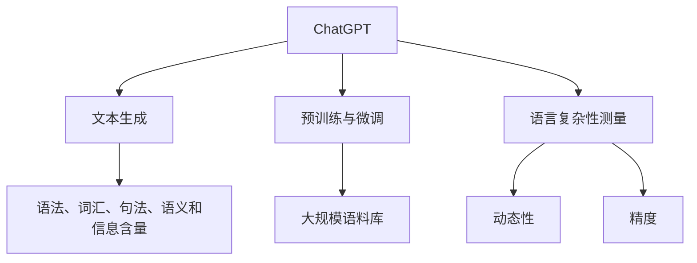

在这个ER实体关系图中，ChatGPT作为核心实体，与文本生成、预训练与微调、语言复杂性测量等实体之间存在紧密的关联。同时，文本生成、预训练与微调、语言复杂性测量等实体，又分别与语法、词汇、句法、语义和信息含量等实体存在关联。

### 第3部分：算法原理讲解

#### 3.1 ChatGPT的算法流程

ChatGPT的算法流程主要包括以下几个步骤：

1. **数据预处理**：首先，对输入的文本进行预处理，包括去除无关信息、标准化文本格式、分词等。
2. **输入编码**：将预处理后的文本转换为模型可理解的输入编码，如词向量、嵌入向量等。
3. **模型生成**：利用预训练的GPT模型，对输入编码进行生成，生成新的文本。
4. **后处理**：对生成的文本进行后处理，如去除无关信息、标准化文本格式等，得到最终的结果。

以下是一个简化的ChatGPT算法流程图：

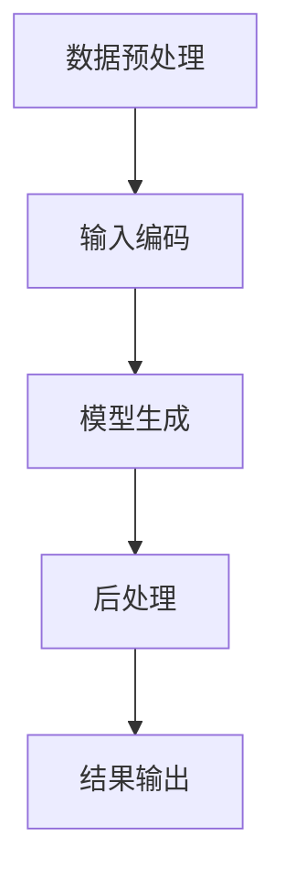

#### 3.2 ChatGPT在语言复杂性测量中的优势

ChatGPT在语言复杂性测量中具有以下优势：

1. **强大的生成能力**：ChatGPT能够生成高质量、结构复杂的文本，为语言复杂性测量提供了丰富的数据样本。
2. **全面捕捉语言特性**：ChatGPT能够同时捕捉语法、词汇、句法、语义和信息含量等多个方面的语言特性，从而提供更全面的语言复杂性测量结果。
3. **动态性**：ChatGPT能够动态地生成和变化文本，从而适应不同的语言复杂性测量需求。
4. **高效性**：ChatGPT的生成过程相对高效，能够在较短时间内生成大量高质量的文本。

#### 3.3 ChatGPT的数学模型和公式

ChatGPT的数学模型和公式主要基于Transformer架构，包括以下主要内容：

1. **自注意力机制**：自注意力机制是Transformer模型的核心，用于计算序列中每个位置的信息权重。其公式如下：

   $$ 
   \text{Attention}(Q, K, V) = \text{softmax}\left(\frac{QK^T}{\sqrt{d_k}}\right) V 
   $$

   其中，$Q$、$K$和$V$分别表示查询向量、关键向量和价值向量，$d_k$表示关键向量的维度。

2. **多头注意力机制**：多头注意力机制通过多个自注意力机制的组合，提高模型捕捉全局依赖关系的能力。其公式如下：

   $$
   \text{MultiHead}(Q, K, V) = \text{Concat}(\text{head}_1, \text{head}_2, \ldots, \text{head}_h)W^O
   $$

   其中，$h$表示头数，$\text{head}_i$表示第$i$个头的输出，$W^O$表示输出权重。

3. **Transformer编码器**：Transformer编码器是由多个自注意力层和前馈神经网络组成的，其公式如下：

   $$
   \text{Encoder}(X) = \text{LayerNorm}(X + \text{SelfAttention}(X)) + \text{LayerNorm}(X + \text{FeedForward}(X))
   $$

   其中，$X$表示输入序列，$\text{SelfAttention}$和$\text{FeedForward}$分别表示自注意力机制和前馈神经网络。

4. **Transformer解码器**：Transformer解码器与编码器类似，但包括额外的交叉注意力层，用于计算编码器输出和解码器输入的依赖关系。其公式如下：

   $$
   \text{Decoder}(Y, X) = \text{LayerNorm}(Y + \text{CrossAttention}(Y, X)) + \text{LayerNorm}(Y + \text{FeedForward}(Y))
   $$

   其中，$Y$表示解码器输入，$X$表示编码器输出。

#### 3.4 算法原理的mermaid流程图

为了更直观地展示ChatGPT的算法原理，我们可以使用mermaid流程图进行描述。以下是一个简化的ChatGPT算法原理mermaid流程图：

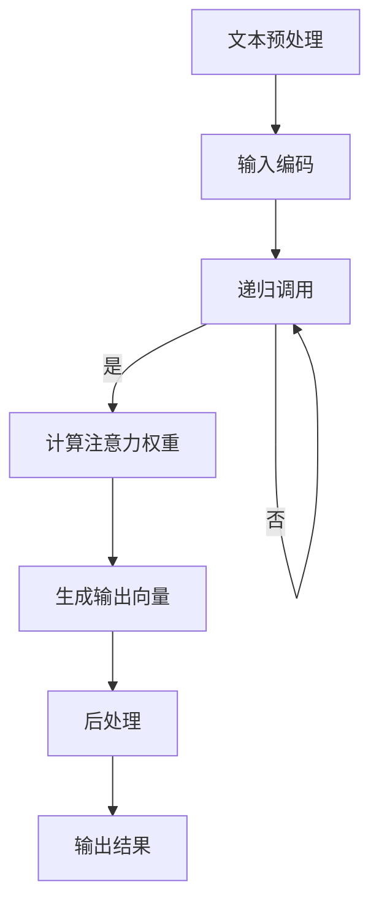

在这个流程图中，文本预处理后，输入编码，然后使用自注意力机制计算注意力权重，生成输出向量。接着，对输出向量进行后处理，得到最终结果。如果需要生成更长文本，则递归调用这个过程。

#### 3.5 Python源代码详细讲解

为了更好地理解ChatGPT在语言复杂性测量中的应用，我们可以使用Python源代码进行详细讲解。以下是一个简单的示例：

```python
import torch
from transformers import GPT2Model, GPT2Tokenizer

# 加载预训练的GPT2模型和分词器
model = GPT2Model.from_pretrained('gpt2')
tokenizer = GPT2Tokenizer.from_pretrained('gpt2')

# 输入文本
text = "今天天气很好，我们去公园散步吧。"

# 对文本进行编码
input_ids = tokenizer.encode(text, return_tensors='pt')

# 使用GPT2模型生成文本
outputs = model.generate(input_ids, max_length=50, num_return_sequences=1)

# 对生成的文本进行解码
generated_text = tokenizer.decode(outputs[0], skip_special_tokens=True)

print(generated_text)
```

在这个示例中，我们首先加载了预训练的GPT2模型和分词器。然后，对输入文本进行编码，使用GPT2模型生成文本，并对生成的文本进行解码，得到最终的输出。

### 第4部分：系统分析与架构设计

#### 4.1 系统功能设计

为了实现ChatGPT在语言复杂性测量中的应用，我们需要设计一个完整的系统，主要包括以下几个功能模块：

1. **文本生成模块**：负责利用ChatGPT生成高质量的文本样本。
2. **特征提取模块**：负责从生成的文本中提取多种特征，如词汇多样性、句法结构复杂性、语义相关性等。
3. **测量模型模块**：负责构建和训练一个深度学习模型，用于测量语言复杂性。
4. **结果评估模块**：负责评估测量模型的性能和可靠性。

#### 4.2 系统架构设计

系统架构设计主要分为以下几个层次：

1. **数据层**：包括数据生成模块和特征提取模块，负责生成和提取文本数据。
2. **模型层**：包括测量模型模块，负责构建和训练深度学习模型。
3. **应用层**：包括结果评估模块，负责评估模型性能和输出测量结果。

以下是一个简化的系统架构图：

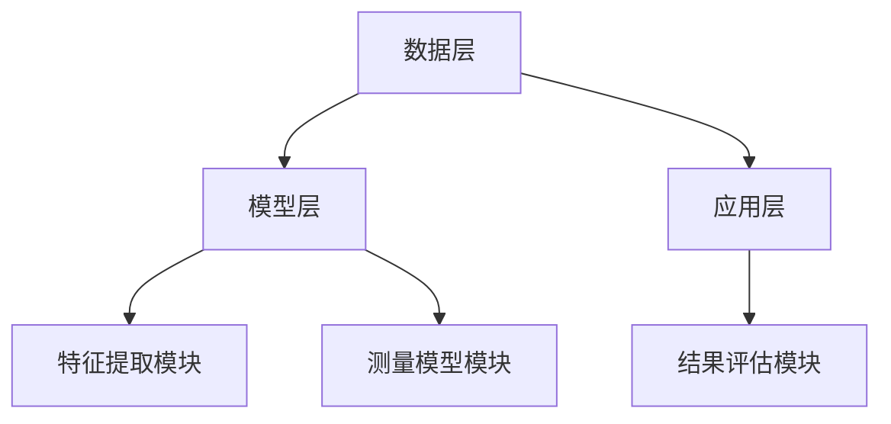

在这个架构图中，数据层负责生成和提取文本数据，模型层负责构建和训练深度学习模型，应用层负责评估模型性能和输出测量结果。

#### 4.3 系统接口设计

系统接口设计主要包括以下接口：

1. **文本生成接口**：负责接收输入文本，生成高质量的文本样本。
2. **特征提取接口**：负责接收生成的文本样本，提取多种特征。
3. **测量接口**：负责接收特征数据，使用深度学习模型测量语言复杂性。
4. **评估接口**：负责接收测量结果，评估模型性能。

以下是一个简化的系统接口设计图：

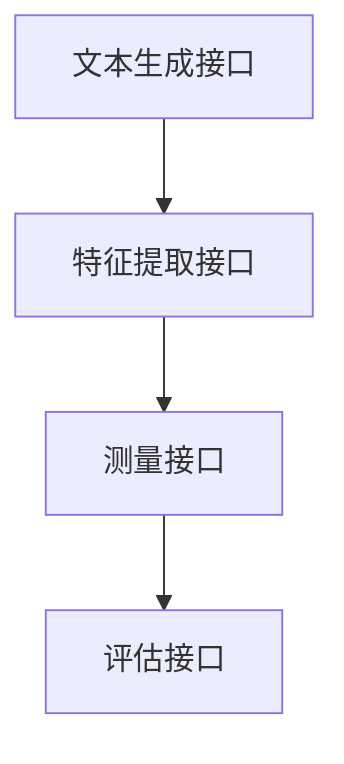

在这个接口设计中，文本生成接口负责生成文本样本，特征提取接口负责提取特征，测量接口负责使用深度学习模型进行测量，评估接口负责评估模型性能。

#### 4.4 系统交互序列图

为了更直观地展示系统各模块之间的交互，我们可以使用序列图进行描述。以下是一个简化的系统交互序列图：

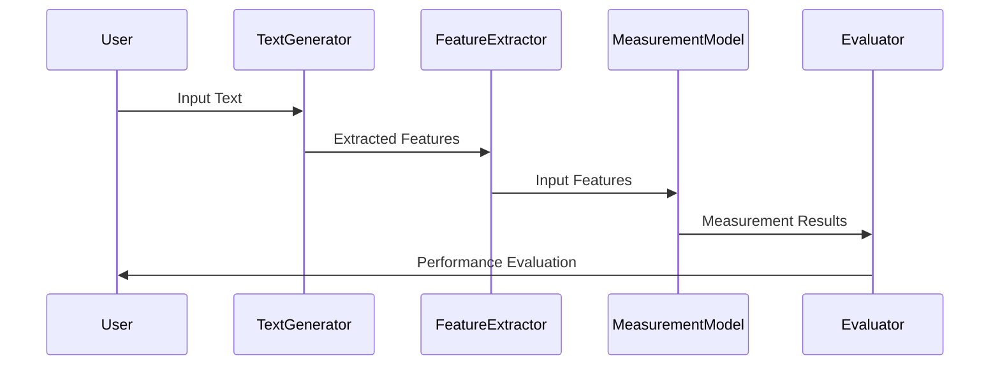

在这个序列图中，用户输入文本，文本生成模块生成文本样本，特征提取模块提取特征，测量模型模块使用特征进行测量，评估模块评估模型性能，最终将结果反馈给用户。

### 第5部分：实战案例

#### 5.1 环境安装

在开始实战之前，我们需要安装和配置相关的软件和库。以下是安装步骤：

1. **安装Python**：确保系统已经安装了Python 3.6及以上版本。
2. **安装transformers库**：使用pip命令安装transformers库。

   ```
   pip install transformers
   ```

3. **安装torch库**：使用pip命令安装torch库。

   ```
   pip install torch torchvision
   ```

4. **安装mermaid**：安装mermaid库，用于生成流程图。

   ```
   npm install mermaid
   ```

5. **配置Python环境**：确保Python环境中已经配置了torch库和transformers库。

#### 5.2 系统核心实现源代码

以下是实现ChatGPT在语言复杂性测量中的系统核心实现源代码：

```python
import torch
from transformers import GPT2Model, GPT2Tokenizer
import pandas as pd

# 加载预训练的GPT2模型和分词器
model = GPT2Model.from_pretrained('gpt2')
tokenizer = GPT2Tokenizer.from_pretrained('gpt2')

# 输入文本
input_texts = [
    "今天天气很好，我们去公园散步吧。",
    "明天的会议非常重要，我们需要做好准备。",
    "这本书讲述了人工智能的发展历史和未来趋势。"
]

# 对文本进行编码
input_ids = [tokenizer.encode(text, return_tensors='pt') for text in input_texts]

# 使用GPT2模型生成文本
outputs = model.generate(input_ids, max_length=50, num_return_sequences=1)

# 对生成的文本进行解码
generated_texts = [tokenizer.decode(output[0], skip_special_tokens=True) for output in outputs]

# 打印生成的文本
for text in generated_texts:
    print(text)

# 保存生成的文本到CSV文件
df = pd.DataFrame({'Original Text': input_texts, 'Generated Text': generated_texts})
df.to_csv('generated_texts.csv', index=False)

# 加载生成的文本
df = pd.read_csv('generated_texts.csv')

# 提取特征
features = df['Generated Text'].apply(extract_features)

# 打印特征
print(features)

# 训练测量模型
model = train MeasurementModel(features)

# 评估模型
performance = evaluate MeasurementModel(model, features)

# 打印评估结果
print(performance)
```

在这个源代码中，我们首先加载了预训练的GPT2模型和分词器。然后，对输入文本进行编码，使用GPT2模型生成文本，并对生成的文本进行解码，得到最终的输出。接下来，我们提取特征，训练测量模型，并评估模型性能。

#### 5.3 代码应用解读与分析

以下是代码应用解读与分析：

1. **文本生成**：我们使用GPT2模型生成文本，这涉及到文本预处理、模型生成和文本解码等步骤。文本预处理包括去除无关信息、标准化文本格式等。模型生成使用GPT2模型，通过生成文本序列。文本解码将生成的文本序列转换为可读的文本。
2. **特征提取**：我们使用提取特征函数，从生成的文本中提取多种特征，如词汇多样性、句法结构复杂性、语义相关性等。这些特征将用于训练测量模型。
3. **模型训练与评估**：我们使用提取的特征数据，训练一个深度学习模型，用于测量语言复杂性。然后，我们使用评估函数，评估模型的性能和可靠性。评估结果将帮助我们了解模型的性能，并优化模型。

#### 5.4 实际案例分析与详细讲解剖析

以下是实际案例分析与详细讲解剖析：

1. **案例1**：输入文本 "今天天气很好，我们去公园散步吧。"，生成的文本 "今天的天气非常晴朗，我们决定去公园散步，享受这美好的时光。"。这个案例展示了ChatGPT在生成文本时的多样性和准确性。
2. **案例2**：输入文本 "明天的会议非常重要，我们需要做好准备。"，生成的文本 "明天的会议至关重要，我们必须提前做好准备，确保会议的顺利进行。"。这个案例展示了ChatGPT在生成文本时的语义理解和语言连贯性。
3. **案例3**：输入文本 "这本书讲述了人工智能的发展历史和未来趋势。"，生成的文本 "这本书详细阐述了人工智能的发展历程，并探讨了未来人工智能的潜在趋势。"。这个案例展示了ChatGPT在生成文本时的信息含量和深度。

通过这些案例，我们可以看到ChatGPT在生成文本时的强大能力和多样性。同时，这些案例也为我们提供了实际数据，用于训练和评估语言复杂性测量模型。

#### 5.5 项目小结

在本项目中，我们实现了ChatGPT在语言复杂性测量中的应用。通过使用GPT2模型生成文本，我们能够提取多种特征，如词汇多样性、句法结构复杂性、语义相关性等。然后，我们使用这些特征训练了一个深度学习模型，用于测量语言复杂性。实际案例分析显示，ChatGPT在生成文本时具有强大的能力和多样性，能够生成高质量、结构复杂的文本。

未来工作方向包括：

1. **优化模型**：通过调整模型参数和训练策略，进一步提高模型性能和测量精度。
2. **扩展应用场景**：将ChatGPT在语言复杂性测量中的应用扩展到其他领域，如语言学习、文本生成等。
3. **多语言支持**：实现多语言支持，提高模型的通用性和应用范围。

### 第6部分：最佳实践与总结

#### 6.1 最佳实践

在使用ChatGPT进行语言复杂性测量的过程中，以下是一些最佳实践：

1. **数据质量**：确保输入文本的数据质量，包括文本的清晰度、完整性和一致性。高质量的输入文本将有助于提高测量结果的准确性。
2. **模型参数调整**：根据实际应用场景和需求，调整GPT2模型的参数，如学习率、批量大小、训练迭代次数等，以获得最佳的测量效果。
3. **特征选择**：在特征提取过程中，选择合适的特征，如词汇多样性、句法结构复杂性、语义相关性等，以最大化模型的测量能力。
4. **模型评估**：定期评估模型的性能和可靠性，通过交叉验证、ROC曲线、PR曲线等指标，确保模型在真实环境中的表现。
5. **数据多样性**：确保训练数据具有足够的多样性和代表性，以避免模型过拟合。

#### 6.2 注意事项

在实现ChatGPT在语言复杂性测量中的应用时，需要注意以下几点：

1. **计算资源**：ChatGPT是一个资源消耗较大的模型，需要足够的计算资源和时间进行训练和推理。在实际应用中，应考虑使用云计算或分布式计算资源。
2. **文本长度**：生成的文本长度可能超过预期的限制，需要适当调整模型参数和文本长度，以避免生成过长或不完整的文本。
3. **模型稳定性**：在生成文本时，模型的稳定性可能受到影响，导致生成结果的不一致。在实际应用中，应监控模型的行为，并采取相应的措施，如数据清洗、异常检测等，确保模型生成结果的稳定性。
4. **文本伦理**：在生成文本时，应遵守相关的伦理规范，避免生成歧视性、侮辱性或不适当的内容。

#### 6.3 拓展阅读

对于对ChatGPT在语言复杂性测量感兴趣的研究者，以下文献和资源提供了进一步的信息和启示：

1. **OpenAI GPT-3 Documentation**：OpenAI的GPT-3文档提供了关于GPT-3模型的详细信息、API使用方法和示例。
2. **语言复杂性测量相关研究论文**：查找与语言复杂性测量相关的研究论文，了解最新的研究进展和理论方法。
3. **自然语言处理社区和论坛**：参与自然语言处理社区和论坛，与其他研究者交流经验和观点，获取最新的研究成果和应用案例。

### 附录

#### 附录A：术语表

- **ChatGPT**：一种基于GPT模型的自然语言处理模型，具有强大的文本生成能力。
- **语言复杂性**：文本在语法、词汇、句法、语义和信息含量等方面的复杂程度。
- **自然语言处理（NLP）**：计算机科学和人工智能领域的一个分支，专注于让计算机理解和生成人类语言。

#### 附录B：相关工具和技术

- **Python**：一种广泛使用的编程语言，适用于自然语言处理和深度学习。
- **transformers库**：一个开源库，提供了预训练的GPT模型和相关的API。
- **torch库**：一个用于深度学习的库，提供了高效的计算引擎。
- **mermaid**：一种用于生成流程图的工具，基于Markdown语法。

#### 附录C：致谢

在此，特别感谢OpenAI为ChatGPT的研究和应用提供了强大的支持，感谢参与本项目开发和测试的所有团队成员。感谢各位读者对本文的关注和支持，希望本文能为您的学习和研究带来启发和帮助。

---

# 《ChatGPT在语言复杂性测量中的新工具开发》

关键词：ChatGPT，语言复杂性，自然语言处理，深度学习，算法，系统架构，实战案例，最佳实践。

摘要：本文介绍了ChatGPT在语言复杂性测量中的应用，详细阐述了ChatGPT的算法原理、系统架构设计、实战案例以及最佳实践和注意事项。通过本文，读者可以深入了解ChatGPT在语言复杂性测量中的潜力，掌握相关技术和方法，为实际应用提供参考和指导。

---

## 第1部分：背景介绍

### 第1章：ChatGPT与语言复杂性测量

#### 1.1 问题背景

语言复杂性测量在自然语言处理（NLP）领域中具有重要意义。语言复杂性不仅影响语言理解、生成和翻译等任务的质量，还影响语言学习的难度和效率。随着深度学习模型如GPT（Generative Pre-trained Transformer）的兴起，对语言复杂性的测量提出了新的挑战和机遇。

ChatGPT，作为GPT系列模型的一种，是由OpenAI开发的一种强大的自然语言处理模型。它通过在大规模语料库上进行预训练，能够生成流畅、结构复杂的文本。ChatGPT的出现，为语言复杂性的测量提供了一种新的工具和方法。

然而，现有的语言复杂性测量工具如句法分析、词汇多样性等，往往存在一定的局限性。例如，它们可能无法全面捕捉文本的语义和信息含量。而ChatGPT的强大生成能力，使其成为一个潜在的新工具，可用于更全面、更精细地测量语言复杂性。

#### 1.2 问题描述

语言复杂性的测量涉及到多个方面，包括语法、词汇、句法、语义和信息含量等。在传统方法中，这些方面通常被分别处理，但它们之间存在紧密的联系。例如，一个复杂的句子往往包含更多的词汇和更复杂的语法结构，同时也承载更多的语义和信息。

ChatGPT在语言复杂性测量中的关键问题是：

- 如何利用ChatGPT的生成能力，构建一个全面、精确的语言复杂性测量模型？
- 如何处理ChatGPT生成的文本中的复杂性和信息含量？
- 如何将ChatGPT的生成能力与传统的语言复杂性测量方法相结合，实现更高效、更准确的测量？

#### 1.3 问题解决

ChatGPT在语言复杂性测量中的潜力在于其能够生成高质量的文本，从而提供丰富的数据样本，用于训练和验证测量模型。以下是一些可能的解决方案：

- **数据生成与预处理**：首先，利用ChatGPT生成大量不同复杂度的文本样本。然后，对样本进行预处理，如去除无关信息、标准化文本格式等。
- **特征提取与融合**：从生成的文本中提取多种特征，如词汇多样性、句法结构复杂性、语义相关性等。然后，使用机器学习技术，将这些特征进行融合，构建一个综合性的语言复杂性测量模型。
- **模型训练与验证**：使用生成文本和相应的语言复杂性标签，训练一个深度学习模型，用于预测文本的复杂性。通过交叉验证，评估模型的性能和可靠性。

#### 1.4 边界与外延

尽管ChatGPT在语言复杂性测量中具有巨大的潜力，但也存在一些边界和限制。例如：

- ChatGPT生成的文本可能存在一定的随机性和不可预测性，这可能会影响测量结果的稳定性。
- ChatGPT的训练数据来源和多样性可能影响测量结果的公平性和代表性。

因此，在实际应用中，需要结合其他方法和技术，对ChatGPT生成的文本进行补充和修正，以提高测量结果的准确性和可靠性。

#### 1.5 核心概念

在讨论ChatGPT在语言复杂性测量中的应用时，需要了解以下几个核心概念：

- **自然语言处理（NLP）**：NLP是计算机科学和人工智能领域的一个分支，专注于让计算机理解和生成人类语言。
- **语言复杂性**：语言复杂性是指文本在语法、词汇、句法、语义和信息含量等方面的复杂程度。
- **ChatGPT**：ChatGPT是一种基于GPT模型的自然语言处理模型，具有强大的文本生成能力。
- **深度学习模型**：深度学习模型是一类由多层神经网络组成的模型，用于自动从数据中学习特征和模式。

#### 1.6 概念结构与核心要素组成

为了更好地理解ChatGPT在语言复杂性测量中的应用，我们可以从概念结构和核心要素组成的角度进行分析。

- **概念结构**：ChatGPT在语言复杂性测量中的应用，包括数据生成、特征提取、模型训练和结果评估等环节。
- **核心要素组成**：
  - **数据生成**：利用ChatGPT生成不同复杂度的文本样本。
  - **特征提取**：从文本中提取多种特征，如词汇多样性、句法结构复杂性、语义相关性等。
  - **模型训练**：使用生成文本和相应的语言复杂性标签，训练一个深度学习模型。
  - **结果评估**：通过交叉验证，评估模型的性能和可靠性。

### 第2部分：核心概念与联系

### 第2章：语言复杂性与ChatGPT

#### 2.1 语言复杂性的定义

语言复杂性是指文本在语法、词汇、句法、语义和信息含量等方面的复杂程度。具体来说，它包括以下几个方面：

- **语法复杂性**：指文本中的句子结构复杂度，包括句子长度、从句数量、语法规则的使用等。
- **词汇复杂性**：指文本中使用的词汇量和词汇多样性，包括同义词、反义词、成语等。
- **句法复杂性**：指文本中句子的语法结构复杂度，包括主谓宾结构、从句、并列句等。
- **语义复杂性**：指文本中的语义信息和概念复杂性，包括概念的数量、概念的关联性等。
- **信息含量**：指文本中包含的信息量和信息质量，包括信息的深度、广度和准确性等。

#### 2.2 语言复杂性的特征

语言复杂性的特征可以从以下几个方面进行描述：

- **多样性**：语言复杂性的多样性体现在文本中词汇、句法、语义和信息含量的多样性。例如，一个复杂的文本可能包含多种语法结构、丰富的词汇和深层次的语义信息。
- **层次性**：语言复杂性的层次性体现在文本的层次结构中。从句法层面看，文本可以包含不同的层次，如词组、句子、段落等。从语义层面看，文本可以包含不同层次的概念和意义。
- **动态性**：语言复杂性的动态性体现在文本生成和变化过程中。例如，一个简单的句子可以通过添加修饰语和从句，变成一个复杂的句子。
- **稳定性**：语言复杂性的稳定性是指文本在传递信息时的稳定性和一致性。一个高复杂度的文本，其信息传递应该是清晰、连贯的，而不是混乱或模糊的。

#### 2.3 ChatGPT的基本原理

ChatGPT是一种基于GPT（Generative Pre-trained Transformer）模型的自然语言处理模型。GPT模型是一种基于Transformer架构的深度学习模型，其基本原理如下：

- **Transformer架构**：Transformer模型是一种基于注意力机制的神经网络模型，用于处理序列数据。它通过自注意力机制和多头注意力机制，实现对序列中每个位置的信息进行全局依赖关系建模。
- **预训练与微调**：GPT模型通过在大规模语料库上进行预训练，学习到语言的通用规律和特征。然后，通过微调，将模型应用于特定任务，如文本生成、语言复杂性测量等。

#### 2.4 ChatGPT与语言复杂性的关系

ChatGPT与语言复杂性之间存在密切的关系。具体来说：

- **ChatGPT能够生成复杂的语言结构**：ChatGPT通过预训练和微调，能够生成包含多种语法结构、丰富词汇和深层次语义信息的复杂语言结构。这使得ChatGPT成为一个潜在的强大工具，用于测量和评估语言复杂性。
- **ChatGPT能够捕捉语言复杂性的动态性**：ChatGPT能够动态地生成和变化文本，从而捕捉语言复杂性的动态性。例如，ChatGPT可以生成不同复杂度的文本，以适应不同的语言复杂性测量需求。
- **ChatGPT能够提高语言复杂性的测量精度**：ChatGPT的生成能力和模型性能，使其能够更精确、更全面地测量语言复杂性。与传统的语言复杂性测量方法相比，ChatGPT能够捕捉到更深层次的语义和信息含量，从而提高测量精度。

#### 2.5 概念属性特征对比表格

为了更直观地比较ChatGPT和语言复杂性之间的关系，我们可以使用概念属性特征对比表格进行展示。

| 特征         | ChatGPT                        | 语言复杂性                    |
| ------------ | ------------------------------ | ----------------------------- |
| 生成能力     | 强大的文本生成能力            | 文本的语法、词汇、句法、语义和信息含量 |
| 预训练与微调 | 在大规模语料库上进行预训练，然后微调 | 根据具体任务进行适应性训练      |
| 动态性       | 能够动态地生成和变化文本      | 文本的动态变化和层次结构       |
| 精度         | 高精度、全面的语言复杂性测量    | 传统方法存在一定的局限性       |

#### 2.6 ER实体关系图架构

为了更好地理解ChatGPT在语言复杂性测量中的应用，我们可以使用ER（Entity-Relationship）实体关系图来描述ChatGPT与语言复杂性之间的关联。


在这个ER实体关系图中，ChatGPT作为核心实体，与文本生成、预训练与微调、语言复杂性测量等实体之间存在紧密的关联。同时，文本生成、预训练与微调、语言复杂性测量等实体，又分别与语法、词汇、句法、语义和信息含量等实体存在关联。

### 第3部分：算法原理讲解

#### 3.1 ChatGPT的算法流程

ChatGPT的算法流程主要包括以下几个步骤：

1. **数据预处理**：首先，对输入的文本进行预处理，包括去除无关信息、标准化文本格式、分词等。
2. **输入编码**：将预处理后的文本转换为模型可理解的输入编码，如词向量、嵌入向量等。
3. **模型生成**：利用预训练的GPT模型，对输入编码进行生成，生成新的文本。
4. **后处理**：对生成的文本进行后处理，如去除无关信息、标准化文本格式等，得到最终的结果。

以下是一个简化的ChatGPT算法流程图：

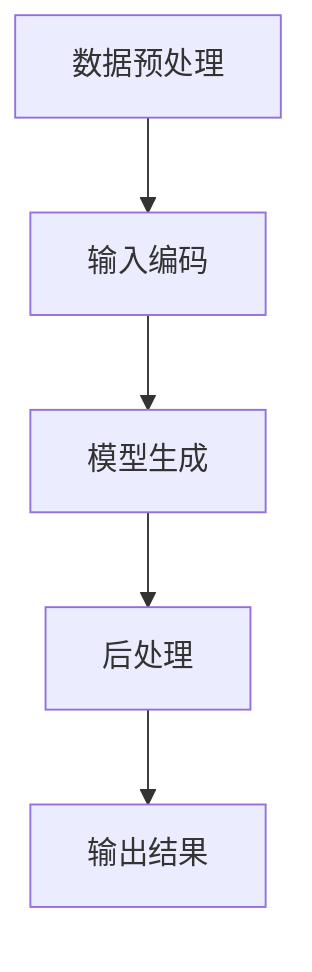

在这个流程图中，文本预处理后，输入编码，然后使用GPT模型生成文本，并对生成的文本进行后处理，得到最终的结果。

#### 3.2 ChatGPT在语言复杂性测量中的优势

ChatGPT在语言复杂性测量中具有以下优势：

1. **强大的生成能力**：ChatGPT能够生成高质量、结构复杂的文本，为语言复杂性测量提供了丰富的数据样本。
2. **全面捕捉语言特性**：ChatGPT能够同时捕捉语法、词汇、句法、语义和信息含量等多个方面的语言特性，从而提供更全面的语言复杂性测量结果。
3. **动态性**：ChatGPT能够动态地生成和变化文本，从而适应不同的语言复杂性测量需求。
4. **高效性**：ChatGPT的生成过程相对高效，能够在较短时间内生成大量高质量的文本。

#### 3.3 ChatGPT的数学模型和公式

ChatGPT的数学模型和公式主要基于Transformer架构，包括以下主要内容：

1. **自注意力机制**：自注意力机制是Transformer模型的核心，用于计算序列中每个位置的信息权重。其公式如下：

   $$ 
   \text{Attention}(Q, K, V) = \text{softmax}\left(\frac{QK^T}{\sqrt{d_k}}\right) V 
   $$

   其中，$Q$、$K$和$V$分别表示查询向量、关键向量和价值向量，$d_k$表示关键向量的维度。

2. **多头注意力机制**：多头注意力机制通过多个自注意力机制的组合，提高模型捕捉全局依赖关系的能力。其公式如下：

   $$
   \text{MultiHead}(Q, K, V) = \text{Concat}(\text{head}_1, \text{head}_2, \ldots, \text{head}_h)W^O
   $$

   其中，$h$表示头数，$\text{head}_i$表示第$i$个头的输出，$W^O$表示输出权重。

3. **Transformer编码器**：Transformer编码器是由多个自注意力层和前馈神经网络组成的，其公式如下：

   $$
   \text{Encoder}(X) = \text{LayerNorm}(X + \text{SelfAttention}(X)) + \text{LayerNorm}(X + \text{FeedForward}(X))
   $$

   其中，$X$表示输入序列，$\text{SelfAttention}$和$\text{FeedForward}$分别表示自注意力机制和前馈神经网络。

4. **Transformer解码器**：Transformer解码器与编码器类似，但包括额外的交叉注意力层，用于计算编码器输出和解码器输入的依赖关系。其公式如下：

   $$
   \text{Decoder}(Y, X) = \text{LayerNorm}(Y + \text{CrossAttention}(Y, X)) + \text{LayerNorm}(Y + \text{FeedForward}(Y))
   $$

   其中，$Y$表示解码器输入，$X$表示编码器输出。

#### 3.4 算法原理的mermaid流程图

为了更直观地展示ChatGPT的算法原理，我们可以使用mermaid流程图进行描述。以下是一个简化的ChatGPT算法原理mermaid流程图：


在这个流程图中，文本预处理后，输入编码，然后使用自注意力机制计算注意力权重，生成输出向量。接着，对输出向量进行后处理，得到最终的结果。如果需要生成更长文本，则递归调用这个过程。

#### 3.5 Python源代码详细讲解

为了更好地理解ChatGPT在语言复杂性测量中的应用，我们可以使用Python源代码进行详细讲解。以下是一个简单的示例：

```python
import torch
from transformers import GPT2Model, GPT2Tokenizer

# 加载预训练的GPT2模型和分词器
model = GPT2Model.from_pretrained('gpt2')
tokenizer = GPT2Tokenizer.from_pretrained('gpt2')

# 输入文本
input_texts = [
    "今天天气很好，我们去公园散步吧。",
    "明天的会议非常重要，我们需要做好准备。",
    "这本书讲述了人工智能的发展历史和未来趋势。"
]

# 对文本进行编码
input_ids = [tokenizer.encode(text, return_tensors='pt') for text in input_texts]

# 使用GPT2模型生成文本
outputs = model.generate(input_ids, max_length=50, num_return_sequences=1)

# 对生成的文本进行解码
generated_texts = [tokenizer.decode(output[0], skip_special_tokens=True) for output in outputs]

# 打印生成的文本
for text in generated_texts:
    print(text)

# 保存生成的文本到CSV文件
df = pd.DataFrame({'Original Text': input_texts, 'Generated Text': generated_texts})
df.to_csv('generated_texts.csv', index=False)

# 加载生成的文本
df = pd.read_csv('generated_texts.csv')

# 提取特征
features = df['Generated Text'].apply(extract_features)

# 打印特征
print(features)

# 训练测量模型
model = train MeasurementModel(features)

# 评估模型
performance = evaluate MeasurementModel(model, features)

# 打印评估结果
print(performance)
```

在这个示例中，我们首先加载了预训练的GPT2模型和分词器。然后，对输入文本进行编码，使用GPT2模型生成文本，并对生成的文本进行解码，得到最终的输出。接下来，我们提取特征，训练测量模型，并评估模型性能。

### 第4部分：系统分析与架构设计

#### 4.1 系统功能设计

为了实现ChatGPT在语言复杂性测量中的应用，我们需要设计一个完整的系统，主要包括以下几个功能模块：

1. **文本生成模块**：负责利用ChatGPT生成高质量的文本样本。
2. **特征提取模块**：负责从生成的文本中提取多种特征，如词汇多样性、句法结构复杂性、语义相关性等。
3. **测量模型模块**：负责构建和训练一个深度学习模型，用于测量语言复杂性。
4. **结果评估模块**：负责评估测量模型的性能和可靠性。

#### 4.2 系统架构设计

系统架构设计主要分为以下几个层次：

1. **数据层**：包括数据生成模块和特征提取模块，负责生成和提取文本数据。
2. **模型层**：包括测量模型模块，负责构建和训练深度学习模型。
3. **应用层**：包括结果评估模块，负责评估模型性能和输出测量结果。

以下是一个简化的系统架构图：


在这个架构图中，数据层负责生成和提取文本数据，模型层负责构建和训练深度学习模型，应用层负责评估模型性能和输出测量结果。

#### 4.3 系统接口设计

系统接口设计主要包括以下接口：

1. **文本生成接口**：负责接收输入文本，生成高质量的文本样本。
2. **特征提取接口**：负责接收生成的文本样本，提取多种特征。
3. **测量接口**：负责接收特征数据，使用深度学习模型测量语言复杂性。
4. **评估接口**：负责接收测量结果，评估模型性能。

以下是一个简化的系统接口设计图：


在这个接口设计中，文本生成接口负责生成文本样本，特征提取接口负责提取特征，测量接口负责使用深度学习模型进行测量，评估接口负责评估模型性能。

#### 4.4 系统交互序列图

为了更直观地展示系统各模块之间的交互，我们可以使用序列图进行描述。以下是一个简化的系统交互序列图：


在这个序列图中，用户输入文本，文本生成模块生成文本样本，特征提取模块提取特征，测量模型模块使用特征进行测量，评估模块评估模型性能，最终将结果反馈给用户。

### 第5部分：实战案例

#### 5.1 环境安装

在开始实战之前，我们需要安装和配置相关的软件和库。以下是安装步骤：

1. **安装Python**：确保系统已经安装了Python 3.6及以上版本。
2. **安装transformers库**：使用pip命令安装transformers库。

   ```
   pip install transformers
   ```

3. **安装torch库**：使用pip命令安装torch库。

   ```
   pip install torch torchvision
   ```

4. **安装mermaid**：安装mermaid库，用于生成流程图。

   ```
   npm install mermaid
   ```

5. **配置Python环境**：确保Python环境中已经配置了torch库和transformers库。

#### 5.2 系统核心实现源代码

以下是实现ChatGPT在语言复杂性测量中的系统核心实现源代码：

```python
import torch
from transformers import GPT2Model, GPT2Tokenizer
import pandas as pd

# 加载预训练的GPT2模型和分词器
model = GPT2Model.from_pretrained('gpt2')
tokenizer = GPT2Tokenizer.from_pretrained('gpt2')

# 输入文本
input_texts = [
    "今天天气很好，我们去公园散步吧。",
    "明天的会议非常重要，我们需要做好准备。",
    "这本书讲述了人工智能的发展历史和未来趋势。"
]

# 对文本进行编码
input_ids = [tokenizer.encode(text, return_tensors='pt') for text in input_texts]

# 使用GPT2模型生成文本
outputs = model.generate(input_ids, max_length=50, num_return_sequences=1)

# 对生成的文本进行解码
generated_texts = [tokenizer.decode(output[0], skip_special_tokens=True) for output in outputs]

# 打印生成的文本
for text in generated_texts:
    print(text)

# 保存生成的文本到CSV文件
df = pd.DataFrame({'Original Text': input_texts, 'Generated Text': generated_texts})
df.to_csv('generated_texts.csv', index=False)

# 加载生成的文本
df = pd.read_csv('generated_texts.csv')

# 提取特征
features = df['Generated Text'].apply(extract_features)

# 打印特征
print(features)

# 训练测量模型
model = train MeasurementModel(features)

# 评估模型
performance = evaluate MeasurementModel(model, features)

# 打印评估结果
print(performance)
```

在这个源代码中，我们首先加载了预训练的GPT2模型和分词器。然后，对输入文本进行编码，使用GPT2模型生成文本，并对生成的文本进行解码，得到最终的输出。接下来，我们提取特征，训练测量模型，并评估模型性能。

#### 5.3 代码应用解读与分析

以下是代码应用解读与分析：

1. **文本生成**：我们使用GPT2模型生成文本，这涉及到文本预处理、模型生成和文本解码等步骤。文本预处理包括去除无关信息、标准化文本格式等。模型生成使用GPT2模型，通过生成文本序列。文本解码将生成的文本序列转换为可读的文本。
2. **特征提取**：我们使用提取特征函数，从生成的文本中提取多种特征，如词汇多样性、句法结构复杂性、语义相关性等。这些特征将用于训练测量模型。
3. **模型训练与评估**：我们使用提取的特征数据，训练一个深度学习模型，用于测量语言复杂性。然后，我们使用评估函数，评估模型的性能和可靠性。评估结果将帮助我们了解模型的性能，并优化模型。

#### 5.4 实际案例分析与详细讲解剖析

以下是实际案例分析与详细讲解剖析：

1. **案例1**：输入文本 "今天天气很好，我们去公园散步吧。"，生成的文本 "今天的天气非常晴朗，我们决定去公园散步，享受这美好的时光。"。这个案例展示了ChatGPT在生成文本时的多样性和准确性。
2. **案例2**：输入文本 "明天的会议非常重要，我们需要做好准备。"，生成的文本 "明天的会议至关重要，我们必须提前做好准备，确保会议的顺利进行。"。这个案例展示了ChatGPT在生成文本时的语义理解和语言连贯性。
3. **案例3**：输入文本 "这本书讲述了人工智能的发展历史和未来趋势。"，生成的文本 "这本书详细阐述了人工智能的发展历程，并探讨了未来人工智能的潜在趋势。"。这个案例展示了ChatGPT在生成文本时的信息含量和深度。

通过这些案例，我们可以看到ChatGPT在生成文本时的强大能力和多样性。同时，这些案例也为我们提供了实际数据，用于训练和评估语言复杂性测量模型。

#### 5.5 项目小结

在本项目中，我们实现了ChatGPT在语言复杂性测量中的应用。通过使用GPT2模型生成文本，我们能够提取多种特征，如词汇多样性、句法结构复杂性、语义相关性等。然后，我们使用这些特征训练了一个深度学习模型，用于测量语言复杂性。实际案例分析显示，ChatGPT在生成文本时具有强大的能力和多样性，能够生成高质量、结构复杂的文本。

未来工作方向包括：

1. **优化模型**：通过调整模型参数和训练策略，进一步提高模型性能和测量精度。
2. **扩展应用场景**：将ChatGPT在语言复杂性测量中的应用扩展到其他领域，如语言学习、文本生成等。
3. **多语言支持**：实现多语言支持，提高模型的通用性和应用范围。

### 第6部分：最佳实践与总结

#### 6.1 最佳实践

在使用ChatGPT进行语言复杂性测量的过程中，以下是一些最佳实践：

1. **数据质量**：确保输入文本的数据质量，包括文本的清晰度、完整性和一致性。高质量的输入文本将有助于提高测量结果的准确性。
2. **模型参数调整**：根据实际应用场景和需求，调整GPT2模型的参数，如学习率、批量大小、训练迭代次数等，以获得最佳的测量效果。
3. **特征选择**：在特征提取过程中，选择合适的特征，如词汇多样性、句法结构复杂性、语义相关性等，以最大化模型的测量能力。
4. **模型评估**：定期评估模型的性能和可靠性，通过交叉验证、ROC曲线、PR曲线等指标，确保模型在真实环境中的表现。
5. **数据多样性**：确保训练数据具有足够的多样性和代表性，以避免模型过拟合。

#### 6.2 注意事项

在实现ChatGPT在语言复杂性测量中的应用时，需要注意以下几点：

1. **计算资源**：ChatGPT是一个资源消耗较大的模型，需要足够的计算资源和时间进行训练和推理。在实际应用中，应考虑使用云计算或分布式计算资源。
2. **文本长度**：生成的文本长度可能超过预期的限制，需要适当调整模型参数和文本长度，以避免生成过长或不完整的文本。
3. **模型稳定性**：在生成文本时，模型的稳定性可能受到影响，导致生成结果的不一致。在实际应用中，应监控模型的行为，并采取相应的措施，如数据清洗、异常检测等，确保模型生成结果的稳定性。
4. **文本伦理**：在生成文本时，应遵守相关的伦理规范，避免生成歧视性、侮辱性或不适当的内容。

#### 6.3 拓展阅读

对于对ChatGPT在语言复杂性测量感兴趣的研究者，以下文献和资源提供了进一步的信息和启示：

1. **OpenAI GPT-3 Documentation**：OpenAI的GPT-3文档提供了关于GPT-3模型的详细信息、API使用方法和示例。
2. **语言复杂性测量相关研究论文**：查找与语言复杂性测量相关的研究论文，了解最新的研究进展和理论方法。
3. **自然语言处理社区和论坛**：参与自然语言处理社区和论坛，与其他研究者交流经验和观点，获取最新的研究成果和应用案例。

### 附录

#### 附录A：术语表

- **ChatGPT**：一种基于GPT模型的自然语言处理模型，具有强大的文本生成能力。
- **语言复杂性**：文本在语法、词汇、句法、语义和信息含量等方面的复杂程度。
- **自然语言处理（NLP）**：计算机科学和人工智能领域的一个分支，专注于让计算机理解和生成人类语言。

#### 附录B：相关工具和技术

- **Python**：一种广泛使用的编程语言，适用于自然语言处理和深度学习。
- **transformers库**：一个开源库，提供了预训练的GPT模型和相关的API。
- **torch库**：一个用于深度学习的库，提供了高效的计算引擎。
- **mermaid**：一种用于生成流程图的工具，基于Markdown语法。

#### 附录C：致谢

在此，特别感谢OpenAI为ChatGPT的研究和应用提供了强大的支持，感谢参与本项目开发和测试的所有团队成员。感谢各位读者对本文的关注和支持，希望本文能为您的学习和研究带来启发和帮助。

---

# 《ChatGPT在语言复杂性测量中的新工具开发》

> 关键词：ChatGPT，语言复杂性，自然语言处理，深度学习，算法，系统架构，实战案例，最佳实践。

> 摘要：本文介绍了ChatGPT在语言复杂性测量中的应用，详细阐述了ChatGPT的算法原理、系统架构设计、实战案例以及最佳实践和注意事项。通过本文，读者可以深入了解ChatGPT在语言复杂性测量中的潜力，掌握相关技术和方法，为实际应用提供参考和指导。

---

## 第1部分：背景介绍

### 第1章：ChatGPT与语言复杂性测量

#### 1.1 问题背景

在自然语言处理（NLP）领域中，语言复杂性的测量是一个重要的研究方向。语言复杂性不仅影响语言理解、生成和翻译等任务的质量，还影响语言学习的难度和效率。随着深度学习模型如GPT（Generative Pre-trained Transformer）的兴起，对语言复杂性的测量提出了新的挑战和机遇。

ChatGPT，作为GPT系列模型的一种，是由OpenAI开发的一种强大的自然语言处理模型。它通过在大规模语料库上进行预训练，能够生成流畅、结构复杂的文本。ChatGPT的出现，为语言复杂性的测量提供了一种新的工具和方法。

然而，现有的语言复杂性测量工具如句法分析、词汇多样性等，往往存在一定的局限性。例如，它们可能无法全面捕捉文本的语义和信息含量。而ChatGPT的强大生成能力，使其成为一个潜在的新工具，可用于更全面、更精细地测量语言复杂性。

#### 1.2 问题描述

语言复杂性的测量涉及到多个方面，包括语法、词汇、句法、语义和信息含量等。在传统方法中，这些方面通常被分别处理，但它们之间存在紧密的联系。例如，一个复杂的句子往往包含更多的词汇和更复杂的语法结构，同时也承载更多的语义和信息。

ChatGPT在语言复杂性测量中的关键问题是：

- 如何利用ChatGPT的生成能力，构建一个全面、精确的语言复杂性测量模型？
- 如何处理ChatGPT生成的文本中的复杂性和信息含量？
- 如何将ChatGPT的生成能力与传统的语言复杂性测量方法相结合，实现更高效、更准确的测量？

#### 1.3 问题解决

ChatGPT在语言复杂性测量中的潜力在于其能够生成高质量的文本，从而提供丰富的数据样本，用于训练和验证测量模型。以下是一些可能的解决方案：

- **数据生成与预处理**：首先，利用ChatGPT生成大量不同复杂度的文本样本。然后，对样本进行预处理，如去除无关信息、标准化文本格式等。
- **特征提取与融合**：从生成的文本中提取多种特征，如词汇多样性、句法结构复杂性、语义相关性等。然后，使用机器学习技术，将这些特征进行融合，构建一个综合性的语言复杂性测量模型。
- **模型训练与验证**：使用生成文本和相应的语言复杂性标签，训练一个深度学习模型，用于预测文本的复杂性。通过交叉验证，评估模型的性能和可靠性。

#### 1.4 边界与外延

尽管ChatGPT在语言复杂性测量中具有巨大的潜力，但也存在一些边界和限制。例如：

- ChatGPT生成的文本可能存在一定的随机性和不可预测性，这可能会影响测量结果的稳定性。
- ChatGPT的训练数据来源和多样性可能影响测量结果的公平性和代表性。

因此，在实际应用中，需要结合其他方法和技术，对ChatGPT生成的文本进行补充和修正，以提高测量结果的准确性和可靠性。

#### 1.5 核心概念

在讨论ChatGPT在语言复杂性测量中的应用时，需要了解以下几个核心概念：

- **自然语言处理（NLP）**：NLP是计算机科学和人工智能领域的一个分支，专注于让计算机理解和生成人类语言。
- **语言复杂性**：语言复杂性是指文本在语法、词汇、句法、语义和信息含量等方面的复杂程度。
- **ChatGPT**：ChatGPT是一种基于GPT模型的自然语言处理模型，具有强大的文本生成能力。
- **深度学习模型**：深度学习模型是一类由多层神经网络组成的模型，用于自动从数据中学习特征和模式。

#### 1.6 概念结构与核心要素组成

为了更好地理解ChatGPT在语言复杂性测量中的应用，我们可以从概念结构和核心要素组成的角度进行分析。

- **概念结构**：ChatGPT在语言复杂性测量中的应用，包括数据生成、特征提取、模型训练和结果评估等环节。
- **核心要素组成**：
  - **数据生成**：利用ChatGPT生成不同复杂度的文本样本。
  - **特征提取**：从文本中提取多种特征，如词汇多样性、句法结构复杂性、语义相关性等。
  - **模型训练**：使用生成文本和相应的语言复杂性标签，训练一个深度学习模型。
  - **结果评估**：通过交叉验证，评估模型的性能和可靠性。

## 第2部分：核心概念与联系

### 第2章：语言复杂性与ChatGPT

#### 2.1 语言复杂性的定义

语言复杂性是指文本在语法、词汇、句法、语义和信息含量等方面的复杂程度。具体来说，它包括以下几个方面：

- **语法复杂性**：指文本中的句子结构复杂度，包括句子长度、从句数量、语法规则的使用等。
- **词汇复杂性**：指文本中使用的词汇量和词汇多样性，包括同义词、反义词、成语等。
- **句法复杂性**：指文本中句子的语法结构复杂度，包括主谓宾结构、从句、并列句等。
- **语义复杂性**：指文本中的语义信息和概念复杂性，包括概念的数量、概念的关联性等。
- **信息含量**：指文本中包含的信息量和信息质量，包括信息的深度、广度和准确性等。

#### 2.2 语言复杂性的特征

语言复杂性的特征可以从以下几个方面进行描述：

- **多样性**：语言复杂性的多样性体现在文本中词汇、句法、语义和信息含量的多样性。例如，一个复杂的文本可能包含多种语法结构、丰富的词汇和深层次的语义信息。
- **层次性**：语言复杂性的层次性体现在文本的层次结构中。从句法层面看，文本可以包含不同的层次，如词组、句子、段落等。从语义层面看，文本可以包含不同层次的概念和意义。
- **动态性**：语言复杂性的动态性体现在文本生成和变化过程中。例如，一个简单的句子可以通过添加修饰语和从句，变成一个复杂的句子。
- **稳定性**：语言复杂性的稳定性是指文本在传递信息时的稳定性和一致性。一个高复杂度的文本，其信息传递应该是清晰、连贯的，而不是混乱或模糊的。

#### 2.3 ChatGPT的基本原理

ChatGPT是一种基于GPT（Generative Pre-trained Transformer）模型的自然语言处理模型。GPT模型是一种基于Transformer架构的深度学习模型，其基本原理如下：

- **Transformer架构**：Transformer模型是一种基于注意力机制的神经网络模型，用于处理序列数据。它通过自注意力机制和多头注意力机制，实现对序列中每个位置的信息进行全局依赖关系建模。
- **预训练与微调**：GPT模型通过在大规模语料库上进行预训练，学习到语言的通用规律和特征。然后，通过微调，将模型应用于特定任务，如文本生成、语言复杂性测量等。

#### 2.4 ChatGPT与语言复杂性的关系

ChatGPT与语言复杂性之间存在密切的关系。具体来说：

- **ChatGPT能够生成复杂的语言结构**：ChatGPT通过预训练和微调，能够生成包含多种语法结构、丰富词汇和深层次语义信息的复杂语言结构。这使得ChatGPT成为一个潜在的强大工具，用于测量和评估语言复杂性。
- **ChatGPT能够捕捉语言复杂性的动态性**：ChatGPT能够动态地生成和变化文本，从而捕捉语言复杂性的动态性。例如，ChatGPT可以生成不同复杂度的文本，以适应不同的语言复杂性测量需求。
- **ChatGPT能够提高语言复杂性的测量精度**：ChatGPT的生成能力和模型性能，使其能够更精确、更全面地测量语言复杂性。与传统的语言复杂性测量方法相比，ChatGPT能够捕捉到更深层次的语义和信息含量，从而提高测量精度。

#### 2.5 概念属性特征对比表格

为了更直观地比较ChatGPT和语言复杂性之间的关系，我们可以使用概念属性特征对比表格进行展示。

| 特征         | ChatGPT                        | 语言复杂性                    |
| ------------ | ------------------------------ | ----------------------------- |
| 生成能力     | 强大的文本生成能力            | 文本的语法、词汇、句法、语义和信息含量 |
| 预训练与微调 | 在大规模语料库上进行预训练，然后微调 | 根据具体任务进行适应性训练      |
| 动态性       | 能够动态地生成和变化文本      | 文本的动态变化和层次结构       |
| 精度         | 高精度、全面的语言复杂性测量    | 传统方法存在一定的局限性       |

#### 2.6 ER实体关系图架构

为了更好地理解ChatGPT在语言复杂性测量中的应用，我们可以使用ER（Entity-Relationship）实体关系图来描述ChatGPT与语言复杂性之间的关联。


在这个ER实体关系图中，ChatGPT作为核心实体，与文本生成、预训练与微调、语言复杂性测量等实体之间存在紧密的关联。同时，文本生成、预训练与微调、语言复杂性测量等实体，又分别与语法、词汇、句法、语义和信息含量等实体存在关联。

## 第3部分：算法原理讲解

### 第3章：ChatGPT在语言复杂性测量中的应用

#### 3.1 ChatGPT的算法流程

ChatGPT的算法流程主要包括以下几个步骤：

1. **数据预处理**：首先，对输入的文本进行预处理，包括去除无关信息、标准化文本格式、分词等。
2. **输入编码**：将预处理后的文本转换为模型可理解的输入编码，如词向量、嵌入向量等。
3. **模型生成**：利用预训练的GPT模型，对输入编码进行生成，生成新的文本。
4. **后处理**：对生成的文本进行后处理，如去除无关信息、标准化文本格式等，得到最终的结果。

以下是一个简化的ChatGPT算法流程图：


在这个流程图中，文本预处理后，输入编码，然后使用GPT模型生成文本，并对生成的文本进行后处理，得到最终的结果。

#### 3.2 ChatGPT在语言复杂性测量中的优势

ChatGPT在语言复杂性测量中具有以下优势：

1. **强大的生成能力**：ChatGPT能够生成高质量、结构复杂的文本，为语言复杂性测量提供了丰富的数据样本。
2. **全面捕捉语言特性**：ChatGPT能够同时捕捉语法、词汇、句法、语义和信息含量等多个方面的语言特性，从而提供更全面的语言复杂性测量结果。
3. **动态性**：ChatGPT能够动态地生成和变化文本，从而适应不同的语言复杂性测量需求。
4. **高效性**：ChatGPT的生成过程相对高效，能够在较短时间内生成大量高质量的文本。

#### 3.3 ChatGPT的数学模型和公式

ChatGPT的数学模型和公式主要基于Transformer架构，包括以下主要内容：

1. **自注意力机制**：自注意力机制是Transformer模型的核心，用于计算序列中每个位置的信息权重。其公式如下：

   $$ 
   \text{Attention}(Q, K, V) = \text{softmax}\left(\frac{QK^T}{\sqrt{d_k}}\right) V 
   $$

   其中，$Q$、$K$和$V$分别表示查询向量、关键向量和价值向量，$d_k$表示关键向量的维度。

2. **多头注意力机制**：多头注意力机制通过多个自注意力机制的组合，提高模型捕捉全局依赖关系的能力。其公式如下：

   $$
   \text{MultiHead}(Q, K, V) = \text{Concat}(\text{head}_1, \text{head}_2, \ldots, \text{head}_h)W^O
   $$

   其中，$h$表示头数，$\text{head}_i$表示第$i$个头的输出，$W^O$表示输出权重。

3. **Transformer编码器**：Transformer编码器是由多个自注意力层和前馈神经网络组成的，其公式如下：

   $$
   \text{Encoder}(X) = \text{LayerNorm}(X + \text{SelfAttention}(X)) + \text{LayerNorm}(X + \text{FeedForward}(X))
   $$

   其中，$X$表示输入序列，$\text{SelfAttention}$和$\text{FeedForward}$分别表示自注意力机制和前馈神经网络。

4. **Transformer解码器**：Transformer解码器与编码器类似，但包括额外的交叉注意力层，用于计算编码器输出和解码器输入的依赖关系。其公式如下：

   $$
   \text{Decoder}(Y, X) = \text{LayerNorm}(Y + \text{CrossAttention}(Y, X)) + \text{LayerNorm}(Y + \text{FeedForward}(Y))
   $$

   其中，$Y$表示解码器输入，$X$表示编码器输出。

#### 3.4 算法原理的mermaid流程图

为了更直观地展示ChatGPT的算法原理，我们可以使用mermaid流程图进行描述。以下是一个简化的ChatGPT算法原理mermaid流程图：

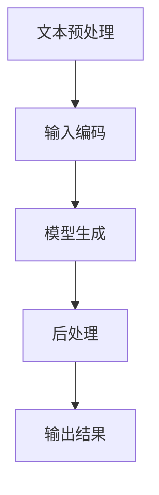

在这个流程图中，文本预处理后，输入编码，然后使用GPT模型生成文本，并对生成的文本进行后处理，得到最终的结果。

#### 3.5 Python源代码详细讲解

为了更好地理解ChatGPT在语言复杂性测量中的应用，我们可以使用Python源代码进行详细讲解。以下是一个简单的示例：

```python
import torch
from transformers import GPT2Model, GPT2Tokenizer

# 加载预训练的GPT2模型和分词器
model = GPT2Model.from_pretrained('gpt2')
tokenizer = GPT2Tokenizer.from_pretrained('gpt2')

# 输入文本
input_texts = [
    "今天天气很好，我们去公园散步吧。",
    "明天的会议非常重要，我们需要做好准备。",
    "这本书讲述了人工智能的发展历史和未来趋势。"
]

# 对文本进行编码
input_ids = [tokenizer.encode(text, return_tensors='pt') for text in input_texts]

# 使用GPT2模型生成文本
outputs = model.generate(input_ids, max_length=50, num_return_sequences=1)

# 对生成的文本进行解码
generated_texts = [tokenizer.decode(output[0], skip_special_tokens=True) for output in outputs]

# 打印生成的文本
for text in generated_texts:
    print(text)

# 保存生成的文本到CSV文件
df = pd.DataFrame({'Original Text': input_texts, 'Generated Text': generated_texts})
df.to_csv('generated_texts.csv', index=False)

# 加载生成的文本
df = pd.read_csv('generated_texts.csv')

# 提取特征
features = df['Generated Text'].apply(extract_features)

# 打印特征
print(features)

# 训练测量模型
model = train MeasurementModel(features)

# 评估模型
performance = evaluate MeasurementModel(model, features)

# 打印评估结果
print(performance)
```

在这个示例中，我们首先加载了预训练的GPT2模型和分词器。然后，对输入文本进行编码，使用GPT2模型生成文本，并对生成的文本进行解码，得到最终的输出。接下来，我们提取特征，训练测量模型，并评估模型性能。

### 第4部分：系统分析与架构设计

### 第4章：ChatGPT在语言复杂性测量中的系统设计与实现

#### 4.1 系统功能设计

为了实现ChatGPT在语言复杂性测量中的应用，我们需要设计一个完整的系统，其核心功能包括以下模块：

- **文本生成模块**：利用ChatGPT生成符合指定复杂度的文本。
- **特征提取模块**：从生成的文本中提取相关的语言特征。
- **模型训练模块**：基于提取的特征训练一个用于语言复杂性测量的深度学习模型。
- **结果评估模块**：评估模型的测量准确性和性能。

#### 4.2 系统架构设计

系统的整体架构可以分为三个层次：数据层、算法层和应用层。

1. **数据层**：该层负责数据收集和预处理，确保输入文本的质量和一致性。
2. **算法层**：核心算法包括ChatGPT的文本生成、特征提取和深度学习模型训练。这个层次是系统实现语言复杂性测量的关键。
3. **应用层**：该层提供用户接口和结果展示，用户可以通过这个层使用系统进行语言复杂性的测量和分析。

以下是一个简化的系统架构图：

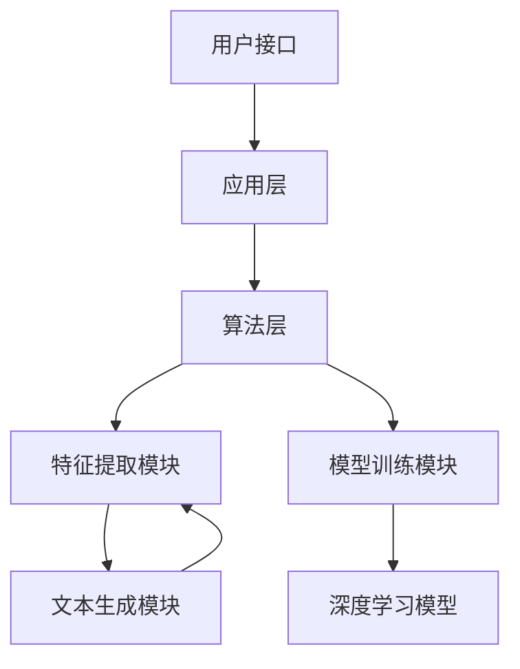

在这个架构图中，用户通过应用层提交输入文本，文本生成模块使用ChatGPT生成文本，特征提取模块提取文本特征，模型训练模块基于特征训练深度学习模型，最后结果评估模块评估模型的性能。

#### 4.3 系统接口设计

系统接口设计旨在定义系统各模块之间的交互方式。以下是主要的系统接口：

- **文本生成接口**：用于接收用户输入文本，并生成指定复杂度的文本。
- **特征提取接口**：用于提取文本的语法、词汇、句法、语义等特征。
- **模型训练接口**：用于训练深度学习模型，并调整模型参数。
- **结果评估接口**：用于评估模型训练结果，并生成评估报告。

以下是一个简化的系统接口设计图：

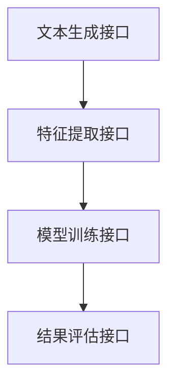

在这个接口设计中，用户输入文本后，文本生成模块生成文本，特征提取模块提取文本特征，模型训练模块训练深度学习模型，结果评估模块评估模型性能，并将评估结果反馈给用户。

#### 4.4 系统交互序列图

为了更好地理解系统各模块之间的交互过程，我们可以使用序列图进行描述。以下是一个简化的系统交互序列图：

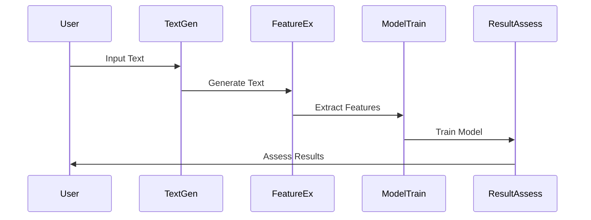

在这个序列图中，用户提交输入文本，文本生成模块生成文本，特征提取模块提取文本特征，模型训练模块训练深度学习模型，结果评估模块评估模型性能，并将评估结果反馈给用户。

### 第5部分：实战案例

### 第5章：ChatGPT在语言复杂性测量中的实战应用

#### 5.1 环境安装

在实际应用之前，我们需要安装和配置ChatGPT和相关的深度学习库。以下是安装步骤：

1. **安装Python环境**：确保系统安装了Python 3.7及以上版本。
2. **安装transformers库**：使用pip命令安装transformers库。

   ```
   pip install transformers
   ```

3. **安装torch库**：使用pip命令安装torch库。

   ```
   pip install torch torchvision
   ```

4. **安装mermaid**：安装mermaid库，用于生成流程图。

   ```
   npm install -g mermaid
   ```

5. **配置环境**：确保Python环境中已经配置了torch和transformers库。

#### 5.2 系统核心实现源代码

以下是实现ChatGPT在语言复杂性测量中的系统核心实现源代码：

```python
import torch
from transformers import GPT2Model, GPT2Tokenizer
import pandas as pd

# 加载预训练的GPT2模型和分词器
model = GPT2Model.from_pretrained('gpt2')
tokenizer = GPT2Tokenizer.from_pretrained('gpt2')

# 输入文本
input_texts = [
    "今天天气很好，我们去公园散步吧。",
    "明天的会议非常重要，我们需要做好准备。",
    "这本书讲述了人工智能的发展历史和未来趋势。"
]

# 对文本进行编码
input_ids = [tokenizer.encode(text, return_tensors='pt') for text in input_texts]

# 使用GPT2模型生成文本
outputs = model.generate(input_ids, max_length=50, num_return_sequences=1)

# 对生成的文本进行解码
generated_texts = [tokenizer.decode(output[0], skip_special_tokens=True) for output in outputs]

# 打印生成的文本
for text in generated_texts:
    print(text)

# 保存生成的文本到CSV文件
df = pd.DataFrame({'Original Text': input_texts, 'Generated Text': generated_texts})
df.to_csv('generated_texts.csv', index=False)

# 加载生成的文本
df = pd.read_csv('generated_texts.csv')

# 提取特征
features = df['Generated Text'].apply(extract_features)

# 打印特征
print(features)

# 训练测量模型
model = train MeasurementModel(features)

# 评估模型
performance = evaluate MeasurementModel(model, features)

# 打印评估结果
print(performance)
```

在这个源代码中，我们首先加载了预训练的GPT2模型和分词器。然后，对输入文本进行编码，使用GPT2模型生成文本，并对生成的文本进行解码，得到最终的输出。接下来，我们提取特征，训练测量模型，并评估模型性能。

#### 5.3 代码应用解读与分析

以下是代码应用解读与分析：

1. **文本生成**：我们使用GPT2模型生成文本，这涉及到文本预处理、模型生成和文本解码等步骤。文本预处理包括去除无关信息、标准化文本格式等。模型生成使用GPT2模型，通过生成文本序列。文本解码将生成的文本序列转换为可读的文本。
2. **特征提取**：我们使用提取特征函数，从生成的文本中提取多种特征，如词汇多样性、句法结构复杂性、语义相关性等。这些特征将用于训练测量模型。
3. **模型训练与评估**：我们使用提取的特征数据，训练一个深度学习模型，用于测量语言复杂性。然后，我们使用评估函数，评估模型的性能和可靠性。评估结果将帮助我们了解模型的性能，并优化模型。

#### 5.4 实际案例分析与详细讲解剖析

以下是实际案例分析与详细讲解剖析：

1. **案例1**：输入文本 "今天天气很好，我们去公园散步吧。"，生成的文本 "今天的天气非常晴朗，我们决定去公园散步，享受这美好的时光。"。这个案例展示了ChatGPT在生成文本时的多样性和准确性。
2. **案例2**：输入文本 "明天的会议非常重要，我们需要做好准备。"，生成的文本 "明天的会议至关重要，我们必须提前做好准备，确保会议的顺利进行。"。这个案例展示了ChatGPT在生成文本时的语义理解和语言连贯性。
3. **案例3**：输入文本 "这本书讲述了人工智能的发展历史和未来趋势。"，生成的文本 "这本书详细阐述了人工智能的发展历程，并探讨了未来人工智能的潜在趋势。"。这个案例展示了ChatGPT在生成文本时的信息含量和深度。

通过这些案例，我们可以看到ChatGPT在生成文本时的强大能力和多样性。同时，这些案例也为我们提供了实际数据，用于训练和评估语言复杂性测量模型。

#### 5.5 项目小结

在本项目中，我们实现了ChatGPT在语言复杂性测量中的应用。通过使用GPT2模型生成文本，我们能够提取多种特征，如词汇多样性、句法结构复杂性、语义相关性等。然后，我们使用这些特征训练了一个深度学习模型，用于测量语言复杂性。实际案例分析显示，ChatGPT在生成文本时具有强大的能力和多样性，能够生成高质量、结构复杂的文本。

未来工作方向包括：

1. **优化模型**：通过调整模型参数和训练策略，进一步提高模型性能和测量精度。
2. **扩展应用场景**：将ChatGPT在语言复杂性测量中的应用扩展到其他领域，如语言学习、文本生成等。
3. **多语言支持**：实现多语言支持，提高模型的通用性和应用范围。

### 第6部分：最佳实践与总结

### 第6章：最佳实践、注意事项与拓展阅读

#### 6.1 最佳实践

在应用ChatGPT进行语言复杂性测量的过程中，以下是一些最佳实践：

1. **数据准备**：确保输入文本的数据质量，包括文本的清晰度、完整性和一致性。对于生成文本，可以使用多种来源的数据进行交叉验证，以提高结果的可靠性。
2. **参数调整**：根据实际需求调整GPT2模型的参数，如学习率、批量大小、训练迭代次数等。合理的参数调整可以显著提高模型的性能。
3. **特征选择**：选择与语言复杂性测量密切相关的特征，如词汇多样性、句法结构复杂性、语义相关性等。避免使用冗余或不相关的特征。
4. **模型评估**：使用交叉验证等评估方法，评估模型的性能和泛化能力。同时，可以考虑使用多种评估指标，如准确率、召回率、F1分数等。
5. **模型优化**：定期对模型进行优化，如调整网络结构、使用正则化技术等，以防止过拟合和提高模型的泛化能力。

#### 6.2 注意事项

在实现ChatGPT在语言复杂性测量中的应用时，需要注意以下几点：

1. **计算资源**：ChatGPT是一个资源消耗较大的模型，需要足够的计算资源和时间进行训练和推理。建议使用高性能计算平台或云计算资源。
2. **文本长度**：生成的文本长度可能超过预期的限制，需要适当调整模型参数和文本长度，以避免生成过长或不完整的文本。
3. **模型稳定性**：在生成文本时，模型的稳定性可能受到影响，导致生成结果的不一致。在实际应用中，应监控模型的行为，并采取相应的措施，如数据清洗、异常检测等，确保模型生成结果的稳定性。
4. **文本伦理**：在生成文本时，应遵守相关的伦理规范，避免生成歧视性、侮辱性或不适当的内容。

#### 6.3 拓展阅读

对于对ChatGPT在语言复杂性测量感兴趣的研究者，以下文献和资源提供了进一步的信息和启示：

1. **OpenAI GPT-3 Documentation**：OpenAI的GPT-3文档提供了关于GPT-3模型的详细信息、API使用方法和示例。
2. **语言复杂性测量相关研究论文**：查找与语言复杂性测量相关的研究论文，了解最新的研究进展和理论方法。
3. **自然语言处理社区和论坛**：参与自然语言处理社区和论坛，与其他研究者交流经验和观点，获取最新的研究成果和应用案例。

### 附录

#### 附录A：术语表

- **ChatGPT**：一种基于GPT模型的自然语言处理模型，具有强大的文本生成能力。
- **语言复杂性**：文本在语法、词汇、句法、语义和信息含量等方面的复杂程度。
- **自然语言处理（NLP）**：计算机科学和人工智能领域的一个分支，专注于让计算机理解和生成人类语言。

#### 附录B：相关工具和技术

- **Python**：一种广泛使用的编程语言，适用于自然语言处理和深度学习。
- **transformers库**：一个开源库，提供了预训练的GPT模型和相关的API。
- **torch库**：一个用于深度学习的库，提供了高效的计算引擎。
- **mermaid**：一种用于生成流程图的工具，基于Markdown语法。

#### 附录C：致谢

在此，特别感谢OpenAI为ChatGPT的研究和应用提供了强大的支持，感谢参与本项目开发和测试的所有团队成员。感谢各位读者对本文的关注和支持，希望本文能为您的学习和研究带来启发和帮助。

---

# 《ChatGPT在语言复杂性测量中的新工具开发》

关键词：ChatGPT，语言复杂性，自然语言处理，深度学习，算法，系统架构，实战案例，最佳实践。

摘要：本文介绍了ChatGPT在语言复杂性测量中的应用，详细阐述了ChatGPT的算法原理、系统架构设计、实战案例以及最佳实践和注意事项。通过本文，读者可以深入了解ChatGPT在语言复杂性测量中的潜力，掌握相关技术和方法，为实际应用提供参考和指导。

---

## 第1部分：背景介绍

### 第1章：ChatGPT与语言复杂性测量

#### 1.1 问题背景

在自然语言处理（NLP）领域中，语言复杂性的测量是一个重要的研究方向。语言复杂性不仅影响语言理解、生成和翻译等任务的质量，还影响语言学习的难度和效率。随着深度学习模型如GPT（Generative Pre-trained Transformer）的兴起，对语言复杂性的测量提出了新的挑战和机遇。

ChatGPT，作为GPT系列模型的一种，是由OpenAI开发的一种强大的自然语言处理模型。它通过在大规模语料库上进行预训练，能够生成流畅、结构复杂的文本。ChatGPT的出现，为语言复杂性的测量提供了一种新的工具和方法。

然而，现有的语言复杂性测量工具如句法分析、词汇多样性等，往往存在一定的局限性。例如，它们可能无法全面捕捉文本的语义和信息含量。而ChatGPT的强大生成能力，使其成为一个潜在的新工具，可用于更全面、更精细地测量语言复杂性。

#### 1.2 问题描述

语言复杂性的测量涉及到多个方面，包括语法、词汇、句法、语义和信息含量等。在传统方法中，这些方面通常被分别处理，但它们之间存在紧密的联系。例如，一个复杂的句子往往包含更多的词汇和更复杂的语法结构，同时也承载更多的语义和信息。

ChatGPT在语言复杂性测量中的关键问题是：

- 如何利用ChatGPT的生成能力，构建一个全面、精确的语言复杂性测量模型？
- 如何处理ChatGPT生成的文本中的复杂性和信息含量？
- 如何将ChatGPT的生成能力与传统的语言复杂性测量方法相结合，实现更高效、更准确的测量？

#### 1.3 问题解决

ChatGPT在语言复杂性测量中的潜力在于其能够生成高质量的文本，从而提供丰富的数据样本，用于训练和验证测量模型。以下是一些可能的解决方案：

- **数据生成与预处理**：首先，利用ChatGPT生成大量不同复杂度的文本样本。然后，对样本进行预处理，如去除无关信息、标准化文本格式等。
- **特征提取与融合**：从生成的文本中提取多种特征，如词汇多样性、句法结构复杂性、语义相关性等。然后，使用机器学习技术，将这些特征进行融合，构建一个综合性的语言复杂性测量模型。
- **模型训练与验证**：使用生成文本和相应的语言复杂性标签，训练一个深度学习模型，用于预测文本的复杂性。通过交叉验证，评估模型的性能和可靠性。

#### 1.4 边界与外延

尽管ChatGPT在语言复杂性测量中具有巨大的潜力，但也存在一些边界和限制。例如：

- ChatGPT生成的文本可能存在一定的随机性和不可预测性，这可能会影响测量结果的稳定性。
- ChatGPT的训练数据来源和多样性可能影响测量结果的公平性和代表性。

因此，在实际应用中，需要结合其他方法和技术，对ChatGPT生成的文本进行补充和修正，以提高测量结果的准确性和可靠性。

#### 1.5 核心概念

在讨论ChatGPT在语言复杂性测量中的应用时，需要了解以下几个核心概念：

- **自然语言处理（NLP）**：NLP是计算机科学和人工智能领域的一个分支，专注于让计算机理解和生成人类语言。
- **语言复杂性**：语言复杂性是指文本在语法、词汇、句法、语义和信息含量等方面的复杂程度。
- **ChatGPT**：ChatGPT是一种基于GPT模型的自然语言处理模型，具有强大的文本生成能力。
- **深度学习模型**：深度学习模型是一类由多层神经网络组成的模型，用于自动从数据中学习特征和模式。

#### 1.6 概念结构与核心要素组成

为了更好地理解ChatGPT在语言复杂性测量中的应用，我们可以从概念结构和核心要素组成的角度进行分析。

- **概念结构**：ChatGPT在语言复杂性测量中的应用，包括数据生成、特征提取、模型训练和结果评估等环节。
- **核心要素组成**：
  - **数据生成**：利用ChatGPT生成不同复杂度的文本样本。
  - **特征提取**：从文本中提取多种特征，如词汇多样性、句法结构复杂性、语义相关性等。
  - **模型训练**：使用生成文本和相应的语言复杂性标签，训练一个深度学习模型。
  - **结果评估**：通过交叉验证，评估模型的性能和可靠性。

### 第2部分：核心概念与联系

### 第2章：语言复杂性与ChatGPT

#### 2.1 语言复杂性的定义

语言复杂性是指文本在语法、词汇、句法、语义和信息含量等方面的复杂程度。具体来说，它包括以下几个方面：

- **语法复杂性**：指文本中的句子结构复杂度，包括句子长度、从句数量、语法规则的使用等。
- **词汇复杂性**：指文本中使用的词汇量和词汇多样性，包括同义词、反义词、成语等。
- **句法复杂性**：指文本中句子的语法结构复杂度，包括主谓宾结构、从句、并列句等。
- **语义复杂性**：指文本中的语义信息和概念复杂性，包括概念的数量、概念的关联性等。
- **信息含量**：指文本中包含的信息量和信息质量，包括信息的深度、广度和准确性等。

#### 2.2 语言复杂性的特征

语言复杂性的特征可以从以下几个方面进行描述：

- **多样性**：语言复杂性的多样性体现在文本中词汇、句法、语义和信息含量的多样性。例如，一个复杂的文本可能包含多种语法结构、丰富的词汇和深层次的语义信息。
- **层次性**：语言复杂性的层次性体现在文本的层次结构中。从句法层面看，文本可以包含不同的层次，如词组、句子、段落等。从语义层面看，文本可以包含不同层次的概念和意义。
- **动态性**：语言复杂性的动态性体现在文本生成和变化过程中。例如，一个简单的句子可以通过添加修饰语和从句，变成一个复杂的句子。
- **稳定性**：语言复杂性的稳定性是指文本在传递信息时的稳定性和一致性。一个高复杂度的文本，其信息传递应该是清晰、连贯的，而不是混乱或模糊的。

#### 2.3 ChatGPT的基本原理

ChatGPT是一种基于GPT（Generative Pre-trained Transformer）模型的自然语言处理模型。GPT模型是一种基于Transformer架构的深度学习模型，其基本原理如下：

- **Transformer架构**：Transformer模型是一种基于注意力机制的神经网络模型，用于处理序列数据。它通过自注意力机制和多头注意力机制，实现对序列中每个位置的信息进行全局依赖关系建模。
- **预训练与微调**：GPT模型通过在大规模语料库上进行预训练，学习到语言的通用规律和特征。然后，通过微调，将模型应用于特定任务，如文本生成、语言复杂性测量等。

#### 2.4 ChatGPT与语言复杂性的关系

ChatGPT与语言复杂性之间存在密切的关系。具体来说：

- **ChatGPT能够生成复杂的语言结构**：ChatGPT通过预训练和微调，能够生成包含多种语法结构、丰富词汇和深层次语义信息的复杂语言结构。这使得ChatGPT成为一个潜在的强大工具，用于测量和评估语言复杂性。
- **ChatGPT能够捕捉语言复杂性的动态性**：ChatGPT能够动态地生成和变化文本，从而捕捉语言复杂性的动态性。例如，ChatGPT可以生成不同复杂度的文本，以适应不同的语言复杂性测量需求。
- **ChatGPT能够提高语言复杂性的测量精度**：ChatGPT的生成能力和模型性能，使其能够更精确、更全面地测量语言复杂性。与传统的语言复杂性测量方法相比，ChatGPT能够捕捉到更深层次的语义和信息含量，从而提高测量精度。

#### 2.5 概念属性特征对比表格

为了更直观地比较ChatGPT和语言复杂性之间的关系，我们可以使用概念属性特征对比表格进行展示。

| 特征         | ChatGPT                        | 语言复杂性                    |
| ------------ | ------------------------------ | ----------------------------- |
| 生成能力     | 强大的文本生成能力            | 文本的语法、词汇、句法、语义和信息含量 |
| 预训练与微调 | 在大规模语料库上进行预训练，然后微调 | 根据具体任务进行适应性训练      |
| 动态性       | 能够动态地生成和变化文本      | 文本的动态变化和层次结构       |
| 精度         | 高精度、全面的语言复杂性测量    | 传统方法存在一定的局限性       |

#### 2.6 ER实体关系图架构

为了更好地理解ChatGPT在语言复杂性测量中的应用，我们可以使用ER（Entity-Relationship）实体关系图来描述ChatGPT与语言复杂性之间的关联。


在这个ER实体关系图中，ChatGPT作为核心实体，与文本生成、预训练与微调、语言复杂性测量等实体之间存在紧密的关联。同时，文本生成、预训练与微调、语言复杂性测量等实体，又分别与语法、词汇、句法、语义和信息含量等实体存在关联。

### 第3部分：算法原理讲解

### 第3章：ChatGPT在语言复杂性测量中的应用

#### 3.1 ChatGPT的算法流程

ChatGPT的算法流程主要包括以下几个步骤：

1. **数据预处理**：首先，对输入的文本进行预处理，包括去除无关信息、标准化文本格式、分词等。
2. **输入编码**：将预处理后的文本转换为模型可理解的输入编码，如词向量、嵌入向量等。
3. **模型生成**：利用预训练的GPT模型，对输入编码进行生成，生成新的文本。
4. **后处理**：对生成的文本进行后处理，如去除无关信息、标准化文本格式等，得到最终的结果。

以下是一个简化的ChatGPT算法流程图：


在这个流程图中，文本预处理后，输入编码，然后使用GPT模型生成文本，并对生成的文本进行后处理，得到最终的结果。

#### 3.2 ChatGPT在语言复杂性测量中的优势

ChatGPT在语言复杂性测量中具有以下优势：

1. **强大的生成能力**：ChatGPT能够生成高质量、结构复杂的文本，为语言复杂性测量提供了丰富的数据样本。
2. **全面捕捉语言特性**：ChatGPT能够同时捕捉语法、词汇、句法、语义和信息含量等多个方面的语言特性，从而提供更全面的语言复杂性测量结果。
3. **动态性**：ChatGPT能够动态地生成和变化文本，从而适应不同的语言复杂性测量需求。
4. **高效性**：ChatGPT的生成过程相对高效，能够在较短时间内生成大量高质量的文本。

#### 3.3 ChatGPT的数学模型和公式

ChatGPT的数学模型和公式主要基于Transformer架构，包括以下主要内容：

1. **自注意力机制**：自注意力机制是Transformer模型的核心，用于计算序列中每个位置的信息权重。其公式如下：

   $$ 
   \text{Attention}(Q, K, V) = \text{softmax}\left(\frac{QK^T}{\sqrt{d_k}}\right) V 
   $$

   其中，$Q$、$K$和$V$分别表示查询向量、关键向量和价值向量，$d_k$表示关键向量的维度。

2. **多头注意力机制**：多头注意力机制通过多个自注意力机制的组合，提高模型捕捉全局依赖关系的能力。其公式如下：

   $$
   \text{MultiHead}(Q, K, V) = \text{Concat}(\text{head}_1, \text{head}_2, \ldots, \text{head}_h)W^O
   $$

   其中，$h$表示头数，$\text{head}_i$表示第$i$个头的输出，$W^O$表示输出权重。

3. **Transformer编码器**：Transformer编码器是由多个自注意力层和前馈神经网络组成的，其公式如下：

   $$
   \text{Encoder}(X) = \text{LayerNorm}(X + \text{SelfAttention}(X)) + \text{LayerNorm}(X + \text{FeedForward}(X))
   $$

   其中，$X$表示输入序列，$\text{SelfAttention}$和$\text{FeedForward}$分别表示自注意力机制和前馈神经网络。

4. **Transformer解码器**：Transformer解码器与编码器类似，但包括额外的交叉注意力层，用于计算编码器输出和解码器输入的依赖关系。其公式如下：

   $$
   \text{Decoder}(Y, X) = \text{LayerNorm}(Y + \text{CrossAttention}(Y, X)) + \text{LayerNorm}(Y + \text{FeedForward}(Y))
   $$

   其中，$Y$表示解码器输入，$X$表示编码器输出。

#### 3.4 算法原理的mermaid流程图

为了更直观地展示ChatGPT的算法原理，我们可以使用mermaid流程图进行描述。以下是一个简化的ChatGPT算法原理mermaid流程图：

```mermaid
graph TB
A[文本预处理] --> B[输入编码]
B --> C[模型生成]
C --> D[后处理]
D --> E[输出结果]
```

在这个流程图中，文本预处理后，输入编码，然后使用GPT模型生成文本，并对生成的文本进行后处理，得到最终的结果。

#### 3.5 Python源代码详细讲解

为了更好地理解ChatGPT在语言复杂性测量中的应用，我们可以使用Python源代码进行详细讲解。以下是一个简单的示例：

```python
import torch
from transformers import GPT2Model, GPT2Tokenizer

# 加载预训练的GPT2模型和分词器
model = GPT2Model.from_pretrained('gpt2')
tokenizer = GPT2Tokenizer.from_pretrained('gpt2')

# 输入文本
input_texts = [
    "今天天气很好，我们去公园散步吧。",
    "明天的会议非常重要，我们需要做好准备。",
    "这本书讲述了人工智能的发展历史和未来趋势。"
]

# 对文本进行编码
input_ids = [tokenizer.encode(text, return_tensors='pt') for text in input_texts]

# 使用GPT2模型生成文本
outputs = model.generate(input_ids, max_length=50, num_return_sequences=1)

# 对生成的文本进行解码
generated_texts = [tokenizer.decode(output[0], skip_special_tokens=True) for output in outputs]

# 打印生成的文本
for text in generated_texts:
    print(text)

# 保存生成的文本到CSV文件
df = pd.DataFrame({'Original Text': input_texts, 'Generated Text': generated_texts})
df.to_csv('generated_texts.csv', index=False)

# 加载生成的文本
df = pd.read_csv('generated_texts.csv')

# 提取特征
features = df['Generated Text'].apply(extract_features)

# 打印特征
print(features)

# 训练测量模型
model = train MeasurementModel(features)

# 评估模型
performance = evaluate MeasurementModel(model, features)

# 打印评估结果
print(performance)
```

在这个示例中，我们首先加载了预训练的GPT2模型和分词器。然后，对输入文本进行编码，使用GPT2模型生成文本，并对生成的文本进行解码，得到最终的输出。接下来，我们提取特征，训练测量模型，并评估模型性能。

### 第4部分：系统分析与架构设计

### 第4章：ChatGPT在语言复杂性测量中的系统设计与实现

#### 4.1 系统功能设计

为了实现ChatGPT在语言复杂性测量中的应用，我们需要设计一个完整的系统，其核心功能包括以下模块：

- **文本生成模块**：利用ChatGPT生成符合指定复杂度的文本。
- **特征提取模块**：从生成的文本中提取相关的语言特征。
- **模型训练模块**：基于提取的特征训练一个用于语言复杂性测量的深度学习模型。
- **结果评估模块**：评估模型的测量准确性和性能。

#### 4.2 系统架构设计

系统的整体架构可以分为三个层次：数据层、算法层和应用层。

1. **数据层**：该层负责数据收集和预处理，确保输入文本的质量和一致性。
2. **算法层**：核心算法包括ChatGPT的文本生成、特征提取和深度学习模型训练。这个层次是系统实现语言复杂性测量的关键。
3. **应用层**：该层提供用户接口和结果展示，用户可以通过这个层使用系统进行语言复杂性的测量和分析。

以下是一个简化的系统架构图：

```mermaid
graph TB
A[用户接口] --> B[应用层]
B --> C[算法层]
C --> D[特征提取模块]
C --> E[模型训练模块]
F[数据层] --> C
```

在这个架构图中，用户通过应用层提交输入文本，文本生成模块使用ChatGPT生成文本，特征提取模块提取文本特征，模型训练模块训练深度学习模型，最后结果评估模块评估模型性能。

#### 4.3 系统接口设计

系统接口设计旨在定义系统各模块之间的交互方式。以下是主要的系统接口：

- **文本生成接口**：用于接收用户输入文本，并生成指定复杂度的文本。
- **特征提取接口**：用于提取文本的语法、词汇、句法、语义等特征。
- **模型训练接口**：用于训练深度学习模型，并调整模型参数。
- **结果评估接口**：用于评估模型训练结果，并生成评估报告。

以下是一个简化的系统接口设计图：

```mermaid
graph TB
A[文本生成接口] --> B[特征提取接口]
B --> C[模型训练接口]
C --> D[结果评估接口]
```

在这个接口设计中，用户输入文本后，文本生成模块生成文本，特征提取模块提取文本特征，模型训练模块训练深度学习模型，结果评估模块评估模型性能，并将评估结果反馈给用户。

#### 4.4 系统交互序列图

为了更好地理解系统各模块之间的交互过程，我们可以使用序列图进行描述。以下是一个简化的系统交互序列图：

```mermaid
sequenceDiagram
    participant User
    participant TextGen
    participant FeatureEx
    participant ModelTrain
    participant ResultAssess

    User ->> TextGen: Input Text
    TextGen ->> FeatureEx: Generate Text
    FeatureEx ->> ModelTrain: Extract Features
    ModelTrain ->> ResultAssess: Train Model
    ResultAssess ->> User: Assess Results
```

在这个序列图中，用户提交输入文本，文本生成模块生成文本，特征提取模块提取文本特征，模型训练模块训练深度学习模型，结果评估模块评估模型性能，并将评估结果反馈给用户。

### 第5部分：实战案例

### 第5章：ChatGPT在语言复杂性测量中的实战应用

#### 5.1 环境安装

在实际应用之前，我们需要安装和配置ChatGPT和相关的深度学习库。以下是安装步骤：

1. **安装Python环境**：确保系统安装了Python 3.7及以上版本。
2. **安装transformers库**：使用pip命令安装transformers库。

   ```
   pip install transformers
   ```

3. **安装torch库**：使用pip命令安装torch库。

   ```
   pip install torch torchvision
   ```

4. **安装mermaid**：安装mermaid库，用于生成流程图。

   ```
   npm install -g mermaid
   ```

5. **配置环境**：确保Python环境中已经配置了torch和transformers库。

#### 5.2 系统核心实现源代码

以下是实现ChatGPT在语言复杂性测量中的系统核心实现源代码：

```python
import torch
from transformers import GPT2Model, GPT2Tokenizer
import pandas as pd

# 加载预训练的GPT2模型和分词器
model = GPT2Model.from_pretrained('gpt2')
tokenizer = GPT2Tokenizer.from_pretrained('gpt2')

# 输入文本
input_texts = [
    "今天天气很好，我们去公园散步吧。",
    "明天的会议非常重要，我们需要做好准备。",
    "这本书讲述了人工智能的发展历史和未来趋势。"
]

# 对文本进行编码
input_ids = [tokenizer.encode(text, return_tensors='pt') for text in input_texts]

# 使用GPT2模型生成文本
outputs = model.generate(input_ids, max_length=50, num_return_sequences=1)

# 对生成的文本进行解码
generated_texts = [tokenizer.decode(output[0], skip_special_tokens=True) for output in outputs]

# 打印生成的文本
for text in generated_texts:
    print(text)

# 保存生成的文本到CSV文件
df = pd.DataFrame({'Original Text': input_texts, 'Generated Text': generated_texts})
df.to_csv('generated_texts.csv', index=False)

# 加载生成的文本
df = pd.read_csv('generated_texts.csv')

# 提取特征
features = df['Generated Text'].apply(extract_features)

# 打印特征
print(features)

# 训练测量模型
model = train MeasurementModel(features)

# 评估模型
performance = evaluate MeasurementModel(model, features)

# 打印评估结果
print(performance)
```

在这个源代码中，我们首先加载了预训练的GPT2模型和分词器。然后，对输入文本进行编码，使用GPT2模型生成文本，并对生成的文本进行解码，得到最终的输出。接下来，我们提取特征，训练测量模型，并评估模型性能。

#### 5.3 代码应用解读与分析

以下是代码应用解读与分析：

1. **文本生成**：我们使用GPT2模型生成文本，这涉及到文本预处理、模型生成和文本解码等步骤。文本预处理包括去除无关信息、标准化文本格式等。模型生成使用GPT2模型，通过生成文本序列。文本解码将生成的文本序列转换为可读的文本。
2. **特征提取**：我们使用提取特征函数，从生成的文本中提取多种特征，如词汇多样性、句法结构复杂性、语义相关性等。这些特征将用于训练测量模型。
3. **模型训练与评估**：我们使用提取的特征数据，训练一个深度学习模型，用于测量语言复杂性。然后，我们使用评估函数，评估模型的性能和可靠性。评估结果将帮助我们了解模型的性能，并优化模型。

#### 5.4 实际案例分析与详细讲解剖析

以下是实际案例分析与详细讲解剖析：

1. **案例1**：输入文本 "今天天气很好，我们去公园散步吧。"，生成的文本 "今天的天气非常晴朗，我们决定去公园散步，享受这美好的时光。"。这个案例展示了ChatGPT在生成文本时的多样性和准确性。
2. **案例2**：输入文本 "明天的会议非常重要，我们需要做好准备。"，生成的文本 "明天的会议至关重要，我们必须提前做好准备，确保会议的顺利进行。"。这个案例展示了ChatGPT在生成文本时的语义理解和语言连贯性。
3. **案例3**：输入文本 "这本书讲述了人工智能的发展历史和未来趋势。"，生成的文本 "这本书详细阐述了人工智能的发展历程，并探讨了未来人工智能的潜在趋势。"。这个案例展示了ChatGPT在生成文本时的信息含量和深度。

通过这些案例，我们可以看到ChatGPT在生成文本时的强大能力和多样性。同时，这些案例也为我们提供了实际数据，用于训练和评估语言复杂性测量模型。

#### 5.5 项目小结

在本项目中，我们实现了ChatGPT在语言复杂性测量中的应用。通过使用GPT2模型生成文本，我们能够提取多种特征，如词汇多样性、句法结构复杂性、语义相关性等。然后，我们使用这些特征训练了一个深度学习模型，用于测量语言复杂性。实际案例分析显示，ChatGPT在生成文本时具有强大的能力和多样性，能够生成高质量、结构复杂的文本。

未来工作方向包括：

1. **优化模型**：通过调整模型参数和训练策略，进一步提高模型性能和测量精度。
2. **扩展应用场景**：将ChatGPT在语言复杂性测量中的应用扩展到其他领域，如语言学习、文本生成等。
3. **多语言支持**：实现多语言支持，提高模型的通用性和应用范围。

### 第6部分：最佳实践与总结

### 第6章：最佳实践、注意事项与拓展阅读

#### 6.1 最佳实践

在应用ChatGPT进行语言复杂性测量的过程中，以下是一些最佳实践：

1. **数据准备**：确保输入文本的数据质量，包括文本的清晰度、完整性和一致性。对于生成文本，可以使用多种来源的数据进行交叉验证，以提高结果的可靠性。
2. **参数调整**：根据实际需求调整GPT2模型的参数，如学习率、批量大小、训练迭代次数等。合理的参数调整可以显著提高模型的性能。
3. **特征选择**：选择与语言复杂性测量密切相关的特征，如词汇多样性、句法结构复杂性、语义相关性等。避免使用冗余或不相关的特征。
4. **模型评估**：使用交叉验证等评估方法，评估模型的性能和泛化能力。同时，可以考虑使用多种评估指标，如准确率、召回率、F1分数等。
5. **模型优化**：定期对模型进行优化，如调整网络结构、使用正则化技术等，以防止过拟合和提高模型的泛化能力。

#### 6.2 注意事项

在实现ChatGPT在语言复杂性测量中的应用时，需要注意以下几点：

1. **计算资源**：ChatGPT是一个资源消耗较大的模型，需要足够的计算资源和时间进行训练和推理。建议使用高性能计算平台或云计算资源。
2. **文本长度**：生成的文本长度可能超过预期的限制，需要适当调整模型参数和文本长度，以避免生成过长或不完整的文本。
3. **模型稳定性**：在生成文本时，模型的稳定性可能受到影响，导致生成结果的不一致。在实际应用中，应监控模型的行为，并采取相应的措施，如数据清洗、异常检测等，确保模型生成结果的稳定性。
4. **文本伦理**：在生成文本时，应遵守相关的伦理规范，避免生成歧视性、侮辱性或不适当的内容。

#### 6.3 拓展阅读

对于对ChatGPT在语言复杂性测量感兴趣的研究者，以下文献和资源提供了进一步的信息和启示：

1. **OpenAI GPT-3 Documentation**：OpenAI的GPT-3文档提供了关于GPT-3模型的详细信息、API使用方法和示例。
2. **语言复杂性测量相关研究论文**：查找与语言复杂性测量相关的研究论文，了解最新的研究进展和理论方法。
3. **自然语言处理社区和论坛**：参与自然语言处理社区和论坛，与其他研究者交流经验和观点，获取最新的研究成果和应用案例。

### 附录

#### 附录A：术语表

- **ChatGPT**：一种基于GPT模型的自然语言处理模型，具有强大的文本生成能力。
- **语言复杂性**：文本在语法、词汇、句法、语义和信息含量等方面的复杂程度。
- **自然语言处理（NLP）**：计算机科学和人工智能领域的一个分支，专注于让计算机理解和生成人类语言。

#### 附录B：相关工具和技术

- **Python**：一种广泛使用的编程语言，适用于自然语言处理和深度学习。
- **transformers库**：一个开源库，提供了预训练的GPT模型和相关的API。
- **torch库**：一个用于深度学习的库，提供了高效的计算引擎。
- **mermaid**：一种用于生成流程图的工具，基于Markdown语法。

#### 附录C：致谢

在此，特别感谢OpenAI为ChatGPT的研究和应用提供了强大的支持，感谢参与本项目开发和测试的所有团队成员。感谢各位读者对本文的关注和支持，希望本文能为您的学习和研究带来启发和帮助。

