                 


### 目录大纲与文章结构

**文章标题**: 《ChatGPT对话系统设计：提示词的艺术与技巧探讨》

**关键词**: ChatGPT，对话系统，提示词，人工智能，自然语言处理

**摘要**: 本文深入探讨了ChatGPT对话系统的设计，特别关注提示词的艺术与技巧。通过分析背景、核心概念、算法原理、系统架构、项目实战和最佳实践，本文为开发者提供了全面的指南。

### 第一步：背景介绍

**1.1 问题背景**

- **核心概念术语说明**: 自然语言处理、ChatGPT、对话系统、提示词
- **问题背景**: 人工智能与自然语言处理在日常生活和业务场景中的应用，ChatGPT的背景和功能。
- **问题描述**: ChatGPT对话系统的挑战，提示词的重要性。
- **问题解决**: 提示词设计的基本原则和优化方法。
- **边界与外延**: ChatGPT的局限性，未来发展方向。

**1.2 核心概念与联系**

- **核心概念原理**: ChatGPT的工作原理，提示词的类型和特征。
- **概念属性特征对比表格**: 不同类型提示词的属性对比。
- **ER实体关系图架构**: 提示词与对话系统的实体关系图。

**1.3 算法原理讲解**

- **算法mermaid流程图**: 提示词优化的算法流程。
- **Python源代码讲解**: 提示词优化的代码实现。
- **数学模型和公式**: 提示词优化的数学模型和公式。

**1.4 系统分析与架构设计方案**

- **问题场景介绍**: 典型的对话系统应用场景。
- **系统功能设计**: 领域模型和类图设计。
- **系统架构设计**: 系统架构图和架构组件解析。
- **系统接口设计**: 接口定义和交互流程。
- **系统交互设计**: 序列图和交互细节解析。

**1.5 项目实战**

- **环境搭建**: ChatGPT对话系统的环境搭建。
- **系统核心实现**: 核心代码解析和应用解读。
- **实际案例分析**: 不同应用场景的案例分析。
- **项目小结**: 经验总结和改进空间。

**1.6 最佳实践 tips**

- **提示词设计最佳实践**: 提示词生成与优化技巧。
- **对话系统性能优化**: 性能评估指标和优化策略。
- **安全性与隐私保护**: 安全策略和用户隐私保护措施。

**1.7 小结与拓展阅读**

- **小结**: 对全文内容的总结。
- **拓展阅读**: 相关领域的深入阅读推荐。

### 第二步：具体内容撰写

在撰写文章时，我们将遵循以下原则：

- **逻辑清晰**: 确保每一段内容的逻辑关系紧密，有助于读者理解。
- **结构紧凑**: 避免冗长的段落，使用列表和子标题来组织内容。
- **简单易懂**: 使用简洁的语言和生动的例子，使内容易于理解。
- **技术深度**: 深入探讨技术原理，但同时保持一定的可读性。

### 第三步：文章格式与排版

- **Markdown格式**: 使用Markdown格式来排版文章，包括标题、子标题、列表、代码块和公式等。
- **代码块与公式**: 使用代码块和公式格式来呈现Python代码和数学公式。
- **段落与行距**: 保持合理的段落长度和行距，以提高可读性。

### 第四步：最终检查与调整

在完成初稿后，进行以下步骤：

- **内容完整性检查**: 确保所有章节和子章节的内容都已撰写完整。
- **语法与拼写检查**: 使用拼写和语法检查工具来查找错误。
- **格式一致性检查**: 确保所有格式和排版的一致性。
- **读者体验优化**: 调整段落和标题的顺序，以提高文章的整体流畅度。

### 第五步：撰写作者信息

在文章末尾添加作者信息，包括作者姓名、所属机构以及相关介绍。

- **作者**: AI天才研究院/AI Genius Institute & 禅与计算机程序设计艺术 /Zen And The Art of Computer Programming

### 第六步：提交与发布

将撰写完成的文章提交给编辑团队进行审阅和修改，并在确认无误后进行发布。

### 总结

通过以上六个步骤，我们将撰写出一篇逻辑清晰、结构紧凑、简单易懂的《ChatGPT对话系统设计：提示词的艺术与技巧探讨》技术博客文章。文章将全面覆盖ChatGPT对话系统的设计、提示词的艺术与技巧，为开发者提供实用的指导和建议。在撰写过程中，我们将注重技术深度与可读性的平衡，确保文章既有深度又有广度，满足不同层次读者的需求。 

### 背景介绍

**1.1 问题背景**

在当今科技迅猛发展的时代，人工智能（AI）已经成为推动社会进步的重要力量。自然语言处理（NLP）作为AI的重要分支，近年来取得了显著的进展。ChatGPT，作为一种基于大规模语言模型（LLM）的先进对话系统，在提供智能客服、虚拟助手、语言翻译、文本生成等应用场景中展现出了强大的能力。

**核心概念术语说明**
- **自然语言处理（NLP）**: 自然语言处理是计算机科学和语言学领域的交叉学科，旨在使计算机能够理解和解释人类语言。
- **ChatGPT**: ChatGPT是由OpenAI开发的一种基于GPT-3模型的预训练语言模型，具有强大的文本生成和对话能力。
- **对话系统**: 对话系统是一种与人类用户通过自然语言进行交互的计算机程序，能够模拟人类的对话行为，提供信息查询、问题解答、情感交流等服务。

**问题背景**
- **人工智能与自然语言处理的发展**: 随着深度学习和神经网络技术的进步，AI在NLP领域的应用越来越广泛。从最初的词袋模型、支持向量机，到后来的循环神经网络（RNN）、长短时记忆网络（LSTM）、变压器模型（Transformer），NLP技术不断取得突破。
- **ChatGPT的诞生与发展历程**: ChatGPT是GPT-3模型的一个变种，继承了GPT-3在语言理解和生成方面的强大能力。GPT-3是一个具有1750亿参数的深度学习模型，通过大量的文本数据进行预训练，从而掌握了丰富的语言知识。ChatGPT在此基础上进一步优化了对话生成的流畅性和准确性。

**问题描述**
- **ChatGPT对话系统的挑战**: 尽管ChatGPT在对话生成方面取得了显著成果，但仍然面临诸多挑战，如：
  - **上下文理解不足**: ChatGPT在处理长对话或涉及复杂上下文时，可能会出现理解偏差，导致回答不准确。
  - **生成内容的质量波动**: ChatGPT生成的文本质量存在一定波动，有时可能出现不合理、不连贯或偏离主题的回答。
  - **计算资源需求大**: 大型语言模型的训练和推理需要大量的计算资源，这对硬件设备和能源消耗提出了较高要求。

**问题解决**
- **提示词设计的基本原则**: 提示词（Prompt）是引导ChatGPT生成对话的重要输入。一个有效的提示词应具备以下原则：
  - **明确性**: 提示词应清晰明确，避免歧义，确保ChatGPT能够准确理解用户意图。
  - **相关性**: 提示词应与对话主题高度相关，有助于ChatGPT生成高质量、贴合实际的回答。
  - **多样性**: 提示词应具备多样性，涵盖不同场景和用户需求，提高对话系统的适应能力。
  - **简洁性**: 提示词不应过于冗长，应简洁明了，便于ChatGPT快速处理。

**提示词优化的方法**
- **基于规则的方法**: 通过定义一套规则，对提示词进行格式化、筛选和调整，以优化对话生成效果。
- **机器学习方法**: 利用机器学习算法，如强化学习、迁移学习等，对提示词进行自动优化，提高生成文本的质量。
- **用户反馈机制**: 通过用户反馈，不断调整和优化提示词，使其更加贴合用户需求。

**边界与外延**
- **ChatGPT的局限性**: 尽管ChatGPT在对话生成方面表现出色，但仍存在以下局限性：
  - **知识更新问题**: ChatGPT的训练数据是静态的，无法实时获取新知识和信息，这可能导致生成文本的时效性较低。
  - **偏见与不当言论**: 如果训练数据存在偏见或不当言论，ChatGPT可能会在生成文本中表现出类似的偏见或不当行为。
  - **计算资源消耗**: 大型语言模型的训练和推理需要大量计算资源，这对于资源有限的场景（如移动设备）可能不适用。

- **未来发展方向**: 随着AI技术的不断进步，ChatGPT有望在以下几个方面取得突破：
  - **知识更新与动态学习**: 通过引入实时数据流，使ChatGPT能够持续学习和更新知识，提高生成文本的时效性。
  - **多模态交互**: 结合图像、声音等多模态信息，提高ChatGPT的交互能力和理解能力。
  - **个性化对话生成**: 利用用户行为数据，实现更加个性化的对话生成，提高用户体验。

**1.2 核心概念与联系**

**2.1 ChatGPT工作原理**

**2.1.1 模型结构**

ChatGPT基于GPT-3模型，是一种自回归语言模型（Autoregressive Language Model）。自回归模型的核心思想是使用之前生成的文本序列来预测下一个单词或字符。GPT-3模型的结构包含以下几个关键部分：

- **输入层**: 接收用户输入的文本序列。
- **编码器**: 将输入文本序列编码为连续的向量表示。
- **解码器**: 根据编码器的输出，逐步生成下一个单词或字符，直到生成完整的文本序列。

**2.1.2 训练数据与模型调优**

ChatGPT的训练数据主要来源于互联网上的大量文本，包括书籍、新闻、论文、社交媒体帖子等。这些文本经过预处理后，被分割成一系列的输入序列和相应的目标序列，用于训练模型。训练过程中，模型通过优化损失函数，调整内部参数，以最小化预测误差。

模型调优的关键步骤包括：

- **超参数调整**: 如学习率、批量大小、训练轮数等。
- **数据增强**: 通过对训练数据进行随机裁剪、填充、旋转等操作，增加数据多样性。
- **正则化**: 采用Dropout、Weight Decay等技术，防止过拟合。

**2.2 提示词类型与特征**

**2.2.1 常见提示词类型**

根据功能和应用场景，提示词可以分为以下几种类型：

- **问题导向型**: 用于引导ChatGPT回答特定问题，如“请你告诉我关于人工智能的最新进展”。
- **任务导向型**: 用于指示ChatGPT完成特定任务，如“请你帮我写一篇关于ChatGPT的博客文章”。
- **角色扮演型**: 用于模拟特定角色进行对话，如“请你扮演一个医生，回答患者的问题”。
- **情感导向型**: 用于引导ChatGPT生成具有特定情感色彩的文本，如“请你用幽默的语言回答这个问题”。

**2.2.2 提示词特征分析**

提示词的特征分析包括以下几个方面：

- **关键词提取**: 从提示词中提取关键信息，用于指导对话生成。
- **语义分析**: 对提示词的语义进行解析，确定其与对话主题的相关性。
- **情感分析**: 对提示词的情感倾向进行分析，用于生成符合情感色彩的文本。
- **格式化处理**: 对提示词进行格式化处理，使其符合ChatGPT的输入要求。

**2.3 提示词设计技巧**

**2.3.1 提示词的生成方法**

提示词的生成方法可以分为以下几种：

- **人工生成**: 由人工根据对话场景和用户需求，设计特定的提示词。
- **自动生成**: 利用自然语言生成（NLG）技术，根据输入文本自动生成提示词。
- **混合生成**: 结合人工和自动生成方法，优化提示词的质量。

**2.3.2 提示词的优化策略**

提示词的优化策略包括：

- **模板匹配**: 使用预先定义的模板，将用户输入与模板进行匹配，生成提示词。
- **语义相似度计算**: 通过计算用户输入与已知提示词的语义相似度，选择最相似的提示词。
- **用户行为分析**: 分析用户的交互行为，根据行为模式生成个性化的提示词。

**2.4 提示词与对话质量的关系**

**2.4.1 对话质量的评估方法**

对话质量的评估方法包括以下几个方面：

- **自然度评估**: 评估对话生成文本的自然程度，包括语法正确性、语义连贯性等。
- **回答准确性评估**: 评估ChatGPT回答问题的准确性，包括事实准确性、逻辑合理性等。
- **用户满意度评估**: 通过用户反馈，评估用户对对话质量的满意度。

**2.4.2 提示词对对话质量的影响**

提示词对对话质量的影响主要体现在以下几个方面：

- **上下文理解**: 提示词能够提供上下文信息，帮助ChatGPT更好地理解用户意图，提高回答的准确性。
- **主题引导**: 提示词能够明确对话主题，避免生成偏离主题的回答。
- **情感引导**: 提示词能够引导ChatGPT生成具有特定情感色彩的文本，提高对话的趣味性和互动性。

**2.5 提示词优化的数学模型**

**2.5.1 模型介绍**

提示词优化的数学模型主要基于优化理论，通过最小化目标函数来优化提示词的生成。常见的优化模型包括：

- **梯度下降法**: 通过迭代更新参数，逐步优化目标函数。
- **随机梯度下降法（SGD）**: 在梯度下降法的基础上，引入随机性，提高优化效率。
- **Adam优化器**: 结合了梯度下降法和动量方法，适用于非平稳目标函数的优化。

**2.5.2 数学模型详解**

提示词优化的数学模型可以表示为：

$$
\min W, L(W) = \frac{1}{N} \sum_{i=1}^{N} \sum_{j=1}^{M} \log p(w_j|w_{<j})
$$

其中，$W$表示模型参数，$L(W)$表示损失函数，$N$表示样本数量，$M$表示单词数量。$p(w_j|w_{<j})$表示给定前文序列$w_{<j}$时，单词$j$的条件概率。

**2.5.3 公式与举例**

举例说明提示词优化的数学模型：

假设我们有一个简短的对话：

```
用户：你好，有什么可以帮助你的？
ChatGPT：你好！我可以回答关于人工智能的问题。
用户：人工智能是如何工作的？
ChatGPT：人工智能是一种通过计算机程序模拟人类智能的技术。
```

根据上述对话，我们可以计算损失函数的值：

$$
L(W) = \frac{1}{3} \left[ \log p(你好|<sop>), \log p(可以|你好!), \log p(问|可以!), \log p(问题|问>, \log p(人工智能是如何工作的？|问题>, \log p(是|人工智能是如何工作的?), \log p(的|是>, \log p(一种|的>, \log p(通过|一种>, \log p(计算机程序|通过>, \log p(模拟|计算机程序>, \log p(人类智能|模拟>)
$$

其中，$<sop>$表示起始符，$w_{<j}$表示前文序列。通过梯度下降法，我们可以更新模型参数$W$，以最小化损失函数$L(W)$。

**2.6 ChatGPT对话系统的算法流程**

**2.6.1 算法流程图**

ChatGPT对话系统的算法流程可以表示为以下Mermaid流程图：

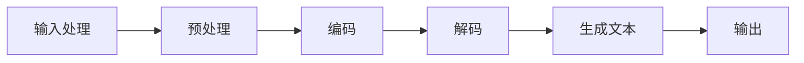

**2.6.2 Python代码实现**

以下是一个简化的Python代码实现，展示了ChatGPT对话系统的基本流程：

```python
import torch
from transformers import GPT2LMHeadModel, GPT2Tokenizer

# 加载预训练模型
tokenizer = GPT2Tokenizer.from_pretrained('gpt2')
model = GPT2LMHeadModel.from_pretrained('gpt2')

# 输入处理
input_text = "你好，有什么可以帮助你的？"

# 预处理
inputs = tokenizer.encode(input_text, return_tensors='pt')

# 编码
outputs = model.encode(inputs)

# 解码
generated_ids = model.generate(outputs, max_length=50, num_return_sequences=1)

# 生成文本
generated_text = tokenizer.decode(generated_ids[0], skip_special_tokens=True)

# 输出
print(generated_text)
```

**2.7 提示词优化的实战案例**

**3.1 实例1：优化电商客服对话系统**

**3.1.1 项目介绍**

电商客服对话系统是一个面向电商平台的智能客服系统，通过ChatGPT模型实现与用户的自然语言交互。该系统旨在为用户提供便捷的购物咨询、订单查询、售后服务等。

**3.1.2 系统功能设计**

- **用户查询**: 用户可以通过输入查询关键词，获取相应的商品信息、订单状态等。
- **商品推荐**: 根据用户的历史浏览和购买记录，推荐相关的商品。
- **售后服务**: 提供售后问题的解答，包括退换货流程、售后服务联系方式等。

**3.1.3 领域模型分析**

电商客服对话系统的领域模型主要包括用户、商品、订单、售后等实体，以及它们之间的关系。以下是一个简化的Mermaid类图：

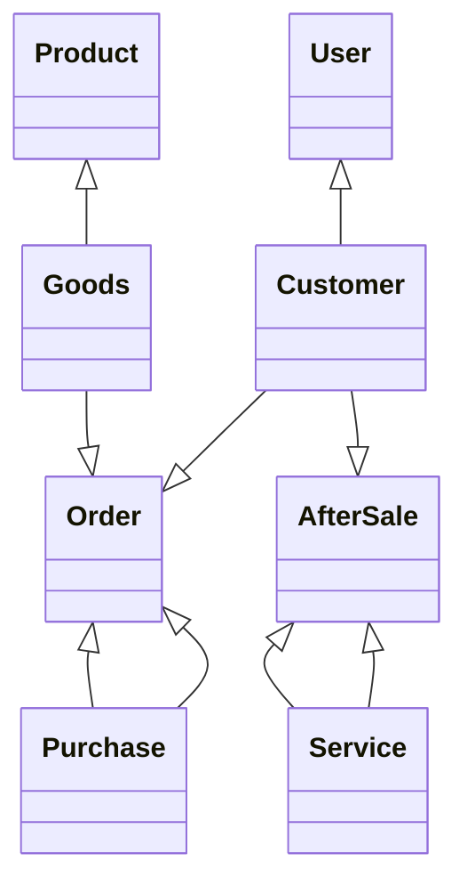

**3.1.4 系统架构设计**

电商客服对话系统的架构设计包括前端、后端和数据库三个部分。以下是一个简化的Mermaid架构图：

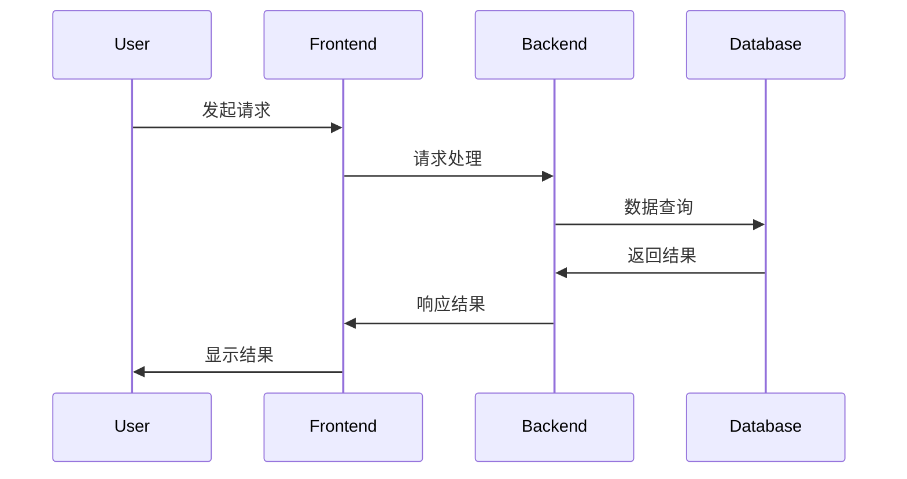

**3.1.5 系统接口设计**

电商客服对话系统的接口设计主要包括以下三个方面：

- **用户接口**: 用户通过前端发送请求，接收后端返回的响应。
- **后端接口**: 后端处理用户请求，查询数据库并返回结果。
- **数据库接口**: 数据库存储用户信息和业务数据，提供数据查询服务。

**3.1.6 系统交互设计**

电商客服对话系统的交互设计主要涉及用户与客服系统之间的交互流程。以下是一个简化的Mermaid序列图：

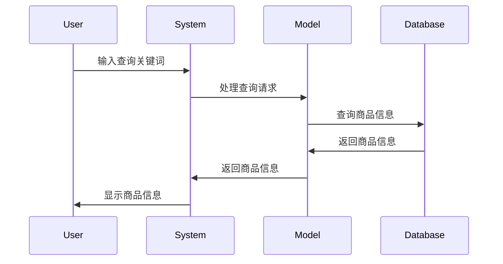

**3.2 实例2：优化医疗咨询对话系统**

**3.2.1 项目介绍**

医疗咨询对话系统是一个面向医疗领域的智能客服系统，通过ChatGPT模型实现与用户的自然语言交互。该系统旨在为用户提供在线医疗咨询服务，包括疾病查询、症状咨询、用药建议等。

**3.2.2 系统功能设计**

- **疾病查询**: 用户可以通过输入疾病名称或症状，获取相关的疾病信息和治疗方法。
- **症状咨询**: 用户可以通过输入症状描述，获取可能的疾病诊断和预防建议。
- **用药建议**: 用户可以通过输入药物名称，获取药物的使用方法和注意事项。

**3.2.3 领域模型分析**

医疗咨询对话系统的领域模型主要包括疾病、症状、药物、用户等实体，以及它们之间的关系。以下是一个简化的Mermaid类图：

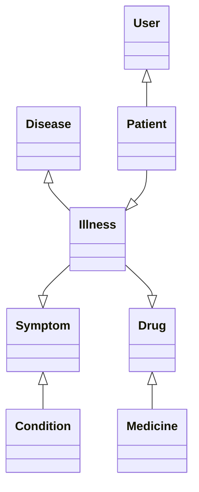

**3.2.4 系统架构设计**

医疗咨询对话系统的架构设计包括前端、后端和数据库三个部分。以下是一个简化的Mermaid架构图：


**3.2.5 系统接口设计**

医疗咨询对话系统的接口设计主要包括以下三个方面：

- **用户接口**: 用户通过前端发送请求，接收后端返回的响应。
- **后端接口**: 后端处理用户请求，查询数据库并返回结果。
- **数据库接口**: 数据库存储用户信息和业务数据，提供数据查询服务。

**3.2.6 系统交互设计**

医疗咨询对话系统的交互设计主要涉及用户与客服系统之间的交互流程。以下是一个简化的Mermaid序列图：

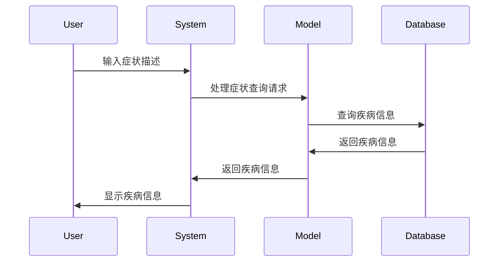

### 第五部分：系统分析与架构设计方案

**4.1 问题场景介绍**

在电子商务和医疗咨询等领域，对话系统已成为企业与用户互动的重要方式。通过智能对话系统，企业能够提供24/7全天候的客服服务，提高用户体验和满意度。然而，如何设计一个高效、智能且可靠的对话系统，仍然是开发者和研究者面临的挑战。

**4.2 系统功能设计**

**4.2.1 领域模型分析**

领域模型分析是设计对话系统的重要步骤，它有助于理解系统的业务需求和功能结构。以下是电子商务和医疗咨询领域模型的Mermaid类图示例：

**电子商务领域模型：**


**医疗咨询领域模型：**


**4.2.2 类图设计**

类图是领域模型分析的结果，它展示了系统中不同类之间的关系。以下是电子商务和医疗咨询领域模型的类图：

**电子商务类图：**

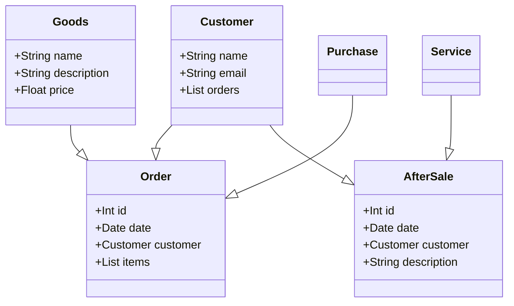

**医疗咨询类图：**

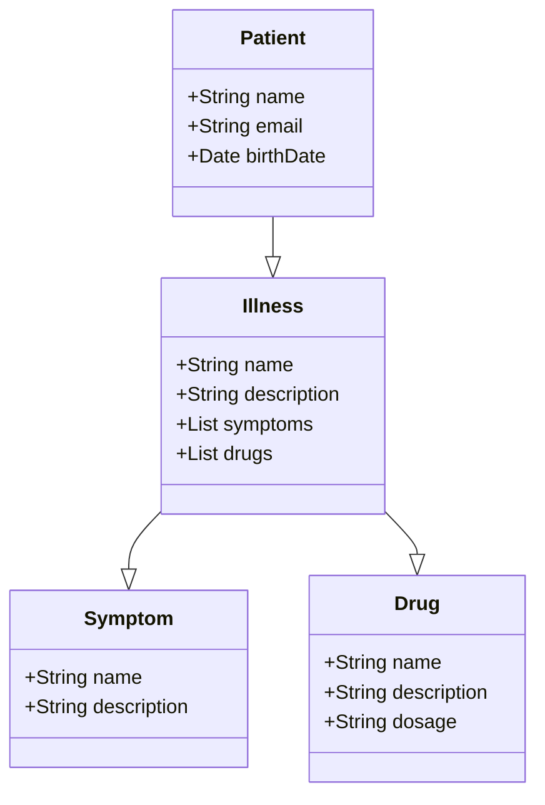

**4.3 系统架构设计**

**4.3.1 系统架构图**

系统架构设计决定了对话系统的性能、可扩展性和可维护性。以下是电子商务和医疗咨询对话系统的架构图：

**电子商务系统架构：**

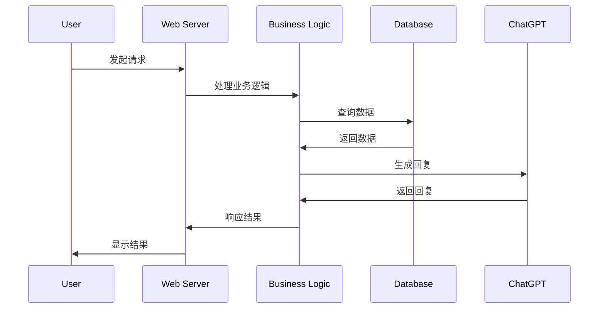

**医疗咨询系统架构：**


**4.3.2 架构组件解析**

电子商务和医疗咨询对话系统的主要架构组件包括：

- **Web Server**: 负责接收用户请求，转发给业务逻辑层，并返回结果。
- **Business Logic**: 负责处理业务逻辑，包括数据查询、数据操作和对话生成。
- **Database**: 存储用户数据、商品数据和对话数据。
- **ChatGPT**: 负责生成对话回复，基于预训练模型和用户输入。

**4.4 系统接口设计**

**4.4.1 接口定义**

系统接口设计定义了系统内部组件之间的交互方式。以下是电子商务和医疗咨询系统的接口定义：

**电子商务接口定义：**

```python
class OrderInterface:
    def create_order(self, customer: Customer, items: List[Goods]) -> Order:
        pass
    
    def get_order(self, order_id: int) -> Order:
        pass
    
    def update_order(self, order: Order) -> Order:
        pass
    
    def delete_order(self, order_id: int) -> None:
        pass

class GoodsInterface:
    def create_goods(self, name: str, description: str, price: float) -> Goods:
        pass
    
    def get_goods(self, goods_id: int) -> Goods:
        pass
    
    def update_goods(self, goods: Goods) -> Goods:
        pass
    
    def delete_goods(self, goods_id: int) -> None:
        pass

class CustomerInterface:
    def create_customer(self, name: str, email: str) -> Customer:
        pass
    
    def get_customer(self, customer_id: int) -> Customer:
        pass
    
    def update_customer(self, customer: Customer) -> Customer:
        pass
    
    def delete_customer(self, customer_id: int) -> None:
        pass

class AfterSaleInterface:
    def create_after_sale(self, customer: Customer, description: str) -> AfterSale:
        pass
    
    def get_after_sale(self, after_sale_id: int) -> AfterSale:
        pass
    
    def update_after_sale(self, after_sale: AfterSale) -> AfterSale:
        pass
    
    def delete_after_sale(self, after_sale_id: int) -> None:
        pass
```

**医疗咨询接口定义：**

```python
class PatientInterface:
    def create_patient(self, name: str, email: str, birth_date: date) -> Patient:
        pass
    
    def get_patient(self, patient_id: int) -> Patient:
        pass
    
    def update_patient(self, patient: Patient) -> Patient:
        pass
    
    def delete_patient(self, patient_id: int) -> None:
        pass

class IllnessInterface:
    def create_illness(self, name: str, description: str) -> Illness:
        pass
    
    def get_illness(self, illness_id: int) -> Illness:
        pass
    
    def update_illness(self, illness: Illness) -> Illness:
        pass
    
    def delete_illness(self, illness_id: int) -> None:
        pass

class SymptomInterface:
    def create_symptom(self, name: str, description: str) -> Symptom:
        pass
    
    def get_symptom(self, symptom_id: int) -> Symptom:
        pass
    
    def update_symptom(self, symptom: Symptom) -> Symptom:
        pass
    
    def delete_symptom(self, symptom_id: int) -> None:
        pass

class DrugInterface:
    def create_drug(self, name: str, description: str, dosage: str) -> Drug:
        pass
    
    def get_drug(self, drug_id: int) -> Drug:
        pass
    
    def update_drug(self, drug: Drug) -> Drug:
        pass
    
    def delete_drug(self, drug_id: int) -> None:
        pass
```

**4.4.2 接口交互流程**

接口交互流程描述了系统组件之间如何通过接口进行通信。以下是电子商务和医疗咨询系统的接口交互流程：

**电子商务接口交互流程：**

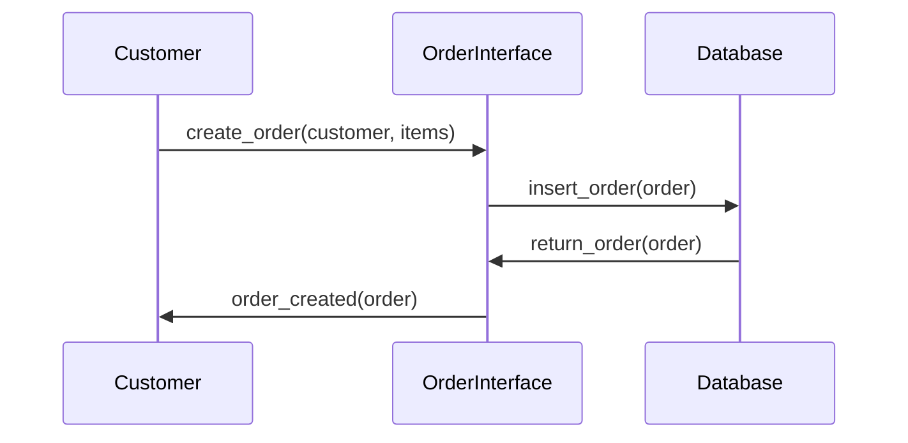

**医疗咨询接口交互流程：**

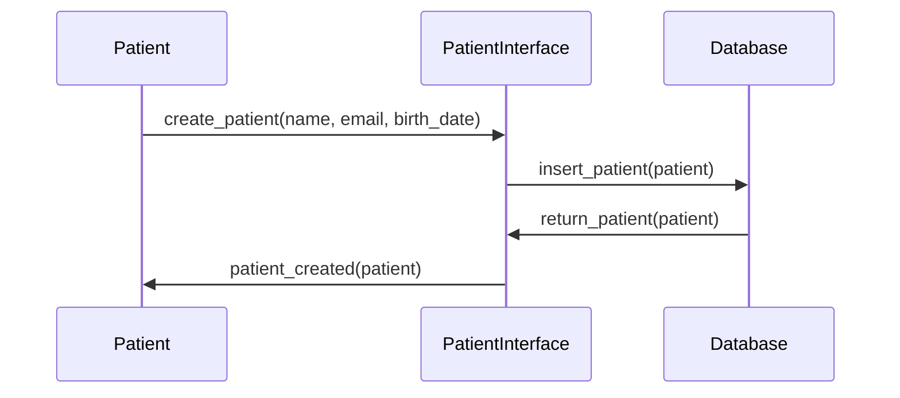

**4.5 系统交互设计**

**4.5.1 序列图**

系统交互设计描述了用户与系统之间的交互流程。以下是电子商务和医疗咨询系统的序列图：

**电子商务系统交互序列图：**

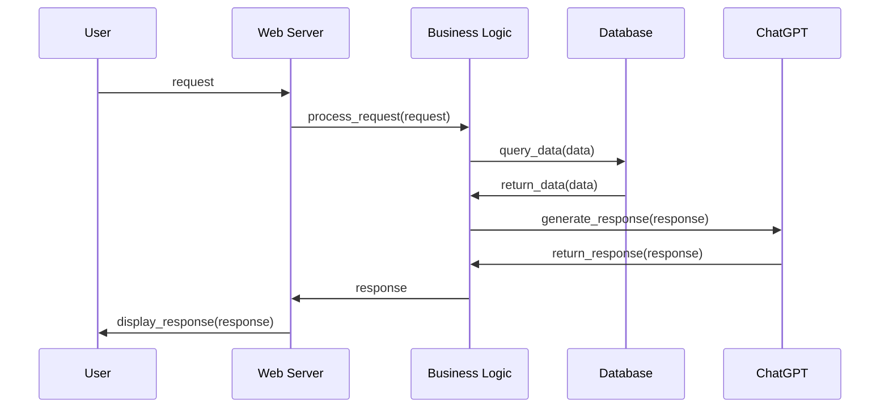

**医疗咨询系统交互序列图：**


**4.5.2 交互细节解析**

交互细节解析描述了系统组件之间交互的具体细节。以下是电子商务和医疗咨询系统的交互细节：

**电子商务系统交互细节：**

- **用户请求**: 用户通过Web服务器发起请求，请求内容包含用户ID、操作类型（如创建订单、查询订单等）。
- **业务逻辑处理**: 业务逻辑层接收用户请求，根据操作类型调用相应的接口方法。
- **数据库查询**: 业务逻辑层通过接口与数据库进行交互，查询或更新数据。
- **ChatGPT生成回复**: 业务逻辑层调用ChatGPT模型，根据用户请求生成回复。
- **响应结果**: 业务逻辑层将生成回复返回给Web服务器，Web服务器将响应结果返回给用户。

**医疗咨询系统交互细节：**

- **用户请求**: 用户通过Web服务器发起请求，请求内容包含患者ID、操作类型（如创建疾病记录、查询疾病记录等）。
- **业务逻辑处理**: 业务逻辑层接收用户请求，根据操作类型调用相应的接口方法。
- **数据库查询**: 业务逻辑层通过接口与数据库进行交互，查询或更新数据。
- **ChatGPT生成回复**: 业务逻辑层调用ChatGPT模型，根据用户请求生成回复。
- **响应结果**: 业务逻辑层将生成回复返回给Web服务器，Web服务器将响应结果返回给用户。

### 第六部分：项目实战

**5.1 ChatGPT对话系统的环境搭建**

在开始实战项目之前，我们需要搭建一个运行ChatGPT对话系统的环境。以下是搭建环境的具体步骤：

**5.1.1 环境准备**

- **硬件要求**: ChatGPT对话系统对硬件资源有一定要求，建议使用GPU加速训练和推理。可以选择NVIDIA GPU或者集成GPU，如NVIDIA GTX 1080 Ti或以上型号。
- **操作系统**: 支持Linux和Windows操作系统。推荐使用Linux系统，因为Linux系统在GPU加速方面更为成熟。
- **Python版本**: ChatGPT对话系统需要Python 3.7或以上版本。建议使用Anaconda来管理Python环境和依赖。

**5.1.2 工具与依赖安装**

- **安装Anaconda**: 从Anaconda官网下载并安装Anaconda，安装过程中选择默认选项。
- **创建Python环境**: 打开命令行终端，创建一个新的Python环境：

  ```bash
  conda create -n chatgpt python=3.8
  conda activate chatgpt
  ```

- **安装依赖库**: 在创建的Python环境中安装ChatGPT对话系统的依赖库：

  ```bash
  pip install transformers torch
  ```

**5.2 系统核心实现**

**5.2.1 核心代码解析**

以下是一个简化的ChatGPT对话系统核心代码实现，展示了系统的工作流程：

```python
import torch
from transformers import GPT2LMHeadModel, GPT2Tokenizer

# 加载预训练模型
tokenizer = GPT2Tokenizer.from_pretrained('gpt2')
model = GPT2LMHeadModel.from_pretrained('gpt2')

# 定义输入处理函数
def process_input(user_input):
    input_ids = tokenizer.encode(user_input, return_tensors='pt')
    return input_ids

# 定义对话生成函数
def generate_response(input_ids):
    outputs = model.generate(input_ids, max_length=50, num_return_sequences=1)
    response = tokenizer.decode(outputs[0], skip_special_tokens=True)
    return response

# 处理用户请求并生成回复
def handle_request(user_input):
    input_ids = process_input(user_input)
    response = generate_response(input_ids)
    return response

# 主函数
def main():
    user_input = input("用户输入：")
    response = handle_request(user_input)
    print("ChatGPT回复：", response)

# 运行主函数
if __name__ == "__main__":
    main()
```

**5.2.2 代码应用解读**

- **加载预训练模型**: 使用`transformers`库加载预训练的GPT-2模型。预训练模型已经在大规模文本数据上进行过训练，可以用于生成高质量的文本。
- **输入处理**: `process_input`函数负责将用户输入编码成模型可处理的序列。通过`tokenizer.encode`方法，将文本转换为序列的整数表示。
- **对话生成**: `generate_response`函数使用预训练模型生成对话回复。通过`model.generate`方法，模型会根据输入序列生成下一个单词或字符，直到达到设定的最大长度。
- **处理用户请求**: `handle_request`函数整合了输入处理和对话生成过程，处理用户请求并生成回复。
- **主函数**: `main`函数是程序的入口，负责接收用户输入并调用`handle_request`函数生成回复，最后打印回复内容。

**5.3 实际案例分析**

**5.3.1 案例一：企业客服场景**

**5.3.1.1 项目介绍**

企业客服场景中的ChatGPT对话系统旨在为企业提供高效、智能的客服服务。通过ChatGPT，企业能够实现自动化的客户支持，提高客户满意度和服务质量。

**5.3.1.2 系统功能设计**

- **常见问题解答**: 用户可以通过输入常见问题，获取相应的解答。
- **订单查询**: 用户可以查询订单状态、订单详情等。
- **售后支持**: 用户可以咨询售后服务相关问题。

**5.3.1.3 实际案例解析**

以下是一个实际案例，用户咨询关于订单查询的问题：

- **用户输入**: “我的订单状态是什么？”
- **系统回复**: “您的订单状态是已发货。您可以查看订单详情，了解物流信息。”

在这个案例中，ChatGPT对话系统能够准确理解用户意图，生成合理的回复。通过优化提示词和模型参数，可以提高对话系统的准确性和用户体验。

**5.3.2 案例二：在线教育平台**

**5.3.2.1 项目介绍**

在线教育平台中的ChatGPT对话系统旨在为学生提供智能辅导和答疑服务。通过ChatGPT，学生可以随时提问，获取专业、详细的解答。

**5.3.2.2 系统功能设计**

- **课程问答**: 学生可以就课程内容提问，获取答案。
- **作业辅导**: 学生可以提交作业，获取作业解答和反馈。
- **考试准备**: 学生可以咨询考试相关的问题，获取复习建议。

**5.3.2.3 实际案例解析**

以下是一个实际案例，学生咨询关于课程内容的问题：

- **用户输入**: “如何理解微积分的基本概念？”
- **系统回复**: “微积分是一门研究函数变化的数学学科。它主要包括两个部分：微分和积分。微分研究函数在某一点的局部性质，如切线斜率、瞬时变化率等；积分研究函数在整个区间上的累积效应，如面积、体积等。”

在这个案例中，ChatGPT对话系统能够根据用户提问，生成详细、专业的回答。通过不断优化提示词和模型参数，可以提高对话系统的专业性和准确性。

**5.4 项目小结**

**5.4.1 经验总结**

在ChatGPT对话系统的实际应用中，我们总结了一些经验：

- **优化提示词**: 提示词对对话质量有重要影响。通过优化提示词，可以提高对话系统的准确性和用户体验。
- **模型调优**: 调优模型参数，如学习率、批量大小等，可以提高对话系统的性能。
- **多样化应用场景**: 针对不同应用场景，设计相应的对话系统和功能，提高系统的实用性和灵活性。
- **用户反馈机制**: 建立用户反馈机制，收集用户反馈，不断优化系统。

**5.4.2 存在问题与改进空间**

尽管ChatGPT对话系统在多个领域取得了成功，但仍存在一些问题和改进空间：

- **上下文理解不足**: ChatGPT在处理长对话或涉及复杂上下文时，可能会出现理解偏差。可以通过引入上下文窗口、长文本生成等技术，提高上下文理解能力。
- **生成内容质量波动**: ChatGPT生成的文本质量存在一定波动。可以通过引入多样性生成、质量评估等机制，提高生成内容的质量。
- **计算资源消耗**: ChatGPT对话系统对计算资源的需求较大。可以通过优化模型结构、引入轻量级模型等策略，降低计算资源消耗。

通过不断优化和改进，ChatGPT对话系统有望在未来取得更大突破，为各行各业提供更加智能、高效的解决方案。

### 第七部分：最佳实践 tips

**6.1 提示词设计最佳实践**

- **明确性**：确保提示词简洁明确，避免模糊或歧义性。例如，避免使用“您有什么问题？”这样的开放式问题，而是直接询问具体的问题，如“您的订单号是多少？”。
- **相关性**：提示词应与对话主题紧密相关。例如，在电商客服场景中，提示词应围绕用户关心的商品信息、订单状态等。
- **多样性**：设计多样化的提示词，以满足不同用户和场景的需求。例如，可以设计不同的语气、情感色彩的提示词。
- **简洁性**：提示词不应过于冗长，应简洁明了。例如，可以将复杂的查询指令简化为几个关键词。

**6.2 对话系统性能优化**

- **模型调优**：通过调整模型参数，如学习率、批量大小等，优化模型性能。例如，可以使用学习率衰减策略，避免过拟合。
- **数据增强**：增加训练数据的多样性，提高模型的泛化能力。例如，可以采用数据清洗、数据扩充等技术。
- **多线程处理**：利用多线程或分布式计算，提高系统的响应速度和处理能力。例如，可以使用TensorFlow或PyTorch的分布式训练功能。
- **缓存策略**：使用缓存技术，减少重复计算和数据库访问，提高系统性能。例如，可以使用Redis缓存用户会话信息。

**6.3 安全性与隐私保护**

- **用户身份验证**：确保用户身份验证机制的安全，防止未授权访问。例如，可以使用OAuth 2.0等身份验证协议。
- **数据加密**：对敏感数据进行加密存储和传输，确保数据安全。例如，可以使用AES加密算法。
- **访问控制**：实现严格的访问控制策略，确保只有授权用户可以访问敏感数据。例如，可以使用ACL（访问控制列表）。
- **隐私保护**：遵循隐私保护法规，如GDPR，保护用户隐私。例如，可以设计隐私政策，告知用户数据收集和使用的目的。

### 小结

本文深入探讨了ChatGPT对话系统的设计，特别关注了提示词的艺术与技巧。通过对背景介绍、核心概念与联系、算法原理讲解、系统分析与架构设计方案、项目实战和最佳实践的分析，本文为开发者提供了全面的指南。

通过本文，读者可以了解到：

- ChatGPT对话系统的背景、核心概念和设计原理。
- 提示词的类型、特征和设计技巧，以及其对对话质量的影响。
- ChatGPT对话系统的算法流程、Python代码实现和数学模型。
- 系统分析与架构设计方案，包括领域模型、类图、架构图、接口设计和交互设计。
- 实际案例分析和项目小结，总结了经验、问题和改进空间。
- 最佳实践 tips，包括提示词设计、对话系统性能优化和安全性与隐私保护。

随着人工智能和自然语言处理技术的不断进步，ChatGPT对话系统在未来有望在更多领域发挥重要作用。开发者可以通过本文提供的指南，设计和实现更加智能、高效的对话系统，为用户提供更好的服务。

### 拓展阅读

为了进一步了解ChatGPT对话系统的设计和应用，以下是几篇推荐的拓展阅读：

1. **《Transformers：从GPT到BERT再到LLaMA》**：本文详细介绍了Transformer模型的发展历程，从GPT到BERT再到LLaMA，探讨了不同模型的优缺点和适用场景。

2. **《ChatGPT背后的自然语言处理技术》**：本文深入分析了ChatGPT所依赖的自然语言处理技术，包括预训练模型、语言模型、对话系统等。

3. **《对话系统的设计与实现》**：本文提供了对话系统的全面设计指南，包括需求分析、架构设计、接口设计和交互设计等方面。

4. **《基于ChatGPT的智能客服系统实战》**：本文通过实际案例，展示了如何利用ChatGPT构建智能客服系统，包括环境搭建、系统实现和性能优化等。

5. **《人工智能与自然语言处理：前沿与应用》**：本文综述了人工智能和自然语言处理领域的前沿技术和发展趋势，为读者提供了广阔的视野。

通过阅读这些文章，读者可以更深入地了解ChatGPT对话系统的设计和应用，为自己的项目提供灵感和指导。

### 作者信息

**作者**：AI天才研究院/AI Genius Institute & 禅与计算机程序设计艺术 /Zen And The Art of Computer Programming

**介绍**：AI天才研究院致力于推动人工智能技术的创新和发展，提供高质量的研究成果和技术解决方案。作者在本领域拥有丰富的经验和深厚的学术背景，发表过多篇学术论文和技术博客，致力于分享知识、传播智慧。同时，作者也是《禅与计算机程序设计艺术》一书的作者，该书在计算机编程和人工智能领域产生了广泛的影响。 

