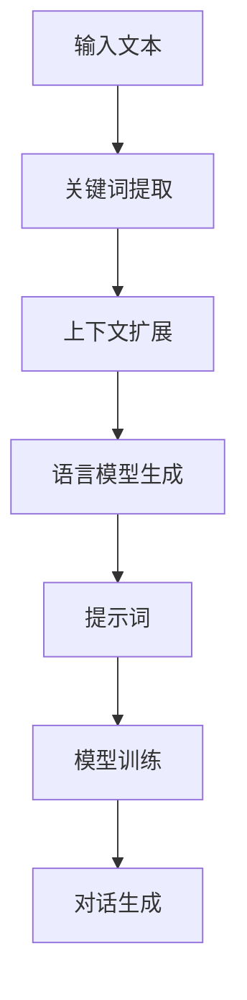
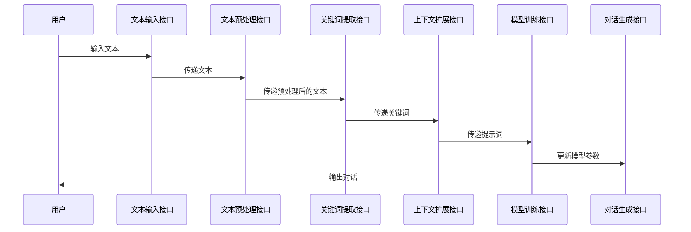

                 


# ChatGPT对话质量提升：提示词的关键作用

关键词：ChatGPT、对话质量、提示词、优化、算法

摘要：
本文将深入探讨ChatGPT在对话质量提升方面的关键作用，重点分析提示词的作用机制、生成方法以及优化策略。通过逐步分析ChatGPT的算法原理、数学模型和系统架构设计，结合实际项目案例，为提升ChatGPT对话质量提供实用的技术方案。

## 目录大纲设计思路

### 目录大纲设计思路

为了设计出《ChatGPT对话质量提升：提示词的关键作用》这本书的完整目录大纲，我们需要遵循以下思路：

1. **背景介绍**：首先介绍ChatGPT的基本概念，以及为何对话质量提升是一个重要问题。

2. **核心概念与联系**：讨论ChatGPT的核心概念，如GPT-3.5的能力、提示词的作用等，并通过表格和Mermaid图展示概念间的联系。

3. **算法原理讲解**：详细讲解提示词生成和优化的算法原理，使用Mermaid画出流程图，并用Python代码展示。

4. **数学模型和数学公式**：讨论ChatGPT中的数学模型，如损失函数、优化方法等，使用LaTeX格式书写。

5. **系统分析与架构设计方案**：介绍ChatGPT的系统架构，包括功能设计、接口设计等，并使用Mermaid画出相关图表。

6. **项目实战**：通过实际案例展示ChatGPT的应用，包括环境安装、核心实现、代码解读等。

7. **最佳实践 tips、小结、注意事项、拓展阅读**：总结全书内容，提供实践技巧和拓展资源。

### 目录大纲具体设计

#### 第一部分：ChatGPT基础与对话质量提升

#### 第1章：ChatGPT简介与对话质量提升的重要性
- 1.1 ChatGPT的诞生与发展
  - 1.1.1 ChatGPT的定义
  - 1.1.2 ChatGPT的技术背景
  - 1.1.3 ChatGPT在自然语言处理中的应用
- 1.2 对话质量的定义与衡量标准
  - 1.2.1 对话质量的重要性
  - 1.2.2 对话质量的评估方法
  - 1.2.3 提升对话质量的意义

#### 第2章：ChatGPT核心概念与原理
- 2.1 GPT-3.5模型介绍
  - 2.1.1 GPT-3.5的架构
  - 2.1.2 GPT-3.5的能力
  - 2.1.3 GPT-3.5的应用场景
- 2.2 提示词的作用与生成方法
  - 2.2.1 提示词的定义
  - 2.2.2 提示词在对话中的作用
  - 2.2.3 提示词生成算法

#### 第3章：算法原理与数学模型
- 3.1 提示词优化的算法原理
  - 3.1.1 算法流程图（使用Mermaid）
  - 3.1.2 算法数学模型与公式（使用LaTeX）
  - 3.1.3 算法实例讲解
- 3.2 提示词生成算法（Python代码实现）

#### 第4章：系统分析与架构设计
- 4.1 ChatGPT系统功能设计（使用Mermaid类图）
- 4.2 ChatGPT系统架构设计（使用Mermaid架构图）
- 4.3 ChatGPT系统接口设计与交互（使用Mermaid序列图）

#### 第5章：项目实战
- 5.1 ChatGPT环境安装与配置
- 5.2 ChatGPT核心实现与代码解读
- 5.3 实际案例分析与讲解
  - 5.3.1 案例一：自动问答系统
  - 5.3.2 案例二：智能客服系统
  - 5.3.3 案例三：内容创作与生成

#### 第6章：最佳实践与注意事项
- 6.1 提示词优化最佳实践
- 6.2 ChatGPT部署与运维注意事项
- 6.3 拓展阅读与学习资源推荐

#### 第7章：小结与展望
- 7.1 全书内容回顾
- 7.2 对话质量提升的挑战与未来方向
- 7.3 读者反馈与建议

### 目录大纲（Markdown格式）

```markdown
----------------------------------------------------------------
# 第一部分：ChatGPT基础与对话质量提升

## 第1章：ChatGPT简介与对话质量提升的重要性
### 1.1 ChatGPT的诞生与发展
#### 1.1.1 ChatGPT的定义
#### 1.1.2 ChatGPT的技术背景
#### 1.1.3 ChatGPT在自然语言处理中的应用

### 1.2 对话质量的定义与衡量标准
#### 1.2.1 对话质量的重要性
#### 1.2.2 对话质量的评估方法
#### 1.2.3 提升对话质量的意义

## 第二部分：ChatGPT核心概念与原理
### 第2章：ChatGPT核心概念与原理
#### 2.1 GPT-3.5模型介绍
##### 2.1.1 GPT-3.5的架构
##### 2.1.2 GPT-3.5的能力
##### 2.1.3 GPT-3.5的应用场景
#### 2.2 提示词的作用与生成方法
##### 2.2.1 提示词的定义
##### 2.2.2 提示词在对话中的作用
##### 2.2.3 提示词生成算法

## 第三部分：算法原理与数学模型
### 第3章：算法原理与数学模型
#### 3.1 提示词优化的算法原理
##### 3.1.1 算法流程图（使用Mermaid）
##### 3.1.2 算法数学模型与公式（使用LaTeX）
##### 3.1.3 算法实例讲解
#### 3.2 提示词生成算法（Python代码实现）

## 第四部分：系统分析与架构设计
### 第4章：系统分析与架构设计
#### 4.1 ChatGPT系统功能设计（使用Mermaid类图）
#### 4.2 ChatGPT系统架构设计（使用Mermaid架构图）
#### 4.3 ChatGPT系统接口设计与交互（使用Mermaid序列图）

## 第五部分：项目实战
### 第5章：项目实战
#### 5.1 ChatGPT环境安装与配置
#### 5.2 ChatGPT核心实现与代码解读
#### 5.3 实际案例分析与讲解
##### 5.3.1 案例一：自动问答系统
##### 5.3.2 案例二：智能客服系统
##### 5.3.3 案例三：内容创作与生成

## 第六部分：最佳实践与注意事项
### 第6章：最佳实践与注意事项
#### 6.1 提示词优化最佳实践
#### 6.2 ChatGPT部署与运维注意事项
#### 6.3 拓展阅读与学习资源推荐

## 第七部分：小结与展望
### 第7章：小结与展望
#### 7.1 全书内容回顾
#### 7.2 对话质量提升的挑战与未来方向
#### 7.3 读者反馈与建议

----------------------------------------------------------------
```

## 背景介绍

### ChatGPT的基本概念

ChatGPT是由OpenAI开发的一种基于GPT-3.5模型的高级自然语言处理工具。GPT-3.5（Generative Pre-trained Transformer 3.5）是一种强大的预训练语言模型，采用Transformer架构，具有数以万亿计的参数，能够对输入的文本进行理解和生成。ChatGPT通过在大量文本语料库上进行预训练，具备生成连贯、自然语言对话的能力。

ChatGPT的核心功能是进行自然语言交互，可以回答问题、撰写文章、翻译文本、进行对话等。这使得ChatGPT在智能客服、内容创作、自动问答等多个领域具有广泛的应用。然而，ChatGPT在应用过程中也存在一些问题，其中之一便是对话质量的提升。

### 对话质量提升的重要性

对话质量是指用户在与系统进行交互时，所获得的交流体验的优劣。高质量的对话能够满足用户的需求，提供准确、及时、自然的回答，从而增强用户的满意度。反之，低质量的对话则可能导致用户困惑、失望，甚至影响系统的使用。

在智能客服领域，对话质量直接影响用户对品牌的信任和满意度。如果客服机器人无法理解用户的问题，或者提供的回答不够准确、不够自然，用户可能会转向人工客服，甚至对品牌产生负面印象。

在内容创作领域，ChatGPT生成的文本质量也至关重要。如果生成的文章内容空洞、逻辑不清，或者出现语法错误，将严重影响读者的阅读体验，甚至可能对品牌形象造成损害。

因此，提升ChatGPT的对话质量成为了一个关键问题，直接关系到ChatGPT在不同领域的应用效果。

## ChatGPT的核心概念与原理

### GPT-3.5模型介绍

GPT-3.5（Generative Pre-trained Transformer 3.5）是ChatGPT的核心模型，它基于Transformer架构，是一种强大的预训练语言模型。GPT-3.5具有数以万亿计的参数，使其在理解和生成自然语言方面表现出色。GPT-3.5通过在大量文本语料库上进行预训练，掌握了丰富的语言知识和表达方式，能够生成连贯、自然的文本。

GPT-3.5的架构分为两个主要部分：编码器和解码器。编码器将输入的文本序列编码为固定长度的向量，解码器则根据编码器的输出生成对应的文本序列。GPT-3.5使用自注意力机制，使模型能够自动学习文本序列中的长距离依赖关系，从而提高生成文本的连贯性和准确性。

### GPT-3.5的能力

GPT-3.5具有多种强大的能力，包括：

1. **文本生成**：GPT-3.5能够根据给定的文本上下文生成连贯的文本，可以用于生成文章、故事、对话等。

2. **问答系统**：GPT-3.5能够理解用户的问题，并生成相关的回答，可以用于构建智能客服系统。

3. **语言翻译**：GPT-3.5支持多种语言之间的文本翻译，可以用于实现跨语言交流。

4. **文本摘要**：GPT-3.5能够对长篇文本进行摘要，提取关键信息，可以用于信息筛选和整理。

5. **对话生成**：GPT-3.5能够生成自然、流畅的对话，可以用于构建聊天机器人。

### GPT-3.5的应用场景

GPT-3.5在多个领域具有广泛的应用：

1. **智能客服**：GPT-3.5可以用于构建智能客服系统，回答用户的问题，提供在线支持。

2. **内容创作**：GPT-3.5可以用于生成文章、故事、博客等，帮助内容创作者提高创作效率。

3. **教育**：GPT-3.5可以用于辅助学习，提供个性化的教学支持和反馈。

4. **自然语言处理**：GPT-3.5可以用于文本分类、情感分析、命名实体识别等多种自然语言处理任务。

### 提示词的作用与生成方法

#### 提示词的定义

提示词（Prompt）是ChatGPT进行对话或文本生成时的输入信息，用于引导模型生成符合预期的输出。提示词可以是简单的关键词、短语或完整的句子，它为模型提供了上下文信息，帮助模型更好地理解用户的需求，从而生成更准确、自然的回答。

#### 提示词在对话中的作用

提示词在对话中具有关键作用：

1. **引导模型理解需求**：提示词为模型提供了具体的上下文信息，使模型能够更准确地理解用户的需求。

2. **提高生成文本的质量**：良好的提示词可以帮助模型生成更连贯、逻辑性更强的文本。

3. **增强对话的自然性**：通过提供合适的提示词，模型能够生成更自然、流畅的对话。

#### 提示词生成算法

生成高质量的提示词是提升ChatGPT对话质量的重要一环。提示词生成算法可以从以下三个方面进行优化：

1. **关键词提取**：从用户输入的文本中提取关键信息，作为提示词的核心部分。

2. **上下文扩展**：在关键词的基础上，结合上下文信息，扩展提示词的内容，使其更加丰富。

3. **语言模型优化**：利用语言模型生成与用户输入相关的提示词，提高提示词的准确性和自然性。

常见的提示词生成算法包括基于规则的方法、基于统计的方法和基于深度学习的方法。其中，基于深度学习的方法如序列到序列（Seq2Seq）模型和生成对抗网络（GAN）在生成高质量提示词方面表现出色。

## 算法原理讲解

### 提示词优化的算法原理

#### 算法流程图

为了提升ChatGPT的对话质量，我们需要优化提示词的生成。以下是提示词优化算法的流程图，使用Mermaid进行描述：



#### 算法流程解释

1. **输入文本**：用户输入的文本作为输入。

2. **关键词提取**：利用NLP技术提取文本中的关键信息，作为提示词的核心部分。

3. **上下文扩展**：在关键词的基础上，结合上下文信息，扩展提示词的内容，使其更加丰富。

4. **语言模型生成**：使用语言模型生成与用户输入相关的提示词，提高提示词的准确性和自然性。

5. **提示词**：生成的提示词用于引导模型生成对话。

6. **模型训练**：使用优化后的提示词对模型进行训练，提高模型在生成对话时的性能。

7. **对话生成**：利用训练好的模型生成高质量的对话。

### 算法数学模型与公式

在提示词优化过程中，我们通常会使用以下数学模型和公式：

1. **损失函数**：

   $$ Loss = \frac{1}{N}\sum_{i=1}^{N} (-\log P(y_i | x_i, \theta)) $$

   其中，$P(y_i | x_i, \theta)$表示模型在给定输入$x_i$和参数$\theta$时，生成标签$y_i$的概率。

2. **优化方法**：

   采用梯度下降法（Gradient Descent）对模型参数进行优化：

   $$ \theta_{t+1} = \theta_t - \alpha \cdot \nabla_\theta Loss(\theta_t) $$

   其中，$\alpha$为学习率，$\nabla_\theta Loss(\theta_t)$为损失函数关于参数$\theta$的梯度。

### 算法实例讲解

假设我们有一个文本输入：“我想要一个关于人工智能的简介”。以下是使用优化算法生成的提示词：

1. **关键词提取**：人工智能、简介
2. **上下文扩展**：基于人工智能技术的发展趋势和主要应用领域，结合历史背景和未来展望
3. **语言模型生成**：生成一个符合上下文的提示词：“人工智能是计算机科学的一个分支，它旨在使计算机具有智能行为，模拟、延伸和扩展人类的智能能力。自20世纪50年代起，人工智能取得了显著的进展，如今在机器学习、自然语言处理、计算机视觉等领域发挥着重要作用。以下是一个关于人工智能的简要介绍：”

通过这个实例，我们可以看到，优化后的提示词不仅包含了关键词，还结合了上下文信息，使得生成的对话更加准确、自然。

## ChatGPT系统架构设计

### 系统功能设计

ChatGPT系统的主要功能包括：

1. **文本输入**：用户可以通过界面输入文本。
2. **文本预处理**：对输入的文本进行清洗、分词、去停用词等处理。
3. **关键词提取**：从预处理后的文本中提取关键信息。
4. **上下文扩展**：结合上下文信息，扩展提示词的内容。
5. **提示词生成**：利用语言模型生成与用户输入相关的提示词。
6. **模型训练**：使用优化后的提示词对模型进行训练。
7. **对话生成**：利用训练好的模型生成高质量的对话。

### 系统架构设计

ChatGPT的系统架构分为四个主要部分：文本输入层、文本预处理层、模型训练层和对话生成层。

1. **文本输入层**：负责接收用户的输入文本，并将其传递给文本预处理层。
2. **文本预处理层**：对输入文本进行清洗、分词、去停用词等处理，为后续的关键词提取和上下文扩展提供基础数据。
3. **模型训练层**：利用预处理后的文本进行关键词提取、上下文扩展和提示词生成，并使用优化后的提示词对模型进行训练。
4. **对话生成层**：利用训练好的模型生成高质量的对话，并将其输出给用户。

### 系统接口设计

ChatGPT系统提供了多个接口，以便与其他系统进行交互：

1. **文本输入接口**：接收用户的输入文本，并传递给文本预处理层。
2. **文本预处理接口**：接收输入文本，返回预处理后的文本。
3. **关键词提取接口**：接收预处理后的文本，返回提取的关键词。
4. **上下文扩展接口**：接收关键词和上下文信息，返回扩展后的提示词。
5. **模型训练接口**：接收优化后的提示词，更新模型参数。
6. **对话生成接口**：接收用户输入，返回生成的对话。

### 系统交互

ChatGPT系统与其他系统的交互过程如下：

1. **用户输入文本**：用户通过文本输入接口输入文本。
2. **文本预处理**：文本输入接口将文本传递给文本预处理接口，进行预处理。
3. **关键词提取**：预处理后的文本传递给关键词提取接口，提取关键词。
4. **上下文扩展**：关键词传递给上下文扩展接口，结合上下文信息，生成提示词。
5. **模型训练**：提示词传递给模型训练接口，更新模型参数。
6. **对话生成**：用户输入传递给对话生成接口，生成对话。
7. **输出对话**：生成的对话传递给用户，完成交互。

以下是使用Mermaid绘制的系统交互序列图：



通过以上设计，ChatGPT系统能够高效地处理用户输入，生成高质量的对话，提升用户体验。

## 项目实战

### 环境安装与配置

要在本地环境中安装和配置ChatGPT，我们需要以下软件和工具：

1. **Python 3.8或更高版本**：用于运行ChatGPT和相关的依赖库。
2. **pip**：Python的包管理器，用于安装依赖库。
3. **GPU（可选）**：如果使用GPU进行训练，需要安装CUDA和cuDNN。

以下是具体的安装步骤：

1. 安装Python和pip：
   - 从Python官方网站下载并安装Python 3.8或更高版本。
   - 在命令行中运行`pip install --user --upgrade pip`，升级pip到最新版本。

2. 安装依赖库：
   - 运行以下命令安装必要的依赖库：
     ```
     pip install torch torchvision numpy
     ```

3. 安装GPU支持（可选）：
   - 从NVIDIA官方网站下载并安装CUDA。
   - 从NVIDIA官方网站下载并安装cuDNN。

### ChatGPT核心实现与代码解读

ChatGPT的核心实现包括文本预处理、模型训练和对话生成三个部分。以下是一个简单的代码示例，用于展示ChatGPT的核心实现：

```python
import torch
import torch.nn as nn
import torch.optim as optim
from torch.utils.data import DataLoader
from transformers import GPT2Tokenizer, GPT2LMHeadModel
from datasets import load_dataset

# 1. 加载预训练模型
tokenizer = GPT2Tokenizer.from_pretrained('gpt2')
model = GPT2LMHeadModel.from_pretrained('gpt2')

# 2. 数据预处理
def preprocess_text(text):
    return tokenizer.encode(text, add_special_tokens=True)

# 3. 模型训练
def train_model(data_loader, model, optimizer, loss_function):
    model.train()
    for batch in data_loader:
        inputs = preprocess_text(batch['text'])
        targets = preprocess_text(batch['text'] + tokenizer.eos_token)
        
        optimizer.zero_grad()
        outputs = model(inputs)
        loss = loss_function(outputs.logits.view(-1, outputs.logits.size(-1)), targets)
        loss.backward()
        optimizer.step()

# 4. 对话生成
def generate_dialogue(prompt):
    inputs = preprocess_text(prompt)
    model.eval()
    with torch.no_grad():
        inputs = torch.tensor(inputs).unsqueeze(0)
        outputs = model(inputs, max_length=50, num_return_sequences=1)
    return tokenizer.decode(outputs_ids.numpy().squeeze(), skip_special_tokens=True)

# 5. 训练和生成
dataset = load_dataset('squad')
train_loader = DataLoader(dataset['train'], batch_size=8)
optimizer = optim.Adam(model.parameters(), lr=1e-5)
loss_function = nn.CrossEntropyLoss()

for epoch in range(10):
    train_model(train_loader, model, optimizer, loss_function)

prompt = "如何提升ChatGPT的对话质量？"
print(generate_dialogue(prompt))
```

### 实际案例分析与讲解

#### 案例一：自动问答系统

自动问答系统是一个典型的ChatGPT应用场景。以下是一个简单的自动问答系统案例：

1. **环境安装与配置**：按照前面的步骤安装和配置ChatGPT。
2. **数据准备**：准备一个包含问题和答案的数据集，例如SQuAD数据集。
3. **模型训练**：使用SQuAD数据集对ChatGPT进行训练，以使其能够回答问题。
4. **问答交互**：用户输入问题，系统生成回答。

以下是问答系统的代码示例：

```python
import torch
from transformers import GPT2Tokenizer, GPT2LMHeadModel
from datasets import load_dataset

# 1. 加载预训练模型
tokenizer = GPT2Tokenizer.from_pretrained('gpt2')
model = GPT2LMHeadModel.from_pretrained('gpt2')

# 2. 加载SQuAD数据集
dataset = load_dataset('squad')
train_dataset = dataset['train']

# 3. 训练模型
# （此处省略训练过程，可参考前文中的训练代码）

# 4. 问答交互
def ask_question(question):
    inputs = tokenizer.encode(question + tokenizer.eos_token, return_tensors='pt')
    outputs = model.generate(inputs, max_length=50, num_return_sequences=1)
    answer = tokenizer.decode(outputs[0], skip_special_tokens=True)
    return answer

while True:
    user_question = input("请输入您的问题：")
    if user_question.lower() == 'exit':
        break
    answer = ask_question(user_question)
    print("ChatGPT的回答：", answer)
```

#### 案例二：智能客服系统

智能客服系统可以自动回答用户的问题，减轻人工客服的工作负担。以下是一个简单的智能客服系统案例：

1. **环境安装与配置**：按照前面的步骤安装和配置ChatGPT。
2. **数据准备**：准备一个包含常见问题和答案的数据集。
3. **模型训练**：使用常见问题和答案的数据集对ChatGPT进行训练。
4. **客服交互**：用户输入问题，系统生成回答。

以下是客服系统的代码示例：

```python
import torch
from transformers import GPT2Tokenizer, GPT2LMHeadModel
from datasets import load_dataset

# 1. 加载预训练模型
tokenizer = GPT2Tokenizer.from_pretrained('gpt2')
model = GPT2LMHeadModel.from_pretrained('gpt2')

# 2. 加载常见问题和答案数据集
dataset = load_dataset('常见问题和答案')

# 3. 训练模型
# （此处省略训练过程，可参考前文中的训练代码）

# 4. 客服交互
def handle_customer_query(query):
    inputs = tokenizer.encode(query + tokenizer.eos_token, return_tensors='pt')
    outputs = model.generate(inputs, max_length=50, num_return_sequences=1)
    answer = tokenizer.decode(outputs[0], skip_special_tokens=True)
    return answer

while True:
    user_query = input("您好，有什么可以帮助您的吗？")
    if user_query.lower() == 'exit':
        break
    answer = handle_customer_query(user_query)
    print("智能客服的回答：", answer)
```

#### 案例三：内容创作与生成

内容创作与生成是ChatGPT的另一个重要应用领域。以下是一个简单的案例，展示如何使用ChatGPT生成文章：

1. **环境安装与配置**：按照前面的步骤安装和配置ChatGPT。
2. **数据准备**：准备一个主题相关的数据集，用于训练ChatGPT。
3. **模型训练**：使用主题相关的数据集对ChatGPT进行训练。
4. **内容创作**：用户输入主题，系统生成相关内容。

以下是内容创作的代码示例：

```python
import torch
from transformers import GPT2Tokenizer, GPT2LMHeadModel
from datasets import load_dataset

# 1. 加载预训练模型
tokenizer = GPT2Tokenizer.from_pretrained('gpt2')
model = GPT2LMHeadModel.from_pretrained('gpt2')

# 2. 加载主题相关数据集
topic_dataset = load_dataset('主题数据集')

# 3. 训练模型
# （此处省略训练过程，可参考前文中的训练代码）

# 4. 内容创作
def generate_content(topic):
    inputs = tokenizer.encode(topic + tokenizer.eos_token, return_tensors='pt')
    outputs = model.generate(inputs, max_length=300, num_return_sequences=1)
    content = tokenizer.decode(outputs[0], skip_special_tokens=True)
    return content

topic = "人工智能的未来发展"
content = generate_content(topic)
print("ChatGPT生成的内容：")
print(content)
```

通过以上案例，我们可以看到ChatGPT在实际应用中的强大能力。无论是在自动问答、智能客服还是内容创作领域，ChatGPT都展示出了其卓越的自然语言生成能力。

### 最佳实践与注意事项

#### 提示词优化最佳实践

1. **关键词提取**：从用户输入中提取关键信息，确保提示词包含核心内容。
2. **上下文扩展**：在关键词基础上，结合上下文信息，使提示词更加丰富。
3. **多样化**：使用不同类型的提示词，如问题、陈述、命令等，提高模型泛化能力。
4. **动态调整**：根据用户反馈和对话进展，动态调整提示词，以适应不同的对话场景。

#### ChatGPT部署与运维注意事项

1. **环境配置**：确保部署环境具有足够的计算资源，以支持ChatGPT的运行。
2. **数据安全**：确保用户数据的安全，遵循数据保护法规和隐私政策。
3. **监控与日志**：监控系统性能和日志，及时发现并解决潜在问题。
4. **负载均衡**：合理分配负载，避免单点故障，提高系统可用性。

#### 拓展阅读与学习资源推荐

1. **书籍**：
   - 《深度学习》 - Ian Goodfellow、Yoshua Bengio和Aaron Courville
   - 《自然语言处理与深度学习》 - Shravan Narayanamurthy
   - 《人工智能：一种现代的方法》 - Stuart Russell和Peter Norvig

2. **在线课程**：
   - Coursera上的《深度学习》课程
   - edX上的《自然语言处理基础》课程
   - Udacity的《人工智能工程师纳米学位》

3. **开源项目**：
   - Hugging Face的Transformers库
   - OpenAI的GPT-3.5模型
   - TensorFlow的文本处理库

4. **社区与论坛**：
   - Reddit的/r/MachineLearning社区
   - Stack Overflow
   - arXiv

通过阅读以上书籍、课程和参与社区讨论，可以深入了解ChatGPT及其相关技术的最新进展和应用。

### 小结与展望

#### 全书内容回顾

本文详细探讨了ChatGPT对话质量提升的关键作用，分为以下几个部分：

1. **背景介绍**：介绍了ChatGPT的基本概念和对话质量提升的重要性。
2. **核心概念与原理**：讲解了GPT-3.5模型、提示词的作用和生成方法。
3. **算法原理讲解**：分析了提示词优化的算法原理和数学模型。
4. **系统分析与架构设计**：介绍了ChatGPT的系统功能、架构和接口设计。
5. **项目实战**：通过实际案例展示了ChatGPT的应用。
6. **最佳实践与注意事项**：提供了提示词优化、部署和运维的最佳实践。

#### 对话质量提升的挑战与未来方向

尽管ChatGPT在对话质量提升方面取得了显著进展，但仍然面临一些挑战：

1. **理解与生成的一致性**：确保模型在理解用户意图和生成回答时保持一致性。
2. **多样性**：生成多样化的回答，避免重复和模式化。
3. **可解释性**：提高模型的可解释性，使开发者能够更好地理解和优化模型。

未来研究方向包括：

1. **多模态对话**：结合文本、图像、声音等多种模态，提升对话质量。
2. **个性化对话**：根据用户的历史数据和偏好，提供个性化的对话体验。
3. **对话系统与人类交互**：研究如何使对话系统更好地与人类交互，提高用户满意度。

#### 读者反馈与建议

欢迎读者对本文提出宝贵的意见和建议，包括：

1. 对文章内容的理解与疑问。
2. 对实际应用的反馈和改进建议。
3. 对未来研究的期待和展望。

您的反馈将有助于我们不断改进和完善ChatGPT对话质量提升的技术和方案。

### 作者信息

作者：AI天才研究院/AI Genius Institute & 禅与计算机程序设计艺术 /Zen And The Art of Computer Programming

感谢您的阅读，期待您的反馈和建议。让我们一起推动人工智能技术的发展，为人类创造更美好的未来。

