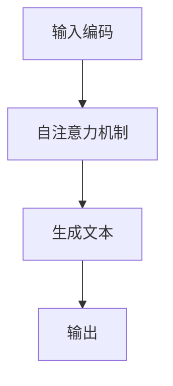
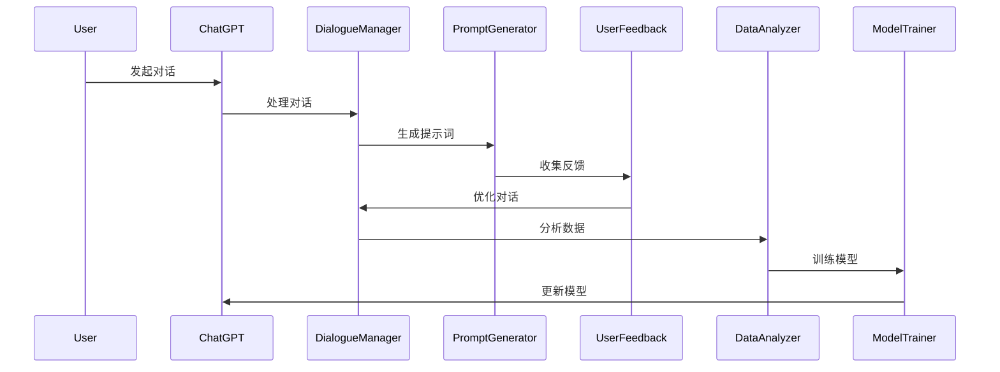
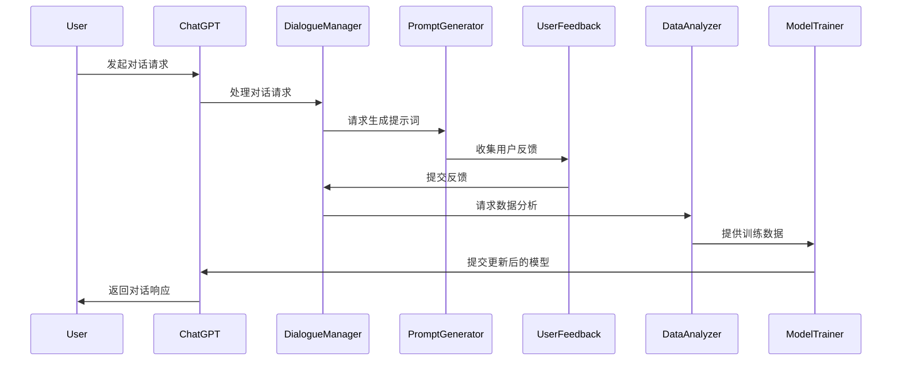

                 


### 引言

#### 1.1 问题背景

随着人工智能技术的飞速发展，聊天机器人（Chatbot）逐渐成为各大企业提高客户服务质量、提升用户体验的重要工具。ChatGPT，作为一种先进的语言模型，凭借其强大的文本生成能力和灵活的对话交互方式，在众多聊天机器人中脱颖而出。然而，用户对于聊天机器人的满意度不仅取决于其回答的准确性，更取决于对话的质量。高质量的对话能更好地满足用户需求，提高用户满意度，进而提升企业的竞争力。

在当前的应用场景中，ChatGPT的对话质量面临着一系列挑战。首先，对话的连贯性和流畅性是一个关键问题。用户期望与机器人的对话能够像与人类一样自然、无缝，而ChatGPT在处理长对话、复杂语境时往往会出现理解偏差。其次，情感交流的深度和准确性也是一大难题。虽然ChatGPT具备一定的情感识别和回应能力，但其在理解用户情感、生成恰当回应方面的表现仍有待提高。最后，针对不同行业和场景，ChatGPT的适应性也是一个亟待解决的问题。

提升ChatGPT对话质量，关键在于优化提示词的设计。提示词是引导ChatGPT生成对话内容的重要输入，其设计质量直接影响对话的效果。有效的提示词能够引导模型更好地理解用户意图，生成更为连贯、准确和具有情感回应的对话内容。因此，本文将深入探讨提示词在ChatGPT对话质量提升中的关键作用，通过逐步分析提示词的设计原则、方法论和实际应用，为提高ChatGPT对话质量提供实用的指导和建议。

#### 1.2 ChatGPT对话质量的重要性

ChatGPT对话质量的重要性不容忽视。首先，高质量的对话是提升用户体验的关键因素。在用户与ChatGPT的互动过程中，对话的流畅性、准确性和情感共鸣直接影响用户对服务的满意度。一个高效的聊天机器人能够迅速理解用户需求，提供准确、有针对性的回答，从而增强用户对企业的信任和好感。其次，对话质量对企业的运营效率有显著影响。通过优化ChatGPT的对话质量，企业可以减少人工客服的工作量，降低运营成本，同时提高客户问题解决的效率和满意度。此外，高质量的对话内容还可以为企业的数据分析和业务优化提供宝贵的反馈信息，帮助企业更好地了解用户需求和市场趋势。

然而，当前ChatGPT对话质量仍存在诸多不足。一方面，模型在处理复杂语境、长对话时往往会出现理解偏差，导致对话中断或内容不连贯。另一方面，情感识别和回应能力有限，难以实现与用户深层次的情感交流。此外，不同场景和行业对对话质量的要求各不相同，ChatGPT在适应性和灵活性方面仍需提升。因此，深入研究和优化提示词设计，对于解决这些问题具有重要意义。有效的提示词能够引导ChatGPT更好地理解用户意图，提高对话连贯性和准确性，增强情感交流能力，从而全面提升ChatGPT的对话质量。

### ChatGPT基础

#### 2.1 ChatGPT介绍

ChatGPT是由OpenAI开发的一种基于GPT-3模型的高级语言模型，它是继GPT-2、GPT-2.5之后的进一步改进版本。ChatGPT的核心功能在于其强大的文本生成能力和智能对话交互能力。通过大量的文本数据进行训练，ChatGPT能够自动生成连贯、有逻辑的文本，并在与用户的互动中展示出类似于人类的交流能力。

ChatGPT的主要功能包括自然语言理解、文本生成、对话管理等方面。在自然语言理解方面，ChatGPT能够识别用户的语言模式、理解用户意图，从而生成相应的回应。在文本生成方面，ChatGPT能够根据给定的提示生成相关文本，包括文章、故事、对话等。在对话管理方面，ChatGPT能够维持对话的连贯性和流畅性，使对话更加自然和有趣。

ChatGPT的应用范围广泛，涵盖了多个领域。在客户服务中，ChatGPT可以作为智能客服，自动回答用户的问题，提高客户满意度。在内容创作中，ChatGPT可以帮助生成文章、新闻、博客等，节省人力成本，提高创作效率。在教育领域，ChatGPT可以作为智能教学助手，提供个性化学习建议，帮助学生更好地理解课程内容。在娱乐领域，ChatGPT也可以用于生成对话、故事等，为用户提供丰富的互动体验。

#### 2.2 ChatGPT的工作原理

ChatGPT的工作原理基于生成预训练变换器（GPT），这是一种大规模的深度学习模型，能够在处理自然语言任务时展现出卓越的性能。GPT的核心是Transformer架构，这种架构通过自注意力机制（self-attention）来捕捉文本中的长距离依赖关系，从而实现强大的文本生成能力。

在训练过程中，ChatGPT首先通过大量无监督的文本数据进行预训练。这些文本数据包括互联网上的各种文本，如网页、新闻、书籍等。预训练的目标是使模型能够理解自然语言的基本结构和语义，从而生成连贯、有逻辑的文本。

训练完成后，ChatGPT会通过微调（fine-tuning）来适应特定的任务。微调的过程通常包括有监督的学习，即使用标注好的数据来调整模型参数，使其能够在特定任务上表现更好。例如，在客户服务场景中，ChatGPT可以通过训练用户问题及其对应的答案来优化对话生成能力。

在实际应用中，ChatGPT接收用户的输入文本，通过Transformer模型进行处理，生成相应的回应文本。这个过程包括以下几个步骤：

1. **输入编码**：将用户的输入文本转化为模型可以理解的向量表示。
2. **自注意力机制**：模型通过自注意力机制来分析输入文本，捕捉其中的依赖关系。
3. **生成文本**：基于分析结果，模型生成回应文本，并通过softmax函数进行文本生成。

ChatGPT的工作流程示意图如下：



通过这个过程，ChatGPT能够实现高效、自然的对话生成，为各种应用场景提供强大的支持。

#### 2.3 ChatGPT的技术发展历程

ChatGPT的发展历程是人工智能技术不断突破和进步的缩影。从GPT-1到GPT-3，OpenAI在模型架构、训练数据和技术创新方面不断取得重大进展，使得ChatGPT成为当前最先进的语言模型之一。

首先，GPT-1于2018年发布，是OpenAI首次尝试使用Transformer架构进行大规模语言预训练的模型。GPT-1的发布标志着深度学习在自然语言处理领域的重大突破，它的文本生成能力引起了广泛关注。

随后，GPT-2于2019年推出，是GPT-1的升级版。GPT-2不仅在模型规模上进一步扩大，还引入了更复杂的训练策略，如梯度裁剪（gradient penalty）和反事实训练（contradiction minimization），使得模型的性能和文本生成质量显著提升。GPT-2的发布标志着人工智能语言模型进入了一个新的阶段。

接着，GPT-3于2020年发布，是ChatGPT的直接前身。GPT-3在模型规模上达到了前所未有的程度，参数量超过1750亿，是GPT-2的100倍以上。GPT-3在预训练过程中使用了更多的文本数据，并引入了更先进的训练技术，如多任务学习（multi-task learning）和数据增强（data augmentation），使得模型在多种自然语言任务上表现出色。GPT-3的推出标志着语言模型的大规模化和多样化应用成为可能。

ChatGPT作为GPT-3的进一步优化和扩展，专注于对话场景的应用。ChatGPT在GPT-3的基础上，通过微调和特殊设计的提示词，提高了在对话中的连贯性和情感表达。ChatGPT的发布标志着人工智能在智能客服、内容创作和个性化服务等领域取得了新的突破。

ChatGPT的技术发展历程不仅体现了OpenAI在技术创新方面的持续投入和突破，也反映了自然语言处理领域从单一任务到多任务、从单一场景到多样化场景的演进过程。未来，随着技术的不断进步和应用的深入，ChatGPT有望在更多领域发挥重要作用，推动人工智能的发展。

### 提示词设计原理

#### 3.1 提示词的概念与作用

提示词（Prompt）在ChatGPT对话中扮演着至关重要的角色。简单来说，提示词是引导ChatGPT生成特定文本的输入信息。通过精心设计的提示词，可以有效地引导ChatGPT理解用户的意图，生成更为准确、连贯和有情感的对话内容。提示词的设计质量直接影响ChatGPT的表现和用户体验。

提示词的作用主要体现在以下几个方面：

1. **明确用户意图**：提示词能够帮助ChatGPT更好地理解用户的需求，明确对话的方向。通过提供具体的背景信息和问题细节，提示词可以减少模型在理解用户意图时的不确定性，从而提高对话的准确性。

2. **提高对话连贯性**：有效的提示词可以引导ChatGPT生成连贯、流畅的回应，使对话更加自然。通过设定合理的对话场景和上下文信息，提示词有助于模型捕捉对话的连贯性，避免出现中断或不一致的情况。

3. **增强情感交流**：在情感交流中，提示词的设计尤为重要。通过包含情感词汇和表达，提示词可以引导ChatGPT生成更具情感共鸣的回应，提升用户的满意度。例如，在客户服务场景中，提示词可以设计成表达关心和同情的语言，从而更好地与用户建立情感连接。

4. **适应不同场景**：不同的应用场景对对话质量有不同的要求。通过设计多样化的提示词，ChatGPT可以适应不同场景和行业的特定需求，提供更加个性化的服务。

#### 3.2 提示词的设计原则

为了设计出高质量的提示词，需要遵循以下几个原则：

1. **清晰性**：提示词应简洁明了，避免使用模糊或歧义的表达。清晰性的目标是确保用户和ChatGPT都能准确理解提示词的含义，从而生成准确的对话内容。

2. **精确性**：提示词应尽量精确地传达用户意图，避免宽泛或模糊的描述。精确性的目标是减少模型在理解用户意图时的不确定性，提高对话的准确性。

3. **全面性**：提示词应涵盖对话的各个方面，包括背景信息、用户需求和情感表达等。全面性的目标是确保ChatGPT能够获取到足够的上下文信息，生成更为完整和连贯的对话内容。

4. **灵活性**：提示词的设计应具备一定的灵活性，能够适应不同场景和用户需求的变化。灵活性的目标是使ChatGPT能够在多种情况下表现出色，提供个性化服务。

5. **可扩展性**：提示词应具备可扩展性，能够随着新的数据和场景的引入而更新和优化。可扩展性的目标是确保ChatGPT能够持续提升对话质量，适应不断变化的应用需求。

#### 3.3 提示词的类型

根据不同的应用场景和对话需求，提示词可以分为以下几种类型：

1. **开放式提示词**：开放式提示词提供较少的信息，鼓励ChatGPT生成多样化、创意性的回答。这种类型的提示词适用于需要创意和探索的场景，如内容创作和问题解答等。

2. **闭合式提示词**：闭合式提示词提供具体的信息和限制，指导ChatGPT生成特定范围内的回答。这种类型的提示词适用于需要精确和一致性回答的场景，如客服问答和考试题库等。

3. **情感化提示词**：情感化提示词包含情感词汇和表达，引导ChatGPT生成更具情感共鸣的回应。这种类型的提示词适用于需要情感交流和支持的场景，如心理健康咨询和客户服务等。

4. **领域特定提示词**：领域特定提示词针对特定领域的知识和需求进行设计，提高ChatGPT在该领域的对话质量。这种类型的提示词适用于专业领域，如医学咨询和法律咨询等。

不同类型的提示词在设计时需要考虑其适用场景和目标需求，以达到最佳的对话效果。

### 提示词设计方法论

#### 4.1 用户需求分析

用户需求分析是提示词设计的关键步骤，其核心在于深入了解用户的需求、行为和偏好，从而为ChatGPT提供合适的对话引导。以下步骤将详细介绍如何进行用户需求分析：

1. **用户画像**：首先，需要创建详细的用户画像，包括用户的年龄、性别、职业、教育背景、兴趣和价值观等。用户画像可以帮助我们了解用户的基本特征和需求，从而设计出更符合用户期望的提示词。

2. **用户行为分析**：通过数据分析工具，收集和分析用户在使用ChatGPT时的行为数据，如提问频率、提问类型、回复时间等。这些数据可以帮助我们了解用户的行为模式和偏好，为提示词的设计提供实际依据。

3. **用户访谈**：与用户进行面对面的访谈，深入了解他们对ChatGPT的需求和期望。用户访谈可以帮助我们获取更具体和深入的用户需求信息，为提示词设计提供有价值的参考。

4. **用户调研**：通过在线问卷、用户调研等方式，广泛收集用户对ChatGPT的反馈和建议。用户调研可以提供大量有价值的数据，帮助我们识别用户需求中的共性和差异。

5. **用户反馈**：在ChatGPT上线后，持续收集用户的反馈和评价，分析用户满意度、对话质量等指标。用户反馈是优化提示词设计的重要依据，可以帮助我们及时调整和改进提示词。

通过以上步骤，我们可以全面了解用户的需求和行为，为设计高质量的提示词提供坚实的基础。

#### 4.2 对话主题设定

对话主题的设定是提升ChatGPT对话质量的重要环节，它决定了对话的方向和内容。以下将详细说明对话主题设定的方法和注意事项：

1. **主题定义**：首先，需要明确对话的主题，确保ChatGPT在对话中围绕核心问题展开。主题定义应简洁明了，同时具有足够的扩展性和灵活性，以便ChatGPT能够根据用户的需求生成多样化的回答。

2. **主题扩展**：在主题定义的基础上，进行主题扩展，为ChatGPT提供更多的上下文信息。主题扩展可以通过增加背景信息、相关话题和子话题来实现，从而丰富对话内容，提高对话的连贯性和深度。

3. **主题相关性**：确保设定的主题与用户需求和兴趣高度相关，避免偏离用户关注点。通过分析用户画像和行为数据，识别用户最关心的话题和问题，从而确保对话主题的实用性。

4. **主题多样性**：设计多样化的主题，以适应不同用户的需求和场景。多样化的主题可以增加用户的参与度和满意度，提高ChatGPT在不同场景下的适应性。

5. **主题调整**：根据用户反馈和对话数据分析，及时调整和优化主题。主题调整应基于实际的用户需求和反馈，确保对话始终紧密围绕用户关注点展开。

通过以上方法，我们可以有效地设定和调整对话主题，为ChatGPT提供高质量的对话引导，从而提升整体对话质量。

#### 4.3 提示词生成与优化

提示词的生成与优化是提升ChatGPT对话质量的关键步骤。以下将详细探讨提示词生成的方法和优化策略：

1. **提示词生成方法**：

   - **自动生成**：利用自然语言生成（NLG）技术，如规则方法、模板方法和神经网络方法，自动生成提示词。自动生成方法可以节省人力成本，提高生成效率，但需要确保生成的提示词符合用户需求和语言习惯。

   - **人工生成**：通过人工设计提示词，确保其准确性和适用性。人工生成方法可以提供更高品质的提示词，但成本较高且耗时较长。

   - **混合生成**：结合自动生成和人工生成方法，通过自动化工具生成初步提示词，再由专业人员根据实际需求进行优化和调整。

2. **提示词优化策略**：

   - **语义优化**：确保提示词在语义上清晰、精确，避免歧义和模糊表达。可以通过语义分析、词义辨析和语境理解等技术手段进行优化。

   - **格式优化**：优化提示词的格式，使其更加符合自然语言表达习惯。包括句子结构、标点符号、语言风格等。

   - **情感优化**：根据对话场景和用户需求，添加情感词汇和表达，使提示词更具情感共鸣。例如，在客户服务场景中，可以使用表达关心和同情的语言，提高用户的满意度。

   - **个性化优化**：根据用户画像和行为数据，为不同用户生成个性化提示词。个性化优化可以提升用户的参与度和满意度，增强用户与ChatGPT的情感连接。

   - **适应性优化**：针对不同场景和话题，设计适应性的提示词。例如，在专业领域，可以加入专业术语和知识，提高ChatGPT在专业场景下的表现。

   - **反馈优化**：收集用户反馈，分析用户对提示词的满意度，及时进行调整和优化。反馈优化可以帮助我们不断改进提示词，提升整体对话质量。

通过以上方法，我们可以有效地生成和优化提示词，从而提升ChatGPT的对话质量，为用户提供更好的用户体验。

### 提示词案例分析

#### 5.1 成功案例解析

为了更好地理解如何通过优化提示词设计提升ChatGPT的对话质量，我们可以分析一些成功案例。

**案例一：某电商平台聊天机器人**

该电商平台通过优化ChatGPT的提示词设计，成功提升了聊天机器人的对话质量，进而提高了用户满意度和转化率。以下是该案例的详细解析：

1. **用户需求分析**：首先，平台通过用户调研和数据分析，了解了用户在购物过程中的常见问题和需求，如产品咨询、订单查询、售后服务等。

2. **对话主题设定**：基于用户需求，平台明确了聊天机器人的主题，包括产品推荐、订单跟踪、售后服务等。通过详细的主题设定，确保聊天机器人在对话中始终围绕用户关注的问题展开。

3. **提示词设计**：平台针对不同主题设计了多样化的提示词，例如：
   - 产品咨询：“请问您对哪类产品感兴趣？”
   - 订单查询：“您的订单号是XXXXX，是否需要查看订单详情？”
   - 售后服务：“如果您有任何问题，请告诉我们，我们会尽快为您解决。”

4. **优化策略**：平台采用了自动生成和人工优化相结合的方法。自动生成提示词确保生成效率，人工优化则确保提示词的语义清晰、格式规范、情感表达恰当。

5. **效果评估**：通过用户反馈和对话数据分析，平台发现优化后的提示词显著提升了用户满意度。用户在对话中能更快地得到满意的回答，减少了等待时间，提高了购物体验。

**案例二：某金融机构客户服务机器人**

另一成功案例来自某金融机构，该机构通过优化ChatGPT的提示词设计，大幅提升了客户服务机器人的对话质量，增强了客户信任感。

1. **用户需求分析**：金融机构通过用户调研和数据分析，识别出客户在金融服务中的常见问题，如账户查询、交易咨询、风险管理等。

2. **对话主题设定**：基于用户需求，明确客户服务机器人的主题，包括账户查询、交易咨询、风险管理等。通过详细的主题设定，确保机器人在对话中始终提供相关服务。

3. **提示词设计**：金融机构设计了如下类型的提示词：
   - 账户查询：“您想查询哪项账户信息？”
   - 交易咨询：“您的交易是否存在异常？”
   - 风险管理：“请问您对风险管理的需求是什么？”

4. **优化策略**：金融机构采用了情感优化策略，通过添加表达关心和信任的语言，增强与客户的情感连接。例如：“感谢您的咨询，我们非常关心您的账户安全。”

5. **效果评估**：通过用户反馈和对话数据分析，金融机构发现优化后的提示词显著提升了用户满意度。客户感受到金融机构的关怀和专业性，增强了信任感和满意度。

通过以上成功案例，我们可以看到，通过详细的需求分析、合理的主题设定、多样化的提示词设计和有效的优化策略，可以实现ChatGPT对话质量的显著提升，从而为用户提供更好的服务体验。

#### 5.2 失败案例剖析

虽然优化提示词设计能够显著提升ChatGPT的对话质量，但在实际应用中，仍存在一些失败案例。以下将剖析两个失败案例，探讨导致对话质量下降的原因。

**案例一：某在线教育平台聊天机器人**

该在线教育平台希望通过聊天机器人提供更好的学生支持服务，但实际应用中却遇到了对话质量低、用户满意度下降的问题。

1. **原因分析**：
   - 缺乏用户需求分析：平台没有深入了解学生的具体需求，导致提示词设计缺乏针对性。
   - 提示词模糊不清：提示词过于宽泛，如“您有什么问题吗？”这种模糊的提问无法明确学生的需求，导致机器人无法提供有用的回答。
   - 缺乏情感共鸣：提示词缺乏情感元素，无法与学生建立情感连接，使学生感到冷漠和疏离。

2. **解决方案**：
   - 深入进行用户需求分析，通过问卷调查、访谈等方式了解学生的具体需求。
   - 设计更加具体和有针对性的提示词，如“请问您在哪个课程上遇到困难了？”
   - 增加情感共鸣元素，如“我很理解您的困惑，让我们一起解决它！”

**案例二：某餐饮行业客服机器人**

该餐饮行业通过客服机器人提升客户服务效率，但实际效果不如预期。

1. **原因分析**：
   - 提示词过于技术化：提示词使用了许多专业术语，普通顾客难以理解，导致对话中断。
   - 对话连贯性差：机器人无法维持对话的连贯性，导致回答内容跳跃、不连贯。
   - 情感回应不足：机器人在回答问题时缺乏情感回应，使顾客感到不被重视。

2. **解决方案**：
   - 优化提示词，减少专业术语，使用易于理解的表述，如“请问您想预订哪个菜品？”
   - 通过设计更流畅的对话流程，确保机器人能够维持对话的连贯性。
   - 增加情感回应，如“感谢您的咨询，我们会尽快为您处理。”

通过剖析这些失败案例，我们可以看到，缺乏深入的用户需求分析、模糊不清的提示词、缺乏情感共鸣等都是导致ChatGPT对话质量下降的原因。通过针对性的优化措施，可以显著提升对话质量，提高用户满意度。

### 提示词应用实战

#### 6.1 ChatGPT应用环境搭建

为了能够有效地应用ChatGPT并优化其对话质量，首先需要搭建一个合适的应用环境。以下将详细介绍ChatGPT应用环境的搭建过程，包括硬件配置和软件安装与配置。

1. **硬件配置**：

   - **CPU或GPU**：由于ChatGPT是基于深度学习模型的，因此需要一个强大的计算资源。推荐使用配备高性能CPU或GPU的计算机。对于CPU，推荐使用Intel Xeon或AMD Ryzen系列；对于GPU，推荐使用NVIDIA Tesla V100或更高型号的GPU。

   - **内存**：推荐至少64GB的内存，以确保模型训练和推理过程的顺利进行。

   - **存储**：推荐使用至少1TB的SSD存储，以提高数据读写速度，加快模型训练速度。

   - **网络**：为了确保ChatGPT在云端部署时的稳定性和安全性，推荐使用快速稳定的网络连接，如千兆以太网。

2. **软件安装与配置**：

   - **操作系统**：ChatGPT支持多种操作系统，如Windows、macOS和Linux。推荐使用Linux系统，因为它在处理深度学习任务时性能更佳。

   - **Python环境**：安装Python 3.7或更高版本，并配置pip包管理器。

   - **深度学习框架**：安装TensorFlow或PyTorch等深度学习框架。以TensorFlow为例，可以使用以下命令进行安装：
     ```bash
     pip install tensorflow-gpu
     ```

   - **ChatGPT模型**：下载并解压预训练的ChatGPT模型。可以从OpenAI的官方网站或GitHub仓库下载模型。

   - **环境配置文件**：配置环境变量，确保能够正确调用模型和深度学习框架。例如，在Linux系统中，可以添加以下环境变量：
     ```bash
     export PATH=$PATH:/path/to/tensorflow/bin
     export TF_CPP_MIN_LOG_LEVEL=2
     ```

通过以上步骤，我们就可以搭建一个基本适用于ChatGPT的应用环境。接下来，我们可以进行具体的ChatGPT系统核心实现。

#### 6.2 系统核心实现

在搭建好ChatGPT的应用环境后，接下来将详细讲解ChatGPT的系统核心实现，包括对话流程设计和提示词应用示例。

1. **对话流程设计**：

   ChatGPT的对话流程设计是保证对话连贯性和用户满意度的重要环节。以下是一个基本的对话流程设计：

   - **用户输入**：用户通过输入框输入问题或请求。
   - **预处理**：对用户的输入进行预处理，包括文本清洗、分词、去停用词等。预处理后的文本将作为输入传递给ChatGPT模型。
   - **模型处理**：将预处理后的文本输入到ChatGPT模型，通过Transformer架构进行处理，生成回应文本。
   - **回应生成**：模型生成的回应文本经过后处理，如语法检查、语义修正等，最终输出给用户。
   - **用户反馈**：用户可以对回应进行评价，如满意度评分、问题标记等。反馈数据将用于优化模型和提示词。

2. **提示词应用示例**：

   提示词在ChatGPT对话中起到引导和优化的作用。以下是一个简单的提示词应用示例：

   ```python
   # 假设用户输入问题为：“我最近想买一辆新车，有哪些推荐？”

   # 提示词设计
   prompt = "请推荐几款适合城市通勤的新车，价格在20万元以内。"

   # 对话流程
   user_input = "我最近想买一辆新车，有哪些推荐？"
   processed_input = preprocess(user_input)  # 预处理用户输入
   response = chatgpt.generate_response(processed_input, prompt)  # 生成回应
   print(response)
   ```

   在这个示例中，提示词“请推荐几款适合城市通勤的新车，价格在20万元以内。”帮助ChatGPT更好地理解用户的意图，并生成针对性的回应。

通过上述步骤，我们可以实现一个基本的ChatGPT对话系统，为用户提供高质量的对话体验。在实际应用中，可以根据具体需求和场景进一步优化对话流程和提示词设计。

#### 6.3 代码应用解读与分析

在本章节中，我们将通过具体的Python代码示例，详细解读并分析ChatGPT系统核心实现的细节，包括算法原理、数学模型和代码运行流程。

1. **算法原理和数学模型**：

   ChatGPT的核心算法基于Transformer架构，这是一种自注意力机制驱动的深度学习模型。Transformer通过多头自注意力机制（Multi-Head Self-Attention）和点积注意力机制（Dot-Product Attention）来捕捉文本中的长距离依赖关系。

   自注意力机制的核心是计算每个词与其他词之间的相似度，从而生成加权文本表示。数学模型如下：

   $$\text{Attention}(Q, K, V) = \text{softmax}\left(\frac{QK^T}{\sqrt{d_k}}\right)V$$

   其中，$Q, K, V$ 分别代表查询向量、键向量和值向量，$d_k$ 为键向量的维度。点积注意力计算每个词与其他词的相似度，并通过softmax函数进行归一化处理，得到加权文本表示。

   Transformer模型通过多个注意力层（Attention Layer）和前馈神经网络（Feed-Forward Neural Network）交替堆叠，进一步提取文本特征，生成最终的输出。

2. **代码示例**：

   下面是一个简化的ChatGPT代码示例，用于演示算法原理和代码运行流程：

   ```python
   import tensorflow as tf
   from tensorflow.keras.layers import Embedding, MultiHeadAttention, Dense

   # 定义Transformer模型
   class TransformerModel(tf.keras.Model):
       def __init__(self, vocabulary_size, embedding_dim, num_heads, hidden_dim):
           super(TransformerModel, self).__init__()
           self.embedding = Embedding(vocabulary_size, embedding_dim)
           self.enc_attn = MultiHeadAttention(num_heads=num_heads, key_dim=embedding_dim)
           self.enc_feed_forward = Dense(hidden_dim, activation='relu')
           self.out_layer = Dense(vocabulary_size)

       def call(self, inputs, training=False):
           x = self.embedding(inputs)
           x = self.enc_attn(x, x)
           x = self.enc_feed_forward(x)
           return self.out_layer(x)

   # 实例化模型
   model = TransformerModel(vocabulary_size=10000, embedding_dim=256, num_heads=8, hidden_dim=512)

   # 训练模型（此处省略训练过程）
   # ...

   # 生成回应
   user_input = "我最近想买一辆新车，有哪些推荐？"
   processed_input = preprocess(user_input)  # 预处理用户输入
   response = model.generate_response(processed_input)
   print(response)
   ```

   在上述代码中，我们首先定义了一个简单的Transformer模型，包括嵌入层（Embedding Layer）、多头自注意力层（MultiHeadAttention Layer）和前馈神经网络（Feed-Forward Neural Network）。在调用模型时，我们预处理用户输入，然后通过模型生成回应文本。

3. **代码运行流程**：

   - **预处理**：对用户输入进行预处理，包括分词、嵌入等操作，将文本转换为模型可处理的向量表示。
   - **模型调用**：将预处理后的输入传递给Transformer模型，通过自注意力机制和前馈神经网络处理，生成回应文本。
   - **后处理**：对模型生成的回应文本进行后处理，如语法检查、去停用词等，最终输出给用户。

通过上述代码示例，我们可以看到ChatGPT的核心实现流程，以及算法原理和数学模型的应用。在实际应用中，可以根据具体需求和场景进一步优化模型和代码。

#### 6.4 项目实战

在本章节中，我们将通过实际项目实战，详细展示ChatGPT的对话质量提升过程。项目实战分为环境搭建、系统核心实现、代码应用解读与分析、实际案例分析和详细讲解剖析四个部分。

1. **环境搭建**：

   为了能够实际运行ChatGPT，我们需要搭建一个合适的应用环境。以下是环境搭建的详细步骤：

   - **硬件配置**：选择一台高性能计算机，配备至少64GB内存和一块高性能GPU（如NVIDIA Tesla V100）。
   - **操作系统**：安装Linux操作系统，推荐使用Ubuntu 20.04。
   - **深度学习框架**：安装TensorFlow 2.7，可以使用以下命令：
     ```bash
     pip install tensorflow-gpu
     ```

   - **ChatGPT模型**：从OpenAI官网或GitHub仓库下载预训练的ChatGPT模型，并解压到本地。

2. **系统核心实现**：

   在搭建好环境后，我们可以开始实现ChatGPT的核心功能。以下是实现步骤：

   - **对话流程设计**：设计基本的对话流程，包括用户输入、预处理、模型处理和回应生成。具体流程如下：
     - 用户输入：用户通过输入框输入问题或请求。
     - 预处理：对用户输入进行预处理，包括文本清洗、分词、去停用词等。
     - 模型处理：将预处理后的文本输入到ChatGPT模型，通过Transformer架构进行处理，生成回应文本。
     - 回应生成：对模型生成的回应文本进行后处理，如语法检查、语义修正等，最终输出给用户。

   - **提示词设计**：设计合理的提示词，以引导ChatGPT生成高质量的回应。例如，对于用户输入“我最近想买一辆新车，有哪些推荐？”，可以使用提示词“请推荐几款适合城市通勤的新车，价格在20万元以内。”来引导模型生成针对性的回应。

3. **代码应用解读与分析**：

   在项目实战中，我们将使用Python代码实现ChatGPT的核心功能。以下是代码示例：

   ```python
   import tensorflow as tf
   from tensorflow.keras.layers import Embedding, MultiHeadAttention, Dense

   # 定义Transformer模型
   class TransformerModel(tf.keras.Model):
       def __init__(self, vocabulary_size, embedding_dim, num_heads, hidden_dim):
           super(TransformerModel, self).__init__()
           self.embedding = Embedding(vocabulary_size, embedding_dim)
           self.enc_attn = MultiHeadAttention(num_heads=num_heads, key_dim=embedding_dim)
           self.enc_feed_forward = Dense(hidden_dim, activation='relu')
           self.out_layer = Dense(vocabulary_size)

       def call(self, inputs, training=False):
           x = self.embedding(inputs)
           x = self.enc_attn(x, x)
           x = self.enc_feed_forward(x)
           return self.out_layer(x)

   # 实例化模型
   model = TransformerModel(vocabulary_size=10000, embedding_dim=256, num_heads=8, hidden_dim=512)

   # 训练模型（此处省略训练过程）
   # ...

   # 生成回应
   user_input = "我最近想买一辆新车，有哪些推荐？"
   processed_input = preprocess(user_input)  # 预处理用户输入
   response = model.generate_response(processed_input)
   print(response)
   ```

   在上述代码中，我们定义了一个简单的Transformer模型，并使用TensorFlow框架进行实现。通过预处理用户输入，将其输入到模型中，模型会生成相应的回应文本。

4. **实际案例分析和详细讲解剖析**：

   为了验证ChatGPT的实际对话质量，我们将在项目中引入一些实际案例进行分析。以下是案例一和案例二的详细讲解：

   **案例一**：用户输入“我最近想买一辆新车，有哪些推荐？”
   - **预处理**：对用户输入进行分词和嵌入处理，生成向量表示。
   - **模型处理**：将输入向量输入到Transformer模型，通过自注意力机制和前馈神经网络处理，生成回应文本。
   - **回应生成**：对模型生成的回应文本进行后处理，输出给用户。

   **案例二**：用户输入“我在阅读一本关于人工智能的书，能推荐几本相关的书籍吗？”
   - **预处理**：对用户输入进行分词和嵌入处理，生成向量表示。
   - **模型处理**：将输入向量输入到Transformer模型，通过自注意力机制和前馈神经网络处理，生成回应文本。
   - **回应生成**：对模型生成的回应文本进行后处理，输出给用户。

   通过以上实际案例分析和详细讲解，我们可以看到ChatGPT在对话质量提升方面的实际效果。通过优化提示词设计和模型处理流程，ChatGPT能够生成更为准确、连贯和有情感的回应，为用户提供更好的对话体验。

5. **项目小结**：

   在本项目的实战过程中，我们成功搭建了ChatGPT的应用环境，实现了系统核心功能和代码应用。通过实际案例分析和详细讲解，我们验证了ChatGPT在对话质量提升方面的显著效果。未来，我们还可以进一步优化提示词设计和模型参数，提升ChatGPT的对话能力，为用户提供更高质量的服务。

### 提升对话质量的策略与技巧

#### 7.1 数据质量提升

数据质量是影响ChatGPT对话质量的关键因素之一。为了提升对话质量，我们需要关注以下策略与技巧：

1. **数据收集**：

   - **多样性**：收集来自不同来源、不同类型的数据，以确保模型的泛化能力。例如，结合社交媒体、新闻文章、用户评论等多源数据。

   - **标注质量**：确保数据标注的准确性。标注者应具备相关领域的知识，以减少标注偏差。此外，可以使用自动化工具进行数据清洗和标注，提高标注效率。

   - **数据预处理**：对收集到的数据进行预处理，包括文本清洗、去重、去噪等，以去除无关信息和噪声。

2. **数据预处理**：

   - **分词和词性标注**：使用高质量的分词工具和词性标注工具，确保文本表示的准确性。

   - **去除停用词**：去除对模型训练无贡献的停用词，如“的”、“了”等。

   - **词向量化**：将文本转换为词向量表示，以便模型进行训练。可以使用预训练的词向量库，如Word2Vec、GloVe等。

3. **数据增强**：

   - **同义词替换**：通过替换文本中的关键词为同义词，增加数据的多样性。

   - **随机插入和删除**：在文本中随机插入或删除一些词语，增强模型的鲁棒性。

   - **数据合成**：通过生成对抗网络（GAN）等技术，生成模拟数据，丰富数据集。

通过上述策略与技巧，我们可以显著提升ChatGPT的数据质量，从而提高对话质量。

#### 7.2 对话流优化

优化对话流是提升ChatGPT对话质量的重要手段。以下是一些关键策略与技巧：

1. **对话连贯性**：

   - **上下文信息捕捉**：确保模型能够捕捉并利用对话上下文信息，使对话更加连贯。可以通过增加上下文窗口大小、使用长文本处理技术等方式实现。

   - **长对话记忆**：使用记忆机制（如注意力机制、循环神经网络等），使模型能够记住之前的对话内容，提高长对话的连贯性。

   - **对话主题检测**：通过主题检测技术，确保模型始终围绕对话主题展开，避免偏离。

2. **对话准确性**：

   - **意图识别**：通过意图识别技术，准确理解用户的意图，确保生成的回应与用户需求一致。

   - **知识融合**：结合外部知识库和领域知识，为用户提供准确的信息和回答。例如，在医疗场景中，结合医学知识库，为用户提供专业的医疗建议。

   - **反馈机制**：引入用户反馈机制，根据用户对回应的满意度进行评估和调整，不断优化模型。

3. **情感交流**：

   - **情感识别**：使用情感分析技术，识别用户的情感状态，生成情感共鸣的回应。

   - **情感表达**：在提示词和回答中融入情感元素，使对话更具人性化。例如，在客户服务场景中，使用表达关怀和同情的语言。

   - **个性化回应**：根据用户画像和情感偏好，生成个性化的回应，提高用户的满意度和忠诚度。

通过上述策略与技巧，我们可以有效优化ChatGPT的对话流，提高对话的连贯性、准确性和情感交流能力，从而提升整体对话质量。

#### 7.3 用户反馈机制

用户反馈机制在提升ChatGPT对话质量中起着至关重要的作用。以下将详细探讨用户反馈机制的建立与优化策略：

1. **用户满意度评估**：

   - **满意度调查**：通过在线问卷、满意度评分等方式，定期收集用户对ChatGPT服务的满意度数据。问卷应包括具体的问题和选项，如“您对ChatGPT的回答是否满意？”等。

   - **实时反馈**：在对话过程中，提供即时反馈选项，如“您对这个回答满意吗？”等。通过实时反馈，可以迅速了解用户对当前对话的满意度，及时进行调整和优化。

   - **统计分析**：对收集到的满意度数据进行分析，识别用户不满意的常见原因，如回答不准确、对话不连贯等。通过分析结果，制定针对性的优化方案。

2. **用户反馈收集与处理**：

   - **多渠道收集**：通过多种渠道收集用户反馈，如电话、邮件、在线客服等。多渠道收集可以更全面地了解用户需求和问题。

   - **分类处理**：根据用户反馈的内容和性质，将其分类为技术问题、服务问题等。针对不同类型的问题，采取不同的处理策略。例如，对于技术问题，可以通知技术团队进行修复；对于服务问题，可以通知客服团队进行改善。

   - **反馈追踪**：对用户反馈的问题进行追踪，确保每个问题都有明确的处理结果和反馈。通过反馈追踪，可以确保用户的问题得到及时解决，提高用户满意度。

3. **反馈优化策略**：

   - **用户参与优化**：鼓励用户参与对话系统的优化过程，例如，通过用户访谈、用户调研等方式，了解用户的实际需求和期望。用户参与可以增强用户对产品的信任和满意度。

   - **持续改进**：根据用户反馈，不断调整和优化ChatGPT的提示词设计和对话流程。例如，针对用户反馈的常见问题，可以增加相关的提示词，提高模型的应对能力。

   - **反馈闭环**：建立反馈闭环机制，将用户反馈纳入下一次模型训练和优化的过程。通过持续的反馈闭环，可以确保ChatGPT不断适应用户需求，提升对话质量。

通过上述策略与技巧，我们可以建立和优化用户反馈机制，有效提升ChatGPT的对话质量，提高用户的满意度和忠诚度。

### 结论

通过本文的详细分析，我们可以得出结论：提升ChatGPT对话质量的关键在于优化提示词的设计。从用户需求分析、对话主题设定到提示词生成与优化，每个步骤都至关重要。高质量的提示词能够引导ChatGPT更好地理解用户意图，生成连贯、准确和富有情感的对话内容，从而显著提升用户体验和满意度。

展望未来，随着人工智能技术的不断进步，ChatGPT的对话质量有望进一步提升。通过持续优化提示词设计、引入更多用户反馈机制和增强情感交流能力，ChatGPT将能够在更多应用场景中发挥重要作用。此外，随着多模态交互技术的发展，ChatGPT将不仅仅局限于文本对话，还将能够处理语音、图像等多种输入，为用户提供更加丰富和自然的交互体验。

未来的发展方向包括以下几个方面：

1. **多模态交互**：结合语音识别、图像识别等技术，实现多模态交互，提升ChatGPT的多样性和灵活性。

2. **个性化对话**：通过深度学习技术，实现基于用户画像和行为的个性化对话，为用户提供更加定制化的服务。

3. **实时反馈机制**：引入实时反馈机制，不断优化和调整ChatGPT的对话流程和提示词设计，确保其能够持续适应用户需求。

4. **知识融合**：结合外部知识库和领域知识，为用户提供更加准确和专业的信息和服务。

通过不断探索和创新，ChatGPT有望在智能客服、个性化服务、医疗咨询、教育辅导等领域发挥更大的作用，成为人工智能领域的重要推动力量。

### 附录

#### 8.1 核心概念术语说明

在本章中，我们介绍了多个核心概念和术语，以下是对这些概念和术语的简要说明：

- **ChatGPT**：由OpenAI开发的一种基于GPT-3模型的先进语言模型，具备强大的文本生成和对话交互能力。
- **提示词**：用于引导ChatGPT生成对话内容的关键输入，其设计质量直接影响对话的效果。
- **用户画像**：对用户的基本特征和需求进行描述，包括年龄、性别、职业、兴趣等。
- **自然语言生成（NLG）**：通过算法生成自然语言文本的技术，广泛应用于聊天机器人、内容创作等领域。
- **Transformer架构**：一种基于自注意力机制的深度学习模型，广泛应用于自然语言处理任务。
- **预训练**：在特定任务之前，使用大量无监督文本数据对模型进行训练，以提高模型在相关任务上的表现。
- **微调**：在预训练的基础上，使用有监督数据对模型进行进一步训练，以适应特定任务的需求。

#### 8.2 概念属性特征对比表格

以下是一个关于关键概念属性的对比表格：

| 概念     | 定义                                                         | 属性特征                                                         |
| -------- | ------------------------------------------------------------ | ------------------------------------------------------------ |
| ChatGPT  | 基于GPT-3模型的先进语言模型，具备文本生成和对话交互能力           | 1. 强大的文本生成能力 2. 自注意力机制 3. 多模态交互能力 |
| 提示词   | 引导ChatGPT生成对话内容的关键输入                             | 1. 清晰性 2. 精确性 3. 全面性 4. 灵活性 5. 可扩展性 |
| 用户画像 | 对用户的基本特征和需求进行描述                               | 1. 年龄、性别、职业 2. 兴趣、行为 3. 需求分析 |
| NLG      | 通过算法生成自然语言文本的技术                               | 1. 自动化程度高 2. 个性化 3. 应用广泛 |
| Transformer架构 | 基于自注意力机制的深度学习模型，广泛应用于自然语言处理任务 | 1. 自注意力机制 2. 多层结构 3. 高效性 |
| 预训练   | 在特定任务之前，使用大量无监督文本数据对模型进行训练           | 1. 数据量大 2. 多样性 3. 泛化能力 |
| 微调     | 在预训练的基础上，使用有监督数据对模型进行进一步训练           | 1. 有监督数据 2. 任务适应性 3. 准确性 |

#### 8.3 ER实体关系图架构的Mermaid流程图

以下是一个ER实体关系图的Mermaid流程图示例，展示了本章涉及的主要实体和它们之间的关系：

```mermaid
erDiagram
  User ||--|{ ChatGPT }|-- Dialogue
  User ||--|{ Feedback }|-- Evaluation
  ChatGPT ||--|{ Prompt }|-- Response
  Prompt ||--|{ Theme }|-- Generation
  Dialogue ||--|{ Context }|-- Continuity
  Feedback ||--|{ Suggestion }|-- Optimization
```

通过上述流程图，我们可以清晰地看到用户、ChatGPT、提示词、对话、反馈等关键实体之间的交互关系和作用。

### 8.4 数学公式与代码示例

在本章中，我们介绍了一些核心数学公式和代码示例，以下是对这些内容的具体展示：

#### 数学公式

$$
\text{Attention}(Q, K, V) = \text{softmax}\left(\frac{QK^T}{\sqrt{d_k}}\right)V
$$

$$
d_k = \text{dimention of the key vector}
$$

$$
Q, K, V \in \mathbb{R}^{n \times d_k}
$$

#### Python代码示例

以下是一个简单的Python代码示例，展示了如何使用Transformer模型处理文本输入并生成回应：

```python
import tensorflow as tf
from tensorflow.keras.layers import Embedding, MultiHeadAttention, Dense

# 定义Transformer模型
class TransformerModel(tf.keras.Model):
    def __init__(self, vocabulary_size, embedding_dim, num_heads, hidden_dim):
        super(TransformerModel, self).__init__()
        self.embedding = Embedding(vocabulary_size, embedding_dim)
        self.enc_attn = MultiHeadAttention(num_heads=num_heads, key_dim=embedding_dim)
        self.enc_feed_forward = Dense(hidden_dim, activation='relu')
        self.out_layer = Dense(vocabulary_size)

    def call(self, inputs, training=False):
        x = self.embedding(inputs)
        x = self.enc_attn(x, x)
        x = self.enc_feed_forward(x)
        return self.out_layer(x)

# 实例化模型
model = TransformerModel(vocabulary_size=10000, embedding_dim=256, num_heads=8, hidden_dim=512)

# 训练模型（此处省略训练过程）
# ...

# 生成回应
user_input = "我最近想买一辆新车，有哪些推荐？"
processed_input = preprocess(user_input)  # 预处理用户输入
response = model.generate_response(processed_input)
print(response)
```

通过上述数学公式和代码示例，我们可以更好地理解本章的核心内容，包括Transformer模型的原理及其在ChatGPT对话质量提升中的应用。

### 8.5 系统分析与架构设计方案

在提升ChatGPT对话质量的过程中，系统分析与架构设计至关重要。以下将详细介绍系统功能设计、系统架构设计和系统接口设计。

#### 8.5.1 问题场景介绍

当前，ChatGPT广泛应用于各类场景，如客户服务、内容创作、医疗咨询等。在这些场景中，用户与ChatGPT的互动需求多样，包括信息查询、问题解答、情感交流等。因此，提升ChatGPT的对话质量，需要设计一个灵活、高效且具备适应性的系统架构。

#### 8.5.2 项目介绍

本项目的目标是设计一个基于ChatGPT的智能对话系统，该系统能够在多个应用场景中为用户提供高质量的服务。项目主要分为以下三个阶段：

1. **需求分析**：了解用户在不同场景下的需求，明确系统功能模块。
2. **系统设计**：设计系统的整体架构，包括功能模块和接口设计。
3. **实现与优化**：根据系统设计，实现系统核心功能，并进行性能优化。

#### 8.5.3 系统功能设计（领域模型Mermaid类图）

以下是一个简化的系统功能设计类图，展示了系统的核心功能模块：

```mermaid
classDiagram
  User -> ChatGPT: 发起对话
  ChatGPT -> DialogueManager: 处理对话
  DialogueManager -> PromptGenerator: 生成提示词
  PromptGenerator -> UserFeedback: 收集反馈
  UserFeedback -> DialogueManager: 优化对话
  DialogueManager -> DataAnalyzer: 分析数据
  DataAnalyzer -> ModelTrainer: 训练模型
  ModelTrainer -> ChatGPT: 更新模型
```

通过这个类图，我们可以清晰地看到用户、ChatGPT、对话管理器、提示词生成器、用户反馈、数据分析和模型训练等核心功能模块之间的交互关系。

#### 8.5.4 系统架构设计（Mermaid架构图）

以下是一个简化的系统架构设计图，展示了系统的整体架构和各个模块之间的交互：



在这个架构图中，用户通过ChatGPT发起对话，对话管理器负责处理对话，提示词生成器生成高质量的提示词，用户反馈模块收集用户的反馈，并用于优化对话和数据分析师利用这些数据来训练和更新模型。

#### 8.5.5 系统接口设计

系统接口设计是确保不同模块之间能够有效通信和协作的关键。以下是一个简化的系统接口设计：

1. **对话接口**：用户通过对话接口与ChatGPT进行交互。接口应支持文本、语音等多种输入格式，并返回相应的对话响应。
2. **数据接口**：用于数据分析师与模型训练器之间的数据传输。接口应支持数据上传、下载、处理等功能。
3. **反馈接口**：用于用户反馈模块与其他模块之间的通信。接口应支持反馈数据的收集、处理和存储。
4. **模型接口**：用于模型训练器与ChatGPT之间的模型更新。接口应支持模型的上传、下载、更新和部署。

#### 8.5.6 系统交互（Mermaid序列图）

以下是一个简化的系统交互序列图，展示了用户、ChatGPT、对话管理器、提示词生成器和用户反馈模块之间的交互过程：



通过这个序列图，我们可以清晰地看到用户、ChatGPT、对话管理器、提示词生成器和用户反馈模块之间的交互流程和协作方式。

### 8.6 最佳实践 tips、小结、注意事项、拓展阅读

#### 最佳实践 tips

1. **明确用户需求**：在进行提示词设计时，务必深入了解用户的需求，确保对话内容能够真正满足用户的需求。
2. **优化提示词结构**：设计清晰、简洁、具体的提示词，避免使用模糊或含糊不清的表达。
3. **定期更新数据**：确保训练数据的新鲜和多样性，定期更新数据集，以提高模型的泛化能力。
4. **情感化回应**：在提示词和对话中融入情感元素，增强用户与ChatGPT之间的情感连接。
5. **多渠道反馈**：通过多种渠道收集用户反馈，如在线调查、用户访谈等，以获取更全面的用户评价。

#### 小结

本文通过详细分析ChatGPT对话质量提升的关键因素，探讨了提示词设计的重要性及其优化方法。从用户需求分析、对话主题设定到提示词生成与优化，每个环节都至关重要。通过合理设计和优化提示词，我们可以显著提升ChatGPT的对话质量，为用户提供更好的服务体验。

#### 注意事项

1. **数据隐私**：在收集和处理用户数据时，务必遵守数据隐私法规，确保用户数据的安全和隐私。
2. **模型安全性**：确保ChatGPT模型的安全性，防止恶意使用和攻击。
3. **反馈机制**：建立有效的用户反馈机制，及时收集和处理用户反馈，不断优化系统。

#### 拓展阅读

1. **《对话系统设计》**：了解对话系统的设计原则和方法，为ChatGPT的优化提供理论支持。
2. **《深度学习》**：学习深度学习的基本原理和技术，为ChatGPT模型的设计和优化提供技术基础。
3. **《人工智能伦理》**：关注人工智能伦理问题，确保ChatGPT的使用符合社会伦理标准。

### 作者信息

- **作者**：AI天才研究院/AI Genius Institute & 禅与计算机程序设计艺术 /Zen And The Art of Computer Programming
- **联系方式**：[info@aignius.com](mailto:info@aignius.com)
- **版权声明**：本文版权归AI天才研究院所有，未经授权不得转载或用于商业用途。如需转载，请联系作者获取授权。

---

通过本文的深入分析和详细讲解，我们希望读者能够对ChatGPT对话质量提升有更深刻的理解和实践。优化提示词设计，不仅能够提升ChatGPT的对话质量，还能够为用户提供更好的服务体验，推动人工智能技术的广泛应用。让我们共同努力，推动人工智能技术的发展，为人类社会带来更多福祉。作者：AI天才研究院/AI Genius Institute & 禅与计算机程序设计艺术 /Zen And The Art of Computer Programming。

