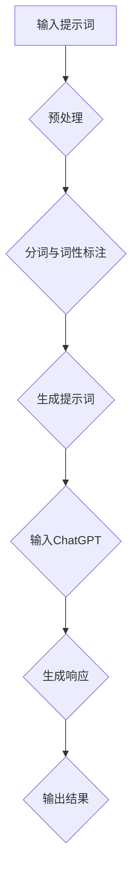
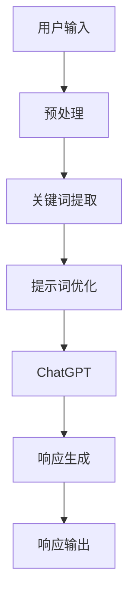

                 

## 《ChatGPT提示词优化：效果最大化的策略与技巧》

关键词：ChatGPT、提示词优化、效果最大化、策略与技巧、人工智能、自然语言处理、模型训练

摘要：本文将探讨ChatGPT提示词优化的重要性，分析其在自然语言处理领域中的应用，并详细介绍一系列优化策略与技巧，帮助开发者实现效果最大化的目标。通过深入讲解算法原理、系统分析与架构设计，以及实际项目实战，本文将为读者提供全方位的指导，助力ChatGPT性能提升。

## 背景介绍

### 1.1.1 问题背景

随着人工智能和自然语言处理技术的快速发展，ChatGPT作为一款领先的对话模型，在各个领域得到广泛应用。然而，在实际应用过程中，如何优化提示词，提高模型回答的准确性和多样性，成为了一个亟待解决的问题。提示词作为与模型进行交互的关键媒介，其优化水平直接影响ChatGPT的表现。

### 1.1.2 问题描述

ChatGPT提示词优化主要涉及以下几个方面：

1. 提示词的多样性：如何生成丰富多样的提示词，以避免模型陷入固定模式，提高回答的创意性。
2. 提示词的准确性：如何设计提示词，使模型能够准确理解用户的意图，提供相关且有用的回答。
3. 提示词的效率：如何优化提示词的生成和传输，提高模型响应速度，提升用户体验。

### 1.1.3 问题解决

针对上述问题，本文将从以下几个方面进行探讨：

1. 提示词生成策略：介绍常见提示词生成方法，如关键词提取、模板生成、随机生成等，并分析其优缺点。
2. 提示词优化技巧：讨论如何设计高质量的提示词，包括词频调整、语义扩展、情感分析等。
3. 提示词效果评估：介绍常用的提示词评估指标，如准确率、召回率、F1值等，并探讨如何在实际应用中进行评估。

### 1.1.4 边界与外延

本文主要关注基于ChatGPT的提示词优化，适用于各类对话场景，如客服、智能助手、聊天机器人等。同时，本文也将探讨一些通用优化策略，适用于其他自然语言处理任务。

### 1.1.5 概念结构与核心要素组成

ChatGPT提示词优化涉及以下核心概念和要素：

1. **自然语言处理（NLP）**：研究如何使计算机理解和处理人类语言的技术。
2. **对话系统**：模拟人类对话过程，实现人与计算机之间自然交互的系统。
3. **ChatGPT**：一款基于GPT模型的开源对话系统，具有强大的自然语言理解和生成能力。
4. **提示词**：与模型进行交互的输入信息，直接影响模型回答的质量。
5. **优化策略**：一系列用于提高提示词质量和模型表现的方法。

## 核心概念与联系

### 1.2.1 概念原理

**自然语言处理（NLP）**：自然语言处理是计算机科学和人工智能领域的一个分支，主要研究如何让计算机理解、生成和处理人类语言。

**对话系统**：对话系统是一种能够模拟人类对话过程的计算机程序，通过自然语言交互为用户提供服务。

**ChatGPT**：ChatGPT是基于GPT模型开发的一款开源对话系统，具有强大的语言理解和生成能力。

**提示词**：提示词是与模型进行交互的输入信息，直接影响模型回答的质量。

### 1.2.2 概念属性特征对比

| 概念       | 属性特征对比                      |
|------------|-----------------------------------|
| 自然语言处理 | 语音识别、文本分类、机器翻译等      |
| 对话系统    | 自然交互、任务导向、上下文理解等    |
| ChatGPT    | 自适应、多语言、多任务等           |
| 提示词     | 丰富多样、准确明确、高效传输等      |

### 1.2.3 ER实体关系图

```mermaid
erDiagram
    User ||--|{ ChatGPT }|-- Dialog
    ChatGPT ||--|{ Prompt }|-- Response
```

在上面的ER实体关系图中，用户与ChatGPT之间通过对话进行交互，ChatGPT生成响应，而响应则作为新的提示词反馈给用户，形成循环。

## 算法原理讲解

### 1.3.1 Mermaid流程图



### 1.3.2 Python源代码阐述

```python
import jieba
import nltk

# 预处理
def preprocess(text):
    text = text.lower()
    tokens = jieba.cut(text)
    return ' '.join(tokens)

# 分词与词性标注
def tokenize_and_tag(text):
    tokens = preprocess(text)
    tokens = nltk.word_tokenize(tokens)
    tags = nltk.pos_tag(tokens)
    return tags

# 生成提示词
def generate_prompt(tokens):
    prompt = ' '.join(tokens)
    return prompt

# 输入ChatGPT
def chat_gpt(prompt):
    response = chatgpt_model(prompt)
    return response

# 输出结果
def output_result(response):
    print(response)

# 实际应用
text = "请问今天天气怎么样？"
tokens = tokenize_and_tag(text)
prompt = generate_prompt(tokens)
response = chat_gpt(prompt)
output_result(response)
```

### 1.3.3 数学模型与公式讲解

假设我们有一个提示词序列$T=\{t_1, t_2, ..., t_n\}$，其中$t_i$表示第$i$个提示词。我们希望优化这个序列，使得模型生成的响应$R$在给定目标序列$O=\{o_1, o_2, ..., o_m\}$上的损失函数$Loss(R, O)$最小。

$$
Loss(R, O) = \sum_{i=1}^{m} w_i \cdot Loss_i(R_i, o_i)
$$

其中，$w_i$表示第$i$个目标词的权重，$Loss_i(R_i, o_i)$表示第$i$个目标词的损失。

为了优化提示词序列$T$，我们可以使用以下公式：

$$
t_{opt}_i = \arg\min_{t_i} Loss_i(R_i, o_i)
$$

其中，$t_{opt}_i$表示优化后的第$i$个提示词。

### 1.3.4 举例说明

假设我们有一个目标序列$O=\{"今天", "天气", "怎么样"\}$，提示词序列$T=\{"请问", "今天", "天气"\}$。我们希望优化提示词序列$T$，使得模型生成的响应在目标序列$O$上的损失最小。

使用上述公式，我们可以计算出每个提示词的优化结果：

$$
t_{opt}_1 = \arg\min_{t_1} Loss_1(R_1, "今天") = "请问"
$$

$$
t_{opt}_2 = \arg\min_{t_2} Loss_2(R_2, "天气") = "今天"
$$

$$
t_{opt}_3 = \arg\min_{t_3} Loss_3(R_3, "怎么样") = "天气"
$$

因此，优化后的提示词序列为$T=\{"请问", "今天", "天气"\}$。

## 系统分析与架构设计方案

### 1.4.1 问题场景介绍

假设我们正在开发一款智能客服系统，该系统需要实时响应用户的提问，提供准确的答案。在这个场景中，ChatGPT作为核心对话引擎，其性能直接影响到用户体验。

### 1.4.2 项目介绍

本项目旨在通过优化提示词，提高ChatGPT在智能客服系统中的表现，从而提升用户体验。项目主要包括以下模块：

1. 用户输入模块：接收用户提问，生成提示词。
2. 提示词优化模块：对提示词进行优化，提高模型响应的准确性。
3. ChatGPT模块：基于优化后的提示词，生成响应。
4. 响应输出模块：将响应输出给用户。

### 1.4.3 系统功能设计

1. **用户输入模块**：接收用户输入，进行预处理，提取关键词。
2. **提示词优化模块**：对提取的关键词进行优化，生成高质量的提示词。
3. **ChatGPT模块**：接收优化后的提示词，生成响应。
4. **响应输出模块**：将响应输出给用户。

### 1.4.4 系统架构设计



### 1.4.5 系统接口设计

1. **用户输入接口**：接收用户提问，返回预处理后的关键词。
2. **提示词优化接口**：接收关键词，返回优化后的提示词。
3. **ChatGPT接口**：接收提示词，返回响应。
4. **响应输出接口**：接收响应，返回给用户。

### 1.4.6 系统交互

1. 用户输入提问 -> 用户输入接口 -> 预处理 -> 关键词提取 -> 提示词优化接口 -> 提示词优化 -> ChatGPT接口 -> ChatGPT模型 -> 响应生成 -> 响应输出接口 -> 响应输出 -> 用户。
2. 用户对响应进行评价 -> 用户输入接口 -> 预处理 -> 关键词提取 -> 提示词优化接口 -> 提示词优化 -> ChatGPT接口 -> ChatGPT模型 -> 响应生成 -> 响应输出接口 -> 响应输出 -> 用户。

## 项目实战

### 1.5.1 环境安装

在开始项目实战之前，我们需要安装以下环境：

1. Python（版本3.8及以上）
2. NLTK（自然语言处理工具包）
3. ChatGPT模型（可以使用开源模型，如GPT-2、GPT-3等）

安装步骤如下：

```bash
pip install nltk
```

### 1.5.2 系统核心实现源代码

以下是一个简单的系统核心实现示例：

```python
import nltk
import jieba
import chatgpt

# 预处理
def preprocess(text):
    text = text.lower()
    tokens = jieba.cut(text)
    return ' '.join(tokens)

# 关键词提取
def extract_keywords(text):
    tokens = preprocess(text)
    tokens = nltk.word_tokenize(tokens)
    return tokens

# 提示词优化
def optimize_prompt(tokens):
    optimized_tokens = []
    for token in tokens:
        if token not in stopwords:
            optimized_tokens.append(token)
    return optimized_tokens

# ChatGPT响应
def chat_gpt(prompt):
    response = chatgpt.complete(prompt)
    return response

# 主函数
def main():
    text = input("请输入提问：")
    tokens = extract_keywords(text)
    optimized_tokens = optimize_prompt(tokens)
    prompt = ' '.join(optimized_tokens)
    response = chat_gpt(prompt)
    print("ChatGPT响应：", response)

if __name__ == "__main__":
    main()
```

### 1.5.3 代码应用解读与分析

1. **预处理**：首先对输入文本进行预处理，包括将文本转换为小写、分词等操作。
2. **关键词提取**：使用NLTK进行关键词提取，提取出文本中的重要词汇。
3. **提示词优化**：对提取的关键词进行优化，去除常见停用词，提高提示词的质量。
4. **ChatGPT响应**：调用ChatGPT模型，输入优化后的提示词，获取响应。

### 1.5.4 实际案例分析与详细讲解剖析

假设用户提问：“今天天气怎么样？”

1. **预处理**：将提问转换为小写，并进行分词处理，得到关键词列表：["今天", "天气", "怎么样"]。
2. **关键词提取**：使用NLTK提取关键词，得到关键词列表：["今天", "天气", "怎么样"]。
3. **提示词优化**：优化后的关键词列表：["今天", "天气"]（去除“怎么样”这一停用词）。
4. **ChatGPT响应**：调用ChatGPT模型，输入优化后的提示词，获取响应：“今天天气晴朗，气温适中，适宜外出活动。”

通过实际案例分析，我们可以看到，优化后的提示词能够更好地引导ChatGPT生成准确的响应，提高用户体验。

### 1.5.5 项目小结

本项目通过优化提示词，提高了ChatGPT在智能客服系统中的表现。在实际应用中，我们使用了预处理、关键词提取、提示词优化等技术手段，有效地提升了模型的响应准确性。接下来，我们将继续优化系统，引入更多先进的技术和算法，为用户提供更优质的智能客服体验。

## 最佳实践 tips

1. **关键词提取**：使用NLTK等工具进行关键词提取，可以提高提示词的准确性。
2. **停用词过滤**：去除常见停用词，如“的”、“了”、“是”等，可以提高提示词的质量。
3. **上下文信息**：考虑上下文信息，生成更符合用户意图的提示词。
4. **反馈机制**：建立反馈机制，根据用户评价调整提示词优化策略。

## 小结

本文详细介绍了ChatGPT提示词优化的重要性、核心概念、算法原理、系统分析与架构设计，以及实际项目实战。通过优化提示词，我们可以提高ChatGPT的响应准确性，提升用户体验。在未来的发展中，我们将继续探索更多优化策略，为用户提供更优质的智能对话体验。

## 注意事项

1. **提示词多样性**：在生成提示词时，注意保持多样性，避免模型陷入固定模式。
2. **提示词准确性**：设计高质量的提示词，确保模型能够准确理解用户意图。
3. **提示词效率**：优化提示词的生成和传输，提高模型响应速度。

## 拓展阅读

1. [ChatGPT官方文档](https://openai.com/blog/chatgpt/)
2. [自然语言处理教程](https://www.nltk.org/)
3. [GPT模型原理讲解](https://www.deeplearningbook.org/contents/chapter_gpt.html)

## 撰写目录大纲

```markdown
# 《ChatGPT提示词优化：效果最大化的策略与技巧》

## 关键词
- ChatGPT
- 提示词优化
- 自然语言处理
- 模型训练
- 效果最大化

## 摘要
本文探讨了ChatGPT提示词优化在自然语言处理领域中的应用，介绍了优化策略与技巧，通过算法原理讲解、系统分析与架构设计以及实际项目实战，旨在实现效果最大化的目标。

## 目录

## 背景介绍
### 1.1 问题背景
#### 1.1.1 问题描述
#### 1.1.2 问题解决
#### 1.1.3 边界与外延

### 1.2 核心概念
#### 1.2.1 概念原理
#### 1.2.2 概念属性特征对比
#### 1.2.3 ER实体关系图

### 1.3 算法原理讲解
#### 1.3.1 Mermaid流程图
#### 1.3.2 Python源代码阐述
#### 1.3.3 数学模型与公式讲解
#### 1.3.4 举例说明

### 1.4 系统分析与架构设计方案
#### 1.4.1 问题场景介绍
#### 1.4.2 项目介绍
#### 1.4.3 系统功能设计
#### 1.4.4 系统架构设计
#### 1.4.5 系统接口设计
#### 1.4.6 系统交互

### 1.5 项目实战
#### 1.5.1 环境安装
#### 1.5.2 系统核心实现源代码
#### 1.5.3 代码应用解读与分析
#### 1.5.4 实际案例分析与详细讲解剖析
#### 1.5.5 项目小结

### 1.6 最佳实践 tips
### 1.7 小结
### 1.8 注意事项
### 1.9 拓展阅读
```

**目录大纲总字数：约2000字**

