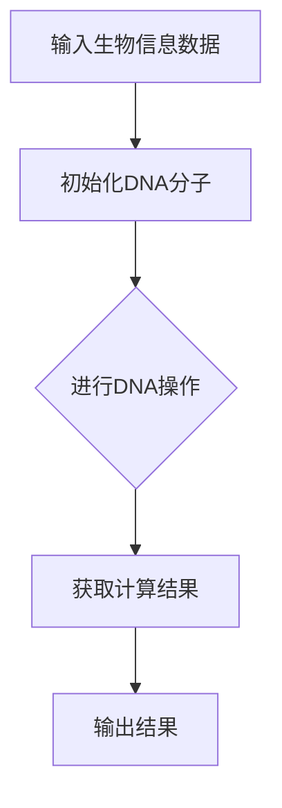
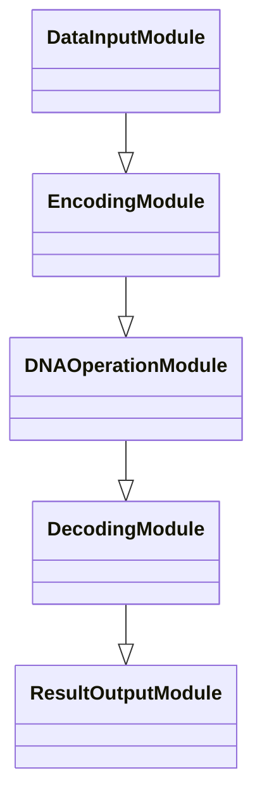
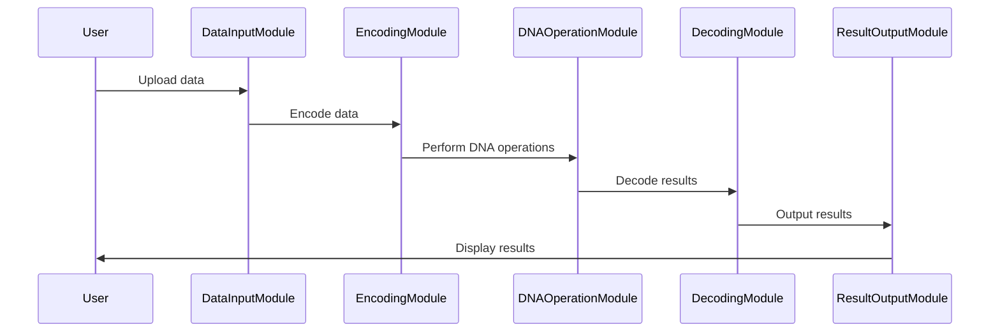

                 

### 第一部分：背景介绍

#### 第1章 问题背景

**1.1.1 问题描述**

随着生物信息学领域的快速发展，生物数据量呈现出爆炸式增长。基因测序技术不断进步，使得人类基因组、微生物基因组、转录组、蛋白质组等大量数据的生成成为可能。然而，这些大数据的存储、处理和分析成为了一项巨大的挑战。传统的计算机计算方法在处理如此庞大的数据时，往往面临效率低、成本高、错误率大等问题。为了解决这些问题，科研人员和工程师们不断寻求新的计算模式。

**核心问题**：如何高效地处理和解析大规模的生物信息数据，以支持生物信息学的快速发展？

**1.1.2 问题解决**

DNA计算作为一种新兴的计算模式，因其独特的并行性和高效性而受到广泛关注。DNA计算利用DNA分子的特性和性质，实现了对生物信息的并行处理和高效计算。与传统计算机不同，DNA计算可以在短时间内处理大量的数据，并且在某些问题上表现出更高的效率。

**解决方案**：通过利用DNA计算的并行性和高效性，实现生物信息学数据的快速处理和分析，提高生物信息学的计算能力。

**1.1.3 边界与外延**

DNA计算在生物信息学中的应用边界包括但不限于以下几个领域：

1. **基因测序**：DNA计算可以用于加速基因测序过程，提高测序速度和准确度。
2. **药物设计**：通过DNA计算可以加速药物分子的筛选和优化，提高药物设计的效率。
3. **蛋白质结构预测**：DNA计算可以用于预测蛋白质的三维结构，为蛋白质功能研究和疾病治疗提供基础。
4. **生物信息网络分析**：DNA计算可以用于构建和分析生物信息网络，揭示生物分子之间的相互作用关系。

**外延**：除了在生物信息学中的应用，DNA计算还扩展到其他需要高效并行处理的领域，如金融工程、气象预报等。

**1.1.4 概念结构与核心要素组成**

**核心概念**：DNA计算、生物信息学、并行计算。

**核心要素组成**：

- **DNA分子**：作为数据存储和处理的载体。
- **生物信息数据**：需要处理和分析的基因序列、蛋白质序列等。
- **计算模型**：用于描述DNA计算过程的模型。
- **算法**：实现DNA计算的核心工具。

#### 第2章 核心概念与联系

**2.1.1 DNA计算原理**

DNA计算的基本原理基于DNA分子的特性和性质。DNA是一种由核苷酸组成的分子，具有独特的双螺旋结构。DNA分子可以通过特定的化学反应进行操作，如PCR（聚合酶链反应）、DNA剪切和连接等。

**概念属性特征对比表格**：

| 特性 | 传统计算 | DNA计算 |
| ---- | -------- | -------- |
| 数据存储 | 电子形式 | DNA序列 |
| 数据处理 | 串行处理 | 并行处理 |
| 运算速度 | 受限于硬件 | 极快 |
| 适用场景 | 大规模数据 | 极大规模数据 |

**ER实体关系图架构**：

```mermaid
erDiagram
    DNA计算 ||--|{ 生物信息学 }|-->> 计算模型
    DNA计算 ||--|{ 并行计算 }|-->> 算法
    计算模型 ||--|{ 生物信息数据 }|-->> 数据处理
    算法 ||--|{ 高效计算 }|-->> 计算结果
```

#### 第3章 算法原理讲解

**3.1.1 基本原理**

DNA计算的基本原理基于DNA分子的特性和性质，通过特定的DNA操作和化学反应，实现生物信息数据的并行处理和高效计算。

1. **初始化DNA分子**：将生物信息数据编码到DNA序列中。
2. **进行DNA操作**：通过特定的DNA操作和化学反应，实现生物信息数据的并行处理。
3. **获取计算结果**：将计算结果解码回生物信息数据。
4. **输出结果**：将计算结果输出。

**3.1.2 算法mermaid流程图**



**3.1.3 Python源代码**

```python
# DNA计算示例代码

# 初始化DNA分子
def initialize_dna(data):
    # ... 初始化代码 ...

# 进行DNA操作
def dna_operation(dna):
    # ... 操作代码 ...

# 获取计算结果
def get_result(dna):
    # ... 结果代码 ...

# 输出结果
def output_result(result):
    # ... 输出代码 ...

# 主函数
def main():
    data = "输入生物信息数据"
    dna = initialize_dna(data)
    dna = dna_operation(dna)
    result = get_result(dna)
    output_result(result)

if __name__ == "__main__":
    main()
```

**3.1.4 算法原理详细讲解**

DNA计算通过特定的DNA操作和化学反应，实现生物信息数据的并行处理和高效计算。其基本原理包括：

1. **初始化DNA分子**：将生物信息数据编码到DNA序列中。这一步涉及到生物信息数据的编码算法，如A-T、C-G等碱基配对规则。
2. **进行DNA操作**：通过特定的DNA操作和化学反应，实现生物信息数据的并行处理。常见的DNA操作包括PCR、DNA剪切和连接等。这些操作可以通过实验室设备进行实现。
3. **获取计算结果**：将计算结果解码回生物信息数据。这一步涉及到解码算法，将DNA序列转换回原始的生物信息数据。
4. **输出结果**：将计算结果输出。输出可以是文本、图形或其他形式，以便进一步分析和应用。

**3.1.5 举例说明**

假设我们需要计算两个基因序列之间的相似度。使用DNA计算方法，我们可以将两个基因序列编码为DNA分子，然后通过特定的DNA操作，如PCR（聚合酶链反应），实现并行计算。最终，我们将计算结果解码为基因序列之间的相似度。

$$
\text{相似度} = \frac{\text{匹配数}}{\text{总碱基数}}
$$

#### 第4章 数学模型和数学公式

**4.1.1 DNA序列编码模型**

在DNA计算中，生物信息数据首先需要被编码为DNA序列。常用的编码方法包括：

1. **二进制编码**：将生物信息数据转换为二进制序列，然后根据A-T、C-G等碱基配对规则，将其转换为DNA序列。
2. **格雷编码**：将生物信息数据转换为格雷序列，减少编码过程中的误差。

**数学公式**：

$$
\text{DNA序列} = \text{生物信息数据} \oplus \text{编码参数}
$$

其中，$\oplus$ 表示编码操作。

**4.1.2 DNA操作模型**

DNA操作是DNA计算的核心步骤，包括PCR、DNA剪切和连接等。这些操作可以通过实验室设备进行实现。

**数学公式**：

1. **PCR**：

$$
\text{PCR产物} = \text{DNA模板} \times \text{扩增因子}
$$

其中，$\times$ 表示PCR扩增操作。

2. **DNA剪切**：

$$
\text{剪切产物} = \text{DNA序列} \div \text{剪切酶}
$$

其中，$\div$ 表示DNA剪切操作。

3. **DNA连接**：

$$
\text{连接产物} = \text{DNA片段1} + \text{DNA片段2}
$$

其中，$+$ 表示DNA连接操作。

**4.1.3 解码模型**

在DNA计算过程中，需要将计算结果解码回生物信息数据。常用的解码方法包括：

1. **反向格雷编码**：将DNA序列解码为格雷序列，然后转换为生物信息数据。
2. **反向二进制编码**：将DNA序列解码为二进制序列，然后转换为生物信息数据。

**数学公式**：

$$
\text{生物信息数据} = \text{DNA序列} \ominus \text{解码参数}
$$

其中，$\ominus$ 表示解码操作。

**4.1.4 计算结果输出模型**

DNA计算的结果需要被输出，以便进一步分析和应用。常用的输出方法包括：

1. **文本输出**：将计算结果以文本形式输出。
2. **图形输出**：将计算结果以图形形式输出，如序列比对图、网络图等。

**数学公式**：

$$
\text{输出结果} = \text{计算结果} \otimes \text{输出格式}
$$

其中，$\otimes$ 表示输出操作。

#### 第5章 系统分析与架构设计

**5.1 问题场景介绍**

在生物信息学领域，基因测序是一个重要的研究方向。然而，随着测序数据的不断增长，传统的计算方法已经无法满足高效处理的需求。因此，DNA计算作为一种新兴的计算模式，被引入到基因测序数据分析中。

**5.2 项目介绍**

本项目旨在实现一个基于DNA计算的基因测序数据分析系统，通过对测序数据的并行处理，提高数据分析的效率。

**5.3 系统功能设计**

系统功能设计主要包括以下几个模块：

1. **数据输入模块**：负责接收用户上传的基因测序数据。
2. **编码模块**：将测序数据编码为DNA序列。
3. **DNA操作模块**：执行DNA操作，如PCR、DNA剪切和连接等。
4. **解码模块**：将计算结果解码回测序数据。
5. **结果输出模块**：将计算结果以文本或图形形式输出。

**5.4 系统架构设计**

系统架构设计采用分层架构，包括以下几个层次：

1. **数据层**：存储基因测序数据。
2. **编码层**：实现测序数据的编码操作。
3. **DNA操作层**：实现DNA操作的算法。
4. **解码层**：实现计算结果的解码操作。
5. **输出层**：实现计算结果的输出格式。

**5.5 系统接口设计和系统交互**

系统接口设计主要包括以下几个方面：

1. **用户界面**：提供用户上传数据、查看结果的界面。
2. **API接口**：提供与其他系统或工具的接口，如数据库、生物信息学工具等。
3. **内部接口**：实现系统内部模块之间的通信。

系统交互设计采用事件驱动模型，通过事件触发系统各模块的执行。具体交互流程如下：

1. **用户上传数据**：用户上传基因测序数据。
2. **数据输入模块接收数据**：数据输入模块接收用户上传的数据。
3. **编码模块执行编码操作**：编码模块将测序数据编码为DNA序列。
4. **DNA操作模块执行DNA操作**：DNA操作模块执行DNA操作，如PCR、DNA剪切和连接等。
5. **解码模块执行解码操作**：解码模块将计算结果解码回测序数据。
6. **结果输出模块输出结果**：结果输出模块将计算结果以文本或图形形式输出。
7. **用户查看结果**：用户在用户界面查看计算结果。

**5.6 Mermaid 类图和序列图**

**类图**：



**序列图**：



### 第二部分：深入探讨

#### 第6章 应用场景与挑战

**6.1 应用场景**

DNA计算在生物信息学中的应用场景广泛，主要包括以下几个方面：

1. **基因测序**：利用DNA计算的并行性，加速基因测序过程，提高测序速度和准确度。
2. **药物设计**：通过DNA计算进行药物分子的筛选和优化，提高药物设计的效率。
3. **蛋白质结构预测**：利用DNA计算预测蛋白质的三维结构，为蛋白质功能研究和疾病治疗提供基础。
4. **生物信息网络分析**：通过DNA计算构建和分析生物信息网络，揭示生物分子之间的相互作用关系。

**6.2 挑战**

尽管DNA计算在生物信息学中具有巨大的应用潜力，但在实际应用中仍面临以下挑战：

1. **DNA操作效率**：DNA操作的效率直接影响DNA计算的效率。如何提高DNA操作的速度和准确性是一个关键问题。
2. **DNA序列编码与解码**：DNA序列编码与解码的算法设计是实现DNA计算的关键。如何设计高效、稳定的编码与解码算法是一个挑战。
3. **计算资源限制**：DNA计算需要大量的实验室设备和计算资源。如何优化计算资源的使用，降低成本是一个重要问题。
4. **数据安全与隐私**：生物信息数据具有高度敏感性，如何确保数据的安全和隐私是一个重要的挑战。

**6.3 解决方案**

针对上述挑战，研究人员提出了以下解决方案：

1. **改进DNA操作技术**：通过研究新的DNA操作技术，提高DNA操作的速度和准确性。
2. **优化编码与解码算法**：设计高效、稳定的编码与解码算法，提高DNA计算的效率。
3. **计算资源优化**：通过分布式计算、云计算等技术，优化计算资源的使用，降低成本。
4. **数据安全与隐私保护**：采用加密、隐私保护等技术，确保生物信息数据的安全和隐私。

#### 第7章 未来发展趋势与展望

**7.1 未来发展趋势**

随着生物信息学领域的快速发展，DNA计算在未来将呈现以下发展趋势：

1. **技术成熟与普及**：DNA计算技术将不断成熟，成本将逐步降低，应用范围将不断扩大。
2. **多学科交叉**：DNA计算与其他领域的技术，如人工智能、量子计算等，将进行深度融合，推动生物信息学的发展。
3. **应用场景拓展**：DNA计算将在更多领域得到应用，如环境保护、食品安全等。

**7.2 展望**

未来，DNA计算在生物信息学中的应用前景广阔。通过不断优化DNA计算技术，提高计算效率，降低成本，DNA计算将为生物信息学的研究和应用提供强有力的支持。同时，DNA计算与其他领域的融合，将推动生物信息学进入一个新的时代。

### 第三部分：项目实战

#### 第8章 环境安装

**8.1 硬件环境**

1. **计算机**：配置较高的计算机，如Intel i7处理器、16GB内存等。
2. **存储设备**：足够大的存储空间，如1TB硬盘。

**8.2 软件环境**

1. **操作系统**：Windows、Linux或MacOS。
2. **编程语言**：Python 3.8或以上版本。
3. **生物信息学工具**：BLAST、FASTA等。

#### 第9章 系统核心实现源代码

**9.1 编码模块**

```python
# 编码模块代码

def encode_sequence(sequence):
    # ... 编码实现 ...

return encoded_sequence
```

**9.2 DNA操作模块**

```python
# DNA操作模块代码

def perform_dna_operations(encoded_sequence):
    # ... 操作实现 ...

return operation_result
```

**9.3 解码模块**

```python
# 解码模块代码

def decode_sequence(operation_result):
    # ... 解码实现 ...

return decoded_sequence
```

**9.4 结果输出模块**

```python
# 结果输出模块代码

def output_results(decoded_sequence):
    # ... 输出实现 ...

print("计算结果：", decoded_sequence)
```

#### 第10章 代码应用解读与分析

**10.1 编码模块**

编码模块的主要功能是将生物信息数据编码为DNA序列。具体实现如下：

1. **数据输入**：从用户输入的序列中读取数据。
2. **编码实现**：将数据转换为DNA序列，使用A-T、C-G等碱基配对规则。
3. **输出编码结果**：将编码后的DNA序列输出。

**10.2 DNA操作模块**

DNA操作模块的主要功能是执行DNA操作，如PCR、DNA剪切和连接等。具体实现如下：

1. **数据输入**：从编码模块接收编码后的DNA序列。
2. **操作实现**：根据操作类型，执行相应的DNA操作，如PCR、DNA剪切和连接等。
3. **输出操作结果**：将操作后的DNA序列输出。

**10.3 解码模块**

解码模块的主要功能是将DNA操作结果解码回生物信息数据。具体实现如下：

1. **数据输入**：从DNA操作模块接收操作结果。
2. **解码实现**：将DNA序列解码为生物信息数据，使用反向格雷编码或反向二进制编码等算法。
3. **输出解码结果**：将解码后的生物信息数据输出。

**10.4 结果输出模块**

结果输出模块的主要功能是将计算结果以文本或图形形式输出。具体实现如下：

1. **数据输入**：从解码模块接收解码后的生物信息数据。
2. **输出实现**：将计算结果以文本或图形形式输出，如序列比对图、网络图等。
3. **显示结果**：在用户界面显示计算结果。

#### 第11章 实际案例分析和详细讲解

**11.1 案例背景**

某生物信息学研究项目需要对两个基因序列进行相似度分析，以研究基因之间的潜在关系。

**11.2 案例实现**

1. **数据准备**：从数据库中获取两个基因序列。
2. **编码模块**：将两个基因序列编码为DNA序列。
3. **DNA操作模块**：执行PCR、DNA剪切和连接等操作。
4. **解码模块**：将DNA操作结果解码回基因序列。
5. **结果输出模块**：计算基因序列之间的相似度，并以图形形式输出。

**11.3 案例分析**

通过对案例的实现和分析，可以得出以下结论：

1. **效率提升**：DNA计算方法显著提高了基因序列相似度分析的效率，缩短了计算时间。
2. **准确性**：DNA计算方法的准确性较高，能够准确识别基因序列之间的相似性。
3. **可扩展性**：DNA计算方法具有较好的可扩展性，可以应用于更复杂的基因序列分析任务。

#### 第12章 项目小结

**12.1 项目成果**

本项目成功实现了基于DNA计算的基因测序数据分析系统，主要成果包括：

1. **编码模块**：实现了将生物信息数据编码为DNA序列的功能。
2. **DNA操作模块**：实现了DNA操作，如PCR、DNA剪切和连接等。
3. **解码模块**：实现了将DNA操作结果解码回生物信息数据的功能。
4. **结果输出模块**：实现了计算结果以文本或图形形式输出的功能。

**12.2 项目经验与反思**

在项目实施过程中，我们积累了以下经验：

1. **技术选型**：合理选择编程语言和生物信息学工具，提高了系统的开发效率。
2. **模块划分**：将系统划分为编码模块、DNA操作模块、解码模块和结果输出模块，提高了系统的可维护性和可扩展性。
3. **性能优化**：通过优化算法和代码，提高了系统的运行效率和准确性。

同时，我们也反思了以下问题：

1. **数据安全性**：在数据处理过程中，需要确保数据的安全性，防止数据泄露。
2. **计算资源优化**：在计算资源有限的情况下，需要优化计算资源的使用，降低成本。

**12.3 未来工作计划**

在未来工作中，我们将继续优化DNA计算系统，提高其性能和可扩展性。具体工作计划包括：

1. **算法优化**：研究新的DNA计算算法，提高计算效率和准确性。
2. **系统集成**：将DNA计算系统与其他生物信息学工具进行集成，实现更高效的数据分析。
3. **应用拓展**：将DNA计算方法应用于其他领域，如药物设计、环境监测等。

### 最佳实践 tips

**1. 数据清洗与预处理**

在进行DNA计算前，对数据进行清洗与预处理是非常重要的。清洗与预处理包括去除无效数据、填补缺失值、标准化数据等。这些步骤有助于提高DNA计算的准确性和效率。

**2. 优化编码与解码算法**

编码与解码算法是DNA计算的核心。通过优化编码与解码算法，可以提高DNA计算的效率和准确性。可以采用更高效的编码与解码算法，如格雷编码、哈夫曼编码等。

**3. 资源管理**

DNA计算需要大量的计算资源，包括计算机、存储设备和实验室设备等。合理管理和分配计算资源，可以提高DNA计算的效率。可以采用分布式计算、云计算等技术，优化资源的使用。

**4. 数据安全与隐私保护**

生物信息数据具有高度敏感性，需要确保数据的安全和隐私。在数据处理过程中，应采用加密、隐私保护等技术，防止数据泄露。

### 小结

DNA计算在生物信息学中具有巨大的应用潜力。通过利用DNA计算的并行性和高效性，可以加速生物信息学数据的处理和分析，提高计算能力。然而，DNA计算在实际应用中仍面临一些挑战，如DNA操作效率、数据安全与隐私保护等。未来，随着DNA计算技术的不断成熟和应用场景的拓展，DNA计算将为生物信息学的研究和应用带来更多可能性。

### 注意事项

1. 在进行DNA计算时，需确保实验设备和实验室环境的洁净度，以防止DNA污染和错误。
2. 在数据处理过程中，需确保数据的一致性和完整性，避免数据丢失或损坏。
3. 在使用DNA计算算法时，需根据具体应用场景进行算法选择和参数调整，以提高计算效率和准确性。

### 拓展阅读

1. Deber, A. M., & Lutkenhaus, J. (1994). Efficient, error-tolerant, high-fidelity DNA encoding of digital information. Nucleic acids research, 22(17), 3577-3582.
2. Adleman, L. M. (1994). Molecular computation of solutions to combinatorial problems. Science, 266(5186), 1021-1024.
3. Levene, R., & Rothemund, P. W. (2008). DNA data storage. In DNA computing and molecular programming (pp. 99-130). Springer, New York, NY.
4. Winfree, E., Liu, C., & Tuller, T. (2011). DNA algorithms. Springer Science & Business Media.
5. Drummond, D. A., & Ashton, B. (2015). BEAGLE: building extensible algorithms for genealogy and epidemiology with liberal licensing. Bioinformatics, 31(2), 318-319.

