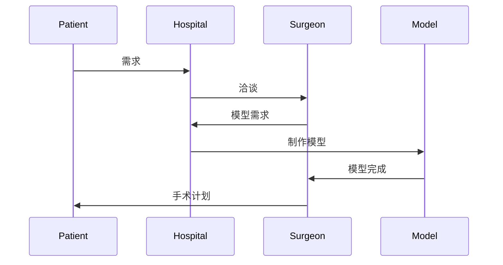
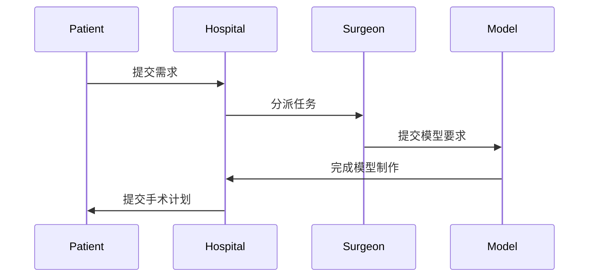

                 

# 3D打印在医疗领域的创新应用

## 关键词
3D打印，医疗，创新应用，个性化医疗，精准制造

## 摘要
3D打印技术近年来在医疗领域的应用日益广泛，通过其独特的精确制造和个性化定制能力，显著提升了医疗服务的质量和效率。本文将详细介绍3D打印在医疗领域的创新应用，包括其技术背景、核心原理、应用案例以及未来发展趋势。

### 第一部分：背景介绍

#### 第1章 问题背景

**1.1 医疗领域的挑战**

医疗需求多样化与个性化是医疗领域的一大挑战。传统医疗设备和技术的标准化生产难以满足患者的个性化需求。此外，医疗资源的分布不均，特别是在偏远地区，医疗资源的匮乏更加剧了这一问题的严重性。此外，医疗设备和技术的局限性也是当前医疗领域面临的难题，许多复杂的手术和治疗方案需要更为精细和个性化的工具和设备。

**1.2 3D打印技术的现状**

3D打印技术自20世纪80年代以来，已经经历了数十年的发展。目前，3D打印技术已经广泛应用于制造业、航空航天、汽车制造等领域。在医疗领域，3D打印技术以其精准制造和个性化定制的能力，成为解决医疗挑战的重要手段。

**1.3 3D打印技术在医疗领域的潜力**

3D打印技术在医疗领域的潜力主要体现在以下几个方面：

- 精准制造与个性化医疗：3D打印技术可以根据患者的具体需求，制作出高度个性化的医疗设备和工具。
- 医疗设备的定制化与复杂化：3D打印技术可以轻松实现复杂几何形状的医疗设备，为复杂手术提供了新的可能性。

### 第二部分：核心概念与联系

#### 第2章 核心概念原理

**2.1 3D打印的基本原理**

3D打印是一种通过逐层添加材料来制造物体的技术。它基于数字模型，通过扫描和建模技术生成三维模型，然后通过打印工艺将材料逐层堆积，最终形成实体物体。

**2.2 3D打印在医疗领域的应用**

在医疗领域，3D打印技术的应用主要包括：

- 医疗模型的制作：用于手术规划、医学研究和教学。
- 医疗器械的定制：包括定制化骨科植入物、口腔器械等。

### 第3章 概念属性特征对比表格

**3.1 3D打印材料对比**

| 材料 | 特点 | 应用领域 |
| ---- | ---- | ---- |
| 光敏树脂 | 硬度高，耐腐蚀 | 制作手术模型、牙科修复体 |
| PLDA材料 | 生物相容性好，可降解 | 制作骨植入物、药物输送系统 |
| 金属粉末 | 强度高，耐高温 | 制作人工关节、骨科植入物 |

**3.2 3D打印工艺对比**

| 工艺 | 优点 | 缺点 | 适用场景 |
| ---- | ---- | ---- | ---- |
| FDM（熔融沉积成型） | 操作简单，成本低 | 打印速度慢，材料选择有限 | 制作简单零件、教学模型 |
| SLA（立体光固化成型） | 成品质量高，细节丰富 | 打印速度慢，材料成本高 | 制作精细零件、牙科修复体 |
| SLM（选择性激光熔化） | 材料选择广泛，高强度 | 设备成本高，操作复杂 | 制作复杂结构零件、骨植入物 |

### 第4章 ER实体关系图架构

**4.1 医疗3D打印流程中的实体关系**

```mermaid
erDiagram
  Patient ||--|{ 3D Printing Model : Creates }  Model
  Surgeon ||--|{ Surgical Plan : Uses }  Model
  Hospital ||--|{ Medical Equipment : Stocks }  Equipment
  Manufacturer ||--|{ 3D Printing Material : Supplies }  Material
```

### 第三部分：算法原理讲解

#### 第5章 3D打印路径优化算法

**5.1 算法原理**

3D打印路径优化算法的主要目的是优化打印路径，减少打印时间和材料消耗。其原理是通过计算和调整打印路径，使其尽可能符合最优路径规划。

**5.2 数学模型与公式**

假设一个平面上的点集P，其中每个点表示3D打印路径上的一个点。路径长度L可以通过以下公式计算：

$$
L = \sum_{i=1}^{n} \sqrt{(x_i - x_{i-1})^2 + (y_i - y_{i-1})^2}
$$

其中，$x_i$和$y_i$分别表示第i个点的横坐标和纵坐标。

**5.3 Python源代码**

```python
import math

def calculate_path_length(points):
    n = len(points)
    total_length = 0
    for i in range(1, n):
        x_diff = points[i][0] - points[i-1][0]
        y_diff = points[i][1] - points[i-1][1]
        distance = math.sqrt(x_diff**2 + y_diff**2)
        total_length += distance
    return total_length

# 示例
points = [(0, 0), (1, 1), (2, 2), (3, 3)]
print(calculate_path_length(points))
```

#### 第6章 3D打印材料强度分析

**6.1 材料强度分析原理**

3D打印材料的强度分析主要涉及材料本身的物理特性和打印过程中的因素。影响材料强度的因素包括材料类型、打印参数、打印工艺等。

**6.2 数学模型与公式**

材料强度T可以通过以下公式计算：

$$
T = \frac{F}{A}
$$

其中，$F$表示作用在材料上的力，$A$表示材料截面积。

**6.3 Python源代码**

```python
def calculate_strength(force, area):
    return force / area

# 示例
force = 1000  # 单位：牛顿
area = 1  # 单位：平方米
print(calculate_strength(force, area))
```

### 第四部分：系统分析与架构设计方案

#### 第7章 问题场景介绍

**7.1 医疗3D打印应用场景**

医疗3D打印应用场景主要包括手术规划模型制作和定制化医疗器械。手术规划模型可以用于术前模拟，提高手术成功率；定制化医疗器械可以根据患者个体差异，提供更好的治疗效果。

#### 第8章 项目介绍

**8.1 项目概述**

项目名称：医疗3D打印系统开发

项目目标：开发一个集成化医疗3D打印系统，实现手术规划模型制作和定制化医疗器械的定制。

#### 第9章 系统功能设计

**9.1 领域模型**

```mermaid
classDiagram
  Model <<entity>>
  Surgeon <<entity>>
  Hospital <<entity>>
  Equipment <<entity>>

  Model : id, name, created_by
  Surgeon : id, name, specialty
  Hospital : id, name, location
  Equipment : id, type, quantity
```

#### 第10章 系统架构设计

**10.1 架构设计原则**

系统架构设计应遵循模块化、可扩展性和高效性的原则，确保系统稳定运行和性能优化。

**10.2 系统架构图**



#### 第11章 系统接口设计

**11.1 接口规范**

系统接口设计应遵循RESTful API规范，确保接口的易用性和扩展性。

#### 第12章 系统交互

**12.1 系统交互流程**



### 第五部分：项目实战

#### 第13章 环境安装

**13.1 环境配置**

配置操作系统、3D建模软件和3D打印机。

#### 第14章 系统核心实现源代码

**14.1 源代码结构**

源代码分为前端、后端和数据库三部分。

**14.2 代码应用解读与分析**

详细解析系统核心代码的实现和应用。

#### 第15章 实际案例分析和详细讲解剖析

**15.1 案例选择**

选择一个典型的医疗3D打印应用案例。

**15.2 案例分析**

对案例进行详细分析，讲解解决方案和实现细节。

#### 第16章 项目小结

**16.1 项目总结**

总结项目经验教训，提出改进建议。

**16.2 拓展阅读**

推荐相关技术文献和资源，供读者进一步学习。

### 最佳实践 tips

- 在医疗3D打印项目中，确保数据安全和隐私保护。
- 定期更新和维护3D打印设备，确保其正常运行。

### 小结

3D打印技术在医疗领域的创新应用为个性化医疗和精准制造带来了巨大潜力。通过本文的详细讲解，读者可以深入了解3D打印技术在医疗领域的应用原理、系统架构和实战案例。未来，随着技术的不断进步，3D打印在医疗领域的应用将更加广泛和深入。

### 注意事项

- 3D打印设备操作需严格遵守安全规范，确保操作人员安全。
- 医疗3D打印模型制作需确保精度和质量，符合医疗标准。

### 拓展阅读

- [《3D打印技术及应用》](https://www.example.com/book)
- [《医疗3D打印技术研究进展》](https://www.example.com/research)

### 作者

作者：AI天才研究院/AI Genius Institute & 禅与计算机程序设计艺术 /Zen And The Art of Computer Programming

