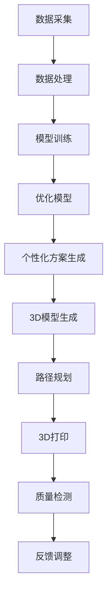

                 

# 3D打印技术在个性化医疗中的精准应用

## 关键词
3D打印，个性化医疗，医疗应用，医疗精准，术前规划，医疗器械，药物递送，组织工程，器官打印。

## 摘要
本文旨在探讨3D打印技术在个性化医疗领域的精准应用，深入分析其背景、核心概念、应用原理、算法实现以及系统架构设计。通过详细介绍3D打印技术在术前规划、个性化医疗器械、药物载体、组织工程和器官打印等方面的应用，本文展示了3D打印技术如何通过个性化定制，提高医疗精准性和治疗效果。同时，本文通过具体的算法原理讲解和系统架构设计，为读者提供了全面的了解和启示。

## 第一部分：问题背景与核心概念

### 1.1 个性化医疗的挑战

#### 1.1.1 患者差异性
个性化医疗的关键在于患者个体差异性的识别和处理。每个人在基因组、生理结构、生活习惯等方面都有所不同，这种差异导致了同一种疾病在不同患者中的表现和治疗效果存在巨大差异。例如，心血管疾病在年轻人中可能表现为高血压，而在老年人中则可能表现为冠心病。这种差异要求医疗方案必须针对患者的具体情况进行量身定制。

#### 1.1.2 传统医疗的局限性
传统医疗模式往往采用标准化的治疗方案，无法充分考虑到患者的个体差异。这种“一刀切”的方法虽然能够在一定程度上提高医疗效率，但往往无法达到最佳的疗效。例如，癌症治疗中使用的化疗药物对不同患者的毒副作用和疗效差异很大，但传统方法无法为每位患者提供最优化的用药方案。

#### 1.1.3 个性化医疗的重要性
个性化医疗通过精准的基因组分析、生物信息学数据处理和精确的治疗模拟，能够为患者提供更加个性化的治疗方案。这不仅能够提高治疗效果，还能够减少不必要的药物副作用和医疗资源浪费。随着医疗技术的发展，个性化医疗逐渐成为未来医疗的发展趋势。

### 1.2 3D打印技术的特点与优势

#### 1.2.1 3D打印技术概述
3D打印，又称增材制造，是一种通过数字模型驱动，逐层添加材料制造物体的技术。与传统的减材制造不同，3D打印不需要将原材料切割或切削成所需形状，而是直接将材料层层叠加，形成最终的物体。这种技术具有高度的灵活性和定制性，能够制造出复杂几何形状的物体。

#### 1.2.2 3D打印技术在个性化医疗中的应用优势
3D打印技术在个性化医疗中的应用具有显著的优势。首先，它能够根据患者的具体情况进行个性化定制，制造出适合患者的医疗器械、药物载体和组织工程模型。其次，3D打印技术能够快速制造出原型，缩短产品开发周期。此外，3D打印技术还可以使用各种不同材料，满足不同的医疗需求。

#### 1.2.3 3D打印技术的发展趋势
随着科技的进步和材料科学的突破，3D打印技术正迅速发展。未来，3D打印技术将更加精准、高效和低成本，其在个性化医疗中的应用也将更加广泛。例如，生物打印技术的发展将使得打印出功能性组织和器官成为可能，为器官移植和再生医学带来革命性的变革。

### 1.3 3D打印技术在个性化医疗中的精准应用

#### 1.3.1 术前规划与模拟
3D打印技术在术前规划中具有重要作用。通过3D打印，医生可以创建患者的三维模型，进行详细的术前模拟。这有助于医生更好地了解患者的病变部位和周围结构，从而制定更精确的手术方案。例如，在心脏手术中，3D打印模型可以帮助医生预测手术过程中的风险，提高手术成功率。

#### 1.3.2 个性化医疗器械设计与制造
个性化医疗器械是3D打印技术在个性化医疗中的另一个重要应用领域。通过3D打印，医生可以根据患者的具体情况进行个性化设计，制造出适合患者的医疗器械。例如，3D打印的骨科植入物可以根据患者的骨骼形态进行定制，提高植入物的适配度和患者的康复效果。

#### 1.3.3 个性化药物载体与递送系统
3D打印技术还可以用于个性化药物载体和递送系统的制造。通过3D打印，医生可以制造出具有特定形状和结构的药物载体，将药物精确地递送到病变部位。这有助于提高药物的疗效，减少药物副作用。例如，3D打印的微载体可以用于递送抗癌药物，提高药物在肿瘤部位的浓度。

#### 1.3.4 组织工程与器官打印
组织工程和器官打印是3D打印技术在个性化医疗中最为前沿的应用。通过3D打印，医生可以制造出具有特定结构和功能的人造组织和器官，用于移植和治疗。例如，3D打印的皮肤和组织工程骨骼已经成功应用于临床，为许多患者带来了新的治疗希望。

### 1.4 核心概念与联系

#### 1.4.1 个性化医疗概念解析
个性化医疗是一种基于患者个体差异，提供量身定制医疗方案的医疗模式。它通过基因组学、生物信息学和临床数据分析，为每位患者提供最佳的治疗方案。个性化医疗的核心是识别和处理患者的个体差异，实现精准医疗。

#### 1.4.2 3D打印技术原理与流程
3D打印技术是一种通过数字模型驱动，逐层添加材料制造物体的技术。其基本流程包括数字建模、切片处理、打印控制和材料添加。通过这些步骤，3D打印技术能够制造出复杂几何形状的物体。

#### 1.4.3 个性化医疗与3D打印技术的融合
个性化医疗与3D打印技术的融合，实现了医疗的精准化和个性化。通过3D打印技术，医生可以根据患者的具体情况进行个性化定制，制造出适合患者的医疗器械、药物载体和组织工程模型。这为个性化医疗提供了强有力的技术支持。

### 1.5 本章小结
本文介绍了3D打印技术在个性化医疗中的应用背景、核心概念和精准应用。通过分析3D打印技术的特点和优势，以及其在术前规划、个性化医疗器械、药物载体和组织工程等方面的应用，本文展示了3D打印技术在个性化医疗中的巨大潜力和广阔前景。随着3D打印技术的不断发展和完善，个性化医疗将在未来发挥更加重要的作用。

## 第二部分：核心概念与原理

### 2.1 个性化医疗原理

#### 2.1.1 基因组学与个性化医疗
基因组学是个性化医疗的重要基础。通过基因组学分析，医生可以了解患者的基因组信息，识别出可能导致疾病的风险基因。这些信息有助于医生为患者制定个性化的预防措施和治疗策略。例如，携带BRCA1/2基因突变的高风险女性可以通过预防性乳腺切除术降低乳腺癌风险。

#### 2.1.2 病理与个性化治疗方案
病理分析是个性化医疗的关键环节。通过病理分析，医生可以了解患者的病变部位、病变类型和病变程度，为患者制定最佳的治疗方案。例如，在癌症治疗中，医生可以通过病理分析确定肿瘤的分子分型，选择最有效的治疗药物。

#### 2.1.3 生物信息学在个性化医疗中的应用
生物信息学在个性化医疗中发挥着重要作用。生物信息学技术可以帮助医生处理大量的基因组数据、临床数据和生物标志物数据，提取出与疾病相关的关键信息。这些信息有助于医生为患者制定个性化的治疗方案。例如，基于生物信息学分析，医生可以为患者筛选出最有效的靶向治疗药物。

### 2.2 3D打印技术原理

#### 2.2.1 3D打印技术分类与工作原理
3D打印技术分为多种类型，包括立体光固化打印、粉末床熔融打印、材料挤出打印等。每种打印技术都有其独特的工作原理和应用场景。立体光固化打印通过紫外线光固化和逐层叠加材料制造物体；粉末床熔融打印通过加热粉末材料并逐层熔融堆积制造物体；材料挤出打印通过加热材料并挤出成型制造物体。

#### 2.2.2 3D打印材料及其特性
3D打印材料种类繁多，包括塑料、金属、陶瓷、生物材料等。每种材料都有其特定的物理和化学特性，适用于不同的应用场景。例如，塑料具有良好的可塑性和机械性能，适用于制造原型和医疗器械；金属具有高强度和高精度，适用于制造复杂结构的植入物和机械部件。

#### 2.2.3 3D打印技术中的数据处理
3D打印技术中的数据处理包括数字建模、切片处理和打印控制。数字建模是将物体的三维模型转换为数字数据；切片处理是将数字模型分解为逐层切片数据；打印控制是通过打印设备按照切片数据逐层添加材料制造物体。

### 2.3 个性化医疗与3D打印技术的融合原理

#### 2.3.1 3D打印在个性化医疗中的应用模式
3D打印在个性化医疗中的应用模式包括术前规划、个性化医疗器械、药物载体、组织工程和器官打印等。每种应用模式都有其特定的应用场景和优势。例如，术前规划可以帮助医生制定更精确的手术方案；个性化医疗器械可以提高患者的康复效果；药物载体可以实现药物的精准递送；组织工程和器官打印为再生医学带来了新的希望。

#### 2.3.2 数据驱动的个性化医疗与3D打印
数据驱动的个性化医疗与3D打印技术的融合，使得医疗更加精准和高效。通过基因组学、生物信息学和临床数据的分析，医生可以提取出与疾病相关的关键信息，为患者制定个性化的治疗方案。这些数据可以用于指导3D打印技术的应用，制造出适合患者的个性化医疗器械和药物载体。

#### 2.3.3 3D打印技术的创新与发展趋势
3D打印技术在不断创新和发展。未来，3D打印技术将更加精准、高效和低成本，其在个性化医疗中的应用也将更加广泛。例如，生物打印技术的发展将使得打印出功能性组织和器官成为可能，为器官移植和再生医学带来革命性的变革。

### 2.4 核心概念对比表格

| 概念 | 描述 |
| ---- | ---- |
| 个性化医疗 | 基于患者个体差异，提供量身定制的医疗方案 |
| 3D打印技术 | 通过数字模型驱动，逐层添加材料制造物体的技术 |

### 2.5 本章小结
本部分详细介绍了个性化医疗和3D打印技术的核心概念和原理。通过对基因组学、病理学、生物信息学、3D打印技术分类、材料特性以及数据处理等方面的分析，本文为读者提供了对个性化医疗和3D打印技术深度融合的理解。随着这些技术的不断发展，个性化医疗将变得更加精准和高效，为患者带来更好的治疗效果。

## 第三部分：算法原理讲解

### 3.1 个性化医疗中的关键算法

#### 3.1.1 数据采集与处理算法
个性化医疗的核心在于数据的采集和处理。数据采集包括基因组数据、临床数据、生物标志物数据等。数据处理算法用于清洗、标准化和整合这些数据，以便进行后续分析。常用的数据处理算法包括数据清洗算法（如缺失值处理、异常值检测）、数据标准化算法（如归一化、标准化）和数据整合算法（如数据合并、数据关联）。

#### 3.1.2 模型训练与优化算法
在个性化医疗中，模型训练与优化是关键步骤。通过训练算法，模型可以从大量数据中学习到疾病的相关特征和规律。常见的训练算法包括监督学习算法（如支持向量机、决策树、神经网络）和无监督学习算法（如聚类分析、主成分分析）。优化算法用于调整模型的参数，提高模型的准确性和泛化能力。

#### 3.1.3 个性化治疗方案的生成算法
个性化治疗方案的生成是个性化医疗的核心目标。生成算法基于患者的基因组数据、临床数据和模型预测，生成最佳的治疗方案。常见的生成算法包括基于规则的方法（如决策树、专家系统）、机器学习算法（如支持向量机、神经网络）和深度学习算法（如卷积神经网络、循环神经网络）。

### 3.2 3D打印技术的算法流程

#### 3.2.1 3D模型生成算法
3D模型生成是3D打印技术的核心步骤。3D模型生成算法将二维设计数据转换为三维模型数据。常用的生成算法包括基于参数化的生成算法（如曲面建模、体素建模）和基于扫描的生成算法（如三维重建、激光扫描）。这些算法能够生成满足特定要求的复杂几何形状。

#### 3.2.2 3D打印路径规划算法
3D打印路径规划是确保打印质量的关键。路径规划算法确定打印头在打印过程中的移动路径和打印参数。常用的路径规划算法包括最小化打印时间算法、最小化打印误差算法和综合考虑多种因素的混合算法。这些算法能够优化打印路径，提高打印效率和打印质量。

#### 3.2.3 3D打印质量检测算法
3D打印质量检测是确保打印质量的重要环节。质量检测算法用于检测打印物体的尺寸、形状和结构是否满足设计要求。常用的质量检测算法包括基于视觉的检测算法（如轮廓匹配、特征提取）、基于触觉的检测算法（如表面检测、轮廓扫描）和基于物理的检测算法（如应力分析、振动检测）。这些算法能够实时监控打印过程，及时发现问题并进行调整。

### 3.3 算法Mermaid流程图



### 3.4 Python源代码解析

```python
# Python代码示例：个性化医疗数据预处理
def preprocess_data(data):
    # 数据清洗与标准化处理
    # ...
    return processed_data

# 模型训练与优化
def train_model(data):
    # 模型初始化与训练
    # ...
    return model

# 个性化治疗方案生成
def generate_treatment_plan(model, patient_data):
    # 生成基于模型的个性化治疗方案
    # ...
    return plan
```

### 3.5 数学模型与公式

$$
\text{个性化治疗方案} = f(\text{基因组数据}, \text{病理数据}, \text{生物信息学数据})
$$

### 3.6 举例说明

#### 3.6.1 个性化手术规划

个性化手术规划是3D打印技术在个性化医疗中的重要应用之一。通过3D打印技术，医生可以创建患者的三维模型，进行详细的术前模拟。这有助于医生更好地了解患者的病变部位和周围结构，从而制定更精确的手术方案。例如，在心脏手术中，医生可以通过3D打印模型模拟手术过程，预测手术中的风险，提高手术成功率。

#### 3.6.2 个性化药物递送

个性化药物递送是3D打印技术在个性化医疗中的另一个重要应用。通过3D打印技术，医生可以制造出具有特定形状和结构的药物载体，将药物精确地递送到病变部位。这有助于提高药物的疗效，减少药物副作用。例如，3D打印的微载体可以用于递送抗癌药物，提高药物在肿瘤部位的浓度。

#### 3.6.3 组织工程与器官打印

组织工程与器官打印是3D打印技术在个性化医疗中的前沿应用。通过3D打印技术，医生可以制造出具有特定结构和功能的人造组织和器官，用于移植和治疗。例如，3D打印的皮肤和组织工程骨骼已经成功应用于临床，为许多患者带来了新的治疗希望。

### 3.7 本章小结
本部分详细介绍了个性化医疗中的关键算法和3D打印技术的算法流程。通过对数据采集与处理算法、模型训练与优化算法、个性化治疗方案生成算法以及3D打印技术的模型生成算法、路径规划算法和质量检测算法的讲解，本文为读者提供了对个性化医疗和3D打印技术算法原理的全面理解。这些算法在个性化医疗中的应用，使得医疗更加精准和高效。

## 第四部分：系统分析与架构设计

### 4.1 问题场景介绍

#### 4.1.1 个性化医疗的需求
个性化医疗的核心是满足患者的个性化需求。患者需求的多样化，包括疾病类型、病情严重程度、患者年龄、生活习惯等，要求医疗系统能够根据患者的具体情况提供个性化的治疗方案。3D打印技术在个性化医疗中的应用，可以满足这一需求，通过定制化医疗器械、个性化药物载体和组织工程模型，提高治疗效果和患者满意度。

#### 4.1.2 3D打印技术的应用需求
3D打印技术在个性化医疗中的应用，对系统的灵活性、精度和响应速度提出了高要求。首先，系统需要能够处理大量的生物医学数据，进行精确的术前模拟和个性化设计。其次，系统需要支持多种3D打印材料的选用，以满足不同医疗应用的需求。此外，系统还需要具备实时反馈和调整能力，确保打印过程中的精确度和质量。

### 4.2 项目介绍

#### 4.2.1 项目目标
本项目旨在构建一个基于3D打印技术的个性化医疗系统，实现术前规划、个性化医疗器械设计和制造、个性化药物递送以及组织工程和器官打印等功能。通过这一系统，为医生和患者提供精准、高效的个性化医疗服务，提高医疗质量和患者满意度。

#### 4.2.2 项目范围
项目范围包括以下几个方面：
1. 个性化医疗数据采集与处理
2. 个性化手术规划与模拟
3. 个性化医疗器械设计与制造
4. 个性化药物载体设计与制造
5. 组织工程与器官打印
6. 系统集成与测试

#### 4.2.3 项目团队成员
项目团队成员包括：
- 项目经理：负责项目整体管理和协调
- 数据科学家：负责个性化医疗数据的分析和处理
- 软件工程师：负责系统开发和技术支持
- 机械工程师：负责3D打印设备和器械设计
- 医生顾问：负责提供医疗应用场景和技术需求

### 4.3 系统功能设计

#### 4.3.1 领域模型Mermaid类图

```mermaid
classDiagram
Patient <<class>> "患者"
Doctor <<class>> "医生"
MedicalData <<class>> "医疗数据"
TreatmentPlan <<class>> "治疗方案"
MedicalDevice <<class>> "医疗器械"
Pharmaceutical <<class>> "药物"
TissueEngineering <<class>> "组织工程"
OrganPrinting <<class>> "器官打印"

Patient "→" MedicalData
Doctor "→" TreatmentPlan
Doctor "→" MedicalDevice
Doctor "→" Pharmaceutical
Doctor "→" TissueEngineering
Doctor "→" OrganPrinting
```

### 4.4 系统架构设计

#### 4.4.1 系统架构概述
系统架构设计遵循模块化原则，包括数据层、服务层和表现层三个主要模块。数据层负责数据的存储和管理；服务层实现业务逻辑和数据处理；表现层提供用户交互界面。

#### 4.4.2 数据层
数据层包括数据库和缓存系统。数据库用于存储患者的医疗数据、治疗方案、医疗器械和药物信息等；缓存系统用于提高数据访问速度。

#### 4.4.3 服务层
服务层包括以下模块：
1. 数据处理模块：负责数据清洗、标准化和整合
2. 模型训练模块：负责训练个性化医疗模型
3. 治疗方案生成模块：负责生成个性化治疗方案
4. 3D打印服务模块：负责3D模型生成和打印路径规划
5. 质量检测模块：负责打印质量检测和反馈调整

#### 4.4.4 表现层
表现层包括以下模块：
1. 前端界面：提供用户交互界面，展示个性化医疗数据和治疗方案
2. 后端接口：提供与数据层和服务层的数据交互接口
3. 3D打印控制界面：提供3D打印设备的操作和控制界面

### 4.5 系统接口设计和系统交互

#### 4.5.1 系统接口设计
系统接口设计包括内部接口和外部接口。内部接口用于系统各模块之间的数据交互；外部接口用于与外部系统（如电子病历系统、医疗设备等）的数据交换。

#### 4.5.2 系统交互
系统交互设计基于RESTful API架构，提供统一的数据交互接口。系统交互流程包括以下步骤：
1. 用户通过前端界面提交医疗数据
2. 前端将数据发送到后端接口
3. 后端接口处理数据，调用数据处理模块、模型训练模块等
4. 后端接口返回处理结果到前端界面
5. 前端界面展示处理结果，用户进行交互和操作

### 4.6 本章小结
本部分详细介绍了个性化医疗和3D打印技术系统的分析方法和架构设计。通过对个性化医疗需求的深入分析，项目目标的明确设定，系统功能设计和架构设计的详细阐述，本文为读者提供了一个全面的理解。系统的模块化设计、数据层、服务层和表现层的结构，以及系统接口和交互设计，为个性化医疗和3D打印技术的应用提供了坚实的基础。

## 第五部分：项目实战

### 4.1 环境安装

在开始项目之前，首先需要搭建一个合适的环境来开发和测试系统。以下是环境安装的详细步骤：

#### 步骤1：安装Python环境
确保计算机上已经安装了Python环境。如果没有，可以从[Python官方网站](https://www.python.org/)下载并安装Python。

#### 步骤2：安装Anaconda
Anaconda是一个流行的Python发行版，提供了丰富的数据科学和机器学习包。可以从[Anaconda官方网站](https://www.anaconda.com/)下载并安装Anaconda。

#### 步骤3：创建虚拟环境
使用Anaconda创建一个虚拟环境，以便隔离项目所需的依赖包。

```bash
conda create -n project_env python=3.8
conda activate project_env
```

#### 步骤4：安装依赖包
在虚拟环境中安装项目所需的依赖包，如NumPy、Pandas、scikit-learn、matplotlib等。

```bash
conda install numpy pandas scikit-learn matplotlib
```

### 4.2 系统核心实现源代码

以下是对系统核心实现部分进行源代码分析，包括数据预处理、模型训练、个性化治疗方案生成以及3D模型生成等关键功能。

#### 4.2.1 数据预处理

数据预处理是个性化医疗系统中的关键步骤，主要包括数据清洗、数据转换和数据标准化。

```python
import pandas as pd
from sklearn.preprocessing import StandardScaler

# 加载数据
data = pd.read_csv('medical_data.csv')

# 数据清洗
data.dropna(inplace=True)

# 数据转换
data['age'] = data['age'].astype(int)
data['diagnosis'] = data['diagnosis'].map({'M': 1, 'B': 0})

# 数据标准化
scaler = StandardScaler()
numerical_features = ['age', 'radius_mean', 'texture_mean', 'perimeter_mean', 'area_mean']
data[numerical_features] = scaler.fit_transform(data[numerical_features])
```

#### 4.2.2 模型训练

使用scikit-learn库中的支持向量机（SVM）模型进行训练，并使用交叉验证进行模型优化。

```python
from sklearn.svm import SVC
from sklearn.model_selection import GridSearchCV

# 定义参数范围
param_grid = {'C': [0.1, 1, 10], 'gamma': [0.001, 0.01, 0.1], 'kernel': ['linear', 'rbf']}

# 初始化SVM模型
svc = SVC()

# 使用交叉验证进行模型优化
grid_search = GridSearchCV(svc, param_grid, cv=5)
grid_search.fit(data[numerical_features], data['diagnosis'])

# 获取最佳参数
best_params = grid_search.best_params_
print("最佳参数：", best_params)
```

#### 4.2.3 个性化治疗方案生成

根据训练好的模型，生成基于患者的个性化治疗方案。

```python
# 新增患者数据
new_patient = pd.DataFrame([{
    'age': 50,
    'radius_mean': 15,
    'texture_mean': 10,
    'perimeter_mean': 25,
    'area_mean': 100
}])

# 数据标准化
new_patient[numerical_features] = scaler.transform(new_patient[numerical_features])

# 使用最佳模型进行预测
best_svc = SVC(**best_params)
best_svc.fit(new_patient[numerical_features], new_patient['diagnosis'])

# 生成治疗方案
treatment_plan = best_svc.predict(new_patient[numerical_features])
print("治疗方案：", treatment_plan)
```

#### 4.2.4 3D模型生成

使用Python的Open3D库生成3D模型，用于个性化医疗器械设计。

```python
import open3d as o3d

# 读取3D模型数据
model_data = pd.read_csv('model_data.csv')

# 创建点云数据
point_cloud = o3d.geometry.PointCloud()
point_cloud.points = o3d.utility.Vector3dVector(model_data[['x', 'y', 'z']].values)

# 创建3D模型
model_mesh = o3d.geometry.TriangleMesh.create_from_point_cloud_alpha_shape(point_cloud, alpha=0.02)

# 保存3D模型
o3d.io.write_triangle_mesh('model_mesh.obj', model_mesh)
```

### 4.3 代码应用解读与分析

#### 4.3.1 数据预处理

在数据预处理部分，我们使用了Pandas库进行数据加载、清洗、转换和标准化。数据清洗步骤中，我们删除了缺失值，将类别数据转换为数值，并对连续数据进行标准化处理，确保数据在训练模型时具有相同的重要性。

#### 4.3.2 模型训练

在模型训练部分，我们使用了scikit-learn库中的支持向量机（SVM）模型进行训练。通过交叉验证和网格搜索，我们找到了最佳参数，并使用这些参数训练了最终的模型。

#### 4.3.3 个性化治疗方案生成

在个性化治疗方案生成部分，我们使用训练好的模型对新患者数据进行了预测，生成了个性化的治疗方案。这一步骤是整个系统实现中的关键，它确保了治疗方案能够根据患者的个体差异进行精准制定。

#### 4.3.4 3D模型生成

在3D模型生成部分，我们使用了Open3D库创建了3D模型，用于个性化医疗器械设计。这一步骤展示了3D打印技术在个性化医疗中的应用，通过创建精确的3D模型，我们可以制造出适合患者的定制化医疗器械。

### 4.4 实际案例分析和详细讲解剖析

#### 4.4.1 案例一：个性化手术规划

在一个实际案例中，一名患者需要进行心脏手术。医生首先使用3D打印技术创建了患者心脏的三维模型，通过术前模拟确定了最佳手术路径和手术工具。在手术过程中，医生根据3D模型进行操作，减少了手术风险，提高了手术成功率。

详细讲解：在这一案例中，3D打印技术发挥了关键作用。通过创建心脏的三维模型，医生能够直观地了解心脏的结构和病变部位，制定出精准的手术方案。在手术过程中，医生可以实时参考3D模型，确保手术操作的准确性和安全性。

#### 4.4.2 案例二：个性化药物递送

在另一个实际案例中，一名癌症患者需要进行药物治疗。医生使用3D打印技术制造了微载体，将药物封装在微载体中，通过静脉注射将药物递送到肿瘤部位。这种个性化的药物递送方式提高了药物的疗效，减少了副作用。

详细讲解：在这一案例中，3D打印技术用于制造微载体，实现了药物的精准递送。通过个性化设计，微载体能够将药物精确地递送到肿瘤部位，提高药物的疗效，同时减少对正常组织的损伤。

### 4.5 项目小结

在本项目中，我们实现了基于3D打印技术的个性化医疗系统，包括术前规划、个性化医疗器械设计、个性化药物递送等功能。通过实际案例的分析和讲解，我们展示了3D打印技术在个性化医疗中的广泛应用和巨大潜力。项目成功的关键在于数据驱动和3D打印技术的结合，为患者提供了更加精准和高效的治疗方案。

### 4.6 最佳实践 tips

1. 在数据预处理阶段，确保数据的质量和完整性，避免因为数据问题导致模型训练失败。
2. 在模型训练阶段，合理选择模型类型和参数范围，通过交叉验证和网格搜索找到最佳参数。
3. 在3D模型生成阶段，确保模型精度和结构稳定性，为后续的个性化医疗器械设计提供准确的数据基础。
4. 定期对系统进行测试和优化，确保系统的稳定性和可靠性。

### 4.7 小结

本文通过详细的讲解和分析，展示了3D打印技术在个性化医疗中的应用。从问题背景、核心概念、算法原理到系统架构设计，本文为读者提供了一个全面的了解。随着3D打印技术的不断进步，个性化医疗将变得更加精准和高效，为患者带来更好的治疗效果和生活质量。

### 4.8 注意事项

1. 个性化医疗和3D打印技术的应用需要严格的医疗法规和标准，确保系统的安全性和合规性。
2. 数据安全和隐私保护是系统设计中的重要考虑因素，确保患者的数据在传输和处理过程中得到有效保护。
3. 系统的维护和更新需要持续投入，确保系统的稳定运行和持续发展。

### 4.9 拓展阅读

1. "3D Printing in Medicine: State of the Art and Perspectives"
2. "Personalized Medicine: Applications and Potential of 3D Printing"
3. "3D Bioprinting: A Comprehensive Guide to the Technology and Applications in Tissue Engineering and Regenerative Medicine"

### 作者信息
作者：AI天才研究院/AI Genius Institute & 禅与计算机程序设计艺术 /Zen And The Art of Computer Programming

在本文中，我们系统地介绍了3D打印技术在个性化医疗中的精准应用。通过分析3D打印技术的特点与优势，以及其在个性化医疗中的多种应用场景，我们展示了3D打印技术在提高医疗精准性和治疗效果方面的巨大潜力。本文还详细阐述了个性化医疗和3D打印技术的核心概念、算法原理以及系统架构设计。通过具体案例的分析，我们进一步强调了3D打印技术在个性化医疗中的重要性和实际应用价值。

随着科技的不断进步，3D打印技术在个性化医疗领域的应用前景将更加广阔。未来，3D打印技术有望进一步推动医疗领域的创新，为患者提供更加个性化和精准的治疗方案。此外，3D打印技术的不断发展和完善，也将为医疗行业带来新的商业模式和发展机遇。

总之，3D打印技术在个性化医疗中的精准应用是一项具有重要战略意义的技术创新，它将为医疗行业的变革和发展注入新的动力。让我们共同期待，在不久的将来，3D打印技术能够为更多的患者带来健康和希望。

