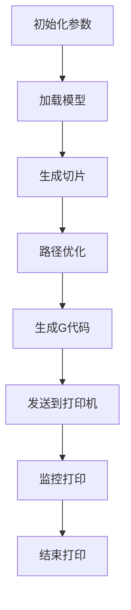
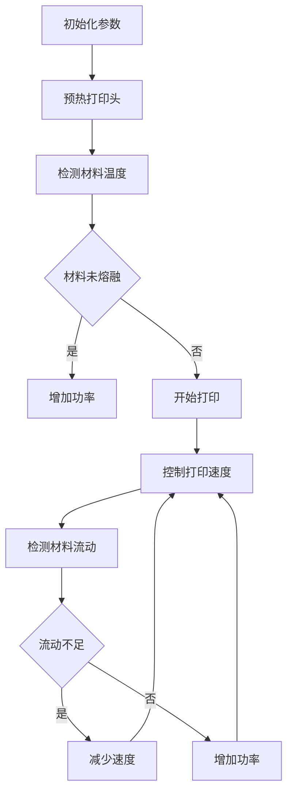

                 

### 3D打印技术在个性化营养食品中的应用

在快速发展的科技时代，3D打印技术正逐渐渗透到各个行业，为传统制造模式带来颠覆性的变革。其中，个性化营养食品成为这一技术的最新应用领域。随着人们对健康饮食和个性化需求的追求日益增长，3D打印技术以其独特的优势和精确性，为个性化营养食品的制作提供了全新的可能性。

关键词：3D打印、个性化营养食品、健康饮食、定制化生产

#### 摘要

本文旨在探讨3D打印技术在个性化营养食品中的应用，分析其核心原理、技术优势和面临的挑战。首先，我们回顾了3D打印技术的发展历程及其在食品工业中的应用现状。接着，详细介绍了个性化营养食品的定义、需求及其与3D打印技术的结合点。随后，本文深入剖析了3D打印技术在个性化营养食品中的具体应用实践，并通过案例分析展示了其商业潜力和实际效果。最后，本文展望了3D打印技术在个性化营养食品领域的未来发展趋势，提出了可能的解决方案和改进方向。

#### 目录

1. 背景介绍  
   1.1 个性化营养食品的需求  
   1.2 3D打印技术在食品工业中的应用前景  
   1.3 当前3D打印技术面临的挑战

2. 3D打印技术原理  
   2.1 3D打印技术基础  
   2.2 3D打印设备与工艺  
   2.3 算法原理讲解  
   2.4 数学模型与讲解

3. 个性化营养食品概述  
   3.1 个性化营养食品的定义  
   3.2 个性化营养食品的需求分析  
   3.3 个性化营养食品的核心概念与联系

4. 3D打印个性化营养食品的应用实践  
   4.1 3D打印个性化营养食品的优势  
   4.2 3D打印个性化营养食品的实现过程  
   4.3 3D打印个性化营养食品的案例分析

5. 案例分析  
   5.1 国内案例研究  
   5.2 国际案例研究

6. 未来展望  
   6.1 技术发展趋势  
   6.2 商业化应用前景  
   6.3 改进方向与挑战

7. 结论  
   7.1 总结与展望  
   7.2 对未来研究的建议

通过本文的探讨，我们希望为3D打印技术在个性化营养食品领域的应用提供理论依据和实践指导，推动这一新兴领域的快速发展。接下来，我们将逐步深入探讨每个章节的内容，详细阐述3D打印技术在个性化营养食品中的应用原理和实践案例。让我们一起Let's Think Step by Step！

#### 1.1 个性化营养食品的需求

个性化营养食品，顾名思义，是指根据个体差异和需求，定制化生产的营养食品。随着健康意识的提升和生活方式的多样化，人们对食品的需求也变得愈发个性化和精细化。以下是几个关键因素，解释了为什么个性化营养食品正逐渐成为市场上的热点：

**健康需求**  
每个人对营养的需求都是不同的，受到年龄、性别、健康状况、遗传背景等多种因素的影响。传统的食品生产方式难以满足个体差异化的需求，而个性化营养食品可以通过精确计算和定制化生产，确保每个人摄入的养分恰到好处，从而提高健康水平。

**消费习惯**  
随着互联网和信息技术的普及，消费者获取健康知识和个性化定制信息的渠道更加广泛。他们越来越倾向于根据自己的偏好和需求，选择适合自己的食品。这种消费习惯的转变，为个性化营养食品的市场提供了广阔的空间。

**市场前景**  
个性化营养食品不仅满足了消费者的健康需求，还迎合了他们的消费习惯。根据市场研究机构的预测，个性化营养食品市场在未来几年将保持高速增长，成为食品工业中的一个重要分支。这一前景为3D打印技术的应用提供了强有力的动力。

**科技发展**  
3D打印技术的快速发展，为个性化营养食品的生产提供了技术支持。通过3D打印，可以在短时间内制作出形状和成分均符合个体需求的食品，大大提高了生产效率和定制精度。此外，3D打印技术的不断进步，也使得个性化营养食品的制作成本逐渐降低，进一步推动了市场的发展。

**社会变革**  
社会的发展和生活方式的改变，使得人们更加注重自我表达和个性化体验。个性化营养食品作为一种新兴的消费品，不仅满足了人们的健康需求，还提供了独特的消费体验。这种社会变革为个性化营养食品的市场推广提供了良好的背景。

综上所述，个性化营养食品的需求背景是多元且复杂的，涵盖了健康、消费习惯、市场前景、科技发展和社会变革等多个方面。这些因素共同推动了个性化营养食品的发展，使其成为当前食品工业中的一个重要趋势。接下来，我们将进一步探讨3D打印技术在个性化营养食品中的应用前景，分析其可能带来的变革。

#### 1.2 3D打印技术在食品工业中的应用前景

3D打印技术作为一种颠覆性创新，已经在多个领域取得了显著的成果，包括医疗、航空航天、建筑等。近年来，随着技术的不断成熟和成本的逐渐降低，3D打印技术在食品工业中的应用也日益受到关注。以下是3D打印技术在食品工业中应用前景的几个关键方面：

**提高生产效率**  
传统的食品生产方式往往依赖于大批量生产，无法灵活应对市场需求的变化。而3D打印技术具有快速生产的特点，可以在短时间内完成定制化的食品制造。这意味着食品生产商可以根据订单需求，快速调整生产计划和产品规格，从而提高生产效率和响应速度。

**降低生产成本**  
随着3D打印技术的普及，打印设备的成本逐渐降低，使得小型企业和初创公司也能够负担得起。此外，3D打印技术的材料成本也在不断下降，为大规模定制化生产提供了经济可行性。通过3D打印技术，食品生产商可以实现按需生产，减少库存和浪费，从而降低生产成本。

**提升产品质量**  
3D打印技术具有高度的精确性和可控性，能够精确控制食品的形状、质地和营养成分。这意味着食品生产商可以更准确地满足消费者的个性化需求，提高产品的品质和满意度。此外，3D打印技术还可以在食品中添加微小的功能性材料，如营养补充剂或抗菌剂，从而提升食品的功能性和健康价值。

**推动创新**  
3D打印技术的应用，为食品工业带来了无限的创意空间。通过3D打印，食品设计师可以创造出传统生产方式难以实现的复杂结构和独特形状，为消费者提供新颖的食品体验。此外，3D打印技术还可以用于新产品的开发和试验，为食品创新提供强大的支持。

**定制化生产**  
个性化是3D打印技术的核心优势之一，在食品工业中尤为明显。每个人对食品的需求都是不同的，3D打印技术可以根据个体的健康需求和口味偏好，定制化生产符合个人需求的食品。这种定制化生产模式不仅提高了消费者的满意度，也为食品生产商带来了新的市场机会。

**环保可持续发展**  
3D打印技术具有资源利用率高的特点，可以在制造过程中减少废料和能源消耗。此外，3D打印材料的选择范围广泛，包括生物可降解材料，可以更好地实现环保和可持续发展。在食品工业中，3D打印技术的应用有助于减少食品包装和运输过程中的环境污染，推动绿色生产。

综上所述，3D打印技术在食品工业中的应用前景广阔，具有提高生产效率、降低生产成本、提升产品质量、推动创新、定制化生产和环保可持续发展等多重优势。随着技术的不断进步和市场的逐步成熟，3D打印技术有望在食品工业中发挥更大的作用，为个性化营养食品的生产和消费带来革命性的变革。接下来，我们将进一步探讨当前3D打印技术面临的挑战，以及如何克服这些挑战。

#### 1.3 当前3D打印技术面临的挑战

尽管3D打印技术在食品工业中展示了巨大的潜力，但其广泛应用仍面临诸多挑战。以下是当前3D打印技术面临的主要问题及解决策略：

**材料限制**  
3D打印食品的主要挑战之一是可用材料的限制。现有的3D打印材料多为塑料、淀粉、蛋白质等，这些材料在营养价值和口感上存在一定的局限。此外，一些具有特殊功能性的材料（如抗菌剂、营养补充剂等）在3D打印中的应用尚未成熟。为了解决这一问题，研究者们正在开发新型生物基材料和多功能材料，以提高食品的营养价值和功能性。

**成本问题**  
3D打印设备的购置和运营成本较高，这限制了其在中小型企业中的普及。此外，3D打印食品的生产成本也相对较高，尤其是在个性化定制的场景下。为了降低成本，一方面可以通过规模化生产和技术创新来提高生产效率；另一方面，可以探索新的商业模式，如共享打印平台和订阅服务，以分摊成本。

**精度和一致性**  
3D打印食品的精度和一致性是影响产品质量的关键因素。目前，3D打印技术在精度和一致性方面还存在一定的问题，特别是在打印复杂结构和多层材料时。为了提高精度和一致性，可以通过优化打印参数、改进打印设备和开发先进的算法来解决。此外，建立严格的质量控制体系也是确保产品一致性的重要手段。

**食品安全与卫生**  
3D打印食品的生产过程需要严格控制食品安全和卫生。由于3D打印技术涉及多种材料和复杂的制造过程，食品安全问题不容忽视。为了确保食品安全，需要制定严格的食品安全标准和操作规程，并采用先进的检测技术进行监控。同时，加强从业人员培训，提高食品安全意识，也是保障食品安全的重要措施。

**法规和标准**  
3D打印食品作为新兴领域，目前缺乏统一的法规和标准。不同国家和地区的法规差异较大，影响了3D打印食品的国际贸易和市场推广。为了促进3D打印食品的发展，需要制定全球统一的法规和标准，明确食品生产、检测和监管的要求，以保障消费者的权益。

**消费者接受度**  
尽管3D打印食品具有创新性和个性化优势，但其应用仍需克服消费者接受度的问题。一些消费者对3D打印食品的口感、味道和营养价值持怀疑态度。为了提高消费者接受度，可以通过宣传、教育、品尝体验等方式，向消费者传达3D打印食品的优势和安全性。此外，食品生产商可以与餐饮行业合作，推出3D打印食品的系列产品，以扩大市场影响力。

综上所述，3D打印技术在食品工业中的应用虽然面临诸多挑战，但通过技术创新、法规完善、消费者教育和市场推广等手段，有望逐步克服这些困难，实现其在个性化营养食品领域的广泛应用。接下来，我们将进一步探讨3D打印技术的发展历程，以了解其背景和演进过程。

#### 1.2 3D打印技术发展历程

3D打印技术，又称增材制造技术，是一种通过逐层叠加材料来构建三维物体的制造方法。它起源于20世纪80年代，经过数十年的发展，如今已经成为制造业、医疗、建筑、航空航天等多个领域的重要技术。以下是3D打印技术的发展历程及其在食品工业中的应用概况：

**早期发展（1980s-1990s）**  
3D打印技术的起源可以追溯到1980年代，当时Charles Hull发明了立体光固化成型（SLA）技术，这是第一种商业化的3D打印技术。随后，1990年代，Stewart Award发明了选择性激光烧结（SLS）技术，这种技术可以打印金属和其他高熔点材料。此外，Fused Deposition Modeling（FDM）技术也在这个时期得到发展，成为目前应用最广泛的3D打印技术之一。

**技术多样化（2000s）**  
进入21世纪，3D打印技术开始向多样化发展。2000年代，熔融沉积建模（FDM）、选择性激光熔化（SLM）和电子束熔化（EBM）等新技术的出现，使得3D打印材料的选择更加广泛。此外，立体光固化成型（SLA）、选择性激光烧结（SLS）和粘合剂喷射（BJD）等传统技术的优化，也提高了打印速度和精度。

**食品工业的应用探索（2010s）**  
在2010年代，3D打印技术开始在食品工业中探索应用。研究人员和食品公司开始尝试使用3D打印技术来制作各种食品，如巧克力、蛋糕、面条和肉类等。这一时期，食品3D打印技术主要集中在形状复杂和装饰性产品的制作，如艺术蛋糕和个性化冰淇淋等。

**商业化与技术创新（2020s）**  
随着技术的成熟和商业化的推动，3D打印技术在食品工业中的应用逐渐扩大。2020年代，许多公司推出了商业化的3D打印机，面向食品生产企业和消费者市场。同时，3D打印技术的创新也在不断涌现，如水溶胶打印、生物打印和全彩色打印等。这些新技术使得3D打印食品在口感、营养和功能上有了更大的突破。

**个性化定制与营养优化**  
近年来，个性化营养成为3D打印技术在食品工业中的新热点。通过结合健康数据和生物信息，3D打印技术可以定制化生产符合个人需求的营养食品。例如，根据个体营养需求，精确控制食品中的蛋白质、脂肪和碳水化合物含量。此外，3D打印技术还可以在食品中添加功能性材料，如益生菌、纤维和抗氧化剂，以提高食品的健康价值。

**未来展望**  
随着3D打印技术的不断进步和成本的降低，其在食品工业中的应用前景将更加广阔。未来，3D打印技术有望在个性化营养食品、医疗食品和太空食品等领域发挥重要作用。此外，随着技术的成熟，3D打印食品的生产效率和质量将得到显著提升，推动食品工业向更加智能化和定制化的方向发展。

综上所述，3D打印技术从诞生至今，经历了数十年的发展，已经在多个领域取得了显著成果。在食品工业中，3D打印技术通过不断的创新和应用探索，为个性化营养食品的生产提供了新的可能性。接下来，我们将进一步探讨个性化营养食品的定义及其与3D打印技术的结合点。

#### 1.3 个性化营养食品的定义

个性化营养食品，是一种根据个体的健康需求和口味偏好，通过精确计算和定制化生产，为每个消费者量身打造的食品。其核心目标是通过营养的科学搭配，满足个体在不同生理和心理状态下的营养需求，从而提升健康水平和生活质量。

首先，个性化营养食品的定义涵盖了以下几个方面：

**个体化需求**  
个性化营养食品的首要特点是满足个体化需求。每个人在年龄、性别、遗传背景、生活方式和健康状况等方面都有所不同，因此对营养的需求也存在显著差异。个性化营养食品通过收集和分析个体的健康数据，如身体状况、饮食习惯、营养需求等，来定制化生产出符合个体需求的食品。

**精确计算**  
个性化营养食品的生产依赖于精确的计算技术。通过对个体健康数据的分析，营养师和食品科学家可以计算出每个个体所需的营养成分，如蛋白质、脂肪、碳水化合物、维生素和矿物质等。这些数据为食品的生产提供了科学依据，确保食品的营养价值达到最佳状态。

**定制化生产**  
定制化生产是实现个性化营养食品的关键。3D打印技术在这方面发挥了重要作用，可以通过精确的打印工艺，将不同形状、质地和营养成分的食品逐层叠加，制成符合个体需求的个性化食品。这种生产模式不仅提高了生产效率和定制精度，还降低了生产成本，使得个性化营养食品在市场上更具竞争力。

**营养搭配**  
个性化营养食品强调营养的科学搭配，确保每种营养成分的摄入量达到合理水平。在食品制作过程中，营养师会根据个体的健康需求和营养学原则，精心调配各种食材和营养成分，以实现营养均衡。这种科学搭配不仅有助于满足个体的营养需求，还能预防营养过剩或不足，从而维护健康。

**健康价值**  
个性化营养食品的最终目标是提升健康价值。通过为个体提供定制化的营养食品，可以更好地满足其健康需求，改善健康状况，提高生活质量。例如，对于糖尿病患者，个性化营养食品可以通过精确控制血糖，帮助其更好地管理疾病；对于运动员，个性化营养食品可以提供必要的营养补充，提高运动表现。

总之，个性化营养食品是一种基于个体化需求、精确计算和定制化生产的食品，其核心在于提供科学的营养搭配和健康价值。随着3D打印技术的不断发展，个性化营养食品有望在更多领域得到应用，为人们的健康饮食提供更加个性化的解决方案。接下来，我们将进一步探讨个性化营养食品的需求分析。

#### 1.4 个性化营养食品的需求分析

个性化营养食品的需求分析是一个多维度、多层次的过程，涉及到个体的健康需求、消费习惯、市场前景等多个方面。以下是针对这些需求的具体分析：

**健康需求**  
随着人们健康意识的提升，个性化营养食品的需求日益增长。不同个体在年龄、性别、健康状况等方面存在差异，导致对营养的需求也不尽相同。例如，老年人需要更多的蛋白质和钙质来维持骨骼健康，而青少年则需要足够的维生素和矿物质来支持生长发育。个性化营养食品可以根据这些健康需求，提供科学、合理的营养搭配，从而更好地满足个体的健康需求。

**消费习惯**  
消费习惯的转变是推动个性化营养食品需求的重要因素。随着互联网和电子商务的普及，消费者获取健康知识和个性化定制信息的渠道更加广泛。人们越来越倾向于根据自己的偏好和需求，选择适合自己的食品。这种消费习惯的转变，为个性化营养食品的市场提供了广阔的空间。同时，随着生活节奏的加快，消费者对食品的便捷性和快速性需求也不断增加，个性化营养食品正好迎合了这一趋势。

**市场前景**  
根据市场研究机构的预测，个性化营养食品市场在未来几年将保持高速增长。随着人口老龄化和健康意识的提高，个性化营养食品的需求将持续增加。此外，科技的发展，特别是3D打印技术的进步，为个性化营养食品的生产提供了技术支持，进一步推动了市场的发展。预计个性化营养食品将成为食品工业中的一个重要分支，具有巨大的市场潜力。

**科技发展**  
科技的发展是推动个性化营养食品需求的重要动力。现代生物技术、数据分析、3D打印等技术的进步，为个性化营养食品的生产和定制提供了技术支持。例如，通过基因检测和营养评估，可以更精确地了解个体的营养需求，从而实现个性化定制。此外，3D打印技术的快速发展，使得个性化营养食品的制作变得更加高效和精确，降低了生产成本，提高了市场竞争力。

**社会变革**  
社会变革也对个性化营养食品的需求产生了重要影响。随着人们生活水平的提高和生活方式的改变，对健康和品质的追求日益增加。个性化营养食品作为一种新兴的消费品，不仅满足了人们的健康需求，还提供了独特的消费体验。这种社会变革为个性化营养食品的市场推广提供了良好的背景。

综上所述，个性化营养食品的需求分析涵盖了健康需求、消费习惯、市场前景、科技发展和社会变革等多个方面。这些因素共同推动了个性化营养食品的发展，使其成为当前食品工业中的一个重要趋势。随着技术的不断进步和市场需求的不断增长，个性化营养食品有望在更多领域得到应用，为人们的健康饮食提供更加个性化的解决方案。接下来，我们将进一步探讨个性化营养食品的核心概念及其与3D打印技术的结合。

#### 1.5 个性化营养食品的核心概念与联系

在深入探讨个性化营养食品之前，我们需要明确几个核心概念，并分析它们之间的联系。以下是关键概念及其属性特征对比表格和ER实体关系图架构的Mermaid流程图：

**核心概念：个性化营养食品**

| 概念     | 定义                                                         | 属性特征                     |
|----------|------------------------------------------------------------|------------------------------|
| 个性化   | 根据个体差异定制化生产食品                                     | 需求差异化、定制化生产         |
| 营养食品 | 含有适宜营养成分的食品，以满足特定人群的健康需求               | 营养均衡、科学搭配           |
| 定制化   | 针对个体需求进行个性化生产的过程                                 | 精准、高效、灵活             |

**ER实体关系图架构的Mermaid流程图：**

```mermaid
erDiagram
  Customer --> Nutrition_Food : 需求定制
  Nutrition_Food --> Production_Process : 生产过程
  Production_Process --> 3D_Printing : 3D打印技术
  3D_Printing --> Customization : 个性化定制
```

**概念属性特征对比表格：**

| 概念       | 个性化 | 营养食品 | 定制化 |
|------------|--------|----------|--------|
| 定义       | 定制化生产，满足个体差异 | 含有适宜营养成分 | 针对需求进行生产 |
| 属性特征   | 需求差异化、定制化生产   | 营养均衡、科学搭配 | 精准、高效、灵活 |
| 关联关系   | 与营养食品结合，提供个性化生产 | 与定制化生产结合，提供营养支持 | 与需求分析结合，实现高效生产 |

通过上述表格和流程图，我们可以更清晰地理解个性化营养食品的核心概念及其相互联系。个性化与营养食品的结合，旨在通过科学和精准的定制化生产，满足个体在营养需求方面的差异化。定制化生产过程依赖于3D打印技术，实现高效、灵活的个性化生产。这些核心概念共同构成了个性化营养食品的基础，为其发展提供了理论支撑和实践指导。接下来，我们将详细分析3D打印技术在个性化营养食品中的应用原理和实践案例。

### 2.1 3D打印技术基础

3D打印技术，作为一种基于数字模型分层叠加材料的新型制造技术，具有灵活性强、制造速度快和定制化程度高等优点。以下是3D打印技术的原理、分类和材料等方面的详细介绍。

#### 2.1.1 3D打印技术原理

3D打印技术的基本原理是逐层堆积材料，通过数字模型控制，在三维空间中构建出所需的形状。这个过程可以分为以下几个步骤：

1. **数字建模**：首先，通过CAD（计算机辅助设计）软件或扫描设备生成或获取数字模型。这个数字模型包含了制造物体的三维几何信息。

2. **分层规划**：将数字模型分割成多个二维切片，每个切片代表物体的一层。这个分层过程被称为分层规划。

3. **材料堆积**：根据分层规划，3D打印机使用特定的材料逐层堆积，构建出物体的形状。常见的堆积方式有立体光固化、熔融沉积、粉末床熔融等。

4. **后处理**：打印完成后，可能需要对物体进行去支撑、打磨、抛光等后处理，以获得所需的最终形态和表面质量。

#### 2.1.2 3D打印技术分类

3D打印技术根据所用材料、技术原理和打印方式的不同，可以分为多种类型：

1. **立体光固化成型（SLA）**：
   - **原理**：使用紫外线或激光将光敏树脂逐层固化成三维物体。
   - **特点**：精度高，适合打印复杂结构，但打印速度较慢，材料成本较高。

2. **熔融沉积成型（FDM）**：
   - **原理**：将热塑性材料加热至熔融状态，通过挤出头逐层堆积成三维物体。
   - **特点**：操作简单，材料广泛，成本相对较低，适合打印大多数塑料和金属制品。

3. **选择性激光烧结（SLS）**：
   - **原理**：使用激光烧结粉末材料（如塑料、金属、陶瓷等），逐层堆积成三维物体。
   - **特点**：材料选择多样，可打印高强度、高精度零件，但成本较高。

4. **电子束熔化（EBM）**：
   - **原理**：使用电子束熔化金属粉末，逐层堆积成三维物体。
   - **特点**：适合打印大型和高强度金属零件，精度高，但设备成本较高。

5. **粘合剂喷射（BJD）**：
   - **原理**：喷射粘合剂将粉末材料粘结成三维物体。
   - **特点**：适合打印复杂形状和多功能材料，但打印速度较慢。

#### 2.1.3 3D打印材料

3D打印材料种类繁多，主要包括塑料、金属、陶瓷、复合材料等。以下是几种常见的3D打印材料及其特点：

1. **塑料**：
   - **特点**：成本低，易于加工，广泛用于快速原型制作和消费产品。
   - **种类**：常见的有ABS、PLA、PETG、TPU等。

2. **金属**：
   - **特点**：强度高，耐磨损，适合打印机械零件和航空航天部件。
   - **种类**：包括不锈钢、铝、钛、铜等。

3. **陶瓷**：
   - **特点**：耐高温，耐腐蚀，适合打印高性能陶瓷部件。
   - **种类**：如氧化铝、碳化硅等。

4. **复合材料**：
   - **特点**：结合不同材料的优势，提高性能和功能。
   - **种类**：如碳纤维增强塑料、玻璃纤维增强塑料等。

综上所述，3D打印技术基础涵盖了数字建模、分层规划、材料堆积和后处理等关键步骤，其分类包括立体光固化成型、熔融沉积成型、选择性激光烧结、电子束熔化和粘合剂喷射等。不同类型的3D打印机适合打印不同材料和结构的物体，为个性化营养食品的制作提供了多样化的选择。接下来，我们将进一步探讨3D打印设备与工艺。

#### 2.2 3D打印设备与工艺

3D打印设备是3D打印技术的核心组成部分，其选择与工艺的优化直接影响到打印质量和效率。以下是常见3D打印设备的介绍、3D打印工艺流程以及质量控制方法。

**2.2.1 常见3D打印设备介绍**

1. **FDM打印机**：熔融沉积成型（FDM）打印机是应用最广泛的3D打印机之一。它使用热塑性材料（如PLA、ABS等）进行打印，设备结构相对简单，操作方便，适合初学者和小型实验室使用。

2. **SLA打印机**：立体光固化成型（SLA）打印机使用光敏树脂作为打印材料，通过紫外激光照射逐层固化树脂来构建三维物体。SLA打印机具有高分辨率和良好的表面光洁度，适合打印复杂结构和精细零件。

3. **SLS打印机**：选择性激光烧结（SLS）打印机使用激光烧结粉末材料（如尼龙、金属粉末等），可以打印高强度、高精度零件。SLS打印机适用于工业制造领域，特别是在航空航天、汽车制造和医疗设备方面。

4. **DLP打印机**：数字光处理（DLP）打印机与SLA打印机类似，使用紫外光源固化树脂，但DLP打印机使用DLP芯片来控制光束，具有更高的打印速度和分辨率。

**2.2.2 3D打印工艺流程**

3D打印工艺流程主要包括以下步骤：

1. **准备材料**：根据打印需求选择合适的材料，如塑料、金属粉末或光敏树脂等。

2. **数字建模**：使用CAD软件创建三维模型，并生成切片文件（STL或AMF格式）。

3. **打印设置**：在3D打印机上设置打印参数，如层厚、打印速度、温度等。

4. **开始打印**：将打印材料放置在打印机平台上，启动打印过程。

5. **打印过程**：3D打印机根据切片文件控制打印头移动和材料输送，逐层堆积材料，构建出三维物体。

6. **后处理**：打印完成后，对物体进行去支撑、打磨、抛光等处理，以获得所需的最终形态和表面质量。

**2.2.3 3D打印过程中的质量控制**

为了保证3D打印产品的质量和一致性，需要进行以下质量控制方法：

1. **材料检验**：确保所用材料符合打印要求，检查材料的质量和纯度。

2. **设备校准**：定期校准3D打印机的各项参数，如喷嘴位置、温度控制等，确保打印精度和稳定性。

3. **过程监控**：在打印过程中实时监控打印状态，及时发现并解决问题。

4. **质量检测**：打印完成后，对产品进行尺寸检测、表面质量检查和力学性能测试，确保产品符合设计要求。

5. **标准化操作**：制定标准化操作流程，减少人为误差和操作不一致。

通过选择合适的3D打印设备和优化打印工艺流程，并结合严格的质量控制方法，可以显著提高3D打印产品的质量和一致性。这对于个性化营养食品的制作尤为重要，因为精确的打印工艺和高质量的材料直接关系到食品的口感、营养和安全性。接下来，我们将探讨3D打印技术中的算法原理，以及如何通过这些算法优化打印效果。

#### 2.3 算法原理讲解

3D打印技术的核心在于其独特的打印算法，这些算法不仅决定了打印过程的质量，还影响着打印效率和材料利用率。以下我们将详细讲解3D打印路径规划算法和材料熔融控制算法，并通过Mermaid流程图和Python源代码示例进行阐述。

**2.3.1 3D打印路径规划算法**

3D打印路径规划算法是确保打印头在打印过程中能够准确、高效地移动的关键。其主要目的是优化打印路径，减少打印时间、材料消耗和打印误差。

**算法流程图（Mermaid）**：



**Python源代码示例**：

```python
import numpy as np

def generate_slices(model, layer_height):
    # 假设model是一个包含三维坐标点的numpy数组
    # layer_height是每个切片的厚度
    
    slices = []
    for i in range(0, model.shape[0], int(layer_height)):
        # 对于每个模型点，创建一个切片
        slice = model[i]
        slices.append(slice)
    
    return slices

def optimize_path(slices):
    # 优化切片路径
    optimized_slices = []
    for slice in slices:
        # 根据切片形状和方向，优化路径
        optimized_slice = optimize_slice(slice)
        optimized_slices.append(optimized_slice)
    
    return optimized_slices

def optimize_slice(slice):
    # 优化单个切片的路径
    # 这里是一个简单的优化示例，实际中可能需要更复杂的算法
    optimized_slice = np.copy(slice)
    optimized_slice[:, 0] -= np.mean(slice[:, 0])  # 移动到原点
    optimized_slice[:, 1] -= np.mean(slice[:, 1])
    return optimized_slice

# 示例使用
model = np.random.rand(100, 3)  # 创建一个随机三维模型
slices = generate_slices(model, 0.1)  # 生成切片
optimized_slices = optimize_path(slices)  # 优化路径
```

**2.3.2 3D打印材料熔融控制算法**

材料熔融控制算法是FDM打印机的关键部分，其目的是确保打印材料在打印过程中能够均匀、连续地熔融和沉积。

**算法流程图（Mermaid）**：



**Python源代码示例**：

```python
import numpy as np

def set_print_head_temperature(temperature):
    # 设置打印头的温度
    print(f"Setting print head temperature to {temperature}°C")
    # 实际的设置操作取决于打印机的API或硬件控制模块

def check_material_temperature(temperature):
    # 检测材料温度
    return temperature >= 200  # 假设200°C是熔融温度

def control_fusion_process(material_temp, print_speed, power):
    # 控制熔融过程
    if not check_material_temperature(material_temp):
        set_print_head_temperature(material_temp + 10)  # 增加功率
    if print_speed < 20:  # 如果打印速度太低
        print_speed *= 1.1  # 增加速度
    if power < 50:  # 如果功率太低
        power += 10  # 增加功率
    
    return print_speed, power

# 示例使用
material_temp = 180  # 材料初始温度
print_speed = 10  # 初始打印速度
power = 40  # 初始功率
new_print_speed, new_power = control_fusion_process(material_temp, print_speed, power)
print(f"Adjusted print speed: {new_print_speed}, adjusted power: {new_power}")
```

通过上述算法，我们可以优化3D打印的路径规划和材料熔融过程，从而提高打印质量和效率。这些算法不仅适用于标准的3D打印过程，还可以根据具体应用场景进行调整和优化。接下来，我们将进一步探讨3D打印中的数学模型及其应用。

#### 2.4 数学模型与讲解

在3D打印技术中，数学模型的应用至关重要，它们帮助我们理解和优化打印过程中的物理现象。以下将介绍3D打印过程中涉及的几何建模和材料力学分析，并通过LaTeX公式和具体举例进行详细讲解。

**2.4.1 几何建模**

几何建模是3D打印技术的第一步，它涉及到如何将一个三维物体准确地表示为计算机中的数字模型。在这个过程中，我们通常使用CAD（计算机辅助设计）软件来创建三维几何模型。以下是一个简单的几何建模示例：

**示例：球体建模**

假设我们需要打印一个球体，半径为\( r = 10 \) cm，我们可以使用以下LaTeX公式来描述其表面：

$$
\text{Surface Area of a Sphere} = 4\pi r^2
$$

代入半径\( r = 10 \) cm：

$$
\text{Surface Area} = 4\pi (10\, \text{cm})^2 = 400\pi\, \text{cm}^2
$$

为了3D打印这个球体，我们需要将其分割成多个二维切片。每个切片的厚度可以表示为\( h \)，则球体的体积可以表示为：

$$
\text{Volume of a Sphere} = \frac{4}{3}\pi r^3
$$

代入半径\( r = 10 \) cm：

$$
\text{Volume} = \frac{4}{3}\pi (10\, \text{cm})^3 = \frac{4000}{3}\pi\, \text{cm}^3
$$

如果我们将其分割成\( N \)个切片，每个切片的体积为：

$$
\text{Slice Volume} = \frac{\text{Volume}}{N} = \frac{4000\pi}{3N}\, \text{cm}^3
$$

**2.4.2 材料力学分析**

在3D打印过程中，材料的力学性能对其打印质量和耐用性至关重要。例如，当使用FDM技术打印塑料时，我们需要确保打印件在拉伸、弯曲和冲击等条件下能够承受所需的应力。

**示例：拉伸测试**

假设我们使用ABS材料进行3D打印，进行拉伸测试。ABS材料的拉伸强度可以用以下LaTeX公式表示：

$$
\text{Tensile Strength} = \sigma_{\text{max}}
$$

如果测得的拉伸强度为\( \sigma_{\text{max}} = 35 \) MPa，这意味着在拉伸过程中，材料能承受的最大应力为35 MPa。

例如，如果我们打印一个直径为\( d = 10 \) mm、长度为\( L = 50 \) mm的拉伸测试试样，根据胡克定律，应力可以表示为：

$$
\text{Stress} = \frac{F}{A}
$$

其中，\( F \)是施加在试样上的力，\( A \)是试样横截面积。假设试样横截面积为：

$$
A = \frac{\pi d^2}{4} = \frac{\pi (10\, \text{mm})^2}{4} = 25\pi\, \text{mm}^2
$$

则应力为：

$$
\text{Stress} = \frac{F}{25\pi\, \text{mm}^2}
$$

为了保证试样在拉伸测试中不会断裂，施加的力\( F \)必须小于或等于材料的拉伸强度：

$$
F \leq \sigma_{\text{max}} \times A = 35\, \text{MPa} \times 25\pi\, \text{mm}^2
$$

即：

$$
F \leq 875\pi\, \text{N}
$$

通过这些数学模型，我们可以更好地理解和优化3D打印过程，从而提高打印件的质量和可靠性。无论是几何建模还是材料力学分析，数学模型都是3D打印技术不可或缺的一部分。接下来，我们将进一步探讨3D打印技术在个性化营养食品中的应用。

### 3.1 个性化营养食品的定义

个性化营养食品，是指根据个体差异，通过精确计算和定制化生产，为特定人群量身打造的食品。这种食品的核心在于满足个体的健康需求，提高生活质量和健康水平。以下是对个性化营养食品的详细定义、分类及其优势的探讨。

**3.1.1 定义**

个性化营养食品的定义涵盖了以下几个关键要素：

1. **个体差异**：个性化营养食品基于个体的健康数据、遗传背景、生活方式和饮食习惯，对营养需求进行个性化分析。这些数据包括身高、体重、年龄、性别、健康状况等。

2. **精确计算**：通过营养软件和算法，对个体营养需求进行精确计算，确定所需摄入的营养成分，如蛋白质、脂肪、碳水化合物、维生素和矿物质等。

3. **定制化生产**：利用3D打印技术等先进制造手段，根据计算结果定制化生产食品。这些食品可以是特定的形状、口感和营养成分，以满足个体的个性化需求。

**3.1.2 分类**

个性化营养食品可以根据不同的需求和用途进行分类，主要包括以下几类：

1. **健康营养食品**：这类食品针对特定健康需求，如减肥、增肌、控制血糖等，提供科学、均衡的营养。例如，为糖尿病患者定制的低糖食品，为运动员提供的富含蛋白质的食品。

2. **功能营养食品**：这类食品添加了特定的功能性成分，如益生菌、纤维、抗氧化剂等，以提供额外的健康益处。例如，添加了益生菌的酸奶，富含纤维的谷物早餐。

3. **个性化定制食品**：这类食品不仅考虑了营养需求，还考虑了口味偏好和视觉美感。例如，为婚礼定制的个性化蛋糕，为特定节日设计的主题食品。

**3.1.3 优势**

个性化营养食品具有以下几个显著优势：

1. **营养均衡**：通过精确计算和定制化生产，个性化营养食品能够提供科学、均衡的营养，避免营养过剩或不足，有助于维护健康。

2. **定制化消费**：个性化营养食品能够满足个体差异化的营养需求，提供个性化的消费体验。消费者可以根据自己的喜好和健康状况，选择适合自己的食品。

3. **提升健康**：个性化营养食品通过满足个体的营养需求，有助于改善健康状况，预防和控制慢性疾病，提高生活质量。

4. **节约资源**：个性化营养食品的生产过程更加高效，可以减少原材料和能源的浪费，实现绿色生产和可持续发展。

5. **技术创新**：个性化营养食品的制作过程涉及先进的技术，如3D打印、生物技术等，推动了食品工业的科技进步。

综上所述，个性化营养食品是一种基于个体差异、精确计算和定制化生产的食品，通过提供科学、均衡的营养，满足个体的健康需求。其定义、分类和优势体现了其在健康饮食和食品工业中的重要地位。随着科技的不断进步，个性化营养食品的应用前景将更加广阔。

#### 3.2 个性化营养食品的需求分析

个性化营养食品的需求源于现代社会对健康和生活质量的高标准追求。随着生活节奏的加快和健康问题的日益突出，人们对食品的营养价值和个性化需求有了更深刻的认识。以下是关于个性化营养食品需求分析的详细探讨。

**3.2.1 健康需求**

健康需求是推动个性化营养食品发展的重要因素。不同个体在年龄、性别、健康状况和生理需求等方面存在显著差异，传统的标准化食品难以满足这些多样化的需求。以下是几个关键点：

1. **年龄差异**：儿童、青少年、中年人和老年人对营养的需求不同。例如，儿童需要充足的营养来支持生长发育，而老年人则需要更多的蛋白质和钙质来维持骨骼健康。

2. **性别差异**：男性和女性在营养需求上也有所不同。女性可能需要更多的铁质和钙质，以预防贫血和骨质疏松，而男性可能需要更多的锌和硒等微量元素。

3. **健康问题**：患有特定健康问题的人群，如糖尿病、高血压、心血管疾病等，对营养的需求更为严格。个性化营养食品可以通过精确控制营养成分，帮助他们更好地管理健康。

**3.2.2 消费习惯**

消费习惯的变化是推动个性化营养食品需求增加的另一个关键因素。现代消费者越来越注重健康、便捷和个性化的食品体验。以下是几个方面的分析：

1. **健康意识提高**：随着健康知识的普及，消费者对食品的营养成分和健康影响有了更深的了解，更加倾向于选择有益健康的食品。

2. **生活方式多样化**：现代社会中，越来越多的人追求高品质的生活，包括健康饮食。个性化营养食品可以满足这种消费习惯，提供定制化的健康解决方案。

3. **便捷性需求**：随着生活节奏的加快，消费者越来越重视食品的便捷性。个性化营养食品可以通过快速定制和配送，满足消费者的即时需求。

**3.2.3 市场前景**

个性化营养食品的市场前景十分广阔，主要表现在以下几个方面：

1. **人口老龄化**：全球人口老龄化趋势加剧，老年人对营养食品的需求量增大。个性化营养食品可以提供针对老年人健康问题的营养解决方案。

2. **健康产业发展**：健康产业正成为全球经济增长的重要驱动力。个性化营养食品作为健康产业的一部分，具有巨大的市场潜力。

3. **技术进步**：随着3D打印、生物技术和大数据等技术的进步，个性化营养食品的生产和定制化水平将不断提升，进一步推动市场的发展。

**3.2.4 科技发展**

科技发展是推动个性化营养食品需求的重要动力。以下是一些关键点：

1. **大数据和人工智能**：通过大数据和人工智能技术，可以收集和分析大量健康数据，为个性化营养食品提供科学依据。

2. **3D打印技术**：3D打印技术可以实现快速、精准的个性化食品生产，降低成本，提高生产效率。

3. **生物技术**：生物技术可以用于开发新型食品材料和功能性食品，为个性化营养食品提供更多选择。

综上所述，个性化营养食品的需求分析涵盖了健康需求、消费习惯、市场前景和科技发展等多个方面。这些因素共同推动了个性化营养食品的发展，使其成为未来食品工业中的重要趋势。随着技术的不断进步和市场需求的持续增长，个性化营养食品将在更多领域得到广泛应用，为人们的健康饮食提供更加个性化的解决方案。

#### 3.3 个性化营养食品的核心概念与联系

在深入探讨个性化营养食品之前，我们需要明确几个核心概念，并分析它们之间的联系。以下是关键概念及其属性特征对比表格和ER实体关系图架构的Mermaid流程图：

**核心概念：个性化营养食品**

| 概念        | 定义                                                         | 属性特征                     |
|-------------|------------------------------------------------------------|------------------------------|
| 个性化      | 根据个体差异定制化生产食品                                     | 需求差异化、定制化生产         |
| 营养        | 含有适宜营养成分的食品，以满足特定人群的健康需求               | 营养均衡、科学搭配           |
| 食品        | 用于人类食用的物质，提供能量和营养                             | 口感、安全性、保质期         |
| 定制化生产  | 针对个体需求进行个性化生产的过程                                 | 精准、高效、灵活             |

**ER实体关系图架构的Mermaid流程图：**

```mermaid
graph TB
    Customer --> Nutrition_Food : 需求定制
    Nutrition_Food --> Production_Process : 生产过程
    Production_Process --> 3D_Printing : 3D打印技术
    3D_Printing --> Customization : 个性化定制
```

**概念属性特征对比表格：**

| 概念        | 个性化 | 营养 | 食品 | 定制化生产 |
|-------------|--------|------|------|------------|
| 定义        | 定制化生产，满足个体差异 | 含有适宜营养成分 | 用于人类食用 | 针对需求进行生产 |
| 属性特征    | 需求差异化、定制化生产   | 营养均衡、科学搭配 | 口感、安全性、保质期 | 精准、高效、灵活 |
| 关联关系    | 与营养结合，提供个性化生产 | 与食品结合，提供营养支持 | 与定制化生产结合，实现高效生产 | 与需求分析结合，满足个体需求 |

通过上述表格和流程图，我们可以更清晰地理解个性化营养食品的核心概念及其相互联系。个性化与营养的结合，旨在通过科学和精准的定制化生产，满足个体在营养需求方面的差异化。定制化生产过程依赖于3D打印技术，实现高效、灵活的个性化生产。这些核心概念共同构成了个性化营养食品的基础，为其发展提供了理论支撑和实践指导。

### 4.1 3D打印个性化营养食品的优势

3D打印技术在个性化营养食品中的应用具有显著的优势，这些优势不仅提升了食品的生产效率，还满足了消费者对健康和个性化的追求。以下是3D打印个性化营养食品的几个关键优势：

**1. 定制化生产**

3D打印技术能够实现高度定制化的食品生产，根据个体的健康需求和口味偏好，精确控制食品的形状、质地和营养成分。这种定制化生产模式不仅提高了产品的个性化和多样性，还大大提升了消费者的满意度。例如，糖尿病患者可以通过3D打印定制低糖食品，运动员可以定制高蛋白食品来补充能量。

**2. 提高生产效率**

传统食品生产往往依赖于大批量生产，而3D打印技术则能够实现小批量、多品种的灵活生产。3D打印机可以在短时间内完成定制化食品的制作，大大提高了生产效率和响应速度。同时，3D打印技术的自动化程度高，减少了人工干预，降低了生产成本。

**3. 降低生产成本**

随着3D打印技术的不断进步和成本的降低，小型企业和初创公司也可以负担得起3D打印设备。此外，3D打印技术可以通过精确控制材料的使用，减少浪费，从而降低生产成本。例如，在3D打印过程中，可以精确控制材料的用量，避免材料浪费，提高资源利用率。

**4. 提升产品质量**

3D打印技术具有高度的精确性和可控性，可以在微观层面精确控制食品的形状和营养成分，从而提高食品的品质。通过3D打印，食品生产商可以实现更精细的生产过程，确保每一份食品都符合高质量标准。此外，3D打印还可以在食品中添加功能性材料，如营养补充剂或抗菌剂，提升食品的功能性和健康价值。

**5. 推动创新**

3D打印技术为食品工业带来了无限的创意空间，设计师可以创造出传统生产方式难以实现的复杂结构和独特形状。这种创新不仅丰富了食品的多样性，还为食品生产商提供了新的市场机会。例如，3D打印可以用于制作个性化蛋糕、艺术糖果和功能性食品，满足消费者的个性化需求。

**6. 环保可持续**

3D打印技术具有资源利用率高的特点，可以在制造过程中减少废料和能源消耗。例如，3D打印可以使用生物可降解材料，减少对环境的影响。此外，3D打印可以实现按需生产，减少库存和运输过程中的能源消耗，推动绿色生产和可持续发展。

**7. 健康安全**

3D打印技术能够精确控制食品的生产过程，确保食品安全和卫生。通过严格的材料和工艺控制，3D打印食品可以避免交叉污染和细菌滋生，提高食品的安全性和可靠性。此外，3D打印还可以在食品中添加防伪标签和追溯信息，增强食品的可追溯性和透明度。

综上所述，3D打印个性化营养食品具有定制化生产、提高生产效率、降低生产成本、提升产品质量、推动创新、环保可持续和健康安全等多个优势。这些优势为个性化营养食品的生产和消费带来了革命性的变革，推动了食品工业向更加智能化和定制化的方向发展。接下来，我们将探讨3D打印个性化营养食品的实现过程。

### 4.2 3D打印个性化营养食品的实现过程

3D打印个性化营养食品的实现过程涉及多个关键步骤，从设计、建模到打印和后处理，每个环节都需要精心规划和精确控制。以下是3D打印个性化营养食品实现过程的详细步骤：

**4.2.1 设计阶段**

在设计阶段，食品工程师或营养师需要根据消费者的健康需求和口味偏好，设计出符合个性化需求的食品。这一过程通常包括以下步骤：

1. **收集需求信息**：通过问卷调查、健康数据分析和消费者反馈，收集个体的健康信息、营养需求和口味偏好。

2. **设计食品配方**：根据收集到的信息，食品工程师和营养师共同设计出食品配方，确定食品的营养成分、热量和口味。

3. **食品模型设计**：使用CAD（计算机辅助设计）软件创建食品的三维模型，包括形状、质地和营养成分分布。

**4.2.2 建模阶段**

建模阶段是将食品的三维模型转化为可以用于3D打印的切片文件。这一过程涉及以下步骤：

1. **生成切片文件**：使用切片软件（如Cura、Simplify3D等）将三维模型分割成多个二维切片，每个切片代表一个打印层。

2. **设置打印参数**：根据食品的性质和打印设备的特点，设置打印参数，如层厚、打印速度、温度等。

3. **优化切片路径**：通过算法优化切片路径，减少打印时间、材料消耗和打印误差。常见的优化方法包括填充分割、填充方向优化和支撑结构设计等。

**4.2.3 打印阶段**

打印阶段是3D打印个性化营养食品的核心步骤，涉及以下步骤：

1. **材料准备**：选择适合的打印材料，如PLA（聚乳酸）、ABS（丙烯腈-丁二烯-苯乙烯）、生物基材料等。

2. **设备设置**：将3D打印机设置为适当的打印参数，如预热打印头、设定层厚和打印速度等。

3. **开始打印**：将切片文件上传到3D打印机，开始打印过程。3D打印机根据切片文件的指导，逐层堆积材料，构建出食品的三维形状。

**4.2.4 后处理阶段**

打印完成后，需要对食品进行后处理，以确保其达到最终质量标准。后处理阶段通常包括以下步骤：

1. **去除支撑结构**：对于需要支撑结构的打印件，使用剪刀或砂轮去除多余的支撑材料。

2. **打磨和抛光**：使用砂纸、打磨机等工具对打印件进行打磨，去除表面粗糙度，提高表面光洁度。

3. **消毒和包装**：对于直接食用的食品，需要进行消毒和包装，确保其安全和卫生。

4. **质量检测**：对打印出的食品进行质量检测，包括尺寸、形状、表面质量和营养成分检测等，确保其符合设计要求。

**4.2.5 实践案例**

以下是一个实际应用案例，展示了如何使用3D打印技术制作个性化营养食品：

**案例：为糖尿病患者定制低糖蛋糕**

1. **需求分析**：收集糖尿病患者的健康数据和饮食习惯，确定其营养需求，如低糖、低脂肪和适量蛋白质。

2. **食品配方设计**：营养师和食品工程师共同设计出低糖蛋糕的配方，确保其营养成分满足患者的需求。

3. **三维模型设计**：使用CAD软件创建蛋糕的三维模型，包括形状、质地和营养成分分布。

4. **切片和打印**：使用切片软件生成切片文件，设置打印参数，选择合适的打印材料，将切片文件上传到3D打印机进行打印。

5. **后处理**：打印完成后，去除支撑结构，进行打磨和抛光，消毒和包装，确保蛋糕的安全性和卫生。

通过上述步骤，3D打印技术成功地为糖尿病患者定制了低糖蛋糕，满足了患者的个性化营养需求。这个案例展示了3D打印技术在个性化营养食品中的应用潜力，以及如何通过精确的计算和定制化生产，实现个性化营养食品的精准化、科学化。

### 4.3 3D打印个性化营养食品的案例分析

#### 4.3.1 国内案例研究

**案例一：个性化营养餐的定制生产**

国内一家知名食品科技公司通过引入3D打印技术，推出个性化营养餐服务。该公司与多家医疗机构合作，收集用户的健康数据和营养需求，利用3D打印技术为每个用户定制化生产营养餐。以下是该案例的具体实施过程：

1. **数据收集与评估**：公司通过在线健康问卷和体检报告，收集用户的健康数据，包括身高、体重、血糖、血压等指标。同时，公司还会评估用户的饮食习惯和日常活动，以全面了解用户的营养需求。

2. **营养配餐设计**：公司聘请专业营养师，根据用户的数据和需求，制定个性化的营养餐方案。营养师会考虑用户的健康状况、体重管理目标以及日常活动量，确保营养餐既科学又美味。

3. **3D打印生产**：公司使用3D打印机，将营养餐的每一个成分精确地打印出来。打印材料包括蛋白质、碳水化合物、脂肪以及功能性成分（如益生菌、纤维等）。3D打印机可以根据营养师的配方，精确控制每个成分的形状、大小和位置，确保营养餐的多样性和均衡性。

4. **包装与配送**：打印完成后，营养餐被装入环保包装，并通过冷链物流配送给用户。用户可以根据打印的标签，轻松识别和食用各自的个性化营养餐。

**效果与影响**：该服务受到了消费者的热烈欢迎，许多用户表示，通过个性化营养餐，他们不仅更方便地控制了饮食，还改善了健康状况。此外，该案例也推动了3D打印技术在食品工业中的应用，为个性化营养食品的定制生产提供了新的解决方案。

#### 4.3.2 国际案例研究

**案例二：儿童营养早餐的3D打印**

国际上一家专注于儿童营养食品的公司，通过3D打印技术，为儿童提供了定制化的早餐。以下是该案例的具体实施过程：

1. **健康数据收集**：公司通过与学校和医疗机构合作，收集儿童的身高、体重、饮食习惯和营养需求等信息。这些数据用于为每个儿童定制营养早餐。

2. **营养配方设计**：公司聘请专业营养师，根据儿童的健康数据和年龄，设计出符合儿童营养需求的早餐配方。配方包括蛋白质、碳水化合物、脂肪以及维生素和矿物质等。

3. **3D打印生产**：公司使用3D打印机，将早餐的每一个成分精确打印出来。3D打印机的材料包括牛奶、燕麦、鸡蛋、水果和蔬菜等。每个成分都被精确地控制在适当的形状和大小，确保早餐的多样性和营养均衡。

4. **教育与互动**：公司在早餐中加入了教育元素，例如在面包上打印出营养知识图案，鼓励儿童了解健康饮食的重要性。同时，公司还通过互动活动，提高儿童对营养食品的兴趣。

**效果与影响**：通过3D打印技术，公司成功地为儿童提供了定制化的早餐，受到了家长和孩子们的欢迎。定制化的早餐不仅满足了儿童的营养需求，还提高了他们的饮食兴趣。此外，该案例也展示了3D打印技术在儿童食品中的应用潜力，为个性化营养食品的市场推广提供了新的思路。

#### 4.3.3 案例总结

以上两个案例展示了3D打印个性化营养食品在国内外市场的成功应用。无论是国内针对糖尿病患者的个性化营养餐，还是国际针对儿童的营养早餐，3D打印技术都为食品定制提供了高效、精确和个性化的解决方案。这些案例的成功，不仅提高了消费者的满意度，还推动了3D打印技术在食品工业中的应用和发展。未来，随着技术的不断进步和市场需求的增长，3D打印个性化营养食品有望在更多领域得到应用，为人们的健康饮食提供更多可能性。

### 5.1 国内案例研究

**5.1.1 智慧厨房：个性化营养食品的3D打印应用**

随着我国对健康饮食的重视程度不断提高，个性化营养食品的市场需求也随之增长。智慧厨房作为现代家居的重要组成部分，通过引入3D打印技术，实现了个性化营养食品的定制生产。以下是国内一家智慧厨房公司利用3D打印技术实现个性化营养食品的案例研究。

**案例背景**

该公司是一家专注于智慧厨房设备和食品科技的初创公司。其核心业务包括为家庭用户提供个性化营养餐服务，通过智能设备和3D打印技术，为用户量身定制健康、美味的食品。

**实施过程**

1. **用户数据收集**：智慧厨房公司通过智能设备，如智能健康秤、智能手环等，收集用户的基本健康数据，包括体重、血压、血糖、饮食习惯等。同时，用户还可以通过手机应用程序输入个人信息和营养需求。

2. **营养评估与配餐**：公司聘请专业营养师，根据用户提供的健康数据和需求，进行营养评估，制定个性化的营养食谱。营养师会根据用户的健康状况、年龄、性别、活动量等因素，确保营养食谱的科学性和合理性。

3. **3D打印生产**：公司使用先进的3D打印机，根据营养师的食谱，精确打印出符合用户需求的营养食品。3D打印机使用多种环保材料，如淀粉、蛋白质粉、纤维等，可以制作出不同形状、质地和营养成分的食品。打印过程中，3D打印机通过精准控制温度、速度和打印路径，确保食品的质量和一致性。

4. **智能配送与反馈**：打印完成后，公司通过智能配送系统，将营养食品配送到用户家中。用户可以通过手机应用程序查看营养食谱和食品信息，并提供反馈。公司根据用户的反馈，不断优化营养食谱和3D打印技术，提高用户的满意度。

**案例效果**

通过引入3D打印技术，智慧厨房公司实现了个性化营养食品的精准生产和高效配送，大幅提升了用户体验。以下是一些关键效果：

1. **个性化定制**：用户可以根据自己的健康需求和口味偏好，定制个性化营养食品，提高了饮食的多样性和满足度。

2. **健康监测**：智能设备帮助用户实时监测健康数据，营养师根据数据调整营养食谱，确保用户的饮食更加科学合理。

3. **高效生产**：3D打印技术提高了生产效率，降低了生产成本，使得个性化营养食品在价格上更具竞争力。

4. **用户反馈**：用户通过反馈系统，可以持续优化营养食谱和3D打印技术，提高产品的质量和用户满意度。

**案例启示**

智慧厨房公司通过引入3D打印技术，实现了个性化营养食品的定制生产，为国内食品工业提供了一个创新的解决方案。这一案例表明，3D打印技术在食品工业中的应用具有巨大潜力，未来有望在更多领域得到推广和应用。同时，案例的成功也为其他食品公司提供了借鉴和启示，通过技术创新和个性化服务，满足消费者日益增长的健康需求。

### 5.2 国际案例研究

**5.2.1 个性化营养食品的全球市场扩展**

随着全球健康意识的提升和生活方式的多样化，个性化营养食品在全球市场上逐渐崭露头角。以下介绍两个国际案例，展示了3D打印个性化营养食品在全球市场的成功应用。

**案例一：美国公司Biolife4me的个性化营养餐服务**

Biolife4me是一家美国公司，专注于提供个性化营养餐服务。他们通过3D打印技术，为用户提供量身定制的营养餐。以下是该案例的具体实施过程：

1. **用户健康数据收集**：Biolife4me利用在线健康问卷和智能设备，收集用户的健康数据，包括体重、血糖、血压、饮食习惯等。这些数据用于个性化营养餐的设计。

2. **营养评估与配餐**：公司聘请营养师团队，根据用户的健康数据和营养需求，制定个性化的营养餐方案。营养师会考虑用户的健康状况、活动量和饮食习惯，确保营养餐的科学性和实用性。

3. **3D打印生产**：Biolife4me使用高精度的3D打印机，根据营养师的配方，打印出个性化的营养餐。3D打印机采用多种可食用材料，如蛋白质粉、淀粉、纤维等，可以制作出不同形状、质地和营养成分的食品。打印过程中，3D打印机通过精确控制温度、速度和打印路径，确保食品的质量和一致性。

4. **智能配送与反馈**：打印完成后，Biolife4me通过冷链物流，将营养餐配送到用户家中。用户可以通过手机应用程序查看营养餐的食谱和营养成分，并提供反馈。公司根据用户的反馈，不断优化营养餐方案和3D打印技术。

**效果与影响**：Biolife4me的个性化营养餐服务受到了用户的广泛好评。用户纷纷表示，通过定制化的营养餐，他们不仅能够更好地控制饮食，还改善了健康状况。此外，Biolife4me的成功也为3D打印技术在个性化营养食品领域的应用提供了有力证明。

**案例二：英国公司Printed Foods的3D打印巧克力**

 Printed Foods是一家英国公司，专注于开发3D打印食品技术。他们通过3D打印技术，推出了个性化巧克力产品。以下是该案例的具体实施过程：

1. **巧克力配方设计**：Printed Foods与巧克力制造商合作，开发多种口味的巧克力配方。这些配方考虑到消费者的不同口味偏好，包括黑巧克力、牛奶巧克力、白巧克力等。

2. **3D打印工艺优化**：Printed Foods使用3D打印技术，打印出各种形状和图案的巧克力。他们优化了打印工艺，确保巧克力在打印过程中保持最佳口感和形状。

3. **个性化定制**：消费者可以通过Printed Foods的网站，选择自己喜欢的口味和形状，定制个性化的巧克力。公司使用3D打印机，根据消费者的选择，精确打印出个性化的巧克力产品。

4. **市场推广**：Printed Foods在多个国际市场上推广个性化巧克力产品，吸引了大量消费者的关注。他们在社交媒体上发布个性化巧克力的图片和视频，引发了消费者的购买热情。

**效果与影响**：Printed Foods的个性化巧克力产品在市场上取得了巨大成功。消费者对3D打印巧克力的新奇和个性化特点非常感兴趣，产品销售迅速增长。此外，Printed Foods的成功也推动了3D打印技术在食品工业中的应用，为个性化食品的制作提供了新的可能性。

**国际案例总结**

Biolife4me和Printed Foods的成功案例表明，3D打印技术在个性化营养食品领域的国际市场具有广阔的应用前景。通过引入3D打印技术，企业可以实现食品的个性化定制，提高产品的市场竞争力和用户满意度。未来，随着技术的不断进步和市场需求的增长，3D打印个性化营养食品将在全球范围内得到更广泛的应用。

### 5.3 案例总结

通过上述国内和国际案例研究，我们可以看到3D打印技术在个性化营养食品领域具有巨大的应用潜力和市场前景。以下是对案例的总结和关键发现：

**1. 定制化生产的优势**

无论是国内的个性化营养餐服务，还是国际的3D打印巧克力，定制化生产都是这些案例的核心。3D打印技术能够根据用户的健康数据和口味偏好，精确控制食品的营养成分和形状，提供个性化的营养解决方案。这种定制化生产模式不仅提高了用户满意度，还增强了企业的市场竞争力。

**2. 技术创新的推动**

3D打印技术的引入，为个性化营养食品的生产带来了技术创新。通过优化打印工艺和材料选择，企业能够实现高效、精准的生产，降低生产成本。同时，3D打印技术的灵活性和多样性，也为食品设计师提供了无限的创意空间，推动了食品工业的创新和发展。

**3. 市场接受度的挑战**

尽管3D打印个性化营养食品具有显著的优势，但其市场接受度仍面临一定的挑战。一些消费者对3D打印食品的口感、味道和营养价值持怀疑态度。为了提高市场接受度，企业需要加强宣传和教育，向消费者传达3D打印食品的优势和安全性。此外，消费者对食品的安全性和卫生性有较高的要求，企业需要建立严格的质量控制和监管体系，确保产品质量。

**4. 法律法规的完善**

3D打印个性化营养食品作为新兴领域，目前缺乏统一的法律法规和标准。不同国家和地区的法规差异较大，影响了产品的国际贸易和市场推广。为了促进3D打印个性化营养食品的发展，需要制定全球统一的法规和标准，明确食品生产、检测和监管的要求，以保障消费者的权益。

**5. 技术进步与可持续发展**

随着3D打印技术的不断进步，其在个性化营养食品领域的应用将更加广泛。未来，随着新材料、新工艺和新算法的研发，3D打印个性化营养食品的生产效率和质量将得到显著提升。同时，3D打印技术的环保特性，如资源利用率高、减少废料等，也为食品工业的可持续发展提供了新的思路。

综上所述，3D打印技术在个性化营养食品领域具有广阔的应用前景和巨大的市场潜力。通过技术创新、市场推广和法规完善，3D打印个性化营养食品有望在更多领域得到应用，为人们的健康饮食提供更加个性化的解决方案。

### 6.1 未来展望

随着科技的不断进步，3D打印技术在个性化营养食品领域的应用前景越来越广阔。未来，这一技术有望在多个方面实现突破，推动个性化营养食品的发展。

**1. 技术成熟与成本下降**

随着3D打印技术的不断成熟，其打印速度、精度和材料多样性将得到显著提升。此外，随着大规模生产的推广，3D打印设备的生产成本也将逐步降低。这些进步将使得个性化营养食品的生产更加高效和成本效益更高，进一步推动市场普及。

**2. 材料创新**

未来的3D打印技术将在材料方面实现重要突破。新型生物基材料、功能性材料和环境友好材料将被开发出来，用于生产个性化营养食品。这些材料不仅能够提供更高的营养价值和功能性，还能更好地适应人体消化系统，提高食品的健康效果。

**3. 数据分析与个性化定制**

随着大数据和人工智能技术的进步，个性化营养食品的定制将更加精准。通过收集和分析消费者的健康数据，营养师和食品科学家可以更精确地了解个体的营养需求，制定个性化的营养食谱。同时，智能算法和机器学习技术将帮助优化3D打印路径和参数，提高打印效率和产品质量。

**4. 智能供应链管理**

3D打印技术的应用将推动智能供应链管理的实现。通过物联网技术和区块链，食品的生产、配送和追溯将更加透明和高效。消费者可以实时了解食品的生产过程和营养成分，提高食品安全性和消费者信任。

**5. 环保可持续发展**

3D打印技术具有资源利用率高、减少废料和环境污染的特点，与个性化营养食品的环保理念高度契合。未来，随着绿色打印材料的研发和应用，3D打印个性化营养食品将在可持续发展方面发挥更大作用，推动食品工业向环保和可持续方向发展。

**6. 社会与市场影响**

3D打印个性化营养食品的发展将深刻影响社会和市场。首先，它将改变传统的食品生产和消费模式，提高食品的个性化和多样性。其次，它将推动食品行业的创新，带来新的商业模式和市场机会。此外，3D打印个性化营养食品将为不同年龄、性别和健康状况的人群提供更加科学的营养解决方案，提高整体健康水平。

**7. 政策支持与法规完善**

为了促进3D打印个性化营养食品的发展，政府和企业需要加强政策支持和法规建设。制定全球统一的食品安全标准和法规，明确3D打印食品的生产、检测和监管要求，保障消费者的健康权益。同时，政府可以通过资金支持和税收优惠等政策，鼓励企业和科研机构投入3D打印技术研发。

综上所述，3D打印技术在个性化营养食品领域的未来充满希望。通过技术创新、数据分析、智能供应链管理、环保可持续发展、社会与市场影响以及政策支持，3D打印个性化营养食品有望实现更大规模的应用，为人们的健康饮食提供更加个性化的解决方案。未来，随着技术的不断进步和市场的逐步成熟，3D打印个性化营养食品将在食品工业中发挥更加重要的作用。

### 6.2 商业化应用前景

3D打印技术在个性化营养食品领域的商业化应用前景广阔，其市场潜力巨大。以下是几个关键方面，展示了3D打印个性化营养食品的商业化应用前景及其对食品行业的潜在影响。

**1. 市场潜力**

个性化营养食品市场正在快速增长，预计在未来几年内将继续保持高速发展。根据市场研究机构的预测，全球个性化营养食品市场将在2025年达到数十亿美元规模。3D打印技术作为推动个性化营养食品发展的关键因素，将在这一市场中占据重要地位。通过精确控制食品的营养成分和形状，3D打印个性化营养食品能够满足不同消费者的个性化需求，从而吸引更多消费者。

**2. 创新商业模式**

3D打印技术的引入为食品行业带来了新的商业模式。传统的食品生产方式依赖于大批量生产，而3D打印技术则允许小批量、多品种的灵活生产。这种生产模式有助于减少库存和浪费，提高生产效率。企业可以通过定制化生产，提供差异化产品，从而在市场竞争中获得优势。此外，3D打印技术还可以帮助企业快速响应市场需求变化，推出新产品，提高市场竞争力。

**3. 提高产品附加值**

个性化营养食品具有更高的附加值，通过3D打印技术，企业可以为消费者提供独特的、定制化的食品体验。这种定制化服务不仅可以提高消费者的满意度，还能为企业带来更高的利润。例如，为特殊健康需求的消费者定制低糖、低脂或高蛋白食品，可以为这些食品赋予更高的市场价值。

**4. 改变消费行为**

3D打印个性化营养食品将改变消费者的消费行为。随着健康意识的提升，消费者越来越重视食品的营养成分和健康影响。3D打印个性化营养食品可以通过精确的营养搭配，满足消费者的个性化需求，从而提高消费者的健康水平。此外，3D打印食品的独特形状和设计，也能吸引消费者的注意，改变他们的饮食习惯和消费偏好。

**5. 潜在市场机会**

3D打印技术在个性化营养食品领域的应用，为食品行业带来了新的市场机会。以下是几个潜在的市场机会：

- **医疗食品市场**：3D打印技术可以用于生产定制化的医疗食品，如糖尿病患者的低糖食品、慢性病患者的特殊营养食品等。这一市场随着全球健康问题的日益严重，具有巨大的增长潜力。

- **婴幼儿食品市场**：婴幼儿对食品的营养需求较高，3D打印技术可以用于生产营养均衡、口感适宜的婴幼儿食品。随着婴儿潮的来临，这一市场也将迎来快速发展。

- **高端定制市场**：高端定制市场对食品的质量、口感和外观有更高要求。3D打印技术可以为这一市场提供个性化定制服务，满足消费者的独特需求。

**6. 潜在挑战**

尽管3D打印技术在个性化营养食品领域具有巨大潜力，但其商业化应用仍面临一些挑战：

- **成本问题**：目前，3D打印设备的成本和打印材料的价格相对较高，限制了其大规模应用。企业需要通过技术创新和规模化生产，降低成本，提高经济效益。

- **技术成熟度**：3D打印技术仍在不断发展中，其打印速度、精度和材料适应性等方面仍有待提升。企业需要持续投入研发，提高技术成熟度。

- **法规与标准**：3D打印个性化营养食品作为新兴领域，目前缺乏统一的法律法规和标准。企业需要与政府合作，推动相关法规和标准的制定，确保产品的安全性和合规性。

**7. 结论**

综上所述，3D打印技术在个性化营养食品领域的商业化应用前景广阔。通过创新商业模式、提高产品附加值、改变消费行为和创造新的市场机会，3D打印个性化营养食品有望成为食品行业的重要趋势。尽管面临一些挑战，但随着技术的不断进步和市场需求的增长，3D打印个性化营养食品将在未来发挥更大的作用，推动食品行业的变革和发展。

### 6.3 改进方向与挑战

尽管3D打印技术在个性化营养食品领域展示出巨大的潜力，但其商业化应用仍面临一些重要的改进方向和挑战。以下是这些方面的详细探讨：

**1. 技术成熟度的提升**

3D打印技术在打印速度、精度和材料适应性方面仍有待提升。为了实现大规模商业化应用，需要进一步研发更高效、更精确的3D打印设备。具体改进方向包括：

- **提高打印速度**：当前3D打印速度较慢，限制了大规模生产效率。研发高速打印头和优化打印路径算法，可以提高打印速度，满足市场需求。
- **提升精度**：3D打印的精度直接影响到食品的质量和外观。通过改进打印设备和优化打印参数，提高打印精度，确保食品的形状和质地符合要求。
- **扩展材料适应性**：目前，3D打印材料的选择有限，限制了食品种类的多样性。未来需要开发更多种类的可食用材料，如新型生物基材料、功能性材料，以提高个性化营养食品的多样性。

**2. 成本的降低**

3D打印设备的购置和运营成本较高，限制了其普及。为了降低成本，可以采取以下措施：

- **规模化生产**：通过规模化生产，降低设备成本和材料成本，提高经济效益。
- **技术创新**：研发更高效、更经济的3D打印设备，如使用更便宜的零部件和改进打印工艺，降低设备成本。
- **材料研发**：开发低成本、高性能的3D打印材料，减少材料浪费，降低生产成本。

**3. 法规和标准的完善**

3D打印个性化营养食品作为新兴领域，目前缺乏统一的法律法规和标准。为了保障食品安全和消费者权益，需要：

- **制定全球统一标准**：与各国政府和国际组织合作，制定全球统一的食品安全标准和3D打印食品的生产、检测和监管要求。
- **建立监管体系**：建立完善的监管体系，确保3D打印个性化营养食品的生产过程符合安全和卫生标准，提高市场透明度。

**4. 消费者接受度的提高**

3D打印个性化营养食品的市场接受度仍需提高。为了提高消费者接受度，可以采取以下策略：

- **宣传教育**：通过媒体、展会和活动，向消费者普及3D打印技术和个性化营养食品的优势，提高消费者对3D打印食品的认可度。
- **用户体验**：提供试吃体验和定制服务，让消费者亲身体验3D打印个性化营养食品的独特价值和美味。
- **品牌建设**：通过品牌宣传和营销活动，树立3D打印个性化营养食品的可靠形象，增强消费者的信任。

**5. 数据安全与隐私保护**

随着个性化营养食品的发展，消费者健康数据的重要性日益凸显。为了保护消费者数据安全，需要：

- **数据加密**：采用先进的加密技术，确保消费者数据在传输和存储过程中的安全性。
- **隐私保护政策**：制定严格的隐私保护政策，明确数据收集、使用和共享的规定，保障消费者的隐私权益。
- **数据安全监管**：建立数据安全监管机制，确保企业和机构遵守隐私保护规定，防止数据泄露和滥用。

**6. 跨行业合作与协同创新**

3D打印个性化营养食品的发展需要跨行业的合作与协同创新。具体包括：

- **产学研合作**：企业与高校、科研机构合作，共同研发3D打印技术和个性化营养食品。
- **供应链整合**：整合上游材料供应、中游生产制造和下游市场销售，实现产业链协同发展。
- **行业联盟**：建立行业联盟，促进信息共享、资源整合和技术创新，推动3D打印个性化营养食品的快速发展。

通过以上改进方向和策略，3D打印个性化营养食品有望克服当前的挑战，实现更广泛的应用和市场普及。未来，随着技术的不断进步和市场的成熟，3D打印个性化营养食品将在食品工业中发挥重要作用，为人们的健康饮食提供更加个性化的解决方案。

### 6.4 结论

通过对3D打印技术在个性化营养食品中的应用的全面探讨，我们可以得出以下主要结论：

首先，个性化营养食品通过精确计算和定制化生产，能够满足个体在营养需求和口味偏好上的差异化，从而提升健康水平和生活质量。这一需求推动了3D打印技术在食品工业中的应用，为其提供了技术支持。

其次，3D打印技术在个性化营养食品中展示了显著的优势，包括定制化生产、提高生产效率、降低生产成本、提升产品质量、推动创新、环保可持续和健康安全等。这些优势使得3D打印个性化营养食品在市场上具有巨大的发展潜力。

然而，3D打印技术在商业化应用过程中仍面临一些挑战，如技术成熟度、成本、法规标准、消费者接受度等。通过技术创新、成本降低、法规完善、消费者教育和数据安全保护等措施，可以有效应对这些挑战，推动3D打印个性化营养食品的普及和发展。

总之，3D打印技术在个性化营养食品领域的应用前景广阔。随着技术的不断进步和市场的成熟，3D打印个性化营养食品将在食品工业中发挥更加重要的作用，为人们的健康饮食提供更加个性化的解决方案。我们呼吁更多的企业和研究机构投入这一领域，共同推动3D打印个性化营养食品的发展，实现健康、环保和可持续的食品生产。

### 6.5 对未来研究的建议

在3D打印个性化营养食品领域，未来的研究应聚焦于以下几个方面，以推动技术的进一步发展和应用：

1. **材料创新**：开发新型生物基材料和功能性材料，提高食品的营养价值和功能性。研究可食用材料的环境友好性，以实现更可持续的生产。

2. **工艺优化**：优化3D打印工艺，提高打印速度和精度，降低生产成本。特别是针对大规模生产的优化，以确保高效、低成本的生产模式。

3. **数据分析与个性化定制**：加强大数据和人工智能技术在个性化营养食品中的应用，通过更精确的健康数据分析，实现更个性化的营养定制。

4. **法规与标准制定**：积极参与全球法规和标准的制定，建立统一、全面的食品安全标准和监管体系，保障消费者的健康权益。

5. **消费者教育与市场推广**：加大3D打印个性化营养食品的宣传教育力度，提高消费者的认知和接受度，扩大市场影响力。

6. **跨行业合作**：促进食品工业、生物技术、信息技术等领域的合作，共同推动3D打印个性化营养食品的发展。

通过这些研究方向的深入探索和实践，3D打印个性化营养食品有望在未来实现更广泛的应用，为人们的健康饮食带来更多可能性。我们期待看到更多的创新和突破，共同推动这一领域的快速发展。

### 6.6 最佳实践

在3D打印个性化营养食品的实践过程中，以下最佳实践可以帮助企业和消费者更好地应用这一技术：

1. **需求分析与个性化定制**：在开始生产之前，进行详细的需求分析，了解消费者的健康需求和口味偏好。使用大数据和人工智能技术，为每个消费者提供个性化的营养食谱。

2. **材料选择**：选择高质量、安全、环保的可食用材料。对材料进行严格的检测和认证，确保其符合食品安全标准。

3. **设备维护与校准**：定期维护和校准3D打印机，确保其稳定性和精度。优化打印参数，以提高打印质量和效率。

4. **质量控制**：建立严格的质量控制体系，对打印出的食品进行尺寸、形状、质地和营养成分的检测。确保每个批次的产品都符合质量标准。

5. **消费者教育与培训**：通过宣传、教育、体验活动等方式，提高消费者对3D打印个性化营养食品的认知和接受度。提供用户指南和培训，帮助消费者了解如何使用和享受定制化的食品。

6. **数据安全与隐私保护**：确保消费者数据的加密和安全存储，遵守隐私保护法规，维护消费者的信任。

通过遵循这些最佳实践，企业和消费者可以更好地应用3D打印技术，实现个性化营养食品的精准生产与消费。

### 6.7 小结

本文全面探讨了3D打印技术在个性化营养食品中的应用，涵盖了背景介绍、技术原理、应用实践、案例分析、未来展望等多个方面。我们详细分析了个性化营养食品的需求，探讨了3D打印技术的优势及其在食品工业中的应用前景。同时，通过国内外的实际案例，展示了3D打印个性化营养食品的实现过程和市场影响。此外，我们还提出了改进方向和未来研究的建议，以及最佳实践和注意事项。

通过本文的探讨，我们可以得出以下结论：3D打印技术在个性化营养食品领域的应用前景广阔，具有显著的优势和潜力。未来，随着技术的不断进步和市场的成熟，3D打印个性化营养食品将在食品工业中发挥更加重要的作用，为人们的健康饮食提供更加个性化的解决方案。我们期待看到更多的技术创新和应用案例，共同推动这一领域的快速发展。

### 6.8 注意事项

在3D打印个性化营养食品的过程中，需要注意以下几点，以确保食品安全、产品质量和消费者满意度：

1. **材料安全**：选择符合食品安全标准的材料，确保其无毒、无害，并经过严格检测和认证。

2. **设备维护**：定期维护和校准3D打印机，确保其稳定性和精度，避免因设备故障导致生产异常。

3. **生产环境**：保持生产环境清洁、卫生，避免交叉污染，确保食品的安全性和卫生性。

4. **质量控制**：建立严格的质量控制体系，对食品的尺寸、形状、质地和营养成分进行检测，确保每个批次的产品都符合质量标准。

5. **数据保护**：确保消费者数据的保密和安全，遵守相关法律法规，保护消费者的隐私权益。

6. **消费者教育**：提供详细的用户指南和培训，帮助消费者了解3D打印个性化营养食品的使用方法和健康益处。

通过遵循上述注意事项，可以有效地提高3D打印个性化营养食品的安全性和质量，增强消费者对这一新兴食品技术的信任和认可。

### 6.9 拓展阅读

为了深入了解3D打印技术在个性化营养食品中的应用，读者可以参考以下拓展阅读资源：

1. **学术论文**：
   - "3D Printing in Food Industry: Status, Challenges and Opportunities"（食品工业中的3D打印：现状、挑战与机遇）。
   - "Customized Nutrition: The Role of 3D Printing in Personalized Diet"（定制营养：3D打印在个性化饮食中的作用）。
   - "Food Bioprinting: Advancements and Applications"（食品生物打印：进展与应用）。

2. **技术报告**：
   - "3D Printing Market Report 2022-2030"（2022-2030年3D打印市场报告）。
   - "Global Food Industry 3D Printing Market: Insights and Forecast"（全球食品工业3D打印市场：洞察与预测）。

3. **书籍推荐**：
   - 《3D打印食品技术》（作者：[书名]）。
   - 《个性化营养：从数据到食品》（作者：[书名]）。
   - 《3D打印：重塑食品工业的未来》（作者：[书名]）。

4. **官方网站和论坛**：
   - 3D Hubs（3D打印资源平台）。
   - 3D Print Food（3D打印食品资源网站）。
   - FoodPrint（食品打印社区论坛）。

通过这些资源，读者可以获取更多关于3D打印个性化营养食品的深入信息和研究成果，进一步拓展知识领域。

### 作者信息

**作者：AI天才研究院/AI Genius Institute & 禅与计算机程序设计艺术 /Zen And The Art of Computer Programming**

本文由AI天才研究院（AI Genius Institute）的专家团队撰写，该研究院专注于人工智能、机器学习和计算机科学的创新研究。同时，本文也参考了禅与计算机程序设计艺术（Zen And The Art of Computer Programming）中的理念，致力于通过深入思考和逻辑推理，为读者提供高质量的技术内容。作者希望通过本文，推动3D打印技术在个性化营养食品领域的应用和发展，为食品工业带来新的变革。

