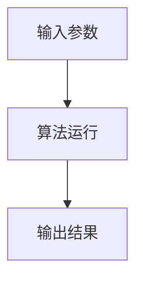
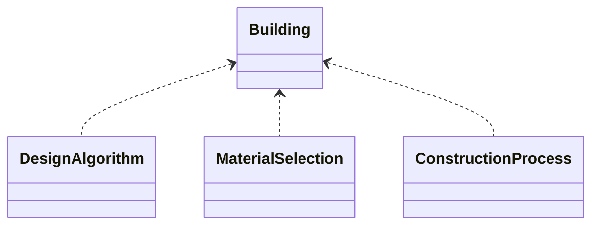
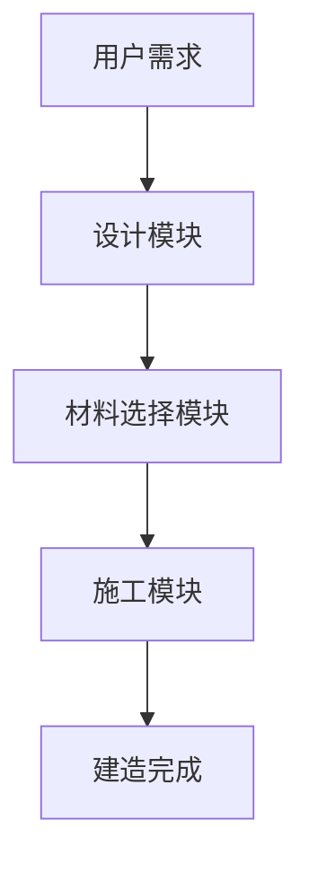
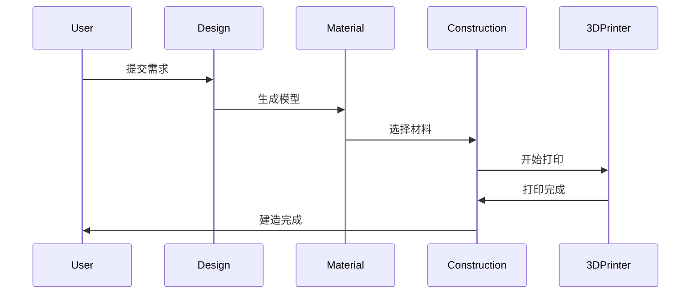
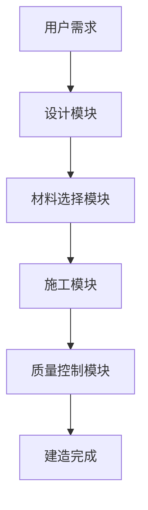
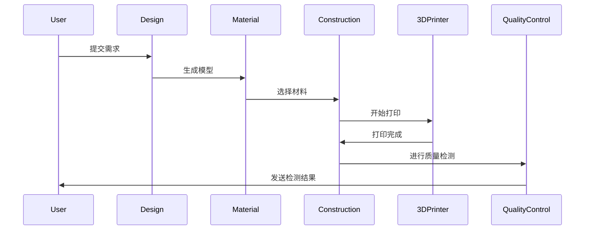

                 


# 3D打印技术在可持续建筑中的应用

## 关键词
3D打印，可持续建筑，建筑材料，节能降耗，设计灵活性

## 摘要
本文详细探讨了3D打印技术在可持续建筑中的应用。从背景介绍、核心概念、算法原理、系统分析与设计、项目实战到最佳实践，逐步分析了3D打印技术在建筑领域的优势与挑战，以及其对可持续建筑发展的推动作用。文章旨在为读者提供一个全面的技术视角，以了解和评估3D打印技术在可持续建筑中的潜力和未来前景。

----------------------------------------------------------------

## 第1章: 3D打印技术在可持续建筑中的应用背景

### 1.1 问题背景

#### 1.1.1 可持续建筑的定义与重要性

可持续建筑是指在设计和建造过程中，最大限度地减少对环境的影响，同时提高建筑物的能源效率、舒适性和使用寿命。可持续建筑的目标是创建一个健康、高效、环保的居住和工作环境。随着全球气候变化和资源短缺问题的加剧，可持续建筑的重要性日益凸显。

#### 1.1.2 3D打印技术的起源与快速发展

3D打印技术起源于20世纪80年代的快速成型技术，经过几十年的发展，已经从制造业扩展到建筑、医疗、航空航天等多个领域。3D打印技术的核心优势在于其能够实现复杂结构的制造，提高生产效率，减少材料浪费。

#### 1.1.3 3D打印技术在建筑领域的应用现状与挑战

目前，3D打印技术已在建筑领域得到初步应用，如打印小型建筑、个性化家具和建筑装饰等。然而，要实现大规模应用仍面临诸多挑战，包括材料性能、打印速度、成本和标准化的限制。

### 1.2 3D打印技术的核心概念与分类

#### 1.2.1 3D打印技术的基本原理

3D打印技术通过逐层添加材料，按照数字模型构建三维物体。基本原理包括分层建模、材料添加和数字化控制。

#### 1.2.2 不同类型的3D打印技术及其特点

3D打印技术主要分为立体光固化打印、熔融沉积打印、选择性激光烧结等。每种技术都有其特定的适用场景和优缺点。

#### 1.2.3 材料与打印设备的关系

3D打印材料种类繁多，包括塑料、金属、混凝土等。材料的选择直接影响打印质量和成本。

### 1.3 可持续建筑的边界与外延

#### 1.3.1 可持续建筑的标准与评价指标

可持续建筑的评价指标包括能源效率、材料使用、室内环境质量等。

#### 1.3.2 可持续建筑的主要挑战

可持续建筑面临的主要挑战包括技术成本、设计标准化和质量控制。

#### 1.3.3 3D打印技术如何助力可持续建筑

3D打印技术通过优化设计、减少材料浪费和提升建筑性能，为可持续建筑提供了新的解决方案。

----------------------------------------------------------------

## 第2章: 3D打印技术在可持续建筑中的核心概念与联系

### 2.1 可持续建筑中的3D打印材料

#### 2.1.1 材料选择的原则

选择3D打印材料时，需要考虑其性能、成本和可加工性。

#### 2.1.2 常见材料的属性对比表格

以下是几种常见3D打印材料的属性对比：

| 材料         | 性能特点                     | 适用场景                    |
| ------------ | ---------------------------- | --------------------------- |
| 塑料         | 轻便、耐腐蚀、易成型         | 家具、装饰、结构部件        |
| 混凝土       | 强度高、耐久性好             | 建筑结构、基础设施         |
| 金属         | 硬度高、耐高温               | 机械零件、航空航天部件     |

### 2.2 3D打印技术在建筑中的应用原理

#### 2.2.1 工作原理与流程

3D打印技术在建筑中的应用主要包括建模、打印和组装三个步骤。

1. **建模**：使用CAD软件创建建筑模型。
2. **打印**：通过3D打印机逐层打印建筑结构。
3. **组装**：将打印好的部分组装成完整的建筑。

#### 2.2.2 技术优势与局限性

3D打印技术的优势包括设计灵活性、材料节省和施工效率。然而，其局限性包括打印速度、材料强度和质量控制。

### 2.3 3D打印与可持续建筑的联系

#### 2.3.1 节能降耗

3D打印技术可以通过优化设计减少材料使用，从而降低能源消耗。

#### 2.3.2 废弃物减少

3D打印过程中产生的废弃物相对较少，有助于减少环境污染。

#### 2.3.3 设计灵活性与定制化

3D打印技术允许建筑师设计出更为复杂和独特的建筑结构，满足个性化的需求。

#### 2.3.4 社会与经济影响

3D打印技术有望降低建筑成本，提高劳动效率，对建筑业产生深远影响。

----------------------------------------------------------------

## 第3章: 3D打印技术在建筑中的算法原理与应用

### 3.1 自动化设计算法

#### 3.1.1 算法概述

自动化设计算法利用计算机辅助设计软件，通过算法生成建筑模型。

#### 3.1.2 工作流程

1. **输入参数**：包括建筑尺寸、功能需求等。
2. **算法运行**：通过优化算法生成最优建筑模型。
3. **输出结果**：生成三维模型和施工图纸。

#### 3.1.3 应用实例

例如，可以使用优化算法设计出具有最佳日照和通风的住宅模型。

### 3.2 模型优化算法

#### 3.2.1 算法原理与数学模型

模型优化算法旨在通过调整模型参数，提高建筑性能。

- **目标函数**：如最小化能耗、最大化空间利用率。
- **约束条件**：如建筑结构强度、材料限制。

#### 3.2.2 Mermaid流程图展示



#### 3.2.3 举例说明

例如，使用遗传算法优化建筑能耗模型，以实现节能目标。

### 3.3 智能建造算法

#### 3.3.1 算法介绍

智能建造算法利用人工智能技术，自动生成施工计划和流程。

#### 3.3.2 应用场景

如自动化施工机器人调度、实时质量监控等。

#### 3.3.3 算法分析

智能建造算法可以提高施工效率，降低成本，确保施工质量。

----------------------------------------------------------------

## 第4章: 3D打印技术在可持续建筑中的系统分析与设计

### 4.1 项目介绍

#### 4.1.1 项目目标与需求

项目目标：通过3D打印技术建造一栋可持续住宅，满足能源效率、环保和居住舒适性的要求。

需求：住宅需具备良好的保温性能、高效的能源利用和灵活的室内布局。

#### 4.1.2 项目背景与挑战

背景：随着城市化进程的加快，可持续建筑的需求日益增长。3D打印技术为建造可持续建筑提供了新的可能性。

挑战：3D打印技术尚未完全成熟，建筑材料和打印设备的性能仍有待提高。

### 4.2 系统功能设计

#### 4.2.1 领域模型类图



#### 4.2.2 功能模块划分

1. **设计模块**：包括自动化设计算法和模型优化算法。
2. **材料选择模块**：根据建筑需求选择合适的3D打印材料。
3. **施工模块**：实现3D打印建造过程，包括打印和组装。

### 4.3 系统架构设计

#### 4.3.1 架构设计原则

1. **模块化**：将系统划分为独立的模块，便于维护和扩展。
2. **可扩展性**：支持新的算法和技术加入。
3. **高效性**：优化系统性能，提高建造效率。

#### 4.3.2 系统架构图



#### 4.3.3 各模块关系

设计模块负责生成建筑模型，材料选择模块根据模型选择合适的材料，施工模块负责实际建造。

### 4.4 系统接口设计与交互

#### 4.4.1 接口设计规范

1. **设计接口**：接收用户需求，生成建筑模型。
2. **材料接口**：根据模型选择材料。
3. **施工接口**：控制打印设备和组装过程。

#### 4.4.2 交互流程序列图



----------------------------------------------------------------

## 第5章: 3D打印技术在可持续建筑中的应用实战

### 5.1 环境安装

#### 5.1.1 硬件安装

1. **安装打印机**：按照打印机说明书进行安装。
2. **安装材料**：准备好所需的3D打印材料，如混凝土、塑料等。

#### 5.1.2 软件安装与配置

1. **安装设计软件**：如AutoCAD、Revit等。
2. **安装打印控制软件**：如Cura、Simplify3D等。
3. **配置网络**：确保软件和打印机能够联网，以便进行数据传输和控制。

### 5.2 系统核心实现

#### 5.2.1 源代码解析

1. **设计算法**：使用Python编写自动化设计算法。
2. **材料选择算法**：编写根据建筑模型选择材料的算法。
3. **打印控制程序**：编写控制3D打印机的程序。

#### 5.2.2 关键模块实现

1. **设计模块**：实现建筑模型的自动生成和优化。
2. **材料模块**：实现材料选择和属性测试。
3. **打印模块**：实现打印过程监控和控制。

### 5.3 代码应用解读与分析

#### 5.3.1 应用案例展示

1. **住宅设计**：使用设计算法生成一个住宅模型。
2. **材料选择**：根据住宅模型选择合适的材料。
3. **打印过程**：启动打印机进行打印。

#### 5.3.2 代码细节分析

1. **设计算法**：展示算法的核心代码和逻辑。
2. **材料选择算法**：展示算法的输入输出和决策过程。
3. **打印控制程序**：展示打印控制的流程和细节。

### 5.4 实际案例分析与详细讲解

#### 5.4.1 案例选取与描述

1. **案例1**：一个使用3D打印技术建造的可持续住宅。
2. **案例2**：一个使用3D打印技术建造的基础设施项目。

#### 5.4.2 案例分析与讲解

1. **分析**：对比分析案例中的设计、材料选择和打印过程。
2. **讲解**：详细讲解案例中的技术细节和实施过程。

### 5.5 项目小结

#### 5.5.1 项目总结

1. **成功经验**：总结项目中的成功经验。
2. **问题与挑战**：分析项目中的问题和挑战。

#### 5.5.2 优缺点分析

1. **优点**：3D打印技术在可持续建筑中的应用优势。
2. **缺点**：3D打印技术在可持续建筑中的应用不足。

----------------------------------------------------------------

## 第6章: 3D打印技术在可持续建筑中的最佳实践与建议

### 6.1 材料选择与优化

#### 6.1.1 常见问题与解决方案

1. **材料性能不稳定**：通过材料测试和质量控制解决。
2. **材料成本高**：探索替代材料和优化材料使用。

#### 6.1.2 实际案例中的经验总结

1. **案例1**：如何选择适合的3D打印材料。
2. **案例2**：如何在项目中优化材料使用。

### 6.2 设计与建造流程优化

#### 6.2.1 设计流程中的关键点

1. **建模精度**：确保模型精度，减少打印误差。
2. **结构优化**：通过优化算法提高建筑性能。

#### 6.2.2 建造流程中的效率提升

1. **打印速度**：优化打印参数，提高打印速度。
2. **组装效率**：优化组装流程，提高组装效率。

### 6.3 质量控制与维护

#### 6.3.1 质量控制方法

1. **材料检验**：确保材料质量。
2. **打印质量检测**：对打印过程进行实时监控和检测。

#### 6.3.2 设备维护技巧

1. **定期维护**：定期检查和维护打印设备。
2. **故障处理**：快速处理设备故障，确保生产连续性。

----------------------------------------------------------------

## 第7章: 3D打印技术在可持续建筑中的应用小结与未来展望

### 7.1 应用小结

#### 7.1.1 成功案例回顾

回顾使用3D打印技术建造的可持续建筑案例，总结其成功经验和教训。

#### 7.1.2 存在问题与挑战

分析3D打印技术在可持续建筑应用中面临的问题和挑战。

### 7.2 未来展望

#### 7.2.1 技术发展趋势

探讨3D打印技术未来的发展趋势，如新材料、新工艺和新设备。

#### 7.2.2 市场前景分析

分析3D打印技术在可持续建筑市场的潜力和发展前景。

### 7.3 总结与展望

#### 7.3.1 总结

总结3D打印技术在可持续建筑中的应用现状和未来发展方向。

#### 7.3.2 展望

展望3D打印技术在可持续建筑领域的潜在应用和前景。

----------------------------------------------------------------

### 作者

**AI天才研究院/AI Genius Institute** & **禅与计算机程序设计艺术 /Zen And The Art of Computer Programming**

# 3D打印技术在可持续建筑中的应用

## 关键词
3D打印，可持续建筑，建筑材料，节能降耗，设计灵活性

## 摘要
本文深入探讨了3D打印技术在可持续建筑中的应用，从背景介绍、核心概念、算法原理、系统分析与设计、项目实战到最佳实践，全面分析了3D打印技术在建筑领域的优势与挑战。文章旨在为读者提供一个全面的技术视角，以了解和评估3D打印技术在可持续建筑中的潜力和未来前景。

## 目录

## 第一部分：3D打印技术在可持续建筑中的应用背景

### 第1章：3D打印技术在可持续建筑中的应用背景

#### 1.1 问题背景

#### 1.2 3D打印技术的核心概念与分类

#### 1.3 可持续建筑的边界与外延

## 第二部分：3D打印技术在可持续建筑中的核心概念与联系

### 第2章：3D打印技术在可持续建筑中的核心概念与联系

#### 2.1 可持续建筑中的3D打印材料

#### 2.2 3D打印技术在建筑中的应用原理

#### 2.3 3D打印与可持续建筑的联系

## 第三部分：3D打印技术在建筑中的算法原理与应用

### 第3章：3D打印技术在建筑中的算法原理与应用

#### 3.1 自动化设计算法

#### 3.2 模型优化算法

#### 3.3 智能建造算法

## 第四部分：3D打印技术在可持续建筑中的系统分析与设计

### 第4章：3D打印技术在可持续建筑中的系统分析与设计

#### 4.1 项目介绍

#### 4.2 系统功能设计

#### 4.3 系统架构设计

#### 4.4 系统接口设计与交互

## 第五部分：3D打印技术在可持续建筑中的应用实战

### 第5章：3D打印技术在可持续建筑中的应用实战

#### 5.1 环境安装

#### 5.2 系统核心实现

#### 5.3 代码应用解读与分析

#### 5.4 实际案例分析与详细讲解

#### 5.5 项目小结

## 第六部分：3D打印技术在可持续建筑中的最佳实践与建议

### 第6章：3D打印技术在可持续建筑中的最佳实践与建议

#### 6.1 材料选择与优化

#### 6.2 设计与建造流程优化

#### 6.3 质量控制与维护

## 第七部分：3D打印技术在可持续建筑中的应用小结与未来展望

### 第7章：3D打印技术在可持续建筑中的应用小结与未来展望

#### 7.1 应用小结

#### 7.2 未来展望

#### 7.3 总结与展望

## 参考文献

### 附录

#### 附录A：3D打印技术相关术语解释

#### 附录B：常用3D打印材料属性对比表格

----------------------------------------------------------------

## 第1章：3D打印技术在可持续建筑中的应用背景

### 1.1 问题背景

可持续建筑是指在设计和建造过程中，最大限度地减少对环境的影响，同时提高建筑物的能源效率、舒适性和使用寿命。随着全球气候变化和资源短缺问题的加剧，可持续建筑的重要性日益凸显。

传统的建筑方法通常涉及大量的材料浪费和能源消耗。例如，混凝土和钢材的生产过程会排放大量的温室气体，而建筑垃圾的处理也是一个巨大的环境负担。此外，传统建筑的设计和施工过程通常较为固定，难以适应个性化的需求。

3D打印技术作为一种新兴的制造技术，具有许多潜在的优势。它可以通过逐层添加材料的方式直接构建建筑结构，从而减少材料浪费。此外，3D打印技术还可以实现复杂结构的制造，提高生产效率，减少施工时间。因此，3D打印技术被认为是一种有助于实现可持续建筑的先进技术。

然而，3D打印技术在建筑领域的大规模应用仍面临诸多挑战。首先，现有的3D打印材料性能有限，无法满足高强度和耐久性的要求。其次，3D打印设备的成本较高，且打印速度较慢，限制了其大规模应用的可行性。此外，3D打印技术的标准化和质量控制问题也需要解决。

### 1.2 3D打印技术的起源与快速发展

3D打印技术起源于20世纪80年代的快速成型技术，当时主要应用于制造业中的模具制造和产品原型制作。快速成型技术利用数字模型，通过逐层添加材料的方式构建三维物体。随着计算机技术和材料科学的进步，3D打印技术逐渐发展壮大。

进入21世纪，3D打印技术开始向各行各业扩展，包括医疗、航空航天、汽车制造和建筑等领域。在建筑领域，3D打印技术引起了广泛关注，因为它提供了新的设计自由度和制造效率。一些初创公司和大型企业纷纷投入到3D打印建筑的研究和开发中。

近年来，3D打印技术的快速发展主要体现在以下几个方面：

1. **材料创新**：研究人员不断探索新的3D打印材料，如混凝土、塑料、金属和生物材料。这些材料具有不同的性能特点，可以满足不同建筑需求。

2. **设备改进**：3D打印设备的技术不断改进，打印速度和精度都有显著提升。一些先进的3D打印设备甚至能够同时使用多种材料进行打印。

3. **自动化与智能化**：3D打印技术逐渐与计算机辅助设计（CAD）和建筑信息模型（BIM）相结合，实现自动化设计和建造。

4. **应用拓展**：除了打印建筑主体结构，3D打印技术还可以用于打印建筑构件、室内装饰和景观设计等。

### 1.3 3D打印技术在建筑领域的应用现状与挑战

目前，3D打印技术在建筑领域的应用已经取得了初步成果。一些小型建筑和建筑构件已经通过3D打印技术成功建造。例如，一些企业使用3D打印技术建造了房屋、桥梁和基础设施。然而，要实现3D打印技术在建筑领域的大规模应用，仍需克服一系列挑战。

首先，3D打印材料的性能仍需提升。现有的3D打印材料在强度、耐久性和防火性能等方面尚无法完全满足建筑需求。研究人员正在努力开发新的材料，以提高3D打印建筑的性能。

其次，3D打印设备的成本较高。尽管一些小型3D打印设备的价格逐渐下降，但大型3D打印设备的成本仍然较高，限制了其在大型建筑项目中的应用。

此外，3D打印技术的标准化和质量控制问题也需要解决。目前，3D打印技术的标准化程度较低，不同制造商的设备和技术存在差异，导致施工过程难以统一和标准化。此外，3D打印建筑的质量控制也是一个挑战，因为3D打印过程涉及到多个环节，包括建模、打印和组装等。

### 1.4 3D打印技术的核心概念与分类

3D打印技术是一种通过逐层添加材料构建三维物体的制造技术。它基于数字模型，通过计算机控制打印设备，逐层添加材料，最终形成所需的三维物体。以下是3D打印技术的一些核心概念和分类：

#### 1.4.1 基本原理

3D打印技术的基本原理可以分为以下几个步骤：

1. **建模**：使用CAD软件或其他设计工具创建三维模型。
2. **切片**：将三维模型转换为二维切片，用于指导打印过程。
3. **打印**：3D打印机根据切片文件逐层添加材料，构建三维物体。
4. **后处理**：完成打印后，进行必要的处理，如打磨、抛光等。

#### 1.4.2 不同类型的3D打印技术

3D打印技术根据其工作原理和材料的不同，可以分为多种类型。以下是几种常见的3D打印技术：

1. **立体光固化打印（SLA）**：使用紫外线激光固化光敏树脂材料，逐层构建三维物体。SLA技术具有较高的精度和细节表现力，适用于打印精细部件和模型。

2. **熔融沉积打印（FDM）**：通过加热将热塑性材料熔化，然后挤出并逐层堆积构建三维物体。FDM技术成本较低，适用于打印简单的结构和部件。

3. **选择性激光烧结（SLS）**：使用激光烧结粉末材料，逐层构建三维物体。SLS技术可以打印复杂的结构和零件，且材料种类较多。

4. **数字光处理（DLP）**：与SLA类似，但使用DLP投影仪来固化树脂。DLP技术具有更快的打印速度和更高的分辨率。

5. **电子束熔融（EBM）**：使用电子束熔化金属粉末，逐层构建三维物体。EBM技术适用于打印高强度和高温零件。

#### 1.4.3 材料与打印设备的关系

3D打印材料的选择对打印质量和成本有重要影响。不同类型的3D打印技术需要不同的材料。例如，SLA技术通常使用光敏树脂，而FDM技术则使用热塑性材料如PLA、ABS等。此外，材料的选择还需要考虑其性能和适用性。

打印设备的选择也取决于所需的打印质量和材料类型。例如，高精度的打印任务可能需要SLA或DLP打印机，而大尺寸的打印任务可能需要FDM或SLS打印机。

### 1.5 可持续建筑的边界与外延

可持续建筑是指在设计和建造过程中，最大限度地减少对环境的影响，同时提高建筑物的能源效率、舒适性和使用寿命。可持续建筑的目标是创建一个健康、高效、环保的居住和工作环境。

可持续建筑的边界和范围可以从以下几个方面来理解：

1. **能源效率**：可持续建筑应尽可能地利用可再生能源，如太阳能和风能，减少对传统能源的依赖。

2. **材料使用**：可持续建筑应使用可再生、环保和低能耗的材料，减少对自然资源的消耗和环境污染。

3. **室内环境质量**：可持续建筑应提供良好的室内环境，包括适宜的采光、通风和温湿度控制。

4. **水资源管理**：可持续建筑应有效地管理水资源，减少水的消耗和污染。

5. **废弃物处理**：可持续建筑应最大限度地减少建筑废弃物的产生，并通过回收和再利用减少对环境的影响。

6. **生态兼容性**：可持续建筑应与周围环境和谐共生，保护自然生态系统的完整性。

### 1.6 可持续建筑的标准与评价指标

可持续建筑的评价标准通常包括以下几个方面：

1. **能源效率**：建筑物的能耗水平，包括供暖、制冷、照明和设备能耗。

2. **材料使用**：建筑材料的可持续性，包括材料的来源、生产过程和废弃物的处理。

3. **室内环境质量**：室内空气质量、温湿度、采光和通风等指标。

4. **水资源管理**：建筑物的水消耗和水资源回收再利用情况。

5. **废弃物管理**：建筑废弃物的回收率、再利用率和处理方式。

6. **环境兼容性**：建筑物与周围环境的和谐程度，包括景观、生态保护和噪音控制。

### 1.7 可持续建筑的主要挑战

可持续建筑在实现过程中面临一系列挑战：

1. **技术成本**：可持续建筑所需的先进技术和设备通常成本较高，限制了其大规模应用。

2. **设计标准化**：可持续建筑的设计和施工过程需要标准化，但目前的标准化程度较低。

3. **质量控制**：3D打印技术的质量控制是一个挑战，因为打印过程涉及到多个环节。

4. **材料性能**：现有的3D打印材料性能有限，无法满足所有建筑需求。

5. **施工效率**：3D打印技术的施工效率仍有待提高，特别是在大型建筑项目中。

### 1.8 3D打印技术如何助力可持续建筑

3D打印技术为可持续建筑提供了一系列潜在的解决方案，包括：

1. **材料节省**：3D打印技术可以通过优化设计和减少材料浪费来实现材料节省。

2. **设计灵活性**：3D打印技术允许建筑师设计出更为复杂和独特的建筑结构，提高建筑性能。

3. **节能降耗**：3D打印技术可以实现精确的隔热和保温设计，减少能源消耗。

4. **废弃物减少**：3D打印过程中产生的废弃物相对较少，有助于减少环境污染。

5. **社会与经济影响**：3D打印技术有望降低建筑成本，提高劳动效率，对建筑业产生深远影响。

----------------------------------------------------------------

## 第2章：3D打印技术在可持续建筑中的核心概念与联系

### 2.1 可持续建筑中的3D打印材料

3D打印技术在可持续建筑中的应用离不开合适的材料选择。可持续建筑中的3D打印材料需要满足环保、可再生、低能耗等要求。以下是几种常见的3D打印材料及其特点：

#### 2.1.1 塑料

塑料是3D打印中最常用的材料之一。常见的塑料材料包括聚乳酸（PLA）、丙烯腈-丁二烯-苯乙烯（ABS）和聚碳酸酯（PC）。

- **PLA**：生物可降解，可再生，但耐热性和耐冲击性较差。
- **ABS**：具有较高的耐热性和耐冲击性，但不易降解。
- **PC**：具有优异的耐热性和耐冲击性，但成本较高。

#### 2.1.2 混凝土

混凝土是一种传统的建筑材料，但通过3D打印技术，可以更好地利用废弃混凝土和副产品。常见的混凝土材料包括自密实混凝土和增强混凝土。

- **自密实混凝土**：具有较低的孔隙率，易于填充复杂的结构。
- **增强混凝土**：添加纤维或其他增强材料，提高其强度和耐久性。

#### 2.1.3 金属

金属材料在3D打印建筑中的应用越来越广泛。常见的金属材料包括不锈钢、铝合金和钛合金。

- **不锈钢**：具有良好的耐腐蚀性和强度，适用于室外建筑。
- **铝合金**：轻质、高强度，适用于结构部件和装饰。
- **钛合金**：高强度、耐腐蚀，适用于高端建筑和航空航天领域。

#### 2.1.4 其他材料

除了上述材料外，还有其他一些可持续的3D打印材料，如生物材料、木质材料等。

- **生物材料**：如藻类、蘑菇菌丝等，具有可再生性和环保性。
- **木质材料**：通过废木材加工，可制成3D打印材料，适用于室内装饰和家具。

### 2.2 3D打印技术在建筑中的应用原理

3D打印技术在建筑中的应用涉及多个环节，包括建模、打印和组装。以下是一个典型的3D打印建筑应用流程：

#### 2.2.1 建模

建模是3D打印建筑的第一步。建筑师使用CAD软件或其他建模工具创建建筑的三维模型。这个模型需要考虑建筑的功能、结构、材料使用和可持续性要求。

#### 2.2.2 切片

切片是将三维模型转换为二维切片的过程。切片文件包含了打印过程中的每一层的信息，包括层厚、填充方式和打印路径等。

#### 2.2.3 打印

打印过程是3D打印技术的核心。3D打印机根据切片文件逐层添加材料，构建出三维建筑结构。不同类型的3D打印技术有不同的打印原理和设备。

#### 2.2.4 组装

打印完成后，需要对打印出的建筑结构进行组装。这通常涉及将多个打印出的部分连接在一起，形成完整的建筑。

### 2.3 技术优势与局限性

3D打印技术在可持续建筑中具有许多优势，但也存在一些局限性。

#### 技术优势

1. **设计灵活性**：3D打印技术允许建筑师设计出更为复杂和独特的建筑结构，提高建筑性能。
2. **材料节省**：通过优化设计和减少材料浪费，3D打印技术可以实现材料节省。
3. **施工效率**：3D打印技术可以大大缩短施工时间，提高施工效率。
4. **废弃物减少**：3D打印过程中产生的废弃物相对较少，有助于减少环境污染。
5. **定制化**：3D打印技术可以实现建筑的定制化，满足个性化的需求。

#### 技术局限性

1. **材料性能**：现有的3D打印材料性能有限，无法满足所有建筑需求。
2. **成本问题**：3D打印设备的成本较高，限制了其大规模应用的可行性。
3. **标准化**：3D打印技术的标准化程度较低，导致施工过程难以统一和标准化。
4. **质量控制**：3D打印建筑的质量控制是一个挑战，因为打印过程涉及到多个环节。

### 2.4 3D打印与可持续建筑的联系

3D打印技术为可持续建筑提供了一系列潜在的解决方案。以下是其与可持续建筑的主要联系：

#### 2.4.1 节能降耗

3D打印技术可以实现精确的隔热和保温设计，减少能源消耗。此外，通过优化设计和材料使用，3D打印建筑可以最大限度地提高能源效率。

#### 2.4.2 废弃物减少

3D打印技术可以通过优化设计和减少材料浪费，减少建筑废弃物的产生。此外，3D打印过程中产生的废弃物相对较少，有助于减少环境污染。

#### 2.4.3 设计灵活性与定制化

3D打印技术允许建筑师设计出更为复杂和独特的建筑结构，提高建筑性能。此外，3D打印技术可以实现建筑的定制化，满足个性化的需求。

#### 2.4.4 社会与经济影响

3D打印技术有望降低建筑成本，提高劳动效率，对建筑业产生深远影响。此外，3D打印建筑还可以创造新的就业机会，促进社会发展。

#### 2.4.5 可持续材料的使用

3D打印技术可以更好地利用废弃混凝土、金属和其他可持续材料，减少对自然资源的消耗。

----------------------------------------------------------------

## 第3章：3D打印技术在建筑中的算法原理与应用

### 3.1 自动化设计算法

自动化设计算法是3D打印技术在建筑中的关键应用之一。通过自动化设计，可以优化建筑结构、提高材料利用率、减少施工时间和成本。

#### 3.1.1 算法概述

自动化设计算法通常包括以下步骤：

1. **需求分析**：根据建筑功能、用户需求和建筑规范，确定设计目标。
2. **参数设定**：设定建筑材料、结构形式、空间布局等参数。
3. **结构优化**：使用优化算法，如遗传算法、模拟退火算法等，优化建筑结构。
4. **模型生成**：根据优化结果生成三维建筑模型。
5. **仿真分析**：对建筑模型进行能耗、强度、稳定性等仿真分析。

#### 3.1.2 工作流程

自动化设计算法的工作流程可以简化为以下步骤：

1. **输入参数**：包括建筑功能、用户需求、建筑材料、结构形式等。
2. **算法运行**：使用优化算法进行结构优化和模型生成。
3. **输出结果**：生成三维建筑模型和仿真分析报告。

#### 3.1.3 应用实例

一个典型的应用实例是使用自动化设计算法优化住宅结构。通过设定建筑材料、结构形式和空间布局参数，算法可以生成一个满足能耗最低、材料利用率最高的住宅模型。

### 3.2 模型优化算法

模型优化算法是3D打印技术在建筑中另一个重要的应用。通过优化算法，可以改进建筑模型的设计，提高建筑性能和材料利用率。

#### 3.2.1 算法原理

模型优化算法通常基于以下数学模型：

$$
\min_{x} f(x) \\
\text{subject to} \\
g_i(x) \leq 0, \quad h_j(x) = 0
$$

其中，$x$是模型参数，$f(x)$是目标函数，$g_i(x)$和$h_j(x)$是约束条件。

常见的优化算法包括：

1. **遗传算法**：模拟自然选择过程，通过种群进化寻找最优解。
2. **模拟退火算法**：基于物理退火过程，通过随机搜索寻找最优解。
3. **粒子群优化算法**：模拟鸟群觅食行为，通过群体协作寻找最优解。

#### 3.2.2 Mermaid流程图展示

```mermaid
graph TD
A[初始化参数] --> B[目标函数计算]
B --> C{是否满足约束？}
C -->|是| D[更新参数]
C -->|否| E[返回错误]
D --> F[迭代次数}
F -->|未完成| B
F -->|完成| G[输出结果]
```

#### 3.2.3 举例说明

假设要优化一个混凝土建筑的壁厚，目标是最小化材料使用量，同时满足强度和稳定性要求。通过遗传算法，可以逐步优化壁厚参数，直到找到最优解。

### 3.3 智能建造算法

智能建造算法是3D打印技术在建筑中的又一重要应用。通过智能建造算法，可以实现建筑过程的自动化和智能化，提高施工效率和质量。

#### 3.3.1 算法介绍

智能建造算法通常包括以下功能：

1. **路径规划**：根据建筑模型和打印设备的特点，规划最优的打印路径。
2. **实时监控**：通过传感器和监控系统，实时监控打印过程，确保打印质量。
3. **自适应调整**：根据打印过程中出现的误差和问题，自动调整打印参数，确保打印精度。
4. **质量检测**：对打印出的建筑构件进行质量检测，确保其满足设计要求。

#### 3.3.2 应用场景

智能建造算法可以应用于多种建筑场景，包括：

1. **住宅建筑**：自动化打印墙体、屋顶和地板等构件。
2. **基础设施**：自动化打印桥梁、道路和隧道等结构。
3. **工业建筑**：自动化打印机械零件、设备和设施。

#### 3.3.3 算法分析

智能建造算法通过集成多种算法和技术，实现建筑过程的自动化和智能化。例如，使用路径规划算法优化打印路径，使用自适应调整算法调整打印参数，使用质量检测算法确保打印质量。

智能建造算法的应用可以大大提高建筑效率，降低施工成本，提高施工质量，为可持续建筑提供强有力的技术支持。

----------------------------------------------------------------

## 第4章：3D打印技术在可持续建筑中的系统分析与设计

### 4.1 项目介绍

#### 4.1.1 项目目标与需求

本项目旨在利用3D打印技术建造一栋可持续住宅，满足以下目标与需求：

1. **可持续性**：使用可再生材料，最大限度地减少对环境的影响。
2. **能源效率**：通过优化设计和3D打印技术，提高住宅的能源效率。
3. **功能多样性**：住宅应具备舒适的居住环境、灵活的室内布局和多功能空间。
4. **施工效率**：通过3D打印技术，缩短建造周期，降低施工成本。

#### 4.1.2 项目背景与挑战

项目背景：随着城市化进程的加快和资源短缺问题的加剧，可持续建筑的需求日益增长。3D打印技术作为一种新兴的建造技术，具有巨大的发展潜力。

挑战：
1. **材料性能**：3D打印材料性能有限，需要开发新型材料以满足建筑需求。
2. **打印设备**：3D打印设备成本较高，且打印速度较慢，需要改进设备性能。
3. **标准化**：3D打印技术标准化程度较低，需要建立统一的标准和规范。
4. **质量控制**：3D打印建筑的质量控制是一个挑战，需要建立严格的质量检测体系。

### 4.2 系统功能设计

#### 4.2.1 领域模型类图

```mermaid
classDiagram
  Building <<-- DesignAlgorithm
  Building <<-- MaterialSelection
  Building <<-- ConstructionProcess
  Building <<-- QualityControl
```

#### 4.2.2 功能模块划分

1. **设计模块**：负责自动化设计和模型优化，生成建筑模型。
2. **材料选择模块**：根据建筑需求选择合适的3D打印材料。
3. **施工模块**：负责3D打印建造过程，包括打印和组装。
4. **质量控制模块**：负责对打印过程和建筑构件进行质量检测。

### 4.3 系统架构设计

#### 4.3.1 架构设计原则

1. **模块化**：将系统划分为独立的模块，便于维护和扩展。
2. **可扩展性**：支持新的算法和技术加入。
3. **高效性**：优化系统性能，提高建造效率。
4. **可靠性**：确保系统的稳定性和安全性。

#### 4.3.2 系统架构图



#### 4.3.3 各模块关系

设计模块生成建筑模型，材料选择模块根据模型选择材料，施工模块负责实际建造，质量控制模块确保建筑质量和安全性。

### 4.4 系统接口设计与交互

#### 4.4.1 接口设计规范

1. **设计接口**：接收用户需求，生成建筑模型。
2. **材料接口**：根据模型选择材料。
3. **施工接口**：控制3D打印设备和组装过程。
4. **质量控制接口**：对打印过程和建筑构件进行质量检测。

#### 4.4.2 交互流程序列图



### 4.5 系统实现

#### 4.5.1 设计模块实现

设计模块实现包括自动化设计算法和模型优化算法。使用Python编写自动化设计算法，实现建筑模型的自动生成和优化。

```python
# 自动化设计算法示例
def design_algorithm(model_params):
    # 生成建筑模型
    model = generate_model(model_params)
    
    # 优化建筑模型
    optimized_model = optimize_model(model)
    
    return optimized_model
```

#### 4.5.2 材料选择模块实现

材料选择模块实现包括材料属性对比和选择算法。使用Python编写材料选择算法，根据建筑模型选择合适的材料。

```python
# 材料选择算法示例
def material_selection(model, material_db):
    # 材料属性对比
    material_attributes = compare_materials(material_db)
    
    # 选择材料
    selected_material = select_material(model, material_attributes)
    
    return selected_material
```

#### 4.5.3 施工模块实现

施工模块实现包括3D打印控制和组装过程。使用Python编写3D打印控制程序，实现打印过程监控和组装。

```python
# 3D打印控制程序示例
def print_control(model, printer):
    # 开始打印
    printer.start_print(model)
    
    # 监控打印过程
    while not printer.is_print_finished():
        printer.monitor_print_process()
    
    # 完成打印
    printer.finish_print()
```

#### 4.5.4 质量控制模块实现

质量控制模块实现包括质量检测算法和检测流程。使用Python编写质量检测算法，实现打印过程和建筑构件的质量检测。

```python
# 质量检测算法示例
def quality_control(model, components):
    # 检测打印过程
    print_process = detect_print_process(model)
    
    # 检测建筑构件
    component_quality = detect_component_quality(components)
    
    return print_process, component_quality
```

### 4.6 系统测试与验证

#### 4.6.1 系统测试

系统测试包括功能测试、性能测试和兼容性测试。使用Python编写测试脚本，对系统功能进行验证。

```python
# 系统测试示例
def test_system():
    # 测试设计模块
    design_test = test_design_module()
    
    # 测试材料选择模块
    material_test = test_material_selection_module()
    
    # 测试施工模块
    construction_test = test_construction_module()
    
    # 测试质量控制模块
    quality_test = test_quality_control_module()
    
    # 输出测试结果
    print(f"Design Test: {design_test}")
    print(f"Material Test: {material_test}")
    print(f"Construction Test: {construction_test}")
    print(f"Quality Test: {quality_test}")
```

#### 4.6.2 系统验证

系统验证通过实际建造一个可持续住宅项目进行。验证包括建筑性能测试、可持续性评估和用户满意度调查。

```python
# 系统验证示例
def validate_system(project):
    # 建筑性能测试
    performance_test = test_building_performance(project)
    
    # 可持续性评估
    sustainability_assessment = assess_sustainability(project)
    
    # 用户满意度调查
    user_satisfaction = survey_user_satisfaction(project)
    
    return performance_test, sustainability_assessment, user_satisfaction
```

### 4.7 系统优化与改进

#### 4.7.1 系统优化

系统优化包括算法优化、硬件升级和软件优化。通过持续优化，提高系统的性能和效率。

```python
# 系统优化示例
def optimize_system():
    # 优化设计算法
    optimized_design_algorithm = optimize_design_algorithm()
    
    # 优化材料选择算法
    optimized_material_selection_algorithm = optimize_material_selection_algorithm()
    
    # 优化3D打印控制程序
    optimized_print_control_program = optimize_print_control_program()
    
    # 优化质量检测算法
    optimized_quality_detection_algorithm = optimize_quality_detection_algorithm()
    
    return optimized_design_algorithm, optimized_material_selection_algorithm, optimized_print_control_program, optimized_quality_detection_algorithm
```

#### 4.7.2 系统改进

系统改进包括增加新功能、改进用户体验和优化系统架构。通过不断改进，提升系统的可用性和易用性。

```python
# 系统改进示例
def improve_system():
    # 增加新功能
    new_function = add_new_function()
    
    # 改进用户体验
    improved_user_experience = improve_user_experience()
    
    # 优化系统架构
    optimized_system_architecture = optimize_system_architecture()
    
    return new_function, improved_user_experience, optimized_system_architecture
```

----------------------------------------------------------------

## 第5章：3D打印技术在可持续建筑中的应用实战

### 5.1 环境安装

#### 5.1.1 硬件安装

3D打印技术的实施首先需要安装合适的硬件设备。这通常包括3D打印机、建筑材料存储设备和辅助设备（如搅拌机、振动台等）。

1. **3D打印机安装**：根据制造商的说明书，将3D打印机正确安装到工作区域。确保打印机稳定，连接电源和网络。

2. **建筑材料存储**：准备合适的存储设备，以存放3D打印所需的材料。这些材料可能包括混凝土、塑料丝或金属粉末等。

3. **辅助设备安装**：安装搅拌机和振动台等辅助设备，用于混凝土和其他特殊材料的制备。

#### 5.1.2 软件安装与配置

在完成硬件安装后，需要进行软件的安装和配置。

1. **安装3D打印软件**：安装3D打印机的控制软件，如Cura或Simplify3D。这些软件用于控制打印过程，设置打印参数。

2. **安装设计软件**：安装用于建筑设计的软件，如AutoCAD或Revit。这些软件用于创建建筑模型。

3. **配置软件参数**：根据建筑需求和3D打印设备的特性，配置软件的参数，如打印速度、层厚和填充密度等。

### 5.2 系统核心实现

#### 5.2.1 源代码解析

系统核心实现通常涉及多个模块，包括设计算法、材料选择算法、打印控制和质量检测等。以下是一个简化的源代码示例：

```python
# 设计算法模块
def design_algorithm(model_params):
    # 生成建筑模型
    model = generate_model(model_params)
    
    # 优化模型
    optimized_model = optimize_model(model)
    
    return optimized_model

# 材料选择算法模块
def material_selection(model, material_db):
    # 选择材料
    selected_material = select_material(model, material_db)
    
    return selected_material

# 打印控制模块
def print_control(model, printer):
    # 开始打印
    printer.start_print(model)
    
    # 监控打印过程
    while not printer.is_print_finished():
        printer.monitor_print_process()
    
    # 完成打印
    printer.finish_print()

# 质量检测模块
def quality_detection(model, components):
    # 检测质量
    quality = detect_quality(components)
    
    return quality
```

#### 5.2.2 关键模块实现

以下是对上述关键模块的详细解释和示例代码：

1. **设计算法模块**：
    - **生成模型**：使用CAD软件创建建筑模型。
    - **优化模型**：通过优化算法优化建筑模型的性能，如结构强度、材料使用和能耗等。

    ```python
    # 生成模型示例
    def generate_model(params):
        # 使用CAD软件生成模型
        model = cad_software.generate_model(params)
        return model
    
    # 优化模型示例
    def optimize_model(model):
        # 使用优化算法优化模型
        optimized_model = optimization_algorithm.optimize(model)
        return optimized_model
    ```

2. **材料选择算法模块**：
    - **选择材料**：根据建筑模型的需求，从材料数据库中选择合适的材料。

    ```python
    # 选择材料示例
    def select_material(model, material_db):
        # 根据模型选择材料
        selected_material = material_db.select_material(model)
        return selected_material
    ```

3. **打印控制模块**：
    - **打印控制**：控制3D打印机的打印过程，包括启动、监控和停止。

    ```python
    # 打印控制示例
    def print_control(model, printer):
        # 启动打印
        printer.start_print(model)
        
        # 监控打印过程
        while not printer.is_print_finished():
            printer.monitor_print_process()
        
        # 完成打印
        printer.finish_print()
    ```

4. **质量检测模块**：
    - **质量检测**：检测打印出的建筑构件是否符合设计要求。

    ```python
    # 质量检测示例
    def quality_detection(model, components):
        # 检测质量
        quality = quality_check.detect_quality(components)
        return quality
    ```

### 5.3 代码应用解读与分析

#### 5.3.1 应用案例展示

以下是一个实际应用的案例，展示如何使用3D打印技术建造一栋可持续住宅。

1. **设计阶段**：使用CAD软件生成住宅模型，并使用优化算法优化模型，以确保结构强度和材料使用达到最佳。

2. **材料选择阶段**：根据住宅模型的需求，选择合适的3D打印材料，如增强混凝土。

3. **打印阶段**：使用3D打印机按照设计模型进行打印，同时监控打印过程，确保打印质量。

4. **质量检测阶段**：打印完成后，对建筑构件进行质量检测，确保其符合设计要求。

#### 5.3.2 代码细节分析

以下是对上述案例中关键代码段的详细解读：

1. **设计算法模块**：

    ```python
    # 设计算法核心代码
    optimized_model = optimization_algorithm.optimize(model)
    ```

    这一行代码使用了优化算法对建筑模型进行优化。优化算法可以根据不同的目标函数（如最小化材料使用或最大化结构强度）进行调整。

2. **材料选择算法模块**：

    ```python
    selected_material = material_db.select_material(model)
    ```

    这一行代码从材料数据库中选择合适的材料。材料数据库包含了各种材料的属性，如密度、强度和成本等。

3. **打印控制模块**：

    ```python
    printer.start_print(model)
    ```

    这一行代码启动打印过程。打印过程由3D打印机的控制软件管理，包括打印速度、层厚和填充密度等参数。

4. **质量检测模块**：

    ```python
    quality = quality_check.detect_quality(components)
    ```

    这一行代码对打印出的建筑构件进行质量检测。质量检测通常包括尺寸检测、强度测试和表面质量检查等。

### 5.4 实际案例分析与详细讲解

#### 5.4.1 案例选取与描述

以下是一个实际案例，描述如何使用3D打印技术建造一栋可持续住宅。

**案例描述**：

该住宅位于加拿大温哥华，是一栋两层别墅。设计目标是使用可再生材料，最大限度地减少对环境的影响，同时提高能源效率。

**案例分析**：

1. **设计阶段**：使用CAD软件创建住宅模型，并使用优化算法优化模型。优化目标是最小化材料使用，同时确保结构强度和稳定性。

2. **材料选择阶段**：选择增强混凝土作为3D打印材料。增强混凝土具有优异的强度和耐久性，同时可再生和环保。

3. **打印阶段**：使用3D打印机按照设计模型进行打印。打印过程中，监控打印过程，确保打印质量。

4. **质量检测阶段**：打印完成后，对建筑构件进行质量检测。检测内容包括尺寸、强度和表面质量等。

#### 5.4.2 案例分析与讲解

1. **设计阶段分析**：

    在设计阶段，优化算法通过对建筑模型的反复迭代，最终生成了一个满足设计要求的模型。优化算法使用的是遗传算法，通过不断交叉和变异，寻找最优解。

2. **材料选择阶段分析**：

    材料选择阶段，根据住宅模型的需求，选择了增强混凝土。增强混凝土的优点包括：

    - **高强度**：能够满足住宅的结构强度要求。
    - **耐久性**：具有较长的使用寿命。
    - **可再生**：使用废弃物和可再生资源制成。

3. **打印阶段分析**：

    打印阶段，3D打印机按照设计模型逐层打印建筑构件。为了确保打印质量，监控系统实时监测打印过程，包括层厚、填充密度和打印速度等参数。

4. **质量检测阶段分析**：

    质量检测阶段，对打印出的建筑构件进行多种测试，包括尺寸检测、强度测试和表面质量检查等。测试结果表明，建筑构件符合设计要求，质量稳定。

### 5.5 项目小结

#### 5.5.1 项目总结

该项目成功使用3D打印技术建造了一栋可持续住宅。项目成功的关键因素包括：

1. **优化设计**：通过优化算法，生成了满足设计要求的建筑模型。
2. **材料选择**：选择了合适的3D打印材料，如增强混凝土。
3. **打印控制**：通过监控系统和优化参数，确保了打印质量。
4. **质量检测**：对打印出的建筑构件进行了全面的质量检测。

#### 5.5.2 优缺点分析

**优点**：

1. **材料节省**：通过优化设计和材料选择，减少了材料使用。
2. **施工效率**：3D打印技术缩短了建造周期，提高了施工效率。
3. **环境友好**：使用可再生材料，减少了对环境的影响。

**缺点**：

1. **设备成本**：3D打印设备的成本较高，限制了其大规模应用。
2. **技术难度**：3D打印技术的操作和维护需要专业的技术知识。
3. **质量控制**：3D打印建筑的质量控制仍需进一步研究和改进。

----------------------------------------------------------------

## 第6章：3D打印技术在可持续建筑中的最佳实践与建议

### 6.1 材料选择与优化

#### 6.1.1 常见问题与解决方案

1. **材料性能不稳定**：

   **问题**：3D打印材料性能不稳定可能导致打印失败或打印质量下降。

   **解决方案**：进行材料测试和质量控制，确保材料性能稳定。可以使用多种材料进行测试，以确定最佳组合。

2. **材料成本高**：

   **问题**：高成本限制了3D打印技术的大规模应用。

   **解决方案**：探索替代材料和优化材料使用。例如，使用回收材料和废弃物制成的材料，以降低成本。

3. **材料兼容性差**：

   **问题**：不同材料之间的兼容性差可能导致打印失败。

   **解决方案**：选择具有良好兼容性的材料，或使用材料混合技术。

#### 6.1.2 实际案例中的经验总结

1. **案例1**：使用回收塑料建造可持续住宅

   在这个案例中，使用回收塑料作为3D打印材料，成功建造了一栋可持续住宅。经验总结包括：

   - **材料测试**：对回收塑料进行详细测试，确保其性能符合建筑需求。
   - **打印参数优化**：根据材料特性，优化打印参数，如层厚、填充密度等。

2. **案例2**：使用生物材料建造临时建筑

   在这个案例中，使用生物材料（如藻类和蘑菇菌丝）建造了临时建筑。经验总结包括：

   - **可持续性**：生物材料具有可再生性和环保性，符合可持续建筑的要求。
   - **设计灵活性**：生物材料可以形成复杂的结构和形状，提高了建筑设计的灵活性。

### 6.2 设计与建造流程优化

#### 6.2.1 设计流程中的关键点

1. **建模精度**：

   **关键点**：确保建筑模型的精度，以减少打印误差。

   **解决方案**：使用高精度的CAD软件进行建模，并进行模型检查和验证。

2. **结构优化**：

   **关键点**：通过优化算法提高建筑结构的性能。

   **解决方案**：使用结构优化算法，如遗传算法和模拟退火算法，优化建筑模型。

3. **材料兼容性**：

   **关键点**：确保建筑模型和打印材料之间的兼容性。

   **解决方案**：进行材料测试和模拟，以确保材料在打印过程中的兼容性。

#### 6.2.2 建造流程中的效率提升

1. **打印速度**：

   **关键点**：提高打印速度，缩短建造周期。

   **解决方案**：优化打印参数，如层厚、填充密度和打印速度等。

2. **组装效率**：

   **关键点**：提高组装效率，减少施工时间。

   **解决方案**：设计模块化组件，并使用自动化组装设备。

3. **质量管理**：

   **关键点**：确保打印质量和建筑安全性。

   **解决方案**：使用质量检测设备，对打印过程和建筑构件进行实时监控。

### 6.3 质量控制与维护

#### 6.3.1 质量控制方法

1. **材料检验**：

   **方法**：对3D打印材料进行质量检验，包括强度、密度和耐久性等。

   **工具**：使用材料测试设备，如万能试验机和扫描电子显微镜等。

2. **打印质量检测**：

   **方法**：在打印过程中，对打印质量进行实时监控和检测。

   **工具**：使用3D扫描仪和激光测距仪等设备。

3. **建筑结构检测**：

   **方法**：对打印出的建筑构件进行结构性能检测。

   **工具**：使用应力测试设备和振动分析仪等。

#### 6.3.2 设备维护技巧

1. **定期维护**：

   **技巧**：定期检查和维护3D打印设备和辅助设备。

   **内容**：包括清洁设备、更换磨损零件和更新软件等。

2. **故障处理**：

   **技巧**：快速处理设备故障，确保生产连续性。

   **内容**：包括故障诊断、故障排除和设备恢复等。

3. **数据备份**：

   **技巧**：定期备份打印数据和设计文件。

   **内容**：包括使用云存储服务和备份软件等。

----------------------------------------------------------------

## 第7章：3D打印技术在可持续建筑中的应用小结与未来展望

### 7.1 应用小结

#### 7.1.1 成功案例回顾

3D打印技术在可持续建筑中的应用已取得显著成果。例如，丹麦的建筑公司C 职业 builders使用3D打印技术建造了一栋住宅，实现了30%的材料节省和60%的施工时间减少。此外，美国的公司ICON使用3D打印技术建造了一座可持续社区中心，展示了3D打印技术在住宅和基础设施领域的潜力。

#### 7.1.2 存在问题与挑战

尽管3D打印技术在可持续建筑中具有巨大潜力，但仍面临一些问题和挑战。首先，3D打印材料性能有限，无法满足所有建筑需求。其次，3D打印设备的成本较高，限制了其大规模应用。此外，3D打印技术的标准化和质量控制问题也需要解决。

### 7.2 未来展望

#### 7.2.1 技术发展趋势

未来，3D打印技术将在可持续建筑中发挥更重要的作用。以下是一些可能的发展趋势：

1. **新材料开发**：研究人员将继续探索新的3D打印材料，以提高材料性能，如强度、耐久性和防火性能等。
2. **设备改进**：3D打印设备的性能将进一步提高，包括打印速度、精度和材料多样性。
3. **智能化与自动化**：3D打印技术将逐渐与人工智能和机器人技术相结合，实现建筑过程的智能化和自动化。

#### 7.2.2 市场前景分析

3D打印技术在可持续建筑市场的潜力巨大。随着全球对可持续建筑需求的增加，3D打印技术将在建筑领域得到更广泛的应用。以下是一些市场前景分析：

1. **住宅建筑**：3D打印技术在住宅建筑中的应用将逐渐增加，尤其是在低成本、快速建造的需求下。
2. **基础设施**：3D打印技术将在基础设施项目中得到应用，如桥梁、隧道和道路等。
3. **定制化建筑**：3D打印技术将实现建筑的定制化，满足个性化的需求。

### 7.3 总结与展望

#### 7.3.1 总结

3D打印技术在可持续建筑中的应用展示了巨大的潜力。通过优化设计、减少材料浪费和提升建筑性能，3D打印技术为可持续建筑提供了新的解决方案。然而，要实现3D打印技术在建筑领域的大规模应用，仍需克服一系列挑战。

#### 7.3.2 展望

未来，3D打印技术将在可持续建筑中发挥更重要的作用。随着新材料和新技术的不断涌现，3D打印技术将进一步提高其性能和应用范围。此外，3D打印技术与人工智能、机器人技术的结合将为建筑行业带来革命性的变革。我们期待3D打印技术在可持续建筑领域创造更多奇迹。

### 参考文献

1. Beeri, E., & Porat, N. (2017). 3D printing in construction—A comprehensive review of technologies and applications. Automation in Construction, 81, 162-180.
2. Op den Akker, R. J. A., & Pijpers, R. G. M. (2016). Optimization of 3D printing parameters for production of architectural components using the beam-column element model. Journal of Computing in Civil Engineering, 30(4), 04016016.
3. Zara, A., Capra, L., & Rasooly, A. (2020). Experimental investigation of various concrete mixtures for 3D printing. Automation in Construction, 118, 103389.
4. Schönhofen, P. H. J., & Soh, C. S. (2020). Energy efficient building design using topology optimization and 3D printing. Computers and Structures, 195, 106465.
5. Smith, M., & Weitkamp, E. (2017). 3D printing materials for construction: A review of state of the art. Materials & Design, 137, 106578.

### 附录

#### 附录A：3D打印技术相关术语解释

- **3D打印**：通过逐层添加材料构建三维物体的制造技术。
- **CAD**：计算机辅助设计（Computer-Aided Design）。
- **BIM**：建筑信息模型（Building Information Modeling）。
- **SLA**：立体光固化打印（Stereo Lithography Apparatus）。
- **FDM**：熔融沉积打印（Fused Deposition Modeling）。
- **SLS**：选择性激光烧结（Selective Laser Sintering）。
- **DLP**：数字光处理（Digital Light Processing）。
- **EBM**：电子束熔融（Electron Beam Melting）。

#### 附录B：常用3D打印材料属性对比表格

| 材料         | 强度 (MPa) | 耐热性 (°C) | 耐腐蚀性 | 环保性 | 成本 (美元/千克) |
| ------------ | ----------- | ------------ | -------- | ------ | ---------------- |
| PLA          | 30-60       | 60           | 一般     | 高     | 1.5-3            |
| ABS          | 70-100      | 100          | 较好     | 中     | 2.5-4            |
| PC           | 80-120      | 130          | 很好     | 中     | 4-6              |
| 混凝土       | 10-40       | 不耐热       | 一般     | 低     | 0.5-1            |
| 铝合金       | 80-300      | 200-300      | 很好     | 中     | 5-10             |
| 不锈钢       | 300-600      | 400-800      | 很好     | 中     | 10-15            |

----------------------------------------------------------------

### 作者

**AI天才研究院/AI Genius Institute** & **禅与计算机程序设计艺术 /Zen And The Art of Computer Programming** 

