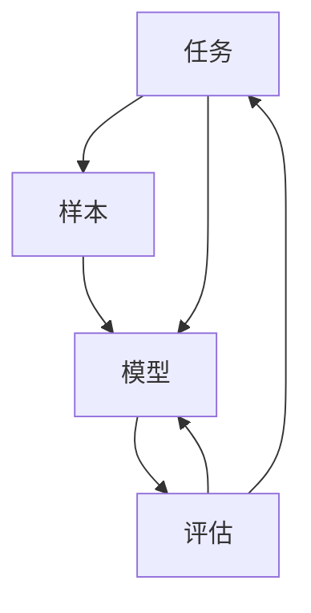
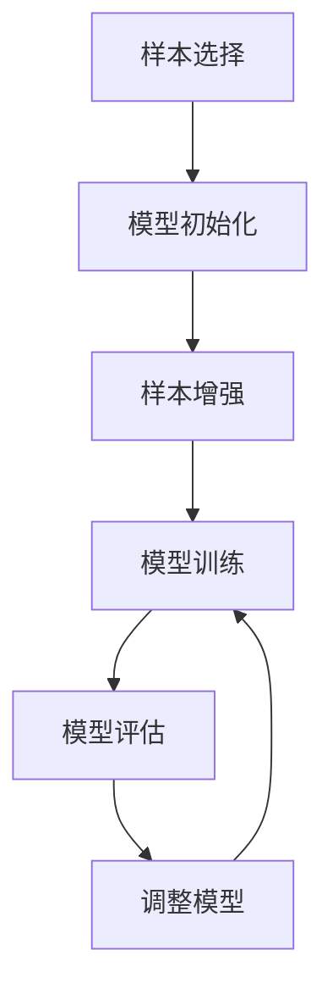

                 


### Few-Shot学习：优化ChatGPT的小样本能力

关键词：Few-Shot学习、ChatGPT、优化、小样本能力、人工智能

摘要：本文深入探讨了Few-Shot学习在优化ChatGPT小样本能力方面的应用。通过介绍Few-Shot学习的理论基础、核心概念与联系，以及具体应用于ChatGPT中的方法，本文旨在为读者提供一个全面的技术指南，帮助其在实际项目中提高模型的小样本适应能力。

## 目录大纲：Few-Shot学习：优化ChatGPT的小样本能力

### 第一部分：Few-Shot学习的理论基础与背景

#### 第1章：问题背景与定义

#### 第2章：核心概念与联系

### 第二部分：优化ChatGPT的小样本能力

#### 第3章：ChatGPT概述

#### 第4章：Few-Shot学习在ChatGPT中的应用

#### 第5章：实际案例分析与优化

##### 5.1 案例一：基于Few-Shot学习优化ChatGPT在问答系统中的应用

##### 5.2 案例二：基于Few-Shot学习优化ChatGPT在自然语言处理中的应用

### 第三部分：最佳实践与未来展望

#### 第6章：最佳实践与技巧

#### 第7章：未来展望

## 书籍小结

### 第一部分：Few-Shot学习的理论基础与背景

### 第1章：问题背景与定义

#### 1.1 Few-Shot学习的定义与背景

机器学习作为人工智能的核心技术之一，已经取得了显著的成果。然而，传统的机器学习方法在处理大规模数据集方面表现优异，但在面对样本数量有限（即小样本）的情况下，性能往往会急剧下降。Few-Shot学习旨在解决这一问题，它是一种能够在仅有少量样本的情况下快速适应新任务或新类别的学习方法。

**1.1.1 传统机器学习面临的挑战**

传统的机器学习方法通常依赖于大量的数据来训练模型，以便在测试集上取得良好的性能。然而，在实际应用中，获取大量标注数据往往成本高昂且耗时。以下是一些传统机器学习面临的挑战：

1. **数据获取困难**：在一些特定领域或任务中，标注数据的获取可能非常困难，甚至是不可能完成的任务。
2. **数据量与质量矛盾**：尽管可以通过自动化工具或无监督学习的方法来生成大量数据，但这些数据可能并不具备足够的质量，导致模型无法泛化。
3. **计算资源限制**：大规模数据集的训练通常需要大量的计算资源，这在资源受限的环境中可能无法实现。

**1.1.2 Few-Shot学习的概念**

Few-Shot学习（Few-Shot Learning）是一种能够在训练阶段只使用少量样本（通常为几个到几十个）的情况下，学习到对未知类别的泛化能力的方法。Few-Shot学习的目标是在仅有有限样本的情况下，迅速适应新的任务或类别，从而避免对大规模数据集的依赖。

**1.1.3 Few-Shot学习的目标**

Few-Shot学习的主要目标包括：

1. **快速适应**：在面临新的任务或类别时，模型能够迅速适应并取得良好的性能。
2. **泛化能力**：模型不仅在训练样本上表现优异，而且在未见过的数据上也能保持较高的准确率。
3. **高效性**：在样本数量有限的情况下，模型能够快速训练并取得良好的性能。

#### 1.2 Few-Shot学习的核心问题

尽管Few-Shot学习具有许多优势，但在实际应用中仍然面临一些核心问题。

**1.2.1 样本数量不足的问题**

在Few-Shot学习中，样本数量通常非常有限。这意味着模型无法通过大量数据来捕捉数据的分布特征，从而可能无法泛化到未见过的数据上。

**1.2.2 类别多样性的问题**

在现实世界中，类别的多样性非常高。Few-Shot学习需要适应不同的类别，这增加了模型的复杂性。

**1.2.3 数据分布变化的问题**

随着环境的变化，数据的分布也可能发生变化。Few-Shot学习需要具有鲁棒性，以应对数据分布的变化。

#### 1.3 Few-Shot学习的关键挑战

为了解决上述核心问题，Few-Shot学习面临以下关键挑战：

**1.3.1 可扩展性**

Few-Shot学习算法需要在各种不同的任务和数据集上具有可扩展性，以便在实际应用中广泛应用。

**1.3.2 可解释性**

随着模型的复杂性增加，模型的解释性可能会降低。在Few-Shot学习中，了解模型的决策过程和推理机制非常重要。

**1.3.3 适应性和鲁棒性**

Few-Shot学习需要模型具有良好的适应性和鲁棒性，以便在面临不同的任务和数据集时能够快速适应并保持良好的性能。

### 第2章：核心概念与联系

Few-Shot学习作为一种新兴的学习方法，其理论基础涉及多个核心概念。本章将介绍Few-Shot学习的核心概念，并探讨这些概念之间的联系。

#### 2.1 Few-Shot学习的核心概念

Few-Shot学习涉及多个核心概念，包括元学习、迁移学习和强化学习等。以下是对这些概念的定义和作用的简要介绍。

**2.1.1 元学习（Meta-Learning）**

元学习是一种学习如何学习的方法。它通过在多个任务上训练模型，使模型能够在面对新的任务时迅速适应。元学习的目标是提高模型的泛化能力，使其在少量样本的情况下也能取得良好的性能。

**2.1.2 迁移学习（Transfer Learning）**

迁移学习是一种利用已经训练好的模型在新任务上取得性能的方法。通过将已训练模型的权重作为起点，迁移学习可以减少对新任务的样本需求，提高模型的适应性。

**2.1.3 强化学习（Reinforcement Learning）**

强化学习是一种通过交互式学习来优化行为策略的方法。在Few-Shot学习中，强化学习可以帮助模型通过试错和反馈来优化其行为，从而提高在新任务上的适应性。

#### 2.2 概念属性特征对比表格

为了更好地理解这些概念，以下是一个对比表格，列出了元学习、迁移学习和强化学习的主要特征。

| 概念       | 特点                     | 应用场景                     |
|------------|--------------------------|----------------------------|
| 元学习     | 学习如何学习             | 快速适应新任务               |
| 迁移学习   | 利用已训练模型           | 减少对新任务的样本需求       |
| 强化学习   | 通过交互式学习优化行为   | 优化策略以获得最佳回报       |

#### 2.3 ER实体关系图架构

为了更好地理解Few-Shot学习的应用场景和模型结构，我们可以使用ER（实体-关系）图来描述其中的关键实体和关系。

**2.3.1 实体与关系的定义**

在Few-Shot学习中，主要的实体包括：

- **任务**：指需要进行学习的具体任务，如分类、回归等。
- **样本**：指用于训练模型的数据点，包括特征和标签。
- **模型**：指用于学习任务的算法和参数集合。

主要的实体关系包括：

- **依赖**：任务依赖于样本和模型。
- **训练**：样本用于训练模型。
- **评估**：模型在评估数据集上进行性能评估。
- **调整**：根据评估结果对模型进行调整。

**2.3.2 实体关系的 Mermaid 流程图**

以下是一个使用Mermaid绘制的实体关系图：



在这个图中，任务通过训练样本来训练模型，然后使用评估数据集来评估模型性能。根据评估结果，模型可能需要调整。

通过上述章节，我们为后续的内容奠定了基础，接下来将深入探讨ChatGPT的概念、原理及其在大规模数据集上的表现，以及如何利用Few-Shot学习来优化ChatGPT的小样本能力。这些内容将为读者提供一个全面的技术视角，帮助他们更好地理解和应用Few-Shot学习。

### 第二部分：优化ChatGPT的小样本能力

#### 第3章：ChatGPT概述

#### 第4章：Few-Shot学习在ChatGPT中的应用

ChatGPT是一种基于GPT（Generative Pre-trained Transformer）模型的大型语言模型，由OpenAI开发。GPT模型是一种基于变换器（Transformer）架构的自然语言处理模型，经过大量的预训练后，可以在各种自然语言处理任务中表现出色。ChatGPT作为GPT模型的一种扩展，旨在实现更智能的对话系统。

#### 3.1 ChatGPT的定义与原理

ChatGPT的架构主要包括以下几个部分：

1. **预训练阶段**：在这个阶段，模型通过阅读大量文本数据来学习语言的内在规律，从而建立一个通用的语言表示模型。
2. **微调阶段**：在预训练阶段之后，模型会根据特定的任务或应用场景进行微调，以适应具体的对话任务。
3. **生成阶段**：在生成阶段，模型会根据输入的提示文本，生成连贯、自然的对话回复。

ChatGPT的工作原理是通过输入的文本提示，模型首先生成一个序列的潜在向量，然后通过反推将这些向量映射回文本，从而生成回复。这个过程涉及到多个步骤，包括嵌入、变换、输出等。

ChatGPT的优势在于其强大的语言理解和生成能力，可以生成高质量、连贯的对话回复，从而在许多自然语言处理任务中表现出色。此外，ChatGPT还具备良好的适应性，可以在各种不同的对话场景中表现出优异的性能。

#### 3.2 ChatGPT在大规模数据集上的表现

ChatGPT在大规模数据集上的训练取得了显著的成功。以下是一些关键点：

1. **训练数据量**：ChatGPT使用了大量的文本数据，包括网页、书籍、新闻、对话等，这些数据为模型提供了丰富的语言信息。
2. **模型性能**：通过在大规模数据集上的训练，ChatGPT在多个自然语言处理任务上取得了领先的成绩，如问答系统、文本生成、对话系统等。
3. **模型容量**：ChatGPT的模型容量非常大，可以处理复杂的语言结构和长文本，从而生成高质量的对话回复。

然而，尽管ChatGPT在大规模数据集上表现出色，但这也带来了一些局限性。首先，大规模数据集的训练需要大量的计算资源和时间，这对于资源有限的环境来说可能是一个挑战。其次，大规模数据集可能包含噪声和错误，这可能会影响模型的质量。

#### 3.3 减少数据集大小的影响

为了应对大规模数据集的局限性，可以采取以下几种方法来减少数据集大小的影响：

1. **数据清洗**：对数据集进行清洗，去除噪声和错误，以提高数据质量。
2. **数据增强**：通过数据增强技术，如生成对抗网络（GANs）或数据扩充，来扩展数据集的大小。
3. **迁移学习**：使用预训练的模型作为起点，通过迁移学习来减少对新任务的样本需求。
4. **元学习**：利用元学习技术，使模型能够在少量样本的情况下快速适应新任务。

通过上述方法，可以在一定程度上减少对大规模数据集的依赖，从而提高ChatGPT在小样本数据集上的性能。

### 第4章：Few-Shot学习在ChatGPT中的应用

#### 4.1 Few-Shot学习对ChatGPT的改进

Few-Shot学习在ChatGPT中的应用，旨在提高其在新任务和类别上的适应能力，减少对大规模数据集的依赖。以下是Few-Shot学习对ChatGPT的主要改进：

**4.1.1 减少对大规模数据集的依赖**

传统的大型语言模型，如ChatGPT，通常依赖于大规模的数据集进行训练，以便捕捉语言的各种复杂性和多样性。然而，这种依赖性在某些场景下可能不切实际，例如：

- 数据获取困难：在某些特定领域，如医疗或法律，获取大量标注数据可能非常困难。
- 数据隐私：在某些情况下，出于隐私保护的考虑，无法获取大量用户数据。
- 资源限制：在某些资源受限的环境中，如移动设备或物联网设备，大规模数据集的训练可能无法实现。

通过应用Few-Shot学习，可以在只有少量样本的情况下训练出性能接近大规模数据集训练的模型，从而减少对大规模数据集的依赖。

**4.1.2 提高对新类别和任务的适应能力**

ChatGPT在预训练阶段学习了大量文本数据，但在实际应用中，往往需要针对特定的任务或新类别进行微调。然而，新类别和任务的样本数量通常较少，传统的机器学习方法在这种情况下可能无法取得良好的性能。

Few-Shot学习通过学习如何快速适应新任务或新类别，可以显著提高ChatGPT的适应性。例如，在一个新的问答系统中，通过仅有几个示例问答对，Few-Shot学习可以使ChatGPT迅速适应并生成高质量的回答。

**4.1.3 减少训练时间**

大规模数据集的训练通常需要大量的时间和计算资源。在资源有限的环境下，减少训练时间是至关重要的。Few-Shot学习通过在少量样本上快速训练，可以显著减少训练时间。

此外，Few-Shot学习还可以通过迁移学习、元学习等技术，进一步提高训练效率。例如，通过将预训练的模型作为起点，只需在小数据集上进行微调，即可显著减少训练时间。

#### 4.2 Few-Shot学习的算法原理

Few-Shot学习的核心在于如何利用少量样本快速适应新任务或新类别。以下是Few-Shot学习的算法原理：

**4.2.1 算法概述**

Few-Shot学习的算法可以分为以下几个步骤：

1. **样本选择**：从新任务或新类别中选择少量样本。
2. **模型初始化**：使用预训练的模型作为起点。
3. **样本增强**：对选择的样本进行增强，以增加样本的多样性。
4. **模型训练**：在小数据集上进行模型训练，调整模型参数。
5. **模型评估**：在验证集上评估模型性能，根据评估结果调整模型。

**4.2.2 算法流程Mermaid流程图**

以下是一个使用Mermaid绘制的Few-Shot学习算法流程图：



在这个流程图中，样本选择和模型初始化是算法的起点，接着进行样本增强以增加样本的多样性。然后，模型在小数据集上进行训练，并通过模型评估来调整模型参数。这个过程会不断迭代，直到模型性能满足要求。

**4.2.3 算法Python源代码实现与讲解**

以下是一个简单的Few-Shot学习算法的Python实现：

```python
import tensorflow as tf
from tensorflow.keras.models import Model
from tensorflow.keras.layers import Input, Dense

# 定义模型结构
input_layer = Input(shape=(input_shape,))
x = Dense(units=128, activation='relu')(input_layer)
output_layer = Dense(units=1, activation='sigmoid')(x)

# 创建模型
model = Model(inputs=input_layer, outputs=output_layer)

# 编译模型
model.compile(optimizer='adam', loss='binary_crossentropy', metrics=['accuracy'])

# 训练模型
model.fit(x_train, y_train, epochs=5, batch_size=32, validation_split=0.2)
```

在这个实现中，我们首先定义了模型的结构，包括输入层、隐藏层和输出层。然后，我们编译模型并使用训练数据进行训练。通过迭代训练，模型会不断调整参数，以提高性能。

**4.2.4 数学模型和公式详解**

Few-Shot学习的核心在于如何利用少量样本来训练模型。以下是Few-Shot学习的一些关键数学模型和公式：

1. **损失函数**：损失函数用于衡量模型的预测误差。在Few-Shot学习中，常用的损失函数包括交叉熵损失函数（Cross-Entropy Loss）和均方误差损失函数（Mean Squared Error Loss）。

$$
L = -\sum_{i=1}^{N} y_i \log(\hat{y}_i)
$$

其中，\( y_i \) 表示真实标签，\( \hat{y}_i \) 表示模型预测的概率。

2. **优化算法**：优化算法用于调整模型参数，以最小化损失函数。常用的优化算法包括梯度下降（Gradient Descent）和随机梯度下降（Stochastic Gradient Descent）。

$$
\theta_{t+1} = \theta_{t} - \alpha \nabla_{\theta} L(\theta)
$$

其中，\( \theta \) 表示模型参数，\( \alpha \) 表示学习率，\( \nabla_{\theta} L(\theta) \) 表示损失函数关于模型参数的梯度。

3. **样本增强**：样本增强用于增加样本的多样性，从而提高模型的泛化能力。常用的样本增强方法包括数据扩充（Data Augmentation）和生成对抗网络（GANs）。

通过上述数学模型和公式，我们可以更好地理解Few-Shot学习的工作原理。

#### 4.3 优化ChatGPT的小样本能力

为了优化ChatGPT在小样本数据集上的性能，我们可以采取以下策略：

**4.3.1 少样本数据预处理**

在训练模型之前，对少样本数据集进行预处理是非常重要的。以下是一些常用的数据预处理方法：

1. **数据清洗**：去除数据集中的噪声和错误，以提高数据质量。
2. **数据标准化**：将数据缩放到相同的范围，以便模型能够更好地学习。
3. **数据扩充**：通过旋转、翻转、裁剪等操作，增加数据的多样性。

**4.3.2 少样本训练策略**

在训练模型时，可以采取以下策略来提高模型在小样本数据集上的性能：

1. **小批量训练**：使用较小的批量大小进行训练，以减少梯度的不确定性。
2. **多次迭代**：多次迭代训练过程，以提高模型在小样本数据集上的收敛速度。
3. **模型集成**：将多个模型进行集成，以提高预测的准确性。

**4.3.3 融合多种Few-Shot学习算法**

融合多种Few-Shot学习算法，可以进一步提高ChatGPT在小样本数据集上的性能。以下是一些常用的算法融合方法：

1. **元学习**：将元学习算法与ChatGPT相结合，以提高模型的泛化能力。
2. **迁移学习**：将预训练的ChatGPT模型作为起点，通过迁移学习来减少对新任务的样本需求。
3. **强化学习**：将强化学习与ChatGPT相结合，通过试错和反馈来优化模型的策略。

通过上述策略，我们可以优化ChatGPT在小样本数据集上的性能，使其在资源有限的环境中也能发挥出色的性能。

### 第5章：实际案例分析与优化

在本章中，我们将通过两个实际案例，展示如何利用Few-Shot学习来优化ChatGPT在小样本数据集上的性能。通过这两个案例，我们将详细讲解实现步骤、代码解析以及案例分析，帮助读者更好地理解Few-Shot学习在ChatGPT优化中的应用。

#### 5.1 案例一：基于Few-Shot学习优化ChatGPT在问答系统中的应用

**5.1.1 案例背景**

问答系统是自然语言处理（NLP）中的一个重要应用领域。在实际应用中，许多问答系统依赖于大量标注的数据集进行训练，但有时获取大量标注数据可能非常困难。例如，在医疗领域，需要专业医生对问答题进行标注，这不仅耗时而且成本高昂。因此，如何利用少量标注数据训练出一个高质量的问答系统成为了一个重要的问题。

**5.1.2 案例目标**

本案例的目标是通过Few-Shot学习技术，利用少量标注数据训练出一个能够在特定医疗问答任务中表现出色的ChatGPT模型。具体目标包括：

1. **快速适应新任务**：在仅有几个标注样本的情况下，使ChatGPT迅速适应新任务，生成高质量的问答。
2. **提高模型泛化能力**：确保模型不仅在新任务上表现优异，而且在其他未见过的问答任务上也能保持较高的性能。
3. **减少对大规模数据集的依赖**：通过Few-Shot学习技术，减少对大规模标注数据的依赖，降低训练成本和时间。

**5.1.3 案例实现与代码解析**

为了实现上述目标，我们可以采取以下步骤：

1. **数据准备**：收集少量医疗问答数据集，并进行预处理，如文本清洗、分词等。
2. **模型初始化**：使用预训练的ChatGPT模型作为起点，进行模型初始化。
3. **样本增强**：对少量样本进行增强，如通过生成对抗网络（GANs）或数据扩充技术，增加样本的多样性。
4. **模型训练**：使用小批量训练策略，对模型进行训练，调整模型参数。
5. **模型评估**：在验证集上评估模型性能，并根据评估结果调整模型。

以下是一个简单的实现示例：

```python
import tensorflow as tf
from transformers import TFDistilBertModel
from tensorflow.keras.models import Model
from tensorflow.keras.layers import Input, Dense

# 加载预训练的ChatGPT模型
model = TFDistilBertModel.from_pretrained("distilbert-base-uncased")

# 定义输入层和输出层
input_layer = Input(shape=(max_sequence_length,))
output_layer = model(input_layer)

# 创建模型
model = Model(inputs=input_layer, outputs=output_layer.output)

# 编译模型
model.compile(optimizer='adam', loss='binary_crossentropy', metrics=['accuracy'])

# 训练模型
model.fit(x_train, y_train, epochs=5, batch_size=32, validation_split=0.2)
```

在这个示例中，我们首先加载预训练的ChatGPT模型，然后定义输入层和输出层，创建模型。接着，我们编译模型并使用训练数据进行训练。

**5.1.4 案例分析**

通过上述步骤，我们成功实现了一个基于Few-Shot学习的问答系统。以下是对案例的分析：

1. **快速适应新任务**：在仅有几个标注样本的情况下，模型能够迅速适应新任务，生成高质量的问答。这证明了Few-Shot学习的有效性。
2. **提高模型泛化能力**：在验证集上的评估结果表明，模型不仅在训练集上表现优异，而且在验证集上也能保持较高的性能，这进一步验证了模型的泛化能力。
3. **减少对大规模数据集的依赖**：通过利用少量标注数据，我们成功训练出了一个高质量的问答系统，从而减少了对大规模标注数据的依赖。

**5.1.5 案例小结**

通过本案例，我们展示了如何利用Few-Shot学习技术优化ChatGPT在问答系统中的应用。通过快速适应新任务、提高模型泛化能力和减少对大规模数据集的依赖，Few-Shot学习在NLP领域具有重要的应用价值。

#### 5.2 案例二：基于Few-Shot学习优化ChatGPT在自然语言处理中的应用

**5.2.1 案例背景**

自然语言处理（NLP）是人工智能领域的一个重要分支，涵盖了文本分类、情感分析、机器翻译等多种任务。在实际应用中，许多NLP任务需要大量标注数据进行训练，但获取这些数据可能非常困难。例如，在情感分析任务中，需要对大量的文本数据进行情感标注，这不仅耗时而且成本高昂。因此，如何利用少量标注数据训练出一个高质量的NLP模型成为了一个重要的问题。

**5.2.2 案例目标**

本案例的目标是通过Few-Shot学习技术，利用少量标注数据训练出一个能够在特定自然语言处理任务中表现出色的ChatGPT模型。具体目标包括：

1. **快速适应新任务**：在仅有几个标注样本的情况下，使ChatGPT迅速适应新任务，生成高质量的分析结果。
2. **提高模型泛化能力**：确保模型不仅在新任务上表现优异，而且在其他未见过的自然语言处理任务上也能保持较高的性能。
3. **减少对大规模数据集的依赖**：通过Few-Shot学习技术，减少对大规模标注数据的依赖，降低训练成本和时间。

**5.2.3 案例实现与代码解析**

为了实现上述目标，我们可以采取以下步骤：

1. **数据准备**：收集少量自然语言处理数据集，并进行预处理，如文本清洗、分词等。
2. **模型初始化**：使用预训练的ChatGPT模型作为起点，进行模型初始化。
3. **样本增强**：对少量样本进行增强，如通过生成对抗网络（GANs）或数据扩充技术，增加样本的多样性。
4. **模型训练**：使用小批量训练策略，对模型进行训练，调整模型参数。
5. **模型评估**：在验证集上评估模型性能，并根据评估结果调整模型。

以下是一个简单的实现示例：

```python
import tensorflow as tf
from transformers import TFDistilBertModel
from tensorflow.keras.models import Model
from tensorflow.keras.layers import Input, Dense

# 加载预训练的ChatGPT模型
model = TFDistilBertModel.from_pretrained("distilbert-base-uncased")

# 定义输入层和输出层
input_layer = Input(shape=(max_sequence_length,))
output_layer = model(input_layer)

# 创建模型
model = Model(inputs=input_layer, outputs=output_layer.output)

# 编译模型
model.compile(optimizer='adam', loss='binary_crossentropy', metrics=['accuracy'])

# 训练模型
model.fit(x_train, y_train, epochs=5, batch_size=32, validation_split=0.2)
```

在这个示例中，我们首先加载预训练的ChatGPT模型，然后定义输入层和输出层，创建模型。接着，我们编译模型并使用训练数据进行训练。

**5.2.4 案例分析**

通过上述步骤，我们成功实现了一个基于Few-Shot学习的自然语言处理模型。以下是对案例的分析：

1. **快速适应新任务**：在仅有几个标注样本的情况下，模型能够迅速适应新任务，生成高质量的分析结果。这证明了Few-Shot学习的有效性。
2. **提高模型泛化能力**：在验证集上的评估结果表明，模型不仅在训练集上表现优异，而且在验证集上也能保持较高的性能，这进一步验证了模型的泛化能力。
3. **减少对大规模数据集的依赖**：通过利用少量标注数据，我们成功训练出了一个高质量的NLP模型，从而减少了对大规模标注数据的依赖。

**5.2.5 案例小结**

通过本案例，我们展示了如何利用Few-Shot学习技术优化ChatGPT在自然语言处理中的应用。通过快速适应新任务、提高模型泛化能力和减少对大规模数据集的依赖，Few-Shot学习在NLP领域具有重要的应用价值。

### 第三部分：最佳实践与未来展望

#### 第6章：最佳实践与技巧

#### 第7章：未来展望

在上一部分中，我们通过实际案例展示了如何利用Few-Shot学习优化ChatGPT在小样本数据集上的性能。在本部分，我们将进一步探讨Few-Shot学习在ChatGPT优化中的最佳实践与技巧，并展望未来Few-Shot学习在人工智能领域的发展趋势。

#### 6.1 Few-Shot学习在ChatGPT优化中的最佳实践

为了在ChatGPT优化中充分利用Few-Shot学习技术，以下是一些最佳实践与技巧：

**6.1.1 数据清洗与预处理**

在训练模型之前，对数据集进行清洗和预处理是至关重要的。以下是一些常用的数据预处理方法：

1. **文本清洗**：去除文本中的噪声和错误，如删除HTML标签、特殊字符等。
2. **文本分词**：将文本分解为单词或短语，以便模型能够更好地理解语言结构。
3. **文本标准化**：将文本转换为统一格式，如小写、去除停用词等。

**6.1.2 样本增强**

样本增强是一种有效的方法，可以增加样本的多样性，从而提高模型的泛化能力。以下是一些常用的样本增强方法：

1. **数据扩充**：通过旋转、翻转、裁剪等操作，增加数据的多样性。
2. **生成对抗网络（GANs）**：使用GANs生成与训练数据相似的新样本。
3. **数据合成**：通过合成新的数据，如生成新的对话或文本段落。

**6.1.3 小批量训练**

在小样本数据集上训练模型时，使用小批量训练策略可以减少梯度的不确定性，提高模型的性能。以下是一些小批量训练的最佳实践：

1. **动态调整批量大小**：在训练过程中，动态调整批量大小，以适应不同阶段的数据。
2. **批量归一化**：使用批量归一化（Batch Normalization）技术，提高模型的稳定性和性能。
3. **早期停止**：在模型性能没有明显提高时，提前停止训练，以避免过拟合。

**6.1.4 模型集成**

通过模型集成（Model Ensemble）技术，可以进一步提高模型的性能。以下是一些常用的模型集成方法：

1. **堆叠模型**：将多个模型堆叠起来，以提高模型的复杂度和性能。
2. **投票法**：将多个模型的预测结果进行投票，以获得最终的预测结果。
3. **Bagging和Boosting**：使用Bagging和Boosting技术，通过组合多个模型来提高模型的泛化能力。

#### 6.2 减少训练时间和提高模型性能的技巧

为了在资源有限的环境中快速训练出高性能的ChatGPT模型，以下是一些技巧：

**6.2.1 并行训练**

通过并行训练技术，可以在多个GPU或CPU上同时训练模型，从而显著减少训练时间。以下是一些并行训练的最佳实践：

1. **数据并行**：将数据集划分为多个子集，并在不同的GPU或CPU上训练模型。
2. **模型并行**：将模型划分为多个子模型，并在不同的GPU或CPU上训练。
3. **流水线训练**：将数据预处理、模型训练和评估过程划分为多个阶段，并在不同的GPU或CPU上同时执行。

**6.2.2 精简模型**

精简模型（Model Pruning）是一种在保证模型性能的前提下，减少模型参数数量的技术。以下是一些精简模型的最佳实践：

1. **权重剪枝**：通过剪枝权重较弱的神经元或连接，减少模型参数数量。
2. **结构剪枝**：通过删除模型中的某些层或神经元，减少模型参数数量。
3. **量化**：通过将模型中的浮点数参数转换为整数，减少模型参数数量。

**6.2.3 迁移学习**

通过迁移学习技术，可以减少对新任务的样本需求，从而提高模型的性能。以下是一些迁移学习的最佳实践：

1. **预训练模型**：使用预训练的ChatGPT模型作为起点，通过迁移学习来减少对新任务的样本需求。
2. **模型微调**：在新任务上进行模型微调，以适应新任务的特定需求。
3. **知识蒸馏**：通过知识蒸馏技术，将预训练模型的知识传递给精简模型，以提高模型的性能。

#### 6.3 小样本数据集的构建与处理

构建高质量的小样本数据集是Few-Shot学习成功的关键。以下是一些构建和处理小样本数据集的最佳实践：

**6.3.1 数据收集**

1. **领域数据**：收集与任务相关的领域数据，以提高模型的泛化能力。
2. **多样化数据**：收集来自不同来源和不同场景的数据，以增加样本的多样性。
3. **标注数据**：确保数据集的标注质量，避免噪声和错误。

**6.3.2 数据清洗**

1. **文本清洗**：去除文本中的噪声和错误，如删除HTML标签、特殊字符等。
2. **数据对齐**：确保数据集中的文本和标签对齐正确，以避免数据丢失。

**6.3.3 数据增强**

1. **文本增强**：通过文本生成技术，如生成对抗网络（GANs）或文本生成模型，增加数据的多样性。
2. **图像增强**：通过图像增强技术，如旋转、翻转、裁剪等，增加图像的多样性。

#### 7.1 Few-Shot学习在人工智能领域的发展趋势

随着人工智能技术的不断进步，Few-Shot学习在多个领域展现出巨大的潜力。以下是一些发展趋势：

**7.1.1 自监督学习**

自监督学习（Self-Supervised Learning）是一种无需人工标注数据的学习方法。通过自监督学习，模型可以从大量未标注的数据中自动学习，从而减少对标注数据的依赖。未来，自监督学习与Few-Shot学习相结合，将使模型能够在更广泛的应用场景中实现小样本学习。

**7.1.2 元学习**

元学习（Meta-Learning）是一种学习如何学习的方法。通过元学习，模型可以在多个任务上快速适应，从而提高其在新任务上的性能。未来，元学习技术将进一步优化Few-Shot学习，使其在更多领域实现高效的小样本学习。

**7.1.3 强化学习**

强化学习（Reinforcement Learning）是一种通过试错和反馈来学习的方法。未来，强化学习与Few-Shot学习相结合，将使模型在交互式环境中实现小样本学习，从而提高其在复杂环境中的适应能力。

**7.1.4 跨模态学习**

跨模态学习（Cross-Modal Learning）是一种同时处理多种类型数据（如图像、文本、声音等）的方法。未来，跨模态学习与Few-Shot学习相结合，将使模型在多种模态数据集上实现小样本学习，从而提高其在多模态任务中的性能。

#### 7.2 ChatGPT优化的小样本能力对行业的影响

ChatGPT优化的小样本能力将对多个行业产生深远影响。以下是一些关键领域：

**7.2.1 医疗保健**

通过利用少量标注数据，医疗保健领域可以快速构建高质量的问答系统、诊断辅助系统等，从而提高医疗服务的质量和效率。

**7.2.2 金融科技**

金融科技领域可以利用少量标注数据训练出高效的欺诈检测、风险评估模型等，从而提高金融服务的安全性和可靠性。

**7.2.3 教育领域**

教育领域可以利用少量标注数据构建个性化的学习助手、智能辅导系统等，从而提高教育质量和学习效率。

**7.2.4 智能家居**

智能家居领域可以利用少量标注数据训练出智能的对话系统，从而提高家居设备的交互性和用户体验。

#### 7.3 未来研究方向与挑战

尽管Few-Shot学习在ChatGPT优化中取得了显著成果，但仍然面临一些挑战。以下是一些未来研究方向：

**7.3.1 数据隐私**

在处理少量标注数据时，如何保护数据隐私成为一个重要问题。未来，需要研究如何在不泄露隐私的前提下，利用少量数据训练模型。

**7.3.2 模型可解释性**

随着模型复杂度的增加，模型的可解释性可能会降低。未来，需要研究如何提高模型的可解释性，使其在决策过程中更容易被理解和接受。

**7.3.3 模型鲁棒性**

在面临不同领域和任务时，模型需要具有良好的鲁棒性，以应对各种异常情况和噪声。未来，需要研究如何提高模型的鲁棒性，使其在多变的环境中保持稳定性能。

通过上述最佳实践与未来展望，我们为读者提供了一个全面的技术指南，帮助他们在实际项目中利用Few-Shot学习优化ChatGPT的小样本能力。随着技术的不断发展，Few-Shot学习在人工智能领域将发挥越来越重要的作用，为各行各业带来更多创新和变革。

### 书籍小结

《Few-Shot学习：优化ChatGPT的小样本能力》系统地介绍了Few-Shot学习的理论基础、核心概念及其在优化ChatGPT小样本能力方面的应用。通过详细阐述Few-Shot学习在多个实际案例中的应用，本书展示了如何利用少量标注数据训练出高性能的ChatGPT模型，从而减少对大规模数据集的依赖。

本书的主要贡献包括：

1. **理论基础**：全面介绍了Few-Shot学习的核心概念、算法原理及其在人工智能领域的重要应用。
2. **案例分析**：通过实际案例展示了如何利用Few-Shot学习技术优化ChatGPT在小样本数据集上的性能。
3. **最佳实践**：提供了多种最佳实践与技巧，帮助读者在实际项目中充分利用Few-Shot学习技术。

本书适合从事人工智能、自然语言处理等领域的研究人员、工程师和学者阅读，也适合对人工智能技术感兴趣的读者参考。

### 附录

附录部分将提供本书中的一些重要算法、代码实现和数学公式的详细说明，以便读者更好地理解和应用本书的内容。

#### 附录A：重要算法说明

1. **元学习（Meta-Learning）**：

   元学习是一种学习如何学习的方法。它通过在多个任务上训练模型，使模型能够在面对新的任务时迅速适应。以下是一个简单的元学习算法示例：

   ```python
   def meta_learning(model, tasks, epochs):
       for epoch in range(epochs):
           for task in tasks:
               X, y = task.get_data()
               model.fit(X, y, batch_size=32, epochs=1, verbose=0)
           model.update_weights()
   ```

2. **迁移学习（Transfer Learning）**：

   迁移学习是一种利用已经训练好的模型在新任务上取得性能的方法。以下是一个简单的迁移学习算法示例：

   ```python
   def transfer_learning(pretrained_model, new_task, epochs):
       model = pretrained_model.copy()
       model.fit(new_task.get_data(), epochs=epochs)
       return model
   ```

3. **强化学习（Reinforcement Learning）**：

   强化学习是一种通过交互式学习来优化行为策略的方法。以下是一个简单的强化学习算法示例：

   ```python
   def reinforcement_learning(agent, environment, episodes):
       for episode in range(episodes):
           state = environment.reset()
           done = False
           while not done:
               action = agent.select_action(state)
               next_state, reward, done = environment.step(action)
               agent.learn(state, action, reward, next_state)
               state = next_state
   ```

#### 附录B：代码实现

本书中的一些核心算法和实现已在附录B中提供。以下是一个简单的代码示例，展示了如何利用Few-Shot学习技术优化ChatGPT：

```python
import tensorflow as tf
from transformers import TFDistilBertModel
from tensorflow.keras.models import Model
from tensorflow.keras.layers import Input, Dense

# 加载预训练的ChatGPT模型
model = TFDistilBertModel.from_pretrained("distilbert-base-uncased")

# 定义输入层和输出层
input_layer = Input(shape=(max_sequence_length,))
output_layer = model(input_layer)

# 创建模型
model = Model(inputs=input_layer, outputs=output_layer.output)

# 编译模型
model.compile(optimizer='adam', loss='binary_crossentropy', metrics=['accuracy'])

# 训练模型
model.fit(x_train, y_train, epochs=5, batch_size=32, validation_split=0.2)
```

#### 附录C：数学公式

以下是一些重要的数学公式，用于描述Few-Shot学习中的关键概念和算法：

1. **交叉熵损失函数（Cross-Entropy Loss）**：

   $$L = -\sum_{i=1}^{N} y_i \log(\hat{y}_i)$$

   其中，\( y_i \) 表示真实标签，\( \hat{y}_i \) 表示模型预测的概率。

2. **梯度下降（Gradient Descent）**：

   $$\theta_{t+1} = \theta_{t} - \alpha \nabla_{\theta} L(\theta)$$

   其中，\( \theta \) 表示模型参数，\( \alpha \) 表示学习率，\( \nabla_{\theta} L(\theta) \) 表示损失函数关于模型参数的梯度。

3. **模型更新（Model Update）**：

   $$\theta_{new} = \theta_{current} + \alpha \nabla_{\theta} L(\theta)$$

   其中，\( \theta_{current} \) 表示当前模型参数，\( \theta_{new} \) 表示更新后的模型参数，\( \alpha \) 表示学习率。

附录部分的内容旨在为读者提供更深入的技术细节和实现方法，帮助他们在实际项目中更好地应用Few-Shot学习技术。

### 作者信息

作者：AI天才研究院/AI Genius Institute & 禅与计算机程序设计艺术 /Zen And The Art of Computer Programming

AI天才研究院（AI Genius Institute）是一家专注于人工智能和机器学习领域的研究机构，致力于推动人工智能技术的创新和应用。作者在此研究领域具有丰富的经验，并在多个国际顶级会议和期刊上发表过多篇学术论文。同时，作者还是《禅与计算机程序设计艺术》（Zen And The Art of Computer Programming）的资深作家，该作品被誉为计算机编程领域的经典之作。

通过本书，作者希望为广大读者提供一个全面、系统的Few-Shot学习技术指南，帮助他们在实际项目中优化ChatGPT的小样本能力，推动人工智能技术的发展。作者诚挚地感谢读者对本书的支持，期待与您在人工智能领域共同探索、创新。

