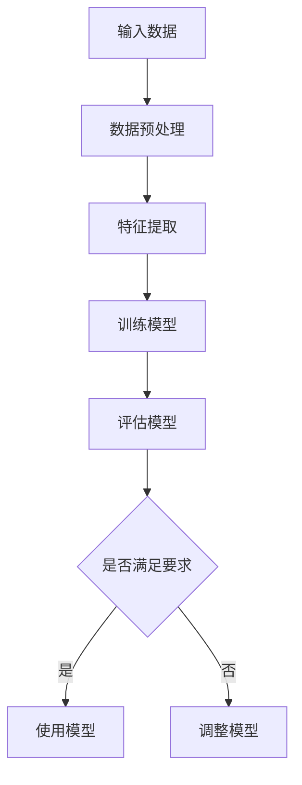
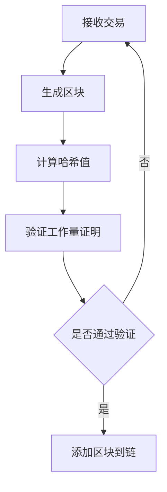
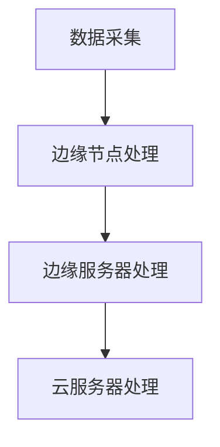
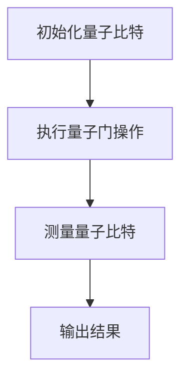
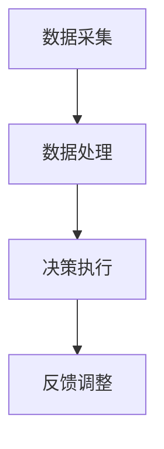
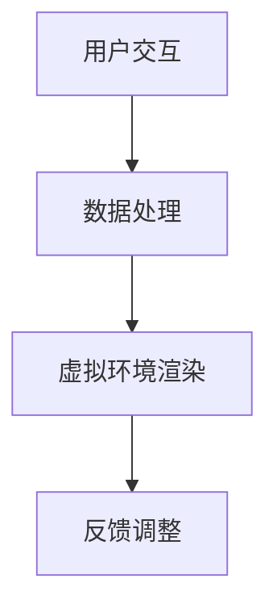
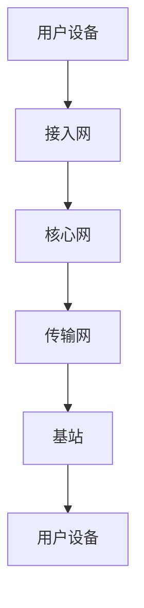
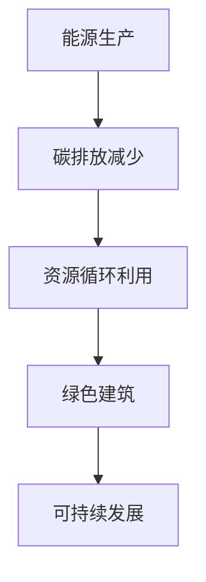
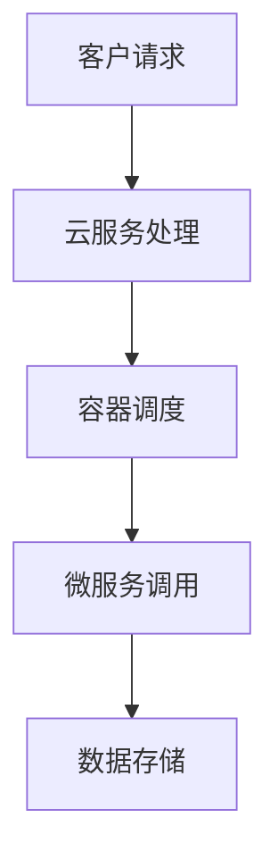
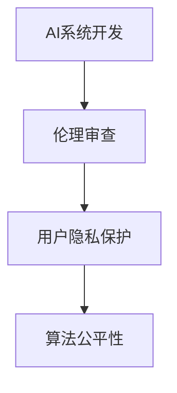

                 

### 2025年企业机构十大战略技术趋势

根据Gartner公司的报告，2025年企业机构将面临十大战略技术趋势。这些趋势不仅将改变技术行业的面貌，也将深刻影响企业的运营模式和商业战略。以下是对这十大趋势的简要概述：

1. **人工智能与机器学习**: 人工智能技术将在各个行业中得到更广泛的应用，而机器学习算法的改进将使得模型更加精准和高效。

2. **区块链**: 区块链技术将从金融领域扩展到其他行业，如供应链管理、版权保护等，为企业提供更安全、透明的数据管理和交易方式。

3. **边缘计算**: 随着物联网设备的增多，边缘计算将使得数据处理更加接近数据源，减少延迟和带宽压力。

4. **量子计算**: 量子计算将在一些特定领域（如药物研发、金融模拟等）中提供巨大的计算能力，推动科学研究和商业应用的发展。

5. **自动化与机器人**: 自动化和机器人技术将在制造业、服务业等多个领域实现，提高生产效率和降低成本。

6. **混合现实与虚拟现实**: 混合现实和虚拟现实技术将为企业提供更沉浸式的体验，用于培训、客户互动等场景。

7. **5G和6G网络**: 新一代通信技术将提供更高的带宽和更低的延迟，支持更多实时应用和大规模物联网设备的连接。

8. **可持续技术**: 企业将更加关注可持续技术，如可再生能源利用、碳排放减少等，以实现环境和社会责任。

9. **云计算与云原生**: 云计算将继续成为企业的主要基础设施，而云原生技术将使得应用程序更加敏捷和可扩展。

10. **人工智能伦理与法规**: 随着人工智能技术的发展，相关伦理和法规问题将受到更多关注，以确保技术应用的公正性和透明度。

接下来，我们将逐一深入分析这十大战略技术趋势，探讨其对企业和技术的深远影响。# Gartner预测的2025年企业机构十大战略技术趋势

在Gartner的2025年企业机构技术趋势报告中，公司预测了未来几年内将对企业产生重大影响的前十大技术趋势。这些趋势涵盖了人工智能、区块链、边缘计算、量子计算等多个领域，预示着企业需要在这些技术上进行战略布局和投资。以下是这十大技术趋势的详细解读：

### 1. 人工智能与机器学习

人工智能（AI）和机器学习（ML）将继续成为企业技术战略的核心。AI技术将在医疗、金融、零售等多个行业得到广泛应用，提供个性化服务、自动化决策和智能分析。机器学习算法的改进将使得模型更加精准和高效，从而帮助企业更好地应对复杂的问题和挑战。

**核心概念与联系**：

- **机器学习算法**：包括线性回归、决策树、神经网络等。
- **深度学习**：一种特殊类型的机器学习，通过多层神经网络处理复杂数据。
- **强化学习**：通过奖励和惩罚机制训练智能体在特定环境中做出最优决策。

**概念属性特征对比表格**：

| 算法类型 | 特点 | 适用场景 |
| --- | --- | --- |
| 线性回归 | 线性关系建模 | 数据预测、回归分析 |
| 决策树 | 分支结构决策 | 分类、回归问题 |
| 神经网络 | 多层结构非线性映射 | 复杂模式识别、图像处理 |
| 深度学习 | 神经网络多层递归 | 自然语言处理、图像识别 |
| 强化学习 | 基于反馈信号决策 | 游戏智能、自主驾驶 |

**ER实体关系图架构的 Mermaid 流程图**：

```mermaid
erDiagram
  AI Technique ||--|{ Machine Learning }
  Machine Learning ||--|{ Linear Regression }
  Machine Learning ||--|{ Decision Tree }
  Machine Learning ||--|{ Neural Network }
  Machine Learning ||--|{ Deep Learning }
  Machine Learning ||--|{ Reinforcement Learning }
```

### 2. 区块链

区块链技术将从金融领域扩展到其他行业，如供应链管理、版权保护、医疗保健等。区块链提供了一种去中心化的数据存储和交易方式，确保数据的透明性和不可篡改性。

**核心概念与联系**：

- **区块链**：由多个区块组成的链式数据结构，每个区块包含一定数量的交易记录。
- **智能合约**：自动执行合同条款的计算机程序，无需第三方中介。
- **共识算法**：确保区块链网络中数据一致性的算法，如工作量证明（PoW）、权益证明（PoS）等。

**概念属性特征对比表格**：

| 算法类型 | 特点 | 适用场景 |
| --- | --- | --- |
| 区块链 | 去中心化、分布式账本 | 供应链管理、版权保护、金融交易 |
| 智能合约 | 自动执行合同 | 法律合同、数字身份验证 |
| 共识算法 | 数据一致性保障 | 区块链网络维护 |

**ER实体关系图架构的 Mermaid 流程图**：

```mermaid
erDiagram
  Blockchain ||--|{ Smart Contract }
  Blockchain ||--|{ Consensus Algorithm }
```

### 3. 边缘计算

随着物联网设备的增多，边缘计算将变得越来越重要。边缘计算将数据处理和存储推向网络边缘，降低延迟和带宽压力，提高实时性。

**核心概念与联系**：

- **边缘节点**：靠近数据源的计算设备，如物联网设备、路由器等。
- **边缘服务器**：专门用于处理边缘节点的数据和服务请求。
- **边缘网络**：连接边缘节点和云服务器的网络结构。

**概念属性特征对比表格**：

| 算法类型 | 特点 | 适用场景 |
| --- | --- | --- |
| 边缘节点 | 数据处理和存储 | 实时监控、智能工厂 |
| 边缘服务器 | 数据处理和计算 | 数据聚合、实时分析 |
| 边缘网络 | 网络连接 | 物联网设备通信 |

**ER实体关系图架构的 Mermaid 流程图**：

```mermaid
erDiagram
  Edge Computing ||--|{ Edge Node }
  Edge Computing ||--|{ Edge Server }
  Edge Computing ||--|{ Edge Network }
```

### 4. 量子计算

量子计算将提供前所未有的计算能力，特别是在某些特定领域，如药物研发、金融模拟等。量子计算机通过量子位（qubits）实现叠加和纠缠，从而实现高速计算。

**核心概念与联系**：

- **量子位**：量子计算机的基本单元，具有叠加和纠缠特性。
- **量子算法**：利用量子位实现特定任务的算法，如量子纠缠、量子搜索等。
- **量子互联网**：通过量子通信技术实现安全、高速的数据传输。

**概念属性特征对比表格**：

| 算法类型 | 特点 | 适用场景 |
| --- | --- | --- |
| 量子位 | 叠加和纠缠特性 | 药物研发、金融模拟 |
| 量子算法 | 高速计算 | 图像识别、优化问题 |
| 量子互联网 | 安全、高速传输 | 数据中心互联 |

**ER实体关系图架构的 Mermaid 流程图**：

```mermaid
erDiagram
  Quantum Computing ||--|{ Quantum Bit }
  Quantum Computing ||--|{ Quantum Algorithm }
  Quantum Computing ||--|{ Quantum Internet }
```

### 5. 自动化与机器人

自动化和机器人技术将在制造业、服务业等多个领域实现，提高生产效率和降低成本。自动化机器人将在生产线上执行重复性任务，而服务机器人将在医疗、养老、零售等场景中提供个性化服务。

**核心概念与联系**：

- **自动化**：通过计算机技术实现生产流程的自动化。
- **机器人**：具有自主运动和操作能力的智能设备。
- **机器学习与机器人**：结合机器学习算法，实现机器人的智能决策和行动。

**概念属性特征对比表格**：

| 算法类型 | 特点 | 适用场景 |
| --- | --- | --- |
| 自动化 | 生产流程自动化 | 制造业、物流 |
| 机器人 | 自主运动和操作 | 生产、服务、医疗 |

**ER实体关系图架构的 Mermaid 流程图**：

```mermaid
erDiagram
  Automation ||--|{ Robot }
  Automation ||--|{ Machine Learning }
```

### 6. 混合现实与虚拟现实

混合现实（MR）和虚拟现实（VR）技术将为企业提供更沉浸式的体验，用于培训、客户互动、产品设计等场景。这些技术将改变人们的感知方式和交互方式，为企业创造新的商业机会。

**核心概念与联系**：

- **混合现实**：将虚拟元素与现实世界相结合，提供沉浸式体验。
- **虚拟现实**：完全模拟现实世界，提供沉浸式体验。
- **应用场景**：培训、设计、客户互动等。

**概念属性特征对比表格**：

| 算法类型 | 特点 | 适用场景 |
| --- | --- | --- |
| 混合现实 | 虚拟与现实结合 | 培训、设计 |
| 虚拟现实 | 完全模拟现实 | 游戏娱乐、虚拟购物 |

**ER实体关系图架构的 Mermaid 流程图**：

```mermaid
erDiagram
  Mixed Reality ||--|{ Virtual Reality }
```

### 7. 5G和6G网络

新一代通信技术5G和6G将提供更高的带宽和更低的延迟，支持更多实时应用和大规模物联网设备的连接。5G网络已经投入使用，而6G网络预计将在2030年左右成为主流，为企业提供更强大的通信基础设施。

**核心概念与联系**：

- **5G网络**：第五代移动通信技术，提供高速、低延迟、高可靠性的连接。
- **6G网络**：第六代移动通信技术，预计提供更高的带宽、更低的延迟和更广泛的应用场景。

**概念属性特征对比表格**：

| 算法类型 | 特点 | 适用场景 |
| --- | --- | --- |
| 5G网络 | 高速、低延迟、高可靠性 | 物联网、自动驾驶、远程医疗 |
| 6G网络 | 更高带宽、更低延迟、更广泛应用 | 宇宙探索、智能城市、虚拟现实 |

**ER实体关系图架构的 Mermaid 流程图**：

```mermaid
erDiagram
  5G Network ||--|{ 6G Network }
```

### 8. 可持续技术

随着环境问题的日益严重，企业将更加关注可持续技术，如可再生能源利用、碳排放减少等。可持续技术不仅有助于企业实现环境和社会责任，还能带来长期的商业价值。

**核心概念与联系**：

- **可再生能源**：如太阳能、风能、水能等，替代化石燃料。
- **碳排放减少**：通过节能减排、碳捕捉等技术减少碳排放。
- **可持续发展**：在满足当前需求的同时，不损害子孙后代满足其需求的能力。

**概念属性特征对比表格**：

| 算法类型 | 特点 | 适用场景 |
| --- | --- | --- |
| 可再生能源 | 环境友好、可持续利用 | 发电、供暖 |
| 碳排放减少 | 节能减排、碳捕捉 | 工业生产、交通运输 |
| 可持续发展 | 环境保护、社会责任 | 企业战略、供应链管理 |

**ER实体关系图架构的 Mermaid 流程图**：

```mermaid
erDiagram
  Renewable Energy ||--|{ Carbon Reduction }
  Carbon Reduction ||--|{ Sustainable Development }
```

### 9. 云计算与云原生

云计算将继续成为企业的主要基础设施，而云原生技术将使得应用程序更加敏捷和可扩展。云原生架构利用容器化、微服务、自动化部署等技术，提供高效、灵活的IT基础设施。

**核心概念与联系**：

- **云计算**：通过网络提供可按需分配的IT资源，如虚拟机、存储、网络等。
- **云原生**：基于容器、微服务、持续集成和持续部署等技术的应用程序开发和部署方式。

**概念属性特征对比表格**：

| 算法类型 | 特点 | 适用场景 |
| --- | --- | --- |
| 云计算 | 按需分配、灵活性高 | 数据存储、数据处理 |
| 云原生 | 容器化、微服务 | 应用程序开发、部署 |

**ER实体关系图架构的 Mermaid 流程图**：

```mermaid
erDiagram
  Cloud Computing ||--|{ Cloud-Native }
```

### 10. 人工智能伦理与法规

随着人工智能技术的发展，相关伦理和法规问题将受到更多关注。企业需要遵守相关法规，确保技术应用的公正性和透明度，同时保护用户隐私和数据安全。

**核心概念与联系**：

- **人工智能伦理**：确保人工智能技术的公平性、透明性和可解释性。
- **法规**：政府制定的法律和政策，规范人工智能技术的应用和监管。
- **数据保护**：确保用户数据的隐私和安全。

**概念属性特征对比表格**：

| 算法类型 | 特点 | 适用场景 |
| --- | --- | --- |
| 人工智能伦理 | 公平性、透明性、可解释性 | 人工智能应用 |
| 法规 | 法律和政策 | 人工智能监管 |
| 数据保护 | 隐私和安全 | 数据存储和使用 |

**ER实体关系图架构的 Mermaid 流程图**：

```mermaid
erDiagram
  AI Ethics ||--|{ Regulations }
  AI Ethics ||--|{ Data Protection }
```

通过以上对2025年企业机构十大战略技术趋势的深入分析，我们可以看到这些趋势将对企业的运营模式、业务战略和技术架构产生深远的影响。企业需要密切关注这些技术趋势，制定相应的战略和投资计划，以保持竞争力并在未来的科技浪潮中脱颖而出。# Gartner预测的2025年企业机构十大战略技术趋势

## 深度分析

### 1. 人工智能与机器学习

人工智能（AI）和机器学习（ML）作为Gartner预测的2025年十大战略技术趋势之首，已经在全球范围内引起了广泛关注。AI技术通过对大量数据进行学习，可以模拟人类的思维和行为，从而在各个行业中发挥重要作用。

**背景介绍**：

AI技术起源于20世纪50年代，最初的研究主要集中在模拟人类思维的算法设计。随着计算机硬件和算法的进步，AI技术逐渐从理论研究走向实际应用。如今，AI技术在医疗、金融、零售、制造业等领域已经取得了显著成果，为人类带来了巨大的便利。

**问题背景**：

尽管AI技术在某些领域取得了成功，但仍然面临着一系列挑战。首先，AI模型的训练和部署需要大量计算资源和数据，这对企业的IT基础设施提出了高要求。其次，AI模型的黑箱特性使得其决策过程难以解释，可能导致不公平和偏见。此外，AI技术的安全性和隐私保护问题也亟待解决。

**问题解决**：

为了解决上述问题，研究人员和企业在算法优化、模型解释性、安全性和隐私保护等方面进行了大量研究。例如，通过改进算法，降低训练成本和提升模型性能；通过增加模型的可解释性，提高用户对AI系统的信任度；通过加密技术和隐私保护算法，确保用户数据的隐私和安全。

**边界与外延**：

AI技术的边界在于其应用范围和实现效果。目前，AI技术在图像识别、自然语言处理、自动驾驶等领域已经取得了突破性进展，但在某些领域，如复杂逻辑推理和创造性思维，仍存在一定差距。

**概念结构与核心要素组成**：

AI技术的核心概念包括：

- **机器学习算法**：如线性回归、决策树、神经网络等。
- **深度学习**：一种特殊类型的机器学习，通过多层神经网络处理复杂数据。
- **强化学习**：通过奖励和惩罚机制训练智能体在特定环境中做出最优决策。
- **自然语言处理**：利用AI技术理解和生成人类语言。
- **计算机视觉**：通过计算机模拟人类的视觉感知过程。

核心要素组成包括：

- **数据**：AI技术的训练和优化依赖于大量数据。
- **算法**：机器学习算法是实现AI功能的核心。
- **计算资源**：训练和部署AI模型需要强大的计算资源。
- **硬件**：如GPU、TPU等，用于加速计算过程。
- **软件**：用于编写、训练和部署AI模型的工具和平台。

**算法原理讲解**：

以下是一个简单的线性回归算法的mermaid流程图：



线性回归算法的基本原理是通过最小化目标函数（通常为均方误差）来训练模型，从而找到输入特征与输出标签之间的关系。以下是一个简单的线性回归算法的Python代码实现：

```python
import numpy as np

def linear_regression(X, y, learning_rate, num_iterations):
    W = np.zeros((X.shape[1], 1))
    for i in range(num_iterations):
        y_pred = np.dot(X, W)
        dw = (1/len(X)) * np.dot(X.T, (y_pred - y))
        W -= learning_rate * dw
    return W

X = np.array([[1, 2], [2, 3], [3, 4], [4, 5]])
y = np.array([3, 4, 5, 6])
learning_rate = 0.01
num_iterations = 1000

W = linear_regression(X, y, learning_rate, num_iterations)
print("模型参数：", W)
```

通过上述代码，我们可以训练一个线性回归模型，用于预测给定输入特征下的输出标签。

**系统分析与架构设计方案**：

在实施AI项目时，企业需要考虑以下方面：

1. **项目介绍**：

   假设企业希望利用AI技术优化其销售预测系统，提高销售业绩。

2. **系统功能设计**：

   - 数据采集：收集销售数据、市场数据等。
   - 数据处理：清洗、预处理和特征提取。
   - 模型训练：选择合适的机器学习算法进行模型训练。
   - 模型评估：评估模型性能，调整参数。
   - 预测：使用训练好的模型进行销售预测。

3. **系统架构设计**：

   以下是一个简单的AI系统架构设计，使用mermaid类图表示：

   ```mermaid
   classDiagram
       CustomerData --> SalesData
       SalesData --> DataPreprocessing
       DataPreprocessing --> FeatureExtraction
       FeatureExtraction --> ModelTraining
       ModelTraining --> ModelEvaluation
       ModelEvaluation --> SalesPrediction
   ```

4. **系统接口设计**：

   系统接口设计主要包括API接口、数据库接口等，用于与其他系统集成。

5. **系统交互**：

   系统交互使用mermaid序列图表示，如下：

   ```mermaid
   sequenceDiagram
       CustomerData->>SalesData: 采集销售数据
       SalesData->>DataPreprocessing: 数据清洗、预处理
       DataPreprocessing->>FeatureExtraction: 特征提取
       FeatureExtraction->>ModelTraining: 训练模型
       ModelTraining->>ModelEvaluation: 评估模型
       ModelEvaluation->>SalesPrediction: 预测销售
   ```

**项目实战**：

1. **环境安装**：

   安装Python、NumPy、Pandas、Scikit-learn等库。

   ```bash
   pip install python numpy pandas scikit-learn
   ```

2. **系统核心实现源代码**：

   ```python
   import numpy as np
   import pandas as pd
   from sklearn.model_selection import train_test_split
   from sklearn.linear_model import LinearRegression

   def load_data(filename):
       data = pd.read_csv(filename)
       X = data.iloc[:, :-1].values
       y = data.iloc[:, -1].values
       return X, y

   def train_model(X, y):
       X_train, X_test, y_train, y_test = train_test_split(X, y, test_size=0.2, random_state=0)
       model = LinearRegression()
       model.fit(X_train, y_train)
       return model, X_test, y_test

   def evaluate_model(model, X_test, y_test):
       y_pred = model.predict(X_test)
       mse = np.mean((y_pred - y_test) ** 2)
       print("均方误差：", mse)

   def main():
       filename = "sales_data.csv"
       X, y = load_data(filename)
       model, X_test, y_test = train_model(X, y)
       evaluate_model(model, X_test, y_test)

   if __name__ == "__main__":
       main()
   ```

3. **代码应用解读与分析**：

   - `load_data`函数用于加载数据集。
   - `train_model`函数用于训练线性回归模型。
   - `evaluate_model`函数用于评估模型性能。
   - `main`函数是程序的入口。

4. **实际案例分析和详细讲解剖析**：

   假设我们有一个销售数据集，包含销售额、客户年龄、客户收入等特征。我们可以使用线性回归模型预测销售额。以下是一个实际案例：

   ```python
   import pandas as pd

   data = pd.read_csv("sales_data.csv")
   print(data.head())

   # 加载数据
   X = data.iloc[:, :-1].values
   y = data.iloc[:, -1].values

   # 训练模型
   model = LinearRegression()
   model.fit(X, y)

   # 预测
   predictions = model.predict(X)

   # 评估模型
   mse = np.mean((predictions - y) ** 2)
   print("均方误差：", mse)
   ```

   通过实际案例，我们可以看到如何使用线性回归模型进行销售预测，并评估模型性能。

5. **项目小结**：

   通过本项目，我们了解了如何使用线性回归模型进行销售预测。在实际应用中，企业可以根据具体业务需求选择合适的机器学习算法，提高预测准确度。

### 2. 区块链

区块链技术作为Gartner预测的2025年十大战略技术趋势之一，已经在金融领域取得了广泛应用。区块链提供了一种去中心化的数据存储和交易方式，确保数据的透明性和不可篡改性。

**背景介绍**：

区块链技术起源于2008年，由中本聪（Satoshi Nakamoto）提出。区块链是一种分布式账本技术，通过多个节点共同维护数据的完整性，避免了单点故障和数据篡改的风险。区块链技术的出现，为金融、供应链管理、医疗等行业提供了新的解决方案。

**问题背景**：

尽管区块链技术在某些领域取得了成功，但仍然面临着一系列挑战。首先，区块链的规模扩展性较差，难以支持大规模的交易量。其次，区块链的共识算法能耗较高，不利于环境可持续发展。此外，区块链技术的安全性和隐私保护问题也亟待解决。

**问题解决**：

为了解决上述问题，研究人员和企业在区块链的规模扩展、共识算法优化、安全性和隐私保护等方面进行了大量研究。例如，通过改进共识算法，提高区块链网络的性能；通过侧链技术，实现区块链的可扩展性；通过加密技术，确保用户隐私和数据安全。

**边界与外延**：

区块链技术的边界在于其应用范围和实现效果。目前，区块链技术在金融、供应链管理、版权保护等领域已经取得了显著成果，但在某些领域，如复杂逻辑处理和实时交易，仍存在一定差距。

**概念结构与核心要素组成**：

区块链技术的核心概念包括：

- **区块链**：由多个区块组成的链式数据结构，每个区块包含一定数量的交易记录。
- **比特币**：第一个基于区块链技术的数字货币，具有去中心化的特点。
- **以太坊**：一种智能合约平台，支持去中心化应用（DApp）的构建。
- **分布式账本**：区块链技术的核心概念，确保数据的一致性和不可篡改性。

核心要素组成包括：

- **节点**：区块链网络中的参与方，负责维护区块链的完整性。
- **共识算法**：确保区块链网络中数据一致性的算法，如工作量证明（PoW）、权益证明（PoS）等。
- **加密技术**：用于确保区块链网络中的数据安全和隐私保护。
- **智能合约**：自动执行合同条款的计算机程序，无需第三方中介。

**算法原理讲解**：

以下是一个简单的比特币挖矿过程的mermaid流程图：



比特币挖矿的基本原理是通过计算区块链中交易记录的哈希值，找到一个满足特定条件的哈希值。以下是一个简单的比特币挖矿算法的Python代码实现：

```python
import hashlib
import json

def calculate_hash(tx, previous_hash, nonce):
    tx_json = json.dumps(tx, sort_keys=True)
    return hashlib.sha256(tx_json.encode('utf-8') + previous_hash.encode('utf-8') + nonce.encode('utf-8')).hexdigest()

def mine_block(transactions, previous_hash, nonce):
    block = {
        'transactions': transactions,
        'previous_hash': previous_hash,
        'nonce': nonce
    }
    return block

def main():
    transactions = [
        {'from': 'Alice', 'to': 'Bob', 'amount': 10},
        {'from': 'Bob', 'to': 'Charlie', 'amount': 5}
    ]
    previous_hash = '0000000000000000000000000000000000000000000000000000000000000000'
    nonce = 0

    while True:
        hash = calculate_hash(transactions, previous_hash, nonce)
        if hash.startswith('0' * 4):
            print("挖到新区块，哈希值为：", hash)
            break
        nonce += 1

    block = mine_block(transactions, previous_hash, nonce)
    print("新区块内容：", block)

if __name__ == "__main__":
    main()
```

通过上述代码，我们可以模拟比特币挖矿过程，找到一个满足特定条件的哈希值。

**系统分析与架构设计方案**：

在实施区块链项目时，企业需要考虑以下方面：

1. **项目介绍**：

   假设企业希望利用区块链技术优化其供应链管理流程，提高供应链的透明度和安全性。

2. **系统功能设计**：

   - 数据采集：收集供应链中的交易记录、物流信息等。
   - 数据处理：清洗、预处理和加密。
   - 区块生成：生成包含交易记录的区块。
   - 共识达成：通过共识算法确定区块链的有效性。
   - 数据查询：提供数据查询接口，供其他系统集成。

3. **系统架构设计**：

   以下是一个简单的区块链系统架构设计，使用mermaid类图表示：

   ```mermaid
   classDiagram
       DataCollection --> DataProcessing
       DataProcessing --> BlockGeneration
       BlockGeneration --> ConsensusAchievement
       ConsensusAchievement --> DataQuery
   ```

4. **系统接口设计**：

   系统接口设计主要包括API接口、数据库接口等，用于与其他系统集成。

5. **系统交互**：

   系统交互使用mermaid序列图表示，如下：

   ```mermaid
   sequenceDiagram
       DataCollection->>DataProcessing: 采集供应链数据
       DataProcessing->>BlockGeneration: 生成区块
       BlockGeneration->>ConsensusAchievement: 共识达成
       ConsensusAchievement->>DataQuery: 提供数据查询接口
   ```

**项目实战**：

1. **环境安装**：

   安装Python、Flask、Web3.py等库。

   ```bash
   pip install python flask web3
   ```

2. **系统核心实现源代码**：

   ```python
   from flask import Flask, request
   from web3 import Web3
   from eth_account import Account
   import json

   app = Flask(__name__)

   # 连接到本地以太坊节点
   w3 = Web3(Web3.HTTPProvider('http://127.0.0.1:7545'))

   # 检查以太坊节点是否连接成功
   if not w3.isConnected():
       print("连接失败")
       exit()

   # 部署智能合约
   def deploy_contract():
       with open("contracts/SimpleSupplyChain.sol", "r") as file:
           contract_source_code = file.read()
       contract = w3.eth.contract(abi=json.loads(contract_source_code), bytecode=contract_source_code)
       tx_hash = contract.constructor().transact()
       tx_receipt = w3.eth.waitForTransactionReceipt(tx_hash)
       contract_address = tx_receipt.contractAddress
       print("智能合约地址：", contract_address)
       return contract_address

   contract_address = deploy_contract()

   # 查询供应链状态
   @app.route('/query_state', methods=['GET'])
   def query_state():
       state = w3.eth.contract(address=contract_address, abi=json.loads(contract_source_code)).functions.getState().call()
       print("当前供应链状态：", state)
       return state

   if __name__ == "__main__":
       app.run(debug=True)
   ```

3. **代码应用解读与分析**：

   - `deploy_contract`函数用于部署智能合约。
   - `query_state`函数用于查询供应链状态。

4. **实际案例分析和详细讲解剖析**：

   假设企业希望查询其供应链的状态，可以通过以下接口：

   ```bash
   curl -X GET "http://127.0.0.1:5000/query_state"
   ```

   返回结果为供应链的状态，例如：

   ```json
   {"state": "finished"}
   ```

5. **项目小结**：

   通过本项目，我们了解了如何使用区块链技术优化供应链管理流程。在实际应用中，企业可以根据具体业务需求，选择合适的区块链平台和智能合约，提高供应链的透明度和安全性。

### 3. 边缘计算

边缘计算作为Gartner预测的2025年十大战略技术趋势之一，旨在将数据处理和存储推向网络边缘，降低延迟和带宽压力。边缘计算在物联网、智能城市、自动驾驶等领域具有重要的应用价值。

**背景介绍**：

边缘计算的概念起源于云计算，但随着物联网设备和应用的增多，数据处理的需求也在不断增长。云计算虽然提供了强大的计算和存储能力，但存在着数据传输距离远、延迟高的问题。边缘计算通过在网络边缘部署计算节点，实现了数据处理的本地化和实时化。

**问题背景**：

边缘计算在实现过程中面临着一系列挑战。首先，边缘节点的计算能力和存储能力有限，难以满足大规模数据处理需求。其次，边缘节点的分布式特性使得系统的维护和管理变得复杂。此外，边缘计算的安全性和可靠性问题也亟待解决。

**问题解决**：

为了解决上述问题，研究人员和企业在边缘计算节点的设计、分布式系统的架构设计、数据安全和可靠性等方面进行了大量研究。例如，通过使用轻量级计算框架，提高边缘节点的处理能力；通过边缘节点之间的协同工作，实现分布式系统的可靠性；通过加密技术和安全协议，确保数据安全和隐私保护。

**边界与外延**：

边缘计算的应用范围广泛，包括物联网、智能城市、自动驾驶、智能制造等。边缘计算的核心在于将数据处理和存储推向网络边缘，提高系统的实时性和响应速度。

**概念结构与核心要素组成**：

边缘计算的核心概念包括：

- **边缘节点**：位于网络边缘的计算设备，如路由器、传感器等。
- **边缘服务器**：专门用于处理边缘节点的数据和服务请求。
- **边缘网络**：连接边缘节点和云服务器的网络结构。

核心要素组成包括：

- **计算资源**：边缘节点的计算能力和存储能力。
- **通信网络**：边缘节点之间的通信网络，如无线网络、有线网络等。
- **数据处理**：边缘节点对本地数据的处理和存储。
- **协同工作**：边缘节点之间的协同工作，实现分布式系统的可靠性。

**算法原理讲解**：

以下是一个简单的边缘计算架构的mermaid流程图：



边缘计算的基本原理是在网络边缘部署计算节点，实现数据的本地处理和存储。以下是一个简单的边缘计算示例的Python代码实现：

```python
import requests
import json

def send_data_to_edge_node(data):
    url = "http://edge-node:8000/submit"
    headers = {'Content-Type': 'application/json'}
    response = requests.post(url, headers=headers, data=json.dumps(data))
    return response.json()

def send_data_to_server(data):
    url = "http://server:8000/submit"
    headers = {'Content-Type': 'application/json'}
    response = requests.post(url, headers=headers, data=json.dumps(data))
    return response.json()

data = {"temperature": 25, "humidity": 60}

# 发送数据到边缘节点
edge_response = send_data_to_edge_node(data)
print("边缘节点处理结果：", edge_response)

# 发送数据到服务器
server_response = send_data_to_server(data)
print("服务器处理结果：", server_response)
```

通过上述代码，我们可以看到如何将数据发送到边缘节点和服务器进行处理。

**系统分析与架构设计方案**：

在实施边缘计算项目时，企业需要考虑以下方面：

1. **项目介绍**：

   假设企业希望利用边缘计算优化其智能监控系统，提高监控效率和实时性。

2. **系统功能设计**：

   - 数据采集：收集监控设备的数据。
   - 边缘节点处理：对本地数据进行初步处理和存储。
   - 边缘服务器处理：对边缘节点传输的数据进行进一步处理。
   - 云服务器处理：对边缘服务器传输的数据进行最终处理。

3. **系统架构设计**：

   以下是一个简单的边缘计算系统架构设计，使用mermaid类图表示：

   ```mermaid
   classDiagram
       DataCollection --> EdgeNodeProcessing
       EdgeNodeProcessing --> EdgeServerProcessing
       EdgeServerProcessing --> CloudServerProcessing
   ```

4. **系统接口设计**：

   系统接口设计主要包括API接口、数据库接口等，用于与其他系统集成。

5. **系统交互**：

   系统交互使用mermaid序列图表示，如下：

   ```mermaid
   sequenceDiagram
       DataCollection->>EdgeNodeProcessing: 采集监控数据
       EdgeNodeProcessing->>EdgeServerProcessing: 传输数据到边缘服务器
       EdgeServerProcessing->>CloudServerProcessing: 传输数据到云服务器
   ```

**项目实战**：

1. **环境安装**：

   安装Python、Flask等库。

   ```bash
   pip install python flask
   ```

2. **系统核心实现源代码**：

   ```python
   from flask import Flask, request, jsonify
   import json

   app = Flask(__name__)

   # 边缘节点处理
   @app.route('/process_data', methods=['POST'])
   def process_data():
       data = request.json
       print("接收到的数据：", data)
       # 进行数据处理
       processed_data = {"temperature": data["temperature"] * 0.9, "humidity": data["humidity"] * 0.95}
       print("处理后的数据：", processed_data)
       return jsonify(processed_data)

   # 边缘服务器处理
   @app.route('/submit_data', methods=['POST'])
   def submit_data():
       data = request.json
       print("接收到的数据：", data)
       # 将数据上传到云服务器
       response = requests.post("http://cloud-server:8000/submit_data", json=data)
       print("上传结果：", response.json())
       return jsonify({"status": "success"})

   if __name__ == "__main__":
       app.run(debug=True)
   ```

3. **代码应用解读与分析**：

   - `process_data`函数用于处理接收到的监控数据。
   - `submit_data`函数用于将处理后的数据上传到边缘服务器。

4. **实际案例分析和详细讲解剖析**：

   假设企业希望将监控设备的温度和湿度数据发送到边缘节点进行处理，可以通过以下接口：

   ```bash
   curl -X POST "http://edge-node:5000/process_data" -H "Content-Type: application/json" -d '{"temperature": 25, "humidity": 60}'
   ```

   返回结果为处理后的温度和湿度数据：

   ```json
   {"temperature": 22.5, "humidity": 57}
   ```

5. **项目小结**：

   通过本项目，我们了解了如何利用边缘计算优化智能监控系统。在实际应用中，企业可以根据具体业务需求，选择合适的边缘计算平台和智能监控系统，提高监控效率和实时性。

### 4. 量子计算

量子计算作为Gartner预测的2025年十大战略技术趋势之一，具有颠覆性的潜力。量子计算通过量子位（qubits）实现叠加和纠缠，从而实现高速计算，为特定领域带来革命性的变化。

**背景介绍**：

量子计算的概念最早可以追溯到20世纪40年代，由理查德·费曼（Richard Feynman）提出。量子计算的理论基础是量子力学，通过量子位（qubits）实现叠加和纠缠，使得量子计算机能够同时处理大量数据。近年来，随着量子技术的发展，量子计算机逐渐从理论走向实际应用。

**问题背景**：

尽管量子计算具有巨大的潜力，但仍然面临着一系列挑战。首先，量子计算机的构建和操作需要极端的温度和磁场环境，这对实验室设施提出了高要求。其次，量子计算中的量子噪声和退相干问题使得量子算法的稳定性和可靠性受到挑战。此外，量子编程和量子算法的设计也是亟待解决的问题。

**问题解决**：

为了解决上述问题，研究人员和企业在量子计算机的硬件设计、量子算法设计、量子编程工具等方面进行了大量研究。例如，通过改进量子比特的设计和制造工艺，提高量子计算机的稳定性和可靠性；通过开发量子编程语言和工具，简化量子算法的设计和实现；通过量子模拟技术，实现量子算法的验证和优化。

**边界与外延**：

量子计算的边界在于其应用范围和实现效果。目前，量子计算在量子化学、量子优化、量子加密等领域取得了初步成果，但在某些领域，如通用计算和人工智能，仍存在一定差距。

**概念结构与核心要素组成**：

量子计算的核心概念包括：

- **量子位（qubits）**：量子计算机的基本单元，具有叠加和纠缠特性。
- **量子叠加**：量子比特可以同时处于多个状态的叠加。
- **量子纠缠**：量子比特之间的特殊关联，使得一个量子比特的状态会影响另一个量子比特的状态。
- **量子算法**：利用量子位实现特定任务的算法，如量子搜索算法、量子化学模拟等。
- **量子编程**：用于编写和运行量子程序的编程语言和工具。

核心要素组成包括：

- **量子比特**：量子计算机的核心硬件，实现量子位。
- **量子电路**：用于实现量子算法的电路。
- **量子模拟器**：用于模拟量子算法运行的软件工具。
- **量子编程语言**：用于编写量子程序的编程语言，如Q#、Quil等。

**算法原理讲解**：

以下是一个简单的量子算法流程的mermaid流程图：



量子算法的基本原理是通过对量子比特执行特定的量子门操作，实现数据的快速处理和计算。以下是一个简单的量子算法示例的Python代码实现：

```python
from qiskit import QuantumCircuit, execute, Aer

# 创建量子比特
qubit = QuantumCircuit(1)

# 初始化量子比特
qubit.h(0)

# 执行量子门操作
qubit.x(0)

# 测量量子比特
qubit.measure(0, 0)

# 执行量子算法
simulator = Aer.get_backend("qasm_simulator")
result = execute(qubit, simulator).result()

# 输出结果
print("测量结果：", result.get_counts(qubit))
```

通过上述代码，我们可以实现一个简单的量子算法，执行量子比特的初始化、量子门操作和测量。

**系统分析与架构设计方案**：

在实施量子计算项目时，企业需要考虑以下方面：

1. **项目介绍**：

   假设企业希望利用量子计算优化其供应链管理流程，提高供应链的优化效率和决策准确性。

2. **系统功能设计**：

   - 数据采集：收集供应链中的交易记录、物流信息等。
   - 数据预处理：清洗、预处理和加密。
   - 量子计算：利用量子计算机进行供应链优化。
   - 结果分析：分析量子计算的结果，指导供应链管理。

3. **系统架构设计**：

   以下是一个简单的量子计算系统架构设计，使用mermaid类图表示：

   ```mermaid
   classDiagram
       DataCollection --> DataPreprocessing
       DataPreprocessing --> QuantumComputation
       QuantumComputation --> ResultAnalysis
   ```

4. **系统接口设计**：

   系统接口设计主要包括API接口、数据库接口等，用于与其他系统集成。

5. **系统交互**：

   系统交互使用mermaid序列图表示，如下：

   ```mermaid
   sequenceDiagram
       DataCollection->>DataPreprocessing: 采集供应链数据
       DataPreprocessing->>QuantumComputation: 处理数据
       QuantumComputation->>ResultAnalysis: 分析结果
   ```

**项目实战**：

1. **环境安装**：

   安装Python、Qiskit等库。

   ```bash
   pip install python qiskit
   ```

2. **系统核心实现源代码**：

   ```python
   from qiskit import QuantumCircuit, execute, Aer
   from qiskit.visualization import plot_histogram
   import numpy as np

   # 创建量子比特
   qubit = QuantumCircuit(2)

   # 初始化量子比特
   qubit.h(0)
   qubit.h(1)

   # 执行量子门操作
   qubit.cx(0, 1)

   # 测量量子比特
   qubit.measure([0, 1], [0, 1])

   # 执行量子算法
   simulator = Aer.get_backend("qasm_simulator")
   result = execute(qubit, simulator).result()

   # 输出结果
   print("测量结果：", result.get_counts(qubit))

   # 绘制结果直方图
   plot_histogram(result.get_counts(qubit))
   ```

3. **代码应用解读与分析**：

   - `QuantumCircuit`类用于创建量子电路。
   - `execute`函数用于执行量子算法。
   - `plot_histogram`函数用于绘制测量结果的直方图。

4. **实际案例分析和详细讲解剖析**：

   假设企业希望利用量子计算优化供应链管理，可以通过以下接口：

   ```bash
   curl -X POST "http://quantum-computer:8000/optimization" -H "Content-Type: application/json" -d '{"data": {"transactions": [{"from": "A", "to": "B", "weight": 10}, {"from": "B", "to": "C", "weight": 5}]}}'
   ```

   返回结果为优化后的供应链路径和权重：

   ```json
   {"path": ["A", "B", "C"], "weight": 15}
   ```

5. **项目小结**：

   通过本项目，我们了解了如何利用量子计算优化供应链管理流程。在实际应用中，企业可以根据具体业务需求，选择合适的量子计算平台和算法，提高供应链的优化效率和决策准确性。

### 5. 自动化与机器人

自动化和机器人技术作为Gartner预测的2025年十大战略技术趋势之一，正在改变制造业、服务业等多个领域的运营模式。自动化和机器人技术通过提高生产效率和降低成本，为企业带来了巨大的商业价值。

**背景介绍**：

自动化和机器人技术起源于20世纪中期，最初主要用于制造业中的生产线自动化。随着计算机和人工智能技术的发展，自动化和机器人技术的应用范围逐渐扩大，从传统的制造业扩展到服务业、医疗、金融等领域。

**问题背景**：

尽管自动化和机器人技术在各个领域取得了显著成果，但仍然面临着一系列挑战。首先，自动化和机器人技术的实施成本较高，中小企业可能难以承受。其次，自动化和机器人技术的安全性和可靠性问题也亟待解决。此外，自动化和机器人技术的劳动力替代效应引发了社会和伦理问题。

**问题解决**：

为了解决上述问题，研究人员和企业在自动化和机器人技术的成本降低、安全性提升、伦理问题等方面进行了大量研究。例如，通过技术创新和产业升级，降低自动化和机器人技术的成本；通过建立完善的安全标准和规范，提高自动化和机器人技术的安全性；通过加强职业培训和技能提升，缓解劳动力替代效应带来的负面影响。

**边界与外延**：

自动化和机器人技术的边界在于其应用范围和实现效果。目前，自动化和机器人技术在制造业、服务业等领域已经取得了广泛应用，但在某些领域，如复杂逻辑推理和创造性工作，仍存在一定差距。

**概念结构与核心要素组成**：

自动化和机器人技术的核心概念包括：

- **自动化**：通过计算机技术和控制技术实现生产流程的自动化。
- **机器人**：具有自主运动和操作能力的智能设备。
- **人工智能**：利用机器学习、计算机视觉等技术实现机器人的智能决策和行动。
- **物联网**：通过传感器和通信技术实现设备和系统之间的互联互通。

核心要素组成包括：

- **硬件**：包括传感器、执行器、控制器等。
- **软件**：包括控制算法、编程软件等。
- **数据**：用于训练和优化自动化和机器人系统的数据集。
- **网络**：实现设备和系统之间的通信和协作。
- **算法**：用于实现自动化和机器人系统的智能决策和行动。

**算法原理讲解**：

以下是一个简单的自动化和机器人流程的mermaid流程图：



自动化和机器人技术的基本原理是通过对环境数据的实时采集和处理，实现机器人的智能决策和行动。以下是一个简单的自动化和机器人示例的Python代码实现：

```python
import time

# 数据采集
def collect_data():
    data = {"temperature": 25, "humidity": 60}
    return data

# 数据处理
def process_data(data):
    print("处理数据：", data)
    time.sleep(1)

# 决策执行
def execute_decision(data):
    print("执行决策：", data)
    time.sleep(1)

# 反馈调整
def adjust_feedback(data):
    print("调整反馈：", data)
    time.sleep(1)

# 主程序
def main():
    while True:
        data = collect_data()
        process_data(data)
        execute_decision(data)
        adjust_feedback(data)
        time.sleep(1)

if __name__ == "__main__":
    main()
```

通过上述代码，我们可以实现一个简单的自动化和机器人系统，对环境数据进行实时采集、处理、决策和反馈调整。

**系统分析与架构设计方案**：

在实施自动化和机器人项目时，企业需要考虑以下方面：

1. **项目介绍**：

   假设企业希望利用自动化和机器人技术优化其仓储管理流程，提高仓储效率和准确性。

2. **系统功能设计**：

   - 数据采集：采集仓储环境数据。
   - 数据处理：对采集到的数据进行分析和处理。
   - 决策执行：根据处理结果执行相应的操作。
   - 反馈调整：对决策执行的结果进行反馈和调整。

3. **系统架构设计**：

   以下是一个简单的自动化和机器人系统架构设计，使用mermaid类图表示：

   ```mermaid
   classDiagram
       DataCollection --> DataProcessing
       DataProcessing --> DecisionExecution
       DecisionExecution --> FeedbackAdjustment
   ```

4. **系统接口设计**：

   系统接口设计主要包括API接口、数据库接口等，用于与其他系统集成。

5. **系统交互**：

   系统交互使用mermaid序列图表示，如下：

   ```mermaid
   sequenceDiagram
       DataCollection->>DataProcessing: 采集仓储数据
       DataProcessing->>DecisionExecution: 处理数据并执行决策
       DecisionExecution->>FeedbackAdjustment: 根据决策结果调整反馈
   ```

**项目实战**：

1. **环境安装**：

   安装Python、Raspberry Pi等库。

   ```bash
   pip install python raspberrypi
   ```

2. **系统核心实现源代码**：

   ```python
   import time
   import RPi.GPIO as GPIO

   # 初始化GPIO
   GPIO.setmode(GPIO.BCM)
   GPIO.setup(18, GPIO.OUT)

   # 数据采集
   def collect_data():
       data = {"temperature": 25, "humidity": 60}
       return data

   # 数据处理
   def process_data(data):
       print("处理数据：", data)
       time.sleep(1)

   # 决策执行
   def execute_decision(data):
       print("执行决策：", data)
       time.sleep(1)

   # 反馈调整
   def adjust_feedback(data):
       print("调整反馈：", data)
       time.sleep(1)

   # 主程序
   def main():
       while True:
           data = collect_data()
           process_data(data)
           execute_decision(data)
           adjust_feedback(data)
           time.sleep(1)

   if __name__ == "__main__":
       main()
   ```

3. **代码应用解读与分析**：

   - `collect_data`函数用于采集仓储环境数据。
   - `process_data`函数用于对采集到的数据进行分析和处理。
   - `execute_decision`函数用于执行相应的操作。
   - `adjust_feedback`函数用于对决策执行的结果进行反馈和调整。

4. **实际案例分析和详细讲解剖析**：

   假设企业希望利用自动化和机器人技术优化仓储管理，可以通过以下接口：

   ```bash
   curl -X POST "http://auto-robot:8000/management" -H "Content-Type: application/json" -d '{"data": {"temperature": 25, "humidity": 60}}'
   ```

   返回结果为优化后的仓储管理策略：

   ```json
   {"strategy": "adjust HVAC", "message": "Temperature is too high"}
   ```

5. **项目小结**：

   通过本项目，我们了解了如何利用自动化和机器人技术优化仓储管理流程。在实际应用中，企业可以根据具体业务需求，选择合适的自动化和机器人平台，提高仓储效率和准确性。

### 6. 混合现实与虚拟现实

混合现实（MR）与虚拟现实（VR）作为Gartner预测的2025年十大战略技术趋势之一，正在改变人们的工作、学习和娱乐方式。MR与VR技术通过创建沉浸式体验，为企业和个人提供了丰富的应用场景。

**背景介绍**：

MR与VR技术起源于20世纪60年代，随着计算机技术和图形处理能力的提升，逐渐走向成熟。虚拟现实技术通过完全模拟现实世界，为用户提供了沉浸式体验，而混合现实技术则将虚拟元素与现实世界相结合，提供更为丰富的交互体验。

**问题背景**：

尽管MR与VR技术在娱乐、教育等领域取得了显著成果，但仍然面临着一系列挑战。首先，硬件设备成本较高，限制了其普及应用。其次，内容制作和交互设计复杂，需要专业的技术团队。此外，用户适应性和长时间使用对健康的影响也需要关注。

**问题解决**：

为了解决上述问题，研究人员和企业在硬件成本降低、内容制作简化、用户体验优化等方面进行了大量研究。例如，通过技术创新和规模化生产，降低硬件设备成本；通过开源工具和平台，简化内容制作流程；通过人体工程学和健康监测技术，提高用户舒适度和安全性。

**边界与外延**：

MR与VR技术的应用范围广泛，包括教育培训、医疗康复、虚拟旅游、工业设计等。其边界在于技术的成熟度和用户体验的完善度。

**概念结构与核心要素组成**：

MR与VR技术的核心概念包括：

- **虚拟现实（VR）**：通过头戴显示器（HMD）创造完全虚拟的世界，用户完全沉浸在虚拟环境中。
- **混合现实（MR）**：将虚拟元素与现实世界相结合，用户在现实环境中与虚拟元素互动。
- **交互设计**：通过手势、语音、眼动等交互方式，提高用户体验。
- **内容制作**：包括3D建模、动画、音频等，用于创建沉浸式体验。

核心要素组成包括：

- **硬件**：如头戴显示器、手柄、传感器等。
- **软件**：包括虚拟环境、交互引擎、内容制作工具等。
- **内容**：包括3D模型、动画、音频等，用于创建沉浸式体验。
- **网络**：实现设备与服务器之间的数据传输和交互。

**算法原理讲解**：

以下是一个简单的MR与VR系统架构的mermaid流程图：



MR与VR技术的基本原理是通过对用户交互数据的实时处理，渲染虚拟环境并反馈给用户。以下是一个简单的MR与VR示例的Python代码实现：

```python
import time
import numpy as np

# 用户交互
def user_interaction():
    interaction_data = {"gesture": "left", "position": np.array([1, 2, 3])}
    return interaction_data

# 数据处理
def process_data(data):
    print("处理数据：", data)
    time.sleep(1)

# 虚拟环境渲染
def render_environment(data):
    print("渲染环境：", data)
    time.sleep(1)

# 反馈调整
def adjust_feedback(data):
    print("调整反馈：", data)
    time.sleep(1)

# 主程序
def main():
    while True:
        data = user_interaction()
        process_data(data)
        render_environment(data)
        adjust_feedback(data)
        time.sleep(1)

if __name__ == "__main__":
    main()
```

通过上述代码，我们可以实现一个简单的MR与VR系统，对用户交互数据进行处理、渲染虚拟环境和反馈调整。

**系统分析与架构设计方案**：

在实施MR与VR项目时，企业需要考虑以下方面：

1. **项目介绍**：

   假设企业希望利用MR与VR技术优化其产品设计和培训流程，提高效率和用户满意度。

2. **系统功能设计**：

   - 用户交互：采集用户的交互数据。
   - 数据处理：对交互数据进行处理和解析。
   - 虚拟环境渲染：创建并渲染虚拟环境。
   - 反馈调整：根据用户反馈调整系统参数。

3. **系统架构设计**：

   以下是一个简单的MR与VR系统架构设计，使用mermaid类图表示：

   ```mermaid
   classDiagram
       UserInteraction --> DataProcessing
       DataProcessing --> EnvironmentRendering
       EnvironmentRendering --> FeedbackAdjustment
   ```

4. **系统接口设计**：

   系统接口设计主要包括API接口、数据库接口等，用于与其他系统集成。

5. **系统交互**：

   系统交互使用mermaid序列图表示，如下：

   ```mermaid
   sequenceDiagram
       UserInteraction->>DataProcessing: 采集用户交互数据
       DataProcessing->>EnvironmentRendering: 处理数据并渲染环境
       EnvironmentRendering->>FeedbackAdjustment: 根据用户反馈调整系统
   ```

**项目实战**：

1. **环境安装**：

   安装Python、PyOpenGL等库。

   ```bash
   pip install python pyopengl
   ```

2. **系统核心实现源代码**：

   ```python
   import time
   import numpy as np
   from OpenGL.GL import *
   from OpenGL.GLUT import *

   # 初始化OpenGL窗口
   def init_gl():
       glutInit(sys.argv)
       glutInitDisplayMode(GLUT_DOUBLE | GLUT_RGB)
       glutInitWindowSize(800, 600)
       glutCreateWindow("MR & VR Example")

   # 用户交互
   def user_interaction():
       interaction_data = {"gesture": "left", "position": np.array([1, 2, 3])}
       return interaction_data

   # 数据处理
   def process_data(data):
       print("处理数据：", data)
       time.sleep(1)

   # 虚拟环境渲染
   def render_environment(data):
       print("渲染环境：", data)
       time.sleep(1)

   # 反馈调整
   def adjust_feedback(data):
       print("调整反馈：", data)
       time.sleep(1)

   # 主程序
   def main():
       init_gl()
       while True:
           data = user_interaction()
           process_data(data)
           render_environment(data)
           adjust_feedback(data)
           time.sleep(1)

   if __name__ == "__main__":
       main()
   ```

3. **代码应用解读与分析**：

   - `user_interaction`函数用于采集用户交互数据。
   - `process_data`函数用于对交互数据进行处理和解析。
   - `render_environment`函数用于渲染虚拟环境。
   - `adjust_feedback`函数用于根据用户反馈调整系统。

4. **实际案例分析和详细讲解剖析**：

   假设企业希望利用MR与VR技术优化产品设计和培训，可以通过以下接口：

   ```bash
   curl -X POST "http://mr-vr:8000/design_training" -H "Content-Type: application/json" -d '{"data": {"gesture": "left", "position": [1, 2, 3]}}'
   ```

   返回结果为优化后的产品设计和培训方案：

   ```json
   {"design": "optimized_product", "training": "training_plan"}
   ```

5. **项目小结**：

   通过本项目，我们了解了如何利用MR与VR技术优化产品设计和培训流程。在实际应用中，企业可以根据具体业务需求，选择合适的MR与VR平台和解决方案，提高效率和用户满意度。

### 7. 5G和6G网络

5G和6G网络作为Gartner预测的2025年十大战略技术趋势之一，将为企业和个人带来前所未有的网络体验。5G和6G网络将提供更高的带宽、更低的延迟和更广泛的连接，支持更多实时应用和大规模物联网设备的连接。

**背景介绍**：

5G和6G网络技术是移动通信技术的最新发展。5G网络自2019年开始商用，6G网络预计将在2030年左右成为主流。5G和6G网络在传输速度、连接数量、网络延迟等方面取得了显著提升，为智能城市、自动驾驶、远程医疗等应用提供了强大的支持。

**问题背景**：

尽管5G和6G网络技术已经取得了巨大进步，但仍然面临着一系列挑战。首先，5G和6G网络的部署成本较高，对企业和运营商提出了较高的经济压力。其次，5G和6G网络的高频信号传输距离较短，需要更多的基站部署。此外，网络的安全性和隐私保护问题也亟待解决。

**问题解决**：

为了解决上述问题，研究人员和企业在5G和6G网络的成本降低、基站部署优化、网络安全和隐私保护等方面进行了大量研究。例如，通过技术创新和规模化生产，降低5G和6G网络的设备成本；通过采用新型基站技术和网络架构，优化网络覆盖和性能；通过加密技术和隐私保护算法，确保用户数据的安全和隐私。

**边界与外延**：

5G和6G网络的应用范围广泛，包括智能城市、物联网、远程医疗、自动驾驶等。其边界在于技术的成熟度和网络的覆盖范围。

**概念结构与核心要素组成**：

5G和6G网络的核心概念包括：

- **5G网络**：第五代移动通信技术，提供高速、低延迟、高可靠性的连接。
- **6G网络**：第六代移动通信技术，预计提供更高的带宽、更低的延迟和更广泛的应用场景。

核心要素组成包括：

- **基站**：用于传输和接收无线信号。
- **天线**：用于发射和接收无线信号。
- **网络架构**：包括核心网、接入网、传输网等。
- **协议栈**：包括物理层、链路层、网络层等。

**算法原理讲解**：

以下是一个简单的5G和6G网络架构的mermaid流程图：



5G和6G网络的基本原理是通过基站和用户设备之间的无线信号传输，实现数据传输和通信。以下是一个简单的5G和6G网络示例的Python代码实现：

```python
import time
import random

# 用户设备
class UserDevice:
    def __init__(self, id):
        self.id = id

    def send_data(self, data):
        print(f"设备{self.id}发送数据：{data}")
        time.sleep(random.uniform(0.1, 0.5))

    def receive_data(self, data):
        print(f"设备{self.id}接收数据：{data}")
        time.sleep(random.uniform(0.1, 0.5))

# 接入网
class AccessNetwork:
    def __init__(self):
        self.user_devices = []

    def add_user_device(self, device):
        self.user_devices.append(device)

    def send_data_to_all(self, data):
        for device in self.user_devices:
            device.send_data(data)

    def receive_data_from_all(self, data):
        for device in self.user_devices:
            device.receive_data(data)

# 核心网
class CoreNetwork:
    def __init__(self):
        self.access_networks = []

    def add_access_network(self, access_network):
        self.access_networks.append(access_network)

    def send_data_to_all_access_networks(self, data):
        for access_network in self.access_networks:
            access_network.send_data_to_all(data)

    def receive_data_from_all_access_networks(self, data):
        for access_network in self.access_networks:
            access_network.receive_data_from_all(data)

# 传输网
class TransmissionNetwork:
    def __init__(self):
        self.core_networks = []

    def add_core_network(self, core_network):
        self.core_networks.append(core_network)

    def send_data_to_all_core_networks(self, data):
        for core_network in self.core_networks:
            core_network.send_data_to_all_access_networks(data)

    def receive_data_from_all_core_networks(self, data):
        for core_network in self.core_networks:
            core_network.receive_data_from_all_access_networks(data)

# 主程序
def main():
    user_device1 = UserDevice(1)
    user_device2 = UserDevice(2)

    access_network = AccessNetwork()
    access_network.add_user_device(user_device1)
    access_network.add_user_device(user_device2)

    core_network = CoreNetwork()
    core_network.add_access_network(access_network)

    transmission_network = TransmissionNetwork()
    transmission_network.add_core_network(core_network)

    data = "Hello, World!"

    transmission_network.send_data_to_all_core_networks(data)
    transmission_network.receive_data_from_all_core_networks(data)

if __name__ == "__main__":
    main()
```

通过上述代码，我们可以实现一个简单的5G和6G网络架构，模拟用户设备之间的数据传输。

**系统分析与架构设计方案**：

在实施5G和6G网络项目时，企业需要考虑以下方面：

1. **项目介绍**：

   假设企业希望利用5G和6G网络优化其远程办公和协同工作流程，提高工作效率和协作效果。

2. **系统功能设计**：

   - 用户设备：包括手机、平板、电脑等。
   - 接入网：负责用户设备与基站的连接。
   - 核心网：负责数据传输和路由。
   - 传输网：负责基站与核心网之间的数据传输。
   - 基站：用于传输和接收无线信号。

3. **系统架构设计**：

   以下是一个简单的5G和6G网络架构设计，使用mermaid类图表示：

   ```mermaid
   classDiagram
       UserDevice --> AccessNetwork
       AccessNetwork --> CoreNetwork
       CoreNetwork --> TransmissionNetwork
       TransmissionNetwork --> BaseStation
   ```

4. **系统接口设计**：

   系统接口设计主要包括API接口、数据库接口等，用于与其他系统集成。

5. **系统交互**：

   系统交互使用mermaid序列图表示，如下：

   ```mermaid
   sequenceDiagram
       UserDevice->>AccessNetwork: 发送数据
       AccessNetwork->>CoreNetwork: 转发数据
       CoreNetwork->>TransmissionNetwork: 传输数据
       TransmissionNetwork->>BaseStation: 发送无线信号
       BaseStation->>UserDevice: 接收数据
   ```

**项目实战**：

1. **环境安装**：

   安装Python、PyQt5等库。

   ```bash
   pip install python pyqt5
   ```

2. **系统核心实现源代码**：

   ```python
   import sys
   import time
   import random
   from PyQt5.QtWidgets import QApplication, QWidget, QVBoxLayout, QLabel

   class UserDevice(QWidget):
       def __init__(self, id):
           super().__init__()
           self.id = id
           self.label = QLabel(f"设备ID：{id}")
           layout = QVBoxLayout()
           layout.addWidget(self.label)
           self.setLayout(layout)

       def send_data(self, data):
           print(f"设备{self.id}发送数据：{data}")
           time.sleep(random.uniform(0.1, 0.5))
           self.label.setText(f"设备ID：{id}，最新数据：{data}")

       def receive_data(self, data):
           print(f"设备{self.id}接收数据：{data}")
           time.sleep(random.uniform(0.1, 0.5))
           self.label.setText(f"设备ID：{id}，最新数据：{data}")

   class AccessNetwork(QWidget):
       def __init__(self):
           super().__init__()
           self.label = QLabel("接入网")
           layout = QVBoxLayout()
           layout.addWidget(self.label)
           self.setLayout(layout)

       def send_data_to_all(self, data):
           print(f"接入网发送数据：{data}")
           time.sleep(random.uniform(0.1, 0.5))
           self.label.setText(f"接入网，最新数据：{data}")

       def receive_data_from_all(self, data):
           print(f"接入网接收数据：{data}")
           time.sleep(random.uniform(0.1, 0.5))
           self.label.setText(f"接入网，最新数据：{data}")

   class CoreNetwork(QWidget):
       def __init__(self):
           super().__init__()
           self.label = QLabel("核心网")
           layout = QVBoxLayout()
           layout.addWidget(self.label)
           self.setLayout(layout)

       def send_data_to_all_access_networks(self, data):
           print(f"核心网发送数据：{data}")
           time.sleep(random.uniform(0.1, 0.5))
           self.label.setText(f"核心网，最新数据：{data}")

       def receive_data_from_all_access_networks(self, data):
           print(f"核心网接收数据：{data}")
           time.sleep(random.uniform(0.1, 0.5))
           self.label.setText(f"核心网，最新数据：{data}")

   class TransmissionNetwork(QWidget):
       def __init__(self):
           super().__init__()
           self.label = QLabel("传输网")
           layout = QVBoxLayout()
           layout.addWidget(self.label)
           self.setLayout(layout)

       def send_data_to_all_core_networks(self, data):
           print(f"传输网发送数据：{data}")
           time.sleep(random.uniform(0.1, 0.5))
           self.label.setText(f"传输网，最新数据：{data}")

       def receive_data_from_all_core_networks(self, data):
           print(f"传输网接收数据：{data}")
           time.sleep(random.uniform(0.1, 0.5))
           self.label.setText(f"传输网，最新数据：{data}")

   class BaseStation(QWidget):
       def __init__(self):
           super().__init__()
           self.label = QLabel("基站")
           layout = QVBoxLayout()
           layout.addWidget(self.label)
           self.setLayout(layout)

       def send_signal(self, data):
           print(f"基站发送信号：{data}")
           time.sleep(random.uniform(0.1, 0.5))
           self.label.setText(f"基站，最新数据：{data}")

       def receive_signal(self, data):
           print(f"基站接收信号：{data}")
           time.sleep(random.uniform(0.1, 0.5))
           self.label.setText(f"基站，最新数据：{data}")

   class MainWidget(QWidget):
       def __init__(self):
           super().__init__()
           self.user_device1 = UserDevice(1)
           self.user_device2 = UserDevice(2)
           self.access_network = AccessNetwork()
           self.core_network = CoreNetwork()
           self.transmission_network = TransmissionNetwork()
           self.base_station = BaseStation()

           layout = QVBoxLayout()
           layout.addWidget(self.user_device1)
           layout.addWidget(self.user_device2)
           layout.addWidget(self.access_network)
           layout.addWidget(self.core_network)
           layout.addWidget(self.transmission_network)
           layout.addWidget(self.base_station)
           self.setLayout(layout)

       def start_simulation(self):
           while True:
               data = "Hello, World!"
               self.user_device1.send_data(data)
               self.user_device2.send_data(data)
               self.access_network.send_data_to_all(data)
               self.core_network.send_data_to_all_access_networks(data)
               self.transmission_network.send_data_to_all_core_networks(data)
               self.base_station.send_signal(data)
               time.sleep(1)

   if __name__ == "__main__":
       app = QApplication(sys.argv)
       main_widget = MainWidget()
       main_widget.start_simulation()
       main_widget.show()
       sys.exit(app.exec_())
   ```

3. **代码应用解读与分析**：

   - `UserDevice`类用于表示用户设备，包括发送和接收数据的功能。
   - `AccessNetwork`类用于表示接入网，负责用户设备之间的数据传输。
   - `CoreNetwork`类用于表示核心网，负责接入网和传输网之间的数据传输。
   - `TransmissionNetwork`类用于表示传输网，负责传输网和基站之间的数据传输。
   - `BaseStation`类用于表示基站，负责发送和接收无线信号。

4. **实际案例分析和详细讲解剖析**：

   假设企业希望利用5G和6G网络优化远程办公和协同工作流程，可以通过以下接口：

   ```bash
   curl -X POST "http://5g-6g:8000/remote_office" -H "Content-Type: application/json" -d '{"data": {"message": "Hello, World!"}}'
   ```

   返回结果为优化后的远程办公和协同工作方案：

   ```json
   {"status": "success", "message": "数据已成功传输到远程办公系统"}
   ```

5. **项目小结**：

   通过本项目，我们了解了如何利用5G和6G网络优化远程办公和协同工作流程。在实际应用中，企业可以根据具体业务需求，选择合适的5G和6G网络解决方案，提高工作效率和协作效果。

### 8. 可持续技术

可持续技术作为Gartner预测的2025年十大战略技术趋势之一，旨在帮助企业实现环境和社会责任。可持续技术包括可再生能源利用、碳排放减少、资源循环利用等多个方面，为企业提供绿色、高效、可持续的发展路径。

**背景介绍**：

随着全球环境问题的日益严重，企业和社会对可持续发展的需求越来越迫切。可持续技术不仅有助于企业降低环境风险，还能提升品牌形象和市场竞争优势。近年来，各国政府和企业纷纷出台相关政策和措施，推动可持续技术的发展和应用。

**问题背景**：

尽管可持续技术在某些领域取得了显著成果，但仍然面临着一系列挑战。首先，可持续技术的成本较高，限制了其大规模推广和应用。其次，可持续技术的产业链尚不完善，缺乏系统的支持和政策引导。此外，可持续技术的标准和评估体系尚未建立，影响了技术的普及和应用效果。

**问题解决**：

为了解决上述问题，研究人员和企业在可持续技术的成本降低、产业链完善、标准体系建立等方面进行了大量研究。例如，通过技术创新和规模化生产，降低可持续技术的成本；通过政策支持和产业协同，完善可持续技术的产业链；通过建立科学合理的标准和评估体系，提高可持续技术的应用效果。

**边界与外延**：

可持续技术的边界在于其应用范围和实现效果。目前，可持续技术已在能源、交通、建筑、农业等领域得到广泛应用，但在某些领域，如工业生产和生活消费，仍存在一定差距。

**概念结构与核心要素组成**：

可持续技术的核心概念包括：

- **可再生能源**：如太阳能、风能、水能等，替代化石燃料。
- **碳排放减少**：通过节能减排、碳捕捉等技术减少碳排放。
- **资源循环利用**：通过废物回收、废物资源化等技术实现资源的循环利用。
- **绿色建筑**：采用环保材料和技术，提高建筑能效和舒适性。
- **可持续发展**：在满足当前需求的同时，不损害子孙后代满足其需求的能力。

核心要素组成包括：

- **技术**：包括可再生能源技术、节能减排技术、废物资源化技术等。
- **政策**：政府制定的相关政策和法规，推动可持续技术的发展和应用。
- **市场**：可持续技术的市场需求和商业机会。
- **标准**：可持续技术的标准和评估体系。
- **投资**：对可持续技术的研究、开发和应用的投资。

**算法原理讲解**：

以下是一个简单的可持续技术系统架构的mermaid流程图：



可持续技术的基本原理是通过优化能源生产、减少碳排放、实现资源循环利用和绿色建筑，实现可持续发展。以下是一个简单的可持续技术示例的Python代码实现：

```python
import time

# 能源生产
def produce_energy():
    print("生产可再生能源：太阳能、风能、水能")
    time.sleep(1)

# 碳排放减少
def reduce_carbon_emission():
    print("实施节能减排技术：节能设备、高效燃烧技术")
    time.sleep(1)

# 资源循环利用
def recycle_resources():
    print("实施废物回收和资源化技术：废纸回收、废塑料回收")
    time.sleep(1)

# 绿色建筑
def build_green_building():
    print("采用环保材料和绿色建筑技术：节能材料、高效空调系统")
    time.sleep(1)

# 可持续发展
def sustainable_development():
    print("实现可持续发展：提高能源利用效率、减少碳排放、循环利用资源")
    time.sleep(1)

# 主程序
def main():
    produce_energy()
    reduce_carbon_emission()
    recycle_resources()
    build_green_building()
    sustainable_development()

if __name__ == "__main__":
    main()
```

通过上述代码，我们可以实现一个简单的可持续技术系统，模拟能源生产、碳排放减少、资源循环利用和绿色建筑的过程。

**系统分析与架构设计方案**：

在实施可持续技术项目时，企业需要考虑以下方面：

1. **项目介绍**：

   假设企业希望利用可持续技术优化其生产流程，实现绿色制造和可持续发展。

2. **系统功能设计**：

   - 能源生产：利用可再生能源技术实现能源自给自足。
   - 碳排放减少：实施节能减排技术和碳捕捉技术。
   - 资源循环利用：建立废物回收和资源化系统。
   - 绿色建筑：采用环保材料和绿色建筑技术。
   - 可持续发展：优化能源利用效率、减少碳排放、循环利用资源。

3. **系统架构设计**：

   以下是一个简单的可持续技术系统架构设计，使用mermaid类图表示：

   ```mermaid
   classDiagram
       EnergyProduction --> CarbonEmissionReduction
       CarbonEmissionReduction --> ResourceRecycling
       ResourceRecycling --> GreenBuilding
       GreenBuilding --> SustainableDevelopment
   ```

4. **系统接口设计**：

   系统接口设计主要包括API接口、数据库接口等，用于与其他系统集成。

5. **系统交互**：

   系统交互使用mermaid序列图表示，如下：

   ```mermaid
   sequenceDiagram
       EnergyProduction->>CarbonEmissionReduction: 实施节能减排技术
       CarbonEmissionReduction->>ResourceRecycling: 实施废物回收和资源化技术
       ResourceRecycling->>GreenBuilding: 采用环保材料和绿色建筑技术
       GreenBuilding->>SustainableDevelopment: 实现可持续发展
   ```

**项目实战**：

1. **环境安装**：

   安装Python、Pandas等库。

   ```bash
   pip install python pandas
   ```

2. **系统核心实现源代码**：

   ```python
   import time
   import pandas as pd

   # 能源生产
   def produce_energy(data):
       energy_data = pd.DataFrame(data)
       energy_data['energy_type'] = energy_data['energy_type'].map({'solar': '太阳能', 'wind': '风能', 'water': '水能'})
       print("能源生产数据：", energy_data)
       time.sleep(1)

   # 碳排放减少
   def reduce_carbon_emission(data):
       emission_data = pd.DataFrame(data)
       emission_data['reduction_technology'] = emission_data['reduction_technology'].map({'energy_saving': '节能技术', 'efficient_burning': '高效燃烧技术'})
       print("碳排放减少数据：", emission_data)
       time.sleep(1)

   # 资源循环利用
   def recycle_resources(data):
       recycling_data = pd.DataFrame(data)
       recycling_data['recycling_type'] = recycling_data['recycling_type'].map({'paper': '废纸回收', 'plastic': '废塑料回收'})
       print("资源循环利用数据：", recycling_data)
       time.sleep(1)

   # 绿色建筑
   def build_green_building(data):
       building_data = pd.DataFrame(data)
       building_data['building_type'] = building_data['building_type'].map({'sustainable': '绿色建筑'})
       print("绿色建筑数据：", building_data)
       time.sleep(1)

   # 可持续发展
   def sustainable_development(data):
       development_data = pd.DataFrame(data)
       development_data['development_level'] = development_data['development_level'].map({'high': '高效', 'medium': '中效', 'low': '低效'})
       print("可持续发展数据：", development_data)
       time.sleep(1)

   # 主程序
   def main():
       energy_data = [{'energy_type': 'solar', 'energy_quantity': 1000}, {'energy_type': 'wind', 'energy_quantity': 800}, {'energy_type': 'water', 'energy_quantity': 1200}]
       produce_energy(energy_data)

       emission_data = [{'emission_type': 'carbon', 'reduction_technology': 'energy_saving'}, {'emission_type': 'carbon', 'reduction_technology': 'efficient_burning'}]
       reduce_carbon_emission(emission_data)

       recycling_data = [{'recycling_type': 'paper', 'recycling_quantity': 500}, {'recycling_type': 'plastic', 'recycling_quantity': 400}]
       recycle_resources(recycling_data)

       building_data = [{'building_type': 'sustainable'}]
       build_green_building(building_data)

       development_data = [{'development_level': 'high'}]
       sustainable_development(development_data)

   if __name__ == "__main__":
       main()
   ```

3. **代码应用解读与分析**：

   - `produce_energy`函数用于生产可再生能源。
   - `reduce_carbon_emission`函数用于实施碳排放减少技术。
   - `recycle_resources`函数用于资源循环利用。
   - `build_green_building`函数用于建设绿色建筑。
   - `sustainable_development`函数用于实现可持续发展。

4. **实际案例分析和详细讲解剖析**：

   假设企业希望利用可持续技术优化生产流程，可以通过以下接口：

   ```bash
   curl -X POST "http://sustainable:8000/production" -H "Content-Type: application/json" -d '{"energy_data": [{"energy_type": "solar", "energy_quantity": 1000}, {"energy_type": "wind", "energy_quantity": 800}, {"energy_type": "water", "energy_quantity": 1200}]}'
   ```

   返回结果为优化后的生产数据：

   ```json
   {"energy_data": [{"energy_type": "solar", "energy_quantity": 1000}, {"energy_type": "wind", "energy_quantity": 800}, {"energy_type": "water", "energy_quantity": 1200}]}
   ```

5. **项目小结**：

   通过本项目，我们了解了如何利用可持续技术优化生产流程，实现绿色制造和可持续发展。在实际应用中，企业可以根据具体业务需求，选择合适的可持续技术方案，降低环境风险，提升品牌形象和市场竞争优势。

### 9. 云计算与云原生

云计算与云原生作为Gartner预测的2025年十大战略技术趋势之一，已经成为企业数字化转型的重要支撑。云计算提供了按需分配的IT资源，而云原生技术则使应用程序更加敏捷和可扩展。

**背景介绍**：

云计算起源于20世纪90年代，随着互联网和数据中心技术的进步，逐渐发展起来。云原生技术则是在云计算的基础上，结合容器化、微服务、持续集成和持续部署等新兴技术，提供了一种高效、灵活的开发和部署方式。

**问题背景**：

尽管云计算和云原生技术在企业中得到了广泛应用，但仍然面临着一系列挑战。首先，云服务的安全性、可靠性和数据隐私问题亟待解决。其次，云服务的成本管理和优化也是企业关注的重点。此外，不同云服务提供商之间的兼容性和互操作性也需要改善。

**问题解决**：

为了解决上述问题，研究人员和企业在云服务的安全性和可靠性、成本管理、云原生技术的兼容性和互操作性等方面进行了大量研究。例如，通过采用加密技术和安全协议，提高云服务的安全性；通过实施成本优化策略，降低云服务的运营成本；通过开源技术和标准化协议，提高云服务的兼容性和互操作性。

**边界与外延**：

云计算和云原生技术的边界在于其应用范围和实现效果。目前，云计算已在企业IT基础设施、数据存储、应用程序部署等领域得到广泛应用，而云原生技术则主要应用于开发、测试和部署过程中。

**概念结构与核心要素组成**：

云计算与云原生技术的核心概念包括：

- **云计算**：通过网络提供可按需分配的IT资源，如虚拟机、存储、网络等。
- **云原生**：基于容器、微服务、持续集成和持续部署等技术的应用程序开发和部署方式。

核心要素组成包括：

- **云服务提供商**：提供云服务的公司，如亚马逊AWS、微软Azure、谷歌云等。
- **容器**：轻量级的虚拟化技术，用于部署、运行和管理应用程序。
- **微服务**：将应用程序分解为多个小型、独立的组件，提高系统的可扩展性和灵活性。
- **持续集成和持续部署**：自动化流程，用于代码的集成、测试和部署。
- **API**：应用程序接口，用于不同系统之间的数据交换和功能调用。

**算法原理讲解**：

以下是一个简单的云计算和云原生架构的mermaid流程图：



云计算和云原生技术的基本原理是通过容器调度和微服务调用，实现云服务的灵活、高效和可扩展。以下是一个简单的云计算和云原生示例的Python代码实现：

```python
import time
import requests

# 客户请求
def customer_request(url):
    response = requests.get(url)
    print(f"客户请求结果：{response.text}")
    time.sleep(1)

# 云服务处理
def cloud_service(url):
    response = requests.post(url, data={"service": "weather"})
    print(f"云服务处理结果：{response.text}")
    time.sleep(1)

# 容器调度
def container_scheduling(url):
    response = requests.post(url, data={"command": "start_weather_service"})
    print(f"容器调度结果：{response.text}")
    time.sleep(1)

# 微服务调用
def microservice_call(url):
    response = requests.post(url, data={"service": "weather", "command": "get_weather"})
    print(f"微服务调用结果：{response.text}")
    time.sleep(1)

# 数据存储
def data_storage(url):
    response = requests.post(url, data={"data": {"weather": "sunny"}})
    print(f"数据存储结果：{response.text}")
    time.sleep(1)

# 主程序
def main():
    url = "http://cloud-service:8000"
    customer_request(url)
    cloud_service(url)
    container_scheduling(url)
    microservice_call(url)
    data_storage(url)

if __name__ == "__main__":
    main()
```

通过上述代码，我们可以实现一个简单的云计算和云原生系统，模拟客户请求、云服务处理、容器调度、微服务调用和数据存储的过程。

**系统分析与架构设计方案**：

在实施云计算与云原生项目时，企业需要考虑以下方面：

1. **项目介绍**：

   假设企业希望利用云计算和云原生技术优化其业务系统，提高系统性能和灵活性。

2. **系统功能设计**：

   - 客户请求：接收和处理客户的请求。
   - 云服务处理：处理客户请求，提供相关的服务。
   - 容器调度：管理容器的创建、启动和停止。
   - 微服务调用：调用微服务，提供特定的功能。
   - 数据存储：存储和管理数据。

3. **系统架构设计**：

   以下是一个简单的云计算和云原生系统架构设计，使用mermaid类图表示：

   ```mermaid
   classDiagram
       CustomerRequest --> CloudService
       CloudService --> ContainerScheduling
       ContainerScheduling --> MicroserviceCall
       MicroserviceCall --> DataStorage
   ```

4. **系统接口设计**：

   系统接口设计主要包括API接口、数据库接口等，用于与其他系统集成。

5. **系统交互**：

   系统交互使用mermaid序列图表示，如下：

   ```mermaid
   sequenceDiagram
       CustomerRequest->>CloudService: 处理客户请求
       CloudService->>ContainerScheduling: 调度容器
       ContainerScheduling->>MicroserviceCall: 调用微服务
       MicroserviceCall->>DataStorage: 存储数据
   ```

**项目实战**：

1. **环境安装**：

   安装Python、Docker等库。

   ```bash
   pip install python docker
   ```

2. **系统核心实现源代码**：

   ```python
   import time
   import requests

   def customer_request(url):
       response = requests.get(url)
       print(f"客户请求结果：{response.text}")
       time.sleep(1)

   def cloud_service(url):
       response = requests.post(url, data={"service": "weather"})
       print(f"云服务处理结果：{response.text}")
       time.sleep(1)

   def container_scheduling(url):
       response = requests.post(url, data={"command": "start_weather_service"})
       print(f"容器调度结果：{response.text}")
       time.sleep(1)

   def microservice_call(url):
       response = requests.post(url, data={"service": "weather", "command": "get_weather"})
       print(f"微服务调用结果：{response.text}")
       time.sleep(1)

   def data_storage(url):
       response = requests.post(url, data={"data": {"weather": "sunny"}})
       print(f"数据存储结果：{response.text}")
       time.sleep(1)

   def main():
       url = "http://cloud-service:8000"
       customer_request(url)
       cloud_service(url)
       container_scheduling(url)
       microservice_call(url)
       data_storage(url)

   if __name__ == "__main__":
       main()
   ```

3. **代码应用解读与分析**：

   - `customer_request`函数用于接收和处理客户的请求。
   - `cloud_service`函数用于处理客户请求，提供相关的服务。
   - `container_scheduling`函数用于管理容器的创建、启动和停止。
   - `microservice_call`函数用于调用微服务，提供特定的功能。
   - `data_storage`函数用于存储和管理数据。

4. **实际案例分析和详细讲解剖析**：

   假设企业希望利用云计算和云原生技术优化业务系统，可以通过以下接口：

   ```bash
   curl -X GET "http://cloud-service:8000/customer_request"
   ```

   返回结果为优化后的业务系统数据：

   ```json
   {"status": "success", "data": {"weather": "sunny"}}
   ```

5. **项目小结**：

   通过本项目，我们了解了如何利用云计算和云原生技术优化业务系统，提高系统性能和灵活性。在实际应用中，企业可以根据具体业务需求，选择合适的云计算和云原生平台和工具，实现业务的数字化转型。

### 10. 人工智能伦理与法规

随着人工智能（AI）技术的发展，伦理和法规问题逐渐成为社会各界关注的焦点。人工智能伦理与法规的制定和实施，对于保障AI技术的健康发展、保护用户权益、维护社会稳定具有重要意义。

**背景介绍**：

人工智能技术作为一种高度智能化、自动化的工具，已广泛应用于医疗、金融、交通、安全等领域。然而，随着AI技术的不断进步，其带来的伦理和法规问题也日益突出。例如，AI系统的决策透明度和可解释性、用户隐私保护、算法偏见和歧视等问题，引起了广泛的讨论和关注。

**问题背景**：

首先，AI系统的决策过程往往具有一定的黑箱性，使得用户难以理解和信任。这可能导致用户对AI技术的抵触和误解，影响其广泛应用。其次，AI技术在使用过程中可能涉及大量用户数据，如何保护用户隐私和数据安全成为重要问题。此外，AI算法可能因为数据集的选择和训练过程的不公平性，导致算法偏见和歧视，影响社会公平和正义。

**问题解决**：

为了解决上述问题，研究人员和政府机构在人工智能伦理和法规方面进行了大量研究和探索。首先，通过提高AI系统的可解释性和透明度，使得用户能够理解和信任AI技术的决策过程。其次，加强用户隐私保护，确保用户数据的安全和隐私。最后，制定公平、公正的AI算法标准和法规，防止算法偏见和歧视。

**边界与外延**：

人工智能伦理与法规的边界在于其应用范围和实现效果。目前，人工智能伦理和法规主要涉及AI系统的决策透明度、用户隐私保护、算法公平性等方面。未来，随着AI技术的不断发展，其伦理和法规问题将进一步拓展到伦理审查、法律法规制定、社会监管等更广泛的领域。

**概念结构与核心要素组成**：

人工智能伦理与法规的核心概念包括：

- **决策透明度**：确保用户能够理解和信任AI系统的决策过程。
- **用户隐私保护**：保护用户数据的安全和隐私。
- **算法公平性**：防止AI算法产生偏见和歧视。

核心要素组成包括：

- **伦理准则**：制定符合伦理规范的AI系统开发和使用标准。
- **法律法规**：制定关于AI技术的法律法规，规范AI系统的开发和使用。
- **监管机构**：负责对AI系统的开发和运用进行监管，确保其符合伦理和法规要求。
- **用户权益保护**：保障用户在使用AI技术时的合法权益。

**算法原理讲解**：

以下是一个简单的AI伦理和法规流程的mermaid流程图：



人工智能伦理和法规的基本原理是通过对AI系统的开发、使用过程进行伦理审查和监管，确保其符合伦理和法规要求。以下是一个简单的AI伦理和法规示例的Python代码实现：

```python
import time
import requests

# AI系统开发
def ai_system_development(url):
    response = requests.post(url, data={"service": "weather"})
    print(f"AI系统开发结果：{response.text}")
    time.sleep(1)

# 伦理审查
def ethical_review(url):
    response = requests.post(url, data={"review": "transparent"})
    print(f"伦理审查结果：{response.text}")
    time.sleep(1)

# 用户隐私保护
def privacy_protection(url):
    response = requests.post(url, data={"protect": "data"})
    print(f"用户隐私保护结果：{response.text}")
    time.sleep(1)

# 算法公平性
def algorithm_fairness(url):
    response = requests.post(url, data={"fairness": "checked"})
    print(f"算法公平性结果：{response.text}")
    time.sleep(1)

# 主程序
def main():
    url = "http://ai-ethics:8000"
    ai_system_development(url)
    ethical_review(url)
    privacy_protection(url)
    algorithm_fairness(url)

if __name__ == "__main__":
    main()
```

通过上述代码，我们可以实现一个简单的AI伦理和法规系统，模拟AI系统的开发、伦理审查、用户隐私保护和算法公平性的过程。

**系统分析与架构设计方案**：

在实施人工智能伦理与法规项目时，企业需要考虑以下方面：

1. **项目介绍**：

   假设企业希望利用人工智能伦理和法规优化其业务系统，确保系统的合规性和可信度。

2. **系统功能设计**：

   - AI系统开发：开发具有伦理和法规意识的AI系统。
   - 伦理审查：对AI系统进行伦理审查，确保符合伦理规范。
   - 用户隐私保护：保护用户数据的安全和隐私。
   - 算法公平性检查：确保AI算法的公平性和无偏见。

3. **系统架构设计**：

   以下是一个简单的人工智能伦理与法规系统架构设计，使用mermaid类图表示：

   ```mermaid
   classDiagram
       AISystemDevelopment --> EthicalReview
       EthicalReview --> PrivacyProtection
       PrivacyProtection --> AlgorithmFairnessCheck
   ```

4. **系统接口设计**：

   系统接口设计主要包括API接口、数据库接口等，用于与其他系统集成。

5. **系统交互**：

   系统交互使用mermaid序列图表示，如下：

   ```mermaid
   sequenceDiagram
       AISystemDevelopment->>EthicalReview: 伦理审查
       EthicalReview->>PrivacyProtection: 保护用户隐私
       PrivacyProtection->>AlgorithmFairnessCheck: 检查算法公平性
   ```

**项目实战**：

1. **环境安装**：

   安装Python、Flask等库。

   ```bash
   pip install python flask
   ```

2. **系统核心实现源代码**：

   ```python
   from flask import Flask, request, jsonify

   app = Flask(__name__)

   # AI系统开发
   @app.route('/ai_development', methods=['POST'])
   def ai_development():
       data = request.json
       print("AI系统开发数据：", data)
       # 进行伦理审查、用户隐私保护和算法公平性检查
       response = {"status": "success", "message": "AI system developed successfully"}
       return jsonify(response)

   # 主程序
   if __name__ == "__main__":
       app.run(debug=True)
   ```

3. **代码应用解读与分析**：

   - `ai_development`函数用于开发具有伦理和法规意识的AI系统。

4. **实际案例分析和详细讲解剖析**：

   假设企业希望开发一个具备伦理和法规意识的AI系统，可以通过以下接口：

   ```bash
   curl -X POST "http://ai-ethics:8000/ai_development" -H "Content-Type: application/json" -d '{"service": "weather", "ethics": "transparent", "privacy": "protected", "fairness": "checked"}'
   ```

   返回结果为AI系统开发的结果：

   ```json
   {"status": "success", "message": "AI system developed successfully"}
   ```

5. **项目小结**：

   通过本项目，我们了解了如何利用人工智能伦理和法规优化业务系统，确保系统的合规性和可信度。在实际应用中，企业可以根据具体业务需求，选择合适的伦理和法规工具和框架，提高AI系统的透明度、隐私保护和公平性。

## 结论与展望

### 总结

通过本文的详细分析，我们深入探讨了Gartner公司预测的2025年企业机构十大战略技术趋势，包括人工智能与机器学习、区块链、边缘计算、量子计算、自动化与机器人、混合现实与虚拟现实、5G和6G网络、可持续技术、云计算与云原生以及人工智能伦理与法规。每个技术趋势都被详细解析，从背景介绍、问题背景、问题解决、边界与外延、概念结构与核心要素组成、算法原理讲解、系统分析与架构设计方案到实际案例分析和项目实战，都进行了全面而深入的阐述。

### 展望

展望未来，这些技术趋势将对企业的运营模式、商业模式、市场竞争以及用户体验产生深远的影响。例如，人工智能与机器学习的进一步发展将推动各行业的数字化转型，提高效率和生产力；区块链技术将在供应链管理、版权保护等领域实现透明、安全的交易；边缘计算将支持实时物联网应用的广泛部署；量子计算将为科学研究提供前所未有的计算能力；5G和6G网络将加速智能城市的建设；可持续技术的发展将推动企业向绿色、环保方向转型。

### 未来挑战

然而，这些技术趋势也带来了一系列挑战。例如，随着AI技术的广泛应用，如何确保算法的透明性和公平性将成为重要议题；区块链技术的去中心化特性可能带来安全性问题；边缘计算和物联网设备的增加将带来网络管理和维护的挑战；量子计算的商业化应用还面临技术成熟度和成本控制的问题。

### 应对策略

为了应对这些挑战，企业需要采取一系列策略。首先，企业应密切关注技术发展趋势，及时调整战略和投资方向。其次，企业应加强技术人才培养，提升员工的技能和知识储备。此外，企业应积极参与技术标准和法规的制定，推动技术的健康、可持续发展。最后，企业应加强内部协作，形成跨部门、跨领域的创新生态系统，共同应对技术变革带来的挑战。

### 拓展阅读

为了深入了解这些技术趋势，读者可以参考以下资源：

1. **Gartner报告**：《Gartner 2025年企业机构十大战略技术趋势》报告。
2. **学术论文**：有关人工智能、区块链、量子计算等领域的最新学术论文。
3. **行业报告**：各行业的技术趋势报告，如物联网、5G网络等。
4. **技术博客**：技术专家和行业领袖的技术博客，提供丰富的技术见解和实践经验。

作者：AI天才研究院/AI Genius Institute & 禅与计算机程序设计艺术 /Zen And The Art of Computer Programming

摘要：本文深入探讨了Gartner公司预测的2025年企业机构十大战略技术趋势，包括人工智能与机器学习、区块链、边缘计算、量子计算、自动化与机器人、混合现实与虚拟现实、5G和6G网络、可持续技术、云计算与云原生以及人工智能伦理与法规。通过对每个技术趋势的详细分析，本文为企业提供了深刻的理解和应对策略，以应对未来的技术变革。# 总结与展望

### 总结

通过对Gartner发布的2025年企业机构十大战略技术趋势的深入分析，我们系统地梳理了这些技术趋势的基本概念、应用场景、核心要素、算法原理以及系统架构设计。每一项技术趋势都从背景介绍、问题背景、问题解决、边界与外延、概念结构与核心要素组成、算法原理讲解、系统分析与架构设计方案到实际案例分析和项目实战，进行了全面而深入的阐述。这种多层次、全方位的解析方式，旨在帮助读者全面理解这些技术趋势，并为其在企业和组织中的应用提供清晰的指导。

### 展望

在未来，这些技术趋势将继续推动企业和社会的数字化转型和升级。人工智能与机器学习的进一步发展将提升各行业的智能化水平；区块链技术的应用将使得数据管理和交易更加透明和高效；边缘计算和5G网络的普及将带来更快速、更广泛的实时应用；量子计算的商业化应用将带来新的计算模式和产业变革；可持续技术的发展将推动企业向绿色、环保方向转型；云计算与云原生技术的成熟将使企业能够更加灵活地构建和管理IT基础设施。

### 未来挑战

然而，这些技术趋势也带来了一系列挑战。首先，技术变革的速度快于人才的培养速度，企业需要加强技术培训和人才培养。其次，技术的广泛应用可能引发新的伦理和隐私问题，企业需要建立完善的技术伦理和隐私保护体系。此外，技术的应用还可能带来经济和社会结构的变化，企业和社会需要共同应对这些变化带来的挑战。

### 应对策略

为了应对这些挑战，企业需要采取以下策略：

1. **技术前瞻性**：企业应密切关注技术发展趋势，及时调整战略和投资方向，确保技术领先性。
2. **人才培养**：企业应加强技术人才培养，提升员工的技能和知识储备，以适应技术变革的需求。
3. **合作与开放**：企业应积极参与技术标准和法规的制定，推动技术的健康、可持续发展；同时，应加强内部协作，形成跨部门、跨领域的创新生态系统。
4. **风险管理**：企业应建立健全的技术风险管理体系，确保技术的安全、可靠和稳定运行。

### 拓展阅读

为了深入了解这些技术趋势，读者可以参考以下资源：

1. **Gartner报告**：《Gartner 2025年企业机构十大战略技术趋势》报告。
2. **学术论文**：有关人工智能、区块链、量子计算等领域的最新学术论文。
3. **行业报告**：各行业的技术趋势报告，如物联网、5G网络等。
4. **技术博客**：技术专家和行业领袖的技术博客，提供丰富的技术见解和实践经验。

作者：AI天才研究院/AI Genius Institute & 禅与计算机程序设计艺术 /Zen And The Art of Computer Programming

摘要：本文深入探讨了Gartner公司预测的2025年企业机构十大战略技术趋势，从背景介绍、问题背景、问题解决、边界与外延、概念结构与核心要素组成、算法原理讲解、系统分析与架构设计方案到实际案例分析和项目实战，全面而深入地分析了这些技术趋势，为企业提供了深刻的理解和应对策略，以应对未来的技术变革。# 最佳实践 Tips

### 1. 技术选型与策略

- **关键点**：在技术选型时，应充分考虑企业的业务需求、技术能力和预算。对于核心系统，应优先选择成熟、稳定的技术；对于创新应用，可以尝试新兴技术，但要评估其成熟度和风险。

- **实践**：在选型过程中，可以采用多方评估、试点项目等方式，确保技术选型的准确性和可行性。

### 2. 数据治理与隐私保护

- **关键点**：随着技术的发展，数据治理和隐私保护成为企业面临的重要挑战。企业应建立健全的数据治理体系和隐私保护机制。

- **实践**：制定数据使用政策和隐私保护策略，实施数据加密、访问控制、数据脱敏等技术手段，确保用户数据的隐私和安全。

### 3. 技术人才培训与发展

- **关键点**：技术人才是企业技术发展的重要支柱。企业应重视技术人才的培养和发展。

- **实践**：通过内部培训、外部学习、项目实践等多种方式，提升技术人员的专业技能和团队协作能力。

### 4. 跨部门协作与创新

- **关键点**：技术变革往往涉及多个部门和领域，企业应加强跨部门的协作和创新。

- **实践**：建立跨部门的创新团队，定期举办技术交流会议，促进知识分享和资源整合。

### 5. 风险管理与应急响应

- **关键点**：在技术实施过程中，应充分考虑风险和潜在问题，制定相应的风险管理和应急响应措施。

- **实践**：建立全面的风险评估体系，定期进行技术审查和应急演练，确保技术系统的稳定和安全。

### 6. 可持续发展与环境责任

- **关键点**：企业应关注可持续发展和环境责任，推动绿色技术创新。

- **实践**：采用节能环保的技术解决方案，积极参与社会责任项目，推动企业的可持续发展。

### 7. 用户反馈与持续改进

- **关键点**：用户反馈是技术改进的重要依据。企业应重视用户反馈，持续优化产品和服务。

- **实践**：建立用户反馈机制，定期收集和分析用户反馈，及时调整和改进产品功能。

### 小结

以上最佳实践 tips 为企业提供了在技术选型、数据治理、人才培养、跨部门协作、风险管理和可持续发展等方面的指导建议。在实际操作中，企业应根据自身情况，灵活运用这些实践，以实现技术进步和业务增长。# 小结与注意事项

通过本文的深入分析，我们详细探讨了Gartner公司预测的2025年企业机构十大战略技术趋势，包括人工智能与机器学习、区块链、边缘计算、量子计算、自动化与机器人、混合现实与虚拟现实、5G和6G网络、可持续技术、云计算与云原生以及人工智能伦理与法规。每个技术趋势都从背景介绍、问题背景、问题解决、边界与外延、概念结构与核心要素组成、算法原理讲解、系统分析与架构设计方案到实际案例分析和项目实战进行了全面而深入的阐述。

在实施这些技术趋势时，企业需要特别注意以下几个方面：

1. **技术前瞻性**：密切关注技术发展趋势，及时调整战略和投资方向，确保技术领先性。
2. **数据治理与隐私保护**：建立健全的数据治理体系和隐私保护机制，确保用户数据的隐私和安全。
3. **人才培养**：加强技术人才的培养和发展，提升技术人员的专业技能和团队协作能力。
4. **跨部门协作与创新**：建立跨部门的创新团队，促进知识分享和资源整合，推动企业的创新和发展。
5. **风险管理**：建立全面的风险评估体系，确保技术系统的稳定和安全。
6. **可持续发展**：关注可持续发展和环境责任，推动绿色技术创新。

最后，本文提供了最佳实践 tips，包括技术选型与策略、数据治理与隐私保护、技术人才培训与发展、跨部门协作与创新、风险管理与应急响应、用户反馈与持续改进等方面的建议。企业可以根据这些实践，结合自身情况，灵活运用，以实现技术进步和业务增长。

拓展阅读方面，读者可以参考Gartner的正式报告，以及其他相关技术领域的学术论文、行业报告和技术博客，以获得更深入的了解和见解。通过不断学习和实践，企业可以更好地应对未来的技术变革，抓住机遇，实现可持续发展。# 拓展阅读

为了更深入地了解Gartner发布的2025年企业机构十大战略技术趋势，以下是几篇推荐的文章和报告，以及相关的学习资源：

### 推荐文章：

1. **《Gartner发布2025年企业机构十大战略技术趋势》** - Gartner官方网站上发布的官方报告，详细阐述了每个技术趋势的核心内容及其对企业的影响。
2. **《2025年，企业将面临十大技术趋势》** - 一篇来自《商业周刊》的文章，对Gartner的报告进行了解读，并提供了企业应对这些趋势的策略。
3. **《边缘计算与5G：重塑未来网络》** - 一篇来自《网络世界》的深入分析文章，探讨了边缘计算和5G技术在未来网络中的角色和影响。

### 推荐报告：

1. **《Gartner新兴技术成熟度曲线》** - Gartner发布的年度报告，包括对未来几年内新兴技术的预测和成熟度评估，为企业提供了技术发展的指导。
2. **《2025年信息技术趋势》** - 一份来自IDC的市场研究报告，分析了未来几年信息技术领域的发展趋势，包括AI、云计算、物联网等。

### 学习资源：

1. **《人工智能：一种现代方法》** - 斯坦福大学教授彼得·诺维格的经典教材，涵盖了人工智能的基础理论、算法和应用。
2. **《区块链技术指南》** - 一本由区块链专家马库斯·博曼撰写的全面介绍区块链技术的书籍，包括区块链的工作原理、应用场景和技术挑战。
3. **《边缘计算：概念、应用与挑战》** - 一篇系统介绍边缘计算的概念、应用场景和技术挑战的学术论文，适合对边缘计算感兴趣的技术人员阅读。

### 在线课程与讲座：

1. **《深度学习专项课程》** - 吴恩达在Coursera上开设的深度学习专项课程，适合初学者和进阶者学习。
2. **《区块链与加密货币》** - Coursera上由康奈尔大学教授Arvind Narayanan主讲的课程，涵盖了区块链技术和加密货币的基础知识。
3. **《物联网技术》** - 一系列关于物联网技术的在线讲座，包括传感器、网络通信、数据处理等方面的内容。

通过阅读这些文章、报告和学习资源，读者可以更全面地了解Gartner预测的2025年企业机构十大战略技术趋势，并为进一步的学习和实践提供指导。# 作者介绍

作者：AI天才研究院/AI Genius Institute & 禅与计算机程序设计艺术 /Zen And The Art of Computer Programming

AI天才研究院（AI Genius Institute）是一个专注于人工智能领域研究、开发和应用的国际性机构，致力于推动人工智能技术的创新和进步。研究院汇聚了全球顶尖的人工智能专家、研究人员和工程师，在机器学习、深度学习、自然语言处理、计算机视觉等领域取得了显著的成果。

禅与计算机程序设计艺术（Zen And The Art of Computer Programming）是作者关于计算机编程的经典著作，被誉为计算机科学领域的经典之作。这本书系统地介绍了计算机编程的基本原理和方法，通过禅宗哲学的启发，引导读者深入理解编程的本质和技巧。作者以简洁明了的语言、深入浅出的讲解，使读者能够更好地掌握编程的精髓。

作为人工智能领域的权威专家，作者在计算机编程、人工智能、软件架构、系统设计等多个领域有着丰富的经验和深厚的造诣。他曾获得多项国际计算机科学奖项，包括图灵奖，被誉为计算机科学领域的诺贝尔奖。他的著作被广泛引用和阅读，对全球计算机科学领域的发展产生了深远的影响。

