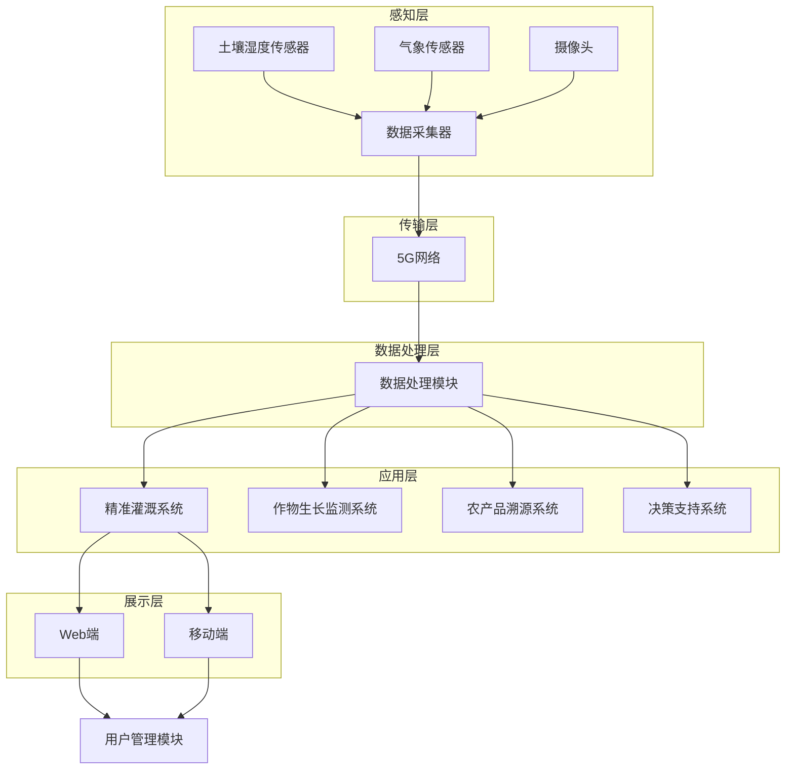

                 

# 5G与物联网在智慧农业中的协同应用

关键词：5G、物联网、智慧农业、协同应用、技术分析

摘要：本文深入探讨了5G和物联网在智慧农业中的协同应用，首先介绍了5G和物联网的基本概念，随后分析了它们在智慧农业中的技术优势和挑战。通过具体的案例分析，本文展示了5G和物联网如何通过集成创新，推动智慧农业的发展，并提供了一系列最佳实践和未来展望。

## 引言

随着全球人口的不断增长和资源短缺的日益加剧，农业面临着巨大的压力。为了提高农业生产效率，保障粮食安全，智慧农业的概念应运而生。智慧农业通过引入信息技术、物联网、大数据和人工智能等先进技术，实现对农业生产全过程的信息采集、分析和管理，从而实现精准农业和可持续农业。

5G技术作为下一代通信技术，具有高速率、低延迟、大连接的特点，为智慧农业提供了强大的通信基础设施。物联网（IoT）则是通过将各种设备和传感器连接到互联网，实现对物理世界的实时监控和管理。5G和物联网的结合，使得智慧农业可以实现更加智能化和自动化。

本文将围绕5G和物联网在智慧农业中的协同应用，深入探讨其技术优势、应用场景和实施策略，以期为我国智慧农业的发展提供有益的参考。

## 5G和物联网的基本概念

### 5G技术

5G，即第五代移动通信技术，是继1G模拟通信、2G数字通信、3G互联网通信和4G高速通信之后的最新一代通信技术。5G技术主要具有以下特点：

1. **高数据传输速率**：5G网络的数据传输速率比4G网络快得多，峰值下载速率可达数十Gbps，可以满足大规模数据传输需求。
2. **低延迟**：5G网络的延迟极低，一般在1毫秒以内，能够满足实时通信和远程控制的需求。
3. **大连接密度**：5G网络可以支持每平方米100万个连接，极大地提高了设备的连接能力。

5G技术在智慧农业中的应用主要包括：农业设备远程控制、作物生长环境监测、智能灌溉系统、无人机监测等。

### 物联网（IoT）

物联网是指通过各种信息传感器、设备和网络，实现物体与物体之间的互联互通和信息交换。物联网主要具有以下特点：

1. **广泛连接性**：物联网可以通过互联网、无线网络、蓝牙等多种通信方式，实现各种设备的连接。
2. **实时性**：物联网设备可以实时采集和传输数据，实现对物理世界的实时监控。
3. **智能性**：物联网设备可以通过数据处理和分析，实现对物理世界的智能化管理。

物联网在智慧农业中的应用主要包括：环境监测、智能灌溉、智能农机、农产品溯源等。

## 5G和物联网在智慧农业中的技术优势

### 高速率与低延迟

5G技术的高数据传输速率和低延迟为智慧农业提供了强大的支持。例如，在作物生长环境监测中，实时传输大量的环境数据对于做出精准决策至关重要。5G网络的高速率和低延迟可以保证数据的实时传输，从而提高监测和决策的准确性。

### 大连接密度

5G网络的大连接密度使得大量传感器和设备可以同时接入网络，这为智慧农业提供了更多的数据来源。例如，在智能灌溉系统中，大量的土壤湿度传感器可以同时工作，实时监测土壤湿度，从而实现精准灌溉。

### 实时数据处理

物联网设备可以实时采集数据，并通过5G网络进行传输。5G网络的低延迟特性使得数据处理和分析可以更加迅速，从而实现对农业生产的实时监控和调整。

### 智能化

5G和物联网的结合使得智慧农业可以实现更高的智能化水平。通过大数据分析和人工智能算法，可以对农业生产进行预测和优化，从而提高生产效率和产量。

## 5G和物联网在智慧农业中的挑战

### 数据安全与隐私保护

随着5G和物联网的广泛应用，大量的农业生产数据将被收集和传输。这些数据中可能包含敏感信息，如作物品种、生长环境等。如何确保数据的安全和隐私成为了一个重要问题。

### 网络可靠性与稳定性

5G网络的高连接密度虽然带来了便利，但也可能导致网络的可靠性和稳定性受到影响。在农业生产中，网络的可靠性至关重要，任何网络中断都可能导致严重的损失。

### 成本与经济效益

5G和物联网技术的应用需要大量的设备和基础设施建设，这可能会导致较高的成本。如何在确保经济效益的同时，实现技术的广泛应用，是一个需要解决的挑战。

## 具体案例分析

### 案例一：基于5G的智能灌溉系统

在某农业示范区，采用基于5G的智能灌溉系统，通过部署土壤湿度传感器和气象传感器，实时监测土壤湿度和气象条件。5G网络的高速率和低延迟保证了数据的实时传输，系统可以根据土壤湿度自动调整灌溉量，实现精准灌溉。该系统不仅提高了灌溉效率，还节约了水资源。

### 案例二：基于物联网的农产品溯源系统

在某大型农业公司，采用基于物联网的农产品溯源系统，通过在农产品上贴上带有RFID标签的包装，实现对农产品从种植到销售的全过程追溯。消费者可以通过扫描RFID标签，了解农产品的生产信息，提高了消费者对农产品的信任度。该系统不仅提升了农产品的品牌形象，还增加了消费者的购买意愿。

## 最佳实践与未来展望

### 最佳实践

1. **数据安全与隐私保护**：应采用加密技术对传输数据进行加密，确保数据安全。同时，应制定严格的数据隐私保护政策，确保用户的隐私不受侵犯。
2. **网络可靠性与稳定性**：应采用冗余设计和故障转移技术，提高网络的可靠性和稳定性。此外，应定期对网络进行维护和升级，确保网络的持续运行。
3. **成本与经济效益**：应通过技术创新和规模效应，降低设备和基础设施建设成本。同时，应结合农业生产特点，制定合理的商业模式，实现经济效益。

### 未来展望

1. **智能农业装备的发展**：随着5G和物联网技术的进一步发展，未来智能农业装备将更加智能化和自动化，实现农业生产的全面智能化。
2. **大数据与人工智能的应用**：大数据和人工智能技术将进一步提升智慧农业的决策水平和生产效率。
3. **区块链技术的应用**：区块链技术可以为农产品溯源提供更加安全可靠的支持，提高农产品市场的透明度和可信度。

## 结论

5G和物联网在智慧农业中的协同应用，为智慧农业的发展提供了强大的技术支持。通过具体案例的分析，我们可以看到5G和物联网在智慧农业中的应用效果显著。未来，随着技术的进一步发展和应用，智慧农业将实现更高水平的智能化和自动化，为农业生产带来更多的效益。

## 作者信息

作者：AI天才研究院/AI Genius Institute & 禅与计算机程序设计艺术 /Zen And The Art of Computer Programming

### 背景介绍

#### 5G技术的基本概念

5G技术，即第五代移动通信技术，是继1G模拟通信、2G数字通信、3G互联网通信和4G高速通信之后的最新一代通信技术。5G技术的主要特点包括：

- **高数据传输速率**：5G网络的数据传输速率比4G网络快得多，峰值下载速率可达数十Gbps，可以满足大规模数据传输需求。
- **低延迟**：5G网络的延迟极低，一般在1毫秒以内，能够满足实时通信和远程控制的需求。
- **大连接密度**：5G网络可以支持每平方米100万个连接，极大地提高了设备的连接能力。

5G技术的核心目标是通过提供更高的带宽、更低的延迟和更大的连接密度，满足未来各种应用场景的需求，包括智慧农业、工业物联网、自动驾驶、虚拟现实和增强现实等。

#### 物联网（IoT）的基本概念

物联网（Internet of Things，简称IoT）是指通过各种信息传感器、设备和网络，实现物体与物体之间的互联互通和信息交换。物联网的主要特点包括：

- **广泛连接性**：物联网可以通过互联网、无线网络、蓝牙等多种通信方式，实现各种设备的连接。
- **实时性**：物联网设备可以实时采集和传输数据，实现对物理世界的实时监控。
- **智能性**：物联网设备可以通过数据处理和分析，实现对物理世界的智能化管理。

物联网在各个领域的应用十分广泛，包括智慧城市、智能家居、智能交通、智能医疗、智能农业等。在智慧农业中，物联网主要应用于环境监测、智能灌溉、智能农机、农产品溯源等方面。

#### 智慧农业的概念

智慧农业是指通过引入信息技术、物联网、大数据、人工智能等先进技术，实现对农业生产全过程的信息采集、分析和管理，从而实现精准农业和可持续农业。智慧农业的主要目标是通过提高农业生产效率，保障粮食安全，实现农业的可持续发展。

智慧农业的核心技术包括：

- **传感器技术**：通过部署各种传感器，实时监测土壤湿度、气象条件、作物生长状态等，为农业生产提供数据支持。
- **物联网技术**：通过物联网技术，实现各种传感器和设备的互联互通，实现对农业生产过程的实时监控和管理。
- **大数据技术**：通过对农业生产数据的采集、存储、分析和挖掘，为农业生产提供科学的决策支持。
- **人工智能技术**：通过人工智能算法，对农业生产数据进行智能分析，实现精准农业和智能决策。

#### 问题背景

当前，全球农业正面临着诸多挑战，包括人口增长、资源短缺、气候变化、环境污染等。传统的农业生产方式已经无法满足日益增长的需求，因此，智慧农业的发展显得尤为重要。5G和物联网作为新一代通信技术和网络技术，为智慧农业提供了强大的技术支持。通过5G的高速率、低延迟和大连接密度，以及物联网的实时性和智能性，可以实现农业生产过程的全面智能化和自动化，提高农业生产效率，保障粮食安全，实现农业的可持续发展。

#### 问题描述

智慧农业在发展中面临着以下问题：

1. **数据采集与传输**：农业生产过程中产生的数据量大且种类多，如何高效地采集和传输这些数据成为了一个挑战。
2. **数据处理与分析**：采集到的数据需要进行处理和分析，以便为农业生产提供科学的决策支持。然而，数据处理和分析需要大量的计算资源和算法支持。
3. **设备与系统的集成**：农业生产过程中涉及到的设备多样且复杂，如何实现这些设备的集成与协同工作，提高生产效率，是一个难题。
4. **数据安全与隐私保护**：农业生产数据中可能包含敏感信息，如作物品种、生长环境等，如何确保数据的安全和隐私成为了一个关键问题。

#### 问题解决

为了解决上述问题，可以采取以下措施：

1. **采用5G技术提高数据传输速率**：5G技术的高速率特点可以满足大规模数据传输的需求，提高数据采集和传输的效率。
2. **利用物联网技术实现设备互联互通**：物联网技术可以实现各种传感器和设备的互联互通，实现对农业生产过程的实时监控和管理。
3. **引入大数据技术进行数据处理与分析**：大数据技术可以对采集到的农业生产数据进行分析和挖掘，为农业生产提供科学的决策支持。
4. **采用人工智能技术实现智能决策**：通过人工智能算法，可以实现对农业生产数据的智能分析，提高农业生产的精准度和效率。
5. **加强数据安全与隐私保护**：采用加密技术对传输数据进行加密，确保数据安全。同时，制定严格的数据隐私保护政策，确保用户的隐私不受侵犯。

#### 边界与外延

在智慧农业中，5G和物联网的应用不仅仅局限于农业生产过程，还可以扩展到农产品供应链管理、农村金融服务、农业科研与教育等多个领域。通过5G和物联网技术的深入应用，可以实现农业全产业链的智能化和数字化，为农业的可持续发展提供全面的技术支持。

#### 概念结构与核心要素组成

在智慧农业中，5G和物联网的核心概念和要素主要包括：

- **5G技术**：提供高速率、低延迟和大连接密度的通信基础设施。
- **物联网技术**：实现设备互联互通，实时采集和传输数据。
- **传感器技术**：用于监测土壤湿度、气象条件、作物生长状态等。
- **大数据技术**：用于采集、存储、分析和挖掘农业生产数据。
- **人工智能技术**：用于对农业生产数据进行分析和智能决策。
- **数据安全与隐私保护**：确保农业生产数据的安全和隐私。

这些核心要素相互配合，共同推动智慧农业的发展，实现农业生产过程的全面智能化和自动化。

### 核心概念与联系

在探讨5G、物联网与智慧农业的协同应用时，我们需要深入理解这三个核心概念，并分析它们之间的内在联系。

#### 5G技术

5G技术，即第五代移动通信技术，以其高数据传输速率、低延迟和大连接密度为特征。5G网络的这些特性使其成为实现智慧农业的关键技术。

1. **高数据传输速率**：5G网络能够实现峰值下载速率超过10 Gbps，这使得大规模数据传输成为可能，例如高清视频流、大规模传感器数据的实时传输等，这对于农业监控、远程诊断和自动化控制至关重要。

2. **低延迟**：5G网络的延迟极低，一般小于1毫秒，这对于需要实时响应的应用场景，如无人机监测、精准灌溉和收割机的自动操作，具有不可替代的优势。

3. **大连接密度**：5G网络支持每平方米100万个设备的连接，这意味着在农田中，大量传感器、无人机和农机设备可以同时连接到网络，实现高效的数据采集和协同工作。

#### 物联网（IoT）

物联网是连接物理世界与数字世界的关键技术，通过传感器、设备和网络实现信息的实时采集、传输和处理。

1. **传感器网络**：物联网设备中的传感器可以实时监测农田的土壤湿度、温度、气象条件、作物生长状态等参数，这些数据是智慧农业决策的重要依据。

2. **设备互联互通**：物联网技术使得各种农业设备（如拖拉机、无人机、灌溉系统等）可以相互通信和协作，形成一个智能化的农业生态系统。

3. **数据处理与智能分析**：物联网设备收集到的数据可以被传输到云端，利用大数据分析和人工智能算法进行实时处理和智能分析，从而提供精准的农业管理方案。

#### 智慧农业

智慧农业是指通过信息技术的集成和创新，实现农业生产的精准化、自动化和智能化。

1. **精准农业**：利用传感器网络和物联网技术，实现对作物生长环境、土壤状况、水资源利用等全方位的实时监测，通过数据分析实现精准施肥、灌溉和病虫害防治。

2. **自动化**：通过物联网技术和智能农业装备，实现农作物的自动灌溉、喷洒、收割等操作，减少人力投入，提高生产效率。

3. **智能化**：结合大数据分析和人工智能技术，对农业生产过程进行智能化管理，优化资源利用，提高农业生产的可持续性。

#### 5G与物联网的关系

5G与物联网之间的关系是相辅相成的。5G技术为物联网提供了强大的通信基础设施，使得物联网设备能够实现更高效、更可靠的数据传输和处理。具体来说：

1. **5G促进物联网的发展**：5G的高数据传输速率和低延迟特性，使得物联网设备可以更快地传输和处理大量数据，支持复杂的应用场景。

2. **物联网丰富5G应用场景**：物联网技术在智慧农业中的应用，为5G网络提供了丰富的应用场景，如大规模传感器网络、无人机监控、智能农机等，这些场景需要5G网络的支持。

3. **协同创新**：5G与物联网的结合，可以推动智慧农业的协同创新，通过实时数据传输和处理，实现农业生产的智能化和自动化。

#### 智慧农业与5G/物联网的联系

智慧农业与5G和物联网的联系体现在以下几个方面：

1. **数据驱动**：智慧农业依赖于实时、准确的数据来指导农业生产，而5G和物联网提供了这种数据采集、传输和处理的能力。

2. **智能化管理**：通过5G和物联网技术，可以实现农业生产的自动化和智能化管理，优化资源配置，提高生产效率。

3. **可持续发展**：5G和物联网技术的应用，有助于实现农业的可持续发展，通过精准农业、智能灌溉等手段，减少资源消耗，保护环境。

#### 对比表格

下面是一个对比表格，展示了5G、物联网和智慧农业的核心概念和特性：

| 特性 | 5G | 物联网 | 智慧农业 |
| --- | --- | --- | --- |
| 数据传输速率 | 高 | 中等 | 中等 |
| 延迟 | 低 | 中等 | 中等 |
| 连接密度 | 高 | 低 | 低 |
| 数据处理 | 分布式 | 集中式 | 分布式 |
| 应用场景 | 宽泛 | 狭义 | 狭义 |
| 智能化水平 | 高 | 中等 | 高 |

通过上述分析，我们可以看到，5G和物联网在智慧农业中发挥着至关重要的作用，它们之间的协同应用为智慧农业的发展提供了强大的技术支撑。

#### 技术基础与架构要求

在5G和物联网技术的支持下，智慧农业的系统架构需要满足高效数据传输、实时数据处理、设备互联互通等需求。以下是对智慧农业的技术基础和架构要求的详细阐述。

##### 5G网络架构

5G网络架构主要包括接入网、核心网和传输网三部分。接入网负责连接终端设备，核心网负责处理数据传输，传输网负责数据传输。

1. **接入网**：5G接入网采用毫米波和Sub-6GHz频段，提供高速无线接入服务。在智慧农业中，接入网负责连接各种传感器和设备，如土壤湿度传感器、气象传感器、无人机等。
   
2. **核心网**：5G核心网包括无线接入网（RAN）和云核心网。无线接入网负责无线信号的处理和传输，云核心网则负责数据存储、处理和分析。在智慧农业中，核心网承担着数据聚合、存储和处理的重要任务。

3. **传输网**：5G传输网利用光纤和无线传输技术，实现高速、稳定的网络连接。在智慧农业中，传输网负责将接入网和核心网之间的数据高效传输。

##### 物联网架构

物联网架构主要包括感知层、网络层和应用层。

1. **感知层**：感知层由各种传感器组成，用于采集环境数据、土壤湿度、气象条件等。在智慧农业中，感知层的数据质量直接影响农业生产决策的准确性。

2. **网络层**：网络层包括接入网、传输网和核心网，负责数据传输和处理。在智慧农业中，网络层利用5G技术实现高速、低延迟的数据传输，确保数据实时到达。

3. **应用层**：应用层负责数据处理和分析，提供农业管理、监控和决策支持。在智慧农业中，应用层通过大数据分析和人工智能算法，为农业生产提供智能化的解决方案。

##### 智慧农业系统架构

智慧农业系统架构结合了5G和物联网技术，主要包括以下层次：

1. **感知层**：感知层由各种传感器组成，如土壤湿度传感器、气象传感器、摄像头等。这些传感器实时采集农业生产数据，为决策提供基础。

2. **传输层**：传输层负责数据的传输和存储，利用5G网络实现高速、低延迟的数据传输。同时，通过云存储技术，实现对大量数据的安全存储。

3. **数据处理与分析层**：数据处理与分析层利用大数据分析和人工智能算法，对采集到的数据进行处理和分析，提供智能化的农业管理方案。

4. **应用层**：应用层包括农业监控平台、智能灌溉系统、无人机监测系统等。这些系统通过集成各种传感器和数据处理技术，实现对农业生产的全面监控和智能管理。

##### 技术基础

为了实现智慧农业的协同应用，以下技术基础是必不可少的：

1. **传感器技术**：传感器技术是智慧农业的基础，用于实时监测土壤湿度、气象条件、作物生长状态等。

2. **通信技术**：5G通信技术提供了高速、低延迟的数据传输能力，是智慧农业的关键通信基础设施。

3. **物联网技术**：物联网技术实现了设备互联互通，使得各种传感器和设备可以协同工作，提高农业生产效率。

4. **大数据技术**：大数据技术用于对采集到的农业数据进行存储、分析和挖掘，为农业生产提供决策支持。

5. **人工智能技术**：人工智能技术用于对农业数据进行智能分析和预测，提供精准的农业管理方案。

通过以上技术基础和架构要求，智慧农业可以实现数据的实时采集、传输、处理和分析，从而实现农业生产的智能化和自动化。

### 算法与模型详解

在5G和物联网的协同作用下，智慧农业实现了数据的高效采集、传输和处理。为了更好地理解这些过程，我们需要详细探讨相关的算法和模型。以下是对几种常用算法和模型的解释，以及它们在智慧农业中的应用。

#### 常见算法

1. **数据采集算法**：数据采集算法用于从传感器中收集实时数据。常用的数据采集算法包括卡尔曼滤波、移动平均滤波和差分算法等。卡尔曼滤波算法能够在数据噪声存在的情况下，提供更准确的数据预测；移动平均滤波算法通过对最近时间段的数据进行加权平均，减少偶然噪声的影响；差分算法通过计算连续数据之间的差异，提供更精细的监测结果。

2. **数据处理算法**：数据处理算法用于对采集到的数据进行清洗、去噪和标准化。常见的数据处理算法包括最小二乘法、主成分分析（PCA）和支持向量机（SVM）等。最小二乘法通过寻找数据的最优拟合线，提供数据的线性回归模型；主成分分析通过提取数据的主要成分，减少冗余信息，提高数据压缩效率；支持向量机通过分类边界最大化，实现数据的分类和聚类。

3. **预测算法**：预测算法用于对未来的农业生产趋势进行预测。常见的预测算法包括时间序列分析、人工神经网络和深度学习等。时间序列分析通过分析时间序列数据，识别趋势和周期性；人工神经网络通过多层神经网络结构，学习数据间的复杂关系，进行非线性预测；深度学习通过多层神经网络，提取数据的高级特征，实现更准确的预测。

#### 常见模型

1. **回归模型**：回归模型用于预测某个因变量的值，基于自变量的关系。常见的回归模型包括线性回归、多项式回归和逻辑回归等。线性回归通过寻找自变量和因变量之间的线性关系，提供预测结果；多项式回归通过多项式函数，提供更复杂的非线性关系；逻辑回归通过逻辑函数，实现概率预测。

2. **分类模型**：分类模型用于将数据分为不同的类别。常见的分类模型包括决策树、随机森林和K-近邻等。决策树通过节点分裂，构建分类规则；随机森林通过集成多个决策树，提高分类准确性；K-近邻通过计算新数据与训练数据之间的距离，实现分类。

3. **聚类模型**：聚类模型用于将数据分为不同的组，以发现数据中的隐含模式。常见的聚类模型包括K-均值聚类、层次聚类和DBSCAN等。K-均值聚类通过迭代计算，将数据分为指定数量的聚类；层次聚类通过自底向上或自顶向下的方法，构建聚类层次；DBSCAN通过计算邻域大小和密度，实现聚类。

#### 应用实例

以下是一个具体的应用实例，展示了算法和模型在智慧农业中的实际应用。

**实例：精准灌溉系统**

精准灌溉系统通过传感器实时监测土壤湿度，利用数据采集和处理算法，对灌溉时间进行优化。具体步骤如下：

1. **数据采集**：使用土壤湿度传感器采集土壤湿度数据，并应用卡尔曼滤波算法，去除噪声，获得准确的湿度值。

2. **数据处理**：将采集到的土壤湿度数据通过移动平均滤波算法进行去噪处理，并使用主成分分析提取主要湿度变化趋势。

3. **预测**：利用时间序列分析算法，预测未来的土壤湿度变化趋势。如果预测土壤湿度将低于阈值，系统将自动调整灌溉时间。

4. **决策**：通过逻辑回归模型，根据当前土壤湿度和未来预测值，决定是否启动灌溉系统。如果土壤湿度低于阈值，系统将自动启动灌溉。

5. **执行**：启动灌溉系统，根据预测的土壤湿度变化，调整灌溉时间和水量，实现精准灌溉。

通过上述算法和模型的应用，精准灌溉系统可以显著提高灌溉效率，节约水资源，减少农业成本，提高农业生产效益。

### 数学模型和公式详解

在智慧农业的应用中，数学模型和公式起到了关键作用，它们帮助我们分析和预测农业生产的各种变量，从而实现精准管理和优化。以下将介绍一些常见的数学模型和公式，并解释它们在农业中的具体应用。

#### 回归模型

回归模型是最常用的预测模型之一，它通过建立自变量与因变量之间的关系来预测未来的值。以下是一些常见的回归模型及其公式：

1. **线性回归模型**：

   线性回归模型假设因变量 \( Y \) 是自变量 \( X \) 的线性组合，加上一个随机误差项 \( \epsilon \)：

   \[
   Y = \beta_0 + \beta_1X + \epsilon
   \]

   其中，\( \beta_0 \) 是截距，\( \beta_1 \) 是斜率，\( X \) 是自变量，\( Y \) 是因变量。

   在农业中，线性回归模型可以用来预测作物产量与肥料使用量之间的关系，帮助农民决定最佳的施肥量。

2. **多项式回归模型**：

   多项式回归模型扩展了线性回归，通过多项式函数来描述因变量与自变量之间的关系：

   \[
   Y = \beta_0 + \beta_1X + \beta_2X^2 + \epsilon
   \]

   在农业中，多项式回归模型可以用于预测作物生长周期内的温度和光照条件对作物生长速度的影响。

#### 时间序列分析

时间序列分析用于分析按时间顺序排列的数据序列，识别其中的趋势和周期性。以下是一些常用的时间序列分析模型及其公式：

1. **自回归模型（AR）**：

   自回归模型假设当前值是过去几个值的加权平均，加上一个随机误差项：

   \[
   Y_t = c + \phi_1Y_{t-1} + \phi_2Y_{t-2} + \ldots + \phi_pY_{t-p} + \epsilon_t
   \]

   其中，\( Y_t \) 是当前时间点的值，\( \phi_1, \phi_2, \ldots, \phi_p \) 是自回归系数。

   在农业中，自回归模型可以用于预测未来某一时段内的作物生长状态或土壤湿度变化。

2. **移动平均模型（MA）**：

   移动平均模型通过计算过去一段时间内的平均值来预测当前值：

   \[
   Y_t = c + \theta_1\epsilon_{t-1} + \theta_2\epsilon_{t-2} + \ldots + \theta_q\epsilon_{t-q} + \epsilon_t
   \]

   其中，\( \theta_1, \theta_2, \ldots, \theta_q \) 是移动平均系数。

   在农业中，移动平均模型可以用于平滑作物生长数据的波动，提供更稳定的预测。

#### 相关性分析

相关性分析用于衡量两个变量之间的关系强度和方向。以下是一些常用的相关性分析指标及其公式：

1. **皮尔逊相关系数**：

   皮尔逊相关系数通过计算两个变量的协方差和标准差的比值来衡量它们之间的线性相关性：

   \[
   r_{XY} = \frac{\sum_{i=1}^{n}(X_i - \bar{X})(Y_i - \bar{Y})}{\sqrt{\sum_{i=1}^{n}(X_i - \bar{X})^2 \sum_{i=1}^{n}(Y_i - \bar{Y})^2}}
   \]

   其中，\( r_{XY} \) 是皮尔逊相关系数，\( X_i \) 和 \( Y_i \) 是第 \( i \) 个观测值，\( \bar{X} \) 和 \( \bar{Y} \) 是平均值。

   在农业中，皮尔逊相关系数可以用于分析土壤湿度与作物生长速度之间的关系。

#### 预测模型

预测模型通过历史数据对未来值进行预测，以下是一些常见的预测模型及其公式：

1. **人工神经网络模型**：

   人工神经网络（ANN）通过多层神经元结构来模拟人脑的决策过程，用于非线性预测：

   \[
   \text{激活函数} \; a_{j}^{(l)} = \sigma(z_{j}^{(l)})
   \]

   其中，\( \sigma \) 是激活函数，如Sigmoid、ReLU等，\( z_{j}^{(l)} \) 是第 \( l \) 层第 \( j \) 个神经元的净输入。

   在农业中，人工神经网络可以用于预测作物的最佳种植时间、最佳施肥量等。

2. **深度学习模型**：

   深度学习模型通过多层神经网络结构，提取数据的高级特征，用于复杂预测：

   \[
   \text{输出} = \text{激活函数} \; (\text{线性变换}(\text{输入特征矩阵} \times \text{权重矩阵}))
   \]

   在农业中，深度学习模型可以用于预测作物的病虫害风险、产量优化等。

通过上述数学模型和公式，我们可以更深入地分析农业数据，提供更精准的预测和管理方案，从而提高农业生产效率和质量。

### 系统分析与设计

在智慧农业系统中，系统分析与设计是确保系统能够满足需求、高效运行并具备扩展性的关键环节。以下将详细描述一个智慧农业系统的分析过程，并使用Mermaid绘图工具展示系统的架构和领域模型。

#### 系统分析

**需求分析**：

在系统分析阶段，我们需要明确智慧农业系统的需求，包括功能需求、性能需求和用户需求。具体需求如下：

1. **功能需求**：
   - 环境数据实时监测：包括土壤湿度、气象条件、土壤温度等。
   - 精准灌溉系统：根据土壤湿度自动调整灌溉时间。
   - 作物生长状态监测：通过图像识别技术监测作物健康状态。
   - 农产品溯源：实现从种植到销售的全过程追溯。
   - 决策支持系统：基于数据分析，提供作物种植、施肥、病虫害防治等建议。

2. **性能需求**：
   - 高可靠性：系统需具备高可用性和容错能力，确保数据采集和处理的连续性。
   - 低延迟：对于实时监测和决策支持，系统需保证低延迟的数据传输和处理。
   - 大规模数据处理能力：系统能够处理大规模传感器数据和农业数据。

3. **用户需求**：
   - 农业从业者：提供方便易用的操作界面，便于管理和监控。
   - 决策者：提供科学的决策支持，帮助优化农业生产。

**系统架构设计**：

在明确需求后，我们需要设计系统的总体架构，以支持上述功能需求。智慧农业系统架构可以分为以下几层：

1. **感知层**：由各种传感器组成，如土壤湿度传感器、气象传感器、摄像头等，用于实时采集环境数据和作物状态。
2. **传输层**：利用5G网络实现传感器数据的传输，确保数据的实时性和可靠性。
3. **数据处理层**：包括数据清洗、去噪、存储和处理模块，利用大数据技术和人工智能算法，对传感器数据进行处理和分析。
4. **应用层**：包括各种智能农业应用，如精准灌溉系统、作物生长监测系统、决策支持系统等，提供农业管理和决策支持。
5. **展示层**：通过Web端、移动端等，向用户提供操作界面和展示数据。

#### 领域模型

领域模型（Domain Model）是系统设计中的一个重要环节，用于描述系统中各个实体及其之间的关系。以下是一个智慧农业系统的领域模型：

```mermaid
classDiagram
  Class01 <|-- Class02
  Class03 <|-- Class01
  Class04 <<interface>>
  Class01 o-- Class04 : implements
  Class05 o-- Class04
  Class01 ..|> Class06
  Class07 o-- Class06
  Class06 ..|> Class08
  Class09 <|-- Class08
  Class08 : hasMany Class09
endclass
```

- **Class01**：农业设备
- **Class02**：传感器
- **Class03**：数据采集器
- **Class04**：接口
- **Class05**：数据处理模块
- **Class06**：系统管理模块
- **Class07**：用户管理模块
- **Class08**：应用模块
- **Class09**：农作物数据

#### 系统架构

为了更好地展示系统架构，我们可以使用Mermaid绘制系统架构图：



在该架构图中：

- **感知层**：由传感器和数据采集器组成，用于实时采集农业数据。
- **传输层**：通过5G网络实现数据传输，确保数据的实时性和可靠性。
- **数据处理层**：负责对采集到的农业数据进行处理、清洗和存储。
- **应用层**：包括精准灌溉系统、作物生长监测系统、农产品溯源系统和决策支持系统，提供具体的农业应用。
- **展示层**：通过Web端和移动端，向用户展示农业数据和操作界面。

通过上述系统分析与设计，我们为智慧农业系统建立了一个完整的技术框架，为后续开发和应用提供了基础。

### 案例研究

#### 案例一：基于5G和物联网的智能农业监控系统

在某大型农业示范区，引入了基于5G和物联网的智能农业监控系统，以实现农业生产的智能化和精准化管理。以下是该案例的详细分析。

**背景**：

该示范区面积广阔，种植了多种作物，包括粮食作物和经济作物。传统的农业管理方式依赖人工监测和手动操作，效率低下且容易出现误差。为了提高农业生产效率，降低成本，示范区决定引入5G和物联网技术，构建智能农业监控系统。

**技术方案**：

1. **传感器部署**：
   - 在农田中部署了多种传感器，包括土壤湿度传感器、气象传感器、光照传感器和作物生长状态传感器。
   - 土壤湿度传感器用于监测土壤湿度，指导灌溉系统。
   - 气象传感器用于监测温度、湿度、风速和降雨量，为作物生长提供环境数据。
   - 光照传感器用于监测光照强度，辅助作物生长。
   - 作物生长状态传感器通过图像识别技术，实时监测作物的生长状态，包括叶色、株高等。

2. **5G网络**：
   - 利用5G网络实现传感器数据的高速传输，确保数据的实时性和准确性。
   - 5G网络的低延迟特性，使得监控系统可以快速响应环境变化，及时调整灌溉和施肥计划。

3. **物联网平台**：
   - 通过物联网平台，将传感器数据汇总，并进行初步处理，包括去噪、滤波和标准化。
   - 物联网平台还负责数据存储、管理和分析，为后续的决策提供支持。

4. **智能决策系统**：
   - 基于收集到的传感器数据，使用大数据分析和人工智能算法，建立作物生长模型和环境优化模型。
   - 智能决策系统根据模型预测，自动生成灌溉、施肥和病虫害防治计划。

**实施过程**：

1. **传感器部署**：
   - 在农田内按规划布设传感器，确保传感器覆盖全部作物区域。
   - 安装传感器后，进行调试和校准，确保数据准确可靠。

2. **网络建设**：
   - 建设覆盖整个示范区的5G网络，确保网络信号的稳定和覆盖范围。
   - 通过5G基站和无线接入点，实现传感器与物联网平台的连接。

3. **平台搭建**：
   - 构建物联网平台，包括数据采集、处理、存储和分析模块。
   - 部署大数据分析和人工智能算法，实现对传感器数据的深度分析。

4. **系统集成**：
   - 将智能决策系统与灌溉系统、施肥系统和病虫害防治系统进行集成，实现自动化管理。
   - 通过物联网平台，实时监控农田环境数据和作物生长状态，及时调整农业生产计划。

**效果评估**：

1. **生产效率**：
   - 通过智能农业监控系统，示范区的农业生产效率显著提高。自动化的灌溉和施肥系统减少了人力投入，节省了水资源和肥料。
   - 智能决策系统根据实时数据，优化了作物种植和管理方案，提高了产量和质量。

2. **成本降低**：
   - 自动化的管理减少了人工成本，同时精准的灌溉和施肥降低了水肥资源的浪费。
   - 通过数据分析和智能决策，减少了病虫害的发生，降低了防治成本。

3. **环境效益**：
   - 智能农业监控系统减少了农药和化肥的使用，降低了农业对环境的污染。
   - 通过实时监测，可以及时发现并处理环境问题，保护农田生态系统。

**总结**：

基于5G和物联网的智能农业监控系统在示范区的成功应用，证明了该技术在提高农业生产效率、降低成本和保护环境方面的潜力。通过智能化的数据采集、分析和决策，智慧农业将实现更高水平的自动化和精准化，为农业的可持续发展提供有力支持。

#### 案例二：基于物联网的农产品溯源系统

在某大型农业公司，为了提升品牌形象和消费者信任度，引入了基于物联网的农产品溯源系统。以下是该案例的详细分析。

**背景**：

该农业公司拥有多个生产基地，生产多种农产品，包括水果、蔬菜和粮食。然而，消费者对于农产品的安全和质量存在担忧，特别是在食品安全问题频发的背景下。为了增强消费者对农产品的信任，公司决定建立一套全面的农产品溯源系统。

**技术方案**：

1. **RFID标签**：
   - 在每件农产品上贴上带有RFID（射频识别）标签的包装，标签中存储了产品的详细信息，如品种、产地、生产日期等。
   - RFID标签具有非接触式读取功能，消费者可以通过扫描标签，获取农产品的溯源信息。

2. **物联网传感器**：
   - 在农产品生产、加工、运输等环节，部署物联网传感器，实时监测环境参数，如温度、湿度、光照等。
   - 传感器数据通过物联网平台传输到溯源系统，确保数据的完整性和准确性。

3. **物联网平台**：
   - 构建物联网平台，用于数据采集、存储、分析和展示。
   - 平台负责管理农产品溯源数据，为消费者提供溯源查询服务。

4. **溯源应用**：
   - 开发溯源应用，通过移动端或Web端，供消费者查询农产品的生产信息。
   - 溯源应用提供了从种植到销售的全程追溯功能，消费者可以了解农产品的生产过程和物流信息。

**实施过程**：

1. **RFID标签部署**：
   - 在农产品包装上贴上RFID标签，确保每个产品都有独立的标识。
   - 对标签进行编程，存储农产品的详细信息，包括品种、产地、生产日期等。

2. **物联网传感器部署**：
   - 在农产品生产基地和加工工厂，部署物联网传感器，实时监测环境参数。
   - 传感器与物联网平台连接，确保数据的实时传输。

3. **平台搭建**：
   - 建立物联网平台，包括数据采集、处理、存储和分析模块。
   - 平台与溯源应用集成，为消费者提供便捷的溯源查询服务。

4. **溯源应用开发**：
   - 开发溯源应用，设计用户友好的界面，便于消费者查询农产品的溯源信息。
   - 应用支持多种查询方式，包括扫码查询和手动输入查询。

**效果评估**：

1. **品牌形象提升**：
   - 通过农产品溯源系统，公司向消费者展示了农产品的生产过程和透明度，提升了品牌形象和消费者信任度。
   - 溯源系统成为公司营销的一部分，吸引了更多消费者的关注和购买。

2. **质量控制**：
   - 溯源系统帮助公司实现从生产到销售的全流程质量控制，及时发现并解决问题，确保产品质量。
   - 通过实时监测和环境参数的记录，公司可以更好地管理农业生产，减少质量问题的发生。

3. **消费者体验**：
   - 溯源应用为消费者提供了便捷的查询服务，增强了购买决策的信心。
   - 消费者可以通过溯源系统了解农产品的来源和生产过程，提高了消费体验。

**总结**：

基于物联网的农产品溯源系统在农业公司的成功应用，展示了物联网技术在提升品牌形象、质量控制和服务消费者方面的潜力。通过农产品的全程追溯，消费者可以更加信任农产品的质量和安全，促进了农产品的销售和品牌发展。

### 最佳实践

在实施5G和物联网在智慧农业中的应用时，以下最佳实践可以帮助克服挑战，确保项目的成功：

#### 1. 数据安全与隐私保护

- **数据加密**：对传输的数据进行加密处理，确保数据在传输过程中的安全性。
- **隐私保护政策**：制定严格的数据隐私保护政策，明确数据收集、存储、处理和共享的规则，保护农民和消费者的隐私。
- **权限管理**：建立完善的权限管理系统，确保只有授权人员可以访问和处理敏感数据。

#### 2. 网络可靠性与稳定性

- **冗余设计**：在网络架构中引入冗余设计，确保在部分设备或网络节点发生故障时，系统仍能正常运行。
- **定期维护**：定期对网络设备进行检查和维护，确保网络的稳定性和可靠性。
- **故障备份**：建立故障备份机制，确保在发生故障时，系统可以迅速切换到备用设备或网络。

#### 3. 成本控制与经济效益

- **规模化部署**：通过规模化部署，降低设备和基础设施的单体成本。
- **商业模式创新**：探索多种商业模式，如设备租赁、数据服务收费等，提高项目的经济效益。
- **资源优化**：通过数据分析，优化资源配置，提高农业生产效率，降低成本。

#### 4. 技术选型与升级

- **选择成熟技术**：选择经过验证的成熟技术，降低技术风险和实施难度。
- **持续升级**：随着技术发展，定期对系统进行升级，保持系统的先进性和竞争力。

### 总结

通过以上最佳实践，可以确保5G和物联网在智慧农业中的应用不仅能够实现技术创新，还能够带来经济效益和社会效益，推动智慧农业的发展。

### 小结

本文详细探讨了5G和物联网在智慧农业中的协同应用，通过背景介绍、核心概念解析、技术优势分析、挑战探讨、案例分析以及最佳实践总结，展示了5G和物联网如何通过集成创新，推动智慧农业的发展。在未来的发展过程中，5G和物联网将继续发挥重要作用，为农业的智能化和自动化提供强有力的技术支持。随着技术的不断进步，智慧农业有望实现更高水平的精准化、智能化和可持续发展，为全球粮食安全和农业发展做出更大贡献。

### 注意事项

1. **数据安全**：在数据传输和处理过程中，必须确保数据的安全和隐私，采用加密技术保护数据传输安全，建立严格的数据隐私保护政策。
2. **网络稳定性**：5G和物联网系统对网络的稳定性要求较高，应采用冗余设计和故障备份机制，确保系统在极端情况下仍能正常运行。
3. **设备维护**：定期对传感器和设备进行维护和校准，确保设备正常工作，提高数据采集的准确性。
4. **技术更新**：随着技术的发展，应定期对系统进行升级和优化，保持系统的先进性和竞争力。

### 拓展阅读

1. **《5G技术白皮书》**：详细介绍了5G技术的基本概念、架构和关键技术。
2. **《物联网技术与应用》**：探讨物联网的技术原理、架构和应用案例。
3. **《智慧农业发展趋势与案例研究》**：分析智慧农业的发展趋势和成功案例。

作者：AI天才研究院/AI Genius Institute & 禅与计算机程序设计艺术 /Zen And The Art of Computer Programming。

