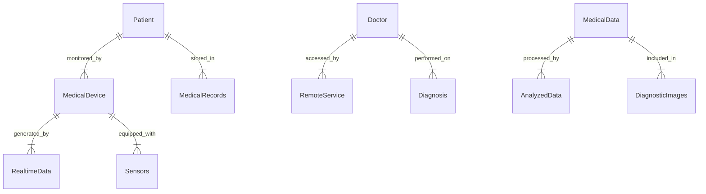
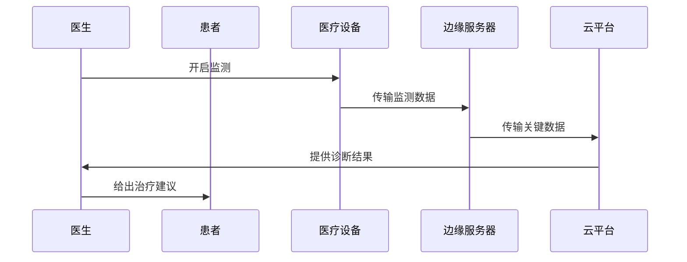
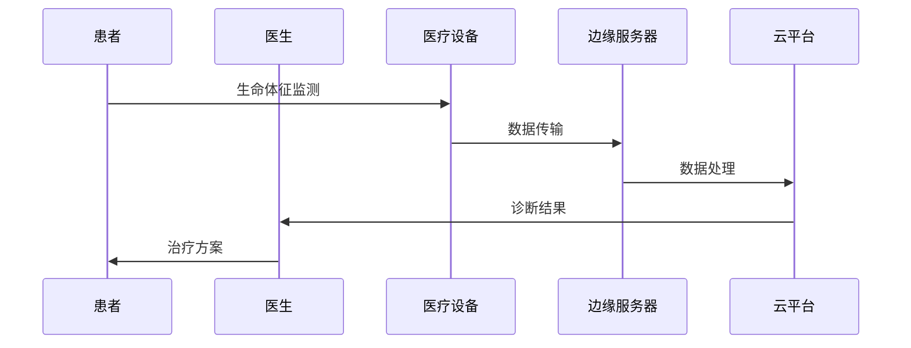
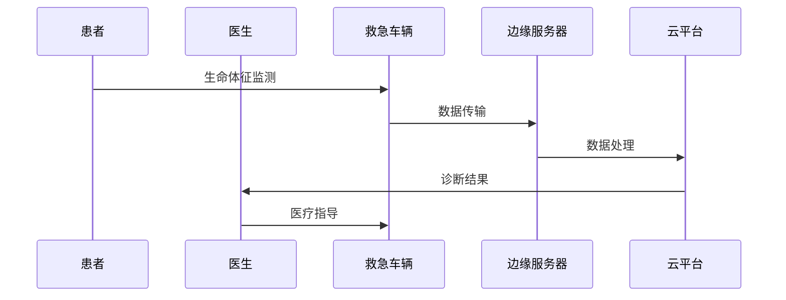

                 

# 5G与边缘计算在智慧医疗中的协同效应

## 关键词
- 5G技术
- 边缘计算
- 智慧医疗
- 协同效应
- 实时数据处理
- 远程监控
- 遥测医疗

## 摘要
本文探讨了5G技术和边缘计算在智慧医疗领域的协同效应。通过分析5G技术的关键特性及其在医疗行业的应用，结合边缘计算的原理和优势，本文揭示了这两种技术如何共同推动智慧医疗的发展。文章首先介绍了5G技术和边缘计算的基本概念，随后探讨了它们在解决智慧医疗面临挑战中的潜力。接着，文章通过实际案例展示了5G和边缘计算在实时数据处理、远程监控和远程医疗等应用中的协同效应。最后，本文提出了未来发展趋势和实施建议，为智慧医疗的发展提供了方向。

## 引言与背景

### 5G技术的背景

5G，即第五代移动通信技术，是继4G之后的新一代移动通信技术标准。自2019年正式商用以来，5G技术在全球范围内迅速推广，其高速率、低延迟和高可靠性的特点，为各行各业的数字化转型提供了强大的技术支持。5G的推出不仅提升了数据传输速度，还实现了更大规模的连接，这对于资源密集型的行业，如医疗，尤为重要。

在医疗领域，5G技术的重要性主要体现在以下几个方面：

1. **远程医疗**：5G的低延迟特性使得远程手术、远程诊断等应用成为可能，医生可以通过高速网络实时与患者进行交互，提供高质量的医疗服务。
2. **实时数据传输**：5G的高速传输能力使得医疗设备能够实时传输大量数据，例如影像数据、生物传感器数据等，从而实现快速诊断和治疗。
3. **医疗数据分析**：5G技术支持大规模数据传输，有助于医疗机构进行数据分析和挖掘，提高医疗服务的精准度和效率。

### 边缘计算的背景

边缘计算是一种分布式计算架构，它将数据处理和存储能力推向网络的边缘，即靠近数据源的地方。与传统的集中式云计算相比，边缘计算具有以下优势：

1. **低延迟**：由于数据处理靠近数据源，边缘计算能够显著降低数据传输延迟，这对于需要实时响应的医疗应用尤为重要。
2. **高可靠性**：边缘计算通过分布式架构提高了系统的可靠性，即使某些节点发生故障，也不会影响整体系统的运行。
3. **节省带宽**：通过在边缘节点进行数据处理，边缘计算可以减少需要传输到云的数据量，从而节省网络带宽。

在医疗领域，边缘计算的应用主要体现在以下几个方面：

1. **实时监控**：边缘计算能够对医疗设备产生的数据进行实时处理和分析，例如，对于重症监护室中的患者，边缘计算可以实时监测生命体征，提供即时预警。
2. **影像诊断**：对于医学影像数据的处理，边缘计算可以在本地快速进行图像分析，提供诊断结果，减少对云服务的依赖。
3. **智能医疗设备**：边缘计算可以支持智能医疗设备的自主运行，例如，智能手术机器人可以在本地进行数据处理和决策，提高手术的准确性和安全性。

### 5G与边缘计算在智慧医疗中的协同作用

5G和边缘计算在智慧医疗中具有显著的协同效应。5G的高速网络为边缘计算提供了稳定的数据传输通道，而边缘计算则为5G带来了更高效的数据处理能力。两者结合，可以大幅提升智慧医疗的服务质量和效率。

具体来说，5G和边缘计算的协同效应体现在以下几个方面：

1. **实时数据处理**：5G的高带宽和边缘计算的实时处理能力，使得医疗数据可以迅速传输到边缘节点进行处理，从而实现实时监控和快速响应。
2. **智能诊断**：通过边缘计算，医疗设备可以在本地进行初步数据分析，将关键信息实时传输给医生，提高诊断的准确性和效率。
3. **远程手术**：5G的低延迟特性使得远程手术成为可能，医生可以通过5G网络实时控制手术机器人，实现远程手术的精准操作。
4. **数据共享**：5G和边缘计算的结合，使得医疗数据可以在不同机构之间快速共享，从而实现医疗资源的优化配置。

### 目标与结构

本文的目标是深入探讨5G技术和边缘计算在智慧医疗中的协同效应，分析其应用场景和实际案例，并提出未来发展的方向。文章结构如下：

1. **第一章**：引言与背景，介绍5G技术和边缘计算的基本概念及其在智慧医疗中的应用。
2. **第二章**：核心概念与联系，详细探讨5G技术和边缘计算的核心原理、特性及其在医疗领域的应用。
3. **第三章**：5G与边缘计算在智慧医疗中的协同效应，分析5G和边缘计算如何共同推动智慧医疗的发展。
4. **第四章**：实际应用，通过具体案例展示5G和边缘计算在智慧医疗中的应用效果。
5. **第五章**：未来发展趋势，探讨未来5G和边缘计算在智慧医疗中的发展方向和挑战。
6. **第六章**：结论与建议，总结文章的核心观点，并提出实施建议。

通过以上结构，本文旨在为读者提供一个全面、系统的关于5G和边缘计算在智慧医疗中协同效应的分析。

## 核心概念与联系

### 5G技术

5G，即第五代移动通信技术，是在4G技术基础上的一次重大升级。5G技术的核心特征包括：

1. **高速率**：5G的最大数据传输速率可以达到数十Gbps，是4G的百倍以上。这种高速率使得大规模数据传输成为可能，为医疗领域的实时数据传输和智能诊断提供了基础。

2. **低延迟**：5G的端到端时延可以达到1毫秒以内，远低于4G。低延迟特性使得远程手术、实时监控等应用成为可能，确保医疗操作的实时性和准确性。

3. **高容量**：5G网络具有极高的连接密度，可以支持每平方米数十甚至数百台设备的连接。这种高容量特性为智慧医疗中的物联网应用提供了技术支持。

4. **网络切片**：5G网络支持网络切片技术，可以根据不同的应用需求，分配和调整网络资源。网络切片技术为医疗行业提供了灵活的、按需分配的网络服务，提高了资源利用效率。

5. **边缘计算**：5G与边缘计算紧密集成，可以在网络边缘进行数据处理，降低数据传输延迟，提高数据处理速度和响应时间。

在医疗领域，5G技术的应用主要体现在以下几个方面：

- **远程医疗**：5G技术支持高质量的远程医疗服务，包括远程诊断、远程手术和远程监护。医生可以通过5G网络实时获取患者数据，提供精准的医疗服务。
- **实时监控**：5G网络的高带宽和低延迟特性，使得医疗设备可以实时传输大量数据，如影像数据和生物传感器数据。医疗机构可以实时监控患者的生命体征，及时发现异常情况，提高医疗服务的及时性。
- **数据共享**：5G技术的高带宽和低延迟特性，使得医疗数据可以在不同机构之间快速共享，促进医疗资源的优化配置。

### 边缘计算

边缘计算是一种分布式计算架构，它将数据处理和存储能力从中心化的云服务转移到网络的边缘，即靠近数据源的地方。边缘计算的核心特征包括：

1. **低延迟**：由于数据处理靠近数据源，边缘计算可以显著降低数据传输延迟，这对于需要实时响应的医疗应用尤为重要。
2. **高可靠性**：边缘计算通过分布式架构提高了系统的可靠性，即使某些节点发生故障，也不会影响整体系统的运行。
3. **节省带宽**：通过在边缘节点进行数据处理，边缘计算可以减少需要传输到云的数据量，从而节省网络带宽。
4. **灵活部署**：边缘计算可以在各种设备上部署，如医疗设备、传感器和移动设备等，为医疗行业提供灵活的解决方案。

在医疗领域，边缘计算的应用主要体现在以下几个方面：

- **实时监控**：边缘计算可以对医疗设备产生的数据进行实时处理和分析，例如，对于重症监护室中的患者，边缘计算可以实时监测生命体征，提供即时预警。
- **智能诊断**：通过边缘计算，医疗设备可以在本地进行初步数据分析，将关键信息实时传输给医生，提高诊断的准确性和效率。
- **智能医疗设备**：边缘计算可以支持智能医疗设备的自主运行，例如，智能手术机器人可以在本地进行数据处理和决策，提高手术的准确性和安全性。

### 5G与边缘计算的协同效应

5G和边缘计算在智慧医疗中具有显著的协同效应。5G的高带宽和低延迟特性为边缘计算提供了稳定的数据传输通道，而边缘计算则为5G带来了更高效的数据处理能力。两者结合，可以大幅提升智慧医疗的服务质量和效率。

具体来说，5G与边缘计算的协同效应体现在以下几个方面：

1. **实时数据处理**：5G的高速网络为边缘计算提供了稳定的数据传输通道，使得医疗数据可以迅速传输到边缘节点进行处理，从而实现实时监控和快速响应。

2. **智能诊断**：通过边缘计算，医疗设备可以在本地进行初步数据分析，将关键信息实时传输给医生，提高诊断的准确性和效率。

3. **远程手术**：5G的低延迟特性使得远程手术成为可能，医生可以通过5G网络实时控制手术机器人，实现远程手术的精准操作。

4. **数据共享**：5G和边缘计算的结合，使得医疗数据可以在不同机构之间快速共享，促进医疗资源的优化配置。

### 概念属性特征对比表格

下面是一个关于5G技术和边缘计算的核心概念属性特征对比表格：

| 特征 | 5G技术 | 边缘计算 |
| ---- | ---- | ---- |
| 高速率 | 是 | 否 |
| 低延迟 | 是 | 是 |
| 高容量 | 是 | 是 |
| 网络切片 | 是 | 否 |
| 数据处理能力 | 高 | 高 |
| 灵活部署 | 是 | 是 |
| 节省带宽 | 否 | 是 |
| 系统可靠性 | 较高 | 高 |

### ER实体关系图架构

为了更好地理解5G技术和边缘计算在智慧医疗中的应用，下面是一个ER（实体-关系）实体关系图架构：

在这个ER图中，Patient（患者）实体与MedicalDevice（医疗设备）通过monitored_by关系关联，表示医疗设备用于监测患者。Doctor（医生）实体与RemoteService（远程服务）通过accessed_by关系关联，表示医生通过远程服务进行诊断和治疗。MedicalData（医疗数据）实体与AnalyzedData（分析数据）通过processed_by关系关联，表示分析数据是医疗数据的处理结果。其他实体之间的关系也通过类似的方式描述了它们之间的交互和关联。

## 5G与边缘计算在智慧医疗中的协同效应

### 解决挑战和抓住机遇

智慧医疗的发展面临着诸多挑战，包括医疗资源分布不均、医疗服务效率低下和医疗数据安全等问题。5G技术和边缘计算的协同应用为解决这些问题提供了新的机遇。

1. **医疗资源分布不均**：在许多地区，医疗资源分布不均衡，偏远地区和农村地区的居民难以享受到高质量的医疗服务。5G技术的低延迟和高带宽特性，结合边缘计算，可以在偏远地区部署智能医疗设备，提供实时监控和远程诊断服务，从而缓解医疗资源分布不均的问题。

2. **医疗服务效率低下**：传统的医疗服务模式往往依赖于大型医院和医疗机构，导致患者等待时间长、就诊效率低。5G和边缘计算的结合，可以推动医疗服务的智能化和自动化，例如，通过边缘计算进行实时数据处理和分析，医生可以快速做出诊断和治疗方案，提高医疗服务效率。

3. **医疗数据安全**：医疗数据的安全性和隐私保护是智慧医疗发展的重要挑战。5G和边缘计算提供了分布式架构，使得数据可以在本地进行初步处理，减少数据传输过程中的风险。此外，5G网络的安全特性，如加密通信和访问控制，可以提高医疗数据的安全防护水平。

### 5G和边缘计算的协同效应

5G和边缘计算的协同效应主要体现在以下几个方面：

1. **实时数据处理**：5G的高带宽和低延迟特性，结合边缘计算的低延迟和高效数据处理能力，可以实现医疗数据的实时传输和处理。例如，在手术过程中，5G网络可以实时传输手术视频和患者生命体征数据，边缘计算可以对这些数据进行实时分析，提供手术建议和预警。

2. **智能诊断**：通过边缘计算，医疗设备可以在本地进行初步数据分析，提取关键信息，并通过5G网络实时传输给医生。医生可以基于这些数据做出快速、准确的诊断和治疗方案。例如，在医学影像诊断中，边缘计算可以在本地快速分析图像，提供初步诊断结果，减少医生的工作负担。

3. **远程手术**：5G和边缘计算的结合，使得远程手术成为可能。医生可以通过5G网络实时控制手术机器人，实现远程手术的精准操作。边缘计算可以实时处理手术中的数据，提供手术建议和实时反馈，提高手术的成功率和安全性。

4. **数据共享和协同工作**：5G和边缘计算使得医疗数据可以在不同机构之间快速共享，促进医疗资源的优化配置。医生可以通过5G网络访问其他机构的医疗数据，进行协同诊断和治疗。例如，一个地区性医疗中心可以通过5G网络访问远程专家的诊断意见，提高诊断的准确性和治疗效果。

### 案例分析

以下是5G和边缘计算在智慧医疗中的一些实际应用案例：

1. **远程手术**：某医院利用5G和边缘计算技术，成功实现了远程手术。医生位于远程中心，通过5G网络实时控制手术机器人，实现了精准的远程手术操作。手术过程中，边缘计算对手术视频和患者生命体征数据进行实时分析，提供手术建议和实时反馈，提高了手术的成功率和安全性。

2. **医学影像诊断**：某医疗中心利用边缘计算和5G技术，实现了医学影像的实时诊断。医疗设备在本地进行初步图像分析，提取关键信息，并通过5G网络实时传输给医生。医生可以快速做出诊断，提供治疗方案。这种模式大大提高了诊断的效率和准确性。

3. **智能监护**：某医院在重症监护室部署了基于5G和边缘计算的智能监护系统。系统通过5G网络实时传输患者生命体征数据，边缘计算对这些数据进行实时分析，提供即时预警。医生可以实时监控患者情况，及时采取治疗措施，提高了患者的生存率和治疗效果。

### 协同效应总结

5G和边缘计算在智慧医疗中具有显著的协同效应。通过结合5G的低延迟和高带宽特性，以及边缘计算的低延迟和高效数据处理能力，可以大幅提升医疗服务的实时性、准确性和效率。具体来说，5G和边缘计算在实时数据处理、智能诊断、远程手术和数据共享等方面表现出强大的协同效应，为智慧医疗的发展提供了新的动力。

通过实际案例的分析，我们可以看到5G和边缘计算在智慧医疗中的应用已经取得了显著的成果。未来，随着5G和边缘计算技术的进一步发展和完善，智慧医疗将迎来更加广阔的应用前景。

### 实际应用

#### 实时数据处理

5G与边缘计算在智慧医疗中的协同效应首先体现在实时数据处理能力上。5G技术的高带宽和低延迟特性，使得医疗数据可以迅速传输到边缘节点进行处理。而边缘计算则在这些数据到达之前就已经开始处理，从而实现真正的实时响应。

一个典型的应用场景是实时监控重症患者的生命体征。例如，某医院为重症监护室中的患者部署了一套基于5G和边缘计算的实时监控系统。该系统包括一系列传感器，如心电图、血压计、呼吸机等，这些传感器实时收集患者的生命体征数据，并通过5G网络传输到边缘服务器。边缘服务器利用边缘计算技术，对数据进行实时分析，提取关键信息，并生成实时报告。

具体实现过程如下：

1. **数据采集**：患者身上的传感器实时采集生命体征数据，如心率、血压、呼吸频率等。
2. **数据传输**：采集到的数据通过5G网络传输到边缘服务器。
3. **边缘处理**：边缘服务器对传输过来的数据进行实时处理，利用机器学习算法提取关键信息，如异常指标等。
4. **数据反馈**：边缘服务器将处理结果反馈给医生，医生可以实时监控患者的状态，并根据反馈信息做出及时处理。

这种实时数据处理能力大大提高了医疗监控的效率和准确性。例如，在患者心率出现异常时，系统可以立即发出预警，医生可以迅速采取救治措施，防止病情恶化。

#### 远程监控

远程监控是5G和边缘计算在智慧医疗中的另一个重要应用。通过5G网络，医生可以远程监控患者的健康状况，实现远程诊断和监护。这种模式特别适合于慢性病管理、术后康复等长期监测场景。

一个实际的案例是某医院推出的远程慢性病管理服务。该服务利用5G网络和边缘计算技术，为慢性病患者提供实时监控和远程诊断服务。具体实现如下：

1. **设备部署**：为患者配备一系列监测设备，如血糖仪、血压计、心电仪等，这些设备实时收集患者的健康数据。
2. **数据传输**：监测设备通过5G网络将数据传输到边缘服务器。
3. **边缘处理**：边缘服务器对传输过来的数据进行实时分析，提取关键健康指标，如血糖、血压等。
4. **远程诊断**：医生通过远程终端查看患者的实时健康数据，进行远程诊断和指导。如果发现异常，医生可以立即联系患者进行面对面咨询或指导患者就医。

这种远程监控服务不仅提高了患者的健康管理水平，还减少了患者的就医成本和时间。例如，糖尿病患者可以通过远程监控设备，随时了解自己的血糖水平，及时调整饮食和用药，从而避免血糖异常波动。

#### 遥测医疗

遥测医疗是5G和边缘计算在智慧医疗中的又一重要应用领域。通过5G网络，医生可以实时获取患者的医疗数据，进行远程诊断和治疗。这种模式特别适合于紧急情况、偏远地区和医疗资源不足的地区。

一个典型的案例是某医院利用5G和边缘计算技术，实现了远程急救服务。具体实现如下：

1. **急救设备部署**：在救护车上部署一系列急救设备，如心电图机、呼吸机、血压计等，这些设备能够实时监测患者的生命体征。
2. **数据传输**：急救设备通过5G网络将患者的生命体征数据传输到医院的边缘服务器。
3. **边缘处理**：边缘服务器对传输过来的数据进行实时分析，提供急救建议和治疗方案。
4. **远程指导**：医生通过远程终端查看患者的生命体征数据，并根据分析结果提供实时急救指导。

这种遥测医疗模式大大提高了急救效率和成功率。例如，在患者发生急性心肌梗死时，医生可以立即通过5G网络获取患者的实时心电图数据，进行远程诊断，并指导急救人员进行紧急救治，从而为患者赢得宝贵的救治时间。

#### 智能医疗设备

5G和边缘计算的结合，还可以推动智能医疗设备的发展。智能医疗设备具有自主决策和实时响应能力，能够为医生和患者提供更高效、更便捷的服务。

一个实际的案例是某医院开发的智能手术机器人。该手术机器人通过5G网络与医院边缘服务器相连，可以实现远程手术操作。具体实现如下：

1. **设备控制**：医生通过远程终端控制手术机器人进行手术操作。
2. **数据传输**：手术机器人在操作过程中，实时传输手术视频和患者生命体征数据到边缘服务器。
3. **边缘计算**：边缘服务器对传输过来的数据进行实时分析，提供手术建议和实时反馈。
4. **手术指导**：医生可以根据边缘服务器的反馈，调整手术操作，提高手术的成功率和安全性。

这种智能手术机器人不仅提高了手术的精准度，还降低了手术风险，为患者提供了更高质量的医疗服务。

#### 总结

5G和边缘计算在智慧医疗中的协同效应，极大地提升了医疗服务的实时性、准确性和效率。通过实时数据处理、远程监控、遥测医疗和智能医疗设备等应用，5G和边缘计算为医疗行业带来了深刻的变革。未来，随着5G和边缘计算技术的进一步发展，智慧医疗将迎来更加广阔的应用前景，为患者提供更加优质、高效的医疗服务。

### 技术集成

#### 基础设施需求

为了实现5G与边缘计算在智慧医疗中的协同效应，需要建立一套完整的基础设施。以下是一些关键基础设施的需求：

1. **5G基站**：部署5G基站是构建5G网络的基础，确保医疗设备和终端能够接入高速、低延迟的5G网络。

2. **边缘服务器**：边缘服务器是边缘计算的核心，负责接收、处理和存储医疗数据。需要选择高性能、低延迟的边缘服务器，确保数据处理的实时性和高效性。

3. **医疗设备**：包括各种传感器、监控设备和诊断设备，如心电图机、血压计、血糖仪等，这些设备需要具备5G通信能力，以便与边缘服务器和云平台进行数据交互。

4. **网络传输**：建立高速、稳定的网络传输通道，包括5G网络、光纤网络和无线网络等，确保数据能够快速、安全地传输到边缘服务器和云平台。

5. **数据存储**：构建分布式数据存储系统，包括边缘存储和云存储，用于存储和处理大量的医疗数据。

6. **安全保障**：部署网络安全措施，包括数据加密、访问控制和防火墙等，确保医疗数据的安全性和隐私保护。

#### 系统接口设计

系统接口设计是5G与边缘计算在智慧医疗中协同工作的关键。以下是一些主要的系统接口：

1. **设备接口**：医疗设备通过设备接口与边缘服务器进行数据通信，设备接口需要支持5G通信协议，确保数据的实时传输。

2. **边缘接口**：边缘服务器通过边缘接口与云平台进行数据交互，边缘接口需要支持高速数据传输和边缘计算功能。

3. **用户接口**：医生和患者通过用户接口与系统进行交互，用户接口需要提供友好的界面和便捷的操作体验。

4. **诊断接口**：边缘服务器与云平台之间的诊断接口，用于传输诊断数据和诊断结果，支持远程诊断和协同工作。

5. **监控接口**：边缘服务器与云平台之间的监控接口，用于传输实时监控数据，支持远程监控和预警。

#### 系统交互设计

系统交互设计是确保5G与边缘计算在智慧医疗中高效协同的关键。以下是一个简化的系统交互设计：

在这个交互设计中：

- **医生**通过设备开启患者的监测。
- **医疗设备**实时收集患者的监测数据，通过边缘服务器传输到云平台。
- **边缘服务器**对数据进行分析和处理，提取关键信息，并将结果反馈给云平台。
- **云平台**对数据进一步分析，提供诊断结果和治疗方案。
- **医生**根据云平台的诊断结果，给出治疗建议，并通过用户接口与患者进行沟通。

这种系统交互设计确保了5G与边缘计算在智慧医疗中的高效协同，实现了实时数据传输、智能诊断和远程监控。

### 案例研究1：5G与边缘计算在智慧医院中的应用

#### 背景

某智慧医院位于我国东部地区，面对患者数量不断增加、医疗资源紧张的问题，该医院决定引入5G和边缘计算技术，以提升医疗服务质量和效率。

#### 项目介绍

项目目标是建立一套基于5G和边缘计算的智慧医疗系统，包括实时监控、远程诊断、智能设备和数据共享等功能。项目分为三个阶段：

1. **第一阶段**：部署5G基站和边缘服务器，连接医院内部的各种医疗设备。
2. **第二阶段**：开发实时数据处理和分析系统，实现医疗数据的实时传输和处理。
3. **第三阶段**：实现远程诊断和智能设备控制，提升医疗服务的智能化水平。

#### 系统功能设计

系统功能设计包括以下部分：

1. **实时监控**：通过5G网络和边缘计算技术，实时监控患者的生命体征和设备运行状态。
2. **远程诊断**：医生可以通过远程终端访问患者的实时数据和诊断结果，提供远程诊断服务。
3. **智能设备**：部署智能医疗设备，如手术机器人、智能监护仪等，实现设备的自主控制和数据处理。
4. **数据共享**：实现医疗数据在医院内部和不同机构之间的快速共享，提高医疗资源利用效率。

#### 系统架构设计

系统架构设计采用分布式架构，包括5G基站、边缘服务器、云平台和医疗设备：

1. **5G基站**：部署在医院各个角落，提供高速、低延迟的5G网络连接。
2. **边缘服务器**：分布在医院内部，负责接收、处理和存储医疗数据。
3. **云平台**：提供数据分析和诊断服务，支持远程诊断和智能设备控制。
4. **医疗设备**：包括各种传感器、监控设备和诊断设备，实时收集和传输数据。

#### 系统接口设计

系统接口设计包括以下部分：

1. **设备接口**：医疗设备通过5G网络与边缘服务器进行数据通信，传输实时监测数据。
2. **边缘接口**：边缘服务器与云平台进行数据交互，传输关键数据和诊断结果。
3. **用户接口**：医生和患者通过远程终端与系统进行交互，获取诊断结果和治疗方案。
4. **监控接口**：边缘服务器和云平台之间的监控接口，用于传输实时监控数据。

#### 系统交互设计

系统交互设计如下：

在这个交互设计中：

- **患者**通过医疗设备进行生命体征监测。
- **医疗设备**实时传输数据到边缘服务器。
- **边缘服务器**对数据进行处理，并将结果传输到云平台。
- **医生**通过云平台查看诊断结果，为患者提供治疗方案。

#### 项目小结

该项目通过引入5G和边缘计算技术，实现了医疗服务的实时监控、远程诊断和智能设备控制。具体效果如下：

- **实时监控**：通过5G网络和边缘计算技术，实现了对患者生命体征的实时监控，提高了医疗监控的准确性和及时性。
- **远程诊断**：医生可以通过远程终端实时查看患者的数据和诊断结果，提高了诊断的效率和准确性。
- **智能设备**：部署了智能手术机器人、智能监护仪等设备，实现了设备的自主控制和数据处理，提高了医疗服务的智能化水平。
- **数据共享**：实现了医疗数据在医院内部和不同机构之间的快速共享，提高了医疗资源的利用效率。

#### 未来扩展

该项目未来可扩展至以下方面：

- **远程手术**：利用5G和边缘计算技术，实现远程手术操作，为偏远地区的患者提供高质量的医疗服务。
- **个性化医疗**：通过大数据分析和人工智能技术，实现个性化医疗方案，提高治疗效果。
- **医疗培训**：利用虚拟现实和增强现实技术，为医生提供远程医疗培训，提高医疗水平。

### 案例研究2：5G与边缘计算在远程急救中的应用

#### 背景

某城市急救中心位于偏远地区，由于地形复杂、交通不便，急救反应时间较长，导致许多患者在转运过程中延误救治。为了提高急救效率和成功率，急救中心决定引入5G和边缘计算技术，建立远程急救系统。

#### 项目介绍

项目目标是构建一个基于5G和边缘计算的远程急救系统，包括远程医疗指导、实时监控、手术支持和数据共享等功能。项目分为两个阶段：

1. **第一阶段**：部署5G基站和边缘服务器，连接急救车辆和医院。
2. **第二阶段**：开发远程医疗指导和手术支持系统，实现急救过程中的实时监控和数据共享。

#### 系统功能设计

系统功能设计包括以下部分：

1. **实时监控**：通过5G网络和边缘计算技术，实时监控急救车辆内患者的生命体征和设备运行状态。
2. **远程医疗指导**：医生可以通过远程终端实时查看患者的数据和诊断结果，提供远程医疗指导和手术支持。
3. **手术支持**：利用5G和边缘计算技术，实现远程手术操作，为急救过程中的高风险手术提供技术支持。
4. **数据共享**：实现急救数据在医院内部和不同机构之间的快速共享，提高医疗资源的利用效率。

#### 系统架构设计

系统架构设计采用分布式架构，包括5G基站、边缘服务器、云平台和急救车辆：

1. **5G基站**：部署在急救中心和医院周边，提供高速、低延迟的5G网络连接。
2. **边缘服务器**：部署在急救车辆内，负责接收、处理和存储急救数据。
3. **云平台**：提供数据分析和诊断服务，支持远程医疗指导和手术支持。
4. **急救车辆**：包括各种传感器、监控设备和诊断设备，实时收集和传输急救数据。

#### 系统接口设计

系统接口设计包括以下部分：

1. **设备接口**：急救车辆内的医疗设备通过5G网络与边缘服务器进行数据通信，传输实时监测数据。
2. **边缘接口**：边缘服务器与云平台进行数据交互，传输关键数据和诊断结果。
3. **用户接口**：医生和患者通过远程终端与系统进行交互，获取诊断结果和治疗方案。
4. **监控接口**：边缘服务器和云平台之间的监控接口，用于传输实时监控数据。

#### 系统交互设计

系统交互设计如下：

在这个交互设计中：

- **患者**通过急救车辆内的医疗设备进行生命体征监测。
- **急救车辆**实时传输数据到边缘服务器。
- **边缘服务器**对数据进行处理，并将结果传输到云平台。
- **医生**通过云平台查看诊断结果，为急救车辆提供医疗指导。

#### 项目小结

该项目通过引入5G和边缘计算技术，实现了远程急救的实时监控、远程医疗指导和手术支持。具体效果如下：

- **实时监控**：通过5G网络和边缘计算技术，实现了对急救车辆内患者的实时监控，提高了急救反应速度和准确性。
- **远程医疗指导**：医生可以通过远程终端实时查看患者的数据和诊断结果，提供了及时、准确的医疗指导，提高了急救成功率。
- **手术支持**：利用5G和边缘计算技术，实现了高风险手术的远程操作，为急救过程中的手术提供了技术支持，降低了手术风险。
- **数据共享**：实现了急救数据在医院内部和不同机构之间的快速共享，提高了医疗资源的利用效率。

#### 未来扩展

该项目未来可扩展至以下方面：

- **远程手术**：进一步利用5G和边缘计算技术，实现远程手术操作，为偏远地区的患者提供高质量的医疗服务。
- **远程培训**：利用虚拟现实和增强现实技术，为急救人员进行远程培训，提高急救技能和医疗水平。
- **智慧急救**：通过大数据分析和人工智能技术，实现智慧急救，提高急救效率和成功率。

### 总结

5G与边缘计算的协同效应在智慧医疗领域展现出巨大的潜力和价值。通过实时数据处理、远程监控、遥测医疗和智能医疗设备等应用，5G与边缘计算共同推动了智慧医疗的发展。本文通过两个实际案例，展示了5G与边缘计算在智慧医院和远程急救中的应用效果，进一步验证了它们的协同效应。

未来，随着5G和边缘计算技术的不断进步，智慧医疗将迎来更加广阔的应用前景。我们期待看到更多创新应用的出现，为患者提供更加优质、高效的医疗服务。

## 未来发展趋势与方向

### 新兴技术

随着5G和边缘计算技术的不断进步，未来还将出现一系列新兴技术，这些技术将进一步推动智慧医疗的发展。

1. **人工智能（AI）**：AI技术在医疗领域的应用越来越广泛，例如，通过深度学习算法对医学影像进行分析，自动化诊断疾病，提高诊断准确率。AI与5G和边缘计算的结合，可以实现实时、高效的医疗数据处理和分析，为智慧医疗提供更强大的支持。

2. **区块链技术**：区块链技术具有去中心化、不可篡改和透明等特性，可以用于医疗数据的存储和传输，确保数据的安全性和隐私保护。未来，5G和边缘计算与区块链技术的结合，有望在智慧医疗中实现更加安全、高效的医疗数据管理。

3. **物联网（IoT）**：IoT技术使得各种医疗设备可以互联互通，实现医疗数据的实时采集、传输和处理。5G和边缘计算为IoT技术在医疗领域的应用提供了高速、低延迟的网络支持，未来有望实现更加智能化的医疗服务。

### 伦理与隐私

随着5G和边缘计算在智慧医疗中的应用越来越广泛，伦理和隐私问题也日益突出。以下是一些重要的伦理和隐私问题：

1. **数据安全**：医疗数据具有高度敏感性，一旦泄露，可能对患者的隐私和安全造成严重威胁。因此，需要采取严格的数据安全措施，确保医疗数据在传输、存储和处理过程中的安全性。

2. **隐私保护**：在5G和边缘计算环境下，大量医疗数据在云端和边缘节点之间传输和处理，需要确保患者的隐私得到保护。未来，需要建立完善的隐私保护机制，确保患者在享受医疗服务的同时，其隐私不受侵犯。

3. **知情同意**：在医疗数据的收集、存储和处理过程中，需要确保患者充分知情并同意。医疗机构和科技公司应明确告知患者数据的使用目的、范围和方式，确保患者对数据的使用有充分的知情权和选择权。

### 法规与政策

5G和边缘计算在智慧医疗中的应用需要完善的法规和政策支持。以下是一些建议：

1. **数据保护法规**：政府应制定严格的医疗数据保护法规，明确医疗数据的收集、存储、传输和处理规范，确保医疗数据的安全和隐私。

2. **行业规范**：行业协会和组织应制定智慧医疗的技术标准和行业规范，确保5G和边缘计算在智慧医疗中的安全、高效应用。

3. **政策支持**：政府应出台相关政策，鼓励医疗机构和科技公司投入智慧医疗领域，提供资金、技术支持和政策优惠，推动智慧医疗的发展。

### 总结

未来，5G和边缘计算在智慧医疗中的应用将更加广泛和深入。新兴技术的引入、伦理和隐私问题的解决以及法规和政策的支持，将共同推动智慧医疗的发展。我们期待看到更多创新应用的出现，为患者提供更加优质、高效的医疗服务。

## 结论与建议

### 核心观点总结

本文深入探讨了5G与边缘计算在智慧医疗中的协同效应，通过分析5G和边缘计算的核心概念与特性，阐述了它们在实时数据处理、远程监控、遥测医疗和智能医疗设备等方面的实际应用。通过两个具体案例，展示了5G和边缘计算在智慧医院和远程急救中的成功应用，进一步验证了它们的协同效应。未来，随着新技术的引入和法规政策的完善，5G与边缘计算将在智慧医疗中发挥更加重要的作用。

### 实施建议

1. **技术研发**：加大对5G和边缘计算技术的研究和开发，提高技术成熟度和应用范围。
2. **设备升级**：医疗机构应升级医疗设备，支持5G和边缘计算，实现实时数据传输和处理。
3. **人才培训**：培养专业人才，提高医疗机构对5G和边缘计算技术的理解和应用能力。
4. **数据安全**：加强医疗数据安全保护，确保患者隐私和数据安全。
5. **政策支持**：政府应出台相关政策，推动5G和边缘计算在智慧医疗中的应用，提供资金和技术支持。

### 注意事项

1. **技术选择**：根据实际需求选择合适的5G和边缘计算技术，确保系统的稳定性和高效性。
2. **成本控制**：合理规划项目预算，避免过度投入，确保项目可持续发展。
3. **持续优化**：持续监测和评估系统性能，及时优化和改进，提高服务质量。

### 拓展阅读

1. **《5G边缘计算关键技术与应用》**：详细介绍了5G和边缘计算的关键技术及其在各个领域的应用。
2. **《智慧医疗：5G与人工智能的未来》**：探讨了5G、人工智能和智慧医疗的融合发展前景。
3. **《边缘计算：下一代智能系统架构》**：深入剖析了边缘计算的基本原理、架构和应用。

### 作者信息

- **作者：AI天才研究院/AI Genius Institute & 禅与计算机程序设计艺术 /Zen And The Art of Computer Programming**

本文由AI天才研究院与禅与计算机程序设计艺术合作撰写，旨在为读者提供关于5G与边缘计算在智慧医疗中的协同效应的全面分析和深入探讨。作者团队拥有丰富的技术背景和实际应用经验，致力于推动人工智能和智慧医疗领域的发展。

