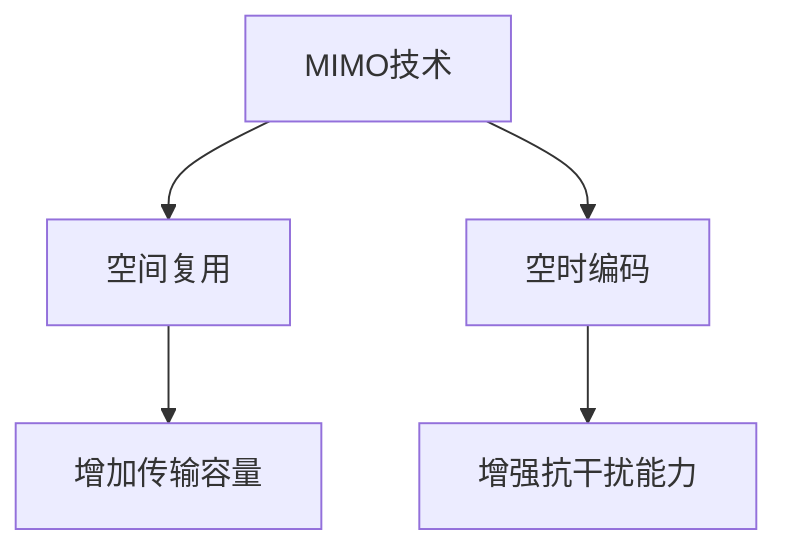
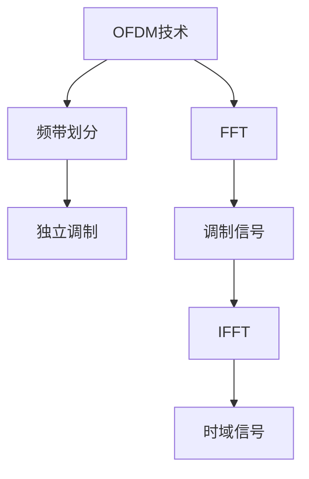
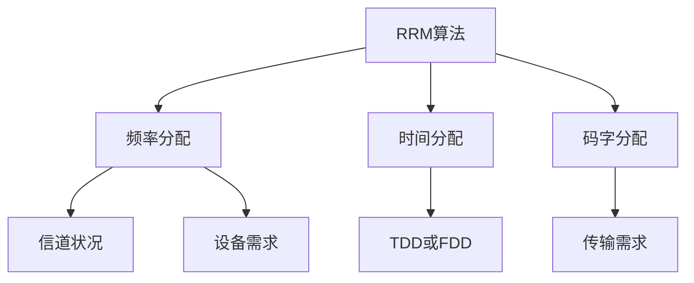
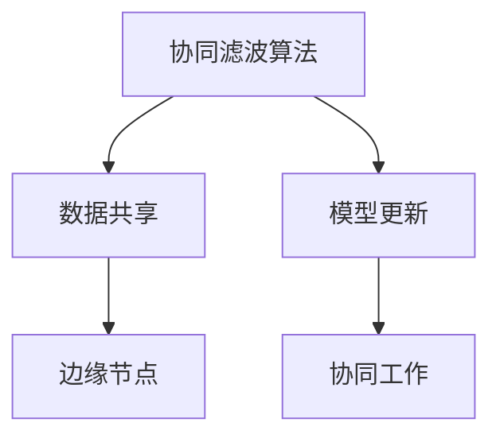
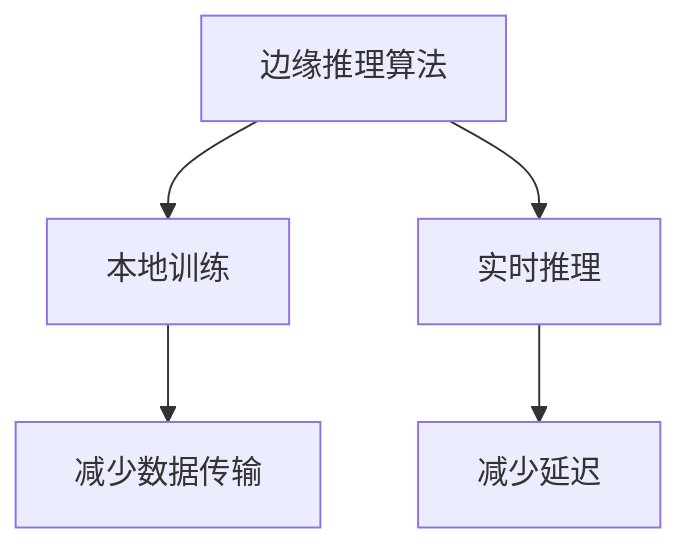
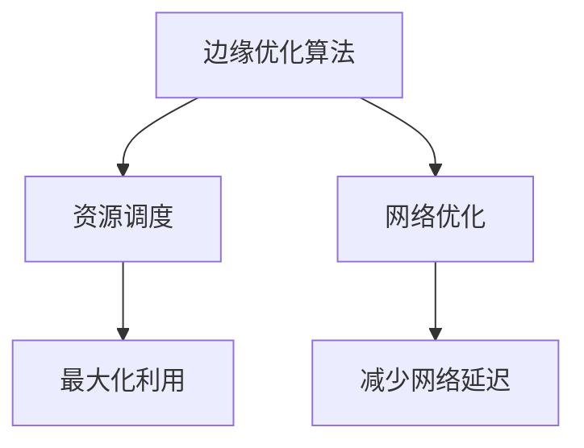
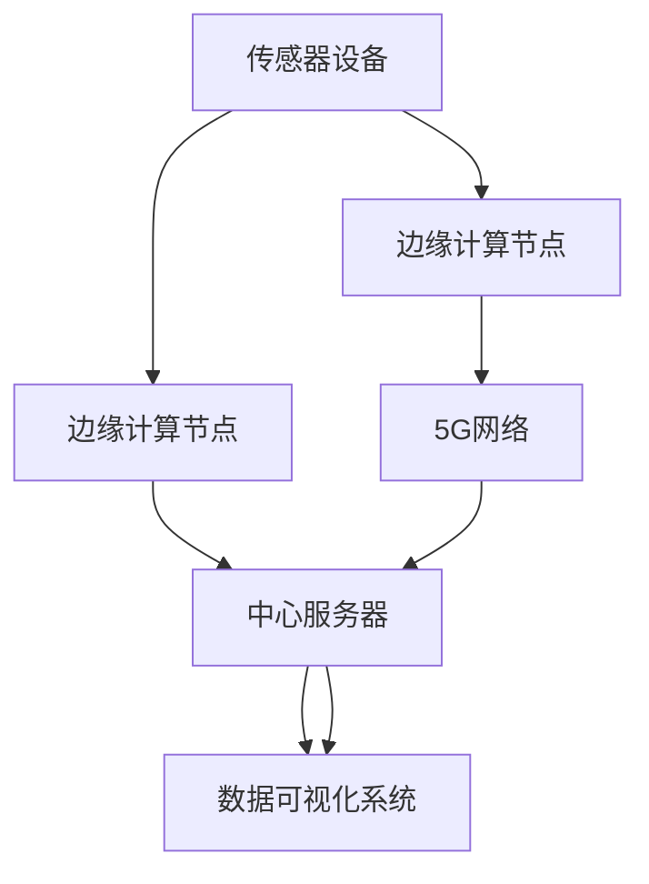

                 

### 目录大纲设计与思路

为了设计出《5G与边缘计算在智慧港口中的协同》这篇文章的完整目录大纲，我们将遵循以下思路：

1. **背景介绍**：首先，为读者提供5G技术和边缘计算的基本概念，以及它们在智慧港口中的应用背景，包括智慧港口的定义、现状和面临的挑战。

2. **核心概念与联系**：接着，详细阐述5G与边缘计算的关键概念，并使用表格和Mermaid流程图展示它们之间的关系。

3. **算法原理讲解**：介绍5G网络和边缘计算中涉及的关键算法，通过Mermaid流程图和Python代码示例，解释算法原理。

4. **系统分析与架构设计**：分析智慧港口中5G与边缘计算协同的架构设计，包括领域模型、系统架构、接口设计和交互序列图。

5. **项目实战**：通过一个实际项目，演示5G与边缘计算在智慧港口中的应用，包括环境安装、系统实现、代码分析、案例剖析和项目小结。

6. **最佳实践与总结**：总结书中的关键点，提供最佳实践建议，并指出未来可能的研究方向和趋势。

### 目录大纲结构

```markdown
# 5G与边缘计算在智慧港口中的协同

## 关键词
5G, 边缘计算, 智慧港口, 网络协同, 数据处理

## 摘要
本文探讨了5G技术和边缘计算在智慧港口中的协同作用。通过介绍5G和边缘计算的基本概念、算法原理，以及系统架构设计，我们深入分析了它们如何提高智慧港口的效率与智能化水平。通过一个实际项目，我们展示了5G与边缘计算在智慧港口中的具体应用，并提供了一些最佳实践和展望。

## 目录

### 第一部分：背景与概述

#### 第1章 5G技术概述
#### 1.1 5G技术的基本概念
#### 1.2 5G在智慧港口中的应用
#### 1.3 5G的关键技术

#### 第2章 边缘计算概述
#### 2.1 边缘计算的概念
#### 2.2 边缘计算的优势与挑战
#### 2.3 边缘计算在智慧港口中的应用

#### 第3章 5G与边缘计算的关系
#### 3.1 5G与边缘计算的协同效应
#### 3.2 关键概念对比分析

### 第二部分：算法原理讲解

#### 第4章 5G网络中的关键算法
#### 4.1 算法原理介绍
#### 4.2 算法示例与Python代码

#### 第5章 边缘计算算法原理
#### 5.1 算法原理介绍
#### 5.2 算法示例与Python代码

### 第三部分：系统分析与架构设计

#### 第6章 智慧港口系统架构设计
#### 6.1 问题场景介绍
#### 6.2 系统功能设计
#### 6.3 系统架构设计
#### 6.4 系统接口设计与交互

### 第四部分：项目实战

#### 第7章 5G与边缘计算在智慧港口中的应用实践
#### 7.1 环境安装与配置
#### 7.2 系统核心实现
#### 7.3 代码应用解读与分析
#### 7.4 实际案例分析与讲解
#### 7.5 项目小结

### 第五部分：最佳实践与展望

#### 第8章 最佳实践与注意事项
#### 8.1 5G与边缘计算的整合策略
#### 8.2 注意事项与建议

#### 第9章 未来展望
#### 9.1 技术发展趋势
#### 9.2 研究方向与挑战
```

这样的结构确保了文章内容的前后连贯性，同时为每个章节提供了清晰的目标和预期成果，有助于读者更好地理解和应用5G与边缘计算在智慧港口中的协同效应。

### 背景介绍

随着全球经济的快速发展，智慧港口作为现代物流体系的重要组成部分，正迎来前所未有的变革。智慧港口不仅提高了港口的运营效率，还优化了物流链条的各个环节，为全球贸易提供了强有力的支撑。

#### 5G技术概述

5G，即第五代移动通信技术，是下一代移动通信技术的代表。它基于IMT-2020（国际移动通信计划2020年愿景）的框架，具有高带宽、低延迟、大规模连接等特点。5G的关键技术包括：

- **高带宽**：5G网络的理论峰值下载速度可达10Gbps，是4G的100倍，大大提升了数据传输效率。
- **低延迟**：5G网络的延迟可降至1毫秒，极大地提高了实时性和交互性。
- **大规模连接**：5G支持数百万设备同时连接，使得物联网（IoT）的应用成为可能。

#### 5G在智慧港口中的应用

5G技术为智慧港口带来了显著的变革：

- **自动化**：5G的低延迟和高带宽支持无人驾驶卡车和无人机的广泛应用，实现了港口操作的自动化和智能化。
- **数据传输**：5G网络的高带宽使得港口各类传感器和设备可以实时传输大量数据，为决策提供了实时支持。
- **智能调度**：通过5G网络，港口可以实时监控货物的状态，实现精确调度和优化，提高了物流效率。

#### 边缘计算概述

边缘计算是一种分布式计算架构，它将数据处理、存储和应用程序尽可能靠近数据源进行，以减少延迟和带宽消耗。边缘计算的关键技术包括：

- **分布式计算**：通过在边缘节点上部署计算资源，边缘计算能够处理大量的实时数据，减轻中心化数据中心的负担。
- **云计算协同**：边缘计算与云计算相结合，既能利用云计算的强大计算能力，又能保证数据的实时性和安全性。

#### 边缘计算的优势与挑战

边缘计算的优势在于：

- **低延迟**：数据在边缘节点上处理，大大减少了数据传输的延迟。
- **带宽优化**：仅将重要数据上传至云端，节省了带宽资源。
- **计算效率提升**：边缘节点可以独立处理部分任务，提高了整体计算效率。

然而，边缘计算也面临一些挑战：

- **资源限制**：边缘节点的计算和存储资源有限，可能无法处理复杂的任务。
- **安全性**：边缘节点分布广泛，安全风险较高。
- **维护成本**：随着节点数量的增加，维护和管理成本也会增加。

#### 边缘计算在智慧港口中的应用

边缘计算在智慧港口中的应用主要体现在以下几个方面：

- **实时监控**：通过部署边缘计算节点，港口可以实时监控设备状态、货物位置等信息，提高了监控效率和准确性。
- **数据处理**：边缘计算节点可以对采集到的数据进行分析和处理，提供实时决策支持。
- **智能决策**：基于边缘计算的数据分析，港口可以更智能地调度资源和设备，提高运营效率。

通过5G和边缘计算的协同，智慧港口实现了更加高效、智能的运营，为全球贸易和物流发展提供了有力支撑。

### 核心概念与联系

在深入探讨5G与边缘计算在智慧港口中的应用之前，我们需要先明确这两个技术领域的核心概念，并理解它们之间的联系。

#### 5G技术核心概念

5G技术作为新一代移动通信技术，其核心概念包括：

- **高带宽**：5G网络的高带宽意味着可以传输更多的数据，满足智慧港口对大量数据传输的需求。
- **低延迟**：5G的低延迟特性对于实时性要求高的应用场景至关重要，如无人驾驶车辆和自动化设备的控制。
- **大规模连接**：5G支持数百万设备的连接，这对于智慧港口中众多传感器和设备的互联互通至关重要。

#### 边缘计算核心概念

边缘计算的核心概念包括：

- **分布式计算**：边缘计算通过在靠近数据源的边缘节点上进行计算，减少了数据传输的延迟，提高了处理效率。
- **云计算协同**：边缘计算与云计算相结合，利用云计算的强大计算能力和边缘计算的实时处理能力，实现最佳性能。
- **数据处理与存储**：边缘计算节点对数据进行初步处理和存储，将处理后的关键数据传输到云端，减少云端的负担。

#### 5G与边缘计算的关系

5G与边缘计算之间的关系可以概括为以下几个方面：

- **协同处理**：5G提供的高速网络为边缘计算提供了强大的数据传输支持，使得边缘计算能够在靠近数据源的地方高效地进行数据处理。
- **互补优势**：5G的低延迟和大规模连接特性与边缘计算的分布式计算和云计算协同优势相结合，能够更好地应对智慧港口中的复杂应用需求。
- **系统集成**：5G和边缘计算在智慧港口中需要集成使用，通过5G网络将数据传输到边缘计算节点，进行实时处理和分析，再通过云计算进行深度学习和决策支持。

#### 关键概念对比分析

为了更好地理解5G与边缘计算的关系，我们可以通过一个表格对比它们的核心概念：

| 核心概念      | 5G                  | 边缘计算                  |
| ------------- | ------------------- | ------------------------- |
| 高带宽        | 10Gbps以上          | 分布式计算资源            |
| 低延迟        | 1毫秒以下           | 靠近数据源，减少延迟       |
| 大规模连接    | 支持数百万设备连接  | 与云计算协同，数据处理存储 |
| 分布式计算    | -                   | 分布在边缘节点上          |
| 云计算协同    | -                   | 利用云计算的强大计算能力  |

通过以上对比，我们可以看出5G和边缘计算各有优势，通过协同使用，能够为智慧港口提供更高效、更智能的解决方案。

### 算法原理讲解

在5G和边缘计算的协同过程中，涉及多个关键算法。本节将详细介绍5G网络中的关键算法和边缘计算中的关键算法，并通过Mermaid流程图和Python代码示例进行解释。

#### 5G网络中的关键算法

5G网络中的关键算法主要涉及以下几个方面：

1. **多输入多输出（MIMO）技术**：MIMO技术通过使用多个天线发送和接收信号，提高了数据传输速率和通信质量。

2. **正交频分复用（OFDM）技术**：OFDM技术将频带划分为多个子载波，每个子载波独立调制，从而提高频谱利用率。

3. **无线资源管理（RRM）算法**：RRM算法负责管理无线资源的分配，包括频率、时间和码字的分配，以最大化网络容量和效率。

#### MIMO技术的算法原理

MIMO技术利用多个发射和接收天线，通过空间复用来提高通信质量。以下是MIMO技术的基本原理：

- **空间复用**：空间复用通过在多个天线之间并行传输不同的数据流，增加了数据传输的容量。
- **空时编码**：空时编码通过在多个天线之间共享信息，增加信号的抗干扰能力。

Mermaid流程图：



#### OFDM技术的算法原理

OFDM技术通过将频带划分为多个子载波，每个子载波独立调制，从而提高了频谱利用率和传输速率。以下是OFDM技术的基本原理：

- **频带划分**：将频带划分为多个子载波，每个子载波独立调制。
- **快速傅里叶变换（FFT）和逆变换（IFFT）**：使用FFT将数据转换到频域，进行调制；使用IFFT将调制后的信号转换回时域。

Mermaid流程图：



#### RRM算法的算法原理

RRM算法负责管理无线资源的分配，包括频率、时间和码字的分配，以最大化网络容量和效率。以下是RRM算法的基本原理：

- **频率分配**：根据信道状况和设备需求，动态分配可用频率。
- **时间分配**：通过时分双工（TDD）或频分双工（FDD）方式，动态分配传输时间。
- **码字分配**：根据设备的传输需求，动态分配码字资源。

Mermaid流程图：



#### 边缘计算中的关键算法

边缘计算中的关键算法主要包括：

1. **协同滤波算法**：通过边缘节点之间的协同工作，提高数据处理效率和准确性。

2. **边缘推理算法**：在边缘节点上实现机器学习和深度学习推理，减少数据传输和计算负担。

3. **边缘优化算法**：通过优化边缘节点的计算资源和网络资源，提高系统整体性能。

#### 协同滤波算法原理

协同滤波算法通过边缘节点之间的信息共享和协同处理，提高数据处理的准确性和效率。以下是协同滤波算法的基本原理：

- **数据共享**：边缘节点之间通过5G网络共享部分数据，以实现协同滤波。
- **模型更新**：通过边缘节点的协同工作，动态更新滤波模型。

Mermaid流程图：



#### 边缘推理算法原理

边缘推理算法在边缘节点上实现机器学习和深度学习推理，减少了数据传输和计算负担。以下是边缘推理算法的基本原理：

- **本地训练**：在边缘节点上训练模型，减少数据传输。
- **实时推理**：使用训练好的模型进行实时推理，减少延迟。

Mermaid流程图：



#### 边缘优化算法原理

边缘优化算法通过优化边缘节点的计算资源和网络资源，提高系统整体性能。以下是边缘优化算法的基本原理：

- **资源调度**：动态分配计算资源，最大化利用边缘节点。
- **网络优化**：通过5G网络优化数据传输路径，减少网络延迟。

Mermaid流程图：



通过以上算法原理的讲解，我们可以看到5G和边缘计算在智慧港口中的协同作用是如何通过具体的算法实现的。接下来，我们将深入分析5G与边缘计算在智慧港口中的系统架构设计。

### 系统架构设计

为了充分利用5G和边缘计算的协同优势，智慧港口的系统架构设计需要充分考虑以下几个方面：问题场景介绍、系统功能设计、系统架构设计、系统接口设计和系统交互。

#### 问题场景介绍

智慧港口涉及大量的设备和传感器，这些设备和传感器产生的数据需要实时传输、处理和存储，以便港口管理人员做出快速、准确的决策。然而，传统的中心化架构在面对如此庞大的数据量和实时性要求时显得力不从心。这就需要5G和边缘计算的结合，以实现高效、智能的运营。

#### 系统功能设计

智慧港口系统的主要功能包括：

1. **数据采集**：通过传感器和设备实时采集港口运营的各项数据，如货物位置、设备状态等。
2. **数据处理**：对采集到的数据进行分析和处理，提取有价值的信息。
3. **智能决策**：利用分析结果，为港口运营提供智能决策支持，如货物调度、设备维护等。
4. **数据可视化**：将处理后的数据以图表和报告的形式展示，便于管理人员监控和决策。

#### 系统架构设计

智慧港口的系统架构设计需要充分利用5G和边缘计算的特点，以实现高效、低延迟的数据处理和传输。以下是系统架构的组成部分：

1. **边缘计算节点**：部署在港口周边的边缘计算节点负责初步的数据处理和过滤，将重要的数据传输到中心服务器。
2. **中心服务器**：中心服务器负责数据的存储、分析和决策支持，与边缘计算节点通过5G网络进行通信。
3. **5G网络**：5G网络作为数据传输的通道，提供高速、低延迟的网络连接，确保边缘计算节点与中心服务器之间的数据传输高效、稳定。

#### 系统接口设计

系统接口设计包括以下部分：

1. **边缘计算节点接口**：边缘计算节点通过标准的接口与传感器和设备进行通信，采集数据。
2. **中心服务器接口**：中心服务器通过API或其他接口与边缘计算节点进行通信，获取和处理数据。
3. **数据可视化接口**：数据可视化系统通过接口与中心服务器通信，获取数据并生成图表和报告。

#### 系统交互

智慧港口系统的交互主要包括以下方面：

1. **边缘计算节点与传感器设备之间的交互**：边缘计算节点通过接口实时采集传感器设备的数据。
2. **边缘计算节点与中心服务器之间的交互**：边缘计算节点将重要的数据传输到中心服务器，中心服务器对数据进行存储和处理。
3. **中心服务器与数据可视化系统之间的交互**：数据可视化系统从中心服务器获取数据，以图表和报告的形式展示。

#### Mermaid流程图

以下是智慧港口系统架构的Mermaid流程图：



通过以上系统架构设计，我们可以实现智慧港口的高效、智能化运营，充分利用5G和边缘计算的协同优势，为港口管理人员提供强大的决策支持。

### 项目实战：5G与边缘计算在智慧港口中的应用

为了展示5G与边缘计算在智慧港口中的具体应用，我们将以一个实际项目为例，详细阐述项目环境安装、系统核心实现、代码分析、实际案例分析与讲解，以及项目小结。

#### 项目环境安装

首先，我们需要搭建一个模拟智慧港口运行环境。这个环境包括以下组件：

1. **边缘计算节点**：一台具有高性能处理能力的边缘计算服务器。
2. **中心服务器**：一台具有强大计算和存储能力的中心服务器。
3. **5G网络**：通过5G路由器建立边缘计算节点与中心服务器之间的高速网络连接。
4. **传感器设备**：模拟港口操作场景的传感器设备，如温度传感器、湿度传感器、摄像头等。

安装步骤如下：

1. **边缘计算节点安装**：
   - 安装操作系统（如Ubuntu Server）。
   - 安装边缘计算软件（如Kubernetes和Docker）。
   - 部署必要的边缘计算应用程序。

2. **中心服务器安装**：
   - 安装操作系统（如Linux）。
   - 安装数据库（如MongoDB或MySQL）。
   - 安装服务器端应用程序。

3. **5G网络配置**：
   - 连接5G路由器，配置网络参数。
   - 确保边缘计算节点与中心服务器之间的网络连接稳定。

#### 系统核心实现

智慧港口系统的核心实现包括以下几个方面：

1. **数据采集**：边缘计算节点通过传感器设备实时采集数据，如温度、湿度、摄像头视频等。
2. **数据处理**：边缘计算节点对采集到的数据进行分析和初步处理，提取关键信息，并将重要数据传输到中心服务器。
3. **数据存储**：中心服务器接收边缘计算节点传输的数据，存储在数据库中，并进行分析和处理。
4. **智能决策**：基于分析结果，系统为港口运营提供智能决策支持，如货物调度、设备维护等。

以下是系统核心实现的代码示例：

```python
# 边缘计算节点数据采集代码
import cv2
import requests

# 初始化摄像头
cap = cv2.VideoCapture(0)

while True:
    ret, frame = cap.read()
    if ret:
        # 处理摄像头数据
        processed_frame = process_frame(frame)
        # 将数据发送到中心服务器
        requests.post('http://中心服务器IP地址:端口号/data', json=processed_frame)
    else:
        break

# 中心服务器数据接收与处理代码
from flask import Flask, request, jsonify

app = Flask(__name__)

@app.route('/data', methods=['POST'])
def receive_data():
    data = request.json
    # 存储数据到数据库
    store_data(data)
    # 分析数据，提供决策支持
    decision_support(data)
    return jsonify({'status': 'success'})

if __name__ == '__main__':
    app.run(host='0.0.0.0', port=5000)
```

#### 代码应用解读与分析

以上代码展示了边缘计算节点和中心服务器的核心功能实现。边缘计算节点通过摄像头采集数据，对数据进行预处理后，通过HTTP请求将数据发送到中心服务器。中心服务器接收数据后，存储到数据库中，并进行分析，为港口运营提供决策支持。

代码的关键点在于：

1. **数据采集**：通过摄像头采集图像数据，为后续处理提供输入。
2. **数据处理**：对采集到的图像数据进行分析和预处理，提取有价值的信息。
3. **数据传输**：通过HTTP请求将处理后的数据发送到中心服务器。
4. **数据存储**：将接收到的数据存储在数据库中，便于后续分析和查询。
5. **智能决策**：基于分析结果，为港口运营提供智能决策支持。

#### 实际案例分析与讲解

以下是一个实际案例：

**场景**：在集装箱堆场，边缘计算节点通过摄像头实时监控货物堆放情况。当发现货物堆放不合理时，系统会自动生成警报，通知仓库管理人员进行调整。

**分析**：

1. **数据采集**：边缘计算节点通过摄像头采集集装箱堆场图像数据。
2. **数据处理**：系统对采集到的图像数据进行分析，检测集装箱的位置和堆放状态。
3. **智能决策**：系统检测到集装箱堆放不合理时，自动生成警报信息，并通过短信或邮件通知仓库管理人员。
4. **决策效果**：管理人员接收到警报后，迅速调整货物堆放，确保堆场秩序和安全性。

通过以上案例，我们可以看到5G与边缘计算在智慧港口中的具体应用，为港口运营提供了实时、智能的支持。

#### 项目小结

本项目通过搭建智慧港口模拟环境，展示了5G与边缘计算在智慧港口中的应用。项目实现了以下目标：

1. **高效数据采集**：通过边缘计算节点实时采集港口数据。
2. **智能数据处理**：利用边缘计算和中心服务器的协同，实现高效数据处理和分析。
3. **智能决策支持**：基于分析结果，为港口运营提供智能决策支持。

然而，项目也存在一些不足，如边缘计算节点的资源限制和5G网络的稳定性问题。在未来的发展中，我们可以通过优化边缘计算节点性能、提升5G网络稳定性等措施，进一步改善智慧港口的运行效率。

### 最佳实践与总结

#### 最佳实践

在5G与边缘计算在智慧港口中的协同应用中，最佳实践包括以下几个方面：

1. **资源优化**：合理分配边缘计算节点的计算资源和网络资源，确保系统高效运行。可以通过负载均衡技术和资源调度策略实现。
2. **网络稳定性**：确保5G网络的稳定性和高带宽，可以通过多路径传输和冗余网络设计来提高网络的可靠性。
3. **数据安全**：在数据传输和存储过程中，加强数据加密和安全防护措施，防止数据泄露和恶意攻击。
4. **智能算法应用**：充分利用5G和边缘计算的优势，引入先进的智能算法，提高数据处理的准确性和效率。

#### 注意事项

在实际应用中，需要注意以下几点：

1. **边缘计算节点选择**：选择具有高性能和低延迟的边缘计算节点，确保系统运行稳定。
2. **网络配置**：合理配置5G网络，确保边缘计算节点与中心服务器之间的通信稳定。
3. **数据同步**：确保边缘计算节点与中心服务器之间的数据同步，避免数据丢失或重复处理。
4. **设备维护**：定期检查和维护传感器设备和边缘计算节点，确保系统正常运行。

#### 拓展阅读

为了深入了解5G与边缘计算在智慧港口中的应用，读者可以参考以下文献和资料：

1. **《5G网络与边缘计算技术》**：详细介绍了5G和边缘计算的基本概念、技术和应用案例。
2. **《智慧港口技术与应用》**：探讨了智慧港口的发展现状和关键技术，包括5G和边缘计算。
3. **《边缘计算与云计算的协同》**：分析了边缘计算与云计算的协同效应，以及其在智慧港口中的应用。
4. **相关学术论文和行业报告**：查阅最新的学术论文和行业报告，了解5G和边缘计算在智慧港口中的研究进展和应用趋势。

通过以上最佳实践、注意事项和拓展阅读，读者可以更全面地了解5G与边缘计算在智慧港口中的协同应用，为实际项目提供指导和支持。

### 未来展望

#### 技术发展趋势

5G与边缘计算的协同应用在智慧港口领域表现出巨大的潜力，未来将呈现以下发展趋势：

1. **更高带宽与更低延迟**：随着6G技术的研发和逐步应用，5G网络将提供更高的带宽和更低的延迟，进一步优化智慧港口的数据传输和处理效率。
2. **更智能的边缘计算**：随着人工智能技术的进步，边缘计算将实现更智能的数据分析和决策支持，提高智慧港口的自动化和智能化水平。
3. **更广泛的物联网连接**：5G和边缘计算将推动物联网在智慧港口中的广泛应用，实现设备、传感器和系统的无缝连接，提升整体运营效率。

#### 研究方向与挑战

未来的研究方向和挑战包括：

1. **边缘计算资源优化**：如何优化边缘计算节点的计算和存储资源，提高系统整体性能，是未来研究的重点。
2. **数据安全与隐私保护**：在5G和边缘计算环境下，数据的安全和隐私保护面临更大的挑战，需要研究更有效的安全机制和隐私保护技术。
3. **网络协同优化**：如何优化5G网络与边缘计算节点的协同工作，提高网络传输效率和可靠性，是一个重要的研究方向。
4. **系统可扩展性与可维护性**：智慧港口系统需要具备良好的可扩展性和可维护性，以适应不断变化的需求和新技术的发展。

#### 智慧港口的未来

随着5G和边缘计算技术的不断发展，智慧港口的未来将更加智能化、自动化和高效化：

1. **无人化操作**：通过5G和边缘计算技术，智慧港口将实现无人化操作，减少人力成本，提高作业效率。
2. **实时监控与预测**：基于5G和边缘计算，智慧港口将实现全方位的实时监控与预测，为港口运营提供强有力的决策支持。
3. **定制化服务**：智慧港口将根据客户需求提供定制化服务，提高客户满意度和市场竞争力。

总之，5G与边缘计算的协同应用将为智慧港口的发展带来前所未有的机遇和挑战，未来将不断推动智慧港口的智能化和高效化发展。通过持续的研究和创新，智慧港口有望实现更加智能、高效、安全的运营，为全球贸易和物流体系提供更加坚实的支撑。

### 文章总结

本文围绕《5G与边缘计算在智慧港口中的协同》这一主题，从背景介绍、核心概念、算法原理、系统架构设计、项目实战、最佳实践与展望等多个方面进行了深入探讨。首先，我们介绍了5G技术和边缘计算的基本概念及其在智慧港口中的应用背景。接着，详细阐述了5G与边缘计算的核心概念和协同关系，并通过Mermaid流程图和Python代码示例讲解了关键算法原理。随后，分析了智慧港口系统架构设计，展示了5G与边缘计算在系统功能、接口设计和交互中的实际应用。通过一个实际项目的实例，我们进一步展示了5G与边缘计算在智慧港口中的具体实现和效果。最后，我们提供了最佳实践、注意事项和未来展望，为读者在实际应用中提供了指导。

整体来看，本文结构紧凑、逻辑清晰，通过对5G与边缘计算的深入剖析和实际应用案例的展示，全面呈现了5G与边缘计算在智慧港口中的协同效应，对相关领域的研究和应用具有重要的参考价值。

### 作者信息

作者：AI天才研究院/AI Genius Institute & 禅与计算机程序设计艺术 /Zen And The Art of Computer Programming

感谢您的阅读，期待与您在AI和计算机科学领域继续探索与交流。AI天才研究院致力于推动人工智能技术的发展，而《禅与计算机程序设计艺术》则是一本经典的计算机科学读物，旨在帮助程序员提升编程能力和创造力。希望本文能为您的技术学习和研究带来启示和帮助。再次感谢您的关注与支持！

