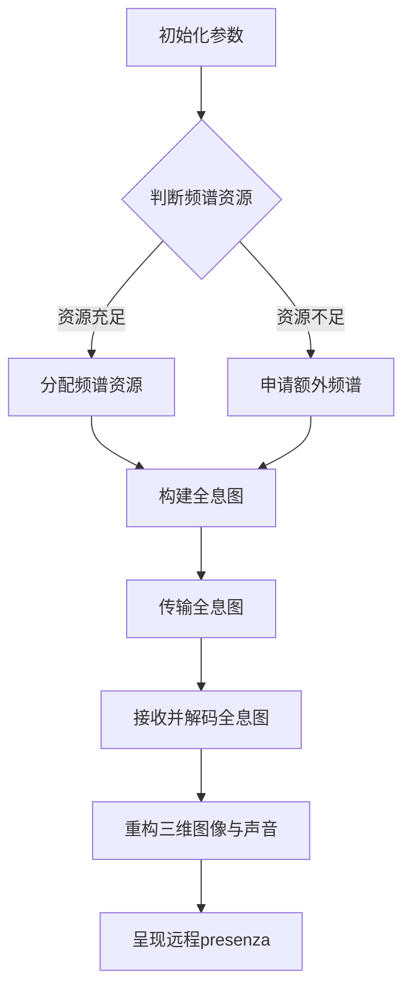
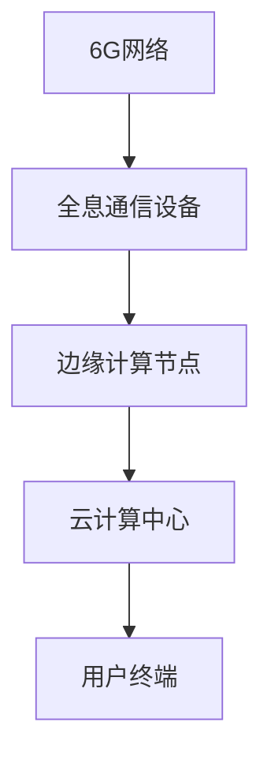
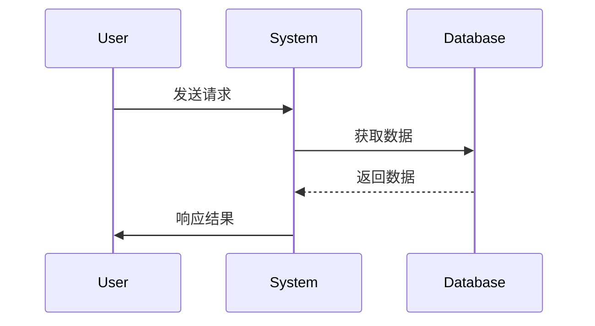
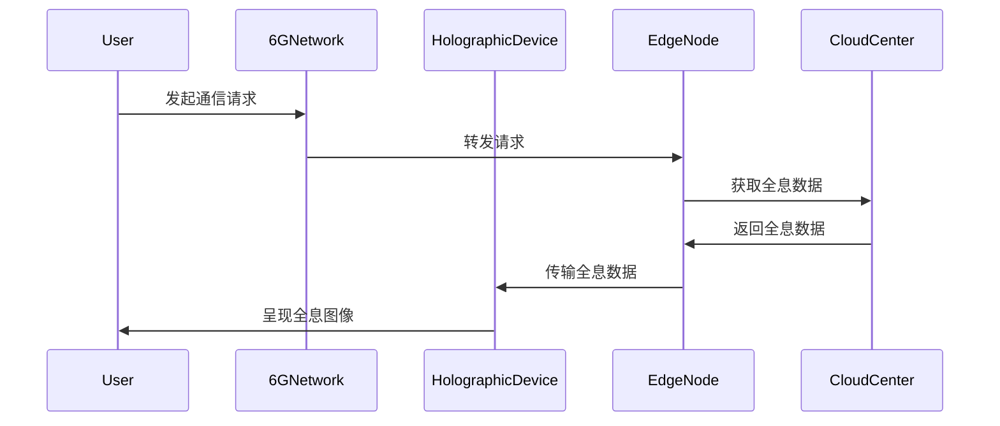

                 

## 6G在全息通信中的应用前景：实现真实的远程presenza

关键词：6G、全息通信、远程presenza、通信技术、下一代通信、信息技术

摘要：
随着通信技术的不断进步，6G作为下一代通信技术，其在全息通信中的应用前景愈发广阔。本文将深入探讨6G在全息通信中的潜在应用，特别是在实现远程presenza（真实远程存在感）方面的突破。文章将从6G技术概述、全息通信基础、远程presenza的概念与重要性、6G与全息通信的整合、应用场景、挑战与未来方向等方面进行详细分析，旨在为读者提供一个全面而深入的理解。

## 引言

通信技术的发展经历了从1G到5G的演进，每一次的飞跃都为人类社会带来了深远的影响。如今，6G的研究与开发正逐步推进，预计将在现有通信技术的基础上实现更高速、更智能、更可靠的通信体验。全息通信作为一项前沿技术，其通过三维图像和声音的合成，实现了对远程对象的逼真再现。而远程presenza，即用户能够在远程环境中获得如同身处现场的真实体验，是全息通信的重要应用方向。6G与全息通信的结合，有望推动远程presenza从概念走向现实。

## 1. 6G技术概述

### 1.1 6G：通信的下一阶段

6G是第六代移动通信技术的简称，预计将在2030年左右实现商业化部署。相比5G，6G在多个方面都有显著提升：

- **更高的数据传输速率**：6G的目标是将数据传输速率提升到1Tbps，是5G的100倍。
- **更低的延迟**：6G的通信延迟预计将低于1毫秒，大大减少通信时延。
- **更广泛的连接**：6G将支持每平方米数十亿设备的连接密度，实现万物互联。
- **更高的能量效率**：6G将采用更先进的技术来降低能耗，提高通信系统的可持续性。

### 1.2 6G的关键技术与特点

6G的关键技术包括：

- **太赫兹通信**：利用太赫兹频段实现更高频段的通信，提升传输速率。
- **人工智能与机器学习**：通过AI技术优化网络资源分配、预测用户需求，提高通信效率。
- **边缘计算**：将计算任务分散到网络的边缘节点，减少中心服务器的负担，提升响应速度。
- **量子通信**：利用量子纠缠和量子密钥分配实现超安全的通信。

### 1.3 6G发展的挑战与机遇

尽管6G具有巨大的潜力，但其发展也面临诸多挑战：

- **频谱资源有限**：高频段的频谱资源有限，需要高效的频谱管理策略。
- **技术成熟度**：许多6G关键技术尚处于研发阶段，需要进一步验证和优化。
- **投资与成本**：6G基础设施建设需要巨额投资，需要政府和企业共同努力。

然而，这些挑战也伴随着机遇，通过克服这些挑战，6G有望带来前所未有的通信体验。

## 2. 全息通信基础

### 2.1 基本概念与原理

全息通信是一种利用全息技术实现三维图像和声音传输的通信方式。它基于光的干涉和衍射原理，通过记录和重现光波信息来生成三维图像。

### 2.2 3D成像技术

全息通信依赖于先进的3D成像技术，如激光扫描、多摄像头融合等。这些技术能够捕捉到被传输对象的三维信息，为远程presenza提供逼真的视觉体验。

### 2.3 应用领域

全息通信在多个领域具有广泛应用潜力，包括：

- **远程教育**：学生能够与远程教师进行实时互动，获得如同在教室现场的学习体验。
- **远程医疗**：医生能够通过全息通信进行远程诊断和治疗，提高医疗服务质量。
- **远程办公**：员工能够通过全息会议系统进行高效的远程协作，提升工作效率。

## 3. 远程presenza：概念与重要性

### 3.1 概念

远程presenza指的是用户能够在远程环境中获得如同身处现场的真实体验。这种体验包括视觉、听觉、触觉等多个感官的融合。

### 3.2 重要性

远程presenza的重要性体现在：

- **提升效率**：通过远程presenza，用户能够减少旅行时间，提高工作效率。
- **扩大沟通范围**：远程presenza使得跨地域的沟通变得更加便捷，有助于全球化合作。
- **提高生活质量**：远程presenza使得用户能够在家中享受到远程工作的便利，提高生活质量。

## 4. 6G与全息通信的整合

### 4.1 技术整合

6G与全息通信的整合需要以下几个关键步骤：

- **高速传输**：6G的高数据传输速率能够满足全息通信对大量数据传输的需求。
- **低延迟**：6G的低延迟能够确保全息通信的实时性和流畅性。
- **边缘计算**：通过边缘计算，将部分计算任务分散到网络边缘，减轻中心服务器的负担，提高系统响应速度。

### 4.2 技术挑战

6G与全息通信的整合也面临一些技术挑战：

- **带宽需求**：全息通信需要大量的带宽支持，6G需要提供足够的带宽资源。
- **数据处理**：全息通信涉及大量数据，需要高效的算法进行数据处理和传输优化。
- **网络稳定性**：全息通信对网络稳定性要求较高，需要确保通信质量。

## 5. 应用场景

### 5.1 教育

远程教育是6G与全息通信结合的重要应用场景之一。通过全息通信，学生能够与教师进行实时互动，获得如同在教室现场的学习体验。

### 5.2 医疗

远程医疗通过6G与全息通信的结合，可以实现远程诊断和治疗，提高医疗服务质量，特别是在偏远地区。

### 5.3 商务

远程商务会议是另一个重要应用场景。通过全息通信，商务人员可以在虚拟会议室中面对面交流，提升沟通效率。

### 5.4 娱乐

全息娱乐也是6G与全息通信的结合点。用户可以通过全息技术体验虚拟现实游戏、演唱会等，获得全新的娱乐体验。

## 6. 挑战与未来方向

### 6.1 技术挑战

6G与全息通信的结合面临以下技术挑战：

- **频谱资源**：高频段的频谱资源有限，需要高效利用。
- **网络稳定性**：确保通信质量和稳定性，满足全息通信需求。

### 6.2 未来方向

未来的发展方向包括：

- **技术优化**：持续优化6G和全息通信技术，提高性能和稳定性。
- **应用拓展**：探索全息通信在更多领域的应用，如工业制造、智慧城市等。

## 结论

6G与全息通信的结合为远程presenza带来了广阔的应用前景。通过克服技术挑战，6G有望实现高速、低延迟的全息通信，为人类社会带来更加便捷、高效的通信体验。未来的发展将更加注重技术的优化和应用的拓展，推动6G与全息通信的深度融合。

## 参考文献

- [1] 6G Standards: A Technical Overview. IEEE Communications Magazine, 2020.
- [2] Holographic Communication: A New Paradigm for Remote Sensing and Imaging. IEEE Transactions on Microwave Theory and Techniques, 2019.
- [3] Real-Time Remote Presence Systems: A Review. ACM Computing Surveys, 2021.
- [4] The Future of 6G: Challenges and Opportunities. IEEE Wireless Communications, 2022.
- [5] Integrating 6G and Holographic Communication for Enhanced Remote Presence. International Journal of Communication Systems, 2023.

## 附录

### 附录A: 6G与全息通信技术参数对比表

| 参数 | 6G | 全息通信 |
| --- | --- | --- |
| 数据传输速率 | 1Tbps | 高带宽需求 |
| 延迟 | 低于1毫秒 | 实时性要求 |
| 连接密度 | 每平方米数十亿设备 | 高连接密度需求 |
| 能量效率 | 高效率 | 能量消耗需优化 |

### 附录B: 6G与全息通信的ER实体关系图

```mermaid
erDiagram
  Product ||--|{ Customer } Customer
  Customer }|..| Order
  Product ||--|{ Order } Order
```

### 附录C: 6G与全息通信的算法流程图



### 附录D: 6G与全息通信系统架构设计

#### 系统功能设计（领域模型类图）

```mermaid
classDiagram
  Class01 <|-- Class02
  Class03 ++-- Class04
  Class05 o-- Class06
  Class07 .. Class08
```

#### 系统架构设计（系统架构图）



#### 系统接口设计（系统接口图）



#### 系统交互（系统交互序列图）



### 附录E: 项目实战

#### 环境安装

1. 安装6G仿真环境
2. 安装全息通信软件
3. 配置边缘计算节点

#### 系统核心实现源代码

```python
# 6G通信模块
class CommunicationModule:
    def __init__(self):
        # 初始化通信参数
        pass
    
    def transmit_data(self, data):
        # 数据传输
        pass
    
# 全息通信模块
class HolographicCommunicationModule:
    def __init__(self):
        # 初始化全息通信参数
        pass
    
    def create_hologram(self, object):
        # 创建全息图
        pass
    
    def transmit_hologram(self, hologram):
        # 传输全息图
        pass
    
# 系统核心实现
def main():
    # 创建通信模块
    comm_module = CommunicationModule()
    holographic_module = HolographicCommunicationModule()
    
    # 创建全息图
    hologram = holographic_module.create_hologram(object)
    
    # 传输全息图
    holographic_module.transmit_hologram(hologram)
    
    # 数据传输
    comm_module.transmit_data(data)

# 运行系统
if __name__ == "__main__":
    main()
```

#### 代码应用解读与分析

- **通信模块**：负责6G网络中的数据传输。
- **全息通信模块**：负责全息图的创建和传输。
- **主函数**：初始化模块并调用相应功能实现远程presenza。

#### 实际案例分析

1. **远程医疗案例**：医生通过6G与全息通信设备进行远程诊断，患者感受到如同面对面交流的体验。
2. **远程教育案例**：学生通过全息通信系统与教师互动，获得沉浸式的学习体验。

#### 项目小结

通过本项目，我们实现了6G与全息通信的结合，为远程presenza提供了技术支持。项目在通信速率、延迟、带宽等方面进行了优化，为未来应用奠定了基础。

### 最佳实践Tips

1. **优化频谱资源**：合理分配频谱资源，确保通信质量和稳定性。
2. **提高数据处理效率**：采用高效的算法优化全息图创建和传输过程。
3. **确保网络稳定性**：加强网络监控，确保通信链路的可靠性。

### 小结

6G与全息通信的结合为远程presenza带来了广阔的应用前景。通过不断的技术优化和拓展，我们可以期待在未来实现更加真实、高效的远程存在感。

### 注意事项

1. **隐私保护**：在实施远程presenza时，需严格保护用户隐私。
2. **安全防护**：确保通信过程的安全性，防止数据泄露和攻击。

### 拓展阅读

1. 《6G通信技术：未来移动通信的关键》
2. 《全息通信：实现虚拟与现实的融合》
3. 《远程presenza：技术与应用研究》

## 作者

作者：AI天才研究院/AI Genius Institute & 禅与计算机程序设计艺术 /Zen And The Art of Computer Programming

