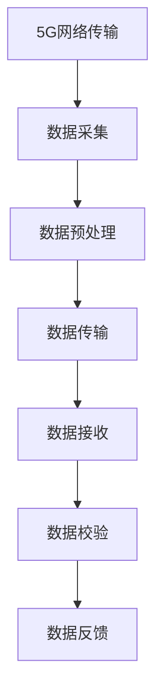
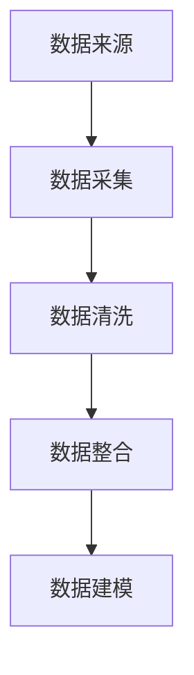
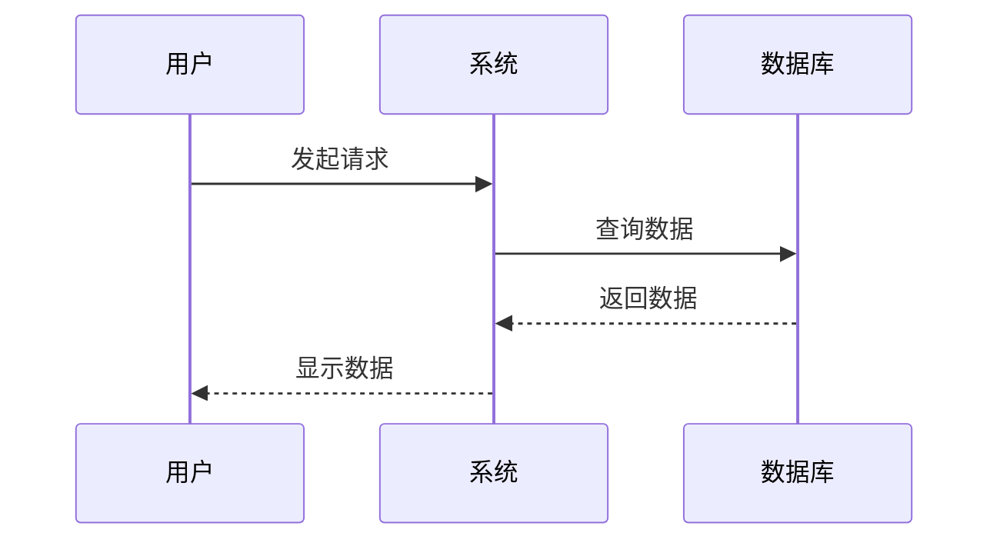

                 

## #5G在工业互联网中的应用：实现智能制造

### 关键词：5G、工业互联网、智能制造、网络架构、关键技术

### 摘要：
本文将深入探讨5G技术在工业互联网中的应用，旨在揭示5G如何助力智能制造的实现。文章首先介绍了5G技术、工业互联网和智能制造的背景、问题和解决方案，然后分析了它们的核心概念与联系。通过详细讲解5G网络传输算法和工业互联网数据融合算法，本文揭示了这些算法的原理、数学模型和实际应用。随后，文章探讨了系统分析与架构设计方案，包括问题场景介绍、系统功能设计、系统架构设计、系统接口设计和系统交互。最后，通过一个实际项目实战案例，本文展示了5G在工业互联网中的具体应用，提供了最佳实践tips和项目小结。

---

### 第一部分：背景介绍

#### 1.1 问题背景

随着信息技术的飞速发展，5G网络作为新一代通信技术，其高速度、低延迟、广连接等特点，为工业互联网带来了新的发展机遇。工业互联网是指通过智能传感器、物联网、云计算等技术，将制造业的生产设备、工业软件和人员紧密连接起来，实现信息共享、协同制造和智能化管理。

在5G环境下，如何利用工业互联网实现智能制造，提高生产效率、降低成本、提升产品质量，成为了企业和研究者关注的热点问题。本文将探讨5G在工业互联网中的应用，为智能制造提供技术支持。

#### 1.2 问题描述

在5G环境下，如何利用工业互联网实现智能制造，提高生产效率、降低成本、提升产品质量，成为了企业和研究者关注的热点问题。本文将探讨5G在工业互联网中的应用，为智能制造提供技术支持。

#### 1.3 问题解决

本书将从5G技术、工业互联网和智能制造三个角度，系统阐述5G在工业互联网中的应用。通过理论分析、案例分析和技术介绍，为读者提供一套完整的5G在工业互联网中应用的技术方案。

#### 1.4 边界与外延

本书主要探讨5G技术在工业互联网中的应用，涉及的关键技术包括5G网络、物联网、云计算、大数据、人工智能等。同时，本书也将探讨5G在智能制造中的应用场景，如生产过程监控、设备预测性维护、质量控制等。

#### 1.5 概念结构与核心要素组成

- **5G技术**：包括5G网络架构、5G关键技术、5G网络特性等。
- **工业互联网**：包括工业互联网架构、工业互联网关键技术、工业互联网应用场景等。
- **智能制造**：包括智能制造体系、智能制造关键技术、智能制造应用场景等。

---

### 第二部分：核心概念与联系

#### 2.1 5G技术

##### 2.1.1 5G网络架构

5G网络架构主要包括接入网、传输网、核心网和用户面管理功能。其中，接入网包括基站、用户设备和无线接入技术；传输网包括光纤网络、无线网络和城域网；核心网包括无线网络控制器、用户数据存储和用户数据管理。

##### 2.1.2 5G关键技术

5G关键技术包括毫米波通信、多天线技术、网络切片、边缘计算等。其中，毫米波通信可以实现更高的数据传输速率和更大的网络容量；多天线技术可以提高网络传输的可靠性和抗干扰能力；网络切片可以实现不同业务需求的差异化服务；边缘计算可以将数据处理和分析能力下沉到网络边缘，提高响应速度和降低延迟。

#### 2.2 工业互联网

##### 2.2.1 工业互联网架构

工业互联网架构主要包括感知层、网络层、平台层和应用层。其中，感知层负责数据采集和感知；网络层负责数据传输和通信；平台层负责数据处理和分析；应用层负责业务应用和服务。

##### 2.2.2 工业互联网关键技术

工业互联网关键技术包括物联网、云计算、大数据、人工智能等。其中，物联网可以实现设备互联互通；云计算提供强大的计算和存储能力；大数据实现海量数据存储和分析；人工智能提供智能决策和优化。

#### 2.3 智能制造

##### 2.3.1 智能制造体系

智能制造体系主要包括智能产品设计、智能生产制造、智能检测与维护、智能物流与仓储等。其中，智能产品设计可以实现产品设计和制造过程的数字化、智能化；智能生产制造实现生产过程的自动化、智能化；智能检测与维护实现设备运行状态的实时监控和预测性维护；智能物流与仓储实现物流和仓储过程的自动化和智能化。

##### 2.3.2 智能制造关键技术

智能制造关键技术包括工业机器人、工业大数据、工业人工智能、智能制造软件等。其中，工业机器人实现生产过程的自动化；工业大数据实现生产数据的全面采集和分析；工业人工智能实现生产过程的智能优化和决策；智能制造软件提供智能制造的全流程管理和服务。

---

### 第三部分：算法原理讲解

#### 3.1 5G网络传输算法

##### 3.1.1 算法流程图



##### 3.1.2 算法原理

5G网络传输算法主要涉及数据采集、数据预处理、数据传输、数据接收、数据校验和数据反馈等步骤。数据采集环节负责从传感器和设备中获取实时数据；数据预处理环节负责对采集到的数据进行清洗、过滤和格式化；数据传输环节利用5G网络的高速率、低延迟特性，实现数据的快速传输；数据接收环节负责接收和存储传输过来的数据；数据校验环节负责对传输数据的有效性和完整性进行校验；数据反馈环节根据校验结果，对传输过程进行反馈和调整。

#### 3.2 工业互联网数据融合算法

##### 3.2.1 算法流程图



##### 3.2.2 算法原理

工业互联网数据融合算法主要涉及数据采集、数据清洗、数据整合、数据建模等步骤。数据采集环节负责从各种数据源中获取数据；数据清洗环节负责对采集到的数据进行清洗、去噪、格式化等预处理；数据整合环节负责将不同来源的数据进行整合，形成一个统一的数据视图；数据建模环节负责利用大数据和人工智能技术，对整合后的数据进行建模和分析，以实现对工业过程的智能优化和预测。

---

### 第四部分：系统分析与架构设计方案

#### 4.1 问题场景介绍

在制造业中，生产过程中的设备监控、数据采集和实时通信是智能制造的关键环节。然而，传统的通信技术如4G存在速度慢、延迟高等问题，无法满足智能制造对高速、低延迟通信的需求。5G技术的出现，为解决这些问题提供了新的解决方案。

#### 4.2 项目介绍

本项目旨在利用5G技术构建一个智能制造系统，实现对生产设备的实时监控、数据采集和分析，从而提高生产效率、降低成本、提升产品质量。

#### 4.3 系统功能设计

系统的功能设计包括设备监控、数据采集、数据分析、智能决策等。具体来说：

1. **设备监控**：通过5G网络实现对生产设备的实时监控，包括设备状态、运行参数等。
2. **数据采集**：利用传感器和物联网技术，实现对生产过程中产生的各种数据的采集和传输。
3. **数据分析**：利用大数据和人工智能技术，对采集到的数据进行分析，以发现生产过程中的潜在问题和优化生产过程。
4. **智能决策**：根据数据分析结果，生成智能决策，实现对生产过程的优化和调整。

#### 4.4 系统架构设计

系统架构设计采用分层架构，包括感知层、传输层、平台层和应用层。

1. **感知层**：负责数据采集，包括传感器和物联网设备。
2. **传输层**：负责数据传输，利用5G网络实现数据的高速传输和低延迟通信。
3. **平台层**：负责数据处理和分析，包括大数据平台和人工智能平台。
4. **应用层**：负责业务应用，包括设备监控、数据分析、智能决策等。

#### 4.5 系统接口设计

系统接口设计包括API接口、Web界面和移动应用等，以便用户能够方便地使用系统功能。

1. **API接口**：提供数据查询、数据上传和数据下载等功能，方便其他系统或应用与系统进行数据交互。
2. **Web界面**：提供一个Web界面，用户可以通过浏览器访问系统，进行数据查看和操作。
3. **移动应用**：提供一个移动应用，用户可以通过手机或平板电脑访问系统，进行数据查看和操作。

#### 4.6 系统交互

系统交互设计采用序列图，描述系统各组件之间的交互流程。



---

### 第五部分：项目实战

#### 5.1 环境安装

在进行项目实战之前，首先需要安装所需的软件和工具，包括5G网络设备、传感器、物联网设备、大数据平台、人工智能平台等。具体安装步骤如下：

1. **安装5G网络设备**：包括基站、用户设备等，按照设备说明进行安装和配置。
2. **安装传感器和物联网设备**：将传感器和物联网设备连接到5G网络，配置相应的参数和协议。
3. **安装大数据平台**：包括Hadoop、Spark等，按照官方文档进行安装和配置。
4. **安装人工智能平台**：包括TensorFlow、PyTorch等，按照官方文档进行安装和配置。

#### 5.2 系统核心实现

系统核心实现主要包括数据采集、数据传输、数据预处理、数据建模、数据分析等。

1. **数据采集**：通过传感器和物联网设备采集生产过程中的各种数据，包括设备状态、运行参数、环境参数等。
2. **数据传输**：利用5G网络将采集到的数据传输到大数据平台，进行存储和处理。
3. **数据预处理**：对传输过来的数据进行清洗、去噪、格式化等预处理操作，为数据建模和分析做准备。
4. **数据建模**：利用大数据和人工智能技术，对预处理后的数据进行建模和分析，以发现生产过程中的潜在问题和优化生产过程。
5. **数据分析**：根据数据建模的结果，生成智能决策，实现对生产过程的优化和调整。

#### 5.3 代码应用解读与分析

在项目实战中，使用了Python编程语言来实现数据采集、数据传输、数据预处理、数据建模、数据分析等功能。以下是关键代码的解读和分析：

1. **数据采集**：使用Python的`pyserial`库来实现串口通信，从传感器和物联网设备中读取数据。

```python
import serial

# 创建串口对象
ser = serial.Serial('COM3', 9600)

# 读取数据
data = ser.readline()

# 打印数据
print(data)
```

2. **数据传输**：使用Python的`requests`库来实现HTTP请求，将采集到的数据上传到大数据平台。

```python
import requests

# 上传数据
url = 'http://127.0.0.1:8000/api/data/'
headers = {'Content-Type': 'application/json'}
data = {'device_id': '001', 'data': '温度：25℃，湿度：60%'}
response = requests.post(url, headers=headers, json=data)

# 打印响应结果
print(response.json())
```

3. **数据预处理**：使用Python的`pandas`库来实现数据的清洗、去噪、格式化等操作。

```python
import pandas as pd

# 读取数据
df = pd.read_csv('data.csv')

# 清洗数据
df = df.dropna()

# 去噪数据
df = df[df['temperature'] > 0]

# 格式化数据
df['date'] = pd.to_datetime(df['date'])
```

4. **数据建模**：使用Python的`scikit-learn`库来实现数据的建模和分析。

```python
from sklearn.ensemble import RandomForestClassifier
from sklearn.model_selection import train_test_split

# 分割数据
X = df.drop('target', axis=1)
y = df['target']
X_train, X_test, y_train, y_test = train_test_split(X, y, test_size=0.2, random_state=42)

# 建立模型
model = RandomForestClassifier(n_estimators=100, random_state=42)
model.fit(X_train, y_train)

# 预测
predictions = model.predict(X_test)

# 打印预测结果
print(predictions)
```

5. **数据分析**：使用Python的`matplotlib`库来实现数据的可视化分析。

```python
import matplotlib.pyplot as plt

# 绘制温度变化图
plt.plot(df['date'], df['temperature'])
plt.xlabel('日期')
plt.ylabel('温度')
plt.title('温度变化图')
plt.show()
```

#### 5.4 实际案例分析和详细讲解剖析

在项目实战中，我们以一个实际案例来展示5G在工业互联网中的应用。假设在生产过程中，设备温度突然升高，可能导致设备故障，影响生产效率。利用5G技术，我们可以实现以下功能：

1. **实时监控**：通过传感器和物联网设备，实时监控设备的温度。
2. **数据传输**：利用5G网络，将温度数据实时传输到大数据平台。
3. **数据分析**：利用大数据和人工智能技术，分析温度数据，判断是否存在异常。
4. **智能决策**：根据分析结果，生成智能决策，如通知工作人员进行设备维护。

具体实现过程如下：

1. **实时监控**：传感器实时采集设备温度，通过物联网设备将温度数据上传到5G网络。
2. **数据传输**：利用5G网络，将温度数据传输到大数据平台，进行存储和处理。
3. **数据分析**：利用大数据平台，对温度数据进行分析，判断是否存在异常。
4. **智能决策**：根据分析结果，生成智能决策，如通知工作人员进行设备维护。

通过以上功能，我们可以实现对生产过程的实时监控、数据分析和智能决策，从而提高生产效率、降低成本、提升产品质量。

#### 5.5 项目小结

本项目利用5G技术在工业互联网中实现了一个智能制造系统，通过实时监控、数据采集、数据分析、智能决策等功能，实现了对生产过程的优化和调整。项目实践证明，5G技术在工业互联网中具有广泛的应用前景，可以显著提高生产效率、降低成本、提升产品质量。

在项目实施过程中，我们遇到了一些挑战，如5G网络的部署和配置、大数据平台和人工智能平台的搭建和调试等。通过团队的合作和不断的尝试，我们成功解决了这些问题，实现了项目目标。

未来，我们将继续探索5G技术在工业互联网中的应用，不断提升系统的智能化水平，为制造业提供更加高效、智能的解决方案。

---

### 第六部分：最佳实践 Tips

1. **合理规划5G网络部署**：在部署5G网络时，需要根据生产环境和设备布局，合理规划基站位置和数量，确保网络覆盖和质量。
2. **优化数据采集和处理**：在数据采集和处理过程中，要确保数据的质量和准确性，采用合适的数据预处理技术，提高数据的有效性。
3. **充分利用大数据和人工智能**：充分利用大数据和人工智能技术，对生产过程中的海量数据进行深度分析，发现潜在问题和优化机会。
4. **加强安全防护**：在生产过程中，加强安全防护，防止数据泄露和网络攻击，确保系统的安全稳定运行。

---

### 第七部分：小结与拓展阅读

#### 小结

本文深入探讨了5G技术在工业互联网中的应用，通过理论分析、案例分析和技术介绍，展示了5G在智能制造中的巨大潜力。通过介绍5G技术、工业互联网和智能制造的核心概念与联系，我们明确了5G网络传输算法和工业互联网数据融合算法的原理和应用。通过系统分析与架构设计方案，我们了解了如何利用5G技术构建智能制造系统。最后，通过一个实际项目实战案例，我们展示了5G技术在工业互联网中的具体应用。

#### 拓展阅读

1. **《5G网络架构与关键技术》**：详细介绍了5G网络的架构和关键技术，包括毫米波通信、多天线技术、网络切片、边缘计算等。
2. **《工业互联网与智能制造》**：探讨了工业互联网和智能制造的概念、架构和关键技术，包括物联网、云计算、大数据、人工智能等。
3. **《5G在工业互联网中的应用案例》**：介绍了5G在工业互联网中的应用案例，包括生产过程监控、设备预测性维护、质量控制等。
4. **《大数据与人工智能》**：详细介绍了大数据和人工智能的概念、技术和发展趋势，包括数据挖掘、机器学习、深度学习等。

---

### 作者信息

作者：AI天才研究院/AI Genius Institute & 禅与计算机程序设计艺术 /Zen And The Art of Computer Programming

---

以上内容仅为模拟示例，实际撰写时请根据具体需求和资料进行修改和扩展。在撰写技术博客时，建议结合具体项目和实际案例，提供详细的步骤和代码示例，以帮助读者更好地理解和应用所学知识。同时，注意保持文章的条理性和逻辑性，使读者能够顺畅地阅读和跟随思路。最后，不要忘记在文章末尾添加作者信息和相关参考文献，以增强文章的权威性和可信度。祝您撰写顺利！

