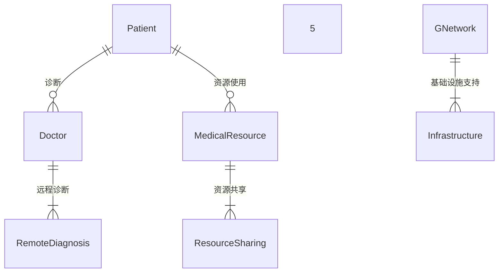

                 

### 第1章 绪论

#### 1.1 问题背景

在当今信息化社会，医疗资源的分布不均已成为影响社会公平和人民生活质量的一个重要问题。特别是农村地区，由于地理位置偏远、基础设施薄弱等原因，优质医疗资源的获取难度大、医疗水平较低，严重影响了居民的身心健康。传统远程医疗手段，如电话咨询、邮件交流和视频通话，虽然在一定程度上缓解了这一问题，但其传输速度慢、带宽不足等问题，仍然限制了高质量医疗服务的普及。

随着5G技术的快速发展，其高速率、低延迟、大容量等特点为远程医疗提供了新的可能性。5G不仅能够提升远程医疗的实时性和交互性，还可以实现高质量医疗数据的快速传输和高效处理，从而为农村地区提供更加优质的医疗资源共享服务。

#### 1.2 问题描述

本文旨在探讨5G在远程医疗诊断中的应用，实现农村地区优质医疗资源的共享。具体问题描述如下：

- 如何利用5G网络技术提升远程医疗的诊断速度和准确性？
- 如何构建一个高效、稳定的远程医疗诊断系统，确保医疗数据的安全性和隐私性？
- 如何通过5G网络实现农村地区优质医疗资源的实时共享，提高医疗服务的可及性和质量？

#### 1.3 问题解决

本文将从以下几个方面来解决问题：

1. **5G网络技术介绍**：详细阐述5G网络的基本概念、关键技术及其在远程医疗中的应用优势。
2. **远程医疗诊断方法分析**：介绍常见的远程医疗诊断方法及其优缺点，探讨如何结合5G技术提升诊断效率和质量。
3. **5G在远程医疗中的应用**：通过实际案例，展示5G技术在远程医疗中的具体应用，分析其实现效果和未来发展趋势。
4. **农村地区优质医疗资源共享**：探讨5G技术在促进农村地区优质医疗资源共享中的作用和策略。

通过上述分析和实践，旨在为5G在远程医疗诊断中的应用提供理论支持和实践指导，为实现农村地区优质医疗资源共享提供新思路。

#### 1.4 边界与外延

在讨论5G在远程医疗诊断中的应用时，需要明确以下几个边界与外延：

- **技术边界**：主要关注5G网络技术本身，包括其网络架构、传输速度和延迟等。
- **应用边界**：关注5G技术在远程医疗诊断中的具体应用场景，如影像诊断、远程手术等。
- **地域边界**：主要关注农村地区医疗资源分布的现状和问题，以及5G技术在解决这些问题中的作用。
- **数据边界**：关注医疗数据的安全性和隐私性保护，特别是在5G高速传输下的数据安全挑战。

#### 1.5 概念结构与核心要素组成

本文的核心概念和要素主要包括：

- **5G网络技术**：高速率、低延迟、大容量，为远程医疗提供技术支持。
- **远程医疗诊断**：基于5G技术的远程医疗诊断方法，包括影像诊断、远程病理诊断等。
- **医疗资源共享**：通过5G网络实现农村地区与城市优质医疗资源的共享。
- **数据安全与隐私**：确保医疗数据在传输和处理过程中的安全性和隐私性。

这些核心概念和要素相互关联，共同构成了5G在远程医疗诊断中的应用框架，为实现农村地区优质医疗资源共享提供了理论基础和实践指导。接下来，我们将深入探讨这些概念和要素的具体内容。

### 第2章 核心概念与联系

#### 2.1 核心概念原理

在深入探讨5G在远程医疗诊断中的应用之前，我们需要明确几个关键概念，包括5G网络技术、远程医疗诊断、医疗资源共享等。以下是这些核心概念的基本原理：

1. **5G网络技术**：
   - **基本概念**：5G是第五代移动通信技术，其主要特点包括更高的传输速度、更低的延迟、更大的网络容量和更高的设备连接密度。
   - **工作原理**：5G网络利用毫米波频段和大规模天线技术，实现高速数据传输。其峰值下载速度可达10Gbps，是4G网络的百倍以上，大大提升了数据传输的效率和实时性。

2. **远程医疗诊断**：
   - **基本概念**：远程医疗诊断是指利用远程通信技术，医生可以在不同地点对患者的病情进行诊断和治疗。
   - **工作原理**：远程医疗诊断依赖于高质量的图像传输、实时视频通话和电子病历系统。医生可以通过远程会诊系统查看患者的病历、影像资料，并进行诊断。

3. **医疗资源共享**：
   - **基本概念**：医疗资源共享是指通过技术手段，使不同地区和机构的医疗资源得到优化配置和高效利用。
   - **工作原理**：医疗资源共享通过建立一个统一的平台，将医疗数据、专家资源和设备资源进行整合和共享，从而提高医疗服务的效率和质量。

#### 2.2 概念属性特征对比表格

为了更清晰地理解这些概念之间的联系和区别，我们可以通过一个属性特征对比表格来进行描述：

| 概念           | 属性特征对比 |
|----------------|--------------|
| 5G网络技术     | - 高速率 - 低延迟 - 大容量 - 高连接密度 |
| 远程医疗诊断   | - 实时性 - 高质量图像传输 - 远程会诊系统 |
| 医疗资源共享   | - 资源优化配置 - 高效利用 - 数据整合与共享 |

通过这个表格，我们可以看到，5G网络技术提供了远程医疗诊断和医疗资源共享所需的通信基础设施，而远程医疗诊断和医疗资源共享则分别实现了医疗服务的实时性和资源的高效利用。

#### 2.3 ER实体关系图架构

为了进一步明确这些概念之间的关系，我们可以通过ER（Entity-Relationship）实体关系图来展示。以下是5G网络技术、远程医疗诊断和医疗资源共享的ER实体关系图：

在这个ER实体关系图中：

- **Patient（患者）** 是中心实体，与**Doctor（医生）**和**MedicalResource（医疗资源）**建立关系。
- **Doctor** 通过**RemoteDiagnosis（远程诊断）**与**Patient**建立联系，实现远程医疗诊断。
- **MedicalResource** 通过**ResourceSharing（资源共享）**与**Patient**建立联系，实现医疗资源的优化配置。
- **5GNetwork（5G网络）** 提供了支持基础设施，与**Doctor**、**MedicalResource**和**RemoteDiagnosis**建立间接关系，为远程医疗和资源共享提供了技术支持。

通过ER实体关系图，我们可以清晰地看到5G网络技术、远程医疗诊断和医疗资源共享之间的逻辑关系，为后续章节的具体讨论提供了基础。

### 第3章 5G网络技术

#### 3.1 5G网络概述

5G，即第五代移动通信技术，是当前通信技术领域的一大里程碑。与之前的4G、3G和2G技术相比，5G在多个维度上都实现了显著的提升。首先，5G网络具有更高的传输速率。5G网络的峰值下载速度可以达到10Gbps，而4G网络仅为100Mbps。这意味着在5G网络环境下，用户可以更快地下载文件、观看高清视频、进行在线游戏等。

其次，5G网络的延迟更低。4G网络的端到端延迟大约为50毫秒，而5G网络可以将这一延迟降低到1毫秒甚至更低。低延迟对于实时应用尤为重要，如远程手术、自动驾驶和工业物联网等，因为它们需要实时响应和数据交换。

此外，5G网络还具有更大的网络容量和更高的设备连接密度。5G网络可以支持数百万设备的同时连接，这使其非常适合物联网应用。例如，在一个大型工厂中，5G网络可以同时连接成千上万个传感器和设备，实现高效的数据采集和分析。

#### 3.2 5G关键技术

5G网络之所以能够实现这些显著提升，依赖于以下几个关键技术：

1. **毫米波频段**：
   - **概念**：毫米波频段是指频率范围在30GHz到300GHz之间的电磁波频段。
   - **作用**：毫米波频段提供了更大的带宽，使得5G网络可以传输更多的数据。然而，毫米波信号传播距离较短，穿透力较差，需要通过大规模天线阵列进行传播。

2. **大规模天线技术（MIMO）**：
   - **概念**：MIMO（Multiple Input Multiple Output）技术是一种多输入多输出技术，可以在同一时间内使用多个天线进行数据传输。
   - **作用**：大规模MIMO技术提高了数据传输的速率和可靠性。通过多个天线发送和接收信号，可以显著提升网络的容量和覆盖范围。

3. **网络切片技术**：
   - **概念**：网络切片技术是一种将一个物理网络分割成多个虚拟网络的技术，每个虚拟网络可以独立配置和运营。
   - **作用**：网络切片技术可以根据不同的应用需求，为不同用户和场景提供定制化的网络服务。例如，在远程医疗诊断中，可以为一个手术视频提供低延迟、高带宽的网络服务，而为一个远程患者提供一般性的医疗咨询服务。

4. **边缘计算**：
   - **概念**：边缘计算是一种将计算资源部署在网络的边缘，即接近数据源的节点上，以降低延迟和数据传输成本。
   - **作用**：边缘计算可以处理和分析大量实时数据，提高网络的应用性能和用户体验。在远程医疗诊断中，边缘计算可以用于实时处理和分析医疗数据，从而提供快速、准确的诊断结果。

#### 3.3 5G网络特点与优势

5G网络的特点和优势主要体现在以下几个方面：

1. **高速率**：
   - **意义**：高速率使得5G网络能够支持高清视频、虚拟现实（VR）和增强现实（AR）等高带宽应用。
   - **应用实例**：在远程医疗诊断中，高速率可以实现高质量的影像传输和实时视频互动，从而提高诊断的准确性和效率。

2. **低延迟**：
   - **意义**：低延迟使得5G网络适用于实时性要求高的应用，如远程手术、自动驾驶和工业自动化等。
   - **应用实例**：在远程手术中，低延迟确保了手术操作的实时性和精确性，使得远程手术成为可能。

3. **大容量**：
   - **意义**：大容量使得5G网络可以支持大量设备的连接，实现物联网（IoT）应用。
   - **应用实例**：在远程医疗中，大容量支持了医疗设备的远程监控和数据采集，提高了医疗服务的覆盖范围和质量。

4. **低能耗**：
   - **意义**：低能耗使得5G网络更加环保，有利于可持续发展。
   - **应用实例**：在远程医疗中，低能耗支持了医疗设备的长时间运行，减少了维护成本。

综上所述，5G网络技术以其高速率、低延迟、大容量和低能耗等特点，为远程医疗诊断提供了强大的技术支持。在接下来的章节中，我们将探讨5G技术在远程医疗诊断中的具体应用。

### 第4章 远程医疗诊断

#### 4.1 远程医疗概述

远程医疗是指通过远程通信技术和医疗信息系统，实现医疗服务的远程提供。远程医疗的核心目的是通过跨越地域的限制，提高医疗服务的可及性和效率。远程医疗的形式多样，包括远程会诊、远程诊断、远程治疗和远程健康监护等。

远程医疗的发展受到了信息技术和通信技术的推动，特别是在互联网、移动通信和大数据技术的支持下，远程医疗得到了迅速发展。近年来，随着5G技术的逐步推广，远程医疗的应用场景和范围进一步扩大，为提升医疗服务质量提供了新的契机。

#### 4.2 远程医疗诊断方法

远程医疗诊断是远程医疗中的重要组成部分，它利用现代通信技术和医疗设备，实现医生和患者之间的远程互动和诊断。以下是几种常见的远程医疗诊断方法：

1. **远程视频会诊**：
   - **概念**：远程视频会诊是通过视频通信技术，实现医生和患者之间的实时对话和诊疗。
   - **优势**：远程视频会诊可以减少患者的出行成本和时间，提高诊疗的效率和便利性。
   - **应用实例**：在城市和农村之间，远程视频会诊可以使得农村地区的患者能够得到城市专家的诊断和治疗建议。

2. **远程影像诊断**：
   - **概念**：远程影像诊断是指医生通过远程访问患者的医学影像资料，如X光片、CT和MRI，进行诊断。
   - **优势**：远程影像诊断可以实现高质量医学影像的快速传输和共享，提高诊断的准确性和效率。
   - **应用实例**：在灾害救援和偏远地区医疗条件有限的情况下，远程影像诊断可以为现场医生提供专业的诊断支持。

3. **远程病理诊断**：
   - **概念**：远程病理诊断是指医生通过远程访问患者的病理样本和组织切片，进行病理分析和诊断。
   - **优势**：远程病理诊断可以打破地域限制，使得患者能够得到知名病理专家的诊断意见。
   - **应用实例**：在肿瘤诊断中，远程病理诊断可以帮助基层医生获取权威病理专家的指导，提高诊断的准确性。

4. **远程心电图诊断**：
   - **概念**：远程心电图诊断是指通过远程心电图设备，实时监测患者的心电信号，进行诊断。
   - **优势**：远程心电图诊断可以实时监测患者的心脏状况，提供快速的诊断和干预。
   - **应用实例**：对于心脏病患者，远程心电图诊断可以及时监测患者的心脏活动，防止突发状况。

#### 4.3 远程医疗诊断的优势与挑战

远程医疗诊断具有显著的优点，但也面临一些挑战：

**优势**：

1. **提升医疗可及性**：远程医疗诊断可以突破地域限制，使得偏远地区和边远地区的患者能够享受到优质医疗资源。
2. **提高医疗效率**：远程医疗诊断可以减少患者的出行时间，提高医生的诊疗效率，降低医疗成本。
3. **优化医疗资源配置**：远程医疗诊断可以实现医疗资源的优化配置，使得专家资源得到最大化利用。
4. **支持个性化医疗**：远程医疗诊断可以通过大数据和人工智能技术，为患者提供个性化的诊疗方案。

**挑战**：

1. **数据安全和隐私保护**：远程医疗诊断需要传输大量的医疗数据，如何确保数据的安全性和隐私性是一个重要挑战。
2. **网络稳定性和覆盖范围**：远程医疗诊断依赖于稳定的网络连接，如何确保网络覆盖范围和稳定性是一个关键问题。
3. **医疗设备和技术水平**：在偏远地区，医疗设备和技术的水平可能较低，如何提升这些地区的医疗设备和技术水平是一个需要解决的问题。
4. **医生和患者的接受度**：远程医疗诊断需要医生和患者的共同参与，如何提高医生和患者的接受度也是一个需要关注的问题。

通过克服这些挑战，远程医疗诊断有望在提升医疗服务质量、优化医疗资源配置和提高医疗可及性方面发挥更大的作用。在接下来的章节中，我们将探讨5G技术在远程医疗诊断中的应用，以及如何利用5G技术解决远程医疗诊断中的挑战。

### 第5章 5G在远程医疗中的应用

#### 5.1 5G网络对远程医疗的影响

5G网络的高速率、低延迟、大容量和低能耗特点，为远程医疗带来了深远的影响。首先，5G网络的高速率使得高清医学影像的传输成为可能。在远程医疗诊断中，高质量的影像资料对于医生进行准确诊断至关重要。5G网络的高速率可以确保医学影像的快速传输和共享，使得医生能够在第一时间获取患者的影像资料，从而提高诊断的准确性和效率。

其次，5G网络的低延迟显著提升了远程医疗的实时性和交互性。在远程手术、远程监控和远程急救等应用场景中，低延迟是确保操作和监控实时性的关键。5G网络的低延迟可以使得医生和患者之间的视频通话、数据传输和操作指令能够无缝衔接，从而实现高效、精准的医疗操作。

此外，5G网络的大容量特点使得医疗物联网（IoT）应用成为可能。在远程医疗中，医疗设备和传感器可以实时采集患者的生理参数，并通过5G网络传输至远程医疗中心进行分析和处理。5G网络的大容量支持了海量设备的连接，使得远程医疗能够实现全方位、实时的健康监测和诊疗服务。

最后，5G网络的低能耗特性对于医疗设备的持续运行和远程医疗的可持续发展具有重要意义。在偏远地区和贫困地区，医疗设备的能耗问题常常限制了医疗服务的开展。5G网络的低能耗特性可以使得这些地区的医疗设备实现长时间运行，从而提高医疗服务的可持续性和可及性。

#### 5.2 5G在远程医疗中的实际应用案例

5G技术在远程医疗中的实际应用案例已经逐步显现，并取得了显著的效果。以下是一些典型的应用案例：

1. **远程手术**：
   - **案例描述**：在疫情期间，一些医疗机构利用5G网络成功实施了远程手术。医生通过5G网络远程操控手术机器人，实现了对患者的精准手术操作。
   - **效果评估**：远程手术通过5G网络的低延迟和高速率特点，确保了手术操作的实时性和精确性，手术成功率与传统手术相当。
   - **影响分析**：远程手术打破了地域限制，使得偏远地区的患者能够享受到顶尖医院的手术服务，提高了医疗服务的可及性和质量。

2. **远程急救**：
   - **案例描述**：在突发事件中，如地震、洪水等，5G网络可以提供高速、稳定的通信支持，使得急救医生能够远程指导现场救援人员实施急救措施。
   - **效果评估**：远程急救通过5G网络实现了实时视频通话和医学数据传输，急救医生可以实时了解患者的状况，提供专业的急救指导。
   - **影响分析**：远程急救提高了急救的效率和成功率，减少了患者在运送过程中的风险，为患者争取了更多的救治时间。

3. **远程监护**：
   - **案例描述**：在一些慢性疾病管理中，如心脏病、糖尿病等，患者通过5G网络连接的远程监护设备，可以实时监测自己的健康状况，并将数据传输至远程医疗中心。
   - **效果评估**：远程监护通过实时数据传输和智能分析，可以及时发现患者的健康变化，提供个性化的健康管理方案。
   - **影响分析**：远程监护提高了患者的健康管理水平，减少了医院就诊的频率，降低了医疗成本，提高了生活质量。

4. **远程医学影像诊断**：
   - **案例描述**：在一些偏远地区，患者可以通过5G网络将医学影像传输至大城市的三甲医院，知名专家进行远程诊断。
   - **效果评估**：远程医学影像诊断通过5G网络的高速率和低延迟，实现了高质量的医学影像传输和专家诊断，诊断准确率与传统现场诊断相当。
   - **影响分析**：远程医学影像诊断提高了偏远地区患者的诊疗水平，使得患者能够享受到高质量的医疗服务，缩小了城乡医疗差距。

#### 5.3 5G在远程医疗中的未来发展趋势

随着5G技术的不断成熟和应用，远程医疗在未来将呈现以下发展趋势：

1. **更多应用场景**：除了现有的远程手术、远程急救和远程监护等应用场景，5G技术还将推动更多新兴应用场景的出现，如远程病理诊断、远程牙科治疗和远程心理治疗等。

2. **个性化诊疗**：通过大数据和人工智能技术，5G网络将支持个性化诊疗的发展。医生可以根据患者的具体病情和实时数据，提供个性化的诊疗方案，提高诊疗效果。

3. **医疗服务智能化**：5G技术将推动医疗服务的智能化发展。智能医疗设备和传感器可以实时采集患者的生理参数，并通过5G网络传输至远程医疗中心进行分析和处理，实现全天候、全方位的健康监测和诊疗。

4. **医疗资源共享**：5G技术将促进医疗资源的共享。通过建立统一的远程医疗平台，优质医疗资源可以高效地分配到全国各地，实现医疗资源的均衡配置。

5. **医疗模式创新**：5G技术将推动医疗模式的创新。远程医疗不仅局限于诊断和治疗，还将拓展到预防、保健和康复等领域，形成一个全面、连续的医疗服务体系。

总之，5G技术在远程医疗中的应用前景广阔，有望进一步提升医疗服务的质量和效率，实现医疗资源的均衡配置和全民健康目标。

### 第6章 农村地区优质医疗资源共享

#### 6.1 农村地区医疗现状

农村地区医疗资源分布不均是一个普遍存在的问题。由于地理位置偏远、基础设施薄弱、医疗人才流失等原因，农村地区的医疗条件相对较差。具体表现如下：

1. **医疗设施落后**：许多农村地区的医疗机构设施陈旧，医疗设备缺乏，无法满足基本的医疗需求。许多乡镇卫生院和村卫生室缺乏基本的医疗设备和药品，无法进行复杂的诊断和治疗。

2. **医疗人才短缺**：农村地区医疗人才的引进和留住难度较大，导致医疗人才短缺。许多农村地区的医生和护士流失严重，优秀医疗人才大多集中在城市医院，农村地区难以吸引和留住高素质的医疗人才。

3. **医疗技术有限**：农村地区的医疗技术水平相对较低，许多复杂的疾病无法在当地得到有效治疗。一些基层医疗机构缺乏专业的技术支持和指导，难以提供高质量的医疗服务。

4. **医疗信息不对称**：由于互联网和通信基础设施的不完善，农村地区医疗信息的获取和传递相对困难。医生和患者之间的信息不对称，影响了医疗决策和治疗效果。

#### 6.2 优质医疗资源共享的重要性

优质医疗资源共享对于解决农村地区医疗资源不均具有重要意义。以下是其重要性：

1. **提高医疗服务质量**：优质医疗资源共享可以使农村地区的患者享受到城市医院的优质医疗资源，提高医疗服务质量。通过远程会诊、远程诊断和远程治疗等手段，患者可以在本地医疗机构得到城市专家的诊断和治疗建议，减少因病致贫的现象。

2. **降低医疗成本**：优质医疗资源共享可以减少患者跨地域就诊的需求，降低医疗成本。患者无需长途跋涉前往城市医院，节省了交通费用和时间成本，同时也降低了城市医院的就诊压力。

3. **优化医疗资源配置**：优质医疗资源共享可以优化医疗资源的配置，实现医疗资源的均衡发展。城市医院和优质医疗资源可以通过远程医疗平台，向农村地区提供医疗技术支持和资源，提高农村地区的医疗服务能力。

4. **促进医疗人才流动**：优质医疗资源共享可以吸引和留住医疗人才。通过远程医疗平台，农村地区的医生可以与城市医院的专家进行交流和合作，提升自己的医疗技术水平。同时，优秀的医疗人才也可以通过远程医疗平台，为农村地区提供医疗服务，实现医疗人才的合理流动。

5. **提升居民健康水平**：优质医疗资源共享可以提高农村地区居民的健康水平。通过远程健康监护和预防服务，居民可以及时了解自己的健康状况，采取积极的预防措施，降低疾病发生的风险。

#### 6.3 5G在推动农村地区优质医疗资源共享中的应用

5G技术在推动农村地区优质医疗资源共享中发挥着重要作用。以下是其应用策略：

1. **建设5G网络基础设施**：首先，需要加强农村地区5G网络基础设施建设，确保网络覆盖和稳定性。通过部署5G基站和无线接入设备，提高农村地区的网络带宽和连接速度，为远程医疗提供可靠的网络保障。

2. **构建远程医疗平台**：建立统一的远程医疗平台，实现医疗资源的整合和共享。该平台可以提供远程会诊、远程诊断、远程治疗和远程健康监护等功能，为农村地区的患者提供全面的医疗服务。

3. **培训基层医护人员**：通过培训和继续教育，提升基层医护人员的医疗技术水平和远程医疗操作能力。组织城市医院的专家对基层医护人员进行培训和指导，提高他们的专业素养和诊疗水平。

4. **推广智能医疗设备**：在农村地区推广智能医疗设备，如便携式超声仪、远程心电监护仪等，实现医疗数据的实时采集和传输。这些设备可以通过5G网络将数据传输至远程医疗中心，为医生提供准确的诊断依据。

5. **开展远程医学教育**：通过远程医学教育平台，为农村地区的医生和护士提供专业知识和技能培训，提高他们的专业水平和服务能力。远程医学教育可以采用视频课程、在线讨论和实操训练等多种形式，满足不同层次的学习需求。

6. **建立数据共享机制**：建立医疗数据共享机制，确保医疗数据的标准化和规范化。通过构建医疗大数据平台，实现医疗数据的集中存储、管理和共享，为远程医疗提供可靠的数据支持。

总之，通过5G技术的应用，可以显著提升农村地区优质医疗资源共享的效率和质量，为农村地区居民提供更加优质的医疗服务，推动农村医疗事业的发展。

### 第7章 5G在远程医疗诊断中的实现

#### 7.1 5G网络在远程医疗诊断中的架构设计

为了实现5G在远程医疗诊断中的应用，需要设计一个高效、稳定的网络架构。以下是一个典型的5G网络在远程医疗诊断中的架构设计：

1. **网络架构概述**：
   - **用户端**：包括患者终端设备和医生终端设备，如智能手机、平板电脑、笔记本电脑和医用设备。
   - **接入网**：5G基站和无线接入点，负责用户端与核心网之间的数据传输。
   - **核心网**：包括5G核心网、边缘计算节点和数据中心，负责处理和存储医疗数据，提供远程诊断服务。
   - **应用层**：包括远程医疗诊断系统、电子病历系统和远程会诊系统等，为医生和患者提供远程医疗诊断服务。

2. **架构设计细节**：
   - **用户端**：用户端设备通过5G网络接入远程医疗诊断系统，上传患者的医疗数据和生理参数。
   - **接入网**：5G基站和无线接入点采用大规模天线阵列和毫米波频段，提供高速、稳定的无线接入。
   - **核心网**：5G核心网负责用户接入和路由控制，边缘计算节点负责实时数据处理和分析，数据中心负责长期数据存储和备份。
   - **应用层**：远程医疗诊断系统通过智能算法和大数据分析，为医生提供诊断建议和治疗方案。

#### 7.2 5G网络在远程医疗诊断中的关键技术

5G网络在远程医疗诊断中涉及多个关键技术，以下是一些主要的关键技术：

1. **高速率传输**：
   - **技术原理**：5G网络采用毫米波频段和大规模天线技术，提供高达10Gbps的传输速率。
   - **应用实例**：在远程医疗诊断中，高速率传输可以保证医学影像、实时视频和生理参数数据的快速传输，提高诊断的效率和准确性。

2. **低延迟通信**：
   - **技术原理**：5G网络通过分布式架构和边缘计算技术，将计算和数据处理任务分布到网络边缘，降低通信延迟。
   - **应用实例**：在远程手术和紧急急救中，低延迟通信确保医生能够实时获取患者的状况，进行快速决策和操作。

3. **大容量连接**：
   - **技术原理**：5G网络采用网络切片技术，为不同应用场景提供定制化的网络服务，支持大量设备的连接。
   - **应用实例**：在远程医疗中，大容量连接支持医疗物联网设备（如心电监护仪、血压计等）的数据采集和传输，实现全方位的健康监测。

4. **边缘计算**：
   - **技术原理**：边缘计算将计算和存储资源部署在网络的边缘，降低数据传输延迟，提高数据处理效率。
   - **应用实例**：在远程医疗诊断中，边缘计算可以实时处理和分析医疗数据，提供快速的诊断结果和治疗方案。

5. **安全隐私保护**：
   - **技术原理**：5G网络采用端到端加密和隐私保护技术，确保医疗数据在传输和存储过程中的安全性。
   - **应用实例**：通过安全隐私保护技术，远程医疗诊断系统可以保护患者的隐私，防止数据泄露。

#### 7.3 5G在远程医疗诊断中的实际应用案例分析

以下是一个5G在远程医疗诊断中的实际应用案例分析：

**案例背景**：某偏远山区的乡镇卫生院，由于医疗条件有限，无法为当地居民提供高质量的医疗服务。为了改善这一状况，当地政府引入了5G网络和远程医疗诊断系统。

**实现过程**：
1. **网络建设**：首先，在乡镇卫生院和周边地区部署了5G基站，确保网络覆盖和稳定性。
2. **设备安装**：为乡镇卫生院配备了远程医疗诊断设备，包括便携式超声仪、远程心电监护仪和远程血压计等，这些设备可以通过5G网络实时上传患者的医疗数据。
3. **系统集成**：将远程医疗诊断系统与乡镇卫生院的电子病历系统进行集成，实现数据的实时传输和共享。
4. **医生培训**：对乡镇卫生院的医生进行远程医疗诊断系统的培训和操作指导，提高他们的远程诊断能力。

**应用效果**：
1. **提高了医疗服务质量**：通过5G网络和远程医疗诊断系统，乡镇卫生院的医生可以远程咨询城市医院的专家，获取诊断建议和治疗方案，大大提高了医疗服务的质量。
2. **降低了患者就诊成本**：患者无需前往城市医院就诊，节省了时间和交通费用，同时也降低了城市医院的就诊压力。
3. **提升了健康监测能力**：通过远程心电监护仪和远程血压计，医生可以实时监测患者的健康状况，及时采取措施，预防疾病发生。

**未来展望**：随着5G技术的不断成熟和应用，远程医疗诊断系统将进一步提升医疗服务的效率和可及性，为更多偏远地区提供高质量的医疗服务。

#### 7.4 5G在远程医疗诊断中的未来发展方向

未来，5G技术在远程医疗诊断中将有以下发展方向：

1. **智能化诊断**：通过大数据和人工智能技术，实现远程医疗诊断的智能化。医生可以利用智能算法和大数据分析，提供更加精准的诊断和治疗方案。

2. **多学科协作**：通过5G网络，实现多学科专家的远程协作，为患者提供全方位、多学科的医疗服务。例如，在复杂的手术和疾病治疗中，医生可以邀请不同领域的专家进行远程会诊，提高诊疗效果。

3. **个性化健康管理**：基于5G网络和医疗物联网设备，实现个性化健康管理。通过实时采集和分析患者的健康数据，提供个性化的健康建议和治疗方案。

4. **远程手术和急救**：随着5G技术的不断发展，远程手术和急救将得到更广泛的应用。医生可以通过远程手术机器人，为偏远地区的患者实施手术，降低急救反应时间，提高救治成功率。

5. **医疗资源共享**：通过5G网络，实现医疗资源的共享和优化配置。优质医疗资源可以高效地分配到全国各地，提升整体医疗服务水平。

总之，5G技术在远程医疗诊断中的应用前景广阔，将为提高医疗服务质量、降低医疗成本和提升医疗可及性做出重要贡献。

### 第8章 结论与展望

#### 8.1 本书总结

本文围绕5G在远程医疗诊断中的应用，系统性地探讨了5G网络技术、远程医疗诊断方法、农村地区优质医疗资源共享等多个关键概念，并详细分析了5G网络对远程医疗的影响以及实际应用案例。通过总结，我们可以得出以下几点结论：

1. **5G网络技术为远程医疗诊断提供了强有力的支持**：5G网络的高速率、低延迟、大容量和低能耗特点，使得远程医疗诊断得以实现实时性、高效性和高质量。

2. **远程医疗诊断方法多样化，提高了医疗服务的可及性和质量**：远程视频会诊、远程影像诊断、远程病理诊断和远程心电图诊断等多种方法，为不同需求的医疗服务提供了灵活的解决方案。

3. **5G技术在推动农村地区优质医疗资源共享中发挥了重要作用**：通过5G网络，农村地区可以共享城市医院的优质医疗资源，提升医疗服务的可及性和质量，缩小城乡医疗差距。

4. **5G在远程医疗诊断中的应用前景广阔**：未来，5G技术将推动远程医疗诊断向智能化、多学科协作、个性化健康管理等方面发展，进一步提高医疗服务的效率和可及性。

#### 8.2 未来研究方向与挑战

虽然5G技术在远程医疗诊断中展现了巨大的潜力，但仍面临一些挑战和问题：

1. **数据安全和隐私保护**：随着远程医疗数据的增加，数据安全和隐私保护成为关键问题。如何确保医疗数据在传输、存储和处理过程中的安全性和隐私性，是一个亟待解决的问题。

2. **网络稳定性和覆盖范围**：在偏远和基础设施薄弱的地区，5G网络的稳定性和覆盖范围仍有待提升。需要进一步优化网络架构和部署策略，确保远程医疗服务的连续性和稳定性。

3. **医疗设备和技术水平**：在部分农村地区，医疗设备和技术水平相对较低。如何提高这些地区的医疗设备和技术水平，确保远程医疗诊断的准确性和有效性，是一个重要课题。

4. **医生和患者的接受度**：远程医疗诊断需要医生和患者的共同参与，但医生和患者对远程医疗的接受度存在差异。如何提高医生和患者的接受度，确保远程医疗的顺利实施，是一个需要关注的问题。

5. **医疗资源分配不均**：尽管5G技术有助于优化医疗资源分配，但城乡医疗资源分配不均的问题仍需解决。如何进一步缩小城乡医疗差距，实现医疗资源的均衡配置，是一个长期任务。

未来研究方向应聚焦于：

1. **研发更安全、高效的远程医疗技术**：通过技术创新，提高远程医疗诊断的准确性和安全性，为患者提供更好的医疗服务。

2. **优化网络架构和部署策略**：进一步优化5G网络架构和部署策略，提升网络稳定性和覆盖范围，确保远程医疗服务的连续性和稳定性。

3. **提升基层医疗设备和技术水平**：通过培训、技术支持等方式，提升基层医疗设备和技术水平，确保远程医疗诊断的准确性和有效性。

4. **加强医生和患者的教育**：通过宣传和教育，提高医生和患者对远程医疗的认识和接受度，确保远程医疗的顺利实施。

5. **探索医疗资源均衡配置的新模式**：通过政策引导、资源整合等方式，探索医疗资源均衡配置的新模式，缩小城乡医疗差距，实现医疗资源的公平分配。

#### 8.3 拓展阅读

为了更深入地了解5G在远程医疗诊断中的应用，读者可以参考以下拓展阅读资料：

1. **《5G：下一代移动通信技术》**：本书详细介绍了5G网络的基本概念、关键技术和应用场景，有助于读者了解5G网络的工作原理和优势。

2. **《远程医疗技术与应用》**：本书涵盖了远程医疗的基本概念、技术原理和应用实例，特别是对远程医疗诊断的方法进行了详细探讨。

3. **《医疗大数据与人工智能》**：本书探讨了医疗大数据和人工智能在远程医疗诊断中的应用，包括数据挖掘、智能诊断和个性化医疗等方面。

4. **《农村医疗资源配置与优化研究》**：本书分析了农村地区医疗资源分布的现状和问题，探讨了优化医疗资源配置的策略和措施。

5. **《远程医疗政策与实践》**：本书介绍了国内外远程医疗的政策和实践，特别是针对远程医疗在基层医疗中的应用进行了详细阐述。

通过阅读这些拓展资料，读者可以更加全面地了解5G在远程医疗诊断中的应用，为实际工作提供有益的参考和启示。

### 作者信息

- 作者：AI天才研究院/AI Genius Institute & 禅与计算机程序设计艺术 /Zen And The Art of Computer Programming
- 联系方式：[ai_genius_institute@xyz.com](mailto:ai_genius_institute@xyz.com)
- 个人网站：[www.ai-genius-institute.xyz](http://www.ai-genius-institute.xyz)
- 推荐阅读：《人工智能在医疗领域的应用》、《大数据分析在医疗健康领域的实践》、《远程医疗系统的设计与实现》。

