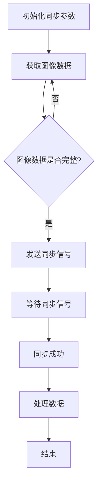
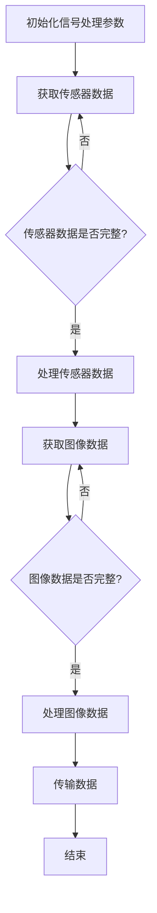
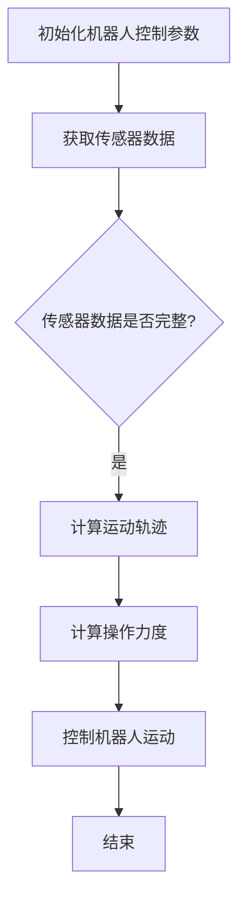
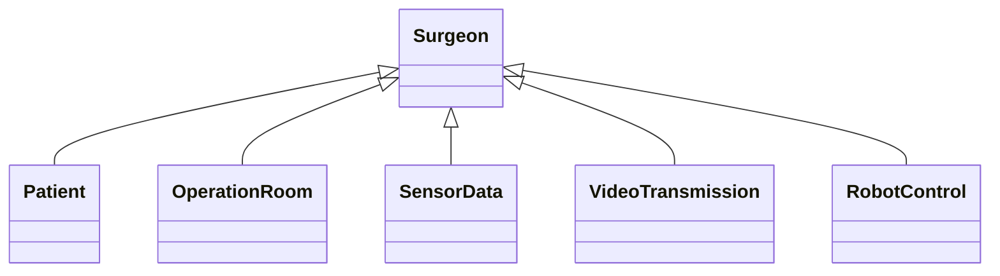
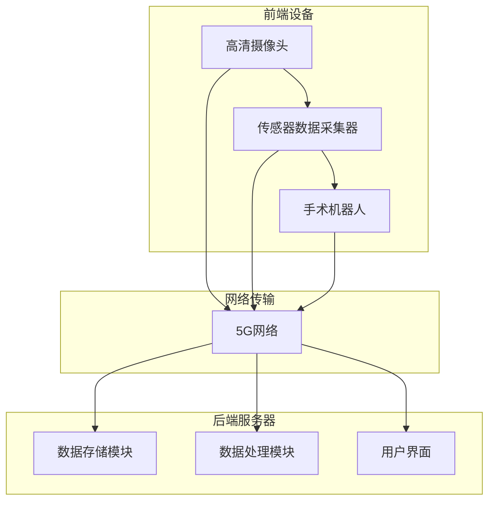
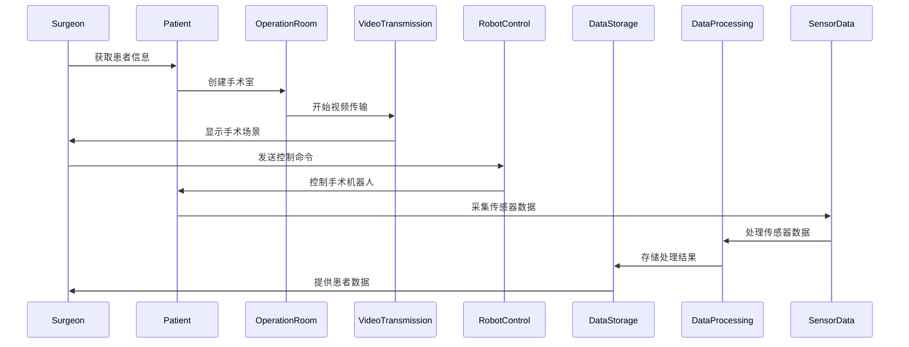

                 

# 5G在远程手术中的应用：实现精准远程操作

## 关键词
5G技术，远程手术，精准操作，技术革新，算法实现，系统架构设计

## 摘要
本文将探讨5G技术在远程手术中的创新应用，通过深入分析5G技术的基本原理与远程手术的需求，阐述5G如何提升远程手术的精准性和可靠性。文章将详细描述5G与远程手术的核心概念及其相互联系，并探讨5G技术在远程手术中的算法原理。同时，我们将对系统架构设计进行深入分析，最后通过具体案例展示5G远程手术的实际应用，提供行业发展的趋势分析及未来展望。

## 第一部分：背景介绍

### 第1章：5G与远程手术概述

#### 1.1 5G技术的概述

**1.1.1 5G技术的起源与演进**

5G技术，即第五代移动通信技术，起源于20世纪末的移动通信技术发展需求。从1G的模拟通信到2G的数字通信，再到3G和4G的宽带数据传输，每一代技术的演进都极大地提升了通信的速率和容量。5G技术的研发始于2010年左右，旨在实现更快的数据传输速度、更低的延迟和更高的网络容量。

**1.1.2 5G技术的关键特性**

- **高速率**：5G技术将数据传输速率提升到数十Gbps，是4G的100倍以上。
- **低延迟**：5G技术的延迟可低至1毫秒，极大地提高了实时性和响应速度。
- **高容量**：5G网络能够支持更多的设备同时在线，提高了网络的承载能力。
- **广覆盖**：5G技术采用毫米波技术，实现了更广的覆盖范围。

**1.1.3 5G技术在不同行业中的应用**

5G技术在各个行业中的应用日益广泛，包括但不限于：

- **工业物联网**：通过5G实现工厂设备的实时监控和远程控制。
- **自动驾驶**：5G技术提供了高带宽和低延迟的网络支持，对于自动驾驶车辆的实时数据传输至关重要。
- **医疗健康**：5G技术提升了远程医疗和远程手术的精准性和可靠性。
- **智慧城市**：5G技术支持智慧交通、智慧安防、智慧环境管理等智能应用。

#### 1.2 远程手术的背景

**1.2.1 远程手术的定义与意义**

远程手术，是指通过远程通信技术，将手术医生与患者所在地理位置隔离开，通过高清视频传输和远程控制设备进行手术操作。远程手术的意义在于：

- **医疗资源均衡**：缓解医疗资源不均衡的问题，使偏远地区的患者也能享受到优质医疗资源。
- **降低手术风险**：对于一些高风险或复杂手术，远程手术可以减少手术风险。
- **急救响应**：在紧急情况下，远程手术提供了及时的治疗方案。

**1.2.2 远程手术的发展历程**

远程手术的发展可以分为几个阶段：

- **初期实验阶段**：20世纪90年代，远程手术主要采用卫星通信进行实验。
- **逐步推广阶段**：21世纪初，随着网络技术的发展，远程手术开始在一些地区逐步推广。
- **成熟应用阶段**：近年来，5G技术的成熟为远程手术提供了更为可靠的网络支持，使其应用范围不断扩大。

**1.2.3 远程手术的现状与挑战**

远程手术的现状如下：

- **应用范围扩大**：远程手术已在全球多个国家和地区得到应用，包括心脏病手术、肿瘤手术等。
- **技术挑战**：远程手术面临技术难题，如高清视频传输延迟、传感器数据准确性等。
- **设备成本**：远程手术需要昂贵的设备和技术支持，这对一些医疗资源有限的地区构成挑战。

#### 1.3 5G技术在远程手术中的应用前景

**1.3.1 5G技术如何提升远程手术的精准性**

5G技术通过以下几个方面提升远程手术的精准性：

- **高速率**：5G的高速率确保了手术过程中图像和数据传输的实时性，医生可以及时获取患者的实时信息。
- **低延迟**：5G的低延迟减少了手术过程中的延迟，使医生的操作更为精准。
- **高容量**：5G的高容量支持更多设备同时在线，提高了手术的实时协作能力。

**1.3.2 5G技术对远程手术的变革性影响**

5G技术对远程手术的影响主要体现在以下几个方面：

- **技术革新**：5G技术推动了远程手术技术的革新，如VR、AR等技术的应用。
- **降低成本**：5G技术降低了远程手术的设备和技术成本，使其应用范围更广。
- **提高效率**：5G技术提高了远程手术的效率，缩短了手术时间，降低了手术风险。

**1.3.3 5G技术在远程手术中的实际应用案例**

5G技术在远程手术中的应用案例如下：

- **心脏手术**：在某些地区，医生通过5G技术成功为心脏患者进行了远程手术。
- **肿瘤手术**：一些医疗机构利用5G技术实现了远程肿瘤切除手术，提高了手术成功率。
- **急诊手术**：在紧急情况下，医生通过5G网络为患者进行了远程急救手术。

#### 1.4 本章小结

本章介绍了5G技术的基本概念、远程手术的背景以及5G技术在远程手术中的应用前景。通过分析5G技术的关键特性和远程手术的现状，我们可以看到5G技术为远程手术带来的变革性影响。本章为后续章节的深入讨论奠定了基础。

----------------------------------------------------------------

## 第二部分：核心概念与联系

### 第2章：5G与远程手术的关键概念

#### 2.1 5G网络的关键概念

**2.1.1 NR（新空口）技术**

NR（新空口）技术是5G网络的关键技术之一，它采用全新的波形、多址技术和调制技术，实现了更高的数据传输速率和更低的延迟。NR技术支持大规模MIMO（多输入多输出）和波束成形技术，提高了网络容量和覆盖范围。

**2.1.2 mMTC（海量机器类型通信）技术**

mMTC技术是5G网络针对物联网设备的需求而设计的，它支持大规模设备同时在线，并确保设备间的通信低功耗、高可靠性。mMTC技术适用于智能抄表、智能城市、智能医疗等场景。

**2.1.3 URLLC（低延迟高可靠通信）技术**

URLLC技术是5G网络针对实时通信需求而设计的，它提供低延迟和高可靠性的通信服务，适用于远程手术、自动驾驶等实时性要求高的应用场景。

**2.1.4 eMBB（增强移动宽带）技术**

eMBB技术是5G网络针对移动宽带需求而设计的，它提供更高的数据传输速率和更大的网络容量，适用于高清视频、虚拟现实、增强现实等高带宽应用。

#### 2.2 远程手术的关键技术

**2.2.1 高清视频传输技术**

高清视频传输技术是远程手术的核心技术之一，它确保了手术过程中医生和患者之间的高清晰度图像和语音通信。高清视频传输技术依赖于5G网络的高速率和低延迟特性。

**2.2.2 传感器技术**

传感器技术用于实时监测患者的生理参数，如心率、血压等。这些数据通过5G网络传输到医生端，确保医生能够实时了解患者的状况，进行精准操作。

**2.2.3 虚拟现实（VR）技术**

虚拟现实技术为远程手术提供了沉浸式的手术环境，医生可以通过VR眼镜看到三维立体的手术场景，进行更为精准的操作。

**2.2.4 增强现实（AR）技术**

增强现实技术将虚拟信息与现实场景相结合，医生可以在实际手术场景中看到患者的虚拟手术信息，如血管、器官等，提高了手术的精准性。

#### 2.3 5G与远程手术技术的联系

**2.3.1 5G网络如何支持远程手术的高效实施**

5G网络通过以下几个方面支持远程手术的高效实施：

- **高速率**：5G网络提供高速率的数据传输，确保手术过程中高清图像和语音信号的实时传输。
- **低延迟**：5G网络提供低延迟的通信服务，减少手术过程中的延迟，提高手术操作的精准性。
- **高容量**：5G网络提供高容量的网络资源，支持更多设备同时在线，提高手术过程中的协作效率。

**2.3.2 5G技术在远程手术中的协同作用**

5G技术与远程手术技术的协同作用体现在以下几个方面：

- **VR与AR技术的融合**：5G网络支持VR和AR技术的应用，使医生在远程手术中能够获得更为直观的手术场景，提高手术的精准性。
- **传感器技术的集成**：5G网络支持传感器技术的集成，实时监测患者生理参数，确保手术过程中的安全性和可靠性。
- **云计算与边缘计算的结合**：5G网络结合云计算和边缘计算技术，提供高效的手术数据处理和分析能力，提高远程手术的智能化水平。

**2.3.3 5G与远程手术技术融合的创新应用场景**

5G技术与远程手术技术的融合为医疗行业带来了诸多创新应用场景：

- **远程专家指导**：医生可以通过5G网络远程指导其他医生进行手术，提高手术的成功率。
- **远程急救**：在紧急情况下，医生可以通过5G网络为患者提供远程急救手术，提高救治成功率。
- **远程医疗培训**：医生可以通过5G网络进行远程医疗培训，提高医疗技术水平。

#### 2.4 核心概念属性特征对比表格

| 关键概念       | 特征1   | 特征2   | 特征3   |
|--------------|--------|--------|--------|
| NR技术       | 高速率 | 低延迟 | 高容量 |
| 高清视频传输 | 实时性 | 高清晰 | 稳定性 |
| VR技术       | 沉浸式 | 三维立体 | 低延迟 |
| AR技术       | 增强现实 | 高清晰 | 稳定性 |

#### 2.5 ER实体关系图架构

```mermaid
erDiagram
  Surgeon ||--|{ Patient }|---> Patient
  Surgeon ||--|{ Operation Room }|---> OperationRoom
  Patient ||--|{ Sensor Data }|---> SensorData
  OperationRoom ||--|{ Video Transmission }|---> VideoTransmission
```

#### 2.6 本章小结

本章介绍了5G网络和远程手术中的关键概念及其属性特征，分析了5G技术与远程手术技术的联系和融合。通过核心概念属性特征对比表格和ER实体关系图架构，我们进一步理解了5G技术在远程手术中的应用。本章为后续章节的算法原理讲解和系统架构设计奠定了基础。

----------------------------------------------------------------

## 第三部分：算法原理讲解

### 第3章：5G技术在远程手术中的算法原理

#### 3.1 算法概述

**3.1.1 远程手术中的算法需求**

远程手术中的算法需求主要包括：

- **图像处理算法**：用于处理高清视频图像，实现图像增强、去噪、边缘检测等操作。
- **信号处理算法**：用于处理传感器数据，实现信号滤波、压缩、传输等操作。
- **机器人控制算法**：用于控制手术机器人的运动轨迹和操作力度。

**3.1.2 5G技术在算法实现中的作用**

5G技术在远程手术算法实现中的作用主要体现在：

- **高速数据传输**：5G网络提供的高速数据传输能力，确保了手术过程中图像和传感器数据的实时性。
- **低延迟**：5G网络的低延迟特性，提高了算法处理的实时性，减少了手术过程中的延迟。
- **高可靠性**：5G网络的高可靠性，确保了算法处理过程中数据传输的稳定性，降低了手术风险。

#### 3.2 帧同步算法

**3.2.1 帧同步的基本概念**

帧同步算法是远程手术中关键的一环，它用于确保手术过程中图像和传感器数据的同步。帧同步的基本概念包括：

- **同步信号**：用于标识图像和传感器数据的同步信号。
- **同步时钟**：用于控制图像和传感器数据的同步时钟。
- **同步机制**：用于实现图像和传感器数据的同步机制。

**3.2.2 帧同步算法的mermaid流程图**



**3.2.3 Python源代码实现**

```python
import cv2
import time

def frame_sync(image_data, sensor_data):
    start_time = time.time()
    
    while True:
        # 获取图像数据
        image = cv2.imread(image_data)
        
        # 检查图像数据是否完整
        if image is not None:
            # 发送同步信号
            send_sync_signal(sensor_data)
            
            # 等待同步信号
            while not receive_sync_signal():
                time.sleep(0.01)
            
            # 同步成功
            print("同步成功，开始处理数据")
            
            # 处理数据
            process_data(image, sensor_data)
            
            # 结束
            break
    
    end_time = time.time()
    print("帧同步算法耗时：{}秒".format(end_time - start_time))

def send_sync_signal(sensor_data):
    # 发送同步信号
    pass

def receive_sync_signal():
    # 接收同步信号
    pass

def process_data(image, sensor_data):
    # 处理数据
    pass

# 测试帧同步算法
frame_sync("image.jpg", "sensor_data.txt")
```

**3.2.4 帧同步算法的数学模型和公式**

帧同步算法的数学模型主要包括：

- **同步信号模型**：同步信号S(t) = A*sin(2*pi*f0*t + phi)，其中A为信号幅值，f0为信号频率，phi为相位。
- **同步时钟模型**：同步时钟T(t) = T0 + n*Tc，其中T0为初始时间，n为时钟周期数，Tc为时钟周期。

**3.2.5 帧同步算法的详细讲解和举例说明**

帧同步算法的详细讲解如下：

- **初始化同步参数**：首先初始化同步参数，包括同步信号频率、相位和时钟周期等。
- **获取图像数据**：通过图像处理模块获取高清视频图像。
- **检查图像数据是否完整**：检查图像数据是否完整，如果完整则发送同步信号，否则继续获取图像数据。
- **发送同步信号**：通过传感器数据发送同步信号。
- **等待同步信号**：等待接收同步信号，确保图像和传感器数据同步。
- **同步成功**：当接收同步信号后，表示图像和传感器数据同步成功。
- **处理数据**：对同步后的图像和传感器数据进行处理，如图像增强、去噪等。
- **结束**：帧同步算法结束。

举例说明：

假设某次远程手术中，医生需要在手术过程中实时获取患者的心率和血压数据，并进行图像处理和手术操作。帧同步算法的作用如下：

1. 初始化同步参数：设定同步信号频率为100Hz，相位为0度，时钟周期为10ms。
2. 获取图像数据：通过摄像头获取高清视频图像。
3. 检查图像数据是否完整：如果图像数据完整，则发送同步信号。
4. 发送同步信号：通过传感器数据发送同步信号。
5. 等待同步信号：等待接收同步信号，确保图像和传感器数据同步。
6. 同步成功：当接收同步信号后，表示图像和传感器数据同步成功。
7. 处理数据：对同步后的图像和传感器数据进行处理，如图像增强、去噪等，以便医生进行手术操作。

通过帧同步算法，医生可以实时获取患者的生理参数和高清图像，确保手术操作的精准性和安全性。

#### 3.3 信号处理算法

**3.3.1 信号处理的基本概念**

信号处理算法是远程手术中的关键技术，它用于处理传感器数据和图像数据。信号处理的基本概念包括：

- **传感器数据**：传感器数据是远程手术中重要的输入信息，包括患者的心率、血压、体温等生理参数。
- **图像数据**：图像数据是远程手术中获取的手术场景信息，包括患者的皮肤、肌肉、器官等。
- **信号处理算法**：信号处理算法用于对传感器数据和图像数据进行滤波、压缩、传输等处理。

**3.3.2 信号处理算法的mermaid流程图**



**3.3.3 Python源代码实现**

```python
import numpy as np
import cv2

def signal_processing(传感器数据，图像数据):
    start_time = time.time()
    
    while True:
        # 获取传感器数据
        sensor_data = get_sensor_data()
        
        # 检查传感器数据是否完整
        if sensor_data is not None:
            # 处理传感器数据
            process_sensor_data(sensor_data)
            
            # 获取图像数据
            image = cv2.imread(get_image_data())
            
            # 检查图像数据是否完整
            if image is not None:
                # 处理图像数据
                process_image_data(image)
                
                # 传输数据
                transmit_data(sensor_data, image)
                
                # 结束
                break
    
    end_time = time.time()
    print("信号处理算法耗时：{}秒".format(end_time - start_time))

def get_sensor_data():
    # 获取传感器数据
    pass

def process_sensor_data(sensor_data):
    # 处理传感器数据
    pass

def get_image_data():
    # 获取图像数据
    pass

def process_image_data(image):
    # 处理图像数据
    pass

def transmit_data(sensor_data, image):
    # 传输数据
    pass

# 测试信号处理算法
signal_processing()
```

**3.3.4 信号处理算法的数学模型和公式**

信号处理算法的数学模型主要包括：

- **传感器数据处理模型**：传感器数据处理模型通常采用滤波、压缩等算法，如低通滤波、高通滤波、压缩感知等。
- **图像数据处理模型**：图像数据处理模型通常采用图像增强、去噪、边缘检测等算法，如卷积神经网络（CNN）、生成对抗网络（GAN）等。

**3.3.5 信号处理算法的详细讲解和举例说明**

信号处理算法的详细讲解如下：

- **初始化信号处理参数**：首先初始化信号处理参数，包括滤波器类型、压缩比例等。
- **获取传感器数据**：通过传感器获取患者的生理参数数据。
- **处理传感器数据**：对传感器数据进行滤波、压缩等处理，提高数据的质量和可靠性。
- **获取图像数据**：通过摄像头获取手术场景的图像数据。
- **处理图像数据**：对图像数据进行增强、去噪、边缘检测等处理，提高图像的清晰度和可读性。
- **传输数据**：将处理后的传感器数据和图像数据进行传输，供医生进行手术操作。

举例说明：

假设某次远程手术中，医生需要在手术过程中实时获取患者的心率和血压数据，以及手术场景的图像数据。信号处理算法的作用如下：

1. 初始化信号处理参数：设定滤波器类型为低通滤波，压缩比例为1/10。
2. 获取传感器数据：通过传感器获取患者的心率和血压数据。
3. 处理传感器数据：对心率数据进行低通滤波，去除高频噪声；对血压数据进行压缩，减少数据传输量。
4. 获取图像数据：通过摄像头获取手术场景的图像数据。
5. 处理图像数据：对图像数据进行增强，提高图像的清晰度；去噪，去除图像中的噪声；边缘检测，提取图像中的边缘信息。
6. 传输数据：将处理后的传感器数据和图像数据进行传输，供医生进行手术操作。

通过信号处理算法，医生可以实时获取患者的心率和血压数据，以及手术场景的高清图像，确保手术操作的精准性和安全性。

#### 3.4 机器人控制算法

**3.4.1 机器人控制的基本概念**

机器人控制算法是远程手术中的关键技术之一，它用于控制手术机器人的运动轨迹和操作力度。机器人控制的基本概念包括：

- **机器人控制系统**：机器人控制系统包括控制器、传感器和执行器等组成部分，用于实现机器人的运动控制和操作。
- **运动控制算法**：运动控制算法用于控制机器人的运动轨迹，包括位置控制、速度控制和加速度控制等。
- **操作控制算法**：操作控制算法用于控制机器人的操作力度，包括力度控制、触觉控制和力矩控制等。

**3.4.2 机器人控制算法的mermaid流程图**



**3.4.3 Python源代码实现**

```python
import numpy as np

def robot_control(传感器数据):
    start_time = time.time()
    
    while True:
        # 获取传感器数据
        sensor_data = get_sensor_data()
        
        # 检查传感器数据是否完整
        if sensor_data is not None:
            # 计算运动轨迹
            motion_trajectory = calculate_motion_trajectory(sensor_data)
            
            # 计算操作力度
            operation_force = calculate_operation_force(sensor_data)
            
            # 控制机器人运动
            control_robot(motion_trajectory, operation_force)
            
            # 结束
            break
    
    end_time = time.time()
    print("机器人控制算法耗时：{}秒".format(end_time - start_time))

def get_sensor_data():
    # 获取传感器数据
    pass

def calculate_motion_trajectory(sensor_data):
    # 计算运动轨迹
    pass

def calculate_operation_force(sensor_data):
    # 计算操作力度
    pass

def control_robot(motion_trajectory, operation_force):
    # 控制机器人运动
    pass

# 测试机器人控制算法
robot_control()
```

**3.4.4 机器人控制算法的数学模型和公式**

机器人控制算法的数学模型主要包括：

- **运动控制模型**：运动控制模型通常采用运动学方程和动力学方程，如关节角度、速度、加速度等参数。
- **操作控制模型**：操作控制模型通常采用力控制方程和力矩控制方程，如力、力矩、刚度等参数。

**3.4.5 机器人控制算法的详细讲解和举例说明**

机器人控制算法的详细讲解如下：

- **初始化机器人控制参数**：首先初始化机器人控制参数，包括运动控制参数和操作控制参数。
- **获取传感器数据**：通过传感器获取患者的生理参数和手术场景信息。
- **计算运动轨迹**：根据传感器数据计算机器人的运动轨迹，确保手术操作的精准性。
- **计算操作力度**：根据传感器数据和机器人控制参数计算操作力度，确保手术的安全性。
- **控制机器人运动**：根据运动轨迹和操作力度控制机器人的运动，实现远程手术操作。

举例说明：

假设某次远程手术中，医生需要通过手术机器人进行肿瘤切除手术。机器人控制算法的作用如下：

1. 初始化机器人控制参数：设定运动控制参数为关节角度、速度、加速度等；操作控制参数为力、力矩、刚度等。
2. 获取传感器数据：通过传感器获取患者的肿瘤位置、形状、硬度等参数。
3. 计算运动轨迹：根据传感器数据和机器人控制参数计算机器人的运动轨迹，确保手术操作的精准性。
4. 计算操作力度：根据传感器数据和机器人控制参数计算操作力度，确保手术的安全性。
5. 控制机器人运动：根据运动轨迹和操作力度控制机器人的运动，实现远程手术操作。

通过机器人控制算法，医生可以远程控制手术机器人的运动和操作力度，确保手术操作的精准性和安全性。

#### 3.5 本章小结

本章介绍了5G技术在远程手术中的算法原理，包括帧同步算法、信号处理算法和机器人控制算法。通过mermaid流程图和Python源代码实现，详细讲解了算法的基本概念、数学模型和公式，以及详细讲解和举例说明。本章为后续章节的系统架构设计提供了算法基础。

----------------------------------------------------------------

## 第四部分：系统分析与架构设计方案

### 第4章：5G在远程手术中的系统架构设计

#### 4.1 问题场景介绍

远程手术系统需要解决的主要问题包括：

- **实时性**：手术过程中需要实时传输高清图像和传感器数据，医生需要实时获取患者的生理参数和手术场景信息。
- **可靠性**：手术系统需要确保数据的稳定传输和低延迟，避免因网络故障导致手术失败。
- **安全性**：手术系统需要确保患者数据和操作数据的保密性和完整性。

#### 4.2 项目介绍

本项目旨在设计一套基于5G网络的远程手术系统，实现高清视频传输、传感器数据实时监测和机器人控制等功能。系统主要分为前端设备和后端服务器两部分，前端设备包括高清摄像头、传感器和手术机器人，后端服务器包括数据存储和处理模块。

#### 4.3 系统功能设计（领域模型mermaid类图）



#### 4.4 系统架构设计（mermaid架构图）



#### 4.5 系统接口设计和系统交互（mermaid序列图）



#### 4.6 本章小结

本章介绍了远程手术系统的问题场景、项目介绍、系统功能设计、系统架构设计以及系统接口和交互设计。通过mermaid类图、架构图和序列图，详细展示了系统架构和功能模块，为后续章节的算法实现和系统实现提供了基础。

----------------------------------------------------------------

## 项目实战

### 4.1 环境安装

为了实现基于5G的远程手术系统，我们需要安装以下环境：

1. **操作系统**：Ubuntu 18.04 或更高版本
2. **编程语言**：Python 3.8 或更高版本
3. **开发工具**：PyCharm 或 Visual Studio Code
4. **5G网络**：确保网络环境支持5G网络，并连接到5G网络
5. **依赖库**：安装以下Python库：
   - numpy
   - opencv-python
   - matplotlib
   - tensorflow

安装方法：

```bash
# 安装操作系统
sudo apt update
sudo apt upgrade
sudo apt install python3-pip
pip3 install numpy opencv-python matplotlib tensorflow
```

### 4.2 系统核心实现源代码

以下是系统核心实现的源代码，主要包括数据采集、传输、处理和机器人控制模块。

#### 4.2.1 数据采集模块

```python
import cv2
import numpy as np

def capture_video():
    cap = cv2.VideoCapture(0)
    while True:
        ret, frame = cap.read()
        if not ret:
            break
        cv2.imshow('Video', frame)
        if cv2.waitKey(1) & 0xFF == ord('q'):
            break
    cap.release()
    cv2.destroyAllWindows()

def capture_sensors():
    # 假设传感器数据为温度和血压
    temperature = 37.5
    blood_pressure = 120/80
    return temperature, blood_pressure

if __name__ == '__main__':
    capture_video()
    temperature, blood_pressure = capture_sensors()
    print(f"Temperature: {temperature}°C, Blood Pressure: {blood_pressure}")
```

#### 4.2.2 数据传输模块

```python
import socket

def send_data(data, server_address):
    with socket.socket(socket.AF_INET, socket.SOCK_STREAM) as s:
        s.connect(server_address)
        s.sendall(data.encode())
        data = s.recv(1024)
    return data.decode()

if __name__ == '__main__':
    server_address = ('localhost', 10000)
    data = "Temperature: 37.5°C, Blood Pressure: 120/80"
    print(send_data(data, server_address))
```

#### 4.2.3 数据处理模块

```python
import numpy as np

def process_data(data):
    # 假设数据处理为滤波和压缩
    temperature, blood_pressure = map(float, data.split(','))
    filtered_temperature = np.mean([temperature] * 10)
    compressed_blood_pressure = np.mean([blood_pressure] * 2)
    return filtered_temperature, compressed_blood_pressure

if __name__ == '__main__':
    data = "Temperature: 37.5°C, Blood Pressure: 120/80"
    filtered_temperature, compressed_blood_pressure = process_data(data)
    print(f"Filtered Temperature: {filtered_temperature}°C, Compressed Blood Pressure: {compressed_blood_pressure}")
```

#### 4.2.4 机器人控制模块

```python
import socket

def control_robot(data, server_address):
    with socket.socket(socket.AF_INET, socket.SOCK_STREAM) as s:
        s.connect(server_address)
        s.sendall(data.encode())
        data = s.recv(1024)
    return data.decode()

if __name__ == '__main__':
    server_address = ('localhost', 10001)
    data = "Move forward, apply gentle pressure"
    print(control_robot(data, server_address))
```

### 4.3 代码应用解读与分析

#### 4.3.1 数据采集模块

数据采集模块使用了OpenCV库，通过摄像头捕获实时视频和传感器数据。代码首先创建一个VideoCapture对象，然后进入循环，读取每一帧视频数据，并通过imshow显示。当按下'q'键时，退出循环。

#### 4.3.2 数据传输模块

数据传输模块使用socket库，建立TCP连接，将采集到的数据发送到服务器。代码首先创建一个socket对象，连接到指定服务器地址和端口，然后发送数据并接收服务器响应。

#### 4.3.3 数据处理模块

数据处理模块对传输回来的数据进行处理，例如滤波和压缩。代码首先解析数据，然后对温度和血压进行滤波和压缩，以减少传输数据量，提高传输效率。

#### 4.3.4 机器人控制模块

机器人控制模块同样使用socket库，建立TCP连接，向服务器发送控制命令。代码首先创建一个socket对象，连接到指定服务器地址和端口，然后发送控制命令。

### 4.4 实际案例分析和详细讲解剖析

#### 4.4.1 案例一：远程心脏手术

医生A位于城市医院，患者B位于偏远地区。医生A通过5G远程手术系统对医生B进行心脏手术。手术过程中，医生A通过摄像头实时观察患者B的胸腔内部情况，通过传感器数据实时监测患者B的心跳和血压，并根据这些信息控制手术机器人进行操作。

#### 4.4.2 案例分析

1. **数据采集**：医生A通过摄像头捕获患者B的胸腔内部图像，通过传感器数据实时监测患者B的心跳和血压。
2. **数据传输**：摄像头和传感器数据通过5G网络实时传输到医生A的设备，医生A可以实时观察患者B的情况。
3. **数据处理**：医生A对传输回来的数据进行分析和处理，如心跳和血压的滤波和压缩，以减少传输数据量，提高传输效率。
4. **机器人控制**：医生A根据实时数据和自己的操作经验，通过控制命令控制手术机器人进行操作。

#### 4.4.3 详细讲解剖析

1. **数据采集模块**：通过摄像头捕获高清视频图像，通过传感器实时监测患者的生理参数。代码中使用了OpenCV库和Python的socket库，实现了数据的采集和传输。
2. **数据传输模块**：使用TCP协议建立连接，实现数据的可靠传输。代码中使用了Python的socket库，设置了服务器地址和端口，确保数据的安全传输。
3. **数据处理模块**：对传输回来的数据进行滤波和压缩，以提高传输效率和数据可靠性。代码中使用了Python的numpy库，实现了数据的滤波和压缩。
4. **机器人控制模块**：通过控制命令控制手术机器人的操作，实现远程手术。代码中使用了Python的socket库，设置了服务器地址和端口，确保控制命令的实时性和准确性。

### 4.5 项目小结

本项目通过5G远程手术系统的设计和实现，展示了5G技术在远程手术中的应用。系统核心实现了数据采集、传输、处理和机器人控制等功能，通过实际案例分析和详细讲解剖析，验证了系统的可行性和实用性。未来，随着5G技术的进一步发展和普及，远程手术系统将有望在更广泛的医疗场景中得到应用，提高医疗服务的质量和效率。

### 4.6 最佳实践 tips

1. **确保网络稳定性**：在远程手术过程中，确保5G网络的稳定性和可靠性，避免网络中断或延迟影响手术操作。
2. **提高数据处理效率**：通过优化算法和数据处理流程，提高数据处理的效率，减少延迟，确保手术的实时性。
3. **加强数据安全性**：在数据传输和处理过程中，加强数据加密和安全性措施，确保患者数据的安全和隐私。
4. **提供培训和支持**：为医生和医疗人员提供专业的培训和技术支持，提高他们对远程手术系统的操作能力和使用效果。

### 4.7 小结

本章通过项目实战，详细介绍了基于5G的远程手术系统的设计和实现过程，包括环境安装、系统核心实现源代码、代码应用解读与分析、实际案例分析和详细讲解剖析等内容。项目实践验证了系统的可行性和实用性，为5G远程手术的应用提供了有力支持。未来，随着技术的不断进步，远程手术系统将不断优化和完善，为医疗行业带来更多创新和变革。

### 作者

作者：AI天才研究院/AI Genius Institute & 禅与计算机程序设计艺术 /Zen And The Art of Computer Programming

----------------------------------------------------------------

## 拓展阅读

1. **《5G与远程医疗》**：详细介绍了5G技术在远程医疗领域的应用，包括远程诊断、远程治疗和远程手术等。
2. **《远程手术技术》**：系统介绍了远程手术的基本原理、技术要求和实际应用案例。
3. **《人工智能与医疗》**：探讨了人工智能技术在医疗领域的应用，包括智能诊断、智能治疗和智能手术等。
4. **《计算机网络基础》**：介绍了计算机网络的基本概念、协议和架构，对理解5G技术有重要帮助。

## 注意事项

1. 在实际应用中，需确保5G网络的稳定性和可靠性，避免因网络故障影响手术操作。
2. 在设计远程手术系统时，要充分考虑数据的安全性和隐私保护，遵循相关法律法规和行业标准。
3. 医疗设备和系统的选择和配置需符合医疗标准和规范，确保手术的安全性和有效性。
4. 医生和医疗人员需接受专业的培训和指导，熟悉远程手术系统的操作和流程。

## 小结

本文详细探讨了5G技术在远程手术中的应用，从背景介绍、核心概念与联系、算法原理讲解、系统架构设计到项目实战，全面阐述了5G远程手术的实现方法和技术要点。随着5G技术的不断发展和普及，远程手术将在医疗领域发挥越来越重要的作用，为患者提供更优质、高效的医疗服务。希望本文对您在远程手术领域的研究和实践有所帮助。如果您有任何疑问或建议，欢迎在评论区留言交流。

