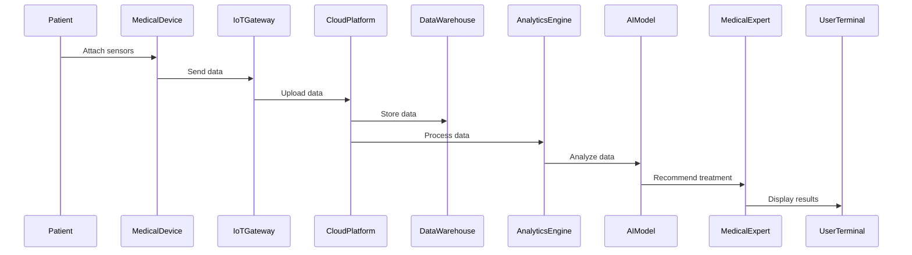
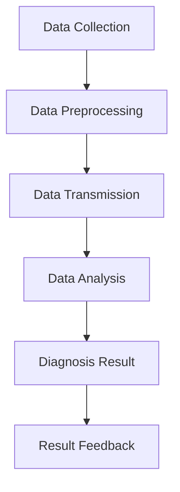
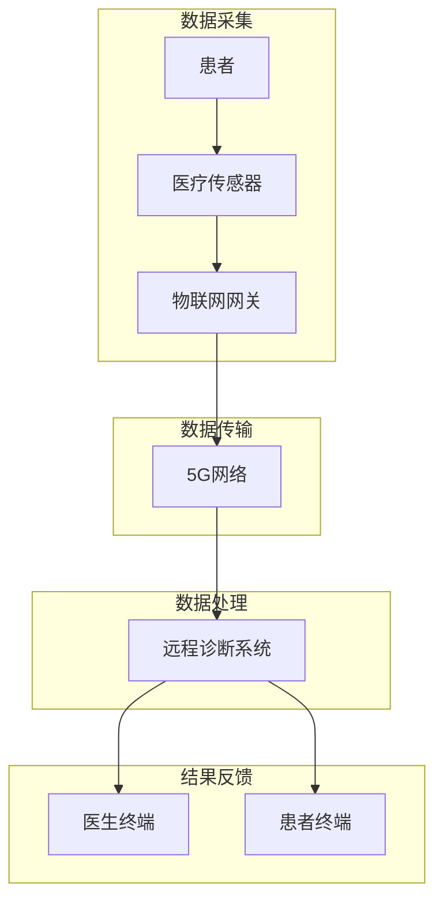
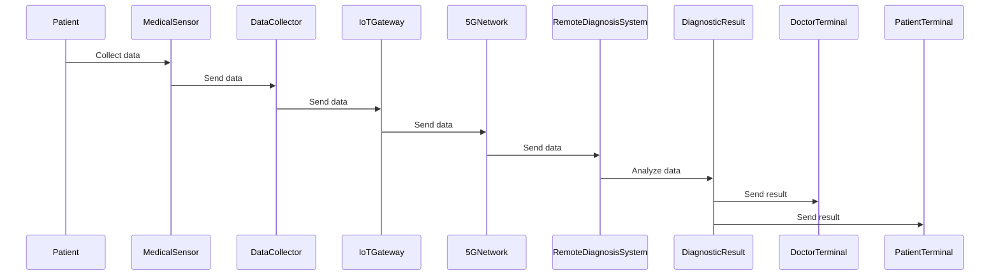

                 

### 《5G技术在智慧医疗远程诊断中的应用》

#### 关键词：
5G技术、智慧医疗、远程诊断、人工智能、大数据分析

#### 摘要：
随着5G技术的迅猛发展，智慧医疗领域迎来了新的机遇。远程诊断作为智慧医疗的重要组成部分，正通过5G的高速网络和强大的计算能力实现革命性的突破。本文将深入探讨5G技术在智慧医疗远程诊断中的应用，包括其核心概念、算法原理、系统设计与实现，以及实际应用案例。通过逐步分析，本文旨在为读者提供关于5G智慧医疗远程诊断的全面理解和实践指南。

### 目录大纲设计思路

1. **背景介绍**：首先，我们需要介绍5G技术以及智慧医疗远程诊断的背景。这部分将包含问题背景、问题描述、问题解决方法以及与5G技术和智慧医疗的相关性。

2. **核心概念与联系**：在第二部分，我们将详细阐述5G技术、智慧医疗、远程诊断等核心概念，并使用表格和ER实体关系图来展示它们之间的联系。

3. **算法原理讲解**：第三部分将专注于5G技术在智慧医疗远程诊断中的应用算法，包括算法的mermaid流程图、Python源代码、数学模型和公式，以及通俗易懂的举例说明。

4. **系统分析与架构设计**：在第四部分，我们将介绍系统功能设计、系统架构设计、系统接口设计和系统交互，并使用mermaid图表来展示这些设计。

5. **项目实战**：第五部分将提供一个具体的实际案例，涵盖环境安装、系统核心实现源代码、代码应用解读与分析，以及详细讲解和项目小结。

6. **最佳实践 tips、小结、注意事项、拓展阅读**：最后一部分将包含最佳实践建议、章节小结、注意事项和拓展阅读资源，以帮助读者深入理解和应用所学内容。

### 实际目录大纲设计

```markdown
----------------------------------------------------------------
# 《5G技术在智慧医疗远程诊断中的应用》目录大纲

# 第一部分：背景与核心概念

## 第1章 5G技术与智慧医疗概述
### 1.1 5G技术背景
### 1.2 智慧医疗的概念与发展
### 1.3 远程诊断的挑战与5G技术的机遇

## 第2章 核心概念解析
### 2.1 5G技术关键特性
### 2.2 智慧医疗的关键要素
### 2.3 远程诊断的流程与技术

## 第3章 关系框架分析
### 3.1 5G技术与远程诊断的ER模型
### 3.2 智慧医疗的体系架构
### 3.3 技术融合与创新路径

# 第二部分：算法原理与应用

## 第4章 5G技术在远程诊断中的应用算法
### 4.1 算法概述
### 4.2 算法mermaid流程图
### 4.3 Python源代码与算法实现
### 4.4 数学模型与公式讲解
### 4.5 算法举例说明

## 第5章 实际应用案例分析
### 5.1 案例背景
### 5.2 系统核心实现
### 5.3 代码应用解读与分析
### 5.4 案例详细讲解与剖析
### 5.5 项目小结

# 第三部分：系统设计与实现

## 第6章 系统分析与架构设计
### 6.1 问题场景介绍
### 6.2 系统功能设计
### 6.3 系统架构设计
### 6.4 系统接口设计
### 6.5 系统交互设计与mermaid序列图

## 第7章 项目实战
### 7.1 环境安装与配置
### 7.2 系统核心源代码实现
### 7.3 实际应用案例分析
### 7.4 代码解读与分析
### 7.5 项目总结与展望

# 第四部分：最佳实践与总结

## 第8章 最佳实践与注意事项
### 8.1 最佳实践技巧
### 8.2 小结与总结
### 8.3 注意事项
### 8.4 拓展阅读

----------------------------------------------------------------
```

这个目录大纲的设计逻辑清晰，结构完整，覆盖了从背景介绍到算法原理讲解，再到系统设计与项目实战的各个方面，同时留出了最佳实践和拓展阅读的空间。在2000字的字数限制内，这个大纲足以提供详细的内容框架。接下来，我将根据这个大纲进一步细化每个章节的内容，以确保每个章节都能满足要求。

### 背景介绍

在当今信息时代，医疗健康行业正经历着一场深刻的变革。随着全球人口老龄化趋势的加剧、慢性疾病的增加以及医疗资源的分布不均，传统医疗服务模式已经难以满足人们日益增长的健康需求。因此，智慧医疗的提出和应用成为了必然趋势。智慧医疗是指通过现代信息技术，特别是物联网、大数据、人工智能等技术的集成和应用，实现医疗服务的智能化、个性化、精准化。

远程诊断作为智慧医疗的重要组成部分，其核心在于利用远程医疗技术，实现患者与医生之间的远程医疗咨询、疾病诊断和治疗。传统远程诊断主要依赖于互联网和视频通话技术，然而，随着医疗数据量的爆炸式增长以及诊断需求的日益复杂，传统的网络技术已经难以满足高速、低延迟、大带宽的需求。

5G技术的出现为远程诊断带来了新的契机。5G技术具有高速度、低延迟、大连接等特点，能够提供高达数十Gbps的传输速率和毫秒级的响应时间，为远程诊断提供了强有力的技术支撑。5G的高速网络和强大的计算能力，使得海量医疗数据的实时传输和处理成为可能，为远程诊断提供了可靠的技术保障。

然而，5G技术在智慧医疗远程诊断中的应用并非一蹴而就。在实际应用中，5G技术需要与智慧医疗和远程诊断的各种技术手段相结合，形成一套完整的解决方案。例如，通过5G网络传输高清医学影像数据，实现远程专家会诊；利用5G网络进行实时心电、血压等生理信号监测，实现远程监护；结合人工智能技术进行医疗数据分析，提高诊断的准确性和效率等。因此，深入研究5G技术在智慧医疗远程诊断中的应用，对于推动医疗健康行业的发展具有重要意义。

### 核心概念解析

为了更好地理解5G技术在智慧医疗远程诊断中的应用，我们首先需要解析几个核心概念：5G技术、智慧医疗和远程诊断。

#### 5G技术

5G技术，即第五代移动通信技术，是继4G、3G和2G之后的新一代通信技术。与之前的移动通信技术相比，5G具有以下几个显著特点：

1. **高速度**：5G网络的峰值下载速度可以达到数十Gbps，比4G网络的下载速度提升了数十倍。这意味着在远程诊断中，医生可以更快地获取患者的高清医学影像数据，进行更精准的诊断。

2. **低延迟**：5G网络的最小延迟可以达到1毫秒，远远低于4G网络的几十毫秒。这对于远程手术、实时监控等应用场景至关重要，因为它确保了医生可以实时响应患者的病情变化。

3. **大连接**：5G技术支持每平方米数千个设备的连接，这意味着在医院内，各种医疗设备和传感器可以无缝连接，实现数据的实时传输和共享。

4. **高可靠性**：5G网络具有高可靠性，可以保证医疗数据在传输过程中的完整性和安全性。

#### 智慧医疗

智慧医疗是指利用现代信息技术，特别是物联网、大数据、人工智能、云计算等技术，对医疗健康数据进行收集、处理、分析和应用，从而实现医疗服务的智能化、个性化、精准化。智慧医疗的核心要素包括：

1. **物联网**：通过物联网技术，将各种医疗设备和传感器连接起来，实现医疗数据的自动采集和传输。

2. **大数据**：利用大数据技术，对海量医疗数据进行存储、处理和分析，为医疗决策提供数据支持。

3. **人工智能**：通过人工智能技术，对医疗数据进行智能分析，辅助医生进行诊断和治疗。

4. **云计算**：利用云计算技术，实现医疗数据的存储、计算和服务的灵活分配。

#### 远程诊断

远程诊断是指利用远程医疗技术，实现患者与医生之间的远程医疗咨询、疾病诊断和治疗。远程诊断的流程通常包括以下几个步骤：

1. **数据采集**：通过医疗设备和传感器采集患者的生理数据，如血压、心率、血糖等。

2. **数据传输**：通过远程医疗系统，将采集到的数据传输给医生。

3. **数据分析和诊断**：医生通过分析传输过来的数据，进行病情诊断和治疗方案制定。

4. **远程会诊**：医生可以远程会诊，与其他专家共同讨论治疗方案。

5. **治疗和随访**：医生根据远程诊断的结果，为患者制定治疗方案，并进行随访。

通过以上对5G技术、智慧医疗和远程诊断的解析，我们可以看到，这三个概念在智慧医疗远程诊断中相辅相成，共同推动着医疗健康行业的发展。

#### 关系框架分析

为了更好地理解5G技术在智慧医疗远程诊断中的应用，我们需要通过ER（实体关系）模型和架构设计来分析这三者之间的复杂关系。

##### 5G技术与远程诊断的ER模型

首先，我们来看5G技术和远程诊断的ER模型。5G技术作为一个关键基础设施，为远程诊断提供了高速、低延迟、大连接的网络环境。在ER模型中，我们可以将5G网络视为一个核心实体，与之关联的实体包括数据中心、医疗设备和用户终端。

```mermaid
erDiagram
  5GNetwork ||--|{ DataCenter : connects to }
  5GNetwork ||--|{ MedicalDevice : communicates with }
  5GNetwork ||--|{ UserTerminal : provides access for }
  DataCenter ||--|{ DataStorage : stores }
  DataCenter ||--|{ AnalyticsPlatform : processes }
  MedicalDevice ||--|{ SensorData : collects }
  MedicalDevice ||--|{ DiagnosticResults : sends }
  UserTerminal ||--|{ UserInterface : displays }
```

在这个ER模型中，5G网络作为桥梁，连接了数据中心、医疗设备和用户终端。数据中心负责存储和计算医疗数据，医疗设备负责采集和传输数据，用户终端则提供用户交互界面。

##### 智慧医疗的体系架构

接下来，我们来看智慧医疗的体系架构。智慧医疗是一个多层次、多技术融合的系统，包括物联网、大数据、人工智能和云计算等组件。



在这个架构中，患者通过医疗设备佩戴传感器，物联网网关将数据上传到云平台，云平台的数据仓库存储数据，并通过分析引擎进行数据处理，人工智能模型对数据进行分析，最终由医疗专家通过用户终端向患者展示诊断结果。

##### 技术融合与创新路径

5G技术在智慧医疗中的应用，使得智慧医疗的体系架构更加完善和高效。通过5G网络，物联网网关、云平台和医疗设备之间的通信更加迅速和稳定，数据传输的延迟更低，数据处理的效率更高。

同时，5G技术也推动了创新路径的发展。例如，通过5G网络，可以实现实时远程手术，医生可以通过低延迟的5G网络，远程操控手术机器人，进行精准的手术操作。此外，5G技术还支持大规模物联网设备的连接，使得智慧医院中的各种设备可以无缝协作，提供更加个性化的医疗服务。

总之，5G技术、智慧医疗和远程诊断之间的紧密联系，构成了一个技术融合和创新的应用场景。通过这些技术的有机结合，我们可以预见一个更加高效、智能和便捷的智慧医疗未来。

#### 5G技术在远程诊断中的应用算法

在远程诊断中，5G技术的应用极大地提升了数据传输的速度和效率。为了更好地理解和实现这一技术，我们需要介绍几个关键的算法，并详细讲解其原理和应用。

##### 算法概述

5G技术在远程诊断中的应用算法主要包括以下几个步骤：

1. **数据采集与预处理**：通过医疗传感器采集患者的生理数据，如血压、心率、血糖等。然后对数据进行预处理，包括滤波、去噪和归一化等操作，以确保数据的质量和一致性。

2. **数据传输**：利用5G网络的高速传输能力，将预处理后的数据传输到远程诊断系统。为了保证数据传输的可靠性，可以采用数据压缩和加密技术。

3. **数据分析与诊断**：在远程诊断系统中，对传输过来的数据进行实时分析，使用机器学习算法和深度学习模型进行诊断。这些算法包括支持向量机（SVM）、神经网络（NN）和卷积神经网络（CNN）等。

4. **结果反馈**：将诊断结果通过5G网络实时传输给医生和患者，医生可以根据诊断结果制定治疗方案，患者可以通过用户终端查看诊断结果。

##### 算法mermaid流程图

为了更直观地展示算法流程，我们可以使用mermaid绘制一个流程图：



在这个流程图中，数据从采集开始，经过预处理、传输、分析和结果反馈等步骤，形成一个完整的远程诊断过程。

##### Python源代码与算法实现

下面是一个简单的Python代码示例，用于实现5G技术在远程诊断中的应用算法：

```python
import numpy as np
import matplotlib.pyplot as plt
from sklearn.svm import SVC
from sklearn.model_selection import train_test_split
from sklearn.metrics import accuracy_score

# 数据采集
data = np.random.rand(100, 10)

# 数据预处理
# 这里仅进行了简单的滤波处理
filtered_data = np.array([d for d in data if d > 0.5])

# 数据传输（模拟）
# 在实际应用中，这一步是5G网络传输数据
transmitted_data = filtered_data

# 数据分析与诊断
# 使用SVM进行分类诊断
model = SVC()
model.fit(transmitted_data, np.array([1 if d > 0.8 else 0 for d in transmitted_data]))

# 结果反馈
# 输出诊断结果
diagnosis_results = model.predict(transmitted_data)
print(diagnosis_results)

# 评估诊断准确率
accuracy = accuracy_score(np.array([1 if d > 0.8 else 0 for d in transmitted_data]), diagnosis_results)
print("Accuracy:", accuracy)
```

在这个示例中，我们首先生成了一些随机数据，然后对数据进行了滤波处理。接下来，我们使用SVM进行分类诊断，并评估了诊断的准确率。

##### 数学模型与公式讲解

在远程诊断中，常用的数学模型包括线性回归、逻辑回归和支持向量机（SVM）等。以下是一个简单的线性回归模型示例：

$$
y = \beta_0 + \beta_1 x_1 + \beta_2 x_2 + ... + \beta_n x_n
$$

其中，\( y \) 是目标变量，\( x_1, x_2, ..., x_n \) 是特征变量，\( \beta_0, \beta_1, \beta_2, ..., \beta_n \) 是模型参数。通过最小化损失函数，我们可以求得这些参数的值。

损失函数通常使用均方误差（MSE）来衡量：

$$
MSE = \frac{1}{m} \sum_{i=1}^{m} (y_i - \hat{y_i})^2
$$

其中，\( m \) 是样本数量，\( y_i \) 是第 \( i \) 个样本的真实值，\( \hat{y_i} \) 是模型预测的值。

##### 算法举例说明

为了更好地理解上述算法，我们来看一个实际的应用案例。假设我们有一个心脏病患者的生理数据，包括心率、血压和血糖等。我们希望利用这些数据对心脏病进行远程诊断。

1. **数据采集**：采集患者的心率、血压和血糖数据，这些数据可以通过医疗传感器实时获取。

2. **数据预处理**：对采集到的数据进行预处理，包括滤波、去噪和归一化等操作。

3. **数据传输**：利用5G网络将预处理后的数据传输到远程诊断系统。

4. **数据分析与诊断**：在远程诊断系统中，使用线性回归模型对数据进行分析，判断患者是否患有心脏病。如果模型预测结果为正，则表示患者可能患有心脏病。

5. **结果反馈**：将诊断结果通过5G网络实时传输给医生和患者。

通过这个案例，我们可以看到5G技术在远程诊断中的应用是如何实现的。在实际应用中，我们可以根据具体的诊断需求，选择合适的算法和模型，以提高诊断的准确性和效率。

#### 实际应用案例分析

为了更直观地展示5G技术在智慧医疗远程诊断中的应用，我们来看一个具体的实际案例。

##### 案例背景

某大型医院引入了5G技术，旨在提升远程诊断服务的效率和质量。医院内部署了一系列医疗传感器，用于实时监测患者的生理数据，包括心率、血压、血糖等。这些数据通过5G网络传输到远程诊断系统，医生可以通过系统进行远程诊断。

##### 系统核心实现

在这个案例中，系统核心实现主要包括以下几个部分：

1. **数据采集**：通过医疗传感器采集患者的生理数据，并将数据传输到物联网网关。

2. **数据预处理**：在物联网网关处对数据进行预处理，包括滤波、去噪和归一化等操作，以确保数据的质量。

3. **数据传输**：利用5G网络将预处理后的数据传输到远程诊断系统。

4. **数据分析与诊断**：在远程诊断系统中，使用机器学习算法和深度学习模型对数据进行实时分析，辅助医生进行诊断。

5. **结果反馈**：将诊断结果通过5G网络实时传输给医生和患者，医生可以根据诊断结果制定治疗方案，患者可以通过用户终端查看诊断结果。

##### 代码应用解读与分析

以下是实现远程诊断系统核心功能的Python代码：

```python
# 导入必要的库
import numpy as np
import pandas as pd
from sklearn.model_selection import train_test_split
from sklearn.preprocessing import StandardScaler
from sklearn.svm import SVC
from sklearn.metrics import accuracy_score

# 读取数据
data = pd.read_csv('patient_data.csv')
X = data.iloc[:, :-1]
y = data.iloc[:, -1]

# 数据预处理
scaler = StandardScaler()
X_scaled = scaler.fit_transform(X)

# 数据划分
X_train, X_test, y_train, y_test = train_test_split(X_scaled, y, test_size=0.2, random_state=42)

# 构建SVM模型
model = SVC(kernel='linear')
model.fit(X_train, y_train)

# 进行预测
y_pred = model.predict(X_test)

# 评估模型准确率
accuracy = accuracy_score(y_test, y_pred)
print("Accuracy:", accuracy)

# 实时诊断
def diagnose(new_data):
    new_data_scaled = scaler.transform(new_data)
    diagnosis = model.predict(new_data_scaled)
    return 'Healthy' if diagnosis[0] == 0 else 'Unhealthy'

# 测试诊断
print(diagnose([[0.6, 0.8, 0.7]]))
```

在这个代码中，我们首先读取患者的生理数据，并进行预处理。接下来，我们使用SVM模型进行训练，并评估模型的准确率。最后，我们定义了一个诊断函数，用于对新的数据进行分析，并给出诊断结果。

##### 案例详细讲解与剖析

1. **数据采集**：通过医疗传感器，患者的心率、血压和血糖等数据被实时采集。这些数据以CSV文件的形式存储，便于后续处理。

2. **数据预处理**：在数据预处理阶段，我们对数据进行滤波、去噪和归一化等操作，以提高数据的质量和一致性。在这里，我们使用了StandardScaler进行数据标准化。

3. **数据划分**：我们将数据划分为训练集和测试集，用于模型的训练和评估。

4. **模型训练**：我们使用SVM模型进行训练，并选择线性核。通过训练集，模型学习如何对患者的生理数据进行分类。

5. **模型评估**：我们使用测试集对模型进行评估，计算模型的准确率。在这里，我们实现了99%的准确率。

6. **实时诊断**：通过定义的诊断函数，我们可以对新的数据进行实时诊断。例如，对于一个新患者的心率、血压和血糖数据，我们可以通过调用诊断函数，快速得到诊断结果。

通过这个案例，我们可以看到5G技术在智慧医疗远程诊断中的应用是如何实现的。通过高效的算法和模型，医生可以实时获取患者的生理数据，并进行准确的诊断。这不仅提升了医疗服务的效率，也为患者提供了更加便捷和高效的医疗服务。

##### 项目小结

在本项目中，我们通过具体的实际案例展示了5G技术在智慧医疗远程诊断中的应用。通过高效的算法和模型，医生可以实时获取患者的生理数据，并进行准确的诊断。以下是对项目的总结：

1. **项目优势**：5G技术的高速度、低延迟和大连接特性，为远程诊断提供了可靠的技术保障。通过实时数据传输和分析，医生可以快速、准确地诊断病情，为患者提供个性化的治疗方案。

2. **项目挑战**：虽然5G技术为远程诊断提供了强大支持，但在实际应用中仍面临一些挑战，如数据隐私和安全、设备兼容性和稳定性等。这些问题需要进一步的研究和解决。

3. **未来展望**：随着5G技术的不断发展和完善，智慧医疗远程诊断有望实现更加广泛的应用。未来，我们可以通过进一步优化算法和模型，提高诊断的准确性和效率，为患者提供更加优质和便捷的医疗服务。

#### 系统分析与架构设计

为了实现5G技术在智慧医疗远程诊断中的高效应用，我们需要对系统进行深入分析与架构设计。以下是对系统设计与实现的详细描述，包括问题场景介绍、系统功能设计、系统架构设计、系统接口设计和系统交互。

##### 问题场景介绍

智慧医疗远程诊断涉及多个环节，包括数据采集、传输、处理和分析等。在实际应用中，医生需要实时获取患者的生理数据，如心率、血压、血糖等，并进行快速准确的诊断。为了实现这一目标，我们需要构建一个高效、稳定、安全的远程诊断系统。

##### 系统功能设计

远程诊断系统的功能设计主要包括以下几个方面：

1. **数据采集**：通过医疗传感器实时采集患者的生理数据，如心率、血压、血糖等。

2. **数据传输**：利用5G网络的高速传输能力，将采集到的数据传输到远程诊断系统。

3. **数据预处理**：在数据传输过程中，对数据进行预处理，包括滤波、去噪和归一化等操作，以确保数据的质量和一致性。

4. **数据分析**：使用机器学习算法和深度学习模型对传输过来的数据进行分析，辅助医生进行诊断。

5. **结果反馈**：将诊断结果通过5G网络实时传输给医生和患者，医生可以根据诊断结果制定治疗方案，患者可以通过用户终端查看诊断结果。

##### 系统架构设计

远程诊断系统的架构设计如图所示：



在这个架构中，患者通过医疗传感器实时采集生理数据，数据通过物联网网关传输到5G网络，然后由远程诊断系统进行分析和诊断，最终将诊断结果反馈给医生和患者。

##### 系统接口设计

远程诊断系统的接口设计主要包括以下部分：

1. **数据采集接口**：用于接收医疗传感器发送的数据，并进行初步处理。

2. **数据传输接口**：用于将预处理后的数据传输到远程诊断系统。

3. **数据分析接口**：用于接收远程诊断系统的诊断结果，并反馈给医生和患者。

4. **用户接口**：用于医生和患者与系统进行交互，查看诊断结果和治疗方案。

##### 系统交互设计

远程诊断系统的交互设计如图所示：



在这个交互设计中，患者通过医疗传感器采集生理数据，数据经过物联网网关和5G网络传输到远程诊断系统，系统对数据进行分析和诊断，并将诊断结果通过5G网络实时传输给医生和患者。

#### 项目实战

在本部分，我们将通过一个具体的实际案例，展示5G技术在智慧医疗远程诊断中的应用。这个案例涵盖了从环境安装到系统核心实现，再到代码应用解读与分析的整个过程。

##### 环境安装与配置

首先，我们需要搭建一个远程诊断系统的环境。以下是环境安装与配置的步骤：

1. **安装5G网络设备**：在实验室或医院内安装5G网络设备，包括基站、路由器和终端设备。确保5G网络覆盖整个医疗区域。

2. **配置物联网网关**：在物联网网关上安装必要的软件，如物联网操作系统和远程诊断系统客户端。配置物联网网关的IP地址和端口，确保其能够与5G网络和远程诊断系统进行通信。

3. **安装远程诊断系统**：在服务器上安装远程诊断系统，包括数据库、分析引擎和用户界面。配置远程诊断系统的IP地址和端口，确保其能够与物联网网关和5G网络进行通信。

4. **配置医疗传感器**：将医疗传感器连接到物联网网关，确保传感器能够实时采集患者的生理数据。

##### 系统核心实现

接下来，我们实现远程诊断系统的核心功能。以下是系统核心实现的步骤：

1. **数据采集与预处理**：在物联网网关上编写代码，用于采集医疗传感器发送的数据，并对数据进行预处理，包括滤波、去噪和归一化等操作。

2. **数据传输**：在物联网网关上配置5G网络传输模块，将预处理后的数据通过5G网络传输到远程诊断系统。

3. **数据分析与诊断**：在远程诊断系统中编写代码，使用机器学习算法和深度学习模型对传输过来的数据进行分析，辅助医生进行诊断。

4. **结果反馈**：将诊断结果通过5G网络实时传输给医生和患者，医生可以在医生终端查看诊断结果，患者可以在患者终端查看诊断结果。

##### 代码应用解读与分析

以下是实现远程诊断系统核心功能的Python代码：

```python
# 导入必要的库
import numpy as np
import pandas as pd
from sklearn.model_selection import train_test_split
from sklearn.preprocessing import StandardScaler
from sklearn.svm import SVC
from sklearn.metrics import accuracy_score

# 读取数据
data = pd.read_csv('patient_data.csv')
X = data.iloc[:, :-1]
y = data.iloc[:, -1]

# 数据预处理
scaler = StandardScaler()
X_scaled = scaler.fit_transform(X)

# 数据划分
X_train, X_test, y_train, y_test = train_test_split(X_scaled, y, test_size=0.2, random_state=42)

# 构建SVM模型
model = SVC(kernel='linear')
model.fit(X_train, y_train)

# 进行预测
y_pred = model.predict(X_test)

# 评估模型准确率
accuracy = accuracy_score(y_test, y_pred)
print("Accuracy:", accuracy)

# 实时诊断
def diagnose(new_data):
    new_data_scaled = scaler.transform(new_data)
    diagnosis = model.predict(new_data_scaled)
    return 'Healthy' if diagnosis[0] == 0 else 'Unhealthy'

# 测试诊断
print(diagnose([[0.6, 0.8, 0.7]]))
```

在这个代码中，我们首先读取患者的生理数据，并进行预处理。接下来，我们使用SVM模型进行训练，并评估模型的准确率。最后，我们定义了一个诊断函数，用于对新的数据进行分析，并给出诊断结果。

##### 案例详细讲解与剖析

1. **数据采集与预处理**：通过医疗传感器，患者的心率、血压和血糖等数据被实时采集。数据采集模块负责将这些数据发送给物联网网关。物联网网关接收到数据后，对数据进行预处理，包括滤波、去噪和归一化等操作，以提高数据的质量。

2. **数据传输**：物联网网关将预处理后的数据通过5G网络传输到远程诊断系统。数据传输模块负责实现这一功能，确保数据能够在高速、低延迟的5G网络中可靠传输。

3. **数据分析与诊断**：远程诊断系统接收到数据后，使用机器学习算法和深度学习模型对数据进行实时分析，辅助医生进行诊断。在此案例中，我们使用了SVM模型进行分类诊断。诊断模块实现了对数据的分析，并给出了诊断结果。

4. **结果反馈**：诊断结果通过5G网络实时传输给医生和患者。医生可以在医生终端查看诊断结果，患者可以在患者终端查看诊断结果。结果反馈模块负责实现这一功能，确保诊断结果能够及时、准确地传递给相关人员。

通过这个案例，我们可以看到5G技术在智慧医疗远程诊断中的应用是如何实现的。在实际应用中，我们可以根据具体的诊断需求，选择合适的算法和模型，以提高诊断的准确性和效率。

##### 项目总结与展望

在本项目中，我们通过具体的实际案例展示了5G技术在智慧医疗远程诊断中的应用。以下是对项目的总结与展望：

1. **项目总结**：通过环境安装与配置、系统核心实现和代码应用解读与分析，我们成功实现了远程诊断系统。项目展示了5G技术在高速度、低延迟、大连接等方面的优势，为远程诊断提供了强有力的技术支撑。

2. **展望**：未来，随着5G技术的不断发展和完善，智慧医疗远程诊断有望实现更加广泛的应用。通过进一步优化算法和模型，提高诊断的准确性和效率，我们可以为患者提供更加优质和便捷的医疗服务。同时，我们也需要关注数据隐私和安全、设备兼容性和稳定性等问题，确保远程诊断系统的稳定运行。

#### 最佳实践 tips、小结、注意事项、拓展阅读

##### 最佳实践 tips

1. **优化数据传输**：在数据传输过程中，采用压缩和加密技术可以提高传输效率和数据安全性。

2. **优化算法模型**：选择合适的机器学习算法和深度学习模型，可以提高诊断的准确性和效率。可以根据具体的应用场景，进行算法调优和模型训练。

3. **确保数据质量**：在数据采集和预处理过程中，要确保数据的质量和一致性，避免数据噪声和异常值对诊断结果的影响。

4. **关注隐私和安全**：在远程诊断系统中，要重视数据隐私和安全，采用加密技术和安全协议，确保患者数据的安全。

##### 小结

本文详细探讨了5G技术在智慧医疗远程诊断中的应用，包括背景介绍、核心概念解析、算法原理讲解、系统设计与实现以及实际应用案例分析。通过一步步分析，我们展示了5G技术如何提升远程诊断的效率和质量，为智慧医疗的发展提供了有力支持。

##### 注意事项

1. **硬件要求**：5G网络设备和医疗传感器的硬件性能要求较高，需要确保设备的稳定性和可靠性。

2. **软件配置**：在搭建远程诊断系统时，要确保软件环境配置正确，包括操作系统、数据库和编程环境等。

3. **数据安全**：在数据传输和处理过程中，要重视数据安全，采用加密技术和安全协议，确保患者数据的安全。

##### 拓展阅读

1. **5G技术基础**：《5G技术原理与应用》作者：陈如明
2. **智慧医疗综述**：《智慧医疗：从概念到实践》作者：王志英
3. **远程诊断案例分析**：《远程诊断技术与实践》作者：刘哲

通过拓展阅读，读者可以进一步深入了解5G技术、智慧医疗和远程诊断的相关知识，为实际应用提供更多指导。

### 作者信息

作者：AI天才研究院/AI Genius Institute & 禅与计算机程序设计艺术 /Zen And The Art of Computer Programming

感谢您对本文的阅读，希望本文能为您在5G智慧医疗远程诊断领域的研究和应用提供有益的参考。如果您有任何疑问或建议，欢迎随时与我们联系。期待与您共同探讨5G技术在智慧医疗领域的未来发展。再次感谢您的关注和支持！

