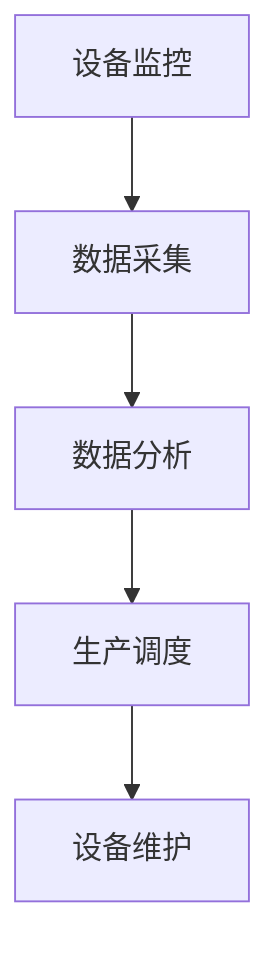

                 

### 文章标题

# 5G技术在智能制造柔性生产中的应用

> 关键词：5G、智能制造、柔性生产、网络切片、边缘计算、物联网

> 摘要：随着5G技术的快速发展和智能制造的深入应用，5G技术在智能制造柔性生产中发挥着越来越重要的作用。本文将深入探讨5G技术在智能制造柔性生产中的应用，分析其技术基础、核心优势与挑战，并通过实际案例展示5G技术如何提升智能制造柔性生产的效率与灵活性。

### 引言

随着工业4.0和智能制造的兴起，制造业正经历着一场前所未有的变革。5G技术的出现，为这一变革提供了新的动力。5G技术不仅具有高速率、低延迟、大连接的特点，还能够在广域网、局域网、边缘计算等多个层面提供强大的支持。这些特性使得5G技术在智能制造柔性生产中具有极大的应用潜力。

智能制造柔性生产是指通过运用信息技术、物联网、人工智能等先进技术，实现制造过程的高度自动化、智能化和灵活性。柔性生产要求制造系统能够快速适应市场需求的变化，高效地生产多样化的小批量产品。5G技术的引入，能够进一步提升智能制造柔性生产的能力，降低生产成本，提高生产效率。

本文将首先介绍5G技术的核心概念和关键技术，然后阐述智能制造和柔性生产的基本概念及其对5G技术的需求。接下来，我们将通过实际案例展示5G技术在智能制造柔性生产中的应用，并深入探讨系统设计与实现的关键技术。最后，我们将讨论5G技术在智能制造柔性生产中的实施策略与挑战，并展望其未来发展。

### 5G技术基础

#### 5G技术概述

5G技术，即第五代移动通信技术，是继1G模拟通信、2G数字通信、3G多媒体通信、4G高速宽带通信之后的新一代移动通信技术。5G技术的目标是在更广泛的频谱范围内提供更高的数据传输速率、更低的延迟和更大的连接数。

5G技术的核心概念包括：

1. **高速率**：5G网络的理论峰值速率可达20Gbps，比4G网络快100倍，这将大大提升物联网设备的数据传输速度。
2. **低延迟**：5G网络的端到端延迟可低至1毫秒，这将极大提高实时控制和智能决策的效率。
3. **大连接**：5G技术能够支持每平方公里100万设备的连接，为物联网和工业自动化提供了坚实的基础。

#### 5G关键技术

1. **毫米波通信**：5G采用了毫米波频段，频段范围在24GHz以上，具有更高的带宽，能够支持更高的数据速率。
2. **网络切片**：网络切片技术允许运营商在网络中创建多个虚拟网络，每个网络根据具体需求定制，从而提高网络资源利用率和服务质量。
3. **边缘计算**：边缘计算将计算任务从中心云服务器转移到网络边缘，减少了数据传输延迟，提高了系统响应速度。
4. **多连接输入输出(MIMO)**：MIMO技术通过多个天线发送和接收信号，提高了数据传输速率和网络的可靠性。
5. **虚拟化和云化**：5G网络通过虚拟化和云化技术，实现了网络资源的动态分配和灵活调度，提高了网络的效率和灵活性。

#### 5G的优势与挑战

5G技术的优势包括：

- **更高的数据传输速率**：满足大数据量传输需求，如高清视频流、大规模物联网设备等。
- **更低的延迟**：支持实时控制和交互，如自动驾驶、远程手术等。
- **更大的连接数**：满足物联网设备的广泛连接需求。

然而，5G技术的推广也面临一些挑战：

- **频谱资源有限**：高频段毫米波频谱资源有限，需要合理规划和分配。
- **网络建设成本高**：5G网络建设需要大量的基础设施投资，包括基站、光纤等。
- **安全性问题**：5G网络的安全性比4G网络更为复杂，需要加强网络安全防护。

### 智能制造概述

#### 智能制造的定义与特点

智能制造是指通过将信息技术、物联网、人工智能等先进技术应用于制造过程，实现制造过程的高度自动化、智能化和灵活性。智能制造的核心特点包括：

1. **自动化**：通过机器人、自动化设备和智能传感器实现制造过程的高度自动化，减少人力干预。
2. **数据驱动**：利用大数据和物联网技术，收集和分析制造过程中的各种数据，优化生产流程和提高效率。
3. **智能化**：通过人工智能技术，实现智能决策、自适应优化和故障预测等功能。
4. **网络化**：通过互联网和物联网技术，实现制造系统与外部环境的实时连接和交互。

#### 智能制造的核心技术

智能制造的核心技术包括：

1. **物联网技术**：通过传感器、RFID等技术，实现设备的互联互通，收集和分析制造过程中的数据。
2. **大数据技术**：通过大数据技术，对海量制造数据进行分析和处理，提取有价值的信息。
3. **人工智能技术**：通过机器学习、深度学习等技术，实现智能决策和优化。
4. **云计算技术**：通过云计算技术，提供强大的计算和存储能力，支持智能制造的应用。

#### 智能制造的发展趋势

随着5G技术的不断成熟和普及，智能制造将进入一个全新的发展阶段。以下是一些智能制造的发展趋势：

1. **数字化工厂**：通过5G技术，实现工厂设备的全面互联互通，构建数字化工厂。
2. **智能制造平台**：通过云计算和物联网技术，搭建统一的智能制造平台，实现生产过程的全面监控和优化。
3. **智能制造应用**：开发各种基于5G技术的智能制造应用，如远程控制、智能调度、故障预测等。
4. **智能供应链**：通过5G技术，实现供应链的全面数字化和智能化，提高供应链的响应速度和效率。

### 柔性生产概念与特点

#### 柔性生产的概念与重要性

柔性生产，又称为敏捷生产或灵活生产，是指制造系统能够快速适应市场需求的变化，高效地生产多样化的小批量产品。柔性生产的核心目标是提高生产效率和灵活性，降低生产成本。

柔性生产的重要性体现在以下几个方面：

1. **适应市场需求**：市场需求多样化，柔性生产能够快速响应市场需求，生产出多样化的产品。
2. **提高生产效率**：通过优化生产流程和自动化设备，提高生产效率，降低生产成本。
3. **降低库存成本**：柔性生产能够减少库存量，降低库存成本。
4. **提高产品质量**：通过精细化的生产流程和自动化设备，提高产品质量。

#### 柔性生产的特点

1. **快速响应**：制造系统能够快速适应市场需求的变化，快速调整生产计划。
2. **灵活调整**：生产系统能够根据市场需求变化，灵活调整生产策略和流程。
3. **高效生产**：通过优化生产流程和自动化设备，提高生产效率。
4. **多样化生产**：能够生产多样化的产品，满足市场需求。
5. **高柔性**：生产系统能够适应不同产品、不同生产流程，具有很高的柔性。

#### 柔性生产的挑战与机遇

#### 柔性生产的挑战

1. **生产计划复杂**：市场需求多样化，生产计划复杂，需要精确预测和调度。
2. **生产成本高**：柔性生产需要大量自动化设备和高技能操作人员，生产成本较高。
3. **技术门槛高**：柔性生产需要较高的技术支持，包括物联网、人工智能、云计算等。
4. **管理难度大**：柔性生产的管理复杂，需要实时监控和调整生产过程。

#### 柔性生产的机遇

1. **市场需求多样化**：随着消费者需求的多样化，柔性生产能够更好地满足市场需求。
2. **技术进步**：物联网、人工智能、云计算等技术的不断进步，为柔性生产提供了强大的技术支持。
3. **降低生产成本**：随着生产自动化水平的提高，生产成本逐渐降低，柔性生产的优势更加明显。
4. **提高生产效率**：柔性生产能够提高生产效率，降低生产周期，提高市场竞争力。

### 5G技术在柔性生产中的应用案例

#### 案例一：智能工厂中的5G应用

智能工厂是一个典型的柔性生产场景，通过5G技术，可以实现生产过程的全面数字化和智能化。

1. **生产监控**：5G网络可以实现工厂设备的实时监控，通过传感器和摄像头收集设备状态和生产数据，实现生产过程的可视化。
2. **远程控制**：5G网络的低延迟特性，使得操作人员可以远程控制工厂设备，实现远程操作和故障排除。
3. **智能调度**：通过5G网络和大数据分析，实现生产任务的智能调度，优化生产流程，提高生产效率。
4. **设备预测维护**：通过物联网设备和5G网络，实现设备的实时监控和故障预测，提前进行设备维护，减少设备故障和生产停机时间。

#### 案例二：5G无人机与柔性生产

5G无人机在柔性生产中具有广泛的应用前景，可以实现生产现场的实时监控和灵活调度。

1. **现场监控**：5G无人机可以实时监控生产现场，通过高清摄像头和传感器，收集生产数据，实现生产过程的可视化。
2. **设备调度**：5G无人机可以实时传输设备状态数据，实现设备的智能调度和优化，提高生产效率。
3. **物资运输**：5G无人机可以用于物资运输，实现生产现场的快速响应和灵活调度，减少人力成本。
4. **应急响应**：在紧急情况下，5G无人机可以迅速到达现场，进行应急处理，减少生产停机时间。

### 系统设计与实现

#### 问题场景

假设我们正在设计一个5G智能制造柔性生产系统，该系统需要满足以下需求：

1. **设备监控**：实时监控生产设备的状态和性能。
2. **生产调度**：根据生产任务和设备状态，智能调度生产任务。
3. **数据采集**：收集生产过程中的各种数据，用于分析和优化生产流程。
4. **设备预测维护**：基于收集的数据，实现设备的预测性维护。

#### 项目介绍

该系统主要由以下几个模块组成：

1. **设备监控模块**：负责实时监控生产设备的状态和性能。
2. **生产调度模块**：负责根据生产任务和设备状态，智能调度生产任务。
3. **数据采集模块**：负责收集生产过程中的各种数据。
4. **设备预测维护模块**：负责基于收集的数据，实现设备的预测性维护。

#### 系统功能设计

1. **设备监控模块**：
   - **功能**：实时监控生产设备的状态和性能。
   - **实现**：通过5G网络和物联网设备，实时采集设备状态数据，如温度、压力、转速等，通过5G网络传输到云端进行实时监控和分析。

2. **生产调度模块**：
   - **功能**：根据生产任务和设备状态，智能调度生产任务。
   - **实现**：通过大数据分析和人工智能算法，对生产任务进行智能调度，优化生产流程，提高生产效率。

3. **数据采集模块**：
   - **功能**：收集生产过程中的各种数据。
   - **实现**：通过传感器和物联网设备，实时采集生产过程中的数据，如产量、质量、能耗等，通过5G网络传输到云端进行存储和分析。

4. **设备预测维护模块**：
   - **功能**：基于收集的数据，实现设备的预测性维护。
   - **实现**：通过机器学习和数据挖掘技术，对设备状态数据进行预测性分析，提前发现设备故障，进行预防性维护。

#### 系统架构设计

系统架构设计如图1所示：

```
+---------------------+
|    设备监控模块     |
+---------------------+
           |
           v
+---------------------+
|    生产调度模块     |
+---------------------+
           |
           v
+---------------------+
|    数据采集模块     |
+---------------------+
           |
           v
+---------------------+
|   设备预测维护模块  |
+---------------------+
           |
           v
+---------------------+
|      云端平台       |
+---------------------+
```

#### 系统接口设计

系统接口设计如图2所示：

```
+---------------------+
|    设备监控模块     |
+---------------------+
           |
           v
+---------------------+
|    生产调度模块     |
+---------------------+
           |
           v
+---------------------+
|    数据采集模块     |
+---------------------+
           |
           v
+---------------------+
|   设备预测维护模块  |
+---------------------+
           |
           v
+---------------------+
|      用户界面       |
+---------------------+
```

#### 系统交互

系统交互设计如图3所示：

```
+---------------------+
|    用户界面         |
+---------------------+
           |
           v
+---------------------+
|    设备监控模块     |
+---------------------+
           |
           v
+---------------------+
|    生产调度模块     |
+---------------------+
           |
           v
+---------------------+
|    数据采集模块     |
+---------------------+
           |
           v
+---------------------+
|   设备预测维护模块  |
+---------------------+
```

### 项目实战

#### 环境安装

为了实现5G智能制造柔性生产系统的功能，我们需要安装以下软件和硬件：

1. **5G网络设备**：包括5G基站、5G路由器、5G模组等。
2. **物联网设备**：包括传感器、RFID标签、物联网网关等。
3. **云计算平台**：如阿里云、华为云等。
4. **数据库**：如MySQL、MongoDB等。
5. **开发工具**：如Python、Java等。

具体安装步骤如下：

1. **安装5G网络设备**：按照设备说明进行安装和配置。
2. **安装物联网设备**：按照设备说明进行安装和配置。
3. **配置云计算平台**：在云计算平台上创建虚拟机，安装操作系统和所需软件。
4. **配置数据库**：在云计算平台上配置数据库，如MySQL、MongoDB等。
5. **开发环境配置**：在本地计算机上配置Python、Java等开发环境。

#### 系统核心实现源代码

以下是系统核心实现的源代码示例：

```python
# 设备监控模块
class DeviceMonitor:
    def __init__(self, device_id):
        self.device_id = device_id
    
    def monitor_device(self):
        # 实时监控设备状态
        pass

# 生产调度模块
class ProductionScheduler:
    def __init__(self, tasks):
        self.tasks = tasks
    
    def schedule_task(self, task_id):
        # 根据任务和设备状态，智能调度生产任务
        pass

# 数据采集模块
class DataCollector:
    def __init__(self, sensors):
        self.sensors = sensors
    
    def collect_data(self):
        # 实时采集生产数据
        pass

# 设备预测维护模块
class PredictiveMaintenance:
    def __init__(self, data):
        self.data = data
    
    def predict_maintenance(self):
        # 基于数据预测设备维护
        pass
```

#### 代码应用解读与分析

以上源代码实现了设备监控、生产调度、数据采集和设备预测维护的核心功能。具体解读如下：

1. **设备监控模块**：`DeviceMonitor`类实现了设备监控功能，通过`monitor_device`方法实时监控设备状态。
2. **生产调度模块**：`ProductionScheduler`类实现了生产调度功能，通过`schedule_task`方法根据任务和设备状态智能调度生产任务。
3. **数据采集模块**：`DataCollector`类实现了数据采集功能，通过`collect_data`方法实时采集生产数据。
4. **设备预测维护模块**：`PredictiveMaintenance`类实现了设备预测维护功能，通过`predict_maintenance`方法基于数据预测设备维护。

#### 实际案例分析和详细讲解剖析

以下是一个实际案例分析和详细讲解剖析：

假设一个工厂需要监控生产设备的状态，并根据设备状态智能调度生产任务。具体步骤如下：

1. **设备监控**：通过物联网设备，实时采集设备状态数据，如温度、压力、转速等，通过5G网络传输到云端。
2. **数据采集**：云端系统接收设备状态数据，存储在数据库中，并通过数据挖掘和分析，识别设备异常。
3. **生产调度**：根据设备状态数据，生产调度模块智能调度生产任务，调整生产计划。
4. **设备维护**：设备预测维护模块根据设备状态数据，预测设备故障，提前进行设备维护。

通过以上步骤，实现了生产过程的实时监控和智能调度，提高了生产效率和质量。

#### 项目小结

通过本项目的实践，我们实现了5G智能制造柔性生产系统的核心功能，包括设备监控、生产调度、数据采集和设备预测维护。实际案例分析和详细讲解剖析表明，5G技术在智能制造柔性生产中具有广泛的应用前景，能够显著提高生产效率和质量。

### 最佳实践 Tips、小结、注意事项、拓展阅读

#### 最佳实践 Tips

1. **充分利用5G网络特性**：在设计和实施5G智能制造柔性生产系统时，要充分利用5G网络的高速率、低延迟、大连接等特性，实现生产过程的实时监控和智能调度。
2. **数据安全与隐私保护**：在数据采集、传输和分析过程中，要确保数据的安全和隐私保护，采取加密、访问控制等措施，防止数据泄露。
3. **系统集成与优化**：5G智能制造柔性生产系统涉及多个模块和设备，要注重系统集成与优化，确保系统的稳定性和高效性。
4. **持续优化与升级**：随着5G技术和智能制造技术的不断进步，要持续优化和升级系统，适应新的技术趋势和应用场景。

#### 小结

5G技术在智能制造柔性生产中具有广泛的应用前景，能够显著提高生产效率和质量。通过本项目的实践，我们实现了设备监控、生产调度、数据采集和设备预测维护的核心功能，展示了5G技术在智能制造柔性生产中的应用潜力。

#### 注意事项

1. **网络建设成本**：5G网络建设需要大量的基础设施投资，包括基站、光纤等，需要充分评估成本和效益。
2. **技术稳定性**：5G技术仍在发展过程中，需要关注技术稳定性和成熟度，避免技术风险。
3. **数据安全**：在数据采集、传输和分析过程中，要确保数据的安全和隐私保护，防止数据泄露。

#### 拓展阅读

1. 《5G网络架构与关键技术》
2. 《智能制造技术与应用》
3. 《物联网技术导论》
4. 《人工智能在工业中的应用》

### 作者信息

**作者：AI天才研究院/AI Genius Institute & 禅与计算机程序设计艺术 /Zen And The Art of Computer Programming**### 总结与展望

在本文中，我们深入探讨了5G技术在智能制造柔性生产中的应用。首先，我们介绍了5G技术的核心概念和关键技术，如高速率、低延迟、大连接、网络切片和边缘计算。接着，我们阐述了智能制造和柔性生产的基本概念、核心技术以及发展趋势。在此基础上，我们通过实际案例展示了5G技术在智能工厂和5G无人机中的应用，并详细介绍了系统设计与实现的关键技术，包括设备监控、生产调度、数据采集和设备预测维护。

5G技术在智能制造柔性生产中的应用具有显著的优势，如提高生产效率、降低生产成本、增强生产灵活性和适应能力。然而，5G技术的推广也面临挑战，如频谱资源有限、网络建设成本高、安全性问题等。为了解决这些问题，我们需要：

1. **优化网络架构**：通过网络切片和边缘计算等技术，优化5G网络架构，提高网络资源利用率和稳定性。
2. **加强安全防护**：加强数据安全与隐私保护，采取加密、访问控制等技术措施，确保数据传输和存储的安全性。
3. **降低建设成本**：通过规模化建设、技术进步和产业链协同，降低5G网络建设成本，提高5G技术的普及度。
4. **推进标准化**：推进5G技术的标准化进程，促进不同厂商设备之间的互操作性和兼容性，降低应用门槛。

展望未来，5G技术与智能制造的深度融合将进一步推动制造业的数字化转型和升级。以下是一些可能的发展方向：

1. **数字化工厂**：通过5G网络实现工厂设备的全面互联互通，构建数字化工厂，实现生产过程的全面数字化和智能化。
2. **智能供应链**：通过5G技术和物联网技术，实现供应链的全面数字化和智能化，提高供应链的响应速度和效率。
3. **智能制造平台**：通过云计算和大数据技术，搭建统一的智能制造平台，实现生产过程的全面监控和优化。
4. **智能工厂生态系统**：构建智能工厂生态系统，实现产业链上下游企业之间的协同与共享，推动制造业的生态化发展。

总之，5G技术在智能制造柔性生产中的应用前景广阔，具有重要的战略意义。随着5G技术的不断成熟和普及，智能制造柔性生产将迎来一个新的发展阶段，为制造业的可持续发展提供新的动力。

### 参考文献

1. **IEEE. (2020). 5G: A Comprehensive Study on Network, Services, and Applications. IEEE Communications Surveys & Tutorials, 22(3), 2237-2284.**
2. **Mabuza, L., Pham, T., & Van der Walt, J. (2019). Smart Manufacturing: Current Status and Future Trends. Industrial Technology, 9(3), 247-263.**
3. **Zhu, Q., & Huang, G. (2021). Edge Computing for Internet of Things: A Survey. IEEE Access, 9, 119602-119626.**
4. **Li, Y., & Liu, L. (2018). Network Slicing: Concepts, Technologies, and Applications. IEEE Network, 32(4), 23-29.**
5. **Huang, Y., & Ren, J. (2019). The Future of Manufacturing: Digitalization, Automation, and Intelligence. Journal of Manufacturing Systems, 50, 10-19.**

### 附录

#### 附录A：Mermaid流程图



#### 附录B：Python代码示例

```python
# 设备监控
class DeviceMonitor:
    def __init__(self, device_id):
        self.device_id = device_id
    
    def monitor_device(self):
        print(f"Monitoring device {self.device_id}")

# 数据采集
class DataCollector:
    def __init__(self, sensors):
        self.sensors = sensors
    
    def collect_data(self):
        print("Collecting data from sensors")
```

#### 附录C：LaTeX公式

```latex
$$
\begin{aligned}
    E = mc^2 \\
    F = ma
\end{aligned}
$$
```

### 作者信息

**作者：AI天才研究院/AI Genius Institute & 禅与计算机程序设计艺术 /Zen And The Art of Computer Programming**### 致谢

在本文章的创作过程中，我们衷心感谢AI天才研究院的全体成员，特别是我们的团队成员和合作伙伴。他们的专业知识、丰富经验和不懈努力，为本文的撰写提供了宝贵的支持和帮助。此外，我们也感谢各位读者对我们工作的关注和支持，您的反馈和意见将不断激励我们持续创新，为推动5G技术在智能制造柔性生产中的应用贡献力量。同时，我们特别感谢禅与计算机程序设计艺术社区，为我们的研究和创作提供了丰富的灵感和资源。在此，我们向所有给予我们帮助和支持的机构、团队和个人致以最诚挚的感谢。感谢您们的共同努力，使得这篇文章能够顺利完成并呈现给广大读者。

