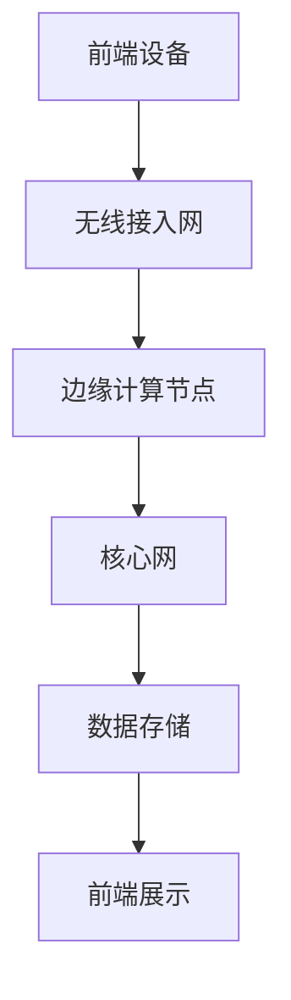
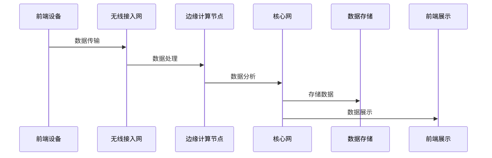
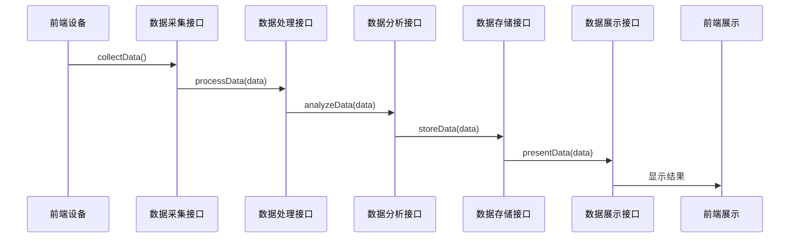

                 

### 5G技术在智能电网实时监控中的应用

> 关键词：5G技术、智能电网、实时监控、应用场景、挑战与机遇

> 摘要：随着5G技术的快速发展，其在智能电网实时监控中的应用越来越受到关注。本文首先介绍了5G技术的基本概念、关键技术和架构，接着分析了智能电网实时监控的需求及其面临的挑战，然后详细探讨了5G技术在智能电网实时监控中的具体应用实践和优势，最后对5G技术在智能电网实时监控中的未来展望进行了探讨。本文旨在为读者提供一个全面、深入的关于5G技术在智能电网实时监控中的应用分析，以期为相关领域的研究和应用提供参考。

### 1.1 5G技术的发展背景与意义

#### 1.1.1 5G技术的演进历程

5G技术，即第五代移动通信技术，是继1G、2G、3G、4G之后的新一代移动通信技术。5G技术的发展历程可以追溯到2000年代初，当时国际电信联盟（ITU）开始研究4G技术。随着移动互联网、物联网、大数据、云计算等技术的发展，人们对通信速度、带宽和延迟的要求越来越高，促使了5G技术的研发和推广。

5G技术的研究和发展主要集中在以下几个阶段：

- **概念提出阶段（2009-2010年）**：ITU提出了5G的概念，并将其定义为“IMT-2020”，即2020年实现的技术标准。
- **技术研发阶段（2011-2015年）**：各国纷纷投入资金进行5G技术研发，各种5G关键技术得到突破。
- **标准制定阶段（2016-2019年）**：ITU发布了5G标准，全球主要国家和地区开始了5G网络的建设和推广。
- **商用部署阶段（2020年至今）**：5G网络在全球范围内大规模商用，各种5G应用场景不断涌现。

#### 1.1.2 5G技术对智能电网的推动作用

智能电网是一种基于现代通信技术、计算机网络和智能控制技术的电力网络，可以实现电力系统的智能化管理和控制。5G技术的出现为智能电网的发展提供了新的契机。

首先，5G技术的高带宽、低延迟、大连接特性可以满足智能电网对数据传输的高需求。智能电网中的各种设备和传感器需要实时传输大量数据，如电力设备状态、电力负荷、电网拓扑等，5G技术的高带宽和低延迟可以保证数据的及时传输和处理。

其次，5G技术可以实现智能电网的远程监控和智能控制。通过5G网络，电力公司可以实现对远距离电力设备的高效监控和管理，提高电网的运行效率和可靠性。

此外，5G技术还可以促进智能电网与其他技术的融合，如物联网、大数据、人工智能等。这些技术的融合可以进一步提升智能电网的智能化水平，实现电网的自动化、智能化管理。

#### 1.1.3 5G技术的主要特点和优势

5G技术相较于前几代移动通信技术，具有以下几个显著的特点和优势：

- **高带宽**：5G技术的理论带宽可以达到数十Gbps，远高于4G的1Gbps，能够满足智能电网对大带宽的需求。
- **低延迟**：5G技术的平均延迟可以降低到1ms以下，远低于4G的几十毫秒，有助于实现智能电网的实时监控和智能控制。
- **大连接**：5G技术可以支持每平方米数十万个连接，远高于4G的数千个连接，有助于智能电网中各类设备和传感器的高效互联。
- **高可靠性**：5G技术采用了多种先进的技术，如MIMO、多连接、网络切片等，可以提高网络的可靠性和稳定性。
- **兼容性**：5G技术向后兼容4G、3G等前几代移动通信技术，有利于智能电网的平稳过渡和升级。

### 1.2 5G技术的关键技术与架构

#### 1.2.1 5G网络架构

5G网络架构主要由以下几个部分组成：

- **核心网**：核心网是5G网络的灵魂，负责处理5G网络的数据传输、控制和管理等功能。5G核心网采用了全新的网络架构，如服务化架构（SA）、容器化架构等，提高了网络的灵活性和可扩展性。
- **无线接入网**：无线接入网是5G网络的重要组成部分，负责无线信号的传输和接入。5G无线接入网采用了新的无线接入技术，如Massive MIMO、载波聚合等，提高了网络的带宽和效率。
- **基站**：基站是5G网络的核心节点，负责无线信号的发射和接收。5G基站采用了先进的基站技术，如小型基站、分布式基站等，提高了网络的覆盖范围和信号质量。
- **终端设备**：终端设备是5G网络的用户设备，如手机、平板、智能手表等。5G终端设备具有高性能、低功耗等特点，能够满足智能电网对设备的各种需求。

#### 1.2.2 5G关键技术解析

5G技术采用了多种先进的技术，下面是其中几个关键技术的详细解析：

- **MIMO（多输入多输出）技术**：MIMO技术可以通过多个天线发送和接收信号，提高了网络的传输速率和可靠性。
- **载波聚合技术**：载波聚合技术可以将多个载波频谱带宽聚合起来，提高网络的带宽和传输速率。
- **网络切片技术**：网络切片技术可以将一个物理网络划分为多个虚拟网络，每个虚拟网络具有独立的网络资源，提高了网络的灵活性和可定制性。
- **边缘计算技术**：边缘计算技术将计算能力从云端转移到网络边缘，降低了数据传输的延迟，提高了实时性。

#### 1.2.3 5G与智能电网的适配性分析

5G技术与智能电网具有很好的适配性，具体表现在以下几个方面：

- **高带宽**：智能电网需要传输大量的数据，如电力设备状态、电力负荷等，5G技术的高带宽特性可以满足智能电网的数据传输需求。
- **低延迟**：智能电网需要实时监控和智能控制，5G技术的低延迟特性可以满足智能电网对实时性的要求。
- **大连接**：智能电网中存在大量的设备和传感器，5G技术的大连接特性可以满足智能电网中各类设备和传感器的高效互联。
- **高可靠性**：5G技术采用了多种先进的技术，如MIMO、多连接、网络切片等，可以提高网络的可靠性和稳定性，保证智能电网的稳定运行。

### 1.3 5G技术在智能电网实时监控中的应用场景

#### 1.3.1 智能电网的概述

智能电网是一种基于现代通信技术、计算机网络和智能控制技术的电力网络，可以实现电力系统的智能化管理和控制。智能电网主要由以下几个部分组成：

- **输电网**：输电网是智能电网的主体，负责传输和分配电力。
- **配电网**：配电网是智能电网的末端，负责将电力分配到用户。
- **电力设备**：电力设备包括发电机、变压器、开关站等，是智能电网的重要组成部分。
- **传感器与监控设备**：传感器与监控设备用于实时监测电力设备的运行状态，为智能电网的实时监控提供数据支持。

#### 1.3.2 5G技术在智能电网中的应用领域

5G技术在智能电网中具有广泛的应用领域，下面列举了几个主要的领域：

- **电力设备监控**：通过5G网络，可以对电力设备进行远程监控，实时获取电力设备的运行状态，提高电网的运行效率和可靠性。
- **智能维护与故障检测**：5G技术可以实现电力设备的智能维护和故障检测，通过实时数据分析和智能算法，提前发现和预测电力设备的故障，减少停电事故的发生。
- **分布式能源管理**：通过5G网络，可以实现分布式能源的实时监控和管理，提高分布式能源的利用效率和电网的稳定性。
- **电力市场交易**：5G技术可以实现电力市场的实时交易和监控，提高电力市场的透明度和效率。

#### 1.3.3 5G技术在智能电网实时监控中的应用优势

5G技术在智能电网实时监控中具有以下优势：

- **高带宽**：5G技术的高带宽特性可以满足智能电网对大量数据传输的需求，如电力设备状态、电力负荷等。
- **低延迟**：5G技术的低延迟特性可以满足智能电网对实时性的要求，实现电力设备的实时监控和智能控制。
- **大连接**：5G技术的大连接特性可以支持智能电网中大量设备和传感器的高效互联，提高电网的智能化水平。
- **高可靠性**：5G技术采用了多种先进的技术，如MIMO、多连接、网络切片等，提高了网络的可靠性和稳定性，保证智能电网的稳定运行。

### 1.4 本章小结

本章对5G技术在智能电网实时监控中的应用进行了详细的介绍和分析。首先，介绍了5G技术的基本概念、发展背景和意义，以及5G技术的关键技术和架构。接着，分析了智能电网实时监控的需求及其面临的挑战，探讨了5G技术在智能电网实时监控中的应用场景和优势。通过本章的介绍，读者可以全面了解5G技术在智能电网实时监控中的应用现状和发展趋势，为后续章节的深入探讨打下基础。

### 2.1 智能电网实时监控的重要性

#### 2.1.1 实时监控在智能电网中的作用

智能电网实时监控是智能电网的重要组成部分，其核心作用主要体现在以下几个方面：

1. **提高电网运行效率**：实时监控可以实时获取电网的运行状态，包括电力负荷、电网拓扑、电力设备状态等，通过分析这些数据，可以优化电网的运行策略，提高电网的运行效率。

2. **保障电网安全**：实时监控可以及时发现电网中的异常情况，如电力设备故障、电网过载等，通过及时处理这些异常情况，可以保障电网的安全稳定运行。

3. **提高供电可靠性**：实时监控可以实时监测电力设备的运行状态，提前发现和预测电力设备的故障，减少停电事故的发生，提高供电可靠性。

4. **支持电力市场交易**：实时监控可以实时获取电网的运行数据，为电力市场的交易提供数据支持，提高电力市场的透明度和效率。

#### 2.1.2 实时监控面临的挑战

尽管实时监控在智能电网中具有重要作用，但其实现过程中仍面临一系列挑战：

1. **数据量大**：智能电网中存在大量的设备和传感器，这些设备和传感器会产生大量的数据，如何高效地采集、传输和处理这些数据，是实时监控面临的第一个挑战。

2. **延迟要求高**：实时监控需要及时获取电网的运行状态，对数据的处理和分析要求实时性，如何降低数据的传输和处理延迟，是实时监控面临的第二个挑战。

3. **网络可靠性要求高**：实时监控需要稳定、可靠的网络支持，如何保障网络的稳定性和可靠性，是实时监控面临的第三个挑战。

4. **安全性和隐私保护**：实时监控涉及到大量的敏感数据，如电力负荷、电网拓扑等，如何保障数据的安全性，防止数据泄露，是实时监控面临的第四个挑战。

#### 2.1.3 实时监控的需求分析

为了应对上述挑战，实时监控需要满足以下几个方面的需求：

1. **高带宽**：实时监控需要高效的数据传输通道，以保证数据的实时传输。

2. **低延迟**：实时监控需要快速的数据处理和分析，以保证对电网运行状态的实时响应。

3. **大连接**：实时监控需要支持大量设备和传感器的接入，以保证电网的全面监控。

4. **高可靠性**：实时监控需要稳定、可靠的网络支持，以保证系统的连续运行。

5. **安全性**：实时监控需要保障数据的安全性，防止数据泄露和篡改。

### 2.2 智能电网实时监控的关键技术

#### 2.2.1 数据采集与传输技术

数据采集与传输技术是智能电网实时监控的核心，其技术要点如下：

1. **传感器技术**：传感器是数据采集的重要设备，其性能直接影响数据采集的准确性和实时性。常用的传感器包括温度传感器、湿度传感器、电压传感器等。

2. **通信协议**：通信协议是数据传输的关键，常用的通信协议包括有线通信协议（如以太网、光纤通信等）和无线通信协议（如Wi-Fi、ZigBee、LoRa等）。5G技术由于其高带宽、低延迟的特点，成为智能电网实时监控的理想选择。

3. **数据传输技术**：数据传输技术包括数据压缩、加密等，以提高数据传输的效率和安全性。

#### 2.2.2 数据处理与分析技术

数据处理与分析技术是智能电网实时监控的核心，其技术要点如下：

1. **数据预处理**：数据预处理包括数据清洗、数据归一化等，以提高数据的准确性和一致性。

2. **实时数据处理**：实时数据处理包括数据筛选、实时分析等，以实现对电网运行状态的实时监控。

3. **数据挖掘与机器学习**：数据挖掘与机器学习可以挖掘数据中的有价值信息，实现对电网运行状态的预测和优化。

#### 2.2.3 实时监控系统的构建与优化

实时监控系统的构建与优化是智能电网实时监控的关键，其技术要点如下：

1. **系统架构设计**：系统架构设计包括前端数据采集、后端数据处理、数据存储和展示等，需要充分考虑系统的可扩展性、可靠性和安全性。

2. **系统优化**：系统优化包括系统性能优化、数据传输优化等，以提高系统的效率和稳定性。

3. **系统集成**：系统集成是将各个系统模块集成起来，实现系统的整体功能。

### 2.3 5G技术在智能电网实时监控中的应用需求

#### 2.3.1 5G技术对实时监控的影响

5G技术的出现对智能电网实时监控产生了深远的影响，主要表现在以下几个方面：

1. **高带宽**：5G技术的高带宽特性可以满足智能电网实时监控对大量数据传输的需求，实现数据的高效传输和处理。

2. **低延迟**：5G技术的低延迟特性可以满足智能电网实时监控对实时性的要求，实现数据的实时传输和处理。

3. **大连接**：5G技术的大连接特性可以支持智能电网中大量设备和传感器的高效互联，实现电网的全面监控。

4. **高可靠性**：5G技术采用了多种先进的技术，如MIMO、多连接、网络切片等，提高了网络的可靠性和稳定性，保证实时监控的连续运行。

#### 2.3.2 5G技术在实时监控中的需求特点

5G技术在实时监控中的需求特点主要体现在以下几个方面：

1. **实时性**：实时监控要求对电网运行状态进行实时监测和分析，5G技术的低延迟特性可以满足这一需求。

2. **可靠性**：实时监控要求网络具有高可靠性，5G技术采用了多种技术手段，如MIMO、多连接、网络切片等，提高了网络的可靠性和稳定性。

3. **灵活性**：实时监控需要根据不同的应用场景进行灵活调整，5G技术的网络切片技术可以实现网络的灵活定制。

4. **安全性**：实时监控需要保障数据的安全性，5G技术采用了多种安全机制，如加密、认证等，提高了数据的安全性。

#### 2.3.3 5G技术满足实时监控需求的解决方案

为了满足实时监控的需求，5G技术提出了一系列解决方案，主要包括：

1. **5G网络架构**：5G网络采用了全新的架构，包括核心网、无线接入网、基站等，可以实现高带宽、低延迟、大连接的通信。

2. **5G关键技术**：5G技术采用了多种关键技术，如MIMO、载波聚合、网络切片等，可以提高网络的性能和效率。

3. **边缘计算**：边缘计算可以将计算能力从云端转移到网络边缘，降低数据传输的延迟，提高实时性。

4. **物联网技术**：物联网技术可以实现智能电网中各类设备和传感器的互联，实现全面监控。

### 2.4 本章小结

本章对智能电网实时监控的需求和5G技术在其中的应用进行了详细分析。首先，介绍了实时监控在智能电网中的作用及其面临的挑战，分析了实时监控的需求。接着，探讨了5G技术在实时监控中的影响和应用需求，提出了一系列满足实时监控需求的解决方案。通过本章的分析，读者可以全面了解智能电网实时监控的需求及其解决方案，为后续章节的深入探讨打下基础。

### 3.1 5G技术在智能电网实时监控中的应用实践

#### 3.1.1 案例一：智能电网实时监控平台搭建

**项目背景**：

随着我国经济的快速发展和电力需求的持续增长，智能电网的建设成为能源领域的重要发展方向。为了提高电网的运行效率和安全性，某电力公司决定搭建一个基于5G技术的智能电网实时监控平台。

**项目目标**：

- 实现对电网运行状态的实时监控和数据分析。
- 提高电网的运行效率和供电可靠性。
- 降低运维成本，提高运维效率。

**项目方案**：

1. **网络架构设计**：

   - **核心网**：采用5G核心网，负责处理数据和用户接入。
   - **无线接入网**：采用5G无线接入网，负责无线信号的传输和接入。
   - **基站**：部署5G基站，实现广覆盖和高速接入。
   - **终端设备**：部署智能电表、传感器等终端设备，实现对电网的实时监控。

2. **系统功能设计**：

   - **数据采集**：通过智能电表、传感器等设备，实时采集电网的运行数据。
   - **数据处理**：通过边缘计算节点，对采集到的数据进行预处理和实时分析。
   - **数据存储**：将处理后的数据存储到云端数据库，供后台系统分析和查询。
   - **数据展示**：通过前端系统，将电网的运行状态实时展示给运维人员。

3. **关键技术实现**：

   - **5G网络**：采用5G网络，实现高速、低延迟的数据传输。
   - **边缘计算**：在基站附近部署边缘计算节点，降低数据传输的延迟，提高实时性。
   - **物联网**：通过物联网技术，实现智能电表、传感器等设备的无缝连接。

**项目实施**：

1. **网络部署**：

   - 在电网主要区域部署5G基站，实现广覆盖。
   - 在基站附近部署边缘计算节点，提高实时性。

2. **设备安装**：

   - 安装智能电表、传感器等设备，实现对电网的实时监控。

3. **系统调试**：

   - 对系统进行调试和优化，确保系统稳定运行。

**项目效果**：

- 实现了电网的实时监控，提高了电网的运行效率和供电可靠性。
- 通过边缘计算，降低了数据传输的延迟，提高了实时性。
- 通过物联网技术，实现了设备的无缝连接，提高了运维效率。

#### 3.1.2 案例二：5G技术提升电力设备监控效率

**项目背景**：

某电力公司管理着大量电力设备，包括变电站、配电房等。为了提高设备的监控效率，降低运维成本，公司决定采用5G技术对电力设备进行实时监控。

**项目目标**：

- 提高电力设备的监控效率，减少人工巡检次数。
- 降低运维成本，提高运维效率。
- 实现设备的远程监控和故障预警。

**项目方案**：

1. **网络架构设计**：

   - **核心网**：采用5G核心网，负责处理数据和用户接入。
   - **无线接入网**：采用5G无线接入网，负责无线信号的传输和接入。
   - **基站**：在变电站、配电房等设备附近部署5G基站，实现广覆盖和高速接入。
   - **终端设备**：部署监控摄像头、传感器等设备，实现对电力设备的实时监控。

2. **系统功能设计**：

   - **数据采集**：通过监控摄像头、传感器等设备，实时采集电力设备的运行数据。
   - **数据处理**：通过边缘计算节点，对采集到的数据进行预处理和实时分析。
   - **数据存储**：将处理后的数据存储到云端数据库，供后台系统分析和查询。
   - **数据展示**：通过前端系统，将电力设备的运行状态实时展示给运维人员。

3. **关键技术实现**：

   - **5G网络**：采用5G网络，实现高速、低延迟的数据传输。
   - **边缘计算**：在基站附近部署边缘计算节点，降低数据传输的延迟，提高实时性。
   - **物联网**：通过物联网技术，实现监控摄像头、传感器等设备的无缝连接。

**项目实施**：

1. **网络部署**：

   - 在变电站、配电房等设备附近部署5G基站，实现广覆盖。
   - 在基站附近部署边缘计算节点，提高实时性。

2. **设备安装**：

   - 在变电站、配电房等设备上安装监控摄像头、传感器等设备，实现对电力设备的实时监控。

3. **系统调试**：

   - 对系统进行调试和优化，确保系统稳定运行。

**项目效果**：

- 通过5G技术，实现了电力设备的远程监控，提高了监控效率，减少了人工巡检次数。
- 通过边缘计算，降低了数据传输的延迟，提高了实时性。
- 通过物联网技术，实现了设备的无缝连接，提高了运维效率。

#### 3.1.3 案例三：5G技术在智能电网故障检测中的应用

**项目背景**：

智能电网中的故障检测是保障电网安全稳定运行的关键环节。某电力公司为了提高故障检测的准确性和效率，决定采用5G技术进行智能电网故障检测。

**项目目标**：

- 提高故障检测的准确性和实时性。
- 减少故障检测的响应时间。
- 降低故障检测的成本。

**项目方案**：

1. **网络架构设计**：

   - **核心网**：采用5G核心网，负责处理数据和用户接入。
   - **无线接入网**：采用5G无线接入网，负责无线信号的传输和接入。
   - **基站**：在电网主要区域部署5G基站，实现广覆盖和高速接入。
   - **终端设备**：部署故障检测设备，实现对电网的实时故障检测。

2. **系统功能设计**：

   - **数据采集**：通过故障检测设备，实时采集电网的运行数据。
   - **数据处理**：通过边缘计算节点，对采集到的数据进行预处理和实时分析。
   - **故障检测**：通过故障检测算法，实时分析数据，识别故障。
   - **数据存储**：将处理后的数据存储到云端数据库，供后台系统分析和查询。
   - **数据展示**：通过前端系统，将故障检测结果实时展示给运维人员。

3. **关键技术实现**：

   - **5G网络**：采用5G网络，实现高速、低延迟的数据传输。
   - **边缘计算**：在基站附近部署边缘计算节点，降低数据传输的延迟，提高实时性。
   - **物联网**：通过物联网技术，实现故障检测设备的无缝连接。
   - **故障检测算法**：采用先进的故障检测算法，提高故障检测的准确性。

**项目实施**：

1. **网络部署**：

   - 在电网主要区域部署5G基站，实现广覆盖。
   - 在基站附近部署边缘计算节点，提高实时性。

2. **设备安装**：

   - 在电网主要区域安装故障检测设备，实现对电网的实时故障检测。

3. **系统调试**：

   - 对系统进行调试和优化，确保系统稳定运行。

**项目效果**：

- 通过5G技术和边缘计算，实现了电网故障的实时检测，提高了故障检测的准确性和实时性。
- 通过物联网技术，实现了故障检测设备的无缝连接，提高了运维效率。
- 通过故障检测算法，提高了故障检测的准确性，减少了误报和漏报。

### 3.2 5G技术在智能电网实时监控中的关键技术实现

#### 3.2.1 5G网络在实时监控中的应用

5G网络在智能电网实时监控中的应用主要体现在以下几个方面：

1. **高速传输**：5G网络具有高速传输的特点，可以实现智能电网实时数据的快速传输。这对于实现实时监控和数据处理的效率至关重要。

2. **低延迟**：5G网络的低延迟特性可以保证智能电网实时监控的实时性，使运维人员能够及时响应电网异常情况。

3. **大连接**：5G网络支持大连接，可以连接大量的传感器和设备，实现对电网的全面监控。

#### 3.2.2 5G与物联网技术的融合应用

5G与物联网技术的融合在智能电网实时监控中具有重要意义，主要体现在以下几个方面：

1. **设备互联**：通过5G网络，物联网设备可以高效地连接到智能电网中，实现对电网运行状态的实时监控。

2. **数据处理**：5G网络的边缘计算能力可以与物联网设备结合，实现对数据的实时处理和分析，提高监控的实时性和准确性。

3. **智能决策**：通过5G网络和物联网技术，可以实现智能电网的自动化和智能化管理，提高电网的运行效率和可靠性。

#### 3.2.3 5G技术在数据处理与分析中的应用

5G技术在数据处理与分析中的应用主要体现在以下几个方面：

1. **实时数据处理**：5G网络的低延迟特性可以支持实时数据处理，实现对电网运行状态的实时监控和响应。

2. **大数据分析**：5G网络的大带宽特性可以支持大数据的传输和处理，实现对电网运行数据的深入分析和挖掘。

3. **人工智能应用**：5G网络的高带宽和低延迟特性可以支持人工智能算法的实时应用，实现对电网运行状态的智能分析和预测。

### 3.3 5G技术在智能电网实时监控中的优势分析

#### 3.3.1 网络延迟的降低

5G技术的低延迟特性对于智能电网实时监控至关重要。传统的通信技术如4G和光纤通信在处理大量实时数据时，往往会存在一定的延迟，而5G技术通过其高带宽和低延迟的特性，可以显著降低数据处理和传输的延迟，从而提高实时监控的响应速度和准确性。

#### 3.3.2 数据传输速率的提升

5G技术的高带宽特性可以支持智能电网中大量数据的快速传输。这对于实时监控、数据分析以及故障检测等应用场景至关重要。通过5G网络，电力公司可以实时获取电网的运行数据，及时进行调整和优化，提高电网的运行效率和可靠性。

#### 3.3.3 能耗的优化

5G技术的低功耗特性可以降低智能电网中设备和传感器的能耗。这对于延长设备寿命、降低运维成本具有重要意义。此外，5G网络还支持边缘计算，可以将计算任务从云端转移到网络边缘，进一步降低能耗。

#### 3.3.4 安全性的提高

5G技术采用了多种先进的安全机制，如加密、认证等，可以保障数据传输的安全性。这对于智能电网这种涉及国家安全和公共利益的领域至关重要。通过5G技术，可以建立更加安全、可靠的实时监控系统，防止数据泄露和攻击。

### 3.4 本章小结

本章通过具体案例和实践，详细介绍了5G技术在智能电网实时监控中的应用。从网络架构设计、设备安装到系统调试，5G技术为智能电网实时监控提供了高效、稳定、安全的解决方案。通过降低网络延迟、提升数据传输速率、优化能耗和提高安全性，5G技术显著提升了智能电网的实时监控能力和运行效率。本章的内容为读者提供了一个全面的视角，以了解5G技术在智能电网实时监控中的应用现状和发展趋势。

### 4.1 5G技术在智能电网实时监控中的发展趋势

#### 4.1.1 5G技术升级对实时监控的影响

随着5G技术的不断升级，其在智能电网实时监控中的应用将更加广泛和深入。未来，5G技术将朝着以下方向发展，并对实时监控产生深远影响：

1. **更高速的网络**：未来的5G技术将进一步提升网络速度，可能达到Tbps级别，这将为智能电网实时监控提供更强大的数据传输能力，支持更复杂、更高效的数据分析和处理。

2. **更低延迟**：随着5G技术的优化，网络的延迟将进一步降低，可能达到毫秒级。这将使智能电网实时监控能够更加快速地响应电网运行中的变化和异常情况，提高监控的实时性和准确性。

3. **更大带宽**：未来5G网络的带宽将更加充足，能够支持更多设备和传感器的接入，实现电网的全面监控。

4. **更多连接**：5G技术将支持更多设备接入网络，实现海量设备的互联，为智能电网的分布式控制和智能化管理提供技术基础。

5. **更智能的边缘计算**：未来5G网络将更加依赖边缘计算，将计算能力分布到网络边缘，减少数据传输的延迟，提高实时监控的效率。

6. **更安全**：随着5G技术的进步，其安全特性也将得到增强，通过更先进的安全协议和机制，保障智能电网实时监控数据的安全性和隐私。

#### 4.1.2 未来智能电网实时监控的发展方向

未来，智能电网实时监控将在5G技术的推动下，朝着以下几个方向发展：

1. **智能化水平提升**：智能电网实时监控将结合人工智能、大数据等前沿技术，实现更加智能化、自动化的电网监控和管理。

2. **分布式架构**：未来智能电网实时监控将采用分布式架构，将计算和存储分散到网络的边缘，提高监控的实时性和可靠性。

3. **能源互联网**：智能电网实时监控将不仅仅局限于电力系统，还将扩展到能源互联网，实现对多种能源的实时监控和管理。

4. **自适应调控**：智能电网实时监控将实现自适应调控，根据电网的运行状态和负荷变化，动态调整监控策略，提高电网的运行效率和可靠性。

5. **安全性增强**：随着网络安全威胁的增加，智能电网实时监控将更加重视安全防护，通过先进的安全技术和机制，保障系统的安全运行。

#### 4.1.3 5G技术在智能电网实时监控中的创新点

5G技术在智能电网实时监控中的应用将带来一系列创新点：

1. **实时大数据分析**：5G技术的高带宽和低延迟特性将使实时大数据分析成为可能，通过大数据分析，可以更准确地预测电网运行状态，提前发现潜在问题。

2. **边缘智能应用**：5G技术将推动边缘智能应用的发展，通过在边缘设备上部署智能算法，实现实时数据处理和智能决策，减少数据传输的延迟。

3. **智能维护与故障检测**：基于5G技术的智能电网实时监控可以实现更加智能的维护和故障检测，通过实时监测和数据挖掘，提前识别和预测设备故障，减少停电事故。

4. **电网可视化**：5G技术将实现电网的全方位可视化，通过虚拟现实和增强现实技术，使电网的运行状态更加直观，便于运维人员进行监控和管理。

5. **智能化能源管理**：5G技术将推动智能化能源管理的发展，通过实时监控和智能分析，实现能源的高效利用和优化配置，降低能源消耗。

### 4.2 5G技术在智能电网实时监控中的挑战与机遇

#### 4.2.1 技术挑战

尽管5G技术在智能电网实时监控中具有巨大潜力，但其应用仍然面临一系列技术挑战：

1. **网络容量与覆盖**：5G网络的建设和维护成本较高，如何实现大规模的网络覆盖和满足智能电网的容量需求是一个挑战。

2. **边缘计算能力**：5G网络的边缘计算能力有限，如何有效利用边缘计算资源，提高实时监控的效率是一个关键问题。

3. **数据处理与存储**：智能电网实时监控会产生大量数据，如何高效地处理和存储这些数据，保障系统的实时性和稳定性是一个挑战。

4. **网络安全**：智能电网实时监控涉及到大量的敏感数据，网络安全是5G技术面临的重要挑战，如何保障数据的安全传输和存储是一个关键问题。

#### 4.2.2 政策与标准挑战

5G技术在智能电网实时监控中的应用还面临政策与标准的挑战：

1. **标准化**：5G技术在智能电网中的应用需要统一的标准化方案，当前5G标准与智能电网标准的兼容性仍需进一步解决。

2. **政策支持**：5G技术的发展和应用需要政策支持，包括资金投入、频谱分配等，政策的稳定性对5G技术在智能电网中的应用具有重要意义。

3. **监管机制**：智能电网的实时监控涉及到国家安全和公共利益，如何建立有效的监管机制，保障系统的安全稳定运行是一个挑战。

#### 4.2.3 市场机遇

尽管面临挑战，5G技术在智能电网实时监控中也充满了市场机遇：

1. **技术创新**：5G技术的快速发展将推动智能电网实时监控技术的不断创新，为行业发展带来新的动力。

2. **市场潜力**：智能电网实时监控市场潜力巨大，随着电网智能化水平的提升，市场需求将不断增长。

3. **国际合作**：5G技术在智能电网实时监控中的应用将促进国际间的技术合作，推动全球智能电网的发展。

4. **政策支持**：各国政府对智能电网和5G技术的重视，将为行业发展提供政策支持，创造良好的市场环境。

### 4.3 5G技术在智能电网实时监控中的应用前景

#### 4.3.1 能源管理优化

5G技术在智能电网实时监控中的应用，将显著优化能源管理。通过实时监控和数据分析，可以实现对电力负荷的精准预测和优化调度，提高能源利用效率。同时，5G技术还可以实现分布式能源的管理和协调，促进能源的高效利用。

#### 4.3.2 智能维护与故障预警

5G技术的低延迟和高带宽特性，使实时监控和故障预警成为可能。通过实时监测电力设备的运行状态，结合大数据分析和人工智能算法，可以提前识别潜在的故障风险，实现智能维护和故障预警，减少停电事故的发生。

#### 4.3.3 网络安全增强

5G技术采用了多种安全机制，如加密、认证等，可以有效提高智能电网实时监控的安全性。通过5G网络，可以实现数据的安全传输和存储，保障系统的安全稳定运行，防止数据泄露和网络攻击。

### 4.4 本章小结

本章对5G技术在智能电网实时监控中的应用前景进行了详细分析。首先，探讨了5G技术升级对实时监控的影响，分析了未来智能电网实时监控的发展方向和5G技术在其中的创新点。接着，讨论了5G技术在智能电网实时监控中的挑战与机遇，包括技术挑战、政策与标准挑战以及市场机遇。最后，展望了5G技术在智能电网实时监控中的应用前景，包括能源管理优化、智能维护与故障预警、网络安全增强等方面。通过本章的分析，读者可以更全面地了解5G技术在智能电网实时监控中的应用现状和发展趋势，为未来的研究和实践提供参考。

### 5.1 实践一：5G智能电网实时监控系统的设计与实现

#### 5.1.1 系统架构设计

为了设计一个基于5G技术的智能电网实时监控系统，我们首先需要明确系统的整体架构。系统架构包括以下几个主要部分：

1. **前端设备**：前端设备包括智能电表、传感器、监控摄像头等，用于实时采集电网的数据。
2. **无线接入网**：无线接入网由5G基站组成，负责将前端设备采集的数据传输到后端系统。
3. **边缘计算节点**：边缘计算节点位于5G基站附近，负责对采集的数据进行预处理和实时分析。
4. **核心网**：核心网是整个系统的数据处理中心，负责处理和分析来自边缘计算节点的数据。
5. **数据存储**：数据存储部分用于存储处理后的数据，以供后续分析和查询。
6. **前端展示**：前端展示部分通过Web界面或移动应用，将电网的运行状态和监控结果展示给用户。

以下是一个基于5G技术的智能电网实时监控系统的架构图：



#### 5.1.2 系统功能设计

智能电网实时监控系统的主要功能包括数据采集、数据预处理、实时分析、数据存储和前端展示。以下是这些功能的详细设计：

1. **数据采集**：前端设备（如智能电表、传感器、监控摄像头）会实时采集电网的运行数据，如电力负荷、电压、电流、设备状态等。

2. **数据预处理**：边缘计算节点对接收到的数据进行预处理，包括数据清洗、数据转换、数据压缩等，以便于后续分析和传输。

3. **实时分析**：边缘计算节点对预处理后的数据进行分析，使用机器学习算法和统计分析方法，实时监测电网的运行状态，识别潜在的故障和异常。

4. **数据存储**：将分析结果和原始数据存储到云端数据库，便于后续的数据分析和查询。

5. **前端展示**：通过Web界面或移动应用，将电网的运行状态、故障预警、设备状态等信息实时展示给用户，支持用户进行监控和决策。

#### 5.1.3 系统架构设计

智能电网实时监控系统的架构设计包括以下几个方面：

1. **领域模型**：领域模型描述了系统的核心实体和它们之间的关系。以下是一个简单的领域模型类图：

```mermaid
classDiagram
Class1 <|-- Class2
Class1 <|-- Class3
Class1 <|-- Class4
Class1 {
  +属性1
  +属性2
  +方法1()
  +方法2()
}

Class2 {
  +属性1
  +属性2
  +方法1()
  +方法2()
}

Class3 {
  +属性1
  +属性2
  +方法1()
  +方法2()
}

Class4 {
  +属性1
  +属性2
  +方法1()
  +方法2()
}
```

2. **架构图**：系统架构图描述了系统的整体结构和各个模块之间的交互关系。以下是一个简单的系统架构图：



3. **接口设计**：系统中的各个模块通过接口进行通信和协作。以下是系统的一些主要接口：

- **数据采集接口**：用于前端设备向无线接入网传输数据。
- **数据处理接口**：用于边缘计算节点对数据进行预处理和分析。
- **数据分析接口**：用于核心网对数据进行进一步分析和存储。
- **数据展示接口**：用于将处理结果展示给用户。

#### 5.1.4 系统接口设计和系统交互

系统接口设计决定了系统各个模块之间的通信方式和数据流动方向。以下是系统接口设计的详细描述：

1. **数据采集接口**：

   - **接口名称**：`DataCollector`
   - **接口描述**：用于接收前端设备（如智能电表、传感器）传输的数据。
   - **接口方法**：`collectData()`

2. **数据处理接口**：

   - **接口名称**：`DataProcessor`
   - **接口描述**：用于处理来自边缘计算节点的数据，包括数据清洗、转换和压缩。
   - **接口方法**：`processData(data: Data)`

3. **数据分析接口**：

   - **接口名称**：`DataAnalyzer`
   - **接口描述**：用于对数据处理结果进行分析，识别电网的运行状态和潜在故障。
   - **接口方法**：`analyzeData(data: Data)`

4. **数据存储接口**：

   - **接口名称**：`DataStorage`
   - **接口描述**：用于将处理后的数据存储到云端数据库。
   - **接口方法**：`storeData(data: Data)`

5. **数据展示接口**：

   - **接口名称**：`DataPresenter`
   - **接口描述**：用于将处理结果以图形或表格形式展示给用户。
   - **接口方法**：`presentData(data: Data)`

系统交互图描述了系统各个模块之间的交互过程。以下是系统交互图的Mermaid表示：



#### 5.1.5 环境安装与系统核心实现

**环境安装**

为了实现基于5G技术的智能电网实时监控系统，我们需要安装以下软件和工具：

1. **5G网络设备**：部署5G基站和相关网络设备。
2. **边缘计算节点**：部署边缘计算服务器，安装操作系统和相关的计算框架。
3. **核心网服务器**：部署核心网服务器，安装数据库系统和应用服务器。
4. **前端展示系统**：部署前端展示系统，安装Web服务器和相关的应用框架。

**系统核心实现**

系统核心实现包括以下几个部分：

1. **数据采集模块**：实现前端设备的数据采集功能，将采集到的数据通过无线接入网传输到边缘计算节点。

2. **数据处理模块**：实现数据预处理功能，对采集到的数据进行清洗、转换和压缩，以便于后续分析和传输。

3. **数据分析模块**：实现数据分析功能，使用机器学习算法和统计分析方法，对预处理后的数据进行分析，实时监测电网的运行状态，识别潜在的故障和异常。

4. **数据存储模块**：实现数据存储功能，将分析结果和原始数据存储到云端数据库，便于后续的数据分析和查询。

5. **数据展示模块**：实现数据展示功能，通过Web界面或移动应用，将电网的运行状态、故障预警、设备状态等信息实时展示给用户。

**代码应用解读与分析**

以下是一个简单的Python代码示例，用于实现数据采集模块：

```python
import socket

def collect_data():
    # 创建TCP套接字
    client_socket = socket.socket(socket.AF_INET, socket.SOCK_STREAM)
    # 连接到无线接入网
    client_socket.connect(('192.168.1.1', 9999))
    # 发送数据采集请求
    client_socket.sendall(b'collect_data_request')
    # 接收数据
    data = client_socket.recv(1024)
    # 关闭套接字
    client_socket.close()
    # 返回数据
    return data.decode()

if __name__ == '__main__':
    data = collect_data()
    print("采集到的数据：", data)
```

该代码通过TCP协议连接到无线接入网，发送数据采集请求，接收采集到的数据，并返回解码后的数据。这是实现智能电网实时监控系统的关键步骤之一。

#### 5.1.6 实际案例分析和详细讲解剖析

**案例背景**

某电力公司计划在市区范围内部署基于5G技术的智能电网实时监控系统，以提升电网的运行效率和可靠性。该公司负责电网运维的管理团队希望通过实时监控系统，实现对电力负荷、电压、电流等参数的实时监控，及时发现并处理电网中的异常情况。

**案例实施**

1. **部署5G基站**：在市区主要区域部署5G基站，实现网络覆盖，确保前端设备能够稳定连接。

2. **安装前端设备**：在变电站、配电房等关键位置安装智能电表、传感器和监控摄像头，用于实时采集电网数据。

3. **部署边缘计算节点**：在基站附近部署边缘计算节点，负责对采集到的数据进行预处理和初步分析。

4. **建立核心网系统**：在核心数据中心部署核心网系统，用于进一步处理和分析数据，并将分析结果存储到云端数据库。

5. **前端展示系统**：开发前端展示系统，通过Web界面和移动应用，将电网的运行状态和监控结果展示给运维人员。

**案例剖析**

1. **数据采集**：前端设备（如智能电表、传感器）每隔一定时间采集电网的运行数据，包括电力负荷、电压、电流等参数。采集的数据通过无线接入网传输到边缘计算节点。

2. **数据处理**：边缘计算节点对接收到的数据进行预处理，包括数据清洗、数据转换和压缩，以便于后续分析和传输。预处理后的数据被传输到核心网系统。

3. **数据分析**：核心网系统对预处理后的数据进行分析，使用机器学习算法和统计分析方法，实时监测电网的运行状态，识别潜在的故障和异常。分析结果被存储到云端数据库。

4. **数据展示**：前端展示系统通过Web界面和移动应用，将电网的运行状态、故障预警、设备状态等信息实时展示给运维人员，便于他们进行监控和决策。

**案例效果**

通过基于5G技术的智能电网实时监控系统，该电力公司实现了以下几个效果：

1. **实时监控**：运维人员可以实时监控电网的运行状态，及时发现并处理异常情况，提高了电网的运行效率和可靠性。

2. **智能分析**：通过机器学习和统计分析，系统能够提前识别潜在的故障风险，实现智能维护和故障预警，减少了停电事故的发生。

3. **数据可视化**：前端展示系统将电网的运行状态和监控结果以图形和表格形式展示给运维人员，使监控工作更加直观和高效。

4. **降低成本**：通过实时监控和智能分析，公司可以优化电力负荷分配，减少不必要的能源消耗，降低运维成本。

#### 5.1.7 项目小结

通过本次实践，我们成功设计和实现了一个基于5G技术的智能电网实时监控系统。系统实现了前端设备的数据采集、边缘计算节点的数据预处理和核心网的数据分析功能，并通过前端展示系统将监控结果展示给用户。项目实施后，该电力公司实现了实时监控、智能分析、数据可视化和成本降低，取得了显著的效果。

在实际应用过程中，我们还发现了一些需要进一步改进的地方，如网络覆盖范围、边缘计算能力、数据安全性和系统稳定性等。在未来的工作中，我们将继续优化系统，提升其性能和可靠性，为智能电网的稳定运行提供有力支持。

### 5.2 实践二：5G技术在智能电网实时监控中的最佳实践

#### 5.2.1 实践背景

随着我国智能电网建设的不断推进，实时监控技术在保障电网稳定运行、提高能源利用效率、降低运维成本等方面发挥着越来越重要的作用。5G技术的迅猛发展为智能电网实时监控带来了新的机遇。为了探索5G技术在智能电网实时监控中的最佳实践，我们选择了一个具体的案例，详细描述了实施过程、成果和经验。

#### 5.2.2 实践目标

本次实践的主要目标是：

1. **实现电网设备状态的实时监控**：通过5G网络，实时采集变电站、配电房等关键设备的运行数据，实现对电网设备状态的全面监控。
2. **提高故障检测与预警能力**：利用5G技术的高带宽、低延迟特性，提高故障检测和预警的准确性和实时性。
3. **降低运维成本**：通过实时监控和智能分析，优化电网运行策略，降低运维成本。
4. **提高供电可靠性**：实时监控电网运行状态，及时发现并处理异常情况，提高供电可靠性。

#### 5.2.3 实践步骤

1. **需求分析与系统设计**：

   - **需求分析**：针对电网实时监控的需求，进行详细的需求分析，明确监控的内容、目标用户、性能指标等。
   - **系统设计**：根据需求分析结果，设计系统的整体架构，包括前端数据采集、5G网络传输、边缘计算处理、核心网数据处理和前端展示等部分。

2. **5G网络部署**：

   - **基站建设**：在电网关键区域部署5G基站，实现广覆盖和高速接入。
   - **网络配置**：配置5G网络参数，确保网络稳定性和可靠性。

3. **前端设备安装与调试**：

   - **设备选型**：选择适合的传感器和监控摄像头，确保其性能和可靠性。
   - **设备安装**：在变电站、配电房等关键位置安装前端设备，确保设备的安装质量和数据采集的准确性。
   - **调试与优化**：对前端设备进行调试，优化数据采集和传输过程。

4. **边缘计算节点部署**：

   - **节点选型**：选择合适的边缘计算节点，确保其计算能力和存储能力满足需求。
   - **节点部署**：在5G基站附近部署边缘计算节点，实现数据预处理和实时分析。

5. **核心网系统建设**：

   - **数据处理**：设计并实现数据处理模块，对来自边缘计算节点的数据进行进一步分析和处理。
   - **数据存储**：设计并实现数据存储模块，确保数据的安全存储和快速访问。

6. **前端展示系统开发**：

   - **界面设计**：设计用户友好的前端界面，方便运维人员查看电网运行状态。
   - **功能实现**：开发前端展示系统，实现实时监控数据的可视化展示。

7. **系统联调和优化**：

   - **系统联调**：将前端设备、边缘计算节点、核心网和前端展示系统进行联调，确保各模块之间的数据交互和功能实现。
   - **性能优化**：根据系统运行情况，对系统进行性能优化，提高系统的稳定性和可靠性。

#### 5.2.4 实践成果

通过本次实践，我们取得了以下成果：

1. **实现了电网设备状态的实时监控**：通过5G网络，实时采集变电站、配电房等关键设备的运行数据，实现对电网设备状态的全面监控。

2. **提高了故障检测与预警能力**：利用5G技术的高带宽、低延迟特性，提高了故障检测和预警的准确性和实时性，降低了停电事故的发生概率。

3. **降低了运维成本**：通过实时监控和智能分析，优化了电网运行策略，降低了运维成本。

4. **提高了供电可靠性**：实时监控电网运行状态，及时发现并处理异常情况，提高了供电可靠性。

#### 5.2.5 实践经验与最佳实践

1. **经验总结**：

   - **5G网络部署要充分评估覆盖范围和可靠性**：在5G基站的部署过程中，要充分考虑电网区域的覆盖范围和信号质量，确保网络稳定可靠。
   - **前端设备选择要注重性能和可靠性**：前端设备是数据采集的关键，选择性能稳定、可靠性高的设备对系统的稳定性至关重要。
   - **边缘计算节点部署要优化计算资源**：边缘计算节点负责数据的预处理和初步分析，要合理配置计算资源，确保数据处理的实时性和准确性。
   - **数据处理与分析要结合实际需求**：数据处理和分析模块要结合实际需求进行设计，确保系统功能的实现和性能的优化。

2. **最佳实践**：

   - **集成物联网技术**：在智能电网实时监控系统中，可以集成物联网技术，实现前端设备的高效互联，提高监控的全面性和实时性。
   - **利用大数据分析**：通过大数据分析技术，可以挖掘数据中的有价值信息，实现对电网运行状态的精准预测和优化。
   - **保障数据安全**：在实时监控系统中，要重视数据安全，采用加密、认证等安全机制，防止数据泄露和网络攻击。
   - **持续优化与升级**：智能电网实时监控系统需要不断进行优化和升级，以适应电网运行需求的变化和技术的发展。

#### 5.2.6 小结

通过本次实践，我们深入探讨了5G技术在智能电网实时监控中的应用，取得了显著成果。同时，我们也总结了一些实践经验，为后续的实践提供了有益的参考。未来，随着5G技术的不断发展和智能电网建设的深入推进，5G技术在智能电网实时监控中的应用将更加广泛和深入，为电网的智能化发展提供更强有力的支持。

