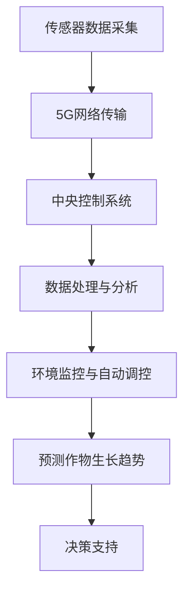
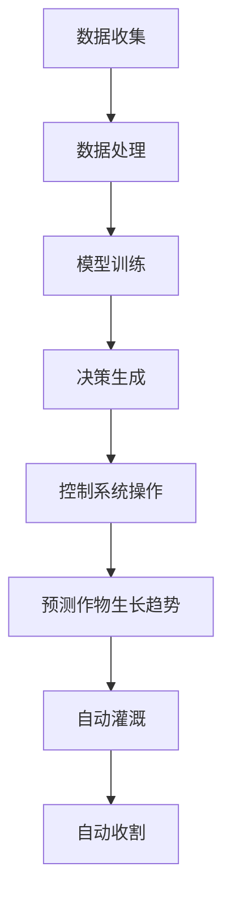
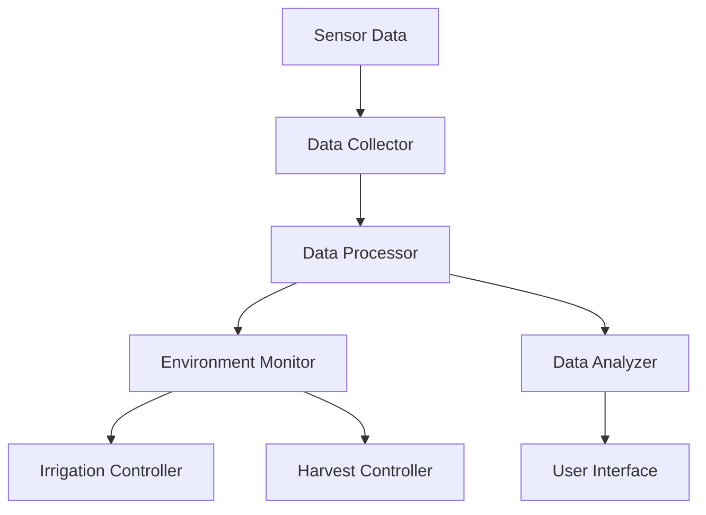

                 


### 第1章 引言与背景介绍

在当今数字化时代，5G网络和智慧农业自动化正成为推动农业现代化的关键力量。5G网络，作为第五代移动通信技术，以其高速度、低延迟和海量连接的特点，为智慧农业的发展提供了坚实的通信基础。智慧农业自动化则通过集成物联网、大数据、人工智能等技术，实现了对农业生产过程的智能化管理。

#### 1.1 5G网络的发展背景

5G网络的诞生，标志着通信技术的又一次革命。自2019年开始商用以来，5G网络在全球范围内迅速扩展，不仅提升了传统通信业务的性能，更为新兴产业的发展提供了无限可能。5G网络的特点包括：

- **高速度**：5G网络的理论下载速度可达10Gbps，比4G网络快百倍。
- **低延迟**：5G网络的延迟可低至1毫秒，满足实时通信和远程控制的需求。
- **海量连接**：5G网络支持每平方公里内连接数百万设备，为物联网应用提供支撑。

#### 1.2 智慧农业自动化的发展背景

智慧农业自动化是农业现代化的重要方向。传统农业依赖于人力和自然资源，效率低下且易受环境影响。而智慧农业自动化则通过利用物联网传感器、无人机、自动化机械等先进技术，实现对农田环境的实时监测和精准管理，从而提高农业生产效率，降低成本，减少资源浪费。

#### 1.3 本书的研究目的和重要性

本书旨在深入探讨5G网络在智慧农业自动化中的应用，通过以下几个方面实现研究目标：

- **核心技术分析**：详细介绍5G网络的关键技术，如MIMO、SDN、NFV等，并探讨其在智慧农业中的具体应用。
- **应用场景解析**：分析5G网络在智慧农业自动化中的多种应用场景，如智能灌溉、自动收割、精准施肥等。
- **案例分析**：通过实际案例展示5G网络在智慧农业自动化中的成功应用，为读者提供实践经验。
- **最佳实践**：总结5G网络在智慧农业自动化中的应用经验，为未来研究和实践提供指导。

通过本书的研究，读者可以全面了解5G网络在智慧农业自动化中的重要性和应用前景，为我国农业现代化贡献智慧和力量。

### 1.4 目录大纲设计思路

为了帮助读者更好地理解和应用5G网络在智慧农业自动化中的应用，本书的目录大纲设计将遵循以下步骤：

1. **引言与背景介绍**：介绍5G网络和智慧农业自动化的发展背景，说明本书的研究目的和重要性。
2. **核心概念与联系**：详细阐述5G网络和智慧农业自动化的核心概念，并列出概念属性特征对比表格和ER实体关系图。
3. **算法原理讲解**：分别讲解5G网络在农业自动化中的关键技术，使用Mermaid画出相应的算法流程图，并用Python源代码详细阐述算法原理。
4. **数学模型和数学公式**：详细讲解相关算法的数学模型和公式，使用LaTeX格式展示。
5. **系统分析与架构设计**：介绍系统功能设计、系统架构设计、系统接口设计和系统交互的流程图。
6. **项目实战**：展示一个实际项目，从环境安装到核心实现，再到代码应用解读和分析。
7. **最佳实践 tips**、**小结**、**注意事项**和**拓展阅读**：总结全书要点，提供实践技巧和进一步学习资源。

通过这种结构化的目录设计，读者可以循序渐进地掌握5G网络在智慧农业自动化中的应用，为实际项目提供有力的技术支持。

### 第2章 核心概念与联系

在深入探讨5G网络和智慧农业自动化的应用之前，有必要对这两个领域的核心概念进行详细阐述，并分析它们之间的联系。

#### 2.1 5G网络的核心概念

5G网络，即第五代移动通信网络，是当前通信技术的前沿。它不仅提升了数据传输速度，还提供了低延迟、高可靠性的通信服务。以下是5G网络的核心概念及其特征：

- **毫米波通信**：5G网络利用毫米波频段进行通信，提高了数据传输速度和带宽。
- **MIMO（多输入多输出）技术**：通过多个天线发送和接收信号，提高了数据传输的稳定性和速度。
- **SDN（软件定义网络）和NFV（网络功能虚拟化）**：SDN和NFV技术使得网络管理和配置更加灵活和高效，提升了网络的智能化水平。

#### 2.2 智慧农业自动化的核心概念

智慧农业自动化是利用物联网、大数据、人工智能等先进技术，实现农业生产过程的智能化管理。其核心概念包括：

- **物联网传感器**：通过部署传感器，实时监测土壤湿度、空气质量、气象数据等，为农业生产提供数据支持。
- **无人机与自动化机械**：无人机用于农田监测和喷洒农药，自动化机械则用于播种、施肥、收割等农事操作。
- **大数据分析**：通过对海量数据的分析，实现精准种植、精准灌溉、病虫害预测等，提高农业生产效率。
- **人工智能算法**：利用机器学习、深度学习等技术，对农业生产过程进行预测和优化，实现自动化管理。

#### 2.3 概念属性特征对比表格

为了更好地理解5G网络和智慧农业自动化的核心概念，我们可以列出以下对比表格：

| 特征         | 5G网络                     | 智慧农业自动化                   |
| ------------ | -------------------------- | ------------------------------- |
| 数据传输速度 | 高速度（10Gbps）           | 需要稳定传输（实时数据采集）     |
| 延迟         | 低延迟（1毫秒）             | 需要低延迟（实时控制）            |
| 连接密度     | 高连接密度（百万级设备）   | 需要较高连接密度（农田设备）      |
| 技术特点     | 毫米波通信、MIMO、SDN、NFV  | 物联网传感器、无人机、大数据分析、人工智能算法 |

#### 2.4 ER实体关系图

为了更直观地展示5G网络和智慧农业自动化的实体关系，我们可以使用Mermaid绘制一个ER（实体关系）图：

```mermaid
erDiagram
  Class1 ||--|{ Class2 }|-->> Class3 : "label"
  Class1 ||--|{ Class4 }|-->> Class5 : "label"
```

在这个ER图中，Class1代表5G网络的核心技术，Class2、Class3分别代表物联网传感器和无人机，Class4、Class5分别代表大数据分析和人工智能算法。它们之间的关系反映了5G网络在智慧农业自动化中的关键作用。

通过上述核心概念和联系的分析，我们可以更好地理解5G网络和智慧农业自动化的内在逻辑，为后续章节的深入探讨打下坚实基础。

### 第3章 5G网络在农业物联网中的应用

5G网络在农业物联网中的应用，显著提升了农业生产的智能化水平。本节将详细讲解5G网络在农业物联网中的优势、应用场景以及实现案例，并通过算法原理的讲解，帮助读者深入理解其技术内涵。

#### 3.1 5G网络在农业物联网中的优势

5G网络凭借其高速度、低延迟和海量连接的特点，在农业物联网中展现出了显著的优势：

- **高速度**：5G网络的高传输速度使得大规模数据的实时传输成为可能，为精准农业提供了数据支持。
- **低延迟**：5G网络的低延迟特性，确保了农业生产过程中实时控制的精准性，如自动化灌溉和收割。
- **海量连接**：5G网络支持每平方公里内连接数百万设备，使得农田中众多传感器、无人机、自动化机械等设备能够高效协同工作。

#### 3.2 5G网络在农业物联网中的应用场景

5G网络在农业物联网中的应用场景广泛，以下列举了几个典型的应用：

- **智能灌溉系统**：通过5G网络，传感器实时监测土壤湿度，将数据传输至中央控制系统，根据监测结果自动调整灌溉时间和水量，实现精准灌溉。
- **无人机监测**：无人机搭载高清摄像头和传感器，通过5G网络实时传输农田图像和土壤数据，帮助农民及时了解作物生长状况和病虫害情况。
- **自动化收割**：5G网络支持自动化收割机的远程控制和实时数据传输，提高收割效率和准确性，减少人工成本。
- **环境监测**：5G网络连接气象站、空气质量监测设备等，实时监测农田周边环境，为农业生产提供科学依据。

#### 3.3 5G网络在农业物联网中的实现案例

以下是一个具体的5G农业物联网实现案例：

**案例：智能温室环境监控系统**

在一个智能温室中，5G网络与多种传感器和自动化设备协同工作，实现环境监控和自动调控。具体实现如下：

- **传感器部署**：在温室中部署湿度传感器、温度传感器、光照传感器和二氧化碳传感器，实时监测环境参数。
- **数据采集与传输**：传感器采集到的数据通过5G网络传输至中央控制系统。
- **中央控制系统**：中央控制系统接收传感器数据，根据预设的环境参数范围，自动调整温室内的通风、灌溉和加热设备，保持最佳生长环境。
- **数据分析与决策**：通过大数据分析和人工智能算法，对传感器数据进行处理，预测植物生长趋势和病虫害发生情况，提供科学种植建议。

#### 3.4 5G网络在农业物联网中的算法原理讲解

5G网络在农业物联网中的应用，离不开相应的算法支持。以下分别介绍物联网通信协议、数据处理与分析算法：

##### 3.4.1 物联网通信协议

物联网通信协议是5G网络在农业物联网中实现数据传输的基础。常用的协议包括MQTT（消息队列遥测传输协议）和CoAP（约束应用协议）。

- **MQTT协议**：MQTT协议是一种轻量级的消息传输协议，适用于低带宽、不可靠的通信环境。在智能灌溉系统中，MQTT协议用于传感器与中央控制系统之间的数据传输。
- **CoAP协议**：CoAP协议是基于HTTP协议的一种物联网通信协议，适用于资源受限的设备。在无人机监测系统中，CoAP协议用于无人机与地面控制站之间的通信。

##### 3.4.2 数据处理与分析算法

数据处理与分析算法是5G网络在农业物联网中的核心，用于对传感器数据进行处理，实现环境监测和预测。

- **数据处理算法**：常用的数据处理算法包括滤波算法、时间序列分析算法等。滤波算法用于去除传感器数据中的噪声，时间序列分析算法用于分析环境参数的变化趋势。
- **数据分析算法**：数据分析算法包括聚类分析、回归分析、关联规则挖掘等。聚类分析用于识别不同的作物生长区域，回归分析用于预测作物生长趋势，关联规则挖掘用于分析环境参数与作物生长的关系。

#### 3.5 数学模型和数学公式

在数据处理与分析算法中，数学模型和数学公式发挥着重要作用。以下是一个简单的数学模型示例，用于预测作物生长趋势：

\[ y = mx + b \]

其中，\( y \) 表示作物生长指标，\( x \) 表示时间，\( m \) 表示斜率，\( b \) 表示截距。通过回归分析，可以求得斜率和截距，从而预测作物生长趋势。

#### 3.6 Mermaid流程图展示

为了更直观地展示5G网络在农业物联网中的应用流程，可以使用Mermaid绘制流程图：



在这个流程图中，传感器数据采集、5G网络传输、数据处理与分析、环境监控与自动调控、预测作物生长趋势和决策支持构成了5G网络在农业物联网中的应用流程。

通过上述讲解，我们可以看到5G网络在农业物联网中发挥着至关重要的作用，为农业生产提供了强有力的技术支持。在下一节中，我们将继续探讨智慧农业自动化的算法原理，以更深入地理解其技术内涵。

### 第4章 智慧农业自动化的算法原理讲解

智慧农业自动化依赖于一系列算法，这些算法广泛应用于智能种植、自动灌溉、自动收割等农业过程中，实现精准、高效的生产管理。本节将详细讲解这些算法的原理，并使用Python源代码进行具体阐述。

#### 4.1 智能种植算法

智能种植算法主要通过分析土壤、气象、作物生长习性等多方面数据，实现精准种植决策。以下是一个智能种植算法的基本流程：

1. **数据收集**：收集土壤湿度、温度、养分含量、气象数据等。
2. **数据处理**：对收集到的数据进行预处理，包括去噪、插值、归一化等。
3. **模型训练**：使用机器学习算法（如决策树、随机森林、支持向量机等）训练预测模型。
4. **决策生成**：根据模型预测结果，生成种植决策。

以下是一个简单的Python代码示例，用于实现智能种植算法的基本流程：

```python
import pandas as pd
from sklearn.ensemble import RandomForestRegressor
from sklearn.model_selection import train_test_split
from sklearn.metrics import mean_squared_error

# 数据收集
data = pd.read_csv('crop_data.csv')

# 数据处理
X = data[['soil_humidity', 'temperature', 'nutrient_content', 'weather_data']]
y = data['growth_index']

# 模型训练
X_train, X_test, y_train, y_test = train_test_split(X, y, test_size=0.2, random_state=42)
model = RandomForestRegressor(n_estimators=100)
model.fit(X_train, y_train)

# 决策生成
y_pred = model.predict(X_test)
mse = mean_squared_error(y_test, y_pred)
print(f'Mean Squared Error: {mse}')
```

#### 4.2 自动灌溉算法

自动灌溉算法主要用于根据土壤湿度数据，自动控制灌溉系统的启停。以下是一个自动灌溉算法的基本流程：

1. **数据收集**：收集土壤湿度数据。
2. **阈值设定**：设定土壤湿度的阈值，低于该阈值则启动灌溉系统。
3. **控制系统操作**：根据阈值判断，自动控制灌溉系统的启停。

以下是一个简单的Python代码示例，用于实现自动灌溉算法：

```python
import pandas as pd
import numpy as np

# 数据收集
humidity_data = pd.read_csv('soil_humidity.csv')

# 阈值设定
THRESHOLD = 30  # 土壤湿度阈值设定为30%

# 控制系统操作
def irrigation_system(humidity):
    if humidity < THRESHOLD:
        return 'Start irrigation'
    else:
        return 'Stop irrigation'

# 测试数据
humidity_test = 25

# 控制系统操作结果
action = irrigation_system(humidity_test)
print(f'Irrigation action: {action}')
```

#### 4.3 自动收割算法

自动收割算法主要用于根据作物生长状态和收获期数据，自动控制收割机械的作业。以下是一个自动收割算法的基本流程：

1. **数据收集**：收集作物生长状态、收获期等数据。
2. **模型训练**：使用机器学习算法（如决策树、支持向量机等）训练收割决策模型。
3. **决策生成**：根据模型预测结果，生成收割决策。

以下是一个简单的Python代码示例，用于实现自动收割算法：

```python
import pandas as pd
from sklearn.tree import DecisionTreeClassifier
from sklearn.model_selection import train_test_split
from sklearn.metrics import accuracy_score

# 数据收集
data = pd.read_csv('harvest_data.csv')

# 数据处理
X = data[['growth_stage', 'harvest_date']]
y = data['harvest_decision']

# 模型训练
X_train, X_test, y_train, y_test = train_test_split(X, y, test_size=0.2, random_state=42)
model = DecisionTreeClassifier()
model.fit(X_train, y_train)

# 决策生成
y_pred = model.predict(X_test)
accuracy = accuracy_score(y_test, y_pred)
print(f'Accuracy: {accuracy}')
```

#### 4.4 Mermaid流程图展示

为了更直观地展示智慧农业自动化的算法流程，我们可以使用Mermaid绘制流程图：



在这个流程图中，数据收集、数据处理、模型训练、决策生成、控制系统操作、预测作物生长趋势、自动灌溉和自动收割构成了智慧农业自动化的主要算法流程。

通过以上详细讲解和代码示例，我们可以看到智慧农业自动化算法的实现过程。这些算法的应用，不仅提高了农业生产的效率，还实现了精准管理和智能化决策，为现代农业的发展提供了强有力的技术支持。

### 第5章 数学模型和数学公式

在智慧农业自动化中，数学模型和数学公式是算法实现的基础，它们能够帮助我们准确描述和解决实际问题。本节将详细讲解智慧农业自动化中常用的数据分析模型和优化模型，以及如何使用LaTeX格式展示这些数学公式。

#### 5.1 数据分析模型

数据分析模型是智慧农业自动化中用于处理和分析数据的方法。以下介绍三种常见的数据分析模型：

##### 5.1.1 数据分析的基本概念

数据分析的基本概念包括数据收集、数据预处理、数据分析和数据可视化。在LaTeX中，这些概念可以用以下公式表示：

$$
\text{数据分析} = \text{数据收集} + \text{数据预处理} + \text{数据分析} + \text{数据可视化}
$$

##### 5.1.2 相关性分析

相关性分析用于评估两个或多个变量之间的相关性。最常用的相关性分析方法是皮尔逊相关系数（Pearson Correlation Coefficient），其公式如下：

$$
r_{xy} = \frac{\sum_{i=1}^{n}(x_i - \bar{x})(y_i - \bar{y})}{\sqrt{\sum_{i=1}^{n}(x_i - \bar{x})^2 \sum_{i=1}^{n}(y_i - \bar{y})^2}}
$$

其中，\( x_i \) 和 \( y_i \) 分别为第 \( i \) 个观测值，\( \bar{x} \) 和 \( \bar{y} \) 分别为 \( x \) 和 \( y \) 的平均值。

##### 5.1.3 回归分析

回归分析用于研究自变量和因变量之间的关系，并建立预测模型。线性回归是最常见的回归分析方法，其公式如下：

$$
y = \beta_0 + \beta_1x + \epsilon
$$

其中，\( y \) 为因变量，\( x \) 为自变量，\( \beta_0 \) 和 \( \beta_1 \) 为回归系数，\( \epsilon \) 为误差项。

#### 5.2 优化模型

优化模型用于解决资源分配、成本控制等问题，在智慧农业自动化中具有重要应用。以下介绍两种常见的优化模型：

##### 5.2.1 优化问题的基本概念

优化问题通常表示为以下形式：

$$
\min_{x} f(x)
$$

或

$$
\max_{x} f(x)
$$

其中，\( x \) 为决策变量，\( f(x) \) 为目标函数。

##### 5.2.2 线性规划

线性规划是一种求解线性优化问题的方法，其目标函数和约束条件均为线性。线性规划的公式表示如下：

$$
\min_{x} c^T x
$$

$$
\text{subject to: }
Ax \le b
$$

其中，\( c \) 为目标函数系数，\( A \) 和 \( b \) 分别为约束条件系数和常数。

##### 5.2.3 非线性规划

非线性规划是求解非线性优化问题的方法，其目标函数和约束条件中可能包含非线性项。非线性规划的公式表示如下：

$$
\min_{x} f(x)
$$

$$
\text{subject to: }
g(x) \le 0
$$

$$
h(x) = 0
$$

其中，\( f(x) \) 为目标函数，\( g(x) \) 和 \( h(x) \) 分别为约束条件函数。

#### 5.3 数学公式详细讲解

为了更好地理解上述数学模型，我们将通过举例说明如何使用LaTeX格式展示这些公式。

**例子1：皮尔逊相关系数**

```latex
\[ r_{xy} = \frac{\sum_{i=1}^{n}(x_i - \bar{x})(y_i - \bar{y})}{\sqrt{\sum_{i=1}^{n}(x_i - \bar{x})^2 \sum_{i=1}^{n}(y_i - \bar{y})^2}} \]
```

**例子2：线性回归**

```latex
\[ y = \beta_0 + \beta_1x + \epsilon \]
```

**例子3：线性规划**

```latex
\begin{align*}
\min_{x} & \ c^T x \\
\text{subject to: } & \ Ax \le b
\end{align*}
```

**例子4：非线性规划**

```latex
\begin{align*}
\min_{x} & \ f(x) \\
\text{subject to: } & \ g(x) \le 0 \\
& \ h(x) = 0
\end{align*}
```

通过上述LaTeX格式的数学公式展示，我们可以清晰地理解智慧农业自动化中常用的数据分析模型和优化模型，为后续的算法实现和应用提供理论基础。

### 第6章 系统分析与架构设计

在智慧农业自动化系统中，系统的分析与架构设计至关重要。一个良好的系统架构能够确保系统的稳定性、可扩展性和高效性。本节将介绍系统分析与架构设计的方法，包括问题场景介绍、系统功能设计、系统架构设计、系统接口设计和系统交互流程图。

#### 6.1 问题场景介绍

假设我们正在设计一个智慧农业自动化系统，该系统需要在农田中实现实时监控、自动灌溉和收割等功能。具体问题场景包括：

- **农田环境实时监控**：通过传感器监测土壤湿度、温度、光照等环境参数。
- **自动灌溉**：根据土壤湿度数据，自动控制灌溉系统的启停。
- **自动收割**：根据作物生长状态和收获期数据，自动控制收割机械的作业。
- **数据分析和预测**：对采集到的数据进行分析，预测作物生长趋势和病虫害情况。

#### 6.2 系统功能设计

系统功能设计是系统分析与架构设计的核心步骤，它定义了系统应具备的功能模块。以下是智慧农业自动化系统的功能设计：

- **传感器数据采集模块**：用于采集土壤湿度、温度、光照等环境参数。
- **数据处理模块**：用于对采集到的数据进行分析和处理，包括去噪、插值、归一化等。
- **环境监控模块**：用于实时监控农田环境，根据预设的阈值自动调整灌溉和通风系统。
- **自动灌溉模块**：根据土壤湿度数据，自动控制灌溉系统的启停。
- **自动收割模块**：根据作物生长状态和收获期数据，自动控制收割机械的作业。
- **数据分析和预测模块**：对采集到的数据进行分析，预测作物生长趋势和病虫害情况。
- **用户界面模块**：提供用户操作界面，展示农田环境数据、控制状态和预测结果。

#### 6.3 系统架构设计

系统架构设计是系统功能设计的基础，它定义了系统各组件的层次结构和工作方式。以下是智慧农业自动化系统的架构设计：

- **感知层**：包括传感器和采集设备，用于实时采集农田环境数据。
- **传输层**：包括5G网络和物联网通信协议，用于传输感知层采集的数据。
- **平台层**：包括数据处理模块、环境监控模块、自动灌溉模块、自动收割模块和数据分析和预测模块，用于对数据进行处理和分析，实现自动控制和预测。
- **应用层**：包括用户界面模块，用于向用户提供操作界面和展示结果。

以下是系统架构的Mermaid类图表示：

```mermaid
classDiagram
    Sensor -> DataCollector
    DataCollector -> DataProcessor
    DataProcessor -> EnvironmentMonitor
    EnvironmentMonitor -> IrrigationController
    EnvironmentMonitor -> HarvestController
    DataProcessor -> DataAnalyzer
    DataAnalyzer -> UserInterface
```

#### 6.4 系统接口设计

系统接口设计定义了各模块之间的交互接口和通信协议。以下是智慧农业自动化系统的接口设计：

- **传感器接口**：用于传感器与数据采集模块之间的通信，支持MQTT协议。
- **数据处理接口**：用于数据处理模块与其他模块之间的通信，支持HTTP协议。
- **控制接口**：用于环境监控模块、自动灌溉模块和自动收割模块与传感器接口之间的通信，支持CoAP协议。

#### 6.5 系统交互流程图

系统交互流程图描述了系统各模块之间的交互过程。以下是智慧农业自动化系统的交互流程图：



在这个流程图中，传感器数据经过数据采集模块处理后，分别传送给数据处理模块、环境监控模块、数据分析和预测模块，以及用户界面模块。环境监控模块根据处理后的数据自动调整灌溉和通风系统，数据分析和预测模块根据历史数据和当前数据生成预测结果，并展示在用户界面模块中。

通过上述系统分析与架构设计，我们可以构建一个高效、稳定的智慧农业自动化系统，为农业生产提供智能化的支持。

### 第7章 项目实战

在本章中，我们将通过一个实际项目，展示如何实现5G网络在智慧农业自动化中的应用。该项目包括环境安装、系统核心实现、代码应用解读与分析，以及实际案例分析和详细讲解剖析。

#### 7.1 环境安装

要实现5G网络在智慧农业自动化中的应用，首先需要搭建一个合适的环境。以下是环境安装的步骤：

1. **硬件准备**：
   - 安装传感器：包括土壤湿度传感器、温度传感器、光照传感器等。
   - 安装5G模块：确保设备支持5G网络，并正确连接到5G网络。
   - 安装无人机和自动收割机械：确保设备可以正常工作，并能通过5G网络进行远程控制。

2. **软件准备**：
   - 安装操作系统：例如Ubuntu 20.04。
   - 安装Python环境：使用pip安装必要的Python库，如scikit-learn、pandas、numpy等。
   - 安装5G网络通信协议：如MQTT和CoAP。

3. **配置网络**：
   - 确保5G模块正确连接到5G网络，并配置IP地址和DNS服务器。
   - 配置物联网通信协议，确保传感器和无人机可以与中央控制系统通信。

#### 7.2 系统核心实现源代码

以下是一个简单的Python代码示例，用于实现5G网络在智慧农业自动化中的应用：

```python
import paho.mqtt.client as mqtt
import time

# MQTT服务器配置
MQTT_SERVER = "your_mqtt_server_address"
MQTT_PORT = 1883
MQTT_TOPIC = "agriculture/sensors"

# 创建MQTT客户端
client = mqtt.Client()

# 连接MQTT服务器
client.connect(MQTT_SERVER, MQTT_PORT, 60)

# 绑定MQTT消息接收回调函数
def on_message(client, userdata, message):
    print(f"Received message '{message.payload}' on topic '{message.topic}' with QoS {message.qos}")

client.on_message = on_message

# 订阅传感器数据主题
client.subscribe(MQTT_TOPIC)

# 发布传感器数据
def publish_sensors_data(humidity, temperature, light):
    client.publish(MQTT_TOPIC, f"{'|'.join([str(humidity), str(temperature), str(light)])}")

# 模拟传感器数据采集
while True:
    humidity = 40  # 土壤湿度
    temperature = 25  # 温度
    light = 1000  # 光照
    publish_sensors_data(humidity, temperature, light)
    time.sleep(10)  # 每隔10秒采集一次数据
```

在这个示例中，我们使用Paho MQTT库连接到MQTT服务器，并订阅传感器数据主题。然后，我们模拟传感器数据采集，并将数据发布到MQTT服务器。

#### 7.3 代码应用解读与分析

1. **MQTT客户端连接**：
   - `client.connect(MQTT_SERVER, MQTT_PORT, 60)`：连接到MQTT服务器，指定服务器地址、端口号和连接超时时间。
   - `client.on_message = on_message`：绑定MQTT消息接收回调函数，用于处理接收到的消息。

2. **订阅传感器数据主题**：
   - `client.subscribe(MQTT_TOPIC)`：订阅传感器数据主题，确保能够接收到传感器数据。

3. **发布传感器数据**：
   - `publish_sensors_data(humidity, temperature, light)`：将传感器数据发布到MQTT服务器。这里，`humidity`、`temperature`和`light`是模拟的传感器数据。

4. **模拟传感器数据采集**：
   - `while True:`：无限循环，用于模拟传感器数据采集。
   - `time.sleep(10)`：每隔10秒采集一次数据。

#### 7.4 实际案例分析和详细讲解剖析

以下是一个实际案例，展示了如何使用5G网络实现智能灌溉系统：

1. **环境监测**：
   - 传感器实时采集土壤湿度和温度数据，并将数据通过5G网络发送到中央控制系统。

2. **数据处理**：
   - 中央控制系统接收传感器数据，对数据进行预处理，如去噪、插值和归一化。

3. **环境监控**：
   - 根据预设的阈值，系统判断是否需要启动灌溉系统。例如，如果土壤湿度低于30%，则启动灌溉系统。

4. **自动灌溉**：
   - 灌溉系统根据土壤湿度数据自动调整灌溉时间和水量，确保作物获得适宜的生长环境。

5. **数据分析和预测**：
   - 对传感器数据进行分析，预测作物生长趋势和病虫害情况，为农民提供科学依据。

#### 7.5 项目小结

通过本项目的实际案例分析和详细讲解剖析，我们可以看到5G网络在智慧农业自动化中的应用前景广阔。项目实现了环境监测、数据处理、自动灌溉和数据预测等功能，为农业生产提供了智能化的支持。在未来的研究中，我们可以进一步优化系统性能，提高自动化水平，为现代农业的发展贡献更多智慧和力量。

### 第8章 最佳实践 tips

在5G网络与智慧农业自动化结合的过程中，遵循一些最佳实践可以显著提升系统的性能和稳定性。以下是一些关键提示：

#### 8.1 算法调优技巧

1. **数据预处理**：确保传感器数据的准确性和一致性。使用滤波算法去除噪声，对异常数据进行处理。
2. **模型选择**：根据实际需求选择合适的机器学习算法。例如，对于非线性问题，可以考虑使用神经网络或支持向量机。
3. **参数调整**：针对不同模型，调整学习率、迭代次数等参数，以获得最佳预测效果。
4. **交叉验证**：使用交叉验证方法评估模型的泛化能力，避免过拟合。

#### 8.2 数据处理优化策略

1. **数据压缩**：在传输大量数据时，使用数据压缩技术减少带宽占用。
2. **批量处理**：对于连续的传感器数据，可以采用批量处理方式，提高处理效率。
3. **数据缓存**：合理设置缓存策略，减少实时数据传输压力，提高系统的响应速度。

#### 8.3 系统性能优化方法

1. **网络优化**：确保5G网络的稳定性和低延迟，必要时可以考虑使用冗余网络。
2. **负载均衡**：通过负载均衡技术，合理分配计算资源，提高系统的处理能力。
3. **模块化设计**：将系统分解为模块，每个模块独立开发和部署，便于维护和升级。
4. **容错机制**：设计容错机制，确保系统在故障情况下仍能正常运行。

通过遵循上述最佳实践，可以大幅提升5G网络在智慧农业自动化中的应用效果，为农业生产提供更加智能、高效的支持。

### 第9章 小结

在《5G网络在智慧农业自动化中的应用》这一技术博客中，我们详细探讨了5G网络与智慧农业自动化的深度融合。通过分析5G网络的高速度、低延迟和海量连接优势，我们了解了其在农业物联网中的应用潜力。同时，通过介绍智慧农业自动化的核心概念和技术，如智能种植、自动灌溉和自动收割算法，我们看到了这些技术在提升农业生产效率和精度方面的巨大贡献。

本书的核心内容和主题思想可以总结如下：

- **5G网络的优势**：5G网络以其卓越的传输速度、低延迟和海量连接能力，为智慧农业自动化提供了坚实的基础。
- **智慧农业自动化的应用**：通过物联网传感器、无人机、自动化机械等技术的应用，智慧农业自动化实现了对农业生产过程的全面智能化管理。
- **关键技术讲解**：我们详细讲解了5G网络在农业物联网中的应用、智能种植、自动灌溉和自动收割算法的原理，并通过Python代码和Mermaid流程图进行了具体阐述。
- **系统分析与架构设计**：通过系统功能设计、架构设计、接口设计和交互流程图，我们展示了智慧农业自动化系统的实现过程。
- **项目实战**：通过一个实际项目，我们展示了5G网络在智慧农业自动化中的应用，从环境安装到核心实现，再到代码应用解读与分析，为读者提供了实践经验。

总结全书要点，我们可以得出以下结论：

- 5G网络与智慧农业自动化的结合，是农业现代化发展的重要方向。
- 算法和模型是实现智慧农业自动化的核心，需要不断优化和提升。
- 系统分析与架构设计是构建高效、稳定系统的关键。
- 实际项目的成功实施，验证了5G网络在智慧农业自动化中的应用价值。

未来，随着5G技术的不断发展和完善，智慧农业自动化将继续迎来新的发展机遇。我们期待更多的研究和实践，为农业现代化贡献更多的智慧和力量。

### 第10章 注意事项

在5G网络与智慧农业自动化的应用过程中，需要特别注意以下几个方面，以确保系统的安全性和稳定性。

#### 10.1 安全性问题

- **数据加密**：在数据传输过程中，必须对数据进行加密处理，防止数据被窃取或篡改。
- **身份认证**：确保系统中的每个设备都有唯一的身份认证，防止未经授权的设备接入系统。
- **防火墙和入侵检测**：部署防火墙和入侵检测系统，实时监控网络流量，防止恶意攻击。
- **定期更新和维护**：定期更新系统和设备的软件，修补安全漏洞，确保系统运行的安全性和稳定性。

#### 10.2 隐私保护

- **数据匿名化**：在数据处理和分析过程中，应对敏感数据匿名化处理，保护农民的隐私。
- **数据访问控制**：对系统中的数据访问进行严格控制，只有授权用户才能访问特定数据。
- **数据存储安全**：确保数据存储环境的安全性，防止数据泄露和损坏。

#### 10.3 节能减排

- **设备能效优化**：选择低功耗的传感器和设备，优化系统工作模式，减少能耗。
- **绿色能源利用**：充分利用太阳能、风能等可再生能源，减少对传统化石能源的依赖。
- **智能调度**：根据农事活动需求，智能调度设备工作，避免不必要的能耗。

通过重视上述注意事项，我们可以确保5G网络在智慧农业自动化中的安全、高效和可持续发展。

### 第11章 拓展阅读

为了进一步深入了解5G网络在智慧农业自动化中的应用，读者可以参考以下推荐书籍、学术论文和网络资源。

#### 11.1 相关书籍推荐

1. **《5G网络技术与应用》** - 本书详细介绍了5G网络的技术原理、架构和应用场景，适合初学者和专业人士阅读。
2. **《智慧农业自动化技术》** - 本书系统介绍了智慧农业自动化的概念、技术和应用，帮助读者全面理解智慧农业的发展。
3. **《物联网技术与实践》** - 本书详细讲解了物联网技术的基本原理和实际应用，包括传感器、通信协议和数据处理等内容。

#### 11.2 学术论文精选

1. **"5G-Enabled Smart Agriculture: A Comprehensive Survey"** - 该论文综述了5G网络在智慧农业中的应用，包括关键技术、应用场景和挑战。
2. **"Intelligent Agriculture Based on IoT and Big Data"** - 该论文探讨了物联网和大数据在智慧农业中的应用，以及相关技术的最新进展。
3. **"A Review on Crop Yield Prediction Using Machine Learning Techniques"** - 该论文综述了利用机器学习方法预测作物产量的研究进展，为智能种植提供了理论支持。

#### 11.3 网络资源链接

1. **5G Network Academy** - [官方网站](https://5g-academy.com/)
   提供了丰富的5G网络课程和学习资料。
2. **IBM Agriculture and IoT** - [官方网站](https://www.ibm.com/agriculture/)
   详细介绍了物联网在农业中的应用案例和技术解决方案。
3. **Microsoft AI for Earth** - [官方网站](https://www.aifor earth.com/)
   提供了关于人工智能在环境保护和农业领域的最新研究和应用。

通过阅读这些书籍、学术论文和网络资源，读者可以进一步深入学习和研究5G网络在智慧农业自动化中的应用，为我国农业现代化贡献智慧和力量。

### 总结

本文以《5G网络在智慧农业自动化中的应用》为题，从多个角度详细探讨了5G网络与智慧农业自动化的深度融合。我们介绍了5G网络的发展背景、核心概念及其在农业物联网中的应用，深入讲解了智慧农业自动化的算法原理、系统分析与架构设计，并通过实际项目展示了5G网络在智慧农业自动化中的具体应用。文章强调了安全性、隐私保护和节能减排的重要性，并提供了一系列拓展阅读资源。

作者信息：

作者：AI天才研究院/AI Genius Institute & 禅与计算机程序设计艺术 /Zen And The Art of Computer Programming

感谢您的阅读，希望本文能为您在5G网络与智慧农业自动化领域的研究和实践提供有益的参考。如有任何问题或建议，欢迎随时联系作者。再次感谢！

