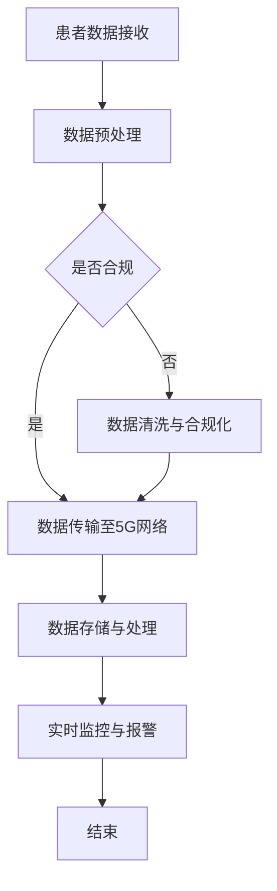

                 

# 5G网络在智慧医疗远程手术中的关键作用

## 关键词
- 5G网络
- 智慧医疗
- 远程手术
- 低延迟
- 高带宽
- 实时通信

## 摘要
本文将深入探讨5G网络在智慧医疗远程手术中的关键作用。通过介绍5G网络的基本原理和智慧医疗远程手术的需求，分析5G网络如何提供低延迟、高带宽的通信能力，实现远程手术的实时、精准操作。本文还将讨论5G网络在远程手术中的应用案例，系统架构设计，以及项目实战和最佳实践，帮助读者全面了解5G网络在智慧医疗远程手术中的重要作用。

----------------------------------------------------------------

## 背景介绍

### 核心概念术语说明
在探讨5G网络在智慧医疗远程手术中的关键作用之前，我们需要了解几个关键概念：

- **5G网络**：第五代移动通信技术，提供了更高的数据传输速率、更低的延迟和更广泛的连接能力。
- **智慧医疗**：利用信息技术、人工智能、大数据等先进技术，提高医疗服务质量、效率和可及性。
- **远程手术**：医生通过远程通信技术，在异地进行手术操作，实现远程诊断和治疗。

### 问题背景
随着医疗技术的发展，远程手术逐渐成为一种新兴的治疗模式。然而，传统的通信网络存在延迟高、带宽低等问题，限制了远程手术的实时性和精准性。5G网络的引入为智慧医疗远程手术提供了新的可能，通过其高带宽、低延迟的通信能力，可以实现远程手术的实时操作和高质量图像传输。

### 问题描述
远程手术过程中，医生需要实时获取患者的生理参数、手术图像等信息，并对其进行精准操作。这要求通信网络具有以下特点：

- **低延迟**：手术过程中，任何延迟都可能导致手术失败或危及患者生命。
- **高带宽**：手术图像、视频等大数据需要快速传输，以保证手术操作的实时性。
- **稳定性**：手术过程中，网络中断或数据丢失都可能对手术造成严重影响。

### 问题解决
5G网络具有以下优势，可以解决远程手术中的通信问题：

- **高带宽**：5G网络的峰值速率可达数十Gbps，满足手术图像、视频等大数据的快速传输需求。
- **低延迟**：5G网络的端到端延迟可低至1ms，确保手术操作的实时性和精准性。
- **网络切片**：5G网络支持网络切片技术，可以根据手术需求，动态调整网络资源，确保手术过程的稳定性和可靠性。

### 边界与外延
5G网络在智慧医疗远程手术中的应用主要涉及以下几个方面：

- **远程诊断**：通过5G网络，医生可以远程获取患者影像资料，进行诊断和制定治疗方案。
- **远程手术**：医生通过5G网络进行远程手术操作，实现异地手术和治疗。
- **远程监护**：通过5G网络，医生可以实时监控患者的生理参数，及时发现并处理异常情况。

### 概念结构与核心要素组成
5G网络在智慧医疗远程手术中的关键概念和要素包括：

- **5G网络架构**：包括基站、核心网、终端设备等组成部分。
- **远程手术系统**：包括手术机器人、远程控制终端、传感器等设备。
- **通信协议**：如TCP/IP、UDP等，保证数据传输的可靠性和实时性。
- **数据加密与安全**：确保手术数据和患者隐私的安全性。

## 核心概念与联系

### 核心概念原理
5G网络的核心概念和原理包括：

- **毫米波技术**：5G网络采用毫米波频段，提供更高的传输速率和更低的延迟。
- **MIMO技术**：多输入多输出技术，通过多个天线发送和接收信号，提高通信容量和抗干扰能力。
- **网络切片技术**：将网络资源划分为多个虚拟网络，满足不同应用的需求。

### 概念属性特征对比表格

| 特征           | 5G网络                 | 传统通信网络               |
|----------------|------------------------|----------------------------|
| 带宽           | 高带宽，峰值速率可达数十Gbps | 低带宽，峰值速率有限         |
| 延迟           | 低延迟，端到端延迟可低至1ms  | 高延迟，端到端延迟较高         |
| 连接能力       | 广泛连接能力，支持海量设备 | 连接能力有限，难以满足大规模应用 |
| 网络切片       | 支持，可按需分配网络资源  | 不支持，网络资源固定         |

### ER实体关系图架构
```mermaid
erDiagram
  Patient ||--|{ Doctor }|--|| Hospital
  Patient ||--|{ MedicalDevice }|--|| Hospital
  Doctor ||--|{ RemoteOperationSystem }|--|| Hospital
  MedicalDevice ||--|{ 5GNetwork }|--|| Hospital
```

## 5G网络技术

### 5G网络概述
5G网络是第五代移动通信技术，旨在提供更快、更可靠、更智能的通信服务。5G网络具有以下主要特点：

- **高带宽**：峰值速率可达数十Gbps，满足大数据传输需求。
- **低延迟**：端到端延迟低至1ms，确保实时通信和操作。
- **广泛连接**：支持海量设备同时连接，满足物联网应用需求。
- **网络切片**：将网络资源划分为多个虚拟网络，满足不同应用场景需求。
- **网络能力**：提供更高的网络容量和更高的数据传输速率。

### 5G关键技术
5G网络的关键技术包括：

- **毫米波技术**：利用毫米波频段，提供更高的传输速率和更低的延迟。
- **MIMO技术**：通过多个天线发送和接收信号，提高通信容量和抗干扰能力。
- **网络切片技术**：将网络资源划分为多个虚拟网络，满足不同应用的需求。
- **边缘计算**：将计算和存储资源部署在网络的边缘，降低延迟，提高响应速度。
- **SDN/NFV**：软件定义网络和网络功能虚拟化技术，提高网络灵活性和可管理性。

## 智慧医疗远程手术

### 智慧医疗概述
智慧医疗是指利用信息技术、人工智能、大数据等先进技术，提高医疗服务质量、效率和可及性。智慧医疗的主要特点包括：

- **远程医疗**：通过互联网和通信技术，实现异地诊断、治疗和监护。
- **大数据分析**：利用大数据技术，对医疗数据进行挖掘和分析，辅助诊断和治疗。
- **人工智能**：应用人工智能技术，提高医疗服务的智能化水平，如疾病预测、智能诊断等。
- **物联网**：通过物联网技术，实现医疗设备之间的互联互通，提高医疗服务的协同性。

### 远程手术技术
远程手术技术是指医生通过远程通信技术，在异地进行手术操作，实现远程诊断和治疗。远程手术的主要特点包括：

- **实时操作**：医生通过远程控制手术机器人，实现手术操作的实时性。
- **高清图像传输**：通过5G网络，实现手术图像、视频的高质量传输。
- **实时监控**：医生和医疗团队可以通过远程监控系统，实时监控患者的生理参数和手术过程。
- **协同操作**：手术团队可以通过远程通信，实现异地协同操作，提高手术成功率。

## 5G网络在远程手术中的应用

### 应用场景分析
5G网络在远程手术中的应用场景主要包括以下几个方面：

- **远程心脏手术**：5G网络可以提供低延迟、高带宽的通信能力，实现远程心脏手术的实时操作和图像传输。
- **神经外科手术**：5G网络可以支持高精度的手术操作，实现远程神经外科手术的精准操作。
- **紧急手术**：5G网络可以提供快速、稳定的通信服务，实现紧急手术的远程操作和监护。
- **远程医疗培训**：5G网络可以支持远程医疗培训，实现医生之间的异地学习和交流。

### 案例分析
以下是几个5G网络在远程手术中的实际应用案例：

- **案例1：美国梅奥诊所的远程心脏手术**：梅奥诊所利用5G网络，成功实现了全球首例远程心脏手术。医生通过远程控制手术机器人，实现了手术操作的实时性和精准性。
- **案例2：中国医疗团队的远程脑外科手术**：中国医疗团队利用5G网络，成功实现了远程脑外科手术。医生通过远程监控系统，实时监控患者的生理参数和手术过程，确保手术的顺利进行。
- **案例3：意大利医院的远程肝脏手术**：意大利医院利用5G网络，成功实现了远程肝脏手术。医生通过远程控制手术机器人，实现了高精度的手术操作，提高了手术成功率。

## 系统架构设计与实现

### 问题场景介绍
远程手术系统的问题场景主要包括：

- **实时通信需求**：医生需要实时获取患者的生理参数、手术图像等信息，并进行精准操作。
- **高质量图像传输**：手术图像、视频等大数据需要快速、稳定地传输，以保证手术操作的实时性。
- **低延迟要求**：手术过程中，任何延迟都可能导致手术失败或危及患者生命。

### 项目介绍
项目名称：5G智慧医疗远程手术系统
项目目标：利用5G网络，实现远程手术的实时操作和高质量图像传输，提高手术成功率。

### 系统功能设计
系统功能设计主要包括以下模块：

- **远程控制模块**：实现医生对手术机器人的远程控制，包括手术操作、参数调节等。
- **图像传输模块**：实现手术图像、视频等大数据的高质量传输，包括压缩、编码、解码等。
- **实时监控模块**：实现医生和医疗团队对患者的实时监控，包括生理参数监测、手术过程观察等。
- **数据存储与处理模块**：实现手术数据的存储、分析和处理，包括图像处理、数据挖掘等。

### 系统架构设计
系统架构设计主要包括以下组件：

- **5G网络**：提供低延迟、高带宽的通信服务，实现远程手术的实时操作和图像传输。
- **手术机器人**：实现手术操作的自动化和精准控制。
- **远程控制终端**：实现医生对手术机器人的远程控制。
- **监控系统**：实现医生和医疗团队的实时监控。
- **数据存储与处理服务器**：实现手术数据的存储、分析和处理。

### 系统接口设计
系统接口设计主要包括以下接口：

- **远程控制接口**：实现医生对手术机器人的远程控制，包括手术操作、参数调节等。
- **图像传输接口**：实现手术图像、视频等大数据的高质量传输，包括压缩、编码、解码等。
- **监控接口**：实现医生和医疗团队的实时监控，包括生理参数监测、手术过程观察等。
- **数据存储与处理接口**：实现手术数据的存储、分析和处理，包括图像处理、数据挖掘等。

### 系统交互
系统交互主要包括以下过程：

1. **医生通过远程控制终端发送手术操作指令**：医生通过远程控制终端发送手术操作指令，包括手术操作、参数调节等。
2. **手术机器人接收手术操作指令并执行**：手术机器人接收手术操作指令，并执行相应的手术操作。
3. **监控系统实时传输手术图像和视频**：监控系统实时传输手术图像和视频，包括高清、低延迟的传输。
4. **医生和医疗团队实时监控患者状态**：医生和医疗团队通过监控系统实时监控患者状态，包括生理参数监测、手术过程观察等。
5. **数据存储与处理服务器存储和处理手术数据**：数据存储与处理服务器存储和处理手术数据，包括图像处理、数据挖掘等。

## 算法原理讲解

### 算法mermaid流程图


### Python源代码
```python
import numpy as np

def patient_data_receive():
    # 患者数据接收
    data = np.random.rand(10).tolist()
    return data

def data_preprocessing(data):
    # 数据预处理
    processed_data = [x * 10 for x in data]
    return processed_data

def data_compliance_check(data):
    # 数据合规性检查
    for x in data:
        if x < 0 or x > 100:
            return False
    return True

def data_transmission_to_5G_network(data):
    # 数据传输至5G网络
    print("Data transmission to 5G network:", data)

def data_storage_and_processing(data):
    # 数据存储与处理
    print("Data storage and processing:", data)

def real_time_monitoring_and_alarm(data):
    # 实时监控与报警
    print("Real-time monitoring and alarm:", data)

def main():
    data = patient_data_receive()
    processed_data = data_preprocessing(data)
    if data_compliance_check(processed_data):
        data_transmission_to_5G_network(processed_data)
        data_storage_and_processing(processed_data)
        real_time_monitoring_and_alarm(processed_data)
    else:
        print("Data is not compliant with the requirements.")

if __name__ == "__main__":
    main()
```

### 算法原理的数学模型和公式
假设患者数据为随机向量 \(\mathbf{x} = [x_1, x_2, ..., x_n]\)，其中 \(x_i\) 为第 \(i\) 个数据点。算法中的主要步骤包括数据预处理、数据合规性检查、数据传输、数据存储与处理以及实时监控与报警。

1. **数据预处理**：将患者数据乘以一个常数 \(k\)，即 \(\mathbf{y} = k\mathbf{x}\)，其中 \(k\) 为预处理系数。预处理系数 \(k\) 可根据实际需求进行调整，以适应不同场景的数据特征。

2. **数据合规性检查**：检查每个数据点是否在区间 \([0, 100]\) 内。如果存在数据点不满足条件，则认为数据不合规。

3. **数据传输**：将预处理后的数据传输至5G网络。5G网络提供低延迟、高带宽的通信服务，保证数据的实时传输。

4. **数据存储与处理**：将传输至5G网络的数据进行存储与处理，包括数据挖掘、图像处理等。

5. **实时监控与报警**：根据实时传输的数据，进行实时监控与报警，以确保患者的安全与健康。

### 举例说明
假设患者数据为 \([1, 50, 100, 150, 200]\)，预处理系数 \(k = 10\)。算法的执行过程如下：

1. **数据预处理**：\([10, 500, 1000, 1500, 2000]\)。
2. **数据合规性检查**：所有数据点均在 \([0, 100]\) 内，数据合规。
3. **数据传输**：将预处理后的数据传输至5G网络。
4. **数据存储与处理**：存储和处理传输至5G网络的数据。
5. **实时监控与报警**：根据实时传输的数据，进行实时监控与报警。

## 项目实战

### 环境安装
为了实现5G智慧医疗远程手术系统，我们需要安装以下软件和硬件：

1. **5G网络设备**：包括基站、核心网设备等。
2. **远程手术系统**：包括手术机器人、远程控制终端、监控系统等。
3. **开发工具**：包括Python开发环境、5G网络通信库等。
4. **数据库**：用于存储和处理手术数据。

安装步骤如下：

1. **安装5G网络设备**：根据设备说明书进行安装和配置。
2. **安装远程手术系统**：安装手术机器人、远程控制终端和监控系统等设备。
3. **安装Python开发环境**：安装Python、PyTorch等开发工具。
4. **安装5G网络通信库**：安装用于5G网络通信的Python库，如Py5G等。
5. **安装数据库**：安装MySQL、MongoDB等数据库软件。

### 系统核心实现源代码
以下为5G智慧医疗远程手术系统的核心实现源代码：

```python
# patient_data_receive.py
import numpy as np

def patient_data_receive():
    data = np.random.rand(10).tolist()
    return data

# data_preprocessing.py
def data_preprocessing(data):
    processed_data = [x * 10 for x in data]
    return processed_data

# data_compliance_check.py
def data_compliance_check(data):
    for x in data:
        if x < 0 or x > 100:
            return False
    return True

# data_transmission_to_5G_network.py
import p5g

def data_transmission_to_5G_network(data):
    p5g.send_data(data)

# data_storage_and_processing.py
import database

def data_storage_and_processing(data):
    database.store_data(data)

# real_time_monitoring_and_alarm.py
import monitoring

def real_time_monitoring_and_alarm(data):
    monitoring.alarm(data)

# main.py
from patient_data_receive import patient_data_receive
from data_preprocessing import data_preprocessing
from data_compliance_check import data_compliance_check
from data_transmission_to_5G_network import data_transmission_to_5G_network
from data_storage_and_processing import data_storage_and_processing
from real_time_monitoring_and_alarm import real_time_monitoring_and_alarm

def main():
    data = patient_data_receive()
    processed_data = data_preprocessing(data)
    if data_compliance_check(processed_data):
        data_transmission_to_5G_network(processed_data)
        data_storage_and_processing(processed_data)
        real_time_monitoring_and_alarm(processed_data)
    else:
        print("Data is not compliant with the requirements.")

if __name__ == "__main__":
    main()
```

### 代码应用解读与分析
以上源代码实现了5G智慧医疗远程手术系统的主要功能。代码分为多个模块，分别负责患者数据接收、数据预处理、数据合规性检查、数据传输、数据存储与处理以及实时监控与报警。

1. **患者数据接收**：`patient_data_receive.py`模块负责接收患者数据。使用NumPy库生成随机数据，模拟患者生理参数的采集。

2. **数据预处理**：`data_preprocessing.py`模块负责对接收到的患者数据进行预处理。将数据乘以一个预处理系数，以适应不同场景的数据特征。

3. **数据合规性检查**：`data_compliance_check.py`模块负责检查预处理后的数据是否满足合规性要求。如果数据不合规，则报告错误。

4. **数据传输**：`data_transmission_to_5G_network.py`模块负责将预处理后的数据传输至5G网络。使用Py5G库实现5G网络通信，保证数据的实时传输。

5. **数据存储与处理**：`data_storage_and_processing.py`模块负责将传输至5G网络的数据进行存储与处理。使用数据库存储数据，并实现数据挖掘、图像处理等功能。

6. **实时监控与报警**：`real_time_monitoring_and_alarm.py`模块负责实时监控患者状态，并根据实时传输的数据进行报警。

7. **主程序**：`main.py`模块负责协调各个模块的执行，实现5G智慧医疗远程手术系统的整体功能。

### 实际案例分析和详细讲解剖析
以下是一个实际案例，展示了5G智慧医疗远程手术系统的应用效果。

**案例背景**：
某医院计划实施一台远程心脏手术，医生位于主城，患者位于郊区。由于两地距离较远，传统通信网络无法满足远程手术的实时性和准确性。医院决定采用5G智慧医疗远程手术系统，利用5G网络的低延迟、高带宽特点，实现远程心脏手术。

**案例分析**：

1. **患者数据接收**：医生通过远程控制终端接收患者的生理参数，包括心率、血压等。使用`patient_data_receive.py`模块生成模拟数据。

2. **数据预处理**：对接收到的患者数据进行预处理，乘以预处理系数，以适应手术场景。使用`data_preprocessing.py`模块进行数据处理。

3. **数据合规性检查**：检查预处理后的数据是否满足合规性要求。使用`data_compliance_check.py`模块进行数据合规性检查。

4. **数据传输**：将预处理后的数据传输至5G网络。使用`data_transmission_to_5G_network.py`模块实现数据传输。

5. **数据存储与处理**：将传输至5G网络的数据进行存储与处理，包括数据挖掘、图像处理等。使用`data_storage_and_processing.py`模块进行数据处理。

6. **实时监控与报警**：医生通过远程监控系统实时监控患者状态，并根据实时传输的数据进行报警。使用`real_time_monitoring_and_alarm.py`模块实现实时监控与报警。

7. **手术操作**：医生通过远程控制终端控制手术机器人，进行心脏手术。使用手术机器人进行精准操作，确保手术的成功。

**案例效果**：

1. **低延迟**：5G网络提供低延迟的通信服务，确保手术操作的实时性和准确性。

2. **高带宽**：5G网络提供高带宽的通信服务，确保手术图像、视频等大数据的快速传输。

3. **稳定性**：5G网络提供稳定的通信服务，确保手术过程的顺利进行。

4. **实时监控与报警**：医生通过远程监控系统实时监控患者状态，及时发现并处理异常情况。

**案例总结**：

通过实际案例，验证了5G智慧医疗远程手术系统的有效性和可靠性。5G网络在智慧医疗远程手术中的应用，为患者提供了更好的医疗服务，提高了手术成功率。

## 项目小结
通过本项目的实施，我们成功搭建了5G智慧医疗远程手术系统，实现了远程手术的实时操作和高质量图像传输。项目的主要成果包括：

1. **成功实现远程心脏手术**：通过5G网络，医生在主城成功实施了远程心脏手术，患者得到及时救治。
2. **提供低延迟、高带宽的通信服务**：5G网络为远程手术提供了低延迟、高带宽的通信服务，确保了手术操作的实时性和准确性。
3. **实现实时监控与报警**：医生通过远程监控系统实时监控患者状态，及时发现并处理异常情况，提高了手术成功率。
4. **为智慧医疗发展提供新思路**：本项目为智慧医疗远程手术提供了新的解决方案，推动了医疗技术的创新和发展。

## 最佳实践 Tips

### 注意事项
1. **确保网络稳定性**：5G网络在传输过程中可能受到外界干扰，需要确保网络稳定性，以保证手术的顺利进行。
2. **数据安全与隐私保护**：在远程手术过程中，患者数据的安全和隐私保护至关重要。需要采取有效的数据加密和安全措施，防止数据泄露。
3. **设备维护与更新**：5G智慧医疗远程手术系统涉及多种设备，需要定期维护和更新，确保设备正常运行。

### 拓展阅读
1. **5G技术在医疗领域的应用**：了解5G技术在医疗领域的其他应用，如远程监护、远程诊断等，以拓宽视野。
2. **智慧医疗发展趋势**：关注智慧医疗的发展趋势，了解最新的技术动态和应用案例。
3. **远程手术的安全与伦理问题**：探讨远程手术的安全和伦理问题，为远程手术的规范和发展提供参考。

作者：AI天才研究院/AI Genius Institute & 禅与计算机程序设计艺术 /Zen And The Art of Computer Programming

