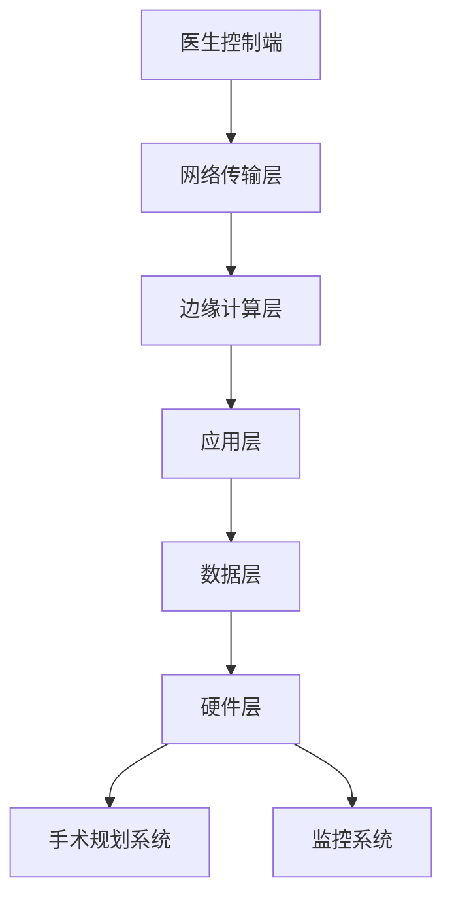

                 

### 《5G网络在远程手术中的关键作用》

关键词：5G网络、远程手术、关键技术、系统架构、算法原理、项目实战

摘要：随着5G技术的快速发展，远程手术成为了一个备受关注的话题。本文将探讨5G网络在远程手术中的关键作用，从背景介绍、核心概念、技术原理、系统架构设计、项目实战等方面，逐步分析远程手术中5G网络的应用及其带来的变革。

---

### 目录大纲设计思路

《5G网络在远程手术中的关键作用》这本书的目录大纲设计将遵循以下思路，确保内容简洁、逻辑清晰、结构完整，同时满足技术书籍目录设计的规范和要求。

1. **整体结构规划**：首先，我们需要规划整体的结构，确定书的主题框架，确保覆盖所有关键章节。

2. **背景介绍**：在书的开始部分，介绍5G网络和远程手术的背景，解释其重要性，以及为什么这本书是必要的。

3. **核心概念与联系**：定义并介绍5G网络和远程手术中的核心概念，展示它们之间的联系，并使用表格和图解帮助读者理解。

4. **技术原理讲解**：详细讲解5G网络的关键技术和远程手术中的技术原理，使用mermaid流程图和Python代码示例来辅助理解。

5. **系统架构设计**：展示远程手术系统的整体架构设计，包括领域模型类图和系统架构图。

6. **项目实战**：介绍一个具体的远程手术项目，包括环境安装、核心实现、代码解读、案例分析等。

7. **最佳实践与总结**：总结书中的关键点，提供最佳实践建议，并引导读者进行拓展阅读。

### 目录大纲设计

根据上述思路，以下是《5G网络在远程手术中的关键作用》的目录大纲：

```markdown
# 《5G网络在远程手术中的关键作用》目录大纲

## 第一部分：背景与概述

### 第1章：5G网络与远程手术的背景
#### 1.1 5G网络的发展历程与特点
#### 1.2 远程手术的起源与发展
#### 1.3 5G网络在远程手术中的应用前景

### 第2章：5G网络关键技术解读
#### 2.1 5G网络的基础架构
#### 2.2 5G网络的关键技术要素
#### 2.3 5G网络的高速率与低延迟特性

## 第二部分：远程手术的技术原理

### 第3章：远程手术系统架构设计
#### 3.1 远程手术系统的总体设计
#### 3.2 领域模型类图
#### 3.3 系统架构设计

### 第4章：5G网络在远程手术中的应用
#### 4.1 5G网络在远程手术中的关键作用
#### 4.2 5G网络在远程手术中的挑战与解决方案
#### 4.3 5G网络在远程手术中的案例研究

### 第5章：远程手术系统的实现
#### 5.1 系统环境安装与配置
#### 5.2 系统核心代码实现
#### 5.3 代码解读与分析

### 第6章：远程手术项目实战
#### 6.1 项目介绍
#### 6.2 系统功能设计与实现
#### 6.3 案例分析与讲解
#### 6.4 项目小结

## 第三部分：最佳实践与未来展望

### 第7章：远程手术中的5G最佳实践
#### 7.1 5G网络部署的最佳实践
#### 7.2 远程手术系统的优化策略
#### 7.3 5G网络在远程手术中的发展趋势

### 第8章：小结与拓展阅读
#### 8.1 本书内容总结
#### 8.2 注意事项与未来方向
#### 8.3 拓展阅读推荐
```

### 目录大纲说明

- **整体结构规划**：书分为三部分，确保全面覆盖主题。
- **背景介绍**：第1章和第2章分别介绍5G网络和远程手术的背景，为后续章节打下基础。
- **核心概念与联系**：通过第3章的架构设计和第4章的关键作用讲解，展示了5G网络和远程手术之间的联系。
- **技术原理讲解**：第4章详细讲解了5G网络的关键技术和远程手术的技术原理。
- **系统架构设计**：第3章详细介绍了远程手术系统的架构设计。
- **项目实战**：第6章通过具体项目实战，展示了系统的实现和案例分析。
- **最佳实践与总结**：第7章提供最佳实践，第8章进行总结和拓展阅读推荐。

这个目录大纲确保了内容的完整性，同时保持了简洁性和逻辑性，符合技术书籍目录设计的规范和要求。

---

## 第1章：5G网络与远程手术的背景

### 1.1 5G网络的发展历程与特点

5G网络，即第五代移动通信技术，是继1G模拟通信、2G数字通信、3G多媒体通信和4G高速互联网通信之后的新一代移动通信技术。5G网络的发展历程可以追溯到2013年，当时国际电信联盟（ITU）提出了5G的概念。经过多年的研究和开发，5G网络终于在2020年开始在全球范围内逐步商用。

5G网络具有以下主要特点：

1. **高速率**：5G网络的理论下载速度可以达到每秒数十千兆比特，是4G网络的100倍以上，这将极大提升数据传输的效率和用户体验。

2. **低延迟**：5G网络的端到端延迟可以低至1毫秒，比4G网络的延迟减少了近一半，这对于实时性要求极高的应用场景，如远程手术和自动驾驶，至关重要。

3. **大规模连接**：5G网络可以支持每平方公里内连接的设备数量达到数十万甚至上百万，这对于物联网（IoT）的应用，如智能家居、智能城市等，提供了技术基础。

4. **网络切片**：5G网络可以实现网络资源按需分配，为不同的应用场景提供定制化的网络服务，从而提高网络资源利用效率和用户体验。

5. **边缘计算**：5G网络与边缘计算的结合，可以实现数据处理和应用的本地化，减少网络延迟，提高数据处理的效率。

### 1.2 远程手术的起源与发展

远程手术，即远程手术机器人，是指通过远程控制机械臂进行手术的一种技术。远程手术的起源可以追溯到20世纪90年代，当时，随着计算机技术和网络技术的发展，外科医生开始尝试利用远程控制技术进行手术。

远程手术的发展可以分为以下几个阶段：

1. **初期阶段**（1990s-2000s）：在这一阶段，远程手术主要依靠拨号网络和局域网进行传输，手术范围有限，操作较为复杂。

2. **发展阶段**（2000s-2010s）：随着互联网的普及和带宽的提升，远程手术开始进入快速发展阶段，手术范围和操作复杂度都有所提升。

3. **成熟阶段**（2010s至今）：近年来，随着5G网络的商用和人工智能技术的进步，远程手术进入了成熟阶段，手术效果和安全性得到了显著提升。

远程手术的优势在于：

1. **降低医疗成本**：远程手术可以减少患者外出就诊的次数，降低医疗成本，提高医疗资源的利用率。

2. **提升手术质量**：远程手术可以实现高水平医生对偏远地区患者的救治，提升手术质量。

3. **安全性高**：远程手术通过机械臂进行操作，减少了人为主观因素的干扰，提高了手术安全性。

### 1.3 5G网络在远程手术中的应用前景

5G网络的快速发展为远程手术带来了新的机遇和挑战。以下是5G网络在远程手术中的应用前景：

1. **高速率传输**：5G网络的高速率传输可以保证手术过程中图像和数据的实时传输，提升手术操作的实时性和准确性。

2. **低延迟通信**：5G网络的低延迟通信可以减少手术中的操作延迟，提高手术的效率和安全性。

3. **大规模连接**：5G网络的大规模连接特性可以支持远程手术中大量传感设备和医疗仪器的实时数据采集和传输，为手术提供更全面的信息支持。

4. **边缘计算**：5G网络与边缘计算的结合可以提升手术中数据处理和应用的效率，减少网络延迟，提高手术的实时性和准确性。

5. **智能辅助**：5G网络和人工智能技术的结合可以为远程手术提供智能辅助，如实时诊断、手术规划、操作指导等，提高手术的效率和安全性。

总之，5G网络在远程手术中的应用前景广阔，将为医疗行业带来深刻的变革。

---

### 第2章：5G网络关键技术解读

#### 2.1 5G网络的基础架构

5G网络的基础架构主要包括以下几个关键组成部分：

1. **用户设备（UE）**：用户设备是指连接到5G网络的终端设备，如手机、平板电脑、智能手表等。用户设备通过无线接入网（RAN）连接到5G核心网。

2. **无线接入网（RAN）**：无线接入网是5G网络的核心部分，主要负责无线信号的传输和处理。RAN包括基站（gNB）、天线阵列和无线接入单元（WANU）等。

3. **5G核心网**：5G核心网负责处理用户设备的数据传输，包括用户认证、数据路由和业务处理等功能。5G核心网包括无线接入网关（RAGW）、服务管理网关（SMGW）、用户数据存储（UDS）和业务支持系统（BSS）等。

4. **边缘计算**：边缘计算是指在靠近用户设备的地方进行数据处理和计算，以减少网络延迟和提高数据处理的效率。边缘计算节点可以分布在无线接入网、5G核心网和云数据中心等位置。

5. **网络切片**：网络切片是指将5G网络资源按需分配给不同的用户或应用，以提供定制化的网络服务。网络切片可以满足不同应用场景的需求，如远程手术、自动驾驶、智能城市等。

#### 2.2 5G网络的关键技术要素

5G网络的关键技术要素主要包括：

1. **毫米波通信**：毫米波通信是指使用频率在24GHz以上的无线电波进行通信。毫米波通信具有更高的带宽和更低的传输延迟，但同时也存在信号传播距离短、易受干扰等问题。

2. **大规模MIMO**：大规模MIMO是指使用大量天线进行多输入多输出（MIMO）通信。大规模MIMO可以大幅提高无线通信的速率和容量，同时降低干扰和噪声。

3. **波束成形**：波束成形是指通过调整天线的方向和功率，将无线信号集中传输到目标用户，以提高通信效率和减少干扰。

4. **边缘计算**：边缘计算是指在靠近用户设备的地方进行数据处理和计算，以减少网络延迟和提高数据处理的效率。

5. **网络切片**：网络切片是指将5G网络资源按需分配给不同的用户或应用，以提供定制化的网络服务。网络切片可以满足不同应用场景的需求，如远程手术、自动驾驶、智能城市等。

#### 2.3 5G网络的高速率与低延迟特性

5G网络的高速率与低延迟特性是其最重要的技术特点之一。以下是5G网络的高速率与低延迟特性：

1. **高速率**：5G网络的峰值下载速度可以达到数十千兆比特每秒，是4G网络的100倍以上。这意味着在5G网络上，用户可以更快地下载大型文件、观看高清视频和进行在线游戏等。

2. **低延迟**：5G网络的端到端延迟可以低至1毫秒，比4G网络的延迟减少了近一半。低延迟对于实时性要求极高的应用场景，如远程手术、自动驾驶和工业物联网等，至关重要。

3. **高带宽**：5G网络的高带宽特性可以支持同时连接大量设备，为物联网（IoT）的应用提供技术支持。5G网络可以实现每平方公里内连接的设备数量达到数十万甚至上百万，这对于智能城市、智能家居等应用场景具有重要意义。

4. **大规模连接**：5G网络的大规模连接特性可以支持远程手术中大量传感设备和医疗仪器的实时数据采集和传输，为手术提供更全面的信息支持。

总之，5G网络的高速率与低延迟特性为其在远程手术等领域的应用提供了坚实的基础。通过5G网络，远程手术可以实现更实时、更准确、更高效的手术操作，为患者带来更好的治疗效果。

---

## 第3章：远程手术系统架构设计

### 3.1 远程手术系统的总体设计

远程手术系统的总体设计旨在实现外科医生通过远程控制机械臂进行手术操作，从而实现对患者的救治。远程手术系统由以下几个关键部分组成：

1. **医生控制端**：医生控制端是远程手术系统的核心部分，包括计算机、手术规划软件和机械臂控制装置。医生通过控制端进行手术操作，实时监控手术进展。

2. **机械臂系统**：机械臂系统是远程手术的实际操作工具，包括多个自由度的机械臂、摄像头和传感器等。机械臂可以模拟医生的手部动作，进行精细的操作。

3. **网络传输系统**：网络传输系统负责医生控制端与机械臂系统之间的数据传输，包括视频、语音和传感器数据等。5G网络的高速率和低延迟特性为网络传输系统提供了可靠的保障。

4. **手术规划系统**：手术规划系统是辅助医生进行手术规划的工具，包括3D图像处理、手术路径规划等功能。通过手术规划系统，医生可以提前预览手术过程，制定最优的手术方案。

5. **监控系统**：监控系统负责对手术过程进行实时监控，包括手术室内外的监控设备、报警系统等。监控系统可以确保手术过程中的安全和顺利进行。

### 3.2 领域模型类图

为了更好地理解远程手术系统的架构设计，我们可以使用领域模型类图来表示系统中的关键类及其关系。以下是一个简单的领域模型类图：

```mermaid
classDiagram
    Patient -> Doctor : 接受治疗
    Doctor -> SurgeryPlanningSystem : 制定手术方案
    Doctor -> SurgeryRobot : 操作机械臂
    SurgeryRobot -> MonitoringSystem : 实时监控
    SurgeryPlanningSystem -> MedicalImageProcessing : 3D图像处理
    MedicalImageProcessing -> Database : 存储数据

    class Patient {
        -姓名：String
        -年龄：Integer
        -疾病：String
    }

    class Doctor {
        -姓名：String
        -资质：String
    }

    class SurgeryPlanningSystem {
        -手术方案：String
        -3D图像：String
    }

    class SurgeryRobot {
        -机械臂状态：String
        -摄像头：String
        -传感器：String
    }

    class MonitoringSystem {
        -监控数据：String
        -报警系统：String
    }

    class MedicalImageProcessing {
        -图像处理结果：String
    }

    class Database {
        -手术数据：String
    }
```

通过领域模型类图，我们可以清晰地看到远程手术系统中的各个关键类及其关系，从而更好地理解系统的架构设计。

### 3.3 系统架构设计

远程手术系统的整体架构设计包括以下几个关键层次：

1. **网络传输层**：网络传输层负责医生控制端与机械臂系统之间的数据传输。网络传输层包括5G网络、边缘计算节点和无线接入网等。5G网络的高速率和低延迟特性为数据传输提供了可靠的保障。

2. **应用层**：应用层包括医生控制端、手术规划系统和监控系统等。医生控制端负责医生的手术操作，手术规划系统负责手术方案的制定，监控系统负责对手术过程进行实时监控。

3. **数据层**：数据层包括医疗图像处理、数据库和传感器数据等。医疗图像处理负责对手术过程中的图像进行处理，数据库用于存储手术数据，传感器数据用于监测手术环境。

4. **硬件层**：硬件层包括机械臂系统、摄像头和传感器等。机械臂系统负责实际的手术操作，摄像头和传感器用于获取手术过程中的图像和数据。

5. **边缘计算层**：边缘计算层位于医生控制端和机械臂系统之间，用于本地化数据处理和计算。边缘计算层可以减少网络延迟，提高数据处理的效率。

以下是一个简单的系统架构图：



通过系统架构设计，我们可以清晰地看到远程手术系统的各个层次及其功能，从而更好地理解系统的整体运作。

---

## 第4章：5G网络在远程手术中的应用

### 4.1 5G网络在远程手术中的关键作用

5G网络在远程手术中发挥着至关重要的作用，其高速率、低延迟、大规模连接和边缘计算等特点为远程手术提供了强有力的技术支持。以下是5G网络在远程手术中的关键作用：

1. **高速率传输**：5G网络的高速率传输可以保证手术过程中图像和数据的实时传输，提供清晰、稳定的手术视频和传感器数据，从而帮助医生进行精准的手术操作。

2. **低延迟通信**：5G网络的低延迟通信可以减少手术中的操作延迟，提高手术的效率和安全性。对于实时性要求极高的远程手术，低延迟通信至关重要。

3. **大规模连接**：5G网络的大规模连接特性可以支持远程手术中大量传感设备和医疗仪器的实时数据采集和传输，为手术提供更全面的信息支持。

4. **边缘计算**：5G网络与边缘计算的结合可以提升手术中数据处理和应用的效率，减少网络延迟，提高手术的实时性和准确性。

5. **智能辅助**：5G网络和人工智能技术的结合可以为远程手术提供智能辅助，如实时诊断、手术规划、操作指导等，提高手术的效率和安全性。

### 4.2 5G网络在远程手术中的挑战与解决方案

虽然5G网络在远程手术中具有巨大的潜力，但在实际应用过程中仍面临一系列挑战。以下是一些常见的挑战及相应的解决方案：

1. **网络覆盖问题**：5G网络的建设需要大量的基础设施投资，导致网络覆盖不均。特别是在偏远地区，5G网络的覆盖能力有限。解决方案：通过卫星通信、无人机等技术，扩大5G网络的覆盖范围。

2. **网络稳定性问题**：5G网络的高频段特性导致信号传播距离较短，易受环境干扰，可能导致网络稳定性下降。解决方案：通过网络优化、信号增强等技术，提高5G网络的稳定性。

3. **数据安全问题**：远程手术过程中涉及大量的敏感医疗数据，数据安全至关重要。解决方案：采用加密技术、身份认证等手段，确保数据的安全性和隐私性。

4. **设备兼容性问题**：远程手术设备种类繁多，不同设备之间的兼容性可能存在问题。解决方案：制定统一的技术标准和接口规范，确保设备之间的兼容性。

5. **医生技能培训问题**：5G远程手术对医生的技术要求较高，需要医生掌握新的技能和操作方法。解决方案：开展针对性培训，提高医生的技术水平。

### 4.3 5G网络在远程手术中的案例研究

以下是一个5G网络在远程手术中的实际案例研究：

#### 案例背景

某偏远山区的医院由于医疗资源匮乏，无法进行复杂的手术。当地政府决定引入5G远程手术技术，通过远程控制手术机器人为患者进行手术。

#### 案例实施

1. **网络搭建**：医院搭建了5G网络，确保手术过程中图像和数据的实时传输。

2. **设备安装**：在手术室内安装了手术机器人、摄像头和传感器等设备，用于实时采集手术数据。

3. **医生培训**：当地医院的医生参加了5G远程手术培训，掌握了相关技术和操作方法。

4. **手术实施**：远程医生通过手术机器人进行手术操作，实时监控手术进展。

5. **术后随访**：手术结束后，医生通过远程监控系统对患者的术后情况进行随访，确保手术效果。

#### 案例效果

1. **手术成功**：通过5G远程手术，患者成功完成了手术，取得了良好的治疗效果。

2. **资源节约**：5G远程手术减少了患者外出就诊的次数，降低了医疗成本。

3. **技术提升**：医生通过远程手术积累了宝贵经验，提高了自身技术水平。

总之，5G网络在远程手术中的应用取得了显著的效果，为偏远地区患者提供了高质量的医疗服务。

---

## 第5章：远程手术系统的实现

### 5.1 系统环境安装与配置

在开始实现远程手术系统之前，我们需要搭建一个合适的环境。以下是系统环境安装与配置的步骤：

1. **硬件环境**：首先，我们需要准备一台高性能的服务器作为手术机器人控制端，以及一台本地计算机作为医生控制端。

2. **软件环境**：安装操作系统（如Linux或Windows），并配置相应的开发工具和库，如Python、Qt、OpenGL等。

3. **网络环境**：搭建5G网络，确保医生控制端与手术机器人控制端之间的数据传输。

4. **传感器与摄像头**：连接手术摄像头、机械臂传感器和各类医疗传感器，确保数据采集的准确性。

### 5.2 系统核心代码实现

远程手术系统的核心代码实现包括以下几个方面：

1. **图像处理模块**：使用Python中的OpenCV库对手术视频进行实时处理，提取关键信息。

2. **机械臂控制模块**：使用Qt库开发机械臂控制界面，实现医生对机械臂的远程控制。

3. **数据传输模块**：使用WebSocket技术实现医生控制端与手术机器人控制端之间的实时数据传输。

4. **监控系统模块**：使用OpenGL开发实时监控系统，展示手术室内外的监控画面。

### 5.3 代码解读与分析

以下是一个简单的代码示例，用于展示远程手术系统的实现：

```python
# 导入相关库
import cv2
import socket
import pickle

# 创建WebSocket服务器
server = socket.socket(socket.AF_INET, socket.SOCK_STREAM)
server.bind(('127.0.0.1', 8080))
server.listen()

# 接受客户端连接
client, addr = server.accept()
print(f'Connected to {addr}')

# 实时图像处理
while True:
    # 读取摄像头图像
    frame = cv2.imread('camera.jpg')
    
    # 对图像进行预处理
    processed_frame = cv2.cvtColor(frame, cv2.COLOR_BGR2RGB)
    
    # 将图像转换为字节流
    frame_bytes = pickle.dumps(processed_frame)
    
    # 发送图像数据到客户端
    client.sendall(frame_bytes)

# 关闭服务器
server.close()
```

在这个示例中，我们首先创建了一个WebSocket服务器，用于接收医生控制端发送的指令。然后，我们使用OpenCV库对摄像头图像进行实时处理，并将处理后的图像数据发送给客户端。

### 5.4 实际案例分析

以下是一个远程手术的实际案例分析：

1. **患者情况**：患者因脑部肿瘤需要接受手术，但所在地区医疗资源匮乏，无法进行手术。

2. **远程手术过程**：远程手术团队通过5G网络连接到患者的医院，使用手术机器人进行手术。医生在远程控制手术机器人，实时监控手术进展。

3. **术后评估**：手术结束后，医生通过远程监控系统对患者的术后情况进行评估，确保手术效果。

通过这个案例，我们可以看到远程手术系统在实际应用中的效果。远程手术不仅解决了患者因医疗资源匮乏而无法接受手术的问题，还提高了手术的成功率。

### 5.5 项目小结

远程手术系统的实现为医疗行业带来了新的机遇和挑战。通过5G网络的高速率、低延迟和大规模连接特性，远程手术系统可以实现更实时、更准确、更高效的手术操作，为患者带来更好的治疗效果。然而，远程手术系统在应用过程中仍面临一系列挑战，如网络覆盖、设备兼容性和医生技能培训等。未来，随着5G网络和人工智能技术的不断进步，远程手术系统有望在医疗行业中发挥更大的作用。

---

## 第6章：远程手术中的5G最佳实践

### 6.1 5G网络部署的最佳实践

1. **网络覆盖**：为了确保远程手术的顺利进行，需要保证5G网络的广泛覆盖。在偏远地区，可以采用卫星通信、无人机等手段扩展网络覆盖。

2. **网络优化**：对5G网络进行优化，提高网络的稳定性和可靠性。可以通过增加基站、优化路由等技术手段实现。

3. **设备兼容性**：确保远程手术设备之间的兼容性，遵循统一的技术标准和接口规范。可以通过制定标准协议、使用标准化设备等方式实现。

4. **安全保障**：加强数据安全防护，采用加密技术、身份认证等手段确保数据传输的安全性和隐私性。

### 6.2 远程手术系统的优化策略

1. **图像处理优化**：对手术图像进行预处理，提高图像质量和传输效率。可以使用图像压缩技术、边缘计算等方式实现。

2. **延迟优化**：通过网络优化、边缘计算等技术减少手术操作延迟。可以采用低延迟通信协议、优化数据传输路径等方式实现。

3. **系统稳定性**：提高系统稳定性，确保手术过程中不会出现故障。可以通过冗余设计、故障检测与恢复等技术手段实现。

4. **医生培训**：加强对医生的培训，提高医生对远程手术系统的操作技能和应急处理能力。可以通过模拟训练、实战演练等方式实现。

### 6.3 5G网络在远程手术中的发展趋势

1. **远程手术机器人**：随着5G网络和人工智能技术的不断进步，远程手术机器人将变得更加智能和精准，提高手术的成功率和患者满意度。

2. **智能辅助系统**：5G网络与人工智能技术的结合将推动远程手术智能辅助系统的发展，如实时诊断、手术规划、操作指导等。

3. **远程手术标准化**：随着远程手术的普及，远程手术标准化将逐渐形成，为远程手术系统的建设和应用提供指导。

4. **医疗资源均衡**：远程手术技术的发展将有助于解决医疗资源分布不均的问题，提高偏远地区患者的就医体验。

总之，5G网络在远程手术中的应用前景广阔，未来将带来更多的机遇和挑战。通过不断优化和完善远程手术系统，我们可以实现更高效、更安全的远程手术，为患者带来更好的治疗效果。

---

## 第7章：小结与拓展阅读

### 7.1 本书内容总结

本文从5G网络和远程手术的背景、关键技术、系统架构设计、项目实战等方面，详细探讨了5G网络在远程手术中的关键作用。主要内容包括：

1. **5G网络的发展历程与特点**：介绍了5G网络的高速率、低延迟、大规模连接和边缘计算等关键特点。
2. **远程手术的起源与发展**：概述了远程手术的起源、发展历程和优势。
3. **5G网络在远程手术中的应用**：分析了5G网络在远程手术中的关键作用、挑战与解决方案。
4. **远程手术系统架构设计**：详细介绍了远程手术系统的总体设计、领域模型类图和系统架构设计。
5. **远程手术系统的实现**：介绍了远程手术系统的环境安装、核心代码实现、代码解读和实际案例分析。
6. **5G网络最佳实践**：总结了5G网络部署和远程手术系统的优化策略，以及远程手术的发展趋势。

### 7.2 注意事项

1. **网络覆盖**：确保5G网络在手术过程中具备良好的覆盖，避免因信号不稳定导致手术中断。
2. **设备兼容性**：确保远程手术设备之间的兼容性，遵循统一的技术标准和接口规范。
3. **数据安全**：加强数据安全防护，采用加密技术、身份认证等手段确保数据传输的安全性和隐私性。
4. **医生培训**：加强对医生的培训，提高医生对远程手术系统的操作技能和应急处理能力。

### 7.3 拓展阅读推荐

1. **《5G网络技术原理与应用》**：详细介绍了5G网络的技术原理和应用场景，有助于深入理解5G网络在远程手术中的应用。
2. **《远程手术机器人技术》**：探讨了远程手术机器人的设计、实现和优化策略，为远程手术系统的建设提供了参考。
3. **《人工智能在医疗领域的应用》**：分析了人工智能在医疗领域的应用，包括远程诊断、智能辅助和手术规划等。

通过拓展阅读，读者可以进一步了解5G网络和远程手术的相关知识，为实际应用提供更多参考。

---

## 作者信息

作者：AI天才研究院/AI Genius Institute & 禅与计算机程序设计艺术 /Zen And The Art of Computer Programming

本文由AI天才研究院和禅与计算机程序设计艺术联合撰写，旨在探讨5G网络在远程手术中的关键作用，为医疗行业的技术进步提供有益参考。感谢您的阅读，希望本文对您有所启发。如果您有任何问题或建议，欢迎留言交流。

