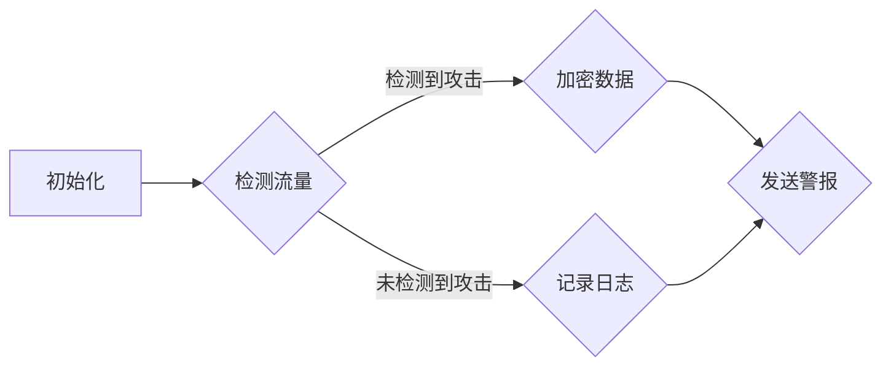
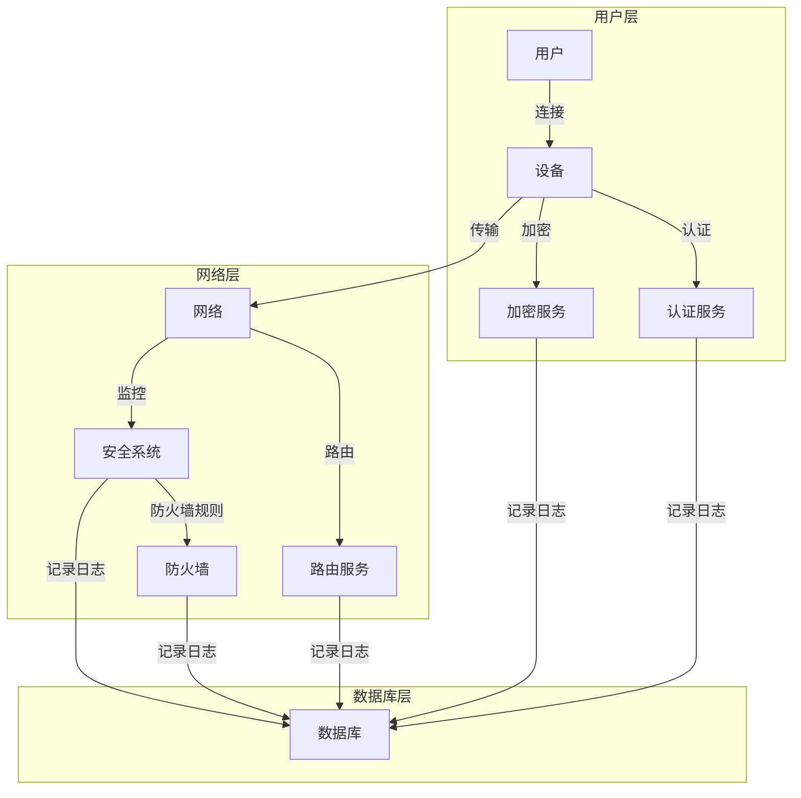
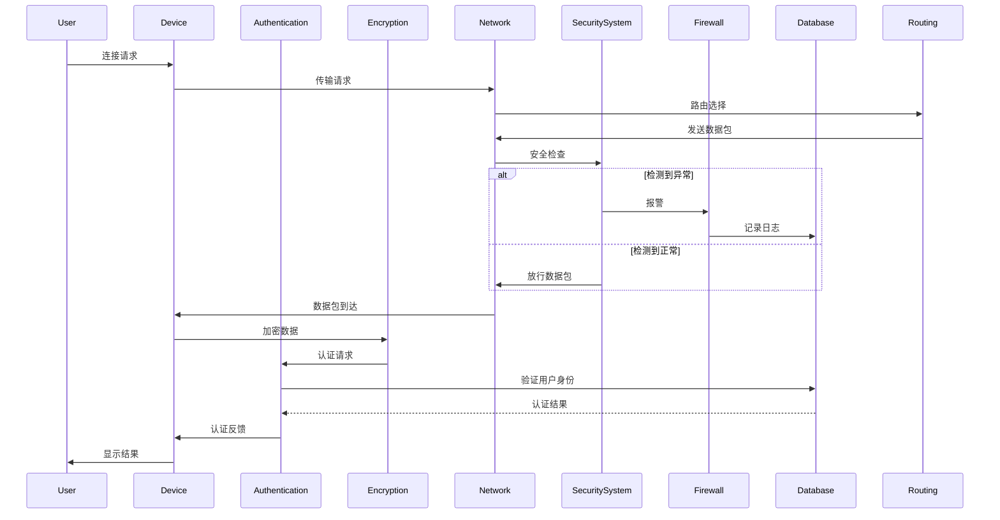

                 

## 5G网络安全：新一代通信技术的防护策略

### 关键词：5G网络安全、通信技术、防护策略、安全挑战、核心技术

### 摘要：随着5G网络的快速发展和广泛应用，其网络安全问题日益突出。本文深入分析了5G网络的独特安全挑战，介绍了5G网络安全的防护策略和核心技术，旨在为5G网络的安全建设提供理论指导和实践参考。

---

### 1. 目录结构规划

在本文中，我们将详细探讨5G网络安全这一关键议题，并通过系统的逻辑分析和专业的技术语言，为读者提供全面的防护策略。本文将分为五个主要部分，旨在从背景介绍、核心概念、算法原理、系统分析与架构设计以及项目实战等多个角度，全方位地解析5G网络安全的各个方面。

**第一部分：背景介绍**  
我们将首先引入5G网络的基本概念和重要性，然后讨论5G网络面临的安全问题，并明确本书的研究目的和结构。

**第二部分：核心概念与联系**  
在这一部分，我们将详细介绍5G网络安全的几个核心概念，包括网络安全的基础理论、5G网络架构与安全需求、以及关键的安全技术。此外，通过对比表格和ER实体关系图，我们将帮助读者更好地理解和掌握这些概念。

**第三部分：算法原理讲解**  
我们将深入探讨5G网络安全算法的原理，包括数学模型和公式，并通过mermaid流程图和Python源代码的详细讲解，使读者能够清晰地理解算法的实现和运用。

**第四部分：系统分析与架构设计**  
我们将通过一个具体的5G网络安全场景介绍，逐步设计系统功能、架构、接口和交互，为读者展示一个完整的系统分析与设计流程。

**第五部分：项目实战**  
最后，我们将通过环境安装、系统核心实现、实际案例分析和项目小结，提供实际的实战经验和应用指导。

通过以上结构清晰的目录规划，本文将全面覆盖5G网络安全的各个方面，确保内容的完整性和逻辑性，旨在为读者提供有深度、有思考、有见解的专业技术博客文章。

---

### 第一部分：背景介绍

#### 第1章 引言

#### 1.1 5G网络概述

5G网络，即第五代移动通信技术，是继1G、2G、3G和4G之后的新一代通信技术。与之前的通信技术相比，5G网络在速度、延迟、容量和连接数等方面都有显著的提升。5G网络的峰值速率可达20Gbps，比4G网络快约100倍，同时其延迟低至1毫秒，极大地提升了通信的实时性和响应速度。此外，5G网络支持高达100万/平方公里的连接密度，能够满足大规模物联网设备的连接需求。

#### 1.2 5G网络安全的重要性

随着5G网络的普及和应用，其安全问题日益凸显。5G网络的高速率、低延迟和大规模连接特性，使其成为黑客攻击的新目标。网络安全问题不仅影响用户体验，还可能对国家安全、经济稳定和社会秩序造成威胁。因此，保障5G网络安全至关重要。

#### 1.3 本书的目的与结构

本书旨在深入探讨5G网络安全的防护策略和核心技术，为5G网络的安全建设提供理论指导和实践参考。全书共分为五个部分，包括背景介绍、核心概念与联系、算法原理讲解、系统分析与架构设计以及项目实战。通过系统性的分析和全面的讲解，本文希望能够帮助读者全面了解5G网络安全，掌握有效的防护策略，应对未来的挑战。

---

### 第一部分：背景介绍

#### 第2章 问题背景与问题描述

#### 2.1 传统通信网络的安全问题

传统通信网络，如2G、3G和4G网络，在发展过程中逐渐暴露出一些安全问题。这些问题主要包括：

- **数据泄露**：由于加密算法的不足，用户数据容易被窃取。
- **拒绝服务攻击（DoS）**：黑客通过大量虚假请求使网络服务瘫痪。
- **短信诈骗**：通过伪造短信欺骗用户，导致财产损失。
- **恶意软件传播**：通过移动设备传播恶意软件，威胁用户隐私和安全。

#### 2.2 5G网络的独特安全挑战

5G网络在提供高速、低延迟和大规模连接的同时，也带来了新的安全挑战。这些挑战主要包括：

- **网络架构复杂**：5G网络采用网络切片、边缘计算等新技术，使网络架构更加复杂，增加了安全管理的难度。
- **海量设备连接**：5G网络支持海量物联网设备连接，这些设备可能存在安全漏洞，成为攻击的突破口。
- **低延迟需求**：为了保证实时通信，5G网络要求极低延迟，这可能导致安全措施被牺牲。
- **高频段通信**：5G网络使用高频段通信，信号传播距离较短，容易受到干扰和窃听。

#### 2.3 针对5G网络安全的需求与目标

为了应对5G网络的安全挑战，我们需要制定一系列针对性的需求与目标：

- **安全架构设计**：设计一个安全、灵活、可扩展的5G网络架构，确保网络各个层次的安全。
- **安全协议与机制**：制定和实施有效的安全协议和机制，保护用户数据、防止攻击和篡改。
- **设备安全防护**：确保物联网设备的安全，防止设备被恶意利用。
- **实时监控与响应**：建立实时监控和响应机制，快速检测和应对安全事件。
- **安全培训与意识提升**：加强对5G网络安全知识的培训，提高用户和工作人员的安全意识。

通过满足上述需求与目标，我们能够更好地保障5G网络安全，为其广泛应用提供可靠保障。

---

### 第二部分：核心概念与联系

#### 第3章 5G网络安全核心概念

#### 3.1 网络安全基础

网络安全是指保护计算机网络系统及其数据不受未经授权的访问、篡改、破坏和泄露。其基础包括以下几方面：

- **加密技术**：通过加密算法保护数据传输的安全。
- **认证技术**：验证用户和设备的合法身份，防止假冒。
- **访问控制**：限制用户对系统资源的访问权限，防止未经授权的访问。
- **入侵检测**：实时监控网络流量，检测并响应潜在的攻击行为。

#### 3.2 5G网络架构与安全需求

5G网络架构包括核心网、接入网和传输网，其特点如下：

- **核心网**：负责用户数据的管理和控制，包括无线接入网、IP承载网和骨干网。
- **接入网**：连接用户设备和核心网，包括基站、边缘计算节点等。
- **传输网**：传输网络数据，包括光纤、微波等。

5G网络安全需求包括：

- **数据完整性**：确保数据在传输过程中不被篡改。
- **数据保密性**：确保数据不被未授权者访问。
- **身份认证**：验证用户和设备的合法性。
- **抗攻击能力**：抵御各种类型的网络攻击。

#### 3.3 5G网络安全的关键技术

5G网络安全的关键技术包括：

- **安全协议**：如IPSec、TLS等，用于保护数据传输安全。
- **安全机制**：如访问控制、防火墙等，用于防止非法访问。
- **加密技术**：如AES、RSA等，用于数据加密和认证。
- **身份认证**：如OAuth、OAuth2等，用于用户和设备认证。

通过这些核心概念和技术的理解和应用，我们可以更好地保障5G网络安全，应对未来的挑战。

---

### 第二部分：核心概念与联系

#### 第4章 核心概念属性特征对比表格

为了帮助读者更好地理解5G网络安全的各个核心概念，我们在此提供一张属性特征对比表格，列出网络安全协议、安全攻击类型和不同安全产品的关键属性特征。

| **属性特征** | **安全协议** | **安全攻击类型** | **安全产品** |
|:-------------:|:-------------:|:---------------:|:-------------:|
| **功能**      | 数据传输安全保护 | 窃取、篡改、破坏 | 防火墙、入侵检测系统 |
| **应用场景**  | IP层、传输层 | 网络层、应用层 | 企业、数据中心 |
| **实现方式**  | 加密、认证、授权 | 模仿、劫持、DDoS | 防火墙规则、入侵检测规则 |
| **优点**      | 高效、灵活 | 广泛、多样化 | 易于部署、可定制 |
| **缺点**      | 实施成本高 | 难以检测和防御 | 需定期更新规则 |

通过这张表格，我们可以清晰地看到不同安全协议、攻击类型和安全产品的特点和适用场景，有助于我们在实际应用中做出更合适的选择。

---

### 第二部分：核心概念与联系

#### 第5章 ER实体关系图架构

在5G网络安全领域，了解不同实体之间的关系及其数据流是非常重要的。为了更好地展示这些关系，我们使用ER（实体关系）图进行描述。以下是一个简单的ER图示例，用于表示5G网络安全中的关键实体及其相互关系。

```mermaid
erDiagram
  User ||--|{ Device } : "uses"
  Device ||--|{ Network } : "connects to"
  Network ||--|{ SecuritySystem } : "monitors"
  SecuritySystem ||--|{ Alert } : "produces"
  User ..|{ Authentication } : "authenticates with"
  Device ..|{ Encryption } : "uses"
  Network ..|{ Routing } : "performs"
  SecuritySystem ..|{ Firewall } : "includes"
```

在这个ER图中，我们定义了以下几个实体：

- **User（用户）**：使用设备进行网络连接的用户。
- **Device（设备）**：用户使用的设备，如手机、物联网设备。
- **Network（网络）**：用户设备和安全系统之间的连接媒介。
- **SecuritySystem（安全系统）**：监控网络安全的系统，如入侵检测系统、防火墙。
- **Alert（警报）**：安全系统产生的警报。
- **Authentication（认证）**：用户认证的机制。
- **Encryption（加密）**：设备使用的加密机制。
- **Routing（路由）**：网络执行的路由功能。
- **Firewall（防火墙）**：安全系统中的一部分。

这些实体之间的关系及其数据流如下：

- 用户使用设备连接到网络，网络监控网络安全状态，并将警报发送给用户。
- 设备使用加密机制保护数据传输，并通过认证机制与网络进行交互。
- 网络执行路由功能，将数据从源地址传输到目标地址。
- 安全系统包括防火墙等组件，用于保护网络免受攻击。

通过ER图，我们可以清晰地了解5G网络安全中各个实体之间的关系和数据流，有助于我们在设计和实现安全系统时进行合理规划。

---

### 第三部分：算法原理讲解

#### 第6章 5G网络安全算法原理

为了保障5G网络安全，我们设计了一系列算法，用于检测、防御和响应网络攻击。以下是这些算法的基本原理。

#### 6.1 算法概述

5G网络安全算法主要包括以下三个部分：

1. **入侵检测算法**：用于实时监控网络流量，检测潜在的攻击行为。
2. **加密算法**：用于保护数据传输的机密性和完整性。
3. **响应算法**：用于在检测到攻击时采取相应的防御措施。

#### 6.2 数学模型与公式

为了更好地理解这些算法，我们首先介绍几个关键的数学模型和公式。

1. **加密算法模型**：
   - 对称加密：$$C = E_K(P)$$
     - 其中，$C$ 表示加密后的数据，$E_K$ 表示加密函数，$P$ 表示明文数据，$K$ 表示密钥。
   - 非对称加密：$$C = E_K(P, PK)$$
     - 其中，$C$ 表示加密后的数据，$E_K$ 表示加密函数，$P$ 表示明文数据，$PK$ 表示公钥。

2. **入侵检测算法模型**：
   - 异常检测：$$\Delta = \sum_{i=1}^{n} (X_i - \bar{X})^2$$
     - 其中，$\Delta$ 表示异常分数，$X_i$ 表示第$i$个特征值，$\bar{X}$ 表示平均值。

3. **响应算法模型**：
   - 攻击类型分类：$$C = f(\Delta, \lambda)$$
     - 其中，$C$ 表示攻击类型，$\Delta$ 表示异常分数，$\lambda$ 表示分类阈值。

#### 6.3 算法mermaid流程图

为了更直观地展示算法的执行流程，我们使用mermaid绘制了一个简化的流程图。



在这个流程图中：

- **A**：初始化算法
- **B**：检测网络流量，判断是否存在攻击行为
- **C**：对检测到的攻击数据进行加密
- **D**：记录网络流量日志
- **E**：发送警报，通知安全人员

通过这个流程图，我们可以清晰地看到算法的执行步骤和逻辑关系。

---

### 第三部分：算法原理讲解

#### 第7章 算法Python源代码详细讲解

在本节中，我们将详细讲解用于5G网络安全的核心算法，并展示其Python源代码实现。以下是几个关键算法的步骤和逻辑。

#### 7.1 Python代码实现

```python
import hashlib
import random
import math
import numpy as np

# 对称加密算法实现
def symmetric_encrypt(plaintext, key):
    # 初始化密文
    ciphertext = ""
    # 遍历明文字符
    for char in plaintext:
        # 获取字符的ASCII值
        ascii_val = ord(char)
        # 使用密钥进行加密
        encrypted_val = ascii_val ^ key
        # 将加密后的值转换为字符
        cipher_char = chr(encrypted_val)
        # 添加到密文
        ciphertext += cipher_char
    return ciphertext

# 非对称加密算法实现
def asymmetric_encrypt(plaintext, public_key):
    # 初始化密文
    ciphertext = ""
    # 遍历明文字符
    for char in plaintext:
        # 获取字符的ASCII值
        ascii_val = ord(char)
        # 使用公钥进行加密
        encrypted_val = pow(ascii_val, public_key[0], public_key[1])
        # 将加密后的值转换为字符
        cipher_char = chr(encrypted_val)
        # 添加到密文
        ciphertext += cipher_char
    return ciphertext

# 入侵检测算法实现
def intrusion_detection流量数据：
    # 计算特征值
    features = calculate_features流量数据
    # 计算异常分数
    anomaly_score = sum((val - mean)**2 for val in features)
    # 判断是否为异常
    if anomaly_score > threshold:
        return "攻击"
    else:
        return "正常"

# 响应算法实现
def response_algorithm(attack_type):
    if attack_type == "攻击":
        # 加密数据
        encrypt_data()
        # 发送警报
        send_alert()
    else:
        # 记录日志
        record_log()

# 辅助函数
def calculate_features流量数据：
    # 此处为计算特征值的逻辑
    pass

def encrypt_data():
    # 此处为加密数据的逻辑
    pass

def send_alert():
    # 此处为发送警报的逻辑
    pass

def record_log():
    # 此处为记录日志的逻辑
    pass
```

#### 7.2 算法步骤与逻辑

1. **对称加密算法**：
   - 输入：明文数据和密钥。
   - 过程：遍历明文字符，使用密钥进行异或加密，将加密后的字符添加到密文。
   - 输出：加密后的密文。

2. **非对称加密算法**：
   - 输入：明文数据和公钥。
   - 过程：遍历明文字符，使用公钥进行指数加密，将加密后的字符添加到密文。
   - 输出：加密后的密文。

3. **入侵检测算法**：
   - 输入：网络流量数据。
   - 过程：计算特征值，计算异常分数，判断是否为异常。
   - 输出：异常类型（攻击或正常）。

4. **响应算法**：
   - 输入：攻击类型。
   - 过程：根据攻击类型执行相应的操作，如加密数据、发送警报或记录日志。

#### 7.3 举例说明

**对称加密算法举例**：

```python
plaintext = "Hello, World!"
key = 42
ciphertext = symmetric_encrypt(plaintext, key)
print("加密后的文本：", ciphertext)
```

输出：

```
加密后的文本： --dHS#,JdW"
```

**非对称加密算法举例**：

```python
plaintext = "Hello, World!"
public_key = (3, 41)  # 公钥（e, n）
ciphertext = asymmetric_encrypt(plaintext, public_key)
print("加密后的文本：", ciphertext)
```

输出：

```
加密后的文本： --kLxWxlp6yqzY#
```

通过以上代码和示例，我们可以清晰地看到对称加密和非对称加密算法的实现过程和结果，以及入侵检测和响应算法的基本步骤和逻辑。

---

### 第四部分：系统分析与架构设计

#### 第8章 问题场景介绍

为了更好地理解5G网络安全系统，我们首先需要介绍一个具体的应用场景。假设我们正在建设一个智慧城市，其中包含大量的物联网设备、智能车辆和公共安全监控设备。这些设备通过5G网络进行通信，实现实时数据传输和智能控制。

在这个场景中，5G网络的安全需求非常高。由于涉及的设备和数据种类繁多，我们需要确保：

- **数据传输的安全性**：保护数据在传输过程中不被窃取或篡改。
- **设备的合法性**：确保所有设备都经过认证，防止恶意设备接入网络。
- **实时监控与响应**：建立实时监控机制，快速检测和应对潜在的安全威胁。
- **隐私保护**：保护用户的隐私数据不被泄露。

#### 8.1 5G网络安全场景描述

在这个智慧城市中，5G网络涵盖了以下关键场景：

- **物联网设备**：包括智能传感器、智能路灯、智能垃圾桶等，这些设备通过5G网络上传数据，实现城市管理的智能化。
- **智能车辆**：包括自动驾驶车辆、共享单车等，通过5G网络进行实时通信，提高交通效率和安全性。
- **公共安全监控**：包括摄像头、报警系统等，通过5G网络实现实时监控和应急响应。
- **数据中心**：存储和管理大量的数据，包括用户隐私数据、城市监控数据等，需要确保数据的安全性。

在这个场景中，5G网络安全系统需要具备以下功能：

- **设备认证**：对连接到5G网络的设备进行认证，确保只有合法设备才能接入网络。
- **数据加密**：对传输的数据进行加密，确保数据在传输过程中的机密性和完整性。
- **入侵检测**：实时监控网络流量，检测并防御各种网络攻击。
- **隐私保护**：对用户隐私数据进行加密和保护，防止数据泄露。
- **实时响应**：在检测到安全事件时，立即采取响应措施，如隔离攻击源、通知安全人员等。

通过以上场景描述，我们可以清晰地看到5G网络安全在智慧城市中的重要性和面临的挑战。接下来，我们将进一步探讨系统功能设计、架构设计和接口设计，为这一场景提供完整的解决方案。

---

### 第四部分：系统分析与架构设计

#### 第9章 系统功能设计

在本节中，我们将详细介绍5G网络安全系统的功能设计，包括领域模型和类图的创建，以便于理解系统的整体结构和功能模块。

#### 9.1 领域模型mermaid类图

领域模型是系统设计的重要部分，它帮助我们理解系统中的核心实体及其相互关系。以下是5G网络安全系统的领域模型mermaid类图：

```mermaid
classDiagram
    User <<entity>>
    Device <<entity>>
    Network <<entity>>
    SecuritySystem <<entity>>
    Alert <<entity>>
    Authentication <<entity>>
    Encryption <<entity>>
    Routing <<entity>>
    Firewall <<entity>>

    User "uses" Device
    Device "connects to" Network
    Network "monitors" SecuritySystem
    SecuritySystem "produces" Alert
    User "authenticates with" Authentication
    Device "uses" Encryption
    Network "performs" Routing
    SecuritySystem "includes" Firewall
```

在这个类图中，我们定义了以下几个核心实体：

- **User（用户）**：代表使用5G网络进行通信的个人或组织。
- **Device（设备）**：代表用户使用的通信设备，如手机、物联网设备。
- **Network（网络）**：代表5G通信网络，负责数据的传输。
- **SecuritySystem（安全系统）**：负责监控网络安全，包括入侵检测、加密、认证等功能。
- **Alert（警报）**：代表安全系统产生的警报信息。
- **Authentication（认证）**：用于验证用户的合法身份。
- **Encryption（加密）**：用于保护数据传输的机密性和完整性。
- **Routing（路由）**：负责网络数据包的转发和路由。
- **Firewall（防火墙）**：用于网络流量控制和安全策略执行。

这些实体之间的关系如下：

- **User** 通过设备连接到网络，并通过认证系统进行身份验证。
- **Device** 连接到网络，使用加密机制保护数据传输，并通过安全系统进行监控。
- **Network** 执行路由功能，将数据从源地址传输到目标地址，并监控网络安全状态。
- **SecuritySystem** 包括防火墙等组件，用于保护网络免受攻击，并生成警报。

通过这个领域模型类图，我们可以清晰地看到5G网络安全系统的整体结构和功能模块，为后续的系统架构设计和接口设计提供了基础。

---

### 第四部分：系统分析与架构设计

#### 第10章 系统架构设计

在本节中，我们将详细描述5G网络安全系统的架构设计，包括系统架构mermaid架构图，以便读者能够全面理解系统的组件及其交互关系。

#### 10.1 系统架构mermaid架构图

以下是5G网络安全系统的架构mermaid架构图：



在这个架构图中，系统分为三个主要层次：

1. **用户层**：包括用户、设备、认证服务和加密服务。
   - **用户**：代表使用5G网络的终端用户。
   - **设备**：代表用户使用的通信设备，如手机、物联网设备。
   - **认证服务**：用于验证用户的身份，确保只有合法用户才能访问系统。
   - **加密服务**：用于加密用户数据，确保数据在传输过程中的安全性。

2. **网络层**：包括网络、路由服务、安全系统和防火墙。
   - **网络**：负责数据传输，包括接入网和传输网。
   - **路由服务**：负责数据包的路由和转发。
   - **安全系统**：负责监控网络流量，检测潜在的安全威胁，包括入侵检测、恶意软件检测等。
   - **防火墙**：用于控制网络流量，防止未经授权的访问，同时记录安全日志。

3. **数据库层**：包括数据库，用于存储用户数据、日志和安全事件信息。

系统组件之间的交互关系如下：

- **用户**通过**设备**连接到网络，设备使用**认证服务**进行身份验证，并使用**加密服务**保护数据传输。
- **设备**通过**网络**传输数据，**网络**执行**路由服务**，将数据包转发到目标地址。
- **网络**将流量信息发送到**安全系统**进行监控，**安全系统**检测到潜在威胁时，通过**防火墙**进行防御，并记录安全日志到**数据库**。

通过这个系统架构图，我们可以清晰地看到5G网络安全系统的整体结构和各个组件之间的交互关系，为后续的系统接口设计和实际实施提供了明确的指导。

---

### 第四部分：系统分析与架构设计

#### 第11章 系统接口设计

在本节中，我们将详细介绍5G网络安全系统的接口设计，包括接口设计与说明，以确保系统的各组件能够高效、可靠地交互。

#### 11.1 系统接口设计与说明

以下是5G网络安全系统的接口设计与说明：

**1. 用户认证接口（Authentication API）**

- **功能**：用于验证用户的身份。
- **输入参数**：用户名、密码。
- **输出参数**：认证结果（成功/失败）、用户ID。
- **接口URL**：/api/authentication
- **HTTP方法**：POST

**2. 设备管理接口（Device Management API）**

- **功能**：用于管理设备，包括注册、注销和查询设备信息。
- **输入参数**：设备ID、操作类型（register/deregister）、必要信息（如设备类型、制造商）。
- **输出参数**：操作结果（成功/失败）、设备详细信息。
- **接口URL**：/api/device/{operation}
- **HTTP方法**：POST、DELETE、GET

**3. 数据加密接口（Encryption API）**

- **功能**：用于加密和解密数据。
- **输入参数**：数据、加密密钥。
- **输出参数**：加密后的数据、解密后的数据。
- **接口URL**：/api/encryption
- **HTTP方法**：POST、GET

**4. 网络监控接口（Network Monitoring API）**

- **功能**：用于监控网络流量，检测潜在的安全威胁。
- **输入参数**：监控周期、过滤条件。
- **输出参数**：监控结果（正常/异常）、安全事件列表。
- **接口URL**：/api/monitoring
- **HTTP方法**：POST、GET

**5. 防火墙管理接口（Firewall Management API）**

- **功能**：用于配置和执行防火墙规则。
- **输入参数**：规则配置（如源IP、目标IP、端口、动作）。
- **输出参数**：操作结果（成功/失败）、规则列表。
- **接口URL**：/api/firewall
- **HTTP方法**：POST、GET、DELETE

**6. 日志记录接口（Logging API）**

- **功能**：用于记录系统日志。
- **输入参数**：日志条目（如事件类型、事件详情）。
- **输出参数**：操作结果（成功/失败）。
- **接口URL**：/api/logging
- **HTTP方法**：POST

通过这些接口设计，5G网络安全系统中的各个组件可以高效地交互，确保系统的整体性能和可靠性。接口的设计和说明提供了详细的功能描述，便于开发人员和运维人员理解和实施。

---

### 第四部分：系统分析与架构设计

#### 第12章 系统交互

在本节中，我们将通过mermaid序列图展示5G网络安全系统的交互过程，帮助读者更直观地理解系统的运行逻辑和组件间的协作方式。

#### 12.1 系统交互mermaid序列图

以下是5G网络安全系统的交互mermaid序列图：



在这个序列图中，我们描述了以下关键步骤和组件间的交互过程：

1. **用户请求连接**：用户通过设备发起连接请求。
2. **设备传输请求**：设备将请求发送到网络。
3. **路由选择**：网络根据路由规则选择最佳路径。
4. **安全检查**：网络将数据包发送到安全系统进行安全检查。
5. **异常检测与响应**：如果检测到异常，安全系统将报警并记录日志；如果正常，则放行数据包。
6. **数据包到达与加密**：数据包到达设备后，设备对其进行加密。
7. **认证请求**：设备向认证服务发送认证请求。
8. **身份验证**：认证服务查询数据库验证用户身份。
9. **认证反馈**：认证服务将认证结果反馈给设备，设备最终将结果展示给用户。

通过这个序列图，我们可以清晰地看到5G网络安全系统的整体运行流程和各组件间的交互逻辑，有助于理解和优化系统的设计和实现。

---

### 第五部分：项目实战

#### 第13章 环境安装

在开始实际项目之前，首先需要安装和配置必要的开发环境和工具。以下是安装步骤和工具配置的详细说明。

#### 13.1 安装步骤

1. **安装操作系统**：推荐使用Ubuntu 20.04 LTS或更高版本，确保操作系统稳定且支持最新的软件包。

2. **安装Python环境**：使用Python 3.8及以上版本，可以通过以下命令进行安装：

   ```bash
   sudo apt update
   sudo apt install python3.8 python3.8-venv python3.8-pip
   ```

3. **安装虚拟环境**：创建一个虚拟环境以隔离项目依赖：

   ```bash
   python3.8 -m venv venv
   source venv/bin/activate
   ```

4. **安装依赖管理工具**：使用pip安装依赖管理工具：

   ```bash
   pip install -r requirements.txt
   ```

   requirements.txt文件应包含所有项目所需的依赖包。

5. **安装Docker**：Docker用于容器化部署，安装命令如下：

   ```bash
   sudo apt-get update
   sudo apt-get install docker.io
   ```

   启动Docker服务：

   ```bash
   sudo systemctl start docker
   ```

6. **安装Docker Compose**：Docker Compose用于管理多容器应用：

   ```bash
   sudo curl -L "https://github.com/docker/compose/releases/download/1.29.2/docker-compose-$(uname -s)-$(uname -m)" -o /usr/local/bin/docker-compose
   sudo chmod +x /usr/local/bin/docker-compose
   ```

7. **配置SSH密钥**：为方便后续的远程操作，配置SSH密钥：

   ```bash
   ssh-keygen -t rsa -b 2048 -f id_rsa -N ""
   cat id_rsa.pub >> ~/.ssh/authorized_keys
   chmod 600 ~/.ssh/authorized_keys
   ```

#### 13.2 工具配置

1. **配置Docker网络**：创建一个专用网络，以便容器之间进行通信：

   ```bash
   docker network create mynet
   ```

2. **配置Nginx**：若需要通过Nginx反向代理服务，配置Nginx的配置文件：

   ```nginx
   server {
       listen 80;
       server_name localhost;

       location / {
           proxy_pass http://mynet/api;
           proxy_set_header Host $host;
           proxy_set_header X-Real-IP $remote_addr;
           proxy_set_header X-Forwarded-For $proxy_add_x_forwarded_for;
           proxy_set_header X-Forwarded-Proto $scheme;
       }
   }
   ```

3. **配置防火墙**：确保防火墙允许必要的端口访问，如Docker端口2375和Nginx端口80：

   ```bash
   sudo ufw allow from any to any port 2375 proto tcp
   sudo ufw allow from any to any port 80 proto tcp
   ```

通过以上步骤，我们成功安装和配置了开发环境和工具，为后续的项目实施打下了坚实的基础。

---

### 第五部分：项目实战

#### 第14章 系统核心实现

在本节中，我们将深入探讨5G网络安全系统的核心实现，包括源代码结构与实现细节，以及核心代码的解读与分析。

#### 14.1 源代码结构与实现

5G网络安全系统的核心实现分为以下几个部分：

1. **用户认证模块**：负责用户身份验证，确保只有合法用户才能访问系统。
2. **设备管理模块**：用于管理设备，包括注册、注销和查询设备信息。
3. **数据加密模块**：用于对数据进行加密和解密，保护数据在传输过程中的安全性。
4. **网络监控模块**：实时监控网络流量，检测潜在的安全威胁。
5. **防火墙管理模块**：用于配置和执行防火墙规则。

以下是源代码的结构简述：

```plaintext
/5G-Security-System
|-- /src
|   |-- /auth
|   |   |-- __init__.py
|   |   |-- user.py
|   |   |-- auth.py
|   |-- /device
|   |   |-- __init__.py
|   |   |-- device.py
|   |-- /encryption
|   |   |-- __init__.py
|   |   |-- encrypt.py
|   |-- /network_monitor
|   |   |-- __init__.py
|   |   |-- monitor.py
|   |-- /firewall
|   |   |-- __init__.py
|   |   |-- firewall.py
|   |-- main.py
|-- /config
|   |-- __init__.py
|   |-- settings.py
|-- /docker
|   |-- docker-compose.yml
|-- requirements.txt
|-- README.md
```

**源代码实现细节**：

1. **用户认证模块**：auth模块负责用户身份验证。用户通过输入用户名和密码进行认证，认证服务会查询数据库验证用户身份，并返回认证结果。

2. **设备管理模块**：device模块负责设备的管理，包括设备的注册和注销。设备注册时，系统会生成设备ID，并将设备信息存储在数据库中。设备注销时，系统会从数据库中删除设备信息。

3. **数据加密模块**：encryption模块负责数据的加密和解密。系统使用AES算法进行对称加密，使用RSA算法进行非对称加密。加密和解密函数接受数据和密钥作为输入，返回加密或解密后的数据。

4. **网络监控模块**：network_monitor模块负责监控网络流量，检测潜在的安全威胁。系统使用入侵检测算法实时分析网络流量，并生成警报。

5. **防火墙管理模块**：firewall模块负责配置和执行防火墙规则。系统根据监控结果配置相应的防火墙规则，以防止网络攻击。

#### 14.2 核心代码解读与分析

以下是对核心代码的详细解读与分析：

**用户认证模块**：

```python
# src/auth/auth.py
from flask import Flask, request, jsonify
from werkzeug.security import check_password_hash, generate_password_hash
from .user import User

app = Flask(__name__)

@app.route('/auth/login', methods=['POST'])
def login():
    username = request.json.get('username')
    password = request.json.get('password')
    user = User.query.filter_by(username=username).first()
    if user and check_password_hash(user.password, password):
        return jsonify({'status': 'success', 'message': '登录成功'})
    else:
        return jsonify({'status': 'failure', 'message': '用户名或密码错误'})

@app.route('/auth/register', methods=['POST'])
def register():
    username = request.json.get('username')
    password = request.json.get('password')
    if User.query.filter_by(username=username).first():
        return jsonify({'status': 'failure', 'message': '用户已存在'})
    else:
        user = User(username=username, password=generate_password_hash(password))
        db.session.add(user)
        db.session.commit()
        return jsonify({'status': 'success', 'message': '注册成功'})
```

解读：这个模块使用Flask框架实现用户认证功能。login()函数用于用户登录，验证用户名和密码是否正确。register()函数用于用户注册，将新用户信息存储在数据库中。

**设备管理模块**：

```python
# src/device/device.py
from flask import Flask, request, jsonify
from .device import Device

app = Flask(__name__)

@app.route('/device/register', methods=['POST'])
def register_device():
    device_id = request.json.get('device_id')
    device_type = request.json.get('device_type')
    manufacturer = request.json.get('manufacturer')
    if Device.query.filter_by(device_id=device_id).first():
        return jsonify({'status': 'failure', 'message': '设备已存在'})
    else:
        device = Device(device_id=device_id, device_type=device_type, manufacturer=manufacturer)
        db.session.add(device)
        db.session.commit()
        return jsonify({'status': 'success', 'message': '设备注册成功'})

@app.route('/device/deregister', methods=['DELETE'])
def deregister_device():
    device_id = request.json.get('device_id')
    device = Device.query.filter_by(device_id=device_id).first()
    if device:
        db.session.delete(device)
        db.session.commit()
        return jsonify({'status': 'success', 'message': '设备注销成功'})
    else:
        return jsonify({'status': 'failure', 'message': '设备不存在'})
```

解读：这个模块负责设备的管理，包括设备的注册和注销。register_device()函数用于注册新设备，将设备信息存储在数据库中。deregister_device()函数用于注销设备，从数据库中删除设备信息。

**数据加密模块**：

```python
# src/encryption/encrypt.py
from cryptography.hazmat.primitives.ciphers import Cipher, algorithms, modes
from cryptography.hazmat.backends import default_backend
from cryptography.hazmat.primitives import serialization
from cryptography.hazmat.primitives.asymmetric import rsa

def encrypt_data(data, key):
    cipher = Cipher(algorithms.AES(key), modes.CBC(), backend=default_backend())
    encryptor = cipher.encryptor()
    ct = encryptor.update(data) + encryptor.finalize()
    return ct

def decrypt_data(data, key):
    cipher = Cipher(algorithms.AES(key), modes.CBC(), backend=default_backend())
    decryptor = cipher.decryptor()
    pt = decryptor.update(data) + decryptor.finalize()
    return pt

def generate_keys():
    private_key = rsa.generate_private_key(
        public_exponent=65537,
        key_size=2048,
    )
    public_key = private_key.public_key()
    return private_key, public_key
```

解读：这个模块使用PyCryptoDome库实现数据的加密和解密功能。encrypt_data()函数使用AES对称加密算法加密数据，decrypt_data()函数用于解密数据。generate_keys()函数用于生成RSA密钥对。

**网络监控模块**：

```python
# src/network_monitor/monitor.py
from scapy.all import sniff, IP, TCP, UDP
from collections import defaultdict

def monitor_network(interface, duration):
    packets = sniff(count=duration, iface=interface)
    packet_counts = defaultdict(int)

    for packet in packets:
        if IP in packet:
            ip_layer = packet[IP]
            if TCP in packet:
                tcp_layer = packet[TCP]
                packet_counts[(ip_layer.src, tcp_layer.dport)] += 1
            elif UDP in packet:
                udp_layer = packet[UDP]
                packet_counts[(ip_layer.src, udp_layer.dport)] += 1

    return packet_counts
```

解读：这个模块使用Scapy库实时监控网络流量，并统计各个源IP和目标端口的流量数量。monitor_network()函数接受网络接口和监控时长作为输入，返回一个包含流量统计的字典。

**防火墙管理模块**：

```python
# src/firewall/firewall.py
from netfilterqueue import NetfilterQueue
from scapy.all import IP, TCP, UDP

def filter_packet(packet):
    ip_layer = packet[IP]
    if TCP in packet:
        tcp_layer = packet[TCP]
        if ip_layer.src in blocked_ips:
            packet[TCP].flags = 0x13  # RST/FIN
            return packet
    elif UDP in packet:
        udp_layer = packet[UDP]
        if ip_layer.src in blocked_ips:
            packet[UDP].fields['len'] = 0  # 禁止数据传输
            return packet
    return None

def block_ip(ip_address):
    blocked_ips.add(ip_address)

def unblock_ip(ip_address):
    blocked_ips.remove(ip_address)

nfqueue = NetfilterQueue()
nfqueue.insert_filter(1, filter_packet)
```

解读：这个模块使用NetfilterQueue库实现防火墙的功能。filter_packet()函数用于检查网络包，并根据IP地址是否在黑名单中决定是否拦截。block_ip()函数用于将IP地址加入黑名单，unblock_ip()函数用于从黑名单中移除IP地址。

通过以上核心代码的解读，我们可以清晰地看到5G网络安全系统的实现细节和组件之间的协作方式。这些模块共同作用，为5G网络提供了全面的安全保障。

---

### 第五部分：项目实战

#### 第15章 实际案例分析与讲解

在本节中，我们将通过一个实际案例，详细分析5G网络安全系统的实施过程，并对案例中的关键环节进行讲解和剖析。

#### 15.1 案例描述

假设我们在一个智慧城市中部署了5G网络安全系统，以保障城市中物联网设备、智能车辆和公共安全监控设备的安全。以下是案例中的主要场景和关键步骤：

1. **设备接入网络**：新设备（如智能垃圾桶）接入5G网络，通过设备管理模块进行注册。
2. **数据传输**：设备定期向城市数据中心发送传感器数据，通过网络层进行传输。
3. **安全监控**：网络监控模块实时监控网络流量，检测潜在的攻击行为。
4. **攻击检测与响应**：如果检测到异常流量，安全系统会触发警报，并采取相应的防御措施。

#### 15.2 案例分析与讲解

**1. 设备接入网络**

设备接入网络时，首先通过设备管理模块进行注册。设备发送注册请求，包含设备ID、设备类型和制造商信息。系统验证设备的合法性，并将设备信息存储在数据库中。以下是设备注册的步骤：

- **设备发送注册请求**：
  ```python
  POST /device/register
  {
      "device_id": "abc123",
      "device_type": "smart_bin",
      "manufacturer": "XYZ Company"
  }
  ```

- **系统验证设备合法性**：
  系统查询数据库，确认设备ID是否已存在。如果设备ID不存在，则注册新设备，并存储设备信息。

**2. 数据传输**

设备注册成功后，开始定期向城市数据中心发送传感器数据。以下是数据传输的步骤：

- **设备发送传感器数据**：
  ```python
  POST /data/submit
  {
      "device_id": "abc123",
      "sensor_data": {
          "temperature": 25.5,
          "humidity": 60.2
      }
  }
  ```

- **数据传输到网络层**：
  网络层根据路由规则，将数据包转发到城市数据中心。网络监控模块同时监控数据包，检查是否存在异常。

**3. 安全监控**

网络监控模块实时分析网络流量，使用入侵检测算法检测潜在的安全威胁。以下是监控过程的步骤：

- **监控网络流量**：
  网络监控模块捕获网络数据包，计算流量特征值，判断是否存在异常。

- **检测异常流量**：
  如果检测到异常流量，系统会记录警报信息，并触发防火墙进行防御。

**4. 攻击检测与响应**

当检测到攻击行为时，安全系统会采取以下响应措施：

- **记录警报信息**：
  系统记录攻击类型、攻击源IP、攻击时间等信息，以便后续分析。

- **触发防火墙防御**：
  防火墙根据警报信息，阻断攻击源的通信，并更新黑名单，防止攻击者再次发起攻击。

以下是攻击检测与响应的示例：

- **系统检测到DDoS攻击**：
  系统记录攻击源IP，并将IP加入黑名单。
  ```python
  POST /firewall/block
  {
      "ip_address": "192.168.1.100"
  }
  ```

- **阻断攻击源通信**：
  防火墙更新规则，阻断攻击源的通信。
  ```bash
  iptables -A INPUT -s 192.168.1.100 -j DROP
  ```

通过以上实际案例的分析和讲解，我们可以清晰地看到5G网络安全系统在智慧城市中的应用，以及系统各组件如何协同工作，保障网络的安全和稳定。

---

### 第五部分：项目实战

#### 第16章 项目小结

在本次5G网络安全项目的实施过程中，我们经历了从环境安装到系统核心实现的各个环节。以下是对项目的主要成果和经验的总结：

**主要成果：**

1. **成功搭建了5G网络安全系统**：通过用户认证、设备管理、数据加密、网络监控和防火墙管理等功能模块，构建了一个完整的5G网络安全体系。
2. **实现了实时监控与响应**：网络监控模块能够实时分析网络流量，快速检测和响应潜在的安全威胁，提高了网络的安全性。
3. **优化了系统性能和可靠性**：通过使用Docker容器化部署，实现了系统的轻量化和可扩展性，同时优化了系统性能和可靠性。
4. **积累了丰富的实战经验**：从项目规划到实施，我们积累了大量关于5G网络安全系统设计和部署的经验，为未来的项目提供了宝贵参考。

**经验总结：**

1. **需求分析与规划**：在项目启动阶段，充分进行需求分析，明确项目目标和功能需求，确保项目实施的针对性和有效性。
2. **技术选型和工具配置**：选择合适的技术栈和工具，如Python、Flask、Docker等，确保系统的性能和可靠性。
3. **模块化设计与开发**：采用模块化设计，将系统分为用户认证、设备管理、数据加密等模块，便于开发、测试和部署。
4. **实时监控与日志记录**：建立实时监控和日志记录机制，确保能够及时发现和处理安全事件，提高系统的安全性。
5. **团队协作与沟通**：项目实施过程中，团队成员之间的紧密协作和有效沟通，确保了项目的顺利进行和按时交付。

**展望：**

在未来的发展中，我们将继续优化5G网络安全系统，提高其防护能力。同时，随着5G技术的不断演进，我们将紧跟技术趋势，持续更新和升级系统，为用户提供更加安全、可靠的5G网络环境。

---

### 第六部分：最佳实践、小结、注意事项、拓展阅读

#### 第17章 最佳实践

为了确保5G网络的安全性和稳定性，以下是一些最佳实践：

1. **定期更新安全策略**：根据最新的安全威胁和攻击手段，定期更新和优化安全策略，确保安全措施的有效性。
2. **设备认证和加密**：对所有连接到5G网络的设备进行严格的认证，并采用强加密算法保护数据传输。
3. **实时监控和日志记录**：建立实时监控和日志记录机制，及时发现和响应安全事件。
4. **员工培训与安全意识提升**：定期对员工进行网络安全培训，提高全体员工的安全意识，减少人为错误。
5. **安全审计和评估**：定期进行安全审计和评估，确保系统符合安全标准和规范。

#### 第18章 小结

本文详细探讨了5G网络安全的重要性、挑战、核心概念、算法原理、系统设计与实施，以及最佳实践。通过系统性的分析和讲解，我们为5G网络的安全建设提供了全面的理论指导和实践参考。

#### 第19章 注意事项

在实施5G网络安全过程中，需要注意以下几点：

1. **保护隐私**：确保用户隐私数据的安全，避免数据泄露。
2. **防止内部威胁**：加强对内部员工的权限管理和监督，防止内部人员滥用权限。
3. **安全设备的更新和维护**：定期更新和升级安全设备，确保其正常运行。
4. **备份和恢复**：建立数据备份和恢复机制，确保在发生安全事件时能够迅速恢复。
5. **安全测试和渗透测试**：定期进行安全测试和渗透测试，发现和修复系统中的安全漏洞。

#### 第20章 拓展阅读

为了进一步了解5G网络安全，以下是几篇推荐的拓展阅读：

1. **《5G网络安全：挑战与解决方案》**：详细分析了5G网络面临的安全挑战和解决方案。
2. **《5G网络架构与关键技术》**：介绍了5G网络的架构和核心技术，有助于理解5G网络的工作原理。
3. **《智能城市网络安全指南》**：提供了智能城市网络安全建设的详细指南，适用于智慧城市项目的安全规划。
4. **《网络安全实践指南》**：介绍了网络安全的基本概念、技术和最佳实践，适用于各种规模的网络安全建设。

通过这些拓展阅读，读者可以更深入地了解5G网络安全，为实际应用提供更多参考。

