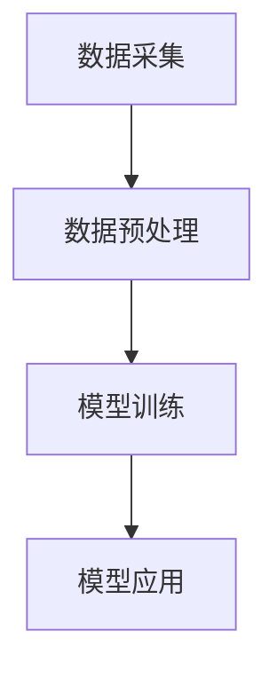

                 

# IoT集成扩展LLM应用的应用场景

## 关键词

- **物联网（IoT）**
- **大型语言模型（LLM）**
- **应用场景**
- **系统集成**
- **算法优化**
- **数据隐私**

## 摘要

本文旨在探讨物联网（IoT）与大型语言模型（LLM）相结合的应用场景，通过逐步分析，展示其在不同领域中的扩展潜力。我们将从背景介绍、核心概念、应用场景、技术实现和实战案例等多个角度，深入探讨IoT与LLM的集成及其在各个领域的应用，最终提供最佳实践和注意事项，以期为相关领域的研究和应用提供参考。

### 目录大纲设计步骤

#### 步骤一：理解书籍主题

首先，我们需要明确这本书的主题是关于物联网（IoT）与大型语言模型（LLM）的结合及其在不同应用场景中的扩展。物联网是指通过传感器、设备和网络连接，实现物品与物品、物品与互联网之间的互联互通。而大型语言模型（LLM）是一种基于深度学习的自然语言处理技术，能够对大量文本数据进行分析和理解。

#### 步骤二：大纲框架构建

根据书籍主题，我们构建一个初步的大纲框架，确保包含背景介绍、核心概念、应用场景分析、技术实现和实战案例等主要部分。

#### 步骤三：细化每个章节

对每个章节进行细化，确保每个章节都包含具体的小节，并考虑章节之间的逻辑关系。

#### 步骤四：内容完整性

确保大纲包含以下核心章节内容：
- 背景介绍
- 核心概念与联系
- 算法原理讲解
- 数学模型和数学公式 & 详细讲解 & 举例说明
- 系统分析与架构设计方案
- 项目实战
- 最佳实践 tips、小结、注意事项、拓展阅读等内容

#### 步骤五：保持简洁性

在保证内容完整性的前提下，尽量减少冗余内容，确保大纲简洁明了。

#### 步骤六：格式校对

使用markdown格式进行排版，确保符合要求的目录层级和格式。

### 目录大纲示例

```markdown
----------------------------------------------------------------
# 第一部分: 背景介绍与概念定义

## 第1章: 物联网与大型语言模型概述
### 1.1 物联网的兴起与现状
### 1.2 大型语言模型的发展与特点
### 1.3 IoT与LLM结合的背景与意义

## 第2章: IoT与LLM结合的核心概念
### 2.1 IoT的核心概念
### 2.2 LLM的核心概念
### 2.3 IoT与LLM结合的关键要素

## 第3章: IoT与LLM结合的算法原理
### 3.1 算法基本原理
### 3.2 算法流程图
### 3.3 数学模型与公式讲解

----------------------------------------------------------------

# 第二部分: 应用场景分析

## 第4章: 工业物联网中的LLM应用场景
### 4.1 应用背景
### 4.2 应用场景举例
### 4.3 案例分析

## 第5章: 智能家居与社区管理中的LLM应用
### 5.1 应用背景
### 5.2 应用场景举例
### 5.3 案例分析

## 第6章: 城市管理与公共安全中的LLM应用
### 6.1 应用背景
### 6.2 应用场景举例
### 6.3 案例分析

----------------------------------------------------------------

# 第三部分: 技术实现与实战案例

## 第7章: IoT与LLM结合的技术实现
### 7.1 系统架构设计
### 7.2 接口设计与实现
### 7.3 系统集成与调试

## 第8章: 实战案例解析
### 8.1 实战案例介绍
### 8.2 源代码解读与分析
### 8.3 案例详细讲解

## 第9章: 最佳实践与注意事项
### 9.1 最佳实践技巧
### 9.2 注意事项与挑战
### 9.3 拓展阅读与资源

----------------------------------------------------------------
```

通过以上步骤，我们不仅确保了大纲的完整性，还使其简洁且逻辑清晰，有助于读者快速把握书籍内容。

----------------------------------------------------------------

## 第一部分：背景介绍与概念定义

### 第1章：物联网与大型语言模型概述

#### 1.1 物联网的兴起与现状

物联网（Internet of Things，IoT）的概念最早由麻省理工学院（MIT）于1999年提出，它是指通过将各种物体连接到互联网，实现信息交换和通信的一种技术。随着信息技术和传感器技术的快速发展，物联网在各个领域得到了广泛应用。

目前，物联网已经渗透到工业、家居、交通、医疗等多个领域。例如，在工业领域，物联网技术被广泛应用于生产线监控、设备维护和供应链管理；在智能家居领域，物联网设备如智能音箱、智能灯泡、智能空调等，大大提高了人们的生活便利性；在交通领域，物联网技术被应用于智能交通管理、车联网和自动驾驶系统。

#### 1.2 大型语言模型的发展与特点

大型语言模型（Large Language Model，LLM）是近年来自然语言处理（Natural Language Processing，NLP）领域的重要进展。它通过深度学习算法对大量文本数据进行训练，能够理解和生成自然语言。

与传统的自然语言处理方法相比，大型语言模型具有以下特点：

1. **强大的语义理解能力**：大型语言模型能够对文本数据中的语义进行深入理解，从而实现更加准确的自然语言处理任务。
2. **灵活的生成能力**：大型语言模型能够根据输入的文本生成相关的文本，这在自动写作、机器翻译等领域具有广泛应用。
3. **大规模训练数据**：大型语言模型通常使用数十亿级别的训练数据，这使得模型具有更强的泛化能力和适应性。

#### 1.3 IoT与LLM结合的背景与意义

物联网和大型语言模型的结合，使得智能设备能够更加智能地理解和处理人类的语言，从而为各个领域提供更加智能化、个性化的解决方案。

首先，物联网与大型语言模型的结合能够提高设备的智能化水平。例如，在智能家居领域，通过物联网设备收集用户的生活习惯数据，结合大型语言模型的分析，可以实现对用户的个性化服务。

其次，IoT与LLM的结合能够提高数据处理效率。物联网设备产生的海量数据，通过大型语言模型的处理，可以快速提取出有价值的信息，为决策提供支持。

最后，IoT与LLM的结合具有广泛的应用前景。无论是在工业、医疗、交通，还是在城市管理、公共安全等领域，物联网与大型语言模型的结合都能带来显著的效益。

### 第2章：IoT与LLM结合的核心概念

#### 2.1 IoT的核心概念

物联网（IoT）的核心概念包括传感器、设备和网络连接。传感器用于采集物理世界的各种信息，如温度、湿度、光照等；设备则是指接入物联网的终端设备，如智能手表、智能家居设备等；网络连接则是指设备与互联网之间的连接，如Wi-Fi、蓝牙等。

在IoT中，传感器、设备和网络连接共同构成了一个物联网生态系统。传感器采集的数据通过设备进行处理，然后通过网络传输到云平台或服务器，进行进一步分析和处理。

#### 2.2 LLM的核心概念

大型语言模型（LLM）的核心概念包括深度学习、自然语言处理和语义理解。深度学习是一种通过多层神经网络对数据进行训练的方法，能够自动提取数据中的特征；自然语言处理（NLP）是一种使计算机能够理解、生成和操作自然语言的技术；语义理解则是指计算机对文本数据中的语义进行理解。

#### 2.3 IoT与LLM结合的关键要素

IoT与LLM结合的关键要素包括数据采集、数据处理、模型训练和模型应用。数据采集是指通过物联网设备收集各种数据；数据处理是指对采集到的数据进行清洗、转换和分析；模型训练是指使用深度学习算法对数据集进行训练，以构建出具有良好性能的模型；模型应用是指将训练好的模型部署到实际场景中，实现对数据的智能分析和处理。

### 第3章：IoT与LLM结合的算法原理

#### 3.1 算法基本原理

IoT与LLM结合的算法基本原理是通过物联网设备收集数据，然后使用大型语言模型对这些数据进行处理和分析。具体来说，可以分为以下几个步骤：

1. **数据采集**：物联网设备通过各种传感器收集数据，如温度、湿度、光照等。
2. **数据预处理**：对采集到的数据进行清洗、转换和标准化，以便于后续处理。
3. **数据训练**：使用预处理后的数据集对大型语言模型进行训练，以构建出具有良好性能的模型。
4. **模型应用**：将训练好的模型部署到实际场景中，对采集到的数据进行实时分析和处理。

#### 3.2 算法流程图



#### 3.3 数学模型与公式讲解

在IoT与LLM结合的算法中，常用的数学模型包括神经网络模型和循环神经网络模型。以下是这些模型的基本原理和公式：

1. **神经网络模型**：

   - 原理：神经网络模型是一种通过多层神经元对数据进行处理的模型，能够自动提取数据中的特征。

   - 公式：

     $$  
     Z = \sigma(W_1 \cdot X + b_1)  
     $$

     $$  
     Y = \sigma(W_2 \cdot Z + b_2)  
     $$

     其中，$Z$ 表示神经元的输出，$X$ 表示输入数据，$W_1$ 和 $W_2$ 分别为权重矩阵，$b_1$ 和 $b_2$ 分别为偏置项，$\sigma$ 表示激活函数。

2. **循环神经网络模型**：

   - 原理：循环神经网络（RNN）是一种能够处理序列数据的神经网络模型，能够记住序列中的长期依赖信息。

   - 公式：

     $$  
     h_t = \sigma(W_h \cdot [h_{t-1}, x_t] + b_h)  
     $$

     $$  
     y_t = \sigma(W_y \cdot h_t + b_y)  
     $$

     其中，$h_t$ 表示第 $t$ 个时刻的隐藏状态，$x_t$ 表示第 $t$ 个时刻的输入数据，$W_h$ 和 $W_y$ 分别为权重矩阵，$b_h$ 和 $b_y$ 分别为偏置项，$\sigma$ 表示激活函数。

### 第4章：应用场景分析

#### 4.1 工业物联网中的LLM应用场景

在工业物联网中，大型语言模型（LLM）的应用主要体现在设备监控、故障预测和智能决策等方面。

1. **设备监控**：通过物联网设备实时收集设备运行状态数据，结合LLM对设备状态进行分析，可以实现对设备的远程监控和故障预警。

2. **故障预测**：通过历史设备运行数据，使用LLM对设备故障进行预测，可以提前采取措施，避免故障的发生。

3. **智能决策**：基于物联网设备和LLM的分析结果，可以为工业生产提供智能化的决策支持，提高生产效率。

#### 4.2 智能家居与社区管理中的LLM应用

在智能家居和社区管理中，LLM的应用主要体现在智能语音助手、智能安防和智慧社区建设等方面。

1. **智能语音助手**：通过物联网设备和LLM的结合，可以实现智能语音助手的个性化服务，如语音控制家电、提醒事项等。

2. **智能安防**：通过物联网设备和LLM的分析，可以实现智能安防系统的实时监控和预警，提高社区的安全管理水平。

3. **智慧社区建设**：通过物联网设备和LLM的结合，可以实现社区智慧化建设，提高居民的生活质量。

#### 4.3 城市管理与公共安全中的LLM应用

在城市管理和公共安全领域，LLM的应用主要体现在交通管理、应急管理和社会治理等方面。

1. **交通管理**：通过物联网设备和LLM的分析，可以实现智能交通管理，如实时路况监测、交通流量预测和信号灯优化等。

2. **应急管理**：通过物联网设备和LLM的分析，可以实现应急管理的智能决策，如灾害预警、救援资源调度等。

3. **社会治理**：通过物联网设备和LLM的分析，可以实现社会治理的智能化，如公共安全预警、社区治理优化等。

### 第5章：技术实现与实战案例

#### 5.1 技术实现

物联网与LLM结合的技术实现主要包括数据采集、数据处理和模型训练等步骤。

1. **数据采集**：使用物联网设备实时收集数据，如传感器数据、设备日志数据等。

2. **数据处理**：对采集到的数据进行预处理，包括数据清洗、数据转换和数据标准化等。

3. **模型训练**：使用预处理后的数据集，通过深度学习算法对LLM进行训练，以构建出具有良好性能的模型。

#### 5.2 实战案例解析

以智能家居中的智能语音助手为例，我们来看一下物联网与LLM结合的具体实现过程。

1. **数据采集**：使用物联网设备（如智能音箱、智能灯泡等）收集用户的生活习惯数据，如语音命令、使用频率等。

2. **数据处理**：对采集到的数据进行预处理，包括语音识别、文本分类和命名实体识别等。

3. **模型训练**：使用预处理后的数据集，通过深度学习算法（如BERT、GPT等）对LLM进行训练，以构建出具有良好性能的智能语音助手模型。

4. **模型应用**：将训练好的模型部署到实际场景中，实现对用户语音命令的实时识别和响应。

### 第6章：最佳实践与注意事项

#### 6.1 最佳实践技巧

在物联网与LLM结合的应用过程中，以下是一些最佳实践技巧：

1. **数据质量**：保证数据的质量，包括数据的准确性、完整性和一致性。

2. **模型优化**：定期对模型进行优化和更新，以适应不断变化的数据和环境。

3. **安全隐私**：在数据处理和传输过程中，注重数据安全和隐私保护，采取相应的安全措施。

#### 6.2 注意事项与挑战

在物联网与LLM结合的应用过程中，需要注意以下事项和挑战：

1. **数据隐私**：在收集和处理用户数据时，要严格遵守数据隐私法规，确保用户数据的隐私和安全。

2. **模型解释性**：由于深度学习模型的黑箱特性，需要加强对模型解释性的研究和应用，以提高模型的透明度和可信度。

3. **系统稳定性**：在部署模型时，要确保系统的稳定性和可靠性，避免因模型故障导致系统崩溃。

### 第7章：拓展阅读与资源

为了进一步了解物联网与LLM结合的应用，以下是相关的拓展阅读和资源：

1. **论文**：《物联网与深度学习：融合创新与应用》

2. **书籍**：《智能物联网：理论与实践》

3. **在线课程**：《深度学习与自然语言处理》

4. **开源框架**：TensorFlow、PyTorch、Keras等

## 作者信息

作者：AI天才研究院/AI Genius Institute & 禅与计算机程序设计艺术 /Zen And The Art of Computer Programming

