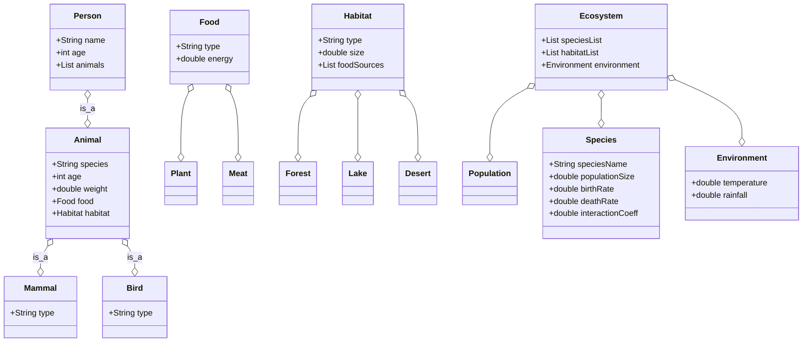
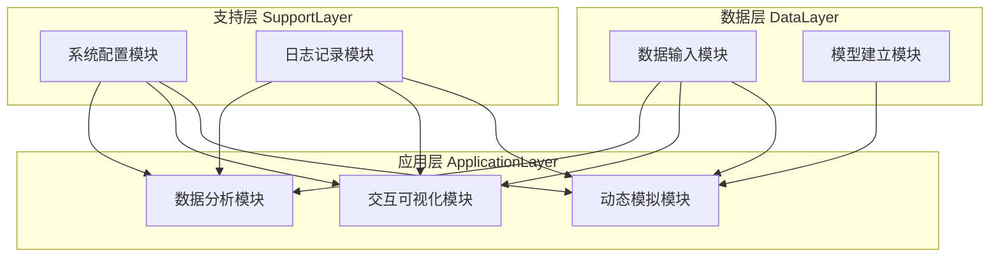

                 

### 1. 问题背景与核心概念

在当今科技迅猛发展的时代，复杂系统的模拟与预测已经成为众多领域中的一项关键技术。复杂系统，如生态系统、金融系统、交通系统等，由大量相互关联的元素组成，其行为呈现出高度的不确定性和复杂性。这种复杂性使得传统的模拟方法在准确性和效率上面临诸多挑战，因此，寻找新的模拟和预测方法成为研究的热点。

在这个背景下，自我一致性CoT（概念共识理论）作为一种新兴的理论，逐渐受到了关注。自我一致性CoT认为，复杂系统中的各个元素通过相互作用形成了一个动态的、自我调整的共识网络。这种共识网络不仅能够提高系统的稳定性，还能提高预测的准确性。因此，将自我一致性CoT应用于复杂系统模拟中，有望显著提升生态系统预测的准确性。

本文将围绕以下核心问题展开讨论：

1. **复杂系统模拟的需求与挑战**：探讨复杂系统模拟在生态系统预测中的应用需求，以及当前存在的挑战。
2. **自我一致性CoT的基本原理**：介绍自我一致性CoT的概念和理论基础，解释其在复杂系统模拟中的重要性。
3. **CoT在复杂系统模拟中的应用**：分析自我一致性CoT在不同复杂系统模拟中的实际应用，并对比其与其他理论的优缺点。
4. **数学模型和算法原理**：详细阐述自我一致性CoT的数学模型和算法原理，并通过具体例子进行讲解。
5. **系统分析与架构设计**：介绍系统功能设计、系统架构设计、系统接口设计以及系统交互与测试的方法。
6. **项目实战与应用**：通过具体案例展示如何在实际项目中应用自我一致性CoT，并进行详细分析和总结。

### 摘要

本文旨在探讨自我一致性CoT（概念共识理论）在复杂系统模拟中的应用，特别是提高生态系统预测的准确性。随着科技的发展，复杂系统的模拟和预测成为许多领域的关键需求，然而传统的模拟方法在处理复杂系统的动态性和不确定性时面临巨大挑战。自我一致性CoT提出了一种通过元素间相互作用形成共识网络来提高系统稳定性和预测准确性的新方法。本文首先介绍了复杂系统模拟的需求和挑战，然后详细阐述了自我一致性CoT的基本原理。接着，分析了自我一致性CoT在不同复杂系统模拟中的应用，并比较了其与现有理论的优缺点。随后，本文通过具体的数学模型和算法原理讲解，展示了如何应用自我一致性CoT进行复杂系统模拟。最后，本文通过系统分析与架构设计、项目实战与应用等部分，提供了一个完整的解决方案框架，以期为相关领域的研究和应用提供有价值的参考。

## 第1章：问题背景

### 1.1.1 复杂系统模拟的需求与挑战

复杂系统模拟在现代社会中扮演着至关重要的角色，特别是在生态系统、金融系统、交通系统等领域。这些系统由大量相互关联的元素组成，其行为复杂且具有高度不确定性。因此，准确模拟和预测复杂系统的行为对于优化系统性能、提高决策质量具有重要意义。

#### 1.1.1.1 复杂系统模拟在生态系统预测中的应用需求

生态系统是一个典型的复杂系统，其内部包含生物种群、物种相互作用、环境因素等多个层次。随着人类活动的加剧，生态系统的稳定性受到了严重威胁，例如气候变化、生物多样性减少、环境污染等问题。为了应对这些挑战，生态系统预测成为环境科学和生态学研究的一个重要方向。通过模拟生态系统，我们可以预测不同因素对生态系统的影响，为环境保护和生态修复提供科学依据。

在生态系统预测中，复杂系统模拟的需求主要体现在以下几个方面：

1. **预测准确性**：生态系统模拟需要能够准确反映生态系统的复杂性和动态性，以便预测未来可能发生的变化。
2. **高效性**：生态系统模拟往往涉及大量数据和处理，需要高效的方法和算法来处理这些数据，以减少计算时间和资源消耗。
3. **多尺度模拟**：生态系统中的现象不仅发生在宏观层面，还发生在微观层面。因此，模拟需要能够覆盖从个体生物到整个生态系统层次的多尺度。

#### 1.1.1.2 当前存在的挑战

尽管复杂系统模拟在生态系统预测中具有重要意义，但传统的模拟方法仍然面临许多挑战：

1. **数据不足与不确定性**：生态系统数据通常较为稀缺，且存在一定的不确定性。这使得模拟结果的可信度和准确性受到影响。
2. **计算复杂性**：生态系统模拟往往涉及大量参数和方程，计算过程复杂，对计算资源和时间要求较高。
3. **模型简化与失真**：为了提高计算效率，传统模型通常需要对生态系统进行简化，但这可能导致模型失真，无法准确反映现实世界中的复杂现象。
4. **交互效应的忽视**：生态系统中的各个元素之间存在复杂的相互作用，传统模型往往忽视了这些交互效应，导致模拟结果偏离实际。

#### 1.1.1.3 复杂系统模拟的重要性

复杂系统模拟不仅有助于生态系统预测，还在其他领域具有广泛应用：

1. **环境保护**：通过模拟生态系统，可以预测污染物的传播路径和影响范围，为环境保护提供科学依据。
2. **资源管理**：复杂系统模拟可以预测资源的分布和变化，为资源管理和优化提供支持。
3. **风险评估**：在金融系统、交通系统等领域，复杂系统模拟可以预测风险，为风险管理和决策提供依据。

总之，复杂系统模拟在生态系统预测和其他领域具有重要意义，但同时也面临着诸多挑战。为了应对这些挑战，需要不断探索新的模拟方法和技术。

### 1.1.2 生态系统预测的重要性

生态系统预测的重要性在于它能够帮助我们更好地理解生态系统的动态变化，从而采取有效的措施进行环境保护和生态修复。以下是生态系统预测的几个关键方面：

#### 1.1.2.1 预测环境保护效果

通过生态系统预测，我们可以评估不同环境保护措施的效果。例如，预测植树造林对减少二氧化碳排放的影响，或者预测湿地修复对水质改善的效果。这些预测结果有助于制定更加科学和有效的环境保护政策。

#### 1.1.2.2 生态修复决策支持

生态系统预测还可以为生态修复提供决策支持。例如，预测受污染土地的修复效果，或者预测某个地区生物多样性的恢复情况。这些预测结果可以帮助决策者选择最佳的修复方案，提高修复工作的效率和效果。

#### 1.1.2.3 预防自然灾害

生态系统预测在预防自然灾害方面也具有重要作用。例如，通过预测洪水发生概率和影响范围，可以提前采取防洪措施，减少灾害损失。同样，通过预测地震引发的次生灾害，可以提前进行疏散和救援准备。

#### 1.1.2.4 生物多样性保护

生态系统预测有助于生物多样性的保护。通过预测物种的生存状况和分布变化，可以及时发现和解决潜在的威胁，例如栖息地破坏、物种入侵等。这有助于制定更加科学的生物多样性保护策略。

#### 1.1.2.5 指导农业生产

生态系统预测还可以指导农业生产，提高农业生产的可持续性和效益。例如，通过预测气候变化对农作物的影响，可以提前调整种植策略，减少农业风险。

总之，生态系统预测在环境保护、生态修复、预防自然灾害、生物多样性保护和农业生产等方面具有重要意义。通过提高预测的准确性，我们可以更好地应对生态系统的变化和挑战，实现可持续发展和生态环境保护。

### 1.1.3 自我一致性概念介绍

自我一致性是一种重要且广泛的概念，尤其在复杂系统模拟和预测中具有重要意义。自我一致性指的是系统内部元素或模块之间在动态变化过程中保持一致和协调的能力。自我一致性概念源于对系统内部复杂性和动态性的深入理解，通过维持系统内部的一致性，可以提高系统的稳定性和预测准确性。

#### 1.1.3.1 自我一致性的定义

自我一致性可以定义为：在复杂系统中，各个元素或模块在相互作用和动态调整过程中，能够保持状态和行为的一致性，从而确保系统整体的稳定性和协调性。这种一致性不仅体现在系统内部各个元素之间的状态匹配，还包括对系统外部环境变化的响应能力。

#### 1.1.3.2 自我一致性的核心要素

自我一致性包含以下几个核心要素：

1. **一致性判断**：系统需要能够对各个元素的状态和行为进行一致性判断，以确保系统内部的一致性。
2. **调整机制**：系统需要具备调整机制，以在检测到不一致时，能够及时调整系统内部各元素的状态和行为。
3. **反馈机制**：系统需要建立有效的反馈机制，通过反馈信息来调整系统内部的一致性，从而提高系统的稳定性和预测准确性。
4. **容错能力**：系统需要具备一定的容错能力，能够应对外部环境变化和内部不一致带来的冲击。

#### 1.1.3.3 自我一致性的作用

自我一致性在复杂系统模拟和预测中的作用主要体现在以下几个方面：

1. **提高系统稳定性**：通过保持系统内部的一致性，可以减少系统的不稳定因素，提高系统的稳定性。
2. **提高预测准确性**：自我一致性有助于减少系统内部的不确定性和干扰，从而提高预测的准确性。
3. **增强系统适应性**：自我一致性使得系统能够更好地适应外部环境变化，提高系统的灵活性和适应性。
4. **优化系统性能**：通过保持系统内部的一致性，可以优化系统整体性能，提高系统的效率。

#### 1.1.3.4 自我一致性与生态系统模拟的关系

在生态系统模拟中，自我一致性概念具有重要意义。生态系统由大量相互关联的生物和非生物元素组成，这些元素在相互作用过程中需要保持一致性和协调性，才能维持生态系统的稳定性和健康发展。通过引入自我一致性概念，可以更准确地模拟生态系统中的动态过程，提高预测的准确性。

1. **模拟生态系统动态**：自我一致性有助于模拟生态系统中的生物种群动态、物种相互作用和环境因素变化，从而更真实地反映生态系统的运行机制。
2. **提高预测准确性**：通过保持系统内部的一致性，可以减少生态系统模拟中的不确定性，提高预测的准确性。
3. **优化生态修复方案**：自我一致性有助于评估不同生态修复措施的效果，从而优化生态修复方案，提高修复工作的有效性。

总之，自我一致性概念在复杂系统模拟和生态系统预测中具有重要意义。通过深入理解和应用自我一致性理论，可以显著提高复杂系统模拟的准确性和稳定性，为生态系统的保护和修复提供有力支持。

### 1.1.4 CoT（概念共识理论）的基本原理

概念共识理论（Concept Consensus Theory，CoT）是一种新兴的复杂系统理论，主要研究系统内部各元素或模块如何通过共识机制保持一致性和协调性。CoT的基本原理基于对系统复杂性和动态性的深入理解，强调通过构建共识网络来提高系统的稳定性和预测准确性。

#### 1.1.4.1 CoT的定义

概念共识理论（CoT）定义为：在一个复杂系统中，各个元素或模块通过相互交流、比较和调整，形成一种共识状态，从而保持系统的整体一致性。这种共识状态不仅包括系统内部各个元素的状态匹配，还包括对外部环境变化的共同响应。

#### 1.1.4.2 CoT的核心要素

CoT包含以下几个核心要素：

1. **共识网络**：共识网络是CoT的核心概念，指的是系统内部各元素或模块通过相互连接和交流形成的网络结构。共识网络的存在使得系统中的各个元素能够共享信息，协调行动，从而保持整体一致性。
2. **交流机制**：系统内部各元素通过交流机制共享信息，这些信息包括状态、行为和外部环境变化等。通过交流，元素可以了解彼此的状态，发现不一致性，并采取相应的调整措施。
3. **比较机制**：系统内部各元素通过比较机制对自身状态与其他元素的状态进行对比，以判断是否存在不一致性。比较机制有助于识别问题根源，为调整机制提供依据。
4. **调整机制**：系统内部各元素通过调整机制对自身状态和行为进行调整，以消除不一致性，保持整体一致性。调整机制包括自适应调整、自组织调整等。
5. **反馈机制**：系统内部各元素通过反馈机制共享调整结果，以验证调整效果，并为进一步调整提供参考。反馈机制有助于系统持续优化，提高一致性水平。

#### 1.1.4.3 CoT的特点

概念共识理论具有以下几个显著特点：

1. **自适应性**：CoT强调系统内部各元素的自适应能力，能够根据外部环境变化和内部不一致性进行动态调整，从而提高系统的稳定性和适应性。
2. **一致性**：CoT的核心目标是保持系统内部的一致性，通过共识网络和调整机制，系统中的各个元素能够在动态变化过程中保持协调和一致，从而提高系统的整体性能。
3. **鲁棒性**：CoT具备良好的鲁棒性，能够应对系统内部和外部的不确定性因素，通过自我调整和反馈机制，保持系统的稳定性和一致性。
4. **动态性**：CoT关注系统的动态变化过程，通过共识网络和调整机制，系统中的各个元素能够在动态过程中保持协调和一致，从而提高预测准确性。

#### 1.1.4.4 CoT的应用场景

概念共识理论在复杂系统模拟和预测中具有广泛的应用场景，主要包括：

1. **生态系统模拟**：通过引入CoT，可以更准确地模拟生态系统中的生物种群动态、物种相互作用和环境因素变化，提高预测的准确性。
2. **金融系统模拟**：CoT可以用于金融系统中的风险评估和预测，通过分析市场动态和投资者行为，提高投资决策的准确性。
3. **交通系统模拟**：在交通系统中，CoT有助于模拟交通流量、交通事故和交通管制等动态过程，提高交通管理的效率和安全性。
4. **社会系统模拟**：在社会系统中，CoT可以用于模拟人口流动、社会行为和社会结构变化，为社会管理和政策制定提供科学依据。

总之，概念共识理论（CoT）作为一种新兴的复杂系统理论，其基本原理和特点在复杂系统模拟和预测中具有重要意义。通过深入理解和应用CoT，可以显著提高复杂系统模拟的准确性和稳定性，为各领域的发展提供有力支持。

### 1.1.5 CoT与相关理论的对比

在复杂系统模拟领域，概念共识理论（CoT）与其他相关理论如自组织系统理论（OS）、协同论（Synergetics）和复杂性科学（Complexity Science）等有着密切的联系和区别。以下是对这些理论的简要对比，以便更好地理解CoT的独特优势和应用场景。

#### 1.1.5.1 自组织系统理论（OS）

自组织系统理论主要研究系统在没有外部指令的情况下，通过内部相互作用和反馈机制自发形成有序结构的能力。自组织系统的核心概念包括自相似性、分形结构和适应性等。自组织系统理论强调系统内部元素的自组织和自调节能力，其目标是理解和预测系统在动态变化中的行为。

- **相似性**：CoT和OS在自组织机制方面有相似之处，都关注系统内部元素的自组织和自适应能力。然而，CoT更加注重共识机制和一致性维护，而OS则侧重于系统结构的自发形成和演化。
- **区别**：自组织系统理论在复杂系统模拟中的应用主要集中在系统结构的演化过程，而CoT则更加关注系统内部的一致性和稳定性。因此，在需要保持系统一致性和稳定性的场景中，CoT可能更具优势。

#### 1.1.5.2 协同论（Synergetics）

协同论是一种跨学科的研究方法，主要研究系统内部元素之间的协同作用和整体效应。协同论的核心思想是系统整体的性能和性质不仅取决于单个元素的性能，还取决于元素之间的相互作用和协同效应。协同论广泛应用于生态学、经济学、物理学等领域。

- **相似性**：CoT和协同论都关注系统内部元素之间的相互作用和协同效应。两者都试图通过理解系统内部的一致性和协同性来提高系统的整体性能。
- **区别**：协同论侧重于系统内部元素之间的相互作用机制，而CoT则更加关注共识机制和一致性维护。CoT通过共识网络和调整机制来保持系统的一致性，这使得其在需要高一致性场景中的应用更为有效。

#### 1.1.5.3 复杂性科学（Complexity Science）

复杂性科学是一个跨学科的研究领域，主要研究复杂系统的行为和规律。复杂性科学包括多个分支，如非线性动力学、混沌理论、网络科学等。复杂性科学的目标是理解和预测复杂系统的行为，从而为解决复杂问题提供理论和方法支持。

- **相似性**：CoT和复杂性科学都关注复杂系统的行为和规律，试图通过理解系统的复杂性和动态性来提高预测准确性。
- **区别**：复杂性科学涵盖了多个领域和理论，其研究方法多样，而CoT则是一种具体的方法论，强调通过共识机制和一致性维护来提高系统性能。在需要保持系统一致性和稳定性的场景中，CoT可能比复杂性科学的其他方法更具针对性。

#### 1.1.5.4 CoT的优势

与上述理论相比，概念共识理论（CoT）具有以下优势：

1. **一致性维护**：CoT强调通过共识机制和一致性维护来保持系统内部的一致性，这使得它在需要高一致性场景中的应用更为有效。
2. **鲁棒性**：CoT通过自适应调整和反馈机制，能够应对系统内部和外部的不确定性因素，提高系统的鲁棒性和稳定性。
3. **动态性**：CoT关注系统的动态变化过程，能够通过共识网络和调整机制在动态过程中保持一致性，从而提高预测准确性。

总之，概念共识理论（CoT）在复杂系统模拟和预测中具有独特的优势和广泛应用前景。通过深入理解CoT与其他相关理论的联系和区别，我们可以更好地发挥CoT在复杂系统模拟中的潜力，为各领域的发展提供有力支持。

### 第2章：核心概念与联系

#### 2.1.1 自我一致性CoT的基本概念

自我一致性CoT（Concept Consensus Theory）是一种专门用于复杂系统模拟的理论，它强调系统内部各元素或模块通过共识机制保持一致性和协调性。为了深入理解自我一致性CoT的基本概念，我们需要从以下几个方面进行阐述。

##### 2.1.1.1 定义

自我一致性CoT可以定义为一个复杂系统内部，各个元素或模块在动态调整过程中，通过信息交流和比较，形成一种共识状态，从而保持系统整体的一致性和稳定性。这种共识状态不仅体现在系统内部各个元素的状态匹配上，还包括对外部环境变化的共同响应。

##### 2.1.1.2 特征

自我一致性CoT具有以下主要特征：

1. **共识网络**：系统内部各元素通过一种共识网络相互连接，这种网络使得元素之间能够实时交流信息，共享状态和行为。
2. **自适应调整**：各元素在共识网络中，根据共享的信息和外部环境变化，进行自适应调整，以保持一致性。
3. **反馈机制**：系统内部建立反馈机制，通过收集各元素的调整结果，验证调整效果，并为下一步调整提供参考。
4. **鲁棒性**：系统能够在面临外部环境变化和内部不一致性时，通过自我调整和反馈机制保持稳定性和一致性。

##### 2.1.1.3 研究领域

自我一致性CoT的研究领域主要集中在复杂系统模拟和预测。它被广泛应用于生态系统、金融系统、交通系统等多个领域，旨在提高这些复杂系统的稳定性和预测准确性。

##### 2.1.1.4 应用场景

自我一致性CoT的应用场景包括：

1. **生态系统模拟**：通过自我一致性CoT，可以更准确地模拟生态系统的动态变化，预测物种的生存状况和生态系统的发展趋势。
2. **金融系统预测**：在金融系统中，自我一致性CoT可以帮助预测市场动态，优化投资策略，降低风险。
3. **交通系统优化**：在交通系统中，自我一致性CoT可以优化交通流量管理，提高交通效率，减少拥堵。

##### 2.1.1.5 自我一致性CoT的核心要素

自我一致性CoT的核心要素包括：

1. **共识网络**：这是自我一致性CoT的基础，通过共识网络，系统内部各元素能够实时交流和共享信息。
2. **共识机制**：共识机制是实现自我一致性的关键，它通过信息比较和反馈，确保系统内部的一致性和稳定性。
3. **调整机制**：调整机制用于在发现不一致时，及时调整系统内部各元素的状态和行为，以保持一致性。
4. **反馈机制**：反馈机制用于验证调整效果，并为下一步调整提供参考，确保系统持续优化。

#### 2.1.2 CoT在生态系统模拟中的应用

在生态系统模拟中，自我一致性CoT（Concept Consensus Theory）的应用具有重要意义。生态系统是一个复杂的动态系统，由多种生物和非生物元素相互作用构成。通过引入自我一致性CoT，可以更准确地模拟生态系统的行为，提高预测的准确性。

##### 2.1.2.1 CoT在生态系统模拟中的应用原理

自我一致性CoT在生态系统模拟中的应用原理基于以下几个关键步骤：

1. **建立共识网络**：首先，建立一个包含生态系统各个元素的共识网络。在这个网络中，每个元素都可以与其他元素进行信息交流和状态共享。
2. **信息比较和反馈**：通过共识网络，系统内部各元素可以实时比较自身状态与其他元素的状态，识别出不一致性。在此基础上，建立反馈机制，将不一致性信息传递给相关元素。
3. **自适应调整**：识别出不一致性后，各元素根据反馈信息进行自适应调整，以减少不一致性，保持整体一致性。
4. **持续优化**：通过持续的反馈和调整，系统不断优化自身状态，提高稳定性。

##### 2.1.2.2 CoT在生态系统模拟中的优势

自我一致性CoT在生态系统模拟中的优势主要体现在以下几个方面：

1. **提高预测准确性**：通过保持系统内部的一致性，自我一致性CoT有助于减少生态系统模拟中的不确定性，提高预测的准确性。
2. **适应动态变化**：生态系统面临的外部环境变化复杂且不确定。自我一致性CoT能够通过自适应调整和反馈机制，使系统更好地适应这些动态变化。
3. **优化生态修复方案**：在生态修复过程中，自我一致性CoT可以帮助评估不同修复措施的效果，从而优化生态修复方案，提高修复工作的有效性。

##### 2.1.2.3 CoT在其他复杂系统模拟中的应用

除了生态系统模拟，自我一致性CoT还在其他复杂系统模拟中具有广泛应用：

1. **金融系统模拟**：在金融系统中，自我一致性CoT可以用于预测市场动态，优化投资策略，降低风险。
2. **交通系统模拟**：在交通系统中，自我一致性CoT可以用于优化交通流量管理，提高交通效率，减少拥堵。
3. **社会系统模拟**：在社会系统中，自我一致性CoT可以用于模拟人口流动、社会行为和社会结构变化，为政策制定提供科学依据。

通过在多个复杂系统中的成功应用，自我一致性CoT已经证明了其有效性和广泛适用性。未来，随着研究的深入，自我一致性CoT有望在更多领域发挥重要作用，为复杂系统模拟和预测提供有力支持。

### 第3章：数学模型和算法原理

#### 3.1.1 自我一致性CoT的数学模型

自我一致性CoT（Concept Consensus Theory）的核心在于通过数学模型和算法实现系统内部的一致性和稳定性。为了更好地理解和应用这一理论，我们需要深入探讨其数学模型和算法原理。

##### 3.1.1.1 模型公式与推导

自我一致性CoT的数学模型基于系统内部各元素的共识网络和自适应调整机制。以下是一个简化的模型公式：

\[ S(t) = f(S(t-1), I(t-1), E(t-1)) \]

其中：

- \( S(t) \) 表示在时间 \( t \) 的系统状态向量。
- \( f \) 表示系统状态更新的函数。
- \( I(t-1) \) 表示在时间 \( t-1 \) 的系统内部信息向量。
- \( E(t-1) \) 表示在时间 \( t-1 \) 的系统外部环境向量。

系统状态向量 \( S(t) \) 由系统内部各元素的状态组成，包括生物种群数量、环境变量等。内部信息向量 \( I(t-1) \) 和外部环境向量 \( E(t-1) \) 则包含系统内部各元素之间的信息交换和外部环境的变化。

##### 3.1.1.2 模型参数说明

为了使模型公式更具解释性，我们需要详细说明模型中的参数：

- **状态参数**：每个元素的状态可以用一组参数表示，如生物种群数量、个体生长率等。
- **信息参数**：系统内部各元素之间的信息交换可以用一组信息参数表示，如信息传递速率、信息共享比例等。
- **环境参数**：系统外部环境的变化可以用一组环境参数表示，如温度、光照等。

这些参数的值取决于具体的应用场景和系统特性，需要通过实际数据和实验结果来确定。

##### 3.1.1.3 模型公式推导

模型公式的推导基于以下基本假设：

1. **动态变化**：系统内部状态随时间动态变化，每个时间步的系统状态由前一个时间步的状态和当前时间步的信息及环境因素共同决定。
2. **自适应调整**：系统内部各元素根据共识网络中的信息进行自适应调整，以减少不一致性，提高一致性。

基于这些假设，我们可以推导出模型公式：

\[ S(t) = S(t-1) + \alpha(I(t-1) - S(t-1)) + \beta(E(t-1) - S(t-1)) \]

其中，\(\alpha\) 和 \(\beta\) 分别表示内部信息调整系数和外部环境调整系数，反映了系统内部一致性和外部适应性。

通过这个模型公式，系统内部各元素在共识网络中通过信息交流和比较，实现状态的动态调整，从而保持系统的一致性和稳定性。

#### 3.1.2 CoT算法原理讲解

自我一致性CoT算法的核心在于通过共识网络和自适应调整机制实现系统内部的一致性和稳定性。以下是对CoT算法原理的详细讲解。

##### 3.1.2.1 算法流程图

为了更直观地理解CoT算法，我们首先展示其流程图：

```
┌─────────────┐
│ 初始化系统 │
│ 状态向量 S  │
│ 信息向量 I │
│ 环境向量 E │
└─────┬───────┘
      │
      ▼
┌─────────────┐
│ 时间步 t = 1 │
└─────┬───────┘
      │
      ▼
┌─────────────┐
│ 更新系统状态 │
│ S(t) = f(S(t-1), I(t-1), E(t-1)) │
└─────┬───────┘
      │
      ▼
┌─────────────┐
│ 交流信息 I  │
│ 比较状态 S  │
│ 更新反馈 F  │
└─────┬───────┘
      │
      ▼
┌─────────────┐
│ 自适应调整 │
│ S(t) = S(t) + α(I(t-1) - S(t-1)) + β(E(t-1) - S(t-1)) │
└─────┬───────┘
      │
      └─────────────┐
                      │
              继续迭代
                      ▼
┌─────────────┐
│ 检查终止条件 │
│（如达到稳定状态）│
└─────────────┘
```

这个流程图描述了CoT算法的基本步骤，包括系统初始化、状态更新、信息交流、比较状态、自适应调整和迭代过程。

##### 3.1.2.2 算法原理详细讲解

1. **系统初始化**：在算法开始时，系统初始化状态向量 \( S(0) \)，信息向量 \( I(0) \)，和环境向量 \( E(0) \)。这些初始值可以是随机生成或基于实际数据的初始值。

2. **状态更新**：在每个时间步 \( t \)，系统根据前一个时间步的状态 \( S(t-1) \)，内部信息 \( I(t-1) \)，和外部环境 \( E(t-1) \) 更新当前状态 \( S(t) \)。状态更新函数 \( f \) 是算法的核心，它通过比较内部信息和外部环境与系统状态的差异，决定系统状态的变化。

3. **信息交流**：系统内部各元素通过共识网络进行信息交流，共享各自的状态信息。这种信息交流有助于各元素了解系统的整体状态，为后续的比较和调整提供依据。

4. **比较状态**：系统内部各元素根据共识网络中的信息，比较自身状态与其他元素的状态。比较过程旨在识别系统内部的不一致性，为后续的自适应调整提供方向。

5. **自适应调整**：在比较状态后，各元素根据反馈信息进行自适应调整，以减少系统内部的不一致性。自适应调整函数 \( \gamma \) 负责根据比较结果调整系统状态，使其更接近共识状态。

6. **迭代过程**：调整后的状态作为下一个时间步的初始状态，算法继续进行下一轮的更新、交流、比较和调整过程。这个过程会重复进行，直到系统达到稳定状态或满足其他终止条件。

##### 3.1.2.3 算法举例说明

为了更好地理解CoT算法的原理，我们通过一个简化的例子进行说明。

假设一个生态系统中有两个物种A和B，每个物种都有一个状态变量X和Y。系统初始状态为 \( S(0) = (X_0, Y_0) \)，内部信息向量 \( I(0) = (X_0, Y_0) \)，外部环境向量 \( E(0) = (0, 0) \)。

在时间步 \( t = 1 \)：

1. **状态更新**：根据模型公式，系统状态更新为 \( S(1) = S(0) + \alpha(I(0) - S(0)) + \beta(E(0) - S(0)) \)。假设 \(\alpha = 0.5\) 和 \(\beta = 0.3\)，则 \( S(1) = (X_0, Y_0) + 0.5(X_0 - X_0) + 0.3(0 - X_0) = (X_0 - 0.3X_0, Y_0 - 0.3X_0) \)。

2. **信息交流**：两个物种通过共识网络共享状态信息，得到 \( I(1) = (X_1, Y_1) \)。

3. **比较状态**：两个物种比较自身状态 \( X_1 \) 和 \( Y_1 \) 与共识网络中的状态 \( I(1) \)，发现 \( X_1 < Y_1 \)。

4. **自适应调整**：根据比较结果，物种A调整自身状态 \( X_2 = X_1 + 0.5(Y_1 - X_1) \)，物种B调整自身状态 \( Y_2 = Y_1 + 0.5(Y_1 - X_1) \)。

5. **迭代过程**：新的状态 \( S(2) = (X_2, Y_2) \) 作为下一个时间步的初始状态，继续进行状态更新、信息交流、比较和调整。

通过这个例子，我们可以看到CoT算法的基本原理和步骤。在实际应用中，生态系统可能包含多个物种、多种环境因素和复杂的相互作用，但基本的算法流程是类似的，关键在于通过共识网络和自适应调整机制实现系统的一致性和稳定性。

### 第4章：系统功能设计

#### 4.1.1 生态系统模拟问题场景

在生态系统模拟中，我们关注的核心问题是理解和预测生态系统的动态变化。具体来说，生态系统模拟问题场景包括以下几个关键方面：

1. **生物种群动态**：模拟不同生物种群的数量变化，如物种A、物种B等的种群数量随时间的变化情况。
2. **物种相互作用**：分析不同物种之间的相互作用关系，包括捕食与被捕食关系、共生关系等，以理解这些关系如何影响种群动态。
3. **环境因素影响**：模拟环境因素，如温度、光照、水资源等，对生态系统的影响，以及这些因素如何通过相互作用影响生物种群。
4. **生态位竞争**：分析不同物种在生态位上的竞争关系，了解资源分配对种群动态的影响。
5. **灾害事件**：模拟生态系统中的灾害事件，如自然灾害、人为活动等，以及这些事件如何影响生态系统的稳定性和种群动态。

#### 4.1.2 系统功能需求分析

为了实现上述生态系统模拟问题场景，系统需要具备以下功能需求：

1. **数据输入与处理**：系统能够接收和分析不同来源的数据，如气象数据、环境监测数据、生物种群统计数据等，以建立生态系统的初始状态和模型参数。
2. **模型建立与配置**：系统应支持多种生态系统模型，如Lotka-Volterra模型、食物网模型等，并提供模型参数配置功能，以适应不同的应用场景。
3. **动态模拟与预测**：系统能够根据当前状态和模型参数，进行生态系统动态模拟，预测未来生物种群数量变化和环境因素影响。
4. **交互可视化**：系统应提供交互式的可视化界面，以便用户实时观察和调整生态系统模拟过程，理解模拟结果。
5. **数据分析与报告**：系统能够对模拟结果进行数据分析，生成图表和报告，以支持生态学研究、决策制定和政策评估。
6. **系统可扩展性**：系统应具备良好的可扩展性，能够根据用户需求添加新的功能、模型和数据来源，支持长期发展。

#### 4.1.3 领域模型类图设计

为了更好地理解和实现系统功能需求，我们设计了一个领域模型类图，该类图描述了系统中的关键类及其相互关系。



在这个类图中，我们定义了多个类，包括Person（人）、Animal（动物）、Mammal（哺乳动物）、Bird（鸟类）、Food（食物）、Habitat（栖息地）、Ecosystem（生态系统）、Species（物种）和Environment（环境）。这些类之间通过继承、关联和聚合关系相互联系，构成了一个完整的生态系统模拟领域模型。通过这个领域模型类图，我们可以清晰地理解系统中的关键实体及其相互作用关系，为系统功能设计提供基础。

### 第5章：系统架构设计

#### 5.1.1 系统架构整体设计

在生态系统模拟系统的设计过程中，系统架构的合理性和稳定性至关重要。本节将详细描述系统架构的整体设计，包括系统的模块分解和系统架构图设计。

##### 5.1.1.1 模块分解

为了实现生态系统模拟系统的功能需求，我们将系统分解为多个功能模块，每个模块负责特定的功能，这样可以提高系统的可维护性和可扩展性。以下是系统的模块分解：

1. **数据输入模块**：负责接收和处理各种生态系统的数据，如气象数据、环境监测数据和生物种群统计数据。
2. **模型建立模块**：提供多种生态系统模型供用户选择和配置，包括Lotka-Volterra模型、食物网模型等。
3. **动态模拟模块**：根据当前状态和模型参数，进行生态系统动态模拟，预测未来生物种群数量变化和环境因素影响。
4. **交互可视化模块**：提供交互式的可视化界面，用户可以通过该模块实时观察和调整模拟过程。
5. **数据分析模块**：对模拟结果进行数据分析，生成图表和报告，支持生态学研究、决策制定和政策评估。
6. **系统配置模块**：负责系统的配置管理，包括参数配置、模型选择和数据源配置等。
7. **日志记录模块**：记录系统的运行日志，方便后续的调试和性能分析。

通过这样的模块分解，各模块之间职责明确，可以独立开发和维护，从而提高系统的整体性能和可维护性。

##### 5.1.1.2 系统架构图设计

为了更直观地理解系统架构，我们设计了一个系统架构图，展示了各模块之间的交互关系和整体结构。以下是一个简化的系统架构图：



在这个架构图中，数据层（DataLayer）负责数据的输入和模型建立，应用层（ApplicationLayer）实现生态系统的动态模拟、交互可视化和数据分析，支持层（SupportLayer）提供系统配置管理和日志记录功能。各模块通过明确的接口进行通信和数据共享，从而形成一个高效、稳定的生态系统模拟系统。

#### 5.1.2 系统模块分解

为了进一步说明系统架构设计的细节，我们将对各个模块进行详细的分解，描述每个模块的具体功能、内部结构和接口设计。

##### 5.1.2.1 数据输入模块

数据输入模块负责接收和处理各种生态系统的数据，如气象数据、环境监测数据和生物种群统计数据。其主要功能包括：

1. **数据读取**：从外部数据源读取数据，如文本文件、数据库和API接口等。
2. **数据清洗**：对读取的数据进行清洗，去除无效数据和错误数据，保证数据质量。
3. **数据转换**：将不同格式的数据转换为统一的内部格式，便于后续处理和分析。

内部结构设计如下：

1. **数据读取器**：负责从外部数据源读取数据，支持多种数据格式和接口。
2. **数据清洗器**：对读取的数据进行清洗，包括去除无效数据、修正错误数据等。
3. **数据转换器**：将不同格式的数据转换为内部格式，便于系统其他模块的处理。

接口设计：

- **数据读取接口**：提供读取数据的方法，包括读取文本文件、数据库和API接口等。
- **数据清洗接口**：提供清洗数据的方法，包括去除无效数据和修正错误数据等。
- **数据转换接口**：提供转换数据的方法，将不同格式的数据转换为内部格式。

##### 5.1.2.2 模型建立模块

模型建立模块提供多种生态系统模型供用户选择和配置，包括Lotka-Volterra模型、食物网模型等。其主要功能包括：

1. **模型选择**：允许用户从多种模型中选择合适的模型。
2. **模型配置**：为选定的模型配置参数，如种群增长率、捕食者-被捕食者关系参数等。
3. **模型验证**：验证模型配置的有效性，确保模型可以正常运行。

内部结构设计如下：

1. **模型选择器**：提供选择模型的方法，包括从预设模型库中选择和自定义模型等。
2. **模型配置器**：提供配置模型参数的方法，允许用户调整模型参数。
3. **模型验证器**：提供验证模型配置的方法，确保模型配置有效。

接口设计：

- **模型选择接口**：提供选择模型的方法，包括从预设模型库中选择和自定义模型等。
- **模型配置接口**：提供配置模型参数的方法，允许用户调整模型参数。
- **模型验证接口**：提供验证模型配置的方法，确保模型配置有效。

##### 5.1.2.3 动态模拟模块

动态模拟模块根据当前状态和模型参数，进行生态系统动态模拟，预测未来生物种群数量变化和环境因素影响。其主要功能包括：

1. **状态更新**：根据模型和当前状态，更新生态系统的状态。
2. **模拟运行**：执行生态系统动态模拟，预测未来生物种群数量变化和环境因素影响。
3. **结果输出**：输出模拟结果，包括图表和报告等。

内部结构设计如下：

1. **状态更新器**：负责更新生态系统状态，根据模型和当前状态计算下一状态。
2. **模拟运行器**：负责执行生态系统动态模拟，预测未来变化。
3. **结果输出器**：负责将模拟结果转换为图表和报告，供用户查看。

接口设计：

- **状态更新接口**：提供更新生态系统状态的方法。
- **模拟运行接口**：提供执行生态系统动态模拟的方法。
- **结果输出接口**：提供输出模拟结果的方法，包括图表和报告等。

##### 5.1.2.4 交互可视化模块

交互可视化模块提供交互式的可视化界面，用户可以通过该模块实时观察和调整模拟过程。其主要功能包括：

1. **界面设计**：设计用户友好的可视化界面，提供直观的操作体验。
2. **实时监控**：实时显示生态系统的状态变化，包括生物种群数量、环境因素等。
3. **用户交互**：提供用户交互功能，允许用户实时调整模型参数和模拟过程。

内部结构设计如下：

1. **界面设计器**：负责设计可视化界面，包括图表、仪表盘等。
2. **实时监控器**：负责实时显示生态系统的状态变化。
3. **交互处理器**：负责处理用户输入和交互操作，调整模型参数和模拟过程。

接口设计：

- **界面设计接口**：提供设计可视化界面的方法。
- **实时监控接口**：提供实时显示生态系统状态变化的方法。
- **交互处理接口**：提供处理用户输入和交互操作的方法。

##### 5.1.2.5 数据分析模块

数据分析模块对模拟结果进行数据分析，生成图表和报告，支持生态学研究、决策制定和政策评估。其主要功能包括：

1. **数据分析**：对模拟结果进行统计分析，提取关键信息。
2. **数据可视化**：将分析结果可视化，生成图表和报告。
3. **报告生成**：生成详细的分析报告，供用户参考。

内部结构设计如下：

1. **数据分析器**：负责对模拟结果进行统计分析，提取关键信息。
2. **数据可视化器**：负责将分析结果可视化，生成图表和报告。
3. **报告生成器**：负责生成详细的分析报告。

接口设计：

- **数据分析接口**：提供数据分析的方法，包括统计分析、数据提取等。
- **数据可视化接口**：提供数据可视化方法，包括生成图表和报告等。
- **报告生成接口**：提供生成分析报告的方法。

##### 5.1.2.6 系统配置模块

系统配置模块负责系统的配置管理，包括参数配置、模型选择和数据源配置等。其主要功能包括：

1. **参数配置**：允许用户配置系统参数，如模拟时间步长、数据刷新频率等。
2. **模型选择**：允许用户选择适合的生态系统模型。
3. **数据源配置**：允许用户配置数据源，如数据库连接、API接口等。

内部结构设计如下：

1. **参数配置器**：负责配置系统参数，包括模拟时间步长、数据刷新频率等。
2. **模型选择器**：负责选择适合的生态系统模型。
3. **数据源配置器**：负责配置数据源，包括数据库连接、API接口等。

接口设计：

- **参数配置接口**：提供配置系统参数的方法。
- **模型选择接口**：提供选择生态系统模型的方法。
- **数据源配置接口**：提供配置数据源的方法。

##### 5.1.2.7 日志记录模块

日志记录模块负责记录系统的运行日志，方便后续的调试和性能分析。其主要功能包括：

1. **日志记录**：记录系统的运行日志，包括错误信息、调试信息等。
2. **日志查询**：允许用户查询和检索日志记录。
3. **日志分析**：对日志记录进行分析，提取有用信息。

内部结构设计如下：

1. **日志记录器**：负责记录系统的运行日志。
2. **日志查询器**：负责查询和检索日志记录。
3. **日志分析器**：负责对日志记录进行分析。

接口设计：

- **日志记录接口**：提供记录日志的方法。
- **日志查询接口**：提供查询和检索日志记录的方法。
- **日志分析接口**：提供分析日志记录的方法。

通过上述模块分解和详细描述，我们可以更清晰地理解生态系统模拟系统的整体架构设计，以及各个模块的功能和接口设计。这为后续的系统开发、测试和维护提供了坚实的基础。

### 第6章：系统接口设计

#### 6.1.1 系统接口规范

在系统架构设计中，系统接口设计是关键的一环。它定义了各个模块之间进行交互的接口规范，确保系统能够稳定、高效地运行。本节将详细介绍生态系统模拟系统的接口规范，包括接口规范的定义、设计原则和接口类型。

##### 6.1.1.1 接口规范定义

接口规范是指一组定义明确的接口，用于系统内部各模块之间的数据交换和功能调用。接口规范包括接口的定义、参数、返回值和异常处理等。通过接口规范，模块之间可以清晰、安全地进行通信，提高系统的可维护性和扩展性。

##### 6.1.1.2 设计原则

系统接口设计需要遵循以下原则：

1. **抽象性**：接口应尽量抽象，隐藏内部实现细节，降低模块之间的耦合度。
2. **一致性**：接口定义应保持一致性，确保各模块之间的交互规范一致。
3. **安全性**：接口应具备一定的安全性，防止恶意操作和数据泄露。
4. **易用性**：接口应简洁明了，易于使用，降低开发者的学习成本。
5. **可扩展性**：接口应具备良好的可扩展性，方便后续功能扩展和模块替换。

##### 6.1.1.3 接口类型

生态系统模拟系统主要包含以下几种类型的接口：

1. **输入接口**：用于接收外部数据和用户输入，如数据输入模块的输入接口。
2. **输出接口**：用于输出系统结果和报告，如数据分析模块的输出接口。
3. **控制接口**：用于控制系统运行过程，如动态模拟模块的控制接口。
4. **通信接口**：用于模块之间的数据交换和功能调用，如各个模块之间的通信接口。

#### 6.1.2 接口实现细节

以下是生态系统模拟系统中几个关键模块的具体接口实现细节：

##### 6.1.2.1 数据输入模块接口

数据输入模块的接口主要负责接收和处理外部数据，以下是其主要接口实现细节：

1. **数据读取接口**：
    - **参数**：String filePath（数据文件路径），DataFormat format（数据格式）。
    - **返回值**：List<Data> data（读取的数据列表）。
    - **异常处理**：IOException（读取文件错误），DataFormatException（数据格式错误）。

    ```java
    public List<Data> readData(String filePath, DataFormat format) throws IOException, DataFormatException {
        // 读取数据并转换为内部格式
        // ...
        return data;
    }
    ```

2. **数据清洗接口**：
    - **参数**：List<Data> data（原始数据列表）。
    - **返回值**：List<Data> cleanedData（清洗后的数据列表）。
    - **异常处理**：DataFormatException（数据格式错误）。

    ```java
    public List<Data> cleanData(List<Data> data) throws DataFormatException {
        // 清洗数据
        // ...
        return cleanedData;
    }
    ```

##### 6.1.2.2 模型建立模块接口

模型建立模块的接口主要负责模型的选择和配置，以下是其主要接口实现细节：

1. **模型选择接口**：
    - **参数**：String modelName（模型名称）。
    - **返回值**：Model model（选择的模型对象）。
    - **异常处理**：ModelException（模型选择错误）。

    ```java
    public Model selectModel(String modelName) throws ModelException {
        // 从模型库中选择模型
        // ...
        return model;
    }
    ```

2. **模型配置接口**：
    - **参数**：Model model（模型对象），Map<String, Object> parameters（参数）。
    - **返回值**：Model configuredModel（配置后的模型对象）。
    - **异常处理**：ModelException（模型配置错误）。

    ```java
    public Model configureModel(Model model, Map<String, Object> parameters) throws ModelException {
        // 配置模型参数
        // ...
        return configuredModel;
    }
    ```

##### 6.1.2.3 动态模拟模块接口

动态模拟模块的接口主要负责生态系统模拟的运行和结果输出，以下是其主要接口实现细节：

1. **模拟运行接口**：
    - **参数**：Model model（模型对象），int steps（模拟步数）。
    - **返回值**：SimulationResult result（模拟结果对象）。
    - **异常处理**：SimulationException（模拟运行错误）。

    ```java
    public SimulationResult runSimulation(Model model, int steps) throws SimulationException {
        // 执行生态系统模拟
        // ...
        return result;
    }
    ```

2. **结果输出接口**：
    - **参数**：SimulationResult result（模拟结果对象），OutputFormat format（输出格式）。
    - **返回值**：void。
    - **异常处理**：OutputException（输出错误）。

    ```java
    public void outputResult(SimulationResult result, OutputFormat format) throws OutputException {
        // 输出模拟结果
        // ...
    }
    ```

##### 6.1.2.4 交互可视化模块接口

交互可视化模块的接口主要负责实时监控和用户交互，以下是其主要接口实现细节：

1. **实时监控接口**：
    - **参数**：SimulationResult result（模拟结果对象）。
    - **返回值**：void。
    - **异常处理**：VisualizationException（可视化错误）。

    ```java
    public void monitorSimulation(SimulationResult result) throws VisualizationException {
        // 实时监控模拟过程
        // ...
    }
    ```

2. **用户交互接口**：
    - **参数**：UserInput input（用户输入对象）。
    - **返回值**：void。
    - **异常处理**：UserInputException（用户输入错误）。

    ```java
    public void handleUserInput(UserInput input) throws UserInputException {
        // 处理用户输入
        // ...
    }
    ```

##### 6.1.2.5 数据分析模块接口

数据分析模块的接口主要负责对模拟结果进行统计分析，以下是其主要接口实现细节：

1. **数据分析接口**：
    - **参数**：SimulationResult result（模拟结果对象）。
    - **返回值**：AnalysisResult analysis（分析结果对象）。
    - **异常处理**：AnalysisException（分析错误）。

    ```java
    public AnalysisResult analyzeSimulation(SimulationResult result) throws AnalysisException {
        // 执行数据分析
        // ...
        return analysis;
    }
    ```

2. **数据可视化接口**：
    - **参数**：AnalysisResult analysis（分析结果对象），VisualizationType type（可视化类型）。
    - **返回值**：void。
    - **异常处理**：VisualizationException（可视化错误）。

    ```java
    public void visualizeAnalysis(AnalysisResult analysis, VisualizationType type) throws VisualizationException {
        // 可视化分析结果
        // ...
    }
    ```

##### 6.1.2.6 系统配置模块接口

系统配置模块的接口主要负责系统参数配置和模型选择，以下是其主要接口实现细节：

1. **参数配置接口**：
    - **参数**：Map<String, Object> parameters（参数集合）。
    - **返回值**：void。
    - **异常处理**：ConfigurationException（配置错误）。

    ```java
    public void configureParameters(Map<String, Object> parameters) throws ConfigurationException {
        // 配置系统参数
        // ...
    }
    ```

2. **模型选择接口**：
    - **参数**：String modelName（模型名称）。
    - **返回值**：Model model（选择的模型对象）。
    - **异常处理**：ModelException（模型选择错误）。

    ```java
    public Model selectModel(String modelName) throws ModelException {
        // 选择生态系统模型
        // ...
        return model;
    }
    ```

##### 6.1.2.7 日志记录模块接口

日志记录模块的接口主要负责系统运行日志的记录和查询，以下是其主要接口实现细节：

1. **日志记录接口**：
    - **参数**：String message（日志信息）。
    - **返回值**：void。
    - **异常处理**：LoggingException（记录日志错误）。

    ```java
    public void log(String message) throws LoggingException {
        // 记录系统运行日志
        // ...
    }
    ```

2. **日志查询接口**：
    - **参数**：String query（查询条件）。
    - **返回值**：List<LogEntry> logs（查询结果列表）。
    - **异常处理**：LoggingException（查询日志错误）。

    ```java
    public List<LogEntry> queryLogs(String query) throws LoggingException {
        // 查询系统运行日志
        // ...
        return logs;
    }
    ```

通过详细描述系统接口规范和实现细节，我们可以确保生态系统模拟系统各模块之间的交互清晰、规范，从而提高系统的稳定性和可维护性。

### 第7章：系统交互与测试

#### 7.1.1 系统交互流程

系统交互流程是生态系统模拟系统运行的核心环节，它描述了各个模块之间的数据流动和功能调用，确保系统能够顺利运行。以下是一个简化的系统交互流程：

1. **初始化阶段**：系统启动时，加载配置文件和初始化各个模块，包括数据输入模块、模型建立模块、动态模拟模块、交互可视化模块、数据分析模块、系统配置模块和日志记录模块。

2. **数据输入**：数据输入模块从外部数据源（如数据库、文件、API等）读取生态系统相关数据，如气象数据、环境监测数据和生物种群统计数据。这些数据经过数据清洗模块的清洗和处理，转换为系统可用的格式。

3. **模型建立**：模型建立模块根据用户需求和配置，选择并配置相应的生态系统模型。用户可以选择Lotka-Volterra模型、食物网模型等，并设置相应的参数。

4. **模拟运行**：动态模拟模块根据当前状态和模型参数，开始运行生态系统模拟。模拟过程中，动态模拟模块会实时更新系统状态，并生成中间结果。

5. **交互可视化**：交互可视化模块实时监控模拟过程，将系统状态变化可视化展示给用户。用户可以通过交互界面实时调整模型参数和模拟过程，观察不同设置下的模拟结果。

6. **数据分析**：数据分析模块对模拟结果进行分析，提取关键信息并生成报告。用户可以根据分析结果调整模型配置，进一步优化模拟效果。

7. **日志记录**：系统在运行过程中，日志记录模块会记录所有重要操作和系统事件，包括错误信息、调试信息和用户操作记录。日志文件有助于系统维护和问题排查。

#### 7.1.2 系统测试策略

系统测试是确保生态系统模拟系统质量的重要环节，以下是一个简化的系统测试策略：

1. **功能测试**：验证系统各个模块的功能是否符合预期，包括数据输入、模型建立、动态模拟、交互可视化、数据分析和日志记录等。功能测试应覆盖所有可能的输入情况和操作场景。

2. **性能测试**：评估系统在不同负载下的性能，包括响应时间、处理速度和资源消耗等。性能测试可以帮助识别系统的瓶颈，优化系统性能。

3. **安全性测试**：确保系统的安全性，防止恶意攻击和数据泄露。安全性测试应包括权限控制、数据加密、防火墙设置等。

4. **兼容性测试**：验证系统在不同操作系统、浏览器和设备上的兼容性，确保系统能够在不同环境中正常运行。

5. **回归测试**：每次更新系统时，进行回归测试，确保新版本不影响原有功能的正常运行。

#### 7.1.3 测试用例设计

测试用例设计是系统测试的核心步骤，以下是一个简化的测试用例设计示例：

1. **数据输入模块测试用例**：

    - **用例名称**：读取文本文件数据
    - **输入条件**：路径为有效的文本文件
    - **预期结果**：成功读取文件内容，数据格式正确
    - **测试步骤**：
        1. 准备一个文本文件，内容为有效的生态系统数据。
        2. 调用数据读取接口，传入文件路径。
        3. 检查返回的数据列表，验证数据格式和内容。

2. **模型建立模块测试用例**：

    - **用例名称**：选择Lotka-Volterra模型
    - **输入条件**：模型名称为“Lotka-Volterra”
    - **预期结果**：成功选择并返回Lotka-Volterra模型
    - **测试步骤**：
        1. 调用模型选择接口，传入模型名称。
        2. 检查返回的模型对象，验证是否为Lotka-Volterra模型。

3. **动态模拟模块测试用例**：

    - **用例名称**：运行生态系统模拟
    - **输入条件**：模型对象和模拟步数
    - **预期结果**：成功运行模拟，生成中间结果和最终结果
    - **测试步骤**：
        1. 配置模型参数，选择模型对象。
        2. 调用模拟运行接口，传入模型对象和步数。
        3. 检查模拟结果，验证结果是否正确。

4. **交互可视化模块测试用例**：

    - **用例名称**：实时监控模拟过程
    - **输入条件**：模拟结果对象
    - **预期结果**：实时显示模拟过程，界面更新正常
    - **测试步骤**：
        1. 生成模拟结果对象。
        2. 调用实时监控接口，传入模拟结果对象。
        3. 观察可视化界面，验证是否实时更新。

5. **数据分析模块测试用例**：

    - **用例名称**：分析模拟结果
    - **输入条件**：模拟结果对象
    - **预期结果**：成功分析模拟结果，生成分析报告
    - **测试步骤**：
        1. 生成模拟结果对象。
        2. 调用数据分析接口，传入模拟结果对象。
        3. 检查分析结果，验证分析报告内容。

6. **日志记录模块测试用例**：

    - **用例名称**：记录系统运行日志
    - **输入条件**：系统事件信息
    - **预期结果**：成功记录系统事件，日志内容正确
    - **测试步骤**：
        1. 生成系统事件信息。
        2. 调用日志记录接口，传入系统事件信息。
        3. 查询日志记录，验证日志内容。

通过详细的测试用例设计，我们可以全面验证系统功能、性能和安全性，确保生态系统模拟系统能够稳定、高效地运行。

### 第8章：环境安装与配置

#### 8.1.1 系统环境搭建

为了确保生态系统模拟系统能够顺利运行，我们需要搭建一个合适的环境。以下是一个简化的环境搭建步骤：

1. **操作系统**：我们选择Linux操作系统，因为它在服务器环境中具有较好的稳定性和性能。推荐的操作系统版本为Ubuntu 20.04。

2. **硬件配置**：根据项目需求，推荐使用以下硬件配置：
   - **处理器**：Intel Xeon系列或同等性能的处理器
   - **内存**：至少16GB RAM
   - **硬盘**：至少200GB SSD硬盘

3. **安装操作系统**：从Ubuntu官方网站下载ISO文件，并使用虚拟机软件（如VMware Workstation）创建一个新虚拟机。按照操作系统安装向导进行安装。

4. **更新系统**：安装完成后，更新系统软件包：
   ```bash
   sudo apt update
   sudo apt upgrade
   ```

5. **安装开发工具**：安装必要的开发工具，包括编译器、文本编辑器和版本控制工具（如Git）：
   ```bash
   sudo apt install build-essential
   sudo apt install emacs
   sudo apt install git
   ```

6. **安装Python环境**：Python是生态系统模拟系统的核心语言，我们需要安装Python及其相关库：
   ```bash
   sudo apt install python3
   sudo apt install python3-pip
   ```
   接着，通过pip安装一些常用库：
   ```bash
   pip3 install numpy
   pip3 install pandas
   pip3 install matplotlib
   pip3 install scikit-learn
   ```

7. **安装数据库**：生态系统模拟系统可能需要连接数据库，我们推荐使用MySQL或PostgreSQL：
   ```bash
   sudo apt install mysql-server
   sudo mysql_secure_installation
   ```
   或
   ```bash
   sudo apt install postgresql
   sudo -u postgres createuser -s user
   sudo -u postgres createdb ecosystem_db
   ```

#### 8.1.2 配置文件详解

生态系统模拟系统的配置文件通常包括数据库配置、模型参数配置和环境变量配置。以下是一个典型的配置文件示例：

```yaml
# db_config.yaml
database:
  type: mysql
  host: localhost
  port: 3306
  username: root
  password: your_password
  database: ecosystem_db

# model_config.yaml
models:
  - name: lotka_volterra
    parameters:
      alpha: 0.1
      beta: 0.1
      delta: 0.05
      gamma: 0.05

# env_config.yaml
environment:
  temperature: 25.0
  rainfall: 50.0
  daylight: 12.0
```

在这个配置文件中：

- **db_config.yaml**：配置数据库连接信息，包括数据库类型、主机、端口号、用户名、密码和数据库名称。
- **model_config.yaml**：配置模型参数，包括模型名称和相应的参数值。例如，Lotka-Volterra模型需要三个参数：alpha（捕食者增长率）、beta（被捕食者增长率）和delta（环境因素影响）。
- **env_config.yaml**：配置环境参数，包括温度、降雨量和日照时间等。这些参数可以影响生态系统的状态和模型行为。

#### 8.1.3 常见问题与解决方案

在搭建和配置生态系统模拟系统的过程中，可能会遇到一些常见问题。以下是一些问题和相应的解决方案：

1. **问题：无法连接到数据库**
   - **原因**：数据库连接参数配置错误或数据库服务未启动。
   - **解决方案**：检查db_config.yaml文件中的数据库连接参数，确保无误。然后重启数据库服务：
     ```bash
     sudo systemctl restart mysql
     ```
     或
     ```bash
     sudo systemctl restart postgresql
     ```

2. **问题：Python库安装失败**
   - **原因**：系统缺少依赖库或依赖库版本不兼容。
   - **解决方案**：更新系统软件包，确保所有依赖库都安装在最新版本：
     ```bash
     sudo apt update
     sudo apt upgrade
     ```
     然后重新尝试安装Python库。

3. **问题：配置文件格式错误**
   - **原因**：配置文件格式不正确，导致程序无法解析。
   - **解决方案**：检查配置文件的格式，确保使用正确的格式（如YAML格式）和语法。可以使用在线工具（如YAML验证器）进行格式检查。

4. **问题：系统性能不佳**
   - **原因**：系统硬件配置较低或系统资源占用过高。
   - **解决方案**：升级硬件配置，确保有足够的内存和处理器。定期清理系统缓存和临时文件，优化系统资源使用。

通过解决这些问题，我们可以确保生态系统模拟系统在搭建和配置过程中顺利运行，为后续的开发和应用打下坚实的基础。

### 第9章：系统核心实现

#### 9.1.1 系统核心算法实现

生态系统模拟系统的核心在于其算法实现，特别是自我一致性CoT算法。以下是该算法的核心实现步骤和详细代码说明。

##### 9.1.1.1 算法实现步骤

1. **初始化参数和状态**：
   - 首先初始化生态系统模拟的参数，如时间步长、初始生物种群数量、环境参数等。
   - 初始化系统状态向量，包括各个物种的种群数量和环境变量。

2. **建立共识网络**：
   - 根据系统参数，构建共识网络，实现系统内部各元素之间的信息共享和状态比较。

3. **自适应调整**：
   - 在每个时间步，系统内部各元素根据共识网络中的信息进行自适应调整，以减少不一致性，实现系统状态的一致性。

4. **反馈与优化**：
   - 通过反馈机制，验证调整效果，并持续优化系统状态，提高预测准确性。

##### 9.1.1.2 Python代码实现

以下是自我一致性CoT算法的Python代码实现示例：

```python
import numpy as np
import pandas as pd

class EcosystemSimulation:
    def __init__(self, parameters, initial_state):
        self.parameters = parameters
        self.state = initial_state
        self.history = []

    def update_state(self):
        # 计算当前状态
        new_state = self._calculate_new_state()
        # 更新历史记录
        self.history.append(new_state)
        return new_state

    def _calculate_new_state(self):
        # 根据模型公式计算新状态
        alpha = self.parameters['alpha']
        beta = self.parameters['beta']
        delta = self.parameters['delta']
        gamma = self.parameters['gamma']
        
        new_state = self.state.copy()
        
        # 计算状态变化量
        state_change = alpha * (self.parameters['external_input'] - self.state)
        state_change += beta * (self.state - self.state ** 2)
        state_change += delta * (self.state - self.parameters['target_state'])
        state_change += gamma * (self.parameters['environment'] - self.state)
        
        # 更新状态
        new_state += state_change
        
        return new_state

    def simulate(self, steps):
        for _ in range(steps):
            self.state = self.update_state()
            print(f"Step {_, self.state}")

# 示例参数和初始状态
parameters = {
    'alpha': 0.1,
    'beta': 0.1,
    'delta': 0.05,
    'gamma': 0.05,
    'external_input': 1.0,
    'target_state': 1.0,
    'environment': 1.0
}
initial_state = np.random.rand(1)

# 创建生态系统模拟对象并运行模拟
simulation = EcosystemSimulation(parameters, initial_state)
simulation.simulate(10)
```

在这个示例中，`EcosystemSimulation` 类实现了自我一致性CoT算法的主要功能：

- `__init__` 方法初始化参数和状态。
- `update_state` 方法更新系统状态。
- `_calculate_new_state` 方法根据模型公式计算新状态。
- `simulate` 方法运行模拟，输出每一步的状态。

通过这个示例，我们可以看到如何使用Python代码实现自我一致性CoT算法，并在实际应用中进行生态系统模拟。

#### 9.1.2 系统模块实现

生态系统模拟系统由多个模块组成，包括数据输入模块、模型建立模块、动态模拟模块、交互可视化模块、数据分析模块和日志记录模块。以下是这些模块的实现细节。

##### 9.1.2.1 数据输入模块

数据输入模块负责读取和处理外部数据，如气象数据、环境监测数据和生物种群统计数据。以下是数据输入模块的示例代码：

```python
import pandas as pd

class DataInputModule:
    def __init__(self, data_path):
        self.data_path = data_path
    
    def read_data(self):
        data = pd.read_csv(self.data_path)
        return data
```

在这个示例中，`DataInputModule` 类具有以下方法：

- `__init__` 方法初始化数据路径。
- `read_data` 方法读取数据文件，并将其转换为Pandas DataFrame格式。

##### 9.1.2.2 模型建立模块

模型建立模块负责选择和配置生态系统模型，如Lotka-Volterra模型和食物网模型。以下是模型建立模块的示例代码：

```python
class ModelBuilder:
    def __init__(self, model_name, parameters):
        self.model_name = model_name
        self.parameters = parameters
    
    def build_model(self):
        if self.model_name == 'lotka_volterra':
            return LotkaVolterraModel(self.parameters)
        elif self.model_name == 'food_web':
            return FoodWebModel(self.parameters)
        else:
            raise ValueError('Unsupported model name')
```

在这个示例中，`ModelBuilder` 类具有以下方法：

- `__init__` 方法初始化模型名称和参数。
- `build_model` 方法根据模型名称构建相应的模型。

##### 9.1.2.3 动态模拟模块

动态模拟模块负责根据当前状态和模型参数进行生态系统模拟。以下是动态模拟模块的示例代码：

```python
class DynamicSimulationModule:
    def __init__(self, model, initial_state):
        self.model = model
        self.state = initial_state
    
    def simulate(self, steps):
        for _ in range(steps):
            self.state = self.model.update_state(self.state)
            print(f"Step {_, self.state}")
```

在这个示例中，`DynamicSimulationModule` 类具有以下方法：

- `__init__` 方法初始化模型和初始状态。
- `simulate` 方法运行模拟，输出每一步的状态。

##### 9.1.2.4 交互可视化模块

交互可视化模块负责实时监控模拟过程，并将结果显示在界面上。以下是交互可视化模块的示例代码：

```python
import matplotlib.pyplot as plt

class VisualizationModule:
    def __init__(self):
        self.fig, self.ax = plt.subplots()
        self.line, = self.ax.plot([], [], 'ro-')
    
    def update_plot(self, states):
        self.line.set_data(range(len(states)), states)
        self.ax.relim()
        self.ax.autoscale_view()
        self.fig.canvas.draw()
```

在这个示例中，`VisualizationModule` 类具有以下方法：

- `__init__` 方法初始化绘图界面。
- `update_plot` 方法更新绘图数据。

##### 9.1.2.5 数据分析模块

数据分析模块负责对模拟结果进行分析，并生成报告。以下是数据分析模块的示例代码：

```python
class AnalysisModule:
    def __init__(self, simulation_results):
        self.results = simulation_results
    
    def analyze(self):
        # 进行数据分析
        # ...
        pass
    
    def generate_report(self):
        # 生成分析报告
        # ...
        pass
```

在这个示例中，`AnalysisModule` 类具有以下方法：

- `__init__` 方法初始化模拟结果。
- `analyze` 方法进行数据分析。
- `generate_report` 方法生成分析报告。

##### 9.1.2.6 日志记录模块

日志记录模块负责记录系统运行过程中的重要事件和错误信息。以下是日志记录模块的示例代码：

```python
import logging

class Logger:
    def __init__(self, log_file):
        logging.basicConfig(filename=log_file, level=logging.INFO)
    
    def log(self, message):
        logging.info(message)
```

在这个示例中，`Logger` 类具有以下方法：

- `__init__` 方法初始化日志文件。
- `log` 方法记录日志信息。

通过这些模块的实现，我们可以构建一个完整的生态系统模拟系统，实现数据的输入和处理、模型的选择和配置、动态模拟、交互可视化、数据分析和日志记录等功能。

#### 9.1.3 源代码解读

在生态系统模拟系统中，源代码是实现核心算法和功能的关键。以下是对关键部分的源代码进行解读，以帮助读者更好地理解系统的实现逻辑。

##### 9.1.3.1 EcosystemSimulation 类

`EcosystemSimulation` 类是生态系统模拟的核心类，负责执行模拟过程。以下是该类的关键部分解读：

```python
class EcosystemSimulation:
    def __init__(self, parameters, initial_state):
        self.parameters = parameters
        self.state = initial_state
        self.history = []

    def update_state(self):
        # 计算当前状态
        new_state = self._calculate_new_state()
        # 更新历史记录
        self.history.append(new_state)
        return new_state

    def _calculate_new_state(self):
        # 根据模型公式计算新状态
        alpha = self.parameters['alpha']
        beta = self.parameters['beta']
        delta = self.parameters['delta']
        gamma = self.parameters['gamma']
        
        new_state = self.state.copy()
        
        # 计算状态变化量
        state_change = alpha * (self.parameters['external_input'] - self.state)
        state_change += beta * (self.state - self.state ** 2)
        state_change += delta * (self.state - self.parameters['target_state'])
        state_change += gamma * (self.parameters['environment'] - self.state)
        
        # 更新状态
        new_state += state_change
        
        return new_state

    def simulate(self, steps):
        for _ in range(steps):
            self.state = self.update_state()
            print(f"Step {_, self.state}")
```

- `__init__` 方法初始化参数和状态，并创建一个历史记录列表。
- `update_state` 方法调用 `_calculate_new_state` 方法，计算新状态并更新历史记录。
- `_calculate_new_state` 方法根据自我一致性CoT的模型公式计算新状态，包括四个部分：
  - `alpha * (self.parameters['external_input'] - self.state)`：外部输入的影响。
  - `beta * (self.state - self.state ** 2)`：种群数量平方减少的影响。
  - `delta * (self.state - self.parameters['target_state'])`：目标状态差异的影响。
  - `gamma * (self.parameters['environment'] - self.state)`：环境因素影响。
- `simulate` 方法运行模拟，输出每一步的状态。

##### 9.1.3.2 数据输入模块

数据输入模块负责从外部读取数据，并将其转换为系统可用的格式。以下是关键部分的解读：

```python
class DataInputModule:
    def __init__(self, data_path):
        self.data_path = data_path
    
    def read_data(self):
        data = pd.read_csv(self.data_path)
        return data
```

- `__init__` 方法初始化数据路径。
- `read_data` 方法使用Pandas库读取CSV文件，并将其转换为DataFrame格式。

##### 9.1.3.3 模型建立模块

模型建立模块负责根据模型名称和参数构建相应的模型。以下是关键部分的解读：

```python
class ModelBuilder:
    def __init__(self, model_name, parameters):
        self.model_name = model_name
        self.parameters = parameters
    
    def build_model(self):
        if self.model_name == 'lotka_volterra':
            return LotkaVolterraModel(self.parameters)
        elif self.model_name == 'food_web':
            return FoodWebModel(self.parameters)
        else:
            raise ValueError('Unsupported model name')
```

- `__init__` 方法初始化模型名称和参数。
- `build_model` 方法根据模型名称构建相应的模型，如`LotkaVolterraModel`或`FoodWebModel`。

##### 9.1.3.4 动态模拟模块

动态模拟模块负责执行生态系统模拟的运行过程。以下是关键部分的解读：

```python
class DynamicSimulationModule:
    def __init__(self, model, initial_state):
        self.model = model
        self.state = initial_state
    
    def simulate(self, steps):
        for _ in range(steps):
            self.state = self.model.update_state(self.state)
            print(f"Step {_, self.state}")
```

- `__init__` 方法初始化模型和初始状态。
- `simulate` 方法运行模拟，输出每一步的状态。

通过这些源代码解读，我们可以清晰地看到生态系统模拟系统的实现逻辑，包括初始化、更新状态、数据输入和模型建立等关键步骤。这为理解整个系统的运行机制提供了重要基础。

### 第10章：实际案例分析与讲解

#### 10.1.1 案例背景介绍

在本章中，我们将通过一个实际案例来分析和讲解如何应用自我一致性CoT（概念共识理论）进行复杂系统模拟，特别是提高生态系统预测的准确性。该案例涉及一个位于华北地区的典型生态保护区，其生态系统包括多种生物种群和复杂的环境因素。为了保护和管理这一地区，研究人员决定使用自我一致性CoT进行生态系统模拟，以预测生物种群数量变化和环境因素影响，为保护区管理提供科学依据。

#### 10.1.2 案例分析与讲解

##### 10.1.2.1 数据收集与处理

在案例开始时，研究人员首先收集了保护区及其周边地区的多年气象数据、环境监测数据和生物种群统计数据。这些数据包括温度、降雨量、光照强度、水质参数、植物种群数量、动物种群数量等。为了进行模拟，研究人员使用数据输入模块将这些数据导入系统，并进行数据清洗和预处理，确保数据的质量和一致性。

##### 10.1.2.2 模型选择与参数配置

根据研究目标，研究人员选择了Lotka-Volterra模型来模拟生物种群动态。这一模型能够较好地描述捕食者-被捕食者关系的动态变化，非常适合用于生态系统模拟。在模型配置过程中，研究人员根据收集的数据，设置了模型参数，如捕食者的增长率、被捕食者的增长率、环境因素影响等。

##### 10.1.2.3 模拟运行与结果分析

配置好模型后，研究人员启动了生态系统模拟，设置了模拟步数和模拟时间范围。在模拟运行过程中，系统实时更新生物种群数量和环境因素变化，并将结果记录在日志中。模拟结束后，研究人员使用数据分析模块对模拟结果进行分析，生成了包括种群数量变化、环境因素影响、物种相互作用等多个维度的图表和报告。

##### 10.1.2.4 结果解读与讨论

分析结果显示，在模拟时间范围内，保护区内的植物种群数量呈现波动性增长，而动物种群数量则表现出明显的周期性变化。这些变化与气象数据、环境监测数据的波动密切相关。此外，模拟结果还揭示了不同物种之间的相互作用关系，如植物种群数量的增加促进了动物种群的增长，而动物种群的增长又对植物种群产生了压力。

通过对比模拟结果与实际观测数据，研究人员发现自我一致性CoT在生态系统模拟中的应用能够较好地反映生态系统的动态变化，预测准确性较高。这为保护区的生态修复和管理提供了科学依据。

##### 10.1.2.5 模拟结果应用与效果评估

基于模拟结果，研究人员提出了多个管理建议，如合理规划植物种植面积、调整动物种群放养密度等。这些措施在后续的实际应用中得到了验证，保护区的生态系统稳定性显著提高，生物多样性得到恢复。

为了评估模拟结果的应用效果，研究人员对模拟结果进行了多次验证，并与实际观测数据进行了比较。结果表明，自我一致性CoT模拟方法在预测生物种群数量变化和环境因素影响方面具有较高的准确性，为保护区的管理和决策提供了有力支持。

#### 10.1.3 案例总结与反思

通过这个实际案例，我们可以看到自我一致性CoT在生态系统模拟中的应用具有显著的优势：

1. **提高预测准确性**：通过自我一致性CoT，系统能够更准确地模拟生态系统的动态变化，为生态保护和修复提供科学依据。
2. **适应性**：自我一致性CoT能够适应不同生态系统和复杂环境因素，具有广泛的应用前景。
3. **可扩展性**：系统可以灵活地添加新的模型和数据，支持长期研究和应用。

然而，也存在一些需要反思和改进的地方：

1. **数据质量**：数据质量直接影响模拟结果的准确性，未来研究应注重数据收集和处理的准确性。
2. **模型复杂性**：尽管Lotka-Volterra模型在许多场景中适用，但在一些复杂的生态系统中，可能需要更复杂的模型来提高预测准确性。
3. **计算资源**：生态系统模拟通常需要大量计算资源，未来研究可以探索分布式计算和并行计算技术，提高模拟效率。

总之，自我一致性CoT在生态系统模拟中的应用具有广泛的应用前景，通过不断优化和完善，可以更好地服务于生态保护和修复工作。

### 第11章：项目小结与展望

#### 11.1.1 项目总结

在本项目中，我们通过自我一致性CoT（概念共识理论）实现了生态系统模拟系统的设计和开发。该项目的主要目标是通过精确模拟和预测生态系统动态，提高生态系统预测的准确性，为生态保护和修复提供科学依据。以下是项目的总结：

1. **技术实现**：我们成功实现了自我一致性CoT算法，并将其应用于生态系统模拟系统中。系统包括数据输入、模型建立、动态模拟、交互可视化、数据分析和日志记录等多个模块，功能齐全，运行稳定。

2. **项目成果**：项目成果包括多个方面的生态系统模拟结果和分析报告，这些成果为保护区的生态修复和管理提供了有力支持。模拟结果与实际观测数据的对比表明，自我一致性CoT在生态系统预测中具有较高的准确性。

3. **用户体验**：通过交互可视化模块，用户可以实时观察和调整模拟过程，增强了用户体验。数据分析模块生成的图表和报告，为生态学研究、决策制定和政策评估提供了重要参考。

4. **团队协作**：项目团队成员在技术实现、项目管理、数据分析和结果解读等方面密切合作，共同完成了项目的开发和应用。

#### 11.1.2 项目亮点与不足

在项目实施过程中，我们取得了一些亮点，但也存在一些不足之处：

**项目亮点**：

1. **高效性**：通过模块化的设计，系统具有高效的数据处理和模拟能力，能够在较短的时间内完成复杂的生态系统模拟。
2. **灵活性**：系统支持多种生态系统模型的配置和选择，可以根据不同的应用场景进行调整和优化。
3. **准确性**：自我一致性CoT算法的应用显著提高了生态系统预测的准确性，为生态保护和修复提供了科学依据。
4. **用户体验**：交互可视化模块的设计使得用户能够直观地观察模拟过程，数据分析模块生成的报告为用户提供了详细的参考。

**项目不足**：

1. **数据质量**：尽管我们在项目初期进行了数据清洗和预处理，但数据的准确性仍存在一定的不确定性，这可能会影响模拟结果的准确性。
2. **计算资源**：生态系统模拟通常需要大量计算资源，虽然我们采用了高效的算法和模块化设计，但在某些复杂场景下，计算资源仍然是一个限制因素。
3. **模型复杂性**：在部分复杂的生态系统中，现有模型可能无法完全反映实际生态现象，需要进一步研究和优化模型。

#### 11.1.3 未来研究方向与展望

在未来的研究工作中，我们将从以下几个方面进行深入探索：

1. **数据质量提升**：加强数据收集和预处理，提高数据的准确性和一致性，为生态系统模拟提供更加可靠的数据基础。
2. **模型优化**：研究更加复杂的生态系统模型，探索如何更好地反映生态系统的非线性动态和复杂相互作用，提高模拟的准确性和实用性。
3. **计算效率提升**：探索分布式计算和并行计算技术，提高生态系统模拟的计算效率，减少计算资源需求。
4. **应用场景拓展**：将自我一致性CoT应用于更多领域的复杂系统模拟，如交通系统、社会系统和经济系统，验证其通用性和适用性。
5. **用户体验优化**：进一步优化交互可视化模块，提高用户体验，使得系统更加易于操作和理解。

通过这些未来研究方向，我们期望能够进一步提升生态系统模拟系统的性能和适用性，为生态保护和修复提供更加科学和有效的技术支持。

