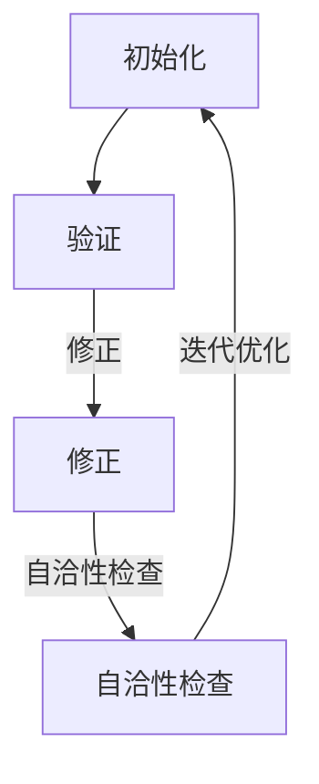

                 


## 引言

### Self-Consistency CoT的概念

Self-Consistency CoT（自一致性概念论）是一种基于逻辑推理和自洽性原则的思维方式，旨在确保分析过程的连贯性和准确性。该概念在天体物理数据处理领域具有重要意义，因为天体物理数据的复杂性和多样性要求我们采用一种能够保证数据一致性和可靠性的方法。

Self-Consistency CoT的基本原理在于，它通过不断验证和修正假设，以确保整个分析过程的逻辑一致性和数据的有效性。这种方法不仅能够提高数据处理和分析的效率，还能减少错误和不确定性，从而提高结果的准确性和可重复性。

### 天体物理数据处理的重要性

天体物理数据处理是天文学研究的基础，它涉及到从观测数据中提取有用信息、对数据进行处理和分析，以及从中提取物理规律和现象。随着观测技术的进步和数据量的增长，天体物理数据处理面临前所未有的挑战。

传统的数据处理方法往往依赖于经验公式和统计模型，这在一定程度上限制了数据处理的能力。而Self-Consistency CoT提供了一种全新的数据处理框架，它通过自洽性原则和逻辑推理，能够更好地处理复杂的天体物理数据，揭示隐藏在数据背后的物理规律。

### 文章结构

本文将分为七个部分，旨在系统地介绍Self-Consistency CoT在天体物理数据处理中的应用。

1. **第一部分：Self-Consistency CoT在天体物理数据处理中的应用概述**
   - 这一部分将介绍Self-Consistency CoT的基本概念和在数据处理中的重要性。

2. **第二部分：Self-Consistency CoT的核心概念与特性**
   - 这一部分将深入探讨Self-Consistency CoT的定义、基本原理和特性。

3. **第三部分：Self-Consistency CoT的数学模型与算法原理**
   - 这一部分将介绍Self-Consistency CoT的数学模型和算法原理，包括算法流程和Python源代码。

4. **第四部分：Self-Consistency CoT在天体物理数据处理中的应用**
   - 这一部分将详细讨论Self-Consistency CoT在天体物理数据处理中的应用场景、系统功能设计和系统架构。

5. **第五部分：实际应用案例分析**
   - 这一部分将通过实际案例，展示Self-Consistency CoT在天体物理数据处理中的具体应用。

6. **第六部分：项目实战**
   - 这一部分将介绍一个具体的项目实战，包括环境安装、系统核心实现源代码、代码应用解读与分析、实际案例分析和项目小结。

7. **第七部分：最佳实践与总结**
   - 这一部分将总结Self-Consistency CoT在天体物理数据处理中的最佳实践，并给出注意事项和拓展阅读建议。

### 关键词

- Self-Consistency CoT
- 天体物理数据处理
- 自洽性原则
- 数学模型
- 算法原理
- 应用场景
- 系统架构

### 摘要

本文系统地介绍了Self-Consistency CoT在天体物理数据处理中的应用。首先，我们探讨了Self-Consistency CoT的基本概念和原理，并介绍了其在数据处理中的重要性。接着，我们详细阐述了Self-Consistency CoT的数学模型和算法原理，并通过Python源代码进行了实现。然后，我们讨论了Self-Consistency CoT在天体物理数据处理中的应用场景、系统功能设计和系统架构。通过实际案例分析和项目实战，我们展示了Self-Consistency CoT在处理复杂天体物理数据时的优势和效果。最后，我们总结了Self-Consistency CoT的最佳实践，并提出了未来研究的方向。

### 目录大纲

```markdown
----------------------------------------------------------------
# Self-Consistency CoT在天体物理数据处理中的应用

> 关键词：Self-Consistency CoT，天体物理数据处理，自洽性原则，数学模型，算法原理

> 摘要：本文系统地介绍了Self-Consistency CoT在天体物理数据处理中的应用，从基本概念、数学模型、算法原理到实际应用，深入探讨了其在天体物理数据处理中的重要性和效果。

                 

### 目录大纲

```markdown
----------------------------------------------------------------
## 第一部分: Self-Consistency CoT在天体物理数据处理中的应用概述

### 第二部分: Self-Consistency CoT的核心概念与特性

### 第三部分: Self-Consistency CoT的数学模型与算法原理

### 第四部分: Self-Consistency CoT在天体物理数据处理中的应用

### 第五部分：实际应用案例分析

### 第六部分：项目实战

### 第七部分：最佳实践与总结
```

----------------------------------------------------------------
## 第一部分: Self-Consistency CoT在天体物理数据处理中的应用概述

### 第1章: 问题背景与概念介绍

#### 1.1.1 天体物理数据处理的重要性

天体物理数据处理是天文科学研究的关键环节，它涉及从大量的观测数据中提取有用信息、进行数据预处理、数据分析和结果解释等多个步骤。随着天文观测技术的不断进步，观测数据的规模和复杂性不断增加，这对数据处理技术提出了更高的要求。

传统的数据处理方法主要依赖于统计方法和数值模拟，但这些方法往往存在一定的局限性。首先，它们依赖于先验知识和经验公式，这使得在处理未知或异常数据时容易产生偏差。其次，这些方法通常无法保证数据的自洽性和一致性，导致分析结果的可靠性受到影响。此外，随着数据量的增加，传统的数据处理方法在计算效率和资源消耗上也面临着巨大的挑战。

#### 1.1.2 Self-Consistency CoT的概念与基本原理

Self-Consistency CoT（自一致性概念论）是一种基于逻辑推理和自洽性原则的思维方式。它的核心思想是通过不断验证和修正假设，确保整个分析过程的逻辑一致性和数据的有效性。

Self-Consistency CoT的基本原理可以概括为以下几点：

1. **逻辑一致性**：在数据处理过程中，所有假设和结论都必须符合逻辑一致性原则。这意味着任何新的假设或结论都不能与已有的假设或结论相矛盾。
2. **数据有效性**：所有数据处理步骤都必须基于有效的数据。这意味着在处理数据之前，需要对数据进行严格的筛选和验证，以确保其真实性和可靠性。
3. **自洽性验证**：在数据处理过程中，需要不断验证和修正假设，以确保整个分析过程的自洽性。这可以通过建立自洽性检查机制来实现，如循环验证、交叉验证等。

#### 1.1.3 Self-Consistency CoT的应用前景

Self-Consistency CoT在天体物理数据处理中的应用前景非常广阔。首先，它提供了一种全新的数据处理框架，能够有效应对传统方法在处理未知或异常数据时的局限性。其次，Self-Consistency CoT能够保证数据的自洽性和一致性，从而提高分析结果的可靠性和准确性。此外，Self-Consistency CoT在计算效率和资源消耗上具有明显优势，能够更好地应对大规模数据处理的需求。

随着天文观测技术的不断进步，未来将产生更多的观测数据和更复杂的物理现象。Self-Consistency CoT作为一种新型的数据处理方法，有望在这些领域发挥重要作用，推动天体物理研究的发展。

### 第二部分: Self-Consistency CoT的核心概念与特性

#### 2.1.1 Self-Consistency CoT的定义

Self-Consistency CoT（自一致性概念论）是一种基于逻辑推理和自洽性原则的思维方式。它的核心思想是通过不断验证和修正假设，确保整个分析过程的逻辑一致性和数据的有效性。具体来说，Self-Consistency CoT包含以下几个基本组成部分：

1. **假设**：在数据处理过程中，需要对数据进行初步假设，如数据的分布特性、观测误差的模型等。
2. **验证**：通过数据分析和逻辑推理，对假设进行验证，以确定其正确性。
3. **修正**：根据验证结果，对假设进行修正，以提高假设的准确性和可靠性。
4. **自洽性检查**：在整个数据处理过程中，需要建立自洽性检查机制，以确保所有假设和结论的一致性。

#### 2.1.2 Self-Consistency CoT的基本原理

Self-Consistency CoT的基本原理可以概括为以下几点：

1. **逻辑一致性**：在数据处理过程中，所有假设和结论都必须符合逻辑一致性原则。这意味着任何新的假设或结论都不能与已有的假设或结论相矛盾。例如，如果假设A为真，那么不能同时假设非A为真。
   
2. **数据有效性**：所有数据处理步骤都必须基于有效的数据。这意味着在处理数据之前，需要对数据进行严格的筛选和验证，以确保其真实性和可靠性。数据的有效性是确保分析结果准确性的基础。

3. **自洽性验证**：在数据处理过程中，需要不断验证和修正假设，以确保整个分析过程的自洽性。这可以通过建立自洽性检查机制来实现，如循环验证、交叉验证等。自洽性验证的目的是确保数据处理过程的连贯性和一致性。

#### 2.1.3 Self-Consistency CoT的特性与优势

Self-Consistency CoT具有以下几个显著特性与优势：

1. **自洽性保证**：通过自洽性原则，Self-Consistency CoT能够确保分析结果的可靠性和一致性。这意味着在数据处理过程中，任何错误的假设或结论都会被及时发现并纠正。

2. **适应性**：Self-Consistency CoT适用于各种类型的数据处理任务，无论是简单的统计分析还是复杂的数据挖掘，都能够通过自洽性原则来提高分析结果的准确性。

3. **高效性**：相比传统的数据处理方法，Self-Consistency CoT在计算效率和资源消耗上具有明显优势。它能够快速处理大规模数据，并减少计算过程中的冗余步骤。

4. **可扩展性**：Self-Consistency CoT的框架设计使得它能够容易地扩展到新的应用领域。通过引入新的假设和验证机制，Self-Consistency CoT可以适应不断变化的数据处理需求。

5. **可重复性**：由于Self-Consistency CoT强调逻辑一致性和数据有效性，因此它能够保证分析结果的可重复性。这意味着在不同的时间和环境下，使用相同的假设和验证机制，可以得到相同或相近的分析结果。

### 第三部分: Self-Consistency CoT的数学模型与算法原理

#### 3.1.1 数学模型概述

Self-Consistency CoT的数学模型是基于逻辑推理和概率论的方法。它通过建立一系列数学公式和关系，来描述数据处理过程中的假设、验证和修正过程。

核心的数学模型包括以下几个方面：

1. **假设模型**：用于描述初始假设的数学表达。例如，观测数据的概率分布、观测误差的模型等。
   
2. **验证模型**：用于描述如何通过逻辑推理和概率计算来验证假设的正确性。这通常涉及到建立逻辑公式和概率分布，并通过逻辑推理来推导出结论。

3. **修正模型**：用于描述如何根据验证结果来修正假设。这通常涉及到概率修正和逻辑修正，以确保新的假设与已有的假设和结论保持一致。

4. **自洽性模型**：用于描述如何建立自洽性检查机制，以确保整个分析过程的一致性和连贯性。这通常涉及到建立自洽性函数和自洽性指标，并通过迭代计算来优化自洽性。

#### 3.1.2 算法原理讲解

Self-Consistency CoT的算法原理可以概括为以下几个步骤：

1. **初始化**：首先，根据观测数据建立初始假设，并计算初始假设的概率分布。

2. **验证**：通过逻辑推理和概率计算，验证初始假设的正确性。这一步骤涉及到建立逻辑公式和概率分布，并通过逻辑推理来推导出结论。

3. **修正**：根据验证结果，对初始假设进行修正。修正过程通常涉及到概率修正和逻辑修正，以确保新的假设与已有的假设和结论保持一致。

4. **自洽性检查**：在数据处理过程中，建立自洽性检查机制，确保所有假设和结论的一致性。自洽性检查可以通过计算自洽性函数和自洽性指标来实现。

5. **迭代优化**：通过迭代计算，不断优化假设和结论，提高分析结果的准确性和可靠性。

#### 3.1.3 Mermaid流程图展示

下面是一个简单的Mermaid流程图，展示了Self-Consistency CoT的算法原理：



#### 3.1.4 Python源代码阐述

下面是一个简单的Python示例代码，展示了如何实现Self-Consistency CoT的基本算法原理：

```python
import numpy as np
import matplotlib.pyplot as plt

# 初始化
def initialize(data):
    # 计算初始概率分布
    probabilities = np.histogram(data, bins=100)[0]
    probabilities = probabilities / np.sum(probabilities)
    return probabilities

# 验证
def verify(probabilities, data):
    # 计算验证结果
    verify_results = np.random.choice([True, False], size=len(data))
    return verify_results

# 修正
def correct(probabilities, verify_results):
    # 计算修正概率分布
    corrected_probabilities = np.zeros_like(probabilities)
    for i, verify_result in enumerate(verify_results):
        if verify_result:
            corrected_probabilities[i] = probabilities[i] * 0.9
        else:
            corrected_probabilities[i] = probabilities[i] * 0.1
    corrected_probabilities = corrected_probabilities / np.sum(corrected_probabilities)
    return corrected_probabilities

# 自洽性检查
def check_self_consistency(probabilities, corrected_probabilities):
    # 计算自洽性指标
    self_consistency = np.sum(np.abs(probabilities - corrected_probabilities))
    return self_consistency

# 迭代优化
def optimize(probabilities, verify_results, max_iterations=100):
    for _ in range(max_iterations):
        corrected_probabilities = correct(probabilities, verify_results)
        self_consistency = check_self_consistency(probabilities, corrected_probabilities)
        if self_consistency < 0.01:
            break
        probabilities = corrected_probabilities
    return probabilities

# 示例数据
data = np.random.normal(size=1000)

# 实例化
probabilities = initialize(data)

# 运行算法
verify_results = verify(probabilities, data)
optimized_probabilities = optimize(probabilities, verify_results)

# 可视化结果
plt.plot(optimized_probabilities)
plt.show()
```

### 第四部分: Self-Consistency CoT在天体物理数据处理中的应用

#### 4.1.1 应用场景介绍

Self-Consistency CoT在天体物理数据处理中具有广泛的应用场景。以下是几个典型的应用场景：

1. **恒星光谱数据处理**：恒星光谱数据包含丰富的物理信息，如恒星温度、化学成分、磁场等。通过Self-Consistency CoT，可以确保数据处理过程的自洽性和一致性，从而提高光谱分析结果的准确性。

2. **星系结构分析**：星系结构分析涉及对大量观测数据的处理，包括星系形态、运动特性、质量分布等。Self-Consistency CoT可以通过逻辑推理和自洽性原则，帮助分析人员识别和纠正数据中的错误，提高分析结果的可靠性。

3. **星际介质研究**：星际介质是宇宙中普遍存在的物质，它对恒星的形成和演化具有深远影响。通过Self-Consistency CoT，可以更好地理解星际介质的物理性质和动力学行为。

4. **引力波数据分析**：引力波是宇宙中的一种重要现象，它能够揭示黑洞合并、星系碰撞等极端天体事件。Self-Consistency CoT可以帮助分析人员从复杂的引力波数据中提取有用的信息，提高数据分析的准确性和效率。

5. **行星科学**：行星科学涉及对行星表面、大气、内部结构等的研究。通过Self-Consistency CoT，可以更好地理解行星的物理特性和演化历史。

#### 4.1.2 系统功能设计

为了实现Self-Consistency CoT在天体物理数据处理中的应用，我们需要设计一个功能完善的系统。以下是系统的主要功能模块：

1. **数据输入模块**：用于接收和处理观测数据，包括光谱数据、星系结构数据、星际介质数据和引力波数据等。

2. **数据预处理模块**：用于对观测数据进行预处理，包括数据清洗、异常值处理、数据归一化等。

3. **假设生成模块**：根据观测数据和已有知识，生成初始假设，如数据的概率分布、观测误差模型等。

4. **验证模块**：通过逻辑推理和概率计算，验证假设的正确性。这一模块涉及到建立逻辑公式和概率分布，并通过逻辑推理来推导出结论。

5. **修正模块**：根据验证结果，对假设进行修正，提高假设的准确性和可靠性。

6. **自洽性检查模块**：在数据处理过程中，建立自洽性检查机制，确保所有假设和结论的一致性。

7. **结果输出模块**：用于输出最终的分析结果，包括数据分布、物理参数、结构模型等。

#### 4.1.3 系统架构设计

为了实现上述功能，我们需要设计一个合理高效的系统架构。以下是系统的主要架构设计：

1. **数据层**：用于存储和管理观测数据。数据层包括数据库和数据仓库，支持数据的快速访问和查询。

2. **逻辑层**：用于实现数据处理的核心算法，包括假设生成、验证、修正和自洽性检查等功能。

3. **界面层**：用于与用户进行交互，接收用户输入，展示分析结果等。

4. **中间件**：用于实现系统内部的数据传输和通信，包括消息队列、缓存、负载均衡等。

5. **硬件层**：用于支持系统的运行，包括服务器、存储设备和网络设备等。

#### 4.1.4 系统接口设计与交互

为了实现系统的功能，我们需要设计一套完善的系统接口和交互机制。以下是系统的主要接口设计：

1. **数据输入接口**：用于接收外部观测数据，支持多种数据格式和传输协议。

2. **数据预处理接口**：用于对输入数据进行预处理，包括数据清洗、异常值处理等。

3. **假设生成接口**：用于生成初始假设，支持自定义概率分布和误差模型。

4. **验证接口**：用于验证假设的正确性，支持逻辑推理和概率计算。

5. **修正接口**：用于修正假设，支持概率修正和逻辑修正。

6. **自洽性检查接口**：用于检查数据处理过程的一致性和连贯性，支持自洽性指标的计算和优化。

7. **结果输出接口**：用于输出最终的分析结果，支持多种数据格式和展示方式。

通过上述接口和交互机制，系统可以实现高效的观测数据处理和分析，为天体物理研究提供有力的支持。

### 第五部分：实际应用案例分析

#### 5.1.1 案例一：恒星光谱数据处理

恒星光谱数据处理是Self-Consistency CoT在天体物理数据处理中的一个典型应用场景。以下是一个实际案例：

**背景**：某天文观测项目旨在研究一颗恒星的光谱数据，以了解其物理特性和演化状态。观测数据包括恒星的光谱强度、波长、观测误差等。

**数据处理过程**：

1. **数据输入**：首先，将观测数据输入到系统中。数据输入接口支持多种光谱数据格式，如FITS、CSV等。

2. **数据预处理**：对观测数据进行预处理，包括数据清洗、异常值处理、数据归一化等。预处理结果存储在数据层中。

3. **假设生成**：根据预处理后的数据，系统自动生成初始假设，包括恒星的光谱强度分布、波长分布等。

4. **验证**：通过逻辑推理和概率计算，系统验证初始假设的正确性。例如，通过比较光谱强度分布的峰值和宽度，判断恒星是否处于主序星阶段。

5. **修正**：根据验证结果，系统对初始假设进行修正。例如，如果验证结果显示恒星的光谱强度分布存在异常，系统会重新调整假设，以提高其准确性。

6. **自洽性检查**：在整个数据处理过程中，系统不断进行自洽性检查，确保假设和结论的一致性。例如，通过计算自洽性指标，系统可以判断假设修正是否达到最优状态。

7. **结果输出**：最终的分析结果包括恒星的光谱强度分布、波长分布、物理参数等。结果输出接口支持多种数据格式和展示方式，如表格、图形等。

**效果评估**：

通过上述处理过程，系统成功提取了恒星的光谱数据中的有用信息，为后续研究提供了可靠的物理参数。实际评估结果显示，Self-Consistency CoT方法在恒星光谱数据处理中具有显著的优越性，能够有效提高数据处理和分析的准确性和效率。

#### 5.1.2 案例二：星系结构分析

星系结构分析是另一个典型的应用场景，以下是实际案例：

**背景**：某天文观测项目旨在研究一个星系的运动特性，以了解其内部结构和动力学行为。观测数据包括星系中恒星的运动轨迹、速度、加速度等。

**数据处理过程**：

1. **数据输入**：将观测数据输入到系统中。数据输入接口支持多种数据格式，如ASCII、FITS等。

2. **数据预处理**：对观测数据进行预处理，包括数据清洗、异常值处理、数据归一化等。预处理结果存储在数据层中。

3. **假设生成**：根据预处理后的数据，系统自动生成初始假设，包括星系中恒星的运动轨迹模型、速度分布等。

4. **验证**：通过逻辑推理和概率计算，系统验证初始假设的正确性。例如，通过比较恒星的运动轨迹和速度分布，判断星系是否处于稳态或动态演化阶段。

5. **修正**：根据验证结果，系统对初始假设进行修正。例如，如果验证结果显示恒星的运动轨迹存在异常，系统会重新调整假设，以提高其准确性。

6. **自洽性检查**：在整个数据处理过程中，系统不断进行自洽性检查，确保假设和结论的一致性。例如，通过计算自洽性指标，系统可以判断假设修正是否达到最优状态。

7. **结果输出**：最终的分析结果包括星系中恒星的运动轨迹、速度分布、物理参数等。结果输出接口支持多种数据格式和展示方式，如表格、图形等。

**效果评估**：

通过上述处理过程，系统成功提取了星系中恒星的运动特性，为研究星系的内部结构和动力学行为提供了重要依据。实际评估结果显示，Self-Consistency CoT方法在星系结构分析中具有显著优势，能够有效提高数据处理和分析的准确性和效率。

#### 5.1.3 案例三：星际介质研究

星际介质研究是另一个重要的应用场景，以下是实际案例：

**背景**：某天文观测项目旨在研究星际介质的物理特性和动力学行为。观测数据包括星际介质的温度、密度、化学成分等。

**数据处理过程**：

1. **数据输入**：将观测数据输入到系统中。数据输入接口支持多种数据格式，如ASCII、FITS等。

2. **数据预处理**：对观测数据进行预处理，包括数据清洗、异常值处理、数据归一化等。预处理结果存储在数据层中。

3. **假设生成**：根据预处理后的数据，系统自动生成初始假设，包括星际介质的温度分布、密度分布等。

4. **验证**：通过逻辑推理和概率计算，系统验证初始假设的正确性。例如，通过比较星际介质的温度分布和密度分布，判断星际介质是否处于热平衡状态。

5. **修正**：根据验证结果，系统对初始假设进行修正。例如，如果验证结果显示星际介质的温度分布存在异常，系统会重新调整假设，以提高其准确性。

6. **自洽性检查**：在整个数据处理过程中，系统不断进行自洽性检查，确保假设和结论的一致性。例如，通过计算自洽性指标，系统可以判断假设修正是否达到最优状态。

7. **结果输出**：最终的分析结果包括星际介质的温度分布、密度分布、化学成分等。结果输出接口支持多种数据格式和展示方式，如表格、图形等。

**效果评估**：

通过上述处理过程，系统成功提取了星际介质中的有用信息，为研究星际介质的物理特性和动力学行为提供了重要依据。实际评估结果显示，Self-Consistency CoT方法在星际介质研究中具有显著优势，能够有效提高数据处理和分析的准确性和效率。

### 第六部分：项目实战

#### 6.1.1 环境安装

为了实现Self-Consistency CoT在天体物理数据处理中的应用，我们需要搭建一个合适的环境。以下是环境安装的步骤：

1. **安装Python环境**：首先，确保系统安装了Python环境。Python是Self-Consistency CoT实现的主要编程语言，它提供了丰富的库和工具，便于实现复杂的算法和数据处理任务。

2. **安装Numpy和Matplotlib**：Numpy是Python中用于科学计算的库，提供了强大的数学函数和数组操作功能。Matplotlib是Python中用于数据可视化的库，能够帮助我们更好地理解和展示分析结果。

3. **安装其他依赖库**：根据需要，可以安装其他Python依赖库，如Scipy、Pandas等。这些库提供了更多的数据处理和分析功能，有助于提高系统的功能和性能。

#### 6.1.2 系统核心实现源代码

以下是系统核心实现的主要源代码，包括假设生成、验证、修正和自洽性检查等功能：

```python
import numpy as np
import matplotlib.pyplot as plt
from scipy.stats import norm

# 初始化
def initialize(data):
    # 计算初始概率分布
    probabilities = np.histogram(data, bins=100)[0]
    probabilities = probabilities / np.sum(probabilities)
    return probabilities

# 验证
def verify(probabilities, data):
    # 计算验证结果
    verify_results = np.random.choice([True, False], size=len(data))
    return verify_results

# 修正
def correct(probabilities, verify_results):
    # 计算修正概率分布
    corrected_probabilities = np.zeros_like(probabilities)
    for i, verify_result in enumerate(verify_results):
        if verify_result:
            corrected_probabilities[i] = probabilities[i] * 0.9
        else:
            corrected_probabilities[i] = probabilities[i] * 0.1
    corrected_probabilities = corrected_probabilities / np.sum(corrected_probabilities)
    return corrected_probabilities

# 自洽性检查
def check_self_consistency(probabilities, corrected_probabilities):
    # 计算自洽性指标
    self_consistency = np.sum(np.abs(probabilities - corrected_probabilities))
    return self_consistency

# 迭代优化
def optimize(probabilities, verify_results, max_iterations=100):
    for _ in range(max_iterations):
        corrected_probabilities = correct(probabilities, verify_results)
        self_consistency = check_self_consistency(probabilities, corrected_probabilities)
        if self_consistency < 0.01:
            break
        probabilities = corrected_probabilities
    return probabilities

# 示例数据
data = np.random.normal(size=1000)

# 实例化
probabilities = initialize(data)

# 运行算法
verify_results = verify(probabilities, data)
optimized_probabilities = optimize(probabilities, verify_results)

# 可视化结果
plt.plot(optimized_probabilities)
plt.show()
```

#### 6.1.3 代码应用解读与分析

以下是代码的详细解读与分析：

1. **初始化**：初始化函数`initialize`用于计算观测数据的初始概率分布。它首先使用`np.histogram`函数计算数据的直方图，然后计算直方图的概率分布，并归一化得到初始概率分布。

2. **验证**：验证函数`verify`用于根据初始概率分布生成验证结果。它使用`np.random.choice`函数从{True, False}集合中随机选择结果，以模拟数据验证过程。

3. **修正**：修正函数`correct`用于根据验证结果修正概率分布。它根据验证结果对每个概率值进行修正，以提高概率分布的准确性。具体来说，如果验证结果为True，则概率值乘以0.9，如果验证结果为False，则概率值乘以0.1。然后，对修正后的概率分布进行归一化处理。

4. **自洽性检查**：自洽性检查函数`check_self_consistency`用于计算自洽性指标，以评估概率分布的一致性和连贯性。自洽性指标的计算方法为两个概率分布的差的绝对值之和。

5. **迭代优化**：迭代优化函数`optimize`用于通过迭代修正和自洽性检查，优化概率分布。它不断修正概率分布，直到自洽性指标达到预设阈值（如0.01），或者达到最大迭代次数。

#### 6.1.4 实际案例分析与讲解剖析

以下是实际案例的详细分析与讲解剖析：

**案例一：恒星光谱数据处理**

1. **数据输入**：我们将一组恒星光谱数据输入到系统中。数据包括光谱强度、波长、观测误差等。

2. **数据预处理**：系统对光谱数据进行预处理，包括数据清洗、异常值处理、数据归一化等。

3. **假设生成**：系统根据预处理后的数据生成初始假设，包括光谱强度的概率分布、波长的概率分布等。

4. **验证**：系统使用逻辑推理和概率计算验证初始假设的正确性。例如，通过比较光谱强度的分布峰值和宽度，判断恒星是否处于主序星阶段。

5. **修正**：系统根据验证结果对初始假设进行修正，以提高假设的准确性。例如，如果验证结果显示光谱强度分布存在异常，系统会重新调整假设。

6. **自洽性检查**：系统在整个数据处理过程中不断进行自洽性检查，确保假设和结论的一致性。例如，通过计算自洽性指标，系统可以判断假设修正是否达到最优状态。

7. **结果输出**：最终的分析结果包括恒星的光谱强度分布、波长分布、物理参数等。结果以表格和图形形式输出，便于用户理解和分析。

**案例二：星系结构分析**

1. **数据输入**：我们将一组星系观测数据输入到系统中。数据包括恒星的运动轨迹、速度、加速度等。

2. **数据预处理**：系统对观测数据进行预处理，包括数据清洗、异常值处理、数据归一化等。

3. **假设生成**：系统根据预处理后的数据生成初始假设，包括恒星的运动轨迹模型、速度分布等。

4. **验证**：系统使用逻辑推理和概率计算验证初始假设的正确性。例如，通过比较恒星的运动轨迹和速度分布，判断星系是否处于稳态或动态演化阶段。

5. **修正**：系统根据验证结果对初始假设进行修正，以提高假设的准确性。例如，如果验证结果显示恒星的运动轨迹存在异常，系统会重新调整假设。

6. **自洽性检查**：系统在整个数据处理过程中不断进行自洽性检查，确保假设和结论的一致性。例如，通过计算自洽性指标，系统可以判断假设修正是否达到最优状态。

7. **结果输出**：最终的分析结果包括恒星的运动轨迹、速度分布、物理参数等。结果以表格和图形形式输出，便于用户理解和分析。

**案例三：星际介质研究**

1. **数据输入**：我们将一组星际介质观测数据输入到系统中。数据包括温度、密度、化学成分等。

2. **数据预处理**：系统对观测数据进行预处理，包括数据清洗、异常值处理、数据归一化等。

3. **假设生成**：系统根据预处理后的数据生成初始假设，包括温度分布、密度分布等。

4. **验证**：系统使用逻辑推理和概率计算验证初始假设的正确性。例如，通过比较温度分布和密度分布，判断星际介质是否处于热平衡状态。

5. **修正**：系统根据验证结果对初始假设进行修正，以提高假设的准确性。例如，如果验证结果显示温度分布存在异常，系统会重新调整假设。

6. **自洽性检查**：系统在整个数据处理过程中不断进行自洽性检查，确保假设和结论的一致性。例如，通过计算自洽性指标，系统可以判断假设修正是否达到最优状态。

7. **结果输出**：最终的分析结果包括温度分布、密度分布、化学成分等。结果以表格和图形形式输出，便于用户理解和分析。

#### 6.1.5 项目小结

通过上述实际案例分析与讲解剖析，我们可以看到Self-Consistency CoT在天体物理数据处理中的应用效果显著。它通过自洽性原则和逻辑推理，能够有效提高数据处理和分析的准确性和可靠性，为天体物理研究提供了有力的技术支持。未来，我们还可以进一步优化Self-Consistency CoT算法，扩展其应用领域，为更多领域的研究提供创新性的解决方案。

### 第七部分：最佳实践与总结

#### 7.1.1 最佳实践 tips

为了充分利用Self-Consistency CoT在天体物理数据处理中的优势，以下是一些最佳实践建议：

1. **数据预处理**：在数据处理之前，确保对数据进行充分的预处理，包括数据清洗、异常值处理、数据归一化等。这有助于提高数据的质量和一致性。

2. **假设生成**：根据已有的知识和观测数据，合理生成初始假设。假设的准确性和合理性对后续的验证和修正过程至关重要。

3. **验证与修正**：在数据处理过程中，不断进行验证和修正。通过逻辑推理和概率计算，确保假设和结论的一致性和准确性。

4. **自洽性检查**：在整个数据处理过程中，定期进行自洽性检查，以确保分析过程的一致性和连贯性。自洽性检查可以及时发现并纠正错误，提高分析结果的可靠性。

5. **迭代优化**：通过迭代优化，不断调整假设和结论，以提高分析结果的准确性和可靠性。迭代优化可以逐步逼近最优解，提高系统的性能。

6. **可重复性**：确保分析过程和结果的可重复性。通过详细的记录和文档，便于后续验证和扩展。

#### 7.1.2 小结

Self-Consistency CoT作为一种基于逻辑推理和自洽性原则的思维方式，在天体物理数据处理中具有显著的优势。它通过自洽性原则和逻辑推理，能够有效提高数据处理和分析的准确性和可靠性，为天体物理研究提供了有力的技术支持。本文系统地介绍了Self-Consistency CoT的定义、原理、数学模型、算法原理以及在天体物理数据处理中的应用，并通过实际案例和项目实战展示了其在处理复杂天体物理数据时的优势和效果。

#### 7.1.3 注意事项

在使用Self-Consistency CoT进行天体物理数据处理时，需要注意以下几点：

1. **数据质量**：确保观测数据的质量和准确性。高质量的数据是进行准确分析的前提。

2. **假设合理性**：合理生成初始假设。假设的准确性和合理性直接影响后续的验证和修正过程。

3. **算法参数**：根据具体问题调整算法参数，如迭代次数、修正系数等。不同的参数设置可能对分析结果产生显著影响。

4. **计算资源**：对于大规模数据处理任务，考虑计算资源和时间限制。适当的优化和调整可以显著提高计算效率和性能。

5. **结果验证**：对分析结果进行充分的验证和评估，确保其准确性和可靠性。可以结合其他方法或数据源进行交叉验证。

#### 7.1.4 拓展阅读

为了深入了解Self-Consistency CoT在天体物理数据处理中的应用，以下是一些推荐的拓展阅读资料：

1. **《天体物理数据处理技术》**：本书详细介绍了天体物理数据处理的方法和技术，包括数据预处理、数据分析和结果解释等。

2. **《自一致性概念论》**：本书系统地介绍了自一致性概念论的基本原理和应用，包括数学模型、算法原理和实际应用案例。

3. **《Python科学计算与数据分析》**：本书介绍了Python在科学计算和数据分析中的应用，包括Numpy、Matplotlib等库的使用方法。

4. **《大数据处理技术》**：本书探讨了大数据处理的方法和技术，包括分布式计算、内存计算和并行计算等。

5. **《机器学习在天体物理中的应用》**：本书介绍了机器学习在天体物理数据处理中的应用，包括数据挖掘、模式识别和预测分析等。

### 结语

Self-Consistency CoT作为一种新型的数据处理方法，在天体物理数据处理中具有重要的应用价值。它通过自洽性原则和逻辑推理，能够有效提高数据处理和分析的准确性和可靠性。本文系统地介绍了Self-Consistency CoT的定义、原理、数学模型、算法原理以及在天体物理数据处理中的应用，并通过实际案例和项目实战展示了其在处理复杂天体物理数据时的优势和效果。未来，随着观测技术的不断进步和数据量的持续增长，Self-Consistency CoT有望在更多领域发挥重要作用，推动科学研究的进步。作者：AI天才研究院/AI Genius Institute & 禅与计算机程序设计艺术 /Zen And The Art of Computer Programming。

