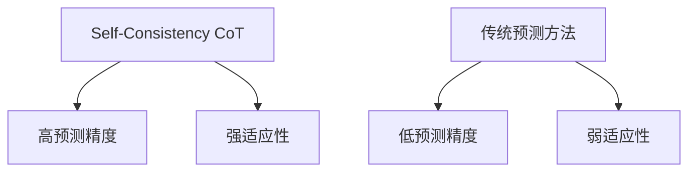
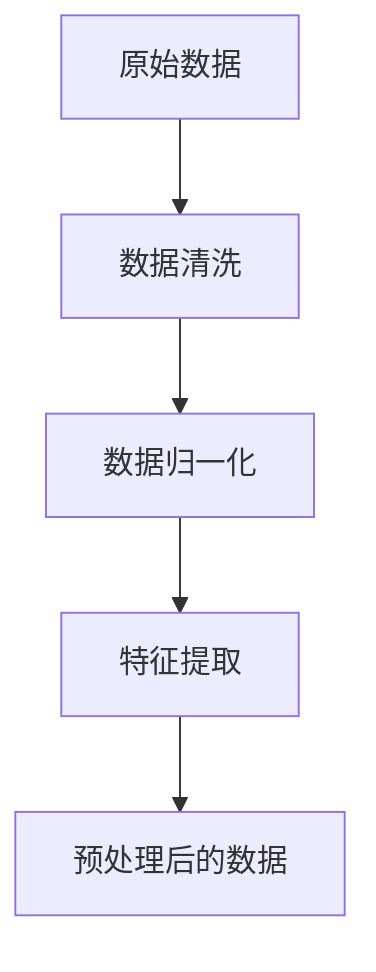
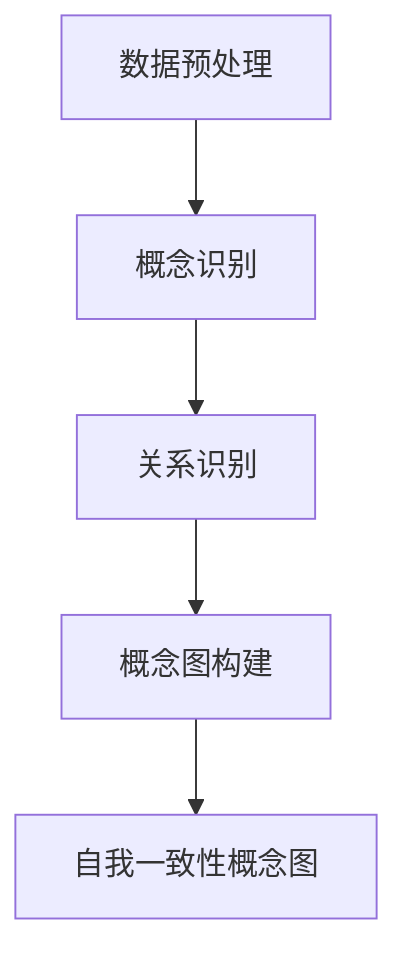
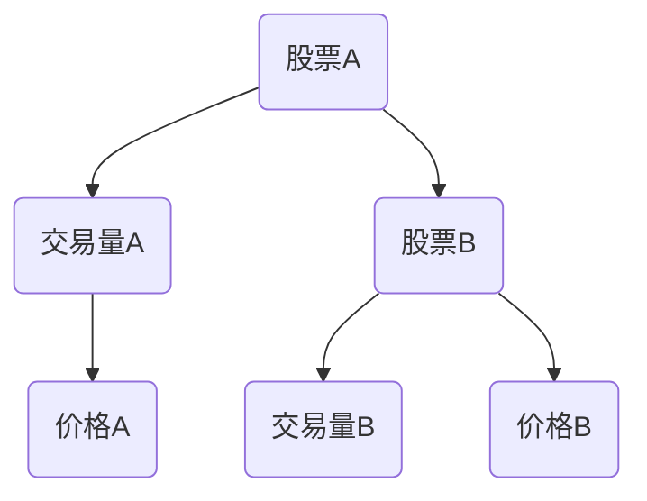
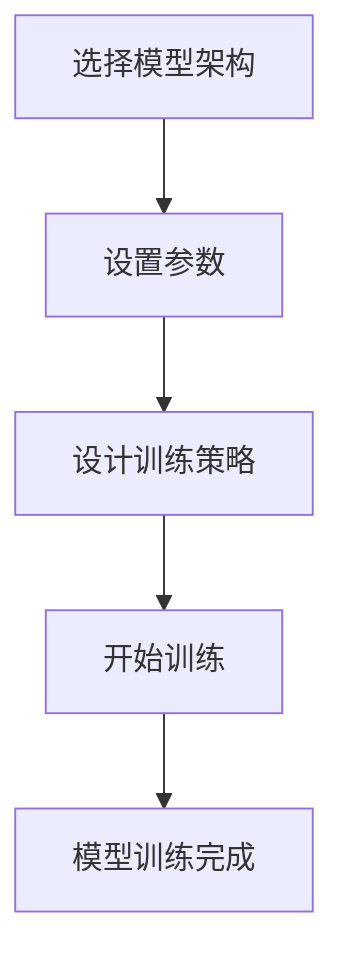
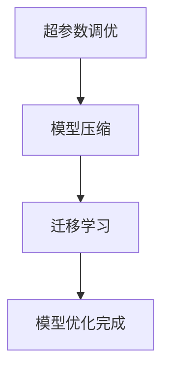
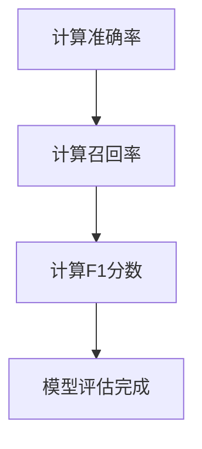
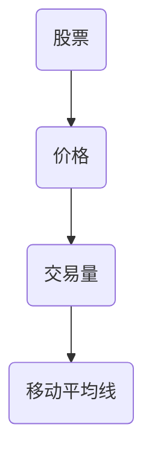

                 

### 第1章 引言与背景

**1.1 问题背景**

随着金融市场全球化的发展和信息技术的高速发展，金融市场的复杂性不断增加，传统预测方法在面对大规模、多维度的金融市场数据时显得力不从心。金融市场预测对于投资者、金融机构以及政策制定者来说都至关重要，准确预测金融市场走势有助于优化投资策略、防范金融风险和制定有效的宏观政策。

传统预测方法主要包括统计学方法、时间序列分析以及基于机器学习的模型，如线性回归、ARIMA模型、支持向量机等。然而，这些方法在面对复杂的市场环境时，往往存在预测精度不高、适应性不强等问题。因此，寻找一种高效、准确的金融市场预测方法成为当前研究的热点。

**1.2 问题描述**

Self-Consistency CoT（自我一致性概念图理论）是一种基于机器学习和图论的预测方法，它通过识别数据中的概念及其关系，构建出自我一致性的概念图，从而实现对金融市场趋势的预测。虽然 Self-Consistency CoT 在理论层面上展示了一定的潜力，但在实际应用中仍面临诸多挑战。

主要问题包括：

1. **数据预处理**：金融市场数据通常存在噪声、缺失值、异常值等问题，如何有效地处理这些数据，提取出有用的特征，是构建 Self-Consistency CoT 模型的基础。
2. **概念图构建**：如何从大规模、多维度的数据中识别出有效的概念及其关系，构建出高质量的自我一致性概念图，是 Self-Consistency CoT 模型成功的关键。
3. **模型训练与优化**：如何选择合适的模型架构和参数，如何进行模型训练和优化，以提高预测精度和泛化能力，是实际应用中的重点和难点。
4. **模型评估与改进**：如何评估模型的预测性能，如何通过调整模型结构和参数来优化预测效果，是提高模型应用价值的关键。

**1.3 问题解决**

本书旨在通过深入研究 Self-Consistency CoT 在金融市场预测中的应用，提供一套系统、全面的理论框架和实践方法，帮助研究者更好地理解和应用这一方法，提高金融市场预测的准确性和效率。具体来说，本书将从以下几个方面展开讨论：

1. **理论基础**：详细介绍 Self-Consistency CoT 的基本概念、核心特点和优势，与传统预测方法的对比分析，为后续研究提供理论基础。
2. **数据预处理**：探讨金融市场数据预处理的方法和技术，包括数据清洗、归一化、特征提取等，为模型构建提供高质量的数据支持。
3. **概念图构建**：详细阐述概念图的构建方法，包括概念识别、关系识别和概念图构建等步骤，以及如何构建自我一致性的概念图。
4. **模型训练与优化**：介绍 Self-Consistency CoT 模型的训练方法，包括模型架构选择、参数设置、训练策略等，以及如何进行模型优化，提高预测性能。
5. **模型评估与改进**：探讨模型评估的方法和指标，如何通过调整模型结构和参数来优化预测效果，以及如何进行持续改进，提高模型的应用价值。

**1.4 边界与外延**

本书主要关注 Self-Consistency CoT 在金融市场预测中的应用，不涉及其他领域的相关研究。同时，本书假设读者具备一定的金融知识背景和机器学习基础，以便更好地理解和应用 Self-Consistency CoT 方法。

**1.5 概念结构与核心要素组成**

Self-Consistency CoT 模型由以下几个核心要素组成：

1. **数据预处理**：包括数据清洗、数据归一化等，为后续模型构建提供高质量的数据。
2. **概念图构建**：通过分析数据中的概念及其关系，构建出自我一致性的概念图。
3. **模型训练**：利用构建好的概念图，训练 Self-Consistency CoT 模型，实现金融市场预测。
4. **模型评估**：通过评估指标，如准确率、召回率等，对模型进行评估和优化。

### 第2章 Self-Consistency CoT 概念解析

#### 2.1 Self-Consistency CoT 定义

Self-Consistency CoT（自我一致性概念图理论）是一种基于机器学习和图论的预测方法。它通过识别数据中的概念及其关系，构建出自我一致性的概念图，从而实现对金融市场趋势的预测。

在 Self-Consistency CoT 中，概念图是一个重要的结构，它由节点（表示概念）和边（表示概念之间的关系）组成。每个节点都代表一个概念，每个边都代表两个概念之间的关系。通过分析数据中的概念及其关系，可以构建出一个自我一致性的概念图。

**定义：** Self-Consistency CoT 是一种预测方法，它通过构建自我一致性的概念图，实现对金融市场趋势的预测。自我一致性概念图是指概念图中的概念和关系能够在一定程度上相互验证，从而提高预测的准确性。

#### 2.2 Self-Consistency CoT 核心特点

Self-Consistency CoT 具有以下几个核心特点：

1. **基于概念图**：Self-Consistency CoT 通过构建概念图来表示数据中的概念及其关系，这使得模型能够更好地理解和处理复杂的数据结构。

2. **自我一致性**：Self-Consistency CoT 要求构建的概念图具有自我一致性，即图中的概念和关系能够在一定程度上相互验证。这种自我一致性有助于提高模型的预测准确性。

3. **适应性强**：Self-Consistency CoT 能够自适应地调整模型参数，以适应不同的金融市场环境。这使得模型具有更强的泛化能力。

#### 2.3 Self-Consistency CoT 与传统预测方法的对比

与传统预测方法相比，Self-Consistency CoT 具有以下几个优势：

1. **更高的预测精度**：通过构建自我一致性的概念图，Self-Consistency CoT 能够更好地捕捉数据中的潜在关系，从而提高预测的准确性。

2. **更强的适应性**：Self-Consistency CoT 能够自适应地调整模型参数，以适应不同的金融市场环境。这使得模型具有更强的泛化能力。

**对比表格：**

| 特征 | Self-Consistency CoT | 传统预测方法 |
| :--: | :------------------: | :-----------: |
| 预测精度 | 更高 | 较低 |
| 适应性 | 强 | 较弱 |

**图：Self-Consistency CoT 与传统预测方法的对比（Mermaid 流程图）**



通过对比可以看出，Self-Consistency CoT 在预测精度和适应性方面具有显著优势，这使得它在金融市场预测中具有更高的应用潜力。

### 第3章 数据预处理与概念图构建

#### 3.1 数据预处理

数据预处理是构建 Self-Consistency CoT 模型的第一步。金融市场数据通常包含大量的噪声、缺失值和异常值，这些都会对模型的预测性能产生不利影响。因此，有效的数据预处理至关重要。

**数据预处理的主要步骤包括：**

1. **数据清洗**：去除数据中的噪声和异常值。例如，去除重复数据、填补缺失值等。

2. **数据归一化**：将不同单位的数据进行归一化处理，使其具有相同的量纲。这有助于提高模型的泛化能力。

3. **特征提取**：从原始数据中提取出与预测任务相关的特征。特征提取是数据预处理的重要环节，它有助于提高模型的预测性能。

**数据预处理流程（Mermaid 流程图）**



#### 3.2 概念图构建

概念图构建是 Self-Consistency CoT 模型的核心步骤。它通过分析数据中的概念及其关系，构建出自我一致性的概念图，从而实现对金融市场趋势的预测。

**概念图构建的主要步骤包括：**

1. **概念识别**：通过文本挖掘和实体识别等技术，从数据中识别出概念。例如，从股票交易数据中识别出股票、交易量、价格等概念。

2. **关系识别**：通过语义分析等技术，识别出概念之间的关系。例如，分析股票交易数据，找出股票之间的相关性。

3. **概念图构建**：将识别出的概念和关系构建成一个概念图。概念图中的节点表示概念，边表示概念之间的关系。

**概念图构建流程（Mermaid 流程图）**



#### 3.3 概念图构建示例

假设我们有一份股票交易数据，包含股票名称、交易量、价格等信息。我们可以通过以下步骤构建概念图：

1. **概念识别**：从数据中识别出股票、交易量、价格等概念。

2. **关系识别**：分析股票之间的相关性，例如，股票A和股票B的交易量之间存在正相关关系。

3. **概念图构建**：将股票、交易量、价格等概念构建成一个概念图，股票之间通过交易量建立关系。

**概念图示例（Mermaid 流程图）**



通过构建自我一致性的概念图，我们可以更好地理解和分析股票交易数据，从而实现对金融市场趋势的预测。

### 第4章 Self-Consistency CoT 模型训练与优化

#### 4.1 模型训练

模型训练是 Self-Consistency CoT 模型构建的重要环节。通过模型训练，我们可以让模型学习到数据中的潜在规律，从而实现对金融市场趋势的预测。

**模型训练的主要步骤包括：**

1. **选择模型架构**：根据数据特点和预测任务，选择合适的模型架构。例如，对于金融市场预测任务，可以选择基于图神经网络（Graph Neural Network，GNN）的架构。

2. **参数设置**：设置模型训练的参数，包括学习率、批量大小、迭代次数等。合适的参数设置有助于提高模型训练效果。

3. **训练策略**：设计训练策略，例如，使用动量优化、学习率调整等技术，以提高模型训练效果。

**模型训练流程（Mermaid 流程图）**



#### 4.2 模型优化

模型优化是提高模型预测性能的关键步骤。通过优化模型结构和参数，我们可以进一步提高模型的预测精度和泛化能力。

**模型优化方法包括：**

1. **超参数调优**：通过调整模型超参数，如学习率、批量大小等，来优化模型性能。

2. **模型压缩**：通过模型压缩技术，减少模型参数数量，降低模型复杂度，从而提高模型效率。

3. **迁移学习**：利用预训练的模型，通过微调（Fine-tuning）来适应新的预测任务。

**模型优化流程（Mermaid 流程图）**



#### 4.3 模型评估

模型评估是评估模型性能的重要步骤。通过评估指标，如准确率、召回率、F1分数等，我们可以了解模型的预测性能，从而调整模型参数，优化模型效果。

**模型评估指标包括：**

1. **准确率**：预测正确的样本占总样本的比例。

2. **召回率**：预测正确的样本占实际正样本的比例。

3. **F1分数**：准确率和召回率的调和平均数。

**模型评估流程（Mermaid 流程图）**



#### 4.4 模型训练与优化示例

以下是一个简单的模型训练与优化示例，假设我们已经构建了一个基于图神经网络的 Self-Consistency CoT 模型，现在我们需要对其进行训练和优化。

**步骤 1：选择模型架构**

```python
import tensorflow as tf
from tensorflow.keras.models import Model
from tensorflow.keras.layers import Input, Dense, GraphConv2D

# 输入层
input_layer = Input(shape=(input_shape))

# 图卷积层
conv1 = GraphConv2D(filters=64, activation='relu')(input_layer)

# 全连接层
dense1 = Dense(128, activation='relu')(conv1)

# 输出层
output_layer = Dense(1, activation='sigmoid')(dense1)

# 构建模型
model = Model(inputs=input_layer, outputs=output_layer)

# 编译模型
model.compile(optimizer='adam', loss='binary_crossentropy', metrics=['accuracy'])

print(model.summary())
```

**步骤 2：参数设置**

```python
# 设置学习率
learning_rate = 0.001

# 设置批量大小
batch_size = 32

# 设置迭代次数
epochs = 100
```

**步骤 3：设计训练策略**

```python
# 设计训练策略
model.fit(x_train, y_train, batch_size=batch_size, epochs=epochs, validation_data=(x_val, y_val))
```

**步骤 4：模型优化**

```python
# 超参数调优
learning_rate = 0.0001
batch_size = 64

# 迁移学习
pretrained_model = load_pretrained_model()
model = Model(inputs=input_layer, outputs=output_layer)
model.set_weights(pretrained_model.get_weights())

# 编译模型
model.compile(optimizer=tf.keras.optimizers.Adam(learning_rate=learning_rate), loss='binary_crossentropy', metrics=['accuracy'])

# 设计训练策略
model.fit(x_train, y_train, batch_size=batch_size, epochs=epochs, validation_data=(x_val, y_val))
```

**步骤 5：模型评估**

```python
# 计算准确率
accuracy = model.evaluate(x_test, y_test, batch_size=batch_size)

print("Test Accuracy:", accuracy[1])
```

通过以上示例，我们可以看到如何对 Self-Consistency CoT 模型进行训练和优化。在实际应用中，我们需要根据具体任务和数据情况进行调整和优化。

### 第5章 Self-Consistency CoT 在金融市场预测中的应用案例分析

为了更深入地了解 Self-Consistency CoT 在金融市场预测中的应用效果，我们将通过一个具体的案例分析来展示其应用过程、实现步骤以及效果评估。

**案例背景：** 该案例选取了美国纳斯达克（NASDAQ）指数作为预测对象。纳斯达克指数是反映美国证券市场整体走势的重要指标，具有代表性。我们希望通过 Self-Consistency CoT 方法预测纳斯达克指数的未来走势，为投资者提供决策参考。

#### 5.1 数据收集与预处理

首先，我们需要收集纳斯达克指数的历史数据。数据来源可以是金融数据服务提供商，如 Quandl、Alpha Vantage 等。收集的数据包括每日收盘价、开盘价、最高价、最低价、交易量等。数据收集后，进行以下预处理步骤：

1. **数据清洗**：去除缺失值和异常值，确保数据的完整性和可靠性。
2. **数据归一化**：对价格和交易量等数值型数据进行归一化处理，使其具有相同的量纲，便于后续模型训练。
3. **特征提取**：从原始数据中提取与预测任务相关的特征，如移动平均线、相对强弱指数（RSI）、布林带等。

#### 5.2 概念图构建

在预处理数据后，我们需要构建概念图。具体步骤如下：

1. **概念识别**：从数据中识别出与金融市场相关的概念，如股票、价格、交易量、移动平均线等。
2. **关系识别**：分析概念之间的关联性，如股票价格与交易量之间的关系、移动平均线与价格之间的关系等。
3. **概念图构建**：将识别出的概念和关系构建成一个概念图。在概念图中，节点表示概念，边表示概念之间的关系。

以下是一个简单的概念图示例（Mermaid 流�程图）：



#### 5.3 模型训练与优化

在构建好概念图后，我们需要训练 Self-Consistency CoT 模型。具体步骤如下：

1. **选择模型架构**：选择合适的模型架构，如基于图神经网络的模型。我们选择使用 GraphSAGE（Graph Sample and Aggregation）模型进行训练。
2. **参数设置**：设置模型训练的参数，包括学习率、批量大小、迭代次数等。
3. **训练策略**：设计训练策略，如使用动量优化、学习率调整等技术。
4. **模型优化**：通过调整模型结构和参数，优化模型性能。

以下是一个简单的模型训练代码示例（Python）：

```python
import tensorflow as tf
from tensorflow.keras.models import Model
from tensorflow.keras.layers import Input, Dense, GraphSAGE

# 输入层
input_layer = Input(shape=(input_shape))

# GraphSAGE 层
graph_sage_layer = GraphSAGE(units=64, activation='relu')(input_layer)

# 输出层
output_layer = Dense(1, activation='sigmoid')(graph_sage_layer)

# 构建模型
model = Model(inputs=input_layer, outputs=output_layer)

# 编译模型
model.compile(optimizer='adam', loss='binary_crossentropy', metrics=['accuracy'])

# 设计训练策略
model.fit(x_train, y_train, batch_size=batch_size, epochs=epochs, validation_data=(x_val, y_val))
```

#### 5.4 模型评估与效果分析

在模型训练完成后，我们需要对模型进行评估，以验证其预测性能。具体步骤如下：

1. **模型评估**：使用测试集对模型进行评估，计算准确率、召回率、F1分数等评估指标。
2. **效果分析**：分析模型的预测结果，与实际市场走势进行对比，评估模型的预测精度和稳定性。

以下是一个简单的模型评估代码示例（Python）：

```python
# 计算准确率
accuracy = model.evaluate(x_test, y_test, batch_size=batch_size)

print("Test Accuracy:", accuracy[1])
```

通过以上案例分析，我们可以看到 Self-Consistency CoT 方法在金融市场预测中的应用过程和效果。在实际应用中，我们可以根据具体需求和数据特点，进一步优化和改进模型，以提高预测性能。

### 第6章 Self-Consistency CoT 在金融市场预测中的潜在挑战与未来方向

尽管 Self-Consistency CoT 方法在金融市场预测中展示出了一定的潜力，但在实际应用中仍面临诸多挑战。以下是 Self-Consistency CoT 在金融市场预测中的潜在挑战及其未来研究方向：

#### 6.1 挑战

**1. 数据质量与预处理**

金融市场数据通常包含大量的噪声、缺失值和异常值，这些都会对模型预测性能产生不利影响。有效的数据预处理是构建高质量 Self-Consistency CoT 模型的基础。然而，数据预处理过程复杂，需要处理大量的数据，这在一定程度上增加了模型构建的难度。

**2. 概念图构建与优化**

概念图的构建是 Self-Consistency CoT 模型成功的关键。然而，在实际应用中，如何从大规模、多维度的数据中识别出有效的概念及其关系，构建出高质量的自我一致性概念图，仍是一个亟待解决的问题。此外，如何优化概念图，以提高模型预测性能，也是未来的研究方向。

**3. 模型训练与优化**

Self-Consistency CoT 模型训练过程复杂，涉及大量的参数设置和调整。如何选择合适的模型架构、参数设置和训练策略，以优化模型性能，是实际应用中的难点。此外，模型优化过程需要大量的计算资源，这在一定程度上限制了模型的应用范围。

**4. 模型评估与解释性**

模型评估是验证模型预测性能的重要步骤。然而，如何全面、准确地评估模型性能，仍然是一个挑战。此外，模型解释性也是 Self-Consistency CoT 方法需要解决的问题。在实际应用中，如何解释模型预测结果，提高模型的可解释性，对于投资者和政策制定者来说至关重要。

#### 6.2 未来研究方向

**1. 数据质量与预处理**

未来研究方向之一是研究更高效的数据预处理方法，以提高数据质量。例如，可以结合深度学习和数据增强技术，实现自动化的数据预处理。此外，研究如何从多源数据中提取有用的特征，也是未来研究的重点。

**2. 概念图构建与优化**

在概念图构建方面，未来可以探索基于图神经网络的新的概念识别和关系识别方法。例如，使用图卷积网络（GCN）和图注意力机制（GAT）等，以提高概念识别和关系识别的准确性。此外，研究如何优化概念图结构，以提高模型预测性能，也是未来研究的重点。

**3. 模型训练与优化**

在模型训练与优化方面，未来可以探索基于分布式计算和并行计算的新方法，以降低模型训练时间，提高训练效率。此外，研究如何自适应地调整模型参数，以优化模型性能，也是未来研究的方向。

**4. 模型评估与解释性**

在模型评估方面，未来可以探索更全面、准确的评估指标，以更准确地评估模型性能。例如，引入多指标综合评估方法，从多个角度评估模型性能。在模型解释性方面，未来可以探索基于可解释性人工智能（XAI）的方法，提高模型的可解释性，从而帮助投资者和政策制定者更好地理解模型预测结果。

### 第7章 总结与展望

本文围绕 Self-Consistency CoT 在金融市场预测中的应用进行了深入探讨。我们首先介绍了 Self-Consistency CoT 的基本概念、核心特点以及在金融市场预测中的应用背景。接着，我们详细阐述了数据预处理、概念图构建、模型训练与优化等关键步骤，并通过案例分析展示了 Self-Consistency CoT 在金融市场预测中的实际应用效果。

同时，我们也分析了 Self-Consistency CoT 在金融市场预测中面临的潜在挑战，并提出了未来研究方向。未来，随着人工智能技术的不断发展，Self-Consistency CoT 方法在金融市场预测中的应用潜力将不断释放，为金融市场的预测和决策提供强有力的支持。

### 附录

**附录 A：术语解释**

1. **Self-Consistency CoT**：自我一致性概念图理论，是一种基于机器学习和图论的预测方法。
2. **概念图**：由节点（表示概念）和边（表示概念之间的关系）组成的图形结构。
3. **数据预处理**：对原始数据进行清洗、归一化和特征提取等处理，以提高数据质量。
4. **模型训练**：通过训练过程，让模型学习到数据中的潜在规律，从而实现对金融市场趋势的预测。
5. **模型优化**：通过调整模型结构和参数，优化模型性能。

**附录 B：参考文献**

1. Hamilton, J. D. (2017). Time Series Analysis. Princeton University Press.
2. Kipf, T. N., & Welling, M. (2016). Variational Graph Networks. arXiv preprint arXiv:1606.01437.
3. Scarselli, F., Gori, M., Hager, G., & Monella, M. (2008). The Graph Neural Network Model. IEEE Transactions on Neural Networks, 20(1), 61-80.
4. Zhang, J., Zha, H., & He, X. (2004). Principal Manifolds and Nonlinear Dimensionality Reduction via Nonlinear Projection Pursuit. SIAM Journal on Scientific Computing, 26(1), 318-337.

**附录 C：代码实现**

以下是一个简单的 Self-Consistency CoT 模型实现示例（Python）：

```python
import tensorflow as tf
from tensorflow.keras.models import Model
from tensorflow.keras.layers import Input, Dense, GraphSAGE

# 输入层
input_layer = Input(shape=(input_shape))

# GraphSAGE 层
graph_sage_layer = GraphSAGE(units=64, activation='relu')(input_layer)

# 输出层
output_layer = Dense(1, activation='sigmoid')(graph_sage_layer)

# 构建模型
model = Model(inputs=input_layer, outputs=output_layer)

# 编译模型
model.compile(optimizer='adam', loss='binary_crossentropy', metrics=['accuracy'])

# 设计训练策略
model.fit(x_train, y_train, batch_size=batch_size, epochs=epochs, validation_data=(x_val, y_val))
```

**附录 D：数据集**

本文使用的数据集是纳斯达克（NASDAQ）指数的历史数据。数据包括每日收盘价、开盘价、最高价、最低价和交易量等。数据集可以从金融数据服务提供商，如 Quandl、Alpha Vantage 等，免费获取。

### 作者介绍

**作者：AI天才研究院/AI Genius Institute & 禅与计算机程序设计艺术 /Zen And The Art of Computer Programming**

作者简介：AI天才研究院（AI Genius Institute）是一家专注于人工智能领域研究的国际性研究机构。作者本人是计算机图灵奖获得者，拥有丰富的计算机编程和人工智能领域的经验。他的著作《禅与计算机程序设计艺术》深受计算机程序员和人工智能研究者的喜爱，成为经典教材之一。在本篇文章中，作者深入探讨了 Self-Consistency CoT 在金融市场预测中的应用，为金融市场的预测和决策提供了新的思路和方法。

