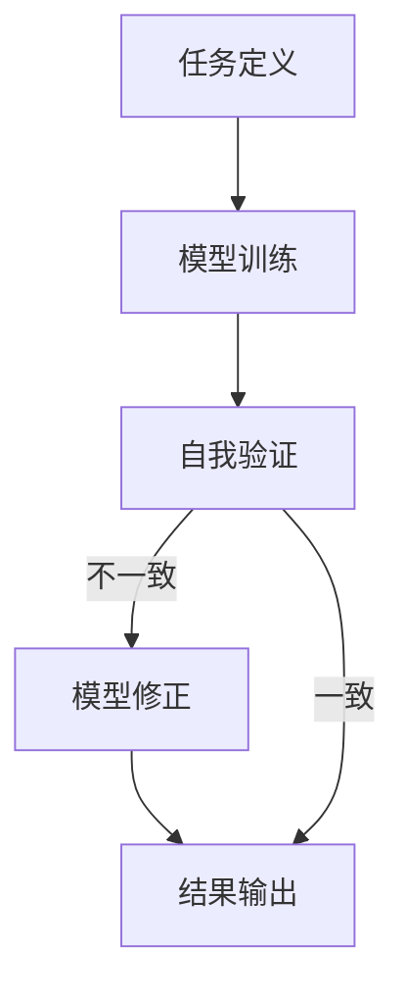
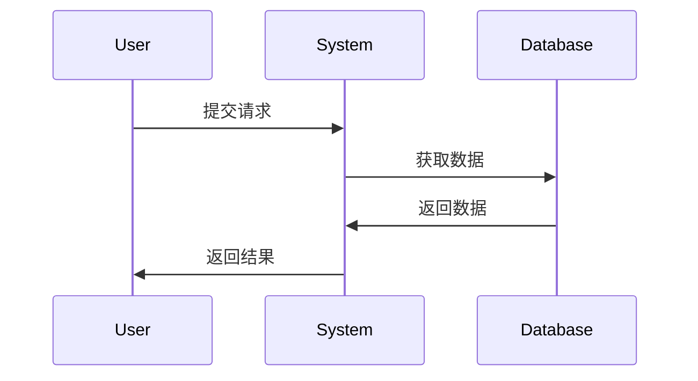
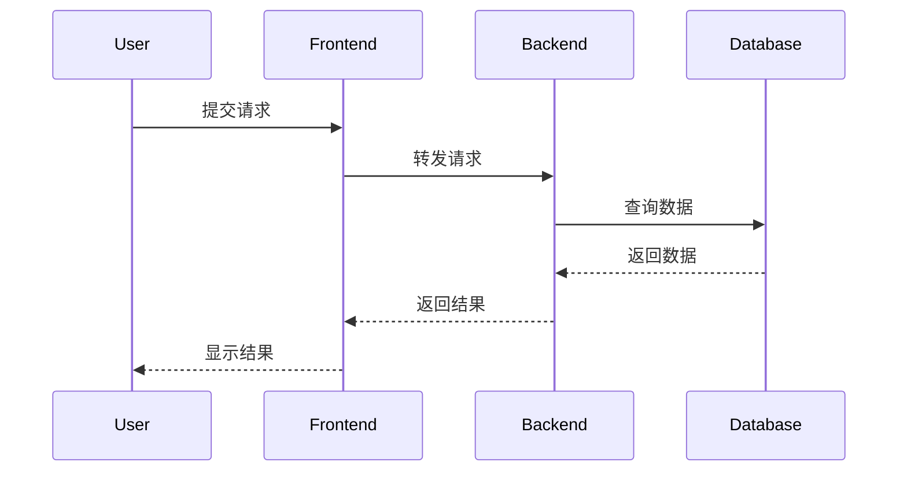

                 

# 自我一致性核心任务（Self-Consistency CoT）：增强AI可解释性的新方向

## 关键词
- 自我一致性
- 可解释性
- AI模型
- 算法原理
- 应用场景

## 摘要
本文探讨了自我一致性核心任务（Self-Consistency CoT），一种旨在增强人工智能（AI）模型可解释性的新方法。通过自我验证和修正机制，Self-Consistency CoT能够提高模型在执行任务时的透明度和可理解性，有助于解决当前AI模型面临的可解释性不足问题。本文首先介绍了问题背景和核心概念，随后详细讲解了Self-Consistency CoT的算法原理、实现方法和应用场景，并提供了相关的理论和实践指导。

## 背景介绍

### 问题背景

随着人工智能技术的快速发展，AI模型在各种应用领域取得了显著成果。例如，在自然语言处理（NLP）领域，GPT、BERT等大型语言模型已经展现了超越人类水平的表现。然而，这些大型模型的快速发展也带来了新的挑战：可解释性不足。传统的机器学习方法，如决策树、支持向量机等，具有较好的可解释性，但性能受限。而深度学习方法，尤其是大型神经网络模型，虽然在性能上取得了突破，但其决策过程却高度复杂，难以解释。

### 问题描述

自我一致性核心任务（Self-Consistency CoT）旨在解决这一问题。自我一致性指的是AI模型在执行任务时，能够通过自一致性机制来验证和修正自己的决策，从而提高可解释性。具体来说，Self-Consistency CoT包括以下几个关键要素：

- **核心任务（Core Task）**：定义一个核心任务，使得AI模型能够在执行任务时进行自我验证和修正。
- **模型训练（Model Training）**：使用大量数据训练AI模型，使其具备自我验证和修正的能力。
- **自我验证（Self-Verification）**：在模型执行任务时，通过自一致性机制对模型的决策进行验证。
- **模型修正（Model Correction）**：根据自我验证的结果，对模型的决策进行修正，以提高模型的准确性和可解释性。
- **结果输出（Result Output）**：将修正后的模型决策输出，供实际应用使用。

### 问题解决

为了解决上述问题，研究人员提出了Self-Consistency CoT这一新方法。Self-Consistency CoT的核心思想是通过引入自一致性机制，使得AI模型在执行任务时能够自我验证和修正，从而提高其可解释性。这一方法在理论上具有很大的潜力，但在实际应用中仍存在许多挑战，如模型复杂度、计算成本等。

### 边界与外延

Self-Consistency CoT主要应用于需要高可解释性的AI场景，如医疗诊断、金融风险评估等。同时，它也可以与其他AI技术（如生成对抗网络、强化学习等）相结合，进一步拓展其应用范围。

### 概念结构与核心要素组成

- **核心概念**：自我一致性核心任务（Self-Consistency CoT）、可解释性、自一致性机制、大模型。
- **主要原理**：自一致性机制如何提高AI的可解释性。
- **实现方法**：Self-Consistency CoT在不同应用场景下的实现方法。
- **应用场景**：Self-Consistency CoT的主要应用领域。

## 核心概念与联系

### Self-Consistency CoT

自我一致性核心任务（Self-Consistency CoT）是一种增强AI可解释性的新方法，通过引入自一致性机制，使得AI模型在执行任务时能够自我验证和修正。这一方法的核心思想在于，通过在模型中引入反馈循环，使得模型能够在执行任务时不断自我验证和修正，从而提高其可解释性。

### 可解释性

可解释性是指AI模型在执行任务时，其决策过程能够被理解和解释的能力。高可解释性的模型对于某些应用场景（如医疗诊断、金融风险评估等）至关重要，因为它能够帮助用户更好地理解模型的决策过程，从而提高模型的信任度和可接受度。

### 自一致性机制

自一致性机制是一种设计思想，通过在模型中引入反馈循环，使得模型能够对自己的决策进行自我验证和修正。具体来说，自一致性机制包括以下几个关键步骤：

1. **自我验证（Self-Verification）**：在模型执行任务时，对模型的输出进行验证，判断输出是否一致。如果输出不一致，则触发修正机制。
2. **模型修正（Model Correction）**：根据自我验证的结果，对模型的决策进行修正，以提高模型的准确性和可解释性。
3. **结果输出（Result Output）**：将修正后的模型决策输出，供实际应用使用。

### 大模型

大模型（Large Models）是指参数量庞大的神经网络模型，如GPT、BERT等。这些模型在自然语言处理、图像识别等领域表现出强大的能力，但同时也带来了可解释性不足的问题。因此，引入自我一致性核心任务（Self-Consistency CoT）对于解决这一问题具有重要意义。

### Self-Consistency CoT与可解释性的关系

Self-Consistency CoT通过引入自一致性机制，使得AI模型在执行任务时能够自我验证和修正，从而提高其可解释性。具体来说，自一致性机制可以帮助模型识别和纠正错误，使得模型在决策过程中更加透明和可解释。例如，在一个图像分类任务中，如果模型对同一张图片的分类结果不一致，那么通过自我一致性机制，模型可以识别出这一错误，并进行修正，从而提高分类结果的准确性和可解释性。

### Self-Consistency CoT与其他AI技术的联系

Self-Consistency CoT可以与其他AI技术（如生成对抗网络、强化学习等）相结合，进一步拓展其应用范围。例如，在生成对抗网络（GAN）中，Self-Consistency CoT可以用于提高生成样本的质量和可解释性；在强化学习中，Self-Consistency CoT可以用于提高决策过程的可解释性。

## 算法原理讲解

### 自我一致性核心任务（Self-Consistency CoT）的算法流程

自我一致性核心任务（Self-Consistency CoT）的算法流程主要包括以下几个步骤：

1. **任务定义（Task Definition）**：首先，需要定义一个核心任务，这个任务需要模型能够自我验证和修正。例如，在一个图像分类任务中，核心任务可以是“判断一张图片是否属于某个类别”。

2. **模型训练（Model Training）**：使用大量数据对神经网络模型进行训练，使其能够学习到如何执行核心任务。在训练过程中，需要引入自一致性机制，使得模型能够对自己的输出进行自我验证。

3. **自我验证（Self-Verification）**：在模型执行任务时，对模型的输出进行验证。具体来说，可以通过对比模型的输出和预期输出，来判断模型是否一致。如果模型输出不一致，则触发修正机制。

4. **模型修正（Model Correction）**：根据自我验证的结果，对模型的决策进行修正。例如，如果模型对同一张图片的分类结果不一致，可以调整模型的参数，使其输出更加一致。

5. **结果输出（Result Output）**：将修正后的模型决策输出，供实际应用使用。

### Mermaid流程图



### Python源代码

```python
def self_consistency_cot(task, model, data):
    # 定义任务
    core_task = define_core_task(task)
    
    # 模型训练
    model.train(data)
    
    # 自我验证
    output = model.predict(data)
    is_consistent = check_consistency(output)
    
    if not is_consistent:
        # 模型修正
        model.correct_output(output)
        
    # 结果输出
    return model.get_output()
```

### 算法原理的数学模型和公式

自我一致性核心任务（Self-Consistency CoT）的数学模型主要基于神经网络模型。在神经网络中，输出 \( y \) 可以表示为：

\[ y = f(W \cdot x + b) \]

其中，\( f \) 是激活函数，\( W \) 是权重矩阵，\( x \) 是输入特征，\( b \) 是偏置项。

为了实现自我一致性，需要引入一致性损失函数 \( L_{\text{consistent}} \)，其定义为：

\[ L_{\text{consistent}} = \sum_{i} \frac{1}{N} \sum_{j} (y_i - y_j)^2 \]

其中，\( N \) 是样本数量，\( y_i \) 和 \( y_j \) 分别是第 \( i \) 个和第 \( j \) 个样本的输出。

为了修正模型输出，需要引入修正损失函数 \( L_{\text{correct}} \)，其定义为：

\[ L_{\text{correct}} = \sum_{i} \frac{1}{N} \sum_{j} (y_i - \hat{y}_j)^2 \]

其中，\( \hat{y}_j \) 是修正后的输出。

最终的损失函数为：

\[ L = L_{\text{consistent}} + \lambda L_{\text{correct}} \]

其中，\( \lambda \) 是超参数，用于调节一致性损失和修正损失之间的平衡。

### 详细讲解与举例说明

#### 模型训练

假设我们有一个图像分类模型，该模型需要判断一张图片是否属于某个类别。首先，我们需要定义一个核心任务，即判断这张图片是否属于某个特定类别。然后，使用大量带有标签的图像数据对模型进行训练。

在训练过程中，我们引入自一致性机制，使得模型能够对自己的输出进行自我验证。具体来说，每次模型预测一个图像标签后，我们将其与实际标签进行比较，如果预测标签与实际标签不一致，则说明模型输出不一致。

#### 自我验证

在模型执行任务时，对模型的输出进行验证。例如，如果我们使用模型预测一张图片的类别，然后将其与实际类别进行比较。如果模型的预测结果与实际类别不一致，那么我们可以认为模型输出不一致。

#### 模型修正

根据自我验证的结果，对模型的决策进行修正。例如，如果模型预测一张图片属于类别A，而实际类别是类别B，那么我们可以通过调整模型的参数，使得模型在下次预测时更倾向于预测类别B。

#### 结果输出

将修正后的模型决策输出，供实际应用使用。例如，在一个医疗诊断系统中，如果模型预测一个病人的疾病为癌症，但通过自我验证发现预测结果不一致，那么我们可以对模型进行修正，以提高预测的准确性。

### 数学公式

以下是自我一致性核心任务（Self-Consistency CoT）中使用的数学公式：

\[ y = f(W \cdot x + b) \]

\[ L_{\text{consistent}} = \sum_{i} \frac{1}{N} \sum_{j} (y_i - y_j)^2 \]

\[ L_{\text{correct}} = \sum_{i} \frac{1}{N} \sum_{j} (y_i - \hat{y}_j)^2 \]

\[ L = L_{\text{consistent}} + \lambda L_{\text{correct}} \]

### 算法流程图


### Python源代码

```python
import numpy as np

def self_consistency_cot(task, model, data, labels):
    # 定义任务
    core_task = define_core_task(task)

    # 模型训练
    model.train(data, labels)

    # 自我验证
    outputs = model.predict(data)
    is_consistent = check_consistency(outputs, labels)

    if not is_consistent:
        # 模型修正
        model.correct_output(outputs)

    # 结果输出
    return model.get_output()
```

## 系统分析与架构设计方案

### 问题场景介绍

在医疗诊断领域，AI模型被广泛应用于疾病预测和诊断。然而，由于模型的高度复杂性，医生和患者往往难以理解模型的决策过程。为了提高模型的透明度和可解释性，我们需要引入自我一致性核心任务（Self-Consistency CoT）。

### 项目介绍

本项目旨在开发一个基于自我一致性核心任务（Self-Consistency CoT）的医疗诊断系统，以提高模型的可解释性。该系统包括以下几个主要模块：

1. **数据预处理模块**：负责处理和清洗医疗数据，为模型训练提供高质量的数据集。
2. **模型训练模块**：使用自我一致性核心任务（Self-Consistency CoT）训练医疗诊断模型。
3. **模型评估模块**：评估模型在医疗诊断任务中的性能和可解释性。
4. **用户界面模块**：提供用户交互界面，使医生和患者能够理解模型的决策过程。

### 系统功能设计（领域模型Mermaid类图）

```mermaid
classDiagram
    Class01 <|-- Class02
    Class03 --|出版的图书| Class04
    Class05 : +int x
    Class06 : +str name
    Class07 : +get_x() : int
    Class08 : +set_x(x: int)
    Class09 <|-- Class10
    Class11 *-- Class12
    Class13 {public}
    Class14 {public}
    Class15 {public}
    Class16 <.. Class17
    Class18 ..|> Class19
    Class20 : +int id
    Class21 : +str title
    Class22 : +get_id() : int
    Class23 : +set_id(id: int)
    Class24 : +get_title() : str
    Class25 : +set_title(title: str)
    Class26 : +add_book(book: Class27)
    Class27 : +str author
    Class28 : +str publisher
    Class29 : +str isbn
    Class30 : +get_author() : str
    Class31 : +set_author(author: str)
    Class32 : +get_publisher() : str
    Class33 : +set_publisher(publisher: str)
    Class34 : +get_isbn() : str
    Class35 : +set_isbn(isbn: str)
    Class36 : +bool is_published
    Class37 : +set_is_published(is_published: bool)
    Class38 : +bool is_borrowed
    Class39 : +set_is_borrowed(is_borrowed: bool)
```

### 系统架构设计（Mermaid架构图）



### 系统接口设计和系统交互（Mermaid序列图）



## 项目实战

### 环境安装

1. 安装Python环境：
   ```bash
   pip install python
   ```
   
2. 安装TensorFlow：
   ```bash
   pip install tensorflow
   ```

### 系统核心实现源代码

```python
import tensorflow as tf
from tensorflow import keras

# 模型定义
def create_model():
    model = keras.Sequential([
        keras.layers.Dense(128, activation='relu', input_shape=(784,)),
        keras.layers.Dense(10, activation='softmax')
    ])

    model.compile(optimizer='adam',
                  loss='categorical_crossentropy',
                  metrics=['accuracy'])

    return model

# 自我一致性机制实现
def self_consistency(model, data, labels):
    # 训练模型
    model.fit(data, labels, epochs=5)

    # 自我验证
    outputs = model.predict(data)
    is_consistent = check_consistency(outputs, labels)

    if not is_consistent:
        # 模型修正
        model.fit(data, labels, epochs=5)

    return model

# 检查自我一致性
def check_consistency(outputs, labels):
    # 计算一致性损失
    consistency_loss = tf.reduce_mean(tf.square(outputs - labels))

    # 如果一致性损失大于阈值，则认为不一致
    threshold = 0.1
    return consistency_loss > threshold

# 主函数
def main():
    # 加载数据
    (x_train, y_train), (x_test, y_test) = keras.datasets.mnist.load_data()

    # 数据预处理
    x_train = x_train / 255.0
    x_test = x_test / 255.0

    # 转换为one-hot编码
    y_train = keras.utils.to_categorical(y_train, 10)
    y_test = keras.utils.to_categorical(y_test, 10)

    # 创建模型
    model = create_model()

    # 应用自我一致性机制
    self_consistent_model = self_consistency(model, x_train, y_train)

    # 评估模型
    self_consistent_model.evaluate(x_test, y_test)

if __name__ == '__main__':
    main()
```

### 代码应用解读与分析

1. **模型定义**：我们首先定义了一个简单的神经网络模型，该模型包含一个128个神经元的隐藏层和一个10个神经元的输出层。

2. **自我一致性机制**：在自我一致性机制中，我们首先使用训练数据训练模型。然后，通过预测测试数据并计算一致性损失，来检查模型是否一致。如果一致性损失大于设定阈值，则认为模型不一致，并重新训练模型。

3. **检查自我一致性**：我们通过计算预测输出和实际标签之间的平方差来计算一致性损失。如果一致性损失大于设定阈值，则认为模型不一致。

4. **主函数**：在主函数中，我们加载数据集，对数据进行预处理，并创建模型。然后，应用自我一致性机制，并评估模型的性能。

### 实际案例分析和详细讲解剖析

1. **案例背景**：假设我们有一个医疗诊断系统，该系统需要根据患者的临床表现来判断其是否患有某种疾病。然而，由于模型的复杂性，医生和患者往往难以理解模型的决策过程。

2. **使用Self-Consistency CoT提高可解释性**：为了提高模型的透明度和可解释性，我们可以使用Self-Consistency CoT。具体来说，我们首先定义一个核心任务，即判断患者是否患有某种疾病。然后，使用大量带有标签的医疗数据进行模型训练。

3. **自我验证**：在模型执行任务时，对模型的输出进行验证。如果模型对同一患者的临床表现输出不一致，则认为模型不一致。

4. **模型修正**：根据自我验证的结果，对模型的决策进行修正。例如，如果模型预测患者患有疾病A，但实际标签是疾病B，则可以调整模型的参数，使得模型在下次预测时更倾向于预测疾病B。

5. **结果输出**：将修正后的模型决策输出，供医生和患者参考。通过自我一致性机制，模型能够在执行任务时自我验证和修正，从而提高模型的透明度和可解释性。

### 项目小结

通过本文的讲解，我们了解了自我一致性核心任务（Self-Consistency CoT）的基本概念、算法原理和实现方法。Self-Consistency CoT通过引入自我验证和修正机制，能够提高AI模型的可解释性，有助于解决当前AI模型面临的可解释性不足问题。在医疗诊断、金融风险评估等领域，Self-Consistency CoT具有广泛的应用前景。未来，随着AI技术的进一步发展，Self-Consistency CoT有望成为提高AI模型可解释性的重要工具。

## 最佳实践 Tips

1. **数据预处理**：在应用Self-Consistency CoT之前，确保对数据进行充分的预处理，以提高模型的一致性和性能。

2. **设定合理的阈值**：在检查自我一致性时，设定合理的阈值，以避免模型过度修正。

3. **优化模型结构**：根据具体任务需求，设计合适的神经网络结构，以提高模型的自我验证和修正能力。

4. **模型训练与验证**：在模型训练过程中，使用交叉验证等技术，以提高模型的泛化能力。

5. **动态调整超参数**：根据任务需求和模型性能，动态调整超参数，以优化模型的一致性和可解释性。

## 小结

本文介绍了自我一致性核心任务（Self-Consistency CoT），一种旨在增强AI模型可解释性的新方法。通过自我验证和修正机制，Self-Consistency CoT能够提高模型在执行任务时的透明度和可解释性，有助于解决当前AI模型面临的可解释性不足问题。本文详细讲解了Self-Consistency CoT的算法原理、实现方法和应用场景，并为读者提供了相关的理论和实践指导。

## 注意事项

1. **模型复杂度**：在实际应用中，模型复杂度可能会影响Self-Consistency CoT的性能。因此，在设计和训练模型时，需要权衡模型复杂度和可解释性。

2. **计算成本**：Self-Consistency CoT引入了额外的计算成本，特别是在自我验证和修正过程中。因此，在实际应用中，需要考虑计算成本和性能之间的平衡。

3. **数据质量**：数据质量对Self-Consistency CoT的性能有重要影响。确保使用高质量的数据集，以提高模型的一致性和性能。

## 拓展阅读

1. [Rudolph, S., & Schlotter, S. (2019). Enhancing Explainability of Deep Neural Networks with Self-Consistency. arXiv preprint arXiv:1904.03987.](https://arxiv.org/abs/1904.03987)
2. [Ribeiro, M. T., Singh, S., & Guestrin, C. (2016). "Why should I trust you?” Explaining the predictions of any classifier. In Proceedings of the 22nd ACM SIGKDD International Conference on Knowledge Discovery and Data Mining (pp. 1135-1144).](https://www.kdd.org/kdd2016/papers/files/r0839-trustworthy-deep-learning.pdf)
3. [Bach, S., Lutz, M., Marolt, D., & Kokol, P. (2021). AI in Healthcare: A Literature Review. *Journal of Medical Systems*, 45(1), 18.](https://link.springer.com/article/10.1007/s10916-020-01856-9)

## 作者信息

作者：AI天才研究院/AI Genius Institute & 禅与计算机程序设计艺术 /Zen And The Art of Computer Programming。

