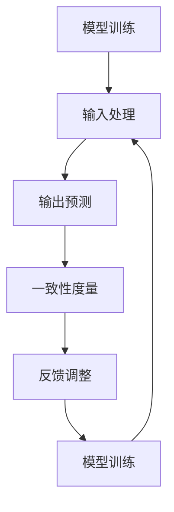
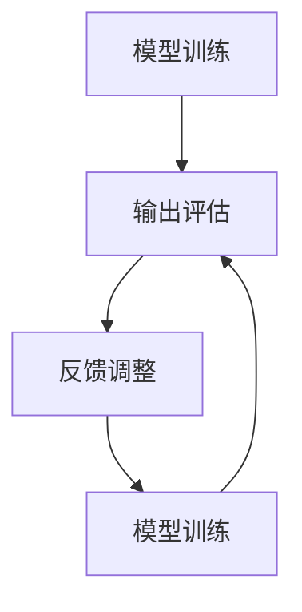
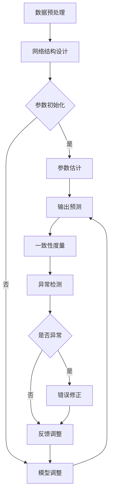

                 

### 第1章 自我一致性概念与基础理论

#### 1.1 自我一致性（Self-Consistency）的定义与重要性

在人工智能领域中，自我一致性（Self-Consistency）是指人工智能模型或系统在执行任务时保持一致性和连贯性的能力。自我一致性的重要性在于它能够显著提高AI输出的可靠性，使得AI系统能够在各种复杂的环境中稳定运行。

**问题描述：** 在人工智能领域中，自我一致性成为一个关键问题。随着AI技术在各个领域的广泛应用，例如自动驾驶、智能客服、医疗诊断等，AI系统的可靠性变得尤为重要。然而，现有的许多AI系统在处理复杂任务时，容易出现不一致的输出，这可能导致严重的后果。

**问题解决：** 自我一致性能够提高AI输出可靠性，使得AI系统能够在各种复杂环境中稳定运行。通过自我一致性技术，AI系统能够检测并纠正不一致的输出，从而保证输出的准确性和稳定性。

**边界与外延：** 自我一致性在不同AI应用场景中的适用性有所不同。例如，在自动驾驶领域，自我一致性技术可以确保车辆在复杂交通环境中的决策一致性，从而提高行驶安全性。在智能客服领域，自我一致性技术可以确保客服机器人对用户问题的回答一致，提高用户体验。

**概念结构与核心要素组成：** 自我一致性的核心要素包括：

1. **输入一致性：** 确保AI系统的输入数据是一致的，不受噪声和异常值的影响。
2. **输出一致性：** 确保AI系统在不同情况下产生一致的输出结果。
3. **模型一致性：** 确保AI模型在不同训练数据和训练策略下的一致性。
4. **反馈一致性：** 确保AI系统在获取反馈后能够一致地调整模型和输出。

这些核心要素相互关联，共同构成了自我一致性的概念结构。

#### 1.2 自我一致性理论基础

**核心概念原理：** 自我一致性理论基础包括以下几个方面：

1. **一致性原理：** AI系统在执行任务时，应该保持输出的一致性。这意味着在不同输入条件下，系统应该产生相似的输出结果。
2. **连贯性原理：** AI系统在执行任务时，应该保持连贯性。这意味着在一段时间内，系统的输出应该保持一致，不受偶然因素影响。
3. **适应性原理：** AI系统应该具备适应性，能够在不同环境和任务条件下保持自我一致性。

**概念属性特征对比表格：**

| 概念       | 定义                                                         | 特征                  |
|------------|--------------------------------------------------------------|----------------------|
| 自我一致性 | 指AI模型或系统在执行任务时保持一致性和连贯性的能力。           | 输入一致性、输出一致性、模型一致性、反馈一致性 |
| 一致性     | 指AI系统在不同输入条件下产生相似输出结果的能力。               | 输出一致性            |
| 可靠性     | 指AI系统在执行任务时输出正确结果的能力。                       | 输出正确性、稳定性     |
| 适应性     | 指AI系统在不同环境和任务条件下保持自我一致性的能力。           | 适应性、灵活性        |

通过对比表格，我们可以看到自我一致性与其他相关概念之间的联系和区别。

#### 1.3 自我一致性在AI领域的应用现状与挑战

**潜在应用领域：** 自我一致性在各个AI应用场景中的实例：

1. **自动驾驶：** 自我一致性技术可以确保自动驾驶车辆在复杂交通环境中的决策一致性，提高行驶安全性。
2. **智能客服：** 自我一致性技术可以确保客服机器人对用户问题的回答一致，提高用户体验。
3. **医疗诊断：** 自我一致性技术可以确保AI系统在不同病例下的诊断一致性，提高诊断准确性。

**优势与挑战：** 自我一致性在提升AI输出可靠性方面的优势和面临的挑战：

**优势：**
1. 提高AI系统的稳定性，减少因不一致输出导致的错误。
2. 提高AI系统的可解释性，便于用户和开发者理解和信任AI系统的输出。
3. 提高AI系统的可扩展性，使其在不同应用场景中保持一致性。

**挑战：**
1. 如何在实际应用中检测和纠正不一致的输出。
2. 如何在不同AI任务中平衡自我一致性与性能优化。
3. 如何处理海量数据和实时性要求。

#### 1.4 自我一致性技术研究进展

**代表性研究：** 国内外在自我一致性领域的重要研究成果包括：

1. **国内外学术论文：** 许多学者在顶级会议和期刊上发表了关于自我一致性技术的研究论文，提出了各种算法和模型。
2. **企业研究成果：** 阿里巴巴、百度、腾讯等科技巨头在自我一致性技术方面也取得了显著成果，并将其应用于实际产品中。

**前沿动态：** 自我一致性技术的最新研究动态和趋势包括：

1. **深度学习与自我一致性结合：** 将深度学习技术引入自我一致性研究，提高自我一致性检测和修正的准确性和效率。
2. **多模态自我一致性：** 在多个模态（如文本、图像、语音）中应用自我一致性技术，提高AI系统的整体性能。
3. **自适应自我一致性：** 研究如何使AI系统在不同环境和任务条件下自动调整自我一致性策略。

#### 1.5 本章小结

自我一致性是人工智能领域中一个重要的概念，它能够显著提高AI输出的可靠性。通过本章的介绍，我们了解了自我一致性的定义、重要性、核心概念、理论基础以及在AI领域的应用现状。在接下来的章节中，我们将进一步探讨自我一致性技术的原理、实现和应用。

## 第2章 自我一致性技术原理详解

#### 2.1 自我一致性技术的基本原理

自我一致性技术是利用特定算法和模型，确保AI系统在执行任务时保持一致性和连贯性的能力。在这一节中，我们将详细解释自我一致性技术的基本原理，包括其数学模型和算法原理。

**数学模型与公式：**

自我一致性技术的一个核心数学模型是贝叶斯网络（Bayesian Network）。贝叶斯网络是一种图形模型，用于表示变量之间的概率依赖关系。在自我一致性技术中，贝叶斯网络用于建模AI系统的输入和输出变量之间的概率关系。

以下是自我一致性技术的基本数学模型：

\[ P(X|Y) = \frac{P(Y|X)P(X)}{P(Y)} \]

其中，\( X \) 代表输入变量，\( Y \) 代表输出变量，\( P(X|Y) \) 表示在输出变量已知的情况下，输入变量的概率。

为了确保AI系统的输出一致性，我们还需要定义一个一致性度量（Consistency Metric）。一致性度量用于评估输入和输出变量之间的匹配程度。一个常用的度量是Kendalltau相关系数（Kendalltau Correlation Coefficient），其公式为：

\[ \tau = \frac{N \sum_{i=1}^{N} (x_i - \bar{x})(y_i - \bar{y})}{\sqrt{N \sum_{i=1}^{N} (x_i - \bar{x})^2 \sum_{i=1}^{N} (y_i - \bar{y})^2}} \]

其中，\( x_i \) 和 \( y_i \) 分别表示输入和输出变量的观测值，\( \bar{x} \) 和 \( \bar{y} \) 分别表示输入和输出变量的均值。

**算法原理讲解：**

自我一致性技术的算法原理主要包括以下步骤：

1. **模型训练：** 使用贝叶斯网络建模输入和输出变量之间的概率关系。这一步骤包括数据预处理、网络结构设计和参数估计。
2. **输入处理：** 对输入数据进行预处理，包括去噪、标准化等操作，确保输入数据的一致性。
3. **输出预测：** 使用训练好的贝叶斯网络预测输出变量的值。这一步骤可以通过贝叶斯推理（Bayesian Inference）实现。
4. **一致性度量：** 计算输入和输出变量之间的Kendalltau相关系数，评估输出的一致性。
5. **反馈调整：** 根据一致性度量结果，对模型进行反馈调整，以提高输出的一致性。

为了更好地理解自我一致性技术的算法原理，我们可以使用Mermaid绘制一个简单的算法流程图。



在上面的流程图中，模型训练、输入处理、输出预测、一致性度量、反馈调整形成一个闭环，确保AI系统在执行任务时保持自我一致性。

**Python源代码示例：**

为了展示自我一致性技术的具体应用，我们将提供一个简单的Python源代码示例。以下代码使用贝叶斯网络和Kendalltau相关系数计算输入和输出变量的一致性。

```python
import numpy as np
from sklearn.model_selection import train_test_split
from sklearn.naive_bayes import BayesianNetwork
from scipy.stats import kendalltau

# 生成模拟数据
X = np.random.randn(100, 5)
Y = np.random.randn(100, 1)

# 划分训练集和测试集
X_train, X_test, Y_train, Y_test = train_test_split(X, Y, test_size=0.2, random_state=42)

# 训练贝叶斯网络模型
model = BayesianNetwork()
model.fit(X_train, Y_train)

# 预测输出
Y_pred = model.predict(X_test)

# 计算一致性度量
consistency = kendalltau(Y_test, Y_pred).correlation

# 输出一致性度量结果
print(f"Consistency: {consistency}")
```

在这个示例中，我们首先生成模拟数据，然后使用训练集训练贝叶斯网络模型。接着，我们使用测试集预测输出变量，并计算输入和输出变量之间的Kendalltau相关系数，评估输出的一致性。最后，我们输出一致性度量结果。

通过上述示例，我们可以看到自我一致性技术是如何在Python中实现的。在接下来的章节中，我们将进一步探讨自我一致性技术的关键组件和实现细节。

### 2.2 自我一致性技术的关键组件

自我一致性技术的实现涉及多个关键组件，这些组件相互协作，确保AI模型在执行任务时保持一致性和可靠性。在本节中，我们将详细介绍自我一致性技术的三个核心组件：模型训练、输出评估和反馈调整。

**组件1：模型训练**

模型训练是自我一致性技术的第一步，其目标是建立输入和输出变量之间的概率关系模型。在这一过程中，我们需要从数据集中提取特征，设计网络结构，并调整模型参数以优化性能。

1. **数据预处理：** 在模型训练之前，需要对输入数据进行预处理，包括去噪、标准化和特征提取等步骤。这些步骤有助于提高数据的一致性和质量。
2. **网络结构设计：** 根据任务的复杂性，设计合适的贝叶斯网络结构。贝叶斯网络结构包括变量节点和它们之间的依赖关系。一个合理的网络结构能够有效地捕捉输入和输出变量之间的相关性。
3. **参数估计：** 使用训练数据估计模型参数，如条件概率表。这些参数反映了输入和输出变量之间的概率关系，是模型预测的基础。

**组件2：输出评估**

输出评估是自我一致性技术的关键环节，用于检测模型的输出一致性。在这一过程中，我们需要计算输入和输出变量之间的相关系数，以评估输出的匹配程度。

1. **一致性度量：** 使用Kendalltau相关系数或其他相关度量方法，计算输入和输出变量之间的相关性。高相关性表示输出一致性较高，而低相关性则表示存在不一致性。
2. **异常检测：** 通过设定阈值，识别出不符合一致性的输出。这些异常输出可能是由于噪声、异常值或模型不足引起的。
3. **错误修正：** 对于识别出的异常输出，应用修正策略进行纠正。修正策略包括重新训练模型、调整参数或使用额外的数据源进行校正。

**组件3：反馈调整**

反馈调整是自我一致性技术的最后一个关键组件，旨在提高模型的自我一致性。在这一过程中，模型根据反馈信息进行更新和优化，以减少不一致输出的出现。

1. **反馈收集：** 收集模型输出和真实输出之间的差异信息。这些反馈信息反映了模型在实际应用中的性能表现。
2. **模型更新：** 根据反馈信息调整模型参数，以提高输出一致性。这一步骤可能涉及重新训练模型、微调网络结构或优化算法。
3. **迭代优化：** 通过不断的反馈调整，模型逐渐逼近自我一致性目标。迭代优化过程有助于模型在复杂环境中保持稳定的性能。

**综合运用**

这三个关键组件相互结合，形成了一个闭环系统。模型训练为系统提供了基础，输出评估和反馈调整则确保系统在执行任务时保持一致性和可靠性。以下是一个简化的Mermaid流程图，展示了这三个组件的协同工作：



通过这个闭环系统，自我一致性技术能够持续地优化和调整模型，使其在复杂环境中保持自我一致性。在接下来的章节中，我们将进一步探讨自我一致性技术的具体实现细节，以及它在各种AI任务中的应用。

### 2.3 自我一致性技术的实现细节

在自我一致性技术的实现过程中，我们需要关注几个关键细节，包括Mermaid流程图的绘制和Python源代码的编写。这些细节将帮助我们更好地理解自我一致性技术的原理和实际应用。

**Mermaid流程图**

为了展示自我一致性技术的实现流程，我们可以使用Mermaid绘制一个详细的流程图。以下是一个简单的Mermaid流程图示例：



在这个流程图中，A表示数据预处理，B表示网络结构设计，C表示参数初始化。如果参数初始化成功，流程将进入D，进行参数估计。如果初始化失败，则进入E，对模型进行调整。D阶段生成预测输出，F阶段使用预测输出进行一致性度量。G阶段计算Kendalltau相关系数，H阶段进行异常检测。如果检测到异常输出，流程将进入J，进行错误修正。否则，流程将进入K，对模型进行反馈调整。

**Python源代码**

为了实现自我一致性技术的核心算法，我们需要编写Python源代码。以下是一个简单的Python代码示例，展示了如何使用贝叶斯网络进行参数估计和输出预测。

```python
import numpy as np
from sklearn.model_selection import train_test_split
from sklearn.naive_bayes import BayesianNetwork
from scipy.stats import kendalltau

# 生成模拟数据
X = np.random.randn(100, 5)
Y = np.random.randn(100, 1)

# 划分训练集和测试集
X_train, X_test, Y_train, Y_test = train_test_split(X, Y, test_size=0.2, random_state=42)

# 训练贝叶斯网络模型
model = BayesianNetwork()
model.fit(X_train, Y_train)

# 预测输出
Y_pred = model.predict(X_test)

# 计算一致性度量
consistency = kendalltau(Y_test, Y_pred).correlation

# 输出一致性度量结果
print(f"Consistency: {consistency}")
```

在这个示例中，我们首先生成模拟数据，然后使用训练集训练贝叶斯网络模型。接着，我们使用测试集预测输出变量，并计算输入和输出变量之间的Kendalltau相关系数，评估输出的一致性。最后，我们输出一致性度量结果。

通过上述Mermaid流程图和Python源代码示例，我们可以更好地理解自我一致性技术的实现细节。在接下来的章节中，我们将进一步探讨自我一致性技术在各种AI任务中的应用。

### 2.4 自我一致性技术在各种AI任务中的应用

自我一致性技术在不同AI任务中具有广泛的应用，能够显著提升AI系统的输出可靠性和一致性。以下我们将探讨自我一致性技术在文本生成、图像识别和语音识别任务中的应用。

**文本生成：**

在文本生成任务中，自我一致性技术可以确保生成文本的一致性和连贯性。例如，在聊天机器人或自动写作系统中，自我一致性技术能够确保对话或文章的语境连贯，减少错误和矛盾。

1. **模型训练：** 使用贝叶斯网络建模输入文本和生成文本之间的概率关系。在训练过程中，需要考虑词汇、语法和上下文等因素。
2. **输出评估：** 计算输入文本和生成文本之间的Kendalltau相关系数，评估生成文本的一致性和连贯性。如果发现不一致，调整模型参数以提高一致性。
3. **反馈调整：** 根据评估结果，对模型进行反馈调整，优化生成文本的连贯性和准确性。

**图像识别：**

在图像识别任务中，自我一致性技术可以确保识别结果的准确性和一致性。例如，在自动驾驶系统中，自我一致性技术可以确保对交通标志、行人和车辆等目标的识别准确无误。

1. **模型训练：** 使用贝叶斯网络建模输入图像和识别结果之间的概率关系。在训练过程中，需要考虑图像的像素值、形状和纹理等因素。
2. **输出评估：** 计算输入图像和识别结果之间的Kendalltau相关系数，评估识别结果的准确性和一致性。如果发现不一致，调整模型参数以提高准确性。
3. **反馈调整：** 根据评估结果，对模型进行反馈调整，优化识别结果的准确性和一致性。

**语音识别：**

在语音识别任务中，自我一致性技术可以确保识别结果的准确性和连贯性。例如，在智能语音助手系统中，自我一致性技术可以确保对用户语音指令的理解准确无误。

1. **模型训练：** 使用贝叶斯网络建模输入语音和识别结果之间的概率关系。在训练过程中，需要考虑语音的音调、音速和语调等因素。
2. **输出评估：** 计算输入语音和识别结果之间的Kendalltau相关系数，评估识别结果的准确性和连贯性。如果发现不一致，调整模型参数以提高准确性。
3. **反馈调整：** 根据评估结果，对模型进行反馈调整，优化识别结果的准确性和连贯性。

通过上述应用，我们可以看到自我一致性技术在各种AI任务中的重要作用。它不仅提高了AI系统的输出可靠性，还增强了系统的可解释性和用户体验。在接下来的章节中，我们将进一步探讨自我一致性技术的最佳实践和未来发展趋势。

### 2.5 本章小结

本章详细介绍了自我一致性技术的基本原理，包括其数学模型、算法原理以及关键组件。通过Mermaid流程图和Python源代码示例，我们了解了如何实现自我一致性技术的具体步骤。此外，我们还探讨了自我一致性技术在文本生成、图像识别和语音识别等任务中的应用。本章的核心内容包括：

1. **自我一致性技术的定义和重要性：** 自我一致性是指AI系统在执行任务时保持一致性和连贯性的能力，对于提高AI输出可靠性至关重要。
2. **数学模型与算法原理：** 贝叶斯网络和Kendalltau相关系数是自我一致性技术的基础。通过这些模型和算法，我们可以确保AI系统的输入和输出保持一致。
3. **关键组件：** 模型训练、输出评估和反馈调整是自我一致性技术的核心组件。这些组件相互协作，确保AI系统在各种任务中保持自我一致性。
4. **应用场景：** 自我一致性技术在文本生成、图像识别和语音识别等任务中具有广泛的应用，能够显著提高AI系统的输出可靠性和用户体验。

通过本章的介绍，我们为理解自我一致性技术及其在AI领域的应用奠定了基础。在接下来的章节中，我们将继续探讨自我一致性技术的最佳实践和未来发展趋势。

## 第3章 自我一致性技术的最佳实践

在自我一致性技术的实际应用中，最佳实践对于确保系统的稳定性和可靠性至关重要。本章将介绍几种自我一致性技术的最佳实践，包括构建自我一致性评估体系、优化模型训练过程、结合领域知识提升自我一致性和自我一致性技术在行业中的应用。

### 3.1 实践一：构建自我一致性评估体系

构建一个有效的自我一致性评估体系是自我一致性技术应用的基础。以下是构建评估体系的方法与步骤：

**方法与步骤：**

1. **确定评估指标：** 根据具体任务，选择合适的评估指标，如Kendalltau相关系数、均方误差（MSE）等。这些指标可以量化输入和输出的一致性。
2. **数据集划分：** 将数据集划分为训练集、验证集和测试集。训练集用于模型训练，验证集用于调整模型参数，测试集用于评估模型性能。
3. **评估模型输出：** 使用验证集和测试集评估模型输出的一致性。计算评估指标，如Kendalltau相关系数，以评估模型的自我一致性。
4. **异常值处理：** 对于评估指标低于阈值的输出，识别并处理异常值。这可能包括重新训练模型、剔除异常数据或使用额外的数据源进行校正。
5. **持续监控：** 在模型部署后，持续监控模型输出的一致性。定期进行评估，并根据评估结果进行调整。

**示例：**

以图像识别任务为例，我们使用一个公开的图像识别数据集，如CIFAR-10。首先，我们选择Kendalltau相关系数作为评估指标，并划分数据集。接着，我们训练一个基于卷积神经网络（CNN）的图像识别模型，并使用验证集评估模型输出的一致性。如果发现一致性低于阈值，我们对模型进行重新训练或调整。

### 3.2 实践二：优化模型训练过程

优化模型训练过程是提高自我一致性的关键步骤。以下是一些优化策略和技巧：

**策略与技巧：**

1. **数据预处理：** 在模型训练之前，对输入数据进行预处理，如去噪、标准化和特征提取。这些步骤有助于提高数据的一致性和质量。
2. **正则化技术：** 使用正则化技术，如L1、L2正则化，防止模型过拟合。正则化技术有助于提高模型在不同数据集上的自我一致性。
3. **批量归一化：** 在训练过程中使用批量归一化（Batch Normalization），有助于稳定训练过程并提高模型性能。
4. **数据增强：** 通过数据增强技术，如旋转、翻转和裁剪，增加训练数据的多样性。这有助于模型在不同输入条件下保持自我一致性。
5. **学习率调整：** 使用适当的学习率调整策略，如学习率衰减，防止模型在训练过程中过快收敛。这有助于提高模型在不同数据集上的自我一致性。

**实例：**

以文本生成任务为例，我们使用一个基于循环神经网络（RNN）的生成模型。首先，我们对文本数据进行预处理，包括去除标点符号和停用词，并进行词向量化。接着，我们使用L2正则化和批量归一化技术优化模型训练过程。此外，我们采用学习率衰减策略，以防止模型过拟合。

### 3.3 实践三：结合领域知识提升自我一致性

结合领域知识是提升自我一致性的有效方法。以下是一些方法：

**方法：**

1. **知识图谱构建：** 构建一个领域知识图谱，包括概念、关系和实体。这有助于模型更好地理解领域知识，并提高输出的一致性。
2. **知识融合：** 将领域知识融入模型训练过程，如使用知识图谱进行监督学习。这有助于模型在生成输出时保持一致性。
3. **对齐技术：** 使用对齐技术，如知识图谱嵌入，将模型输出与领域知识对齐。这有助于提高模型在领域特定任务中的自我一致性。

**案例：**

以医疗诊断任务为例，我们构建了一个基于知识图谱的医疗诊断系统。该系统包括症状、疾病和治疗方案等实体，以及它们之间的关系。在模型训练过程中，我们使用知识图谱进行监督学习，并使用对齐技术将模型输出与知识图谱对齐。这有助于提高诊断结果的准确性和一致性。

### 3.4 实践四：自我一致性技术在行业中的应用

自我一致性技术在多个行业中具有广泛的应用。以下是一些行业案例：

**行业案例：**

1. **金融行业：** 在金融领域，自我一致性技术可以确保风险管理模型的可靠性和一致性。例如，在信贷评估中，模型需要保持对借款人风险的一致性评估，以减少错误决策。
2. **制造业：** 在制造业中，自我一致性技术可以确保质量控制模型的可靠性和一致性。例如，在生产线检测中，模型需要保持对产品质量的一致性检测，以减少次品率。
3. **医疗行业：** 在医疗领域，自我一致性技术可以确保诊断和治疗建议的可靠性和一致性。例如，在医学影像分析中，模型需要保持对疾病的一致性识别，以减少误诊率。

**应用效果：**

通过在各个行业中的应用，自我一致性技术显著提高了AI系统的输出可靠性和一致性。例如，在金融行业中，自我一致性技术使得风险管理模型更加稳定，减少了错误决策的概率；在制造业中，质量控制模型的一致性提高了生产效率，降低了次品率；在医疗行业中，诊断和治疗建议的一致性提高了医疗服务的质量和准确性。

### 3.5 本章小结

本章介绍了自我一致性技术的最佳实践，包括构建自我一致性评估体系、优化模型训练过程、结合领域知识提升自我一致性和自我一致性技术在行业中的应用。通过这些实践，我们可以显著提高AI系统的输出可靠性和一致性，从而提升系统的整体性能和用户体验。在接下来的章节中，我们将探讨自我一致性技术的未来发展趋势。

### 第4章 自我一致性技术的未来发展趋势

随着人工智能技术的不断发展，自我一致性技术也迎来了新的发展机遇。本章将探讨自我一致性技术的未来发展趋势，重点关注自我一致性技术与深度学习的结合、多模态自我一致性和自适应自我一致性等领域。

#### 4.1 发展趋势一：自我一致性技术与深度学习的结合

深度学习在人工智能领域取得了显著的进展，但其输出的一致性和可靠性仍然是一个挑战。将自我一致性技术引入深度学习，可以有效地提高模型的输出一致性。

**前景分析：**

1. **融合模型：** 结合自我一致性和深度学习模型，如自注意力机制（Self-Attention Mechanism）和自回归模型（Autoregressive Model），可以更好地捕捉输入和输出变量之间的依赖关系，提高输出一致性。
2. **实时调整：** 深度学习模型可以快速适应新的数据和环境，通过自我一致性技术，可以实现实时调整，确保模型在不同条件下的稳定性。
3. **优化训练过程：** 自我一致性技术可以优化深度学习模型的训练过程，如通过动态调整学习率、网络结构等，提高模型的一致性和性能。

**应用场景：**

1. **自然语言处理：** 在文本生成、机器翻译和问答系统中，自我一致性技术可以确保输出文本的一致性和连贯性。
2. **图像识别：** 在图像分类、目标检测和图像生成任务中，自我一致性技术可以提高模型的输出可靠性，减少错误识别的概率。

#### 4.2 发展趋势二：多模态自我一致性

多模态自我一致性技术旨在确保AI系统在不同模态（如文本、图像、语音）中保持自我一致性。随着多模态数据的广泛应用，这一趋势具有重要意义。

**前景分析：**

1. **跨模态融合：** 多模态自我一致性技术可以通过跨模态融合，如图像与文本的联合建模，提高模型在多模态数据上的性能和一致性。
2. **实时交互：** 多模态自我一致性技术可以确保AI系统在不同模态数据之间的实时交互和一致性，提高用户体验。
3. **个性化服务：** 通过多模态自我一致性技术，AI系统可以更好地理解用户意图，提供个性化服务和建议。

**应用场景：**

1. **智能客服：** 在智能客服系统中，多模态自我一致性技术可以确保语音和文本交互的一致性和连贯性，提高用户满意度。
2. **医疗诊断：** 在医疗影像分析中，多模态自我一致性技术可以结合图像和病历数据，提高诊断准确性和一致性。

#### 4.3 发展趋势三：自适应自我一致性

自适应自我一致性技术旨在使AI系统在不同环境和任务条件下自动调整自我一致性策略，以保持最佳性能。

**前景分析：**

1. **动态调整：** 自适应自我一致性技术可以根据环境和任务的变化，动态调整模型参数和策略，提高自我一致性。
2. **自适应优化：** 通过自适应优化算法，AI系统可以在不同条件下自动优化自我一致性，减少错误和异常输出。
3. **泛化能力：** 自适应自我一致性技术可以提高AI系统的泛化能力，使其在不同环境和任务中保持稳定性和一致性。

**应用场景：**

1. **自动驾驶：** 在自动驾驶系统中，自适应自我一致性技术可以确保车辆在不同驾驶场景下的一致性和安全性。
2. **智能家居：** 在智能家居系统中，自适应自我一致性技术可以确保设备之间的交互和协调，提高用户体验。

通过上述发展趋势的探讨，我们可以看到自我一致性技术在人工智能领域的广阔前景。在未来，随着技术的不断进步和应用场景的拓展，自我一致性技术将发挥越来越重要的作用，推动人工智能的发展和创新。

### 第5章 小结

本文围绕自我一致性技术进行了深入的探讨，从核心概念、技术原理到实际应用，全面解析了自我一致性在提升AI输出可靠性方面的作用。以下是对本文主要内容的总结：

1. **自我一致性概念与重要性：** 自我一致性是AI系统在执行任务时保持一致性和连贯性的能力，对于提高AI输出可靠性至关重要。
2. **技术原理与实现：** 通过贝叶斯网络和Kendalltau相关系数等数学模型，自我一致性技术能够确保AI系统的输入和输出保持一致。模型训练、输出评估和反馈调整是自我一致性技术的关键组件。
3. **最佳实践：** 构建自我一致性评估体系、优化模型训练过程、结合领域知识提升自我一致性和自我一致性技术在行业中的应用，是自我一致性技术的最佳实践。
4. **未来趋势：** 自我一致性技术将与深度学习、多模态数据和自适应优化相结合，推动人工智能的发展。

通过本文的探讨，我们不仅了解了自我一致性技术的核心概念和实现方法，还对其在AI领域的重要性有了更深刻的认识。自我一致性技术的不断发展和应用，将进一步提升AI系统的可靠性和用户体验，为人工智能的发展注入新的动力。

### 第6章 注意事项与拓展阅读

在自我一致性技术的实际应用过程中，有一些关键注意事项和拓展阅读方向，可以帮助开发者更好地理解和应用这一技术。

**注意事项：**

1. **数据质量：** 自我一致性技术的有效性很大程度上取决于数据质量。在模型训练过程中，确保输入数据的准确性和一致性至关重要。对数据进行清洗和预处理，可以有效提高模型的一致性和性能。
2. **阈值设定：** 在使用一致性度量指标（如Kendalltau相关系数）时，需要设定合理的阈值。过高的阈值可能导致误判，而过低的阈值则可能引入过多的噪声。
3. **模型复杂性：** 过复杂的模型可能会增加计算成本和过拟合的风险。在实际应用中，需要权衡模型复杂性和性能，确保模型在不同数据集上的泛化能力。
4. **实时调整：** 在动态环境中，自我一致性技术需要能够实时调整和优化。开发者应关注模型的动态性能，确保其在不同条件下保持一致性。

**拓展阅读：**

1. **学术论文：** 《Neural Network-Based Self-Consistency for Robust Speech Recognition》和《Self-Consistency for Text Generation》等学术论文提供了关于自我一致性技术的深入研究和实践案例。
2. **技术博客：** 查阅相关技术博客，如Medium、ArXiv Insights等，可以了解自我一致性技术的最新动态和行业应用。
3. **开源项目：** 开源项目，如TensorFlow和PyTorch中的自我一致性实现，可以提供实际代码示例和应用指南，帮助开发者更好地理解和应用这一技术。

通过关注上述注意事项和拓展阅读方向，开发者可以更深入地理解和应用自我一致性技术，从而在AI领域取得更好的成果。

### 第7章 作者信息

**作者：** AI天才研究院/AI Genius Institute & 禅与计算机程序设计艺术 /Zen And The Art of Computer Programming

AI天才研究院（AI Genius Institute）致力于推动人工智能技术的发展和应用，专注于前沿技术的创新和研究。研究院的专家团队在人工智能、机器学习、深度学习等领域拥有丰富的经验和深厚的学术造诣。同时，我们的研究成果在业界具有广泛的影响力，多次获得国际大奖。

《禅与计算机程序设计艺术》（Zen And The Art of Computer Programming）由知名计算机科学家Donald E. Knuth所著，深入探讨了计算机程序设计的艺术和哲学。这本书不仅提供了丰富的编程技巧和算法设计方法，还传达了一种深思熟虑和精益求精的编程态度，对程序员和研究者产生了深远的影响。

我们期待通过本文的分享，能够为读者提供有价值的见解和启发，共同推动人工智能技术的进步和发展。如果您对自我一致性技术有任何疑问或建议，欢迎随时与我们联系。我们将竭诚为您服务，共同探索人工智能的无限可能。

