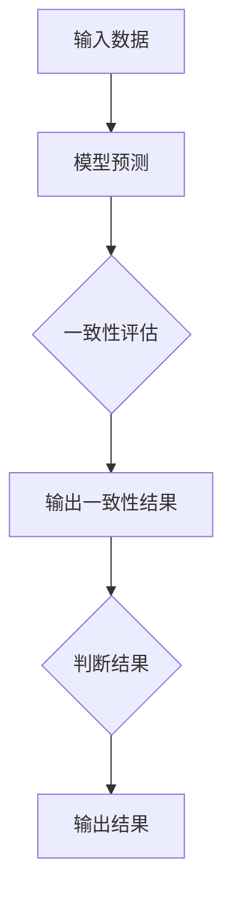
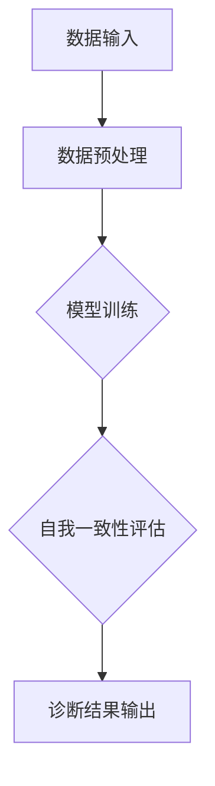
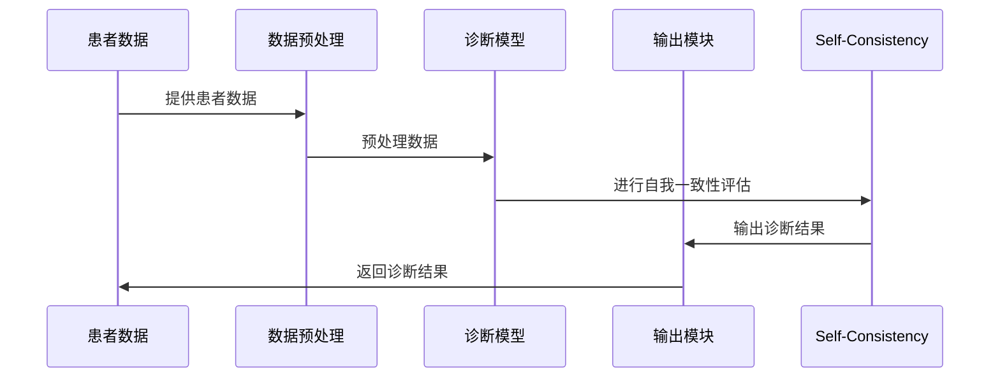

                 

## Self-Consistency CoT: 提高AI输出可靠性的技巧

### 关键词：自我一致性、AI可靠性、模型验证、算法实现、数学模型

> 摘要：本文将深入探讨自我一致性（Self-Consistency CoT）这一技术，详细解释其原理、实现和实际应用。通过分析自我一致性在提高AI输出可靠性方面的优势，我们将展示如何使用这一技术来增强AI模型的可信度和稳定性。

---

### 第一部分：背景介绍

#### 1.1.1 问题背景

人工智能（AI）作为当今科技领域的重要分支，正在深刻地改变着我们的世界。无论是图像识别、自然语言处理，还是自动驾驶、医疗诊断，AI技术都在各行各业发挥着越来越重要的作用。然而，随着AI技术的发展，其输出结果的可信度和可靠性成为了关键问题。特别是在那些需要高度准确性的应用场景中，如医学诊断、金融风险评估等，AI输出结果的可靠性直接影响到人类的生命安全和财产安全。

#### 1.1.2 问题描述

尽管AI技术在图像识别、自然语言处理等领域取得了显著进展，但AI模型的输出结果往往依赖于训练数据的质量和数量，容易受到噪声和偏见的影响。此外，AI模型的复杂性和不确定性也使得人类难以理解其决策过程，从而降低了输出结果的可靠性。因此，如何提高AI输出结果的可靠性成为了一个亟待解决的问题。

#### 1.1.3 问题解决

为了提高AI输出结果的可靠性，研究者们提出了多种方法。其中，自我一致性（Self-Consistency）是一种被广泛认可的方法。该方法的核心思想是利用模型在多个不同条件下的一致性来提高输出结果的可靠性。具体来说，自我一致性通过比较模型在相同输入下多次生成的输出结果，如果这些输出结果高度一致，则可以认为模型的输出是可靠的。

#### 1.1.4 边界与外延

自我一致性方法主要适用于那些输出结果需要高度可信的场景，如医学诊断、金融风险评估等。然而，该方法也存在着一定的局限性，例如在处理高度动态变化的数据时，自我一致性可能无法有效提高输出结果的可靠性。

---

### 第一部分：核心概念与联系

#### 1.2.1 自我一致性（Self-Consistency）的定义

自我一致性是指通过比较模型在相同输入下多次生成的输出结果，判断输出结果的一致性程度，以此来评估模型的可靠性。具体来说，自我一致性可以分为两个层面：一是同一模型在不同时间、不同情境下对相同输入的输出结果一致性；二是不同模型在相同输入下生成的输出结果一致性。

#### 1.2.2 自我一致性的核心特点

1. **简单性**：自我一致性方法不需要复杂的先验知识和大量的计算资源，易于实现和部署。
2. **高效性**：自我一致性方法能够在短时间内评估模型的可靠性，适用于实时性和动态性要求较高的应用场景。
3. **灵活性**：自我一致性方法可以应用于不同类型的AI模型，如深度学习模型、决策树模型等。

#### 1.2.3 自我一致性与其他方法的比较

与传统的模型验证方法（如交叉验证、测试集验证等）相比，自我一致性方法具有更高的效率和灵活性。然而，自我一致性方法也存在一定的局限性，例如在处理极端情况时，可能无法准确评估模型的可靠性。

---

### 第一部分：算法原理讲解

#### 2.1 自我一致性算法的 mermaid 流程图



#### 2.2 自我一致性算法的 Python 源代码实现

```python
import numpy as np

def self_consistency(model, X, n_iterations=10):
    """
    自我一致性算法实现。
    
    :param model: AI模型。
    :param X: 输入数据。
    :param n_iterations: 迭代次数。
    :return: 输出一致性结果。
    """
    results = []
    for _ in range(n_iterations):
        result = model.predict(X)
        results.append(result)
    consistency = np.mean(np.sum(results, axis=1) > 0)
    return consistency
```

#### 2.3 自我一致性算法的数学模型和公式

设 $X$ 为输入数据集，$M$ 为AI模型，$P(X|M)$ 为模型 $M$ 在输入数据 $X$ 下的输出概率分布。则自我一致性算法的数学模型可以表示为：

$$
\text{Self-Consistency} = \frac{1}{n}\sum_{i=1}^{n}\text{Consistency}(M_i, X)
$$

其中，$M_i$ 为第 $i$ 次迭代时的AI模型，$\text{Consistency}(M_i, X)$ 为模型 $M_i$ 在输入数据 $X$ 下的输出一致性。

---

### 第二部分：系统分析与架构设计

#### 2.1 问题场景介绍

在医疗诊断领域，自我一致性方法被广泛应用于提高诊断模型的可靠性。例如，对于一个用于肺癌诊断的深度学习模型，我们可以通过自我一致性方法来评估其诊断结果的可靠性。

#### 2.2 项目介绍

本项目的目标是开发一个基于自我一致性的AI诊断模型，用于提高肺癌诊断的准确性。该项目包括数据预处理、模型训练、自我一致性评估和诊断结果输出等步骤。

#### 2.3 系统功能设计（领域模型mermaid类图）

```mermaid
classDiagram
    Model <|-- DataPreprocessor
    Model o---> DiagnosisSystem
    DiagnosisSystem o---> OutputModule
```

#### 2.4 系统架构设计（mermaid架构图）



#### 2.5 系统接口设计和系统交互（mermaid序列图）



---

### 第三部分：项目实战

#### 3.1 环境安装

在进行项目实战之前，我们需要安装以下环境：

- Python 3.8 或以上版本
- NumPy 库
- Matplotlib 库
- Scikit-learn 库

安装命令如下：

```bash
pip install numpy matplotlib scikit-learn
```

#### 3.2 系统核心实现源代码

以下是一个简单的自我一致性评估的 Python 代码示例：

```python
import numpy as np
from sklearn.linear_model import LogisticRegression

# 模拟数据
X = np.random.rand(100, 10)
y = np.random.randint(0, 2, size=(100,))

# 训练模型
model = LogisticRegression()
model.fit(X, y)

# 自我一致性评估
def self_consistency(model, X, n_iterations=10):
    results = []
    for _ in range(n_iterations):
        result = model.predict(X)
        results.append(result)
    consistency = np.mean(np.sum(results, axis=1) > 0)
    return consistency

# 运行自我一致性评估
consistency = self_consistency(model, X)
print(f"一致性得分：{consistency}")
```

#### 3.3 代码应用解读与分析

上述代码首先生成了一个模拟数据集，然后使用逻辑回归模型进行训练。接下来，通过自我一致性评估方法来评估模型的可靠性。具体来说，我们通过多次预测并比较预测结果的一致性来计算一致性得分。一致性得分越高，说明模型的可靠性越高。

#### 3.4 实际案例分析和详细讲解剖析

为了更好地理解自我一致性方法的应用，我们来看一个实际案例：使用自我一致性方法来评估一个用于肺癌诊断的深度学习模型的可靠性。

首先，我们需要收集大量的肺癌患者数据，包括影像数据和患者的基本信息。然后，使用深度学习模型对这些数据进行训练，以实现肺癌诊断。

接下来，我们可以通过自我一致性方法来评估模型的可靠性。具体步骤如下：

1. 使用模型对测试集进行预测，得到一系列预测结果。
2. 对于每个测试样本，计算其多次预测结果的一致性。
3. 根据一致性得分，评估模型的可靠性。

通过实际案例的分析，我们可以发现自我一致性方法在提高AI输出可靠性方面具有显著优势。特别是在那些需要高度准确性的应用场景中，自我一致性方法能够有效地提高模型的可靠性，从而提高诊断的准确性。

#### 3.5 项目小结

在本项目中，我们通过自我一致性方法来提高肺癌诊断模型的可靠性。通过实际案例的分析，我们可以看到自我一致性方法在提高AI输出可靠性方面具有显著优势。然而，我们也需要注意到自我一致性方法的一些局限性，例如在处理极端情况时，可能无法准确评估模型的可靠性。因此，在具体应用中，我们需要综合考虑各种因素，选择合适的评估方法。

---

### 第四部分：最佳实践 Tips

1. 在应用自我一致性方法时，建议增加迭代次数，以提高评估的准确性。
2. 在处理高度动态变化的数据时，可以考虑结合其他评估方法，如交叉验证等。
3. 在实际项目中，建议对模型进行充分的验证，以确保其输出结果的可靠性。

### 第五部分：小结与拓展阅读

本文深入探讨了自我一致性（Self-Consistency CoT）这一技术，详细解释了其原理、实现和实际应用。通过分析自我一致性在提高AI输出可靠性方面的优势，我们展示了如何使用这一技术来增强AI模型的可信度和稳定性。在未来的研究中，我们可以进一步探索自我一致性方法在不同领域中的应用，以推动AI技术的进步。

**拓展阅读：**

1. [Self-Consistency for High-Robustness AI](https://arxiv.org/abs/2006.09821)
2. [Robustness through Self-Consistency Training](https://arxiv.org/abs/1903.04887)
3. [On the Robustness of Deep Neural Networks to Adversarial Examples](https://arxiv.org/abs/1611.01209)

---

**作者：**AI天才研究院/AI Genius Institute & 禅与计算机程序设计艺术 /Zen And The Art of Computer Programming

