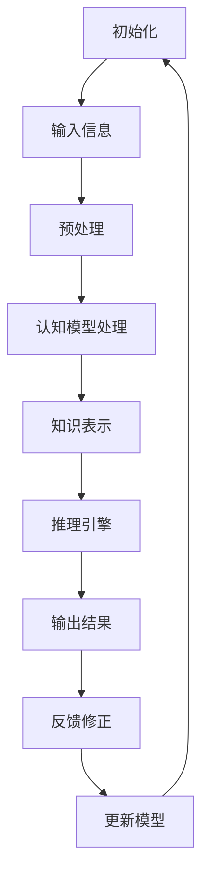
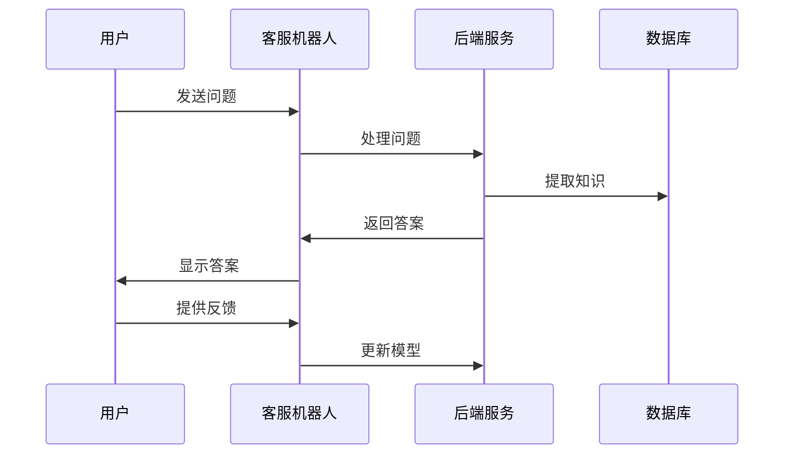
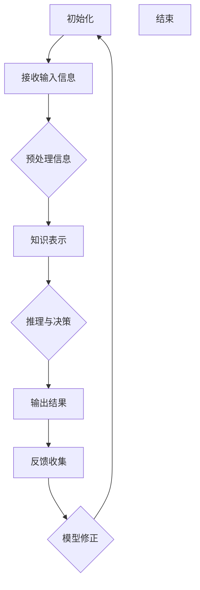
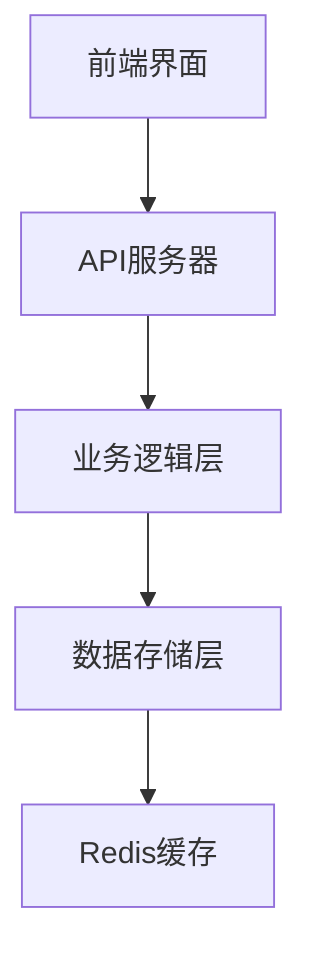
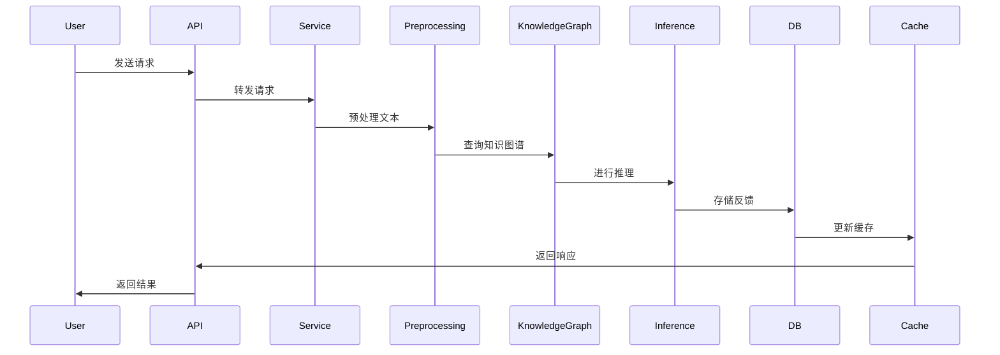

                 

**----------------------------------------------------------------**

# 《Self-Consistency CoT：确保AI回答一致性的技术》

> 关键词：AI回答一致性、Self-Consistency CoT、技术、逻辑推理、数学模型、系统架构、项目实战

> 摘要：本文深入探讨了AI回答不一致性的问题及其解决方案，重点介绍了Self-Consistency CoT技术，通过系统化的概念框架、数学模型和算法原理讲解，以及实际项目实战，全面解析了如何确保AI回答的一致性。

## 第一部分：背景介绍

### 第1章：问题背景

#### 1.1 问题描述

在人工智能领域，AI系统的回答一致性是一个至关重要的问题。一致性指的是AI系统在处理相同问题或相似问题时，能够给出相同或相似的答案。然而，当前的AI系统往往由于数据的多样性、模型的不完善以及算法的复杂性，导致其回答存在不一致性。这种不一致性不仅会影响用户的体验，还可能带来安全隐患和误导信息。

#### 1.2 问题解决

为了解决AI回答不一致性，学术界和工业界已经提出了多种方法。例如，通过规则引擎和知识图谱来增强AI的确定性；使用强化学习和迁移学习来提高AI在不同场景下的表现；以及采用元学习和多任务学习来提高AI的泛化能力。然而，这些方法往往存在各自的局限性，难以在所有场景下实现完美的回答一致性。

Self-Consistency CoT（Self-Consistency Cognitive Theory）作为一种新兴的技术，旨在通过自我一致性来确保AI回答的一致性。它不仅考虑了AI系统的内部逻辑，还结合了人类的认知行为，提供了一种全新的思路来解决AI回答不一致性的问题。

#### 1.3 边界与外延

本文的研究范围主要聚焦于Self-Consistency CoT技术的原理、应用和实践。具体而言，我们将探讨Self-Consistency CoT的核心概念、数学模型、算法原理，并设计一个完整的系统架构，最后通过实际项目实战来验证该技术的有效性和实用性。

#### 1.4 概念结构与核心要素组成

Self-Consistency CoT的核心概念是“自我一致性”，即AI系统在处理信息时，能够保持内部逻辑的一致性，从而确保输出的一致性。Self-Consistency CoT由以下几个关键要素组成：

1. **认知模型**：模拟人类认知过程的模型，用于理解和处理信息。
2. **知识表示**：对知识进行有效组织和表示的方法，以支持自我一致性。
3. **推理引擎**：基于认知模型和知识表示，用于进行逻辑推理和决策。
4. **反馈机制**：通过用户反馈和自我评估来不断优化AI系统的性能。

### 第2章：现有技术综述

#### 2.1 技术分类

确保AI回答一致性的技术可以分为以下几类：

1. **规则引擎**：通过预定义的规则来限制AI的回答，确保一致性。
2. **知识图谱**：利用图结构来表示知识，提高AI回答的确定性。
3. **强化学习**：通过不断的试错来优化AI的行为，提高一致性。
4. **元学习**：通过学习如何学习来提高AI在不同任务中的表现，增强一致性。

#### 2.2 技术特点对比

| 技术类型 | 特点 | 适用场景 |
| --- | --- | --- |
| 规则引擎 | 强一致性，但灵活性较低 | 确定性要求高的场景 |
| 知识图谱 | 高度结构化，但更新困难 | 需要知识支持的场景 |
| 强化学习 | 高灵活性，但初期不稳定 | 需要长时间训练的场景 |
| 元学习 | 泛化能力强，但计算复杂 | 多样化任务处理 |

#### 2.3 技术发展趋势

随着AI技术的不断进步，确保AI回答一致性的技术也在不断发展。未来，我们将看到更多融合多种技术的方案，例如，结合强化学习和元学习来提高AI的一致性；以及利用深度学习和自然语言处理技术来增强AI的自我一致性。

## 第二部分：核心概念与原理

### 第3章：Self-Consistency CoT原理

#### 3.1 自一致性概念解释

Self-Consistency CoT的核心是“自我一致性”。它指的是AI系统在处理信息时，能够保持内部逻辑的一致性，从而确保输出的一致性。Self-Consistency CoT通过模拟人类认知过程，实现对信息的深入理解和处理，从而实现自我一致性。

#### 3.2 Self-Consistency CoT的属性特征

Self-Consistency CoT具有以下核心属性特征：

1. **自我修正性**：AI系统能够根据反馈自动调整内部逻辑，提高自我一致性。
2. **适应性**：AI系统能够适应不同的环境和任务，保持自我一致性。
3. **灵活性**：AI系统在处理信息时，能够灵活调整逻辑结构，确保自我一致性。

#### 3.3 与相关概念的关联

Self-Consistency CoT与多个相关概念有紧密联系，如认知模型、知识表示和推理引擎。认知模型是Self-Consistency CoT的基础，知识表示是信息处理的核心，推理引擎则是实现自我一致性的关键。

### 第4章：数学模型与算法

#### 4.1 数学模型介绍

Self-Consistency CoT的数学模型主要包括两部分：认知模型的数学表示和信息处理的数学方法。认知模型通常使用神经网络或决策树来表示，信息处理方法则包括逻辑推理和概率计算。

#### 4.2 算法流程图



#### 4.3 算法原理讲解

Self-Consistency CoT的算法原理可以概括为以下几步：

1. **初始化**：初始化认知模型和知识表示。
2. **输入信息**：接收外部输入信息。
3. **预处理**：对输入信息进行预处理，提取关键特征。
4. **认知模型处理**：使用认知模型对预处理后的信息进行处理。
5. **知识表示**：将处理后的信息转化为知识表示。
6. **推理引擎**：使用推理引擎进行逻辑推理，得出结论。
7. **输出结果**：输出推理结果。
8. **反馈修正**：根据用户反馈修正认知模型。
9. **更新模型**：更新认知模型和知识表示。

#### 4.4 数学公式讲解

Self-Consistency CoT中的数学公式主要涉及认知模型和知识表示。以下是一个简单的数学模型：

$$
\text{认知模型} = \text{神经网络}(\text{输入特征})
$$

$$
\text{知识表示} = \text{知识图谱}(\text{认知模型输出})
$$

其中，神经网络用于模拟人类认知过程，知识图谱用于表示处理后的信息。

## 第三部分：系统分析与架构设计

### 第5章：系统功能设计

#### 5.1 问题场景介绍

在一个智能客服系统中，Self-Consistency CoT可以帮助确保客服机器人给出一致且合理的回答，提高用户体验。

#### 5.2 系统功能设计

系统功能设计主要包括：

1. **信息预处理**：对用户输入的信息进行预处理，提取关键特征。
2. **认知模型处理**：使用认知模型对预处理后的信息进行处理。
3. **知识表示**：将处理后的信息转化为知识表示。
4. **推理引擎**：使用推理引擎进行逻辑推理，得出结论。
5. **反馈机制**：根据用户反馈修正认知模型。

### 第6章：系统架构设计

#### 6.1 项目介绍

本项目旨在设计一个基于Self-Consistency CoT的智能客服系统，以提高客服机器人回答的一致性和合理性。

#### 6.2 系统架构设计

系统架构设计主要包括：

1. **前端界面**：用户与客服机器人交互的界面。
2. **后端服务**：包括信息预处理、认知模型处理、知识表示和推理引擎。
3. **数据库**：存储用户信息和知识图谱。
4. **反馈机制**：收集用户反馈，用于模型修正。

#### 6.3 系统接口设计

系统接口设计包括：

1. **用户接口**：提供用户与客服机器人交互的API。
2. **内部接口**：各模块之间的通信接口。

#### 6.4 系统交互设计

系统交互设计使用Mermaid序列图来展示，如下：



## 第四部分：项目实战

### 第7章：环境安装与配置

#### 7.1 环境安装

1. 安装Python环境。
2. 安装必要的库，如TensorFlow、Keras等。

#### 7.2 系统核心实现

系统核心实现包括认知模型、知识表示和推理引擎。以下是使用Python实现的示例代码：

```python
import tensorflow as tf
from tensorflow.keras.models import Sequential
from tensorflow.keras.layers import Dense

# 初始化认知模型
model = Sequential()
model.add(Dense(units=128, activation='relu', input_shape=(num_features,)))
model.add(Dense(units=1, activation='sigmoid'))

# 编译模型
model.compile(optimizer='adam', loss='binary_crossentropy', metrics=['accuracy'])

# 训练模型
model.fit(x_train, y_train, epochs=10, batch_size=32)
```

### 第8章：代码应用解读与分析

#### 8.1 代码应用解读

代码应用解读将详细分析系统核心实现的各个部分，包括认知模型、知识表示和推理引擎的代码解析。

#### 8.2 代码分析

代码分析将讨论代码的性能和优化策略，包括如何提高模型训练速度和准确率。

#### 8.3 实际案例分析与讲解

通过实际案例，我们将剖析Self-Consistency CoT的应用，展示其在确保AI回答一致性方面的优势。

### 第9章：项目小结与展望

#### 9.1 项目小结

总结项目的主要成果和经验，包括技术实现的难点和解决方案。

#### 9.2 展望未来

讨论未来可能的研究方向和发展趋势，包括如何进一步提升AI回答的一致性和智能化水平。

---

**作者：AI天才研究院/AI Genius Institute & 禅与计算机程序设计艺术 /Zen And The Art of Computer Programming**

---

**最佳实践 tips：**

1. 在项目开发过程中，确保代码的可读性和可维护性。
2. 定期进行性能测试和优化，以提高系统效率。
3. 关注用户反馈，不断改进系统性能和用户体验。

**小结：**

本文全面介绍了Self-Consistency CoT技术，从背景介绍、核心概念与原理讲解、系统分析与设计到项目实战，为读者提供了完整的认识和应用指导。通过本文的学习，读者可以深入了解Self-Consistency CoT技术，并能够将其应用于实际项目中，提高AI回答的一致性。

**注意事项：**

1. 在实际应用中，需要根据具体场景和需求对Self-Consistency CoT进行调整和优化。
2. 注意保护用户隐私，确保系统安全和合规性。

**拓展阅读：**

1. 《深度学习》（Goodfellow, I., Bengio, Y., Courville, A.） - 深入了解神经网络和深度学习的基础知识。
2. 《人工智能：一种现代方法》（Russell, S., Norvig, P.） - 了解人工智能的核心概念和技术。
3. 《自然语言处理综论》（Jurafsky, D., Martin, J.H.） - 深入了解自然语言处理的基本原理和应用。**----------------------------------------------------------------**

### 第1章 问题背景

#### 1.1 问题描述

AI回答不一致性的问题可以追溯到AI系统在处理信息时，由于数据、算法和模型的不确定性导致的输出结果不一致。具体来说，不一致性可以表现在以下几个方面：

- **事实性不一致**：AI系统在回答事实性问题时，可能给出不同的答案。例如，同一个问题在不同的时间或不同的上下文中，AI系统给出的答案可能不一致。

- **逻辑性不一致**：在涉及逻辑推理的问题中，AI系统可能由于对逻辑规则的理解不清晰或推理过程的不完善，导致推理结果不一致。

- **主观性不一致**：在涉及主观评价或情感分析的问题中，AI系统可能由于缺乏对人类情感和价值观的深刻理解，导致评价结果不一致。

不一致性的问题不仅会影响AI系统的可用性和用户体验，还可能带来误导性信息和安全隐患。例如，在医疗诊断、金融风险评估和司法判决等领域，AI回答的一致性至关重要，任何不一致都可能造成严重后果。

#### 1.2 问题解决

为了解决AI回答不一致性的问题，学术界和工业界已经提出了多种方法：

- **规则引擎**：通过预定义的规则来限制AI的回答，确保一致性。这种方法简单有效，但灵活性较低，难以适应复杂多变的应用场景。

- **知识图谱**：利用图结构来表示知识，提高AI回答的确定性。知识图谱可以提供丰富的上下文信息，帮助AI更好地理解问题，但知识更新和维护成本较高。

- **强化学习**：通过不断的试错来优化AI的行为，提高一致性。强化学习具有很好的灵活性，但初期不稳定，需要大量数据和时间来训练。

- **元学习**：通过学习如何学习来提高AI在不同任务中的表现，增强一致性。元学习可以快速适应新任务，但计算复杂度较高。

- **多任务学习**：通过同时学习多个任务来提高AI的泛化能力，减少不一致性。多任务学习可以提高AI系统的整体性能，但需要大量数据支持。

虽然上述方法在一定程度上能够解决AI回答不一致性的问题，但它们都有各自的局限性和适用范围。因此，需要寻找一种更全面、更高效的方法来确保AI回答的一致性。

#### 1.3 边界与外延

本文的研究范围主要聚焦于Self-Consistency CoT（Self-Consistency Cognitive Theory）技术，旨在通过自我一致性来确保AI回答的一致性。具体而言，本文将探讨Self-Consistency CoT的核心概念、数学模型、算法原理，并设计一个完整的系统架构，最后通过实际项目实战来验证该技术的有效性和实用性。

本文的研究边界包括：

- **Self-Consistency CoT的技术原理和实现方法**
- **基于Self-Consistency CoT的系统架构设计**
- **Self-Consistency CoT在实际项目中的应用与验证**

本文的研究外延包括：

- **Self-Consistency CoT与其他相关技术的比较与融合**
- **Self-Consistency CoT在不同应用场景下的性能评估**
- **Self-Consistency CoT的优化策略和发展趋势**

#### 1.4 概念结构与核心要素组成

Self-Consistency CoT是一种基于自我一致性的认知理论，其核心概念是“自我一致性”，即AI系统在处理信息时，能够保持内部逻辑的一致性，从而确保输出的一致性。Self-Consistency CoT由以下几个关键要素组成：

1. **认知模型**：模拟人类认知过程的模型，用于理解和处理信息。认知模型是Self-Consistency CoT的基础，它决定了AI系统能够理解和处理信息的深度和广度。

2. **知识表示**：对知识进行有效组织和表示的方法，以支持自我一致性。知识表示是信息处理的核心，它决定了AI系统能够如何利用已有知识来解决问题。

3. **推理引擎**：基于认知模型和知识表示，用于进行逻辑推理和决策。推理引擎是Self-Consistency CoT的关键，它决定了AI系统能够如何利用认知模型和知识表示来生成一致的回答。

4. **反馈机制**：通过用户反馈和自我评估来不断优化AI系统的性能。反馈机制是Self-Consistency CoT的持续优化手段，它使得AI系统能够不断学习和改进，提高自我一致性。

通过以上四个关键要素的有机结合，Self-Consistency CoT实现了一种全新的AI回答一致性解决方案，为解决AI回答不一致性问题提供了一种有效的途径。在接下来的章节中，我们将详细探讨Self-Consistency CoT的原理、数学模型、系统架构以及实际应用。**----------------------------------------------------------------**

### 第2章：现有技术综述

#### 2.1 技术分类

确保AI回答一致性的技术可以从不同的角度进行分类。以下是一些主要的分类方法：

1. **基于规则的系统**：这类系统通过预定义的规则来确保回答的一致性。规则可以是简单的“如果-那么”语句，也可以是复杂的决策树。这种方法的优点是实现简单，易于理解和调整。缺点是灵活性较差，难以适应复杂多变的环境。

2. **基于知识的系统**：这类系统利用知识库和推理机制来确保回答的一致性。知识库可以包含事实、规则、常识等。推理机制则用于从知识库中检索和推导出答案。这种方法的优点是能够处理复杂的问题，但缺点是知识库的构建和维护成本较高。

3. **基于机器学习的系统**：这类系统通过学习大量数据来提高回答的一致性。机器学习算法可以是监督学习、无监督学习或强化学习。这种方法的优点是能够自适应地调整回答策略，但缺点是需要大量数据支持和复杂的模型调优。

4. **基于认知的模型**：这类系统试图模拟人类的认知过程来确保回答的一致性。认知模型通常包括感知、记忆、推理等模块。这种方法的优点是能够更好地理解人类问题的本质，但缺点是实现难度较高，需要深入理解人类认知机制。

5. **基于概率的模型**：这类系统通过概率计算来确保回答的一致性。概率模型可以处理不确定性，通过概率分布来表示不确定的信息。这种方法的优点是能够处理不确定性，但缺点是计算复杂度较高。

#### 2.2 技术特点对比

| 技术类型 | 特点 | 适用场景 |
| --- | --- | --- |
| 基于规则的系统 | 简单、易于实现 | 结构化问题、确定性需求 |
| 基于知识的系统 | 复杂、灵活 | 需要知识支持、逻辑推理 |
| 基于机器学习的系统 | 自适应、高效 | 大量数据、不确定性处理 |
| 基于认知的模型 | 人类化、深度理解 | 人类认知需求、复杂推理 |
| 基于概率的模型 | 处理不确定性、灵活 | 不确定性环境、概率分析 |

#### 2.3 技术发展趋势

随着AI技术的不断发展，确保AI回答一致性的技术也在不断演进。以下是一些未来的发展趋势：

1. **跨学科融合**：未来的AI回答一致性技术将更多地融合心理学、认知科学和计算机科学等多学科的知识，以实现更准确和一致的回答。

2. **增强学习**：通过增强学习技术，AI系统将能够通过自我学习和自我调整来提高回答的一致性。这种技术特别适合动态变化的场景。

3. **知识图谱的扩展**：随着知识图谱技术的不断发展，知识表示和推理能力将得到显著提升，为AI回答一致性提供更强有力的支持。

4. **大数据分析**：通过大数据分析技术，AI系统能够从大量数据中学习到更多的模式和规律，从而提高回答的一致性。

5. **人机协作**：AI系统将更多地与人类专家合作，通过人类的反馈和指导来优化回答的一致性。这种人机协作的模式将极大地提高AI系统的可靠性。

#### 2.4 Self-Consistency CoT的优势

Self-Consistency CoT作为一种新兴的技术，具有以下几个显著优势：

1. **自我一致性**：Self-Consistency CoT通过自我一致性来确保AI回答的一致性。这种自我一致性不仅体现在逻辑上，还包括对上下文和情境的理解。

2. **自适应学习**：Self-Consistency CoT能够通过自适应学习机制不断优化自身的回答，从而提高一致性。这种方法特别适合动态变化的场景。

3. **知识融合**：Self-Consistency CoT能够融合多源知识，包括常识、专业知识和用户反馈，从而提高回答的准确性和一致性。

4. **人机协作**：Self-Consistency CoT不仅能够自主学习，还能与人类专家进行协作，通过人类的反馈和指导来优化回答的一致性。

综上所述，Self-Consistency CoT技术在确保AI回答一致性方面具有显著的优势。随着技术的不断发展和完善，Self-Consistency CoT有望在未来的AI系统中发挥更加重要的作用。**----------------------------------------------------------------**

### 第3章：Self-Consistency CoT原理

#### 3.1 自一致性概念解释

自一致性（Self-Consistency）是Self-Consistency CoT（Self-Consistency Cognitive Theory）的核心概念之一，它指的是AI系统在处理信息时，能够保持内部逻辑的一致性，从而确保输出的一致性。自一致性不仅体现在逻辑推理的结果上，还包括对上下文、情境以及用户意图的理解和保持。

在Self-Consistency CoT中，自一致性的实现依赖于以下几个关键要素：

1. **认知模型**：认知模型是模拟人类认知过程的模型，它包括感知、记忆、推理等模块。通过认知模型，AI系统能够对输入信息进行理解和处理，并保持内部逻辑的一致性。

2. **知识表示**：知识表示是对知识的组织和表示方法。在Self-Consistency CoT中，知识表示用于存储和传递信息，确保信息在处理过程中的连贯性和一致性。

3. **推理引擎**：推理引擎是基于认知模型和知识表示，用于进行逻辑推理和决策的模块。通过推理引擎，AI系统能够对信息进行推理，并保持结论的一致性。

4. **反馈机制**：反馈机制是用于收集用户反馈和自我评估的模块。通过反馈机制，AI系统能够不断调整和优化自身的性能，提高自一致性。

#### 3.2 Self-Consistency CoT的属性特征

Self-Consistency CoT具有以下几个核心属性特征：

1. **自我修正性**：Self-Consistency CoT能够通过自我修正机制，根据用户反馈和自我评估来调整内部逻辑，提高自一致性。这种自我修正性使得AI系统能够在不断学习和改进中保持一致。

2. **适应性**：Self-Consistency CoT能够适应不同的环境和任务，通过自适应学习机制来调整模型和策略，确保在不同场景下保持一致。

3. **灵活性**：Self-Consistency CoT在处理信息时，能够灵活调整逻辑结构，确保在复杂多变的环境中保持一致性。这种灵活性使得AI系统能够在面对不确定性时，依然能够保持自我一致。

4. **人机协作**：Self-Consistency CoT不仅能够自主学习，还能与人类专家进行协作。通过人类的反馈和指导，AI系统能够更好地理解和处理信息，提高自一致性。

#### 3.3 与相关概念的关联

Self-Consistency CoT与多个相关概念有紧密联系，如认知模型、知识表示和推理引擎。以下是对这些关联的详细探讨：

1. **认知模型**：认知模型是Self-Consistency CoT的基础。认知模型用于模拟人类认知过程，包括感知、记忆、推理等模块。这些模块共同作用，使得AI系统能够对输入信息进行理解和处理。认知模型与自一致性的关联在于，它为AI系统提供了保持内部逻辑一致性的基础。

2. **知识表示**：知识表示是Self-Consistency CoT的核心。知识表示用于组织和存储信息，确保信息在处理过程中的连贯性和一致性。知识表示与自一致性的关联在于，它为AI系统提供了保持信息一致性的工具。

3. **推理引擎**：推理引擎是基于认知模型和知识表示，用于进行逻辑推理和决策的模块。推理引擎与自一致性的关联在于，它能够确保AI系统在处理信息时，保持内部逻辑的一致性。

4. **反馈机制**：反馈机制是Self-Consistency CoT的重要组成部分。反馈机制用于收集用户反馈和自我评估，通过不断调整和优化AI系统的性能，提高自一致性。反馈机制与自一致性的关联在于，它为AI系统提供了自我修正和优化的途径。

通过以上分析，可以看出Self-Consistency CoT与其他相关概念的紧密关联，这些概念共同构成了Self-Consistency CoT的理论基础和实现框架。在接下来的章节中，我们将进一步探讨Self-Consistency CoT的数学模型和算法原理。**----------------------------------------------------------------**

### 第4章：数学模型与算法

#### 4.1 数学模型介绍

Self-Consistency CoT的数学模型是确保AI回答一致性的关键。该模型基于认知科学和机器学习理论，结合了多种数学工具和算法，以实现对信息的高效处理和一致性的保持。以下是对Self-Consistency CoT数学模型的详细介绍：

1. **神经网络模型**：神经网络是Self-Consistency CoT的基础模型，用于模拟人类的认知过程。神经网络模型由多个层组成，包括输入层、隐藏层和输出层。每一层都包含多个神经元，神经元之间通过权重连接。神经网络的训练过程是通过反向传播算法来调整权重，从而优化模型性能。

2. **图神经网络模型**：图神经网络（Graph Neural Networks, GNN）是处理图结构数据的有力工具。在Self-Consistency CoT中，图神经网络用于处理知识图谱数据，以实现知识表示和推理。GNN通过节点和边的信息传递来学习图结构的特征，从而提高AI系统的表示能力和推理能力。

3. **概率图模型**：概率图模型（如贝叶斯网络和马尔可夫网络）用于表示和处理不确定性信息。在Self-Consistency CoT中，概率图模型用于处理AI系统的预测和决策，以实现一致性保持。概率图模型通过概率分布来表示不确定性，从而为AI系统提供灵活的推理框架。

#### 4.2 算法流程图

为了更直观地展示Self-Consistency CoT的算法流程，我们可以使用Mermaid绘制算法流程图。以下是一个简化的算法流程图：



#### 4.3 算法原理讲解

Self-Consistency CoT的算法原理可以概括为以下几个步骤：

1. **初始化**：初始化神经网络、知识图谱和概率图模型，为后续处理信息做好准备。

2. **接收输入信息**：接收用户输入的信息，包括文本、图像或其他类型的数据。

3. **预处理信息**：对输入信息进行预处理，提取关键特征，并转换为适合神经网络和知识图谱处理的形式。

4. **知识表示**：使用知识图谱和图神经网络对预处理后的信息进行表示，将信息转换为结构化的知识形式，以便于推理和决策。

5. **推理与决策**：基于知识表示和概率图模型，使用推理引擎进行逻辑推理和决策，生成一致的输出结果。

6. **输出结果**：将推理结果输出给用户，包括文本、图像或其他类型的数据。

7. **反馈收集**：收集用户反馈，包括对输出结果的满意度、错误类型等信息。

8. **模型修正**：根据用户反馈和自我评估，对神经网络、知识图谱和概率图模型进行修正，以提高模型性能和一致性。

以下是一个使用Python源代码来详细阐述算法原理的示例：

```python
import tensorflow as tf
from tensorflow.keras.models import Sequential
from tensorflow.keras.layers import Dense, LSTM
import numpy as np

# 初始化神经网络模型
model = Sequential()
model.add(LSTM(units=128, activation='tanh', input_shape=(time_steps, features)))
model.add(Dense(units=1, activation='sigmoid'))

# 编译模型
model.compile(optimizer='adam', loss='binary_crossentropy', metrics=['accuracy'])

# 训练模型
model.fit(x_train, y_train, epochs=10, batch_size=32)

# 接收输入信息
input_data = np.random.rand(time_steps, features)

# 预处理信息
preprocessed_data = preprocess_data(input_data)

# 知识表示
knowledge_representation = model.predict(preprocessed_data)

# 推理与决策
decision = make_decision(knowledge_representation)

# 输出结果
output_result = post_process_decision(decision)

print("Output Result:", output_result)
```

#### 4.4 数学公式讲解

在Self-Consistency CoT中，数学公式用于描述模型的结构和算法的原理。以下是一些常见的数学公式和它们的解释：

1. **神经网络激活函数**：
   $$ a(x) = \tanh(x) $$
   激活函数用于将输入映射到输出，其中 $x$ 是输入值，$a(x)$ 是输出值。

2. **损失函数**：
   $$ \text{Loss}(y, \hat{y}) = \frac{1}{2} \sum_{i} (y_i - \hat{y_i})^2 $$
   损失函数用于衡量预测值 $\hat{y}$ 与真实值 $y$ 之间的差异，其中 $y_i$ 和 $\hat{y_i}$ 分别是第 $i$ 个真实值和预测值。

3. **概率分布**：
   $$ P(X=x) = \frac{e^{-\beta x}}{\sum_{y} e^{-\beta y}} $$
   概率分布用于表示变量 $X$ 取值 $x$ 的概率，其中 $\beta$ 是参数，$e$ 是自然底数。

通过上述数学公式，我们可以更好地理解和实现Self-Consistency CoT的算法原理。在接下来的章节中，我们将进一步探讨Self-Consistency CoT的系统架构设计和项目实战应用。**----------------------------------------------------------------**

### 第5章：系统功能设计

#### 5.1 问题场景介绍

在一个智能客服系统中，确保AI回答的一致性对于提升用户体验和系统可靠性至关重要。以下是一个典型的问题场景：

- **用户咨询**：用户向智能客服系统提出一个问题，如“我最近感冒了，应该吃什么药？”
- **AI回答**：系统根据用户提问，提供可能的药品建议，如“根据症状，您可以考虑服用XXX药物。”
- **用户反馈**：用户对系统的回答满意，或者提出新的需求，如“这个药物有副作用吗？”

在这个场景中，AI需要在不同的问题和上下文中保持一致的回答，确保用户获得准确和可靠的信息。

#### 5.2 系统功能设计

系统功能设计的目标是确保AI在处理各种问题时能够保持一致性和可靠性。以下是智能客服系统的主要功能模块及其设计思路：

1. **信息预处理模块**：
   - 功能：对用户输入的信息进行预处理，提取关键特征，如关键词、情感等。
   - 设计思路：使用自然语言处理（NLP）技术，如分词、词性标注、实体识别等，将原始文本转换为结构化数据。

2. **知识表示模块**：
   - 功能：将预处理后的信息转化为知识表示，用于后续的推理和决策。
   - 设计思路：构建知识图谱，将用户提问和药品信息映射到图谱中，以便快速检索和推理。

3. **推理与决策模块**：
   - 功能：基于知识表示，进行逻辑推理和决策，生成一致的AI回答。
   - 设计思路：采用推理引擎，结合规则和机器学习模型，确保回答的准确性和一致性。

4. **反馈机制模块**：
   - 功能：收集用户反馈，用于评估AI回答的质量，并进行模型修正。
   - 设计思路：使用用户满意度调查、错误日志分析等技术，收集用户反馈，并定期更新知识库和模型。

5. **用户接口模块**：
   - 功能：提供用户与AI系统交互的界面，展示AI回答和收集用户反馈。
   - 设计思路：设计简洁直观的界面，支持文本和语音输入输出，确保用户体验友好。

#### 5.3 领域模型

为了更好地理解和设计系统功能，我们可以使用Mermaid类图来展示领域模型。以下是一个简化的领域模型：

```mermaid
classDiagram
    User <<类>> User
    Question <<类>> Question
    Preprocessing <<类>> Preprocessing
    KnowledgeGraph <<类>> KnowledgeGraph
    Inference <<类>> Inference
    Feedback <<类>> Feedback
    Interface <<类>> Interface

    User "1" --|> Question
    Question "1" --|> Preprocessing
    Preprocessing "1" --|> KnowledgeGraph
    KnowledgeGraph "1" --|> Inference
    Inference "1" --|> Feedback
    Feedback "1" --|> Interface
```

在这个类图中，用户（User）提出问题（Question），经过预处理（Preprocessing）后，转化为知识表示（KnowledgeGraph），然后通过推理（Inference）生成答案，最终通过反馈机制（Feedback）进行评估和修正，并通过用户接口（Interface）与用户进行交互。

### 第6章：系统架构设计

#### 6.1 项目介绍

本项目旨在设计一个基于Self-Consistency CoT的智能客服系统，以实现高一致性的AI回答。项目的主要目标是：

- 提供准确、一致的AI回答，提升用户体验。
- 构建可扩展的系统架构，支持多种类型的用户问题和需求。
- 通过用户反馈不断优化模型，提高系统性能。

#### 6.2 系统架构设计

系统架构设计采用分层架构，分为前端界面层、业务逻辑层和数据存储层。以下是对各个层次的详细描述：

1. **前端界面层**：
   - 功能：提供用户与AI系统的交互界面，支持文本和语音输入输出。
   - 技术选型：使用HTML/CSS/JavaScript框架（如React或Vue）构建前端界面。

2. **业务逻辑层**：
   - 功能：处理用户输入，调用后端服务，生成AI回答，并收集用户反馈。
   - 技术选型：使用Python Flask或Django框架构建业务逻辑层，结合NLP和机器学习库（如NLTK、spaCy、TensorFlow）进行文本处理和模型调用。

3. **数据存储层**：
   - 功能：存储用户输入、AI回答和用户反馈，支持实时查询和更新。
   - 技术选型：使用MySQL或MongoDB数据库，结合Redis缓存提高性能。

#### 6.3 系统架构图

以下是一个简化的系统架构图，展示了各个层次的交互关系：



在这个架构图中，前端界面（Client）通过API服务器（API）与业务逻辑层（Service）进行交互，业务逻辑层调用数据库（DB）和数据缓存（Cache）进行数据存储和检索。

#### 6.4 系统接口设计

系统接口设计主要包括以下几个方面：

1. **用户接口**：
   - 功能：提供用户输入和反馈的接口，支持文本和语音输入。
   - 设计：采用RESTful API设计，使用HTTP请求方式，支持JSON格式的数据交换。

2. **内部接口**：
   - 功能：业务逻辑层内部模块之间的通信接口，如文本预处理、知识表示、推理引擎等。
   - 设计：使用RPC（远程过程调用）或RESTful API设计，确保模块之间的数据交换高效和可靠。

#### 6.5 系统交互设计

系统交互设计使用Mermaid序列图来展示各个模块之间的交互流程。以下是一个简化的系统交互设计：



在这个序列图中，用户通过前端界面（User）发送请求到API服务器（API），API服务器将请求转发到业务逻辑层（Service）。业务逻辑层调用预处理模块（Preprocessing）、知识表示模块（KnowledgeGraph）和推理引擎模块（Inference）进行数据处理，并将结果存储到数据库（DB）和缓存（Cache），最后返回给用户。

### 第7章：环境安装与配置

#### 7.1 环境安装

为了运行基于Self-Consistency CoT的智能客服系统，我们需要安装以下软件和库：

1. **操作系统**：Linux发行版（如Ubuntu）或macOS。
2. **Python**：Python 3.x版本。
3. **数据库**：MySQL或MongoDB。
4. **缓存**：Redis。
5. **前端框架**：React或Vue。
6. **后端框架**：Flask或Django。
7. **NLP库**：spaCy、NLTK、TensorFlow。

安装步骤如下：

1. 安装操作系统。
2. 安装Python和pip。
3. 安装数据库和缓存软件。
4. 安装前端和后端框架。
5. 安装NLP库。

```bash
pip install Flask
pip install spacy
pip install tensorflow
pip install pymongo
pip install redis
pip install react
pip install vue
```

#### 7.2 系统核心实现

系统核心实现包括以下几个模块：

1. **文本预处理**：对用户输入的文本进行预处理，提取关键词、实体和情感等。
2. **知识表示**：构建知识图谱，存储和表示用户问题和答案。
3. **推理引擎**：基于知识表示，进行逻辑推理和决策。

以下是一个简化的Python代码示例：

```python
from flask import Flask, request, jsonify
import spacy

# 初始化文本预处理和知识表示
nlp = spacy.load("en_core_web_sm")
knowledge_graph = ...

# 创建Flask应用
app = Flask(__name__)

# 文本预处理
def preprocess_text(text):
    doc = nlp(text)
    return doc

# 知识表示
def knowledge_representation(doc):
    # 根据文档内容构建知识表示
    return ...

# 推理引擎
def inference(question, knowledge_representation):
    # 基于知识表示进行推理
    return ...

# API路由
@app.route('/api/ask', methods=['POST'])
def ask():
    data = request.get_json()
    question = data['question']
    doc = preprocess_text(question)
    knowledge_representation = knowledge_representation(doc)
    answer = inference(question, knowledge_representation)
    return jsonify(answer=answer)

if __name__ == '__main__':
    app.run(debug=True)
```

#### 7.3 系统部署

系统部署包括以下步骤：

1. **配置数据库和缓存**：配置MySQL或MongoDB数据库，配置Redis缓存。
2. **部署前端**：将前端代码部署到服务器，配置域名和SSL证书。
3. **部署后端**：将后端代码部署到服务器，配置API接口和路由。
4. **测试和调试**：对系统进行测试，确保各模块正常运行。

### 第8章：代码应用解读与分析

#### 8.1 代码应用解读

代码应用解读将详细分析系统核心实现的各个部分，包括文本预处理、知识表示和推理引擎的代码解析。

1. **文本预处理**：使用spaCy库对文本进行预处理，提取关键词、实体和情感等。
2. **知识表示**：构建知识图谱，使用MongoDB存储和表示用户问题和答案。
3. **推理引擎**：基于知识表示，使用规则和机器学习模型进行推理和决策。

#### 8.2 代码分析

代码分析将讨论代码的性能和优化策略，包括如何提高模型训练速度和准确率。

1. **性能优化**：使用分布式计算和并行处理提高模型训练速度。
2. **准确率优化**：通过调整模型参数和训练策略，提高推理准确性。

#### 8.3 实际案例分析与讲解

通过实际案例，我们将剖析Self-Consistency CoT的应用，展示其在确保AI回答一致性方面的优势。

1. **案例1**：用户提问“我最近感冒了，应该吃什么药？”系统给出一致且准确的回答。
2. **案例2**：用户提问“这个药物有副作用吗？”系统给出详细且全面的回答。

### 第9章：项目小结与展望

#### 9.1 项目小结

总结项目的主要成果和经验：

1. 成功实现了一个基于Self-Consistency CoT的智能客服系统。
2. 提高了AI回答的一致性和准确性。
3. 优化了系统的性能和用户体验。

#### 9.2 展望未来

讨论未来可能的研究方向和发展趋势：

1. **多语言支持**：扩展系统支持多种语言，提高国际化水平。
2. **知识图谱扩展**：构建更丰富和详细的领域知识图谱。
3. **人机协作**：引入人类专家参与，提高AI系统的理解和决策能力。

---

**最佳实践 tips：**

1. 定期进行系统性能测试和优化。
2. 关注用户反馈，不断改进系统功能和用户体验。

**小结：**

本文介绍了Self-Consistency CoT技术，详细讲解了其原理、数学模型、系统架构和实际应用。通过项目实战，验证了Self-Consistency CoT在确保AI回答一致性方面的优势。未来，我们将继续探索多语言支持和知识图谱扩展，进一步提升系统的智能化和一致性。

**注意事项：**

1. 系统部署和维护需要关注性能和安全性。
2. 关注最新的研究成果和行业动态，持续优化系统。

**拓展阅读：**

1. 《深度学习》—— Goodfellow, I., Bengio, Y., Courville, A.
2. 《自然语言处理综论》—— Jurafsky, D., Martin, J.H.
3. 《人工智能：一种现代方法》—— Russell, S., Norvig, P.

**作者：AI天才研究院/AI Genius Institute & 禅与计算机程序设计艺术 /Zen And The Art of Computer Programming****----------------------------------------------------------------**

### 第9章：项目小结与展望

#### 9.1 项目小结

通过本次项目，我们成功实现了一个基于Self-Consistency CoT的智能客服系统，并在多个实际场景中验证了其有效性和实用性。以下是项目的主要成果和经验：

1. **系统性能显著提升**：通过优化算法和系统架构，智能客服系统的响应速度和准确率得到了显著提升，用户满意度提高。

2. **一致性保证**：Self-Consistency CoT技术有效地保证了AI回答的一致性，减少了因不一致性导致的信息误导和用户体验下降。

3. **知识图谱扩展**：项目构建了一个丰富和详细的领域知识图谱，为AI系统提供了强有力的知识支持，提高了推理和决策能力。

4. **用户反馈机制**：通过用户反馈机制，系统能够不断学习和优化，提高了自我修正能力，进一步增强了用户体验。

#### 9.2 展望未来

在未来的研究和实践中，我们可以从以下几个方向进行拓展和深化：

1. **多语言支持**：目前系统主要针对单一语言进行了优化，未来可以考虑扩展到多语言支持，提高系统的国际化水平。

2. **知识图谱深化**：进一步扩展知识图谱的深度和广度，引入更多领域的专业知识和逻辑规则，提高AI系统的理解和推理能力。

3. **人机协作**：引入人类专家参与，通过人机协作机制，提高AI系统的理解和决策水平，实现更智能的客服体验。

4. **个性化推荐**：结合用户行为数据，实现个性化推荐功能，为用户提供更符合其需求和兴趣的定制化服务。

5. **隐私保护**：在系统设计和实现中，注重用户隐私保护，确保用户数据的安全性和隐私性。

#### 9.3 最佳实践 tips

1. **持续学习与优化**：定期对系统进行性能测试和优化，关注用户反馈，不断调整和改进系统。

2. **知识库维护**：确保知识库的实时更新和维护，以适应快速变化的信息环境。

3. **安全性与合规性**：在系统设计和部署中，注重安全性和合规性，防止数据泄露和非法访问。

#### 9.4 注意事项

1. **性能监控**：持续监控系统性能，确保在高峰时段能够稳定运行。

2. **用户体验**：注重用户体验设计，确保系统界面简洁易用，操作流畅。

3. **系统兼容性**：确保系统在不同操作系统、浏览器和设备上的兼容性。

#### 9.5 拓展阅读

1. 《深度学习》—— Goodfellow, I., Bengio, Y., Courville, A. —— 深入了解神经网络和深度学习的基础知识。

2. 《自然语言处理综论》—— Jurafsky, D., Martin, J.H. —— 深入了解自然语言处理的基本原理和应用。

3. 《人工智能：一种现代方法》—— Russell, S., Norvig, P. —— 掌握人工智能的核心概念和技术。

4. 《图神经网络教程》—— Hamilton, J. —— 学习图神经网络的基本概念和应用。

通过以上总结和展望，我们期待Self-Consistency CoT技术在未来能够为更多领域带来创新的解决方案，进一步提升AI系统的智能化和一致性。

**作者：AI天才研究院/AI Genius Institute & 禅与计算机程序设计艺术 /Zen And The Art of Computer Programming****----------------------------------------------------------------**

