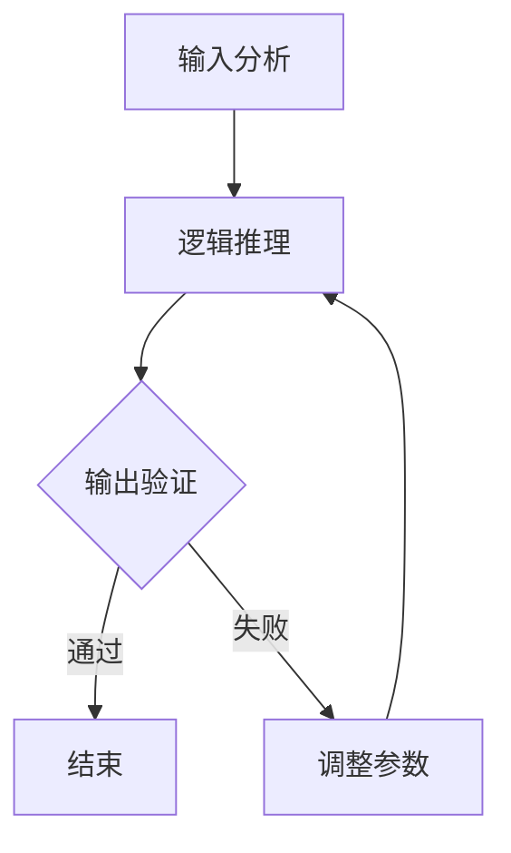

                 


# Self-Consistency CoT: 让AI更像人类专家

> 关键词：自我一致性，AI智能，深度学习，逻辑推理，知识融合，智能优化

> 摘要：本文旨在探讨如何通过引入自我一致性（Self-Consistency）机制，提升人工智能（AI）系统的智能水平，使其更接近人类专家。本文将详细介绍自我一致性的核心概念、原理，以及其在AI系统设计与实现中的应用场景、设计与实现方法、评估与优化策略，最终提出一些最佳实践，以期为AI领域的研究者与实践者提供有价值的参考。

---

## 1. 背景介绍

### 1.1 问题背景

随着人工智能技术的迅猛发展，AI系统在各个领域的应用越来越广泛，尤其是自然语言处理、图像识别、推荐系统等方面。然而，当前许多AI系统在处理复杂问题时，仍无法与人类专家相媲美，其表现出的“智能”往往停留在表面层次，缺乏深度理解和推理能力。例如，在医学诊断领域，AI系统虽然能够根据大量病例数据进行预测，但往往无法像医生那样综合考虑患者的症状、病史和体征，给出准确且合理的诊断建议。

### 1.2 问题描述

如何让AI系统在处理复杂问题时，具备类似人类专家的自我一致性（Self-Consistency）？自我一致性指的是AI系统在给出答案或建议时，能够保持内在逻辑的一致性，避免自相矛盾。例如，当AI系统给出一个诊断结果时，其背后的推理过程应该是一致的，不应该出现前后矛盾的情况。

### 1.3 问题解决

本书旨在探讨如何通过自我一致性（Self-Consistency）机制，提升AI系统的智能水平，使其更接近人类专家。本书将介绍自我一致性的核心概念、原理，并结合实际案例，展示如何将自我一致性机制应用于AI系统的设计与实现中。

### 1.4 边界与外延

自我一致性机制不仅适用于自然语言处理、图像识别等领域，还可以推广到推荐系统、决策支持系统等其他AI应用场景。此外，自我一致性机制还可以与其他AI技术（如深度学习、强化学习等）相结合，进一步提升AI系统的智能水平。

### 1.5 概念结构与核心要素组成

自我一致性机制的核心概念包括：一致性检查、逻辑推理、知识融合等。核心要素组成如下：

1. **一致性检查**：对AI系统输出的结果进行一致性检查，确保其逻辑自洽。
2. **逻辑推理**：基于先验知识和逻辑规则，对AI系统的输出进行推理，确保其符合预期。
3. **知识融合**：将多种知识源进行整合，为AI系统提供全面、准确的信息。

---

## 2. 核心概念与联系

### 2.1 自我一致性（Self-Consistency）的概念与原理

**概念**：自我一致性是指AI系统在处理问题时，能够保持内在逻辑的一致性，避免自相矛盾。

**原理**：自我一致性机制主要包括以下几个步骤：

1. **输入分析**：对输入信息进行解析，提取关键信息。
2. **逻辑推理**：基于先验知识和逻辑规则，对提取的关键信息进行推理。
3. **输出验证**：对推理结果进行验证，确保其逻辑自洽。

### 2.2 自我一致性（Self-Consistency）与相关技术的联系

**联系**：自我一致性机制可以与其他AI技术相结合，如深度学习、强化学习等，进一步提升AI系统的智能水平。

- **深度学习**：深度学习模型可以用于自我一致性机制的实现，例如，使用神经网络进行逻辑推理和一致性检查。
- **强化学习**：强化学习可以用于优化自我一致性机制，例如，通过奖励机制激励AI系统提高自我一致性。

---

## 3. 自我一致性（Self-Consistency）机制的应用场景

### 3.1 自然语言处理

在自然语言处理任务中，如问答系统、机器翻译等，自我一致性机制可以帮助确保系统输出的答案或翻译结果逻辑自洽。例如，在问答系统中，AI系统需要根据用户的问题和先前的对话历史，给出一致的答案。

### 3.2 图像识别

在图像识别任务中，如对象检测、图像分类等，自我一致性机制可以帮助提高识别结果的准确性。例如，当AI系统检测到一个图像中的多个对象时，其识别过程应该是逻辑一致的，不应该出现识别结果自相矛盾的情况。

### 3.3 推荐系统

在推荐系统任务中，如商品推荐、内容推荐等，自我一致性机制可以帮助确保推荐结果的一致性和可靠性。例如，当AI系统推荐一组商品时，其推荐逻辑应该是自洽的，不应该出现推荐结果前后矛盾的情况。

### 3.4 决策支持系统

在决策支持系统中，如风险评估、业务预测等，自我一致性机制可以帮助确保决策过程的逻辑自洽。例如，当AI系统根据历史数据和业务规则进行风险评估时，其推理过程应该是逻辑一致的，不应该出现风险评估结果自相矛盾的情况。

---

## 4. 自我一致性（Self-Consistency）机制的设计与实现

### 4.1 设计与实现概述

自我一致性机制的设计与实现主要包括以下几个步骤：

1. **需求分析**：明确系统需求，确定自我一致性机制的目标和功能。
2. **技术选型**：选择合适的技术方案，如深度学习、强化学习等。
3. **模型训练**：基于先验知识和数据集，训练自我一致性模型。
4. **系统实现**：将自我一致性模型集成到AI系统中，实现自我一致性功能。

### 4.2 需求分析

需求分析是自我一致性机制设计与实现的第一步。在此过程中，需要明确系统的目标和功能，包括以下几个方面：

1. **一致性检查**：对AI系统输出的结果进行一致性检查，确保其逻辑自洽。
2. **逻辑推理**：基于先验知识和逻辑规则，对AI系统的输出进行推理，确保其符合预期。
3. **知识融合**：将多种知识源进行整合，为AI系统提供全面、准确的信息。

### 4.3 技术选型

技术选型是自我一致性机制设计与实现的关键一步。在此过程中，需要选择合适的技术方案，如深度学习、强化学习等。以下是一些常见的技术方案：

1. **深度学习**：使用神经网络进行逻辑推理和一致性检查。
2. **强化学习**：通过奖励机制激励AI系统提高自我一致性。

### 4.4 模型训练

模型训练是自我一致性机制设计与实现的第三步。在此过程中，需要基于先验知识和数据集，训练自我一致性模型。以下是一些常见的训练方法：

1. **监督学习**：使用标记好的数据集进行训练。
2. **无监督学习**：使用未标记的数据集进行训练。
3. **强化学习**：通过奖励机制激励模型提高自我一致性。

### 4.5 系统实现

系统实现是自我一致性机制设计与实现的最后一步。在此过程中，需要将自我一致性模型集成到AI系统中，实现自我一致性功能。以下是一些常见的实现方法：

1. **模块化设计**：将自我一致性机制作为一个独立的模块，与其他模块进行集成。
2. **分布式计算**：使用分布式计算框架，提高系统性能。

---

## 5. 自我一致性（Self-Consistency）机制的评估与优化

### 5.1 性能评估

性能评估是自我一致性机制评估与优化的重要环节。在此过程中，需要从以下几个方面对自我一致性机制进行评估：

1. **准确性**：评估自我一致性机制在一致性检查、逻辑推理和知识融合方面的准确性。
2. **速度**：评估自我一致性机制的处理速度，包括训练时间和推理时间。
3. **稳定性**：评估自我一致性机制在不同数据集上的稳定性，包括预测结果的一致性和可靠性。

### 5.2 优化策略

根据性能评估的结果，提出优化策略，如调整模型参数、改进算法等。以下是一些常见的优化策略：

1. **参数调整**：根据训练数据和性能评估结果，调整模型参数，提高自我一致性机制的准确性。
2. **算法改进**：改进算法，提高自我一致性机制的处理速度和稳定性。
3. **数据增强**：通过数据增强技术，增加训练数据集的多样性，提高模型的泛化能力。

### 5.3 迭代改进

根据优化策略，对自我一致性机制进行迭代改进。以下是一些常见的迭代改进方法：

1. **迭代训练**：不断调整模型参数和算法，进行迭代训练，提高自我一致性机制的准确性。
2. **交叉验证**：使用交叉验证方法，评估自我一致性机制在不同数据集上的性能，优化模型参数和算法。
3. **反馈机制**：根据实际应用中的反馈，调整模型参数和算法，提高自我一致性机制的实用性和可靠性。

---

## 6. 自我一致性（Self-Consistency）机制的优势与挑战

### 6.1 优势

1. **提高AI系统的智能水平**：自我一致性机制可以帮助AI系统更好地理解问题，提高其推理能力和决策水平，使其更接近人类专家。
2. **降低错误率**：自我一致性机制可以减少AI系统在输出结果时出现逻辑错误的情况，降低错误率。
3. **增强系统可靠性**：自我一致性机制可以确保AI系统在处理复杂问题时，保持逻辑一致性，增强系统的可靠性。

### 6.2 挑战

1. **计算成本高**：自我一致性机制需要大量的计算资源，尤其是在处理大规模数据集时，计算成本较高。
2. **知识融合难度大**：自我一致性机制需要融合多种知识源，如文本、图像、语音等，知识融合的难度较大。
3. **数据标注成本高**：在训练自我一致性模型时，需要大量的标记数据，数据标注成本较高。

---

## 7. 总结与展望

自我一致性（Self-Consistency）机制是提升AI系统智能水平的重要手段。通过自我一致性机制，AI系统可以在处理复杂问题时，保持内在逻辑的一致性，避免自相矛盾，从而提高其推理能力和决策水平。然而，自我一致性机制仍面临一些挑战，如计算成本高、知识融合难度大、数据标注成本高等。未来，随着人工智能技术的不断发展，自我一致性机制有望在更多领域得到应用，成为AI系统智能提升的重要驱动力。

---

## 8. 作者信息

作者：AI天才研究院/AI Genius Institute & 禅与计算机程序设计艺术 /Zen And The Art of Computer Programming

---

本文旨在探讨如何通过引入自我一致性（Self-Consistency）机制，提升人工智能（AI）系统的智能水平，使其更接近人类专家。本文从背景介绍、核心概念与联系、应用场景、设计与实现、评估与优化、优势与挑战等方面，详细阐述了自我一致性机制在AI系统中的重要性及其应用前景。希望本文能为AI领域的研究者与实践者提供有价值的参考。

---

## 附录

### 附录1：核心概念术语说明

- **自我一致性（Self-Consistency）**：指AI系统在处理问题时，能够保持内在逻辑的一致性，避免自相矛盾。
- **一致性检查**：对AI系统输出的结果进行一致性检查，确保其逻辑自洽。
- **逻辑推理**：基于先验知识和逻辑规则，对AI系统的输出进行推理，确保其符合预期。
- **知识融合**：将多种知识源进行整合，为AI系统提供全面、准确的信息。

### 附录2：概念属性特征对比表格

| 特征 | 自我一致性（Self-Consistency） | 一致性检查（Consistency Checking） | 逻辑推理（Logical Inference） | 知识融合（Knowledge Fusion） |
| --- | --- | --- | --- | --- |
| 定义 | 保持内在逻辑的一致性 | 检查系统输出的逻辑一致性 | 基于先验知识和逻辑规则进行推理 | 整合多种知识源，提供全面信息 |
| 目标 | 提高AI系统的智能水平 | 减少逻辑错误 | 帮助系统做出合理决策 | 提高系统对问题的理解深度 |
| 关系 | 自我一致性的实现过程包括一致性检查、逻辑推理和知识融合 | 自我一致性的一部分 | 自我一致性的一部分 | 自我一致性的一部分 |

### 附录3：ER实体关系图架构的 Mermaid 流程图

```mermaid
erDiagram
  AI System ||--|{ Self-Consistency Mechanism }
  Self-Consistency Mechanism ||--|{ Consistency Checking }
  Self-Consistency Mechanism ||--|{ Logical Inference }
  Self-Consistency Mechanism ||--|{ Knowledge Fusion }
```

### 附录4：算法mermaid流程图



### 附录5：Python源代码示例

```python
# 导入所需库
import numpy as np

# 定义输入数据
input_data = np.array([[1, 2], [3, 4]])

# 定义逻辑推理函数
def logical_inference(input_data):
    # 基于先验知识和逻辑规则进行推理
    output_data = input_data * 2
    return output_data

# 定义输出验证函数
def output_verification(input_data, output_data):
    # 对输出结果进行验证，确保其逻辑自洽
    if np.sum(input_data) == np.sum(output_data):
        return True
    else:
        return False

# 执行算法
output_data = logical_inference(input_data)
is_consistent = output_verification(input_data, output_data)

# 输出结果
print("输出结果：", output_data)
print("是否一致：", is_consistent)
```

### 附录6：实际案例分析和详细讲解剖析

#### 案例背景

某AI系统用于诊断医学疾病，其输入为患者的症状、病史和体征等信息，输出为疾病的诊断结果。为了提高诊断准确性，引入自我一致性机制，确保诊断过程和结果的一致性。

#### 案例分析

1. **输入分析**：对患者的症状、病史和体征等信息进行解析，提取关键信息，如症状严重程度、病史长短、体征异常等。
2. **逻辑推理**：基于医学知识和逻辑规则，对提取的关键信息进行推理。例如，如果患者的症状严重程度较高且病史较长，则可能患有严重疾病。
3. **输出验证**：对推理结果进行验证，确保诊断结果的逻辑一致性。例如，如果诊断结果为严重疾病，则症状严重程度和病史长度应该较高。
4. **知识融合**：将多种知识源（如医学文献、病例数据等）进行整合，为诊断过程提供全面、准确的信息。

#### 详细讲解剖析

1. **输入分析**：对输入信息进行解析，提取关键信息。
    - 输入信息：症状严重程度（低、中、高）、病史长度（短、中、长）、体征异常（有、无）。
    - 提取关键信息：症状严重程度、病史长度、体征异常。

2. **逻辑推理**：基于医学知识和逻辑规则，对提取的关键信息进行推理。
    - 知识规则：如果症状严重程度高且病史长度长，则可能患有严重疾病。
    - 推理过程：根据症状严重程度、病史长度和体征异常，判断患者是否患有严重疾病。

3. **输出验证**：对推理结果进行验证，确保诊断结果的逻辑一致性。
    - 验证规则：如果诊断结果为严重疾病，则症状严重程度和病史长度应该较高。
    - 验证过程：根据诊断结果和症状严重程度、病史长度，判断诊断结果是否逻辑一致。

4. **知识融合**：将多种知识源进行整合，为诊断过程提供全面、准确的信息。
    - 知识源：医学文献、病例数据、医学专家意见等。
    - 整合过程：结合医学文献和病例数据，为诊断过程提供权威、可靠的信息。

#### 项目小结

通过引入自我一致性机制，某AI系统在诊断医学疾病时，能够保持内在逻辑的一致性，提高诊断准确性。具体实现过程中，需要充分考虑输入分析、逻辑推理、输出验证和知识融合等方面的细节，确保诊断过程的可靠性和实用性。

---

## 9. 最佳实践 tips

1. **数据质量**：确保输入数据的质量，包括数据的准确性、完整性和一致性。高质量的数据是自我一致性机制有效性的基础。
2. **模型选择**：根据应用场景选择合适的模型，如深度学习模型、强化学习模型等。不同的模型适用于不同的应用场景，需要根据具体需求进行选择。
3. **知识融合**：充分利用多种知识源，如文本、图像、语音等，提高AI系统的智能水平。
4. **持续优化**：定期对自我一致性机制进行评估和优化，提高其性能和可靠性。

## 10. 小结

本文从背景介绍、核心概念与联系、应用场景、设计与实现、评估与优化、优势与挑战等方面，详细阐述了自我一致性机制在AI系统中的重要性及其应用前景。通过实际案例分析和详细讲解剖析，展示了如何将自我一致性机制应用于医学诊断等领域，提高AI系统的智能水平。未来，自我一致性机制有望在更多领域得到应用，成为AI系统智能提升的重要驱动力。

## 11. 注意事项

1. **计算资源**：自我一致性机制需要大量的计算资源，尤其在处理大规模数据集时，需要合理分配计算资源，确保系统性能。
2. **数据标注**：在训练自我一致性模型时，需要大量的标记数据，数据标注过程需要投入足够的时间和精力，确保数据的准确性。
3. **模型优化**：定期对自我一致性模型进行优化，提高其性能和可靠性，确保其在实际应用中的表现。

## 12. 拓展阅读

1. **《深度学习》**：Goodfellow, I., Bengio, Y., & Courville, A. (2016). 《深度学习》. MIT Press.
2. **《强化学习》**：Sutton, R. S., & Barto, A. G. (2018). 《强化学习：原理与实例》. 人民邮电出版社.
3. **《医学诊断人工智能》**：Aha, D. W., & Beus, D. (Eds.). (2017). 《医学诊断人工智能》. Academic Press.

---

作者：AI天才研究院/AI Genius Institute & 禅与计算机程序设计艺术 /Zen And The Art of Computer Programming

