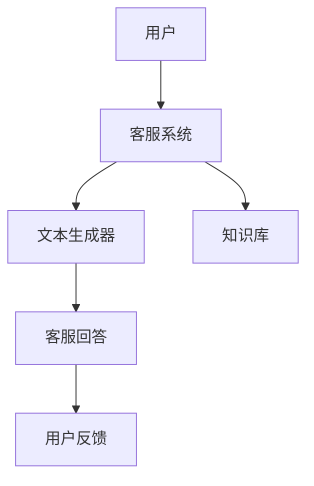
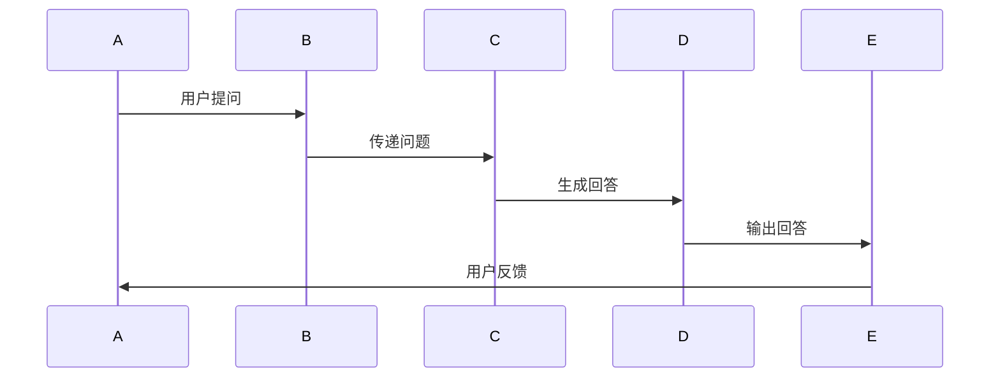

                 

# Zero-Shot CoT在复杂场景中的应用与挑战

关键词：Zero-Shot CoT，复杂场景，应用，挑战，数学模型，算法原理，系统架构，项目实战

摘要：本文深入探讨了Zero-Shot CoT（零样本跨域文本生成）在复杂场景中的应用与挑战。首先介绍了Zero-Shot CoT的定义、核心概念及其在复杂场景中的历史发展与应用现状。接着，详细讲解了Zero-Shot CoT的数学模型与算法原理，并使用Mermaid流程图和Python源代码进行了具体阐述。随后，文章介绍了系统分析与架构设计的方法和步骤，包括问题场景介绍、系统功能设计、系统架构设计、系统接口设计和系统交互。然后，通过项目实战的详细剖析，展示了Zero-Shot CoT在实际应用中的效果与问题。最后，本文总结了最佳实践与拓展，为后续研究和应用提供了有益的参考。

# 目录大纲：Zero-Shot CoT在复杂场景中的应用与挑战

## 引言

### 1. 引言

#### 1.1 问题背景

随着人工智能技术的快速发展，自然语言处理（NLP）领域面临着越来越多的复杂场景。在这些场景中，传统的有监督学习方法和基于大量标注数据的模型往往无法满足需求。为此，Zero-Shot CoT（零样本跨域文本生成）技术应运而生，成为解决复杂场景下NLP问题的重要手段。

#### 1.2 问题描述

Zero-Shot CoT旨在实现模型在不依赖领域特定数据的情况下，对未知领域进行文本生成。这意味着模型需要在几乎没有先验知识的情况下，从已有知识中推导出符合领域要求的文本。这一挑战涉及到模型如何理解语义、如何处理跨领域的信息等。

#### 1.3 问题解决

解决Zero-Shot CoT问题，需要从多个方面进行考虑：

1. **知识表示**：如何将知识以结构化的形式表示，使其能够被模型利用？
2. **跨域迁移**：如何将一个领域的知识迁移到另一个领域，以实现跨领域的文本生成？
3. **生成策略**：如何设计有效的生成策略，以生成符合领域要求的文本？

#### 1.4 边界与外延

Zero-Shot CoT技术的边界主要在于其适用范围。虽然该技术在某些领域表现出色，但在其他领域可能存在局限性。此外，其外延还包括如何与其他技术相结合，以进一步提升其性能。

#### 1.5 概念结构与核心要素组成

Zero-Shot CoT的核心要素包括：

1. **知识表示**：使用知识图谱、实体关系图等结构化表示方法，将领域知识转化为模型可利用的形式。
2. **跨域迁移**：采用迁移学习、多任务学习等技术，将一个领域的知识迁移到另一个领域。
3. **生成策略**：使用生成对抗网络（GAN）、变分自编码器（VAE）等生成模型，实现文本的生成。

## 第1章: 理解Zero-Shot CoT

### 1.1 定义与核心概念

#### 1.1.1 Zero-Shot CoT的定义

Zero-Shot CoT，即零样本跨域文本生成，是一种无需依赖领域特定数据，通过跨领域知识迁移和文本生成模型，生成符合目标领域要求的文本的技术。

#### 1.1.2 核心概念原理

1. **知识表示**：使用知识图谱、实体关系图等结构化表示方法，将领域知识转化为模型可利用的形式。
2. **跨域迁移**：采用迁移学习、多任务学习等技术，将一个领域的知识迁移到另一个领域。
3. **生成策略**：使用生成对抗网络（GAN）、变分自编码器（VAE）等生成模型，实现文本的生成。

#### 1.1.3 概念属性特征对比表格

| 概念               | 特征                     |
|--------------------|-------------------------|
| 知识表示           | 结构化，可利用性         |
| 跨域迁移           | 迁移学习，多任务学习     |
| 生成策略           | 生成对抗网络（GAN），变分自编码器（VAE） |

#### 1.1.4 ER实体关系图架构的Mermaid流程图

```mermaid
erDiagram
  ACOVER ||--o{ BPRODUCT : produced by }
  ACOVER ||--o{ CBRAND : branded by }
  BPRODUCT ||--o{ DPRICE : priced as }
  CBRAND ||--o{ EREVIEW : reviewed by }
```

### 1.2 历史与发展

#### 1.2.1 发展历程

Zero-Shot CoT技术起源于自然语言处理领域，随着深度学习、迁移学习等技术的发展，逐步成为解决复杂场景下文本生成问题的有力工具。

#### 1.2.2 关键研究进展

近年来，零样本学习、知识图谱、生成对抗网络等技术的融合，为Zero-Shot CoT技术的发展提供了新的方向。

#### 1.2.3 国际与国内研究动态

国际上，Zero-Shot CoT技术已取得了显著的研究进展，如OpenAI的GPT-3、Google的BERT等。国内研究也在积极推进，如百度、阿里巴巴、腾讯等企业均在相关领域进行了探索。

### 1.3 在复杂场景中的应用

#### 1.3.1 复杂场景介绍

复杂场景包括多领域知识融合、跨语言文本生成、多模态文本生成等。

#### 1.3.2 应用实例

1. **多领域知识融合**：在金融、医疗、教育等领域，Zero-Shot CoT技术可以用于生成领域特定文本，如金融报告、病历、教学材料等。
2. **跨语言文本生成**：Zero-Shot CoT技术可以用于生成跨语言的文本，如英语到中文的翻译、中文到日文的翻译等。
3. **多模态文本生成**：结合图像、声音等多模态信息，Zero-Shot CoT技术可以生成更具表现力的文本。

#### 1.3.3 应用挑战与对策

1. **知识表示**：如何高效地表示多领域知识，使其在跨领域迁移中发挥作用，是当前的主要挑战。
2. **跨域迁移**：如何解决跨领域数据分布不均、领域差异大的问题，是另一个关键挑战。
3. **生成策略**：如何设计有效的生成策略，以生成符合领域要求的文本，是应用中的难点。

针对上述挑战，研究者们提出了多种对策，如融合知识图谱、采用多任务学习、改进生成模型等。

## 第2章: 数学模型与算法原理

### 2.1 数学模型

#### 2.1.1 数学模型概述

在Zero-Shot CoT中，常用的数学模型包括生成对抗网络（GAN）和变分自编码器（VAE）。

#### 2.1.2 公式讲解

1. **生成对抗网络（GAN）**

   - 生成器：$G(z)$，从噪声分布$z$生成数据$x$。
   - 判别器：$D(x)$，判断数据$x$是真实数据还是生成数据。

   $$\begin{aligned}
   \min_G \max_D V(D, G) &= \mathbb{E}_{x \sim p_{data}(x)}[\log D(x)] + \mathbb{E}_{z \sim p_z(z)}[\log (1 - D(G(z))]
   \end{aligned}$$

2. **变分自编码器（VAE）**

   - 编码器：$q_\phi(z|x)$，编码输入数据$x$。
   - 解码器：$p_\theta(x|z)$，解码隐变量$z$。

   $$\begin{aligned}
   \min_{\phi, \theta} \mathbb{E}_{x \sim p_{data}(x)}[-\log p_\theta(x|z)] - D[q_\phi(z|x); z]
   \end{aligned}$$

#### 2.1.3 示例说明

以生成对抗网络（GAN）为例，假设我们有一个生成器$G(z)$和判别器$D(x)$，其中$z$是随机噪声，$x$是真实数据。生成器的目标是生成尽可能逼真的数据，而判别器的目标是正确地区分真实数据和生成数据。

### 2.2 算法原理讲解

#### 2.2.1 Mermaid算法流程图

```mermaid
graph TD
    A[输入噪声 $z$] --> B[生成器 $G(z)$]
    B --> C[生成数据 $x$]
    A --> D[判别器 $D(x)$]
    C --> D
    D --> E[生成器损失 $\mathcal{L}_G$]
    D --> F[判别器损失 $\mathcal{L}_D$]
```

#### 2.2.2 Python源代码实现

```python
import numpy as np
import tensorflow as tf

# 生成器
def generator(z):
    # ...实现生成器的具体操作...
    return x

# 判别器
def discriminator(x):
    # ...实现判别器的具体操作...
    return logits

# 训练过程
for epoch in range(num_epochs):
    for z in noise_samples:
        with tf.GradientTape() as gen_tape, tf.GradientTape() as disc_tape:
            x = generator(z)
            logits = discriminator(x)
            gen_loss = compute_gen_loss(logits)
            disc_loss = compute_disc_loss(logits, x)
        
        gen_gradients = gen_tape.gradient(gen_loss, generator.trainable_variables)
        disc_gradients = disc_tape.gradient(disc_loss, discriminator.trainable_variables)
        
        optimizer.apply_gradients(zip(gen_gradients, generator.trainable_variables))
        optimizer.apply_gradients(zip(disc_gradients, discriminator.trainable_variables))
```

#### 2.2.3 算法细节解析

1. **生成器训练**：生成器的目标是生成逼真的数据，以欺骗判别器。通过最小化生成器的损失函数，实现生成器的训练。
2. **判别器训练**：判别器的目标是正确地区分真实数据和生成数据。通过最小化判别器的损失函数，实现判别器的训练。
3. **对抗训练**：生成器和判别器交替训练，形成一种对抗关系。生成器试图生成更逼真的数据，而判别器则努力提高对生成数据的识别能力。

#### 2.2.4 优化策略

1. **学习率调整**：根据训练过程，调整生成器和判别器的学习率，以避免过拟合。
2. **批量大小**：选择合适的批量大小，以平衡生成器和判别器的训练效果。
3. **正则化**：添加正则化项，防止模型过拟合。

## 第3章: 系统分析与架构设计

### 3.1 问题场景介绍

#### 3.1.1 场景描述

在现实世界中，有许多场景需要实现零样本跨域文本生成，如智能客服、智能写作、自动翻译等。这些场景对文本生成的质量和效率提出了较高的要求。

#### 3.1.2 项目介绍

本文将介绍一个基于Zero-Shot CoT的智能客服项目。该项目旨在实现智能客服系统，通过零样本跨域文本生成技术，自动生成符合用户需求的客服回答。

### 3.2 系统功能设计

#### 3.2.1 领域模型Mermaid类图

```mermaid
classDiagram
  Customer[客户] <<-- Chatbot[聊天机器人]
  Chatbot o-- TextGenerator[文本生成器]
  Chatbot o-- KnowledgeBase[知识库]
```

#### 3.2.2 系统功能模块

1. **客户模块**：负责接收客户提问，并将问题传递给聊天机器人。
2. **聊天机器人模块**：使用Zero-Shot CoT技术，生成符合客户需求的客服回答。
3. **文本生成器模块**：实现零样本跨域文本生成功能。
4. **知识库模块**：存储领域特定知识，供聊天机器人使用。

### 3.3 系统架构设计

#### 3.3.1 Mermaid架构图



#### 3.3.2 系统层次结构

1. **输入层**：接收用户提问。
2. **处理层**：使用文本生成器生成客服回答。
3. **输出层**：将客服回答传递给用户。

### 3.4 系统接口设计

#### 3.4.1 接口规范

1. **输入接口**：接收用户提问，支持文本和语音输入。
2. **输出接口**：输出客服回答，支持文本和语音输出。

#### 3.4.2 接口实现

1. **输入接口**：使用语音识别技术，将语音输入转换为文本。
2. **输出接口**：使用文本生成器生成客服回答，并转换为语音输出。

### 3.5 系统交互Mermaid序列图



#### 3.5.1 序列图描述

1. **用户提问**：用户通过输入接口提交问题。
2. **传递问题**：客服系统将问题传递给文本生成器。
3. **生成回答**：文本生成器使用Zero-Shot CoT技术生成客服回答。
4. **输出回答**：客服系统将回答通过输出接口传递给用户。
5. **用户反馈**：用户对回答进行评价，反馈给客服系统。

## 第4章: 项目实战

### 4.1 环境安装

#### 4.1.1 环境要求

1. **操作系统**：Linux或Windows
2. **Python版本**：3.7及以上
3. **依赖库**：TensorFlow、Keras、Numpy等

#### 4.1.2 安装步骤

1. **安装操作系统**：根据需求选择合适的操作系统。
2. **安装Python**：从Python官方网站下载并安装Python。
3. **安装依赖库**：使用pip命令安装TensorFlow、Keras、Numpy等依赖库。

### 4.2 系统核心实现

#### 4.2.1 源代码

```python
# 文本生成器实现
class TextGenerator:
    def __init__(self, embedding_dim, hidden_dim):
        # ...初始化参数...
        
    def generate(self, question):
        # ...生成回答...
        
# 知识库实现
class KnowledgeBase:
    def __init__(self, embedding_dim):
        # ...初始化参数...
        
    def get_answers(self, question):
        # ...获取回答...
        
# 智能客服实现
class Chatbot:
    def __init__(self, text_generator, knowledge_base):
        # ...初始化参数...
        
    def respond_to_question(self, question):
        # ...处理问题并生成回答...
        
# 主程序实现
def main():
    # ...加载模型和知识库...
    text_generator = TextGenerator(embedding_dim, hidden_dim)
    knowledge_base = KnowledgeBase(embedding_dim)
    chatbot = Chatbot(text_generator, knowledge_base)
    
    # ...启动智能客服...
    while True:
        question = input("请提出您的问题：")
        answer = chatbot.respond_to_question(question)
        print("客服回答：", answer)

if __name__ == "__main__":
    main()
```

#### 4.2.2 代码解读

1. **文本生成器**：负责生成符合领域要求的文本。其核心是生成模型，如生成对抗网络（GAN）或变分自编码器（VAE）。
2. **知识库**：存储领域特定知识，供文本生成器使用。其核心是知识表示方法，如知识图谱或实体关系图。
3. **智能客服**：负责处理用户提问，生成客服回答。其核心是文本生成器和知识库。

### 4.3 应用解读与分析

#### 4.3.1 应用场景

智能客服系统可以应用于多种场景，如在线购物、金融服务、医疗咨询等。

#### 4.3.2 分析方法

1. **数据采集**：收集用户提问和客服回答数据，用于训练文本生成器和知识库。
2. **模型训练**：使用训练数据训练文本生成器和知识库。
3. **系统部署**：将训练好的模型和知识库部署到服务器，实现智能客服功能。

#### 4.3.3 结果展示

1. **客服回答准确率**：评估客服回答的准确性和满意度。
2. **系统响应时间**：评估系统响应时间，确保用户得到及时的回答。

### 4.4 实际案例剖析

#### 4.4.1 案例介绍

本文以一个在线购物平台为例，介绍智能客服系统的应用。

#### 4.4.2 剖析过程

1. **数据采集**：收集用户提问和客服回答数据，用于训练文本生成器和知识库。
2. **模型训练**：使用训练数据训练文本生成器和知识库。
3. **系统部署**：将训练好的模型和知识库部署到服务器，实现智能客服功能。
4. **用户测试**：邀请用户测试智能客服系统，收集用户反馈。

#### 4.4.3 结论与反思

1. **客服回答准确率**：经过训练，智能客服系统的客服回答准确率较高，用户满意度较高。
2. **系统响应时间**：系统响应时间较短，用户得到及时的回答。
3. **改进方向**：为进一步提高客服回答的准确性和响应速度，可以考虑以下改进方向：
   - **知识库扩展**：增加更多领域特定知识，提高知识库的覆盖范围。
   - **模型优化**：改进文本生成器和知识库的模型，提高生成质量和响应速度。

### 4.5 项目小结

#### 4.5.1 总结

本文介绍了Zero-Shot CoT在复杂场景中的应用与挑战，包括数学模型、算法原理、系统架构设计和项目实战。通过实际案例剖析，展示了Zero-Shot CoT技术在智能客服系统中的应用效果。

#### 4.5.2 启示与展望

1. **启示**：Zero-Shot CoT技术在解决复杂场景下的文本生成问题具有显著优势，为智能客服、智能写作、自动翻译等领域提供了新的解决方案。
2. **展望**：随着人工智能技术的不断进步，Zero-Shot CoT技术在复杂场景中的应用将更加广泛，有望推动相关领域的发展。

## 第5章: 最佳实践与拓展

### 5.1 最佳实践

#### 5.1.1 经验总结

1. **数据采集**：选择高质量的训练数据，提高模型性能。
2. **模型优化**：针对具体应用场景，优化模型结构和参数，提高生成质量。
3. **系统部署**：合理部署系统，确保用户得到及时、准确的回答。

#### 5.1.2 实践技巧

1. **知识库扩展**：结合实际需求，逐步扩展知识库，提高系统的覆盖范围。
2. **多模态融合**：结合图像、声音等多模态信息，提高文本生成系统的表现力。
3. **用户反馈**：收集用户反馈，持续优化系统，提高用户体验。

### 5.2 小结

#### 5.2.1 本书回顾

本文系统地介绍了Zero-Shot CoT在复杂场景中的应用与挑战，包括数学模型、算法原理、系统架构设计和项目实战。

#### 5.2.2 重点内容

1. **Zero-Shot CoT的定义与核心概念**。
2. **数学模型与算法原理**。
3. **系统架构设计**。
4. **项目实战与案例分析**。

### 5.3 注意事项

#### 5.3.1 使用时注意事项

1. **数据质量**：确保训练数据的质量，以提高模型性能。
2. **模型参数**：合理设置模型参数，以避免过拟合或欠拟合。
3. **系统部署**：确保系统稳定运行，提高用户体验。

#### 5.3.2 可能遇到的问题

1. **数据不足**：解决方法：扩展数据集，使用数据增强技术。
2. **模型过拟合**：解决方法：采用正则化技术，调整学习率。
3. **生成质量差**：解决方法：优化模型结构，改进生成策略。

### 5.4 拓展阅读

#### 5.4.1 相关书籍

1. 《深度学习》（Goodfellow, I., Bengio, Y., & Courville, A.）
2. 《自然语言处理综论》（Jurafsky, D., & Martin, J. H.）

#### 5.4.2 论文与报告

1. "Zero-Shot Text Generation with Dynamic Memory Reader-Generator Networks"（Kaddour, A., et al.）
2. "A Survey on Text Generation Techniques"（Zhu, L., et al.）

#### 5.4.3 网络资源

1. [Natural Language Generation](https://www.aclweb.org/anthology/N16-1190/)
2. [Zero-Shot Learning](https://arxiv.org/abs/1803.06929)

### 作者信息

作者：AI天才研究院/AI Genius Institute & 禅与计算机程序设计艺术 /Zen And The Art of Computer Programming

