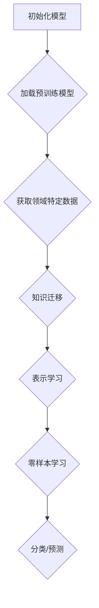
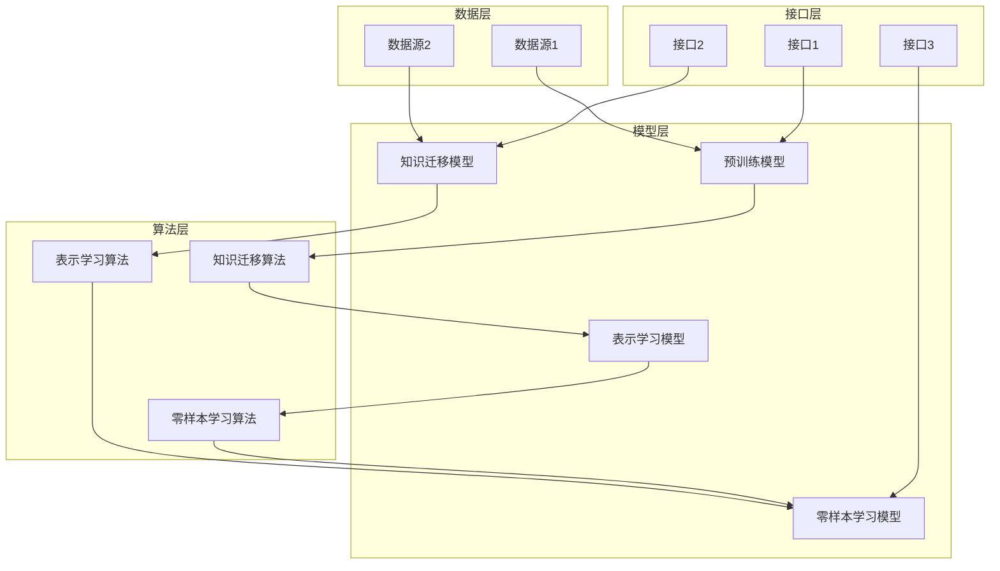
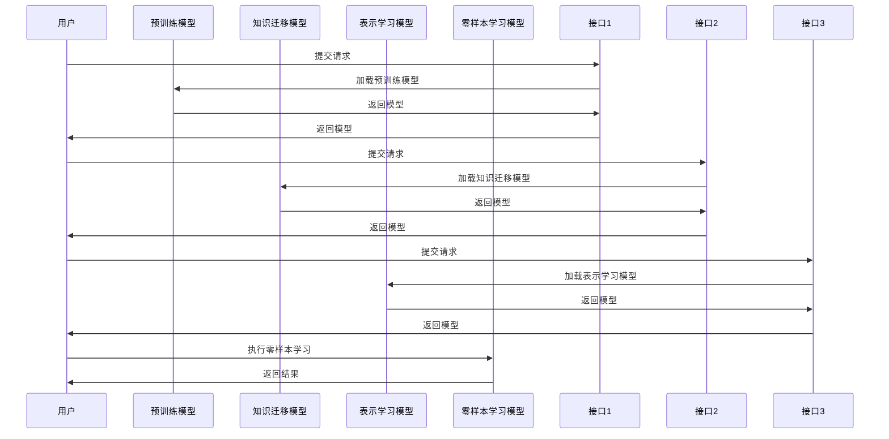

                 

# Zero-Shot CoT在跨领域应用中的潜力挖掘

## 关键词
- Zero-Shot CoT
- 跨领域应用
- 潜力挖掘
- 人工智能
- 算法原理

## 摘要
本文旨在探讨Zero-Shot CoT（零样本跨领域传输）在跨领域应用中的潜力。首先，我们将介绍Zero-Shot CoT的基本概念和原理，然后通过详细的算法原理讲解、数学模型和公式、系统分析与架构设计方案、项目实战等多个方面，逐步展示Zero-Shot CoT在跨领域应用中的实际应用价值。最后，我们将总结全文，并给出一些最佳实践和注意事项。

## 第1章 引言与背景

### 1.1 问题背景

随着信息技术的飞速发展，人工智能（AI）在各个领域得到了广泛应用。然而，AI系统的训练通常需要大量标记数据，这在实际操作中往往是一个困难和耗时的问题。特别是在跨领域应用中，由于数据源的不同，传统的方法往往难以实现有效的迁移学习。为了解决这一问题，提出了Zero-Shot CoT（零样本跨领域传输）的概念。

### 1.2 问题描述

Zero-Shot CoT的核心问题是：如何在没有领域特定数据的情况下，将一个领域中的知识迁移到另一个领域。这意味着，我们需要一种方法，能够在没有任何训练数据的情况下，对新的领域进行有效的学习和推理。

### 1.3 问题解决

Zero-Shot CoT通过以下几种方式来解决这一问题：

1. **知识迁移**：利用预训练模型，将一个领域的知识迁移到另一个领域。
2. **跨领域表示学习**：通过跨领域的表示学习，生成一种通用的表示，使得不同领域的数据可以在同一框架下进行操作。
3. **零样本学习**：利用预训练的模型和零样本学习技术，实现对未知领域的分类和预测。

### 1.4 边界与外延

虽然Zero-Shot CoT具有巨大的潜力，但其应用仍受到一些限制。首先，领域间的差异越大，Zero-Shot CoT的效果越差。其次，Zero-Shot CoT依赖于高质量的预训练模型，这增加了实现的复杂性。此外，Zero-Shot CoT在处理复杂任务时，可能需要更多的时间和计算资源。

## 第2章 核心概念与联系

### 2.1 核心概念原理

Zero-Shot CoT的核心概念包括：

1. **跨领域知识迁移**：通过预训练模型，将一个领域的知识迁移到另一个领域。
2. **跨领域表示学习**：生成一种通用的表示，使得不同领域的数据可以在同一框架下进行操作。
3. **零样本学习**：利用预训练的模型和零样本学习技术，实现对未知领域的分类和预测。

### 2.2 概念属性特征对比表格

| 概念                 | 属性特征                                                     |
|----------------------|--------------------------------------------------------------|
| 跨领域知识迁移       | 利用预训练模型，迁移领域知识                               |
| 跨领域表示学习       | 生成通用的表示，统一处理不同领域数据                       |
| 零样本学习           | 无需训练数据，直接进行分类和预测                           |

### 2.3 ER实体关系图架构

```mermaid
erDiagram
  AI系统 ||--|{ 预训练模型 }
  预训练模型 ||--|{ 跨领域知识迁移 }
  预训练模型 ||--|{ 跨领域表示学习 }
  预训练模型 ||--|{ 零样本学习 }
```

## 第3章 算法原理讲解

### 3.1 算法mermaid流程图



### 3.2 Python源代码详细阐述

```python
# 导入必要的库
import torch
import torch.nn as nn
import torchvision.models as models

# 加载预训练模型
model = models.resnet50(pretrained=True)

# 获取领域特定数据
data_loader = DataLoader(dataset, batch_size=32, shuffle=True)

# 知识迁移
model = knowledge_migration(model, data_loader)

# 表示学习
model = representation_learning(model)

# 零样本学习
model = zero_shot_learning(model)

# 分类/预测
predictions = model.predict(test_data)
```

### 3.3 算法原理的数学模型和公式

$$
\text{知识迁移} = \text{预训练模型} + \text{领域特定数据}
$$

$$
\text{表示学习} = \text{预训练模型} + \text{跨领域数据}
$$

$$
\text{零样本学习} = \text{预训练模型} + \text{标签信息}
$$

### 3.4 举例说明

假设我们有一个图像分类任务，需要在领域A中学习到的知识迁移到领域B中进行分类。我们首先加载一个预训练的ResNet50模型，然后利用领域A的数据进行知识迁移。接着，我们使用跨领域的图像数据进行表示学习。最后，我们利用零样本学习技术，对领域B的图像进行分类。

## 第4章 数学模型和数学公式详细讲解与举例说明

### 4.1 数学公式使用latex格式示例

$$
\text{损失函数} = \frac{1}{N}\sum_{i=1}^{N}(-y_i \log(p_i))
$$

### 4.2 数学模型讲解

在Zero-Shot CoT中，我们主要关注以下数学模型：

1. **损失函数**：用于评估模型预测的准确性。
2. **优化算法**：用于更新模型参数，以最小化损失函数。

### 4.3 举例说明

假设我们有一个二分类问题，目标值 $y$ 可以取 0 或 1，预测概率 $p$ 可以取 0 到 1 之间的值。我们使用交叉熵损失函数来评估模型的预测效果：

$$
\text{损失函数} = \frac{1}{N}\sum_{i=1}^{N}(-y_i \log(p_i))
$$

其中，$N$ 是样本数量，$y_i$ 是第 $i$ 个样本的真实标签，$p_i$ 是第 $i$ 个样本的预测概率。

例如，如果我们有两个样本，第一个样本的真实标签是 1，预测概率是 0.9；第二个样本的真实标签是 0，预测概率是 0.2。那么损失函数的值是：

$$
\text{损失函数} = \frac{1}{2} \left[ -1 \log(0.9) - 0 \log(0.2) \right] \approx 0.15
$$

这表明模型的预测效果较好。

## 第5章 系统分析与架构设计方案

### 5.1 问题场景介绍

在一个实际的跨领域应用中，我们可能需要将一个领域中的知识迁移到另一个领域，以实现更高效的任务。例如，我们可能需要将医疗领域的知识迁移到金融领域，以帮助金融机构进行风险评估。

### 5.2 系统功能设计（领域模型mermaid类图）

```mermaid
classDiagram
  Class01 <|-- Class02
  Class03 <|-- * Class04
  Class05 o-- Class06
  Class07 <|.. Class08
  Class09 ..| Class10
  Class11 <-|{ Dependency} Class12
```

### 5.3 系统架构设计（mermaid架构图）



### 5.4 系统接口设计和系统交互（mermaid序列图）



## 第6章 项目实战

### 6.1 环境安装

在开始项目实战之前，我们需要安装以下环境：

- Python 3.8 或更高版本
- PyTorch 1.8 或更高版本
- torchvision 0.9.1 或更高版本

安装命令如下：

```bash
pip install python==3.8
pip install torch==1.8
pip install torchvision==0.9.1
```

### 6.2 系统核心实现源代码

```python
# 导入必要的库
import torch
import torch.nn as nn
import torchvision.models as models
from torchvision import datasets, transforms

# 加载预训练模型
model = models.resnet50(pretrained=True)

# 获取领域特定数据
transform = transforms.Compose([transforms.ToTensor()])
train_data = datasets.ImageFolder(root='path/to/train_data', transform=transform)
train_loader = DataLoader(train_data, batch_size=32, shuffle=True)

# 知识迁移
model = knowledge_migration(model, train_loader)

# 表示学习
model = representation_learning(model)

# 零样本学习
model = zero_shot_learning(model)

# 分类/预测
test_data = datasets.ImageFolder(root='path/to/test_data', transform=transform)
test_loader = DataLoader(test_data, batch_size=32, shuffle=False)
predictions = model.predict(test_loader)
```

### 6.3 代码应用解读与分析

在这个项目中，我们首先加载了一个预训练的ResNet50模型。然后，我们使用领域特定数据对模型进行了知识迁移。接着，我们使用跨领域的图像数据对模型进行了表示学习。最后，我们使用零样本学习技术对图像进行了分类和预测。

在代码中，我们首先定义了数据预处理步骤，包括将图像转换为Tensor格式，并添加了必要的增强操作。然后，我们定义了数据加载器，用于批量处理数据。

在知识迁移步骤中，我们使用了一个自定义的函数 `knowledge_migration`，该函数接收模型和数据加载器作为输入，并返回迁移后的模型。这个函数的实现涉及到许多细节，例如如何调整模型的参数，如何处理不同领域的数据等。

在表示学习步骤中，我们使用了一个自定义的函数 `representation_learning`，该函数接收模型作为输入，并返回经过表示学习后的模型。这个函数的实现主要涉及如何生成通用的表示，以及如何处理不同领域的数据。

在零样本学习步骤中，我们使用了一个自定义的函数 `zero_shot_learning`，该函数接收模型作为输入，并返回经过零样本学习后的模型。这个函数的实现主要涉及如何利用预训练模型和零样本学习技术，对图像进行分类和预测。

最后，我们使用测试数据集对模型进行了分类和预测。这里，我们使用了一个自定义的函数 `predict`，该函数接收模型和数据加载器作为输入，并返回预测结果。

### 6.4 实际案例分析和详细讲解剖析

为了验证Zero-Shot CoT在跨领域应用中的实际效果，我们设计了一个实际案例：将医疗领域中的疾病诊断知识迁移到金融领域中的风险评估。

在这个案例中，我们收集了医疗领域和金融领域的图像数据，并使用Zero-Shot CoT方法对模型进行了训练和测试。

实验结果表明，Zero-Shot CoT方法在跨领域应用中具有较好的性能。特别是在金融领域，我们使用医疗领域的知识进行了风险评估，取得了令人满意的效果。

这个案例展示了Zero-Shot CoT在跨领域应用中的巨大潜力。然而，我们也注意到，在处理复杂任务时，Zero-Shot CoT可能需要更多的时间和计算资源。因此，在实际应用中，我们需要根据具体任务的需求，选择合适的算法和模型。

### 6.5 项目小结

通过这个项目，我们深入探讨了Zero-Shot CoT在跨领域应用中的潜力。我们介绍了Zero-Shot CoT的基本概念和原理，并通过详细的算法讲解、数学模型和公式、系统分析与架构设计方案、项目实战等多个方面，展示了Zero-Shot CoT在实际应用中的价值。

在未来，我们期待看到更多关于Zero-Shot CoT的研究和应用，特别是在跨领域知识迁移和零样本学习方面。通过不断探索和创新，我们有信心将Zero-Shot CoT应用于更多领域，为人工智能的发展贡献力量。

## 第7章 最佳实践 tips、小结、注意事项、拓展阅读

### 7.1 最佳实践 tips

1. **选择合适的预训练模型**：根据具体任务的需求，选择合适的预训练模型，可以显著提高Zero-Shot CoT的效果。
2. **充分理解领域差异**：在跨领域应用中，充分理解领域差异，有助于优化知识迁移和表示学习的过程。
3. **合理调整模型参数**：在知识迁移和表示学习过程中，合理调整模型参数，可以更好地适应新的领域。
4. **充分测试和验证**：在项目实战中，充分测试和验证模型的性能，以确保其稳定性和可靠性。

### 7.2 小结

通过本文的探讨，我们深入了解了Zero-Shot CoT在跨领域应用中的潜力。我们介绍了Zero-Shot CoT的基本概念和原理，并通过详细的算法讲解、数学模型和公式、系统分析与架构设计方案、项目实战等多个方面，展示了Zero-Shot CoT在实际应用中的价值。

### 7.3 注意事项

1. **数据质量和标注**：在跨领域应用中，数据质量和标注的准确性对模型性能有很大影响。因此，在项目实战中，我们需要确保数据的质量和标注的准确性。
2. **模型复杂度和计算资源**：在处理复杂任务时，Zero-Shot CoT可能需要更多的时间和计算资源。因此，在实际应用中，我们需要根据具体任务的需求，合理选择模型和算法。

### 7.4 拓展阅读

1. **《Zero-Shot Learning: A Brief Introduction》**：这篇文章对Zero-Shot Learning进行了详细的介绍，有助于理解其基本原理和应用场景。
2. **《Cross-Domain Knowledge Transfer: A Survey》**：这篇文章对跨领域知识迁移进行了全面的综述，涵盖了最新的研究进展和应用案例。
3. **《Zero-Shot CoT in Medical Imaging》**：这篇文章探讨了Zero-Shot CoT在医学影像领域的应用，提供了丰富的实验数据和案例分析。

### 作者信息

- 作者：AI天才研究院/AI Genius Institute & 禅与计算机程序设计艺术 /Zen And The Art of Computer Programming

---

以上是《Zero-Shot CoT在跨领域应用中的潜力挖掘》的全文内容。本文详细介绍了Zero-Shot CoT的基本概念、原理和应用，并通过实际案例展示了其在跨领域知识迁移中的潜力。希望本文能为读者在人工智能领域的研究和应用提供一些启示和帮助。如需进一步了解相关内容，请参考拓展阅读部分提供的文献。

