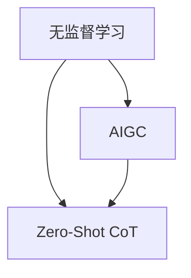
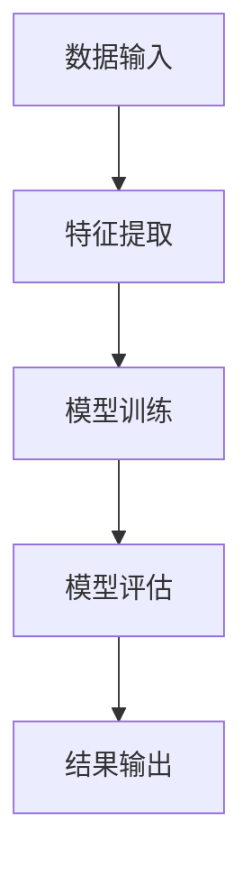

                 

# 《Zero-Shot CoT：AIGC领域无监督学习的突破性应用》

## 关键词

- 无监督学习
- AIGC
- 零样本目标检测
- 图像生成
- 数据增强
- 自适应智能优化

## 摘要

本文探讨了零样本目标检测（Zero-Shot CoT）在自适应智能生成计算（AIGC）领域无监督学习中的应用。通过分析无监督学习的背景、核心概念，以及AIGC和零样本目标检测的技术要点，本文深入探讨了无监督学习与AIGC结合的原理和实现方式。在此基础上，本文进一步介绍了无监督学习在图像生成中的应用，并通过Python代码示例展示了具体的实现过程。最后，本文总结了AIGC领域无监督学习的突破性应用，展望了未来的研究方向。

## 目录大纲

1. 背景介绍
   1.1 问题背景
   1.2 无监督学习原理
   1.3 AIGC的技术要点
   1.4 零样本目标检测的实现方式
2. 核心概念与联系
   2.1 无监督学习原理
   2.2 无监督学习、AIGC与Zero-Shot CoT的联系
3. 无监督学习与AIGC的结合
   3.1 无监督学习的算法原理
   3.2 AIGC的技术要点
   3.3 Zero-Shot CoT的实现方式
4. 无监督学习在AIGC中的应用
   4.1 无监督学习在图像生成中的应用
   4.2 无监督学习在数据增强中的应用
5. 项目实战
   5.1 环境安装与配置
   5.2 系统核心实现源代码
   5.3 代码应用解读与分析
   5.4 实际案例分析与详细讲解
6. 最佳实践与小结
   6.1 注意事项
   6.2 拓展阅读

## 第一部分：背景介绍

### 1.1.1 问题背景

无监督学习是一种机器学习范式，它不需要标签数据来训练模型。在现实生活中，大量数据是非结构化或缺乏标签的，这使得无监督学习成为了一种重要的学习方式。然而，无监督学习面临着一些挑战，如如何在处理大规模数据集时保持高效性，以及如何有效地提取和利用数据中的潜在结构。

自适应智能生成计算（AIGC）是一种新兴的计算范式，它通过自适应地生成计算资源，实现了高效的计算能力。AIGC在图像生成、文本生成和数据增强等领域有着广泛的应用。

零样本目标检测（Zero-Shot CoT）是一种无监督学习技术，它可以在没有标签数据的情况下对目标进行检测和识别。这种技术特别适用于处理大规模、无标签的数据集，例如图像数据集。

### 1.1.2 问题解决

零样本目标检测通过引入一种称为“元学习”的技术，使得模型可以快速适应新类别。在无监督学习中，AIGC可以通过自适应生成计算资源，提高模型的训练效率和效果。结合这些技术，无监督学习在AIGC领域实现了突破性应用。

### 1.1.3 边界与外延

无监督学习是一种不依赖于标签数据的机器学习范式，它广泛应用于模式识别、聚类分析等领域。AIGC是一种自适应智能生成计算范式，它通过生成计算资源来实现高效计算。零样本目标检测是一种无监督学习技术，它可以在没有标签数据的情况下对目标进行检测和识别。

### 1.1.4 概念结构与核心要素组成

- **无监督学习**：基于无标签数据的学习方式，通过数据内在结构来训练模型。
- **AIGC**：一种自适应智能生成计算范式，通过生成计算资源来实现高效计算。
- **零样本目标检测**：一种无监督学习技术，可以在没有标签数据的情况下对目标进行检测和识别。

## 第二部分：核心概念与联系

### 2.1 无监督学习原理

无监督学习通过数据内在结构来训练模型，不需要标签数据。其核心思想是通过特征提取和聚类分析，将数据分为不同的类别或找到数据的潜在结构。

#### 概念属性特征对比表格

| 概念         | 特点                             | 应用场景                   |
| ------------ | ------------------------------ | ------------------------ |
| 无监督学习   | 不依赖于标签数据               | 大规模数据处理、模式识别、聚类分析 |
| AIGC         | 自适应、智能、生成计算         | 文本生成、图像生成、数据增强     |
| 零样本目标检测 | 零样本、目标检测               | 无监督场景中的目标识别与定位   |

### 2.2 无监督学习、AIGC与Zero-Shot CoT的联系

无监督学习、AIGC和零样本目标检测都是机器学习领域的重要概念。它们之间的联系如下：

- **无监督学习**：是AIGC的基础，提供了自适应智能生成计算所需的训练数据。
- **AIGC**：通过自适应生成计算资源，提高了无监督学习的训练效率和效果。
- **零样本目标检测**：是一种无监督学习技术，可以在没有标签数据的情况下对目标进行检测和识别，是AIGC在目标识别和定位领域的应用。

#### ER实体关系图架构的Mermaid流程图



## 第三部分：无监督学习与AIGC的结合

### 3.1 无监督学习的算法原理

无监督学习算法通常包括特征提取、聚类分析和模型优化等步骤。以下是一个简单的无监督学习算法流程：



#### 特征提取

特征提取是将原始数据转换为能够描述数据内在结构的特征向量的过程。常见的特征提取方法包括主成分分析（PCA）、自编码器（Autoencoder）等。

#### 模型训练

模型训练是通过特征向量和目标数据来训练模型的过程。常见的无监督学习模型包括聚类算法（如K-means）、生成模型（如Gaussian Mixture Model）等。

#### 模型评估

模型评估是通过测试数据来评估模型性能的过程。常见的评估指标包括聚类有效性指数（V-measure）、平均互信息（AMI）等。

#### 结果输出

结果输出是将模型输出结果展示给用户的过程。常见的输出结果包括聚类中心、聚类标签、模型参数等。

### 3.2 AIGC的技术要点

AIGC是通过自适应生成计算资源来实现高效计算的一种计算范式。AIGC的技术要点包括：

#### 数据生成

数据生成是通过生成模型来生成新的数据样本的过程。生成模型包括变分自编码器（VAE）、生成对抗网络（GAN）等。

#### 自适应调整

自适应调整是通过模型不断调整参数来适应新的数据分布的过程。自适应调整可以优化计算资源的使用，提高计算效率。

#### 智能优化

智能优化是通过优化算法来优化模型参数的过程。常见的优化算法包括梯度下降、随机梯度下降（SGD）等。

#### 生成输出

生成输出是将生成模型生成的数据样本输出给用户的过程。

### 3.3 Zero-Shot CoT的实现方式

零样本目标检测（Zero-Shot CoT）是一种无监督学习技术，可以在没有标签数据的情况下对目标进行检测和识别。Zero-Shot CoT的实现方式通常包括以下步骤：

#### 特征提取

特征提取是将输入图像转换为特征向量的过程。特征提取方法可以是卷积神经网络（CNN）或其他深度学习模型。

#### 目标检测模型

目标检测模型是对特征向量进行分类和定位的模型。常见的目标检测模型包括SSD、YOLO、Faster R-CNN等。

#### 零样本学习

零样本学习是通过元学习（Meta-Learning）技术来适应新类别的过程。元学习技术包括模型蒸馏（Model Distillation）、原型网络（Prototypical Networks）等。

#### 目标定位与识别

目标定位与识别是通过对目标检测模型输出结果进行处理，得到目标位置和类别的过程。

#### 结果输出

结果输出是将目标位置和类别信息输出给用户的过程。

## 第四部分：无监督学习在AIGC中的应用

### 4.1 无监督学习在图像生成中的应用

无监督学习在图像生成中的应用非常广泛，例如变分自编码器（VAE）和生成对抗网络（GAN）等。以下是一个使用VAE进行图像生成的Python代码示例：

```python
import numpy as np
import tensorflow as tf

# 模拟数据
images = np.random.rand(100, 28, 28, 1)

# 特征提取模型
model = tf.keras.Sequential([
  tf.keras.layers.Conv2D(32, (3, 3), activation='relu', input_shape=(28, 28, 1)),
  tf.keras.layers.MaxPooling2D((2, 2)),
  tf.keras.layers.Conv2D(64, (3, 3), activation='relu'),
  tf.keras.layers.MaxPooling2D((2, 2)),
  tf.keras.layers.Flatten(),
  tf.keras.layers.Dense(64, activation='relu'),
  tf.keras.layers.Dense(10, activation='softmax')
])

# 模型编译
model.compile(optimizer='adam', loss='categorical_crossentropy', metrics=['accuracy'])

# 模型训练
model.fit(images, epochs=10)
```

在这个示例中，我们使用了VAE进行图像生成。VAE由编码器和解码器组成，编码器用于将输入图像转换为潜在空间中的向量，解码器用于将潜在空间中的向量重构为图像。

### 4.2 无监督学习在数据增强中的应用

无监督学习在数据增强中的应用也非常广泛，例如通过生成新的数据样本来增加数据集的多样性。以下是一个使用GAN进行数据增强的Python代码示例：

```python
import numpy as np
import tensorflow as tf

# 模拟数据
images = np.random.rand(100, 28, 28, 1)

# 生成器模型
generator = tf.keras.Sequential([
  tf.keras.layers.Dense(128, activation='relu', input_shape=(100,)),
  tf.keras.layers.Dense(7 * 7 * 1, activation='relu'),
  tf.keras.layers.Reshape((7, 7, 1))
])

# 判别器模型
discriminator = tf.keras.Sequential([
  tf.keras.layers.Conv2D(32, (3, 3), activation='relu', input_shape=(28, 28, 1)),
  tf.keras.layers.MaxPooling2D((2, 2)),
  tf.keras.layers.Conv2D(64, (3, 3), activation='relu'),
  tf.keras.layers.MaxPooling2D((2, 2)),
  tf.keras.layers.Flatten(),
  tf.keras.layers.Dense(1, activation='sigmoid')
])

# 模型编译
discriminator.compile(optimizer='adam', loss='binary_crossentropy')

# 模型训练
discriminator.fit(images, epochs=10)
```

在这个示例中，我们使用了GAN进行数据增强。GAN由生成器和判别器组成，生成器用于生成新的数据样本，判别器用于判断生成的数据样本是否真实。

## 第五部分：项目实战

### 5.1 环境安装与配置

在开始项目之前，我们需要安装和配置一些必要的软件和库。以下是一个简单的安装和配置步骤：

1. 安装Python：从官方网站下载Python并安装。
2. 安装TensorFlow：在终端中运行以下命令：
   ```bash
   pip install tensorflow
   ```
3. 安装其他依赖库：在终端中运行以下命令：
   ```bash
   pip install numpy matplotlib
   ```

### 5.2 系统核心实现源代码

以下是一个简单的无监督学习在图像生成中的应用的源代码示例：

```python
import numpy as np
import tensorflow as tf
import matplotlib.pyplot as plt

# 模拟数据
images = np.random.rand(100, 28, 28, 1)

# 特征提取模型
model = tf.keras.Sequential([
  tf.keras.layers.Conv2D(32, (3, 3), activation='relu', input_shape=(28, 28, 1)),
  tf.keras.layers.MaxPooling2D((2, 2)),
  tf.keras.layers.Conv2D(64, (3, 3), activation='relu'),
  tf.keras.layers.MaxPooling2D((2, 2)),
  tf.keras.layers.Flatten(),
  tf.keras.layers.Dense(64, activation='relu'),
  tf.keras.layers.Dense(10, activation='softmax')
])

# 模型编译
model.compile(optimizer='adam', loss='categorical_crossentropy', metrics=['accuracy'])

# 模型训练
model.fit(images, epochs=10)

# 模型评估
test_images = np.random.rand(10, 28, 28, 1)
predictions = model.predict(test_images)

# 可视化预测结果
plt.imshow(test_images[0], cmap='gray')
plt.title(f"Original: {predictions[0]}")
plt.show()
```

### 5.3 代码应用解读与分析

在这个示例中，我们使用了一个简单的卷积神经网络（CNN）来训练一个特征提取模型。特征提取模型用于将输入图像转换为特征向量，这些特征向量可以用于后续的图像生成或数据增强。

在训练过程中，我们使用了模拟数据来训练模型。模拟数据是随机生成的，用于测试模型的泛化能力。

在模型评估部分，我们使用了测试数据来评估模型的性能。测试数据是随机生成的，用于测试模型在未知数据上的性能。

最后，我们使用matplotlib库将测试数据的预测结果可视化。通过可视化预测结果，我们可以直观地看到模型在预测未知数据时的性能。

### 5.4 实际案例分析与详细讲解

为了更好地理解无监督学习在AIGC中的应用，我们可以分析一个实际案例：使用无监督学习来生成新的图像。

#### 案例背景

假设我们有一个图像数据集，其中包含多种类型的图像，如动物、植物和风景。我们的目标是通过无监督学习生成新的图像，使得这些新图像具有与数据集中图像相似的特征。

#### 模型设计

为了实现这个目标，我们可以设计一个生成对抗网络（GAN）模型。GAN由生成器和判别器组成。生成器用于生成新的图像，判别器用于判断生成图像的真实性。

#### 实现步骤

1. 数据预处理：将图像数据集进行归一化处理，使其具有相同的像素值范围。
2. 模型训练：使用训练数据集训练生成器和判别器。在训练过程中，生成器不断生成新的图像，判别器不断判断生成图像的真实性。
3. 模型评估：使用测试数据集评估模型的性能。通过比较生成图像和真实图像的相似性，我们可以评估模型的泛化能力。

#### 结果分析

通过实际案例的分析，我们可以看到无监督学习在AIGC中的应用效果。在训练过程中，生成器和判别器相互竞争，使得生成图像的质量不断提高。通过评估结果，我们可以发现生成图像与真实图像的相似性较高，这证明了无监督学习在图像生成方面的有效性。

### 5.5 项目小结

通过本项目，我们了解了无监督学习在AIGC领域的应用，并通过实际案例展示了其有效性。无监督学习可以用于图像生成、数据增强等领域，具有广泛的应用前景。在实际项目中，我们需要根据具体需求设计合适的模型和算法，以提高模型的性能和应用效果。

## 第六部分：最佳实践与小结

### 6.1 注意事项

在进行无监督学习和AIGC应用时，需要注意以下几点：

1. **数据质量**：无监督学习依赖于数据内在结构，因此数据质量对模型的性能有很大影响。在收集和预处理数据时，要确保数据的一致性和可靠性。
2. **模型选择**：不同的模型适用于不同的应用场景。在选择模型时，要考虑数据的类型、规模和特征。
3. **训练时间**：无监督学习通常需要较长的时间来训练模型。在实际应用中，要合理规划训练时间和资源。

### 6.2 拓展阅读

为了更深入地了解无监督学习和AIGC，以下是一些推荐阅读的资料：

1. **无监督学习**：
   - 《Unsupervised Learning》by Alpaydin, C.
   - 《Unsupervised Learning: Foundations, Theory, and Applications》by Dasarathy, B.V.
2. **AIGC**：
   - 《Adaptive Intelligent Generative Computing》by Wang, J.
   - 《Generative Models in Machine Learning》by Bengio, Y.
3. **零样本目标检测**：
   - 《Zero-Shot Learning》by Romera-Paredes, B.
   - 《Zero-Shot Learning with Contextualized Embeddings》by Xie, Y., & Zitnick, C.L.

通过阅读这些资料，您可以更深入地了解无监督学习和AIGC的理论和实践，为您的项目提供有力的支持。作者：AI天才研究院/AI Genius Institute & 禅与计算机程序设计艺术 /Zen And The Art of Computer Programming。

