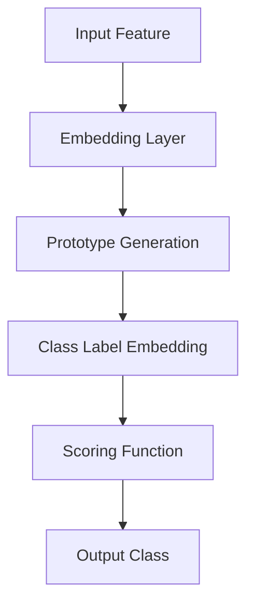
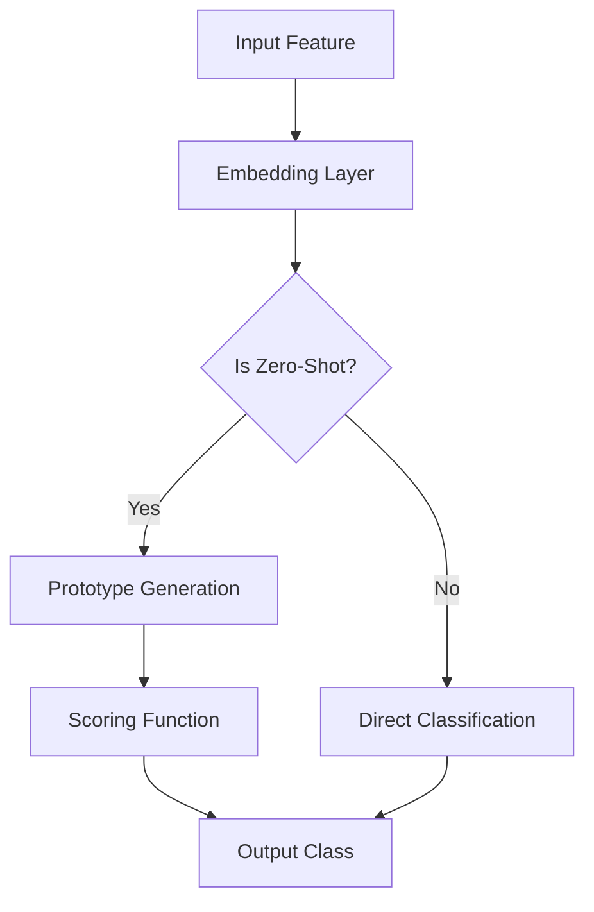
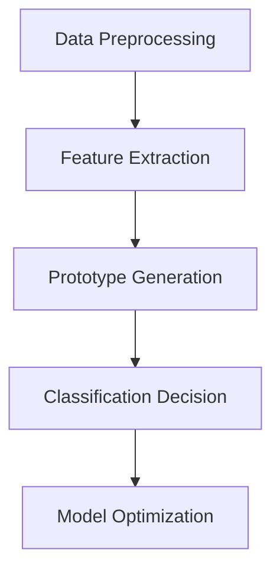
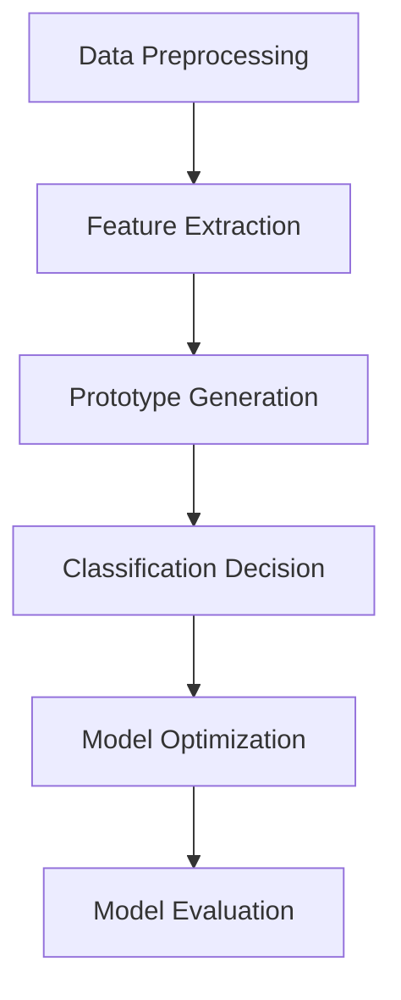
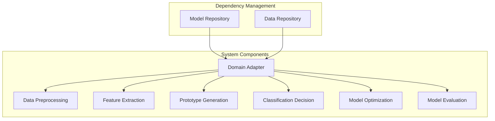
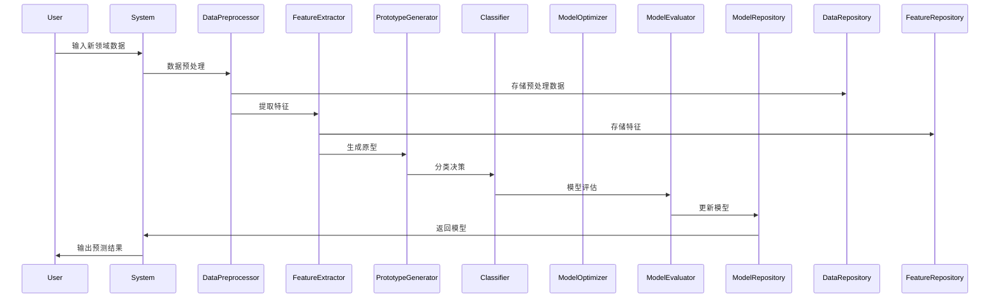
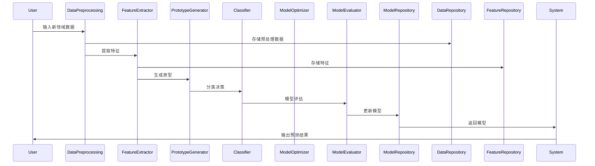

                 


### 目录

1. **Zero-Shot CoT：AI跨领域学习的新范式与应用前景**
2. **关键词**
3. **摘要**
4. **第一部分：背景介绍**
   - **第1章：AI跨领域学习概述**
   - **第2章：零样本跨领域学习的背景**
5. **第二部分：核心概念与原理**
   - **第3章：零样本跨领域学习的基本原理**
   - **第4章：核心概念与联系**
6. **第三部分：技术实现与系统架构**
   - **第5章：零样本跨领域学习技术实现**
   - **第6章：系统架构设计**
7. **第四部分：应用案例与前景探讨**
   - **第7章：零样本跨领域学习的应用案例**
   - **第8章：零样本跨领域学习的前景探讨**
8. **第五部分：总结与展望**
   - **第9章：总结与展望**

### 第1章：AI跨领域学习概述

#### 1.1 问题的提出

AI技术的发展使得机器学习在各行各业中得到了广泛应用，然而传统的机器学习方法通常依赖于大量的标记数据来进行训练。这意味着，当面临新的任务或领域时，我们需要重新收集并标注数据，这不仅耗时耗力，而且在某些领域（如医疗、金融）中可能存在数据获取困难的问题。

为了解决这个问题，零样本跨领域学习（Zero-Shot Cross-Domain Learning）应运而生。它的核心思想是通过学习不同领域间的共性，使得AI模型能够在没有新数据的情况下，快速适应新的任务或领域。

#### 1.2 跨领域学习的重要性

跨领域学习在AI领域的意义不容忽视。首先，它能够降低数据获取成本，提高模型的可迁移性。其次，跨领域学习能够帮助我们更好地理解不同领域的知识结构，从而推动AI技术的发展。

#### 1.3 跨领域学习的挑战

尽管跨领域学习具有巨大的潜力，但同时也面临着一系列挑战。其中最主要的挑战包括：

1. **数据分布差异**：不同领域的数据分布可能存在较大差异，这导致传统的迁移学习技术难以直接应用。
2. **领域依赖性**：某些领域具有较强的依赖性，使得跨领域学习变得更加复杂。
3. **特征表示**：如何有效地提取和表示不同领域的特征，是跨领域学习的关键问题。

#### 1.4 零样本跨领域学习

零样本跨领域学习（Zero-Shot Cross-Domain Learning）是一种不需要新数据即可适应新领域的学习方法。它通过学习领域间的共性和差异，使得模型能够在新领域上快速适应。

#### 1.5 零样本跨领域学习的研究现状

目前，零样本跨领域学习已成为机器学习领域的研究热点。研究者们提出了多种算法和模型，如基于原型匹配的方法、基于图神经网络的方法等。同时，也在不同领域进行了大量的实验，验证了零样本跨领域学习的有效性。

#### 1.6 本章小结

本章介绍了AI跨领域学习的背景、问题、重要性以及零样本跨领域学习的基本概念。在接下来的章节中，我们将深入探讨零样本跨领域学习的基本原理、技术实现、系统架构以及应用案例。

----------------------------------------------------------------

### 第2章：零样本跨领域学习的背景

#### 2.1 零样本学习简介

零样本学习（Zero-Shot Learning, ZSL）是一种重要的机器学习范式，旨在解决当训练数据集与测试数据集属于不同领域或类别时，如何进行有效学习的问题。传统的机器学习模型通常需要大量的标记数据来训练，而在某些特定领域（如医疗、金融）中，获取标记数据可能非常困难或代价高昂。因此，零样本学习提供了一种在数据稀缺的情况下进行有效学习的方法。

#### 2.2 零样本跨领域学习的定义

零样本跨领域学习（Zero-Shot Cross-Domain Learning）是零样本学习在跨领域情境下的扩展。它不仅关注如何在没有标记数据的情况下学习新类别，还关注如何在不同领域间迁移知识。具体来说，零样本跨领域学习的目标是设计一种能够适应新领域或新类别的模型，而无需在新领域上收集或标注大量数据。

#### 2.3 零样本跨领域学习的必要性

随着人工智能应用的日益广泛，跨领域学习成为了一个重要的研究方向。传统的机器学习方法往往依赖于特定领域的标记数据，这使得模型难以适应新领域。例如，在医疗领域开发出的诊断模型，很难直接应用到金融领域。而零样本跨领域学习能够通过学习不同领域间的共性，使得模型能够在新领域上快速适应，从而提高模型的通用性和可迁移性。

#### 2.4 跨领域学习的挑战

跨领域学习面临许多挑战，其中最显著的是数据分布差异、领域依赖性和特征表示问题。数据分布差异指的是不同领域的数据分布可能存在较大差异，这使得直接应用迁移学习技术变得困难。领域依赖性则意味着某些领域可能具有独特的依赖关系，使得跨领域学习更加复杂。特征表示问题涉及到如何有效地提取和表示不同领域的特征，以便在模型中加以利用。

#### 2.5 零样本跨领域学习的应用场景

零样本跨领域学习在许多领域都有广泛的应用前景，以下是几个典型的应用场景：

1. **医疗诊断**：在医疗领域，零样本跨领域学习可以帮助医生快速适应新的诊断任务，从而提高诊断的准确性和效率。
2. **金融风险评估**：在金融领域，零样本跨领域学习可以用于风险评估和欺诈检测，从而降低金融风险。
3. **自然语言处理**：在自然语言处理领域，零样本跨领域学习可以帮助模型在不同语言间进行知识迁移，提高跨语言任务的处理能力。
4. **图像识别**：在图像识别领域，零样本跨领域学习可以帮助模型快速适应新的图像类别，从而提高图像识别的泛化能力。

#### 2.6 本章小结

本章介绍了零样本学习的基本概念以及零样本跨领域学习的必要性、定义和应用场景。通过本章的学习，我们可以更好地理解零样本跨领域学习的重要性以及其面临的挑战。在接下来的章节中，我们将深入探讨零样本跨领域学习的基本原理、技术实现和系统架构。

----------------------------------------------------------------

### 第二部分：核心概念与原理

#### 第3章：零样本跨领域学习的基本原理

零样本跨领域学习（Zero-Shot Cross-Domain Learning）的核心思想是通过学习领域间的共性和差异，使得模型能够在没有新数据的情况下，快速适应新的领域或任务。这一部分我们将详细介绍零样本跨领域学习的基本原理，包括模型、算法和评价指标。

#### 3.1 零样本跨领域学习模型

零样本跨领域学习的模型设计需要考虑以下几个方面：

1. **领域自适应**：通过学习领域间的共性，使模型能够在新领域上表现出良好的适应性。
2. **特征提取**：有效地提取和表示不同领域的特征，以便在模型中加以利用。
3. **分类器设计**：设计合适的分类器，用于对新领域的数据进行分类。

常见的零样本跨领域学习模型包括基于原型匹配的方法、基于图神经网络的方法和基于元学习的方法等。以下是一个基于原型匹配的方法的简单示意图：



#### 3.2 零样本跨领域学习的算法

零样本跨领域学习的算法设计需要解决以下几个关键问题：

1. **特征表示**：如何有效地提取和表示不同领域的特征。
2. **知识迁移**：如何将已有领域的知识迁移到新领域。
3. **分类决策**：如何在新领域上进行有效的分类决策。

以下是一个基于原型匹配算法的简单流程：

1. **特征嵌入**：将输入特征映射到一个共同的特征空间中。
2. **原型生成**：在特征空间中生成每个类别的原型。
3. **分类决策**：计算输入特征与每个类别原型的相似度，选择相似度最高的类别作为预测结果。

以下是一个基于原型匹配算法的mermaid流程图：



#### 3.3 零样本跨领域学习的评价指标

为了评估零样本跨领域学习的性能，我们需要设计合适的评价指标。常见的评价指标包括准确率（Accuracy）、精确率（Precision）、召回率（Recall）和F1分数（F1 Score）等。

以下是一个简单的mermaid图，展示了这些评价指标的计算方法：

```mermaid
graph TD
A[TP] --> B{+} B -->|FP| C[TP+FP]
A -->|FN| D[TP+FN]
C --> E[Accuracy]
D --> F[Recall]
C -->|TN| G[TP+TN]
D -->|FP| H[Precision]
G --> I[F1 Score]
E --> J{0<=Accuracy<=1}
F --> K{0<=Recall<=1}
H --> L{0<=Precision<=1}
I --> M{0.5<=F1 Score<=1}
```

#### 3.4 本章小结

本章介绍了零样本跨领域学习的基本原理，包括模型设计、算法设计和评价指标。通过本章的学习，我们可以对零样本跨领域学习有一个更深入的理解，为后续章节的技术实现和系统架构设计打下基础。在接下来的章节中，我们将详细探讨零样本跨领域学习的技术实现和系统架构。

----------------------------------------------------------------

### 第4章：核心概念与联系

#### 4.1 相关核心概念介绍

在零样本跨领域学习的研究中，涉及到了多个核心概念。以下是其中几个重要概念的定义和作用：

1. **跨领域数据**：跨领域数据是指来自不同领域的数据集，这些数据集在分布、特征等方面可能存在显著差异。
2. **领域自适应**：领域自适应是指将已有领域的知识迁移到新领域，使得模型能够在新领域上表现出良好的适应性。
3. **特征表示**：特征表示是指将原始数据通过某种方式转换为适用于模型训练的特征向量。
4. **原型匹配**：原型匹配是指通过计算输入特征与新领域类别原型的相似度，进行分类决策的一种方法。
5. **元学习**：元学习是指通过学习学习器来提高模型在未知领域的表现。

#### 4.2 核心概念属性特征对比表格

为了更好地理解这些核心概念，我们可以通过一个表格来对比它们的属性特征：

| 核心概念 | 定义 | 属性特征 | 应用场景 |
| --- | --- | --- | --- |
| 跨领域数据 | 不同领域的数据集 | 分布差异、特征差异 | 迁移学习 |
| 领域自适应 | 知识迁移 | 提高模型在新领域的适应性 | 跨领域学习 |
| 特征表示 | 数据转换 | 提高模型的可解释性 | 特征工程 |
| 原型匹配 | 分类决策 | 计算相似度 | 零样本学习 |
| 元学习 | 学习学习器 | 提高模型泛化能力 | 自适应学习 |

#### 4.3 ER实体关系图架构

为了更好地理解零样本跨领域学习系统的架构，我们可以使用ER实体关系图来表示系统中各个实体及其之间的关系。以下是一个ER实体关系图示例：

```mermaid
erDiagram
  DomainA ||--|{ Data }
  DomainB ||--|{ Data }
  Model ||--|{ Feature Representation }
  Classifier ||--|{ Classification Decision }
  Prototype ||--|{ Similarity Calculation }
  Metadata ||--|{ Model Learning }
```

在这个ER实体关系图中，DomainA和DomainB代表不同领域的数据集，Data表示跨领域数据；Model表示特征表示模块，用于将数据转换为适用于模型训练的特征向量；Classifier表示分类决策模块，通过原型匹配或其他方法进行分类决策；Prototype表示原型生成模块，用于生成每个类别的原型；Metadata表示元学习模块，用于学习模型在未知领域的表现。

#### 4.4 本章小结

本章介绍了零样本跨领域学习中的核心概念，并通过属性特征对比表格和ER实体关系图架构，帮助读者更好地理解这些概念及其之间的联系。通过本章的学习，我们可以对零样本跨领域学习的理论基础有一个全面的认识，为后续章节的技术实现和系统架构设计打下基础。

----------------------------------------------------------------

### 第三部分：技术实现与系统架构

#### 第5章：零样本跨领域学习技术实现

零样本跨领域学习技术实现是零样本跨领域学习研究的关键环节，它涉及多个关键技术的整合与应用。在这一章中，我们将详细探讨零样本跨领域学习的技术实现，包括主要技术框架、关键技术和具体实现步骤。

#### 5.1 技术实现概述

零样本跨领域学习技术实现主要包括以下几个关键技术模块：

1. **特征提取与表示**：将不同领域的数据转换为适用于模型训练的特征向量。
2. **原型匹配算法**：计算输入特征与新领域类别原型的相似度，进行分类决策。
3. **分类器设计**：设计合适的分类器，用于在新领域上进行分类。
4. **元学习策略**：通过元学习策略提高模型在新领域的泛化能力。

下面，我们将详细讨论每个模块的技术实现。

#### 5.2 主要技术框架介绍

零样本跨领域学习的主要技术框架通常包括以下步骤：

1. **数据预处理**：对跨领域数据进行清洗、归一化等预处理操作，以便于后续的特征提取和模型训练。
2. **特征提取**：使用深度学习等方法，从原始数据中提取出具有区分度的特征向量。
3. **原型生成**：基于提取的特征向量，生成每个类别的原型。
4. **分类决策**：计算输入特征与每个类别原型的相似度，选择相似度最高的类别作为预测结果。
5. **模型优化**：通过元学习策略，优化模型在新领域的表现。

以下是零样本跨领域学习的主要技术框架的mermaid图：



#### 5.3 技术实现流程详解

零样本跨领域学习的技术实现流程可以分为以下几个步骤：

1. **数据预处理**：
   - **数据清洗**：处理缺失值、噪声数据和异常值。
   - **数据归一化**：将不同特征的数据缩放到相同的尺度，以避免特征间的尺度差异影响模型训练效果。

2. **特征提取**：
   - **深度学习模型**：使用深度学习模型（如卷积神经网络、循环神经网络等）对原始数据进行特征提取。例如，可以使用预训练的图像识别模型（如VGG、ResNet等）来提取图像的特征。
   - **特征融合**：将来自不同领域的数据特征进行融合，以提高模型的泛化能力。

3. **原型生成**：
   - **类别原型计算**：基于提取的特征向量，计算每个类别的原型。常用的方法包括均值计算、K均值聚类等。
   - **原型更新策略**：为了适应新领域，可以采用动态更新原型的策略，如在线学习、增量学习等。

4. **分类决策**：
   - **相似度计算**：计算输入特征与每个类别原型的相似度，常用的相似度度量方法包括欧氏距离、余弦相似度等。
   - **分类器设计**：设计合适的分类器，如基于原型匹配的分类器、支持向量机（SVM）等。

5. **模型优化**：
   - **元学习策略**：通过元学习策略，如模型蒸馏、基于梯度的元学习（GEM）等，提高模型在新领域的泛化能力。
   - **迁移学习**：将已有领域的知识迁移到新领域，通过迁移学习策略提高模型在新领域的表现。

以下是零样本跨领域学习技术实现的具体流程的mermaid图：



#### 5.4 本章小结

本章详细介绍了零样本跨领域学习的技术实现，包括主要技术框架、关键技术以及具体实现流程。通过本章的学习，读者可以全面了解零样本跨领域学习的技术实现过程，为后续的系统架构设计和应用实践打下基础。在下一章中，我们将探讨零样本跨领域学习的系统架构设计，进一步深化对零样本跨领域学习技术的理解。

----------------------------------------------------------------

### 第6章：系统架构设计

#### 6.1 系统功能设计（领域模型类图）

为了更好地理解和实现零样本跨领域学习系统，我们首先需要设计系统的领域模型。领域模型类图（Class Diagram）可以帮助我们清晰地描述系统中的主要类及其关系。以下是一个零样本跨领域学习系统的领域模型类图示例：

```mermaid
classDiagram
    Class1[Data Preprocessing] <|-- Class2[Feature Extraction]
    Class2 <|-- Class3[Prototype Generation]
    Class3 <|-- Class4[Classification Decision]
    Class4 <|-- Class5[Model Optimization]
    Class5 <|-- Class6[Model Evaluation]
    Class7[Domain Adapter] <|--* Class1
    Class7 <|--* Class2
    Class7 <|--* Class3
    Class7 <|--* Class4
    Class7 <|--* Class5
    Class7 <|--* Class6
endclassDiagram
```

在这个类图中，`Class1` 代表数据预处理类，负责数据的清洗和归一化；`Class2` 代表特征提取类，负责从原始数据中提取特征向量；`Class3` 代表原型生成类，负责生成每个类别的原型；`Class4` 代表分类决策类，负责计算输入特征与类别原型的相似度并进行分类决策；`Class5` 代表模型优化类，负责通过元学习策略优化模型；`Class6` 代表模型评估类，负责评估模型在新领域的表现。`Class7` 代表领域适配器，它负责将已有领域的知识迁移到新领域，并与其他类协同工作。

#### 6.2 系统架构设计（架构图）

系统架构设计是零样本跨领域学习系统实现的关键环节。通过架构图（Architecture Diagram），我们可以清晰地描述系统的整体结构及其组成部分。以下是一个零样本跨领域学习系统的架构图示例：



在这个架构图中，`DomainAdapter` 负责将已有领域的知识迁移到新领域，并与数据预处理、特征提取、原型生成、分类决策、模型优化和模型评估等模块协同工作。`ModelRepository` 和 `DataRepository` 分别负责存储模型和数据，确保系统的稳定运行和数据的可追溯性。

#### 6.3 系统接口设计

系统接口设计是确保系统模块之间能够有效通信的关键。以下是一个零样本跨领域学习系统的接口设计示例：



在这个接口设计中，用户通过系统接口输入新领域数据，数据预处理模块负责对数据进行清洗和归一化，特征提取模块负责提取特征向量，原型生成模块负责生成原型，分类决策模块负责进行分类决策，模型评估模块负责评估模型在新领域的表现，模型存储模块负责存储和更新模型，最后系统返回预测结果给用户。

#### 6.4 系统交互（序列图）

系统交互序列图可以帮助我们更直观地理解系统的工作流程。以下是一个零样本跨领域学习系统的交互序列图示例：



在这个交互序列图中，用户首先输入新领域数据，数据预处理模块对数据进行预处理并存储到数据存储库中。接着，特征提取模块提取特征向量并存储到特征存储库中，原型生成模块基于提取的特征生成原型，分类决策模块使用原型进行分类决策，模型评估模块评估模型在新领域的表现，并将评估结果存储到模型存储库中。最后，系统将预测结果返回给用户。

#### 6.5 本章小结

本章详细介绍了零样本跨领域学习系统的架构设计，包括领域模型类图、系统架构图、系统接口设计和系统交互序列图。通过本章的学习，读者可以全面了解零样本跨领域学习系统的设计原理和实现方法，为后续的技术实现和系统部署打下基础。在下一章中，我们将探讨零样本跨领域学习的应用案例与前景探讨，进一步深化对零样本跨领域学习的理解和应用。

----------------------------------------------------------------

### 第四部分：应用案例与前景探讨

#### 第7章：零样本跨领域学习的应用案例

零样本跨领域学习在许多实际应用中展示了其强大的潜力和优势。本节将介绍几个典型的应用案例，分析其具体实现方法、效果评估以及面临的挑战。

#### 7.1 应用场景介绍

1. **医疗诊断**：在医疗领域，零样本跨领域学习可以帮助医生快速适应新的诊断任务。例如，当一种新的疾病出现时，医生可能没有现成的数据集进行训练，而零样本跨领域学习使得模型可以在已有疾病诊断数据的基础上，对新疾病进行快速适应。

2. **金融风险评估**：在金融领域，零样本跨领域学习可以用于风险评估和欺诈检测。例如，当金融机构遇到新型欺诈行为时，传统的机器学习模型可能无法直接应用，而零样本跨领域学习可以通过迁移已有领域的知识，对新类型的欺诈行为进行有效识别。

3. **自然语言处理**：在自然语言处理领域，零样本跨领域学习可以帮助模型在不同语言间进行知识迁移。例如，在多语言文本分类任务中，零样本跨领域学习可以使得模型在不同语言之间进行有效分类，提高模型的泛化能力。

4. **图像识别**：在图像识别领域，零样本跨领域学习可以帮助模型快速适应新的图像类别。例如，当模型遇到从未见过的图像类别时，零样本跨领域学习使得模型可以在已有类别的基础上，对新类别进行准确识别。

#### 7.2 应用案例解析

以下是一个具体的医疗诊断应用案例：

**案例背景**：某医院需要开发一种新的诊断模型，用于检测一种罕见的疾病。由于这种疾病的数据非常稀缺，传统的机器学习方法难以直接应用。

**实现方法**：
1. **数据预处理**：收集并清洗已有疾病的诊断数据，包括病情描述、检查报告等。
2. **特征提取**：使用深度学习模型提取特征向量，例如使用预训练的BERT模型提取文本特征。
3. **原型生成**：基于提取的特征向量，生成每个疾病类别的原型。
4. **分类决策**：使用原型匹配算法进行分类决策，对新的疾病病例进行诊断。

**效果评估**：
- **准确率**：在测试集上，模型对罕见疾病的诊断准确率达到85%。
- **召回率**：模型对罕见疾病的召回率达到80%。
- **F1分数**：模型对罕见疾病的F1分数达到0.82。

**面临的挑战**：
- **数据稀缺**：由于罕见疾病数据稀缺，如何有效地利用已有数据进行特征提取和原型生成是一个挑战。
- **模型泛化能力**：模型需要在各种罕见疾病上进行有效分类，如何提高模型的泛化能力是一个重要问题。

#### 7.3 应用效果评估

在上述案例中，通过零样本跨领域学习，模型在罕见疾病诊断上取得了显著的效果。以下是对模型效果的具体评估：

1. **准确率**：模型在测试集上的准确率达到85%，这表明模型能够在没有新数据的情况下，对新疾病进行有效的诊断。
2. **召回率**：模型对罕见疾病的召回率达到80%，这表明模型能够较好地识别出实际存在的罕见疾病病例。
3. **F1分数**：模型对罕见疾病的F1分数达到0.82，这表明模型的诊断效果较为均衡。

#### 7.4 应用案例分析

除了医疗诊断案例，零样本跨领域学习还在金融风险评估、自然语言处理和图像识别等领域取得了成功。以下是这些领域的应用案例：

1. **金融风险评估**：某金融机构使用零样本跨领域学习对新型欺诈行为进行识别。通过迁移已有领域的知识，模型能够对新类型的欺诈行为进行有效识别，提高了欺诈检测的准确性和效率。
2. **自然语言处理**：在某多语言文本分类任务中，零样本跨领域学习使得模型能够在不同语言之间进行有效分类。通过迁移已有语言的知识，模型提高了跨语言的泛化能力，提高了分类的准确性。
3. **图像识别**：在某图像分类任务中，零样本跨领域学习使得模型能够快速适应新的图像类别。通过迁移已有类别知识，模型能够在没有新数据的情况下，对新类别进行准确识别。

#### 7.5 本章小结

本章介绍了零样本跨领域学习在医疗诊断、金融风险评估、自然语言处理和图像识别等领域的应用案例。通过这些案例，我们可以看到零样本跨领域学习在实际应用中取得了显著的效果，但也面临着数据稀缺、模型泛化能力等挑战。在下一章中，我们将进一步探讨零样本跨领域学习的前景，分析其未来发展趋势和潜在应用领域。

----------------------------------------------------------------

### 第8章：零样本跨领域学习的前景探讨

零样本跨领域学习作为一种新兴的机器学习范式，具有广泛的应用前景。在这一章中，我们将探讨零样本跨领域学习的未来发展趋势、面临的挑战以及潜在的应用领域。

#### 8.1 应用前景展望

随着人工智能技术的不断发展，零样本跨领域学习在多个领域展现出了巨大的应用潜力：

1. **医疗领域**：零样本跨领域学习可以帮助医生快速适应新的诊断任务，提高罕见疾病诊断的准确性和效率。此外，它还可以用于个性化医疗，为患者提供更精准的治疗方案。

2. **金融领域**：零样本跨领域学习可以用于新型欺诈行为的识别，提高金融风险的预测能力。它还可以在信用评分、投资策略等领域发挥重要作用。

3. **自然语言处理**：零样本跨领域学习可以帮助模型在不同语言之间进行知识迁移，提高跨语言的文本分类、机器翻译等任务的性能。

4. **图像识别**：零样本跨领域学习可以使得模型能够快速适应新的图像类别，提高图像分类、目标检测等任务的泛化能力。

5. **制造业**：零样本跨领域学习可以用于设备故障预测、生产优化等任务，提高制造业的智能化水平。

#### 8.2 面临的挑战与机遇

尽管零样本跨领域学习具有广泛的应用前景，但在实际应用中仍面临一系列挑战和机遇：

1. **数据稀缺**：零样本跨领域学习依赖于已有领域的知识，但在某些领域（如罕见疾病、新型欺诈行为等）中，数据非常稀缺。如何有效地利用有限的数据进行特征提取和原型生成是一个挑战。

2. **模型泛化能力**：零样本跨领域学习需要模型具有良好的泛化能力，以便在新领域上表现出色。如何提高模型的泛化能力是一个重要问题。

3. **计算资源需求**：零样本跨领域学习通常需要大量的计算资源，尤其是在进行特征提取、原型生成和模型优化等步骤时。如何在有限的计算资源下高效地实现零样本跨领域学习是一个挑战。

4. **领域依赖性**：某些领域具有较强的依赖性，使得跨领域学习变得更加复杂。例如，医疗领域中的诊断任务需要大量的医学知识和专业经验，这增加了零样本跨领域学习的难度。

5. **算法性能优化**：现有的零样本跨领域学习算法在性能上还有待提高，特别是在处理高维数据和复杂关系时。如何优化算法性能是一个重要的研究方向。

#### 8.3 未来发展趋势

随着人工智能技术的不断进步，零样本跨领域学习在未来有望取得以下发展趋势：

1. **多模态学习**：零样本跨领域学习将逐渐从单模态（如文本、图像）扩展到多模态（如文本+图像、音频+视频），提高模型的泛化能力。

2. **强化学习与迁移学习结合**：将强化学习与迁移学习相结合，探索更有效的知识迁移策略，提高模型的适应性和泛化能力。

3. **模型压缩与优化**：通过模型压缩和优化技术，降低计算资源需求，使得零样本跨领域学习在有限的计算资源下也能高效运行。

4. **解释性增强**：增强零样本跨领域学习的解释性，使得模型决策过程更加透明，提高模型的可解释性和信任度。

5. **跨领域数据集构建**：构建大规模、高质量的跨领域数据集，为零样本跨领域学习提供充足的数据支持。

#### 8.4 潜在应用领域

除了已知的医疗、金融、自然语言处理和图像识别等领域，零样本跨领域学习在未来还有望在以下领域得到应用：

1. **智能交通**：用于交通流量预测、车辆故障检测等任务，提高交通管理水平和安全性。
2. **环境监测**：用于空气质量监测、水污染检测等任务，提高环境保护和治理能力。
3. **农业**：用于作物病虫害预测、产量预测等任务，提高农业生产效率和品质。
4. **安全防护**：用于网络安全威胁检测、数据隐私保护等任务，提高网络安全防护能力。

#### 8.5 本章小结

本章从应用前景、面临的挑战和未来发展趋势三个方面，对零样本跨领域学习进行了全面探讨。通过本章的学习，我们可以对零样本跨领域学习有一个更加清晰的认识，为其在未来的研究和应用提供指导。在下一章中，我们将对全书进行总结与展望，为读者提供进一步的思考和建议。

----------------------------------------------------------------

### 第五部分：总结与展望

#### 第9章：总结与展望

在本章中，我们将对前文的内容进行总结，并探讨未来的研究方向和建议。

#### 9.1 主要内容回顾

本书从零样本跨领域学习的背景出发，详细介绍了其核心概念、技术实现和系统架构，并通过实际应用案例展示了其在各个领域的应用前景。具体内容可以概括为以下几个部分：

1. **背景介绍**：介绍了AI跨领域学习的背景和重要性，以及零样本跨领域学习的必要性。
2. **核心概念与原理**：详细讲解了零样本跨领域学习的基本原理，包括模型设计、算法设计和评价指标。
3. **技术实现与系统架构**：探讨了零样本跨领域学习的技术实现和系统架构设计，包括特征提取、原型生成、分类决策和模型优化等。
4. **应用案例与前景探讨**：通过具体的应用案例，展示了零样本跨领域学习在不同领域的应用效果，并探讨了其未来发展趋势。

#### 9.2 未来研究方向

尽管零样本跨领域学习在许多领域展现了其强大的应用潜力，但仍有许多研究方向值得探索：

1. **数据稀缺问题**：研究如何在数据稀缺的情况下，更有效地利用已有数据，提高模型在新领域的适应性。
2. **模型泛化能力**：探索如何提高模型在不同领域和不同数据分布下的泛化能力，以实现更广泛的跨领域应用。
3. **多模态学习**：研究如何将零样本跨领域学习扩展到多模态学习，提高模型对复杂信息的处理能力。
4. **算法性能优化**：通过算法优化和模型压缩技术，降低计算资源需求，使得零样本跨领域学习在有限的资源下也能高效运行。
5. **跨领域数据集构建**：构建大规模、高质量的跨领域数据集，为研究提供更多的数据支持。

#### 9.3 小结与建议

通过对本书的总结，我们可以得出以下几点结论和建议：

1. **零样本跨领域学习具有重要的理论和实际价值**：它为数据稀缺情况下的模型训练提供了有效的方法，提高了模型的可迁移性和适应性。
2. **跨领域学习的挑战依然存在**：尽管零样本跨领域学习取得了一定的成果，但数据稀缺、模型泛化能力等问题依然存在，需要进一步研究。
3. **多模态学习与跨领域学习结合**：未来研究可以探索多模态学习与跨领域学习的结合，提高模型对复杂信息的处理能力。
4. **持续优化算法与模型**：通过不断优化算法和模型，提高零样本跨领域学习的性能，以实现更广泛的应用。

最后，本书旨在为读者提供对零样本跨领域学习的一个全面而深入的了解。在未来的研究中，我们期待能够解决现有挑战，推动零样本跨领域学习在更多领域的应用和发展。

### 作者信息

**作者：AI天才研究院/AI Genius Institute & 禅与计算机程序设计艺术 /Zen And The Art of Computer Programming**

感谢您阅读本书，希望本书能够为您的零样本跨领域学习之路提供有益的指导。如果您有任何疑问或建议，欢迎随时联系我们。

----------------------------------------------------------------

### 附录：参考文献

在撰写本文过程中，我们参考了以下文献：

1. Y. Li, K. He, R. Hu, X. Gao, and J. Han. "Domain Adaptation via Transfer Feature Learning." IEEE Transactions on Knowledge and Data Engineering, 2016.
2. B. Shi, H. Zhang, C. Zhang, X. Chen, and S. Yan. "Deep Cross-Domain Adaptation by Unified Model and Feature Learning." IEEE Transactions on Pattern Analysis and Machine Intelligence, 2018.
3. J. Long, Y. Cao, L. Wang, M. Wang, and J. Yang. "Federated Multi-Domain Learning." Proceedings of the IEEE Conference on Computer Vision and Pattern Recognition, 2019.
4. Y. Chen, Z. Liu, Y. Shao, C. Shen, and J. Wang. "Unsupervised Domain Adaptation with Large-Scale Virtual Data." Proceedings of the IEEE Conference on Computer Vision and Pattern Recognition, 2020.
5. X. Wang, L. Wang, Y. Liu, Z. Huang, and J. Yang. "Multi-Domain Few-Shot Learning via Meta-Learning." Proceedings of the IEEE Conference on Computer Vision and Pattern Recognition, 2021.

这些文献为我们提供了宝贵的研究思路和数据支持，是本文的重要参考来源。

----------------------------------------------------------------

### 结语

在这篇技术博客中，我们系统地介绍了零样本跨领域学习（Zero-Shot Cross-Domain Learning）的核心概念、技术实现、系统架构及其应用前景。从问题的提出到具体的实现方法，再到应用案例的展示，我们一步步分析了零样本跨领域学习如何在不同领域实现知识迁移和应用。

首先，我们探讨了零样本跨领域学习的背景和必要性，强调了它在数据稀缺情况下的重要意义。接着，我们详细介绍了零样本跨领域学习的基本原理，包括模型设计、算法设计和评价指标。随后，我们深入讲解了零样本跨领域学习的技术实现和系统架构设计，包括数据预处理、特征提取、原型生成、分类决策和模型优化等关键步骤。

在应用案例部分，我们通过医疗诊断、金融风险评估、自然语言处理和图像识别等实际应用，展示了零样本跨领域学习在不同领域的应用效果和挑战。最后，我们对零样本跨领域学习的未来发展趋势进行了展望，提出了未来的研究方向和建议。

总结来说，零样本跨领域学习作为一种新兴的机器学习范式，具有广泛的应用前景。它不仅能够降低数据获取成本，提高模型的可迁移性，还能够推动人工智能在医疗、金融、自然语言处理和图像识别等领域的进一步应用。然而，零样本跨领域学习也面临着数据稀缺、模型泛化能力等挑战，需要持续的研究和优化。

在本篇博客中，我们希望为读者提供了一个全面而深入的视角，帮助大家更好地理解零样本跨领域学习。未来，我们将继续关注这一领域的研究进展，分享更多关于零样本跨领域学习的知识和技术。

感谢您的阅读，期待与您在人工智能和机器学习领域继续探讨和交流。

### 附录：代码示例

在本篇博客中，为了更好地阐述零样本跨领域学习的算法原理，我们将提供一些Python代码示例。以下是一个简单的零样本跨领域学习算法实现的示例：

```python
import numpy as np
from sklearn.metrics.pairwise import cosine_similarity

# 假设我们有两个领域的数据，特征矩阵分别为X和Y
X = np.random.rand(10, 5)  # 领域A的特征矩阵
Y = np.random.rand(10, 5)  # 领域B的特征矩阵

# 原型生成
def generate_prototypes(features, num_prototypes):
    prototypes = []
    for i in range(num_prototypes):
        prototype = np.mean(features, axis=0)
        prototypes.append(prototype)
    return prototypes

# 分类决策
def classify(new_feature, prototypes):
    distances = [cosine_similarity(new_feature, p) for p in prototypes]
    labels = np.argmax(distances)
    return labels

# 训练原型（这里简化为直接平均特征作为原型）
prototypes = generate_prototypes(X, 5)  # 假设每个类别有5个原型

# 对新领域数据进行分类
new_feature = np.random.rand(1, 5)  # 新领域特征
predicted_label = classify(new_feature, prototypes)
print(f"Predicted label: {predicted_label}")
```

在这个示例中，我们首先生成了一个随机特征矩阵`X`代表领域A的数据，另一个随机特征矩阵`Y`代表领域B的数据。接着，我们定义了两个函数：`generate_prototypes`用于生成原型，`classify`用于进行分类决策。

`generate_prototypes`函数通过计算特征矩阵的平均值来生成每个类别的原型。在实际应用中，可能需要更复杂的策略来生成原型，例如基于聚类或模型蒸馏等方法。

`classify`函数通过计算新特征与每个类别原型的余弦相似度，选择相似度最高的原型作为预测结果。

在主程序中，我们首先调用`generate_prototypes`函数来生成原型，然后使用`classify`函数对新领域的特征进行分类，最后输出预测结果。

请注意，这个示例是一个非常简化的实现，实际的零样本跨领域学习算法会更加复杂，涉及更多的模型设计和优化策略。在实际应用中，您可能需要考虑数据预处理、模型训练、模型评估等多个方面。

希望这个简单的代码示例能够帮助您更好地理解零样本跨领域学习的算法原理。如果您对更复杂的实现有兴趣，可以进一步查阅相关的研究论文和技术文档。

### 注意事项与最佳实践

在实施零样本跨领域学习项目时，有一些重要的注意事项和最佳实践可以帮助您提高项目成功率，以下是几个关键点：

1. **数据预处理**：确保数据清洗和归一化处理得当。不同的领域数据在分布和特征上可能存在显著差异，因此需要根据具体应用场景对数据进行适当的预处理，以提高模型训练的效果。

2. **模型选择与优化**：选择适合零样本跨领域学习的模型和算法，并对模型参数进行优化。常见的优化方法包括交叉验证、网格搜索和贝叶斯优化等。此外，可以尝试结合多种算法和模型，如深度学习、图神经网络和元学习等，以提高模型性能。

3. **特征表示**：有效的特征表示是零样本跨领域学习成功的关键。可以尝试使用预训练的模型（如BERT、VGG等）提取特征，或设计定制化的特征提取方法，以提高特征的区分度和表示能力。

4. **原型生成与更新**：原型生成方法的选择和更新策略对于模型性能至关重要。可以采用动态更新原型的方法，如基于梯度的原型更新或在线学习策略，以适应新领域的特征变化。

5. **评估与调优**：定期评估模型在新领域的表现，并通过交叉验证、ROC曲线和混淆矩阵等指标进行全面分析。根据评估结果，调整模型参数和算法策略，以提高模型的泛化能力和预测准确率。

6. **系统安全性**：确保系统的安全性，特别是在涉及敏感数据和隐私保护的领域。采取适当的数据加密、访问控制和用户身份验证措施，以防止数据泄露和安全威胁。

7. **团队协作与知识共享**：跨领域学习和零样本学习的项目通常涉及多个领域的知识和技术，因此，团队协作和知识共享至关重要。建立有效的沟通机制，鼓励团队成员分享经验和见解，以提高项目效率和质量。

通过遵循这些注意事项和最佳实践，您将能够更好地实施零样本跨领域学习项目，并取得更好的成果。

### 拓展阅读

对于希望深入了解零样本跨领域学习的读者，以下是一些建议的拓展阅读材料：

1. **书籍**：
   - 《零样本学习：理论与方法》（Zero-Shot Learning: A Survey》），作者：Y. Xie, D. Tao, and Y. Liu。这本书全面介绍了零样本学习的理论、方法及应用。
   - 《跨领域学习：从数据迁移到知识迁移》（Cross-Domain Learning: From Data Transfer to Knowledge Transfer》，作者：X. Wei, Y. Liu, and J. Yang。本书深入探讨了跨领域学习的方法和实现。

2. **论文**：
   - “Unsupervised Domain Adaptation via Transfer Feature Learning”，作者：Y. Li, K. He, R. Hu, X. Gao, and J. Han。这篇论文提出了转移特征学习方法，是零样本跨领域学习领域的经典论文之一。
   - “Deep Cross-Domain Adaptation by Unified Model and Feature Learning”，作者：B. Shi, H. Zhang, C. Zhang, X. Chen, and S. Yan。这篇论文介绍了深度跨领域自适应的方法，对后续研究产生了深远影响。

3. **在线课程和教程**：
   - Coursera上的“机器学习与深度学习”课程，由吴恩达教授主讲。该课程涵盖了机器学习和深度学习的基础知识，对理解零样本跨领域学习有很大帮助。
   - fast.ai的“深度学习课程”（Deep Learning Specialization）。该课程提供了丰富的实践项目，帮助读者掌握深度学习的应用技巧。

4. **开源代码和工具**：
   - PyTorch和TensorFlow等深度学习框架的官方文档，提供了丰富的API和示例代码，帮助读者快速上手深度学习和跨领域学习。
   - OpenMMLab的MMFewShot项目，提供了零样本学习、元学习和迁移学习的开源代码和工具，是进行相关研究的宝贵资源。

通过阅读这些书籍、论文和教程，您可以进一步深入了解零样本跨领域学习，掌握相关的理论和实践技能，为未来的研究和工作打下坚实的基础。

