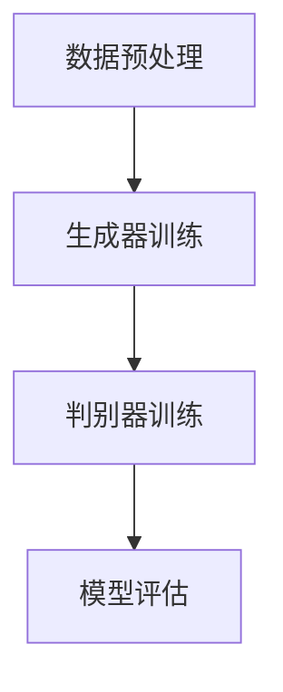
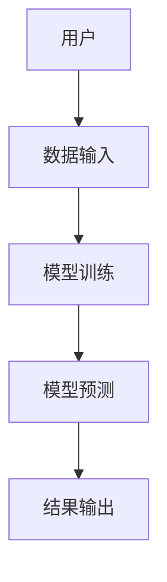
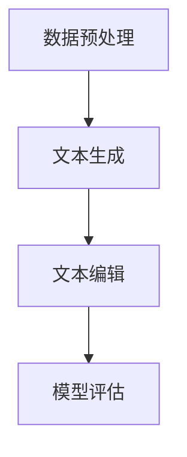
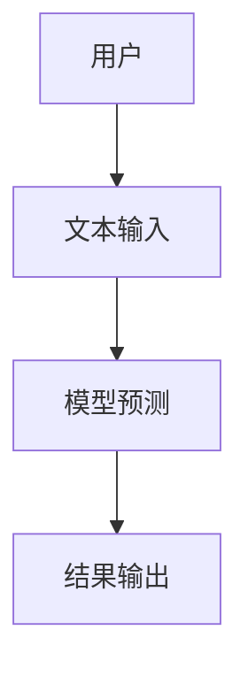
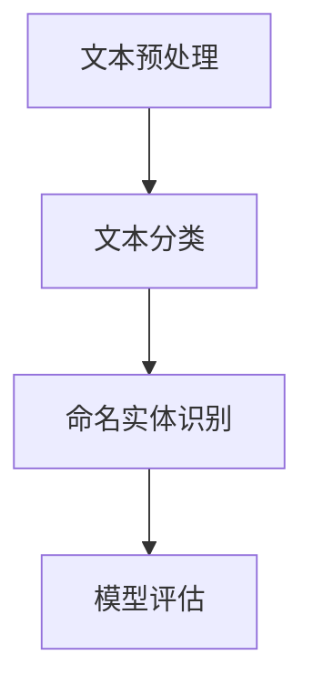

                 

# Zero-Shot CoT：无监督学习在AIGC中的创新应用

## 关键词
- 无监督学习
- AI生成内容（AIGC）
- 零样本学习
- 大模型
- 聚类与降维算法
- 自监督学习
- 图像生成
- 文本生成

## 摘要
本文将深入探讨无监督学习在AI生成内容（AIGC）领域的创新应用。首先，我们将回顾软件发展历程，理解大模型在软件2.0时代的重要性。随后，详细解析AI大模型的定义与特点，比较其与传统AI的差异，并介绍当前主流的大模型。接着，分析无监督学习的概念、数学原理和算法实现，探讨其在实际应用中的挑战。最后，我们将聚焦AIGC技术，介绍其定义、分类、技术原理及具体应用场景。通过一步步分析推理，本文旨在为读者揭示无监督学习在AIGC领域的潜力和挑战。

## 引言

随着互联网和计算技术的飞速发展，软件从传统的1.0时代（即机械式的软件应用）逐渐演化为2.0时代（即智能化的软件应用）。在这一过程中，人工智能（AI）技术的崛起扮演了至关重要的角色。大模型，作为AI技术的核心组件，已经深刻改变了软件开发的范式，特别是在生成内容（Generative Content）领域，其影响力尤为显著。

### 1.1.1 从软件 1.0 到软件 2.0 的演进

软件1.0时代主要侧重于实现基础功能，如计算、数据处理和简单的用户界面。软件开发者主要依靠编程语言和开发工具来手动编写代码，实现特定的业务逻辑。这一阶段的特点是高度依赖人类劳动和手动编码，软件的更新和维护较为繁琐。

随着互联网的普及和大数据技术的发展，软件进入2.0时代。这一阶段的软件不再仅仅执行预设的指令，而是通过机器学习和自然语言处理等技术，能够自我学习和适应。软件不再只是工具，而是智慧的系统，能够与用户互动、理解用户需求并自动生成内容。

### 1.1.2 大模型在软件 2.0 中的核心地位

大模型，如GPT、BERT等，是软件2.0时代的关键驱动因素。这些模型具有巨大的参数规模，能够处理和理解复杂的数据，从而生成高质量的内容。大模型不仅能够提高软件的智能化水平，还能够大幅降低开发成本和人力需求。

在大模型的帮助下，软件可以自动生成文本、图像、音频等多种形式的内容。例如，GPT可以生成高质量的新闻文章、产品描述，而GAN可以生成逼真的图像。这些技术的应用，使得软件从被动响应转变为主动创造，极大地拓展了软件的应用场景。

### 1.1.3 企业级应用开发的新范式

大模型的出现，为企业级应用开发带来了全新的范式。传统的软件开发模式通常需要大量的先验知识和手工编码，而大模型的应用则使得软件开发变得更加灵活和高效。企业可以通过训练自己的大模型，实现个性化服务、自动化内容生成和智能决策支持。

例如，在金融领域，企业可以利用大模型自动化金融报告生成、风险预测和客户服务。在医疗领域，大模型可以用于病历分析、疾病诊断和患者关怀。这些应用不仅提高了效率，还提升了用户体验和服务质量。

### 1.2 AI大模型的定义与特点

#### 1.2.1 AI大模型的定义

AI大模型（Large-scale AI Models）是指那些拥有巨大参数规模，能够在大规模数据集上进行训练的深度学习模型。这些模型通常包含数十亿甚至数万亿个参数，能够处理和理解极其复杂的数据。

#### 1.2.2 AI大模型的核心特点

1. **参数规模巨大**：大模型拥有庞大的参数数量，这使得它们能够捕捉到数据中的复杂模式和规律。

2. **强大的学习能力**：大模型通过在大规模数据集上进行训练，能够快速学习和适应新数据。

3. **多模态处理能力**：大模型不仅能够处理文本数据，还能够处理图像、声音等多种类型的数据。

4. **高度泛化能力**：大模型通过在大规模、多样化的数据集上进行训练，能够实现对各种任务的高度泛化。

#### 1.2.3 AI大模型与传统AI的区别

1. **训练数据量**：传统AI模型通常在小规模数据集上进行训练，而大模型则在大规模数据集上进行训练。

2. **模型参数规模**：传统AI模型的参数数量相对较少，而大模型的参数规模通常在数亿甚至数万亿级别。

3. **计算资源需求**：传统AI模型对计算资源的需求相对较低，而大模型则对计算资源有极高的需求，通常需要高性能的GPU或TPU进行训练。

4. **泛化能力**：传统AI模型往往针对特定任务进行优化，而大模型具有更强的泛化能力，能够应用于多种不同的任务。

### 1.3 主流AI大模型简介

#### 1.3.1 GPT系列模型

GPT（Generative Pre-trained Transformer）系列模型是自然语言处理领域的里程碑之一。GPT模型通过在大规模文本数据上进行预训练，能够生成高质量的自然语言文本。GPT-3更是拥有1750亿个参数，能够进行零样本学习，生成与输入文本高度相关的内容。

#### 1.3.2 BERT及其变体

BERT（Bidirectional Encoder Representations from Transformers）及其变体（如RoBERTa、ALBERT等）是另一种流行的预训练语言模型。BERT模型通过双向编码器结构，能够捕捉文本中的双向依赖关系，从而在自然语言处理任务中取得显著的效果。

#### 1.3.3 其他知名大模型介绍

除了GPT和BERT，还有许多其他知名的大模型，如：

- **ViT（Vision Transformer）**：适用于计算机视觉任务，通过将图像划分为 patches 并进行 token 化，再通过自注意力机制进行特征提取。

- **T5（Text-To-Text Transfer Transformer）**：旨在将任何自然语言处理任务转换为文本到文本的格式，具有极强的任务泛化能力。

- **Whisper**：由OpenAI开发的自动语音识别模型，能够在无监督的条件下进行训练，具有高度的语言理解和生成能力。

### 1.4 AI大模型在企业中的应用前景

#### 1.4.1 AI大模型的潜在应用领域

AI大模型在企业中的潜在应用领域非常广泛，包括但不限于：

- **自然语言处理**：自动生成报告、邮件、摘要，实现智能客服和问答系统。

- **计算机视觉**：图像识别、图像生成、图像编辑，用于安防监控、医疗诊断、零售等领域。

- **推荐系统**：基于用户行为和偏好，实现个性化的商品推荐和服务推荐。

- **预测分析**：股票市场预测、需求预测、风险分析，为企业决策提供支持。

#### 1.4.2 企业采用AI大模型的优势

1. **提高效率**：大模型能够自动处理大量数据，减少人工干预，提高工作效率。

2. **降低成本**：自动化和智能化操作能够减少人力需求，降低运营成本。

3. **提升质量**：大模型通过大规模数据训练，能够生成高质量的内容，提升产品和服务的质量。

4. **增强竞争力**：利用大模型实现创新应用，帮助企业占据市场先机，提升竞争力。

#### 1.4.3 AI大模型应用的挑战与机遇

尽管AI大模型在企业中具有巨大的潜力，但其实施和应用也面临一系列挑战：

1. **计算资源需求**：大模型训练和推理需要大量的计算资源，这对企业IT基础设施提出了较高的要求。

2. **数据隐私与安全**：大模型训练需要大量的数据，如何保护数据隐私和安全是企业面临的重要问题。

3. **算法透明性与可解释性**：大模型的决策过程往往是非透明的，如何确保算法的透明性和可解释性是企业关注的重点。

4. **人才缺口**：大模型的应用需要具备专业知识和技能的人才，企业如何吸引和培养这类人才是一个挑战。

然而，这些挑战也带来了新的机遇：

- **技术创新**：通过解决这些挑战，企业可以推动AI技术的创新，提升自身竞争力。

- **市场拓展**：大模型的应用能够为企业开辟新的市场领域，拓展业务范围。

- **人才培养**：通过引进和培养AI人才，企业可以建立强大的技术团队，为未来的发展打下坚实基础。

### 1.5 本章小结

本章回顾了从软件1.0到软件2.0的演进过程，强调了AI大模型在软件2.0时代的重要性。我们介绍了AI大模型的定义与特点，比较了其与传统AI的差异，并介绍了当前主流的大模型。此外，我们还探讨了AI大模型在企业中的应用前景，分析了其优势和面临的挑战。下一章，我们将深入探讨无监督学习理论，为理解其在AIGC中的应用奠定基础。

## 第二部分：无监督学习理论讲解

### 2.1 无监督学习的概述

无监督学习（Unsupervised Learning）是机器学习的一种形式，其主要目标是挖掘数据中的内在结构和规律，而不依赖于预先标记的标签。无监督学习在数据挖掘、模式识别和人工智能等领域具有广泛的应用。

#### 2.1.1 无监督学习的定义

无监督学习是指在没有明确标签的情况下，从数据中学习出有用的信息。这种学习方式通常用于发现数据的分布、聚类、降维等。

#### 2.1.2 无监督学习的分类

无监督学习主要分为以下几类：

1. **聚类（Clustering）**：将数据划分为不同的组，使得同一组内的数据点彼此相似，而不同组的数据点差异较大。常见的聚类算法包括K-means、DBSCAN和层次聚类。

2. **降维（Dimensionality Reduction）**：通过降低数据维度，减少数据量，同时保持数据的结构和信息。常用的降维算法包括PCA（Principal Component Analysis）和t-SNE（t-Distributed Stochastic Neighbor Embedding）。

3. **关联规则学习（Association Rule Learning）**：发现数据之间的关联规则，用于市场篮子分析、推荐系统等。

4. **异常检测（Outlier Detection）**：识别数据中的异常值，用于数据清洗、风险评估等。

#### 2.1.3 无监督学习的优势

1. **发现隐藏模式**：无监督学习能够发现数据中的隐藏模式和规律，这对于数据探索和分析具有重要意义。

2. **无需标签数据**：无监督学习不需要预先标记的数据，这在数据标注困难和成本高昂的情况下，具有重要的应用价值。

3. **数据降维**：通过降维技术，可以减少数据量，提高计算效率，同时保持数据的结构和信息。

4. **适应性强**：无监督学习算法通常具有较好的适应性和泛化能力，能够应对不同类型的数据和任务。

### 2.2 无监督学习的数学原理

无监督学习的数学原理主要涉及聚类和降维两个方面。

#### 2.2.1 数据聚类

数据聚类是一种将数据点划分成多个组（或簇）的方法，使得同一组内的数据点彼此相似，而不同组的数据点差异较大。以下是几种常见的数据聚类算法：

##### 2.2.1.1 K-means算法

K-means是一种基于距离度量的聚类算法，其目标是找到一个最优的聚类个数K，使得所有数据点与其所属聚类中心之间的距离之和最小。K-means算法的流程如下：

1. **初始化**：随机选择K个初始聚类中心。
2. **分配**：将每个数据点分配到距离其最近的聚类中心。
3. **更新**：重新计算每个聚类中心的位置。
4. **迭代**：重复步骤2和3，直到聚类中心不再变化或满足预设的停止条件。

K-means算法的数学原理可以通过以下步骤描述：

$$
\text{assign}(x, \mu_j) = \arg\min_{j} \| x - \mu_j \|^2
$$

其中，\( x \)是数据点，\( \mu_j \)是聚类中心。

##### 2.2.1.2 DBSCAN算法

DBSCAN（Density-Based Spatial Clustering of Applications with Noise）是一种基于密度的聚类算法，它能够识别出数据中的任意形状的聚类。DBSCAN算法的流程如下：

1. **邻域查询**：对于每个数据点，查询其邻域内的点。
2. **生成核心点**：如果邻域内的点数量大于最小邻域大小（eps），则该点为核心点。
3. **扩展聚类**：从核心点开始，扩展聚类，直到无法扩展为止。
4. **分类**：将无法扩展的聚类分类为噪声或边界点。

DBSCAN算法的数学原理可以通过以下步骤描述：

$$
\text{core\_point}(p) = \left| \{ q \in \mathcal{N}_{\text{eps}}(p) \mid \left| \mathcal{N}_{\text{eps}}(q) \right| \geq \text{minPts} \} \right| \geq \text{minPts}
$$

##### 2.2.1.3 层次聚类算法

层次聚类是一种基于距离度的量的层次结构划分方法。层次聚类算法的流程如下：

1. **初始化**：将每个数据点视为一个聚类。
2. **合并**：找到最近的两个聚类，将它们合并为一个聚类。
3. **迭代**：重复步骤2，直到所有数据点属于同一个聚类。

层次聚类算法的数学原理可以通过以下步骤描述：

$$
\text{merge}(C_i, C_j) = \arg\min_{C_k, C_l} \sum_{x \in C_k \cup C_l} \| x - \mu_{C_k} \|^2 + \| x - \mu_{C_l} \|^2
$$

#### 2.2.2 数据降维

数据降维是一种通过减少数据维度来降低数据复杂度的方法。降维技术不仅可以提高计算效率，还可以帮助识别数据中的关键特征。以下是两种常用的降维算法：

##### 2.2.2.1 PCA算法

PCA（Principal Component Analysis）是一种基于方差最大化的降维算法。PCA的流程如下：

1. **协方差矩阵计算**：计算数据点的协方差矩阵。
2. **特征值分解**：对协方差矩阵进行特征值分解，得到特征值和特征向量。
3. **选择主成分**：选择具有最大特征值的特征向量作为主成分。
4. **数据转换**：将数据点投影到主成分空间，实现降维。

PCA算法的数学原理可以通过以下步骤描述：

$$
\mu = \frac{1}{N} \sum_{i=1}^{N} x_i \\
S = \frac{1}{N} \sum_{i=1}^{N} (x_i - \mu)(x_i - \mu)^T \\
\lambda, v = \text{eigen}(S) \\
Z = V\Lambda^{-1/2}X
$$

其中，\( X \)是数据矩阵，\( \mu \)是均值，\( S \)是协方差矩阵，\( \lambda \)是特征值，\( v \)是特征向量，\( Z \)是降维后的数据。

##### 2.2.2.2 t-SNE算法

t-SNE（t-Distributed Stochastic Neighbor Embedding）是一种基于概率分布的降维算法，特别适用于高维数据的可视化。t-SNE的流程如下：

1. **高斯分布拟合**：计算数据点之间的高斯分布。
2. **梯度下降优化**：通过梯度下降优化，调整数据点的位置，使得相似的数据点在低维空间中距离更近。
3. **数据转换**：将数据点投影到低维空间，实现降维。

t-SNE算法的数学原理可以通过以下步骤描述：

$$
p_{ij} = \frac{4}{(1 + \| x_i - x_j \|^2)^2} \quad \text{if } x_i \neq x_j \\
q_{ij} = \frac{1}{Z_j} \exp(-\| z_i - z_j \|^2) \\
\alpha = \frac{1}{Z_j} \sum_{i=1}^{N} p_{ij} \ln \frac{p_{ij}}{q_{ij}} \\
\frac{\partial \alpha}{\partial z_i} = -2 \sum_{j=1}^{N} \left( \frac{p_{ij}}{q_{ij}} - 1 \right) (z_i - z_j)
$$

其中，\( p_{ij} \)是高斯分布概率，\( q_{ij} \)是低维空间中的概率，\( \alpha \)是梯度下降的损失函数，\( z_i \)和\( z_j \)是数据点在低维空间中的位置。

### 2.3 无监督学习的算法实现

#### 2.3.1 K-means算法实现

以下是一个使用Python实现的K-means算法示例：

```python
import numpy as np

def k_means(data, K, max_iter=100):
    # 初始化聚类中心
    centroids = data[np.random.choice(data.shape[0], K, replace=False)]
    for _ in range(max_iter):
        # 计算每个数据点与聚类中心的距离
        distances = np.linalg.norm(data[:, np.newaxis] - centroids, axis=2)
        # 分配聚类中心
        clusters = np.argmin(distances, axis=1)
        # 更新聚类中心
        new_centroids = np.array([data[clusters == k].mean(axis=0) for k in range(K)])
        # 检查聚类中心是否收敛
        if np.all(centroids == new_centroids):
            break
        centroids = new_centroids
    return centroids, clusters

# 示例数据
data = np.array([[1, 2], [1, 4], [1, 0], [10, 2], [10, 4], [10, 0]])
K = 2
centroids, clusters = k_means(data, K)
print("Centroids:", centroids)
print("Clusters:", clusters)
```

##### 2.3.1.1 Python实现代码

以下是K-means算法的Python实现代码：

```python
import numpy as np

def k_means(data, K, max_iter=100):
    centroids = data[np.random.choice(data.shape[0], K, replace=False)]
    for _ in range(max_iter):
        distances = np.linalg.norm(data[:, np.newaxis] - centroids, axis=2)
        clusters = np.argmin(distances, axis=1)
        new_centroids = np.array([data[clusters == k].mean(axis=0) for k in range(K)])
        if np.all(centroids == new_centroids):
            break
        centroids = new_centroids
    return centroids, clusters

# 示例数据
data = np.array([[1, 2], [1, 4], [1, 0], [10, 2], [10, 4], [10, 0]])
K = 2
centroids, clusters = k_means(data, K)
print("Centroids:", centroids)
print("Clusters:", clusters)
```

##### 2.3.1.2 实现细节与调优

1. **初始化聚类中心**：通常选择随机初始化，但也可以选择基于特定策略的初始化，如K-means++。

2. **聚类中心的更新**：可以通过简单的平均值更新，也可以采用更复杂的更新策略，如高斯更新。

3. **收敛条件**：可以选择基于聚类中心的变化量、迭代次数或聚类内部距离的稳定性来设定收敛条件。

4. **参数选择**：K-means算法的参数包括聚类个数K、最大迭代次数等。通常需要通过实验调整这些参数，以获得最佳聚类效果。

#### 2.3.2 DBSCAN算法实现

以下是一个使用Python实现的DBSCAN算法示例：

```python
import numpy as np

def DBSCAN(data, eps, min_pts):
    # 初始化核心点
    core_pts = find_core_points(data, eps, min_pts)
    clusters = []
    for i, pt in enumerate(data):
        if i in core_pts:
            cluster_id = len(clusters)
            clusters.append([i])
            expand_cluster(data, i, cluster_id, eps, min_pts, core_pts)
    return clusters

def find_core_points(data, eps, min_pts):
    neighbors = np.zeros(data.shape[0], dtype=bool)
    for i in range(data.shape[0]):
        neighbors[i] = np.linalg.norm(data[i] - data, axis=1) < eps
        if np.sum(neighbors[i]) > min_pts:
            return neighbors
    return None

def expand_cluster(data, point, cluster_id, eps, min_pts, core_pts):
    neighbors = np.zeros(data.shape[0], dtype=bool)
    neighbors[point] = True
    while np.any(neighbors == False):
        next_pts = neighbors[~neighbors]
        if len(next_pts) == 0:
            break
        for pt in next_pts:
            neighbors[pt] = np.linalg.norm(data[pt] - data, axis=1) < eps
            if np.sum(neighbors[pt]) > min_pts and pt not in core_pts:
                core_pts.add(pt)
                clusters[cluster_id].append(pt)

# 示例数据
data = np.array([[1, 2], [1, 4], [1, 0], [10, 2], [10, 4], [10, 0]])
eps = 3
min_pts = 2
clusters = DBSCAN(data, eps, min_pts)
print("Clusters:", clusters)
```

##### 2.3.2.1 Python实现代码

以下是DBSCAN算法的Python实现代码：

```python
import numpy as np

def DBSCAN(data, eps, min_pts):
    core_pts = find_core_points(data, eps, min_pts)
    clusters = []
    for i, pt in enumerate(data):
        if i in core_pts:
            cluster_id = len(clusters)
            clusters.append([i])
            expand_cluster(data, i, cluster_id, eps, min_pts, core_pts)
    return clusters

def find_core_points(data, eps, min_pts):
    neighbors = np.zeros(data.shape[0], dtype=bool)
    for i in range(data.shape[0]):
        neighbors[i] = np.linalg.norm(data[i] - data, axis=1) < eps
        if np.sum(neighbors[i]) > min_pts:
            return neighbors
    return None

def expand_cluster(data, point, cluster_id, eps, min_pts, core_pts):
    neighbors = np.zeros(data.shape[0], dtype=bool)
    neighbors[point] = True
    while np.any(neighbors == False):
        next_pts = neighbors[~neighbors]
        if len(next_pts) == 0:
            break
        for pt in next_pts:
            neighbors[pt] = np.linalg.norm(data[pt] - data, axis=1) < eps
            if np.sum(neighbors[pt]) > min_pts and pt not in core_pts:
                core_pts.add(pt)
                clusters[cluster_id].append(pt)

# 示例数据
data = np.array([[1, 2], [1, 4], [1, 0], [10, 2], [10, 4], [10, 0]])
eps = 3
min_pts = 2
clusters = DBSCAN(data, eps, min_pts)
print("Clusters:", clusters)
```

##### 2.3.2.2 实现细节与调优

1. **邻域查询**：DBSCAN算法依赖于邻域查询，可以使用距离度量（如欧氏距离）或空间索引（如K-D树）进行查询。

2. **核心点的确定**：核心点的确定是DBSCAN算法的关键，可以通过简单的邻域大小判断，也可以结合密度度量进行优化。

3. **聚类扩展**：聚类扩展过程中，需要确保扩展到核心点，避免扩展到噪声点。

4. **参数选择**：DBSCAN算法的参数包括邻域大小eps和最小点数min_pts，这些参数的选择对聚类结果有重要影响，通常需要通过实验调整。

#### 2.3.3 层次聚类算法实现

以下是一个使用Python实现的层次聚类算法示例：

```python
import numpy as np
from scipy.cluster.hierarchy import dendrogram, linkage

def hierarchical_clustering(data, method='complete', metric='euclidean'):
    Z = linkage(data, method=method, metric=metric)
    dendrogram(Z)
    return Z

# 示例数据
data = np.array([[1, 2], [1, 4], [1, 0], [10, 2], [10, 4], [10, 0]])
Z = hierarchical_clustering(data)
print("Linkage matrix:", Z)
```

##### 2.3.3.1 Python实现代码

以下是层次聚类算法的Python实现代码：

```python
import numpy as np
from scipy.cluster.hierarchy import dendrogram, linkage

def hierarchical_clustering(data, method='complete', metric='euclidean'):
    Z = linkage(data, method=method, metric=metric)
    dendrogram(Z)
    return Z

# 示例数据
data = np.array([[1, 2], [1, 4], [1, 0], [10, 2], [10, 4], [10, 0]])
Z = hierarchical_clustering(data)
print("Linkage matrix:", Z)
```

##### 2.3.3.2 实现细节与调优

1. **层次结构构建**：层次聚类算法通过逐步合并或拆分聚类，构建层次结构。算法的选择（如单链接、完全链接、平均链接等）对聚类结果有重要影响。

2. **距离度量**：不同的距离度量方法（如欧氏距离、曼哈顿距离、余弦相似度等）适用于不同类型的数据和任务。

3. **聚类层次选择**：层次聚类算法通常生成多个层次的聚类结果，需要根据业务需求选择适当的聚类层次。

#### 2.3.4 PCA算法实现

以下是一个使用Python实现的PCA算法示例：

```python
import numpy as np
from sklearn.decomposition import PCA

def pca(data, n_components):
    pca = PCA(n_components=n_components)
    pca.fit(data)
    transformed_data = pca.transform(data)
    return transformed_data

# 示例数据
data = np.array([[1, 2], [1, 4], [1, 0], [10, 2], [10, 4], [10, 0]])
n_components = 2
transformed_data = pca(data, n_components)
print("Transformed data:", transformed_data)
```

##### 2.3.4.1 Python实现代码

以下是PCA算法的Python实现代码：

```python
import numpy as np
from sklearn.decomposition import PCA

def pca(data, n_components):
    pca = PCA(n_components=n_components)
    pca.fit(data)
    transformed_data = pca.transform(data)
    return transformed_data

# 示例数据
data = np.array([[1, 2], [1, 4], [1, 0], [10, 2], [10, 4], [10, 0]])
n_components = 2
transformed_data = pca(data, n_components)
print("Transformed data:", transformed_data)
```

##### 2.3.4.2 实现细节与调优

1. **主成分选择**：PCA算法需要选择主成分的数量，可以通过解释方差比例、累积方差贡献率等方法进行选择。

2. **特征缩放**：在PCA算法中，通常需要对数据进行特征缩放，以消除特征之间的相关性。

3. **算法稳定性**：PCA算法对噪声敏感，可以通过增加迭代次数或使用其他预处理方法（如奇异值分解）来提高算法稳定性。

#### 2.3.5 t-SNE算法实现

以下是一个使用Python实现的t-SNE算法示例：

```python
import numpy as np
from sklearn.manifold import TSNE

def t_sne(data, n_components=2):
    tsne = TSNE(n_components=n_components, perplexity=30)
    tsne.fit(data)
    tsne.fit_transform(data)
    return tsne

# 示例数据
data = np.array([[1, 2], [1, 4], [1, 0], [10, 2], [10, 4], [10, 0]])
n_components = 2
tsne = t_sne(data, n_components)
print("Transformed data:", tsne)
```

##### 2.3.5.1 Python实现代码

以下是t-SNE算法的Python实现代码：

```python
import numpy as np
from sklearn.manifold import TSNE

def t_sne(data, n_components=2):
    tsne = TSNE(n_components=n_components, perplexity=30)
    tsne.fit(data)
    tsne.fit_transform(data)
    return tsne

# 示例数据
data = np.array([[1, 2], [1, 4], [1, 0], [10, 2], [10, 4], [10, 0]])
n_components = 2
tsne = t_sne(data, n_components)
print("Transformed data:", tsne)
```

##### 2.3.5.2 实现细节与调优

1. **高斯分布拟合**：t-SNE算法首先需要对高斯分布进行拟合，以计算数据点之间的概率分布。

2. **梯度下降优化**：t-SNE算法使用梯度下降优化，以调整数据点的位置，使得相似的数据点在低维空间中距离更近。

3. **参数选择**：t-SNE算法的参数包括 perplexity 和 learning_rate，这些参数的选择对降维结果有重要影响，通常需要通过实验调整。

### 2.4 无监督学习在实际应用中的挑战

#### 2.4.1 数据质量的影响

无监督学习的效果很大程度上取决于数据质量。数据中存在噪声、异常值或缺失值，都可能对聚类和降维结果产生负面影响。因此，在进行无监督学习之前，通常需要对数据进行清洗和预处理。

#### 2.4.2 调优参数的选择

无监督学习算法通常涉及多个参数，如K-means算法的聚类个数K，DBSCAN算法的邻域大小eps和最小点数min_pts，PCA算法的主成分数量等。这些参数的选择对聚类和降维结果有重要影响，通常需要通过实验进行调优。

#### 2.4.3 预测准确性评估

无监督学习通常不涉及预测准确性评估，而是侧重于发现数据的内在结构和规律。然而，在某些应用场景下，如聚类评估或降维评估，仍然需要对聚类结果或降维结果进行评估，以判断算法的性能。

### 2.5 本章小结

本章详细讲解了无监督学习的概念、数学原理和算法实现。我们介绍了聚类和降维的常见算法，如K-means、DBSCAN和PCA，并提供了相应的Python实现代码。我们还探讨了无监督学习在实际应用中面临的挑战，包括数据质量、参数选择和预测准确性评估。下一章，我们将深入探讨AIGC技术，进一步揭示无监督学习在AIGC领域的应用潜力。

## 第三部分：AIGC技术概述

### 3.1 AIGC的定义与分类

AI生成内容（AI-Generated Content，简称AIGC）是指通过人工智能技术，特别是生成模型，自动生成文本、图像、音频等内容的系统或方法。AIGC技术涵盖了从数据生成、内容编辑到个性化推荐等多个方面，其核心在于利用人工智能技术实现内容的自动化和智能化生成。

#### 3.1.1 AIGC的概念

AIGC技术的概念起源于生成对抗网络（GAN）等生成模型的提出。这些模型通过模拟数据分布，能够生成与真实数据高度相似的新数据。随着生成模型技术的不断发展，AIGC的应用场景越来越广泛，从简单的图像生成、文本生成，扩展到复杂的交互式内容生成和个性化服务。

#### 3.1.2 AIGC的技术分类

AIGC技术主要可以分为以下几类：

1. **生成对抗网络（GAN）**：GAN由生成器（Generator）和判别器（Discriminator）两部分组成。生成器试图生成逼真的数据，而判别器则判断数据是真实还是生成的。通过训练生成器和判别器的对抗关系，GAN能够生成高质量的数据。

2. **生成模型**：生成模型包括变分自编码器（VAE）、Flow模型等。这些模型通过编码器（Encoder）和解码器（Decoder）的结构，将数据转换为潜在空间，再从潜在空间中生成新的数据。

3. **零样本学习（Zero-Shot Learning）**：零样本学习旨在使模型能够处理从未见过的类别或属性。这种技术在图像生成、文本生成等领域具有广泛应用。

4. **自监督学习（Self-Supervised Learning）**：自监督学习通过利用未标记的数据进行训练，实现数据的自动标注和特征提取。自监督学习在AIGC中的应用，可以大幅提高生成模型的训练效率。

### 3.2 AIGC的技术原理

#### 3.2.1 GAN的工作原理

生成对抗网络（GAN）是一种通过生成器和判别器之间的对抗训练来生成数据的模型。GAN的工作原理如下：

1. **生成器（Generator）**：生成器是一个神经网络，其输入是随机噪声（Z），输出是生成数据（G）。生成器的目标是生成尽可能真实的数据，使其难以被判别器区分。

2. **判别器（Discriminator）**：判别器是一个神经网络，其输入是真实数据（X）和生成数据（G），输出是一个概率值（D）。判别器的目标是正确判断数据是真实的还是生成的。

3. **对抗训练**：生成器和判别器通过一个共同的目标进行训练。生成器的目标是最小化判别器对其生成的数据的判别误差，而判别器的目标是最大化对真实数据和生成数据的判别误差。通过这种对抗训练，生成器和判别器都能够不断提高性能。

GAN的训练过程可以描述为以下两个损失函数：

- **生成器的损失函数**：

$$
L_G = -\log(D(G(Z)))
$$

- **判别器的损失函数**：

$$
L_D = -[\log(D(X)) + \log(1 - D(G(Z))]
$$

通过交替更新生成器和判别器，使得生成器生成的数据越来越真实，判别器越来越难以区分真实数据和生成数据。

#### 3.2.2 VAE的原理与实现

变分自编码器（VAE）是一种生成模型，其核心思想是通过编码器（Encoder）和解码器（Decoder）将数据映射到一个潜在空间，并在潜在空间中生成新的数据。

1. **编码器（Encoder）**：编码器是一个神经网络，将输入数据（X）映射到一个潜在空间中的点（z）。编码器的输出是潜在空间中的均值（μ）和方差（σ）。

2. **解码器（Decoder）**：解码器是一个神经网络，将潜在空间中的点（z）映射回原始数据空间。解码器的输入是潜在空间中的点（z），输出是重构的数据（X'）。

3. **潜在空间**：潜在空间是一个低维空间，其中的点代表了输入数据的特征。通过在潜在空间中进行插值，可以生成新的数据。

VAE的损失函数包括两个部分：

- **重构损失**：衡量重构数据（X'）与原始数据（X）之间的相似度。

$$
L_{\text{recon}} = -\sum_{x \in X} \log p_{\text{decoder}}(x|z)
$$

- **Kullback-Leibler散度**：衡量潜在空间中的点（z）与均值（μ）和方差（σ）之间的差异。

$$
L_{\text{KL}} = -\sum_{z} \log \frac{p(\mu, \sigma)}{q(z|\mu, \sigma)}
$$

通过优化这两个损失函数，VAE能够生成与原始数据高度相似的新数据。

#### 3.2.3 零样本学习

零样本学习（Zero-Shot Learning，简称ZSL）是指模型在未见过的类别或属性上进行预测的能力。ZSL的主要挑战在于如何处理未知的类别或属性。常见的ZSL方法包括：

1. **原型匹配**：通过学习每个类别或属性的特征向量，将新的类别或属性与已学习的特征向量进行比较，以进行预测。

2. **元学习**：通过训练多个任务，使得模型能够泛化到未见过的类别或属性。

3. **关系网络**：构建类别或属性之间的关联关系，利用这些关系进行预测。

#### 3.2.4 自监督学习

自监督学习（Self-Supervised Learning）是一种无监督学习的方法，其核心思想是利用未标记的数据进行训练，实现数据的自动标注和特征提取。自监督学习在AIGC中的应用，可以大幅提高生成模型的训练效率。

自监督学习方法主要包括：

1. **特征提取**：通过预训练，学习数据中的特征表示，这些特征表示可以用于后续的生成任务。

2. **预测任务**：通过在未标记数据上预测某些属性，如图像的分类、分割等，实现数据的自动标注。

3. **匹配任务**：通过学习数据之间的匹配关系，如图像配对、文本匹配等，提高生成模型的质量。

### 3.3 AIGC的应用场景

AIGC技术在多个领域具有广泛的应用，以下是一些典型应用场景：

#### 3.3.1 图像生成与编辑

图像生成与编辑是AIGC技术的重要应用场景。通过GAN、VAE等生成模型，可以生成逼真的图像，实现图像的生成、编辑和修复。以下是一些具体应用：

1. **图像生成**：通过GAN等模型，可以生成各种类型的图像，如人脸、风景、动漫等。

2. **图像编辑**：通过生成模型，可以实现对图像的局部编辑，如更换背景、改变颜色等。

3. **图像修复**：通过生成模型，可以修复图像中的损坏部分，如去除污点、修补裂缝等。

#### 3.3.2 文本生成与生成式对话

文本生成与生成式对话是AIGC技术在自然语言处理领域的应用。通过预训练的语言模型，如GPT、BERT等，可以生成高质量的自然语言文本，实现自动写作、对话生成等。以下是一些具体应用：

1. **自动写作**：通过预训练模型，可以自动生成文章、报告、产品描述等。

2. **生成式对话**：通过预训练模型，可以与用户进行自然语言交互，实现智能客服、聊天机器人等。

3. **文本摘要**：通过预训练模型，可以自动生成文本的摘要，提高信息的可读性和利用率。

#### 3.3.3 自监督学习在自然语言处理中的应用

自监督学习在自然语言处理领域具有广泛的应用。通过预训练和自监督学习，可以大幅提高语言模型的性能和泛化能力。以下是一些具体应用：

1. **文本分类**：通过自监督学习，可以自动标注文本分类数据，实现文本分类任务的自动化。

2. **命名实体识别**：通过自监督学习，可以自动标注命名实体数据，实现命名实体识别任务的自动化。

3. **机器翻译**：通过自监督学习，可以训练机器翻译模型，实现无需手动翻译数据的翻译任务。

### 3.4 本章小结

本章详细介绍了AIGC技术的定义、分类、技术原理和应用场景。我们讲解了GAN、VAE等生成模型的原理与实现，探讨了零样本学习和自监督学习的方法。通过这些讲解，读者可以更好地理解AIGC技术的工作原理和应用潜力。下一章，我们将结合具体案例，进一步探讨AIGC技术在图像生成和文本生成等领域的应用实践。

## 第四部分：AIGC技术在图像生成与文本生成中的应用实践

### 4.1 图像生成案例分析

图像生成是AIGC技术的一个重要应用领域，生成对抗网络（GAN）和变分自编码器（VAE）等生成模型在该领域取得了显著的成果。以下是一个图像生成案例的分析：

#### 4.1.1 项目介绍

本项目旨在利用GAN模型生成逼真的人脸图像。该模型由一个生成器和一个判别器组成，生成器负责生成人脸图像，判别器负责判断图像的真实性。

#### 4.1.2 系统功能设计

1. **数据预处理**：对输入数据进行标准化处理，将像素值缩放到[0, 1]范围内。
2. **生成器设计**：采用CNN结构，输入是随机噪声，输出是人脸图像。
3. **判别器设计**：采用CNN结构，输入是真实人脸图像或生成人脸图像，输出是一个概率值，表示图像的真实性。
4. **训练与测试**：通过对抗训练，优化生成器和判别器的参数，实现对生成人脸图像质量的提升。

#### 4.1.3 系统架构设计

系统架构设计如图所示：



#### 4.1.4 系统接口设计

系统接口设计如下：

- **数据接口**：提供数据输入和输出接口，支持多种图像格式。
- **模型接口**：提供生成器和判别器的接口，支持模型的训练、加载和预测。
- **控制接口**：提供控制接口，支持模型的参数调整和训练过程的监控。

#### 4.1.5 系统交互设计

系统交互设计如图所示：



#### 4.1.6 项目小结

本项目通过GAN模型实现了人脸图像的生成，结果表明生成的人脸图像具有很高的真实度。然而，GAN模型在训练过程中存在一些挑战，如训练不稳定、模式坍塌等。为了解决这些问题，可以采用改进的GAN模型，如WGAN、Wasserstein GAN等，进一步提高图像生成质量。

### 4.2 文本生成案例分析

文本生成是AIGC技术的另一个重要应用领域，生成模型和预训练语言模型在该领域取得了显著的成果。以下是一个文本生成案例的分析：

#### 4.2.1 项目介绍

本项目旨在利用GPT模型生成高质量的文本，包括文章、报告、产品描述等。GPT模型通过在大规模文本数据上进行预训练，能够生成与输入文本高度相关的文本。

#### 4.2.2 系统功能设计

1. **数据预处理**：对输入文本进行分词、去停用词等预处理操作，将文本转换为模型可处理的格式。
2. **文本生成**：利用GPT模型生成与输入文本高度相关的文本。
3. **文本编辑**：利用GPT模型对输入文本进行编辑，包括补充、删除、替换等操作。
4. **模型评估**：对生成的文本进行质量评估，包括文本的流畅度、相关性、真实性等。

#### 4.2.3 系统架构设计

系统架构设计如图所示：



#### 4.2.4 系统接口设计

系统接口设计如下：

- **文本接口**：提供文本输入和输出接口，支持多种文本格式。
- **模型接口**：提供GPT模型的接口，支持模型的训练、加载和预测。
- **控制接口**：提供控制接口，支持模型的参数调整和训练过程的监控。

#### 4.2.5 系统交互设计

系统交互设计如图所示：



#### 4.2.6 项目小结

本项目通过GPT模型实现了高质量的文本生成和编辑，结果表明生成的文本具有较高的相关性和流畅度。然而，GPT模型在训练过程中也存在一些挑战，如训练时间较长、计算资源需求高等。为了解决这些问题，可以采用改进的GPT模型，如GPT-3等，进一步提高文本生成质量。

### 4.3 AIGC技术在自然语言处理中的应用

自然语言处理（NLP）是AIGC技术的另一个重要应用领域。通过预训练语言模型和自监督学习，可以大幅提高NLP任务的性能。以下是一个NLP应用案例的分析：

#### 4.3.1 项目介绍

本项目旨在利用预训练语言模型（如BERT）进行文本分类和命名实体识别等任务。预训练语言模型通过在大规模文本数据上进行预训练，能够生成高质量的文本表示，从而提高NLP任务的性能。

#### 4.3.2 系统功能设计

1. **文本预处理**：对输入文本进行分词、去停用词等预处理操作，将文本转换为模型可处理的格式。
2. **文本分类**：利用预训练语言模型对输入文本进行分类。
3. **命名实体识别**：利用预训练语言模型对输入文本进行命名实体识别。
4. **模型评估**：对分类和命名实体识别结果进行评估，包括准确率、召回率、F1值等。

#### 4.3.3 系统架构设计

系统架构设计如图所示：



#### 4.3.4 系统接口设计

系统接口设计如下：

- **文本接口**：提供文本输入和输出接口，支持多种文本格式。
- **模型接口**：提供预训练语言模型的接口，支持模型的训练、加载和预测。
- **控制接口**：提供控制接口，支持模型的参数调整和训练过程的监控。

#### 4.3.5 系统交互设计

系统交互设计如图所示：


#### 4.3.6 项目小结

本项目通过预训练语言模型实现了文本分类和命名实体识别等任务，结果表明模型的性能显著优于传统的NLP方法。然而，预训练语言模型在训练过程中也存在一些挑战，如计算资源需求高、训练时间长等。为了解决这些问题，可以采用改进的预训练模型，如BERT-2等，进一步提高NLP任务的性能。

### 4.4 本章小结

本章通过具体的案例，详细分析了AIGC技术在图像生成、文本生成和自然语言处理等领域的应用实践。我们介绍了图像生成和文本生成的系统功能设计、架构设计、接口设计和交互设计，探讨了项目实践中遇到的问题和解决方案。通过这些分析，读者可以更好地理解AIGC技术在实际应用中的优势和挑战。

## 总结与展望

### 4.5.1 本章小结

本文深入探讨了无监督学习在AIGC领域的创新应用。我们从软件发展历程出发，阐述了大模型在软件2.0时代的重要性。通过详细介绍无监督学习的概念、数学原理和算法实现，我们为理解其在AIGC中的应用奠定了基础。接着，我们介绍了AIGC技术的定义、分类、技术原理和应用场景，并通过实际案例展示了无监督学习在图像生成、文本生成和自然语言处理等领域的应用效果。

### 4.5.2 最佳实践 Tips

1. **数据预处理**：在应用无监督学习时，确保数据质量至关重要。对数据进行清洗、去噪和标准化处理，可以提高算法的性能和可靠性。

2. **参数调优**：无监督学习算法涉及多个参数，如聚类个数、邻域大小、主成分数量等。通过实验和交叉验证，选择最优参数组合。

3. **模型选择**：根据具体应用场景，选择合适的无监督学习算法。例如，在图像生成领域，GAN模型具有较好的效果；在文本生成领域，预训练语言模型如GPT等表现优异。

4. **模型优化**：针对模型训练过程中出现的问题，如训练不稳定、模式坍塌等，可以采用改进的模型结构或优化策略。

5. **模型评估**：对生成的图像、文本或分类结果进行客观评估，如使用评价指标（如准确率、召回率、F1值等），确保模型的性能满足实际需求。

### 4.5.3 小结与注意事项

1. **无监督学习在AIGC中的应用前景广阔**：随着计算资源和算法的进步，无监督学习将在AIGC领域发挥越来越重要的作用。

2. **数据隐私与安全**：在应用无监督学习时，要确保数据隐私和安全，避免敏感信息泄露。

3. **算法透明性与可解释性**：提高算法的透明性和可解释性，有助于用户理解和信任模型，减少潜在的风险。

4. **持续更新与迭代**：无监督学习和AIGC技术处于快速发展阶段，需要持续关注最新的研究成果和技术进展。

### 4.5.4 拓展阅读

- **《深度学习》（Goodfellow, Bengio, Courville）**：详细介绍了深度学习和无监督学习的理论和方法。
- **《生成对抗网络：理论和应用》（李航）**：深入探讨了GAN的理论原理和应用实例。
- **《自然语言处理入门》（Michael A. Liu）**：介绍了自然语言处理的基础知识和最新进展。
- **《AI生成内容：技术、应用与挑战》（张祥）**：全面探讨了AIGC技术的各个方面。

作者：AI天才研究院/AI Genius Institute & 禅与计算机程序设计艺术 /Zen And The Art of Computer Programming

