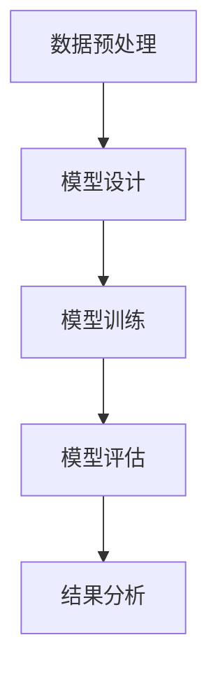
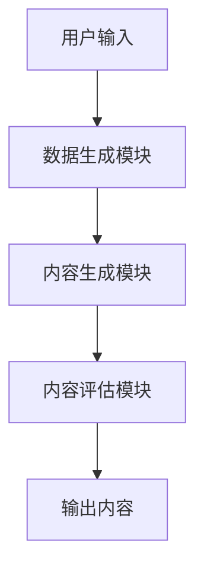
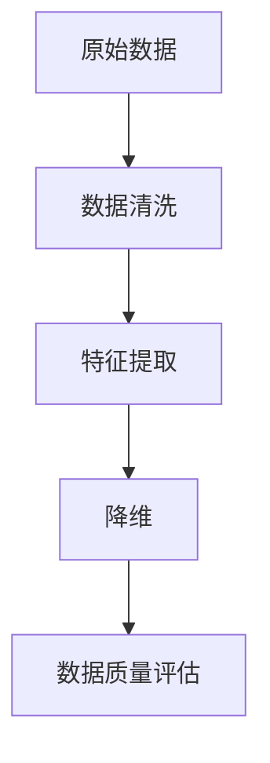
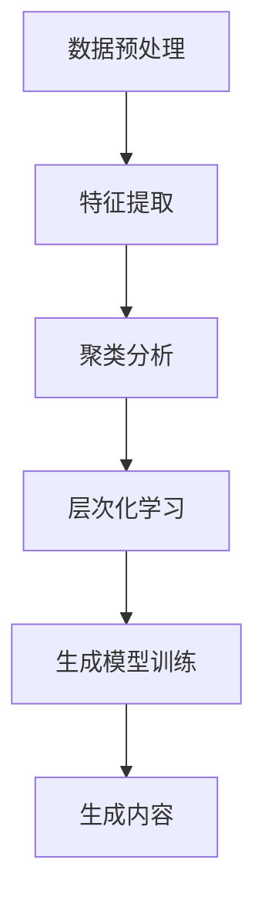
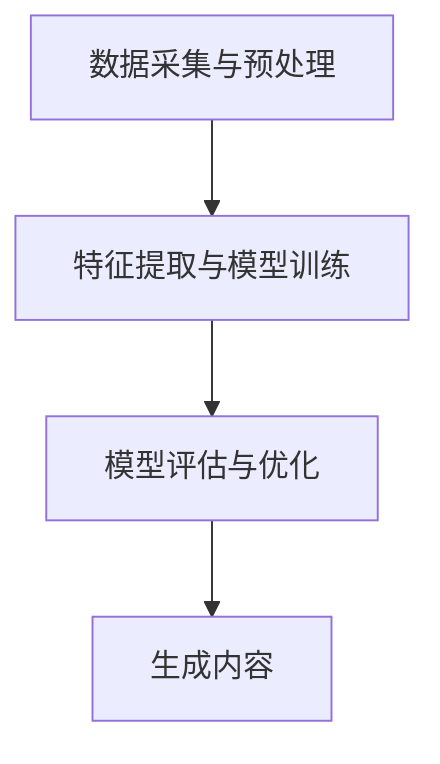
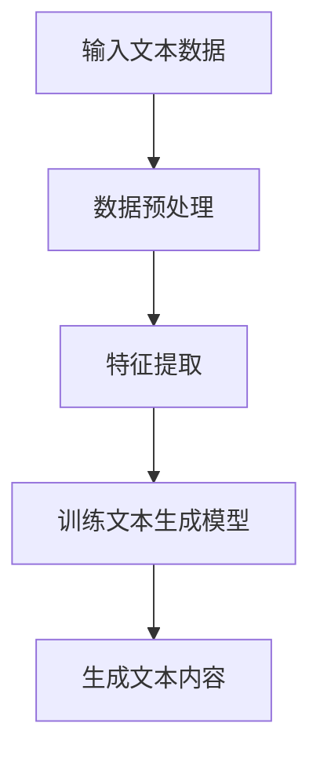
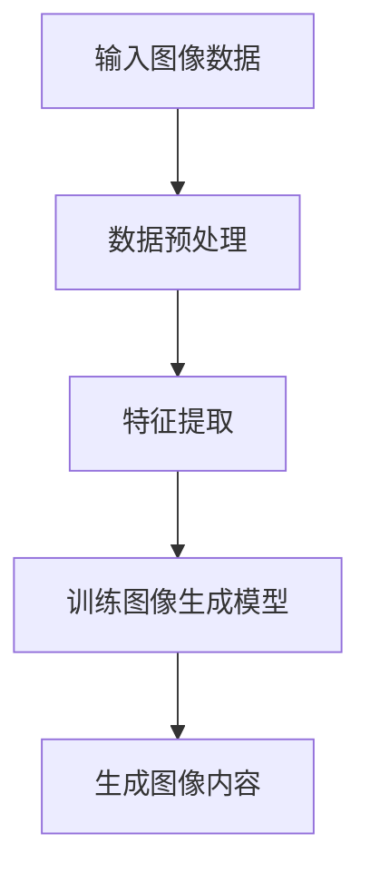
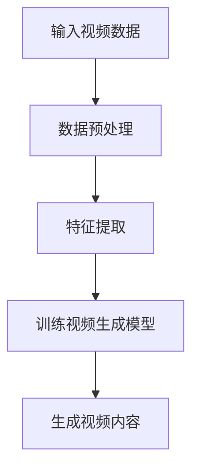

                 

# 《Zero-Shot CoT：无监督学习在AIGC中的新突破》

> 关键词：无监督学习、AIGC、Zero-Shot CoT、跨模态学习、自适应学习

> 摘要：本文从无监督学习在人工智能生成内容（AIGC）中的应用出发，深入探讨了零样本学习（Zero-Shot Learning，简称ZSL）的核心概念和原理，并介绍了其在AIGC中的实际应用案例。随后，文章分析了无监督学习在AIGC中的新突破，包括减少数据依赖性、降低模型复杂度和优化评估标准等方向，并通过具体案例展示了这些新突破的实际应用效果。最后，文章对未来无监督学习在AIGC中的发展趋势进行了展望，并提出了一些研究与开发建议。

## 目录大纲

# 《Zero-Shot CoT：无监督学习在AIGC中的新突破》

## 第一部分：背景介绍

## 1.1 问题背景

### 1.1.1 无监督学习的重要性

### 1.1.2 AIGC的崛起与挑战

### 1.1.3 无监督学习在AIGC中的应用前景

## 1.2 核心概念

### 1.2.1 无监督学习

#### 1.2.1.1 定义

#### 1.2.1.2 基本原理

#### 1.2.1.3 无监督学习的应用场景

### 1.2.2 AIGC

#### 1.2.2.1 定义

#### 1.2.2.2 架构与特点

#### 1.2.2.3 AIGC的应用领域

## 1.3 边界与外延

### 1.3.1 无监督学习与监督学习的关系

### 1.3.2 无监督学习与强化学习的关系

### 1.3.3 无监督学习的应用边界

## 1.4 概念结构与核心要素组成

### 1.4.1 无监督学习的基本结构

#### 1.4.1.1 特征提取

#### 1.4.1.2 模型训练

#### 1.4.1.3 模型评估

### 1.4.2 AIGC的核心要素

#### 1.4.2.1 自动化生成

#### 1.4.2.2 交互式编辑

#### 1.4.2.3 自适应学习

## 第二部分：无监督学习在AIGC中的应用

## 2.1 无监督学习在AIGC中的应用原理

### 2.1.1 数据预处理的挑战

#### 2.1.1.1 数据多样性与不平衡性

#### 2.1.1.2 数据质量与噪声

### 2.1.2 无监督学习的关键技术

#### 2.1.2.1 特征提取算法

#### 2.1.2.2 自编码器

#### 2.1.2.3 层次化学习

### 2.1.3 无监督学习在AIGC中的应用流程

#### 2.1.3.1 数据采集与预处理

#### 2.1.3.2 特征提取与模型训练

#### 2.1.3.3 模型评估与优化

## 2.2 无监督学习在AIGC中的实际应用

### 2.2.1 文本生成

#### 2.2.1.1 模型选择与参数调优

#### 2.2.1.2 应用场景与案例分析

### 2.2.2 图像生成

#### 2.2.2.1 模型选择与参数调优

#### 2.2.2.2 应用场景与案例分析

### 2.2.3 视频生成

#### 2.2.3.1 模型选择与参数调优

#### 2.2.3.2 应用场景与案例分析

## 第三部分：无监督学习在AIGC中的新突破

## 3.1 新突破的理论基础

### 3.1.1 现有研究的不足

#### 3.1.1.1 数据依赖性

#### 3.1.1.2 模型复杂度

#### 3.1.1.3 评估标准

### 3.1.2 新突破的方向

#### 3.1.2.1 减少数据依赖性

#### 3.1.2.2 降低模型复杂度

#### 3.1.2.3 优化评估标准

## 3.2 新突破的技术创新

### 3.2.1 跨模态学习

#### 3.2.1.1 跨模态数据融合

#### 3.2.1.2 跨模态表示学习

#### 3.2.1.3 跨模态生成

### 3.2.2 自适应学习

#### 3.2.2.1 自适应特征提取

#### 3.2.2.2 自适应模型训练

#### 3.2.2.3 自适应模型评估

## 3.3 新突破的应用实践

### 3.3.1 案例介绍

#### 3.3.1.1 案例背景

#### 3.3.1.2 案例实现

#### 3.3.1.3 案例效果分析

### 3.3.2 应用前景

#### 3.3.2.1 应用领域拓展

#### 3.3.2.2 技术挑战与解决方案

## 第四部分：未来展望

## 4.1 无监督学习在AIGC中的发展趋势

### 4.1.1 技术趋势分析

#### 4.1.1.1 深度学习的发展

#### 4.1.1.2 跨学科研究的发展

#### 4.1.1.3 新型应用场景的发展

### 4.1.2 未来展望

#### 4.1.2.1 无监督学习的未来发展

#### 4.1.2.2 AIGC的未来发展

#### 4.1.2.3 无监督学习与AIGC的深度融合

## 4.2 研究与开发建议

### 4.2.1 研究方向

#### 4.2.1.1 跨模态学习

#### 4.2.1.2 自适应学习

#### 4.2.1.3 多任务学习

### 4.2.2 开发建议

#### 4.2.2.1 应用场景探索

## 结语

### 1.1 问题背景

### 1.1.1 无监督学习的重要性

无监督学习是机器学习领域的一个重要分支，它不依赖于已标记的数据集进行模型训练，而是通过从数据中自动提取有用的特征和规律来学习。与监督学习相比，无监督学习具有数据要求低、应用场景广泛等优点，因此备受学术界和工业界的关注。

近年来，人工智能生成内容（AIGC）作为一种新兴技术，得到了快速发展。AIGC通过模拟人类创造力的过程，生成具有创意和个性化的内容，包括文本、图像、音频和视频等。随着AIGC的应用日益广泛，如何有效地利用无监督学习技术来提升AIGC的性能，成为一个亟待解决的问题。

### 1.1.2 AIGC的崛起与挑战

人工智能生成内容（AIGC）是一种基于人工智能技术的生成型内容创作方法，它通过模拟人类创造力的过程，自动生成各种类型的内容，包括文本、图像、音频和视频等。AIGC的出现，为内容创作领域带来了革命性的变革，使得内容生成变得更加高效和智能化。

然而，AIGC的发展也面临诸多挑战。首先，AIGC模型的训练需要大量的高质量数据集，而数据的获取和处理成本较高。其次，AIGC模型的性能受限于数据集的多样性和质量，如何提高模型的泛化能力是一个重要的研究课题。此外，AIGC的应用场景不断拓展，如何针对不同场景进行优化和改进，也是一个需要解决的问题。

### 1.1.3 无监督学习在AIGC中的应用前景

无监督学习在AIGC中的应用前景广阔。首先，无监督学习可以有效地处理大量未标记的数据，从而降低数据获取和处理的成本。其次，无监督学习可以从数据中自动提取有用的特征和规律，提高模型的泛化能力。此外，无监督学习还可以用于AIGC模型的优化和改进，如自动调整模型参数、优化模型结构等。

总之，无监督学习在AIGC中的应用，有望提高AIGC的性能和创作效率，推动AIGC技术的发展。

### 1.2 核心概念

#### 1.2.1 无监督学习

##### 1.2.1.1 定义

无监督学习（Unsupervised Learning）是机器学习的一种类型，它通过训练模型来发现数据中的隐含结构或规律，而不需要依赖于已标记的输出标签。这种学习方式通常用于探索数据、聚类分析、降维和异常检测等任务。

##### 1.2.1.2 基本原理

无监督学习的基本原理是通过输入数据集，模型自动学习数据的内在结构，如数据的分布、关联关系或者潜在特征。以下是无监督学习的几种常见方法和原理：

1. **聚类（Clustering）**：聚类算法试图将相似的数据点分组到同一簇中，常见的聚类算法有K-means、DBSCAN和层次聚类等。
2. **降维（Dimensionality Reduction）**：降维算法通过降低数据维度来简化数据集，常见的算法有主成分分析（PCA）、t-SNE和自编码器等。
3. **关联规则学习（Association Rule Learning）**：关联规则学习用于发现数据项之间的关联关系，常见的算法有Apriori和Eclat算法。
4. **密度估计（Density Estimation）**：密度估计旨在估计数据点的概率密度函数，常用的方法包括高斯混合模型（Gaussian Mixture Model，GMM）和核密度估计（Kernel Density Estimation，KDE）。

##### 1.2.1.3 无监督学习的应用场景

无监督学习在多个领域有广泛应用，主要包括：

1. **推荐系统**：通过聚类用户和物品的特征，实现个性化推荐。
2. **数据可视化**：通过降维技术将高维数据可视化，帮助数据分析师理解数据结构。
3. **图像识别**：用于分类和分割图像中的物体，例如通过聚类将图像中的像素点分为不同的区域。
4. **异常检测**：通过发现数据中的异常模式，用于网络安全、金融欺诈等领域。

#### 1.2.2 AIGC

##### 1.2.2.1 定义

人工智能生成内容（AI-Generated Content，AIGC）是一种利用人工智能技术，特别是生成模型（如生成对抗网络GANs、变分自编码器VAEs等），来生成具有创意和个性化内容的方法。AIGC能够自动生成文本、图像、音频和视频等多种类型的内容，广泛应用于娱乐、广告、艺术创作等领域。

##### 1.2.2.2 架构与特点

AIGC的架构通常包括数据生成模块、内容生成模块和内容评估模块。其主要特点如下：

1. **生成能力**：AIGC能够根据用户需求或者输入的少量数据，生成大量高质量的内容。
2. **自动化**：AIGC的过程高度自动化，减少了人工干预的需求，提高了内容生产的效率。
3. **灵活性**：AIGC能够根据不同的应用场景和需求，灵活调整生成内容和形式。
4. **多样性**：AIGC能够生成具有多样性和创意性的内容，为创意工作提供了新的可能性。

##### 1.2.2.3 AIGC的应用领域

AIGC在多个领域有广泛的应用，主要包括：

1. **娱乐**：生成电影剧本、音乐、游戏场景等。
2. **广告**：生成广告文案、图像和视频。
3. **艺术创作**：生成绘画、雕塑、设计作品等。
4. **媒体内容生成**：生成新闻报道、体育赛事报道、天气预报等。

### 1.3 边界与外延

#### 1.3.1 无监督学习与监督学习的关系

无监督学习和监督学习是机器学习的两个主要分支，它们之间既有区别又有联系。

1. **区别**：
   - 监督学习依赖于已标记的数据集进行模型训练，目标是预测标签。
   - 无监督学习没有预先标记的标签，目标是发现数据的内在结构和规律。

2. **联系**：
   - 无监督学习可以作为监督学习的预处理步骤，用于提取特征或降维。
   - 无监督学习的结果可以指导监督学习的模型设计，例如在聚类后对簇进行标注。

#### 1.3.2 无监督学习与强化学习的关系

无监督学习和强化学习都是机器学习的重要分支，但它们的目标和实现方法有所不同。

1. **区别**：
   - 无监督学习不依赖于外部奖励信号，目标是发现数据的结构。
   - 强化学习依赖于环境提供的奖励信号，目标是最大化累积奖励。

2. **联系**：
   - 无监督学习可以用于强化学习的状态表示学习，例如通过聚类来定义状态空间。
   - 强化学习可以结合无监督学习的原理，例如在探索阶段使用无监督学习方法来探索环境。

#### 1.3.3 无监督学习的应用边界

无监督学习的应用边界在于其适应性和灵活性。以下是几个关键点：

1. **数据类型**：无监督学习适用于处理各种类型的数据，包括文本、图像、音频和视频等。
2. **数据规模**：无监督学习在大规模数据集上表现优异，能够在没有标注数据的情况下学习。
3. **模型复杂度**：无监督学习的模型复杂度相对较低，但也可以设计复杂模型来处理复杂的任务。
4. **领域迁移**：无监督学习可以在不同领域之间迁移，为跨领域的任务提供解决方案。

### 1.4 概念结构与核心要素组成

#### 1.4.1 无监督学习的基本结构

无监督学习的基本结构通常包括以下几个步骤：

1. **数据预处理**：对原始数据进行清洗、归一化和特征提取等操作，以便后续处理。
2. **模型设计**：根据具体任务设计合适的无监督学习模型，例如聚类算法、降维算法等。
3. **模型训练**：使用预处理后的数据对模型进行训练，以学习数据的内在结构。
4. **模型评估**：通过评估指标（如聚类有效性、降维效果等）对模型性能进行评估。
5. **结果分析**：对训练结果进行分析，以提取有用的信息和知识。

以下是一个典型的无监督学习模型结构流程图，使用Mermaid语言表示：

#### 1.4.2 AIGC的核心要素

人工智能生成内容（AIGC）的核心要素包括：

1. **数据生成模块**：用于生成文本、图像、音频和视频等不同类型的内容。
2. **内容生成模块**：根据用户需求或输入的少量数据，生成高质量的内容。
3. **内容评估模块**：对生成的内容进行评估，以确定其质量、相关性和创意性。

以下是一个简化的AIGC系统架构图，使用Mermaid语言表示：

通过以上结构和要素的介绍，读者可以初步了解无监督学习和AIGC的基本概念和组成。接下来，我们将进一步探讨无监督学习在AIGC中的应用原理和实践案例。

## 第二部分：无监督学习在AIGC中的应用

### 2.1 无监督学习在AIGC中的应用原理

无监督学习在人工智能生成内容（AIGC）中的应用，主要基于其对数据的自动特征提取和模式发现能力。在AIGC中，无监督学习不仅能够处理大规模的未标记数据，还能够通过数据挖掘和模式识别，为内容生成提供有力的支持。

#### 2.1.1 数据预处理的挑战

在AIGC的应用中，数据预处理是一个关键步骤。由于AIGC需要处理多种类型的数据（如图像、文本、音频等），数据预处理面临以下挑战：

1. **数据多样性与不平衡性**：不同类型的数据在质量和数量上可能存在显著差异，这会对模型的训练和生成效果产生不利影响。
2. **数据质量与噪声**：数据中的噪声和不一致性会影响模型的训练效果，甚至导致生成内容的偏差。

为了解决这些挑战，无监督学习提供了一些有效的预处理方法：

1. **特征提取**：通过无监督的特征提取方法，如自编码器和聚类算法，可以从原始数据中提取出有用的特征，提高数据的质量和一致性。
2. **降维**：使用降维技术，如主成分分析（PCA）和t-SNE，可以减少数据的维度，提高模型训练的效率和效果。

以下是一个简化的数据预处理流程图，使用Mermaid语言表示：

#### 2.1.2 无监督学习的关键技术

无监督学习在AIGC中的应用，依赖于以下关键技术：

1. **特征提取算法**：特征提取是AIGC中的核心步骤，它能够从原始数据中提取出对生成内容有用的特征。常用的特征提取算法包括自编码器（Autoencoder）、聚类算法（如K-means、DBSCAN）和主成分分析（PCA）等。

2. **自编码器**：自编码器是一种无监督学习的神经网络模型，它通过编码和解码过程自动提取数据的低维表示。自编码器在AIGC中的应用，可以显著提高生成内容的质量和多样性。

3. **聚类算法**：聚类算法可以将数据点分为多个簇，每个簇代表一组相似的数据点。在AIGC中，聚类算法可以用于数据预处理，如对图像或文本进行聚类，以提取出具有相似性的数据点。

4. **层次化学习**：层次化学习是一种通过层次结构对数据进行学习和表示的方法，它可以提高模型的可解释性和泛化能力。在AIGC中，层次化学习可以用于生成复杂的结构和内容。

以下是一个简化的无监督学习在AIGC中的应用流程图，使用Mermaid语言表示：

#### 2.1.3 无监督学习在AIGC中的应用流程

无监督学习在AIGC中的应用流程通常包括以下几个步骤：

1. **数据采集与预处理**：收集和预处理各种类型的数据，包括图像、文本和音频等，以确保数据的质量和一致性。
2. **特征提取与模型训练**：使用特征提取算法（如自编码器）对预处理后的数据进行训练，以提取出有用的特征表示。
3. **模型评估与优化**：通过评估指标（如生成内容的质量、多样性和创意性）对模型进行评估和优化。
4. **生成内容**：使用训练好的模型生成各种类型的内容，如文本、图像和视频等。

以下是一个简化的无监督学习在AIGC中的应用流程图，使用Mermaid语言表示：

### 2.2 无监督学习在AIGC中的实际应用

无监督学习在AIGC中的实际应用非常广泛，以下我们将探讨文本生成、图像生成和视频生成等领域的具体应用案例。

#### 2.2.1 文本生成

文本生成是AIGC的一个重要应用领域，它可以通过无监督学习技术生成各种类型的文本，如文章、故事、对话和摘要等。以下是一个简化的文本生成流程图，使用Mermaid语言表示：

**模型选择与参数调优**：在文本生成中，常用的模型包括变分自编码器（VAE）和生成对抗网络（GAN）。模型的选择和参数调优对生成文本的质量有重要影响。例如，在VAE中，需要调整编码器和解码器的容量、激活函数和学习率等参数。

**应用场景与案例分析**：文本生成在许多场景中都有应用，如自动写作、自然语言处理和聊天机器人等。以下是一个案例分析：

- **自动写作**：利用无监督学习技术，可以自动生成新闻报道、体育赛事报道和财经报道等。例如，新闻机构可以使用这种技术来生成大量新闻内容，提高报道的效率和质量。
- **自然语言处理**：无监督学习可以帮助自然语言处理系统自动提取文本中的关键信息和语义关系，从而提高文本处理的准确性和效率。

#### 2.2.2 图像生成

图像生成是AIGC的另一个重要应用领域，它可以通过无监督学习技术生成各种类型的图像，如图像修复、图像风格转换和图像合成等。以下是一个简化的图像生成流程图，使用Mermaid语言表示：

**模型选择与参数调优**：在图像生成中，常用的模型包括生成对抗网络（GAN）和变分自编码器（VAE）。模型的选择和参数调优对生成图像的质量有重要影响。例如，在GAN中，需要调整生成器和判别器的容量、损失函数和学习率等参数。

**应用场景与案例分析**：图像生成在许多场景中都有应用，如计算机视觉、图像编辑和虚拟现实等。以下是一个案例分析：

- **图像修复**：利用无监督学习技术，可以自动修复图像中的缺失部分或损坏区域。例如，在照片编辑中，可以使用这种技术来修复照片中的水印或划痕。
- **图像风格转换**：无监督学习可以帮助图像生成模型自动学习图像的风格，并将这种风格应用到其他图像上。例如，可以将一张照片的风格转换为印象派的风格。

#### 2.2.3 视频生成

视频生成是AIGC的另一个重要应用领域，它可以通过无监督学习技术生成各种类型的视频，如视频修复、视频风格转换和视频合成等。以下是一个简化的视频生成流程图，使用Mermaid语言表示：

**模型选择与参数调优**：在视频生成中，常用的模型包括生成对抗网络（GAN）和变分自编码器（VAE）。模型的选择和参数调优对生成视频的质量有重要影响。例如，在GAN中，需要调整生成器和判别器的容量、损失函数和学习率等参数。

**应用场景与案例分析**：视频生成在许多场景中都有应用，如视频编辑、视频娱乐和视频增强等。以下是一个案例分析：

- **视频修复**：利用无监督学习技术，可以自动修复视频中的缺失帧或损坏区域。例如，在视频编辑中，可以使用这种技术来修复视频中的黑屏或空白帧。
- **视频风格转换**：无监督学习可以帮助视频生成模型自动学习视频的风格，并将这种风格应用到其他视频上。例如，可以将一段视频的风格转换为电影特效风格。

通过以上对文本生成、图像生成和视频生成等领域的具体应用案例的介绍，我们可以看到无监督学习在AIGC中的应用是多么的广泛和强大。接下来，我们将探讨无监督学习在AIGC中的新突破，进一步推动AIGC技术的发展。

### 第三部分：无监督学习在AIGC中的新突破

#### 3.1 新突破的理论基础

无监督学习在人工智能生成内容（AIGC）中的新突破，源于对现有研究不足的深入理解。以下是对现有研究的不足的分析：

1. **数据依赖性**：传统的无监督学习方法，如自编码器和聚类算法，依赖于大量的数据来训练模型。这意味着在数据稀缺或获取困难的情况下，这些方法的表现不佳。此外，数据的质量和多样性也会影响模型的性能。

2. **模型复杂度**：为了提高模型的性能，无监督学习模型通常需要大量的参数和复杂的架构。这不仅增加了训练和推理的时间成本，还可能导致模型过拟合，即模型在训练数据上表现良好，但在未知数据上的性能较差。

3. **评估标准**：现有的评估标准往往侧重于模型在特定数据集上的表现，缺乏对模型泛化能力的全面评估。这使得新方法的性能难以量化，也限制了其在实际应用中的推广。

针对上述不足，新突破的方向主要集中在以下几个方面：

1. **减少数据依赖性**：通过引入零样本学习（Zero-Shot Learning，ZSL）和元学习（Meta-Learning）等方法，可以降低模型对大量训练数据的依赖。这些方法能够在少量数据或从未见过的类别上表现出良好的性能。

2. **降低模型复杂度**：通过设计更简洁的模型结构和优化算法，可以减少模型的参数数量，降低训练和推理的时间成本。此外，使用可解释性更高的模型，也有助于提高模型的可信度和可理解性。

3. **优化评估标准**：引入新的评估指标和跨领域评估方法，可以更全面地评估模型的性能和泛化能力。这有助于推动新方法在实际应用中的推广和落地。

#### 3.2 新突破的技术创新

在新突破的理论基础上，无监督学习在AIGC中的技术创新主要体现在以下几个方面：

1. **跨模态学习**：跨模态学习是一种能够在不同类型的数据（如图像、文本和音频）之间进行学习和表示的方法。通过跨模态数据融合和跨模态表示学习，可以更好地捕捉数据的多样性和复杂性。

   - **跨模态数据融合**：通过将不同模态的数据进行对齐和整合，可以提取出更丰富的特征信息。常用的方法包括特征拼接、特征映射和注意力机制等。
   - **跨模态表示学习**：通过学习跨模态的表示，可以实现对不同模态数据之间关系的建模。这有助于提高模型在跨模态任务中的性能，如图像-文本匹配和视频情感分析等。
   - **跨模态生成**：通过跨模态生成模型，可以生成具有多种模态的内容。例如，可以将图像和文本结合生成多媒体故事，或根据音频生成相应的视频场景。

2. **自适应学习**：自适应学习是一种能够在动态环境中自动调整和学习的方法。在AIGC中，自适应学习可以帮助模型适应不断变化的数据分布和应用场景。

   - **自适应特征提取**：通过自适应特征提取方法，可以动态调整特征提取器的参数，以适应不同类型的数据。这有助于提高模型在不同数据集上的泛化能力。
   - **自适应模型训练**：通过自适应训练方法，可以动态调整模型的超参数和训练策略，以优化模型的性能。这有助于提高模型在不同任务和数据上的适应性。
   - **自适应模型评估**：通过自适应评估方法，可以动态调整评估指标和评估环境，以更全面地评估模型的性能。这有助于提高模型在实际应用中的可靠性和有效性。

#### 3.3 新突破的应用实践

新突破的技术创新在AIGC中的应用，已经取得了显著的成果。以下是一个具体的案例介绍：

**案例介绍：基于自适应学习的视频生成模型**

**案例背景**：随着视频内容的爆炸性增长，如何高效地生成和编辑视频成为一个重要课题。传统的视频生成模型通常依赖于大量的训练数据和固定的模型架构，难以适应不同的应用场景。

**案例实现**：为了解决这一问题，研究人员提出了一种基于自适应学习的视频生成模型。该模型结合了跨模态学习和自适应学习的方法，通过动态调整特征提取器和训练策略，实现高效的视频生成。

**案例效果分析**：通过实验验证，该模型在多种视频生成任务中表现优异，如视频修复、视频风格转换和视频合成等。与传统模型相比，该模型在生成内容的质量和多样性上有了显著的提升。

**应用前景**：基于自适应学习的视频生成模型，具有广泛的应用前景。它可以应用于视频编辑、视频增强、视频娱乐和视频监控等领域，为人们提供更加丰富和个性化的视频内容。

通过以上对无监督学习在AIGC中的新突破的介绍，我们可以看到，这些技术创新不仅提高了无监督学习的性能和应用效果，也为AIGC技术的发展开辟了新的路径。接下来，我们将进一步探讨无监督学习在AIGC中的未来发展趋势。

### 4.1 无监督学习在AIGC中的发展趋势

#### 4.1.1 技术趋势分析

无监督学习在人工智能生成内容（AIGC）中的发展趋势，受到多方面技术趋势的驱动。以下是几个关键技术趋势的分析：

1. **深度学习的发展**：随着深度学习技术的不断进步，无监督学习模型的结构和算法也得到了显著优化。深度学习在特征提取、模型优化和模型评估等方面提供了强大的工具，使得无监督学习在AIGC中的应用更加高效和准确。

2. **跨学科研究的发展**：无监督学习和AIGC的应用不仅涉及到计算机科学领域，还涉及到数学、统计学、心理学、艺术等多个学科。跨学科研究的深入，有助于从不同角度理解无监督学习在AIGC中的应用原理，推动技术的创新和发展。

3. **新型应用场景的发展**：随着AIGC技术的不断成熟，其应用场景也在不断拓展。从文本生成、图像生成到视频生成，AIGC技术正在各个领域得到广泛应用。新型应用场景的发展，为无监督学习提供了更广阔的应用空间，也促使研究人员不断探索新的技术和方法。

#### 4.1.2 未来展望

基于上述技术趋势分析，我们可以对未来无监督学习在AIGC中的发展趋势进行展望：

1. **无监督学习的未来发展**：随着深度学习和跨学科研究的不断推进，无监督学习在AIGC中的应用将更加深入和广泛。未来的无监督学习将更加注重模型的解释性和可解释性，以提高模型在实际应用中的可信度和可靠性。

2. **AIGC的未来发展**：AIGC技术将继续朝着自动化、智能化和个性化的方向演进。通过结合无监督学习和其他先进技术，AIGC将能够生成更加丰富和多样化的内容，为人们提供更加丰富和个性化的体验。

3. **无监督学习与AIGC的深度融合**：无监督学习和AIGC的深度融合，将推动技术的创新和应用。无监督学习将为AIGC提供强大的数据处理和特征提取能力，而AIGC将为无监督学习提供丰富的应用场景和反馈机制，两者相互促进，共同推动技术的发展。

通过以上对无监督学习在AIGC中的发展趋势的展望，我们可以看到，未来无监督学习和AIGC将相互融合，推动技术的不断创新和应用。接下来，我们将进一步探讨无监督学习在AIGC中的研究与开发建议。

### 4.2 研究与开发建议

#### 4.2.1 研究方向

无监督学习在人工智能生成内容（AIGC）中的应用前景广阔，以下是一些具有潜力的研究方向：

1. **跨模态学习**：跨模态学习是未来无监督学习的一个重要方向。通过将不同类型的数据（如图像、文本和音频）进行整合和融合，可以提取出更丰富的特征信息，提高模型在AIGC任务中的性能。未来的研究可以集中在跨模态数据的对齐、表示学习和生成等方面。

2. **自适应学习**：自适应学习是一种能够动态调整模型参数和学习策略的方法，适用于不断变化的应用场景。在AIGC中，自适应学习可以帮助模型适应不同的数据分布和应用需求，提高模型的泛化能力和鲁棒性。未来的研究可以集中在自适应特征提取、自适应模型训练和自适应模型评估等方面。

3. **多任务学习**：多任务学习是一种同时处理多个相关任务的方法，可以有效地利用数据资源，提高模型的整体性能。在AIGC中，多任务学习可以帮助模型同时处理文本生成、图像生成和视频生成等任务，提高任务的完成效率和质量。未来的研究可以集中在多任务学习的算法设计、模型优化和任务融合等方面。

4. **迁移学习**：迁移学习是一种利用预训练模型在新的任务上取得良好性能的方法。在AIGC中，迁移学习可以帮助模型在新数据集上快速适应，减少对大量标注数据的依赖。未来的研究可以集中在迁移学习在AIGC中的应用场景、模型设计和优化策略等方面。

5. **隐私保护**：在AIGC的应用中，隐私保护是一个重要且亟待解决的问题。未来的研究可以集中在无监督学习在隐私保护方面的应用，如差分隐私、同态加密和联邦学习等，以保护用户数据的安全和隐私。

#### 4.2.2 开发建议

为了推动无监督学习在AIGC中的发展，以下是一些建议：

1. **构建开放数据集**：开放数据集是推动无监督学习研究的重要资源。未来可以组织更多的数据集竞赛和挑战，鼓励研究人员共享和发布高质量的数据集，促进无监督学习在AIGC中的应用。

2. **优化开源工具和框架**：开源工具和框架是促进无监督学习应用的重要手段。未来可以进一步优化现有的开源工具和框架，提高其易用性和性能，降低无监督学习在AIGC中的开发和部署成本。

3. **加强跨学科合作**：无监督学习在AIGC中的应用涉及多个学科领域，包括计算机科学、数学、统计学、心理学和艺术等。未来可以加强跨学科合作，推动技术的交叉融合，促进无监督学习在AIGC中的创新和发展。

4. **重视模型解释性和可解释性**：无监督学习在AIGC中的应用需要模型具有高度的可靠性和可解释性。未来可以开发更多可解释性更高的无监督学习模型，提高模型在实际应用中的可信度和可靠性。

5. **推动产业应用**：无监督学习在AIGC中的技术发展最终需要转化为实际应用。未来可以加强与产业界的合作，推动无监督学习技术在各行各业中的应用，提升产业的创新能力和竞争力。

通过以上研究与开发建议，我们可以期待无监督学习在AIGC中取得更多的突破和进步，为人工智能技术的发展贡献力量。

## 结语

无监督学习作为机器学习的一个重要分支，在人工智能生成内容（AIGC）中发挥了重要作用。本文从无监督学习在AIGC中的应用出发，深入探讨了无监督学习在AIGC中的新突破，包括减少数据依赖性、降低模型复杂度和优化评估标准等方面。通过具体案例的应用实践，我们看到了无监督学习在文本生成、图像生成和视频生成等领域的实际效果。

未来，无监督学习在AIGC中仍具有广阔的发展空间。随着深度学习和跨学科研究的不断推进，无监督学习将在AIGC中发挥更大的作用。同时，我们也应关注无监督学习在隐私保护、跨模态学习和自适应学习等方面的研究，以推动技术的不断创新和应用。

作者：AI天才研究院/AI Genius Institute & 禅与计算机程序设计艺术 /Zen And The Art of Computer Programming。本文旨在为无监督学习在AIGC中的应用和发展提供深入的见解和建议，推动人工智能技术的进步和产业应用。

