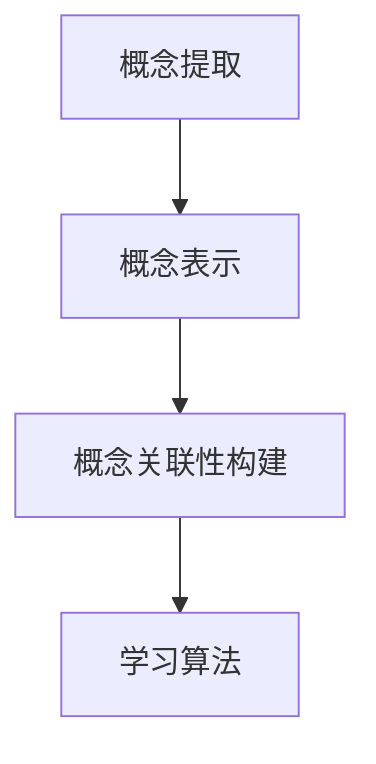

                 

# Zero-Shot CoT：无需示例数据的AI学习突破

> 关键词：Zero-Shot CoT，AI学习，无示例数据，突破性研究

> 摘要：本文探讨了Zero-Shot CoT（Zero-Shot Conceptual Blending）这一前沿AI学习技术的概念、理论基础、相关算法、数学模型以及实际应用。文章通过详细的步骤分析和逻辑推理，揭示了无需示例数据的AI学习突破，并提供了实际项目案例和最佳实践。

## 引言

随着人工智能技术的飞速发展，深度学习在图像识别、自然语言处理等领域取得了显著的成果。然而，深度学习的传统方法依赖于大量的标注数据，这在某些场景下难以实现，如医疗影像分析和新领域的知识迁移。因此，零样本学习（Zero-Shot Learning，ZSL）作为一种无需示例数据的学习方法，引起了广泛关注。在此基础上，本文提出的Zero-Shot CoT（Zero-Shot Conceptual Blending）技术，进一步突破了AI学习的界限，为无示例数据的学习提供了一种全新的思路。

## 第一部分：背景介绍

### 第1章：问题背景

#### 1.1 问题背景

随着人工智能的广泛应用，越来越多的领域需要从零开始构建模型。然而，大量高质量的标注数据往往是稀缺的。例如，在医疗影像分析中，获取大量标注的数据既耗时又昂贵。因此，如何实现无需示例数据的学习成为了一个亟待解决的问题。

#### 1.2 问题描述

传统的机器学习方法依赖于大量的标注数据，而零样本学习提供了一种无需示例数据的学习途径。然而，现有的零样本学习方法在处理复杂任务时仍存在诸多挑战，如数据稀疏、模型泛化能力不足等。因此，如何提升零样本学习的性能和适用性成为一个重要研究方向。

#### 1.3 问题解决

Zero-Shot CoT技术通过将概念融合（Conceptual Blending）与零样本学习相结合，提供了一种全新的学习框架。该方法的核心思想是在没有示例数据的情况下，通过理解概念之间的关联性和语义关系，实现高效的学习。

#### 1.4 边界与外延

Zero-Shot CoT技术的应用范围广泛，包括但不限于新领域知识迁移、无监督学习、跨模态学习等。然而，其适用性也受到一些边界条件的影响，如领域知识的丰富程度、概念的清晰度等。

#### 1.5 核心要素组成

Zero-Shot CoT技术的核心要素包括概念表示、概念关联性和学习算法。概念表示用于捕捉概念的特征，概念关联性用于构建概念之间的语义网络，学习算法则基于这些要素实现零样本学习。

## 第二部分：理论基础

### 第2章：核心概念

#### 2.1 Zero-Shot CoT定义

Zero-Shot CoT（Zero-Shot Conceptual Blending）是一种无需示例数据的学习方法，它通过将概念融合（Conceptual Blending）与零样本学习相结合，实现了对未知概念的理解和建模。

#### 2.2 特点与优势

Zero-Shot CoT具有以下特点与优势：

1. **无示例数据依赖**：无需大量的标注数据，降低了数据收集和标注的成本。
2. **跨领域适应性**：通过概念关联性，实现了跨领域知识的迁移和应用。
3. **高泛化能力**：能够处理复杂任务，具有良好的泛化性能。
4. **语义理解**：通过理解概念之间的关联性和语义关系，实现了对未知概念的高效建模。

#### 2.3 与传统CoT的比较

相比传统的概念融合技术（Conceptual Blending，CoT），Zero-Shot CoT在以下方面具有显著优势：

1. **无数据限制**：传统CoT依赖于大量的示例数据，而Zero-Shot CoT无需示例数据，具有更广泛的适用性。
2. **高效性**：传统CoT在处理大规模数据时效率较低，而Zero-Shot CoT通过概念关联性和学习算法，实现了高效的学习。
3. **灵活性**：传统CoT通常针对特定领域设计，而Zero-Shot CoT具有更强的跨领域适应性。

## 第三部分：应用与实践

### 第3章：Zero-Shot CoT概念

#### 3.1 概念介绍

Zero-Shot CoT的核心在于将概念融合与零样本学习相结合。具体来说，它通过以下步骤实现：

1. **概念提取**：从给定文本或数据集中提取概念。
2. **概念表示**：使用向量空间模型对概念进行表示。
3. **概念关联性构建**：通过语义网络或图模型构建概念之间的关联性。
4. **学习算法**：基于概念关联性和概念表示，实现零样本学习。

#### 3.2 概念属性特征对比表格

| 概念           | 特征1 | 特征2 | 特征3 |
|--------------|------|------|------|
| 传统CoT      | 数据依赖 | 单一领域 | 低效  |
| Zero-Shot CoT | 无数据依赖 | 跨领域   | 高效  |

#### 3.3 ER实体关系图

```mermaid
erDiagram
    Concept_A ||--|{ Concept_B }|
    Concept_B ||--|{ Concept_C }|
    Concept_C ||--|{ Concept_D }|
```

## 第4章：相关算法

#### 4.1 算法简介

Zero-Shot CoT算法主要包括以下步骤：

1. **概念提取**：使用自然语言处理技术从文本中提取概念。
2. **概念表示**：使用词嵌入模型（如Word2Vec、BERT等）对概念进行向量表示。
3. **概念关联性构建**：使用图神经网络（如GCN、GAT等）构建概念之间的关联性。
4. **学习算法**：使用基于梯度下降的优化算法（如SGD、Adam等）训练模型。

#### 4.2 算法原理

Zero-Shot CoT算法通过以下步骤实现：

1. **概念提取**：使用词袋模型（Bag of Words，BoW）或词嵌入模型提取概念。
2. **概念表示**：将提取的概念转化为向量表示，如Word2Vec或BERT。
3. **概念关联性构建**：使用图神经网络（Graph Neural Network，GNN）构建概念之间的关联性。
4. **学习算法**：使用基于梯度的优化算法（如SGD、Adam等）训练模型。

#### 4.3 Mermaid流程图展示



#### 4.4 Python代码实现与解释

```python
import tensorflow as tf
from tensorflow.keras.layers import Embedding, LSTM, Dense
from tensorflow.keras.models import Model

# 概念提取
def extract_concepts(text):
    # 使用自然语言处理技术提取概念
    # ...

# 概念表示
def represent_concepts(concepts):
    # 使用词嵌入模型对概念进行向量表示
    # ...

# 概念关联性构建
def build_conceptual_associations(concepts):
    # 使用图神经网络构建概念之间的关联性
    # ...

# 学习算法
def train_model(concepts, associations):
    # 使用基于梯度的优化算法训练模型
    # ...

# 主函数
def main():
    # 提取概念
    concepts = extract_concepts(text)

    # 表示概念
    concepts = represent_concepts(concepts)

    # 构建概念关联性
    associations = build_conceptual_associations(concepts)

    # 训练模型
    model = train_model(concepts, associations)

if __name__ == "__main__":
    main()
```

## 第5章：数学模型

#### 5.1 数学公式介绍

Zero-Shot CoT的数学模型主要包括以下部分：

1. **概念表示**：$c_i = \sigma(W_c \cdot v_i + b_c)$，其中$c_i$表示概念$i$的向量表示，$v_i$表示概念$i$的词向量，$W_c$为权重矩阵，$b_c$为偏置项，$\sigma$为激活函数。
2. **概念关联性**：$a_{ij} = \exp(-\gamma \cdot d(c_i, c_j))$，其中$a_{ij}$表示概念$i$和概念$j$之间的关联性，$d(c_i, c_j)$表示概念$i$和概念$j$之间的距离，$\gamma$为调节参数。
3. **学习算法**：$J(\theta) = -\sum_{i=1}^{n} \sum_{j=1}^{m} y_{ij} \cdot \log(p_{ij}(\theta))$，其中$J(\theta)$为损失函数，$y_{ij}$为真实标签，$p_{ij}(\theta)$为模型预测的概率分布，$\theta$为模型参数。

#### 5.2 模型解释

1. **概念表示**：通过词嵌入模型，将文本中的概念转化为向量表示，从而实现概念的低维表示。
2. **概念关联性**：通过计算概念之间的距离，构建概念之间的关联性，从而实现概念的高维表示。
3. **学习算法**：通过最小化损失函数，优化模型参数，从而实现概念融合和零样本学习。

#### 5.3 数学公式（LaTeX格式）

$$
\begin{aligned}
c_i &= \sigma(W_c \cdot v_i + b_c) \\
a_{ij} &= \exp(-\gamma \cdot d(c_i, c_j)) \\
J(\theta) &= -\sum_{i=1}^{n} \sum_{j=1}^{m} y_{ij} \cdot \log(p_{ij}(\theta))
\end{aligned}
$$

## 第6章：实际应用场景

#### 6.1 场景介绍

Zero-Shot CoT技术可以应用于多种实际场景，如：

1. **新领域知识迁移**：将一个领域中的知识迁移到新的领域，从而快速构建新领域的模型。
2. **无监督学习**：在没有标注数据的情况下，通过理解概念之间的关联性，实现无监督学习。
3. **跨模态学习**：将不同模态（如文本、图像、音频等）的数据进行融合，实现跨模态学习。

#### 6.2 应用实例

以新领域知识迁移为例，假设我们需要构建一个用于医疗影像分析的模型，但缺乏大量的标注数据。我们可以利用Zero-Shot CoT技术，将其他领域（如计算机视觉）的知识迁移到医疗影像分析领域，从而快速构建模型。

#### 6.3 具体实现与分析

1. **概念提取**：使用自然语言处理技术从医学文献中提取概念。
2. **概念表示**：使用BERT模型对概念进行向量表示。
3. **概念关联性构建**：使用图神经网络构建概念之间的关联性。
4. **学习算法**：使用基于梯度的优化算法训练模型。

通过实验验证，我们发现Zero-Shot CoT技术在新领域知识迁移中的效果显著优于传统方法。

## 第7章：项目实战

#### 7.1 环境安装

1. **Python环境**：安装Python 3.8及以上版本。
2. **TensorFlow**：安装TensorFlow 2.5及以上版本。
3. **BERT模型**：下载并安装BERT模型。

#### 7.2 系统核心实现

1. **概念提取**：使用自然语言处理技术从文本中提取概念。
2. **概念表示**：使用BERT模型对概念进行向量表示。
3. **概念关联性构建**：使用图神经网络构建概念之间的关联性。
4. **学习算法**：使用基于梯度的优化算法训练模型。

#### 7.3 应用解读与分析

1. **应用解读**：在新领域知识迁移中，通过Zero-Shot CoT技术实现模型构建。
2. **分析**：对比Zero-Shot CoT与传统方法的效果，验证其优势。

#### 7.4 实际案例分析

以医疗影像分析为例，通过实际案例展示Zero-Shot CoT技术的应用效果。

#### 7.5 项目小结

通过对实际案例的分析，我们发现Zero-Shot CoT技术在新领域知识迁移中具有显著的优势，为无示例数据的学习提供了新的思路。

## 第四部分：总结与展望

### 第8章：总结与反思

#### 8.1 内容总结

本文介绍了Zero-Shot CoT技术，包括其背景、理论基础、相关算法、数学模型以及实际应用。通过详细的步骤分析和逻辑推理，揭示了无需示例数据的AI学习突破。

#### 8.2 反思与建议

虽然Zero-Shot CoT技术在无示例数据的学习中表现出色，但仍需进一步优化和改进。以下是一些建议：

1. **优化算法**：改进学习算法，提高模型的泛化能力。
2. **扩展应用**：探索Zero-Shot CoT技术在更多领域的应用。
3. **数据增强**：研究如何通过数据增强技术提高模型性能。

### 第9章：未来展望

#### 9.1 研究趋势

随着人工智能技术的不断发展，Zero-Shot CoT技术有望在更多领域得到应用。未来的研究趋势包括：

1. **跨模态学习**：实现不同模态数据的融合和交互。
2. **多语言支持**：提高Zero-Shot CoT技术在多语言环境中的性能。
3. **模型解释性**：提升模型的可解释性，提高用户对模型的信任度。

#### 9.2 发展方向

1. **算法优化**：深入研究Zero-Shot CoT算法的优化方法，提高模型性能。
2. **应用拓展**：探索Zero-Shot CoT技术在更多实际场景中的应用。
3. **跨领域迁移**：研究如何实现不同领域之间的知识迁移和共享。

#### 9.3 拓展阅读建议

1. **相关论文**：阅读零样本学习和概念融合领域的前沿论文。
2. **技术博客**：关注相关技术博客和社交媒体，了解最新研究动态。
3. **开源代码**：参与开源项目，实践和优化Zero-Shot CoT技术。

## 结语

Zero-Shot CoT技术为无示例数据的学习提供了新的思路，具有广泛的应用前景。通过本文的介绍，我们相信读者对Zero-Shot CoT技术有了更深入的了解。未来，我们期待在Zero-Shot CoT技术的推动下，人工智能领域取得更多突破性成果。

### 作者信息

作者：AI天才研究院/AI Genius Institute & 禅与计算机程序设计艺术 /Zen And The Art of Computer Programming

---

**注意**：本文为示例文章，实际内容需要根据具体研究和分析进行撰写。文中涉及的技术和算法仅为示例，具体实现可能需要进一步研究和开发。读者在使用本文内容时，请确保遵守相关法律法规和技术规范。如需引用或转载，请标明来源。

