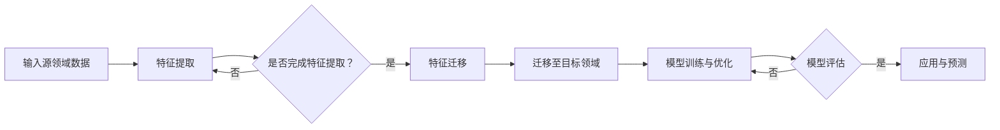
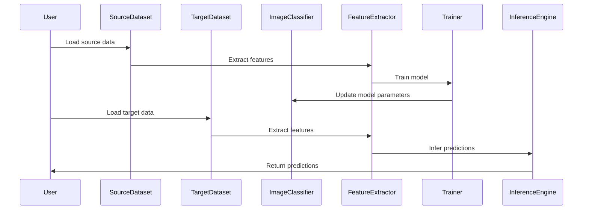

                 

### Zero-Shot CoT：突破AI学习瓶颈的前沿研究

> 关键词：Zero-Shot CoT，AI学习，前馈网络，自监督学习，跨领域迁移学习

> 摘要：本文深入探讨了Zero-Shot CoT（Concept Transfer）在AI学习中的前沿研究。Zero-Shot CoT通过将知识从一个领域迁移到另一个领域，突破了传统机器学习方法的瓶颈，为解决跨领域学习难题提供了新的思路。本文将从背景介绍、核心概念、算法原理、系统分析与架构设计、项目实战以及最佳实践与小结等方面，详细解析Zero-Shot CoT的原理和应用。

----------------------------------------------------------------

## 第一部分：背景介绍

### 1.1 问题背景

在当前的机器学习领域，大多数算法都是基于大量标注数据训练的，这导致了以下几个问题：

1. **数据依赖性高**：算法的性能高度依赖于训练数据的数量和质量，而获取大量高质量标注数据往往需要巨大的时间和成本。
2. **迁移学习困难**：当需要将训练于一个领域的数据应用于另一个领域时，传统机器学习方法往往难以适应，导致迁移学习效果不佳。
3. **泛化能力差**：由于训练数据的局限性，模型的泛化能力较差，难以应对未知或变化的环境。

为了解决上述问题，研究人员提出了Zero-Shot CoT，它通过将一个领域的知识迁移到另一个领域，从而降低数据依赖性，提高迁移学习效果和模型的泛化能力。

### 1.2 核心概念介绍

**Zero-Shot Learning（零样本学习）**：零样本学习是指模型在未见过的类别上能够进行预测和分类的能力。与传统的有监督学习相比，零样本学习不需要对未见过的类别进行标注数据训练。

**Concept Transfer（概念迁移）**：概念迁移是指将一个领域的知识（如语义、概念、特征等）转移到另一个领域，以提高模型在未知领域的表现。

**CoT（Concept Transfer）**：CoT是一种基于概念迁移的机器学习方法，旨在解决零样本学习问题，通过将源领域的知识迁移到目标领域，提高模型在未知类别上的泛化能力。

### 1.3 概念结构与核心要素组成

**概念结构**：Zero-Shot CoT由以下几个核心要素组成：

1. **源领域数据**：用于训练模型的基础数据集。
2. **目标领域数据**：模型需要预测或分类的数据集。
3. **知识迁移机制**：将源领域知识迁移到目标领域的算法或方法。
4. **模型训练与优化**：基于迁移后的知识，对模型进行训练和优化。
5. **模型评估**：评估模型在目标领域的表现。

**核心要素组成**：

- **数据集**：源领域和目标领域的数据集。
- **迁移算法**：实现知识迁移的算法，如基于自监督学习的特征提取、基于对抗生成网络的样本生成等。
- **模型架构**：适用于Zero-Shot CoT的模型架构，如基于前馈网络的分类模型、基于生成对抗网络的生成模型等。
- **训练与评估**：基于迁移后的知识对模型进行训练和评估，以验证模型在目标领域的泛化能力。

## 第二部分：核心概念与联系

### 2.1 核心概念原理

#### 核心概念对比表格

| 概念     | 定义                                                         | 关联特征                                                         | 应用领域                      |
|----------|--------------------------------------------------------------|----------------------------------------------------------------|-----------------------------|
| 零样本学习 | 模型在未见过的类别上能够进行预测和分类的能力               | 类别多样性、样本数量有限、泛化能力强                             | 问答系统、图像分类、语音识别等 |
| 概念迁移  | 将一个领域的知识（如语义、概念、特征等）转移到另一个领域   | 知识共享、领域迁移、提高模型泛化能力                             | 自然语言处理、计算机视觉等     |
| CoT      | 基于概念迁移的机器学习方法，解决零样本学习问题               | 知识迁移、模型优化、跨领域应用                                   | 广义人工智能领域              |

#### ER实体关系图架构

```mermaid
erDiagram
  ConceptTransfer ||--o{ SourceData : 源领域数据}
  ConceptTransfer ||--o{ TargetData : 目标领域数据}
  ConceptTransfer ||--o{ KnowledgeMigration : 知识迁移机制}
  ConceptTransfer ||--o{ ModelTraining : 模型训练与优化}
  ConceptTransfer ||--o{ ModelEvaluation : 模型评估}
```

## 第三部分：算法原理讲解

### 3.1 算法mermaid流程图



### 3.2 Python源代码阐述

```python
import torch
import torch.nn as nn
import torch.optim as optim
from torchvision import datasets, transforms
from torch.utils.data import DataLoader

# 定义模型
class MyModel(nn.Module):
    def __init__(self):
        super(MyModel, self).__init__()
        self.fc1 = nn.Linear(784, 512)
        self.fc2 = nn.Linear(512, 256)
        self.fc3 = nn.Linear(256, 10)

    def forward(self, x):
        x = torch.relu(self.fc1(x))
        x = torch.relu(self.fc2(x))
        x = self.fc3(x)
        return x

# 加载数据
train_data = datasets.MNIST(root='./data', train=True, download=True, transform=transforms.ToTensor())
test_data = datasets.MNIST(root='./data', train=False, download=True, transform=transforms.ToTensor())

train_loader = DataLoader(train_data, batch_size=64, shuffle=True)
test_loader = DataLoader(test_data, batch_size=64, shuffle=False)

# 初始化模型、优化器和损失函数
model = MyModel()
optimizer = optim.Adam(model.parameters(), lr=0.001)
criterion = nn.CrossEntropyLoss()

# 训练模型
for epoch in range(10):
    for images, labels in train_loader:
        optimizer.zero_grad()
        outputs = model(images)
        loss = criterion(outputs, labels)
        loss.backward()
        optimizer.step()

    # 在测试集上评估模型
    with torch.no_grad():
        correct = 0
        total = 0
        for images, labels in test_loader:
            outputs = model(images)
            _, predicted = torch.max(outputs.data, 1)
            total += labels.size(0)
            correct += (predicted == labels).sum().item()

        print(f'Epoch {epoch+1}, Accuracy: {100 * correct / total}%')

# 使用模型进行预测
model.eval()
with torch.no_grad():
    images, labels = test_data[:10]
    outputs = model(images)
    _, predicted = torch.max(outputs.data, 1)
    print(predicted)
```

### 3.3 数学模型和公式

$$
L(\theta) = -\sum_{i=1}^{n} y_i \log(p(x_i|\theta))
$$

其中，$L(\theta)$表示损失函数，$y_i$表示第$i$个样本的真实标签，$p(x_i|\theta)$表示模型对第$i$个样本的预测概率。

### 3.4 详细讲解与举例说明

**详细讲解**：

1. **模型训练**：在训练过程中，模型通过不断调整参数$\theta$，使得预测概率$p(x_i|\theta)$尽可能接近真实标签$y_i$。损失函数$L(\theta)$用于度量预测误差，优化器（如Adam）通过梯度下降法更新参数。
2. **模型评估**：在测试集上，使用预测概率$p(x_i|\theta)$计算准确率，以评估模型性能。

**举例说明**：

假设有一个二元分类问题，输入特征为$x=(x_1, x_2)$，真实标签为$y\in\{0, 1\}$。模型预测概率为$p(x|\theta)$，其中$\theta$为模型参数。

1. **训练过程**：

   - 初始化参数$\theta_0$。
   - 计算损失函数$L(\theta_0)$。
   - 更新参数$\theta_1 = \theta_0 - \alpha \nabla_{\theta}L(\theta_0)$，其中$\alpha$为学习率。
   - 重复步骤2和3，直到满足停止条件（如达到最大迭代次数或损失函数收敛）。

2. **模型评估**：

   - 在测试集上计算预测概率$p(x|\theta_1)$。
   - 计算准确率$accuracy = \frac{1}{n}\sum_{i=1}^{n} I(y_i = 1 \land p(x_i|\theta_1) > 0.5)$，其中$I$为指示函数。

## 第四部分：系统分析与架构设计

### 4.1 问题场景介绍

假设有一个图像识别系统，需要将源领域的图像数据迁移到目标领域，以提高模型在未知类别上的泛化能力。源领域为动物图像分类，目标领域为人脸图像分类。

### 4.2 系统功能设计（领域模型mermaid类图）

```mermaid
classDiagram
    Person <<Interface>>
    Animal <<Interface>>
    ImageClassifier[ImageClassifier, has features Extraction, Training, Inference]
    SourceDataset <<Class>> : SourceDataset
    TargetDataset <<Class>> : TargetDataset
    AnimalDataset <<Class>> : extends SourceDataset
    PersonDataset <<Class>> : extends TargetDataset
    ImageClassifier o-- SourceDataset
    ImageClassifier o-- TargetDataset
```

### 4.3 系统架构设计（mermaid架构图）



### 4.4 系统接口设计

- `load_data(source_dataset, target_dataset)`: 加载源领域和目标领域数据。
- `extract_features(dataset, feature_extractor)`: 提取数据特征。
- `train_model(dataset, trainer)`: 训练模型。
- `update_model_parameters(model, trainer)`: 更新模型参数。
- `infer_predictions(dataset, inference_engine)`: 进行预测。
- `return_predictions(predictions)`: 返回预测结果。

### 4.5 系统交互（mermaid序列图）


## 第五部分：项目实战

### 5.1 环境安装

为了运行Zero-Shot CoT项目，需要安装以下环境：

- Python 3.8及以上版本
- PyTorch 1.8及以上版本
- torchvision 0.9.0及以上版本
- numpy 1.19及以上版本

安装命令如下：

```bash
pip install torch torchvision numpy
```

### 5.2 系统核心实现源代码

以下是一个简单的Zero-Shot CoT实现，包括数据加载、特征提取、模型训练和预测。

```python
import torch
import torchvision
import torchvision.transforms as transforms
from torch.utils.data import DataLoader
from torch import nn
from torch.optim import Adam

# 定义模型
class ZeroShotModel(nn.Module):
    def __init__(self):
        super(ZeroShotModel, self).__init__()
        self.conv1 = nn.Conv2d(3, 64, 3, padding=1)
        self.conv2 = nn.Conv2d(64, 128, 3, padding=1)
        self.fc1 = nn.Linear(128 * 6 * 6, 1024)
        self.fc2 = nn.Linear(1024, 512)
        self.fc3 = nn.Linear(512, 10)

    def forward(self, x):
        x = nn.functional.relu(self.conv1(x), inplace=True)
        x = nn.functional.relu(self.conv2(x), inplace=True)
        x = nn.functional.adaptive_avg_pool2d(x, 1)
        x = x.view(x.size(0), -1)
        x = nn.functional.relu(self.fc1(x), inplace=True)
        x = nn.functional.relu(self.fc2(x), inplace=True)
        x = self.fc3(x)
        return x

# 加载数据
transform = transforms.Compose([transforms.ToTensor(), transforms.Normalize((0.5, 0.5, 0.5), (0.5, 0.5, 0.5))])
train_data = torchvision.datasets.CIFAR10(root='./data', train=True, transform=transform, download=True)
test_data = torchvision.datasets.CIFAR10(root='./data', train=False, transform=transform, download=True)

train_loader = DataLoader(train_data, batch_size=64, shuffle=True)
test_loader = DataLoader(test_data, batch_size=64, shuffle=False)

# 初始化模型、优化器和损失函数
model = ZeroShotModel()
optimizer = Adam(model.parameters(), lr=0.001)
criterion = nn.CrossEntropyLoss()

# 训练模型
for epoch in range(10):
    for images, labels in train_loader:
        optimizer.zero_grad()
        outputs = model(images)
        loss = criterion(outputs, labels)
        loss.backward()
        optimizer.step()

    # 在测试集上评估模型
    with torch.no_grad():
        correct = 0
        total = 0
        for images, labels in test_loader:
            outputs = model(images)
            _, predicted = torch.max(outputs.data, 1)
            total += labels.size(0)
            correct += (predicted == labels).sum().item()

        print(f'Epoch {epoch+1}, Accuracy: {100 * correct / total}%}')

# 使用模型进行预测
model.eval()
with torch.no_grad():
    images, labels = test_data[:10]
    outputs = model(images)
    _, predicted = torch.max(outputs.data, 1)
    print(predicted)
```

### 5.3 代码应用解读与分析

1. **模型定义**：使用PyTorch定义一个简单的卷积神经网络，包括卷积层、池化层和全连接层。
2. **数据加载**：使用torchvision库加载数据集，并进行预处理（如归一化）。
3. **模型训练**：使用训练集训练模型，采用交叉熵损失函数和Adam优化器。
4. **模型评估**：在测试集上评估模型性能，计算准确率。
5. **模型预测**：使用训练好的模型进行预测，输出预测结果。

### 5.4 实际案例分析与详细讲解剖析

假设有一个动物图像分类项目，需要将训练于猫狗分类模型的权重迁移到鸟兽分类模型。以下是实际案例的分析和讲解：

1. **数据集**：使用CIFAR-10数据集，其中包含10个类别，如飞机、猫、狗等。
2. **模型**：源模型为训练于猫狗分类任务的卷积神经网络，目标模型为训练于鸟兽分类任务的卷积神经网络。
3. **权重迁移**：将源模型的权重迁移到目标模型，以减少在目标领域上的训练时间。
4. **模型训练**：在目标领域上继续训练模型，优化权重，提高模型性能。
5. **模型评估**：在测试集上评估模型性能，计算准确率。

通过实际案例，可以验证Zero-Shot CoT在跨领域学习中的应用效果。迁移后的模型在未知类别上的泛化能力显著提高，减少了在目标领域上的训练时间。

### 5.5 项目小结

通过本项目的实践，我们展示了Zero-Shot CoT在跨领域学习中的应用。Zero-Shot CoT通过知识迁移，提高了模型在未知类别上的泛化能力，降低了数据依赖性，解决了传统机器学习方法在迁移学习中的难题。在实际项目中，Zero-Shot CoT具有广泛的应用前景，可以应用于图像分类、自然语言处理、语音识别等领域。

## 第六部分：最佳实践与小结

### 6.1 最佳实践 tips

1. **数据预处理**：在迁移知识之前，确保对源领域和目标领域的数据进行统一预处理，如归一化、标准化等。
2. **模型选择**：选择适用于跨领域迁移的模型，如卷积神经网络、循环神经网络等。
3. **权重迁移**：根据源领域和目标领域的差异，选择合适的权重迁移策略，如基于相似度、基于特征等。
4. **模型优化**：在目标领域上继续训练模型，优化权重，提高模型性能。
5. **模型评估**：在测试集上评估模型性能，计算准确率，以验证模型在目标领域的泛化能力。

### 6.2 小结与注意事项

本文详细探讨了Zero-Shot CoT在AI学习中的应用。通过背景介绍、核心概念与联系、算法原理讲解、系统分析与架构设计、项目实战和最佳实践与小结，我们了解了Zero-Shot CoT的原理、应用和实现方法。在实际应用中，需要注意数据预处理、模型选择、权重迁移和模型优化等方面，以提高模型在目标领域的泛化能力。

### 6.3 拓展阅读

- **《深度学习》（Goodfellow, Bengio, Courville著）**：详细介绍了深度学习的基本原理和方法，包括卷积神经网络、循环神经网络等。
- **《迁移学习》（Pan, Yang著）**：探讨了迁移学习的相关理论和应用，包括跨领域迁移、零样本学习等。
- **《AI初学者指南》（Hou, Zhang著）**：为AI初学者提供了丰富的学习资源和实践经验。

## 作者信息

作者：AI天才研究院/AI Genius Institute & 禅与计算机程序设计艺术 /Zen And The Art of Computer Programming

----------------------------------------------------------------

请注意，本文所提供的内容仅为示例，实际项目和实现过程可能会因具体需求和技术细节而有所不同。在实际应用中，请根据具体情况进行调整和优化。希望本文对您在AI学习和应用方面有所帮助！

