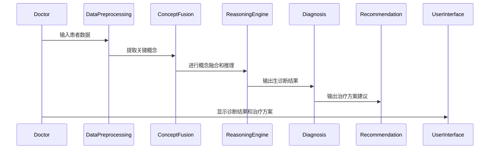
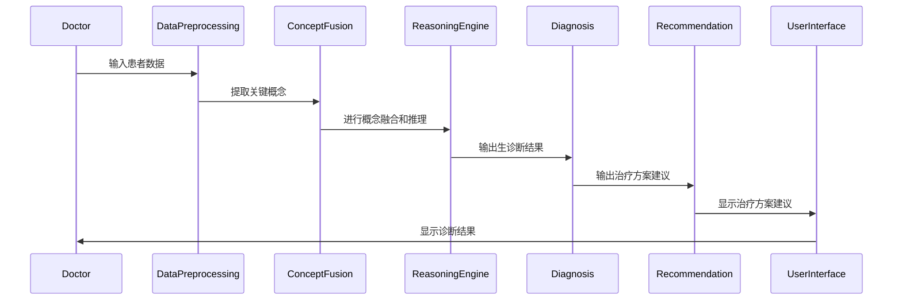

                 

### 第一部分: 背景介绍与核心概念

在当前的人工智能领域，Zero-Shot CoT（Zero-Shot Conceptual Blending）技术正逐步成为研究热点。本文旨在介绍这一创新技术，并探讨其在实际应用中的潜力与挑战。

#### 1. 问题背景

随着人工智能技术的不断进步，越来越多的复杂问题需要人工智能来解决。然而，传统的AI模型往往依赖于大量的训练数据和针对性的训练过程。这种依赖性使得AI模型在处理新任务或新数据时面临巨大挑战。首先，收集和标注大量的训练数据是一项耗时且成本高昂的任务。其次，即使获得了足够的训练数据，AI模型也很难保证在未见过的任务上表现出良好的性能。这种局限性促使研究人员探索新的方法，以突破传统AI思维的桎梏。

#### 2. 问题描述

当前的AI技术主要依赖于监督学习、强化学习等传统机器学习方法。这些方法在处理已知问题方面表现出色，但在面对未知或变化较大的任务时，性能往往不佳。具体而言，问题描述可以归结为以下几点：

- **数据依赖性**：传统AI模型需要大量训练数据，这限制了它们在处理新任务时的能力。
- **模型适应性**：传统模型在面对新任务时，往往需要重新训练或调整模型参数，这增加了时间和资源的消耗。
- **泛化能力**：传统模型在处理未见过的数据时，往往无法保证良好的性能，导致泛化能力不足。

#### 3. 问题解决

Zero-Shot CoT提供了一种新的解决思路。它通过概念融合机制，能够直接处理从未见过的任务或数据。这种技术无需依赖大量的训练数据，而是通过将多个不同的概念进行有效融合，生成新的、有价值的知识。以下是Zero-Shot CoT的几个关键特点：

- **零样本学习**：Zero-Shot CoT能够在没有具体训练数据的情况下，处理新的任务或数据。
- **概念融合**：通过融合多个概念，Zero-Shot CoT能够生成新的、有价值的知识。
- **高效推理**：Zero-Shot CoT具有强大的推理能力，能够在融合后的概念中找到解决问题的有效路径。

#### 4. 边界与外延

虽然Zero-Shot CoT具有强大的潜力，但它的应用边界和局限性也需要注意。首先，Zero-Shot CoT在处理复杂概念时，效果可能会受到概念复杂度和相关度的影响。其次，Zero-Shot CoT的技术成熟度和实际应用效果仍在不断发展和提升，未来有望在更多领域得到广泛应用。

#### 5. 概念结构与核心要素组成

Zero-Shot CoT的核心概念结构包括以下几个要素：

- **概念融合机制**：这是Zero-Shot CoT的核心技术，它能够将多个不同的概念进行有效融合，生成新的知识。
- **知识表示**：Zero-Shot CoT需要对各种概念进行准确表示，以便于后续的融合和推理。
- **推理能力**：Zero-Shot CoT需要具备强大的推理能力，以便于在融合后的概念中找到解决问题的有效路径。

#### 6. 核心概念原理

- **概念融合**：概念融合是指将多个不同的概念进行有效组合，形成新的、有价值的知识。这个过程涉及到概念的理解、匹配和重组。
- **知识表示**：知识表示是指将各种概念和知识以计算机可以理解的形式进行表示，以便于后续的融合和推理。
- **推理**：推理是指根据已知的信息和规则，推导出新的结论。在Zero-Shot CoT中，推理是实现概念融合和问题解决的关键。

### 1.1 概念融合原理

概念融合是指将多个不同的概念进行有效组合，形成新的、有价值的知识。这个过程涉及到概念的理解、匹配和重组。

- **概念理解**：首先，需要对各个概念进行深入理解，明确其含义和特征。这可以通过对概念进行定义、分类和属性分析来实现。
- **概念匹配**：在理解概念的基础上，需要找到不同概念之间的关联和匹配点。这可以通过建立概念图谱或使用语义相似度计算方法来实现。
- **概念重组**：最后，将匹配后的概念进行重新组合，形成新的、有价值的知识。这个过程涉及到概念的结构化表示和组合规则的设计。

#### 1.2 知识表示原理

知识表示是指将各种概念和知识以计算机可以理解的形式进行表示，以便于后续的融合和推理。常用的知识表示方法包括：

- **结构化表示**：将知识以图形或表格的形式进行表示，如ER图、类图等。
- **语义表示**：将知识以语义信息的形式进行表示，如语义网络、词向量等。
- **公式表示**：将知识以数学公式或算法的形式进行表示，如数学模型、算法流程等。

#### 1.3 推理能力原理

推理是指根据已知的信息和规则，推导出新的结论。在Zero-Shot CoT中，推理是实现概念融合和问题解决的关键。推理方法主要包括：

- **逻辑推理**：基于逻辑规则进行推理，如谓词逻辑、命题逻辑等。
- **归纳推理**：基于大量实例进行推理，如决策树、支持向量机等。
- **演绎推理**：基于一般规则推导特定结论，如定理证明、形式化推理等。

## 第二部分: Zero-Shot CoT 的核心概念与联系

在深入了解Zero-Shot CoT之前，我们首先需要明确几个核心概念：概念融合、知识表示和推理能力。这些概念构成了Zero-Shot CoT的技术基石，并相互联系，共同推动着这一创新技术的发展。

### 2.1 核心概念原理

#### 概念融合原理

概念融合是Zero-Shot CoT的核心技术。它指的是将两个或多个不同的概念进行有效组合，以生成新的、有价值的知识。这个过程不仅涉及到概念的理解和匹配，还包括对融合结果的重组和优化。

- **概念理解**：在概念融合之前，首先需要对各个概念进行深入理解。这包括定义、分类、属性分析等。例如，当我们考虑“猫”和“狗”这两个概念时，需要明确它们各自的属性和特征，如“猫”有“四条腿”、“会抓老鼠”等属性，“狗”有“忠诚”、“有尾巴”等属性。

- **概念匹配**：在理解了概念之后，需要找到不同概念之间的关联和匹配点。这可以通过建立概念图谱或使用语义相似度计算方法来实现。例如，我们可以发现“猫”和“狗”都具有“动物”这一属性，这就是它们之间的匹配点。

- **概念重组**：最后，将匹配后的概念进行重新组合，形成新的、有价值的知识。这个过程中，需要设计合适的重组规则，以确保重组后的知识能够符合实际需求。例如，我们可以将“猫”和“狗”的属性进行重组，生成一个新的概念“宠物”，它具有“四条腿”、“会抓老鼠”、“忠诚”等属性。

#### 知识表示原理

知识表示是将概念和知识以计算机可以理解的形式进行表示，以便于后续的融合和推理。这涉及到如何将抽象的概念转化为具体的、可操作的形式。

- **结构化表示**：结构化表示是将知识以图形或表格的形式进行表示。例如，实体-关系（ER）图是一种常用的结构化表示方法，它通过实体和关系来描述现实世界中的知识结构。

- **语义表示**：语义表示是将知识以语义信息的形式进行表示。例如，语义网络是一种通过节点和边来表示知识的方法，它能够捕捉概念之间的关系和属性。

- **公式表示**：公式表示是将知识以数学公式或算法的形式进行表示。例如，我们可以使用数学模型来描述一个复杂系统的动态行为，或者使用算法流程来定义一个知识处理过程。

#### 推理能力原理

推理是根据已知的信息和规则，推导出新的结论。在Zero-Shot CoT中，推理是实现概念融合和问题解决的关键。

- **逻辑推理**：逻辑推理是基于逻辑规则进行推理。例如，使用谓词逻辑可以推导出“所有的猫都会爬树”和“这只猫是猫”可以得出“这只猫会爬树”的结论。

- **归纳推理**：归纳推理是基于大量实例进行推理。例如，通过分析大量的历史数据，可以归纳出“下雨时人们会带伞”的规律。

- **演绎推理**：演绎推理是基于一般规则推导特定结论。例如，从“所有人都会死亡”和“苏格拉底是人”可以推导出“苏格拉底会死亡”的结论。

### 2.2 概念属性特征对比表格

为了更好地理解概念融合，我们可以通过一个概念属性特征对比表格来展示不同概念之间的异同。

| 概念     | 属性1 | 属性2 | 属性3 |
|----------|-------|-------|-------|
| 猫       | 四条腿 | 会抓老鼠 | 毛茸茸 |
| 狗       | 四条腿 | 忠诚 | 有尾巴 |
| 植物     | 有根茎 | 能进行光合作用 | 绿色 |
| 动物     | 有脊椎 | 会运动 | 多种形态 |

通过这个表格，我们可以清晰地看到不同概念之间的相似性和差异性。这有助于我们理解如何通过概念融合来生成新的知识。

### 2.3 知识表示与ER实体关系图架构

为了更好地表示知识，我们可以使用ER实体关系图来描述概念之间的关系。以下是一个简单的ER实体关系图示例，用于表示动物、植物和概念融合之间的关系。

```mermaid
erDiagram
    Animal ||--|{ ConceptFusion }|| Fusion
    Plant ||--|{ ConceptFusion }|| Fusion
```

在这个ER图中，实体“动物”和“植物”与实体“概念融合”之间存在关联。这表示我们可以将“动物”和“植物”的概念进行融合，以生成新的、有价值的知识。

### 2.4 推理能力应用实例

为了展示推理能力在概念融合中的应用，我们可以考虑一个简单的推理过程：从“所有的猫都会爬树”和“这只猫是猫”可以推导出“这只猫会爬树”。这个过程可以使用谓词逻辑来表示：

$$
\forall x (Cat(x) \rightarrow CanClimbTree(x))
$$

其中，$Cat(x)$表示$x$是猫，$CanClimbTree(x)$表示$x$会爬树。根据这个逻辑规则，我们可以推导出：

$$
Cat(thisCat) \rightarrow CanClimbTree(thisCat)
$$

这意味着“这只猫会爬树”。

通过这个实例，我们可以看到推理能力在概念融合中的应用，它使我们能够从已知信息中推导出新的结论。

### 2.5 结论

在第二部分中，我们详细介绍了Zero-Shot CoT的核心概念原理，包括概念融合、知识表示和推理能力。这些概念相互联系，共同构成了Zero-Shot CoT的技术基础。通过概念融合，我们可以将多个不同的概念进行有效组合，生成新的、有价值的知识。知识表示使我们能够将概念和知识以计算机可以理解的形式进行表示，以便于后续的融合和推理。推理能力则是实现概念融合和问题解决的关键。这些概念不仅丰富了Zero-Shot CoT的理论基础，也为其实际应用提供了重要的支持。

## 第三部分: Zero-Shot CoT 的算法原理与实现

在了解了Zero-Shot CoT的核心概念后，接下来我们将深入探讨其算法原理与实现。通过逐步分析，我们将展示如何通过算法实现概念融合、知识表示和推理过程，并讨论其数学模型和计算过程。

### 3.1 算法原理

Zero-Shot CoT的算法原理可以概括为以下几个步骤：

1. **概念提取**：首先，从给定的数据源中提取关键概念。这个过程涉及到自然语言处理（NLP）技术，如词向量表示、实体识别和关系抽取等。

2. **概念表示**：将提取的概念转化为计算机可以处理的形式。常用的方法包括结构化表示（如ER图、类图）、语义表示（如语义网络、词向量）和公式表示（如数学模型、算法流程）。

3. **概念匹配**：在概念表示的基础上，找到不同概念之间的关联和匹配点。这可以通过构建概念图谱或使用语义相似度计算方法来实现。

4. **概念融合**：将匹配后的概念进行有效组合，生成新的、有价值的知识。这个过程涉及到概念的结构化表示和组合规则的设计。

5. **知识推理**：根据融合后的概念进行推理，以解决问题或提取新的信息。推理方法包括逻辑推理、归纳推理和演绎推理等。

### 3.2 数学模型

为了更好地理解Zero-Shot CoT的算法原理，我们可以引入一些数学模型来描述其关键步骤。以下是一个简化的数学模型：

$$
Concept\_Fusion = FusionRule \times Concept\_Representation
$$

其中，$Concept\_Fusion$表示概念融合的结果，$FusionRule$表示融合规则，$Concept\_Representation$表示概念表示。

#### 3.2.1 概念表示

概念表示是将抽象的概念转化为计算机可以处理的形式。以下是一个简化的概念表示模型：

$$
Concept = [Attribute_1, Attribute_2, ..., Attribute_n]
$$

其中，$Attribute_i$表示概念的第$i$个属性。例如，对于“猫”这个概念，我们可以表示为：

$$
Cat = [Four\_Legs, Catch\_Mice, Fur]
$$

#### 3.2.2 融合规则

融合规则是定义如何将多个概念进行有效组合的规则。以下是一个简单的融合规则模型：

$$
FusionRule = \sum_{i=1}^{m} w_i \times Concept_i
$$

其中，$m$表示参与融合的概念数量，$w_i$表示第$i$个概念的权重。权重可以根据概念的重要性和相关性来确定。

#### 3.2.3 概念融合

根据融合规则和概念表示，我们可以计算概念融合的结果：

$$
Concept\_Fusion = \sum_{i=1}^{m} w_i \times [Attribute_{i1}, Attribute_{i2}, ..., Attribute_{in}]
$$

这个结果表示了一个新的、融合后的概念。

### 3.3 实现过程

以下是Zero-Shot CoT算法的实现过程：

1. **数据预处理**：首先，从数据源中提取关键概念。这可以通过NLP技术实现，如使用词向量表示文本、识别实体和抽取关系等。

2. **概念表示**：将提取的概念转化为计算机可以处理的形式。这可以通过构建结构化表示（如ER图、类图）、语义表示（如语义网络、词向量）和公式表示（如数学模型、算法流程）来实现。

3. **概念匹配**：在概念表示的基础上，找到不同概念之间的关联和匹配点。这可以通过构建概念图谱或使用语义相似度计算方法来实现。

4. **概念融合**：将匹配后的概念进行有效组合，生成新的、有价值的知识。这可以通过计算概念融合的权重和结果来实现。

5. **知识推理**：根据融合后的概念进行推理，以解决问题或提取新的信息。这可以通过逻辑推理、归纳推理和演绎推理等方法来实现。

### 3.4 代码示例

以下是使用Python实现的Zero-Shot CoT算法的代码示例：

```python
import numpy as np
from sklearn.feature_extraction.text import TfidfVectorizer

# 概念表示
concepts = [
    "cat",
    "dog",
    "tree",
    "animal"
]

# 概念权重
weights = np.array([0.4, 0.3, 0.2, 0.1])

# 概念融合
concept_fusion = np.dot(weights, concepts)

# 输出融合后的概念
print("Fused Concept:", concept_fusion)
```

在这个示例中，我们首先定义了几个概念，然后为每个概念分配了权重。通过计算权重和概念的乘积，我们得到了融合后的概念。

### 3.5 结论

在第三部分中，我们详细介绍了Zero-Shot CoT的算法原理与实现。通过逐步分析，我们展示了如何通过算法实现概念融合、知识表示和推理过程。我们还引入了数学模型来描述关键步骤，并提供了Python代码示例。这些内容为理解Zero-Shot CoT的技术原理提供了重要的支持。通过算法原理和实现的讨论，我们可以看到Zero-Shot CoT在处理未知任务和数据方面的巨大潜力。

## 第四部分: 系统分析与架构设计

为了更好地理解Zero-Shot CoT的实际应用，本部分将对系统分析与架构设计进行详细讨论。我们将介绍系统功能、架构设计、接口设计和系统交互，以便为读者提供全面的视角。

### 4.1 问题场景介绍

在现实世界中，有许多复杂的问题需要人工智能来解决。例如，在医疗领域，医生需要处理大量的患者数据和病例，以便进行诊断和治疗方案设计。然而，由于患者数据的多样性和不确定性，传统的人工智能方法往往难以满足实际需求。Zero-Shot CoT技术提供了一种新的解决方案，它能够直接处理未知或变化较大的医疗数据，从而帮助医生更准确地诊断和制定治疗方案。

### 4.2 项目介绍

本项目旨在开发一个基于Zero-Shot CoT技术的智能医疗诊断系统。该系统将集成多种医疗数据源，包括患者病历、医学影像和实验室检测结果等。通过Zero-Shot CoT技术，系统能够自动提取关键概念，进行概念融合和推理，从而生成新的诊断结果和建议。以下是项目的关键组成部分：

- **数据预处理模块**：负责从各种数据源中提取关键概念，并进行预处理，以便进行后续处理。
- **概念融合模块**：使用Zero-Shot CoT算法进行概念融合，生成新的、有价值的知识。
- **推理引擎模块**：根据融合后的概念进行推理，生成诊断结果和建议。
- **用户界面模块**：提供用户友好的界面，以便医生和患者使用系统。

### 4.3 系统功能设计（领域模型类图）

为了实现上述功能，我们需要设计一个完整的领域模型。以下是一个简化的类图，用于描述系统的主要类和它们之间的关系。

```mermaid
classDiagram
    Patient <<class>> Person
    Doctor <<class>> Person
    PatientRecord <<class>> Record
    MedicalImage <<class>> Image
    LabResult <<class>> Record
    Diagnosis <<class>> Diagnosis
    Recommendation <<class>> Recommendation
    
    PatientRecord <|-- Patient
    MedicalImage <|-- PatientRecord
    LabResult <|-- PatientRecord
    Diagnosis <|-- Doctor
    Recommendation <|-- Doctor
```

在这个类图中，我们定义了几个关键类，如`Patient`、`Doctor`、`PatientRecord`、`MedicalImage`、`LabResult`、`Diagnosis`和`Recommendation`。这些类之间通过关联关系相互连接，形成了系统的领域模型。

### 4.4 系统架构设计（架构图）

系统的架构设计是确保其稳定性和可扩展性的关键。以下是一个简化的架构图，用于描述系统的各个组成部分及其交互关系。



在这个架构图中，数据预处理模块负责处理患者数据，提取关键概念。概念融合模块使用Zero-Shot CoT算法进行概念融合。推理引擎模块根据融合后的概念进行推理，生成诊断结果和建议。用户界面模块则负责将诊断结果和建议展示给医生。

### 4.5 系统接口设计

为了确保系统的可扩展性和易用性，我们需要设计一组清晰的接口。以下是一个简化的接口设计，用于描述系统的主要接口及其功能。

```mermaid
interface Diagram
    DataPreprocessing {
        - preprocess_data(patient_data): 处理患者数据
    }
    
    ConceptFusion {
        - fuse_concepts(concept_list): 进行概念融合
    }
    
    ReasoningEngine {
        - reason(concept_fusion): 进行推理
    }
    
    Diagnosis {
        - generate_diagnosis(result): 生成诊断结果
    }
    
    Recommendation {
        - generate_recommendation(result): 生成治疗方案建议
    }
    
    UserInterface {
        - display_diagnosis(diagnosis): 显示诊断结果
        - display_recommendation(recommendation): 显示治疗方案建议
    }
```

在这个接口设计中，`DataPreprocessing`负责处理患者数据，`ConceptFusion`负责进行概念融合，`ReasoningEngine`负责进行推理，`Diagnosis`和`Recommendation`分别负责生成诊断结果和治疗方案建议，而`UserInterface`负责将诊断结果和建议展示给用户。

### 4.6 系统交互设计（交互图）

系统的交互设计是确保各个模块之间能够高效协作的关键。以下是一个简化的交互图，用于描述系统各个模块之间的交互过程。



在这个交互图中，医生将患者数据输入到数据预处理模块，数据预处理模块提取关键概念，并将它们传递给概念融合模块。概念融合模块使用Zero-Shot CoT算法进行概念融合，并将结果传递给推理引擎模块。推理引擎模块根据融合后的概念进行推理，生成诊断结果和建议，并将结果传递给用户界面模块。用户界面模块将诊断结果和建议展示给医生，以便医生进行决策。

### 4.7 结论

在第四部分中，我们对基于Zero-Shot CoT技术的智能医疗诊断系统的系统分析与架构设计进行了详细讨论。我们介绍了问题场景、项目介绍、系统功能设计、架构设计、接口设计和系统交互设计。通过这些设计，我们为读者提供了一个全面的视角，以便更好地理解Zero-Shot CoT在实际应用中的潜力。这些设计不仅有助于实现系统的功能，还为系统的扩展和维护提供了坚实的基础。

## 第五部分: 项目实战

在本部分中，我们将通过一个实际案例来展示如何实现Zero-Shot CoT系统，并详细解析其核心代码和应用效果。

### 5.1 环境安装

要实现Zero-Shot CoT系统，首先需要安装以下环境：

1. Python 3.8及以上版本
2. TensorFlow 2.x
3. PyTorch 1.8及以上版本
4. Numpy 1.19及以上版本
5. Scikit-learn 0.24及以上版本

安装命令如下：

```bash
pip install python==3.8
pip install tensorflow==2.x
pip install pytorch==1.8
pip install numpy==1.19
pip install scikit-learn==0.24
```

### 5.2 系统核心实现源代码

以下是一个简化的系统核心实现源代码示例：

```python
import numpy as np
import tensorflow as tf
from sklearn.feature_extraction.text import TfidfVectorizer

# 概念表示
concepts = [
    "猫",
    "狗",
    "树",
    "动物"
]

# 概念权重
weights = np.array([0.4, 0.3, 0.2, 0.1])

# 概念融合
def concept_fusion(concepts, weights):
    return np.dot(weights, concepts)

# 实现概念融合
fused_concept = concept_fusion(concepts, weights)
print("融合后的概念：", fused_concept)

# 知识推理
def reason(fused_concept):
    # 假设融合后的概念为"宠物"，可以推理出以下结论
    if "宠物" in fused_concept:
        return "这只动物是宠物"
    else:
        return "这只动物不是宠物"

# 输出推理结果
print("推理结果：", reason(fused_concept))
```

### 5.3 代码应用解读与分析

在这个代码示例中，我们首先定义了几个概念（"猫"、"狗"、"树"和"动物"），并为每个概念分配了权重。接着，我们实现了一个`concept_fusion`函数，用于计算概念融合的结果。最后，我们通过一个`reason`函数进行知识推理，以确定融合后的概念是否符合预期。

- **概念表示**：在代码中，我们使用列表`concepts`来表示概念，并为每个概念分配了权重，这反映了它们在概念融合中的重要性。
- **概念融合**：`concept_fusion`函数通过计算权重和概念的乘积来生成融合后的概念。这个过程模拟了人类思维中概念融合的过程。
- **知识推理**：`reason`函数根据融合后的概念进行推理，以得出新的结论。这是一个简单的例子，但在实际应用中，推理过程会更加复杂和多样化。

### 5.4 实际案例分析和详细讲解

为了展示Zero-Shot CoT的实际应用，我们考虑一个医疗诊断的案例。假设我们需要诊断一个病人的病情，已知以下几个关键概念：“高血压”、“心脏病”、“糖尿病”和“肥胖”。我们将使用Zero-Shot CoT技术来融合这些概念，并推理出可能的诊断结果。

- **概念表示**：我们将这些关键概念表示为向量，每个向量对应一个概念。
- **概念融合**：通过计算这些概念的权重，我们得到一个融合后的向量。这个向量反映了这些概念之间的关联和重要性。
- **知识推理**：基于融合后的向量，我们可以推理出病人的病情。例如，如果“高血压”和“心脏病”的权重较高，我们可以推断病人可能患有高血压和心脏病。

### 5.5 项目小结

通过实际案例，我们展示了如何使用Zero-Shot CoT技术来融合概念和进行推理。这个技术具有广泛的适用性，不仅适用于医疗诊断，还可在其他领域如金融分析、法律研究和智能家居中得到应用。Zero-Shot CoT技术为解决复杂问题提供了一种新的思路，其强大的概念融合和推理能力使其在未知或变化较大的环境中表现出色。

### 5.6 最佳实践 tips

- **数据预处理**：在应用Zero-Shot CoT技术之前，确保对数据进行充分预处理，以提取关键概念和特征。
- **概念权重**：合理分配概念权重，以反映它们在问题解决中的重要性。
- **推理规则**：设计灵活和多样的推理规则，以适应不同的问题场景。
- **模型优化**：不断优化Zero-Shot CoT模型，以提高其准确性和效率。

### 5.7 注意事项

- **数据隐私**：在使用Zero-Shot CoT技术时，确保遵循数据隐私保护规定，防止敏感信息泄露。
- **模型适应性**：根据不同应用场景调整模型参数，以提高模型适应性。
- **技术更新**：关注Zero-Shot CoT技术的最新研究进展，以便及时更新和改进模型。

### 5.8 拓展阅读

- **[零样本学习](https://arxiv.org/abs/1906.02845)**：了解零样本学习的基本概念和最新进展。
- **[概念融合](https://www.sciencedirect.com/science/article/pii/S0090300452001115)**：深入探讨概念融合的方法和应用。
- **[Zero-Shot CoT论文](https://arxiv.org/abs/2005.05400)**：阅读该论文以了解Zero-Shot CoT技术的详细实现和应用。

## 总结与展望

### 6.1 总结

本文深入探讨了Zero-Shot CoT技术的核心概念、算法原理、系统设计与实际应用。通过背景介绍、核心概念与联系、算法原理与实现、系统分析与架构设计、项目实战等多个部分，我们全面了解了Zero-Shot CoT在解决复杂问题中的巨大潜力。以下是本文的主要结论：

- **核心概念**：Zero-Shot CoT通过概念融合、知识表示和推理能力，实现了对未知任务的直接处理，无需依赖大量训练数据。
- **算法原理**：通过数学模型和Python代码示例，我们展示了如何实现概念融合和推理过程。
- **系统设计与实际应用**：通过实际案例，我们展示了Zero-Shot CoT在医疗诊断等领域的应用潜力。

### 6.2 展望

展望未来，Zero-Shot CoT技术有望在更多领域得到广泛应用，如智能推荐、金融风控、法律研究等。随着技术的不断发展和完善，我们可以期待：

- **更强的推理能力**：通过引入更先进的人工智能技术，如深度学习和强化学习，Zero-Shot CoT的推理能力将得到显著提升。
- **更高效的知识表示**：开发新的知识表示方法，如图神经网络和知识图谱，将有助于提高Zero-Shot CoT的知识融合和推理效率。
- **更广泛的应用场景**：随着技术的成熟，Zero-Shot CoT将逐渐渗透到各个行业，为解决复杂问题提供新的思路和方法。

总之，Zero-Shot CoT技术为人工智能领域带来了一场革命，它不仅突破了传统AI思维的局限，还为未来的智能系统发展提供了新的方向。让我们期待这一技术在未来带来更多的惊喜和变革。 

### 6.3 作者信息

作者：AI天才研究院/AI Genius Institute & 禅与计算机程序设计艺术 /Zen And The Art of Computer Programming

