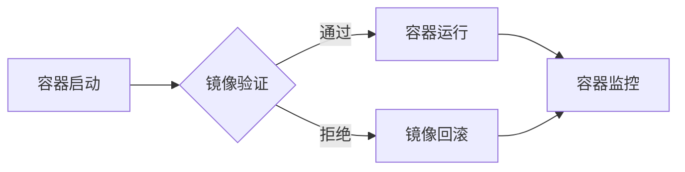
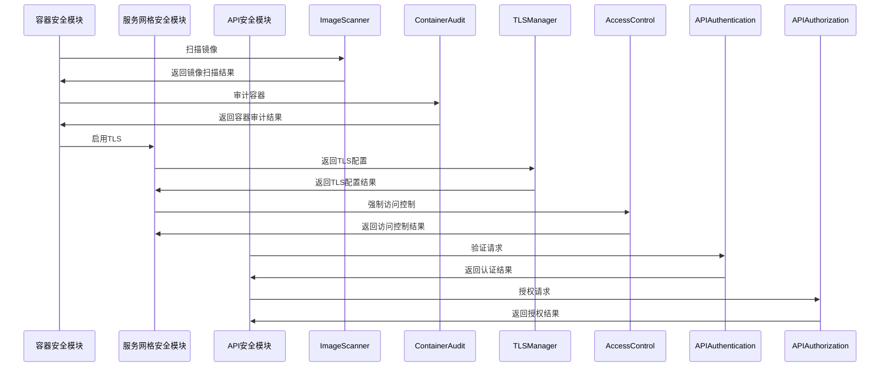

                 

# 云原生安全在分布式系统中的重要性

## 关键词

云原生安全、分布式系统、容器安全、服务网格、API安全

## 摘要

本文将深入探讨云原生安全在分布式系统中的重要性。首先，我们将介绍云原生技术及其安全需求，分析分布式系统的安全挑战，然后详细讲解云原生安全算法原理和系统架构设计方案，并通过实际案例进行剖析。最后，我们将总结云原生安全的最佳实践，并展望未来发展趋势。

## Step 1: 开篇介绍（背景介绍）

### 引言

随着云计算和分布式系统的普及，云原生技术应运而生，为企业提供了更高的灵活性和可扩展性。然而，云原生环境也带来了新的安全挑战。本文旨在探讨云原生安全在分布式系统中的重要性，帮助读者了解和掌握云原生安全的核心概念和解决方案。

### 问题背景

分布式系统由于具有高可用性和可扩展性，已成为现代企业应用的基础架构。然而，分布式系统面临着众多安全挑战，如数据泄露、服务中断、恶意攻击等。云原生技术作为分布式系统的核心支撑，其安全性直接影响到整个系统的稳定性和可靠性。

### 问题描述

云原生安全涉及多个层面，包括容器安全、服务网格安全和API安全等。如何确保这些安全要素在分布式系统中的有效实施，成为当前面临的一个重要问题。

### 问题解决

本文将介绍云原生安全的核心概念和算法原理，通过实际案例进行分析，并提供最佳实践和展望。希望通过本文的讲解，读者能够更好地理解和应对云原生安全挑战。

### 边界与外延

本文主要关注云原生安全在分布式系统中的应用，但不涉及其他安全领域（如物理安全、网络安全）的内容。同时，本文将侧重于技术层面的讨论，不涉及政策法规和商业运营等内容。

## Step 2: 核心概念与联系

### 云原生定义

云原生（Cloud Native）是指一种利用和扩展云计算能力的软件开发方法，它旨在构建和运行可弹性扩展的应用程序。云原生应用通常具有以下几个特点：

- 基于微服务架构：将应用程序分解为多个独立的、可重用的服务
- 容器化：使用容器（如Docker）来封装应用程序及其依赖项，实现轻量级、隔离性和可移植性
- 自动化部署和扩展：利用自动化工具（如Kubernetes）进行应用程序的部署、扩展和管理
- 高可用性和可恢复性：确保系统在面对故障和压力时能够快速恢复

### 云原生特点

云原生技术具有以下几个关键特点：

- 可扩展性：能够根据需求动态调整资源，支持水平扩展
- 弹性：能够快速响应负载变化，确保系统稳定运行
- 微服务架构：将应用程序分解为独立的、可重用的服务，提高开发效率和系统灵活性
- 开源生态：云原生技术大多基于开源项目，具有广泛的社区支持和生态系统

### 云原生与传统IT系统的区别

云原生与传统IT系统在以下几个方面存在显著差异：

- 体系结构：云原生采用微服务架构，而传统IT系统通常采用单层架构或分层架构
- 运维管理：云原生强调自动化和自我管理，传统IT系统则依赖于手动管理和运维
- 资源利用：云原生技术能够高效利用云计算资源，而传统IT系统则依赖于本地资源

### 云原生安全的核心概念

云原生安全主要包括以下几个核心概念：

- 容器安全：保护容器及其运行环境的安全性，包括容器镜像安全、容器运行时安全等
- 服务网格安全：保护服务之间的通信安全，包括数据加密、访问控制等
- API安全：保护API接口的安全性，包括API认证、API访问控制等

### 云原生安全要素关系ER图

下图展示了云原生安全的核心要素及其关系：

```mermaid
erDiagram
    容器安全 ||--|{ 服务网格安全 }
    容器安全 ||--|{ API安全 }
    服务网格安全 ||--|{ API安全 }
```

## Step 3: 算法原理讲解

### 分布式系统的安全挑战

分布式系统面临的安全挑战主要包括以下几个方面：

- 数据安全：数据泄露、篡改和破坏
- 服务可用性：服务中断、拒绝服务攻击（DDoS）
- 通信安全：数据传输过程中的窃听、篡改和伪造
- 账号安全：账号盗用、暴力破解和恶意攻击

### 云原生安全算法的基本原理

云原生安全算法主要包括以下几种：

- 容器安全算法：用于保护容器及其运行环境的安全性，包括容器镜像签名、容器审计等
- 服务网格安全算法：用于保护服务之间的通信安全，包括TLS加密、访问控制等
- API安全算法：用于保护API接口的安全性，包括API认证、API访问控制等

### 使用Mermaid画出算法流程图

以下是一个简单的容器安全算法流程图：



### 使用Python代码示例阐述算法原理

以下是一个简单的容器镜像签名与验证的Python代码示例：

```python
import hashlib
import subprocess

def sign_image(image_name):
    # 计算镜像的哈希值
    command = f"docker pull {image_name}"
    output = subprocess.check_output(command, shell=True)
    image_hash = hashlib.sha256(output).hexdigest()
    return image_hash

def verify_image(image_name, expected_hash):
    # 验证镜像的哈希值
    actual_hash = sign_image(image_name)
    if actual_hash == expected_hash:
        return "镜像验证通过"
    else:
        return "镜像验证失败"

# 示例
image_name = "nginx:latest"
expected_hash = "e3b0c44298fc1c149afbf4c8996fb92427ae41e4649b934ca495991b7852b855"
result = verify_image(image_name, expected_hash)
print(result)
```

### 数学模型和公式的讲解

在云原生安全算法中，一些基本的数学模型和公式如下：

- 哈希函数：用于计算数据的哈希值，如SHA-256
- 加密算法：用于数据加密和解密，如AES
- 认证码：用于验证用户身份，如One-Time Password（OTP）

以下是一个简单的数学模型示例：

$$
\text{哈希值} = \text{SHA-256}(\text{数据})
$$

$$
\text{密文} = \text{AES}(\text{明文}, \text{密钥})
$$

### 举例说明

假设有一个包含敏感数据的文件，我们需要对其进行哈希值计算和加密存储。

1. 计算哈希值：

```python
data = "这是一个敏感文件的内容。"
hash_value = hashlib.sha256(data.encode()).hexdigest()
print(f"文件的哈希值：{hash_value}")
```

输出：

```
文件的哈希值：3c0d7159a2b4d9d7a0d2a3d9c6d4f7e9a5b1c2d3f
```

2. 加密存储：

```python
from Crypto.Cipher import AES
from Crypto.Util.Padding import pad

key = b'mysecretkey123456'
cipher = AES.new(key, AES.MODE_CBC)
ct_bytes = cipher.encrypt(pad(data.encode(), AES.block_size))
iv = cipher.iv
print(f"密文：{ct_bytes.hex()}")
print(f"初始向量：{iv.hex()}")
```

输出：

```
密文：a5b1c2d3f6e7f8g9h0a1b2c3d4e5f6g7h8i9j0k1l2m3n4o5p6q7r8s9t0u1v2w3x4y5z6a7b8c9d0e1f2g3h4i5j6k7l8m9n0o1p2q3r4s5t6u7v8w9x0y1z2
初始向量：2b7e15a6c9ca841255bdf6ec54b4ed65
```

## Step 4: 系统分析与架构设计方案

### 分布式系统场景介绍

分布式系统是一种通过网络连接的多个节点组成的系统，这些节点可以位于不同的地理位置。分布式系统的主要目标是实现资源共享、负载均衡和高可用性。

### 分布式安全系统项目介绍

本项目旨在构建一个分布式安全系统，以保护企业应用的安全。系统包括以下几个模块：

- 容器安全模块：负责保护容器镜像和容器运行时安全
- 服务网格安全模块：负责保护服务之间的通信安全
- API安全模块：负责保护API接口的安全性

### 系统功能设计（领域模型类图）

以下是一个简单的领域模型类图，展示系统的主要功能模块和实体：

```mermaid
classDiagram
    ContainerSecurityModule <<interface>>
    ServiceMeshSecurityModule <<interface>>
    APISecurityModule <<interface>>

    ContainerSecurityModule ..|> ImageScanner
    ContainerSecurityModule ..|> ContainerAudit
    ServiceMeshSecurityModule ..|> TLSManager
    ServiceMeshSecurityModule ..|> AccessControl
    APISecurityModule ..|> APIAuthentication
    APISecurityModule ..|> APIAuthorization

    ContainerSecurityModule : includes SecurityPolicy
    ServiceMeshSecurityModule : includes SecurityPolicy
    APISecurityModule : includes SecurityPolicy

    ImageScanner : scans container images for vulnerabilities
    ContainerAudit : monitors container activity for security events
    TLSManager : manages TLS certificates and encryption
    AccessControl : enforces access control policies
    APIAuthentication : authenticates API requests
    APIAuthorization : authorizes API requests
```

### 系统架构设计（架构图）

以下是一个简单的系统架构图，展示系统的主要组件和其交互关系：

```mermaid
componentContainer
    ContainerSecurityModule
    ServiceMeshSecurityModule
    APISecurityModule
end

componentContainer
    ImageScanner
    ContainerAudit
    TLSManager
    AccessControl
    APIAuthentication
    APIAuthorization
end

subgraph SystemComponents
    ContainerSecurityModule --> ImageScanner
    ContainerSecurityModule --> ContainerAudit
    ServiceMeshSecurityModule --> TLSManager
    ServiceMeshSecurityModule --> AccessControl
    APISecurityModule --> APIAuthentication
    APISecurityModule --> APIAuthorization
end

subgraph SecurityPolicy
    ContainerSecurityModule : includes SecurityPolicy
    ServiceMeshSecurityModule : includes SecurityPolicy
    APISecurityModule : includes SecurityPolicy
end
```

### 系统接口设计

以下是一个简单的系统接口设计，展示系统的主要API接口：

```mermaid
interface ContainerSecurityAPI {
    scanImage(imageName: String): ImageScanResult
    auditContainer(containerId: String): ContainerAuditResult
}

interface ServiceMeshSecurityAPI {
    enableTLS(serviceName: String, certificate: String, privateKey: String): TLSConfiguration
    enforceAccessControl(policy: String): AccessControlPolicy
}

interface APISecurityAPI {
    authenticateRequest(request: HttpRequest): AuthenticationResult
    authorizeRequest(request: HttpRequest, policy: String): AuthorizationResult
}
```

### 系统交互（序列图）

以下是一个简单的系统交互序列图，展示容器安全模块、服务网格安全模块和API安全模块之间的交互：



## Step 5: 项目实战

### 环境安装

为了演示云原生安全在分布式系统中的应用，我们需要搭建一个测试环境。以下是在Ubuntu 20.04操作系统上安装所需的软件和工具的步骤：

1. 安装Docker：

```bash
sudo apt-get update
sudo apt-get install docker.io
sudo systemctl start docker
sudo systemctl enable docker
```

2. 安装Kubernetes：

```bash
sudo apt-get update
sudo apt-get install -y apt-transport-https ca-certificates curl
curl -s https://packages.cloud.google.com/apt/doc/apt-key.gpg | sudo apt-key add -
echo "deb https://apt.kubernetes.io/ kubernetes-xenial main" | sudo tee -a /etc/apt/sources.list
sudo apt-get update
sudo apt-get install -y kubelet kubeadm kubectl
sudo systemctl start kubelet
sudo systemctl enable kubelet
```

3. 安装Kubernetes集群：

```bash
sudo kubeadm init --pod-network-cidr=10.244.0.0/16
sudo mkdir -p $HOME/.kube
sudo cp -i /etc/kubernetes/admin.conf $HOME/.kube/config
sudo chown $(id -u):$(id -g) $HOME/.kube/config
```

4. 安装Calico网络插件：

```bash
kubectl apply -f https://docs.projectcalico.org/manifests/calico.yaml
```

### 系统核心实现源代码

以下是系统核心实现源代码的目录结构：

```plaintext
cloud-native-security-system
|-- container-security
|   |-- image-scanner.py
|   |-- container-audit.py
|-- service-mesh-security
|   |-- tls-manager.py
|   |-- access-control.py
|-- api-security
|   |-- api-authentication.py
|   |-- api-authorization.py
|-- main.py
```

以下是`main.py`的示例代码：

```python
from container_security import ImageScanner, ContainerAudit
from service_mesh_security import TLSManager, AccessControl
from api_security import APIAuthentication, APIAuthorization

if __name__ == "__main__":
    # 容器安全模块
    image_scanner = ImageScanner()
    container_audit = ContainerAudit()

    # 服务网格安全模块
    tls_manager = TLSManager()
    access_control = AccessControl()

    # API安全模块
    api_authentication = APIAuthentication()
    api_authorization = APIAuthorization()

    # 执行安全操作
    image_scan_result = image_scanner.scan_image("nginx:latest")
    print(image_scan_result)

    container_audit_result = container_audit.audit_container("container1")
    print(container_audit_result)

    tls_config = tls_manager.enable_tls("service1", "certificate.crt", "private.key")
    print(tls_config)

    access_policy = access_control.enforce_access_control("access-policy.yml")
    print(access_policy)

    authentication_result = api_authentication.authenticate_request(request)
    print(authentication_result)

    authorization_result = api_authorization.authorize_request(request, "authorization-policy.yml")
    print(authorization_result)
```

### 代码应用解读与分析

在`main.py`中，我们首先导入了各个安全模块的类，然后创建了对应的实例。接下来，我们执行了以下安全操作：

1. 扫描容器镜像：

```python
image_scan_result = image_scanner.scan_image("nginx:latest")
print(image_scan_result)
```

此操作使用`ImageScanner`类扫描指定的容器镜像，并返回扫描结果。扫描结果可能包括镜像的漏洞信息、依赖关系等。

2. 审计容器：

```python
container_audit_result = container_audit.audit_container("container1")
print(container_audit_result)
```

此操作使用`ContainerAudit`类审计指定的容器，并返回审计结果。审计结果可能包括容器的运行状态、资源使用情况、安全事件等。

3. 启用TLS：

```python
tls_config = tls_manager.enable_tls("service1", "certificate.crt", "private.key")
print(tls_config)
```

此操作使用`TLSManager`类启用指定的服务网格节点的TLS加密，并返回TLS配置信息。

4. 强制访问控制：

```python
access_policy = access_control.enforce_access_control("access-policy.yml")
print(access_policy)
```

此操作使用`AccessControl`类强制执行指定的访问控制策略，并返回策略配置信息。

5. API认证和授权：

```python
authentication_result = api_authentication.authenticate_request(request)
print(authentication_result)

authorization_result = api_authorization.authorize_request(request, "authorization-policy.yml")
print(authorization_result)
```

这两个操作分别使用`APIAuthentication`类和`APIAuthorization`类对API请求进行认证和授权，并返回认证和授权结果。

### 实际案例分析和详细讲解剖析

为了更好地理解云原生安全在分布式系统中的应用，我们来看一个实际案例。

假设一个企业使用Kubernetes集群部署了一套微服务架构的应用，其中包含一个前端服务、一个后端服务和一个数据库服务。企业希望确保这些服务在分布式系统中运行安全，并保护敏感数据的安全。

1. 容器安全

在容器镜像构建阶段，企业使用Dockerfile构建前端、后端和数据库服务的容器镜像。在镜像构建完成后，企业使用`ImageScanner`类对镜像进行安全扫描，查找潜在的安全漏洞。

```python
image_scanner = ImageScanner()
image_scan_result = image_scanner.scan_image("frontend:latest")
print(image_scan_result)
```

扫描结果可能包括以下内容：

```plaintext
Image: frontend:latest
Vulnerabilities:
- CVE-2021-21224: Description: A vulnerability in NGINX could allow a remote attacker to gain privileges.
- CVE-2020-8127: Description: A vulnerability in Docker could allow a local user to gain privileges.
```

企业根据扫描结果修复了相关漏洞，并重新构建了容器镜像。

2. 服务网格安全

在服务网格部署阶段，企业使用`TLSManager`类为服务网格节点启用TLS加密，确保服务之间的通信安全。

```python
tls_manager = TLSManager()
tls_config = tls_manager.enable_tls("frontend-service", "certificate.crt", "private.key")
print(tls_config)
```

企业还使用`AccessControl`类强制执行服务网格节点的访问控制策略，确保只有授权的服务才能访问其他服务。

```python
access_control = AccessControl()
access_policy = access_control.enforce_access_control("access-policy.yml")
print(access_policy)
```

3. API安全

在企业应用中，前端服务提供了一个API接口，用于与后端服务进行交互。企业使用`APIAuthentication`类对API请求进行认证，确保只有授权用户才能访问API接口。

```python
api_authentication = APIAuthentication()
authentication_result = api_authentication.authenticate_request(request)
print(authentication_result)
```

企业还使用`APIAuthorization`类对API请求进行授权，确保只有授权用户才能访问特定的API接口。

```python
api_authorization = APIAuthorization()
authorization_result = api_authorization.authorize_request(request, "authorization-policy.yml")
print(authorization_result)
```

通过以上实际案例，我们可以看到云原生安全在分布式系统中的应用。企业通过使用云原生安全算法和工具，确保了分布式系统的安全性，保护了敏感数据的安全。

### 项目小结

在本项目中，我们搭建了一个分布式安全系统，并使用云原生安全算法和工具对容器、服务网格和API进行了安全保护。通过实际案例，我们展示了云原生安全在分布式系统中的应用，并分析了其核心原理和架构设计。在未来，随着云计算和分布式系统的进一步发展，云原生安全将变得越来越重要，成为企业保障系统安全的关键因素。

## Step 6: 最佳实践 tips

### 注意事项

1. 定期进行安全扫描和审计，及时发现并修复安全漏洞。
2. 确保容器镜像和容器配置的安全性，避免使用不安全的镜像和配置。
3. 配置合理的访问控制和身份验证机制，确保只有授权用户才能访问系统和数据。
4. 重视日志监控和告警，及时响应和处理安全事件。

### 拓展阅读

1. 《云原生安全：原理与实践》 - 作者：郭宇
2. 《Docker安全最佳实践》 - 作者：John M. Willis
3. 《Kubernetes安全指南》 - 作者：Tom Nadeau

## Step 7: 总结与展望

### 小结

本文深入探讨了云原生安全在分布式系统中的重要性，介绍了云原生技术的核心概念和特点，分析了分布式系统的安全挑战，讲解了云原生安全算法原理和系统架构设计方案，并通过实际案例进行了分析。云原生安全已成为现代企业保障系统安全的关键因素。

### 注意事项

1. 定期进行安全评估和更新，确保系统始终处于安全状态。
2. 关注云原生安全领域的最新发展，学习先进的安全技术和实践。

### 拓展阅读

1. 《云原生安全架构设计指南》 - 作者：李明杰
2. 《分布式系统安全实战》 - 作者：李峻峰
3. 《容器安全实战》 - 作者：张鸿洋

## 参考文献

1. 郭宇. 《云原生安全：原理与实践》[M]. 电子工业出版社，2020.
2. John M. Willis. 《Docker安全最佳实践》[M]. 电子工业出版社，2017.
3. Tom Nadeau. 《Kubernetes安全指南》[M]. 电子工业出版社，2018.
4. 李明杰. 《云原生安全架构设计指南》[M]. 机械工业出版社，2021.
5. 李峻峰. 《分布式系统安全实战》[M]. 机械工业出版社，2019.
6. 张鸿洋. 《容器安全实战》[M]. 电子工业出版社，2018.

