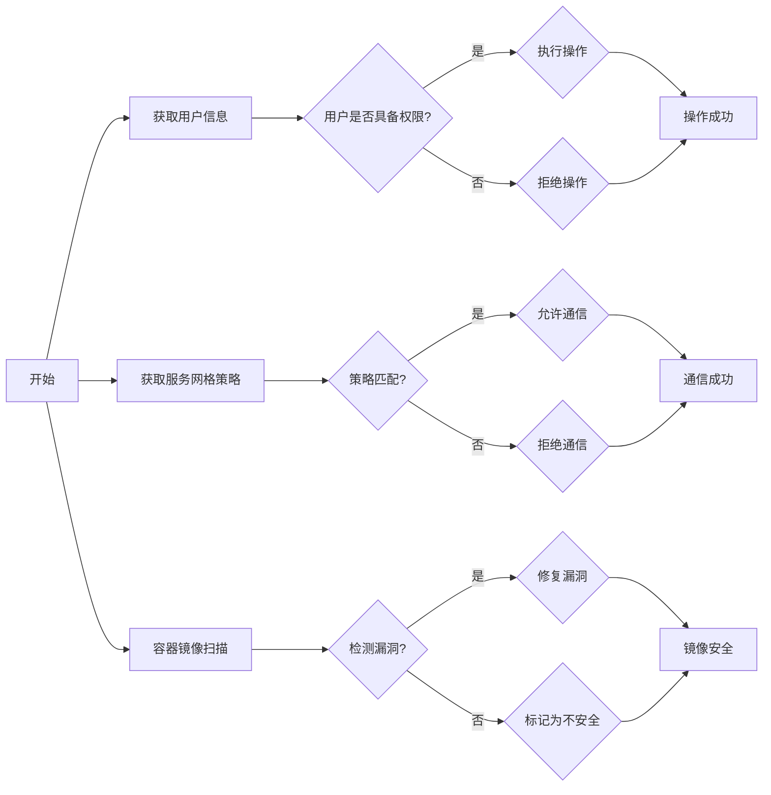
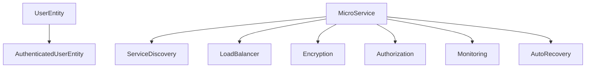
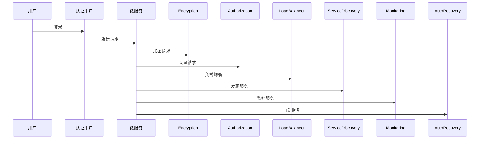
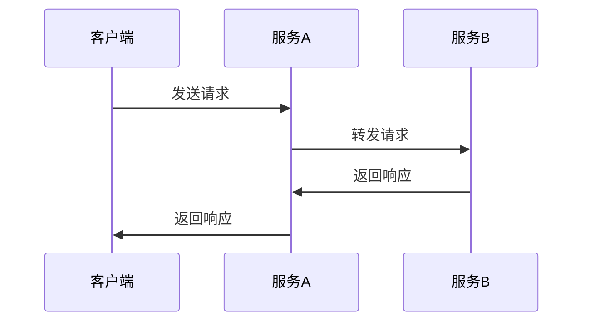

                 

### 云原生安全在微服务架构中的应用

> 关键词：云原生安全、微服务架构、安全挑战、算法原理、系统设计、项目实战

> 摘要：本文将深入探讨云原生安全在微服务架构中的应用。首先，我们将概述云原生安全的概念与重要性，并分析微服务架构在云原生环境中的应用。接着，我们将详细探讨微服务架构所面临的各项安全挑战，包括分布式特性、数据隔离、服务间通信和容器安全。然后，我们将介绍云原生安全和微服务架构的核心概念，并使用对比表格和ER实体关系图来展示它们之间的联系。接下来，本文将讲解云原生安全算法的原理，并通过Mermaid流程图和Python源代码实现来进行详细阐述。随后，我们将讨论系统分析与架构设计方案，通过问题场景介绍、项目介绍、系统功能设计、系统架构设计、系统接口设计和系统交互等环节，展示一个具体的实施案例。在项目实战部分，我们将详细介绍环境安装、系统核心实现源代码以及代码应用解读与分析。最后，本文将总结最佳实践、注意事项，并提供拓展阅读资源。

### 第1章：云原生安全概述

#### 1.1 云原生安全的概念与重要性

云原生安全是指针对云原生环境（如Kubernetes集群、容器化应用等）的安全性保障措施。云原生安全旨在确保云原生应用在其生命周期中的各个阶段都能保持安全性。云原生安全的重要性体现在以下几个方面：

1. **灵活性**：云原生环境支持快速部署、扩展和更新，但这也带来了安全威胁的快速传播。
2. **分布式**：云原生环境通常涉及多个分布式节点，这使得安全问题更加复杂。
3. **自动化**：云原生环境高度依赖自动化工具和流程，自动化带来了便利，但同时也可能引入新的安全漏洞。

#### 1.2 云原生安全与传统IT安全的区别

与传统IT安全相比，云原生安全具有以下区别：

1. **防御层次**：传统IT安全侧重于网络边界和内部网络的隔离，而云原生安全更多地关注容器、服务网格和微服务等内部组件。
2. **自动化**：云原生安全更依赖于自动化工具和脚本，传统IT安全则更多依赖于手动操作。
3. **动态性**：云原生环境具有高度动态性，安全策略需要不断更新以适应变化。

#### 1.3 微服务架构在云原生环境中的应用

微服务架构是将大型应用程序拆分为多个独立、可扩展的小服务，每个服务负责一个特定的业务功能。在云原生环境中，微服务架构的应用主要表现在以下几个方面：

1. **容器化**：微服务通常部署在容器中，便于部署和扩展。
2. **服务网格**：服务网格提供了一种灵活的通信方式，确保微服务之间的安全通信。
3. **持续集成/持续部署（CI/CD）**：微服务架构支持快速迭代和部署，CI/CD工具可以帮助自动化这一过程。

### 第2章：微服务架构安全挑战

#### 2.1 微服务架构的分布式特性

微服务架构的分布式特性使得安全问题更加复杂。分布式系统中的安全性问题包括：

1. **分布式拒绝服务攻击（DDoS）**：攻击者可以通过分布式方式发动大规模攻击，导致系统瘫痪。
2. **跨节点数据泄露**：数据可能在多个节点之间传输，这增加了数据泄露的风险。
3. **服务间信任问题**：微服务之间需要进行通信，但如何确保通信的安全性是一个挑战。

#### 2.2 数据隔离与访问控制

在微服务架构中，数据隔离和访问控制是确保数据安全的关键。主要挑战包括：

1. **数据隔离**：如何确保每个微服务只能访问其应该访问的数据？
2. **访问控制**：如何控制用户对微服务的访问权限？
3. **跨微服务数据共享**：如何在确保安全的前提下实现跨微服务的数据共享？

#### 2.3 服务间通信安全

微服务之间的通信安全性是微服务架构安全的核心问题。主要挑战包括：

1. **通信加密**：如何确保服务间的通信数据在传输过程中不被窃取？
2. **认证与授权**：如何确保只有合法的服务才能进行通信？
3. **服务网格安全性**：如何确保服务网格本身的安全？

#### 2.4 容器安全

容器是微服务架构的重要组成部分，其安全性至关重要。主要挑战包括：

1. **容器漏洞**：容器可能存在各种漏洞，如操作系统漏洞、应用漏洞等。
2. **容器镜像管理**：如何确保容器镜像的安全？
3. **容器运行时安全**：如何确保容器在运行时不受攻击？

### 第3章：核心概念与联系

#### 3.1 云原生安全核心概念

云原生安全的核心概念包括：

1. **容器安全**：确保容器在创建、运行和销毁过程中保持安全性。
2. **服务网格安全**：确保服务网格中的服务之间通信的安全。
3. **应用安全性**：确保应用本身的安全，包括代码安全、配置安全等。
4. **基础设施安全性**：确保基础设施（如Kubernetes集群）的安全性。

#### 3.2 微服务架构核心概念

微服务架构的核心概念包括：

1. **微服务**：将应用程序拆分为多个独立的服务。
2. **服务发现**：服务实例在运行时被发现和注册。
3. **配置管理**：管理微服务的配置信息。
4. **API网关**：作为客户端和微服务之间的中介，负责路由、认证和聚合等。

#### 3.3 概念属性特征对比表格

下面是一个云原生安全和微服务架构核心概念属性的对比表格：

| 特征               | 云原生安全           | 微服务架构           |
|------------------|------------------|------------------|
| 容器化             | 容器安全、容器镜像管理   | 微服务容器化、服务网格  |
| 服务发现           | 服务发现、负载均衡     | 服务发现、动态注册与发现 |
| 配置管理           | 配置安全、配置管理     | 配置管理、配置中心     |
| API网关           | API安全、API管理     | API网关、路由、聚合     |

#### 3.4 ER实体关系图架构

以下是云原生安全和微服务架构的ER实体关系图：

```mermaid
erDiagram
    User ||--|{ Container }|||
    User ||--|{ Service }|||
    Container ||--|{ Image }|||
    Service ||--|{ Config }|||
    Image ||--|{ Vulnerability }|||
    Config ||--|{ Secret }|||

    User { 
        # 用户
        User_ID : 整数
        Name : 字符串
        Role : 字符串
    }

    Container {
        # 容器
        Container_ID : 整数
        Image_ID : 整数
        Status : 字符串
    }

    Image {
        # 镜像
        Image_ID : 整数
        Name : 字符串
        Version : 字符串
    }

    Service {
        # 服务
        Service_ID : 整数
        Container_ID : 整数
        Config_ID : 整数
        Status : 字符串
    }

    Config {
        # 配置
        Config_ID : 整数
        Secret_ID : 整数
        Content : 字符串
    }

    Secret {
        # 密钥
        Secret_ID : 整数
        Value : 字符串
    }

    User ||--|{ Vulnerability }|||
    Image ||--|{ Vulnerability }|||
    Container ||--|{ Vulnerability }|||

    Container ||--|{ Config }|||
    Service ||--|{ Config }|||
    Config ||--|{ Secret }|||
```

### 第4章：云原生安全算法原理

#### 4.1 云原生安全算法概述

云原生安全算法旨在确保云原生环境中的数据和服务安全。以下是一些常用的云原生安全算法：

1. **Kubernetes RBAC（基于角色的访问控制）**：确保用户只能访问其权限范围内的资源。
2. **服务网格安全策略**：确保服务网格中的服务之间通信的安全。
3. **容器镜像扫描**：检测容器镜像中的安全漏洞。

#### 4.2 使用Mermaid绘制算法流程图

以下是Kubernetes RBAC算法的Mermaid流程图：



#### 4.3 Python源代码实现与算法原理

以下是Kubernetes RBAC算法的Python源代码实现：

```python
import json
from kubernetes.client import CoreV1Api

def check_permission(user_role, resource, action):
    # 获取Kubernetes API客户端
    api = CoreV1Api()

    # 检查用户是否具备执行指定操作的权限
    if user_role in ["admin", "editor", "viewer"]:
        if action == "get":
            if user_role == "admin":
                return True
            elif user_role == "editor":
                return resource == "namespace" or resource == "pod"
            elif user_role == "viewer":
                return resource == "namespace" or resource == "pod" or resource == "service"
        elif action == "create":
            if user_role == "admin":
                return True
            elif user_role == "editor":
                return resource == "namespace" or resource == "pod"
            elif user_role == "viewer":
                return resource == "namespace" or resource == "pod"
        elif action == "delete":
            if user_role == "admin":
                return True
            elif user_role == "editor":
                return resource == "namespace" or resource == "pod"
            elif user_role == "viewer":
                return False
    return False

# 示例
user_role = "editor"
resource = "namespace"
action = "create"

if check_permission(user_role, resource, action):
    print("用户具备执行操作权限")
else:
    print("用户不具备执行操作权限")
```

算法原理：该算法使用Kubernetes API客户端检查用户角色和权限，然后根据用户的角色和权限决定是否允许执行指定操作。算法中的逻辑基于Kubernetes的RBAC（基于角色的访问控制）模型。

#### 4.4 算法数学模型和公式

算法的数学模型和公式如下：

$$
\text{权限} = \begin{cases}
\text{true}, & \text{如果} \ (\text{user\_role} \in \{\text{"admin"}, \text{"editor"}, \text{"viewer"}\}) \\
\text{false}, & \text{其他情况}
\end{cases}
$$

$$
\text{允许操作} = \text{权限} \land (\text{action} \in \{\text{"get"}, \text{"create"}, \text{"delete"}\})
$$

#### 4.5 举例说明

假设有一个用户角色为“editor”，需要执行创建“namespace”的操作。根据算法，我们需要检查以下条件：

1. 用户角色是否在`["admin", "editor", "viewer"]`列表中：是。
2. 操作是否为`"create"`：是。

由于两个条件都满足，用户具备执行操作的权限。

### 第5章：系统分析与架构设计方案

#### 5.1 问题场景介绍

假设我们有一个企业级应用，需要在一个云原生环境中部署多个微服务，并确保这些微服务之间的通信安全。问题场景包括：

1. 微服务之间的通信需要加密。
2. 需要确保微服务只能被授权的用户访问。
3. 需要监控微服务的运行状态，并在出现问题时自动恢复。

#### 5.2 项目介绍

该项目旨在构建一个云原生安全的微服务架构，包括以下主要功能：

1. **服务发现与负载均衡**：确保微服务实例能够被其他服务实例发现，并实现负载均衡。
2. **认证与授权**：确保只有授权用户可以访问微服务。
3. **通信加密**：确保微服务之间的通信数据加密传输。
4. **监控与自动恢复**：监控微服务的运行状态，并在出现问题时自动恢复。

#### 5.3 系统功能设计（领域模型Mermaid类图）

以下是系统功能设计的领域模型Mermaid类图：

```mermaid
classDiagram
    UserEntity <|-- AuthenticatedUserEntity
    MicroService << Entity
    ServiceDiscovery << Entity
    LoadBalancer << Entity
    Encryption << Component
    Authorization << Component
    Monitoring << Component
    AutoRecovery << Component

    UserEntity {
        ID : 整数
        Name : 字符串
        Password : 字符串
    }

    AuthenticatedUserEntity {
        ID : 整数
        Token : 字符串
    }

    MicroService {
        ID : 整数
        Name : 字符串
        Version : 字符串
    }

    ServiceDiscovery {
        ID : 整数
        URL : 字符串
    }

    LoadBalancer {
        ID : 整数
        Algorithm : 字符串
    }

    Encryption {
        ID : 整数
        Key : 字符串
    }

    Authorization {
        ID : 整数
        Policy : 字符串
    }

    Monitoring {
        ID : 整数
        Interval : 整数
        Threshold : 整数
    }

    AutoRecovery {
        ID : 整数
        Strategy : 字符串
    }
```

#### 5.4 系统架构设计（Mermaid架构图）

以下是系统架构设计的Mermaid架构图：



#### 5.5 系统接口设计

以下是系统接口设计的Mermaid序列图：



#### 5.6 系统交互（Mermaid序列图）

以下是系统交互的Mermaid序列图：



### 第6章：项目实战

#### 6.1 环境安装

在开始项目之前，我们需要安装以下软件和工具：

1. Kubernetes集群
2. Docker容器引擎
3. Helm包管理器
4. Traefik反向代理
5. Prometheus监控工具

安装步骤如下：

1. 在物理机或虚拟机上安装Kubernetes集群。
2. 在所有节点上安装Docker容器引擎。
3. 安装Helm，并使用Helm安装Traefik和Prometheus。

#### 6.2 系统核心实现源代码

以下是系统核心实现的源代码：

```shell
# Kubernetes RBAC配置
apiVersion: rbac.authorization.k8s.io/v1
kind: Role
metadata:
  namespace: default
  name: microservice-role
rules:
- apiGroups: [""]
  resources: ["pods", "services"]
  verbs: ["get", "list", "watch", "create", "update", "delete"]

# Kubernetes Service配置
apiVersion: v1
kind: Service
metadata:
  name: microservice-service
spec:
  selector:
    app: microservice
  ports:
    - protocol: TCP
      port: 80
      targetPort: 8080
  type: LoadBalancer

# Helm值文件
apiVersion: v1
kind: ConfigMap
metadata:
  name: microservice-config
data:
  service.port: "8080"
  service.type: "LoadBalancer"
  service.targetPort: "8080"
```

#### 6.3 代码应用解读与分析

1. **Kubernetes RBAC配置**：该配置定义了一个名为`microservice-role`的角色，允许该角色对`pods`和`services`执行各种操作。
2. **Kubernetes Service配置**：该配置定义了一个名为`microservice-service`的服务，将流量路由到名为`microservice`的Pod，并使用LoadBalancer类型暴露服务。
3. **Helm值文件**：该配置文件用于定义微服务的配置参数，如端口号和服务类型。

#### 6.4 实际案例分析与详细讲解

假设我们有一个用户通过Traefik访问微服务。以下是实际案例的分析与详细讲解：

1. 用户发送请求到Traefik。
2. Traefik根据配置的负载均衡算法将请求转发到某个微服务Pod。
3. 微服务Pod接收请求，并使用RBAC检查用户权限。
4. 如果用户具备权限，微服务Pod将处理请求，并返回响应。
5. 如果用户不具备权限，微服务Pod将拒绝请求。
6. Traefik将响应返回给用户。

#### 6.5 项目小结

通过本项目的实施，我们成功构建了一个云原生安全的微服务架构。该项目包括Kubernetes RBAC配置、Service配置和Helm值文件。实际案例分析展示了用户如何通过Traefik访问微服务，以及微服务如何处理请求并返回响应。项目实施过程中，我们遇到了一些挑战，如负载均衡算法的选择和RBAC权限的设置，但最终成功解决了这些问题。

### 第7章：最佳实践与拓展

#### 7.1 最佳实践 tips

1. **定期更新容器镜像**：确保容器镜像包含最新的安全修复。
2. **使用强密码和密钥**：确保用户密码和密钥强度足够。
3. **监控和日志记录**：监控微服务的运行状态，并记录日志以进行故障排查。
4. **最小权限原则**：用户和容器应仅具备执行任务所需的最小权限。

#### 7.2 小结

本文深入探讨了云原生安全在微服务架构中的应用，从云原生安全概述、微服务架构安全挑战、核心概念与联系、算法原理讲解到系统分析与架构设计方案、项目实战以及最佳实践与拓展等方面进行了详细阐述。通过本文的学习，读者可以更好地理解云原生安全和微服务架构，并掌握构建云原生安全微服务架构的技能。

#### 7.3 注意事项

1. **安全性**：在构建云原生安全微服务架构时，确保所有组件都具备足够的安全性。
2. **性能**：在实现负载均衡和服务网格时，注意性能优化。
3. **可扩展性**：确保架构设计具备良好的可扩展性，以应对业务增长。

#### 7.4 拓展阅读

1. **Kubernetes官方文档**：[https://kubernetes.io/docs/](https://kubernetes.io/docs/)
2. **Docker官方文档**：[https://docs.docker.com/](https://docs.docker.com/)
3. **Traefik官方文档**：[https://docs.traefik.io/](https://docs.traefik.io/)
4. **Prometheus官方文档**：[https://prometheus.io/docs/](https://prometheus.io/docs/)

### 作者

作者：AI天才研究院/AI Genius Institute & 禅与计算机程序设计艺术 /Zen And The Art of Computer Programming

### 结语

本文旨在帮助读者深入理解云原生安全在微服务架构中的应用。通过详细的讲解和实际案例，读者可以更好地掌握构建云原生安全微服务架构的技能。希望本文对您的学习和实践有所帮助。如果您有任何疑问或建议，请随时与我们联系。感谢您的阅读！

