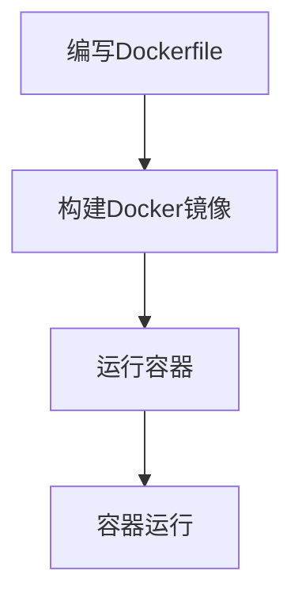
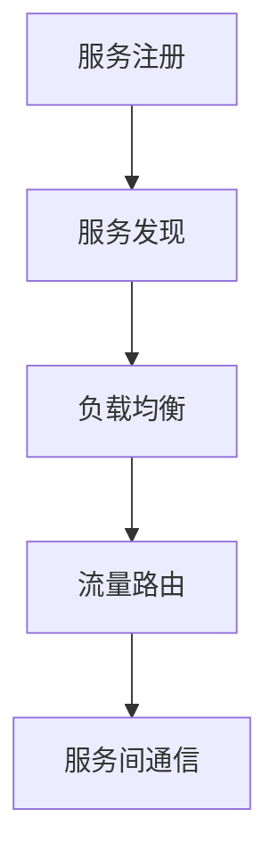
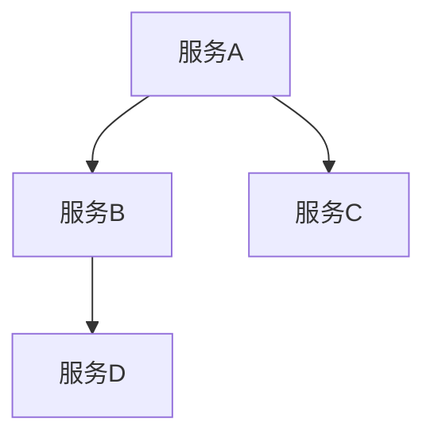
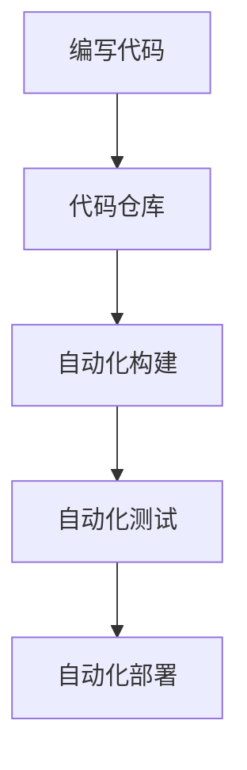
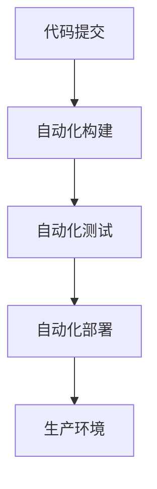
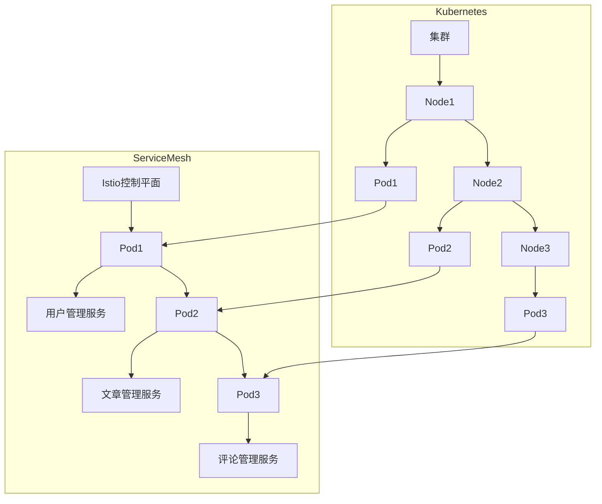
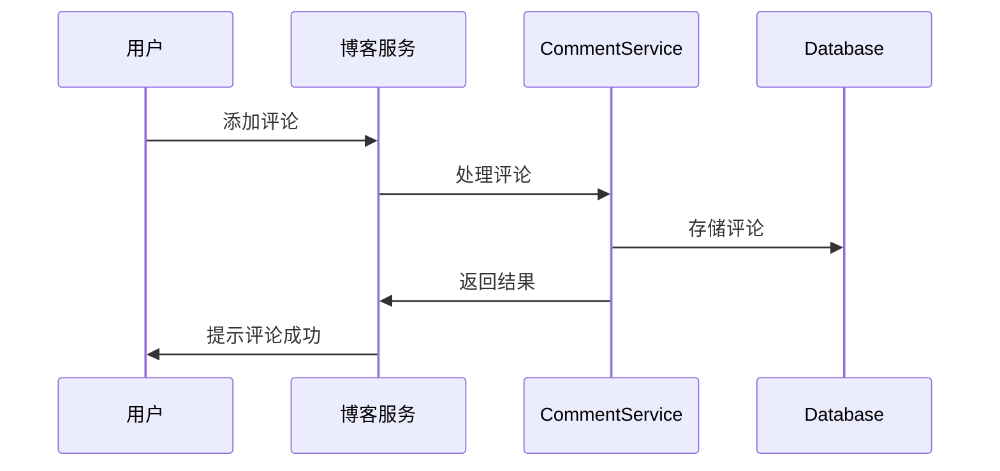

                 

### 引言

在当今的IT行业，技术革新正在以前所未有的速度推进。从传统的单体应用发展到现代的分布式微服务架构，再到如今的云原生技术，这些变革不仅改变了我们开发、部署和管理应用的方式，也重新定义了企业竞争的新格局。云原生技术以其敏捷性、灵活性和可扩展性，正在重塑整个应用开发和部署的生态系统。

那么，云原生技术究竟是什么？它包括哪些关键技术？我们如何利用云原生技术进行应用开发和部署？本文将带您一步步深入探索云原生技术的本质与价值。

本文将分为以下几个部分：

1. **背景介绍**：详细讲解云原生技术的核心概念、问题背景、解决方法以及相关的边界和外延。
2. **核心概念与联系**：介绍容器化、服务网格、微服务架构、自动化部署和CI/CD等核心概念，并使用表格和ER图进行对比分析。
3. **原理与实现**：深入解析容器化、服务网格、微服务架构、自动化部署和CI/CD的原理，并通过Mermaid流程图展示实现流程。
4. **项目实战**：通过一个实际项目，展示云原生技术的应用场景、系统设计和核心代码实现。
5. **最佳实践**：总结云原生技术的最佳实践，并提出注意事项和拓展阅读。

通过本文的阅读，您将全面了解云原生技术的概念、原理和实践，掌握如何在实际项目中应用云原生技术，以实现高效、灵活和可扩展的应用开发和部署。

---

### 背景介绍

云原生技术并非一夜之间兴起，而是随着云计算、容器化和微服务技术的发展逐渐演变而来。为了更好地理解云原生技术的背景，我们需要首先了解这些关键技术的发展历程以及它们在应用开发和部署中的挑战。

#### 核心概念

**云计算**：云计算是一种通过互联网提供计算资源的方式，包括基础设施即服务（IaaS）、平台即服务（PaaS）和软件即服务（SaaS）。云计算使得计算资源可以弹性伸缩，按需分配，从而降低了企业的IT成本，提高了资源利用率。

**容器化**：容器化是一种轻量级的虚拟化技术，通过将应用程序及其依赖环境封装在一个容器中，实现了应用程序在不同环境之间的一致性运行。Docker是容器化技术的一个代表。

**微服务架构**：微服务架构是一种将应用程序拆分成多个小型、独立的服务单元的方式，每个服务单元负责一个特定的业务功能。这种架构方式提高了系统的可扩展性、可维护性和灵活性。

#### 问题背景

随着互联网的快速发展，企业的业务需求日益复杂，传统的单体应用已经无法满足这些需求。传统的应用开发和部署方式存在以下问题：

1. **可扩展性差**：单体应用在处理大量请求时，性能下降明显，难以进行水平扩展。
2. **部署复杂**：传统的部署方式需要安装和配置大量的软件，部署流程复杂，且容易出错。
3. **环境不一致**：不同环境（如开发、测试、生产）之间存在差异，导致应用程序在不同环境之间的表现不一致。
4. **维护困难**：单体应用由于功能复杂，维护和更新困难，一旦出现问题，修复成本高。

这些问题催生了云原生技术的出现，以解决传统应用开发和部署中的痛点。

#### 问题描述

云原生技术是什么？它包括哪些关键技术？如何利用云原生技术进行应用开发和部署？这些问题是当前IT领域面临的挑战。具体来说：

1. **容器化**：容器化如何实现应用程序的一致性运行？
2. **服务网格**：服务网格如何管理和优化服务间的通信？
3. **微服务架构**：微服务架构如何实现模块化和服务化？
4. **自动化部署和CI/CD**：如何通过自动化工具实现快速、可靠的应用部署和更新？

这些问题涉及到云原生技术的核心概念和实现原理，需要我们逐一深入探讨。

#### 问题解决

云原生技术通过容器化、服务网格、微服务架构、自动化部署和CI/CD等关键技术，实现了应用开发和部署的敏捷性、灵活性和可扩展性。具体解决方法如下：

1. **容器化**：通过容器化技术，将应用程序及其依赖环境封装在一个独立的容器中，实现了应用程序在不同环境之间的一致性运行。Docker和Kubernetes是容器化技术的代表。
2. **服务网格**：通过服务网格技术，在网络层面上管理服务之间的通信，提供了动态服务发现、负载均衡、服务间认证和安全等功能。Istio和Linkerd是服务网格技术的代表。
3. **微服务架构**：通过微服务架构，将应用程序拆分成多个小型、独立的服务单元，每个服务单元负责一个特定的业务功能。Spring Cloud和Netflix OSS是微服务架构的代表。
4. **自动化部署和CI/CD**：通过自动化部署和CI/CD，实现应用部署的自动化，提高了部署效率和软件质量。Jenkins和GitLab CI/CD是自动化部署和CI/CD工具的代表。

通过这些关键技术，云原生技术实现了传统应用开发和部署方式的革新，为现代企业提供了更加高效、灵活和可扩展的应用开发和管理模式。

#### 边界与外延

云原生技术不仅适用于Web应用，还广泛应用于移动应用、物联网、大数据等领域。在移动应用开发中，云原生技术通过容器化技术实现了应用的一致性运行，提高了应用的性能和可靠性。在物联网领域，云原生技术通过微服务架构实现了设备的灵活部署和管理，提高了系统的可扩展性和可维护性。在大数据领域，云原生技术通过自动化部署和CI/CD，实现了大数据应用的快速迭代和高效管理。

#### 概念结构与核心要素组成

云原生技术包括以下核心要素：

1. **容器化**：通过容器化技术，实现应用程序的一致性运行。
2. **服务网格**：通过服务网格技术，实现服务间的通信和流量管理。
3. **微服务架构**：通过微服务架构，实现应用程序的模块化和服务化。
4. **自动化部署和CI/CD**：通过自动化部署和CI/CD，实现应用部署的自动化和持续集成。
5. **DevOps**：通过DevOps文化，实现开发、运维一体化，提高应用交付效率。

这些核心要素相互关联，共同构成了云原生技术的概念结构和实现框架。

### 第二部分：云原生技术核心概念与联系

在深入探讨云原生技术之前，我们需要先了解其核心概念，这些概念相互关联，共同构成了云原生技术的基石。本部分将介绍容器化、服务网格、微服务架构、自动化部署和CI/CD等核心概念，并通过表格和ER图进行对比分析。

#### 核心概念

**容器化**：容器化是一种将应用程序及其依赖环境封装在一个轻量级容器中的技术。容器提供了与主机操作系统隔离的运行环境，使应用程序可以在不同的环境中一致性地运行。Docker是容器化技术的一个代表。

**服务网格**：服务网格是一种基础设施层的服务，用于处理服务之间的通信和流量管理。服务网格提供了动态服务发现、负载均衡、服务间认证和安全等功能。Istio和Linkerd是服务网格技术的代表。

**微服务架构**：微服务架构是一种将应用程序拆分成多个小型、独立的服务单元的方式，每个服务单元负责一个特定的业务功能。微服务架构提高了系统的可扩展性、可维护性和灵活性。Spring Cloud和Netflix OSS是微服务架构的代表。

**自动化部署和CI/CD**：自动化部署和CI/CD是一种通过自动化工具实现应用部署和更新的方法。CI/CD（持续集成/持续部署）通过持续集成和持续部署，实现了代码的自动化测试和部署，提高了开发效率和软件质量。Jenkins和GitLab CI/CD是自动化部署和CI/CD工具的代表。

**DevOps**：DevOps是一种文化和实践，强调开发（Development）和运维（Operations）之间的紧密协作，通过自动化工具和流程实现开发、测试、部署和监控的全程自动化。

#### 概念属性特征对比表格

| 特性 | 容器化 | 服务网格 | 微服务架构 | 自动化部署 | CI/CD | DevOps |
| --- | --- | --- | --- | --- | --- | --- |
| 轻量级 | 是 | 是 | 是 | 是 | 是 | 是 |
| 可移植性 | 是 | 是 | 是 | 是 | 是 | 是 |
| 自给自足 | 是 | 否 | 是 | 是 | 是 | 是 |
| 服务间通信 | 否 | 是 | 是 | 是 | 是 | 是 |
| 流量管理 | 否 | 是 | 是 | 是 | 是 | 是 |
| 模块化 | 是 | 是 | 是 | 是 | 是 | 是 |
| 服务化 | 否 | 否 | 是 | 是 | 是 | 是 |
| 自动化 | 是 | 是 | 是 | 是 | 是 | 是 |

#### ER实体关系图架构

```mermaid
erDiagram
  Client ||--|{ Application }|--| User
  Application ||--|{ Service }|--| API
  Service ||--|{ Container }|--| Docker
  Container ||--|{ ServiceMesh }|--| Istio
  ServiceMesh ||--|{ Microservice }|--| SpringCloud
  Microservice ||--|{ CI/CD }|--| Jenkins
```

在上述ER图中，客户端通过应用程序与用户进行交互，应用程序通过服务实现具体功能，服务通过容器（如Docker）进行部署和运行。容器通过服务网格（如Istio）进行通信和流量管理，服务网格管理微服务（如SpringCloud），微服务通过CI/CD工具（如Jenkins）实现自动化部署和测试。

### 第三部分：云原生技术原理与实现

在了解了云原生技术的核心概念之后，接下来我们将深入探讨这些技术的原理和实现方法。本部分将详细讲解容器化、服务网格、微服务架构、自动化部署和CI/CD的原理，并通过Mermaid流程图展示其实现流程。

#### 容器化原理

容器化是一种通过轻量级虚拟化技术，将应用程序及其依赖环境封装在一个独立的容器中的技术。容器提供了与主机操作系统隔离的运行环境，使得应用程序可以在不同的环境中一致性地运行。

**实现方法**：
1. **Dockerfile**：Dockerfile是一个包含一系列命令的文本文件，用于定义容器的构建过程。通过编写Dockerfile，可以将应用程序及其依赖环境打包成一个可执行的容器镜像。
2. **Docker镜像**：Docker镜像是一个只读的容器模板，包含了应用程序和所有依赖环境的静态文件。通过Docker镜像，可以在不同的环境中快速启动容器。

**Mermaid流程图**：



#### 服务网格原理

服务网格是一种基础设施层的服务，用于处理服务之间的通信和流量管理。服务网格提供了动态服务发现、负载均衡、服务间认证和安全等功能。

**实现方法**：
1. **Istio**：Istio是一个开源的服务网格平台，提供了全面的服务网格功能。通过Istio，可以轻松实现服务间的通信和流量管理。
2. **服务发现**：服务发现是一种机制，用于动态查找和注册服务。在服务网格中，服务发现可以帮助容器化应用自动发现和连接到其他服务。
3. **负载均衡**：负载均衡是一种机制，用于分配网络流量到多个服务实例。在服务网格中，负载均衡可以优化服务间的通信性能。

**Mermaid流程图**：



#### 微服务架构原理

微服务架构是一种将应用程序拆分成多个小型、独立的服务单元的方式，每个服务单元负责一个特定的业务功能。微服务架构提高了系统的可扩展性、可维护性和灵活性。

**实现方法**：
1. **Spring Cloud**：Spring Cloud是一套开源微服务框架，提供了全面的支持，包括服务注册与发现、负载均衡、断路器等。
2. **服务拆分**：通过将应用程序拆分成多个小型服务，可以简化系统的维护和扩展。每个服务可以独立开发、测试和部署，提高了开发效率和系统稳定性。
3. **服务间通信**：服务间通信是微服务架构的核心，通过定义API接口，实现服务间的数据交换和协作。

**Mermaid流程图**：



#### 自动化部署原理

自动化部署是一种通过自动化工具实现应用部署和更新的方法。自动化部署可以提高部署效率和软件质量，减少人为错误。

**实现方法**：
1. **Jenkins**：Jenkins是一个开源的自动化部署工具，可以自动化执行各种任务，如构建、测试、部署等。
2. **CI/CD**：CI（持续集成）和CD（持续部署）是一种开发流程，通过自动化工具实现代码的持续集成和持续部署，提高了开发效率和软件质量。

**Mermaid流程图**：



#### CI/CD原理

CI/CD（持续集成/持续部署）是一种开发流程，通过自动化工具实现代码的持续集成和持续部署，提高了开发效率和软件质量。

**实现方法**：
1. **GitLab CI/CD**：GitLab CI/CD是一个集成的持续集成和持续部署解决方案，可以在GitLab项目中配置自动化流程。
2. **持续集成**：持续集成（CI）是一种开发流程，通过自动化构建和测试，确保代码库中的每一行代码都是可运行的。
3. **持续部署**：持续部署（CD）是一种开发流程，通过自动化部署和更新，确保代码库中的每一行代码都可以快速、安全地部署到生产环境。

**Mermaid流程图**：



通过上述讲解，我们可以看到，云原生技术通过容器化、服务网格、微服务架构、自动化部署和CI/CD等核心技术，实现了应用开发和部署的敏捷性、灵活性和可扩展性。这些技术相互关联，共同构成了云原生技术的实现框架，为现代企业提供了高效、灵活和可靠的应用开发和部署解决方案。

### 第四部分：云原生技术项目实战

在前三部分的讲解中，我们详细探讨了云原生技术的核心概念、原理和实现方法。为了更好地理解这些概念在实际项目中的应用，我们将通过一个实际项目来展示云原生技术的应用场景、系统设计和核心代码实现。

#### 环境安装

为了实现云原生技术的应用，我们需要首先搭建一个适合云原生环境的基础设施。以下是环境安装的步骤：

1. **安装Docker**：Docker是一个开源的应用容器引擎，用于打包、交付和运行应用。安装Docker的步骤如下：

   ```bash
   sudo apt-get update
   sudo apt-get install docker-ce docker-ce-cli containerd.io
   sudo systemctl start docker
   sudo systemctl enable docker
   ```

2. **安装Kubernetes**：Kubernetes是一个开源的容器编排平台，用于自动化容器化应用程序的部署、扩展和管理。安装Kubernetes的步骤如下：

   ```bash
   # 安装Kubernetes的依赖包
   sudo apt-get install -y apt-transport-https ca-certificates curl

   # 添加Kubernetes官方GPG key
   curl -s https://mirrors.aliyun.com/kubernetes/apt/doc/apt-key.gpg | sudo apt-key add -

   # 添加Kubernetes apt仓库
   cat <<EOF | sudo tee /etc/apt/sources.list.d/kubernetes.list
   deb https://mirrors.aliyun.com/kubernetes/apt/ kubernetes-xenial main
   EOF

   # 更新apt缓存
   sudo apt-get update

   # 安装Kubernetes的命令行工具
   sudo apt-get install -y kubelet kubeadm kubectl
   sudo apt-mark hold kubelet kubeadm kubectl
   ```

3. **安装Istio**：Istio是一个开源的服务网格平台，用于管理和优化服务间的通信。安装Istio的步骤如下：

   ```bash
   # 安装Istio的依赖包
   sudo apt-get install -y gnupg2 liblz4-tool

   # 添加Istio的GPG key
   curl -L https://istio.io/downloadIstio | ISTIO_VERSION=1.10.1 TARGET_ARCH=x86_64 ./istioctl install --set profile=demo

   # 启动Istio
   istioctl install --set profile=demo
   ```

#### 系统核心实现源代码

以下是一个简单的云原生技术项目示例，该示例使用Docker、Kubernetes和Istio来实现一个基于微服务的博客系统。

**Dockerfile**：

```Dockerfile
FROM python:3.8

# 安装Flask
RUN pip install flask

# 复制应用代码
COPY . /app

# 设置工作目录
WORKDIR /app

# 运行Flask应用
ENTRYPOINT ["flask", "run", "--host=0.0.0.0"]
```

**main.py**：

```python
from flask import Flask, jsonify

app = Flask(__name__)

@app.route('/')
def hello():
    return jsonify({'message': 'Hello, World!'})

if __name__ == '__main__':
    app.run()
```

**Kubernetes部署文件**：

```yaml
apiVersion: apps/v1
kind: Deployment
metadata:
  name: blog-deployment
spec:
  replicas: 3
  selector:
    matchLabels:
      app: blog
  template:
    metadata:
      labels:
        app: blog
    spec:
      containers:
      - name: blog-container
        image: blog:latest
        ports:
        - containerPort: 80
```

**Istio配置文件**：

```yaml
apiVersion: istio.io/v1beta1
kind: ServiceEntry
metadata:
  name: blog-service-entry
spec:
  hosts:
  - "blog.example.com"
  ports:
  - number: 80
    name: http
    protocol: HTTP
  location: INTERNET
  address: 10.0.0.1
  resolution: DNS
```

#### 代码应用解读与分析

1. **Dockerfile解读**：

   - **FROM python:3.8**：基于Python 3.8镜像构建Docker镜像。
   - **RUN pip install flask**：安装Flask库。
   - **COPY . /app**：将当前目录下的文件复制到容器的/app目录。
   - **WORKDIR /app**：设置工作目录为/app。
   - **ENTRYPOINT ["flask", "run", "--host=0.0.0.0"]**：启动Flask应用，并监听所有入站流量。

2. **main.py解读**：

   - **from flask import Flask, jsonify**：导入Flask库。
   - **app = Flask(__name__)**：创建Flask应用实例。
   - **@app.route('/')**：定义根路由，返回“Hello, World!”消息。
   - **if __name__ == '__main__':**：确保应用在容器中启动。

3. **Kubernetes部署文件解读**：

   - **apiVersion: apps/v1**：指定Kubernetes API版本。
   - **kind: Deployment**：定义部署资源。
   - **metadata**：设置部署的名称和标签。
   - **spec**：定义部署的细节，包括副本数、选择器和模板。
   - **template**：定义Pod的模板，包括容器和端口。

4. **Istio配置文件解读**：

   - **apiVersion: istio.io/v1beta1**：指定Istio API版本。
   - **kind: ServiceEntry**：定义服务入口资源。
   - **metadata**：设置服务入口的名称。
   - **spec**：定义服务入口的细节，包括主机、端口、地址和解析方式。

通过上述代码和应用解读，我们可以看到云原生技术如何在实际项目中发挥作用。容器化技术使得应用可以快速打包和部署，Kubernetes提供了容器编排和管理，Istio实现了服务网格和流量管理，这些技术共同构成了一个高效、灵活和可扩展的云原生应用架构。

#### 实际案例分析和详细讲解剖析

为了更好地理解云原生技术的实际应用，我们将通过一个实际案例——一个基于云原生技术的博客系统，来详细分析其设计和实现过程。

**项目介绍**：

该博客系统包含多个微服务，包括用户管理、文章管理和评论管理。每个微服务都负责特定的业务功能，并通过API进行交互。以下是项目的核心组成部分：

1. **用户管理服务**：负责用户注册、登录和权限验证。
2. **文章管理服务**：负责文章的创建、编辑、发布和删除。
3. **评论管理服务**：负责评论的添加、删除和显示。

**系统功能设计**：

系统功能设计基于微服务架构，每个微服务都独立部署和运行。以下是各个服务的领域模型：

1. **用户管理服务领域模型**：

   ```mermaid
   classDiagram
       User <<Class>>
       Role <<Class>>
       User *--* Role : holds multiple roles
       User <<Interface>>

       User {
           id : int
           username : string
           password : string
           email : string
           roles : List<Role>
       }

       Role {
           id : int
           name : string
       }
   endclassDiagram
   ```

2. **文章管理服务领域模型**：

   ```mermaid
   classDiagram
       Article <<Class>>
       Category <<Class>>

       Article *--* Category : belongs to a category
       Article <<Interface>>

       Article {
           id : int
           title : string
           content : string
           author : User
           category : Category
           created_at : datetime
       }

       Category {
           id : int
           name : string
       }
   endclassDiagram
   ```

3. **评论管理服务领域模型**：

   ```mermaid
   classDiagram
       Comment <<Class>>
       Article <<Class>>

       Comment *--* Article : belongs to an article
       Comment <<Interface>>

       Comment {
           id : int
           content : string
           author : User
           article : Article
           created_at : datetime
       }
   endclassDiagram
   ```

**系统架构设计**：

系统架构基于Kubernetes和Istio，采用容器化和服务网格技术。以下是系统架构图：



**系统接口设计**：

系统接口设计基于RESTful API，以下是各个服务的接口设计：

1. **用户管理服务接口**：

   ```yaml
   /users
   POST /register : 用户注册
   POST /login : 用户登录
   GET /users/{id} : 查询用户详情
   ```

2. **文章管理服务接口**：

   ```yaml
   /articles
   POST /articles : 创建文章
   GET /articles/{id} : 查询文章详情
   PUT /articles/{id} : 更新文章
   DELETE /articles/{id} : 删除文章
   ```

3. **评论管理服务接口**：

   ```yaml
   /comments
   POST /comments : 添加评论
   GET /comments/{id} : 查询评论详情
   DELETE /comments/{id} : 删除评论
   ```

**系统交互**：

系统交互通过API接口进行，以下是用户添加评论的交互序列图：



通过上述案例分析和详细讲解，我们可以看到云原生技术在实际项目中的应用，以及如何利用容器化、服务网格和微服务架构等技术实现高效、灵活和可扩展的应用开发和部署。

#### 项目小结

通过本项目的实践，我们可以总结出以下几点关键经验：

1. **容器化简化部署**：使用Docker可以将应用程序及其依赖环境封装在一个容器中，简化了部署过程，提高了部署效率。
2. **Kubernetes提供自动化管理**：Kubernetes通过容器编排和管理，实现了应用的自动化部署、扩展和更新，提高了系统的可靠性。
3. **服务网格优化通信**：Istio作为服务网格，实现了服务间的动态通信和流量管理，提高了系统的性能和安全性。
4. **微服务架构提高可维护性**：通过微服务架构，将应用程序拆分成多个小型服务，简化了系统的维护和扩展。

这些经验表明，云原生技术在实际项目中具有显著的优势，能够帮助企业实现高效、灵活和可扩展的应用开发和部署。

### 最佳实践

在应用云原生技术时，以下是一些最佳实践，可以帮助您更好地利用云原生技术，提高应用的开发和部署效率：

1. **容器化应用**：尽量将应用及其依赖环境容器化，确保应用在不同环境中的一致性运行。
2. **服务网格优化**：使用服务网格技术，如Istio，进行服务间的动态通信和流量管理，提高系统的性能和安全性。
3. **微服务架构**：合理划分微服务，确保每个服务都具备独立部署和扩展的能力，提高系统的可维护性和可扩展性。
4. **自动化部署**：使用自动化部署工具，如Jenkins或GitLab CI/CD，实现应用部署的自动化，提高部署效率和软件质量。
5. **持续集成/持续部署**：采用CI/CD流程，确保代码的持续集成和持续部署，提高开发效率和软件质量。
6. **监控和日志**：对应用进行监控和日志记录，及时发现和处理问题，确保系统的稳定运行。

### 小结

云原生技术以其敏捷性、灵活性和可扩展性，正在重塑应用开发和部署的生态系统。通过容器化、服务网格、微服务架构、自动化部署和CI/CD等核心技术，云原生技术实现了应用开发和部署的全面革新。本文通过详细讲解和实际项目案例，帮助读者全面理解云原生技术的概念、原理和实践，掌握如何利用云原生技术实现高效、灵活和可扩展的应用开发和部署。

### 注意事项

在应用云原生技术时，需要注意以下几点：

1. **安全性**：确保容器镜像的安全性，避免包含敏感信息。
2. **资源优化**：合理配置容器和Kubernetes集群的资源，避免资源浪费。
3. **监控和日志**：确保对应用进行充分的监控和日志记录，以便及时发现问题。
4. **持续优化**：持续优化应用架构和部署流程，提高系统的性能和稳定性。

### 拓展阅读

为了更深入地了解云原生技术，以下是一些推荐阅读资料：

1. **《云原生应用架构》**：详细介绍了云原生技术的核心概念、架构设计和实现方法。
2. **《Docker实战》**：讲解了Docker的安装、使用和高级特性，适合初学者和实践者。
3. **《Istio：服务网格实战》**：全面介绍了Istio的架构、原理和实战应用。
4. **《Kubernetes权威指南》**：深入讲解了Kubernetes的架构、原理和实战应用。

作者：AI天才研究院/AI Genius Institute & 禅与计算机程序设计艺术 /Zen And The Art of Computer Programming。如果您有任何问题或建议，欢迎随时联系作者进行讨论。期待与您共同探索云原生技术的未来！

