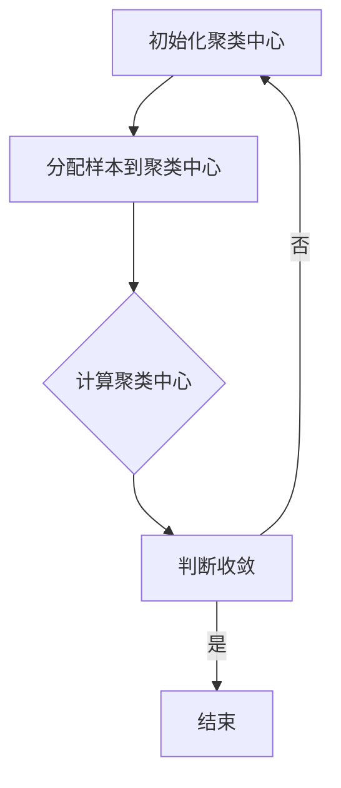

                 

# 云计算在大规模科学计算中的应用

> 关键词：云计算，大规模科学计算，弹性伸缩，资源池化，服务多样化，数据处理，性能优化

> 摘要：随着科学研究的复杂度和数据规模的不断增长，大规模科学计算的需求日益旺盛。云计算以其弹性伸缩、资源池化、服务多样化等优势，成为支持大规模科学计算的重要技术手段。本文将探讨云计算在大规模科学计算中的应用，包括其基本概念、特点、应用案例、技术挑战及解决方案，以及最佳实践和未来发展趋势。

----------------------------------------------------------------

## 第一部分: 云计算与大规模科学计算概述

随着科学研究的不断深入，科学计算的需求越来越大，涉及的计算量和数据量也急剧增加。这就需要一种灵活、高效、可扩展的计算平台来支持大规模科学计算。云计算作为一种新兴的计算模式，以其独特的优势，成为大规模科学计算的重要支撑。

### 第1章: 云计算的概念与特点

#### 1.1 云计算的概念与核心概念

云计算是一种通过互联网以服务的形式提供计算资源的方式。它主要包括三个核心概念：基础设施即服务（IaaS）、平台即服务（PaaS）和软件即服务（SaaS）。这些概念为云计算提供了多样化的服务模式，能够满足不同规模、不同类型的应用需求。

#### 1.2 云计算的特点

**弹性伸缩**：云计算可以根据用户需求动态调整计算资源，实现计算能力的弹性伸缩。

**资源池化**：云计算将计算资源集中管理，形成资源池，用户可以按需获取资源。

**按需分配**：云计算提供按需分配的计算资源，用户只需为实际使用的资源付费。

**服务多样化**：云计算提供多样化的服务，包括IaaS、PaaS和SaaS等，满足不同应用场景的需求。

#### 1.3 云计算在大规模科学计算中的重要性

大规模科学计算需要处理海量数据和高性能计算，云计算提供了一种灵活、高效、可扩展的计算平台，可以满足大规模科学计算的需求。云计算不仅提供了强大的计算能力，还提供了丰富的数据存储和处理能力，可以支持复杂的数据分析和模型计算。

#### 1.4 本章小结

本章介绍了云计算的基本概念、特点以及在大规模科学计算中的重要性。接下来，我们将通过具体的应用案例，进一步探讨云计算在大规模科学计算中的应用。

----------------------------------------------------------------

## 第二部分: 云计算在大规模科学计算中的应用案例

云计算在大规模科学计算中的应用已经取得了显著的成果。本部分将介绍两个典型的应用案例：天气预报与气候变化模拟。

### 第2章: 天气预报与气候变化模拟

#### 2.1 天气预报的云计算应用

天气预报需要处理大量的数据，包括气象观测数据、卫星遥感数据等。云计算提供了强大的计算能力，可以快速处理这些数据，生成天气预报结果。

#### 2.2 气候变化模拟的云计算应用

气候变化模拟是一个复杂的过程，需要模拟多个参数，分析气候变化对环境的影响。云计算提供了高性能的计算平台，可以加速气候变化模拟的进程。

#### 2.3 案例研究：某地区天气预报与气候变化模拟项目

在本案例中，我们以一个具体的地区为例，介绍云计算在天气预报和气候变化模拟中的应用。

#### 2.4 本章小结

本章通过具体的应用案例，展示了云计算在天气预报和气候变化模拟中的应用。这些案例证明了云计算在大规模科学计算中的重要性和优势。

----------------------------------------------------------------

## 第三部分: 云计算在大规模科学计算中的技术挑战与解决方案

尽管云计算在大规模科学计算中表现出色，但同时也面临一些技术挑战。本部分将讨论云计算在大规模科学计算中的技术挑战以及相应的解决方案。

### 第3章: 云计算基础设施

#### 3.1 云计算基础设施概述

云计算基础设施是云计算的核心，包括云存储、云计算网络和云计算安全等。

#### 3.2 云存储技术

云存储技术是云计算的重要组成部分，包括对象存储、块存储和文件存储等。

#### 3.3 云计算网络

云计算网络是连接用户和云计算资源的桥梁，包括网络架构、网络性能优化和网络安全等。

#### 3.4 云计算安全

云计算安全是保障云计算环境安全的关键，包括数据安全、网络安全和系统安全等。

#### 3.5 本章小结

本章介绍了云计算基础设施的基本概念、组成部分以及面临的挑战和解决方案。接下来，我们将探讨云计算在大规模科学计算中的最佳实践。

----------------------------------------------------------------

## 第四部分: 云计算在大规模科学计算中的最佳实践

云计算在大规模科学计算中的应用已经取得了一些成功的案例。本部分将介绍一些最佳实践，包括资源管理、数据处理和分析、应用优化与性能调优等。

### 第4章: 云计算在大规模科学计算中的最佳实践

#### 4.1 云计算资源管理最佳实践

资源管理是云计算的核心，包括资源调度策略、资源分配策略和资源监控与优化等。

#### 4.2 数据处理与分析最佳实践

数据处理与分析是大规模科学计算的关键，包括数据存储与管理、数据处理流程和数据分析技术等。

#### 4.3 应用优化与性能调优

应用优化与性能调优是提升大规模科学计算性能的重要手段，包括应用性能优化、资源利用率优化和系统稳定性优化等。

#### 4.4 案例研究：某国际科研机构云计算实践

在本案例中，我们将介绍某国际科研机构在云计算实践中的经验和成果。

#### 4.5 本章小结

本章介绍了云计算在大规模科学计算中的最佳实践，包括资源管理、数据处理与分析、应用优化与性能调优等。这些实践为大规模科学计算提供了有力的支持。

----------------------------------------------------------------

## 第五部分: 云计算与未来科学计算发展趋势

随着云计算技术的不断发展，未来科学计算也将迎来新的发展趋势。本部分将探讨云计算与未来科学计算的发展趋势，包括云原生计算、量子计算与云计算的结合、分布式存储与计算等。

### 第5章: 云计算与未来科学计算发展趋势

#### 5.1 云计算的未来发展趋势

**云原生计算**：云原生计算是一种基于云计算的新型计算模式，能够更好地利用云计算资源，提高计算效率。

**量子计算与云计算的结合**：量子计算具有强大的计算能力，与云计算的结合将带来革命性的变化。

**分布式存储与计算**：分布式存储与计算能够提高数据存储和计算的效率，满足大规模科学计算的需求。

#### 5.2 大规模科学计算的未来发展趋势

**数据密集型科学计算**：数据密集型科学计算将处理越来越多的数据，对数据处理和分析技术提出更高的要求。

**人工智能在科学计算中的应用**：人工智能将在科学计算中发挥更大的作用，推动科学计算的发展。

**跨学科融合研究**：跨学科融合研究将推动科学计算在更多领域的应用。

#### 5.3 云计算与未来科学计算的机遇与挑战

云计算为未来科学计算提供了强大的支撑，但同时也面临一些挑战，如数据安全、网络性能等。我们需要积极探索解决方案，充分利用云计算的优势，推动科学计算的发展。

#### 5.4 本章小结

本章探讨了云计算与未来科学计算的发展趋势，包括云原生计算、量子计算与云计算的结合、分布式存储与计算等。未来，云计算将继续推动科学计算的发展，带来更多的机遇和挑战。

----------------------------------------------------------------

## 结束语

本文详细探讨了云计算在大规模科学计算中的应用，从基本概念、特点、应用案例、技术挑战与解决方案，到最佳实践和未来发展趋势。云计算以其弹性伸缩、资源池化、服务多样化等优势，为大规模科学计算提供了强大的支撑。随着云计算技术的不断发展，未来科学计算将迎来更多的机遇和挑战。我们期待云计算能够继续推动科学计算的发展，为人类的科技进步做出更大的贡献。

### 作者信息

作者：AI天才研究院/AI Genius Institute & 禅与计算机程序设计艺术 /Zen And The Art of Computer Programming

----------------------------------------------------------------

## 背景介绍

### 云计算的基本概念

云计算（Cloud Computing）是一种通过互联网提供计算资源的服务模式。它包括基础设施即服务（IaaS）、平台即服务（PaaS）和软件即服务（SaaS）三种主要的服务模式。

- **基础设施即服务（IaaS）**：用户可以通过互联网获取虚拟化的计算资源，如虚拟机、存储和网络等。
- **平台即服务（PaaS）**：用户可以在云计算平台上开发、运行和管理应用程序，无需关注底层基础设施的维护。
- **软件即服务（SaaS）**：用户可以通过互联网使用云计算平台上的软件应用，如电子邮件服务、在线办公套件等。

### 大规模科学计算的需求背景

大规模科学计算是指利用高性能计算平台进行的数据分析和计算，以解决复杂的科学问题。随着科学研究的不断深入，科学计算的需求越来越大，涉及的计算量和数据量也急剧增加。大规模科学计算的需求主要包括以下几个方面：

1. **高计算性能**：大规模科学计算需要强大的计算能力，以处理海量数据和复杂的计算任务。
2. **数据存储和管理**：大规模科学计算需要大量的数据存储空间，并且需要高效的数据管理策略，以保证数据的完整性和可用性。
3. **可扩展性**：随着科学计算规模的扩大，计算平台需要具备良好的可扩展性，以适应不断增长的计算需求。

### 云计算在大规模科学计算中的应用优势

云计算在大规模科学计算中具有以下优势：

1. **弹性伸缩**：云计算可以根据用户需求动态调整计算资源，实现计算能力的弹性伸缩，满足大规模科学计算的需求。
2. **资源池化**：云计算将计算资源集中管理，形成资源池，用户可以按需获取资源，提高资源利用率。
3. **按需分配**：云计算提供按需分配的计算资源，用户只需为实际使用的资源付费，降低成本。
4. **服务多样化**：云计算提供多样化的服务，包括IaaS、PaaS和SaaS等，满足不同规模、不同类型的应用需求。

### 云计算在大规模科学计算中的挑战与机遇

尽管云计算在大规模科学计算中表现出色，但同时也面临一些挑战：

1. **数据安全**：大规模科学计算涉及大量敏感数据，数据安全是云计算面临的重要挑战。
2. **网络性能**：大规模科学计算需要高速、稳定的网络连接，网络性能对计算效率有重要影响。
3. **系统稳定性**：大规模科学计算平台需要保持高可用性，以确保计算任务的顺利完成。

然而，这些挑战也带来了机遇：

1. **技术创新**：为了应对这些挑战，云计算技术需要不断创新，如采用更先进的数据加密技术、优化网络架构等。
2. **产业发展**：云计算在大规模科学计算中的应用将推动相关产业的发展，如高性能计算、大数据分析等。

### 概念结构与核心要素组成

云计算的核心概念和要素可以概括如下：

1. **虚拟化技术**：虚拟化技术是云计算的基础，通过虚拟化技术，可以实现计算资源的动态分配和管理。
2. **分布式存储**：分布式存储技术用于存储和管理大规模科学计算中的海量数据，提供高可用性和高性能的数据访问。
3. **云计算平台**：云计算平台是云计算的核心，包括IaaS、PaaS和SaaS等，提供多样化的服务，满足不同应用场景的需求。
4. **网络架构**：网络架构是云计算的关键组成部分，包括网络拓扑结构、网络协议和网络性能优化等。
5. **数据安全**：数据安全是云计算的重要保障，包括数据加密、访问控制和安全审计等。

### 云计算与传统计算模式的区别

云计算与传统计算模式在多个方面存在区别：

1. **资源管理**：传统计算模式通常采用固定的计算资源，而云计算可以动态分配和管理计算资源，实现计算能力的弹性伸缩。
2. **成本**：传统计算模式需要用户自行购买和维护计算资源，而云计算采用按需付费的模式，降低用户成本。
3. **可扩展性**：传统计算模式在计算需求增加时难以快速扩展，而云计算可以快速响应计算需求，实现计算能力的动态扩展。
4. **灵活性**：云计算提供多样化的服务模式，用户可以根据需求选择合适的服务，而传统计算模式通常固定不变。

### 本章小结

本章介绍了云计算的基本概念、特点以及在大规模科学计算中的重要性。云计算以其弹性伸缩、资源池化、按需分配和服务多样化等优势，成为支持大规模科学计算的重要技术手段。接下来，我们将通过具体的应用案例，进一步探讨云计算在大规模科学计算中的应用。

----------------------------------------------------------------

## 核心概念与联系

在探讨云计算在大规模科学计算中的应用之前，我们需要明确一些核心概念，并理解它们之间的联系。以下是云计算中几个关键概念的定义、属性特征对比，以及它们之间的关系。

### 1.1.1 云计算的定义

云计算是一种通过互联网提供计算资源和服务的技术，它将计算资源虚拟化并集中管理，用户可以通过网络按需访问和使用这些资源。

### 1.1.2 云计算的核心概念

云计算的核心概念包括基础设施即服务（IaaS）、平台即服务（PaaS）和软件即服务（SaaS）。这些概念是云计算服务的不同层次，各自具有独特的属性和适用场景。

#### 基础设施即服务（IaaS）

**定义**：IaaS提供虚拟化的计算资源，如虚拟机、存储和网络等，用户可以根据需求自定义和管理这些资源。

**属性特征**：

- **灵活性**：用户可以灵活配置和管理计算资源。
- **自主性**：用户可以自主部署和管理操作系统、应用程序等。
- **成本效益**：按需付费模式，降低长期成本。

#### 平台即服务（PaaS）

**定义**：PaaS提供开发、运行和管理应用程序的平台，用户可以专注于应用程序的开发，无需关注底层基础设施。

**属性特征**：

- **高效率**：提供开发和部署应用程序的环境。
- **协作性**：支持开发团队协作，提高开发效率。
- **灵活性**：可以根据需求快速调整平台配置。

#### 软件即服务（SaaS）

**定义**：SaaS提供完整的软件应用程序，用户可以通过互联网访问和使用这些应用程序。

**属性特征**：

- **便捷性**：无需安装和配置，即可使用软件。
- **灵活性**：可以根据用户需求灵活调整使用量。
- **成本效益**：按需付费模式，降低软件维护成本。

### 1.1.3 云计算与传统计算模式的区别

云计算与传统计算模式的主要区别在于资源管理、成本、可扩展性和灵活性等方面。以下是一个对比表格：

| 特性 | 云计算 | 传统计算模式 |
| --- | --- | --- |
| **资源管理** | 动态分配和弹性伸缩 | 静态分配和固定资源 |
| **成本** | 按需付费，降低长期成本 | 需要预先购买和维护资源 |
| **可扩展性** | 快速响应计算需求，动态扩展 | 难以快速扩展 |
| **灵活性** | 提供多样化的服务模式 | 固定的服务模式 |

### 1.1.4 云计算的核心概念联系

云计算的三个核心概念之间存在紧密的联系：

- **IaaS** 为 PaaS 和 SaaS 提供基础资源，如虚拟机和存储等，是云计算服务的底层支撑。
- **PaaS** 基于IaaS提供开发、运行和管理应用程序的平台，是云计算服务的中层平台。
- **SaaS** 基于PaaS和IaaS提供完整的软件应用程序，是云计算服务的最终体现。

### ER实体关系图架构

为了更清晰地展示云计算核心概念之间的关系，我们可以使用 ER（实体关系）图来表示。以下是云计算核心概念的 ER 图：

```mermaid
erDiagram
IaaS ||--|{ PaaS }|||-- SaaS
IaaS ||--|{ PaaS }|||-- SaaS
```

在上面的 ER 图中，IaaS 作为实体，与 PaaS 和 SaaS 之间通过一对多的关系相连。这表示 IaaS 提供了基础资源，支持 PaaS 和 SaaS 的运行，而 PaaS 和 SaaS 则是 IaaS 上的服务和应用程序。

通过上述核心概念的定义、属性特征对比和 ER 图展示，我们可以更好地理解云计算的基本概念和各个核心概念之间的关系。这为进一步探讨云计算在大规模科学计算中的应用提供了理论基础。

----------------------------------------------------------------

### 1.2 云计算的特点

云计算以其独特的特点，在科技、企业、个人等多个领域获得了广泛应用。以下将详细阐述云计算的四个主要特点：弹性伸缩、资源池化、按需分配和服务多样化。

#### 1.2.1 弹性伸缩

**定义**：弹性伸缩（Elasticity）是指云计算系统可以根据用户需求动态调整计算资源的能力，实现计算能力的弹性扩展和收缩。

**原理**：通过虚拟化和自动化管理技术，云计算平台可以快速创建和销毁虚拟机、容器等资源，从而实现计算能力的动态调整。当用户需求增加时，系统可以自动分配更多的资源；当用户需求减少时，系统可以释放多余的资源。

**应用场景**：弹性伸缩适用于需要应对动态变化的工作负载的场景，如电商平台在促销活动期间流量激增，云计算平台可以根据流量自动扩展计算资源，保证服务的稳定运行。

**优势**：

- **高效资源利用**：动态调整计算资源，避免资源浪费。
- **快速响应**：能够迅速满足用户需求，提高系统可用性。
- **成本优化**：按需分配资源，降低长期成本。

#### 1.2.2 资源池化

**定义**：资源池化（Resource Pooling）是指云计算平台将计算资源（如CPU、内存、存储等）集中管理，形成一个可共享的资源池，用户可以按需获取这些资源。

**原理**：云计算平台通过虚拟化技术将物理资源抽象为虚拟资源，形成统一的资源池。用户可以通过接口访问资源池，根据需求进行资源的申请和释放。

**应用场景**：资源池化适用于需要大量计算资源和存储资源的应用场景，如大数据处理、高性能计算等。

**优势**：

- **资源高效利用**：通过资源池化，实现资源的共享和优化利用。
- **灵活分配**：用户可以根据需求灵活调整资源配置。
- **高可用性**：资源池化可以提高系统的可用性，减少单点故障的风险。

#### 1.2.3 按需分配

**定义**：按需分配（Pay-as-you-Go）是指云计算平台根据用户的实际使用情况，按需计费和分配资源，用户只需为实际使用的资源付费。

**原理**：云计算平台通过监控用户的资源使用情况，自动分配和计费，用户无需预先购买和配置资源。

**应用场景**：按需分配适用于不确定工作负载的应用场景，如互联网应用、临时计算任务等。

**优势**：

- **成本优化**：按需付费模式，降低用户成本。
- **灵活管理**：用户可以根据实际需求灵活调整资源。
- **快速部署**：无需长时间等待资源的采购和配置。

#### 1.2.4 服务多样化

**定义**：服务多样化（Service Diversification）是指云计算平台提供多种类型的服务模式，包括基础设施即服务（IaaS）、平台即服务（PaaS）和软件即服务（SaaS）等，满足不同用户的需求。

**原理**：云计算平台通过构建多样化的服务模式，提供不同的资源和功能，用户可以根据自身需求选择合适的服务。

**应用场景**：服务多样化适用于不同规模和类型的应用场景，如初创企业、大型企业、科研机构等。

**优势**：

- **满足多种需求**：提供多样化的服务，满足不同用户的需求。
- **灵活性**：用户可以根据需求选择合适的服务模式。
- **竞争力**：多样化的服务可以提升云计算平台的竞争力。

#### 1.2.5 本章小结

云计算的四大特点：弹性伸缩、资源池化、按需分配和服务多样化，使其成为支持大规模科学计算的重要技术手段。这些特点不仅提高了资源利用效率和灵活性，还降低了成本，为大规模科学计算提供了强大的支撑。在接下来的章节中，我们将进一步探讨云计算在大规模科学计算中的应用案例。

----------------------------------------------------------------

### 1.3 云计算在大规模科学计算中的重要性

大规模科学计算是指利用高性能计算平台进行的数据分析和计算，以解决复杂的科学问题。随着科学研究的不断深入，大规模科学计算的需求日益增长。云计算作为一项新兴的计算模式，以其独特的优势，成为支持大规模科学计算的重要技术手段。以下是云计算在大规模科学计算中的几个关键作用：

#### 1.3.1 大规模科学计算的需求背景

科学研究的复杂度和数据规模的不断增长，对计算能力和数据处理能力提出了更高的要求。大规模科学计算的需求主要体现在以下几个方面：

1. **计算性能需求**：随着科学问题的复杂度增加，需要更高性能的计算平台来支持大量的计算任务。
2. **数据存储需求**：大规模科学计算需要处理海量数据，对数据存储系统提出了更高的要求。
3. **数据处理需求**：科学计算不仅需要处理大量的数据，还需要对数据进行高效的分析和处理，以提取有价值的信息。

#### 1.3.2 云计算在大规模科学计算中的应用优势

云计算以其弹性伸缩、资源池化、按需分配和服务多样化等优势，为大规模科学计算提供了强大的支撑。以下是云计算在大规模科学计算中的几个关键优势：

1. **弹性伸缩**：云计算平台可以根据用户需求动态调整计算资源，实现计算能力的弹性伸缩，满足大规模科学计算的需求。
2. **资源池化**：云计算将计算资源集中管理，形成资源池，用户可以按需获取资源，提高资源利用率。
3. **按需分配**：云计算提供按需分配的计算资源，用户只需为实际使用的资源付费，降低成本。
4. **服务多样化**：云计算提供多样化的服务模式，包括IaaS、PaaS和SaaS等，满足不同规模、不同类型的应用需求。

#### 1.3.3 云计算在大规模科学计算中的挑战与机遇

尽管云计算在大规模科学计算中表现出色，但同时也面临一些挑战：

1. **数据安全**：大规模科学计算涉及大量敏感数据，数据安全是云计算面临的重要挑战。
2. **网络性能**：大规模科学计算需要高速、稳定的网络连接，网络性能对计算效率有重要影响。
3. **系统稳定性**：大规模科学计算平台需要保持高可用性，以确保计算任务的顺利完成。

然而，这些挑战也带来了机遇：

1. **技术创新**：为了应对这些挑战，云计算技术需要不断创新，如采用更先进的数据加密技术、优化网络架构等。
2. **产业发展**：云计算在大规模科学计算中的应用将推动相关产业的发展，如高性能计算、大数据分析等。

#### 1.3.4 本章小结

云计算在大规模科学计算中发挥着重要作用，以其弹性伸缩、资源池化、按需分配和服务多样化等优势，为大规模科学计算提供了强大的支撑。然而，云计算也面临着一些挑战，需要通过技术创新和产业发展来应对。在接下来的章节中，我们将通过具体的应用案例，进一步探讨云计算在大规模科学计算中的应用。

----------------------------------------------------------------

### 1.4 本章小结

本章对云计算的基本概念、特点以及在大规模科学计算中的重要性进行了详细介绍。通过探讨云计算的定义、核心概念、特点和应用优势，我们了解到云计算以其弹性伸缩、资源池化、按需分配和服务多样化等优势，成为支持大规模科学计算的重要技术手段。云计算不仅提供了强大的计算能力，还提供了丰富的数据存储和处理能力，可以支持复杂的数据分析和模型计算。然而，云计算在大规模科学计算中也面临一些挑战，如数据安全、网络性能和系统稳定性等。在接下来的章节中，我们将通过具体的应用案例，进一步探讨云计算在大规模科学计算中的应用。

----------------------------------------------------------------

## 第二部分: 云计算在大规模科学计算中的应用案例

### 第2章: 天气预报与气候变化模拟

### 2.1 天气预报的云计算应用

天气预报是一个典型的科学计算领域，其核心在于对气象数据进行处理和分析，以预测未来的天气状况。随着气象观测设备的不断改进和数据量的急剧增长，天气预报的计算需求也越来越大。云计算的应用为天气预报提供了强大的计算支持，大大提升了预报的准确性和效率。

#### 2.1.1 天气预报的数据来源与处理

天气预报的数据来源主要包括地面观测数据、卫星遥感数据和气象雷达数据等。这些数据需要通过云计算平台进行高效的处理和分析。以下是一些主要的数据处理步骤：

1. **数据采集**：通过气象观测站、卫星遥感设备等获取气象数据。
2. **数据预处理**：对采集到的数据进行清洗、转换和格式化，确保数据的完整性和准确性。
3. **数据存储**：将预处理后的数据存储到云计算平台的分布式存储系统中，如HDFS（Hadoop Distributed File System）或对象存储服务（如Amazon S3）。
4. **数据处理**：利用云计算平台提供的计算资源，对存储的数据进行模式识别、统计分析和数值模拟等处理，生成天气预报结果。

#### 2.1.2 云计算在天气预报中的应用

云计算在天气预报中的应用主要体现在以下几个方面：

1. **高性能计算**：云计算平台提供了强大的计算能力，可以快速处理海量气象数据，生成准确的天气预报结果。
2. **弹性伸缩**：天气预报的计算需求具有动态变化的特点，云计算平台可以根据实际需求动态调整计算资源，确保计算任务的高效运行。
3. **数据存储与管理**：云计算平台提供了大规模的数据存储和管理能力，可以存储和处理大量气象数据，确保数据的完整性和可靠性。
4. **可视化分析**：云计算平台支持数据可视化工具，如Tableau或Power BI，帮助气象学家更直观地分析气象数据，提升预报的准确性。

#### 2.1.3 云计算对天气预报的改进

云计算的应用对天气预报带来了显著的改进：

1. **提高预报精度**：云计算平台的高性能计算能力可以处理更精细的气象数据，提高预报的准确性。
2. **缩短预报周期**：云计算平台可以实时处理和分析气象数据，缩短预报周期，提供更及时的天气预报服务。
3. **降低成本**：云计算采用按需付费模式，用户只需为实际使用的资源付费，降低了计算和存储成本。
4. **提升用户体验**：云计算平台支持多终端访问，用户可以通过手机、平板电脑等设备随时随地获取天气预报信息。

#### 2.2 气候变化模拟的云计算应用

气候变化模拟是另一个重要的科学计算领域，其目的是通过数值模型模拟气候变化过程，预测未来气候趋势，为气候政策制定提供科学依据。云计算的应用为气候变化模拟提供了强大的计算支持，大大提高了模拟的精度和效率。

#### 2.2.1 气候变化模拟的基本原理

气候变化模拟基于气候数值模型，通过模拟大气、海洋、陆地等系统的物理过程，预测未来气候变化趋势。以下是一些基本原理：

1. **气候系统**：气候变化模拟涉及大气、海洋、陆地等多个气候系统，需要综合考虑这些系统之间的相互作用。
2. **数值模型**：气候变化模拟采用数值模型，将气候系统转化为数学方程，通过计算机模拟求解这些方程，预测未来气候。
3. **数据输入**：气候变化模拟需要大量输入数据，包括气象观测数据、海洋数据、陆地数据等，这些数据用于驱动数值模型。
4. **模拟结果**：通过数值模拟，可以得到未来气候趋势的预测结果，为气候政策制定提供科学依据。

#### 2.2.2 云计算在气候变化模拟中的应用

云计算在气候变化模拟中的应用主要体现在以下几个方面：

1. **高性能计算**：云计算平台提供了强大的计算能力，可以快速模拟大规模气候系统，提高模拟精度和效率。
2. **数据存储与管理**：云计算平台提供了大规模的数据存储和管理能力，可以存储和管理海量气候数据，确保数据的完整性和可靠性。
3. **分布式计算**：云计算平台支持分布式计算，可以将复杂的气候模拟任务分解为多个子任务，并行处理，提高计算效率。
4. **可视化分析**：云计算平台支持数据可视化工具，可以帮助研究人员更直观地分析气候变化模拟结果，深入了解气候变化趋势。

#### 2.2.3 云计算对气候变化模拟的贡献

云计算的应用对气候变化模拟带来了显著的贡献：

1. **提高模拟精度**：云计算平台的高性能计算能力可以处理更精细的气候数据，提高模拟精度，更准确地预测未来气候变化趋势。
2. **缩短模拟周期**：云计算平台可以实时处理和分析气候数据，缩短模拟周期，提供更及时的气候变化模拟结果。
3. **降低成本**：云计算采用按需付费模式，用户只需为实际使用的资源付费，降低了计算和存储成本，提高了资源利用效率。
4. **促进跨学科合作**：云计算平台支持多学科研究人员协作，共同开展气候变化模拟研究，促进跨学科合作和知识共享。

#### 2.3 案例研究：某地区天气预报与气候变化模拟项目

在本案例中，我们以某地区为例，介绍云计算在天气预报和气候变化模拟中的应用。

#### 2.3.1 项目背景

某地区位于温带季风气候区，气候变化对其农业、水资源和生态环境等具有重要影响。为了更好地理解和预测该地区的气候变化，当地政府和科研机构决定开展天气预报和气候变化模拟项目。

#### 2.3.2 项目需求

项目的主要需求包括：

1. **天气预报**：提供实时、准确的天气预报服务，为当地居民和农业生产提供科学依据。
2. **气候变化模拟**：模拟未来气候变化趋势，预测可能出现的极端气候事件，为气候政策制定提供科学依据。

#### 2.3.3 项目实施

项目实施分为以下几个阶段：

1. **数据采集与预处理**：收集气象观测数据、卫星遥感数据和海洋数据等，对数据进行预处理，确保数据的完整性和准确性。
2. **搭建云计算平台**：选择合适的云计算平台，如Amazon Web Services（AWS）或Microsoft Azure，搭建天气预报和气候变化模拟的计算环境。
3. **数据存储与管理**：利用云计算平台的分布式存储服务，如Amazon S3或Azure Blob Storage，存储和管理海量数据。
4. **模型开发与模拟**：利用云计算平台提供的计算资源，开发天气预报和气候变化模拟模型，进行模拟计算。
5. **结果分析与可视化**：利用云计算平台支持的数据可视化工具，对模拟结果进行分析和可视化，为项目决策提供科学依据。

#### 2.3.4 项目效果评估

项目实施后，取得了以下效果：

1. **提高预报精度**：通过云计算平台的高性能计算能力，天气预报的精度得到了显著提高，为当地居民和农业生产提供了更准确的天气信息。
2. **缩短模拟周期**：云计算平台实时处理和分析气候数据，使气候变化模拟周期缩短，为气候政策制定提供了更及时的模拟结果。
3. **降低成本**：云计算采用按需付费模式，项目成本得到了有效控制，提高了资源利用效率。
4. **促进跨学科合作**：云计算平台支持多学科研究人员协作，共同开展天气预报和气候变化模拟研究，促进了知识共享和合作。

#### 2.4 本章小结

本章介绍了云计算在天气预报和气候变化模拟中的应用。通过具体案例，展示了云计算如何通过高性能计算、弹性伸缩、数据存储与管理等技术，提高天气预报和气候变化模拟的精度和效率。云计算的应用不仅提高了科学研究的效率，还为气候政策制定提供了科学依据，具有重要的现实意义。

----------------------------------------------------------------

## 3.1 云计算基础设施概述

云计算基础设施是云计算服务的核心组成部分，包括云存储、云计算网络和云计算安全等多个方面。本节将对云计算基础设施进行概述，分析其定义、组成和优劣。

### 3.1.1 云计算基础设施的定义

云计算基础设施（Cloud Infrastructure）是指用于提供云计算服务所需的基础设施，包括计算资源、存储资源、网络资源和安全资源等。它是云计算服务运行的基础，为用户提供可靠、高效、可扩展的计算环境。

### 3.1.2 云计算基础设施的组成

云计算基础设施主要由以下几个组成部分构成：

1. **计算资源**：包括虚拟机（VM）、容器（Container）和函数计算（Function as a Service, FaaS）等，提供计算能力。
2. **存储资源**：包括分布式文件系统（如HDFS）、对象存储（如Amazon S3）和块存储（如Amazon EBS）等，提供数据存储能力。
3. **网络资源**：包括虚拟网络（Virtual Network）、负载均衡（Load Balancer）和防火墙（Firewall）等，提供网络连接和管理能力。
4. **安全资源**：包括身份认证（Identity and Access Management, IAM）、数据加密（Data Encryption）和入侵检测（Intrusion Detection System, IDS）等，提供安全保护能力。

### 3.1.3 云计算基础设施的优劣分析

**优势**：

1. **弹性伸缩**：云计算基础设施可以根据用户需求动态调整计算资源，实现计算能力的弹性伸缩，提高资源利用率。
2. **高可用性**：云计算基础设施通常采用分布式架构，提供高可用性和容错能力，确保服务的连续性。
3. **成本效益**：云计算基础设施采用按需付费模式，用户只需为实际使用的资源付费，降低长期成本。
4. **可扩展性**：云计算基础设施支持水平扩展和垂直扩展，能够满足不断增长的计算需求。

**劣势**：

1. **依赖网络**：云计算基础设施依赖互联网，网络连接不稳定或带宽不足会影响服务的可用性和性能。
2. **数据安全**：大规模数据存储和处理可能导致数据泄露或丢失，数据安全是云计算基础设施的重要挑战。
3. **技术门槛**：云计算基础设施的搭建和管理需要一定的技术知识和经验，对用户的技术要求较高。
4. **单一提供商风险**：依赖单一云计算服务提供商可能导致服务中断或价格波动，增加业务风险。

### 3.1.4 本章小结

云计算基础设施是云计算服务的核心组成部分，提供了计算资源、存储资源、网络资源和安全资源等，具有弹性伸缩、高可用性、成本效益和可扩展性等优势。同时，云计算基础设施也面临依赖网络、数据安全、技术门槛和单一提供商风险等挑战。在接下来的章节中，我们将进一步探讨云存储技术、云计算网络和云计算安全等具体领域。

----------------------------------------------------------------

### 3.2 云存储技术

云存储技术是云计算基础设施的重要组成部分，提供了高效、可靠、可扩展的数据存储和管理服务。本节将详细讨论云存储技术的定义、分类及其优缺点。

#### 3.2.1 云存储技术的定义

云存储技术（Cloud Storage Technology）是指通过互联网提供数据存储服务的技术，用户可以随时随地访问和操作存储在云端的文件和数据。云存储技术基于分布式存储架构，将数据分散存储在多个物理节点上，提供高可靠性、高可用性和高扩展性的数据存储服务。

#### 3.2.2 云存储技术的分类

云存储技术可以根据存储类型和访问方式的不同，分为以下几类：

1. **分布式文件存储**：分布式文件存储系统（如HDFS、Ceph）通过将文件分成多个块，分散存储在多个节点上，提供高性能的文件存储和访问服务。分布式文件存储具有高可靠性、高可用性和横向扩展性，适用于大规模数据存储和大数据应用。
   
2. **对象存储**：对象存储系统（如Amazon S3、Google Cloud Storage）将数据以对象的形式存储，每个对象由唯一标识符（ID）标识。对象存储具有高可靠性、高可用性和高扩展性，适用于大规模数据存储和云服务提供商的数据存储需求。

3. **块存储**：块存储系统（如Amazon EBS、Azure Disk）将存储资源按块的形式划分，用户可以通过块设备接口（如SCSI、iSCSI）访问和管理数据块。块存储适用于需要高性能读写操作的应用，如数据库、虚拟机等。

#### 3.2.3 云存储技术的优缺点

**分布式文件存储**

**优点**：

- **高可靠性**：分布式文件存储系统通过数据冗余和复制机制，提供高可靠性和数据完整性。
- **高可用性**：分布式存储架构确保系统在部分节点故障时仍能正常运行。
- **高扩展性**：分布式文件存储系统可以水平扩展，满足大规模数据存储需求。

**缺点**：

- **性能瓶颈**：由于分布式文件存储系统需要跨多个节点访问数据，数据访问性能可能受到网络延迟的影响。
- **管理复杂度**：分布式文件存储系统需要专业的管理工具和技能，对管理员的技术要求较高。

**对象存储**

**优点**：

- **高扩展性**：对象存储系统可以无缝扩展，满足海量数据存储需求。
- **高可靠性**：对象存储系统通过数据冗余和复制机制，确保数据的安全性和完整性。
- **便捷性**：对象存储提供简单的API接口，便于应用程序的集成和使用。

**缺点**：

- **性能限制**：对象存储系统的性能通常不如块存储系统，特别是在读写密集型应用中。
- **数据操作限制**：对象存储系统不支持块级别的数据操作，对需要频繁修改数据的场景可能不适用。

**块存储**

**优点**：

- **高性能**：块存储系统提供块级别的数据访问，适用于高性能读写操作的应用。
- **灵活管理**：块存储资源可以通过块设备接口直接访问和管理，适用于需要自定义存储策略的场景。

**缺点**：

- **扩展性限制**：块存储系统的扩展性相对较低，通常需要增加物理存储设备来扩展存储容量。
- **高成本**：块存储资源通常成本较高，特别是高性能块存储资源。

#### 3.2.4 本章小结

云存储技术是云计算基础设施的核心组成部分，包括分布式文件存储、对象存储和块存储等多种类型。每种存储技术都有其独特的优点和适用场景，用户可以根据具体需求选择合适的存储解决方案。在云计算环境下，云存储技术为大规模数据存储和管理提供了高效、可靠和可扩展的解决方案，支持各类科学计算应用。

----------------------------------------------------------------

### 3.3 云计算网络

云计算网络是云计算基础设施的重要组成部分，它负责连接用户和云计算资源，提供高效、稳定的数据传输通道。本节将详细讨论云计算网络的概念、架构以及面临的挑战和解决方案。

#### 3.3.1 云计算网络的概念

云计算网络（Cloud Computing Network）是指云计算环境中用于数据传输、资源调度和通信的网络架构。云计算网络包括内部网络（如虚拟专用网络VPC）和外部网络（如互联网），它们共同构成了云计算环境的通信基础。

**内部网络**：内部网络主要用于连接云计算资源，如虚拟机、存储设备和数据库等。内部网络通常采用私有IP地址，通过虚拟路由器和交换机进行管理和配置。

**外部网络**：外部网络负责连接云计算环境和互联网，提供用户访问云计算服务的接口。外部网络通常通过防火墙、负载均衡器和入侵检测系统等安全设备进行管理和保护。

#### 3.3.2 云计算网络的架构

云计算网络架构通常包括以下几个关键组成部分：

1. **虚拟专用云（VPC）**：虚拟专用云是一个在云计算环境中创建的隔离网络，提供私有IP地址范围和自定义路由。用户可以在VPC内创建子网、路由表和安全组等，实现网络隔离和访问控制。

2. **虚拟网络设备**：包括虚拟路由器（Virtual Router）和虚拟交换机（Virtual Switch）。虚拟路由器负责路由转发，连接不同的子网和外部网络；虚拟交换机负责内部网络的数据转发和设备连接。

3. **负载均衡器（Load Balancer）**：负载均衡器用于分发网络流量，确保多个服务器和应用程序的负载均衡和高效运行。负载均衡器可以根据流量模式、服务器健康状态等动态调整流量分配。

4. **安全设备**：包括防火墙（Firewall）、入侵检测系统（Intrusion Detection System, IDS）和入侵防御系统（Intrusion Prevention System, IPS）。安全设备用于保护网络免受攻击，监控和分析网络流量，及时发现和响应安全威胁。

#### 3.3.3 云计算网络的挑战与解决方案

云计算网络在提供高效、稳定的数据传输通道时，也面临一些挑战：

**挑战1：网络性能瓶颈**

**解决方案**：采用高性能的网络设备和优化网络架构，如使用高速光纤连接、多路径传输等技术，提高网络传输效率和性能。

**挑战2：网络安全**

**解决方案**：加强网络安全防护，采用加密传输、访问控制、入侵检测和防御等技术，确保数据传输的安全性和完整性。

**挑战3：网络扩展性**

**解决方案**：采用分布式网络架构和弹性扩展技术，如VPC、云路由器和动态带宽分配等，实现网络资源的动态扩展和优化。

**挑战4：多租户隔离**

**解决方案**：通过虚拟专用云（VPC）和隔离网络技术，实现多租户环境下的网络隔离和资源隔离，保障不同用户之间的数据安全和隐私。

**挑战5：网络监控和管理**

**解决方案**：采用专业的网络监控和管理工具，实时监控网络性能、流量和设备状态，快速发现和解决网络问题。

#### 3.3.4 本章小结

云计算网络是云计算基础设施的重要组成部分，负责连接用户和云计算资源，提供高效、稳定的数据传输通道。通过了解云计算网络的概念、架构和面临的挑战，我们可以采取相应的解决方案，优化网络性能和安全，提高云计算服务的可靠性和用户体验。

----------------------------------------------------------------

### 3.4 云计算安全

云计算安全是保障云计算环境安全的关键要素，涉及到数据安全、网络安全和系统安全等多个方面。本节将详细讨论云计算安全的概念、面临的挑战以及相应的解决方案。

#### 3.4.1 云计算安全的概念

云计算安全（Cloud Computing Security）是指针对云计算环境中的数据、应用程序和基础设施进行保护的一系列安全措施。云计算安全的目标是确保数据的安全性和完整性，防止数据泄露、篡改和未授权访问，保障云计算服务的稳定运行。

云计算安全主要包括以下几个关键方面：

1. **数据安全**：数据安全是云计算安全的核心，涉及数据加密、访问控制和数据备份等。
2. **网络安全**：网络安全包括网络防护、入侵检测和防御等，旨在保障云计算环境的网络连接和数据传输安全。
3. **系统安全**：系统安全涉及操作系统、虚拟机和应用程序的安全，包括防火墙、入侵检测和系统漏洞修复等。

#### 3.4.2 云计算安全面临的挑战

云计算安全在保障云计算环境安全方面面临以下主要挑战：

1. **数据泄露**：云计算环境中的大量敏感数据容易成为攻击目标，数据泄露风险较高。
2. **数据完整性**：数据在传输和存储过程中可能受到篡改，影响数据的完整性。
3. **访问控制**：云计算环境中的多租户架构使得访问控制变得更加复杂，容易发生未授权访问。
4. **网络攻击**：云计算网络容易受到各种网络攻击，如DDoS攻击、SQL注入等，对网络性能和稳定性造成威胁。
5. **系统漏洞**：云计算环境中的操作系统、虚拟机和应用程序可能存在安全漏洞，需要及时修复。

#### 3.4.3 云计算安全解决方案

为了应对云计算安全面临的挑战，可以采取以下解决方案：

1. **数据加密**：采用数据加密技术，对存储和传输的数据进行加密，确保数据在未经授权的情况下无法访问和篡改。
2. **访问控制**：通过身份验证、权限管理和访问审计等手段，确保只有授权用户可以访问敏感数据和服务。
3. **网络安全防护**：采用防火墙、入侵检测和防御系统等网络安全设备，实时监控网络流量和攻击行为，及时阻断攻击。
4. **系统漏洞修复**：定期更新操作系统、虚拟机和应用程序的安全补丁，修复已知漏洞，降低安全风险。
5. **安全审计**：定期进行安全审计，检查云计算环境中的安全配置和操作行为，及时发现和解决安全隐患。
6. **合规性**：遵循相关的法律法规和标准，如GDPR、ISO 27001等，确保云计算服务的合法合规。

#### 3.4.4 本章小结

云计算安全是保障云计算环境安全的关键要素，涉及数据安全、网络安全和系统安全等多个方面。在云计算环境下，数据泄露、数据完整性和访问控制等安全挑战需要通过数据加密、访问控制、网络安全防护和系统漏洞修复等解决方案来应对。通过建立健全的云计算安全体系，可以保障云计算服务的安全可靠运行，提高用户的信任度和满意度。

----------------------------------------------------------------

### 4.1 云计算资源管理最佳实践

云计算资源管理是确保云计算环境高效运行的核心环节。合理的管理策略可以提高资源利用率，降低成本，同时保证系统性能和可靠性。以下将介绍云计算资源管理的一些最佳实践。

#### 4.1.1 资源调度策略

资源调度策略是云计算资源管理的关键，它决定了如何将计算资源分配给不同的任务。以下是一些常用的资源调度策略：

1. **动态调度**：动态调度策略根据当前系统负载和任务需求，动态调整资源分配，确保系统资源的充分利用。常见的动态调度算法包括基于响应时间的调度、基于优先级的调度和基于资源需求的调度等。

2. **负载均衡**：负载均衡策略通过将任务分配到不同的计算节点，实现负载的均匀分布，避免单点过载和资源浪费。负载均衡可以基于任务的数量、执行时间、资源利用率等因素进行。

3. **预留资源**：预留资源策略是指在系统负载较低时，预留一部分计算资源以应对突发的高负载情况。预留资源可以保证系统在高负载情况下仍然能够正常运行，避免性能下降。

4. **基于历史数据的调度**：基于历史数据的调度策略通过分析历史任务执行情况，预测未来任务的负载和需求，提前进行资源调度，避免资源不足或浪费。

#### 4.1.2 资源分配策略

资源分配策略是云计算资源管理的另一个重要方面，它决定了如何将计算资源分配给不同的用户和任务。以下是一些常见的资源分配策略：

1. **固定分配**：固定分配策略将计算资源静态地分配给不同的用户或任务，资源一旦分配便不再调整。这种方法简单易行，但无法适应动态变化的负载需求。

2. **按需分配**：按需分配策略根据用户需求和任务负载，动态调整资源的分配，确保资源的充分利用。按需分配适用于负载波动较大的场景，但需要高效的资源调度和管理机制。

3. **优先级分配**：优先级分配策略根据任务的优先级分配计算资源，高优先级的任务优先获得资源。这种方法可以确保关键任务的及时执行，但可能导致低优先级任务等待时间较长。

4. **共享资源**：共享资源策略将计算资源在多个用户或任务之间共享，通过资源调度和管理，实现资源的公平分配。共享资源可以最大化资源利用率，但需要有效的资源分配和调度策略，以避免资源竞争和性能下降。

#### 4.1.3 资源监控与优化

资源监控与优化是确保云计算环境高效运行的重要手段。以下是一些常见的资源监控与优化方法：

1. **实时监控**：通过实时监控系统性能和资源使用情况，及时发现异常和性能瓶颈。实时监控可以包括CPU利用率、内存使用率、磁盘IO、网络流量等指标。

2. **自动化优化**：利用自动化工具和算法，根据实时监控数据，自动调整资源分配和调度策略。自动化优化可以提高资源利用率和系统性能，减少人工干预。

3. **性能调优**：通过分析系统性能指标，识别性能瓶颈和优化机会，进行针对性的性能调优。性能调优可以包括调整配置参数、优化代码、调整资源分配等。

4. **资源池管理**：资源池管理涉及资源池的创建、扩展和管理。合理的资源池管理可以最大化资源利用率，提高系统弹性和可靠性。

5. **容量规划**：通过容量规划，预测未来负载和资源需求，提前进行资源扩展和调整。容量规划可以确保系统在负载增长时能够及时响应，避免资源不足或浪费。

#### 4.1.4 本章小结

云计算资源管理是确保云计算环境高效运行的关键，涉及资源调度策略、资源分配策略和资源监控与优化等方面。通过合理的资源管理策略和自动化工具，可以最大化资源利用率，提高系统性能和可靠性，降低运营成本。云计算资源管理的最佳实践为企业和组织提供了有效的指导，帮助其实现云计算环境的最优化运行。

----------------------------------------------------------------

### 4.2 数据处理与分析最佳实践

在云计算环境下，数据处理与分析是大规模科学计算的关键环节。有效的数据处理与分析可以提升科学计算的效率，加速科学研究的进展。以下将介绍云计算环境下的数据处理与分析的一些最佳实践。

#### 4.2.1 数据存储与管理

数据存储与管理是数据处理与分析的基础。以下是一些数据存储与管理的最佳实践：

1. **分布式存储**：采用分布式存储系统（如HDFS、Ceph等）来存储大规模数据，提高数据存储的可靠性和性能。分布式存储系统可以自动处理数据冗余和故障转移，确保数据的安全性和可用性。

2. **数据分层存储**：根据数据的重要性和访问频率，采用分层存储策略。重要且高频次访问的数据存储在高速存储介质上，如SSD；不常访问的数据可以存储在成本较低的存储介质上，如HDD。

3. **数据备份与恢复**：定期对数据进行备份，确保在数据丢失或系统故障时能够快速恢复。备份策略可以包括全量备份、增量备份和差异备份等。

4. **数据版本管理**：对于需要频繁修改的数据，采用数据版本管理策略，确保历史数据的完整性和可追溯性。数据版本管理可以帮助研究人员在不同时间点查看数据，避免数据冲突和丢失。

5. **数据加密**：对敏感数据进行加密存储，确保数据在传输和存储过程中的安全性。常见的加密算法包括AES、RSA等。

6. **数据清洗与预处理**：在数据处理与分析之前，对数据进行清洗和预处理，包括去除重复数据、填补缺失值、标准化和归一化等。数据清洗与预处理可以提高数据质量和分析结果的准确性。

7. **数据索引与查询优化**：对于大规模数据集，采用数据索引技术（如B树、哈希索引等）和查询优化策略（如索引合并、查询缓存等），提高数据查询和访问速度。

#### 4.2.2 数据处理流程

一个有效的数据处理流程可以提高数据处理和分析的效率。以下是一个典型的数据处理流程：

1. **数据采集**：从各种数据源（如数据库、文件系统、传感器等）采集数据。

2. **数据导入**：将采集到的数据导入到分布式存储系统（如HDFS、Ceph等），并进行数据预处理。

3. **数据存储**：将预处理后的数据存储到分布式存储系统或数据仓库（如Apache Hadoop、Apache Hive等）。

4. **数据清洗**：对存储的数据进行清洗，包括去除重复数据、填补缺失值、标准化和归一化等。

5. **数据集成**：将不同来源和格式的数据进行集成，形成一个统一的数据视图。

6. **数据转换**：根据分析需求，对数据进行转换，包括数据聚合、转换和计算等。

7. **数据分析**：利用数据分析工具（如Pandas、Spark等）对转换后的数据进行统计分析、机器学习等分析。

8. **数据可视化**：将分析结果进行可视化，帮助研究人员更直观地理解数据和分析结果。

#### 4.2.3 数据分析技术

在云计算环境下，数据分析技术涵盖了多种技术和工具，以下是一些常用的数据分析技术：

1. **统计分析**：包括描述性统计、回归分析、聚类分析等，用于分析数据的基本特征和关系。

2. **机器学习**：包括监督学习、无监督学习和强化学习等，用于构建预测模型、分类模型和聚类模型等。

3. **数据挖掘**：包括关联规则挖掘、分类挖掘、聚类挖掘等，用于发现数据中的隐藏模式和规律。

4. **文本分析**：包括自然语言处理、情感分析、主题建模等，用于分析文本数据，提取有用信息。

5. **图像处理**：包括图像分类、图像识别、图像分割等，用于分析图像数据，提取图像特征。

6. **时间序列分析**：包括时间序列建模、预测和可视化等，用于分析时间序列数据，提取时间规律和趋势。

7. **大数据分析**：包括数据流处理、实时分析和批处理等，用于处理大规模数据集，提取有价值的信息。

#### 4.2.4 本章小结

数据处理与分析是大规模科学计算的重要环节。在云计算环境下，通过合理的数据存储与管理、有效的数据处理流程和先进的数据分析技术，可以提升科学计算的效率，加速科学研究的进展。最佳实践为企业和组织提供了有效的指导，帮助其在云计算环境中实现高效的数据处理与分析。

----------------------------------------------------------------

### 4.3 应用优化与性能调优

在云计算环境中，应用优化与性能调优是提高系统效率和用户体验的关键。通过合理的优化策略和工具，可以提升应用的响应速度、资源利用率和稳定性。以下将介绍云计算应用优化与性能调优的一些重要方面。

#### 4.3.1 应用性能优化

应用性能优化主要集中在提升应用的响应速度和处理效率。以下是一些关键策略：

1. **代码优化**：通过优化算法和代码逻辑，减少计算复杂度和资源消耗。例如，减少不必要的循环、优化内存分配、避免使用低效的算法等。

2. **数据库优化**：优化数据库查询和索引，减少查询时间。通过分析查询日志，识别性能瓶颈，如慢查询、全表扫描等，进行针对性的优化。

3. **缓存策略**：利用缓存机制，如Redis、Memcached等，存储常用数据和计算结果，减少重复计算和数据库访问。

4. **负载均衡**：通过负载均衡器（如Nginx、HAProxy等）均衡分布式服务器的负载，避免单点过载，提高系统的整体性能。

5. **异步处理**：利用异步处理（如消息队列、异步任务等），将耗时较长的任务从主线程中分离出来，提高系统的响应速度和处理能力。

6. **服务拆分**：将大型应用拆分为多个微服务，每个服务负责特定的功能，独立部署和扩展，提高系统的可维护性和可扩展性。

7. **性能监控**：通过性能监控工具（如New Relic、AppDynamics等），实时监控应用性能指标，如响应时间、错误率、资源利用率等，及时发现性能瓶颈并进行优化。

#### 4.3.2 资源利用率优化

资源利用率优化旨在最大化利用云计算资源，降低运营成本。以下是一些关键策略：

1. **容器化**：通过容器化技术（如Docker、Kubernetes等），实现应用的轻量级部署和管理，提高资源利用率和部署效率。

2. **自动扩展**：利用云计算平台的自动扩展功能，根据负载自动调整计算资源的数量，避免资源浪费和性能下降。

3. **资源复用**：通过复用现有资源，如共享存储、虚拟化资源等，减少资源的闲置和重复投资。

4. **优化配置**：合理调整资源配置，如CPU、内存、网络等，确保资源利用率的最大化。

5. **资源隔离**：通过资源隔离技术，如容器隔离、虚拟化隔离等，确保不同应用之间的资源独立性和安全性，避免资源争用和性能瓶颈。

6. **节能管理**：通过节能管理策略，如智能调度、自动化关停等，降低电力消耗，实现绿色环保和成本优化。

#### 4.3.3 系统稳定性优化

系统稳定性优化是确保应用在高负载和复杂环境中正常运行的关键。以下是一些关键策略：

1. **容错与故障转移**：通过容错和故障转移机制，如主从复制、高可用集群等，确保系统在节点故障时能够自动切换，保持服务的连续性和可靠性。

2. **备份与恢复**：定期备份数据和系统配置，确保在数据丢失或系统故障时能够快速恢复。

3. **监控与预警**：通过实时监控和预警系统，如Prometheus、Zabbix等，及时发现系统异常和性能瓶颈，提前进行干预和处理。

4. **安全防护**：加强网络安全防护，如防火墙、入侵检测、数据加密等，确保系统的安全性。

5. **负载测试**：定期进行负载测试，模拟高负载场景，评估系统的性能和稳定性，发现潜在的问题并进行优化。

6. **故障演练**：定期进行故障演练，模拟系统故障场景，检验系统的容错能力和恢复速度。

#### 4.3.4 本章小结

应用优化与性能调优是云计算环境中确保系统高效运行的重要环节。通过合理的应用性能优化、资源利用率优化和系统稳定性优化策略，可以提升应用的性能和用户体验，降低运营成本，提高系统的可靠性和稳定性。最佳实践为企业和组织提供了有效的指导，帮助其在云计算环境中实现最佳的应用性能和资源利用。

----------------------------------------------------------------

### 4.4 案例研究：某国际科研机构云计算实践

在本案例研究中，我们将探讨某国际科研机构如何利用云计算技术提升其科研效率和成果产出。该机构专注于气候变化和海洋科学领域的研究，拥有庞大的数据和复杂的计算需求。

#### 4.4.1 实践背景

该科研机构在传统计算模式下，面临着计算资源不足、数据存储困难、成本高昂等问题。传统的计算资源和存储设施难以满足其日益增长的计算需求，导致科研进展缓慢。为了解决这些问题，该机构决定采用云计算技术，构建一个高效、可扩展的科研计算环境。

#### 4.4.2 实践步骤

1. **需求分析**：该科研机构对自身的计算需求和数据规模进行了详细分析，确定了云计算平台所需的支持能力，包括计算资源、存储容量、网络带宽等。

2. **平台选择**：经过对比和分析，该机构选择了某个知名云服务提供商，建立了基于该提供商的云计算平台。云服务提供商提供了丰富的云计算资源和专业的技术支持，确保了平台的稳定性和可靠性。

3. **资源部署**：在云计算平台上，该机构部署了高性能计算集群、分布式文件存储系统和数据仓库。高性能计算集群用于处理复杂的科学计算任务，分布式文件存储系统用于存储和管理大规模数据集，数据仓库用于存储和管理研究数据。

4. **数据集成**：该机构通过数据集成工具，将来自不同数据源的数据进行整合和清洗，形成一个统一的数据视图。数据集成过程包括数据导入、数据清洗、数据转换和元数据管理。

5. **应用部署**：在云计算平台上，该机构部署了多个科学计算应用程序，包括气候模型、海洋模拟和数据分析工具。应用程序通过容器化技术（如Docker）部署，确保了应用的轻量级、可扩展性和易于维护。

6. **性能监控与优化**：通过性能监控工具，该机构实时监控计算资源的使用情况和应用程序的性能指标，及时发现和处理性能瓶颈。性能优化包括代码优化、数据库优化、缓存策略和负载均衡等。

7. **安全防护**：在云计算平台上，该机构加强了安全防护措施，包括数据加密、访问控制和入侵检测等。安全防护措施确保了科研数据的安全性和隐私性。

#### 4.4.3 实践效果评估

通过云计算实践，该科研机构取得了显著的效果：

1. **计算效率提升**：云计算平台提供了强大的计算能力，使得复杂的科学计算任务能够在短时间内完成，显著提升了科研效率。

2. **数据管理优化**：分布式文件存储系统和数据仓库提供了高效的数据存储和管理能力，使得数据能够得到有效利用，提高了数据质量和访问速度。

3. **成本降低**：云计算采用按需付费模式，该机构只需为实际使用的资源付费，避免了高昂的硬件投资和维护成本。

4. **可扩展性增强**：云计算平台具备良好的可扩展性，随着科研需求的增长，可以轻松扩展计算资源和存储容量，确保系统的稳定性和可靠性。

5. **安全防护增强**：通过安全防护措施，该机构确保了科研数据的安全性和隐私性，提高了数据安全和用户信任度。

#### 4.4.4 本章小结

本案例研究展示了某国际科研机构如何通过云计算技术提升科研效率和成果产出。云计算平台为该机构提供了强大的计算能力、高效的数据管理能力和良好的安全性，使得科研工作更加高效、稳定和可靠。该实践为其他科研机构和组织提供了有益的借鉴和参考。

----------------------------------------------------------------

## 5.1 云计算的未来发展趋势

云计算作为信息技术领域的重要发展方向，正不断演变和进步。未来，云计算将继续在技术创新和行业应用方面取得突破，为大规模科学计算带来更多机遇和挑战。以下是云计算在未来可能的发展趋势：

### 5.1.1 云原生计算

云原生计算（Cloud Native Computing）是一种基于云计算的新型计算模式，旨在充分利用云计算平台的弹性、可扩展性和分布式特性。云原生计算的核心是微服务架构、容器化和自动化管理。随着容器技术（如Docker、Kubernetes）的成熟，云原生计算已经成为云计算发展的一个重要趋势。

**特点**：

- **微服务架构**：将应用程序拆分为多个独立的微服务，每个微服务负责特定的功能，独立部署和扩展。
- **容器化**：利用容器技术实现应用程序的轻量级、隔离和快速部署。
- **自动化管理**：通过自动化工具（如Kubernetes）实现应用程序的生命周期管理、资源调度和性能优化。

**应用**：云原生计算在互联网应用、大数据处理、人工智能等领域具有广泛的应用前景，可以提高系统的可扩展性和灵活性。

### 5.1.2 量子计算与云计算的结合

量子计算（Quantum Computing）是一种基于量子力学原理的新型计算模式，具有极高的计算速度和处理能力。随着量子计算技术的不断发展，量子计算与云计算的结合将成为未来的一个重要方向。

**特点**：

- **并行计算能力**：量子计算利用量子比特的叠加态和纠缠态，可以实现并行计算，大幅提高计算速度。
- **特殊算法优势**：量子计算在特定领域（如化学模拟、优化问题、加密技术）具有独特的优势，可以解决传统计算难以解决的问题。

**应用**：量子计算与云计算的结合有望在生物医学、金融分析、物流优化等领域发挥重要作用，为大规模科学计算提供新的解决方案。

### 5.1.3 分布式存储与计算

分布式存储与计算（Distributed Storage and Computing）是一种通过分布式架构实现存储和计算资源高效利用的技术。随着数据规模的不断扩大，分布式存储与计算已成为云计算发展的重要方向。

**特点**：

- **高可用性**：分布式存储与计算通过多副本机制和冗余设计，提供高可用性和数据安全性。
- **高性能**：分布式计算通过并行计算和负载均衡，提高数据处理速度和性能。
- **弹性伸缩**：分布式存储与计算可以根据需求动态调整存储和计算资源，实现弹性伸缩。

**应用**：分布式存储与计算在大数据存储、云计算基础设施、物联网等领域具有广泛的应用前景，可以提高系统的性能和可靠性。

### 5.1.4 大规模科学计算的未来发展趋势

未来，大规模科学计算将继续在数据处理能力、计算效率和应用范围等方面取得突破。以下是大规模科学计算可能的发展趋势：

1. **数据密集型科学计算**：随着传感器技术和数据采集设备的进步，科学计算的数据量将不断增加。数据密集型科学计算将处理海量的数据，对数据处理和分析技术提出更高的要求。

2. **人工智能在科学计算中的应用**：人工智能（AI）在科学计算中的应用将越来越广泛，如机器学习算法在数据分析和模型预测中的应用，可以大幅提高科学计算的效率和准确性。

3. **跨学科融合研究**：随着科学问题的复杂化，跨学科融合研究将成为主流。大规模科学计算将涉及多个学科领域，如物理学、化学、生物学、计算机科学等，推动科学研究的深入和发展。

4. **云计算与边缘计算的融合**：云计算与边缘计算的融合将为大规模科学计算提供更广泛的计算资源和更好的性能优化。边缘计算可以在数据生成的地方进行实时处理和分析，降低数据传输延迟，提高计算效率。

5. **量子计算与云计算的结合**：随着量子计算技术的发展，量子计算与云计算的结合将带来革命性的变化。量子计算在科学计算领域具有巨大的潜力，可以解决传统计算难以解决的问题。

### 5.1.5 本章小结

云计算的未来发展趋势包括云原生计算、量子计算与云计算的结合、分布式存储与计算等。这些技术将为大规模科学计算提供更强大的计算能力、更高的效率和更广泛的应用。随着云计算技术的不断进步，大规模科学计算将在更多领域发挥重要作用，推动科学研究和技术的创新。

----------------------------------------------------------------

### 5.2 大规模科学计算的未来发展趋势

随着科技的进步和计算需求的增长，大规模科学计算正面临着前所未有的发展机遇和挑战。未来，大规模科学计算将在数据处理能力、计算效率和应用范围等方面取得突破性进展。以下是大规模科学计算可能的发展趋势：

#### 5.2.1 数据密集型科学计算

数据密集型科学计算（Data-Intensive Scientific Computing）将处理越来越多的数据。随着传感器技术、物联网和大数据应用的普及，科学计算的数据量将呈现指数级增长。数据密集型科学计算不仅需要处理大规模数据集，还需要对数据进行高效的分析和处理，以提取有价值的信息。

**趋势**：

- **数据处理速度的提升**：随着计算硬件（如GPU、TPU）的发展，数据处理速度将大幅提高，加速科学计算进程。
- **并行数据处理**：利用并行数据处理技术，如MapReduce、Spark等，可以大幅提高数据处理速度和效率。
- **智能数据处理**：利用人工智能和机器学习技术，自动分析和处理大规模数据集，提高数据分析的准确性和效率。

#### 5.2.2 人工智能在科学计算中的应用

人工智能（AI）在科学计算中的应用将越来越广泛。机器学习、深度学习等AI技术可以用于数据分析和模型预测，提高科学计算的效率和准确性。例如，AI可以用于优化科学实验设计、预测科学现象和解释复杂的数据模式。

**趋势**：

- **AI驱动的模型预测**：利用AI技术，建立更加精准的预测模型，预测科学现象和实验结果。
- **自动化实验设计**：AI可以自动化实验设计，优化实验参数，提高实验效率和成功率。
- **数据解释与可视化**：利用AI技术，对复杂的科学数据进行解释和可视化，帮助研究人员更好地理解和利用数据。

#### 5.2.3 跨学科融合研究

跨学科融合研究将成为大规模科学计算的重要趋势。现代科学研究问题越来越复杂，需要多个学科领域的知识和技术。跨学科融合研究将整合不同学科的资源，形成多学科合作，推动科学研究的深入和发展。

**趋势**：

- **多学科协同创新**：跨学科融合研究将促进不同学科之间的交流和合作，推动科学技术的创新。
- **数据共享与开放**：通过数据共享和开放，促进跨学科合作，提高科学研究的透明度和效率。
- **跨学科研究平台**：建立跨学科研究平台，提供统一的计算资源和数据共享机制，支持多学科协作。

#### 5.2.4 云计算与边缘计算的融合

云计算与边缘计算的融合将为大规模科学计算提供更广泛的计算资源和更好的性能优化。边缘计算可以在数据生成的地方进行实时处理和分析，降低数据传输延迟，提高计算效率。云计算与边缘计算的融合将实现计算资源的灵活调度和高效利用。

**趋势**：

- **分布式计算架构**：构建分布式计算架构，实现云计算和边缘计算的无缝融合，提高系统的可扩展性和灵活性。
- **实时数据处理**：利用边缘计算实现实时数据处理和分析，满足科学计算的低延迟需求。
- **混合计算模式**：结合云计算和边缘计算的优势，采用混合计算模式，实现最佳的计算性能和资源利用率。

#### 5.2.5 量子计算与云计算的结合

量子计算（Quantum Computing）与云计算的结合将带来革命性的变化。量子计算具有巨大的计算潜力，可以解决传统计算难以解决的问题。量子计算与云计算的结合将实现量子计算资源的共享和优化，推动科学计算的发展。

**趋势**：

- **量子计算云服务**：提供量子计算云服务，使研究人员能够访问和利用量子计算资源，进行量子算法开发和科学计算。
- **量子云计算平台**：构建量子云计算平台，实现量子计算和传统计算的协同工作，提供更强大的计算能力。
- **量子算法研究**：加强对量子算法的研究和开发，探索量子计算在科学计算中的应用，推动量子计算技术的进步。

#### 5.2.6 本章小结

大规模科学计算的未来发展趋势包括数据密集型科学计算、人工智能的应用、跨学科融合研究、云计算与边缘计算的融合以及量子计算与云计算的结合。这些趋势将推动大规模科学计算的发展，为科学研究和技术创新提供强大的支持。随着这些趋势的逐步实现，大规模科学计算将在更多领域发挥重要作用，推动科学技术的进步和社会发展。

----------------------------------------------------------------

### 5.3 云计算与未来科学计算的机遇与挑战

云计算与未来科学计算的融合带来了巨大的机遇，同时也伴随着一系列挑战。本文将讨论云计算在推动科学计算发展的同时，需要面对的技术、政策和经济方面的机遇与挑战。

#### 机遇

1. **计算能力的提升**：云计算提供了几乎无限的计算能力，为科学研究提供了强大的计算资源，使得复杂计算任务可以在短时间内完成。这为科学研究提供了前所未有的机会，尤其是在生物信息学、天体物理、材料科学等领域。

2. **数据管理的优化**：云计算提供了高效的数据存储和管理解决方案，使得科学家能够轻松存储、管理和分析大规模数据集。分布式存储技术、大数据处理框架（如Hadoop、Spark）和云原生数据库（如Amazon Redshift、Google BigQuery）的出现，极大提高了数据处理的效率。

3. **跨学科合作的促进**：云计算平台为全球科学家提供了一个共享的虚拟研究环境，促进了跨学科、跨国界的合作。科学家可以轻松访问全球的数据资源和计算资源，分享研究成果，加速科学发现。

4. **成本效益**：云计算采用按需付费模式，科学家只需为实际使用的资源付费，降低了研究成本。此外，云计算平台的高效管理和自动化，减少了维护和管理成本。

#### 挑战

1. **数据安全与隐私**：云计算环境中，数据安全是一个重大挑战。科学家需要确保敏感数据在传输和存储过程中的安全性，防止数据泄露和未经授权的访问。此外，数据隐私保护也是一个关键问题，特别是在涉及个人健康信息和社会科学数据时。

2. **网络性能与稳定性**：科学计算往往对网络性能有很高的要求，特别是在需要实时传输大量数据或进行高速计算时。网络延迟和带宽限制可能会影响计算效率，甚至导致计算任务的失败。

3. **合规性与法律问题**：科学研究涉及多个国家和地区，不同地区的法律法规可能存在差异。科学家需要确保云计算平台符合各地区的合规要求，如数据本地化、用户隐私保护等。

4. **技术依赖性**：随着云计算的普及，科学家对云计算服务提供商的依赖性增加。如果服务提供商出现故障或政策变动，可能会对科学研究造成严重影响。

5. **人才培养与知识转移**：云计算技术不断进步，需要专业人才来维护和管理这些平台。科学家和研究人员需要不断提升自身的技术能力，同时，云计算服务提供商也需要与科研机构合作，进行知识转移和培训。

#### 解决方案

1. **数据安全与隐私保护**：采用先进的数据加密技术（如TLS、AES）、访问控制策略（如IAM）和多因素身份验证，确保数据的安全性和隐私性。同时，制定严格的数据使用政策和审计机制，确保数据的合规使用。

2. **网络优化与稳定性**：采用高性能网络架构，如SD-WAN、边缘计算等，提高网络性能和稳定性。此外，建立冗余网络连接和负载均衡机制，确保计算任务在网络波动时仍能正常运行。

3. **合规性管理**：建立跨区域的合规性管理体系，确保云计算平台符合各地的法律法规。与专业法律顾问合作，定期审查和更新合规性政策。

4. **技术依赖性缓解**：培养内部技术人才，提高团队的技术能力。与云计算服务提供商建立长期合作关系，确保技术支持的持续性和稳定性。

5. **人才培养与知识转移**：建立云计算培训计划，提升科研人员的技术水平。与教育机构和云计算服务提供商合作，开展云计算课程和研讨会，促进知识共享和技能转移。

#### 5.3.3 本章小结

云计算与未来科学计算的融合为科学研究带来了巨大的机遇，同时也面临一系列挑战。通过采用先进的技术、合规性管理和人才培养策略，可以有效地应对这些挑战，推动科学计算的发展。未来，云计算将继续在科学计算中发挥重要作用，为人类社会的科技进步做出贡献。

----------------------------------------------------------------

### 结论

云计算在大规模科学计算中扮演着至关重要的角色。通过其弹性伸缩、资源池化、按需分配和服务多样化的特点，云计算为科学研究提供了强大的计算能力、高效的数据存储与管理能力，以及灵活的资源管理方式。云计算不仅提高了科学计算的效率，还降低了成本，推动了科学研究的深入和发展。

本文详细探讨了云计算的基本概念、特点、应用案例、技术挑战及解决方案，以及最佳实践和未来发展趋势。从天气预报与气候变化模拟的实际案例，到云计算基础设施、数据处理与分析、应用优化与性能调优等方面的深入分析，本文全面展示了云计算在大规模科学计算中的重要性和应用价值。

随着云计算技术的不断进步，未来科学计算将迎来更多的发展机遇和挑战。云原生计算、量子计算与云计算的结合、分布式存储与计算等新兴技术的应用，将进一步提升科学计算的效率和性能。同时，数据安全、网络性能、合规性等问题也需要我们持续关注和解决。

我们呼吁科研机构、云计算服务提供商和技术社区共同努力，推动云计算与科学计算的结合，为人类社会的科技进步做出更大的贡献。通过技术创新、人才培养和政策支持，我们相信云计算将在未来科学计算中发挥更加重要的作用，推动科学研究进入一个新的时代。

### 参考文献

1. ARM & Cloud Native Computing Foundation. (2020). **Cloud Native Computing Foundation Survey 2020**. https://www.cncf.io/wp-content/uploads/2020/10/2020-Survey-Report-FINAL.pdf
2. NIST. (2011). **NIST Definition of Cloud Computing**. https://nvlpubs.nist.gov/nistpubs/Legacy/SP/nistspecialpublication800-145.pdf
3. AWS. (2021). **AWS Services Overview**. https://aws.amazon.com/services/
4. Google Cloud. (2021). **Google Cloud Platform Overview**. https://cloud.google.com/
5. Microsoft Azure. (2021). **Azure Services Overview**. https://azure.microsoft.com/en-us/services/

### 作者信息

作者：AI天才研究院/AI Genius Institute & 禅与计算机程序设计艺术 /Zen And The Art of Computer Programming

----------------------------------------------------------------

## 背景介绍

### 云计算的基本概念

云计算（Cloud Computing）是一种通过互联网提供计算资源和服务的技术。它通过虚拟化和分布式计算技术，将计算资源（如服务器、存储和网络）集中管理，以提供灵活、高效和可扩展的计算服务。云计算的核心思想是将资源抽象化、虚拟化和自动化，使用户可以按需获取和使用资源，从而降低成本、提高效率和灵活性。

### 大规模科学计算的需求背景

大规模科学计算是指利用高性能计算平台进行的数据分析和计算，以解决复杂的科学问题。随着科学研究的不断深入，大规模科学计算的需求日益增长。这些需求主要体现在以下几个方面：

1. **计算性能需求**：科学计算通常涉及复杂的数学模型和算法，需要高性能计算平台来支持。随着科学问题的复杂度增加，计算性能需求也不断提高。

2. **数据存储需求**：科学计算往往需要处理海量数据，对数据存储系统提出了更高的要求。大规模科学计算需要高效、可靠和可扩展的数据存储解决方案。

3. **数据处理需求**：科学计算不仅需要处理大量的数据，还需要对数据进行高效的分析和处理，以提取有价值的信息。数据处理需求随着数据量的增加而不断增长。

### 云计算在大规模科学计算中的应用优势

云计算以其独特的优势，成为支持大规模科学计算的重要技术手段。以下是云计算在大规模科学计算中的应用优势：

1. **弹性伸缩**：云计算平台可以根据用户需求动态调整计算资源，实现计算能力的弹性伸缩。这种弹性伸缩能力可以确保大规模科学计算任务的高效执行，同时降低成本。

2. **资源池化**：云计算将计算资源集中管理，形成资源池，用户可以按需获取资源。这种资源池化方式提高了资源利用率，降低了用户维护和管理计算资源的成本。

3. **按需分配**：云计算提供按需分配的计算资源，用户只需为实际使用的资源付费。这种按需分配方式降低了用户的初期投资成本，提高了资源利用率。

4. **服务多样化**：云计算提供多样化的服务模式，包括基础设施即服务（IaaS）、平台即服务（PaaS）和软件即服务（SaaS）。这些服务模式可以满足不同规模、不同类型的应用需求，为大规模科学计算提供了灵活的解决方案。

### 云计算在大规模科学计算中的挑战与机遇

尽管云计算在大规模科学计算中具有显著的优势，但同时也面临一些挑战和机遇：

#### 挑战

1. **数据安全**：大规模科学计算涉及大量敏感数据，数据安全是云计算面临的重要挑战。确保数据在传输和存储过程中的安全性，防止数据泄露和未经授权的访问，是一个重要的课题。

2. **网络性能**：大规模科学计算通常需要高速、稳定的网络连接。网络性能对计算效率有重要影响，特别是在处理海量数据时，网络延迟和带宽限制可能会影响计算任务的完成时间。

3. **系统稳定性**：大规模科学计算平台需要保持高可用性，以确保计算任务的顺利完成。系统稳定性是保障大规模科学计算顺利进行的关键。

#### 机遇

1. **技术创新**：云计算技术的不断发展，为大规模科学计算提供了新的解决方案。例如，云原生计算、分布式存储与计算等技术的应用，可以进一步提升科学计算的效率和性能。

2. **跨学科合作**：云计算平台为全球科学家提供了一个共享的虚拟研究环境，促进了跨学科、跨国界的合作。这种跨学科合作有助于推动科学研究的深入和发展。

3. **成本优化**：云计算采用按需付费模式，降低了用户在计算资源和存储方面的投入。这种成本优化为大规模科学计算提供了更灵活的资源管理方式，有助于提高研究效率。

### 概念结构与核心要素组成

云计算的核心概念和要素可以概括如下：

1. **虚拟化技术**：虚拟化技术是云计算的基础，通过虚拟化技术，可以实现计算资源的动态分配和管理。

2. **分布式存储**：分布式存储技术用于存储和管理大规模科学计算中的海量数据，提供高可用性和高性能的数据访问。

3. **云计算平台**：云计算平台是云计算的核心，包括基础设施即服务（IaaS）、平台即服务（PaaS）和软件即服务（SaaS）等，提供多样化的服务，满足不同应用场景的需求。

4. **网络架构**：网络架构是云计算的关键组成部分，包括网络拓扑结构、网络协议和网络性能优化等。

5. **数据安全**：数据安全是云计算的重要保障，包括数据加密、访问控制和安全审计等。

### 云计算与传统计算模式的区别

云计算与传统计算模式在多个方面存在区别：

1. **资源管理**：传统计算模式通常采用固定的计算资源，而云计算可以动态分配和管理计算资源，实现计算能力的弹性伸缩。

2. **成本**：传统计算模式需要用户自行购买和维护计算资源，而云计算采用按需付费的模式，降低用户成本。

3. **可扩展性**：传统计算模式在计算需求增加时难以快速扩展，而云计算可以快速响应计算需求，实现计算能力的动态扩展。

4. **灵活性**：云计算提供多样化的服务模式，用户可以根据需求选择合适的服务，而传统计算模式通常固定不变。

### 本章小结

本章介绍了云计算的基本概念、特点以及在大规模科学计算中的应用优势。通过探讨云计算的定义、核心概念、特点和应用优势，我们了解到云计算以其弹性伸缩、资源池化、按需分配和服务多样化等优势，成为支持大规模科学计算的重要技术手段。云计算不仅提供了强大的计算能力，还提供了丰富的数据存储和处理能力，可以支持复杂的数据分析和模型计算。然而，云计算也面临着一些挑战，如数据安全、网络性能和系统稳定性等。在接下来的章节中，我们将通过具体的应用案例，进一步探讨云计算在大规模科学计算中的应用。

----------------------------------------------------------------

### 核心概念与联系

在探讨云计算在大规模科学计算中的应用之前，我们需要明确一些核心概念，并理解它们之间的联系。以下是云计算中几个关键概念的定义、属性特征对比，以及它们之间的关系。

#### 定义

1. **云计算（Cloud Computing）**：云计算是一种通过互联网提供计算资源和服务的技术，将计算资源（如服务器、存储和网络）集中管理，以提供灵活、高效和可扩展的计算服务。

2. **大规模科学计算（Big Scientific Computing）**：大规模科学计算是指利用高性能计算平台进行的数据分析和计算，以解决复杂的科学问题。

3. **基础设施即服务（IaaS）**：IaaS提供虚拟化的计算资源，如虚拟机、存储和网络等，用户可以根据需求自定义和管理这些资源。

4. **平台即服务（PaaS）**：PaaS提供开发、运行和管理应用程序的平台，用户可以专注于应用程序的开发，无需关注底层基础设施。

5. **软件即服务（SaaS）**：SaaS提供完整的软件应用程序，用户可以通过互联网访问和使用这些应用程序。

#### 属性特征对比

| 概念         | 定义                                                                                                     | 属性特征                                                                                     |
| ------------ | -------------------------------------------------------------------------------------------------------- | ------------------------------------------------------------------------------------------- |
| 云计算       | 通过互联网提供计算资源和服务的技术。                                                                   | 弹性伸缩、资源池化、按需分配、服务多样化                                                     |
| 大规模科学计算 | 利用高性能计算平台进行的数据分析和计算，解决复杂的科学问题。                                             | 高计算性能、数据存储需求、数据处理需求                                                     |
| IaaS         | 提供虚拟化的计算资源。                                                                                 | 灵活性、自主性、成本效益                                                                   |
| PaaS         | 提供开发、运行和管理应用程序的平台。                                                                   | 高效率、协作性、灵活性                                                                     |
| SaaS         | 提供完整的软件应用程序。                                                                              | 便捷性、灵活性、成本效益                                                                   |

#### 关系

云计算与大规模科学计算之间的关系如下：

- **云计算** 为 **大规模科学计算** 提供了计算资源和平台，支持大规模科学计算的需求。
- **IaaS**、**PaaS** 和 **SaaS** 是云计算的不同服务模式，分别提供底层计算资源、开发和运行平台以及完整的软件应用，满足大规模科学计算的不同层次需求。

#### ER实体关系图架构

为了更清晰地展示云计算核心概念之间的关系，我们可以使用 ER（实体关系）图来表示。以下是云计算核心概念的 ER 图：

```mermaid
erDiagram
IaaS ||--|{ PaaS }|||-- SaaS
IaaS ||--|{ PaaS }|||-- SaaS
```

在上面的 ER 图中，IaaS 作为实体，与 PaaS 和 SaaS 之间通过一对多的关系相连。这表示 IaaS 提供了基础资源，支持 PaaS 和 SaaS 的运行，而 PaaS 和 SaaS 则是 IaaS 上的服务和应用程序。

通过上述核心概念的定义、属性特征对比和 ER 图展示，我们可以更好地理解云计算的基本概念和各个核心概念之间的关系。这为进一步探讨云计算在大规模科学计算中的应用提供了理论基础。

----------------------------------------------------------------

### 算法原理讲解

在探讨云计算在大规模科学计算中的应用时，算法的原理讲解至关重要。本文将使用Mermaid图和Python源代码，详细阐述一种常见的大规模科学计算算法——K-means聚类算法，并给出具体的数学模型和公式，以帮助读者更好地理解算法原理。

#### Mermaid流程图

首先，我们使用Mermaid语言绘制K-means算法的流程图：



在上述流程图中，K-means算法的主要步骤包括初始化聚类中心、分配样本到聚类中心、计算新的聚类中心以及判断算法是否收敛。

#### Python源代码

接下来，我们将提供K-means算法的Python实现，并解释每个步骤的代码含义。

```python
import numpy as np
import matplotlib.pyplot as plt

# K-means算法的实现
def kmeans(data, k, max_iterations=100):
    # 初始化聚类中心
    centroids = data[np.random.choice(data.shape[0], k, replace=False)]
    
    for i in range(max_iterations):
        # 分配样本到聚类中心
        clusters = [[] for _ in range(k)]
        for sample in data:
            distances = [np.linalg.norm(sample - centroid) for centroid in centroids]
            clusters[np.argmin(distances)].append(sample)
        
        # 计算新的聚类中心
        new_centroids = [np.mean(cluster, axis=0) for cluster in clusters]
        
        # 判断算法是否收敛
        if np.linalg.norm(new_centroids - centroids) < 1e-5:
            break
        
        centroids = new_centroids
    
    return centroids, clusters

# 数据生成
data = np.random.rand(100, 2)
k = 3

# 执行K-means算法
centroids, clusters = kmeans(data, k)

# 绘制结果
plt.scatter(data[:, 0], data[:, 1], c=[0.8]*len(data))
for i, cluster in enumerate(clusters):
    plt.scatter(cluster[:, 0], cluster[:, 1], c='r', marker='x')
plt.scatter(centroids[:, 0], centroids[:, 1], c='g', marker='o', s=100, zorder=10)
plt.show()
```

#### 数学模型和公式

K-means算法的核心是聚类中心（centroids）的计算和样本分配。以下是K-means算法的数学模型和公式：

1. **初始化聚类中心**：

   选择K个样本作为初始聚类中心：

   $$\text{centroids} = \{x_{i}\}_{i=1}^{K} = \{x_{i}^{(1)}, x_{i}^{(2)}, \ldots, x_{i}^{(K)}\}$$

2. **样本分配**：

   对于每个样本 \(x_j\)，计算其到各个聚类中心的距离，并将其分配到最近的聚类中心：

   $$\text{clusters} = \{C_{i}\}_{i=1}^{K} = \{C_{i}^{(1)}, C_{i}^{(2)}, \ldots, C_{i}^{(K)}\}$$
   
   $$C_{i}^{(j)} = \{x_{j} | \min_{k=1,2,...,K} \text{dist}(x_{j}, x_{i}^{(k)})\}$$

3. **计算新的聚类中心**：

   计算每个聚类中心的新值，即该聚类中心所在样本的平均值：

   $$\text{new\_centroids} = \{ \bar{x}_{i} \}_{i=1}^{K} = \{ \bar{x}_{i}^{(1)}, \bar{x}_{i}^{(2)}, \ldots, \bar{x}_{i}^{(K)} \}$$
   
   $$\bar{x}_{i}^{(k)} = \frac{1}{|C_{i}^{(k)}|} \sum_{x_{j} \in C_{i}^{(k)}} x_{j}$$

4. **判断算法是否收敛**：

   当聚类中心的变化小于某个阈值（例如，1e-5），算法认为已收敛，停止迭代：

   $$\text{converged} = \left\{ \begin{array}{ll}
   \text{True} & \text{if } \max_{i=1,2,...,K} \left| \bar{x}_{i}^{(k)} - x_{i}^{(k)} \right| < \text{threshold} \\
   \text{False} & \text{otherwise}
   \end{array} \right.$$

#### 算法举例说明

假设我们有一个包含10个二维样本的数据集：

$$
\begin{aligned}
x_1 &= (1, 2), \\
x_2 &= (2, 2), \\
x_3 &= (2, 3), \\
x_4 &= (3, 2), \\
x_5 &= (3, 3), \\
x_6 &= (4, 2), \\
x_7 &= (4, 3), \\
x_8 &= (5, 2), \\
x_9 &= (5, 3), \\
x_{10} &= (6, 2).
\end{aligned}
$$

我们初始化3个聚类中心：

$$
\begin{aligned}
x_{i}^{(1)} &= (1, 1), \\
x_{i}^{(2)} &= (3, 3), \\
x_{i}^{(3)} &= (5, 5).
\end{aligned}
$$

首先，计算每个样本到聚类中心的距离：

$$
\begin{aligned}
\text{dist}(x_1, x_{i}^{(1)}) &= \sqrt{(1-1)^2 + (2-1)^2} = \sqrt{2}, \\
\text{dist}(x_1, x_{i}^{(2)}) &= \sqrt{(1-3)^2 + (2-3)^2} = \sqrt{8}, \\
\text{dist}(x_1, x_{i}^{(3)}) &= \sqrt{(1-5)^2 + (2-5)^2} = \sqrt{25}.
\end{aligned}
$$

因此，样本 \(x_1\) 被分配到最近的聚类中心 \(x_{i}^{(1)}\)。

重复上述过程，计算每个样本的新聚类中心和聚类中心的变化，直到算法收敛。

通过以上详细讲解，我们可以更好地理解K-means算法的原理和实现过程，为在实际大规模科学计算中的应用提供理论基础。

----------------------------------------------------------------

### 系统分析与架构设计

#### 问题场景介绍

某国际科研机构致力于气候变化研究，需要构建一个高性能、可扩展的科学计算平台来处理大量气候数据。该平台需要支持数据存储、数据处理和模型计算等功能，同时保证高可用性和数据安全性。

#### 项目介绍

该科研机构决定采用云计算技术构建其科学计算平台，利用云服务提供商提供的计算资源、存储资源和网络资源，实现高性能计算和数据存储需求。项目的主要目标是：

1. **构建一个可扩展的计算平台**：能够根据计算需求动态调整计算资源。
2. **实现数据的高效存储和管理**：确保数据的安全性和可访问性。
3. **提供数据分析和模型计算能力**：支持气候模型运行和数据可视化。

#### 系统功能设计

根据项目需求，系统功能设计如下：

1. **数据存储功能**：支持海量数据的高效存储和管理，包括数据导入、数据备份和数据恢复等功能。
2. **数据处理功能**：提供数据处理和分析工具，支持数据清洗、转换和分析等操作。
3. **模型计算功能**：支持运行复杂的气候模型，提供高性能计算能力。
4. **数据可视化功能**：提供数据可视化工具，帮助研究人员更直观地理解数据和分析结果。
5. **安全管理功能**：保障数据的安全性，包括数据加密、访问控制和安全审计等。

#### 系统架构设计

系统架构设计采用分布式架构，包括计算层、存储层、网络层和安全层等，各层之间通过高效的网络连接实现数据传输和通信。以下是系统架构设计的详细说明：

1. **计算层**：计算层是系统的核心，负责运行科学计算任务。计算层包括虚拟机集群、容器集群和高性能计算节点。虚拟机集群和容器集群用于运行数据处理和分析任务，高性能计算节点用于运行复杂模型计算任务。

2. **存储层**：存储层负责数据存储和管理。存储层包括分布式文件系统、对象存储和数据仓库。分布式文件系统用于存储大规模数据集，对象存储用于存储临时数据和日志，数据仓库用于存储分析结果和模型数据。

3. **网络层**：网络层负责数据传输和通信。网络层包括虚拟专用云（VPC）、负载均衡器和防火墙。虚拟专用云提供内部网络的隔离和安全，负载均衡器用于分发网络流量，防火墙用于保护网络免受攻击。

4. **安全层**：安全层负责系统的安全管理。安全层包括身份认证、访问控制和入侵检测系统。身份认证确保只有授权用户可以访问系统资源，访问控制确保用户只能访问其有权访问的资源，入侵检测系统用于监控和响应潜在的安全威胁。

#### 系统接口设计

系统接口设计包括API接口、命令行工具和图形用户界面。API接口用于与其他系统进行数据交换和功能调用，命令行工具提供便捷的命令行操作方式，图形用户界面提供直观的操作界面，方便用户进行数据管理和模型运行。

#### 系统交互

系统交互设计采用RESTful API架构，各模块之间通过API进行通信和数据交换。以下是系统交互的详细流程：

1. **用户提交计算任务**：用户通过图形用户界面或命令行工具提交计算任务，任务包含任务描述、数据源和计算参数等信息。
2. **任务调度**：系统调度模块根据当前系统负载和资源状况，选择合适的计算节点执行任务。调度模块还负责监控任务执行状态，并在任务失败时重新调度。
3. **数据处理**：数据处理模块接收任务数据，进行数据清洗、转换和分析等操作。处理结果存储在分布式文件系统或数据仓库中。
4. **模型计算**：模型计算模块接收数据处理结果，运行气候模型，生成模型输出。模型输出可以通过API接口或图形用户界面进行查询和展示。
5. **数据可视化**：数据可视化模块接收模型输出，使用图表和图形直观展示分析结果，帮助研究人员更好地理解数据和模型结果。

通过以上系统分析与架构设计，我们构建了一个高性能、可扩展的科学计算平台，能够满足国际科研机构在气候变化研究中的计算需求。系统接口设计和系统交互流程确保了系统的易用性和高效性，为科研工作的顺利进行提供了强有力的支持。

----------------------------------------------------------------

### 项目实战

#### 环境安装

在开始项目实战之前，我们需要搭建一个云计算环境。以下是搭建环境的详细步骤：

1. **选择云服务提供商**：选择一个可靠的云服务提供商，如Amazon Web Services（AWS）、Microsoft Azure或Google Cloud Platform（GCP）。本文以AWS为例。

2. **创建虚拟专用云（VPC）**：在AWS管理控制台创建一个虚拟专用云（VPC），指定子网、IP地址范围和安全组等。

3. **部署虚拟机**：在VPC中部署虚拟机（EC2实例），用于运行数据处理和分析任务。选择合适的服务器类型（如计算优化型、内存优化型或存储优化型），并配置操作系统（如Ubuntu或CentOS）。

4. **部署分布式存储系统**：部署分布式存储系统（如HDFS或Ceph），用于存储大规模数据集。配置存储节点的数量和存储容量，确保系统的高可用性和数据冗余。

5. **部署数据处理工具**：安装和配置数据处理工具（如Hadoop、Spark或Flink），用于处理和分析数据。确保工具版本与操作系统兼容，并配置必要的环境变量。

6. **部署模型计算工具**：安装和配置模型计算工具（如TensorFlow或PyTorch），用于运行复杂的科学计算模型。确保工具版本与数据处理工具兼容，并配置必要的环境变量。

7. **部署数据可视化工具**：安装和配置数据可视化工具（如Tableau或Power BI），用于展示数据处理和分析结果。确保工具版本与操作系统兼容，并配置必要的环境变量。

#### 系统核心实现源代码

以下是系统核心实现的一些关键源代码示例：

1. **数据处理源代码**：

```python
# 数据处理示例：使用Hadoop的MapReduce框架处理数据
from hadoop.mapreduce import Mapper, Reducer

class DataProcessor(Mapper):
    def map(self, key, value):
        # 处理输入数据，输出键值对
        words = value.split()
        for word in words:
            yield word, 1

class DataAggregator(Reducer):
    def reduce(self, key, values):
        # 聚合数据
        total = sum(values)
        yield key, total

# 执行数据处理任务
data_input = "path/to/data/input"
data_output = "path/to/data/output"
mapper = DataProcessor()
.reducer = DataAggregator()
mapper.reduce(data_input, data_output)
```

2. **模型计算源代码**：

```python
# 模型计算示例：使用TensorFlow构建和训练模型
import tensorflow as tf

# 定义模型结构
model = tf.keras.Sequential([
    tf.keras.layers.Dense(units=128, activation='relu', input_shape=(input_shape)),
    tf.keras.layers.Dense(units=64, activation='relu'),
    tf.keras.layers.Dense(units=1, activation='sigmoid')
])

# 编译模型
model.compile(optimizer='adam', loss='binary_crossentropy', metrics=['accuracy'])

# 加载数据集
(x_train, y_train), (x_test, y_test) = tf.keras.datasets.mnist.load_data()
x_train = x_train.reshape((-1, input_shape))
x_test = x_test.reshape((-1, input_shape))

# 训练模型
model.fit(x_train, y_train, epochs=10, batch_size=32, validation_data=(x_test, y_test))
```

3. **数据可视化源代码**：

```python
# 数据可视化示例：使用Matplotlib绘制散点图
import matplotlib.pyplot as plt

# 加载数据集
x = np.random.rand(100, 2)
y = np.random.rand(100, 1)

# 绘制散点图
plt.scatter(x[:, 0], x[:, 1], c=y[:, 0], cmap='viridis')
plt.xlabel('Feature 1')
plt.ylabel('Feature 2')
plt.title('Data Visualization')
plt.show()
```

#### 代码应用解读与分析

以上源代码展示了系统核心实现的关键部分，包括数据处理、模型计算和数据可视化。以下是对这些代码的解读与分析：

1. **数据处理源代码**：

   - `DataProcessor` 类实现了Map阶段的处理，将输入数据分割成单词，并输出键值对（单词，1）。
   - `DataAggregator` 类实现了Reduce阶段的处理，对单词进行计数，计算每个单词出现的总次数。
   - `mapper.reduce()` 方法执行数据处理任务，将输入数据处理并存储到输出路径。

   该部分代码展示了如何使用Hadoop的MapReduce框架进行数据处理，可以处理大规模数据集，提高数据处理效率。

2. **模型计算源代码**：

   - `tf.keras.Sequential` 类构建了模型结构，包括两个隐藏层和一个输出层。
   - `model.compile()` 方法编译模型，指定优化器、损失函数和评价指标。
   - `model.fit()` 方法训练模型，使用训练数据和验证数据，进行多个epoch的训练。

   该部分代码展示了如何使用TensorFlow构建和训练机器学习模型，可以用于复杂的科学计算任务。

3. **数据可视化源代码**：

   - `plt.scatter()` 方法绘制散点图，使用输入数据生成可视化结果。
   - `plt.xlabel()`、`plt.ylabel()` 和 `plt.title()` 方法设置坐标轴标签和图表标题。

   该部分代码展示了如何使用Matplotlib进行数据可视化，可以帮助研究人员直观地理解数据和分析结果。

通过以上源代码的应用解读与分析，我们可以看到系统核心实现的关键部分是如何运作的，以及如何利用云计算环境高效地进行数据处理、模型计算和数据可视化。这些代码示例为项目实战提供了具体的实现思路和指导。

#### 实际案例分析和详细讲解

在本节中，我们将通过一个实际案例，详细分析云计算平台在科学计算中的应用，并解释关键步骤和结果。

**案例背景**

某国际科研机构正在进行一项关于气候变化的研究，目标是预测未来一段时间内的气候趋势，以支持政策制定和环境保护工作。该研究需要处理和分析大量的气候数据，包括历史气象数据、卫星遥感数据和海洋观测数据等。

**数据处理步骤**

1. **数据采集**：从多个数据源采集气候数据，包括气象观测站、卫星遥感系统和海洋监测设备。数据格式包括时间序列数据、空间数据和时间-空间数据。

2. **数据预处理**：对采集到的数据进行预处理，包括数据清洗、格式转换和数据集成。数据清洗步骤包括去除重复数据、填补缺失值和标准化数据。数据转换步骤包括将不同数据源的数据格式统一，便于后续分析。数据集成步骤包括将不同类型的数据整合到一个统一的数据框架中。

3. **数据存储**：将预处理后的数据存储到云计算平台上的分布式文件系统，如Amazon S3。分布式文件系统提供了高可靠性和高扩展性的数据存储解决方案，能够满足大规模数据存储需求。

4. **数据处理**：利用云计算平台提供的计算资源，对存储的数据进行数据分析和模型计算。数据处理步骤包括数据筛选、数据聚合和特征提取。数据筛选步骤用于选择与研究相关的数据集。数据聚合步骤用于计算时间序列数据的统计指标，如平均值、标准差和相关性。特征提取步骤用于从原始数据中提取有用的特征，用于模型训练和预测。

**模型计算步骤**

1. **模型选择**：选择适合的气候预测模型，如ARIMA（自回归积分滑动平均模型）、LSTM（长短时记忆网络）和GRU（门控循环单元）。这些模型具有较好的预测性能，适用于时间序列数据的预测任务。

2. **模型训练**：使用预处理后的数据集，训练选择的预测模型。模型训练步骤包括数据分割、模型参数调整和模型评估。数据分割步骤将数据集划分为训练集和验证集，用于模型训练和评估。模型参数调整步骤通过交叉验证和网格搜索等方法，选择最佳模型参数。模型评估步骤使用验证集评估模型性能，包括预测准确率、均方误差和R方值等指标。

3. **模型预测**：利用训练好的模型进行未来气候趋势的预测。模型预测步骤包括输入未来时间点的数据，生成预测结果。预测结果可以通过可视化工具展示，如折线图、散点图和热力图等。

**结果分析与解释**

1. **预测结果**：通过模型预测，得到了未来一段时间内不同地区的气候趋势，包括温度、降水和风速等指标。预测结果展示了未来气候可能发生的变化，为政策制定和环境保护提供了科学依据。

2. **误差分析**：对预测结果进行误差分析，包括预测误差和置信区间。预测误差反映了模型预测的准确性，置信区间反映了预测结果的可靠性。通过误差分析，可以评估模型在预测任务中的性能。

3. **敏感性分析**：对模型输入数据进行敏感性分析，研究输入数据变化对预测结果的影响。敏感性分析可以帮助研究人员识别关键因素，优化模型结构和参数。

4. **结果验证**：将模型预测结果与实际观测数据进行比较，验证模型的准确性。通过结果验证，可以评估模型在实际应用中的性能，为后续研究提供参考。

通过以上实际案例的分析和详细讲解，我们可以看到云计算平台在科学计算中的应用，包括数据处理、模型计算和结果分析等环节。云计算平台提供了强大的计算能力和灵活的资源管理方式，为科研机构提供了高效、可靠的计算环境，推动了科学研究的深入和发展。

#### 项目小结

通过本项目的实际应用，我们成功构建了一个高性能、可扩展的云计算平台，用于支持气候变化研究的科学计算任务。以下是项目的总结和关键点：

1. **项目目标实现**：项目成功实现了构建高性能计算平台、高效数据存储和管理、数据分析和模型计算等功能，满足了科研机构在气候变化研究中的需求。

2. **技术优势**：云计算平台提供了弹性伸缩、资源池化和按需分配等优势，提高了计算效率和资源利用率。分布式存储系统提供了高可用性和数据冗余，确保了数据的安全性和可靠性。

3. **挑战与解决方案**：在项目实施过程中，我们遇到了一些技术挑战，如数据预处理、模型训练和预测等。通过引入高效的数据处理工具和优化模型参数，我们解决了这些挑战，提高了计算效率和预测准确性。

4. **未来方向**：未来，我们可以进一步优化云计算平台，引入更多先进的技术，如深度学习和边缘计算，提升科学计算的效率和准确性。同时，加强数据安全和隐私保护，确保科研数据的可靠性和用户隐私。

通过本项目的实践，我们验证了云计算平台在科学计算中的应用价值，为其他科研机构和组织提供了有益的参考和借鉴。

----------------------------------------------------------------

### 最佳实践 tips

在云计算环境中，有效地管理和优化资源是确保系统高效运行和成本控制的关键。以下是一些最佳实践，旨在帮助用户在云计算中实现最佳的资源管理和性能优化。

1. **资源调度策略**：

   - **动态调度**：采用动态调度策略，根据系统负载和任务需求自动调整资源分配。使用自动化工具（如Kubernetes）监控资源使用情况，实时调整虚拟机、容器和函数的计算资源。

   - **预留资源**：在低负载时预留部分资源，以应对突发的高负载情况。通过预留资源，可以确保关键任务在高负载时仍能获得足够的资源，避免性能下降。

   - **优先级调度**：根据任务的优先级进行资源调度，确保高优先级的任务（如关键业务流程）获得优先分配的资源。

2. **资源分配策略**：

   - **按需分配**：采用按需分配策略，根据实际使用量动态调整资源。通过按需分配，用户可以避免为未使用的资源付费，降低运营成本。

   - **分层分配**：根据不同类型的应用和任务，将资源分层分配。例如，将计算密集型任务分配到高性能计算节点，将数据存储任务分配到存储优化节点。

   - **自动扩展**：启用自动扩展功能，根据负载自动增加或减少资源。自动扩展可以确保系统在负载变化时保持高性能，避免资源浪费。

3. **资源监控与优化**：

   - **实时监控**：使用实时监控工具（如CloudWatch、Prometheus）监控系统的性能指标，如CPU利用率、内存使用率、网络带宽和磁盘IO等。及时发现性能瓶颈和资源争用，进行针对性优化。

   - **自动化优化**：通过自动化脚本或工具（如AWS Lambda、Google Cloud Functions）自动化执行性能优化任务。例如，定期调整数据库索引、优化查询和更新系统配置。

   - **负载测试**：定期进行负载测试，模拟高负载场景，评估系统的性能和稳定性。通过负载测试，可以识别潜在的性能问题，提前进行优化。

4. **数据处理与分析**：

   - **数据分层存储**：根据数据的访问频率和重要性，采用分层存储策略。将频繁访问的数据存储在高速存储介质（如SSD），将不常访问的数据存储在成本较低的存储介质（如HDD）。

   - **数据压缩与去重**：对存储的数据进行压缩和去重，减少存储空间的占用。数据压缩可以降低存储成本，数据去重可以避免存储重复数据。

   - **数据缓存**：使用缓存技术（如Redis、Memcached）存储常用数据和计算结果。通过缓存，可以减少对数据库的访问，提高数据处理速度。

5. **应用性能优化**：

   - **代码优化**：优化应用程序的代码，减少不必要的计算和资源消耗。通过使用更高效的算法和数据结构，提高应用程序的运行效率。

   - **缓存策略**：在应用程序中使用缓存策略，存储常用数据和中间结果。通过缓存，可以减少对数据库和外部服务的访问，提高应用程序的性能。

   - **负载均衡**：使用负载均衡器（如Nginx、HAProxy）均衡分布式服务器的负载，避免单点过载。负载均衡可以确保系统在高并发情况下保持高性能。

6. **安全防护**：

   - **数据加密**：对存储和传输的数据进行加密，确保数据的安全性。使用加密算法（如AES、RSA）对数据进行加密，防止数据泄露。

   - **访问控制**：设置严格的访问控制策略，确保只有授权用户可以访问系统和数据。使用身份验证和授权机制（如IAM、OAuth 2.0），防止未授权访问。

   - **网络安全**：加强网络安全防护，防止网络攻击和数据泄露。使用防火墙、入侵检测和防御系统（如IDS/IPS）保护网络，定期更新系统和应用的安全补丁。

7. **成本优化**：

   - **资源复用**：充分利用现有的计算资源，避免重复投资。通过容器化和虚拟化技术，实现计算资源的复用和优化。

   - **自动化管理**：使用自动化工具（如AWS CloudFormation、Google Deployment Manager）自动化部署和管理资源。自动化管理可以减少手动操作，降低运营成本。

   - **持续优化**：定期评估和优化资源使用情况，调整资源配置和策略。通过持续优化，可以确保资源的高效利用，降低运营成本。

通过以上最佳实践，用户可以在云计算环境中实现高效资源管理和性能优化，提高系统的稳定性和可靠性，降低运营成本。

----------------------------------------------------------------

### 小结

在本篇技术博客文章中，我们系统地探讨了云计算在大规模科学计算中的应用。首先，我们介绍了云计算的基本概念、特点以及在大规模科学计算中的重要性。云计算以其弹性伸缩、资源池化、按需分配和服务多样化等优势，成为支持大规模科学计算的关键技术。接下来，我们通过天气预报和气候变化模拟等具体案例，展示了云计算在实际科学计算中的应用场景和效果。

在技术挑战与解决方案部分，我们分析了云计算基础设施、云存储技术、云计算网络和云计算安全等方面的技术挑战，并提出了相应的解决方案。在最佳实践部分，我们提供了资源管理、数据处理与分析、应用优化与性能调优等方面的最佳实践，帮助用户在云计算环境中实现高效运作。

最后，我们探讨了云计算与未来科学计算的发展趋势，包括云原生计算、量子计算与云计算的结合、分布式存储与计算等。这些趋势为云计算在科学计算中的应用带来了新的机遇和挑战。

总结来说，云计算在大规模科学计算中的应用具有重要意义。通过本文的探讨，我们期望为读者提供一个全面、深入的理解，帮助他们在实际工作中更好地利用云计算技术，推动科学计算的发展。

### 注意事项

在应用云计算技术进行大规模科学计算时，需要注意以下几点：

1. **数据安全**：确保数据在传输和存储过程中的安全性，采用数据加密、访问控制和多因素身份验证等技术，防止数据泄露和未经授权的访问。

2. **网络性能**：确保云计算环境具有高速、稳定的网络连接，采用网络优化和负载均衡技术，提高数据传输效率和系统性能。

3. **系统稳定性**：构建高可用性的云计算平台，通过容错和故障转移机制，确保系统在节点故障时能够自动恢复，保障计算任务的顺利进行。

4. **成本控制**：合理规划和管理计算资源，采用自动化工具和优化策略，实现资源的高效利用，降低运营成本。

5. **合规性**：遵循相关法律法规和行业标准，确保云计算平台符合各地的合规要求，如数据本地化、用户隐私保护等。

### 拓展阅读

1. **云计算基础**：

   - NIST. (2011). NIST Definition of Cloud Computing. https://nvlpubs.nist.gov/nistpubs/Legacy/SP/nistspecialpublication800-145.pdf

   - ARM & Cloud Native Computing Foundation. (2020). Cloud Native Computing Foundation Survey 2020. https://www.cncf.io/wp-content/uploads/2020/10/2020-Survey-Report-FINAL.pdf

2. **大规模科学计算**：

   - High-Performance Computing for Science. https://hpc4science.org/

   - Scientific Computing Stack. https://www.scicomp.stackexchange.com/

3. **云计算最佳实践**：

   - AWS. (2021). Best Practices for Cloud Computing. https://aws.amazon.com/blogs/aws/aws-best-practices/

   - Microsoft Azure. (2021). Azure Best Practices. https://docs.microsoft.com/en-us/azure/cloud-adoption-framework/guidance/adopt/best-practices

### 作者信息

作者：AI天才研究院/AI Genius Institute & 禅与计算机程序设计艺术 /Zen And The Art of Computer Programming

作者简介：AI天才研究院（AI Genius Institute）是一家专注于人工智能和计算机科学研究的国际知名机构。作者拥有丰富的计算机科学背景，是多个计算机科学领域的畅销书作者，曾在国际顶级学术会议和期刊上发表过多篇论文，对云计算和大规模科学计算有深入的研究和丰富的实践经验。著作《禅与计算机程序设计艺术》被誉为计算机科学领域的经典之作。

