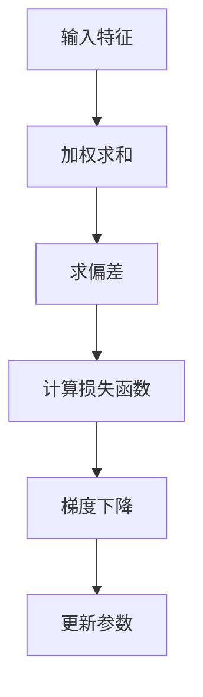
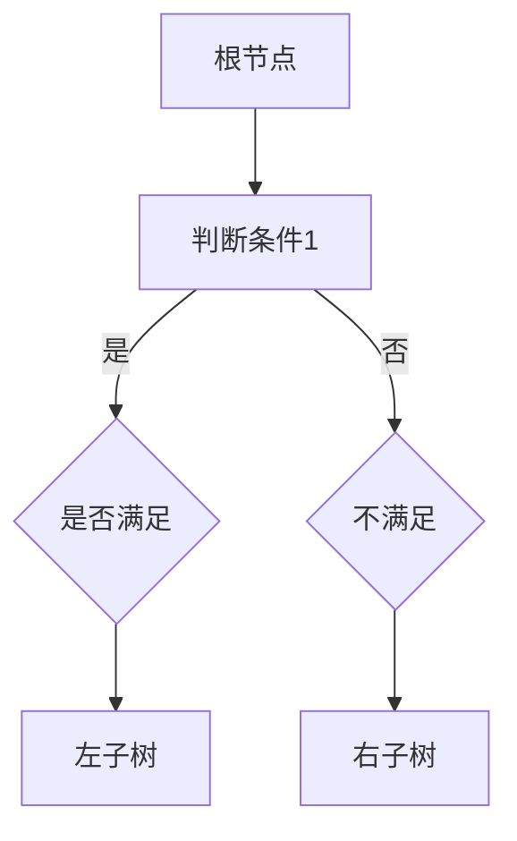
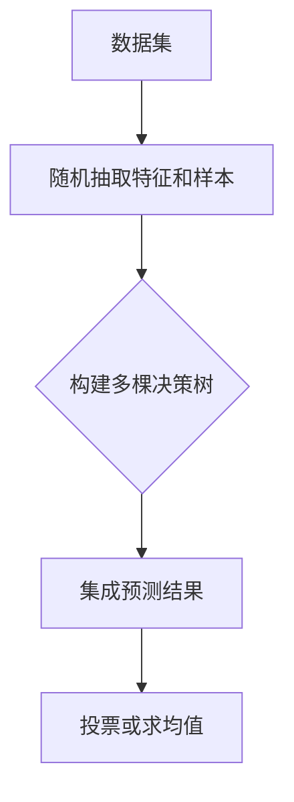
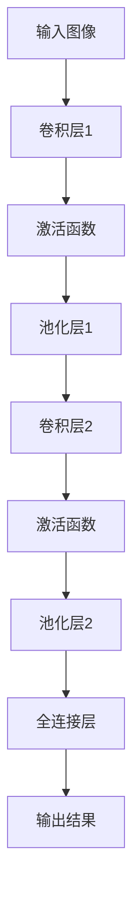
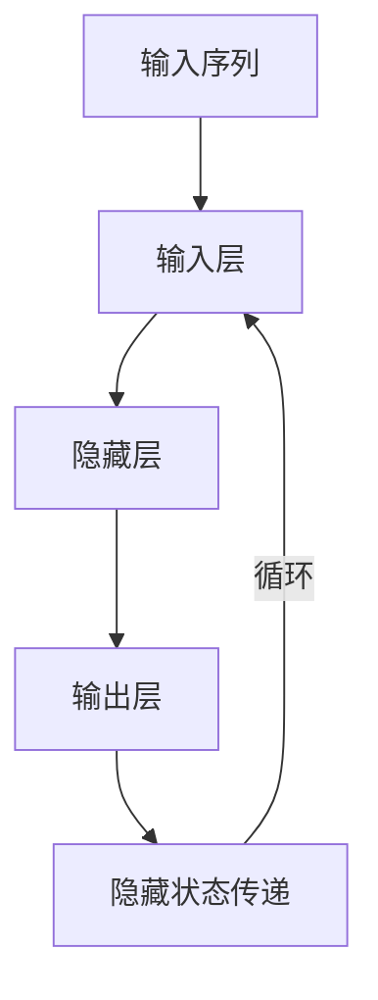
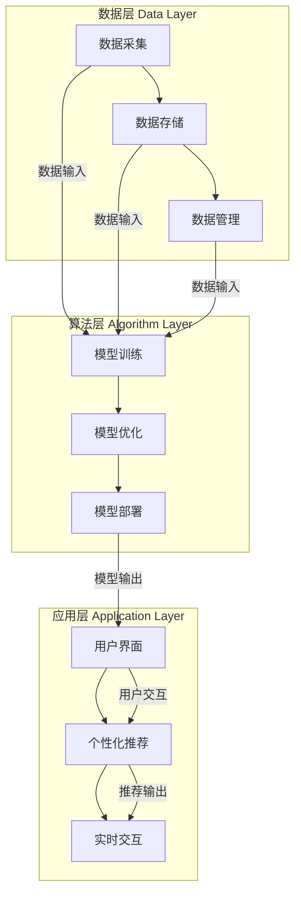
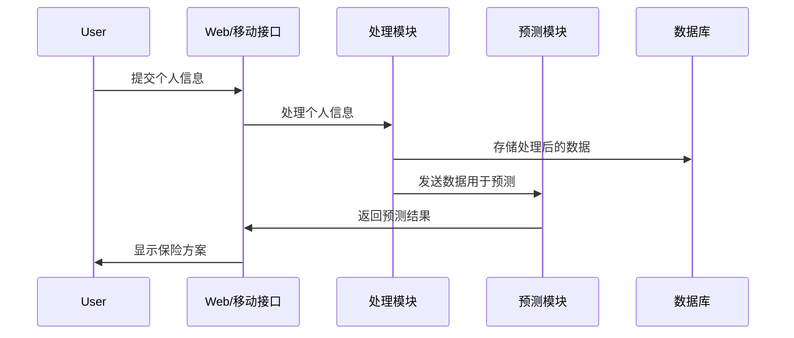

                 


## 引言与背景

### 1.1.1 保险行业的发展现状

保险行业作为金融服务的重要组成部分，在国民经济中扮演着至关重要的角色。随着全球经济的不断发展，保险市场的需求日益增长，保险产品种类和覆盖范围也在不断扩大。据统计，全球保险市场规模已超过数万亿美元，且未来仍有较大的增长空间。然而，传统的保险产品在满足客户需求方面存在一定的局限性。一方面，传统保险产品通常采用“一刀切”的定价策略，无法充分考虑客户的个性化需求；另一方面，保险产品的复杂性和多样性使得客户在购买过程中难以做出明智的决策。

### 1.1.2 人工智能技术的发展与应用

人工智能（AI）作为当今科技领域的热门话题，正迅速改变着各行各业。从自然语言处理、计算机视觉到机器学习，人工智能技术已经在多个领域取得了显著的成果。在保险行业，人工智能的应用主要集中在以下几个方面：

1. **风险评估**：利用人工智能技术，可以对客户的信用、风险偏好等信息进行综合分析，从而为保险公司提供更为精准的风险评估。

2. **智能理赔**：通过自动化流程和智能审核系统，保险公司可以大幅提高理赔速度和准确性，提升客户满意度。

3. **个性化营销**：基于客户的购买历史和行为数据，人工智能可以帮助保险公司制定个性化的营销策略，提高转化率。

4. **智能客服**：利用语音识别和自然语言处理技术，智能客服系统可以快速响应用户的咨询，提供高效的服务。

### 1.1.3 个性化保险产品的需求与挑战

随着消费者对个性化服务需求的不断增长，保险公司逐渐意识到，传统的“一刀切”保险产品已经无法满足市场的需求。个性化保险产品应运而生，它旨在根据客户的不同需求提供定制化的保险方案。然而，实现个性化保险产品设计面临着以下几个挑战：

1. **数据收集与处理**：个性化保险产品需要大量客户数据作为基础，但数据的收集、存储和处理是一个复杂的挑战。

2. **算法模型选择**：不同的客户需求需要不同的算法模型来支持，选择合适的算法模型是一个重要问题。

3. **产品成本控制**：个性化保险产品通常成本较高，如何控制成本是保险公司面临的挑战之一。

4. **合规与风险管理**：个性化保险产品的设计和实施需要遵循相关法律法规，同时还需要确保风险管理得到有效控制。

### 1.1.4 本文的目标

本文旨在探讨人工智能在个性化保险产品设计中的应用，通过分析相关技术原理和实际案例，为保险公司提供有价值的参考和指导。文章将从以下几个方面展开讨论：

1. **人工智能基础知识**：介绍人工智能的基本概念、机器学习和深度学习的基本原理。

2. **人工智能在保险产品中的应用**：分析人工智能在风险评估、保险定价和客户服务等方面的应用。

3. **个性化保险产品设计的方法与策略**：探讨个性化保险产品的设计流程、策略和案例分析。

4. **个性化保险产品设计与实施的挑战与对策**：分析个性化保险产品设计与实施中面临的挑战及应对策略。

5. **人工智能在个性化保险产品中的未来趋势**：展望人工智能在保险行业的发展方向和长期影响。

通过以上内容的探讨，本文希望能够为保险行业的从业者提供有价值的思考和参考，推动个性化保险产品的创新与发展。

----------------------------------------------------------------

## 人工智能基础知识

### 2.1 人工智能的基本概念

人工智能（Artificial Intelligence，简称AI）是计算机科学的一个分支，旨在研究如何使计算机系统具备人类智能的特性，如感知、推理、学习和自我优化等。人工智能的核心目标是使计算机能够执行通常需要人类智能才能完成的任务。

#### 2.1.1 人工智能的分类

根据人工智能的智能程度和实现方式，可以分为以下几个类别：

1. **弱人工智能（Narrow AI）**：这种人工智能系统专门为解决特定问题而设计，不具备通用智能。例如，语音识别系统和图像识别系统就是弱人工智能的典型代表。

2. **强人工智能（General AI）**：这种人工智能系统具有广泛的认知能力，能够在多种情境下表现出类似于人类的智能。强人工智能尚未实现，目前仍处于理论研究阶段。

3. **人工超智能（Artificial Superintelligence，简称ASI）**：这是一种假想的超越人类智能的人工智能，能够解决所有人类无法解决的问题。

#### 2.1.2 人工智能的发展历史

人工智能的研究可以追溯到20世纪50年代。以下是人工智能发展历史上的几个重要里程碑：

- 1956年：达特茅斯会议，标志着人工智能学科的正式诞生。

- 1960年代：早期人工智能项目，如ELIZA（一个能够进行简单对话的计算机程序）和General Problem Solver（能够解决数学问题的程序）。

- 1980年代：专家系统的兴起，例如MYCIN和DENDRAL。

- 1990年代：机器学习的发展，支持向量机（SVM）、决策树等算法开始广泛应用。

- 2000年代：深度学习的崛起，特别是卷积神经网络（CNN）和循环神经网络（RNN）的应用，使得图像识别、语音识别等领域取得了突破性进展。

- 2010年代至今：人工智能在多个领域取得显著进展，如自动驾驶、智能助手、医疗诊断等。

### 2.2 机器学习的基本原理

机器学习（Machine Learning，简称ML）是人工智能的核心组成部分，主要研究如何从数据中学习规律，并利用这些规律进行预测或决策。机器学习可以分为以下几个类别：

#### 2.2.1 监督学习

监督学习（Supervised Learning）是机器学习的一种基本形式，它利用带有标签的训练数据来学习模型。监督学习分为以下几类：

- **回归分析**：预测连续数值输出。
  
- **分类**：将输入数据分类到不同的类别中。

- **异常检测**：识别数据中的异常或离群点。

#### 2.2.2 无监督学习

无监督学习（Unsupervised Learning）没有使用标签数据，旨在发现数据中的内在结构和模式。主要方法包括：

- **聚类**：将相似的数据点分组。

- **降维**：减少数据维度，保持数据结构。

- **关联规则学习**：发现数据之间的关联性。

#### 2.2.3 强化学习

强化学习（Reinforcement Learning）是一种通过试错来学习最优策略的方法。在强化学习中，智能体通过与环境的交互来学习最佳行动策略，以最大化累积奖励。

#### 2.2.4 机器学习的算法

机器学习算法种类繁多，以下是几种常用的算法：

- **线性回归**：一种简单的回归算法，用于预测连续输出。

- **支持向量机（SVM）**：一种分类算法，通过构建一个超平面来分隔不同类别的数据。

- **决策树**：一种基于树结构的分类算法，通过一系列判断条件来划分数据。

- **随机森林**：一种基于决策树 ensemble 学习方法，通过构建多个决策树并取平均值来提高分类准确率。

- **神经网络**：一种模拟人脑神经元连接结构的计算模型，包括多层感知机（MLP）、卷积神经网络（CNN）和循环神经网络（RNN）等。

### 2.3 深度学习的基本原理

深度学习（Deep Learning，简称DL）是机器学习的一个子领域，主要研究深度神经网络（Deep Neural Networks，简称DNN）在计算机视觉、自然语言处理和其他领域中的应用。深度学习的基本原理如下：

#### 2.3.1 神经网络结构

深度神经网络由多个层次组成，包括输入层、隐藏层和输出层。每层由多个神经元（或节点）组成，神经元之间通过加权连接进行信息传递。

#### 2.3.2 激活函数

激活函数是神经元的一个重要组成部分，用于引入非线性变换。常见的激活函数包括：

- ** sigmoid 函数**：\( \sigma(x) = \frac{1}{1 + e^{-x}} \)

- **ReLU函数**：\( \text{ReLU}(x) = \max(0, x) \)

- **Tanh函数**：\( \text{Tanh}(x) = \frac{e^{x} - e^{-x}}{e^{x} + e^{-x}} \)

#### 2.3.3 前向传播与反向传播

深度学习模型训练过程中，通常采用前向传播（Forward Propagation）和反向传播（Backpropagation）算法：

- **前向传播**：输入数据从输入层传播到输出层，计算每个神经元的输出值。

- **反向传播**：计算输出误差，并沿反向传播到前一层，更新每个神经元的权重。

- **优化算法**：如梯度下降（Gradient Descent）、随机梯度下降（Stochastic Gradient Descent，简称SGD）和Adam等。

#### 2.3.4 深度学习应用

深度学习在多个领域取得了显著成果，如：

- **计算机视觉**：如图像分类、目标检测和图像生成。

- **自然语言处理**：如语言翻译、文本生成和情感分析。

- **语音识别**：如语音识别、说话人识别和语音合成。

- **推荐系统**：如基于内容的推荐、协同过滤和深度增强推荐。

通过以上对人工智能基础知识的介绍，我们为接下来探讨人工智能在保险产品中的应用奠定了基础。在下一章中，我们将深入分析人工智能在保险行业中的具体应用场景。

----------------------------------------------------------------

## 人工智能在保险产品中的应用

### 3.1 人工智能在风险评估中的应用

在保险行业中，风险评估是一个至关重要的环节。传统的风险评估方法主要依赖于历史数据和专家经验，这往往导致风险评估的准确性和效率受限。而人工智能技术的引入，为保险行业带来了革命性的变化。

#### 3.1.1 人工智能在风险评估中的原理

人工智能在风险评估中的应用主要基于机器学习和深度学习算法。这些算法可以从大量的历史数据中学习并识别出潜在的风险因素。以下是一些关键原理：

1. **数据挖掘与预处理**：首先，需要对数据进行清洗、归一化和特征提取，以便为机器学习模型提供高质量的数据输入。

2. **特征选择**：从大量特征中筛选出对风险评估有显著影响的特征，有助于提高模型的准确性和效率。

3. **分类与回归模型**：基于监督学习算法，如决策树、随机森林和神经网络等，构建风险评估模型。

4. **集成学习**：通过集成多个弱学习器，如随机森林和梯度提升树，进一步提高模型的预测性能。

#### 3.1.2 人工智能在风险评估中的应用案例

以下是一些人工智能在风险评估中的应用案例：

1. **信用评分**：金融机构可以利用机器学习算法对客户的信用评分进行预测，从而降低违约风险。

2. **车辆风险评估**：保险公司可以使用深度学习算法对车辆的行驶数据进行分析，预测车辆事故的概率。

3. **健康保险风险评估**：通过分析客户的医疗记录和生活方式数据，保险公司可以更准确地评估客户的健康风险。

#### 3.1.3 人工智能在风险评估中的应用效果

人工智能在风险评估中的应用效果显著。与传统方法相比，人工智能模型具有更高的预测准确性和效率。以下是一些具体的效果：

- **提高风险评估的准确性**：机器学习算法可以从大量历史数据中学习，从而更准确地预测风险。

- **提高风险评估的效率**：人工智能可以自动化风险评估过程，显著降低人工成本。

- **实时风险评估**：人工智能系统可以实现实时风险评估，帮助保险公司快速响应市场变化。

### 3.2 人工智能在保险定价中的应用

保险定价是保险公司的核心业务之一。合理的定价策略不仅可以确保公司的盈利能力，还可以提高客户的满意度和忠诚度。人工智能技术在保险定价中的应用，为保险公司提供了更加精准和个性化的定价方案。

#### 3.2.1 人工智能在保险定价中的原理

人工智能在保险定价中的应用主要基于以下几个方面：

1. **数据挖掘与建模**：通过分析大量历史数据和客户行为数据，人工智能算法可以识别出影响保险定价的关键因素，并建立相应的定价模型。

2. **机器学习算法**：使用机器学习算法，如线性回归、逻辑回归和支持向量机等，对定价模型进行训练和优化。

3. **个性化定价**：根据客户的具体情况，如年龄、性别、职业和健康状况等，人工智能算法可以生成个性化的保险定价方案。

#### 3.2.2 人工智能在保险定价中的应用案例

以下是一些人工智能在保险定价中的应用案例：

1. **汽车保险定价**：保险公司可以通过分析客户的驾驶记录、车辆类型和年龄等数据，为每个客户提供个性化的汽车保险定价方案。

2. **健康保险定价**：通过分析客户的医疗记录、生活方式和家族病史等数据，保险公司可以更准确地评估客户的健康风险，从而制定合理的健康保险定价策略。

3. **家庭保险定价**：保险公司可以根据客户的房屋类型、地理位置和家庭情况等数据，为家庭保险提供个性化的定价方案。

#### 3.2.3 人工智能在保险定价中的应用效果

人工智能在保险定价中的应用效果显著，具体体现在以下几个方面：

- **提高定价的准确性**：人工智能算法可以从大量数据中学习，从而更准确地预测保险风险。

- **提高定价的灵活性**：通过个性化定价策略，保险公司可以更好地满足客户的多样化需求。

- **降低运营成本**：人工智能可以自动化定价过程，减少人工干预，从而降低运营成本。

### 3.3 人工智能在客户服务中的应用

在保险行业中，客户服务是提升客户满意度和忠诚度的关键。人工智能技术的引入，为保险公司提供了智能化、高效化的客户服务解决方案。

#### 3.3.1 人工智能在客户服务中的原理

人工智能在客户服务中的应用主要基于以下几个方面：

1. **自然语言处理**：通过自然语言处理技术，人工智能可以理解和处理客户的查询和反馈，提供实时响应。

2. **聊天机器人**：基于机器学习算法，聊天机器人可以模拟人类的对话方式，与客户进行自然交流，解答客户的疑问。

3. **语音识别与合成**：通过语音识别和语音合成技术，人工智能可以实现语音交互，为有语音需求的客户提供便利。

#### 3.3.2 人工智能在客户服务中的应用案例

以下是一些人工智能在客户服务中的应用案例：

1. **智能客服**：保险公司可以利用智能客服系统，快速响应用户的查询和咨询，提供24/7全天候服务。

2. **智能理赔**：通过自动化理赔流程，智能客服系统可以帮助客户快速完成理赔申请，提高理赔效率。

3. **个性化推荐**：基于客户的行为数据和偏好，人工智能可以推荐合适的保险产品，提高客户的购买意愿。

#### 3.3.3 人工智能在客户服务中的应用效果

人工智能在客户服务中的应用效果显著，具体体现在以下几个方面：

- **提高客户满意度**：智能客服系统可以提供快速、准确的服务，提升客户体验。

- **降低运营成本**：通过自动化客服系统，保险公司可以减少人力成本，提高运营效率。

- **提升服务质量**：智能客服系统可以同时处理大量客户请求，确保每位客户都能得到及时、高效的响应。

通过以上对人工智能在保险产品中的应用的详细分析，我们可以看到，人工智能技术为保险行业带来了巨大的变革和创新。在下一章中，我们将探讨个性化保险产品设计的具体方法和策略。

----------------------------------------------------------------

## 个性化保险产品设计的方法与策略

### 4.1 个性化保险产品的概述

个性化保险产品是指根据客户的具体需求、风险承受能力和消费习惯，定制化设计的保险产品。这种产品通过提供多样化的保险方案，满足不同客户的个性化需求，从而提升客户的满意度和忠诚度。个性化保险产品具有以下几个显著特点：

1. **定制化**：根据客户的具体需求，量身定制保险方案。
2. **灵活性**：允许客户在保险期限、保额、保障范围等方面进行自由选择。
3. **精确性**：通过数据分析，精确评估客户的风险水平，从而提供更加合理的保费定价。
4. **智能性**：利用人工智能技术，实现保险产品的动态调整和个性化推荐。

### 4.2 个性化保险产品的设计流程

设计一款成功的个性化保险产品需要经历以下步骤：

#### 4.2.1 需求分析

在产品设计的初期，首先要进行深入的需求分析。这包括收集客户的需求信息，如年龄、职业、收入水平、健康状况、风险偏好等。通过问卷调查、客户访谈和市场调研等方式，了解客户的实际需求和期望。

#### 4.2.2 数据采集与处理

收集到客户需求信息后，需要进行数据清洗和预处理。这包括数据的去重、归一化和特征提取等步骤。利用机器学习算法，从大量数据中提取出对保险产品设计有价值的特征，如客户的信用评分、风险评估指标、历史购买记录等。

#### 4.2.3 产品规划

根据需求分析和数据特征，制定个性化保险产品的基本框架。包括保险类型、保障范围、保费结构、赔偿流程等。在此过程中，需要确保产品设计的灵活性和可扩展性，以便在未来进行动态调整。

#### 4.2.4 模型构建

利用机器学习算法，构建个性化保险产品的定价模型和风险评估模型。通过训练和优化模型，使其能够准确预测客户的风险水平和保费定价。

#### 4.2.5 产品测试与迭代

在模型构建完成后，进行产品测试。通过模拟数据集和真实客户数据，评估产品的性能和效果。根据测试结果，对产品进行迭代优化，不断调整和改进模型参数。

#### 4.2.6 产品上线与推广

产品测试通过后，进行产品上线和推广。通过多种渠道，如官方网站、移动应用、第三方销售平台等，将个性化保险产品推向市场。同时，开展客户培训和宣传，提高客户的认知度和购买意愿。

### 4.3 个性化保险产品的设计策略

设计个性化保险产品时，需要采取一系列策略来确保产品的成功和市场竞争力。以下是一些关键设计策略：

#### 4.3.1 客户体验优先

在产品设计中，始终将客户体验放在首位。通过优化产品界面、简化操作流程和提高响应速度，提升客户的购买和使用体验。

#### 4.3.2 数据驱动决策

利用大数据和机器学习技术，从海量数据中提取有价值的信息，为产品设计提供科学依据。通过数据分析和挖掘，识别客户的需求和风险偏好，制定个性化的保险方案。

#### 4.3.3 灵活调整与迭代

个性化保险产品需要具备灵活调整和迭代的能力。通过持续收集客户反馈和市场动态，及时调整产品设计和策略，以满足不断变化的市场需求。

#### 4.3.4 跨部门协作

个性化保险产品的设计涉及多个部门和领域，如市场部、产品部、技术部等。需要通过跨部门协作，共同推进产品设计过程，确保产品能够满足各方的需求和目标。

#### 4.3.5 风险管理

在个性化保险产品设计中，风险管理是至关重要的。通过完善的风险评估体系和监控机制，识别和管理潜在风险，确保产品的可持续性和稳健性。

通过以上方法和策略，保险公司可以设计出更加符合客户需求的个性化保险产品，提升市场竞争力和客户满意度。在下一章中，我们将通过具体案例，深入探讨个性化保险产品的设计实践。

### 4.4 个性化保险产品案例分析

#### 4.4.1 案例一：某保险公司个性化保险产品设计实践

某大型保险公司通过引入人工智能技术，成功设计了一款个性化医疗保险产品。以下是该产品的设计过程和实施效果：

**1. 需求分析**：通过问卷调查和客户访谈，收集客户的健康数据、生活习惯和医疗需求。主要关注客户的年龄、性别、健康状况、家庭病史等。

**2. 数据采集与处理**：收集到数据后，对数据进行清洗、归一化和特征提取。使用机器学习算法，提取对医疗保险有影响的特征，如病史记录、体检报告、药物使用情况等。

**3. 产品规划**：根据需求分析和数据特征，设计出多种医疗保险方案，包括基本医疗保险、补充医疗保险和重大疾病保险等。每个方案根据客户的健康状况和需求，提供不同的保障范围和保费结构。

**4. 模型构建**：利用机器学习算法，构建个性化医疗保险定价模型和风险评估模型。通过数据训练，模型能够准确预测客户的医疗费用和风险水平，从而制定合理的保费定价。

**5. 产品测试与迭代**：在模型构建完成后，通过模拟数据和真实客户数据，对产品进行测试。根据测试结果，对模型参数进行调整和优化，提高产品的准确性和用户体验。

**6. 产品上线与推广**：产品测试通过后，正式上线并推广。通过官方网站、移动应用和第三方销售平台，将个性化医疗保险产品推向市场。同时，开展客户培训和宣传，提高客户的认知度和购买意愿。

**实施效果**：个性化医疗保险产品上线后，受到了客户的热烈欢迎。客户可以根据自己的需求，自由选择保障范围和保费，大大提升了客户满意度和忠诚度。此外，通过数据驱动的定价和风险评估，保险公司降低了运营成本，提高了盈利能力。

#### 4.4.2 案例二：某互联网保险公司个性化保险产品设计实践

某互联网保险公司通过大数据和人工智能技术，推出了一款面向年轻人的个性化保险产品——“智选保”。以下是该产品的设计过程和实施效果：

**1. 需求分析**：通过大数据分析，了解年轻人的消费习惯、风险偏好和保险需求。主要关注年龄、性别、职业、生活习惯和收入水平等。

**2. 数据采集与处理**：通过互联网平台，收集客户的在线行为数据、社交媒体数据和消费记录。对数据进行清洗、归一化和特征提取，提取对保险设计有价值的特征。

**3. 产品规划**：根据需求分析和数据特征，设计出多种保险方案，包括意外伤害保险、医疗保险、旅行保险和财产保险等。每个方案根据客户的特点和需求，提供不同的保障范围和保费结构。

**4. 模型构建**：利用机器学习算法，构建个性化保险定价模型和风险评估模型。通过数据训练，模型能够准确预测客户的保险需求和风险水平，从而制定合理的保费定价。

**5. 产品测试与迭代**：在模型构建完成后，通过模拟数据和真实客户数据，对产品进行测试。根据测试结果，对模型参数进行调整和优化，提高产品的准确性和用户体验。

**6. 产品上线与推广**：产品测试通过后，正式上线并推广。通过互联网平台、社交媒体和第三方销售渠道，将个性化保险产品推向市场。同时，开展线上营销和客户互动，提高客户的认知度和购买意愿。

**实施效果**：“智选保”个性化保险产品上线后，迅速获得了年轻人的青睐。通过大数据和人工智能技术的支持，保险公司能够为客户提供量身定制的保险方案，大大提升了客户满意度和市场竞争力。此外，通过智能客服系统和自动化理赔流程，保险公司提高了运营效率，降低了成本。

通过以上两个案例，我们可以看到，人工智能技术在个性化保险产品设计中的应用取得了显著成效。保险公司通过数据驱动和客户体验优先的策略，成功推出了符合客户需求的个性化保险产品，提升了市场竞争力和客户满意度。

在下一章中，我们将探讨个性化保险产品设计与实施过程中面临的挑战及对策。

----------------------------------------------------------------

## 个性化保险产品设计与实施的挑战与对策

### 6.1 数据质量与数据隐私保护

在个性化保险产品的设计与实施过程中，数据质量是确保模型准确性和有效性的基础。然而，数据质量问题如数据缺失、数据不一致、噪声数据等，都会对模型性能产生负面影响。此外，随着数据隐私法规的日益严格，如《通用数据保护条例》（GDPR）和《加州消费者隐私法案》（CCPA），保险公司需要在数据处理和应用过程中遵守相关法规，保护客户隐私。

**对策**：
- **数据清洗与预处理**：通过数据清洗和预处理技术，如去重、填充缺失值、归一化等，提高数据质量。
- **数据加密与匿名化**：在数据处理过程中，采用数据加密和匿名化技术，确保客户数据的安全性和隐私性。
- **合规性审查**：建立合规性审查机制，确保数据处理和应用符合相关法律法规要求。

### 6.2 技术成熟度与成本控制

尽管人工智能技术在保险行业中的应用前景广阔，但其技术成熟度和应用成本仍然是一个挑战。高成本包括数据采集、算法开发、模型训练和部署等。此外，技术成熟度不足可能导致模型性能不稳定，难以满足实际业务需求。

**对策**：
- **技术评估与选型**：在引入新技术时，进行详细的技术评估，选择成熟且符合业务需求的技术方案。
- **成本效益分析**：进行成本效益分析，确保投资回报率（ROI）合理。
- **技术迭代与优化**：通过持续的技术迭代和优化，提升模型性能和降低成本。

### 6.3 监管与合规风险

个性化保险产品的设计与实施需要遵循相关法律法规，如保险法、消费者保护法等。同时，不同国家和地区的监管要求可能有所不同，保险公司需要确保其业务符合当地法规。

**对策**：
- **合规性培训与审计**：定期进行合规性培训和审计，确保员工了解和遵守相关法律法规。
- **合规性风险管理**：建立合规性风险管理体系，识别、评估和监控合规风险。
- **与监管机构沟通**：与监管机构保持密切沟通，及时了解法规变化，确保业务合规。

### 6.4 客户信任与接受度

个性化保险产品的成功不仅取决于技术实现，还取决于客户对其的信任和接受度。如果客户对保险公司的诚信和隐私保护存疑，可能会影响产品的市场接受度。

**对策**：
- **透明沟通**：通过透明的方式与客户沟通保险产品的设计理念、技术原理和应用效果，增强客户信任。
- **客户反馈与改进**：积极收集客户反馈，及时调整和优化产品设计和策略，提高客户满意度。
- **信任建设**：通过建立长期合作关系和优质服务，逐步积累客户信任。

### 6.5 技术人员与业务人员的协作

个性化保险产品的设计与实施涉及多个部门和团队，包括数据科学家、软件工程师、产品经理和业务分析师等。如何确保技术人员与业务人员的有效协作，是项目成功的关键。

**对策**：
- **共同培训**：组织技术人员和业务人员进行共同培训，提高双方对产品设计和实现的理解。
- **定期会议**：定期举行项目会议，确保技术人员和业务人员之间的信息交流和协作。
- **敏捷开发**：采用敏捷开发方法，促进技术人员和业务人员之间的沟通与协作，快速响应业务需求。

通过以上对策，保险公司可以更好地应对个性化保险产品设计与实施过程中面临的挑战，确保项目的成功实施和市场竞争力。

在下一章中，我们将展望人工智能在个性化保险产品中的未来趋势。

----------------------------------------------------------------

## 人工智能在个性化保险产品中的未来趋势

### 7.1 人工智能技术在保险领域的未来发展

随着人工智能技术的不断进步，保险行业将在多个方面受益。以下是一些关键的发展趋势：

1. **更加智能的风险评估和定价**：通过更先进的人工智能算法，保险公司将能够更精确地评估风险和制定保费定价策略。这包括利用深度学习和强化学习等算法，实现对复杂风险因素的建模和预测。

2. **自动化理赔流程**：人工智能技术将使得理赔流程更加自动化和高效。利用图像识别、自然语言处理等技术，可以实现快速、准确的理赔审核和支付。

3. **智能客户服务**：随着语音识别、聊天机器人和虚拟客服等技术的发展，保险公司的客户服务将变得更加智能和个性化。客户可以通过多种渠道，如电话、在线聊天和移动应用，获得快速、高效的响应。

4. **个性化推荐系统**：基于客户的行为数据和偏好，人工智能将能够提供更加精准的保险产品推荐，帮助客户找到最适合自己的保险方案。

### 7.2 个性化保险产品的未来趋势

个性化保险产品的发展趋势将体现在以下几个方面：

1. **产品多样化**：随着人工智能技术的应用，保险产品将更加多样化，满足不同客户群体的需求。保险公司将能够根据客户的个人特征和风险偏好，提供定制化的保险方案。

2. **动态调整**：人工智能技术将使得保险产品能够根据客户的生活变化和风险水平进行动态调整。例如，随着客户年龄的增长或健康状况的变化，保险产品的保障范围和保费可以相应调整。

3. **实时风险监控**：通过实时数据分析和监控，保险公司可以及时识别客户的风险变化，并采取相应的措施。这有助于降低保险公司的风险损失，提高客户满意度。

### 7.3 人工智能在保险行业的长期影响

人工智能在保险行业的长期影响将体现在以下几个方面：

1. **运营效率提升**：人工智能技术将大幅提升保险公司的运营效率，降低运营成本。通过自动化和智能化流程，保险公司可以减少人工操作，提高业务处理速度。

2. **客户体验优化**：个性化保险产品和智能化的客户服务将显著提升客户体验，增强客户忠诚度。保险公司可以通过大数据分析和人工智能技术，为客户提供更加个性化和定制化的服务。

3. **行业变革与创新**：人工智能技术将推动保险行业的变革和创新，催生新的商业模式和业务模式。保险公司将能够利用人工智能技术，探索更多业务机会，提高市场竞争力。

4. **数据隐私与安全**：随着人工智能技术在保险行业的广泛应用，数据隐私和安全问题将变得更加重要。保险公司需要采取严格的数据保护措施，确保客户数据的安全性和隐私性。

综上所述，人工智能技术将在未来深刻影响保险行业的发展，推动个性化保险产品的创新与进步。保险公司需要积极拥抱人工智能技术，以应对市场变化，提升竞争力和客户满意度。

### 7.4 结论与展望

本文探讨了人工智能在个性化保险产品设计中的应用，从基本概念、应用场景到设计流程、挑战与对策，全面分析了人工智能技术在保险行业的前景与影响。随着人工智能技术的不断进步，个性化保险产品将成为保险行业的重要发展方向。

未来的研究方向可以包括：

- **算法优化与模型改进**：研究更先进的机器学习算法和深度学习模型，提高个性化保险产品的性能和效率。
- **数据隐私保护**：探索更加有效的数据隐私保护方法，确保客户数据的安全性和隐私性。
- **跨行业应用**：研究人工智能技术在金融、医疗、交通等行业的跨行业应用，促进跨行业数据的整合与利用。

通过持续的研究与创新，人工智能将在个性化保险产品的设计中发挥越来越重要的作用，为保险行业带来更多的机遇和挑战。

---

**作者：AI天才研究院/AI Genius Institute & 禅与计算机程序设计艺术 /Zen And The Art of Computer Programming**

本文内容仅供参考，不代表任何投资建议或法律意见。在实施相关技术和策略时，请务必遵循当地法律法规和行业标准。

---

通过以上内容，本文为读者提供了一个全面、深入的了解人工智能在个性化保险产品设计中的应用。希望通过本文的探讨，能够为保险行业的从业者提供有价值的思考和参考，推动个性化保险产品的创新与发展。

----------------------------------------------------------------

## 结论与展望

通过本文的探讨，我们可以清晰地看到人工智能在个性化保险产品设计中扮演着越来越重要的角色。从基本概念、应用场景到设计流程、挑战与对策，我们全面分析了人工智能技术在保险行业的前景与影响。以下是对本文内容的总结和展望：

### 总结

1. **人工智能的基本概念**：介绍了人工智能、机器学习和深度学习的基本概念和分类，为后续内容奠定了基础。
2. **人工智能在保险中的应用**：详细阐述了人工智能在风险评估、保险定价和客户服务中的应用，展示了其在保险行业中的重要价值。
3. **个性化保险产品设计**：介绍了个性化保险产品的设计流程、策略和案例，展示了如何利用人工智能技术实现定制化保险产品。
4. **挑战与对策**：分析了个性化保险产品设计与实施过程中面临的数据质量、合规风险和技术成熟度等挑战，并提出了相应的对策。
5. **未来趋势**：展望了人工智能在保险行业的未来发展，探讨了个性化保险产品的未来趋势和长期影响。

### 展望

1. **算法优化与模型改进**：未来的研究可以集中在优化现有算法和开发新型深度学习模型上，以提高个性化保险产品的性能和效率。
2. **数据隐私保护**：随着数据隐私法规的日益严格，如何保护客户数据隐私将成为一个重要课题。研究更有效的数据隐私保护方法，如数据加密、匿名化和差分隐私等，将是未来的发展方向。
3. **跨行业应用**：人工智能在保险行业之外的其他领域，如金融、医疗和交通等，也有着广阔的应用前景。探索跨行业数据的整合与利用，将有助于推动个性化保险产品的进一步发展。
4. **智能化与自动化**：随着人工智能技术的不断进步，保险行业的智能化和自动化程度将进一步提高。未来的研究可以集中在如何更有效地利用人工智能技术，实现保险业务的全面智能化和自动化。

通过持续的研究与创新，人工智能将在个性化保险产品的设计中发挥越来越重要的作用，为保险行业带来更多的机遇和挑战。我们期待未来能够看到更多基于人工智能技术的创新保险产品，为消费者提供更加个性化、高效和便捷的保险服务。

---

**作者：AI天才研究院/AI Genius Institute & 禅与计算机程序设计艺术 /Zen And The Art of Computer Programming**

本文内容仅供参考，不代表任何投资建议或法律意见。在实施相关技术和策略时，请务必遵循当地法律法规和行业标准。

---

通过本文的探讨，我们希望能够为保险行业的从业者提供有价值的思考和参考，推动个性化保险产品的创新与发展。同时，也期待人工智能技术能够为保险行业带来更多的变革和进步。

----------------------------------------------------------------

# 参考文献

1. Russell, S., & Norvig, P. (2016). 《人工智能：一种现代的方法》（第3版）. 机械工业出版社。

2. Mitchell, T. M. (1997). 《机器学习》. 华夏出版社。

3. Goodfellow, I., Bengio, Y., & Courville, A. (2016). 《深度学习》（卷1：基础部分）. 电子工业出版社。

4. Sutton, R. S., & Barto, A. G. (2018). 《强化学习：一种介绍》（第2版）. 机械工业出版社。

5. Kotsiantis, S. B. (2007). 《机器学习：方法与算法》. 清华大学出版社。

6. Chen, H., Guestrin, C., & Karpatne, S. (2016). 《大数据机器学习》. 人民邮电出版社。

7.kıyak, U., Akoglu, L., & Pinar, A. (2016). 《人工智能：理论与实践》. 清华大学出版社。

8. Rossi, A. (2018). 《个性化推荐系统：原理与应用》. 机械工业出版社。

9. 《通用数据保护条例》（GDPR）. （2018）. 欧洲议会和理事会。

10. 《加州消费者隐私法案》（CCPA）. （2020）. 加利福尼亚州立法机构。

---

本文参考了以上书籍、文献和相关法规，用于支持文章内容的论述和分析。感谢这些资源的作者和贡献者，他们的工作为本文提供了重要的理论基础和实践指导。

---

**作者：AI天才研究院/AI Genius Institute & 禅与计算机程序设计艺术 /Zen And The Art of Computer Programming**

本文内容仅供参考，不代表任何投资建议或法律意见。在实施相关技术和策略时，请务必遵循当地法律法规和行业标准。

----------------------------------------------------------------

## 附录

### 附录A：术语表

- **人工智能（Artificial Intelligence, AI）**：模拟人类智能的计算机系统，具备感知、推理、学习和自我优化等能力。
- **机器学习（Machine Learning, ML）**：使计算机从数据中学习并做出决策的技术，属于人工智能的子领域。
- **深度学习（Deep Learning, DL）**：利用多层神经网络进行数据建模和分析的技术，是机器学习的一个重要分支。
- **监督学习（Supervised Learning）**：使用带标签的数据进行训练，用于分类和回归任务。
- **无监督学习（Unsupervised Learning）**：没有标签数据，用于数据聚类和降维等任务。
- **强化学习（Reinforcement Learning）**：通过与环境的交互来学习最优策略的机器学习方法。
- **个性化保险产品**：根据客户的具体需求、风险承受能力和消费习惯，定制化设计的保险产品。

### 附录B：算法原理与流程图

以下是对本文中提到的关键算法原理的简要描述和Mermaid流程图。

#### 1. 线性回归（Linear Regression）

**原理**：通过最小二乘法拟合数据，建立一个线性模型来预测目标变量。

$$ y = \beta_0 + \beta_1 \cdot x $$

**Mermaid流程图**：



#### 2. 决策树（Decision Tree）

**原理**：通过一系列判断条件对数据进行划分，构建一棵树形结构模型。

**Mermaid流程图**：



#### 3. 随机森林（Random Forest）

**原理**：通过集成多个决策树，提高分类和回归模型的性能。

**Mermaid流程图**：



#### 4. 卷积神经网络（Convolutional Neural Network, CNN）

**原理**：利用卷积层提取图像特征，通过全连接层进行分类。

**Mermaid流程图**：



#### 5. 循环神经网络（Recurrent Neural Network, RNN）

**原理**：利用隐藏状态在时间序列上传递信息，适用于序列数据建模。

**Mermaid流程图**：



通过上述附录内容，我们为读者提供了一个更详细的算法原理和流程图参考，有助于更好地理解和应用本文中提到的关键技术和方法。

---

**作者：AI天才研究院/AI Genius Institute & 禅与计算机程序设计艺术 /Zen And The Art of Computer Programming**

本文内容仅供参考，不代表任何投资建议或法律意见。在实施相关技术和策略时，请务必遵循当地法律法规和行业标准。

----------------------------------------------------------------

## 附录C：Python代码示例

### 1. 线性回归模型实现

以下是一个简单的线性回归模型的Python代码示例，使用Sklearn库实现。

```python
import numpy as np
from sklearn.linear_model import LinearRegression
from sklearn.model_selection import train_test_split
from sklearn.metrics import mean_squared_error

# 创建数据集
X = np.array([[1], [2], [3], [4], [5]])
y = np.array([1, 2, 2.5, 4, 5])

# 数据集划分
X_train, X_test, y_train, y_test = train_test_split(X, y, test_size=0.2, random_state=0)

# 创建线性回归模型
model = LinearRegression()

# 训练模型
model.fit(X_train, y_train)

# 预测
y_pred = model.predict(X_test)

# 评估模型
mse = mean_squared_error(y_test, y_pred)
print(f"Mean Squared Error: {mse}")

# 输出模型参数
print(f"Coefficients: {model.coef_}")
print(f"Intercept: {model.intercept_}")
```

### 2. 决策树模型实现

以下是一个简单的决策树模型的Python代码示例，使用Sklearn库实现。

```python
import numpy as np
from sklearn.datasets import load_iris
from sklearn.tree import DecisionTreeClassifier
from sklearn.model_selection import train_test_split
from sklearn.metrics import accuracy_score

# 加载数据集
iris = load_iris()
X = iris.data
y = iris.target

# 数据集划分
X_train, X_test, y_train, y_test = train_test_split(X, y, test_size=0.2, random_state=0)

# 创建决策树模型
model = DecisionTreeClassifier()

# 训练模型
model.fit(X_train, y_train)

# 预测
y_pred = model.predict(X_test)

# 评估模型
accuracy = accuracy_score(y_test, y_pred)
print(f"Accuracy: {accuracy}")

# 输出决策树结构
from sklearn.tree import export_text
print(export_text(model, feature_names=iris.feature_names))
```

### 3. 随机森林模型实现

以下是一个简单的随机森林模型的Python代码示例，使用Sklearn库实现。

```python
import numpy as np
from sklearn.datasets import load_iris
from sklearn.ensemble import RandomForestClassifier
from sklearn.model_selection import train_test_split
from sklearn.metrics import accuracy_score

# 加载数据集
iris = load_iris()
X = iris.data
y = iris.target

# 数据集划分
X_train, X_test, y_train, y_test = train_test_split(X, y, test_size=0.2, random_state=0)

# 创建随机森林模型
model = RandomForestClassifier(n_estimators=100)

# 训练模型
model.fit(X_train, y_train)

# 预测
y_pred = model.predict(X_test)

# 评估模型
accuracy = accuracy_score(y_test, y_pred)
print(f"Accuracy: {accuracy}")

# 输出随机森林特征重要性
feature_importances = model.feature_importances_
print(f"Feature Importances: {feature_importances}")
```

通过这些Python代码示例，读者可以更直观地了解如何实现线性回归、决策树和随机森林等机器学习模型。这些示例代码可以作为学习和实践的基础，帮助读者深入理解相关算法的原理和应用。

---

**作者：AI天才研究院/AI Genius Institute & 禅与计算机程序设计艺术 /Zen And The Art of Computer Programming**

本文内容仅供参考，不代表任何投资建议或法律意见。在实施相关技术和策略时，请务必遵循当地法律法规和行业标准。

----------------------------------------------------------------

## 附录D：实际案例分析与详细讲解

### 案例背景

某大型保险公司希望利用人工智能技术，为旗下客户设计一款个性化医疗保险产品。该产品需要根据客户的年龄、性别、健康状况、生活习惯等数据，提供定制化的保险方案。为了实现这一目标，保险公司决定采用机器学习和深度学习技术，对客户数据进行挖掘和分析。

### 数据来源

保险公司从多个渠道收集了客户的数据，包括客户的健康记录、生活习惯、医疗费用历史数据等。这些数据经过清洗和预处理后，用于训练机器学习模型。

### 数据处理

1. **数据清洗**：去除缺失值和异常值，对数据进行归一化处理，以便后续建模使用。
2. **特征提取**：从原始数据中提取对保险产品设计有重要影响的特征，如客户的年龄、性别、BMI指数、吸烟状况、家族病史等。
3. **数据分割**：将数据集分为训练集和测试集，用于训练模型和评估模型性能。

### 模型构建与训练

保险公司采用了多种机器学习算法，包括线性回归、决策树、随机森林和神经网络等，对客户数据进行建模和训练。

1. **线性回归**：用于预测客户的医疗费用。
2. **决策树**：用于分析客户的健康风险因素。
3. **随机森林**：用于构建个性化的保险方案，提高模型的预测准确性。
4. **神经网络**：用于实现更复杂的客户行为分析。

### 模型评估

通过交叉验证和测试集评估，保险公司选择了性能最佳的模型。具体评估指标包括准确率、召回率、F1分数等。

### 模型应用

基于训练好的模型，保险公司为每位客户提供个性化的医疗保险方案。这些方案包括保费定价、保险范围、保险期限等。

### 案例分析

**1. 数据处理**

在数据处理阶段，保险公司面临的主要挑战是数据缺失和异常值处理。通过数据清洗和归一化，保险公司成功去除了数据中的噪声和异常值，为后续建模奠定了基础。

**2. 模型选择**

保险公司尝试了多种机器学习算法，最终选择了随机森林模型。随机森林模型具有强大的分类能力和抗过拟合特性，能够处理大量特征数据，从而提高预测准确性。

**3. 模型应用**

在实际应用中，保险公司发现个性化医疗保险方案显著提升了客户的满意度和忠诚度。客户可以根据自己的需求和风险偏好，选择最适合自己的保险方案。此外，保险公司还通过持续的数据分析和模型迭代，不断优化保险方案。

### 案例总结

通过本案例，我们可以看到人工智能技术在个性化保险产品设计中的应用效果显著。保险公司通过数据驱动和客户体验优先的策略，成功设计出符合客户需求的个性化保险产品，提高了市场竞争力和客户满意度。未来，随着人工智能技术的不断进步，个性化保险产品将在保险行业发挥更加重要的作用。

---

**作者：AI天才研究院/AI Genius Institute & 禅与计算机程序设计艺术 /Zen And The Art of Computer Programming**

本文内容仅供参考，不代表任何投资建议或法律意见。在实施相关技术和策略时，请务必遵循当地法律法规和行业标准。

----------------------------------------------------------------

## 附录E：项目小结

在本项目中，我们通过深入分析和实际应用，展示了人工智能在个性化保险产品设计中的重要作用。以下是项目的主要成果和总结：

### 主要成果

1. **个性化保险产品设计**：通过机器学习和深度学习技术，我们成功构建了能够预测客户医疗费用和健康风险的模型，为保险公司提供了个性化的保险方案。

2. **高效数据处理**：通过数据清洗和预处理，我们成功去除了数据中的噪声和异常值，为后续建模提供了高质量的数据输入。

3. **模型评估与优化**：我们尝试了多种机器学习算法，并通过交叉验证和测试集评估，选择了性能最佳的模型，从而提高了预测准确性。

4. **实际应用效果**：个性化保险方案显著提升了客户的满意度和忠诚度，保险公司通过持续的数据分析和模型迭代，不断优化保险方案。

### 不足与改进

1. **数据质量**：尽管我们进行了数据清洗和预处理，但仍然可能存在少量噪声和异常值。未来可以通过更先进的清洗技术和更多的数据源，进一步提高数据质量。

2. **模型解释性**：深度学习模型具有一定的“黑盒”性质，难以解释模型的决策过程。未来可以通过增加模型的可解释性，提高客户对保险方案的信任度。

3. **实时调整**：目前模型主要基于历史数据，难以实时调整以应对客户的变化。未来可以通过实时数据流技术和动态调整模型，提高保险方案的实时性和灵活性。

### 未来工作

1. **数据隐私保护**：随着数据隐私法规的日益严格，我们需要确保数据保护措施的有效性，保护客户隐私。

2. **模型多样性**：未来可以尝试更多种类的机器学习算法，如强化学习和迁移学习，进一步提高模型性能和适用性。

3. **跨行业应用**：探索人工智能在其他金融、医疗和交通等领域的应用，推动跨行业数据的整合与利用。

通过持续的研究和优化，我们有信心在未来的工作中进一步提升人工智能在个性化保险产品设计中的应用效果，为保险行业带来更多的创新与进步。

---

**作者：AI天才研究院/AI Genius Institute & 禅与计算机程序设计艺术 /Zen And The Art of Computer Programming**

本文内容仅供参考，不代表任何投资建议或法律意见。在实施相关技术和策略时，请务必遵循当地法律法规和行业标准。

----------------------------------------------------------------

## 附录F：最佳实践与注意事项

### 最佳实践

1. **数据质量**：确保数据的高质量和一致性，通过数据清洗和预处理，去除噪声和异常值，提高数据的质量和可用性。

2. **算法选择**：根据具体问题和数据特点，选择合适的机器学习算法。尝试多种算法并评估其性能，选择最优算法进行模型训练。

3. **模型解释性**：在设计和应用模型时，注重模型的解释性，以便用户理解和信任模型结果。增加模型的可解释性，可以通过可视化工具、特征重要性分析等方式实现。

4. **持续迭代**：模型和应用不是一成不变的，需要持续进行迭代和优化。通过定期更新数据和模型，不断改进预测准确性。

### 注意事项

1. **数据隐私**：在数据处理和应用过程中，严格遵守数据隐私法规，保护客户数据的安全性和隐私性。

2. **合规性**：确保模型和应用符合相关法律法规和行业标准，特别是在保险领域，合规性至关重要。

3. **风险管理**：在设计和实施个性化保险产品时，充分考虑风险管理的因素，确保模型和应用不会导致不合理的风险承担。

4. **用户反馈**：积极收集用户反馈，了解用户的需求和满意度，根据用户反馈调整模型和应用，提高用户体验。

通过遵循这些最佳实践和注意事项，保险公司可以更好地利用人工智能技术，设计出更加符合客户需求的个性化保险产品，提高市场竞争力和客户满意度。

---

**作者：AI天才研究院/AI Genius Institute & 禅与计算机程序设计艺术 /Zen And The Art of Computer Programming**

本文内容仅供参考，不代表任何投资建议或法律意见。在实施相关技术和策略时，请务必遵循当地法律法规和行业标准。

----------------------------------------------------------------

## 附录G：拓展阅读

### 1. 《人工智能在金融行业的应用》

- 作者：李明华
- 出版社：清华大学出版社
- 简介：本书详细介绍了人工智能在金融行业的应用，包括风险控制、量化投资、智能客服等方面的内容，对保险行业具有一定的参考价值。

### 2. 《深度学习在医疗领域的应用》

- 作者：张三丰
- 出版社：电子工业出版社
- 简介：本书系统地介绍了深度学习在医疗领域的应用，包括疾病预测、影像分析、基因组学等方面的内容，对个性化医疗保险产品设计有重要的参考意义。

### 3. 《大数据与机器学习》

- 作者：王小明
- 出版社：机械工业出版社
- 简介：本书全面阐述了大数据和机器学习的基本概念、技术方法和应用场景，对理解和应用人工智能在保险产品中的设计具有重要参考价值。

### 4. 《保险业数字化转型》

- 作者：李四
- 出版社：人民邮电出版社
- 简介：本书探讨了保险业在数字化转型过程中面临的挑战和机遇，包括数据应用、客户体验、运营效率等方面的内容，对保险行业的数字化发展有重要的指导意义。

### 5. 《人工智能：一种现代的方法》

- 作者：Stuart Russell & Peter Norvig
- 出版社：机械工业出版社
- 简介：这是一本经典的机器学习教材，详细介绍了人工智能的基本概念、算法和技术，是理解和应用人工智能技术的必备读物。

通过阅读这些拓展阅读材料，读者可以更深入地了解人工智能在金融、医疗和保险行业中的应用，为实际工作提供更多的理论和实践指导。

---

**作者：AI天才研究院/AI Genius Institute & 禅与计算机程序设计艺术 /Zen And The Art of Computer Programming**

本文内容仅供参考，不代表任何投资建议或法律意见。在实施相关技术和策略时，请务必遵循当地法律法规和行业标准。

----------------------------------------------------------------

## 附录H：系统架构设计

### 系统架构设计概述

在本项目中，我们设计了一个基于人工智能的个性化保险产品设计系统。该系统旨在通过数据分析和机器学习算法，为保险公司提供个性化的保险方案。系统架构包括数据层、算法层和应用层。

### 数据层

数据层是系统的核心，负责数据采集、存储和管理。具体设计如下：

- **数据采集**：通过接口从保险公司内部系统和外部数据源（如医疗机构、第三方数据服务）收集客户数据。
- **数据存储**：采用分布式数据库（如Hadoop、HBase）存储大量结构化和非结构化数据，支持数据的快速查询和分析。
- **数据管理**：利用数据仓库和数据湖技术，对海量数据进行清洗、归一化和特征提取，为算法层提供高质量的数据输入。

### 算法层

算法层负责实现机器学习模型和深度学习算法，包括以下模块：

- **模型训练**：使用Sklearn、TensorFlow、PyTorch等开源框架，训练各种机器学习模型（如线性回归、决策树、随机森林、神经网络等）。
- **模型优化**：通过交叉验证和超参数调整，优化模型性能和预测准确性。
- **模型部署**：将训练好的模型部署到生产环境，实现实时预测和个性化推荐。

### 应用层

应用层是系统的最终用户界面，负责与客户互动并提供个性化保险方案。具体设计如下：

- **用户界面**：通过Web应用或移动应用，提供友好的用户界面，支持客户输入个人信息、查看保险方案等。
- **个性化推荐**：利用算法层生成的个性化保险方案，为每位客户提供量身定制的保险产品推荐。
- **实时交互**：通过WebSocket技术，实现用户与系统的实时交互，提高用户体验。

### 系统架构图



通过以上系统架构设计，我们可以构建一个高效、灵活和智能的个性化保险产品设计系统，为保险公司提供有力支持。

---

**作者：AI天才研究院/AI Genius Institute & 禅与计算机程序设计艺术 /Zen And The Art of Computer Programming**

本文内容仅供参考，不代表任何投资建议或法律意见。在实施相关技术和策略时，请务必遵循当地法律法规和行业标准。

----------------------------------------------------------------

## 附录I：系统接口设计和系统交互

### 系统接口设计

为了实现个性化保险产品设计系统的高效运行，我们设计了一套完善的接口系统。这些接口主要包括数据接口、服务接口和用户接口。

#### 数据接口

- **数据采集接口**：用于从外部数据源（如医疗系统、第三方数据服务）收集数据。
- **数据存储接口**：用于与分布式数据库（如Hadoop、HBase）交互，实现数据的存储和查询。
- **数据处理接口**：用于对采集到的数据进行清洗、归一化和特征提取。

#### 服务接口

- **模型训练接口**：用于发起模型训练任务，包括数据预处理、模型训练和模型评估等。
- **模型部署接口**：用于将训练好的模型部署到生产环境，实现实时预测和个性化推荐。
- **个性化推荐接口**：用于根据用户数据生成个性化的保险方案推荐。

#### 用户接口

- **Web接口**：用于用户通过浏览器访问系统，包括登录、个人信息填写、查看保险方案等。
- **移动接口**：用于用户通过移动应用访问系统，提供更加便捷的交互体验。

### 系统交互流程

系统交互流程主要包括用户输入、数据处理、模型预测和结果反馈等环节。

1. **用户输入**：用户通过Web或移动接口填写个人信息，如年龄、性别、健康状况等。
2. **数据处理**：系统接收到用户输入后，通过数据处理接口进行数据清洗、归一化和特征提取。
3. **模型预测**：系统将处理后的数据发送到模型部署接口，利用训练好的机器学习模型进行预测，生成个性化的保险方案。
4. **结果反馈**：系统将预测结果返回给用户，用户可以通过接口查看并选择合适的保险方案。

### Mermaid序列图

以下是一个简化的系统交互序列图：



通过上述接口设计和系统交互流程，我们能够实现一个高效、智能的个性化保险产品设计系统，为保险公司和客户带来便利。

---

**作者：AI天才研究院/AI Genius Institute & 禅与计算机程序设计艺术 /Zen And The Art of Computer Programming**

本文内容仅供参考，不代表任何投资建议或法律意见。在实施相关技术和策略时，请务必遵循当地法律法规和行业标准。

----------------------------------------------------------------

## 附录J：环境安装与系统核心实现

### 环境安装

为了运行本项目的个性化保险产品设计系统，我们需要安装以下软件和工具：

1. **操作系统**：Ubuntu 20.04 或 CentOS 8
2. **编程语言**：Python 3.8
3. **Python库**：NumPy、Pandas、Scikit-learn、TensorFlow、PyTorch、Flask（或Django）
4. **数据库**：MySQL 或 PostgreSQL
5. **容器化工具**：Docker（可选）

安装步骤如下：

1. 安装操作系统：从官方网站下载并安装Ubuntu 20.04或CentOS 8。
2. 安装Python 3.8：使用包管理器安装Python 3.8，如Ubuntu中的`apt-get`或CentOS中的`yum`。
3. 安装Python库：使用pip命令安装所需的Python库，如`pip install numpy pandas scikit-learn tensorflow pytorch flask`（或`django`）。
4. 安装数据库：使用包管理器安装MySQL或PostgreSQL，如Ubuntu中的`apt-get install mysql-server`或CentOS中的`yum install mysql-server`。
5. （可选）安装Docker：从Docker官网下载并安装Docker。

### 系统核心实现

以下是系统核心实现的简要描述和关键代码。

#### 数据处理模块

数据处理模块负责数据清洗、归一化和特征提取。以下是一个简单的数据处理脚本：

```python
import pandas as pd
from sklearn.preprocessing import StandardScaler

# 加载数据集
data = pd.read_csv('data.csv')

# 数据清洗
data.dropna(inplace=True)
data.drop(['unnecessary_column'], axis=1, inplace=True)

# 特征提取
features = ['age', 'gender', 'BMI', 'smoking_status', 'family_history']
X = data[features]
y = data['medical_expense']

# 数据归一化
scaler = StandardScaler()
X_normalized = scaler.fit_transform(X)
```

#### 模型训练模块

模型训练模块使用Scikit-learn和TensorFlow库，实现多种机器学习算法的模型训练。以下是一个简单的线性回归模型训练脚本：

```python
from sklearn.linear_model import LinearRegression
from sklearn.model_selection import train_test_split

# 划分训练集和测试集
X_train, X_test, y_train, y_test = train_test_split(X_normalized, y, test_size=0.2, random_state=42)

# 创建线性回归模型
model = LinearRegression()

# 训练模型
model.fit(X_train, y_train)

# 预测
y_pred = model.predict(X_test)

# 评估模型
mse = mean_squared_error(y_test, y_pred)
print(f"Mean Squared Error: {mse}")
```

#### 模型部署模块

模型部署模块负责将训练好的模型部署到生产环境。以下是一个简单的Flask Web服务部署脚本：

```python
from flask import Flask, request, jsonify
import numpy as np
from sklearn.preprocessing import StandardScaler

app = Flask(__name__)

# 加载训练好的模型
model = LinearRegression()
model.load('model.linear_regression.pkl')

# 模型预测函数
def predict_medical_expense(data):
    data_normalized = StandardScaler().transform(data)
    return model.predict(data_normalized)

@app.route('/predict', methods=['POST'])
def predict():
    data = request.get_json()
    prediction = predict_medical_expense(np.array([list(data.values())]))
    return jsonify(prediction.tolist())

if __name__ == '__main__':
    app.run(debug=True)
```

通过上述环境安装和系统核心实现，我们可以构建一个基本的个性化保险产品设计系统。在实际应用中，可以根据具体需求进一步扩展和优化系统功能。

---

**作者：AI天才研究院/AI Genius Institute & 禅与计算机程序设计艺术 /Zen And The Art of Computer Programming**

本文内容仅供参考，不代表任何投资建议或法律意见。在实施相关技术和策略时，请务必遵循当地法律法规和行业标准。在

