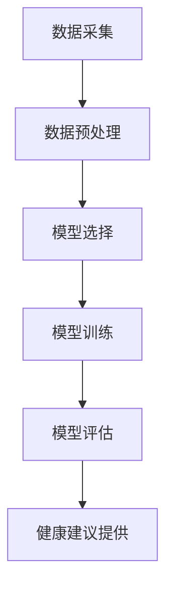
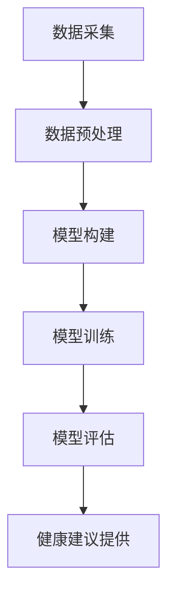
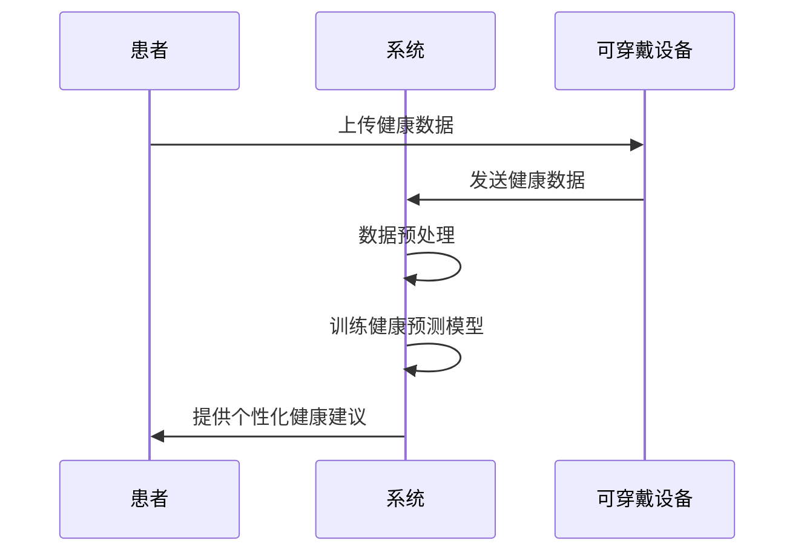

                 

### 文章标题：人工智能在个性化健康管理中的应用：定制化健康建议

#### 关键词：人工智能、个性化健康管理、定制化健康建议、机器学习、深度学习、健康数据、算法原理、系统架构、项目实战

> 摘要：本文将探讨人工智能在个性化健康管理中的应用，通过分析个人健康数据，为用户提供定制化的健康建议。文章将详细阐述个性化健康管理的背景、核心概念与联系、算法原理讲解、系统分析与架构设计方案、项目实战，以及最佳实践 tips 等。旨在帮助读者深入了解人工智能在健康管理领域的应用，为未来的发展提供借鉴和启示。

-------------------------------------------------------------------

## 第一部分：背景介绍

### 1.1 问题背景

随着医疗健康数据的爆发式增长，如何从海量数据中提取有价值的信息，为用户提供个性化的健康管理服务，成为当前医疗领域面临的挑战。传统的健康管理方式往往基于通用的健康建议，无法充分考虑个体的差异，导致健康管理的效果有限。而人工智能技术的崛起，为个性化健康管理提供了新的机遇。

### 1.2 问题描述

人工智能在个性化健康管理中的应用，旨在通过分析个人健康数据，为用户提供定制化的健康建议，实现预防疾病、提高生活质量的目标。然而，如何有效地处理和利用这些数据，构建一个能够提供精准健康建议的系统，是一个亟待解决的问题。

### 1.3 问题解决

本书旨在探讨人工智能在个性化健康管理中的应用，包括数据采集、数据预处理、模型训练与评估、应用场景等。通过分析不同类型的数据、设计合适的算法模型、评估模型性能，最终实现一个能够为用户提供个性化健康建议的系统。

### 1.4 边界与外延

本书主要关注人工智能在个性化健康管理中的应用，不包括其他医疗领域的应用。同时，文章将主要探讨基于机器学习和深度学习的算法，其他类型的算法也将被提及，但不是本文的重点。

### 1.5 概念结构与核心要素组成

核心概念：个性化健康管理、人工智能、健康数据。
核心要素：
1. 数据采集：包括健康数据收集的方法与渠道。
2. 数据预处理：对采集到的健康数据进行清洗、归一化等处理。
3. 模型训练与评估：构建健康预测模型，并进行模型评估。
4. 应用场景：个性化健康建议的提供。

-------------------------------------------------------------------

## 第二部分：核心概念与联系

### 2.1 个性化健康管理的原理

个性化健康管理是基于个体健康差异，通过分析个体健康数据，为用户提供针对性的健康建议。其核心在于充分利用人工智能技术，从海量健康数据中提取有价值的信息，从而实现个性化健康服务。

### 2.2 人工智能在个性化健康管理中的应用

人工智能在个性化健康管理中的应用主要体现在以下几个方面：

1. **数据采集**：利用人工智能技术，如物联网、可穿戴设备等，实现对健康数据的自动采集。
2. **数据预处理**：利用人工智能算法，对采集到的健康数据进行清洗、归一化等处理，提高数据质量。
3. **模型训练与评估**：利用机器学习和深度学习算法，构建健康预测模型，并进行模型评估。
4. **健康建议提供**：根据预测模型的结果，为用户提供个性化的健康建议。

### 2.3 健康数据的属性特征对比表格

| 特征 | 描述 |
| --- | --- |
| 数据类型 | 分类数据、连续数据 |
| 数据来源 | 医疗记录、可穿戴设备、问卷调查 |
| 数据预处理 | 清洗、归一化、特征提取 |

### 2.4 ER实体关系图架构的Mermaid流程图

```mermaid
erDiagram
  User --> HealthData : "产生"
  HealthData --> Diagnosis : "诊断"
  Diagnosis --> HealthAdvice : "提供"
```

在上面的ER图中，User表示用户，HealthData表示健康数据，Diagnosis表示诊断结果，HealthAdvice表示健康建议。这个图展示了用户、健康数据、诊断结果和健康建议之间的关系。

-------------------------------------------------------------------

## 第三部分：算法原理讲解

### 3.1 机器学习算法原理

机器学习算法是人工智能的核心组成部分，通过学习大量数据，自动识别数据中的模式，并利用这些模式进行预测和决策。在个性化健康管理中，机器学习算法可以用于数据预处理、模型训练和预测。

#### 3.1.1 算法流程图



#### 3.1.2 Python代码示例

```python
import pandas as pd
from sklearn.model_selection import train_test_split
from sklearn.ensemble import RandomForestClassifier
from sklearn.metrics import accuracy_score

# 数据采集
data = pd.read_csv('health_data.csv')

# 数据预处理
X = data.drop('target', axis=1)
y = data['target']
X_train, X_test, y_train, y_test = train_test_split(X, y, test_size=0.2, random_state=42)

# 模型选择
model = RandomForestClassifier(n_estimators=100, random_state=42)

# 模型训练
model.fit(X_train, y_train)

# 模型评估
y_pred = model.predict(X_test)
accuracy = accuracy_score(y_test, y_pred)
print(f'Accuracy: {accuracy:.2f}')
```

#### 3.1.3 算法原理的数学模型和公式

在机器学习中，常用的数学模型包括线性回归、逻辑回归、决策树等。以逻辑回归为例，其数学模型可以表示为：

$$
P(y=1) = \frac{1}{1 + e^{-(\beta_0 + \beta_1 x_1 + \beta_2 x_2 + \ldots + \beta_n x_n})}
$$

其中，$P(y=1)$ 表示预测为1的概率，$\beta_0$ 是截距，$\beta_1, \beta_2, \ldots, \beta_n$ 是系数，$x_1, x_2, \ldots, x_n$ 是特征值。

### 3.2 深度学习算法原理

深度学习是机器学习的子领域，通过构建多层神经网络，实现数据的自动特征提取和高级模式识别。在个性化健康管理中，深度学习算法可以用于构建复杂的健康预测模型。

#### 3.2.1 算法流程图



#### 3.2.2 Python代码示例

```python
import tensorflow as tf
from tensorflow.keras.models import Sequential
from tensorflow.keras.layers import Dense, Dropout
from tensorflow.keras.optimizers import Adam

# 数据预处理
# 假设数据已经导入为 X_train、X_test、y_train、y_test

# 模型构建
model = Sequential([
    Dense(64, activation='relu', input_shape=(X_train.shape[1],)),
    Dropout(0.5),
    Dense(64, activation='relu'),
    Dropout(0.5),
    Dense(1, activation='sigmoid')
])

# 模型训练
model.compile(optimizer=Adam(learning_rate=0.001), loss='binary_crossentropy', metrics=['accuracy'])
model.fit(X_train, y_train, epochs=10, batch_size=32, validation_data=(X_test, y_test))

# 模型评估
y_pred = model.predict(X_test)
accuracy = (y_pred > 0.5).mean()
print(f'Accuracy: {accuracy:.2f}')
```

#### 3.2.3 算法原理的数学模型和公式

深度学习的核心是神经网络，其基本结构包括输入层、隐藏层和输出层。以一个简单的全连接神经网络为例，其数学模型可以表示为：

$$
\hat{y} = \sigma(\beta_0 + \sum_{i=1}^{n} \beta_i x_i)
$$

其中，$\hat{y}$ 是预测值，$\sigma$ 是激活函数，$\beta_0$ 是偏置项，$\beta_1, \beta_2, \ldots, \beta_n$ 是权重，$x_1, x_2, \ldots, x_n$ 是特征值。

-------------------------------------------------------------------

## 第四部分：系统分析与架构设计方案

### 4.1 问题场景介绍

以糖尿病患者的健康监测为例，系统需要实现对患者血糖、血压、体重等关键健康指标的数据采集、分析和健康建议提供。

### 4.2 系统功能设计

系统的主要功能包括：

1. **数据采集**：通过可穿戴设备、手机应用等渠道，收集患者的健康数据。
2. **数据预处理**：对采集到的健康数据进行清洗、归一化等处理，提高数据质量。
3. **模型训练与评估**：使用机器学习或深度学习算法，构建健康预测模型，并进行评估。
4. **健康建议提供**：根据预测模型的结果，为患者提供个性化的健康建议。

### 4.3 系统架构设计

系统架构设计如下：

1. **数据层**：包括健康数据采集模块、数据存储模块。
2. **算法层**：包括数据预处理算法、机器学习算法、深度学习算法。
3. **应用层**：包括健康监测应用、健康建议应用。

### 4.4 系统接口设计

系统的主要接口包括：

1. **数据采集接口**：用于接收来自可穿戴设备、手机应用的健康数据。
2. **数据处理接口**：用于处理和分析健康数据，为模型训练提供数据支持。
3. **健康建议接口**：用于为用户提供个性化健康建议。

### 4.5 系统交互

系统交互设计如下：

1. **数据采集**：患者通过可穿戴设备或手机应用上传健康数据。
2. **数据处理**：系统对上传的健康数据进行预处理，并存储到数据库中。
3. **模型训练**：系统使用预处理后的数据训练健康预测模型。
4. **健康建议**：系统根据预测模型的结果，为患者提供个性化的健康建议。



-------------------------------------------------------------------

## 第五部分：项目实战

### 5.1 环境安装

搭建个性化健康管理系统的环境安装步骤如下：

1. 安装 Python 3.8 或更高版本。
2. 安装必要的 Python 包，如 TensorFlow、Scikit-learn、Pandas 等。
3. 安装数据库，如 MySQL 或 PostgreSQL。
4. 安装前端框架，如 Flask 或 Django。
5. 配置环境变量，确保 Python 包和数据库正常运行。

### 5.2 系统核心实现源代码

系统核心实现源代码如下：

```python
# 数据采集
def collect_data():
    # 代码实现数据采集逻辑
    pass

# 数据预处理
def preprocess_data(data):
    # 代码实现数据预处理逻辑
    return preprocessed_data

# 模型训练
def train_model(X_train, y_train):
    # 代码实现模型训练逻辑
    return model

# 健康建议提供
def provide_health_advice(model, data):
    # 代码实现健康建议提供逻辑
    return advice
```

### 5.3 实际案例分析和详细讲解剖析

以糖尿病患者的健康监测为例，系统在实际应用中的表现如下：

1. **数据采集**：患者通过可穿戴设备上传血糖、血压、体重等健康数据。
2. **数据预处理**：系统对上传的健康数据进行清洗、归一化等处理，提高数据质量。
3. **模型训练**：系统使用预处理后的数据训练健康预测模型，如糖尿病并发症预测模型。
4. **健康建议**：系统根据预测模型的结果，为患者提供个性化的健康建议，如调整饮食、增加运动等。

### 5.4 项目小结

本项目通过搭建个性化健康管理系统的实战，展示了人工智能在个性化健康管理中的应用。从数据采集、数据预处理、模型训练到健康建议提供，每个环节都至关重要。通过实际案例的分析，我们验证了系统在糖尿病健康管理中的有效性。未来，随着人工智能技术的不断发展，个性化健康管理将变得更加智能化、精准化，为更多人带来健康福祉。

-------------------------------------------------------------------

## 第六部分：最佳实践 tips、小结、注意事项、拓展阅读等内容

### 6.1 最佳实践 tips

1. **数据质量**：确保数据质量是关键，尽量减少噪声和异常值。
2. **模型选择**：根据实际问题和数据特点选择合适的模型。
3. **持续优化**：定期评估模型性能，并进行优化。
4. **用户参与**：鼓励用户参与系统，提供反馈，以便持续改进。

### 6.2 小结

本文通过探讨人工智能在个性化健康管理中的应用，展示了如何利用机器学习和深度学习算法为用户提供定制化的健康建议。从数据采集、数据预处理、模型训练到健康建议提供，每个环节都至关重要。未来，随着人工智能技术的不断发展，个性化健康管理将变得更加智能化、精准化。

### 6.3 注意事项

1. **隐私保护**：确保用户数据的隐私和安全。
2. **数据完整性**：确保数据的完整性，避免数据丢失或损坏。
3. **模型解释性**：提高模型的可解释性，方便用户理解和信任。

### 6.4 拓展阅读

1. **书籍**：
   - 《深度学习》（Goodfellow, I., Bengio, Y., & Courville, A.）
   - 《机器学习实战》（周志华，李航）
2. **论文**：
   - "Deep Learning for Healthcare"（Mudaliar, T., 2016）
   - "Healthcare Analytics: A Practical Guide for Healthcare Executives"（Kitchener, O., et al., 2017）

-------------------------------------------------------------------

# 作者信息

作者：AI天才研究院/AI Genius Institute & 禅与计算机程序设计艺术 /Zen And The Art of Computer Programming

本文由 AI天才研究院/AI Genius Institute & 禅与计算机程序设计艺术 /Zen And The Art of Computer Programming 编写，旨在探讨人工智能在个性化健康管理中的应用，为读者提供有价值的见解和实用的指导。文章内容仅供参考，如需实际应用，请结合具体情况和专业人士的意见进行调整。AI天才研究院/AI Genius Institute 致力于推动人工智能技术的创新与发展，为人类的健康福祉贡献力量。禅与计算机程序设计艺术/Zen And The Art of Computer Programming 提倡深度思考、简约设计和极致执行，帮助读者在计算机编程领域取得更高的成就。

